# タイムライン・フィード設計（Fan-out on Write / Fan-out on Read）

## 1. フィード/タイムラインの要件

### 1.1 タイムラインフィードとは何か

SNS やニュースアプリを開いたとき、最初に目にするのが**タイムラインフィード**である。Twitter（現 X）のホームタイムライン、Instagram のフィード、Facebook のニュースフィード、LinkedIn のアクティビティフィードなど、現代のソーシャルサービスはほぼ例外なくこの仕組みを備えている。

タイムラインフィードの本質は「あるユーザーがフォローしている人々の投稿を、時系列やランキングに基づいて集約・表示する」ことにある。一見シンプルだが、数億人規模のユーザーベースと秒間数十万件の投稿を処理するとなると、極めて高度なシステム設計が求められる。

### 1.2 機能要件

タイムラインフィードシステムの機能要件を整理する。

| 要件 | 説明 |
|------|------|
| **投稿の作成** | ユーザーがテキスト・画像・動画などの投稿を作成できる |
| **フォロー/フォロワー関係** | ユーザー間のフォロー関係を管理する |
| **フィード取得** | ユーザーがフォローしている人々の投稿を集約して時系列またはランキング順に表示する |
| **ページネーション** | フィードを適切な単位で分割して取得できる |
| **リアルタイム性** | 新しい投稿がフォロワーのフィードにできるだけ早く反映される |

### 1.3 非機能要件

大規模サービスにおいては、非機能要件こそがアーキテクチャ選択を左右する決定的な要因になる。

- **高可用性（Availability）**：フィード取得は最も頻繁に呼ばれる API であり、99.99% 以上の可用性が求められる
- **低レイテンシ（Latency）**：フィード取得は p99 で 200ms 以内が目標。ユーザー体験に直結する
- **高スループット（Throughput）**：ピーク時に秒間数十万〜数百万リクエストを処理する
- **スケーラビリティ（Scalability）**：ユーザー数の増加に対して水平スケールが可能であること
- **結果整合性の許容（Eventual Consistency）**：投稿がフォロワー全員のフィードに即座に反映されなくても、数秒以内に反映されれば許容される

### 1.4 規模感の見積もり

典型的な大規模 SNS の規模感を見積もると、アーキテクチャの選択肢が見えてくる。

::: tip 規模の仮定
- DAU（日間アクティブユーザー）: 3 億人
- 1 ユーザーあたり平均フォロー数: 200
- 1 日あたりの新規投稿数: 5 億件
- 1 ユーザーあたり 1 日のフィード閲覧回数: 10 回
- フィード取得 QPS: 3 億 × 10 / 86,400 ≈ 約 35,000 QPS（ピーク時は 2〜3 倍）
:::

この規模では、単純にフィード取得時に全フォロー対象の投稿を検索するアプローチ（いわゆるプルモデル）は、レイテンシの制約を満たすことが極めて困難になる。逆に、投稿時にフォロワー全員のフィードへ事前配信するアプローチ（プッシュモデル）は、数千万フォロワーを持つセレブリティの投稿で膨大な書き込みが発生する。

この根本的なトレードオフが、フィード設計における最も重要な設計判断を生み出す。

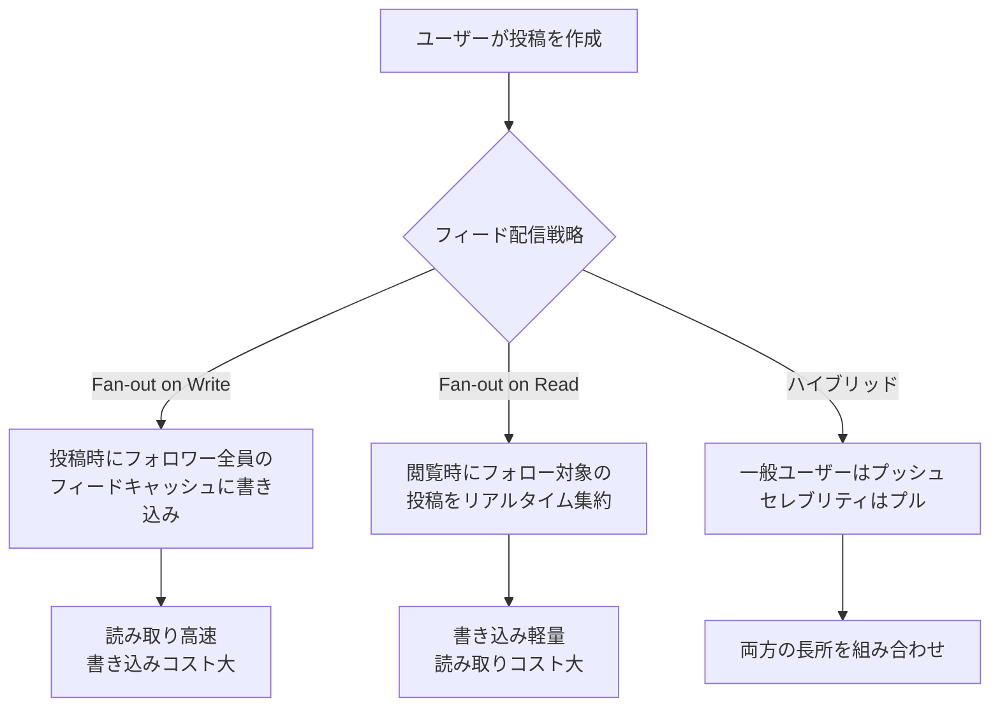
```mermaid
graph TD
    A["ユーザーが投稿を作成"] --> B{"フィード配信戦略"}
    B -->|"Fan-out on Write"| C["投稿時にフォロワー全員の<br/>フィードキャッシュに書き込み"]
    B -->|"Fan-out on Read"| D["閲覧時にフォロー対象の<br/>投稿をリアルタイム集約"]
    B -->|"ハイブリッド"| E["一般ユーザーはプッシュ<br/>セレブリティはプル"]

    C --> F["読み取り高速<br/>書き込みコスト大"]
    D --> G["書き込み軽量<br/>読み取りコスト大"]
    E --> H["両方の長所を組み合わせ"]
```

---

## 2. Fan-out on Write（プッシュモデル）

### 2.1 基本的な仕組み

**Fan-out on Write** は、ユーザーが投稿を作成した時点で、そのユーザーのフォロワー全員のフィードリスト（タイムラインキャッシュ）に投稿 ID を書き込む方式である。「プッシュモデル」とも呼ばれる。

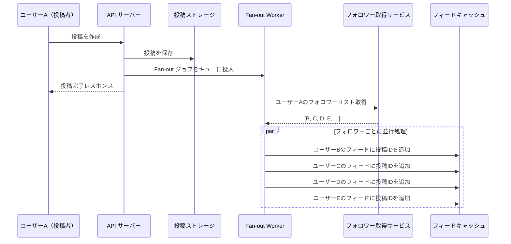
```mermaid
sequenceDiagram
    participant U as ユーザーA（投稿者）
    participant API as API サーバー
    participant PS as 投稿ストレージ
    participant FW as Fan-out Worker
    participant GS as フォロワー取得サービス
    participant FC as フィードキャッシュ

    U->>API: 投稿を作成
    API->>PS: 投稿を保存
    API->>FW: Fan-out ジョブをキューに投入
    API-->>U: 投稿完了レスポンス

    FW->>GS: ユーザーAのフォロワーリスト取得
    GS-->>FW: [B, C, D, E, ...]

    par フォロワーごとに並行処理
        FW->>FC: ユーザーBのフィードに投稿IDを追加
        FW->>FC: ユーザーCのフィードに投稿IDを追加
        FW->>FC: ユーザーDのフィードに投稿IDを追加
        FW->>FC: ユーザーEのフィードに投稿IDを追加
    end
```

この方式では、フィード取得は事前に構築済みのリストを読み取るだけなので、非常に高速である。Redis の Sorted Set や List に投稿 ID を格納し、`ZREVRANGE` や `LRANGE` でページ分のデータを取得すれば、O(log N + M) の時間計算量で済む（N はフィード内の総投稿数、M は取得件数）。

### 2.2 実装の流れ

Fan-out on Write の具体的な処理フローを示す。

```python
class FanOutOnWriteService:
    def __init__(self, post_store, follower_service, feed_cache, message_queue):
        self.post_store = post_store
        self.follower_service = follower_service
        self.feed_cache = feed_cache
        self.message_queue = message_queue

    def create_post(self, user_id: str, content: str) -> str:
        # Save the post to persistent storage
        post_id = self.post_store.save(user_id, content, timestamp=now())

        # Enqueue a fan-out job (async, non-blocking)
        self.message_queue.enqueue("fanout", {
            "post_id": post_id,
            "author_id": user_id,
            "timestamp": now(),
        })

        return post_id

    def process_fanout(self, job: dict):
        """Worker process: fan out a post to all followers' feeds."""
        author_id = job["author_id"]
        post_id = job["post_id"]
        timestamp = job["timestamp"]

        # Retrieve all followers of the author
        followers = self.follower_service.get_followers(author_id)

        for follower_id in followers:
            # Append post_id to each follower's feed cache (sorted by timestamp)
            self.feed_cache.add_to_feed(follower_id, post_id, score=timestamp)

            # Trim the feed to keep only the latest N entries
            self.feed_cache.trim_feed(follower_id, max_size=800)

    def get_feed(self, user_id: str, offset: int = 0, limit: int = 20) -> list:
        """Read is simple: just fetch from the pre-built feed cache."""
        post_ids = self.feed_cache.get_feed(user_id, offset, limit)
        return self.post_store.multi_get(post_ids)
```

### 2.3 メリット

- **読み取りが極めて高速**：フィードは事前に構築されているため、取得は単純なキャッシュ読み取りで O(1) に近いレイテンシを実現できる
- **読み取り負荷の均一化**：各ユーザーのフィードは独立したキャッシュエントリであり、ホットスポットが発生しにくい
- **実装がシンプル**：フィード取得ロジックがシンプルなリスト読み取りに帰結する

### 2.4 デメリット

- **書き込み増幅（Write Amplification）**：1 件の投稿がフォロワー数分の書き込みに膨張する。100 万フォロワーを持つユーザーが投稿すると 100 万回の書き込みが発生する
- **フィード更新の遅延**：フォロワー数が多いと、Fan-out 完了までに数秒〜数十秒かかる場合がある
- **ストレージコスト**：全ユーザーのフィードキャッシュを保持するために大量のメモリが必要。3 億ユーザー × 800 エントリ × 8 バイト（投稿 ID）≈ 約 1.9 TB の Redis メモリが最低でも必要
- **非アクティブユーザーへの無駄な書き込み**：ログインしていないユーザーのフィードにも書き込みが行われる

::: warning セレブリティ問題
フォロワーが数千万人いるセレブリティ（例：有名アーティスト、政治家）が投稿すると、Fan-out に数分かかることもある。この間、一部のフォロワーには投稿が見えているが、残りにはまだ見えないという不整合が発生する。これは「Fan-out on Write の最大の弱点」であり、ハイブリッドアプローチが生まれた直接的な理由である。
:::

---

## 3. Fan-out on Read（プルモデル）

### 3.1 基本的な仕組み

**Fan-out on Read** は、フィード取得のリクエストを受けた時点で、ユーザーがフォローしているアカウントの最新投稿をリアルタイムに集約する方式である。「プルモデル」とも呼ばれる。

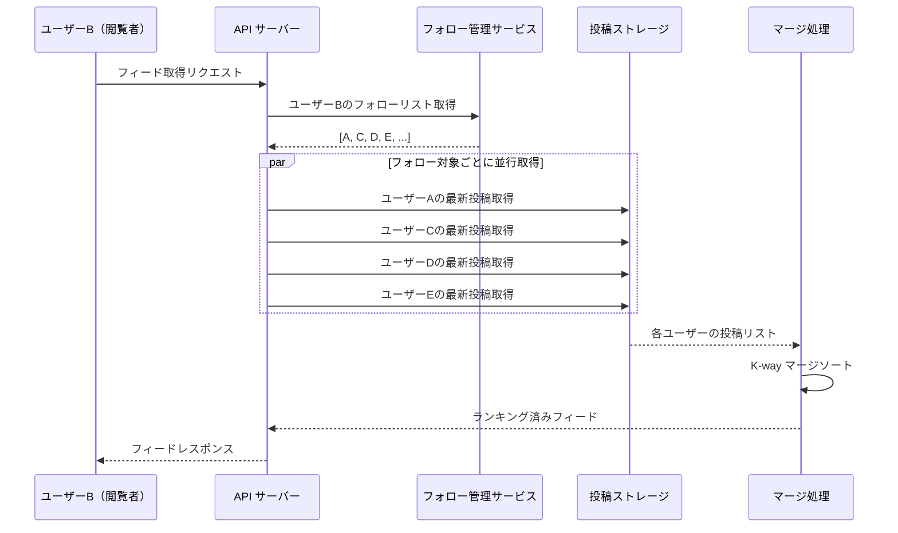
```mermaid
sequenceDiagram
    participant U as ユーザーB（閲覧者）
    participant API as API サーバー
    participant FS as フォロー管理サービス
    participant PS as 投稿ストレージ
    participant M as マージ処理

    U->>API: フィード取得リクエスト
    API->>FS: ユーザーBのフォローリスト取得
    FS-->>API: [A, C, D, E, ...]

    par フォロー対象ごとに並行取得
        API->>PS: ユーザーAの最新投稿取得
        API->>PS: ユーザーCの最新投稿取得
        API->>PS: ユーザーDの最新投稿取得
        API->>PS: ユーザーEの最新投稿取得
    end

    PS-->>M: 各ユーザーの投稿リスト
    M->>M: K-way マージソート
    M-->>API: ランキング済みフィード
    API-->>U: フィードレスポンス
```

投稿時の処理は単純に投稿をストレージに保存するだけで完結し、Fan-out のような非同期バッチ処理は不要である。負荷は読み取り時に集中する。

### 3.2 実装の流れ

```python
class FanOutOnReadService:
    def __init__(self, post_store, follow_service):
        self.post_store = post_store
        self.follow_service = follow_service

    def create_post(self, user_id: str, content: str) -> str:
        # Simply save the post — no fan-out needed
        return self.post_store.save(user_id, content, timestamp=now())

    def get_feed(self, user_id: str, limit: int = 20, cursor: str = None) -> list:
        """
        Build the feed on-the-fly by merging posts from all followed users.
        This is the expensive part.
        """
        # Step 1: Get the list of users this person follows
        following_ids = self.follow_service.get_following(user_id)

        # Step 2: Fetch recent posts from each followed user (parallel I/O)
        candidate_posts = []
        for fid in following_ids:
            posts = self.post_store.get_recent_posts(
                user_id=fid,
                limit=limit,
                before_cursor=cursor,
            )
            candidate_posts.extend(posts)

        # Step 3: K-way merge sort by timestamp (descending)
        candidate_posts.sort(key=lambda p: p.timestamp, reverse=True)

        # Step 4: Return top N
        return candidate_posts[:limit]
```

### 3.3 K-way マージの計算量

フォロー数を F、各ユーザーから取得する投稿数を K とすると、K-way マージソートの計算量は O(FK log F) となる。F = 200、K = 20 の場合、4,000 件の投稿を対象にマージが行われる。計算量自体は問題にならないが、200 件の並行 I/O がボトルネックになり得る。

### 3.4 メリット

- **書き込みが軽量**：投稿の保存のみで完了するため、書き込みレイテンシが極めて低い
- **常に最新のデータ**：フィード取得時にリアルタイムで集約するため、データの鮮度が最も高い
- **ストレージ効率が高い**：フィードキャッシュを保持する必要がないため、メモリ消費が少ない
- **非アクティブユーザーへの無駄がない**：アクティブユーザーのリクエスト時のみ処理が発生する

### 3.5 デメリット

- **読み取りレイテンシが高い**：フォロー数に比例して I/O が増加し、p99 レイテンシが悪化する
- **読み取り負荷が高い**：フィード取得のたびに多数のストレージ読み取りが発生する。DAU 3 億 × 10 回 × 200 フォロー = 1 日 6,000 億回の投稿読み取り
- **ホットスポット**：人気ユーザーの投稿ストレージに読み取りが集中する
- **ランキング処理のコスト**：単純な時系列ならマージソートで済むが、ML ベースのランキングをリアルタイムで適用するのは困難

---

## 4. Fan-out on Write vs Fan-out on Read：比較

両方式の特性を比較表にまとめる。

| 特性 | Fan-out on Write | Fan-out on Read |
|------|-----------------|-----------------|
| **書き込みコスト** | 高い（フォロワー数に比例） | 低い（1 回の保存のみ） |
| **読み取りコスト** | 低い（キャッシュ読み取り） | 高い（フォロー数に比例） |
| **レイテンシ（読み取り）** | 低い（< 10ms） | 高い（50〜500ms） |
| **レイテンシ（書き込み）** | 低い（非同期処理） | 低い |
| **データ鮮度** | 遅延あり（数秒） | リアルタイム |
| **ストレージコスト** | 高い（フィードキャッシュ） | 低い |
| **セレブリティ対応** | 困難 | 自然に対応 |
| **非アクティブユーザー** | 無駄な書き込み | 影響なし |
| **実装複雑度** | 中〜高 | 低〜中 |

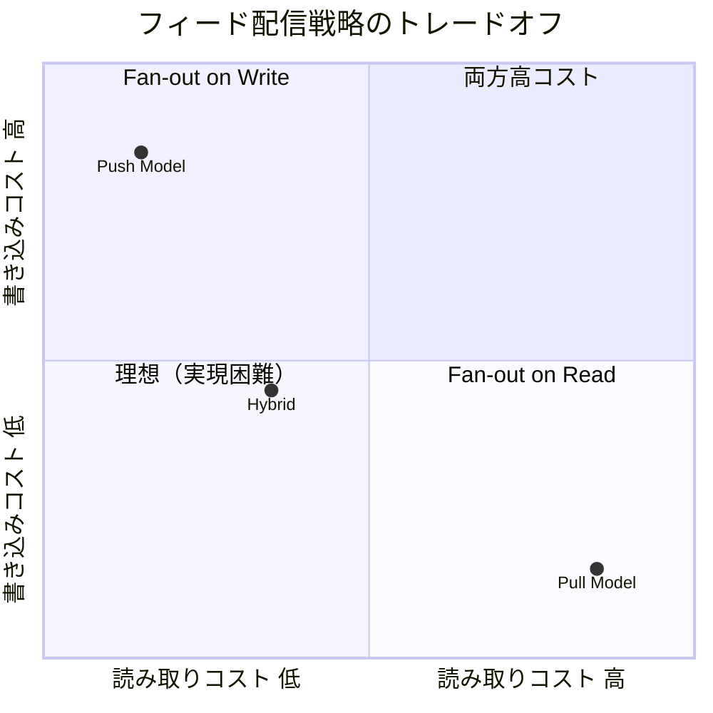
```mermaid
quadrantChart
    title フィード配信戦略のトレードオフ
    x-axis "読み取りコスト 低" --> "読み取りコスト 高"
    y-axis "書き込みコスト 低" --> "書き込みコスト 高"
    quadrant-1 "両方高コスト"
    quadrant-2 "Fan-out on Write"
    quadrant-3 "理想（実現困難）"
    quadrant-4 "Fan-out on Read"
    "Push Model": [0.15, 0.85]
    "Pull Model": [0.85, 0.15]
    "Hybrid": [0.35, 0.45]
```

---

## 5. ハイブリッドアプローチ（Twitter 方式）

### 5.1 誕生の背景

2012 年頃、Twitter のエンジニアリングチームは Fan-out on Write を採用していたが、フォロワーが数千万人いるセレブリティ（例：Lady Gaga、Justin Bieber）の投稿時に Fan-out 処理が深刻なボトルネックになっていた。一方で、Fan-out on Read に全面移行すると、大多数の一般ユーザーのフィード取得レイテンシが悪化する。

この問題を解決するために生まれたのが**ハイブリッドアプローチ**である。ユーザーをフォロワー数に基づいて分類し、それぞれに最適な配信戦略を適用する。

### 5.2 ハイブリッドの仕組み

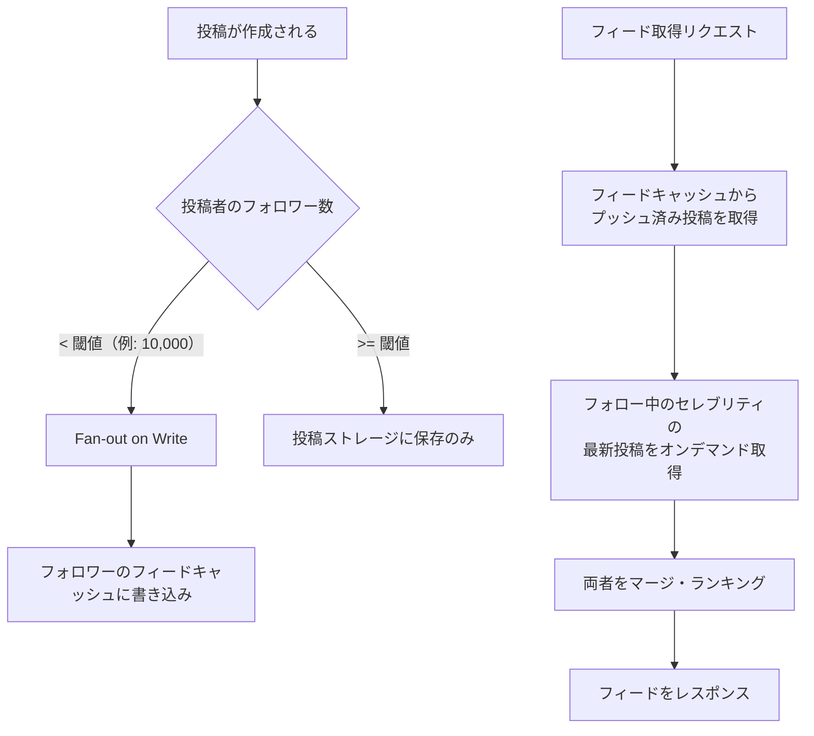
```mermaid
flowchart TD
    A["投稿が作成される"] --> B{"投稿者のフォロワー数"}
    B -->|"< 閾値（例: 10,000）"| C["Fan-out on Write"]
    B -->|">= 閾値"| D["投稿ストレージに保存のみ"]

    C --> E["フォロワーのフィードキャッシュに書き込み"]

    F["フィード取得リクエスト"] --> G["フィードキャッシュから<br/>プッシュ済み投稿を取得"]
    G --> H["フォロー中のセレブリティの<br/>最新投稿をオンデマンド取得"]
    H --> I["両者をマージ・ランキング"]
    I --> J["フィードをレスポンス"]
```

具体的には以下のように動作する。

1. **投稿時**：投稿者のフォロワー数が閾値（例えば 10,000 人）未満であれば、従来通り Fan-out on Write を実行する。閾値以上のセレブリティの投稿は、投稿ストレージに保存するだけで Fan-out は行わない
2. **フィード取得時**：フィードキャッシュからプッシュ済みの投稿 ID リストを取得し、加えてフォローしているセレブリティの最新投稿をオンデマンドで取得する。両者をマージしてランキング・ソートし、最終的なフィードを構築する

### 5.3 実装例

```python
class HybridFeedService:
    CELEBRITY_THRESHOLD = 10_000  # follower count threshold

    def __init__(self, post_store, follower_service, follow_service,
                 feed_cache, message_queue):
        self.post_store = post_store
        self.follower_service = follower_service
        self.follow_service = follow_service
        self.feed_cache = feed_cache
        self.message_queue = message_queue

    def create_post(self, user_id: str, content: str) -> str:
        post_id = self.post_store.save(user_id, content, timestamp=now())

        follower_count = self.follower_service.get_follower_count(user_id)

        if follower_count < self.CELEBRITY_THRESHOLD:
            # Regular user: fan-out on write
            self.message_queue.enqueue("fanout", {
                "post_id": post_id,
                "author_id": user_id,
                "timestamp": now(),
            })
        # Celebrity: no fan-out, post is stored and fetched on-demand

        return post_id

    def get_feed(self, user_id: str, limit: int = 20, cursor: str = None) -> list:
        # Step 1: Get pre-built feed from cache (fan-out on write portion)
        cached_post_ids = self.feed_cache.get_feed(user_id, limit=limit * 2)

        # Step 2: Get list of celebrities this user follows
        following = self.follow_service.get_following(user_id)
        celebrity_ids = [
            uid for uid in following
            if self.follower_service.get_follower_count(uid) >= self.CELEBRITY_THRESHOLD
        ]

        # Step 3: Fetch recent posts from each celebrity (parallel I/O)
        celebrity_posts = []
        for celeb_id in celebrity_ids:
            posts = self.post_store.get_recent_posts(celeb_id, limit=5)
            celebrity_posts.extend(posts)

        # Step 4: Merge both sources
        cached_posts = self.post_store.multi_get(cached_post_ids)
        all_posts = cached_posts + celebrity_posts

        # Step 5: Deduplicate, rank, and return
        all_posts = deduplicate(all_posts)
        all_posts.sort(key=lambda p: p.timestamp, reverse=True)
        return all_posts[:limit]
```

### 5.4 閾値の設計

セレブリティとみなすフォロワー数の閾値は、システムの特性に応じて調整する。

- **閾値が低すぎる場合**：Fan-out on Read の対象が多くなり、フィード取得時の I/O が増加する
- **閾値が高すぎる場合**：Fan-out on Write の対象が多くなり、書き込み負荷が増加する
- **実用的な目安**：フォロワー数 5,000〜50,000 の範囲で設定されることが多い

閾値は固定値ではなく、システムの負荷状況に応じて動的に調整するアプローチもある。例えば、Fan-out Worker のキュー深度が閾値を超えた場合に、セレブリティの境界値を下げるといった適応的制御が考えられる。

### 5.5 Twitter における実際の構成

Twitter は 2012〜2013 年頃にハイブリッドアプローチを導入し、その後も継続的に改良を重ねてきた。公開されている情報に基づくと、以下のような構成が知られている。

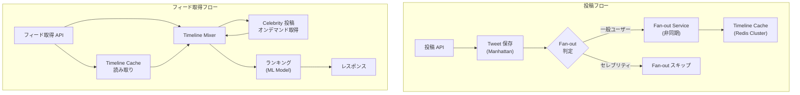
```mermaid
graph TD
    subgraph "投稿フロー"
        P["投稿 API"] --> TP["Tweet 保存<br/>(Manhattan)"]
        TP --> FO{"Fan-out<br/>判定"}
        FO -->|"一般ユーザー"| FOW["Fan-out Service<br/>(非同期)"]
        FO -->|"セレブリティ"| SKIP["Fan-out スキップ"]
        FOW --> TL["Timeline Cache<br/>(Redis Cluster)"]
    end

    subgraph "フィード取得フロー"
        R["フィード取得 API"] --> TC["Timeline Cache<br/>読み取り"]
        R --> MIX["Timeline Mixer"]
        TC --> MIX
        MIX --> CS["Celebrity 投稿<br/>オンデマンド取得"]
        CS --> MIX
        MIX --> RANK["ランキング<br/>(ML Model)"]
        RANK --> RESP["レスポンス"]
    end
```

Twitter では「Timeline Service」がフィードキャッシュの読み書きを担い、「Timeline Mixer」がプッシュ済み投稿とセレブリティ投稿のマージ・ランキングを行う。ストレージには Manhattan（Twitter 内製の分散 KVS）と Redis クラスターが併用されている。

---

## 6. データモデルとストレージ選択

### 6.1 基本エンティティ

タイムラインフィードシステムで必要な主要エンティティを整理する。

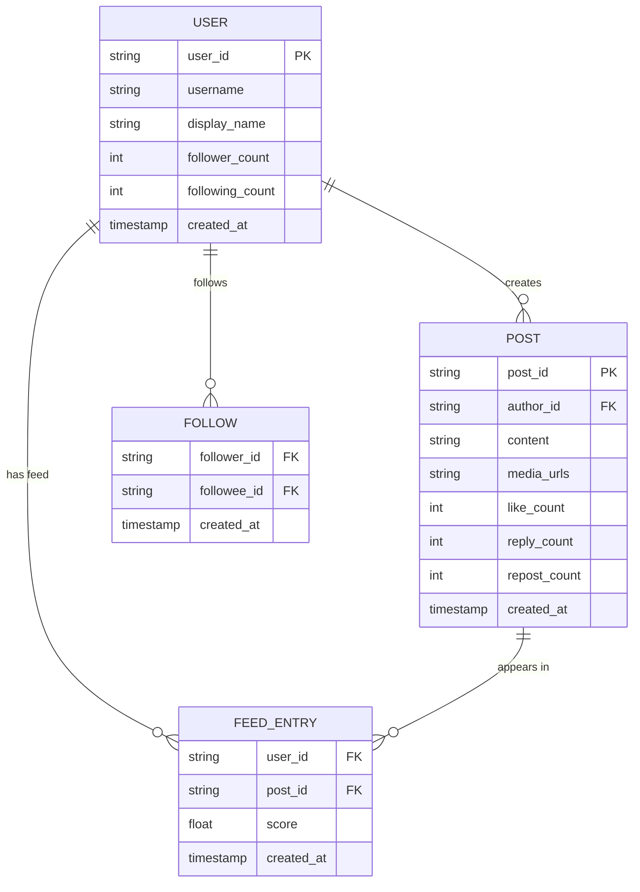
```mermaid
erDiagram
    USER {
        string user_id PK
        string username
        string display_name
        int follower_count
        int following_count
        timestamp created_at
    }

    POST {
        string post_id PK
        string author_id FK
        string content
        string media_urls
        int like_count
        int reply_count
        int repost_count
        timestamp created_at
    }

    FOLLOW {
        string follower_id FK
        string followee_id FK
        timestamp created_at
    }

    FEED_ENTRY {
        string user_id FK
        string post_id FK
        float score
        timestamp created_at
    }

    USER ||--o{ POST : "creates"
    USER ||--o{ FOLLOW : "follows"
    USER ||--o{ FEED_ENTRY : "has feed"
    POST ||--o{ FEED_ENTRY : "appears in"
```

### 6.2 ストレージの選択肢

各エンティティの特性に応じて、適切なストレージを選択する。

#### 投稿ストレージ

投稿データは書き込み頻度が高く、投稿 ID による点参照と著者 ID による範囲検索の両方が必要である。

| ストレージ | 特徴 | 適性 |
|-----------|------|------|
| **MySQL / PostgreSQL** | ACID 保証、SQL によるクエリ柔軟性 | 中規模まで適切。シャーディングが必要になると運用が複雑 |
| **Cassandra** | 書き込み性能が高く、水平スケールが容易。パーティションキーによる範囲検索が効率的 | 大規模に適切 |
| **DynamoDB** | マネージド、パーティションキー + ソートキーによる効率的なクエリ | 大規模に適切 |
| **Manhattan（Twitter 内製）** | マルチテナント対応の分散 KVS | Twitter 特有 |

投稿データの格納には、`author_id` をパーティションキー、`created_at`（または Snowflake ID のような時系列 ID）をソートキーとすることで、特定ユーザーの最新投稿を効率的に取得できる。

#### フォロー関係ストレージ

フォロー関係は「ユーザー A がフォローしているユーザー一覧」と「ユーザー B をフォローしているユーザー一覧」の両方向のクエリが必要である。

```
// Followee lookup: "Who does user A follow?"
// Partition key: follower_id, Sort key: followee_id
follow_following: (follower_id, followee_id) -> timestamp

// Follower lookup: "Who follows user B?"
// Partition key: followee_id, Sort key: follower_id
follow_followers: (followee_id, follower_id) -> timestamp
```

両方向の高速検索を実現するために、二つのテーブル（またはインデックス）を持つのが一般的である。Redis の Set を補助的に使い、フォロワー一覧のキャッシュとして活用する場合も多い。

#### フィードキャッシュ

Fan-out on Write で構築されるフィードキャッシュは、低レイテンシの読み書きが最優先であるため、インメモリストレージが使われる。

```
// Redis Sorted Set
// Key: feed:{user_id}
// Member: post_id
// Score: timestamp (or ranking score)

ZADD feed:user123 1709337600 post456
ZADD feed:user123 1709337500 post789

// Retrieve latest 20 posts
ZREVRANGE feed:user123 0 19 WITHSCORES
```

Redis の Sorted Set は、スコアに基づくソート済みデータの挿入・範囲取得・トリミングを O(log N) で実行でき、フィードキャッシュに最適なデータ構造である。

### 6.3 投稿 ID の設計

分散システムにおける投稿 ID の設計は重要なトピックである。フィードの時系列順序を ID だけで判定できると、追加のタイムスタンプカラムを持つ必要がなくなり効率が上がる。

**Snowflake ID** は Twitter が開発した ID 生成方式で、64 ビットの整数値の中にタイムスタンプ、マシン ID、シーケンス番号を埋め込む。

```
|-- 1 bit --|-- 41 bits --|-- 10 bits --|-- 12 bits --|
|  unused   |  timestamp  |  machine ID |  sequence   |
```

- **41 ビットのタイムスタンプ**：ミリ秒精度。約 69 年分の表現が可能
- **10 ビットのマシン ID**：最大 1,024 台のワーカー
- **12 ビットのシーケンス番号**：同一ミリ秒内で最大 4,096 個の ID を生成

Snowflake ID は単調増加するため、ID の大小比較がそのまま時系列順序になる。これにより、フィードキャッシュの Sorted Set のスコアとして投稿 ID 自体を使うことができる。

---

## 7. キャッシュ戦略

### 7.1 多層キャッシュアーキテクチャ

大規模フィードシステムでは、単一のキャッシュ層では不十分であり、複数のキャッシュ層を組み合わせる多層キャッシュアーキテクチャが採用される。

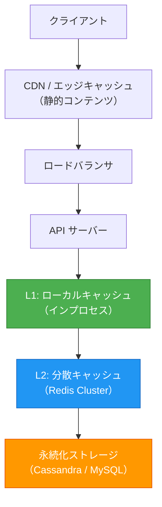
```mermaid
graph TD
    Client["クライアント"] --> CDN["CDN / エッジキャッシュ<br/>（静的コンテンツ）"]
    CDN --> LB["ロードバランサ"]
    LB --> APP["API サーバー"]
    APP --> L1["L1: ローカルキャッシュ<br/>（インプロセス）"]
    L1 --> L2["L2: 分散キャッシュ<br/>（Redis Cluster）"]
    L2 --> DB["永続化ストレージ<br/>（Cassandra / MySQL）"]

    style L1 fill:#4CAF50,stroke:#2E7D32,color:#fff
    style L2 fill:#2196F3,stroke:#1565C0,color:#fff
    style DB fill:#FF9800,stroke:#E65100,color:#fff
```

| キャッシュ層 | 技術例 | 用途 | TTL |
|-------------|--------|------|-----|
| **L1: ローカルキャッシュ** | Caffeine, Guava Cache | 投稿詳細、ユーザープロフィール | 30 秒〜1 分 |
| **L2: 分散キャッシュ** | Redis Cluster, Memcached | フィードキャッシュ、フォロー関係 | 数時間〜数日 |
| **CDN** | CloudFront, Fastly | メディアファイル（画像・動画） | 数時間〜数日 |

### 7.2 フィードキャッシュの設計

フィードキャッシュは Fan-out on Write の中核であり、最も重要なキャッシュ層である。

#### キャッシュの構造

```
feed:{user_id} -> Sorted Set of (post_id, score)
```

各ユーザーのフィードキャッシュには、最新 800〜1,000 件の投稿 ID とスコアが格納される。これ以上古い投稿はキャッシュから削除され、必要に応じて永続化ストレージから再構築される。

#### キャッシュミスへの対応

フィードキャッシュが空の場合（新規ユーザー、長期間ログインしていなかったユーザー）は、Fan-out on Read と同じ方式でフィードを再構築する。

```python
def get_feed_with_fallback(user_id: str, limit: int = 20) -> list:
    # Try cache first
    cached = feed_cache.get_feed(user_id, limit=limit)
    if cached:
        return post_store.multi_get(cached)

    # Cache miss: rebuild from source (fan-out on read)
    following = follow_service.get_following(user_id)
    posts = []
    for fid in following:
        recent = post_store.get_recent_posts(fid, limit=10)
        posts.extend(recent)

    posts.sort(key=lambda p: p.timestamp, reverse=True)
    feed_posts = posts[:800]

    # Warm the cache for subsequent requests
    for p in feed_posts:
        feed_cache.add_to_feed(user_id, p.post_id, score=p.timestamp)

    return feed_posts[:limit]
```

### 7.3 投稿詳細のキャッシュ

フィードキャッシュには投稿 ID のみが格納されるため、投稿の詳細情報（テキスト、メディア URL、いいね数など）は別途取得する必要がある。この投稿詳細の取得を効率化するために、以下のような Look-aside キャッシュ（Cache-aside）パターンが使われる。

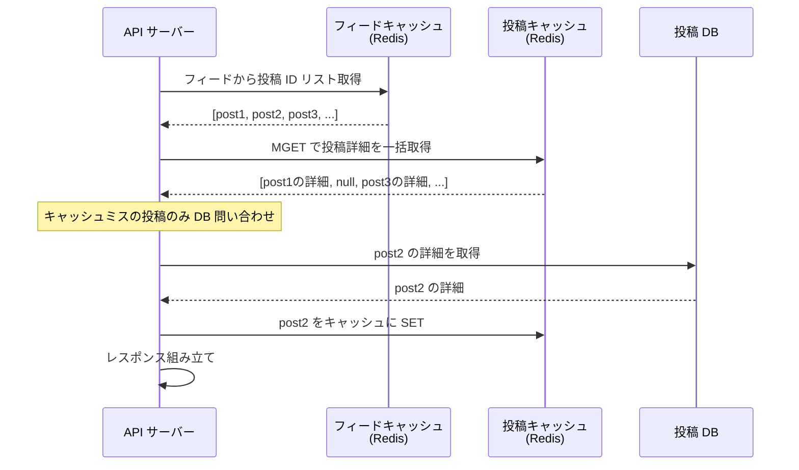
```mermaid
sequenceDiagram
    participant APP as API サーバー
    participant FC as フィードキャッシュ<br/>(Redis)
    participant PC as 投稿キャッシュ<br/>(Redis)
    participant DB as 投稿 DB

    APP->>FC: フィードから投稿 ID リスト取得
    FC-->>APP: [post1, post2, post3, ...]

    APP->>PC: MGET で投稿詳細を一括取得
    PC-->>APP: [post1の詳細, null, post3の詳細, ...]

    Note over APP: キャッシュミスの投稿のみ DB 問い合わせ

    APP->>DB: post2 の詳細を取得
    DB-->>APP: post2 の詳細

    APP->>PC: post2 をキャッシュに SET
    APP->>APP: レスポンス組み立て
```

Redis の `MGET` コマンドを使い、複数の投稿詳細を一括取得することで、キャッシュヒット率を最大化しつつネットワークラウンドトリップを最小化する。

### 7.4 キャッシュの一貫性

投稿が削除された場合やフォロー関係が変更された場合、キャッシュとの一貫性を維持する必要がある。

- **投稿削除**：フィードキャッシュから該当投稿 ID を `ZREM` で削除する。全フォロワーのフィードキャッシュから削除する必要があるが、Fan-out on Write の逆操作（Fan-out Delete）を非同期で実行する
- **フォロー解除**：解除されたユーザーの投稿を閲覧者のフィードキャッシュから除去する。即座に完全除去するのはコストが高いため、フィード取得時にフィルタリングする方式が現実的
- **アカウント凍結**：凍結ユーザーの投稿をフィードから除外する。グローバルなブラックリストを参照してフィード取得時にフィルタリングする

---

## 8. ランキングアルゴリズム

### 8.1 時系列順 vs ランキング順

初期の Twitter や Instagram のフィードは純粋な時系列順（逆時系列順）であった。しかし、フォロー数が増えるにつれて、時系列順では重要な投稿を見逃す確率が高くなる。

2016 年に Instagram、2017 年に Twitter がランキングベースのフィードを導入し、ユーザーにとって「関連性の高い」投稿を上位に表示するようになった。

### 8.2 ランキングの基本アプローチ

ランキングは通常、以下の 2 段階で行われる。

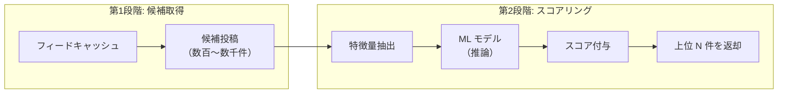
```mermaid
flowchart LR
    subgraph "第1段階: 候補取得"
        A["フィードキャッシュ"] --> B["候補投稿<br/>（数百〜数千件）"]
    end

    subgraph "第2段階: スコアリング"
        B --> C["特徴量抽出"]
        C --> D["ML モデル<br/>（推論）"]
        D --> E["スコア付与"]
        E --> F["上位 N 件を返却"]
    end
```

**第 1 段階（Candidate Generation）**：フィードキャッシュやプル対象から候補投稿を集める。この時点では数百〜数千件の投稿が候補になる。

**第 2 段階（Ranking / Scoring）**：ML モデルを使って各投稿にスコアを付与し、上位 N 件を選択する。

### 8.3 ランキングシグナル

ランキングモデルへの入力となるシグナル（特徴量）は多岐にわたる。

| カテゴリ | シグナル例 |
|---------|-----------|
| **投稿の特徴** | 投稿時刻からの経過時間、メディアの種類（テキスト/画像/動画）、テキストの長さ |
| **エンゲージメント** | いいね数、リプライ数、リツイート数、閲覧数 |
| **著者の特徴** | フォロワー数、投稿頻度、エンゲージメント率 |
| **ユーザーとの関係** | 過去のインタラクション頻度、DM の有無、同一コミュニティ所属 |
| **ユーザーの嗜好** | 過去にいいねした投稿の傾向、滞在時間のパターン |
| **コンテキスト** | 時間帯、デバイス種別、地理的位置 |

### 8.4 スコアリング関数の例

シンプルなスコアリング関数の例を示す。実際のプロダクションでは深層学習モデルが使われるが、基本的な考え方は共通している。

```python
def compute_score(post, user, context) -> float:
    """
    Compute a relevance score for a post in a user's feed.
    Higher score = more relevant = shown higher in the feed.
    """
    # Time decay: recent posts get higher scores
    age_hours = (now() - post.created_at).total_seconds() / 3600
    time_decay = 1.0 / (1.0 + age_hours ** 1.5)

    # Engagement score (normalized)
    engagement = (
        post.like_count * 1.0 +
        post.reply_count * 2.0 +
        post.repost_count * 3.0
    ) / max(post.impression_count, 1)

    # Affinity: how close is the user to the author?
    affinity = compute_affinity(user.user_id, post.author_id)

    # Content type boost
    media_boost = 1.2 if post.has_media else 1.0

    # Weighted combination
    score = (
        0.3 * time_decay +
        0.25 * engagement +
        0.35 * affinity +
        0.1 * media_boost
    )

    return score
```

### 8.5 ランキングの落とし穴

ランキングアルゴリズムにはいくつかの注意すべき課題がある。

- **フィルターバブル（Filter Bubble）**：ユーザーの過去の行動に基づいてランキングすると、似たようなコンテンツばかりが表示され、多様性が失われる。これを緩和するために、一定の割合で探索的なコンテンツ（ユーザーの通常の嗜好とは異なる投稿）を混入させる手法がある
- **エンゲージメントバイアス**：いいね数やリツイート数だけでランキングすると、センセーショナルなコンテンツや炎上系の投稿が優遇される。「健全なエンゲージメント」を定義・計測することが重要になる
- **コールドスタート問題**：新しい投稿はエンゲージメントデータがないため、スコアリングが困難。著者の過去の投稿パフォーマンスやコンテンツの特徴量でブートストラップする
- **レイテンシ制約**：ML モデルの推論は計算コストが高い。p99 で 50ms 以内に推論を完了する必要があり、モデルの軽量化やバッチ推論の最適化が求められる

---

## 9. ページネーションとカーソル

### 9.1 オフセットベース vs カーソルベース

フィードのページネーションには大きく 2 つの方式がある。

#### オフセットベースページネーション

```
GET /api/feed?offset=40&limit=20
```

- **メリット**：実装がシンプル。任意のページにジャンプ可能
- **デメリット**：フィードに新しい投稿が追加されると、同じ投稿が重複表示されたり、一部の投稿がスキップされる

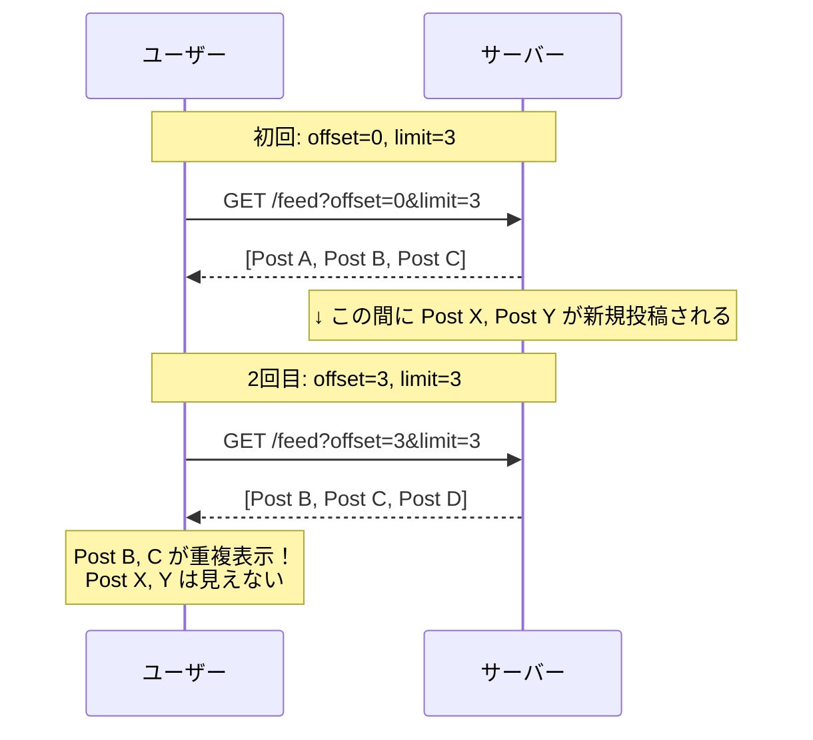
```mermaid
sequenceDiagram
    participant U as ユーザー
    participant S as サーバー

    Note over U,S: 初回: offset=0, limit=3
    U->>S: GET /feed?offset=0&limit=3
    S-->>U: [Post A, Post B, Post C]

    Note over S: ↓ この間に Post X, Post Y が新規投稿される

    Note over U,S: 2回目: offset=3, limit=3
    U->>S: GET /feed?offset=3&limit=3
    S-->>U: [Post B, Post C, Post D]
    Note over U: Post B, C が重複表示！<br/>Post X, Y は見えない
```

#### カーソルベースページネーション

```
GET /api/feed?cursor=eyJwb3N0X2lkIjoiMTIzNDU2In0=&limit=20
```

カーソル（通常は最後に取得した投稿の ID やタイムスタンプを Base64 エンコードしたもの）を使い、「この投稿の次から」というセマンティクスで取得する。

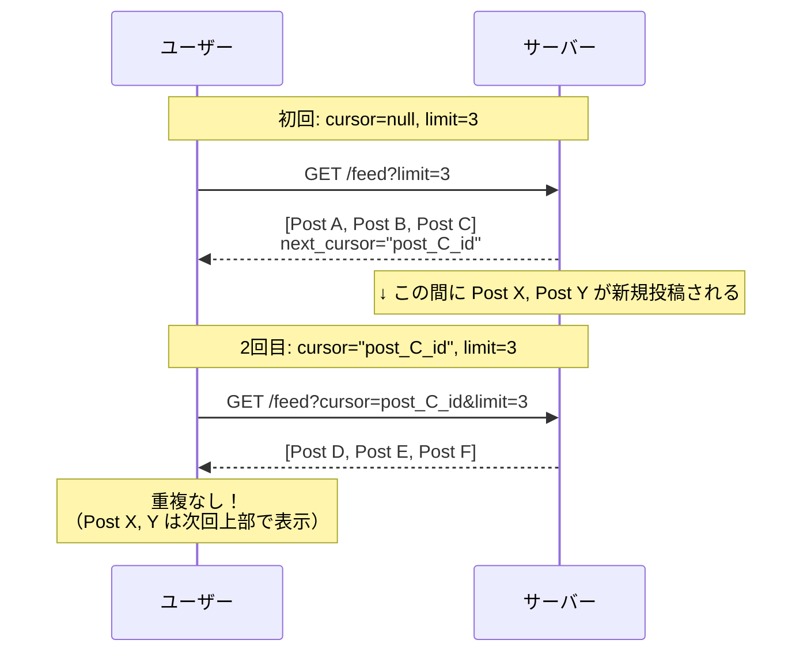
```mermaid
sequenceDiagram
    participant U as ユーザー
    participant S as サーバー

    Note over U,S: 初回: cursor=null, limit=3
    U->>S: GET /feed?limit=3
    S-->>U: [Post A, Post B, Post C]<br/>next_cursor="post_C_id"

    Note over S: ↓ この間に Post X, Post Y が新規投稿される

    Note over U,S: 2回目: cursor="post_C_id", limit=3
    U->>S: GET /feed?cursor=post_C_id&limit=3
    S-->>U: [Post D, Post E, Post F]
    Note over U: 重複なし！<br/>（Post X, Y は次回上部で表示）
```

- **メリット**：投稿の追加・削除があっても重複やスキップが発生しない。フィードのように動的にデータが変化するケースに最適
- **デメリット**：任意のページへのジャンプが困難。カーソルの実装がやや複雑

### 9.2 カーソルの実装

Redis の Sorted Set と組み合わせたカーソルベースページネーションの実装例を示す。

```python
import base64
import json

def encode_cursor(post_id: str, score: float) -> str:
    """Encode pagination state into an opaque cursor string."""
    payload = json.dumps({"post_id": post_id, "score": score})
    return base64.urlsafe_b64encode(payload.encode()).decode()

def decode_cursor(cursor: str) -> dict:
    """Decode cursor string back to pagination state."""
    payload = base64.urlsafe_b64decode(cursor.encode()).decode()
    return json.loads(payload)

def get_feed_page(user_id: str, cursor: str = None, limit: int = 20) -> dict:
    """
    Fetch a page of feed items using cursor-based pagination.
    Uses Redis ZREVRANGEBYSCORE for efficient range queries.
    """
    if cursor:
        state = decode_cursor(cursor)
        max_score = state["score"]
        # Exclude the last seen post by using exclusive range
        # ZREVRANGEBYSCORE key (max min [LIMIT offset count]
        post_ids_with_scores = redis.zrevrangebyscore(
            f"feed:{user_id}",
            f"({max_score}",  # exclusive upper bound
            "-inf",
            start=0,
            num=limit + 1,  # fetch one extra to determine has_next
            withscores=True,
        )
    else:
        post_ids_with_scores = redis.zrevrangebyscore(
            f"feed:{user_id}",
            "+inf",
            "-inf",
            start=0,
            num=limit + 1,
            withscores=True,
        )

    has_next = len(post_ids_with_scores) > limit
    page_items = post_ids_with_scores[:limit]

    # Build next cursor from the last item
    next_cursor = None
    if has_next and page_items:
        last_id, last_score = page_items[-1]
        next_cursor = encode_cursor(last_id, last_score)

    posts = post_store.multi_get([pid for pid, _ in page_items])

    return {
        "posts": posts,
        "next_cursor": next_cursor,
        "has_next": has_next,
    }
```

### 9.3 スコアの衝突への対策

Snowflake ID のようにミリ秒精度のタイムスタンプを埋め込んだ ID をスコアとして使う場合、同一ミリ秒に複数の投稿が存在する可能性がある。Redis の Sorted Set は同一スコアのメンバーをレキシコグラフィカル（辞書式）順序で並べるため、カーソルには投稿 ID も含めて一意性を確保する必要がある。

---

## 10. スケーリングの考慮事項

### 10.1 フィードキャッシュのシャーディング

3 億ユーザーのフィードキャッシュを単一の Redis インスタンスに格納することは不可能である。ユーザー ID に基づくコンシステントハッシングで Redis Cluster にシャーディングする。

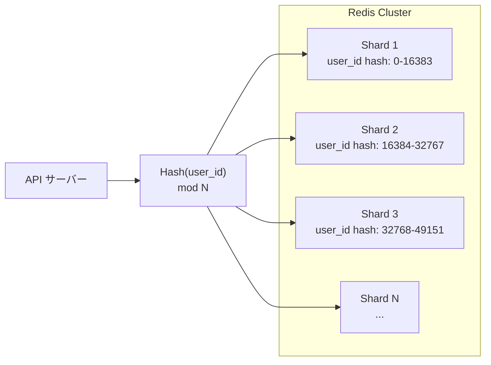
```mermaid
graph LR
    subgraph "Redis Cluster"
        R1["Shard 1<br/>user_id hash: 0-16383"]
        R2["Shard 2<br/>user_id hash: 16384-32767"]
        R3["Shard 3<br/>user_id hash: 32768-49151"]
        RN["Shard N<br/>..."]
    end

    APP["API サーバー"] --> HASH["Hash(user_id)<br/>mod N"]
    HASH --> R1
    HASH --> R2
    HASH --> R3
    HASH --> RN
```

Redis Cluster はハッシュスロット（16,384 スロット）を使ってデータを分散する。フィードキャッシュのキー `feed:{user_id}` はユーザー ID のハッシュ値に基づいて特定のスロットに割り当てられる。

### 10.2 Fan-out Worker のスケーリング

Fan-out Worker は投稿の流量に応じて水平スケールさせる必要がある。メッセージキュー（Kafka、SQS など）を間に挟むことで、投稿 API と Fan-out Worker を疎結合にする。

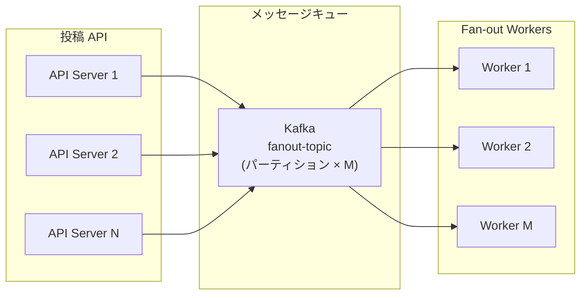
```mermaid
graph LR
    subgraph "投稿 API"
        A1["API Server 1"]
        A2["API Server 2"]
        AN["API Server N"]
    end

    subgraph "メッセージキュー"
        K["Kafka<br/>fanout-topic<br/>(パーティション × M)"]
    end

    subgraph "Fan-out Workers"
        W1["Worker 1"]
        W2["Worker 2"]
        WM["Worker M"]
    end

    A1 --> K
    A2 --> K
    AN --> K
    K --> W1
    K --> W2
    K --> WM
```

Kafka のパーティション数を Worker 数と同数にすることで、各 Worker が専用のパーティションを消費し、並行処理を最大化できる。投稿者のユーザー ID をパーティションキーにすれば、同一ユーザーの投稿が同一パーティションに集約され、順序保証も得られる。

### 10.3 ホットパーティション対策

セレブリティの投稿がファンアウトされる場合、特定の Redis シャードに書き込みが集中するホットパーティション問題が発生し得る。これは、セレブリティのフォロワーが特定のシャードに偏在する場合に顕著になる。

対策としては以下が考えられる。

- **ハイブリッドアプローチの採用**：セレブリティの投稿はそもそも Fan-out しないため、ホットパーティション問題が緩和される
- **書き込みバッファリング**：Fan-out Worker が直接 Redis に書き込むのではなく、ローカルバッファに蓄積してからバッチ書き込みを行う
- **シャード数の十分な確保**：シャード数を十分に多くすることで、ホットスポットの影響を希釈する

### 10.4 地理的分散

グローバルサービスでは、ユーザーに近いリージョンからフィードを提供することでレイテンシを低減する。

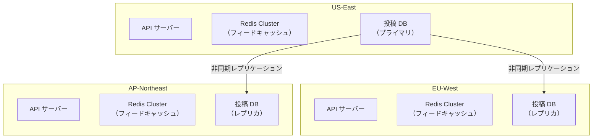
```mermaid
graph TD
    subgraph "US-East"
        US_API["API サーバー"]
        US_CACHE["Redis Cluster<br/>（フィードキャッシュ）"]
        US_DB["投稿 DB<br/>（プライマリ）"]
    end

    subgraph "EU-West"
        EU_API["API サーバー"]
        EU_CACHE["Redis Cluster<br/>（フィードキャッシュ）"]
        EU_DB["投稿 DB<br/>（レプリカ）"]
    end

    subgraph "AP-Northeast"
        AP_API["API サーバー"]
        AP_CACHE["Redis Cluster<br/>（フィードキャッシュ）"]
        AP_DB["投稿 DB<br/>（レプリカ）"]
    end

    US_DB -->|"非同期レプリケーション"| EU_DB
    US_DB -->|"非同期レプリケーション"| AP_DB
```

フィードキャッシュはリージョンごとに独立して構築する。Fan-out Worker も各リージョンに配置し、そのリージョンのユーザーのフィードキャッシュに書き込む。投稿データは非同期レプリケーションで各リージョンに伝搬する。

### 10.5 障害耐性

フィードキャッシュの Redis クラスターが部分的に障害を起こした場合のフォールバック戦略も重要である。

1. **レプリカへのフェイルオーバー**：Redis Sentinel または Redis Cluster の自動フェイルオーバーを有効にする
2. **Fan-out on Read へのフォールバック**：キャッシュが利用不能な場合、一時的に Fan-out on Read モードに切り替える
3. **部分的なフィード提供**：キャッシュから取得できた分だけを返し、不足分は「さらに読み込む」ボタンで補完する
4. **Circuit Breaker**：特定のシャードへのアクセスが連続失敗した場合、一定時間そのシャードへのアクセスを遮断し、フォールバックパスを使う

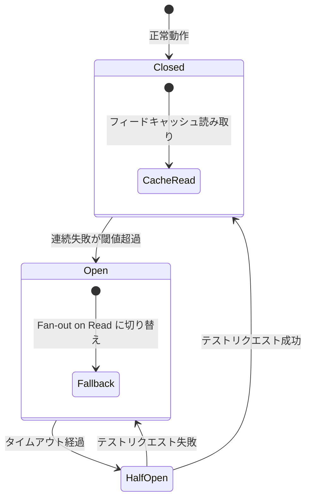
```mermaid
stateDiagram-v2
    [*] --> Closed: 正常動作
    Closed --> Open: 連続失敗が閾値超過
    Open --> HalfOpen: タイムアウト経過
    HalfOpen --> Closed: テストリクエスト成功
    HalfOpen --> Open: テストリクエスト失敗

    state Closed {
        [*] --> CacheRead: フィードキャッシュ読み取り
    }

    state Open {
        [*] --> Fallback: Fan-out on Read に切り替え
    }
```

---

## 11. リアルタイム更新

### 11.1 プッシュ通知 vs ポーリング

フィードに新しい投稿が追加されたことをクライアントに通知する方式は 2 つある。

**ポーリング方式**：クライアントが定期的に（例えば 30 秒ごとに）フィード API を叩いて更新を確認する。実装は簡単だが、無駄なリクエストが多く、リアルタイム性も低い。

**サーバープッシュ方式**：WebSocket や Server-Sent Events（SSE）を使い、サーバー側から新着通知をリアルタイムに配信する。リアルタイム性は高いが、大量の常時接続を維持するインフラが必要になる。

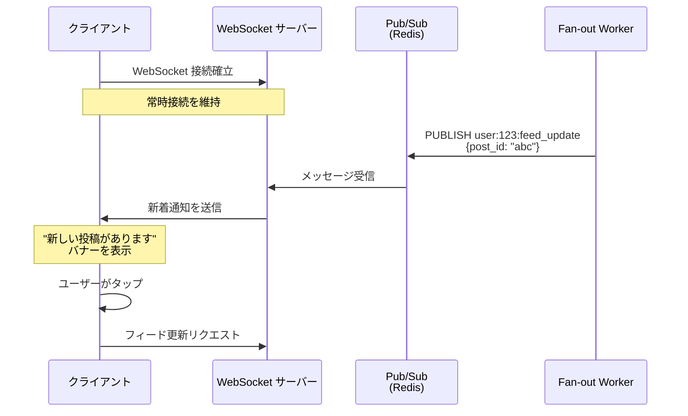
```mermaid
sequenceDiagram
    participant C as クライアント
    participant WS as WebSocket サーバー
    participant PS as Pub/Sub<br/>(Redis)
    participant FW as Fan-out Worker

    C->>WS: WebSocket 接続確立
    Note over C,WS: 常時接続を維持

    FW->>PS: PUBLISH user:123:feed_update<br/>{post_id: "abc"}
    PS->>WS: メッセージ受信
    WS->>C: 新着通知を送信

    Note over C: "新しい投稿があります"<br/>バナーを表示
    C->>C: ユーザーがタップ
    C->>WS: フィード更新リクエスト
```

### 11.2 ハイブリッド通知戦略

実際のプロダクションでは、ポーリングとプッシュのハイブリッドが使われることが多い。

- **アクティブ状態**：WebSocket が接続されている場合はリアルタイムプッシュ
- **バックグラウンド状態**：アプリがバックグラウンドに回った場合はプッシュ通知（APNs / FCM）
- **フォールバック**：WebSocket 接続が切れた場合やプッシュ通知が失敗した場合は、次回アプリ起動時にポーリングで差分取得

---

## 12. 設計のまとめ

### 12.1 アーキテクチャ全体像

これまで解説した各コンポーネントを統合した、大規模タイムラインフィードシステムの全体像を示す。

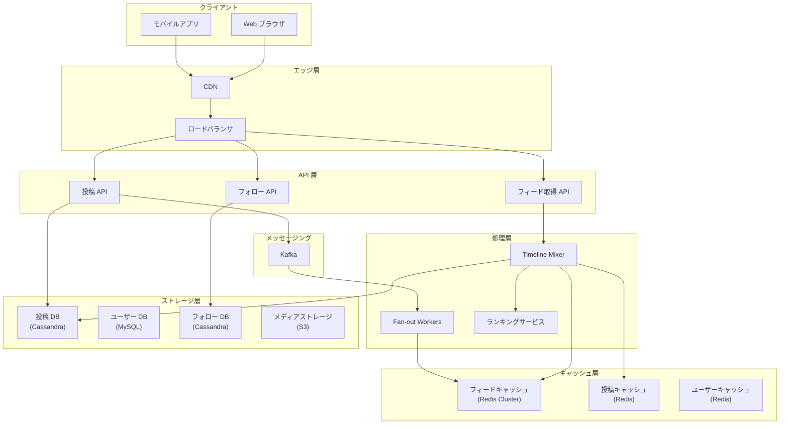
```mermaid
graph TB
    subgraph "クライアント"
        MOB["モバイルアプリ"]
        WEB["Web ブラウザ"]
    end

    subgraph "エッジ層"
        CDN["CDN"]
        LB["ロードバランサ"]
    end

    subgraph "API 層"
        POST_API["投稿 API"]
        FEED_API["フィード取得 API"]
        FOLLOW_API["フォロー API"]
    end

    subgraph "処理層"
        FOW["Fan-out Workers"]
        RANK["ランキングサービス"]
        MIX["Timeline Mixer"]
    end

    subgraph "メッセージング"
        KAFKA["Kafka"]
    end

    subgraph "キャッシュ層"
        FEED_CACHE["フィードキャッシュ<br/>(Redis Cluster)"]
        POST_CACHE["投稿キャッシュ<br/>(Redis)"]
        USER_CACHE["ユーザーキャッシュ<br/>(Redis)"]
    end

    subgraph "ストレージ層"
        POST_DB["投稿 DB<br/>(Cassandra)"]
        USER_DB["ユーザー DB<br/>(MySQL)"]
        FOLLOW_DB["フォロー DB<br/>(Cassandra)"]
        MEDIA["メディアストレージ<br/>(S3)"]
    end

    MOB --> CDN
    WEB --> CDN
    CDN --> LB
    LB --> POST_API
    LB --> FEED_API
    LB --> FOLLOW_API

    POST_API --> POST_DB
    POST_API --> KAFKA
    KAFKA --> FOW
    FOW --> FEED_CACHE

    FEED_API --> MIX
    MIX --> FEED_CACHE
    MIX --> POST_DB
    MIX --> RANK
    MIX --> POST_CACHE

    FOLLOW_API --> FOLLOW_DB
```

### 12.2 設計判断の指針

| 判断ポイント | 小〜中規模サービス | 大規模サービス |
|-------------|-------------------|---------------|
| **フィード配信方式** | Fan-out on Write のみ | ハイブリッド |
| **ストレージ** | PostgreSQL + Redis | Cassandra + Redis Cluster |
| **メッセージキュー** | SQS / RabbitMQ | Kafka |
| **ランキング** | 時系列順 or 簡易スコア | ML ベースランキング |
| **ページネーション** | カーソルベース | カーソルベース |
| **リアルタイム更新** | ポーリング | WebSocket + ポーリング |
| **地理的分散** | 単一リージョン | マルチリージョン |

### 12.3 段階的な進化

フィードシステムは一度に完璧なアーキテクチャを構築するのではなく、トラフィックの増加に応じて段階的に進化させるのが現実的である。

1. **Phase 1（MVP）**：Fan-out on Read + PostgreSQL。シンプルだがスケーラビリティに限界がある
2. **Phase 2（成長期）**：Fan-out on Write + Redis。読み取りレイテンシが劇的に改善される
3. **Phase 3（大規模化）**：ハイブリッドアプローチ + Cassandra + Kafka。セレブリティ問題に対応
4. **Phase 4（成熟期）**：ML ランキング + マルチリージョン + リアルタイムプッシュ。ユーザー体験の最適化

::: tip 設計の原則
「正しいアーキテクチャ」は存在しない。存在するのは「今の規模と制約に適したアーキテクチャ」だけである。小さく始めて、ボトルネックが明確になった時点で、そのボトルネックを解消するためにアーキテクチャを進化させるのが最も合理的なアプローチである。
:::

---

## 13. まとめ

タイムラインフィード設計は、読み取りと書き込みのトレードオフを中心に据えた古典的なシステム設計問題である。

**Fan-out on Write** は読み取りを高速化する代わりに、書き込みコストとストレージコストが増大する。フォロワー数が均一で比較的少ない場合に有効である。

**Fan-out on Read** は書き込みを軽量に保つ代わりに、読み取り時に計算コストが発生する。フォロワー数の分布が極端に偏っている場合（セレブリティの存在）に、書き込みの爆発を回避できる。

**ハイブリッドアプローチ** は両者の長所を組み合わせ、ユーザーの特性に応じて最適な戦略を選択する。Twitter が実証したように、大規模サービスにおいては事実上の標準パターンとなっている。

しかし、フィード配信方式の選択はシステム設計の一側面に過ぎない。キャッシュ戦略、ランキングアルゴリズム、ページネーション、リアルタイム更新、障害耐性、地理的分散など、多岐にわたる設計判断の総体として初めて、実用的なタイムラインフィードシステムが成立する。重要なのは、これらの設計判断を個別ではなく相互の関連性を踏まえて行うことである。
