# タイムアウトとデッドライン伝播

## 1. はじめに：なぜタイムアウトが必要なのか

### 1.1 分散システムにおける「待ち続ける」リスク

分散システムでは、あるサービスが別のサービスにリクエストを送り、レスポンスを待つという処理が日常的に発生する。ここで根本的な問いが生まれる。**もしレスポンスが永遠に返ってこなかったら、どうなるのか。**

タイムアウトを設定していないリクエストは、下流サービスが障害を起こした場合、無期限に待機し続ける。待機中のリクエストはスレッド、コネクション、メモリなどのリソースを占有し続けるため、やがて上流サービス自身もリソースが枯渇して応答不能に陥る。この障害の連鎖がシステム全体に波及するのが**カスケード障害（Cascading Failure）** である。

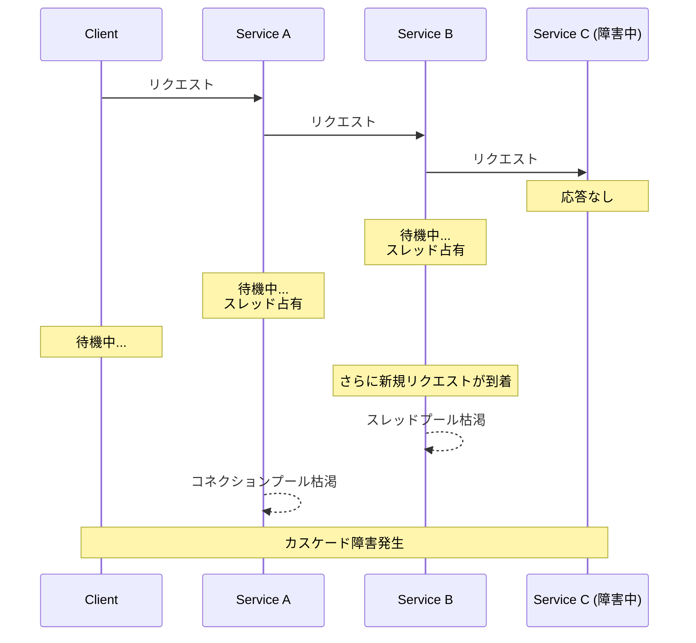

### 1.2 実世界での障害事例

タイムアウト設定の不備が大規模障害を引き起こした事例は数多い。

2012年の AWS ELB（Elastic Load Balancer）障害では、DNS レスポンスの遅延がロードバランサーのコントロールプレーンにおけるタイムアウト不足と重なり、大規模なサービス停止を引き起こした。2015年の Google のグローバル障害では、内部サービス間のタイムアウト設定のミスマッチが原因で、局所的な障害がグローバルに波及した。

これらの事例が示すのは、タイムアウトは「あればよい」というものではなく、**システムのレジリエンスを左右する設計上の核心的な要素** であるということだ。

### 1.3 リソース枯渇のメカニズム

タイムアウトがない（あるいは過度に長い）場合にリソースが枯渇するメカニズムを整理する。

| リソース | 枯渇のメカニズム | 影響 |
|---|---|---|
| **スレッド** | 各リクエストがスレッドを占有し、スレッドプールが満杯になる | 新規リクエストを受け付けられない |
| **コネクション** | TCP コネクションが待機状態のまま保持される | コネクションプールが枯渇し、新たな接続が確立できない |
| **メモリ** | リクエストコンテキスト、バッファが解放されない | OOM（Out of Memory）によるプロセスクラッシュ |
| **ファイルディスクリプタ** | ソケットが閉じられない | `Too many open files` エラー |
| **ゴルーチン（Go）** | 待機中のゴルーチンが蓄積する | メモリ圧迫とスケジューラの性能低下 |

::: warning リソース枯渇は「遅い障害」
リソース枯渇は即座にエラーとして顕在化しない。徐々にレイテンシが増加し、やがて閾値を超えてシステムが崩壊する。この「ゆっくり死んでいく」特性が問題の診断を困難にする。即座に失敗するよりも、遅延しながら劣化する方がはるかに危険である。
:::

## 2. タイムアウトの種類

タイムアウトは一口に言っても、通信のどのフェーズに適用するかによって複数の種類がある。これらを正確に区別しなければ、適切なタイムアウト戦略は設計できない。

### 2.1 コネクションタイムアウト（Connection Timeout）

TCP コネクションの確立（3-way ハンドシェイク）が完了するまでの制限時間である。

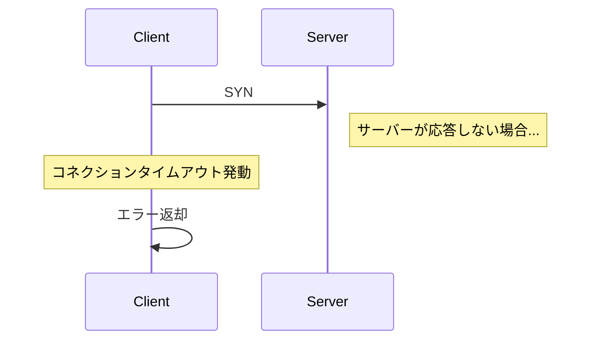

コネクションタイムアウトは通常 **1 秒〜5 秒** の範囲で設定される。TCP の SYN リトライがデフォルトでは OS レベルで数十秒かかるため（Linux のデフォルトは `tcp_syn_retries=6` で約 127 秒）、アプリケーションレベルで明示的に短いタイムアウトを設定しなければならない。

コネクションが確立できないということは、相手サーバーが到達不能であるか、ネットワーク障害が発生していることを意味するため、長時間待機する意味はほとんどない。

### 2.2 リードタイムアウト（Read Timeout / Response Timeout）

コネクション確立後、リクエストを送信してからレスポンスの最初のバイト（あるいは全体）を受け取るまでの制限時間である。

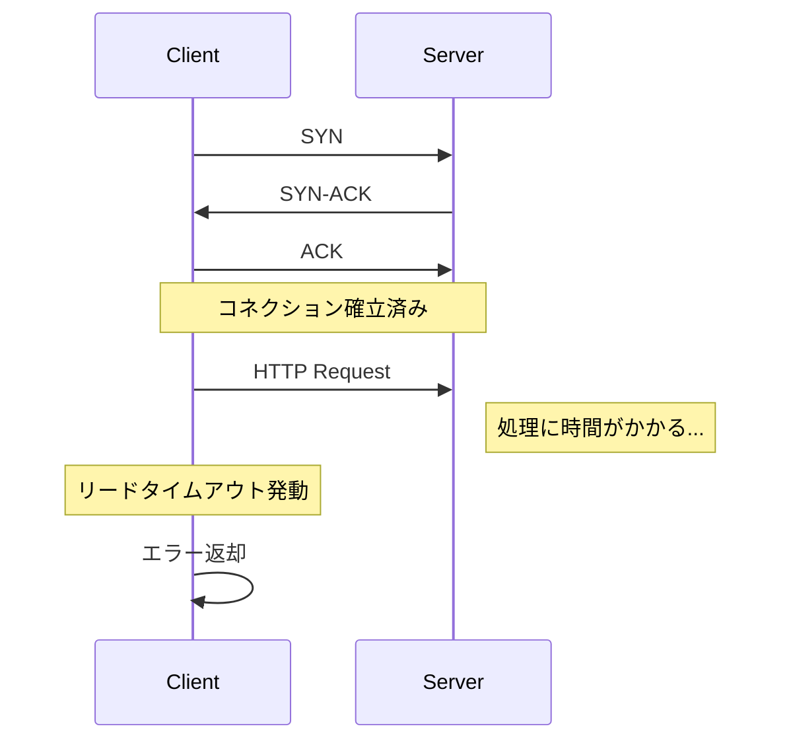

リードタイムアウトは、下流サービスの処理時間に依存するため、コネクションタイムアウトよりも長く設定するのが一般的である。ただし、「どの程度の遅延ならユーザーが許容できるか」というビジネス要件から逆算して決定すべきである。

::: tip TTFB と全体レスポンス
リードタイムアウトには、最初のバイトが届くまでの時間（Time To First Byte, TTFB）と、レスポンス全体を受信するまでの時間の 2 種類がある。ストリーミングレスポンスの場合、これらを区別することが重要になる。
:::

### 2.3 ライトタイムアウト（Write Timeout）

リクエストボディの送信が完了するまでの制限時間である。ファイルアップロードのような大きなリクエストボディを送信する場合に特に重要になる。多くの HTTP クライアントライブラリではリードタイムアウトとは独立して設定できる。

### 2.4 アイドルタイムアウト（Idle Timeout / Keep-Alive Timeout）

コネクションが確立されているが、データの送受信が行われていない状態が続いた場合にコネクションを切断するまでの制限時間である。HTTP Keep-Alive のコネクション維持や、コネクションプールにおける idle コネクションの管理に使用される。

### 2.5 全体タイムアウト（Total / End-to-End Timeout）

リクエストの開始からレスポンスの受信完了まで、すべてのフェーズを包含する制限時間である。コネクション確立、リクエスト送信、サーバー処理、レスポンス受信のすべてが含まれる。

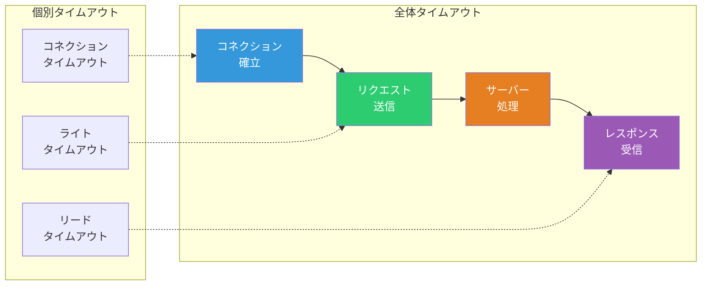

::: warning 個別タイムアウトだけでは不十分
コネクションタイムアウトとリードタイムアウトを個別に設定していても、リトライが発生する場合、全体の所要時間は個別タイムアウトの合計を大きく超える可能性がある。全体タイムアウトは、すべてのリトライを含む「このリクエストに許される時間の上限」を定義する。
:::

### 2.6 各タイムアウトの典型的な設定値

| タイムアウトの種類 | 典型的な設定値 | 備考 |
|---|---|---|
| コネクションタイムアウト | 1 〜 5 秒 | ネットワーク遅延＋サーバー負荷を考慮 |
| リードタイムアウト | 5 〜 30 秒 | 下流サービスの処理時間による |
| ライトタイムアウト | 5 〜 30 秒 | リクエストボディのサイズによる |
| アイドルタイムアウト | 60 〜 300 秒 | コネクションプールの効率と整合させる |
| 全体タイムアウト | 10 〜 60 秒 | ユーザー体験の要件から逆算 |

これらの値はあくまで出発点であり、実際のシステムではレイテンシの計測結果に基づいて調整する必要がある。特にリードタイムアウトは、対象サービスの p99 レイテンシを基準にマージンを加えて設定するのが一般的なプラクティスである。

## 3. デッドライン伝播の仕組み

### 3.1 デッドライン伝播とは何か

タイムアウトには「相対的な待機時間」を指定する方式と、「絶対的な期限（デッドライン）」を指定する方式がある。**デッドライン伝播（Deadline Propagation）** とは、リクエストの処理期限をサービス間で伝播させ、呼び出しチェーン全体で一貫した時間制約を維持する設計手法である。

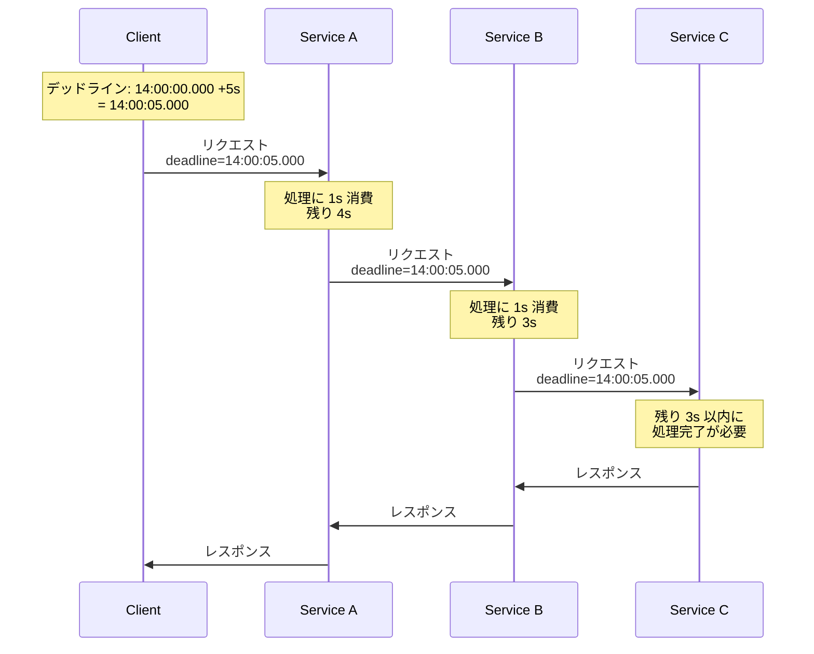

タイムアウト（相対時間）とデッドライン（絶対時間）の違いは以下の通りである。

| 項目 | タイムアウト | デッドライン |
|---|---|---|
| 表現 | 相対時間（例：5 秒後） | 絶対時間（例：14:00:05.000 UTC） |
| 伝播時 | 各サービスで自身の処理時間を差し引いて再計算が必要 | そのまま伝播できる |
| 時刻同期 | 不要 | NTP などで時刻同期が必要 |
| 精度 | サービス間のネットワーク遅延が累積しにくい | 時刻のずれが直接影響する |

### 3.2 タイムアウトだけでは不十分な理由

各サービスが独立してタイムアウトを設定する場合、以下のような問題が発生する。

**タイムアウトの不整合（Timeout Mismatch）**

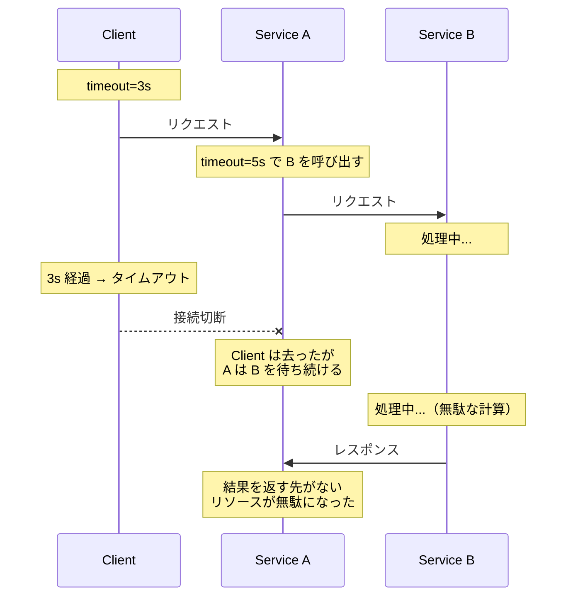

この例では、Client のタイムアウト（3 秒）よりも Service A が Service B に設定するタイムアウト（5 秒）の方が長い。Client が 3 秒でタイムアウトした後も、Service A は Service B のレスポンスを待ち続け、Service B は不要な計算を続けている。すべての処理が無駄である。

デッドライン伝播を用いれば、Service A は「Client のデッドラインまで残り何秒あるか」を知ることができ、自身の下流への呼び出しにも適切な制限時間を設定できる。

### 3.3 gRPC のデッドライン伝播

gRPC はデッドライン伝播をプロトコルレベルでネイティブにサポートしている。これは gRPC の設計哲学の中核をなす機能であり、Google 社内での大規模分散システム運用の経験から生まれたものである。

gRPC では、クライアントがリクエスト時にデッドラインを設定すると、そのデッドラインが HTTP/2 ヘッダー `grpc-timeout` として自動的に下流サービスに伝播される。

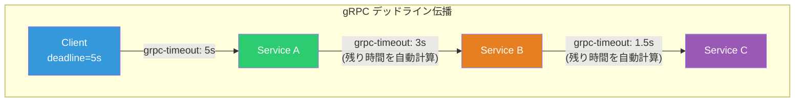

gRPC におけるデッドラインの設定と利用の流れは以下の通りである。

1. **クライアント**がデッドライン（あるいはタイムアウト）を設定する
2. gRPC フレームワークがデッドラインを `grpc-timeout` ヘッダーに変換して送信する
3. **サーバー**側の gRPC フレームワークがヘッダーからデッドラインを復元し、サーバー側の Context に設定する
4. サーバーがさらに下流の gRPC サービスを呼び出す場合、Context からデッドラインが自動的に伝播される
5. デッドラインを過ぎると、`DEADLINE_EXCEEDED` ステータスが返される

```go
// Client: setting a deadline
ctx, cancel := context.WithTimeout(context.Background(), 5*time.Second)
defer cancel()

// The deadline propagates automatically via gRPC metadata
resp, err := client.GetUser(ctx, &pb.GetUserRequest{UserId: "123"})
if err != nil {
    st, ok := status.FromError(err)
    if ok && st.Code() == codes.DeadlineExceeded {
        // Handle deadline exceeded
        log.Println("request timed out")
    }
    return err
}
```

```go
// Server: checking remaining time before expensive operation
func (s *server) GetUser(ctx context.Context, req *pb.GetUserRequest) (*pb.GetUserResponse, error) {
    // Check if deadline has already been exceeded
    if ctx.Err() == context.DeadlineExceeded {
        return nil, status.Error(codes.DeadlineExceeded, "deadline already exceeded")
    }

    // Check remaining time before starting expensive operation
    deadline, ok := ctx.Deadline()
    if ok {
        remaining := time.Until(deadline)
        if remaining < 100*time.Millisecond {
            // Not enough time to complete the operation
            return nil, status.Error(codes.DeadlineExceeded, "insufficient time remaining")
        }
    }

    // Proceed with the operation, passing ctx to propagate deadline
    user, err := s.db.QueryUser(ctx, req.UserId)
    if err != nil {
        return nil, err
    }

    return &pb.GetUserResponse{User: user}, nil
}
```

::: tip gRPC のデッドライン伝播は「オプトイン」ではなく「デフォルト」
gRPC では、Context にデッドラインが設定されていれば、下流への呼び出し時に自動的に伝播される。開発者が意識的に伝播のコードを書く必要がない点が、REST/HTTP ベースのシステムとの大きな違いである。ただし、最初のデッドライン設定は開発者の責任である。gRPC の公式ドキュメントでは「常にデッドラインを設定すること」が強く推奨されている。
:::

### 3.4 Go の context パッケージによるデッドライン管理

Go 言語の `context` パッケージは、デッドライン伝播の実装基盤として広く利用されている。`context.Context` はリクエストスコープの値、キャンセルシグナル、デッドラインを呼び出しチェーン全体で伝達するための仕組みである。

```go
// Creating contexts with timeout/deadline
func processRequest(w http.ResponseWriter, r *http.Request) {
    // Create a context with 5-second timeout
    ctx, cancel := context.WithTimeout(r.Context(), 5*time.Second)
    defer cancel() // Always call cancel to release resources

    // Or create a context with an absolute deadline
    deadline := time.Now().Add(5 * time.Second)
    ctx, cancel = context.WithDeadline(r.Context(), deadline)
    defer cancel()

    // Pass context to downstream calls
    result, err := callServiceA(ctx)
    if err != nil {
        if ctx.Err() == context.DeadlineExceeded {
            http.Error(w, "request timeout", http.StatusGatewayTimeout)
            return
        }
        http.Error(w, "internal error", http.StatusInternalServerError)
        return
    }

    json.NewEncoder(w).Encode(result)
}
```

`context.WithTimeout` と `context.WithDeadline` の関係は以下の通りである。

```go
// These two are equivalent:
ctx, cancel := context.WithTimeout(parent, 5*time.Second)
ctx, cancel := context.WithDeadline(parent, time.Now().Add(5*time.Second))
```

内部的には `WithTimeout` は `WithDeadline` のラッパーであり、相対時間を絶対時間に変換している。

::: warning cancel() の呼び忘れはリソースリーク
`context.WithTimeout` や `context.WithDeadline` が返す `cancel` 関数は、必ず呼び出さなければならない。呼び忘れるとタイマーが解放されず、ゴルーチンリークの原因になる。Go の慣用句として `defer cancel()` を直後に記述するのが鉄則である。
:::

Context の親子関係を利用すると、タイムアウトのスコープを階層的に管理できる。

```go
func handleRequest(ctx context.Context) error {
    // Overall timeout: 10 seconds
    ctx, cancel := context.WithTimeout(ctx, 10*time.Second)
    defer cancel()

    // Sub-operation 1: at most 3 seconds (but also bounded by parent's 10s)
    ctx1, cancel1 := context.WithTimeout(ctx, 3*time.Second)
    defer cancel1()

    if err := fetchFromCacheOrDB(ctx1); err != nil {
        return err
    }

    // Sub-operation 2: at most 5 seconds (bounded by remaining parent timeout)
    ctx2, cancel2 := context.WithTimeout(ctx, 5*time.Second)
    defer cancel2()

    if err := callExternalAPI(ctx2); err != nil {
        return err
    }

    return nil
}
```

子の Context に設定したタイムアウトは、親の Context のデッドラインを超えることはできない。親のデッドラインが残り 2 秒しかない場合、子に 5 秒のタイムアウトを設定しても、実効的なタイムアウトは 2 秒である。

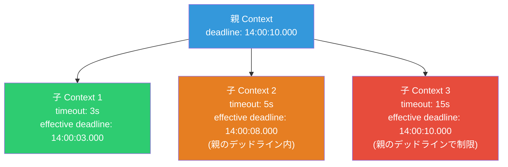

### 3.5 HTTP ベースのシステムでのデッドライン伝播

gRPC と異なり、HTTP/REST ベースのシステムにはデッドライン伝播の標準的なメカニズムがない。そのため、アプリケーションレベルでの実装が必要になる。

一般的なアプローチとして、カスタム HTTP ヘッダーを使用する方法がある。

```go
const DeadlineHeader = "X-Request-Deadline"

// Client middleware: propagate deadline via HTTP header
func propagateDeadline(next http.RoundTripper) http.RoundTripper {
    return roundTripperFunc(func(req *http.Request) (*http.Response, error) {
        if deadline, ok := req.Context().Deadline(); ok {
            // Send deadline as Unix timestamp in milliseconds
            req.Header.Set(DeadlineHeader,
                strconv.FormatInt(deadline.UnixMilli(), 10))
        }
        return next.RoundTrip(req)
    })
}

// Server middleware: extract deadline from HTTP header
func extractDeadline(next http.Handler) http.Handler {
    return http.HandlerFunc(func(w http.ResponseWriter, r *http.Request) {
        if deadlineStr := r.Header.Get(DeadlineHeader); deadlineStr != "" {
            deadlineMs, err := strconv.ParseInt(deadlineStr, 10, 64)
            if err == nil {
                deadline := time.UnixMilli(deadlineMs)
                ctx, cancel := context.WithDeadline(r.Context(), deadline)
                defer cancel()
                r = r.WithContext(ctx)
            }
        }
        next.ServeHTTP(w, r)
    })
}
```

OpenTelemetry の Baggage 機能を利用してデッドラインを伝播する方法もあるが、標準化は進んでいない。サービスメッシュ（Envoy, Istio）を利用する場合、プロキシレベルでタイムアウトを統一的に管理できるが、デッドライン伝播そのものの代替にはならない。

## 4. 分散システムにおけるタイムアウト設計の課題

### 4.1 時刻同期の問題

デッドラインは絶対時刻で表現されるため、サービス間の時刻が同期していることが前提となる。NTP（Network Time Protocol）を使用していても、数ミリ秒から数十ミリ秒のずれは不可避である。

| 時刻同期方式 | 典型的な精度 | 備考 |
|---|---|---|
| NTP | 1 〜 50 ms | インターネット経由の場合 |
| NTP（データセンター内） | 0.1 〜 1 ms | ローカルの NTP サーバー使用 |
| PTP（Precision Time Protocol） | 1 μs 以下 | ハードウェアタイムスタンプ対応 NIC が必要 |
| AWS Time Sync Service | 微秒オーダー | Amazon の時刻同期サービス |
| Google TrueTime | 微秒オーダー + 不確実性の明示 | Spanner で使用 |

一般的なマイクロサービスシステムでは、NTP による数ミリ秒程度の時刻ずれはタイムアウトの精度（秒〜百ミリ秒オーダー）と比較して十分小さいため、実用上の問題にはならないことが多い。ただし、非常に短いタイムアウト（数十ミリ秒以下）を設定する場合には注意が必要である。

### 4.2 タイムアウト予算（Timeout Budget）の概念

複数のサービスを連鎖的に呼び出す場合、各呼び出しにどれだけの時間を配分するかという問題がある。これを**タイムアウト予算（Timeout Budget）** と呼ぶ。

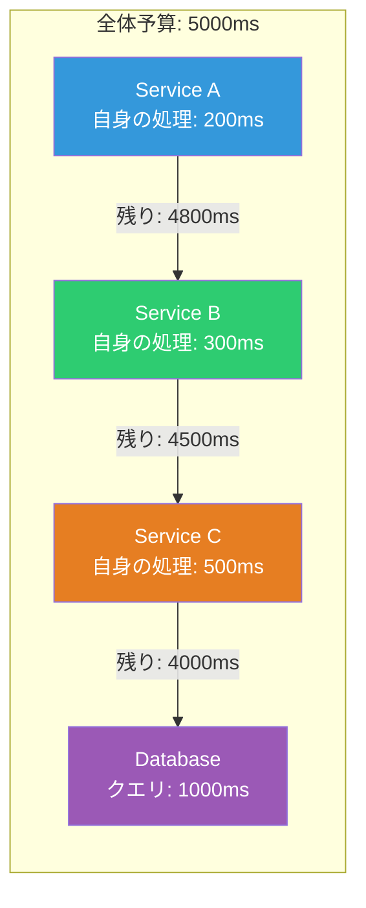

デッドライン伝播を使用している場合、タイムアウト予算の管理は自動的に行われる。各サービスは Context のデッドラインから残り時間を確認し、自身の処理と下流への呼び出しに配分する。

一方、デッドライン伝播がない場合、各サービスが独立してタイムアウトを設定するため、以下の問題が起きやすい。

- **タイムアウトの合計がユーザーの待機時間を超える**: 各サービスが 5 秒のタイムアウトを設定すると、4 段のチェーンでは最大 20 秒待たせる可能性がある
- **不必要な処理の継続**: クライアントがすでにタイムアウトしていても、下流が処理を続ける

### 4.3 並行呼び出しにおけるタイムアウト

サービスが複数の下流サービスを並行して呼び出すケースでは、タイムアウト設計がさらに複雑になる。

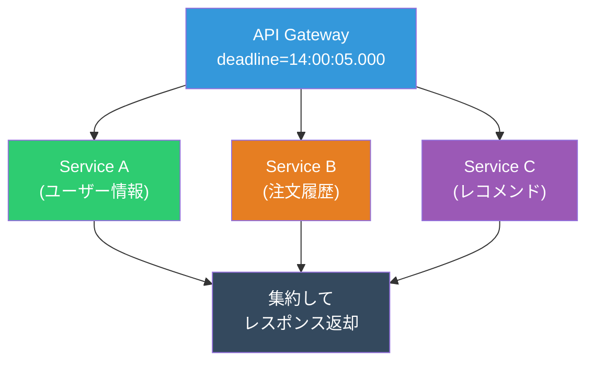

並行呼び出しの場合、以下の戦略がある。

| 戦略 | 説明 | 適用場面 |
|---|---|---|
| **All-or-Nothing** | すべての呼び出しが成功するまで待つ（全体のデッドラインまで） | すべてのデータが必須の場合 |
| **Best-Effort** | デッドラインまでに取得できたデータで応答する | 一部のデータが欠けても許容できる場合 |
| **Critical + Optional** | 必須の呼び出しにのみ待機し、オプショナルな呼び出しにはより短いタイムアウトを設定する | レコメンドなど非必須データがある場合 |

```go
func aggregateData(ctx context.Context, userID string) (*AggregatedResponse, error) {
    // Shared deadline from context
    g, ctx := errgroup.WithContext(ctx)

    var userInfo *UserInfo
    var orderHistory *OrderHistory
    var recommendations *Recommendations

    // Critical: user info (must succeed)
    g.Go(func() error {
        var err error
        userInfo, err = getUserInfo(ctx, userID)
        return err // Failure here cancels all
    })

    // Critical: order history (must succeed)
    g.Go(func() error {
        var err error
        orderHistory, err = getOrderHistory(ctx, userID)
        return err
    })

    // Optional: recommendations (best-effort with shorter timeout)
    g.Go(func() error {
        shortCtx, cancel := context.WithTimeout(ctx, 500*time.Millisecond)
        defer cancel()
        var err error
        recommendations, err = getRecommendations(shortCtx, userID)
        if err != nil {
            // Log but don't fail the overall request
            log.Printf("recommendations unavailable: %v", err)
            recommendations = defaultRecommendations()
            return nil // Swallow the error
        }
        return nil
    })

    if err := g.Wait(); err != nil {
        return nil, err
    }

    return &AggregatedResponse{
        User:            userInfo,
        Orders:          orderHistory,
        Recommendations: recommendations,
    }, nil
}
```

### 4.4 デッドライン超過時の適切な振る舞い

デッドラインを超過した場合、サービスはどのように振る舞うべきか。これは「フェイルファスト（Fail Fast）」の原則に基づく。

```go
func (s *server) ProcessOrder(ctx context.Context, req *pb.OrderRequest) (*pb.OrderResponse, error) {
    // Check deadline before starting expensive operations
    if err := ctx.Err(); err != nil {
        return nil, status.Error(codes.DeadlineExceeded, "deadline exceeded before processing")
    }

    // Check if there's enough time to proceed
    deadline, ok := ctx.Deadline()
    if ok && time.Until(deadline) < s.minProcessingTime {
        return nil, status.Error(codes.DeadlineExceeded, "insufficient time to complete operation")
    }

    // Begin processing, periodically checking context
    order, err := s.validateOrder(ctx, req)
    if err != nil {
        return nil, err
    }

    // Check again before the most expensive step
    if err := ctx.Err(); err != nil {
        return nil, status.Error(codes.DeadlineExceeded, "deadline exceeded during processing")
    }

    // Execute payment (expensive + has side effects)
    result, err := s.executePayment(ctx, order)
    if err != nil {
        return nil, err
    }

    return result, nil
}
```

::: warning 副作用を伴う処理のタイムアウト
支払い処理やデータベースへの書き込みなど、副作用を伴う操作がタイムアウトした場合、「処理が実行されたのか、されなかったのか」が不明確になる。この問題に対処するためには、冪等性キー（Idempotency Key）の導入が不可欠である。タイムアウト＝処理の未実行ではない。タイムアウトは「結果が確認できない」ことを意味するのであって、「処理が行われなかった」ことの保証ではない。
:::

## 5. 実装パターン

### 5.1 Go での包括的なタイムアウト実装

Go では `context` パッケージを中心に、HTTP クライアント、gRPC クライアント、データベースドライバーなど、エコシステム全体がタイムアウトに対応している。

```go
package main

import (
    "context"
    "database/sql"
    "encoding/json"
    "log"
    "net/http"
    "time"
)

// TimeoutConfig holds timeout settings for the service
type TimeoutConfig struct {
    ServerReadTimeout  time.Duration
    ServerWriteTimeout time.Duration
    ServerIdleTimeout  time.Duration
    HTTPClientTimeout  time.Duration
    DBQueryTimeout     time.Duration
}

var defaultConfig = TimeoutConfig{
    ServerReadTimeout:  5 * time.Second,
    ServerWriteTimeout: 10 * time.Second,
    ServerIdleTimeout:  120 * time.Second,
    HTTPClientTimeout:  3 * time.Second,
    DBQueryTimeout:     2 * time.Second,
}

// HTTP server with timeout configuration
func newServer(cfg TimeoutConfig) *http.Server {
    return &http.Server{
        ReadTimeout:  cfg.ServerReadTimeout,
        WriteTimeout: cfg.ServerWriteTimeout,
        IdleTimeout:  cfg.ServerIdleTimeout,
    }
}

// HTTP client with timeout configuration
func newHTTPClient(cfg TimeoutConfig) *http.Client {
    return &http.Client{
        Timeout: cfg.HTTPClientTimeout,
        Transport: &http.Transport{
            // Connection-level timeouts
            DialContext:           (&net.Dialer{Timeout: 1 * time.Second}).DialContext,
            TLSHandshakeTimeout:  1 * time.Second,
            ResponseHeaderTimeout: 2 * time.Second,
            IdleConnTimeout:      90 * time.Second,
        },
    }
}

// Handler demonstrating context-based timeout propagation
func handleGetUser(db *sql.DB, httpClient *http.Client) http.HandlerFunc {
    return func(w http.ResponseWriter, r *http.Request) {
        // Inherit deadline from request context (set by server's WriteTimeout
        // or upstream deadline propagation)
        ctx := r.Context()

        // Query database with context (respects deadline)
        dbCtx, dbCancel := context.WithTimeout(ctx, defaultConfig.DBQueryTimeout)
        defer dbCancel()

        var user User
        err := db.QueryRowContext(dbCtx,
            "SELECT id, name, email FROM users WHERE id = $1",
            r.URL.Query().Get("id"),
        ).Scan(&user.ID, &user.Name, &user.Email)
        if err != nil {
            if dbCtx.Err() == context.DeadlineExceeded {
                http.Error(w, "database query timeout", http.StatusGatewayTimeout)
                return
            }
            http.Error(w, "database error", http.StatusInternalServerError)
            return
        }

        // Call external service with context (respects deadline)
        req, _ := http.NewRequestWithContext(ctx, "GET",
            "https://api.example.com/enrichment?user="+user.ID, nil)
        resp, err := httpClient.Do(req)
        if err != nil {
            if ctx.Err() == context.DeadlineExceeded {
                // Return partial data if external call times out
                log.Printf("enrichment service timeout, returning partial data")
                json.NewEncoder(w).Encode(user)
                return
            }
            http.Error(w, "external service error", http.StatusBadGateway)
            return
        }
        defer resp.Body.Close()

        json.NewEncoder(w).Encode(user)
    }
}
```

### 5.2 gRPC インターセプターによるデッドライン管理

gRPC のインターセプター（ミドルウェア）を使用して、デッドラインに関する横断的な処理を実装できる。

```go
// Unary server interceptor: log remaining deadline and enforce minimum
func deadlineInterceptor(
    ctx context.Context,
    req interface{},
    info *grpc.UnaryServerInfo,
    handler grpc.UnaryHandler,
) (interface{}, error) {
    // Check if deadline is set
    deadline, ok := ctx.Deadline()
    if !ok {
        // No deadline set — optionally enforce a default
        log.Printf("WARNING: no deadline set for %s", info.FullMethod)
        var cancel context.CancelFunc
        ctx, cancel = context.WithTimeout(ctx, 30*time.Second)
        defer cancel()
    } else {
        remaining := time.Until(deadline)
        log.Printf("method=%s remaining=%v", info.FullMethod, remaining)

        // Reject if remaining time is too short
        if remaining < 50*time.Millisecond {
            return nil, status.Errorf(codes.DeadlineExceeded,
                "insufficient time remaining: %v", remaining)
        }
    }

    return handler(ctx, req)
}

// Register the interceptor
func main() {
    server := grpc.NewServer(
        grpc.UnaryInterceptor(deadlineInterceptor),
    )
    // ...
}
```

### 5.3 Node.js / TypeScript での実装例

Node.js では `AbortController` を使用したタイムアウト制御が一般的である。

```typescript
// Timeout utility using AbortController
async function fetchWithTimeout(
  url: string,
  timeoutMs: number,
  options: RequestInit = {}
): Promise<Response> {
  const controller = new AbortController();
  const timeoutId = setTimeout(() => controller.abort(), timeoutMs);

  try {
    const response = await fetch(url, {
      ...options,
      signal: controller.signal,
    });
    return response;
  } catch (error) {
    if (error instanceof DOMException && error.name === "AbortError") {
      throw new TimeoutError(`Request to ${url} timed out after ${timeoutMs}ms`);
    }
    throw error;
  } finally {
    clearTimeout(timeoutId);
  }
}

// Deadline propagation via HTTP headers
class DeadlineContext {
  private deadline: number; // Unix timestamp in ms

  constructor(timeoutMs: number) {
    this.deadline = Date.now() + timeoutMs;
  }

  static fromHeader(header: string | null): DeadlineContext | null {
    if (!header) return null;
    const ctx = new DeadlineContext(0);
    ctx.deadline = parseInt(header, 10);
    return ctx;
  }

  get remainingMs(): number {
    return Math.max(0, this.deadline - Date.now());
  }

  get isExpired(): boolean {
    return this.remainingMs <= 0;
  }

  toHeader(): string {
    return this.deadline.toString();
  }
}

// Express middleware for deadline extraction
function deadlineMiddleware(
  req: Request,
  res: Response,
  next: NextFunction
): void {
  const deadlineHeader = req.headers["x-request-deadline"] as string | undefined;

  if (deadlineHeader) {
    const ctx = DeadlineContext.fromHeader(deadlineHeader);
    if (ctx && ctx.isExpired) {
      res.status(504).json({ error: "Deadline already exceeded" });
      return;
    }
    (req as any).deadlineContext = ctx;
  }

  next();
}
```

## 6. リトライとの組み合わせ

### 6.1 タイムアウトとリトライの相互作用

タイムアウトとリトライは密接に関連しているが、組み合わせ方を誤ると、システムを保護するはずの仕組みがかえって障害を悪化させる。

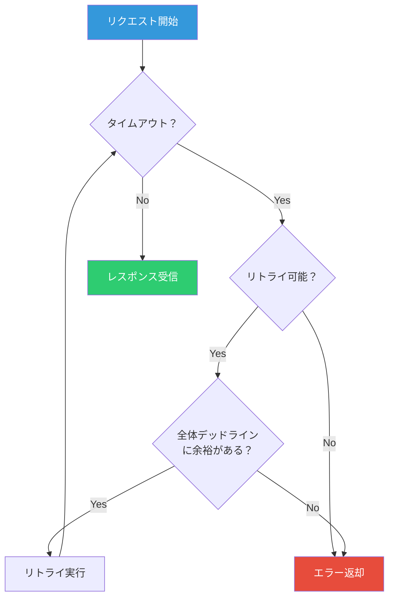

::: danger リトライストーム（Retry Storm）
障害が発生しているサービスに対して、全クライアントが一斉にリトライを行うと、障害サービスへの負荷がさらに増大し、回復がいっそう困難になる。これを**リトライストーム**と呼ぶ。リトライストームは DDoS 攻撃と同じ効果を持ち、自システムで自システムを攻撃する事態となる。
:::

### 6.2 Exponential Backoff

Exponential Backoff は、リトライ間隔を指数関数的に増加させるアルゴリズムである。これにより、障害中のサービスへの負荷を段階的に軽減できる。

基本的な計算式は以下の通りである。

$$
\text{wait\_time} = \min(\text{base\_delay} \times 2^{n}, \text{max\_delay})
$$

ここで $n$ はリトライ回数、$\text{base\_delay}$ は初回のリトライ間隔、$\text{max\_delay}$ はリトライ間隔の上限である。

| リトライ回数 | 待機時間（base=100ms） | 待機時間（base=1s） |
|---|---|---|
| 1 | 100 ms | 1 s |
| 2 | 200 ms | 2 s |
| 3 | 400 ms | 4 s |
| 4 | 800 ms | 8 s |
| 5 | 1600 ms | 16 s |
| 6 | 3200 ms | 32 s（max_delay で制限） |

### 6.3 ジッター（Jitter）

Exponential Backoff だけでは、同時に障害を検知した複数のクライアントが同じタイミングでリトライを送信するという **Thundering Herd 問題** が発生する。ジッター（ランダムな揺らぎ）を加えることで、リトライのタイミングを分散させる。

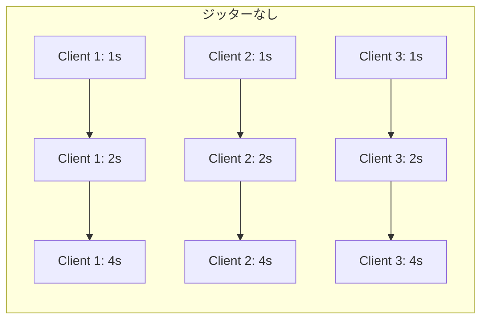

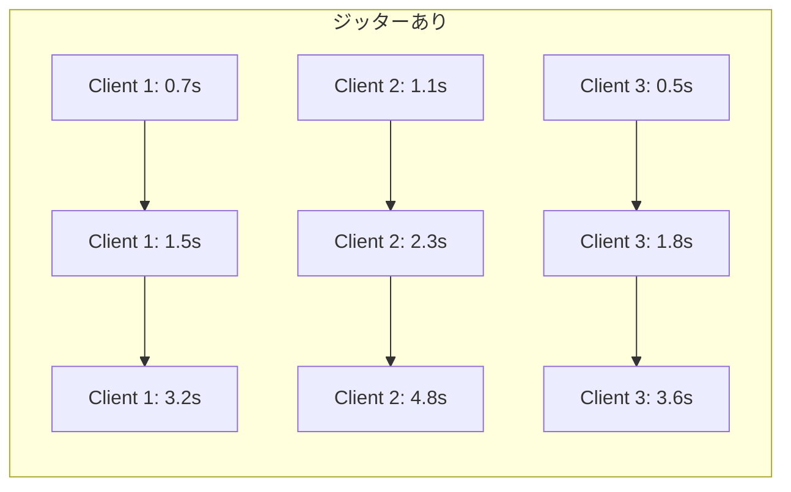

代表的なジッター戦略は以下の 3 つである。

**Full Jitter**

$$
\text{wait\_time} = \text{random}(0, \text{base\_delay} \times 2^{n})
$$

待機時間を 0 から最大値の間で一様にランダム化する。AWS の公式ブログで推奨されている方式であり、リトライの分散効果が最も高い。

**Equal Jitter**

$$
\text{half} = \frac{\text{base\_delay} \times 2^{n}}{2}
$$

$$
\text{wait\_time} = \text{half} + \text{random}(0, \text{half})
$$

最小待機時間を保証しつつ、ランダム性を持たせる。Full Jitter よりも保守的で、最小限の待機時間を確保したい場合に適している。

**Decorrelated Jitter**

$$
\text{wait\_time} = \min(\text{max\_delay}, \text{random}(\text{base\_delay}, \text{prev\_wait} \times 3))
$$

前回の待機時間に基づいてランダム化する。AWS の検証によると、Full Jitter と同等の分散効果がある。

```go
// Retry with exponential backoff and full jitter, respecting deadline
func retryWithBackoff(
    ctx context.Context,
    maxRetries int,
    baseDelay time.Duration,
    maxDelay time.Duration,
    fn func(ctx context.Context) error,
) error {
    var lastErr error

    for attempt := 0; attempt <= maxRetries; attempt++ {
        // Check if deadline is exceeded before attempting
        if err := ctx.Err(); err != nil {
            return fmt.Errorf("context cancelled before attempt %d: %w", attempt, err)
        }

        lastErr = fn(ctx)
        if lastErr == nil {
            return nil // Success
        }

        // Don't wait after the last attempt
        if attempt == maxRetries {
            break
        }

        // Calculate backoff with full jitter
        expDelay := baseDelay * time.Duration(1<<uint(attempt))
        if expDelay > maxDelay {
            expDelay = maxDelay
        }
        jitteredDelay := time.Duration(rand.Int63n(int64(expDelay)))

        // Ensure we don't wait past the deadline
        if deadline, ok := ctx.Deadline(); ok {
            remaining := time.Until(deadline)
            if jitteredDelay >= remaining {
                return fmt.Errorf("insufficient time for retry: %w", lastErr)
            }
        }

        // Wait with context cancellation support
        select {
        case <-time.After(jitteredDelay):
            // Continue to next attempt
        case <-ctx.Done():
            return fmt.Errorf("context cancelled during backoff: %w", ctx.Err())
        }
    }

    return fmt.Errorf("max retries exceeded: %w", lastErr)
}
```

### 6.4 リトライ予算（Retry Budget）

リトライ予算は、一定期間内に許容するリトライの割合を制限する仕組みである。例えば「リトライ率は通常リクエストの 10% 以内」という制約を設ける。

```go
// RetryBudget limits the ratio of retries to total requests
type RetryBudget struct {
    mu          sync.Mutex
    totalCount  int64
    retryCount  int64
    maxRatio    float64
    window      time.Duration
    lastReset   time.Time
}

func NewRetryBudget(maxRatio float64, window time.Duration) *RetryBudget {
    return &RetryBudget{
        maxRatio:  maxRatio,
        window:    window,
        lastReset: time.Now(),
    }
}

func (rb *RetryBudget) CanRetry() bool {
    rb.mu.Lock()
    defer rb.mu.Unlock()

    // Reset counters if window has elapsed
    if time.Since(rb.lastReset) > rb.window {
        rb.totalCount = 0
        rb.retryCount = 0
        rb.lastReset = time.Now()
    }

    if rb.totalCount == 0 {
        return true // Allow first retry
    }

    currentRatio := float64(rb.retryCount) / float64(rb.totalCount)
    return currentRatio < rb.maxRatio
}

func (rb *RetryBudget) RecordRequest() {
    rb.mu.Lock()
    defer rb.mu.Unlock()
    rb.totalCount++
}

func (rb *RetryBudget) RecordRetry() {
    rb.mu.Lock()
    defer rb.mu.Unlock()
    rb.retryCount++
}
```

Envoy プロキシやサービスメッシュでは、リトライ予算がプロキシレベルで設定可能である。これにより、個々のサービスがリトライ予算を独自に実装する必要がなくなる。

### 6.5 リトライの全体タイムアウトとの統合

リトライ戦略は、必ず全体のデッドラインと統合して設計しなければならない。

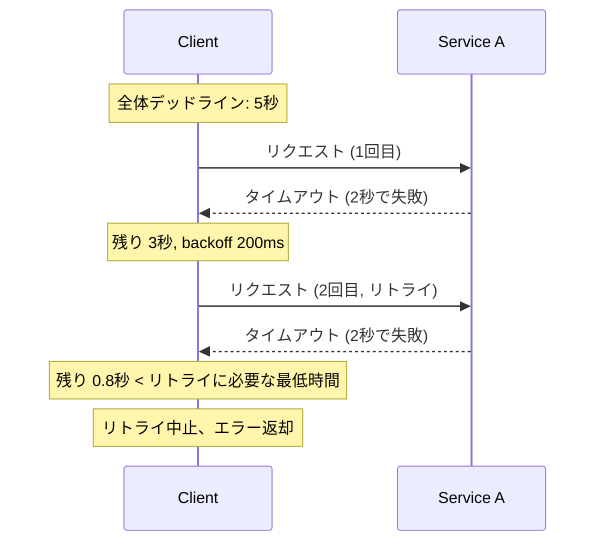

ここで重要なのは、リトライ前に「残り時間で意味のあるリトライが可能か」を判定することである。残り時間がリードタイムアウト未満であれば、リトライしても成功する見込みがないため、即座にエラーを返すべきである。

## 7. ベストプラクティスとアンチパターン

### 7.1 ベストプラクティス

**1. 常にタイムアウトを設定する**

すべてのネットワーク呼び出しにタイムアウトを設定する。これはコネクション確立、リクエスト送信、レスポンス受信のそれぞれに対して行う。「デフォルトのタイムアウトに頼る」のは危険である。多くのライブラリのデフォルトはタイムアウトなし（無期限待機）である。

```go
// BAD: no timeout
resp, err := http.Get("https://api.example.com/data")

// GOOD: explicit timeout via context
ctx, cancel := context.WithTimeout(context.Background(), 3*time.Second)
defer cancel()
req, _ := http.NewRequestWithContext(ctx, "GET", "https://api.example.com/data", nil)
resp, err := http.DefaultClient.Do(req)
```

**2. デッドラインを伝播する**

呼び出しチェーンのエントリーポイントでデッドラインを設定し、下流のすべての呼び出しに伝播させる。gRPC を使用している場合はフレームワークが自動的に行うが、HTTP の場合は明示的な実装が必要である。

**3. 残り時間を確認してからコストの高い処理を開始する**

データベースクエリ、外部 API 呼び出し、ファイル I/O などのコストの高い処理を開始する前に、デッドラインまでの残り時間を確認する。残り時間が処理の最低所要時間を下回っていれば、即座に失敗させる。

**4. メトリクスを収集する**

タイムアウトの発生率、レイテンシの分布（p50, p95, p99）、リトライ率を継続的に監視する。タイムアウト値の設定は、これらのメトリクスに基づいて調整する。

```go
// Prometheus metrics for timeout monitoring
var (
    requestDuration = prometheus.NewHistogramVec(
        prometheus.HistogramOpts{
            Name:    "http_request_duration_seconds",
            Help:    "HTTP request duration in seconds",
            Buckets: prometheus.DefBuckets,
        },
        []string{"method", "endpoint", "status"},
    )
    timeoutTotal = prometheus.NewCounterVec(
        prometheus.CounterOpts{
            Name: "http_request_timeout_total",
            Help: "Total number of timed out requests",
        },
        []string{"method", "endpoint"},
    )
)
```

**5. タイムアウト値は p99 レイテンシを基準に設定する**

下流サービスの p99 レイテンシが 200ms であれば、リードタイムアウトを 500ms〜1s に設定するのが妥当な出発点である。p50 に合わせると正常なリクエストがタイムアウトしすぎ、p999 に合わせると障害検知が遅れる。

**6. 全体タイムアウトとサブタイムアウトの整合性を保つ**

個別のタイムアウト（コネクション、リード）の合計がリトライを含めた全体タイムアウトを超えないようにする。

### 7.2 アンチパターン

**1. タイムアウトを設定しない**

最も基本的で最も危険なアンチパターンである。下流サービスが応答しない場合、リソースが無期限に占有され、カスケード障害を引き起こす。

**2. タイムアウト値が長すぎる**

```
// Anti-pattern: 5-minute timeout
ctx, cancel := context.WithTimeout(ctx, 5*time.Minute)
```

5 分のタイムアウトは、ほとんどの場合「タイムアウトを設定していない」のと同じ効果を持つ。ユーザーはとうに離脱しており、リソースだけが無駄に消費される。

**3. 下流のタイムアウトが上流より長い（Inverted Timeout）**

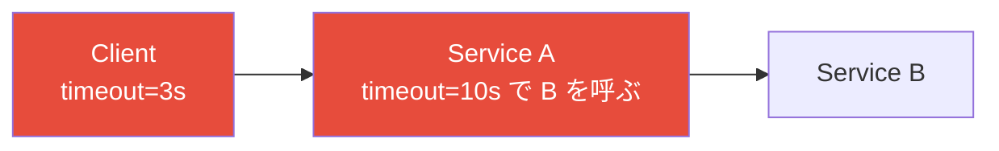

Client が 3 秒でタイムアウトした後も、Service A は 10 秒間 Service B のレスポンスを待ち続ける。これは完全にリソースの浪費である。デッドライン伝播を使用すれば、この問題は自動的に解決される。

**4. 無制限のリトライ**

タイムアウト後にリトライすること自体は正しいが、リトライ回数やリトライ予算に制限を設けないと、リトライストームを引き起こす。

**5. リトライ時にバックオフやジッターを使わない**

即座にリトライを繰り返すと、障害中のサービスに対する負荷が軽減されず、回復を妨げる。

**6. 冪等でない操作をリトライする**

リトライは操作が冪等である場合にのみ安全に行える。非冪等な操作（例えば、注文の作成）をタイムアウト後にリトライすると、重複処理が発生する可能性がある。

::: danger 「タイムアウトしたから処理されていない」は誤り
タイムアウトは「レスポンスを受け取れなかった」ことを意味するだけであり、「サーバー側で処理が実行されなかった」ことの保証ではない。タイムアウト後のリトライは、処理が重複する可能性を常に考慮しなければならない。
:::

**7. Context を伝播しない**

```go
// BAD: context not propagated
func handler(ctx context.Context) {
    // Creates a new context, losing the deadline from the caller
    result, err := db.Query("SELECT ...")
}

// GOOD: context propagated
func handler(ctx context.Context) {
    result, err := db.QueryContext(ctx, "SELECT ...")
}
```

Go の `database/sql` パッケージを含む多くのライブラリは、Context を受け取るバリアントのメソッドを提供している。Context を渡さないメソッドを使うと、上流で設定されたデッドラインが無視される。

### 7.3 設計チェックリスト

タイムアウトとデッドライン伝播の設計が適切かどうかを確認するためのチェックリストを以下に示す。

| # | チェック項目 | 確認ポイント |
|---|---|---|
| 1 | すべてのネットワーク呼び出しにタイムアウトが設定されているか | HTTP クライアント、gRPC クライアント、DB 接続、Redis 接続 |
| 2 | コネクションタイムアウトとリードタイムアウトを別々に設定しているか | 一方だけでは不十分 |
| 3 | 全体タイムアウトが設定されているか | 個別タイムアウト＋リトライの合計が全体を超えないか |
| 4 | デッドラインが下流に伝播されているか | Context が正しく渡されているか |
| 5 | タイムアウト値は実測データに基づいているか | p99 レイテンシ、レイテンシの季節変動 |
| 6 | リトライに Exponential Backoff とジッターが適用されているか | Full Jitter が推奨 |
| 7 | リトライ予算が設定されているか | 通常リクエストの 10〜20% が目安 |
| 8 | 冪等でない操作のリトライに冪等性キーを使用しているか | POST/PUT 操作の安全性 |
| 9 | デッドライン超過時にフェイルファストしているか | 無駄な処理を避けているか |
| 10 | タイムアウト関連のメトリクスを監視しているか | アラートは設定されているか |

## 8. 実運用における考慮事項

### 8.1 サービスメッシュとタイムアウト

Envoy や Istio などのサービスメッシュを使用している場合、プロキシレベルでタイムアウトを設定できる。これはアプリケーションコードを変更せずにタイムアウトポリシーを適用できるという利点がある。

```yaml
# Istio VirtualService example
apiVersion: networking.istio.io/v1beta1
kind: VirtualService
metadata:
  name: user-service
spec:
  hosts:
    - user-service
  http:
    - route:
        - destination:
            host: user-service
      timeout: 3s
      retries:
        attempts: 2
        perTryTimeout: 1s
        retryOn: "5xx,reset,connect-failure,retriable-4xx"
```

ただし、サービスメッシュのタイムアウトとアプリケーションレベルのタイムアウトは共存する。両者の整合性を保つ必要があり、一般的にはサービスメッシュのタイムアウトをアプリケーションのタイムアウトよりわずかに長く設定する。

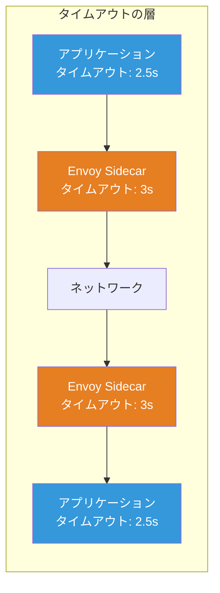

### 8.2 タイムアウトの動的調整

静的なタイムアウト設定ではトラフィックパターンの変化に対応できない場合がある。一部のシステムでは、実際のレイテンシ分布に基づいてタイムアウトを動的に調整する仕組みを導入している。

Netflix の Adaptive Concurrency Limits（適応的同時実行制限）はこのアプローチの一例である。レイテンシの変化をリアルタイムに観測し、同時実行数の上限を動的に調整することで、タイムアウトの設定値を静的に決める必要性を軽減する。

### 8.3 ヘッジドリクエスト（Hedged Requests）

ヘッジドリクエストは、一定時間内にレスポンスが返ってこなかった場合、同じリクエストを別のインスタンスに送信する手法である。最初に返ってきたレスポンスを採用し、残りはキャンセルする。

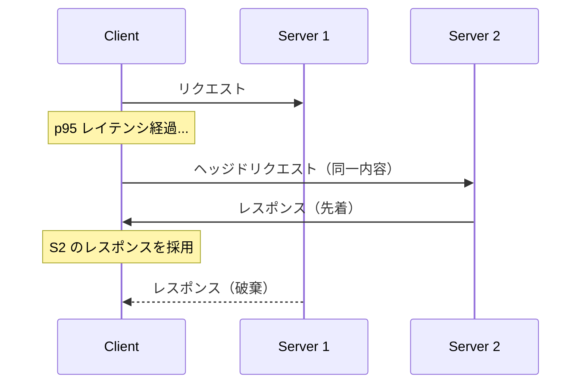

Google の「The Tail at Scale」論文（Jeff Dean, 2013年）で紹介された手法であり、テールレイテンシの削減に効果的である。ただし、リクエストがべき等でなければ適用できず、また追加の負荷が発生するためキャパシティプランニングに影響する。

## 9. まとめ

タイムアウトとデッドライン伝播は、分散システムのレジリエンスを確保するための基盤的な仕組みである。

タイムアウトの本質は**リソースの保護**にある。無期限の待機を許さないことで、1 つの障害がシステム全体に波及するカスケード障害を防ぐ。タイムアウトには複数の種類（コネクション、リード、ライト、アイドル、全体）があり、それぞれ適切に設定する必要がある。

デッドライン伝播は、呼び出しチェーン全体で一貫した時間制約を維持するための仕組みである。gRPC はプロトコルレベルでデッドライン伝播をサポートしており、Go の `context` パッケージはその実装基盤として広く活用されている。HTTP ベースのシステムでは、カスタムヘッダーを使った明示的な実装が必要になる。

リトライとの組み合わせでは、Exponential Backoff とジッター（特に Full Jitter）が不可欠であり、リトライ予算によるリトライストームの防止、全体デッドラインとの統合が重要である。

最も重要なのは、タイムアウトの設定は一度行えば終わりではなく、**継続的なメトリクス監視と調整** が必要だということである。システムのトラフィックパターンや依存サービスの特性は時間とともに変化する。p99 レイテンシの推移を監視し、タイムアウト値を適応的に見直すプロセスを組織に定着させることが、安定したシステム運用の鍵となる。
