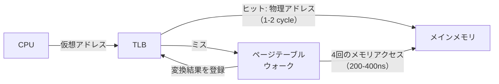
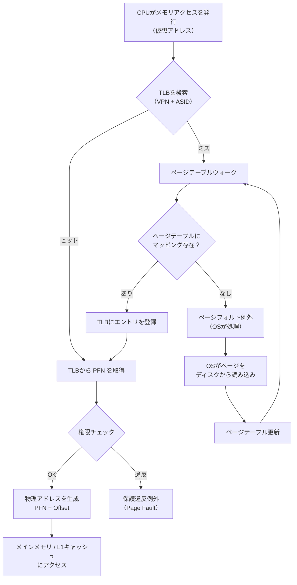
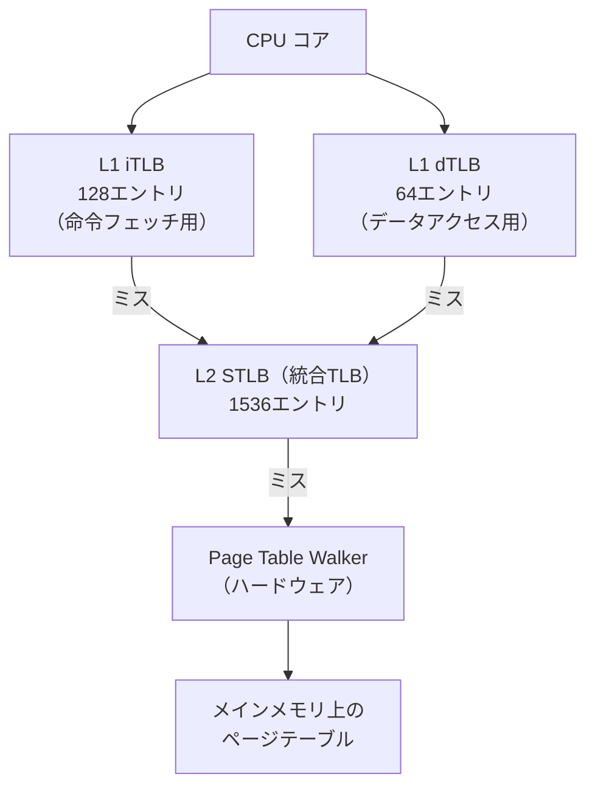
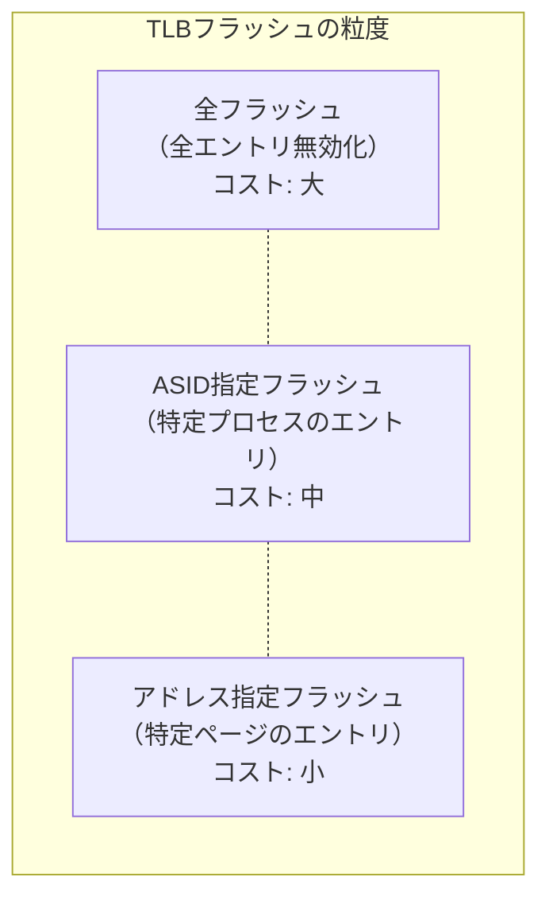
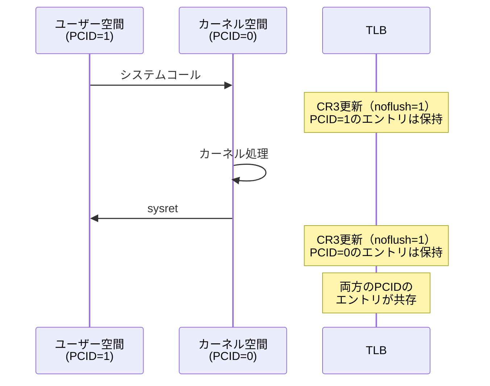
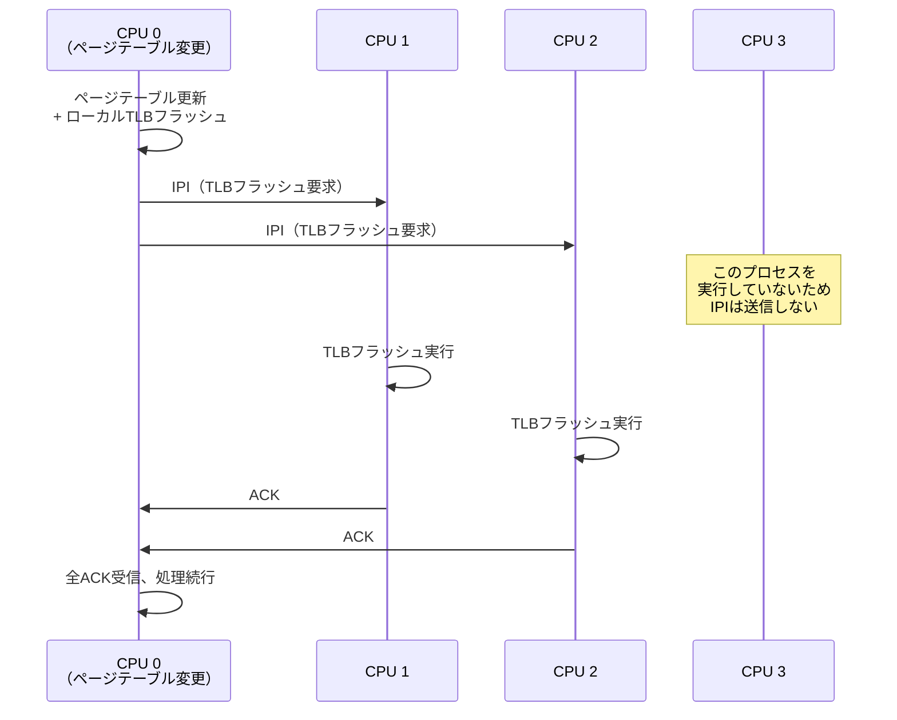
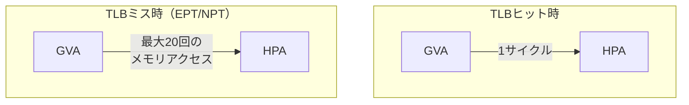

# TLB（Translation Lookaside Buffer）

## 1. 背景と動機 — なぜアドレス変換にキャッシュが必要なのか

### 1.1 仮想メモリの代償

仮想メモリは、プロセスごとに独立したアドレス空間を提供し、メモリ保護や物理メモリを超えるアドレス空間の利用を可能にする、OSにとって不可欠な機構である。しかし、この恩恵にはコストが伴う。CPUがメモリにアクセスするたびに、仮想アドレスから物理アドレスへの**アドレス変換（address translation）**を行わなければならないのである。

現代の多くのシステムでは、このアドレス変換に**マルチレベルページテーブル（multi-level page table）**が使用される。たとえばx86-64アーキテクチャの4レベルページング（PML4 → PDPT → PD → PT）では、1回の仮想アドレス解決に最大**4回のメモリアクセス**が必要となる。5レベルページング（LA57）では5回にも達する。

```
仮想アドレスから物理アドレスへの変換（4レベルページング）:

仮想アドレス: | PML4 Index | PDPT Index | PD Index | PT Index | Offset |
               9 bits       9 bits       9 bits     9 bits     12 bits

変換手順:
  1. CR3レジスタからPML4テーブルのベースアドレスを取得
  2. PML4テーブルから PML4 エントリを読み出す  ← メモリアクセス 1回目
  3. PDPTテーブルから PDPT エントリを読み出す   ← メモリアクセス 2回目
  4. PDテーブルから PD エントリを読み出す        ← メモリアクセス 3回目
  5. PTテーブルから PT エントリを読み出す         ← メモリアクセス 4回目
  6. 物理ページフレーム + Offset → 物理アドレス
```

メインメモリ（DRAM）へのアクセスには約50〜100nsかかるため、4レベルのページテーブルウォークだけで200〜400nsの追加レイテンシが発生する。CPUが1命令あたり0.3ns（3GHz動作時）で処理を行っていることを考えると、すべてのメモリアクセスにこの変換コストが上乗せされるのは壊滅的である。

### 1.2 性能への影響を定量的に考える

仮想メモリを使用しない場合のメモリアクセス時間を$t_{\text{mem}}$とすると、4レベルページテーブルを介したアクセス時間$t_{\text{access}}$は次のようになる。

$$t_{\text{access}} = 4 \times t_{\text{mem}} + t_{\text{mem}} = 5 \times t_{\text{mem}}$$

つまり、実効的なメモリアクセス時間が5倍に増大する。$t_{\text{mem}} = 100\text{ns}$とすると、$t_{\text{access}} = 500\text{ns}$となり、メモリ集約的なワークロードでは性能が1/5以下に低下する。これでは仮想メモリの利便性を享受できない。

### 1.3 解決の方針 — アドレス変換結果のキャッシュ

ここで重要な観察がある。プログラムのメモリアクセスパターンには**局所性（locality）**が存在する。ループ内で同じデータ構造を繰り返しアクセスする場合、参照されるページは限られた数のページに集中する。つまり、同じ仮想ページから物理ページへの変換結果は、短期間に何度も再利用される。

この局所性を利用し、ページテーブルウォークの結果をキャッシュしておけば、毎回4回（あるいは5回）のメモリアクセスを行わずに済む。このキャッシュこそが**TLB（Translation Lookaside Buffer）**である。



TLBは1965年頃のIBM System/360 Model 67で初めて実装されたとされる。仮想メモリの概念自体は1961年のAtlasコンピュータに遡るが、TLBの導入によって仮想メモリのアドレス変換オーバーヘッドが実用的なレベルにまで削減され、仮想メモリが広く普及する礎となった。

## 2. TLBの基本構造

### 2.1 TLBエントリの構成

TLBは、仮想ページ番号（VPN: Virtual Page Number）から物理ページフレーム番号（PFN: Physical Frame Number）への対応関係を格納する小規模な連想メモリ（Content-Addressable Memory, CAM）である。各TLBエントリは以下のフィールドを含む。

| フィールド | 説明 |
|-----------|------|
| VPN（Virtual Page Number） | 仮想アドレスのページ番号部分 |
| PFN（Physical Frame Number） | 対応する物理ページフレーム番号 |
| ASID（Address Space Identifier） | プロセス（アドレス空間）の識別子 |
| Valid | エントリが有効かどうか |
| Dirty | ページが書き換えられたか |
| Permission bits | Read/Write/Execute 権限 |
| Global | 全アドレス空間で共有されるページか（カーネルページ等） |

```
TLBエントリ:
+------+------+------+-------+-------+-------------+--------+
| VPN  | PFN  | ASID | Valid | Dirty | Permissions | Global |
+------+------+------+-------+-------+-------------+--------+
```

### 2.2 TLBの参照フロー

CPUがメモリアクセスを行う際のTLB参照フローは以下のとおりである。



### 2.3 TLBヒット率と実効アクセス時間

TLBの性能を評価する最も重要な指標は**ヒット率（hit rate）**$h$である。TLBヒット時間を$t_{\text{TLB}}$、TLBミス時のページテーブルウォーク時間を$t_{\text{walk}}$、メモリアクセス時間を$t_{\text{mem}}$とすると、実効メモリアクセス時間（Effective Memory Access Time, EMAT）は以下で表される。

$$\text{EMAT} = h \times (t_{\text{TLB}} + t_{\text{mem}}) + (1 - h) \times (t_{\text{TLB}} + t_{\text{walk}} + t_{\text{mem}})$$

ここで$t_{\text{TLB}} \approx 0.5\text{-}1\text{ns}$（1-2クロックサイクル）、$t_{\text{walk}} \approx 200\text{-}400\text{ns}$（4レベルページテーブル）とする。

::: tip TLBヒット率の具体例
TLBのヒット率が99%の場合（$h = 0.99$, $t_{\text{TLB}} = 1\text{ns}$, $t_{\text{walk}} = 200\text{ns}$, $t_{\text{mem}} = 100\text{ns}$）:

$$\text{EMAT} = 0.99 \times (1 + 100) + 0.01 \times (1 + 200 + 100) = 99.99 + 3.01 = 103\text{ns}$$

TLBなしの場合（毎回ページテーブルウォーク）: $500\text{ns}$

TLBの導入により、実効メモリアクセス時間が約$103\text{ns}$と、ほぼTLBなしの1/5にまで短縮される。
:::

一般的なワークロードでは、TLBヒット率は**99%以上**に達することが多い。これは、プログラムの局所性が高く、アクティブに参照されるページ数がTLBのエントリ数以内に収まることが多いためである。

## 3. TLBのハードウェア実装

### 3.1 完全連想型（Fully Associative）

TLBは通常、**完全連想型（fully associative）**のキャッシュとして実装される。完全連想型では、任意のVPNを任意のTLBエントリに格納できるため、キャッシュの競合（conflict miss）が発生しない。

```
完全連想型TLB（エントリ数 N）:
+-------+------+------+-------+
| VPN_0 | PFN  | ASID | Flags |  ← 任意のVPNを格納可能
+-------+------+------+-------+
| VPN_1 | PFN  | ASID | Flags |
+-------+------+------+-------+
| VPN_2 | PFN  | ASID | Flags |
+-------+------+------+-------+
|  ...  |      |      |       |
+-------+------+------+-------+
| VPN_N | PFN  | ASID | Flags |
+-------+------+------+-------+

検索: 入力VPNを全エントリのVPNと同時に比較（CAM）
```

CPUキャッシュ（L1/L2/L3）がセットアソシエイティブ構成を採るのとは対照的である。これは、TLBのエントリ数が比較的少ない（数十〜数千エントリ）ためにCAMによる並列比較のハードウェアコストが許容範囲内であること、そしてTLBミスのペナルティがきわめて大きい（数百サイクル）ため、ミス率を最小化することが最優先であることによる。

::: warning セットアソシエイティブTLB
一部のプロセッサでは、L2 TLBなどの大容量TLBにセットアソシエイティブ構成を採用することがある。完全連想型に比べてハードウェアコストが低く、エントリ数を増やしやすいためである。ただし、競合ミスが発生するリスクがある点は注意が必要である。
:::

### 3.2 TLBの階層構造

現代の高性能プロセッサでは、CPUキャッシュと同様にTLBも多階層構造を採る。以下はIntel SkylakeアーキテクチャにおけるおおよそのTLB構成例である。

| レベル | 種別 | エントリ数 | レイテンシ | 連想度 |
|--------|------|-----------|-----------|--------|
| L1 iTLB | 命令用 | 128 | 1 cycle | 8-way |
| L1 dTLB | データ用 | 64 | 1 cycle | 4-way |
| L2 STLB | 統合（命令+データ） | 1536 | 7-8 cycles | 12-way |



L1 TLBは極めて低レイテンシ（1サイクル）である必要があるため、エントリ数は少なく、命令用（iTLB）とデータ用（dTLB）に分離される。L2 TLBは命令とデータを統合し、より多くのエントリを持つが、レイテンシは数サイクル高くなる。

### 3.3 ハードウェアページテーブルウォーカー

TLBミスが発生した場合、ページテーブルを辿って仮想アドレスから物理アドレスへの変換を行う必要がある。この処理の実装方式には大きく2つのアプローチがある。

**ハードウェア管理TLB（Hardware-managed TLB）**

x86やARMv8などの主流アーキテクチャでは、ページテーブルウォークを専用のハードウェア（Page Table Walker, PTW）が自動的に行う。TLBミスが発生すると、PTWが自動的にページテーブル構造をトラバースし、対応するPTEを見つけてTLBにロードする。OSはページテーブルの構造を適切に管理するだけでよく、TLBミス処理自体に関与しない（ページフォルトの場合を除く）。

**ソフトウェア管理TLB（Software-managed TLB）**

MIPSやSPARCなどの一部のRISCアーキテクチャでは、TLBミスが発生すると**TLBミス例外（TLB miss exception）**が発生し、OS内の**TLBミスハンドラ**がソフトウェアでページテーブルを検索してTLBにエントリを挿入する。

::: code-group
```c [ハードウェア管理TLB（x86の概念）]
// Hardware automatically performs:
// 1. Read PML4 entry from CR3 + PML4_index
// 2. Read PDPT entry
// 3. Read PD entry
// 4. Read PT entry
// 5. Load translation into TLB
// OS only needs to maintain the page table structure
```

```c [ソフトウェア管理TLB（MIPSの概念）]
// TLB miss handler (OS kernel code)
void tlb_miss_handler(void) {
    // Get the faulting virtual address from CP0 BadVAddr register
    unsigned long vaddr = read_cp0_badvaddr();

    // Walk page table in software
    pte_t *pte = page_table_lookup(current->pgd, vaddr);

    if (pte && pte_present(*pte)) {
        // Load translation into TLB using special instruction
        // EntryHi = VPN | ASID
        // EntryLo0 = PFN | flags (even page)
        // EntryLo1 = PFN | flags (odd page)
        write_cp0_entryhi(vaddr & PAGE_MASK | current->asid);
        write_cp0_entrylo0(pte_to_entrylo(pte));
        tlbwr();  // TLB Write Random — write to random TLB entry
    } else {
        // Page fault — invoke OS page fault handler
        do_page_fault(vaddr);
    }
}
```
:::

| 方式 | 利点 | 欠点 | 採用例 |
|------|------|------|--------|
| ハードウェア管理 | 低レイテンシ、OS実装が単純 | ページテーブル形式が固定 | x86, ARM, RISC-V (Sv39/Sv48) |
| ソフトウェア管理 | ページテーブル形式を自由に設計可能 | ミスハンドラのオーバーヘッド | MIPS, SPARC, Alpha |

現代のプロセッサではハードウェア管理方式が主流であり、ページテーブルウォーカーはさらにCPUキャッシュ（L1/L2）を利用してページテーブルエントリを高速に読み出すことで、TLBミスペナルティの削減を図っている。

## 4. TLBの管理とフラッシュ

### 4.1 TLBの一貫性問題

TLBはページテーブルのキャッシュであるため、ページテーブルの内容が変更された場合にTLBの内容が古くなる（stale）可能性がある。以下のような状況でTLBの一貫性が問題となる。

1. **コンテキストスイッチ**: 異なるプロセスに切り替える際、新しいプロセスのアドレス空間のマッピングが異なる
2. **ページテーブル更新**: OSがページテーブルを変更した場合（mmap, munmap, mprotect等）
3. **ページスワップ**: OSがページをディスクに退避し、物理フレームを別の目的に再利用する場合
4. **copy-on-write (CoW)**: fork後にページの権限が変更される場合

### 4.2 TLBフラッシュ（TLB Invalidation）

TLBの古いエントリを無効化する操作を**TLBフラッシュ（TLB flush / TLB invalidation）**という。フラッシュの粒度にはいくつかの段階がある。

**全フラッシュ（Full Flush）**

TLBの全エントリを無効化する。最も単純だがコストが高い。x86ではCR3レジスタに値を書き込む（同じ値を再書き込みする場合も含む）ことでTLB全体がフラッシュされる。

**単一エントリのフラッシュ**

特定の仮想アドレスに対応するTLBエントリのみを無効化する。x86では `INVLPG` 命令が使用される。

**ASIDによるフラッシュ**

特定のASID（アドレス空間識別子）に紐づくエントリのみを無効化する。ARM64では `TLBI ASIDE1` 命令等が使用される。



### 4.3 ASID（Address Space Identifier）

コンテキストスイッチのたびにTLBを全フラッシュすると、スイッチ直後にTLBが空になり、大量のTLBミス（コールドスタートペナルティ）が発生する。この問題を軽減するのが**ASID（Address Space Identifier）**である。

ASIDは各プロセス（アドレス空間）に割り当てられる短い識別子で、TLBエントリに付加される。TLB検索時には、VPNだけでなくASIDも照合条件に含めることで、異なるプロセスのエントリを区別する。

```
ASID付きTLBエントリ:
+------+------+------+-------+
| VPN  | PFN  | ASID | Flags |
+------+------+------+-------+

検索条件: VPN == 要求VPN AND (ASID == 現在のASID OR Global == 1)
```

ASIDを使用すると、コンテキストスイッチ時にTLBをフラッシュする必要がなくなる。新しいプロセスのASIDがTLBエントリのASIDと一致するエントリのみがヒットするため、異なるプロセスのエントリが誤って使用されることはない。

::: details ASIDのビット幅と世代管理
ASIDのビット幅はアーキテクチャによって異なる。

- **x86**: PCIDとして12ビット（$2^{12} = 4096$ 個のASID）
- **ARM64**: 8ビットまたは16ビット（$256$ または $65536$ 個のASID）
- **RISC-V**: 9ビットまたは16ビット

ASIDの個数はプロセス数に対して不足することがある。たとえば8ビットASIDでは256個しか区別できないが、システム上のプロセスが256を超えることは珍しくない。この場合、OSは**ASID世代番号（generation number）**を管理する。ASIDが枯渇すると、世代番号をインクリメントし、TLBを全フラッシュしたうえでASIDの割り当てをリセットする。Linuxカーネルでは `mm_context_t` 構造体にASIDと世代番号が格納される。
:::

### 4.4 PCID（Process-Context Identifier）— x86における実装

x86-64アーキテクチャでは、Intel Haswellマイクロアーキテクチャ（2013年）からASIDに相当する**PCID（Process-Context Identifier）**がサポートされている。PCIDは12ビットの識別子で、CR3レジスタの下位12ビットに格納される。

PCIDが有効な場合、CR3への書き込み時にTLBの全フラッシュを抑制できる。CR3の63ビット目（noflush bit）を1にセットすると、CR3更新時のTLBフラッシュが行われなくなり、異なるPCIDのエントリがTLBに共存できる。

PCIDはSpectreやMeltdownの対策（KPTI: Kernel Page Table Isolation）において特に重要な役割を果たす。KPTIではユーザー空間とカーネル空間で異なるページテーブルを使用するため、システムコールのたびにCR3の切り替えが発生する。PCIDがなければ、この切り替えのたびにTLBが全フラッシュされ、性能が著しく低下する。PCIDを使用することで、ユーザー空間とカーネル空間のTLBエントリを共存させ、フラッシュを回避できる。



### 4.5 マルチプロセッサにおけるTLBシュートダウン

マルチプロセッサ環境では、複数のCPUコアがそれぞれ独立したTLBを持つ。あるコアでページテーブルが変更された場合、同じプロセスのスレッドを実行している他のコアのTLBにも古いエントリが残っている可能性がある。この問題に対処するために**TLBシュートダウン（TLB shootdown）**と呼ばれる仕組みが使用される。

TLBシュートダウンの典型的な流れは以下のとおりである。



1. CPU 0がページテーブルを変更し、自身のTLBをフラッシュする
2. CPU 0が、該当プロセスを実行中の他のCPU（CPU 1, CPU 2）に**IPI（Inter-Processor Interrupt）**を送信する
3. IPI を受信したCPUは、指定されたTLBエントリをフラッシュする
4. フラッシュ完了をACKで通知する
5. CPU 0はすべてのACKを受信してから処理を続行する

TLBシュートダウンは同期的な処理であり、ACKを待つ間に要求元のCPUがブロックされる。コア数が増えるほどオーバーヘッドが大きくなるため、多コアシステムにおけるスケーラビリティの課題となる。

::: warning TLBシュートダウンの性能コスト
TLBシュートダウンのコストは無視できない。IPIの送信・受信に数千サイクル、フラッシュ処理に追加のサイクルが必要であり、大量のmunmapやmprotectを行うワークロードでは大きなオーバーヘッドとなる。Linuxカーネルでは、`flush_tlb_mm_range()` 関数がこの処理を担い、不要なIPIを最小限に抑えるための最適化が施されている。

近年のプロセッサでは、**PCID**と**INVPCID命令**の組み合わせにより、リモートTLBフラッシュの粒度を細かく制御できるようになっている。また、AMD EPYCでは**broadcast TLB invalidation**をハードウェアでサポートし、ソフトウェアIPIのオーバーヘッドを削減する機能も提供されている。
:::

## 5. Huge Pages — TLBカバレッジの拡大

### 5.1 TLBカバレッジの限界

TLBの実効的な性能は、TLBエントリ数だけでなく、TLBが**カバーできるメモリ量（TLB coverage / TLB reach）**に大きく依存する。TLBカバレッジは次のように計算される。

$$\text{TLB Coverage} = \text{TLBエントリ数} \times \text{ページサイズ}$$

たとえば、64エントリのL1 dTLBで4KBページを使用する場合:

$$\text{TLB Coverage} = 64 \times 4\text{KB} = 256\text{KB}$$

しかし、現代のアプリケーションのワーキングセット（アクティブに使用するメモリ量）は数GB〜数十GBに達することがある。データベースのバッファプール、機械学習の学習データ、大規模な配列処理などでは、256KBのカバレッジでは到底足りない。

### 5.2 Huge Pages の仕組み

この問題に対するハードウェア側の解決策が**Huge Pages（ラージページ、スーパーページ）**である。通常の4KBよりも大きなページサイズを使用することで、1つのTLBエントリでカバーできるメモリ量を飛躍的に増大させる。

| ページサイズ | L1 dTLB 64エントリのカバレッジ | L2 STLB 1536エントリのカバレッジ |
|-------------|------|------|
| 4KB（通常ページ） | 256 KB | 6 MB |
| 2MB（Huge Page） | 128 MB | 3 GB |
| 1GB（Giant Page） | 64 GB | 1.5 TB |

x86-64では、2MBと1GBのHuge Pageがサポートされている。2MBページでは、ページテーブルウォークが3レベル（PML4 → PDPT → PD）で済み、1GBページでは2レベル（PML4 → PDPT）で済むため、ミス時のペナルティも軽減される。

```
4KB ページ（4レベル）:
仮想アドレス: | PML4(9) | PDPT(9) | PD(9)  | PT(9)  | Offset(12) |
               ↓         ↓         ↓        ↓
              PML4  →  PDPT  →    PD   →   PT   → 物理フレーム

2MB ページ（3レベル）:
仮想アドレス: | PML4(9) | PDPT(9) | PD(9)  | Offset(21)             |
               ↓         ↓         ↓
              PML4  →  PDPT  →    PD   → 物理フレーム（2MB境界）

1GB ページ（2レベル）:
仮想アドレス: | PML4(9) | PDPT(9) | Offset(30)                        |
               ↓         ↓
              PML4  →  PDPT  → 物理フレーム（1GB境界）
```

### 5.3 LinuxにおけるHuge Pagesの利用

Linuxでは、Huge Pagesを利用する方法として主に2つの仕組みが提供されている。

**1. 明示的Huge Pages（hugetlbfs）**

管理者が事前に確保するHuge Pageプール。アプリケーションは`mmap`のフラグや`hugetlbfs`ファイルシステムを通じて明示的に利用する。

```c
// Allocating huge pages via mmap
#include <sys/mman.h>

void *ptr = mmap(NULL, 2 * 1024 * 1024,  // 2MB
                 PROT_READ | PROT_WRITE,
                 MAP_PRIVATE | MAP_ANONYMOUS | MAP_HUGETLB,
                 -1, 0);
if (ptr == MAP_FAILED) {
    perror("mmap with huge pages failed");
}
```

**2. Transparent Huge Pages（THP）**

カーネルが自動的に4KBページを2MBのHuge Pageに昇格させる仕組み。アプリケーションの変更は不要であり、`madvise` システムコールによるヒントを利用することもできる。

```c
// Using madvise to hint THP usage
#include <sys/mman.h>

void *ptr = mmap(NULL, size,
                 PROT_READ | PROT_WRITE,
                 MAP_PRIVATE | MAP_ANONYMOUS,
                 -1, 0);

// Hint the kernel to use huge pages for this region
madvise(ptr, size, MADV_HUGEPAGE);
```

::: danger THPの落とし穴
Transparent Huge Pagesには以下のような問題が知られている。

- **メモリコンパクション遅延**: 連続した2MBの物理メモリを確保するために、カーネルがメモリコンパクション（ページの移動・再配置）を行うことがあり、これが予測困難なレイテンシスパイクを引き起こす。
- **メモリ消費の増大**: 2MBページの一部しか使用していなくても、2MB分の物理メモリが確保される（内部断片化）。
- **khugepaged デーモン**: バックグラウンドで動作するカーネルスレッドが4KBページの集約を試みるが、このプロセスがCPUリソースを消費する。

このため、データベース（MySQL, PostgreSQL, Redisなど）の多くでは、THPを無効化することが推奨されている。一方、HPC（High Performance Computing）や大規模インメモリ処理では、明示的なHuge Pagesの使用が効果的である。
:::

### 5.4 Huge Pages の効果測定例

Huge Pagesの効果は、TLBミス率の削減として定量的に観測できる。Linuxの `perf` ツールを使用してTLBミスを測定できる。

```bash
# Measure dTLB miss rate
perf stat -e dTLB-loads,dTLB-load-misses,dTLB-stores,dTLB-store-misses ./my_application

# Example output:
#   1,234,567,890   dTLB-loads
#         123,456   dTLB-load-misses     # 0.01% of all dTLB loads
#     456,789,012   dTLB-stores
#          45,678   dTLB-store-misses    # 0.01% of all dTLB stores
```

大規模なメモリを走査するワークロードでは、Huge Pagesの使用によりdTLBミス率が数桁改善し、実行時間が10〜30%短縮されるケースもある。

## 6. TLBと仮想化

### 6.1 二重のアドレス変換

仮想マシン（VM）環境では、アドレス変換が二重に行われる。ゲストOSは**ゲスト仮想アドレス（GVA: Guest Virtual Address）**から**ゲスト物理アドレス（GPA: Guest Physical Address）**への変換を管理し、ハイパーバイザが**GPA**から**ホスト物理アドレス（HPA: Host Physical Address）**への変換を管理する。


TLBなしの場合、GVA → HPA の変換には、ゲストのページテーブルウォーク（最大4回のメモリアクセス）に加え、それぞれのアクセスでGPA → HPAの変換（最大4回のメモリアクセス）が必要となる。最悪の場合、$4 \times 4 + 4 = 20$回ものメモリアクセスが発生する（ゲストの4レベルそれぞれに対してホストの4レベルウォーク、最後にデータアクセスの変換で4回）。正確には、ゲストページテーブルの各レベルを読むためにホスト側の変換が必要となり、さらに最終的な物理ページのアクセスにもホスト側変換が必要なため、合計 $5 \times 4 = 20$ 回のメモリアクセスとなる。

### 6.2 EPT / NPT（Extended / Nested Page Tables）

この問題に対するハードウェア解決策が**EPT（Extended Page Tables, Intel）**および**NPT（Nested Page Tables, AMD）**である。EPT/NPTでは、ハイパーバイザがGPA → HPAの変換テーブルをハードウェアに設定し、ゲストOSのページテーブルウォーク中の各GPA参照を自動的にHPAに変換する。

TLBはGVA → HPA の最終的なマッピングをキャッシュするため、TLBヒット時には二重の変換を完全にスキップできる。仮想化環境ではTLBミスのペナルティが非仮想化環境よりもさらに大きいため、TLBヒット率の重要性が一層高まる。



仮想化環境では、TLBエントリにVPID（Virtual Processor Identifier, Intel）やASID（AMD）が付与され、異なるVMのエントリを区別する。これにより、VM間の切り替え時にTLBをフラッシュする必要がなくなる。

### 6.3 シャドウページテーブル

EPT/NPTが利用できない古いハードウェアでは、ハイパーバイザが**シャドウページテーブル（shadow page table）**を管理する方式が用いられていた。これはGVA → HPAの直接マッピングをハイパーバイザがソフトウェアで構築・維持する方式であり、ゲストOSがページテーブルを更新するたびにハイパーバイザがシャドウページテーブルを同期する必要がある。オーバーヘッドが大きいため、現在ではEPT/NPTが標準的に使用されている。

## 7. TLBに関連するセキュリティの課題

### 7.1 Meltdown攻撃とKPTI

2018年に公表された**Meltdown攻撃**は、投機的実行を悪用してカーネルメモリの内容を非特権プロセスから読み取る攻撃である。Meltdownの対策として導入された**KPTI（Kernel Page Table Isolation）**は、ユーザー空間とカーネル空間で別々のページテーブルを使用する。

KPTIでは、ユーザー空間用のページテーブルにはカーネルメモリのマッピングが含まれない（トランポリンコードなど最小限のエントリのみ）。システムコールや割り込みの発生時にはカーネル用ページテーブルに切り替え、ユーザー空間に戻る際にユーザー用ページテーブルに戻す。

この切り替えはCR3レジスタの書き換えを伴うため、PCIDを使用しなければ毎回TLBが全フラッシュされる。KPTIの性能低下が最大30%と報告された当初のベンチマークは、PCIDが適切に活用されていない環境でのものであった。PCIDを活用することで、KPTI有効時の性能低下は数%以内に抑えられることが確認されている。

### 7.2 TLBサイドチャネル攻撃

TLBはサイドチャネル攻撃のベクトルにもなりうる。攻撃者は、特定の仮想アドレスへのアクセス時間を精密に計測することで、TLBにそのアドレスのエントリが存在するか否かを推測できる（TLBヒットなら高速、ミスなら低速）。これにより、被害者プロセスのメモリアクセスパターンの一部を推測する攻撃（TLB side-channel attacks, TLBleed等）が可能となる。

この種の攻撃への対策として、ハイパースレッディング（SMT）環境でのTLB分離や、セキュリティクリティカルなワークロードでのSMT無効化などが検討されている。

## 8. TLBの性能最適化テクニック

### 8.1 アプリケーション設計における考慮事項

TLBの効率を最大化するために、アプリケーション設計レベルで考慮すべき点がある。

**1. データの局所性を高める**

データ構造を、アクセスパターンに合わせてメモリ上に配置する。構造体の配列（Array of Structures, AoS）と配列の構造体（Structure of Arrays, SoA）の選択は、TLB効率に大きく影響する。

```c
// Array of Structures (AoS) — each particle spans potentially different pages
struct Particle {
    float x, y, z;
    float vx, vy, vz;
    float mass;
    int type;
};
struct Particle particles[1000000];

// Structure of Arrays (SoA) — sequential access within each array
struct ParticleArrays {
    float x[1000000];
    float y[1000000];
    float z[1000000];
    // ...
};
```

位置だけを処理する場合、SoAの方がx座標の配列を連続的にアクセスでき、TLBエントリの再利用効率が高くなる。

**2. Huge Pagesの活用**

前述のとおり、大規模なメモリ領域にはHuge Pagesを使用する。特にデータベースのバッファプール、JVMのヒープ、大規模配列の確保に効果的である。

**3. メモリアクセスパターンの最適化**

ランダムアクセスよりもシーケンシャルアクセスを優先する。行列計算では、行優先（row-major）と列優先（column-major）の違いがTLBミス率に大きく影響する。

```c
// TLB-friendly: row-major access (C layout)
for (int i = 0; i < N; i++)
    for (int j = 0; j < N; j++)
        sum += matrix[i][j];  // sequential in memory

// TLB-unfriendly: column-major access
for (int j = 0; j < N; j++)
    for (int i = 0; i < N; i++)
        sum += matrix[i][j];  // stride = N * sizeof(element)
```

### 8.2 OS設計における最適化

**1. 遅延TLBフラッシュ（Lazy TLB flushing）**

Linuxカーネルでは、カーネルスレッドのようにユーザー空間のアドレスマッピングを使用しないコンテキストに切り替える際、TLBフラッシュを遅延させる。カーネルスレッドは前のプロセスのmm_structを「借用」し、実際にユーザー空間のアドレスを参照しないため、TLBの古いエントリが問題にならない。

**2. バッチTLBフラッシュ**

複数のページテーブル変更を蓄積し、一度にまとめてTLBフラッシュを行う。個別にフラッシュするよりもIPIのオーバーヘッドを削減できる。

**3. TLBフラッシュの範囲最適化**

変更されたページ数が閾値を超える場合は全フラッシュ、少ない場合は個別フラッシュを使い分ける。Linuxカーネルでは、この閾値が動的に決定される。

### 8.3 perf を使ったTLBミスの分析

Linuxの `perf` ツールを使って、アプリケーションのTLBミスを詳細に分析できる。

```bash
# Record TLB miss events
perf record -e dTLB-load-misses,iTLB-load-misses ./my_application

# Show report
perf report

# Stat summary of TLB events
perf stat -e dTLB-loads,dTLB-load-misses,iTLB-loads,iTLB-load-misses \
          -e dtlb_store_misses.walk_completed \
          -e dtlb_load_misses.walk_completed \
          ./my_application
```

`perf` の出力から、dTLBミス率が高い関数やコード領域を特定し、Huge Pagesの適用やデータレイアウトの改善につなげることができる。

## 9. 実プロセッサにおけるTLB構成の比較

異なるプロセッサアーキテクチャにおけるTLB構成を比較する。これらの数値はマイクロアーキテクチャの世代やSKUによって異なるが、おおよその傾向を示す。

| プロセッサ | L1 iTLB | L1 dTLB | L2 TLB | 特記事項 |
|-----------|---------|---------|--------|---------|
| Intel Skylake | 128 (8-way) | 64 (4-way) | 1536 (12-way) | 4KB/2MBページ共用 |
| Intel Ice Lake | 128 (8-way) | 64 (4-way) | 2048 (16-way) | L2 TLB拡張 |
| AMD Zen 3 | 64 (full) | 64 (full) | 2048 (8-way) | L1は完全連想 |
| AMD Zen 4 | 64 (full) | 72 (full) | 3072 (12-way) | L2 TLB大幅拡張 |
| Apple M1 (Firestorm) | 192 | 160 | 2048 | ARMv8.5ベース |
| ARM Cortex-A78 | 50 (full) | 48 (full) | 1024 (4-way) | モバイル向け |

世代が進むにつれて、特にL2 TLBのエントリ数が増加する傾向にある。これは、アプリケーションのワーキングセットサイズの増大と、仮想化環境でのTLBミスペナルティの増大に対応するためである。

> [!NOTE]
> 上記の数値は公開されている技術資料に基づく概算値である。同一マイクロアーキテクチャでもSKUやステッピングによって異なる場合がある。最新の正確な値はIntel/AMD/ARMの公式最適化マニュアルを参照されたい。

## 10. TLBの将来展望

### 10.1 ワーキングセットの増大とTLBの進化

クラウドネイティブアプリケーション、インメモリデータベース、大規模言語モデル（LLM）のトレーニングなど、メモリ使用量が急激に増加する現代のワークロードにおいて、TLBカバレッジの不足は深刻化している。

この課題に対して、以下のようなアプローチが研究・実装されている。

**1. TLBエントリ数の増加**

プロセッサの世代が進むごとに、L2 TLBのエントリ数は増加傾向にある。ただし、TLBのアクセスレイテンシを許容範囲内に維持する必要があるため、無制限に増やすことはできない。

**2. Huge Pagesの拡張**

2MBや1GBに加え、将来的にはさらに大きなページサイズ（たとえば、x86の既存仕様では1GBが最大）のサポートや、ハードウェアレベルでの透過的なページ統合が検討されている。

**3. 範囲ベースのTLB（Range TLB）**

個々のページ単位ではなく、連続した仮想アドレス範囲と物理アドレス範囲の対応を1つのTLBエントリで表現する方式。連続的にマッピングされた大きなメモリ領域を少ないエントリ数で効率的にカバーできる。研究段階ではあるが、TLBカバレッジの根本的な拡張策として注目されている。

**4. TLBプリフェッチ**

メモリアクセスパターンの予測に基づいて、必要になる前にTLBエントリを先読みする技術。データプリフェッチと同様の考え方をアドレス変換に適用するものである。

### 10.2 CXLとメモリプールにおける課題

CXL（Compute Express Link）によるメモリプーリングの普及は、TLBにも新たな課題をもたらす。CXLを介したリモートメモリへのアクセスレイテンシはローカルDRAMよりも大きいため、TLBミスのペナルティがさらに増大する。加えて、メモリのホットプラグ（動的追加・削除）に伴うアドレスマッピングの変更がTLBの管理を複雑にする可能性がある。

### 10.3 RISC-Vにおける取り組み

RISC-VアーキテクチャはTLBのハードウェア実装を仕様として規定せず、実装の自由度が高い。Sv39（3レベル）、Sv48（4レベル）、Sv57（5レベル）のページテーブル形式が定義されているが、TLBの構成や管理方式は実装依存である。この柔軟性により、特定のワークロードに最適化したTLB設計が可能であり、学術研究やカスタムプロセッサにおける新しいTLBアーキテクチャの実験場としても機能している。

## 11. まとめ

TLB（Translation Lookaside Buffer）は、仮想メモリシステムの実用性を支える不可欠なハードウェアコンポーネントである。

**本質的な役割**: ページテーブルウォークの結果をキャッシュすることで、仮想アドレスから物理アドレスへの変換オーバーヘッドを劇的に削減する。TLBなしでは、すべてのメモリアクセスに数百ナノ秒の追加コストが発生し、仮想メモリは実用に耐えない。

**設計上のトレードオフ**:
- エントリ数とアクセスレイテンシのバランス（多ければカバレッジ向上、少なければ高速）
- 完全連想 vs セットアソシエイティブの選択（ミス率 vs ハードウェアコスト）
- ASID/PCIDの導入によるコンテキストスイッチコストの削減
- Huge Pagesによるカバレッジ拡大と内部断片化のトレードオフ

**現代における課題**:
- マルチコア環境でのTLBシュートダウンのスケーラビリティ
- 仮想化環境でのEPT/NPTにおけるTLBミスペナルティの増大
- Meltdown/Spectre対策（KPTI）に伴うTLBフラッシュの影響
- ワーキングセットサイズの増大に対するTLBカバレッジの限界

TLBは、コンピュータアーキテクチャにおけるキャッシュの原理を仮想メモリの文脈に適用した、実に巧妙な仕組みである。CPUキャッシュがメモリアクセスの遅延を隠蔽するのと同様に、TLBはアドレス変換の遅延を隠蔽する。両者の理解を深めることで、システムレベルの性能特性をより深く把握し、効率的なソフトウェア設計に活かすことができる。
