# TLSパフォーマンスチューニング — セッション再開、0-RTT、証明書最適化、OCSP Stapling

## 1. TLSのオーバーヘッド

HTTPS通信はもはやWeb全体のデフォルトであり、主要ブラウザは HTTP のみのサイトに対して警告を表示する時代になった。しかし、TLS（Transport Layer Security）による暗号化は「無料」ではない。ハンドシェイクの遅延、暗号処理のCPU負荷、証明書検証のネットワークコストなど、複数の次元でオーバーヘッドが発生する。

本記事では、TLSのパフォーマンスに影響を与える要因を体系的に整理し、実運用で効果的なチューニング手法を解説する。

### 1.1 レイテンシのオーバーヘッド

TLSハンドシェイクはTCPの3ウェイハンドシェイクの**後に**行われるため、接続確立までの往復回数が増加する。

```
Client                                    Server
──────                                    ──────
SYN              ──────────→                          ┐
                 ←──────────  SYN+ACK                 │ TCP 3-Way
ACK              ──────────→                          ┘ Handshake

ClientHello      ──────────→                          ┐
                 ←──────────  ServerHello              │
                              EncryptedExtensions      │ TLS 1.3
                              Certificate              │ Handshake
                              CertificateVerify        │ (1-RTT)
                              Finished                 │
Finished         ──────────→                          ┘

[Application Data] ←────────→ [Application Data]
```

TLS 1.3のフルハンドシェイクでは **1-RTT** がTLS固有のオーバーヘッドとなる。TCPの1-RTTと合わせて合計 **2-RTT** がデータ送信開始前に必要である。TLS 1.2では TLS 部分が 2-RTT であり、合計 3-RTT を要していた。

::: tip RTTの影響は環境で大きく異なる
同一リージョン内のサーバー間通信であればRTTは1ms未満だが、大陸間通信では100〜300msに達する。100msのRTTでは、TLS 1.2のフルハンドシェイクだけで300msの遅延が生じる。モバイルネットワークでは往復400msを超えることもある。
:::

### 1.2 CPUのオーバーヘッド

TLSの暗号処理はCPUリソースを消費する。特に以下の処理が重い：

| 処理 | 負荷の主な要因 | 発生タイミング |
|------|---------------|--------------|
| 鍵交換（ECDHE） | 楕円曲線上のスカラー倍算 | ハンドシェイク時 |
| RSA署名検証 | べき乗剰余演算 | ハンドシェイク時 |
| ECDSA署名生成/検証 | 楕円曲線演算 | ハンドシェイク時 |
| AES-GCM暗号化/復号 | ブロック暗号 + GF(2^128)乗算 | データ転送時 |
| ChaCha20-Poly1305 | ストリーム暗号 + MAC計算 | データ転送時 |

ハンドシェイク時の非対称暗号処理は、対称暗号によるデータ転送時の処理と比較して桁違いに重い。そのため、新規接続が大量に発生するワークロード（短命なHTTPリクエストが多い環境など）ではハンドシェイクのコストが顕著になる。

### 1.3 帯域のオーバーヘッド

TLSは以下の点でネットワーク帯域にも影響する：

- **証明書チェーン**: サーバー証明書と中間証明書を合わせて数KBのデータがハンドシェイク中に送信される
- **レコードヘッダ**: 各TLSレコードに5バイトのヘッダと16バイトの認証タグ（AES-GCM）が付加される
- **OCSP応答**: 証明書の失効確認にOCSPレスポンダへの追加通信が発生する（OCSP Staplingで解消可能）

### 1.4 オーバーヘッドの全体像

```mermaid
graph TB
    subgraph "TLSのオーバーヘッド"
        A[レイテンシ] --> A1[ハンドシェイクRTT]
        A --> A2[OCSP確認の追加RTT]
        B[CPU負荷] --> B1[非対称暗号<br/>鍵交換・署名]
        B --> B2[対称暗号<br/>データ暗号化]
        C[帯域消費] --> C1[証明書チェーン]
        C --> C2[TLSレコードヘッダ]
    end

    style A fill:#e74c3c,color:#fff
    style B fill:#f39c12,color:#fff
    style C fill:#3498db,color:#fff
```

これらのオーバーヘッドに対して、以降のセクションで具体的なチューニング手法を解説する。

## 2. セッション再開（Session Resumption）

TLSのフルハンドシェイクは高コストであるため、過去に確立したセッションの情報を再利用して、ハンドシェイクを短縮する仕組みが設けられている。これを**セッション再開**と呼ぶ。

### 2.1 Session ID（TLS 1.2以前）

最も古典的なセッション再開の手法である。サーバーがセッション情報をメモリに保持し、クライアントに一意のIDを返す。

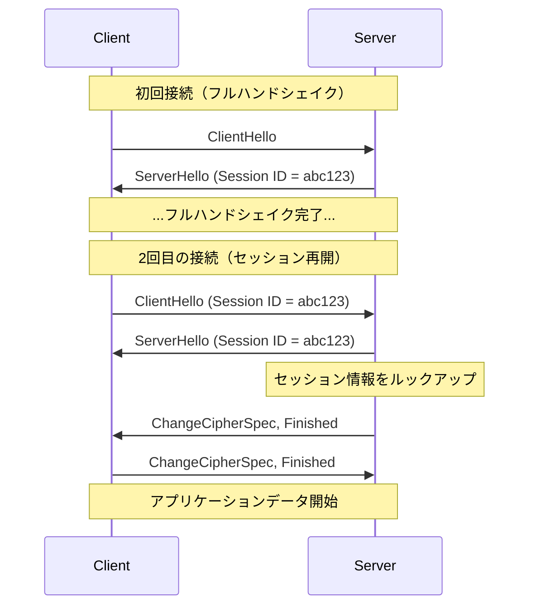

**利点：**
- ハンドシェイクが1-RTTに短縮される（TLS 1.2でのフルハンドシェイクは2-RTT）
- 非対称暗号の処理が省略され、CPU負荷が大幅に軽減される

**欠点：**
- サーバー側にセッションキャッシュのメモリが必要
- 複数サーバー環境ではセッションキャッシュの共有が課題になる（Sticky Session や 分散キャッシュが必要）
- キャッシュ容量の制限があるため、大量クライアント環境ではキャッシュミスが多発する

### 2.2 Session Ticket（TLS 1.2、RFC 5077）

セッション情報をサーバーではなく**クライアント側に保持させる**方式である。サーバーはセッション状態を暗号化して「チケット」としてクライアントに送付する。

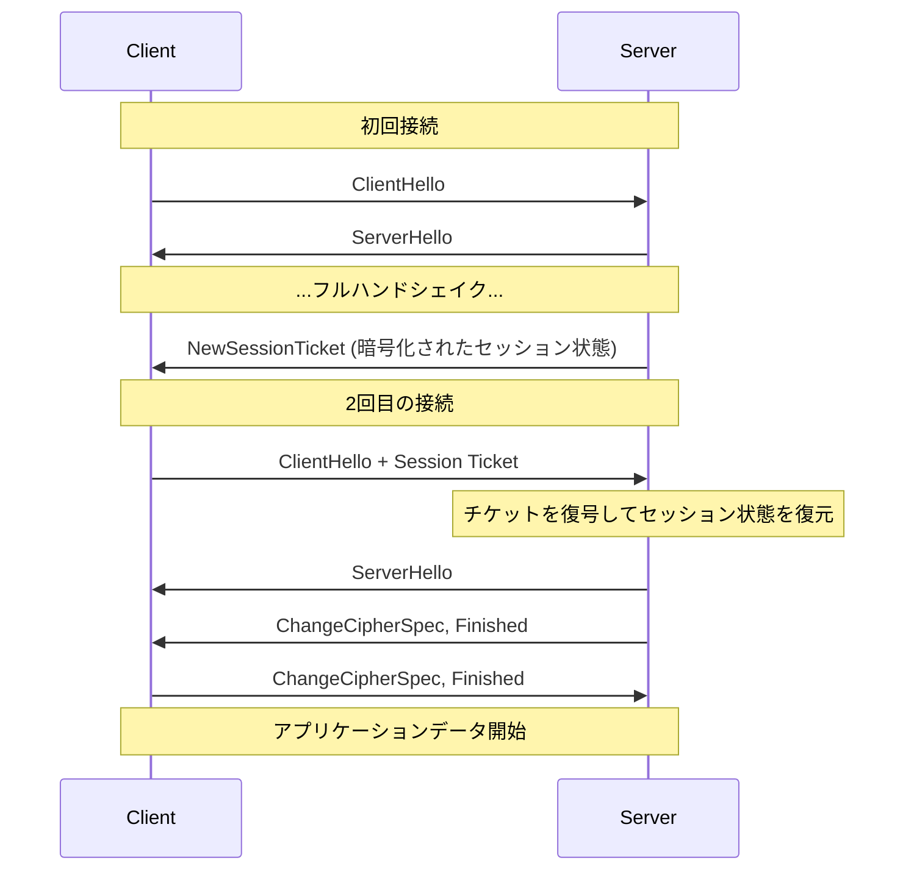

**利点：**
- サーバー側にセッションキャッシュが不要（ステートレス）
- 複数サーバー環境でも、チケット暗号化鍵を共有するだけで動作する

**欠点：**
- チケット暗号化鍵（STEK: Session Ticket Encryption Key）の管理が重要。STEKが漏洩すると、過去のセッションがすべて復号可能になり、**前方秘匿性が損なわれる**
- STEKの定期的なローテーションが必須

### 2.3 PSK（Pre-Shared Key）によるセッション再開（TLS 1.3）

TLS 1.3ではSession IDとSession Ticketの仕組みを統合し、**PSK（Pre-Shared Key）ベースのセッション再開**として再設計した。サーバーはハンドシェイク完了後に`NewSessionTicket`メッセージを送信し、クライアントはそのチケットから導出したPSK IDを次回の`ClientHello`に含める。

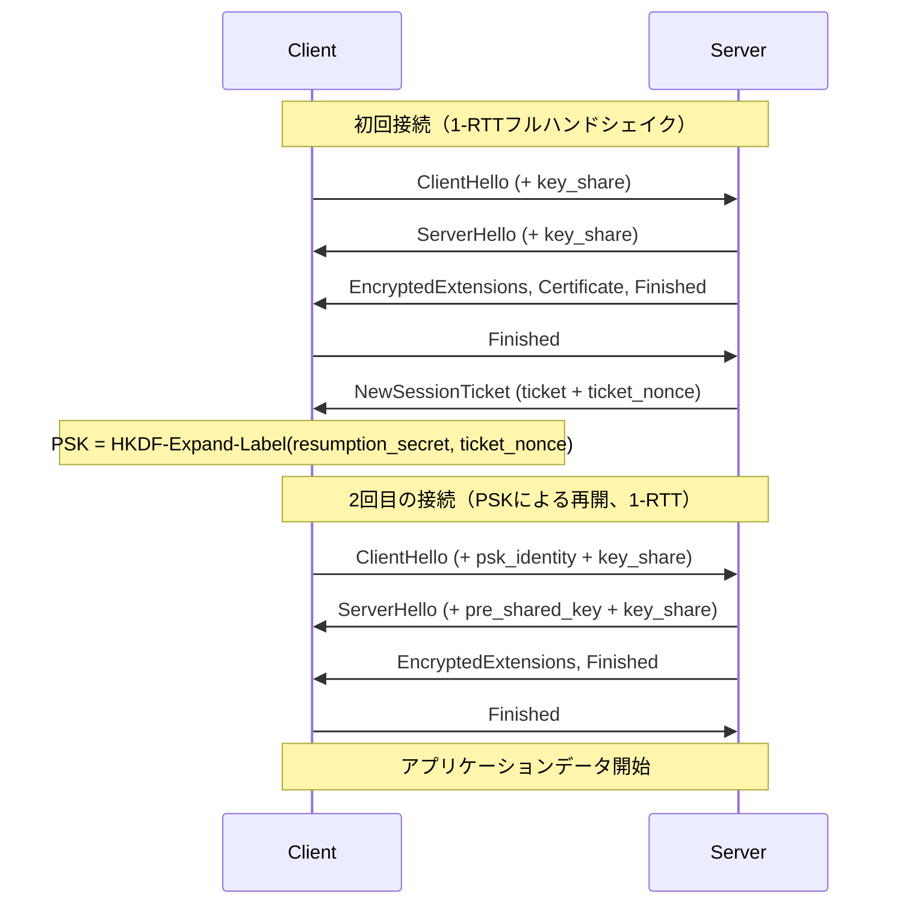

TLS 1.3のPSK再開の特徴は以下のとおりである：

- **PSK + (EC)DHE**: PSKに加えてEphemeral鍵交換を行うモードがデフォルト。これにより、チケット暗号化鍵が漏洩しても前方秘匿性が保たれる
- **PSK only**: (EC)DHEを省略するモードも規格上存在するが、前方秘匿性が失われるため非推奨
- **チケットの有効期限**: サーバーは`ticket_lifetime`で有効期間を指定する（最大7日間）
- **チケットのリプレイ防止**: `ticket_age_add`による時刻オフセットの難読化

::: warning Session Ticketと前方秘匿性
TLS 1.2のSession Ticketでは、STEKが固定されている場合に前方秘匿性が失われる重大なリスクがあった。TLS 1.3ではPSK + (EC)DHEモードでこの問題を解消しているが、PSK-onlyモードを使用する場合は同様のリスクが存在する。運用では必ずPSK + (EC)DHEを有効にすべきである。
:::

### 2.4 セッション再開の設定例

Nginxでのセッション再開の設定例を示す：

```nginx
# Session cache configuration
ssl_session_cache shared:SSL:50m;  # 50MB shared cache (~200,000 sessions)
ssl_session_timeout 1d;             # 1-day session timeout

# Session tickets
ssl_session_tickets on;
ssl_session_ticket_key /etc/nginx/ticket_keys/current.key;   # 48-byte key file
ssl_session_ticket_key /etc/nginx/ticket_keys/previous.key;  # Previous key for rotation
```

STEKのローテーションは、以下のような運用が推奨される：

```bash
#!/bin/bash
# STEK rotation script (run via cron every 12 hours)

KEY_DIR="/etc/nginx/ticket_keys"

# Rotate keys
mv "$KEY_DIR/current.key" "$KEY_DIR/previous.key"

# Generate new 48-byte key (16 bytes name + 16 bytes AES key + 16 bytes HMAC key)
openssl rand 48 > "$KEY_DIR/current.key"
chmod 600 "$KEY_DIR/current.key"

# Reload Nginx to pick up new keys
nginx -s reload
```

## 3. 0-RTT（Early Data）

### 3.1 0-RTTの仕組み

TLS 1.3では、PSKを利用してハンドシェイクの完了を待たずにアプリケーションデータを送信する**0-RTT（Zero Round Trip Time）**モードが導入された。これは最も野心的なパフォーマンス最適化の一つである。

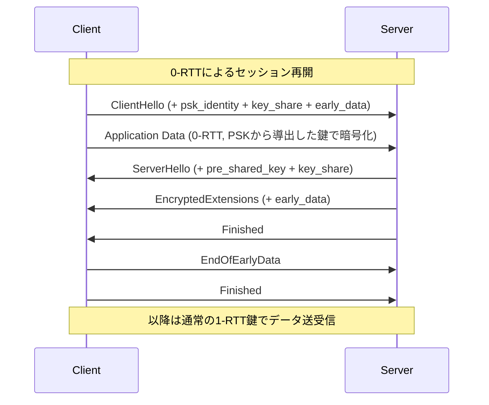

0-RTTでは、`ClientHello`と同時にアプリケーションデータを送信するため、TLS固有のRTT追加なしでデータ転送を開始できる。TCPハンドシェイクの1-RTTだけで暗号化通信が始まるのである。

### 3.2 0-RTTのレイテンシ効果

各方式のRTT比較を以下に示す：

| 方式 | TCP | TLS | 合計RTT |
|------|-----|-----|---------|
| TLS 1.2 フルハンドシェイク | 1 | 2 | 3 |
| TLS 1.2 セッション再開 | 1 | 1 | 2 |
| TLS 1.3 フルハンドシェイク | 1 | 1 | 2 |
| TLS 1.3 PSK再開 | 1 | 1 | 2 |
| TLS 1.3 0-RTT | 1 | 0 | 1 |
| TCP Fast Open + TLS 1.3 0-RTT | 0 | 0 | 0 |

::: details TCP Fast Open との組み合わせ
TCP Fast Open（TFO）は、TCPハンドシェイク中にデータを送信する仕組みである。TFOとTLS 1.3の0-RTTを組み合わせることで、理論上0-RTTでの暗号化通信が実現する。ただし、TFOの普及率はまだ限定的であり、ミドルボックスとの互換性の問題もある。QUIC（HTTP/3）はUDP上でこの0-RTTを最初から組み込んだ設計となっている。
:::

### 3.3 0-RTTのリスク（リプレイ攻撃）

0-RTTのEarly Dataには重大なセキュリティ上の制約がある。**リプレイ攻撃**に対して脆弱なのである。

通常のTLSハンドシェイクでは、サーバーが生成したランダム値（ServerHello.random）がプロトコルに組み込まれるため、メッセージのリプレイは不可能である。しかし0-RTTでは、サーバーからの応答を待たずにデータを送信するため、攻撃者が0-RTTデータを含むパケットを複製して再送することが可能になる。

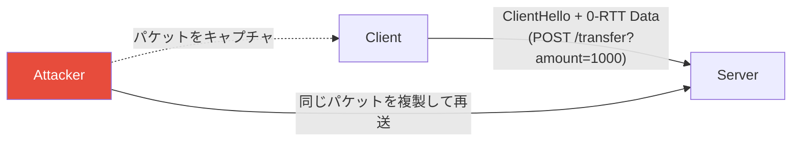

この問題の詳細と対策は「8. Early Dataのリスクと対策」で詳述する。

## 4. 証明書チェーンの最適化

### 4.1 証明書チェーンのサイズ問題

TLSハンドシェイクにおいて、サーバーが送信する証明書チェーンはしばしば最大のペイロードとなる。典型的な構成を示す：

| 要素 | 一般的なサイズ |
|------|-------------|
| サーバー証明書（RSA 2048-bit） | 1.0〜1.5 KB |
| 中間CA証明書（1枚） | 1.0〜1.5 KB |
| 中間CA証明書（2枚目、存在する場合） | 1.0〜1.5 KB |
| OCSP Stapling応答（含む場合） | 0.5〜1.0 KB |
| **合計** | **3.5〜5.5 KB** |

この問題が深刻な理由は、TLSハンドシェイクはTCP接続の初期に行われるため、TCPの**初期輻輳ウィンドウ（Initial Congestion Window: IW）**の制約を受けることにある。

Linuxのデフォルトの初期輻輳ウィンドウは10セグメント（約14KB）であり、証明書チェーンが大きいとこの枠を使い切り、追加のRTTが必要になる場合がある。

### 4.2 RSAからECDSAへの移行

証明書チェーンのサイズを削減する最も効果的な方法は、RSA証明書からECDSA証明書に移行することである。

| 要素 | RSA 2048-bit | ECDSA P-256 |
|------|-------------|-------------|
| 公開鍵サイズ | 256 bytes | 64 bytes |
| 署名サイズ | 256 bytes | 64 bytes |
| 証明書全体 | 約1,200 bytes | 約500 bytes |
| チェーン（証明書2枚） | 約2,400 bytes | 約1,000 bytes |

ECDSAを使用することで、証明書チェーンのサイズを約**60%削減**できる。

```nginx
# Nginx: ECDSA certificate configuration
ssl_certificate     /etc/nginx/certs/example.com.ecdsa.pem;
ssl_certificate_key /etc/nginx/certs/example.com.ecdsa.key;
```

::: tip デュアル証明書（RSA + ECDSA）
古いクライアントとの互換性が必要な場合、RSAとECDSAの両方の証明書を設定し、クライアントの対応状況に応じて自動選択させることができる。Nginxでは複数の`ssl_certificate`ディレクティブを記述するだけで実現できる。
:::

### 4.3 証明書チェーンの正しい構成

証明書チェーンの構成ミスは意外と多い。以下の点を確認すべきである：

**含めるべきもの：**
- サーバー証明書
- 中間CA証明書（ルートCAまでの全ての中間証明書）

**含めるべきでないもの：**
- ルートCA証明書（クライアントのトラストストアに既に存在する）

ルートCA証明書を含めると、不必要にデータ量が増加する。逆に中間証明書が欠けていると、一部のクライアントで検証に失敗する。

```bash
# Verify certificate chain
openssl s_client -connect example.com:443 -showcerts < /dev/null 2>/dev/null | \
  openssl x509 -noout -text | grep -A1 "Subject:"

# Check chain completeness
openssl verify -CAfile /etc/ssl/certs/ca-certificates.crt \
  -untrusted intermediate.pem server.pem
```

### 4.4 証明書圧縮（RFC 8879）

TLS 1.3では**証明書圧縮**（Certificate Compression）が利用可能である。Brotli、zlib、zstdの3種類の圧縮アルゴリズムがサポートされている。


証明書圧縮により、典型的なケースで50〜60%のサイズ削減が可能である。主要ブラウザ（Chrome、Firefox、Edge）はすでに対応している。

Nginxでは OpenSSL 3.2 以降で証明書圧縮がサポートされている：

```nginx
# Enable certificate compression (requires OpenSSL 3.2+)
ssl_conf_command Options CertificateCompression
```

## 5. OCSP Stapling

### 5.1 証明書失効確認の問題

TLS証明書が失効していないかを確認する仕組みとして、**CRL（Certificate Revocation List）**と**OCSP（Online Certificate Status Protocol）**がある。

**CRLの問題：**
- CRLファイルが大きくなりがち（数MB）
- クライアントがCRL配布点からダウンロードする必要がある
- 更新頻度が低く、リアルタイム性に欠ける

**OCSPの問題：**
- クライアントがOCSPレスポンダに個別に問い合わせる
- OCSPレスポンダへの追加RTTが発生する（100〜500ms）
- OCSPレスポンダがダウンしているとどうするか（soft-fail vs hard-fail）
- プライバシーの問題：OCSPレスポンダにユーザーのアクセス先が漏洩する

### 5.2 OCSP Staplingの仕組み

**OCSP Stapling**（正式名称: TLS Certificate Status Request extension）は、サーバーが事前にOCSPレスポンダから応答を取得し、TLSハンドシェイク時にその応答を証明書と一緒に送信する仕組みである。

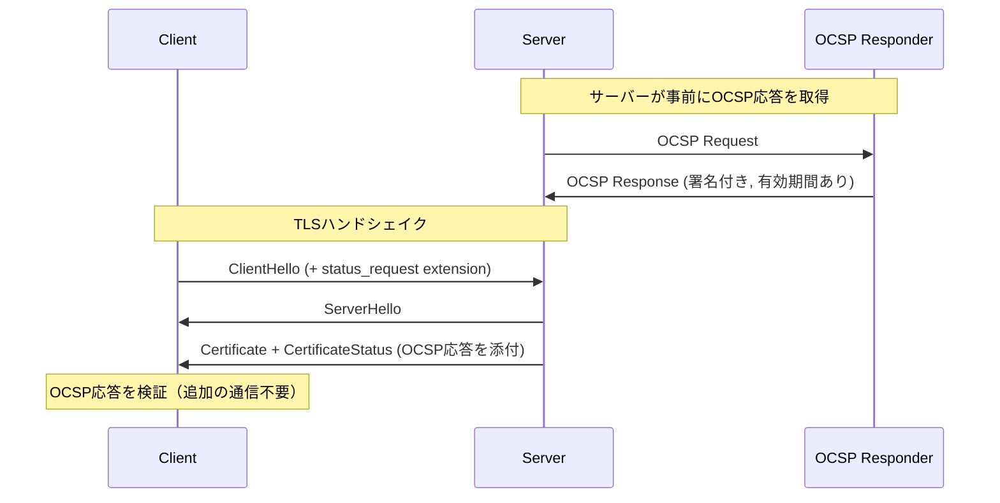

### 5.3 OCSP Staplingの効果

| 方式 | 追加RTT | プライバシー | 可用性 |
|------|---------|------------|--------|
| OCSP（直接問い合わせ） | +1 RTT | OCSPレスポンダにアクセス先が漏洩 | OCSPレスポンダに依存 |
| OCSP Stapling | 0 | 漏洩なし | サーバーがキャッシュ可能 |
| OCSP Must-Staple | 0 | 漏洩なし | サーバー必須 |

OCSP Staplingにより、クライアントはOCSPレスポンダへの追加通信が不要になり、レイテンシが削減される。同時にプライバシーの問題も解消される。

### 5.4 OCSP Must-Staple

OCSP Staplingは任意の拡張であり、サーバーがStaplingしなかった場合にクライアントは通常のOCSP問い合わせにフォールバックするか（soft-fail）、接続を拒否するか（hard-fail）の選択を迫られる。多くのブラウザはsoft-failを採用しており、セキュリティ上の効果が限定的であった。

**OCSP Must-Staple**は、証明書自体にStaplingが必須であることを示すエクステンション（OID: 1.3.6.1.5.5.7.1.24）を埋め込む仕組みである。この拡張が設定された証明書に対して、ブラウザはOCSP応答がStaplingされていない場合に接続を拒否する。

```bash
# Generate CSR with OCSP Must-Staple extension
openssl req -new -key server.key -out server.csr \
  -addext "tlsfeature = status_request"
```

### 5.5 Nginxでの設定

```nginx
# OCSP Stapling configuration
ssl_stapling on;
ssl_stapling_verify on;

# CA certificate for verifying OCSP response
ssl_trusted_certificate /etc/nginx/certs/chain.pem;

# DNS resolver for OCSP responder lookup
resolver 8.8.8.8 8.8.4.4 valid=300s;
resolver_timeout 5s;
```

::: warning OCSP Staplingの落とし穴
Nginxでは初回リクエスト時にOCSP応答がまだ取得されていない場合があり、Staplingが行われないことがある。これを回避するには、`ssl_stapling_file`で事前に取得したOCSP応答ファイルを指定するか、Nginxの起動後にテストリクエストを送信してキャッシュをウォームアップする方法がある。

```bash
# Pre-fetch OCSP response
openssl ocsp -issuer chain.pem -cert server.pem \
  -url http://ocsp.example.com -respout ocsp.der -noverify
```
:::

## 6. 暗号スイートの選択

### 6.1 TLS 1.3の暗号スイート

TLS 1.3では暗号スイートが大幅に簡素化され、以下の5つのみが定義されている：

| 暗号スイート | AEAD | ハッシュ | 備考 |
|-------------|------|---------|------|
| TLS_AES_128_GCM_SHA256 | AES-128-GCM | SHA-256 | 推奨（最もバランスが良い） |
| TLS_AES_256_GCM_SHA384 | AES-256-GCM | SHA-384 | 高セキュリティ要件向け |
| TLS_CHACHA20_POLY1305_SHA256 | ChaCha20-Poly1305 | SHA-256 | AES-NI非対応環境向け |
| TLS_AES_128_CCM_SHA256 | AES-128-CCM | SHA-256 | IoT向け |
| TLS_AES_128_CCM_8_SHA256 | AES-128-CCM (8-byte tag) | SHA-256 | IoT向け（非推奨） |

鍵交換アルゴリズムは暗号スイートから分離され、`supported_groups`と`signature_algorithms`の拡張で独立して交渉される。

### 6.2 パフォーマンス特性

暗号アルゴリズムのパフォーマンスは、ハードウェアの対応状況に大きく依存する。

```
┌─────────────────────────────────────────────────────┐
│           暗号アルゴリズムのスループット比較            │
│            (AES-NI対応CPU, 単一コア)                  │
├─────────────────────────────────────────────────────┤
│                                                     │
│  AES-128-GCM   ████████████████████████  ~6 GB/s   │
│  AES-256-GCM   ██████████████████████    ~5 GB/s   │
│  ChaCha20      ███████████████           ~3 GB/s   │
│                                                     │
│            (AES-NI非対応CPU, 単一コア)                │
│                                                     │
│  AES-128-GCM   ████████                  ~1.5 GB/s │
│  AES-256-GCM   ██████                    ~1.2 GB/s │
│  ChaCha20      ██████████████████         ~3 GB/s  │
│                                                     │
└─────────────────────────────────────────────────────┘
```

重要なポイント：

- **AES-NI対応CPU**（現代のx86サーバーは基本的に対応）では、AES-GCMが最速
- **AES-NI非対応環境**（一部のARM、古いモバイルデバイス）では、ChaCha20-Poly1305が有利
- サーバーがAES-NI対応でも、クライアント（特にモバイル）が非対応の場合は、ChaCha20-Poly1305を優先する設定が望ましい

### 6.3 鍵交換のパフォーマンス

鍵交換アルゴリズムの選択もパフォーマンスに影響する：

| アルゴリズム | 鍵サイズ(bits) | サーバー処理時間 | セキュリティ強度(bits) |
|------------|---------------|----------------|---------------------|
| X25519 | 256 | ~0.05 ms | 128 |
| P-256 (secp256r1) | 256 | ~0.10 ms | 128 |
| P-384 (secp384r1) | 384 | ~0.30 ms | 192 |
| X448 | 448 | ~0.15 ms | 224 |
| ffdhe2048 | 2048 | ~1.00 ms | 112 |

**X25519**がパフォーマンスとセキュリティのバランスにおいて最も優れており、TLS 1.3ではデフォルトの選択肢として広く採用されている。

### 6.4 署名アルゴリズムの影響

ハンドシェイク時の署名検証もCPU負荷の要因となる：

| アルゴリズム | 署名生成 | 署名検証 | 備考 |
|------------|---------|---------|------|
| RSA-2048 + PSS | ~1.0 ms | ~0.05 ms | 検証が高速 |
| RSA-4096 + PSS | ~5.0 ms | ~0.15 ms | 検証は速いが生成が重い |
| ECDSA P-256 | ~0.10 ms | ~0.20 ms | 両方高速 |
| Ed25519 | ~0.05 ms | ~0.10 ms | 最速だがTLSでの普及は限定的 |

サーバーはハンドシェイクごとに署名を生成するため、大量の接続を処理する場合はECDSA P-256やEd25519が有利である。

### 6.5 推奨設定

```nginx
# TLS 1.3 cipher suites (OpenSSL format)
ssl_protocols TLSv1.3 TLSv1.2;

# TLS 1.3 ciphersuites
ssl_conf_command Ciphersuites TLS_AES_128_GCM_SHA256:TLS_AES_256_GCM_SHA384:TLS_CHACHA20_POLY1305_SHA256;

# TLS 1.2 cipher suites (if still needed)
ssl_ciphers ECDHE-ECDSA-AES128-GCM-SHA256:ECDHE-RSA-AES128-GCM-SHA256:ECDHE-ECDSA-AES256-GCM-SHA384:ECDHE-RSA-AES256-GCM-SHA384:ECDHE-ECDSA-CHACHA20-POLY1305:ECDHE-RSA-CHACHA20-POLY1305;

# Prefer server cipher order
ssl_prefer_server_ciphers on;

# ECDH curves
ssl_ecdh_curve X25519:P-256:P-384;
```

## 7. ハードウェアアクセラレーション

### 7.1 AES-NI

**AES-NI（Advanced Encryption Standard New Instructions）**は、Intel（2010年〜）およびAMD（2011年〜）のx86プロセッサに搭載されている、AES暗号処理を高速化する命令セットである。

AES-NIにより、AES暗号化/復号の処理速度は**ソフトウェア実装の5〜10倍**に向上する。現代のサーバーCPUではほぼ標準的に搭載されており、OpenSSLは自動的にAES-NIを検出して利用する。

```bash
# Check AES-NI support
grep -o aes /proc/cpuinfo | head -1

# Check OpenSSL engine capabilities
openssl speed -elapsed -evp aes-128-gcm
openssl speed -elapsed -evp chacha20-poly1305
```

### 7.2 SHA拡張命令

Intel SHA Extensions（Goldmont以降）およびARM SHA Extensions（ARMv8-A以降）は、SHA-256/SHA-1のハッシュ計算をハードウェアで加速する。TLSのハッシュ処理（HMAC、鍵導出関数、ハンドシェイクハッシュ）で活用される。

### 7.3 ARMのCryptography Extensions

ARMv8-Aアーキテクチャ以降では、以下の暗号命令が利用可能である：

- **AES命令**: AESE, AESD, AESMC, AESIMC
- **SHA命令**: SHA256H, SHA256H2, SHA256SU0, SHA256SU1
- **多項式乗算**: PMULL（GCMモードのGHASH計算に使用）

AWS Gravitonプロセッサなどのクラウド向けARMインスタンスでは、これらの命令により高いコストパフォーマンスが実現されている。

### 7.4 SSL/TLSアクセラレータカード

大量のTLS接続を処理する必要がある環境では、専用のSSLアクセラレータやHSM（Hardware Security Module）の利用も選択肢となる。

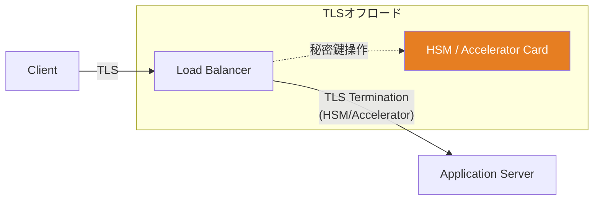

ただし、現代のCPUはAES-NI等の暗号命令を標準搭載しており、ソフトウェアTLS処理でも十分なパフォーマンスが得られるケースが多い。専用ハードウェアが本当に必要になるのは、数十万〜数百万の同時接続を処理するような大規模環境に限られる。

### 7.5 カーネルTLS（kTLS）

Linux 4.13以降では**Kernel TLS（kTLS）**がサポートされている。kTLSはTLSの暗号化/復号処理をカーネル空間で行うことで、ユーザー空間とカーネル空間の間のデータコピーを削減する。

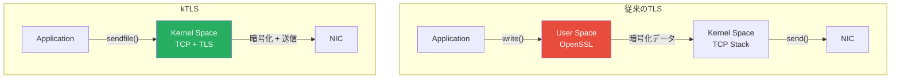

kTLSの主な利点：

- `sendfile()`システムコールで直接暗号化送信が可能（ゼロコピー）
- 静的ファイル配信のスループットが大幅に向上（Nginx benchmarkで最大30%改善の報告あり）
- ユーザー空間のメモリコピーが削減される

```nginx
# Nginx: Enable kTLS (requires Nginx 1.21.4+ and OpenSSL 3.0+)
ssl_conf_command Options KTLS;
```

## 8. Early Data（0-RTT）のリスクと対策

### 8.1 リプレイ攻撃の詳細

3.3節で触れたように、0-RTTのEarly Dataはリプレイ攻撃に対して脆弱である。ここではその詳細と対策を掘り下げる。

通常の1-RTT以上のハンドシェイクでは、以下のプロパティが保証される：

1. **サーバーの新鮮さ（Server Freshness）**: サーバーが生成したランダム値がプロトコルに含まれるため、メッセージの一意性が担保される
2. **前方秘匿性**: Ephemeral鍵交換により、長期鍵が漏洩しても過去の通信は復号できない

0-RTTでは、サーバーからの応答を待たずにデータを送信するため、プロパティ1（サーバーの新鮮さ）が保証されない。つまり、攻撃者は以下のことが可能になる：

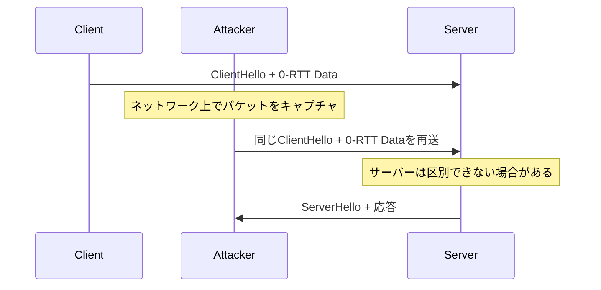

### 8.2 リプレイ攻撃の影響

リプレイ攻撃の影響は、Early Dataの内容によって異なる：

| リクエスト種別 | リプレイの影響 | 危険度 |
|-------------|-------------|--------|
| GET /index.html | ページの重複取得（無害） | 低 |
| GET /api/balance | 残高の重複取得（一般に無害） | 低 |
| POST /api/transfer | 送金の重複実行 | **高** |
| DELETE /api/resource | リソースの重複削除 | **高** |
| PUT（冪等操作） | 同じ状態の再設定（一般に無害） | 低 |

HTTPのセマンティクスでは、GETリクエストは冪等であり副作用がないとされるため、リプレイされても影響は限定的である。一方、POSTのような非冪等リクエストでは重大な問題が生じうる。

### 8.3 サーバー側の対策

#### Single-Use Ticket

サーバーが各チケットの使用を1回に制限する方式である。チケットのID（またはハッシュ）をサーバー側で記録し、同じチケットの再利用を拒否する。

```
┌─────────────────────────────────────────────────┐
│          Single-Use Ticketのフロー               │
├─────────────────────────────────────────────────┤
│                                                 │
│  1. Client → Server: 0-RTT + Ticket #42         │
│  2. Server: Ticket #42 を使用済みリストに追加      │
│  3. Attacker → Server: 0-RTT + Ticket #42       │
│  4. Server: Ticket #42 は使用済み → 0-RTT拒否    │
│                                                 │
└─────────────────────────────────────────────────┘
```

**欠点**: 分散環境では使用済みチケットリストの同期が課題になる。

#### Client Hello Recording

一定時間内に受信した`ClientHello`メッセージのフィンガープリントを記録し、重複を検出する方式である。

#### 時間ベースの制限

`obfuscated_ticket_age`を用いて、チケットが「古すぎる」0-RTTデータを拒否する。ただし、クロック・スキュー（時刻のずれ）を考慮する必要がある。

### 8.4 アプリケーション側の対策

最も堅実な対策は、**アプリケーション層でEarly Dataの使用を制御する**ことである。

```nginx
# Nginx: 0-RTT Early Data configuration
ssl_early_data on;

# Pass early data indicator to application
proxy_set_header Early-Data $ssl_early_data;
```

アプリケーション側では、`Early-Data: 1`ヘッダが付いたリクエストに対して、非冪等操作を拒否する：

```python
from flask import Flask, request, abort

app = Flask(__name__)

@app.before_request
def check_early_data():
    """Reject non-idempotent requests sent as 0-RTT early data."""
    if request.headers.get('Early-Data') == '1':
        if request.method not in ('GET', 'HEAD', 'OPTIONS'):
            # Return 425 Too Early (RFC 8470)
            abort(425)
```

::: tip HTTP 425 Too Early
RFC 8470で定義された**425 Too Early**ステータスコードは、0-RTTのリプレイリスクがあるため処理を拒否したことをクライアントに通知するために使用する。クライアントはハンドシェイク完了後に再送すべきである。
:::

### 8.5 推奨ポリシー

0-RTTの利用に関する推奨ポリシーをまとめる：

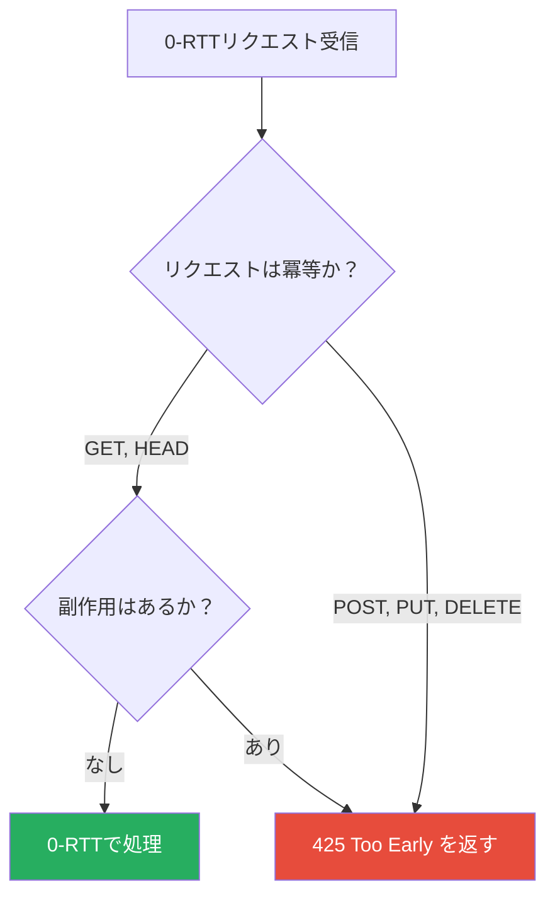

- **GETリクエスト（副作用なし）**: 0-RTTで処理して問題ない
- **非冪等リクエスト（POST, DELETEなど）**: Early Dataでは処理せず、425を返すかハンドシェイク完了後に処理する
- **認証が必要な操作**: Early Dataでは行わない（セッショントークンのリプレイリスクがある）

## 9. 計測とモニタリング

### 9.1 ハンドシェイク時間の計測

TLSパフォーマンスの改善には、まず現状を正確に計測することが不可欠である。

```bash
# Measure TLS handshake time with curl
curl -w "TCP: %{time_connect}s\nTLS: %{time_appconnect}s\nTotal: %{time_total}s\n" \
  -o /dev/null -s https://example.com

# Detailed timing with openssl
openssl s_client -connect example.com:443 -servername example.com \
  -status -tlsextdebug < /dev/null 2>&1

# Test 0-RTT support
openssl s_client -connect example.com:443 -servername example.com \
  -sess_out session.pem < /dev/null
echo -e "GET / HTTP/1.1\r\nHost: example.com\r\n\r\n" | \
  openssl s_client -connect example.com:443 -servername example.com \
  -sess_in session.pem -early_data /dev/stdin
```

### 9.2 主要な計測指標

| 指標 | 説明 | 目標値 |
|------|------|--------|
| TLS Handshake Time | TCP接続確立からTLSハンドシェイク完了まで | < 100ms（同一リージョン） |
| Session Resumption Rate | セッション再開の成功率 | > 80% |
| 0-RTT Acceptance Rate | 0-RTTが受理された割合 | 用途依存 |
| OCSP Stapling Rate | OCSP Staplingが成功した割合 | 100%（目標） |
| Certificate Chain Size | 送信される証明書チェーンのバイト数 | < 3 KB |
| Cipher Suite Distribution | 使用された暗号スイートの分布 | モニタリング用 |

### 9.3 OpenSSLベンチマーク

サーバーの暗号処理能力を評価するには、OpenSSLのベンチマーク機能を活用する：

```bash
# Benchmark symmetric ciphers
openssl speed -elapsed -evp aes-128-gcm aes-256-gcm chacha20-poly1305

# Benchmark asymmetric operations
openssl speed -elapsed ecdsap256 ecdsap384 ed25519

# Benchmark key exchange
openssl speed -elapsed ecdhx25519 ecdhp256 ecdhp384

# Benchmark with multi-threading (e.g., 4 threads)
openssl speed -elapsed -multi 4 -evp aes-128-gcm
```

### 9.4 TLSログの活用

Nginxでは、TLS関連の情報をログに記録できる：

```nginx
# Custom log format with TLS information
log_format tls_info '$remote_addr - $request '
                    'ssl_protocol=$ssl_protocol '
                    'ssl_cipher=$ssl_cipher '
                    'ssl_session_reused=$ssl_session_reused '
                    'ssl_early_data=$ssl_early_data '
                    'ssl_server_name=$ssl_server_name';

access_log /var/log/nginx/tls_access.log tls_info;
```

このログを分析することで、以下の情報を把握できる：

- TLS 1.2 vs TLS 1.3 の接続割合
- セッション再開の成功率（`ssl_session_reused`）
- 0-RTTの利用状況（`ssl_early_data`）
- 暗号スイートの分布（`ssl_cipher`）

### 9.5 継続的なモニタリング

TLSパフォーマンスは一度設定して終わりではなく、継続的にモニタリングすべきである。以下のような仕組みを組み込むことが推奨される：

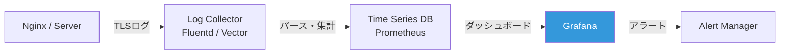

モニタリングすべきアラート条件の例：

- **セッション再開率の低下**: キャッシュの枯渇やSTEKの問題を示唆する
- **ハンドシェイク時間の増加**: ネットワーク遅延やサーバー負荷の問題
- **OCSP Stapling失敗率の上昇**: OCSPレスポンダの障害
- **TLS 1.2接続の比率が高い**: 古いクライアントの存在やサーバー設定の問題

## 10. チューニングのまとめと優先度

TLSパフォーマンスチューニングの各施策を効果と導入の容易さで整理する：

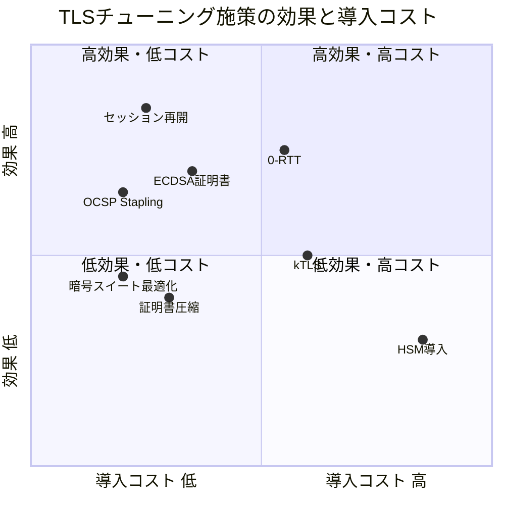

### 推奨する導入順序

1. **セッション再開の有効化**（最優先）: 最も効果が高く、設定も容易。セッションキャッシュまたはSession Ticketを有効化する
2. **OCSP Staplingの有効化**: OCSPの追加RTTを排除し、プライバシーも改善する
3. **ECDSA証明書への移行**: 証明書チェーンのサイズ削減と署名処理の高速化が同時に実現する
4. **暗号スイートの最適化**: 適切な暗号スイートの優先順位を設定する
5. **0-RTTの検討**: リプレイ攻撃のリスクを理解した上で、冪等なリクエストに限定して導入する
6. **証明書圧縮**: サーバーとクライアントの両方が対応している場合に有効
7. **kTLS**: 静的ファイル配信が多い環境で効果的
8. **ハードウェアアクセラレーション**: 大規模環境での最終手段

### 全体設定の統合例

最後に、上述のチューニングを統合したNginxの設定例を示す：

```nginx
server {
    listen 443 ssl;
    http2 on;
    server_name example.com;

    # --- Certificate (ECDSA preferred) ---
    ssl_certificate     /etc/nginx/certs/example.com.ecdsa.pem;
    ssl_certificate_key /etc/nginx/certs/example.com.ecdsa.key;

    # --- Protocol versions ---
    ssl_protocols TLSv1.3 TLSv1.2;

    # --- Cipher suites ---
    ssl_conf_command Ciphersuites TLS_AES_128_GCM_SHA256:TLS_AES_256_GCM_SHA384:TLS_CHACHA20_POLY1305_SHA256;
    ssl_ciphers ECDHE-ECDSA-AES128-GCM-SHA256:ECDHE-RSA-AES128-GCM-SHA256:ECDHE-ECDSA-CHACHA20-POLY1305:ECDHE-RSA-CHACHA20-POLY1305;
    ssl_prefer_server_ciphers on;
    ssl_ecdh_curve X25519:P-256:P-384;

    # --- Session resumption ---
    ssl_session_cache shared:SSL:50m;
    ssl_session_timeout 1d;
    ssl_session_tickets on;
    ssl_session_ticket_key /etc/nginx/ticket_keys/current.key;
    ssl_session_ticket_key /etc/nginx/ticket_keys/previous.key;

    # --- OCSP Stapling ---
    ssl_stapling on;
    ssl_stapling_verify on;
    ssl_trusted_certificate /etc/nginx/certs/chain.pem;
    resolver 8.8.8.8 8.8.4.4 valid=300s;
    resolver_timeout 5s;

    # --- 0-RTT Early Data ---
    ssl_early_data on;
    proxy_set_header Early-Data $ssl_early_data;

    # --- Logging ---
    log_format tls '$remote_addr $request '
                   'proto=$ssl_protocol cipher=$ssl_cipher '
                   'reused=$ssl_session_reused early=$ssl_early_data';
    access_log /var/log/nginx/tls.log tls;

    # --- Application proxy ---
    location / {
        proxy_pass http://backend;
    }
}
```

## 11. おわりに

TLSのパフォーマンスチューニングは、一つの魔法の設定で劇的に改善されるものではない。セッション再開、OCSP Stapling、証明書の最適化、暗号スイートの選択、そして0-RTTといった複数の施策を組み合わせ、ワークロードの特性に応じて適切に設定することが重要である。

特に意識すべきポイントを改めて整理する：

- **セッション再開は最優先**: 新規接続のオーバーヘッドを大幅に削減できる最も費用対効果の高い施策である
- **0-RTTはリスクを理解して使う**: パフォーマンスの恩恵は大きいが、リプレイ攻撃のリスクを伴う。アプリケーション層での防御が不可欠である
- **証明書のサイズは重要**: ECDSAへの移行と証明書圧縮で、初期接続のレイテンシを改善できる
- **計測なくして改善なし**: 推測ではなく、実際の計測データに基づいてチューニングを行うべきである

TLSのパフォーマンスは、プロトコルバージョンの進化（TLS 1.2→1.3）、ハードウェアの進化（AES-NI、ARMv8 Crypto Extensions）、そして新たなプロトコル（QUIC/HTTP3）の登場により、継続的に改善されている。最新の動向を追いかけながら、自身のシステムに最適なチューニングを適用していくことが求められる。
