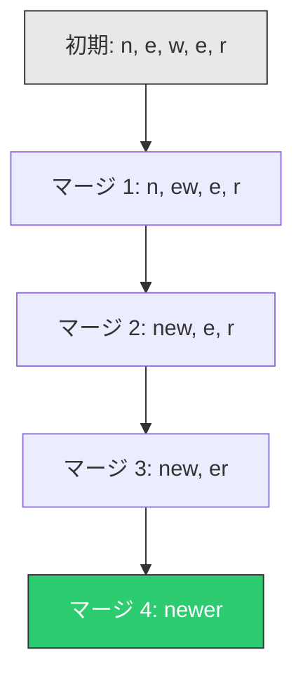
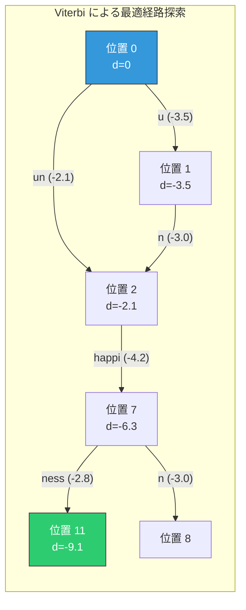
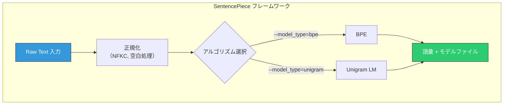
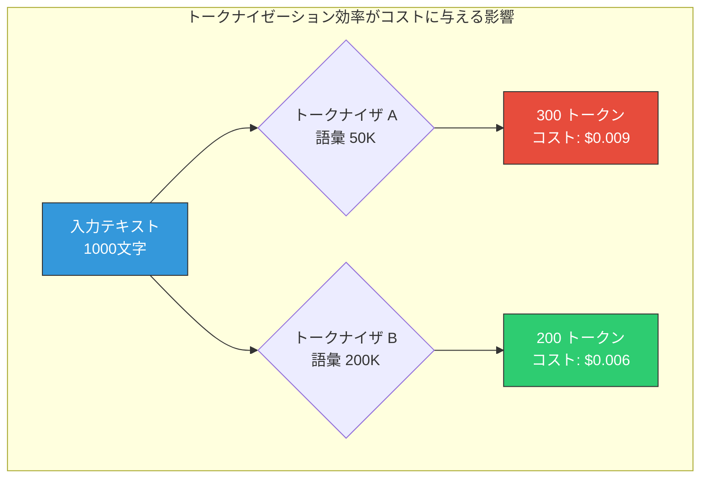

# トークナイゼーション — BPE, WordPiece, SentencePiece

## 1. テキストのトークン化とは何か

自然言語処理（NLP）や大規模言語モデル（LLM）において、モデルが直接扱えるのは数値である。人間が読み書きする「テキスト」を、モデルが処理可能な「数値の列」へと変換する最初のステップが**トークナイゼーション（Tokenization）**である。

トークナイゼーションとは、入力テキストを**トークン（Token）**と呼ばれる離散的な単位に分割し、それぞれのトークンを語彙（Vocabulary）内の整数 ID に対応付ける処理を指す。

```
"The cat sat on the mat."
  ↓ トークナイゼーション
["The", " cat", " sat", " on", " the", " mat", "."]
  ↓ ID への変換
[464, 3797, 3290, 319, 262, 2636, 13]
```

この変換は一見単純に見えるが、実際には以下のような本質的な問題を内包している。

**語彙サイズのジレンマ**

語彙サイズ $|V|$ の選択は、モデルの性能と効率に直接影響する。語彙が大きすぎれば、Embedding 層のパラメータ数 $|V| \times d$ が膨大になり、メモリと計算コストが増大する。語彙が小さすぎれば、テキストを表現するために多くのトークンが必要となり、系列長が増大する。Transformer ベースのモデルでは Attention の計算量が系列長の二乗 $O(n^2)$ に比例するため、系列長の増大は深刻なボトルネックとなる。

**未知語（OOV）問題**

固定語彙に基づくトークナイゼーションでは、学習時に出現しなかった語（Out-of-Vocabulary, OOV）を処理できない。新語、固有名詞、タイポ、外来語など、現実のテキストには語彙に含まれない語が頻繁に出現する。

**多言語対応**

英語のようにスペースで単語が区切られる言語と、日本語・中国語・タイ語のように明示的な区切りを持たない言語では、トークン化の前提が根本的に異なる。

これらの課題に対する解答として、現代の NLP では**サブワードトークナイゼーション**が標準的な手法となっている。本記事では、その代表的なアルゴリズムである BPE、WordPiece、Unigram Language Model、そしてそれらを統一的に扱うフレームワークである SentencePiece について、原理から実装上の考慮点まで詳しく解説する。

## 2. 古典的手法 — 単語分割と文字分割

サブワードトークナイゼーションが登場する以前は、主に2つのアプローチが用いられていた。それぞれの特徴と限界を理解することが、サブワード手法の必要性を理解する前提となる。

### 2.1 単語分割（Word-level Tokenization）

最も直感的なアプローチは、テキストを「単語」の単位に分割することである。英語であればスペースや句読点を区切りとして用いる。

```
"I don't like New York." → ["I", "don't", "like", "New", "York", "."]
```

単語分割の利点は明快さにある。各トークンが言語学的に意味のある単位に対応し、人間にとっての解釈性が高い。しかし、以下の深刻な問題がある。

**巨大な語彙サイズ**: 英語だけでも数十万の語彙が必要であり、形態素変化（run, runs, running, ran）を考慮すると語彙はさらに膨張する。

**OOV 問題**: 固有名詞、新造語、専門用語など、語彙に含まれない単語は `<UNK>`（Unknown）トークンに置き換えられ、情報が完全に失われる。

**形態論的関係の喪失**: "happy" と "unhappy"、"play" と "player" のような形態論的に関連する語が、語彙中ではまったく独立した存在として扱われ、それらの関連性をモデルが学習することが困難になる。

### 2.2 文字分割（Character-level Tokenization）

もう一方の極端なアプローチが、テキストを1文字ずつに分割する方法である。

```
"cat" → ["c", "a", "t"]
```

文字分割は OOV 問題を完全に解決する。どんな単語も、有限のアルファベットの組み合わせとして表現できるからである。語彙サイズも極めて小さい（英語なら数十程度）。

しかし、文字分割には別の深刻な問題がある。

**系列長の爆発**: 単語レベルでは1トークンだった "tokenization" が、文字レベルでは12トークンになる。Transformer の計算量 $O(n^2 \cdot d)$ を考えると、系列長の増大は計算コストの二次的な増加を招く。

**意味的な希薄さ**: 個々の文字は、ほとんどの場合それ自体では意味を持たない。モデルは文字の並びから単語の意味を推論する必要があり、学習の負荷が大きくなる。

### 2.3 二つの極端の間

単語分割と文字分割は、語彙サイズと系列長のトレードオフにおける二つの極端に位置する。


この二つの極端の間に、最適なバランスを見出そうとするのが**サブワードトークナイゼーション**である。

## 3. サブワードトークナイゼーションの登場

サブワードトークナイゼーションの基本的な考え方は、**頻出する文字列はそのまま1つのトークンとし、稀な文字列はより小さな単位に分解する**というものである。

例えば、"unhappiness" という単語を考えよう。この単語全体が高頻度であれば1トークンとして扱えるが、もし低頻度であれば以下のように分解できる。

```
"unhappiness" → ["un", "happi", "ness"]
```

"un"（否定の接頭辞）、"happi"（happy の語幹に近い部分）、"ness"（名詞を形成する接尾辞）はそれぞれ高頻度で出現するサブワードであり、これらの組み合わせで元の単語を復元できる。さらに、"un" という接頭辞は "unfair"、"unknown"、"undo" など他の多くの単語でも共有されるため、モデルは接頭辞 "un" の意味（否定）を効率的に学習できる。

サブワードトークナイゼーションの利点をまとめると以下のとおりである。

1. **OOV 問題の実質的な解消**: 任意の単語をサブワードの組み合わせで表現できる。最悪の場合でも文字レベルまで分解すればよい
2. **適度な語彙サイズ**: 典型的には 30,000〜100,000 程度の語彙で、自然言語の大部分をカバーできる
3. **形態論的知識の活用**: 接頭辞・接尾辞・語幹が自然にトークンとして抽出され、形態論的な関係がモデルに反映されやすくなる
4. **効率的な系列長**: 高頻度の単語は1トークンとなるため、系列長が不必要に膨張しない

この考え方を実現するアルゴリズムとして、BPE、WordPiece、Unigram Language Model の3つが主要な手法として確立されている。

## 4. BPE（Byte Pair Encoding）

### 4.1 起源

BPE は元来、1994年に Philip Gage が提案した**データ圧縮アルゴリズム**である。テキスト中で最も頻繁に隣接して出現するバイトの対（Pair）を1つの新しいバイトに置き換えていくことで、データを圧縮する。

この圧縮アルゴリズムを NLP のトークナイゼーションに応用したのが、2016年の Sennrich らによる論文「Neural Machine Translation of Rare Words with Subword Units」である。この論文はニューラル機械翻訳における稀少語の問題を解決するために BPE を導入し、それ以降サブワードトークナイゼーションが NLP の標準的手法となった。

### 4.2 アルゴリズム

BPE の学習アルゴリズムは驚くほど単純である。

**入力**: 学習コーパス、目標語彙サイズ $|V|$

**初期化**:
1. コーパス中の全単語を文字レベルに分割する
2. 各文字を初期語彙に追加する（特殊トークンを含む）

**反復**:
1. 全単語中で最も頻度の高い隣接文字対（Bigram）を見つける
2. その文字対を1つの新しいトークンとしてマージする
3. 語彙に新トークンを追加する
4. 語彙サイズが $|V|$ に達するまで繰り返す

具体例を通じて、このアルゴリズムの動作を追ってみよう。

### 4.3 具体例

以下のコーパスが与えられたとする（括弧内は頻度）。

```
"low"   (5回)
"lower" (2回)
"new"   (6回)
"newer" (3回)
"wide"  (3回)
"wider" (2回)
```

**ステップ 0: 初期化**

各単語を文字列に分割する。単語の終端を示す特殊記号 `</w>` を付与する。

```
l o w </w>       (5回)
l o w e r </w>   (2回)
n e w </w>       (6回)
n e w e r </w>   (3回)
w i d e </w>     (3回)
w i d e r </w>   (2回)
```

初期語彙: `{l, o, w, e, r, n, i, d, </w>}`

**ステップ 1: 最頻ペアの特定とマージ**

全ペアの出現頻度を計算する。

| ペア | 頻度 |
|------|------|
| (e, r) | 2+3+2 = 7 |
| (e, w) | 6+3 = 9 |
| ... | ... |

ここでは説明を簡略化しているが、仮に `(e, w)` が最頻ペアだとすると、`e` と `w` をマージして `ew` という新トークンを作る。

```
l o w </w>        (5回)
l o w e r </w>    (2回)
n ew </w>         (6回)
n ew e r </w>     (3回)
w i d e </w>      (3回)
w i d e r </w>    (2回)
```

語彙: `{l, o, w, e, r, n, i, d, </w>, ew}`

**ステップ 2**

次に最頻ペアを探す。`(n, ew)` の頻度が 9（6+3）で最大だとすると、マージする。

```
l o w </w>        (5回)
l o w e r </w>    (2回)
new </w>          (6回)
new e r </w>      (3回)
w i d e </w>      (3回)
w i d e r </w>    (2回)
```

語彙: `{l, o, w, e, r, n, i, d, </w>, ew, new}`

このプロセスを目標語彙サイズに達するまで繰り返す。頻出する文字列の組み合わせが徐々に長いトークンとしてまとめられていく。

### 4.4 マージ操作の可視化

BPE のマージ過程をツリー構造で可視化すると、以下のようになる。



### 4.5 エンコード（推論時）

学習で得られたマージ規則を、学習時と同じ順序で適用することで、新しいテキストをトークン化する。

1. 入力テキストを文字レベルに分割する
2. マージ規則を優先度順（学習時の獲得順）に適用する
3. すべてのマージ規則を適用し終えたら、残ったトークン列が最終的なトークナイゼーション結果となる

```python
def encode_bpe(word, merges):
    """Apply BPE encoding to a word."""
    symbols = list(word)
    for left, right in merges:
        i = 0
        while i < len(symbols) - 1:
            if symbols[i] == left and symbols[i + 1] == right:
                symbols = symbols[:i] + [left + right] + symbols[i + 2:]
            else:
                i += 1
    return symbols
```

### 4.6 BPE の数学的性質

BPE の語彙構築過程は、**貪欲法（Greedy Algorithm）**に基づいている。各ステップで局所的に最適なペア（最頻出ペア）を選択してマージする。これは必ずしも大域的に最適な語彙を生成するとは限らないが、実用的には十分な性能を発揮する。

語彙サイズ $|V|$ のとき、マージ操作の回数は $|V| - |V_0|$ 回である（$|V_0|$ は初期語彙サイズ）。各マージ操作では全コーパスを走査してペアの頻度を更新する必要があるため、ナイーブな実装では学習の計算量は $O((|V| - |V_0|) \cdot N)$ となる（$N$ はコーパス中の総文字数）。実際には、効率的なデータ構造（Priority Queue やハッシュマップ）を用いることで高速化が可能である。

### 4.7 Byte-level BPE

GPT-2 で採用された**Byte-level BPE**は、BPE のバリエーションのひとつである。従来の BPE が Unicode 文字を基本単位とするのに対し、Byte-level BPE は**バイト（0〜255）**を基本単位とする。

この変更により、以下の利点が得られる。

- **完全な多言語対応**: UTF-8 エンコーディングにより、あらゆる言語の文字をバイト列として表現できる。初期語彙は 256 バイト値のみで済み、特殊な前処理なしにどの言語のテキストも扱える
- **未知文字の排除**: 絵文字、数学記号、特殊文字などがすべてバイト列として処理可能になる

ただし、1つの Unicode 文字が複数のバイトに分割される場合（例：日本語の漢字は UTF-8 で3バイト）、意味的に不自然な分割が発生しうるという欠点もある。

## 5. WordPiece

### 5.1 起源と概要

WordPiece は Google が開発したサブワードトークナイゼーション手法で、当初は日本語・韓国語の音声認識システム（Schuster & Nakajima, 2012）のために設計された。その後、BERT（Devlin et al., 2018）で採用されたことで広く知られるようになった。

WordPiece は BPE と類似した反復的なマージ手法であるが、**マージするペアの選択基準**が本質的に異なる。

### 5.2 BPE との差異 — 選択基準

BPE が単純に**出現頻度**が最大のペアを選択するのに対し、WordPiece は**尤度（Likelihood）の増加量**を最大化するペアを選択する。

具体的には、ペア $(x, y)$ をマージして新トークン $xy$ を作成したとき、コーパスの言語モデル尤度がどれだけ増加するかを基準とする。この基準は以下のスコアで近似される。

$$\text{score}(x, y) = \frac{\text{freq}(xy)}{\text{freq}(x) \times \text{freq}(y)}$$

ここで $\text{freq}(\cdot)$ はコーパス中での出現頻度を表す。

この式の直感的な意味を理解しよう。頻度だけを基準にすると、`t` と `h` のような汎用的な文字の組み合わせが優先されがちである。しかし、`t` も `h` もそれぞれ単独で非常に高頻度であるため、`th` の頻度が高くても、それは単に `t` と `h` がそれぞれ多いことの結果に過ぎない場合がある。

WordPiece のスコアは、$xy$ の共起頻度を各要素の頻度の積で割ることで、**統計的に有意な共起**を持つペアを優先する。これは**相互情報量（Pointwise Mutual Information, PMI）**の考え方に近い。

$$\text{PMI}(x, y) = \log \frac{P(xy)}{P(x) \cdot P(y)}$$

WordPiece のスコアは PMI の指数関数に比例する量であり、2つのトークンが独立に出現する場合よりも有意に共起する（つまり、結合に情報的な価値がある）ペアを選ぶ傾向がある。

### 5.3 WordPiece のトークナイゼーション

BERT における WordPiece の適用では、いくつかの特徴的な規約がある。

1. **接頭辞 `##`**: 単語の先頭以外のサブワードには `##` が付与される。これにより、サブワードが単語の先頭に位置するか内部に位置するかを区別できる

```
"tokenization" → ["token", "##ization"]
"unhappiness"  → ["un", "##happin", "##ess"]
```

2. **最長一致（Greedy Longest Match First）**: エンコード時には、語彙中の最も長いサブワードから順にマッチングを試みる

```python
def encode_wordpiece(word, vocab, max_token_length=200):
    """Tokenize a word using WordPiece (greedy longest-match-first)."""
    tokens = []
    start = 0
    while start < len(word):
        end = len(word)
        found = False
        while start < end:
            substr = word[start:end]
            if start > 0:
                substr = "##" + substr
            if substr in vocab:
                tokens.append(substr)
                found = True
                break
            end -= 1
        if not found:
            tokens.append("[UNK]")
            start += 1
        else:
            start = end
    return tokens
```

### 5.4 BPE と WordPiece の比較

| 特性 | BPE | WordPiece |
|------|-----|-----------|
| マージ基準 | 出現頻度 | 尤度の増加量（PMI に近い） |
| エンコード方式 | マージ規則の順序適用 | 最長一致 |
| サブワード識別子 | なし（または Ġ など） | `##` 接頭辞 |
| 代表的なモデル | GPT 系列, LLaMA | BERT, DistilBERT, ELECTRA |
| 語彙構築の方向 | ボトムアップ（マージ） | ボトムアップ（マージ） |

## 6. Unigram Language Model

### 6.1 トップダウンアプローチ

BPE と WordPiece が「文字から始めてマージを繰り返す」ボトムアップ手法であるのに対し、**Unigram Language Model**（Kudo, 2018）は「大きな語彙から始めて不要なトークンを削除していく」**トップダウン**手法である。

この手法は、サブワードの確率分布を明示的にモデル化し、**最適なセグメンテーション**を確率的に求めるという点で、BPE や WordPiece とは根本的に異なる哲学を持つ。

### 6.2 確率モデル

Unigram Language Model では、語彙 $V$ 中の各サブワード $x_i$ に確率 $P(x_i)$ を割り当てる。入力文字列 $X$ のセグメンテーション $\mathbf{x} = (x_1, x_2, \ldots, x_m)$ の確率は、**Unigram 仮定**（各サブワードが独立に出現するという仮定）の下で以下のように定義される。

$$P(\mathbf{x}) = \prod_{i=1}^{m} P(x_i)$$

対数尤度で表すと以下のようになる。

$$\log P(\mathbf{x}) = \sum_{i=1}^{m} \log P(x_i)$$

最適なセグメンテーション $\mathbf{x}^*$ は、この対数尤度を最大化するものとして求められる。

$$\mathbf{x}^* = \arg\max_{\mathbf{x} \in S(X)} \sum_{i=1}^{m} \log P(x_i)$$

ここで $S(X)$ は文字列 $X$ の全てのありうるセグメンテーションの集合である。

### 6.3 Viterbi アルゴリズムによる最適セグメンテーション

与えられた語彙とサブワード確率の下で、最適なセグメンテーションを求める問題は、**Viterbi アルゴリズム**（動的計画法）で効率的に解ける。

文字列 $X = c_1 c_2 \ldots c_n$ に対して、位置 $j$ までの最適な対数尤度 $d[j]$ を以下のように計算する。

$$d[j] = \max_{i < j, \, c_{i+1} \ldots c_j \in V} \left( d[i] + \log P(c_{i+1} \ldots c_j) \right)$$

初期条件: $d[0] = 0$

この再帰式により、計算量 $O(n \cdot L)$（$L$ は最長サブワードの長さ）で最適セグメンテーションが求まる。



### 6.4 語彙の学習（EM アルゴリズム）

Unigram Language Model の語彙学習は以下の手順で行われる。

**ステップ 1: 初期語彙の構築**

まず、大きめの初期語彙を用意する。すべての文字に加え、コーパス中で頻出する部分文字列を含める。語彙サイズは目標の数倍程度（例: 目標が 32,000 なら初期語彙は 100,000〜200,000 程度）とする。

**ステップ 2: EM アルゴリズムによるサブワード確率の推定**

E-step と M-step を反復して、各サブワードの最適な確率を推定する。

- **E-step**: 現在のサブワード確率に基づいて、コーパス中の各文字列の全てのセグメンテーションについて期待頻度を計算する
- **M-step**: 期待頻度に基づいてサブワード確率を更新する

$$P(x_i) = \frac{\text{expected count of } x_i}{\sum_j \text{expected count of } x_j}$$

**ステップ 3: 語彙の縮小**

EM アルゴリズムで確率が推定された後、各サブワードを語彙から除去した場合の**尤度減少量**を計算する。尤度減少量が最も小さいサブワード（つまり、除去しても全体の尤度にほとんど影響しないサブワード）を一定割合（例: 20%）削除する。

この「EM による確率推定 → 語彙の縮小」を語彙サイズが目標に達するまで繰り返す。

### 6.5 Unigram の特筆すべき性質

**確率的サンプリング**: Unigram Language Model では、最適なセグメンテーションだけでなく、確率分布に基づくサンプリングも自然に行える。同じ入力に対して異なるセグメンテーションをランダムに生成でき、これは**Subword Regularization**と呼ばれるデータ拡張手法の基礎となる。

例えば、"unhappiness" に対して以下のような複数のセグメンテーションが確率的に生成されうる。

```
["un", "happi", "ness"]      (確率: 0.45)
["un", "happiness"]          (確率: 0.30)
["unhappi", "ness"]          (確率: 0.15)
["u", "n", "happi", "ness"]  (確率: 0.05)
...
```

学習時にこのサンプリングを用いることで、モデルがトークナイゼーションの揺らぎに対して頑健になる。Kudo（2018）は、この Subword Regularization が機械翻訳の性能を有意に改善することを示した。

## 7. SentencePiece の設計

### 7.1 なぜ SentencePiece が必要か

BPE、WordPiece、Unigram Language Model はいずれも強力なアルゴリズムであるが、**実装上の統一性**と**言語非依存性**という点で課題があった。

**事前トークナイゼーションへの依存**: 従来の実装では、BPE や WordPiece を適用する前に、言語固有のルールに基づいてテキストを「単語」に分割する事前トークナイゼーションが必要であった。英語であればスペースによる分割で概ね対応できるが、日本語や中国語のように明示的な単語境界がない言語では、MeCab などの形態素解析器が必要となる。

この事前トークナイゼーションへの依存は、以下の問題を引き起こす。

- **言語ごとに異なるツールが必要**: 言語ごとに形態素解析器やトークナイザを用意する必要がある
- **再現性の低下**: 前処理パイプラインの差異がトークナイゼーション結果に影響する
- **多言語モデルへの障壁**: 100以上の言語を同時に扱うモデルでは、言語ごとの前処理は非現実的である

### 7.2 SentencePiece の設計原則

SentencePiece（Kudo & Richardson, 2018）は、これらの課題を解決するために以下の設計原則に基づいて開発された。

**1. 純粋にデータ駆動**: 言語固有のルールや外部ツールに依存しない。入力テキストをそのまま（Raw Text）処理する。

**2. スペースの明示的扱い**: スペース（空白文字）を特殊文字 `▁`（U+2581, LOWER ONE EIGHTH BLOCK）に置き換えてから処理する。これにより、スペースも他の文字と同様にトークナイゼーションの対象となる。

```
"New York" → "▁New▁York" → ["▁New", "▁York"]
```

この設計により、トークン列から元のテキストを**可逆的に（ロスレスに）復元**できる。単純にトークンを連結し、`▁` をスペースに戻せばよい。

**3. 複数アルゴリズムの統一的インターフェース**: BPE と Unigram Language Model の両方を同じフレームワーク内で利用可能にし、同一のインターフェースで学習・推論を行える。



### 7.3 Unicode 正規化

SentencePiece は、テキストの前処理として **Unicode 正規化**を行う。デフォルトでは **NFKC**（Normalization Form Compatibility Composition）が使用される。

NFKC 正規化により、以下のような表記の揺れが統一される。

- 全角英数字 → 半角英数字: `Ａ → A`, `１ → 1`
- 互換文字の統一: `fi → fi`, `℃ → °C`
- 合字の分解と再合成: 濁点付き文字などの統一

この正規化により、表記の揺れに起因する語彙の無駄な膨張を防ぎ、同じ意味を持つテキストが一貫してトークン化されるようになる。

### 7.4 実際の使用例

SentencePiece の学習と使用は、シンプルなコマンドで行える。

```bash
# Training
spm_train \
  --input=corpus.txt \
  --model_prefix=mymodel \
  --vocab_size=32000 \
  --model_type=unigram \
  --character_coverage=0.9995

# Encoding
echo "This is a test." | spm_encode --model=mymodel.model
# ▁This ▁is ▁a ▁test .

# Decoding
echo "▁This ▁is ▁a ▁test ." | spm_decode --model=mymodel.model
# This is a test.
```

`--character_coverage` パラメータは、語彙がカバーすべき文字の割合を指定する。日本語や中国語のように文字種が多い言語では、この値を 0.9995 程度に設定することで、稀少な文字（異体字や古い漢字など）を適度にフィルタリングしつつ、主要な文字をカバーできる。

### 7.5 SentencePiece を採用するモデル

SentencePiece は多くの主要モデルで採用されている。

- **T5（Text-To-Text Transfer Transformer）**: Unigram アルゴリズムを使用
- **ALBERT**: Unigram アルゴリズムを使用
- **XLNet**: Unigram アルゴリズムを使用
- **LLaMA / LLaMA 2**: BPE アルゴリズムを SentencePiece フレームワークで使用
- **Gemma**: SentencePiece を使用

## 8. 日本語・中国語など多言語対応の課題

### 8.1 単語境界のない言語

英語やヨーロッパ言語では、スペースが自然な単語境界として機能する。しかし、日本語、中国語、タイ語などでは、テキスト中に明示的な単語境界が存在しない。

```
英語: "I went to Tokyo yesterday."
日本語: "昨日東京に行きました。"
```

英語の文は6つの「単語」に自然に分割されるが、日本語の文をどの単位で分割するかは自明ではない。「昨日/東京/に/行き/まし/た」「昨日/東京/に/行きました」など、分割の仕方には複数の選択肢がある。

### 8.2 文字体系の多様性

日本語は特に複雑で、ひらがな、カタカナ、漢字、ラテン文字が混在する。

```
"GPT-4のAPIを使ってWebアプリを作成しました"
```

この一文の中に、ラテン文字（GPT, API, Web）、数字（4）、ひらがな（の、を、って）、カタカナ（アプリ）、漢字（使、作成）が含まれている。各文字体系の文字が持つ情報量は大きく異なり、漢字1文字は英語の単語に匹敵する意味を持つことがある。

### 8.3 UTF-8 とバイトレベル処理

Byte-level BPE を使用する場合、文字の UTF-8 表現のバイト数が言語によって大きく異なるという問題がある。

| 文字 | UTF-8 バイト数 | 例 |
|------|--------------|-----|
| ASCII 文字 | 1 バイト | a, b, c |
| ラテン拡張 | 2 バイト | é, ü, ñ |
| 日本語・中国語・韓国語 | 3 バイト | 漢, 字, 한 |
| 絵文字 | 4 バイト | 😀, 🎉 |

これは、同じ意味を表現するために、日本語テキストが英語テキストよりも多くのバイト（したがって多くの初期トークン）を必要とすることを意味する。その結果、BPE のマージ過程でも日本語のサブワードが十分にマージされず、最終的なトークン数が英語に比べて多くなる傾向がある。

例えば、「東京」という単語は以下のように処理される。

```
"東" → UTF-8: 0xE6 0x9D 0xB1 (3 bytes)
"京" → UTF-8: 0xE4 0xBA 0xAC (3 bytes)
"東京" → 6 bytes → 初期状態では6トークン
```

コーパス中で "東京" が十分な頻度で出現すれば、マージにより1〜2トークンにまとまる。しかし、より稀な漢字の組み合わせでは、バイトレベルの分割が残ったままになりうる。

### 8.4 Fertility（トークン膨張率）

ある言語のテキストが何トークンに変換されるかを示す指標として**Fertility**（肥沃度 / トークン膨張率）がある。

$$\text{Fertility} = \frac{\text{トークン数}}{\text{単語数（または文字数）}}$$

英語テキストの Fertility が典型的に 1.2〜1.5 程度であるのに対し、日本語テキストでは英語中心のトークナイザを使った場合に 2.0〜3.0 以上になることがある。これは以下の実際的な影響を持つ。

- **処理コストの増大**: 同じ内容を表すテキストでも、日本語は英語の2〜3倍のトークンを消費する
- **コンテキスト長の圧迫**: LLM のコンテキストウィンドウの中で、日本語テキストは英語テキストよりも多くの「枠」を消費する
- **API コスト**: トークン数に基づいて課金される API では、日本語の利用コストが英語より高くなる

### 8.5 多言語トークナイザの設計指針

多言語モデル（mBERT、XLM-R、mT5 など）のトークナイザ設計では、以下のバランスが重要となる。

**1. 言語間の公平性**: 語彙の中で各言語に割り当てられるトークン数のバランス。英語中心のコーパスで学習すると、英語以外の言語の Fertility が極端に悪化する。

**2. Character coverage**: SentencePiece の `--character_coverage` パラメータで、どの程度の文字種をカバーするかを制御する。CJK（中日韓）文字を含むモデルでは高い値（0.9995以上）が推奨される。

**3. コーパスのサンプリング戦略**: 学習コーパスにおける言語の比率を調整する。高資源言語（英語）をダウンサンプリングし、低資源言語をアップサンプリングする方法がよく用いられる。XLM-R では、言語 $l$ のサンプリング確率を以下のように計算している。

$$q_l = \frac{p_l^\alpha}{\sum_{j} p_j^\alpha}$$

ここで $p_l$ は言語 $l$ のコーパス中の比率、$\alpha$ はスムージングパラメータ（典型的には 0.3〜0.7）である。$\alpha = 1$ なら自然な比率、$\alpha = 0$ なら完全に均等な比率となる。

## 9. Tiktoken と GPT のトークナイゼーション

### 9.1 Tiktoken の概要

**Tiktoken** は、OpenAI が開発したトークナイゼーションライブラリである。GPT-3.5、GPT-4、GPT-4o などの OpenAI モデルで使用される BPE ベースのトークナイゼーションを実装しており、Rust で書かれた高速な実装が特徴である。

### 9.2 GPT 系列のトークナイザの変遷

GPT 系列のモデルでは、世代ごとにトークナイザが進化してきた。

| モデル | トークナイザ | 語彙サイズ | 特徴 |
|-------|-----------|----------|------|
| GPT-2 | Byte-level BPE | 50,257 | Byte-level BPE の先駆的採用 |
| GPT-3 | 同上 | 50,257 | GPT-2 と同じトークナイザ |
| GPT-3.5 / GPT-4 | cl100k_base | 100,256 | 多言語対応の改善 |
| GPT-4o | o200k_base | 200,019 | さらなる多言語対応と効率化 |

語彙サイズが世代を重ねるごとに増大していることに注目してほしい。これは主に多言語対応の改善を目的としている。cl100k_base では CJK 文字や非ラテン文字に対するトークンが大幅に追加され、日本語テキストの Fertility が改善された。o200k_base ではさらに語彙が拡大し、多言語のカバレッジがさらに向上している。

### 9.3 正規表現による事前分割

GPT 系列のトークナイザでは、BPE を適用する前に**正規表現によるパターンマッチ**でテキストを粗く分割する。GPT-4 で使用される cl100k_base の正規表現パターンは以下のような構造である。

```python
pat_str = "|".join([
    r"(?i:'s|'t|'re|'ve|'m|'ll|'d)",  # contractions
    r"[^\r\n\p{L}\p{N}]?\p{L}+",       # optional non-letter/number + letters
    r"\p{N}{1,3}",                       # 1-3 digit numbers
    r" ?[^\s\p{L}\p{N}]+[\r\n]*",       # punctuation
    r"\s*[\r\n]+",                       # newlines
    r"\s+(?!\S)",                        # trailing spaces
    r"\s+",                              # spaces
])
```

この正規表現は、テキストを言語学的に意味のある「チャンク」に事前分割する役割を果たす。例えば、英語の短縮形（don't → don / 't）を適切に分割したり、数字を3桁までのグループに分割したりする。BPE はこの事前分割されたチャンク内でのみマージを行うため、チャンク境界をまたぐ不自然なトークンの生成を防ぐ。

### 9.4 特殊トークン

GPT 系列のトークナイザでは、以下のような特殊トークンが定義されている。

```
<|endoftext|>     : テキストの終端
<|im_start|>      : メッセージの開始
<|im_end|>        : メッセージの終了
<|endofprompt|>   : プロンプトの終端
```

これらの特殊トークンは、通常のテキストからは生成されず、モデルの入出力を構造化するために使用される。Chat モデルでは、システムメッセージ、ユーザーメッセージ、アシスタントメッセージを区切るために不可欠な役割を果たす。

### 9.5 Tiktoken の使用例

```python
import tiktoken

# GPT-4 のエンコーディングを取得
enc = tiktoken.encoding_for_model("gpt-4")

# エンコード
text = "Hello, world!"
tokens = enc.encode(text)
print(tokens)        # [9906, 11, 1917, 0]
print(len(tokens))   # 4

# デコード
decoded = enc.decode(tokens)
print(decoded)       # "Hello, world!"

# 日本語テキスト
text_ja = "東京は日本の首都です。"
tokens_ja = enc.encode(text_ja)
print(len(tokens_ja))  # tokens count depends on encoding
```

## 10. 現代 LLM におけるトークナイゼーションの影響

### 10.1 トークナイゼーションがモデル性能に与える影響

トークナイゼーションは「前処理」として軽視されがちだが、実際にはモデルの性能に多大な影響を及ぼす。

**数値処理の困難さ**: 数値がトークナイゼーションによって予期しない形で分割されることが、LLM が算術を苦手とする一因とされている。例えば、"123456" が ["123", "456"] ではなく ["12", "34", "56"] や ["1", "234", "56"] のように分割されると、数値の桁構造がモデルにとって不透明になる。

```
"12345" → Tiktoken (cl100k_base) → ["123", "45"]
```

この分割では、"12345" という数値が "123" と "45" という2つのトークンに分かれるが、これは数学的には $123 \times 100 + 45$ という構造であり、モデルがこの暗黙の構造を学習するのは自明ではない。

**スペルに関する制約**: LLM が単語のスペルを正確に扱えない場合があるのも、トークナイゼーションに起因する。"strawberry" が ["str", "awberry"] のように分割されると、モデルは個々の文字のレベルで単語を把握しにくくなる。「"strawberry" に "r" は何個含まれますか？」という質問に LLM がしばしば誤答するのは、この問題の典型例である。

### 10.2 トークナイゼーションとコンテキスト効率

LLM のコンテキストウィンドウは、トークン数で定義される（例: GPT-4 は 128,000 トークン）。したがって、同じテキスト量をより少ないトークン数で表現できれば、より多くの情報をコンテキストに含められる。

トークナイゼーションの効率を測る一つの指標として、**圧縮率（Compression Ratio）**がある。

$$\text{Compression Ratio} = \frac{\text{元のテキストのバイト数}}{\text{トークン数}}$$

この値が高いほど、1トークンあたりの情報量が多く、コンテキストの利用効率が良い。

最近の研究では、語彙サイズを大きくして圧縮率を改善する傾向がある。例えば、GPT-4o の o200k_base（語彙サイズ 200K）は、GPT-4 の cl100k_base（語彙サイズ 100K）よりも圧縮率が高く、特に非英語言語で顕著な改善を示している。

### 10.3 トークナイゼーションの課題と今後の方向性

現在のサブワードトークナイゼーションにはいくつかの根本的な課題が残されている。

**1. 言語間の非対称性**

前述のように、英語中心のトークナイザは非英語言語に対して非効率なトークナイゼーションを行う。この問題は、語彙サイズの増大や学習コーパスの多言語化によって緩和されつつあるが、完全には解決されていない。

**2. トークナイゼーションの固定性**

現在の LLM では、トークナイザはモデルの学習前に固定され、学習中や推論中に変更されることはない。しかし、言語は常に変化し、新しい語彙が生まれ続ける。COVID-19、ChatGPT、NFT などの新語は、登場時にはトークナイザの語彙に含まれておらず、非効率なトークン化がなされることがある。

**3. トークンフリーモデル**

トークナイゼーション自体を排除するアプローチも研究されている。**バイトレベルモデル**は、テキストをバイト列として直接処理し、トークナイザを必要としない。MegaByte（Meta, 2023）などがこのアプローチを探求している。

バイトレベルモデルの利点は以下のとおりである。

- トークナイザの事前学習が不要
- 語彙サイズが固定（256）
- あらゆるデータ（テキスト、コード、バイナリ）を統一的に処理可能

一方で、系列長の増大（典型的にサブワードベースの3〜4倍）という課題があり、計算効率の改善が研究の焦点となっている。

**4. 動的トークナイゼーション**

推論時のコンテキストに応じてトークナイゼーションを動的に変更するアプローチも提案されている。例えば、コード生成時にはインデントやブラケットを効率的に扱えるトークナイゼーションに切り替え、自然言語処理時には通常のサブワードトークナイゼーションを使用するといった方式である。

### 10.4 トークナイゼーションと推論コスト

LLM の推論コストはトークン数に比例するため、トークナイゼーションの効率はビジネス上も重要である。



語彙サイズの増大は Embedding 層のパラメータ増加をもたらすが、推論時のトークン数の削減と、それに伴う Attention 計算の効率化によって、全体としては性能向上に寄与することが多い。

### 10.5 主要モデルのトークナイザ比較

最後に、主要な LLM で使用されているトークナイザを比較する。

| モデル | アルゴリズム | フレームワーク | 語彙サイズ | 特徴 |
|-------|-----------|-------------|----------|------|
| GPT-4 | Byte-level BPE | Tiktoken | 100,256 | 正規表現による事前分割 |
| GPT-4o | Byte-level BPE | Tiktoken | 200,019 | 多言語カバレッジの大幅改善 |
| BERT | WordPiece | HuggingFace Tokenizers | 30,522 | `##` 接頭辞による単語内位置の区別 |
| LLaMA 2 | BPE | SentencePiece | 32,000 | Byte-fallback 対応 |
| LLaMA 3 | Byte-level BPE | Tiktoken | 128,256 | 大幅な語彙拡張 |
| T5 | Unigram | SentencePiece | 32,000 | Subword Regularization 対応 |
| Gemma | BPE | SentencePiece | 256,000 | 非常に大きな語彙 |
| Claude | Byte-level BPE | 独自実装 | 非公開 | 多言語対応 |

## 11. まとめ

トークナイゼーションは、自然言語処理における最も基盤的な処理であると同時に、モデルの性能・効率・コストに直接影響を与える重要な技術要素である。

本記事では以下の内容を解説した。

1. **古典的手法の限界**: 単語分割は OOV 問題と巨大語彙のジレンマを抱え、文字分割は系列長の爆発を招く

2. **BPE**: データ圧縮アルゴリズムに起源を持ち、最頻出ペアの貪欲なマージにより語彙を構築する。実装が簡潔で GPT 系列に採用されている

3. **WordPiece**: BPE と類似するが、マージ基準に尤度の増加量（PMI に近い指標）を用い、統計的に有意な共起を優先する。BERT で採用されている

4. **Unigram Language Model**: トップダウンに語彙を縮小するアプローチで、確率的なセグメンテーションと Subword Regularization を自然に実現する

5. **SentencePiece**: 言語非依存の統一フレームワークとして、事前トークナイゼーションの必要性を排除し、BPE と Unigram を統一的に扱える

6. **多言語対応**: CJK 言語などに固有の課題（単語境界の不在、文字体系の多様性、Fertility の非対称性）とその対策

7. **Tiktoken と GPT の進化**: Byte-level BPE の実用化と、語彙サイズの拡大による多言語対応の改善

8. **LLM への影響**: 数値処理やスペルの困難さ、コンテキスト効率、推論コストなど、トークナイゼーションの選択がモデルの実用性に及ぼす多面的な影響

トークナイゼーションは「解決済み」の問題ではなく、バイトレベルモデルや動的トークナイゼーションなどの新しいアプローチが活発に研究されている分野である。LLM の性能向上において、アーキテクチャや学習データと並んで、トークナイゼーションの改善がもたらす影響は今後も無視できない。
