# トポロジカルソートと強連結成分分解 — 有向グラフの構造を読み解く

## 1. 有向グラフの基礎

### 1.1 有向グラフとは何か

**有向グラフ**（Directed Graph, Digraph）は、頂点（vertex）の集合 $V$ と、順序付きの頂点対からなる辺（edge）の集合 $E \subseteq V \times V$ で構成されるデータ構造である。無向グラフでは辺に方向がないのに対し、有向グラフでは各辺に明確な方向がある。辺 $(u, v)$ は頂点 $u$ から頂点 $v$ への一方通行の接続を意味し、$(v, u)$ とは区別される。

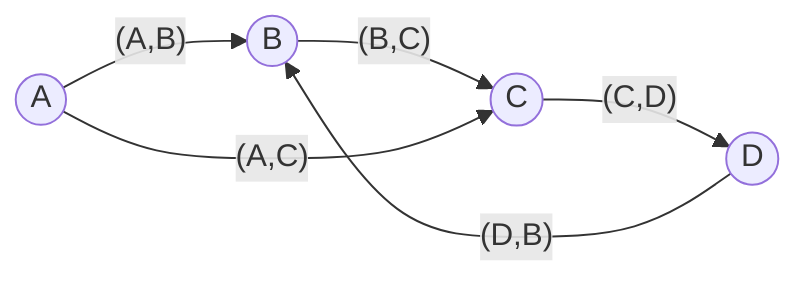

上の図では、$A$ から $B$ への辺は存在するが、$B$ から $A$ への辺は存在しない。また、$B \to C \to D \to B$ という巡回路（サイクル）が存在している点にも注目してほしい。この「サイクルの有無」が、本記事で扱う2つのアルゴリズム群を分ける決定的な分水嶺となる。

### 1.2 有向グラフの基本用語

有向グラフを議論するうえで、以下の用語を整理しておく。

| 用語 | 定義 |
|------|------|
| **入次数**（in-degree） | ある頂点に入ってくる辺の数 |
| **出次数**（out-degree） | ある頂点から出ていく辺の数 |
| **パス**（path） | 頂点の列 $v_1, v_2, \ldots, v_k$ で、各 $(v_i, v_{i+1}) \in E$ |
| **サイクル**（cycle） | 始点と終点が同じパス（$v_1 = v_k$） |
| **DAG** | 有向非巡回グラフ（Directed Acyclic Graph）、サイクルを持たない有向グラフ |
| **到達可能性**（reachability） | 頂点 $u$ から頂点 $v$ へのパスが存在すること |
| **強連結**（strongly connected） | 任意の2頂点 $u, v$ について、$u$ から $v$ へも $v$ から $u$ へもパスが存在すること |

### 1.3 有向グラフの表現方法

有向グラフの実装では、主に**隣接リスト**（adjacency list）と**隣接行列**（adjacency matrix）の2つの表現が用いられる。

```python
# Adjacency list representation
# graph[u] contains a list of vertices v such that (u, v) is an edge
graph = {
    'A': ['B', 'C'],
    'B': ['C'],
    'C': ['D'],
    'D': ['B'],
}

# Adjacency matrix representation
# matrix[i][j] = 1 if there is an edge from vertex i to vertex j
matrix = [
    # A  B  C  D
    [0, 1, 1, 0],  # A
    [0, 0, 1, 0],  # B
    [0, 0, 0, 1],  # C
    [0, 1, 0, 0],  # D
]
```

隣接リストは辺の数に比例する空間計算量 $O(V + E)$ を持ち、疎なグラフに適している。一方、隣接行列は $O(V^2)$ の空間を必要とするが、2頂点間の辺の存在判定が $O(1)$ で可能である。本記事で扱うアルゴリズムは隣接リスト表現を前提とする。

### 1.4 なぜ有向グラフが重要なのか

有向グラフは、現実世界の「依存関係」や「順序関係」を表現する最も自然なモデルである。

- **ビルドシステム**: モジュール $A$ がモジュール $B$ に依存する → $A \to B$ の辺
- **タスクスケジューリング**: タスク $X$ はタスク $Y$ の完了後に実行可能 → $Y \to X$ の辺
- **コンパイラの解析**: 関数の呼び出し関係、データフローの方向
- **Web のリンク構造**: ページ $P$ がページ $Q$ にリンク → $P \to Q$ の辺

これらの問題に対して、「すべての依存関係を満たす順序を見つけたい」あるいは「相互に依存しているグループを特定したい」という要求が自然に生まれる。前者がトポロジカルソート、後者が強連結成分分解の役割である。

## 2. トポロジカルソートの定義

### 2.1 形式的な定義

**トポロジカルソート**（topological sort / topological ordering）とは、DAG（有向非巡回グラフ）$G = (V, E)$ の全頂点を一列に並べたとき、すべての辺 $(u, v) \in E$ について $u$ が $v$ よりも前に出現するような順序付けである。

形式的には、全単射 $\text{ord}: V \to \{1, 2, \ldots, |V|\}$ であって、すべての辺 $(u, v) \in E$ に対して $\text{ord}(u) < \text{ord}(v)$ を満たすものを、$G$ のトポロジカル順序と呼ぶ。

### 2.2 存在条件

トポロジカル順序が存在するための**必要十分条件**は、グラフが DAG であることである。

- **DAG ならばトポロジカル順序が存在する**: DAG には必ず入次数0の頂点が存在する（存在しなければ、どの頂点からも辿り続けられるため有限グラフでサイクルが生じる）。入次数0の頂点を順に取り除いていけば、トポロジカル順序が構成できる。
- **サイクルがあればトポロジカル順序は存在しない**: サイクル $v_1 \to v_2 \to \cdots \to v_k \to v_1$ が存在すると、$\text{ord}(v_1) < \text{ord}(v_2) < \cdots < \text{ord}(v_k) < \text{ord}(v_1)$ が要求され、矛盾する。

### 2.3 一意性

トポロジカル順序は一般に**一意ではない**。例えば、以下の DAG を考える。

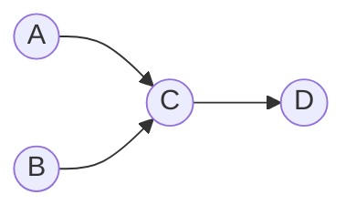

この DAG のトポロジカル順序としては、$[A, B, C, D]$ も $[B, A, C, D]$ も有効である。$A$ と $B$ の間には辺がないため、どちらが先でも構わない。トポロジカル順序が一意になるのは、グラフがハミルトンパス（すべての頂点を一度ずつ通るパス）を持つ場合に限られる。

### 2.4 トポロジカルソートの直観的理解

トポロジカルソートを日常の例で理解するなら、「着替えの順序」が分かりやすい。

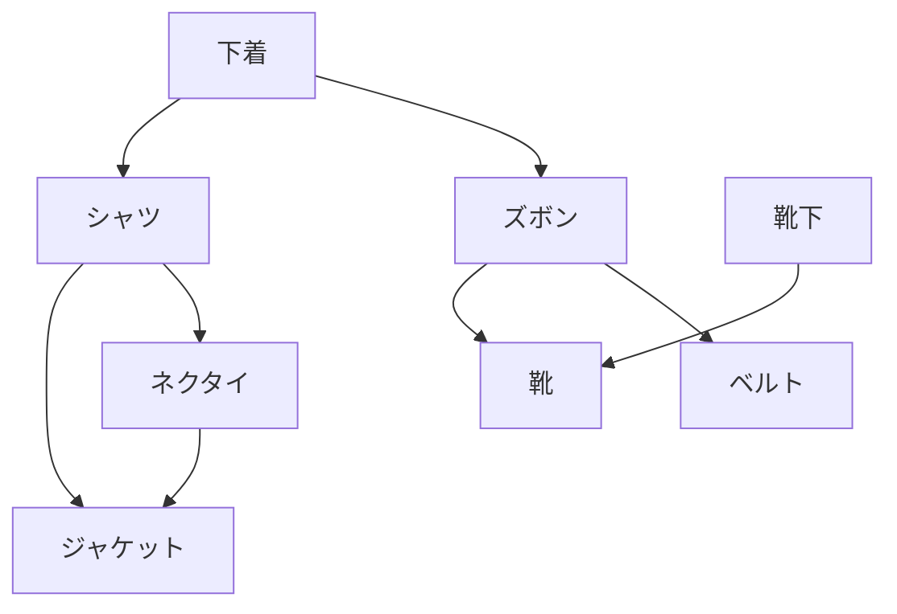

「下着を着てからでないとズボンは履けない」「シャツの上にネクタイをする」といった依存関係をすべて満たしながら、着替えの順番を一列に並べる。これがトポロジカルソートである。

## 3. DFS ベースのトポロジカルソート

### 3.1 アルゴリズムの概要

深さ優先探索（DFS）を用いたトポロジカルソートは、1962年に Tarjan が提案した古典的なアルゴリズムである。基本的な着想は次の通りである。

> **頂点 $v$ の DFS が完了する時点（帰りがけ順）では、$v$ から到達可能なすべての頂点の DFS がすでに完了している。したがって、帰りがけ順の逆順がトポロジカル順序になる。**

### 3.2 アルゴリズムの詳細

```python
def topological_sort_dfs(graph: dict[str, list[str]]) -> list[str]:
    """
    DFS-based topological sort.
    Returns a topological ordering of the vertices.
    Raises ValueError if a cycle is detected.
    """
    WHITE, GRAY, BLACK = 0, 1, 2
    color = {v: WHITE for v in graph}
    order = []

    def dfs(u: str) -> None:
        color[u] = GRAY  # Mark as being processed
        for v in graph[u]:
            if color[v] == GRAY:
                # Back edge detected: cycle exists
                raise ValueError(f"Cycle detected: edge ({u}, {v})")
            if color[v] == WHITE:
                dfs(v)
        color[u] = BLACK  # Mark as completed
        order.append(u)  # Record in post-order

    for v in graph:
        if color[v] == WHITE:
            dfs(v)

    order.reverse()  # Reverse post-order = topological order
    return order
```

各頂点は3つの状態を取る。

- **WHITE（未発見）**: まだ DFS で訪問されていない
- **GRAY（処理中）**: DFS の再帰スタック上にある（探索の途中）
- **BLACK（完了）**: DFS が終了した

### 3.3 正当性の直観的説明

なぜ帰りがけ順の逆がトポロジカル順序になるのか。辺 $(u, v)$ が存在するとき、DFS の実行において以下の2つのケースが考えられる。

1. **$u$ の探索中に $v$ を発見する場合**: $v$ の DFS が $u$ の DFS よりも先に完了する。つまり、$v$ が先に `order` に追加される。逆順にすれば $u$ が $v$ より前に来る。
2. **$v$ がすでに BLACK の場合**: $v$ は $u$ よりも先に `order` に追加済み。逆順にすれば $u$ が $v$ より前に来る。

いずれの場合も、逆順にすれば $u$ が $v$ の前に配置される。これはトポロジカル順序の定義そのものである。

### 3.4 サイクル検出

GRAY の頂点から GRAY の頂点への辺（後退辺、back edge）が見つかった場合、サイクルが存在することを意味する。GRAY 状態の頂点は現在の再帰パス上にあるため、その頂点に戻る辺はサイクルを形成する。

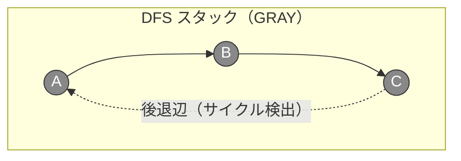

### 3.5 計算量

- **時間計算量**: $O(V + E)$ — 各頂点を一度ずつ訪問し、各辺を一度ずつ走査する
- **空間計算量**: $O(V)$ — 色配列と再帰スタック（最悪の場合、深さ $V$ のチェイン状グラフ）

## 4. Kahn のアルゴリズム（BFS ベース）

### 4.1 アルゴリズムの概要

1962年に Arthur B. Kahn が提案したこのアルゴリズムは、BFS（幅優先探索）の考え方に基づく。着想は非常に直観的である。

> **入次数が0の頂点は、他のどの頂点よりも先に配置できる。その頂点を取り除き、辺を削除すれば、残りのグラフで再び入次数0の頂点が現れる。これを繰り返す。**

### 4.2 アルゴリズムの詳細

```python
from collections import deque

def topological_sort_kahn(graph: dict[str, list[str]]) -> list[str]:
    """
    Kahn's algorithm for topological sort (BFS-based).
    Returns a topological ordering of the vertices.
    Raises ValueError if a cycle is detected.
    """
    # Compute in-degrees
    in_degree = {v: 0 for v in graph}
    for u in graph:
        for v in graph[u]:
            in_degree[v] += 1

    # Initialize queue with vertices of in-degree 0
    queue = deque([v for v in graph if in_degree[v] == 0])
    order = []

    while queue:
        u = queue.popleft()
        order.append(u)
        for v in graph[u]:
            in_degree[v] -= 1
            if in_degree[v] == 0:
                queue.append(v)

    if len(order) != len(graph):
        raise ValueError("Cycle detected: not all vertices processed")

    return order
```

### 4.3 実行例

以下の DAG を例に、アルゴリズムの動作を追跡する。

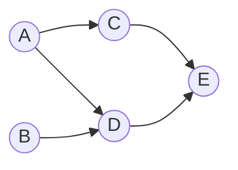

| ステップ | キュー | 取り出し | 入次数の変化 | 出力 |
|---------|--------|---------|------------|------|
| 初期 | [A, B] | - | A:0, B:0, C:1, D:2, E:2 | [] |
| 1 | [B] | A | C:0, D:1 | [A] |
| 2 | [C] | B | D:0 | [A, B] |
| 3 | [D] | C | E:1 | [A, B, C] |
| 4 | [] | D | E:0 | [A, B, C, D] |
| 5 | [] | E | - | [A, B, C, D, E] |

最終結果: $[A, B, C, D, E]$

### 4.4 DFS ベースとの比較

| 観点 | DFS ベース | Kahn（BFS ベース） |
|------|-----------|-------------------|
| 時間計算量 | $O(V + E)$ | $O(V + E)$ |
| 空間計算量 | $O(V)$ | $O(V)$ |
| サイクル検出 | 後退辺の検出 | 全頂点が処理されたか確認 |
| 実装の特徴 | 再帰（スタック） | キュー |
| 結果の制御 | 帰りがけ順に依存 | キューの取り出し順で制御可能 |
| スタックオーバーフロー | 深いグラフで注意が必要 | 発生しない |

実用的には、Kahn のアルゴリズムのほうが次の点で有利な場面がある。

1. **辞書順最小のトポロジカル順序**が欲しい場合、キューを優先度付きキュー（min-heap）に置き換えるだけで対応できる。
2. **並列実行可能なタスク**の特定が容易。キューに同時に入っている頂点は互いに依存関係がなく、並列実行が可能である。
3. **再帰の深さ制限**を気にしなくてよい。

## 5. ビルドシステムでの応用

### 5.1 ビルドシステムとトポロジカルソート

トポロジカルソートの最も代表的な応用例は、ビルドシステムにおける**コンパイル順序の決定**である。`make`、Bazel、Gradle、webpack など、実質的にすべてのビルドシステムは内部的にトポロジカルソートを利用している。

ビルドシステムでは、ソースファイルやモジュール間の依存関係が有向グラフを形成する。ファイル $A$ が $B$ に依存する（$A$ をビルドするには $B$ が先にビルドされている必要がある）とき、辺 $A \to B$ を張る。このグラフのトポロジカル順序の逆順が、実際のビルド順序となる。

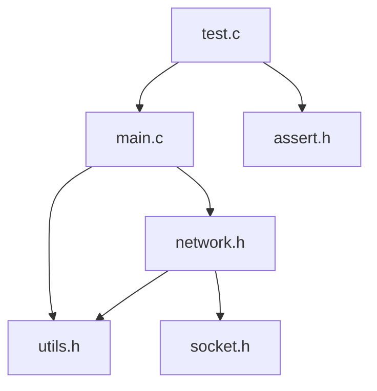

この依存グラフにおいて、`utils.h` と `socket.h` と `assert.h` は何にも依存していないので最初にビルド（またはコンパイル）できる。次に `network.h`、その後 `main.c`、最後に `test.c` という順序でビルドが進む。

### 5.2 Make における実装

GNU Make の内部では、Makefile に記述されたターゲットと依存関係から有向グラフを構築し、トポロジカルソートによってビルド順序を決定している。Make の `-j` オプション（並列ビルド）は、まさに Kahn のアルゴリズムの発想を応用したものである。入次数0のターゲット（すべての依存先がビルド済みのターゲット）を同時にビルドすることで、並列性を最大限に活用する。

```makefile
# Makefile example
main: main.o network.o utils.o
	gcc -o main main.o network.o utils.o

main.o: main.c utils.h network.h
	gcc -c main.c

network.o: network.c network.h socket.h utils.h
	gcc -c network.c

utils.o: utils.c utils.h
	gcc -c utils.c
```

`make -j4` を実行すると、`utils.o` のビルドと他の前提条件のチェックが並行して行われる。Make は内部的に依存グラフのトポロジカル順序を計算し、依存関係を満たしつつ最大限並列にビルドを実行する。

### 5.3 循環依存の検出

ビルドシステムにおいて循環依存は致命的なエラーである。モジュール $A$ が $B$ に依存し、$B$ が $A$ に依存する状況では、どちらを先にビルドすべきか決定できない。

トポロジカルソートは、この循環依存を自然に検出する仕組みを持っている。DFS ベースでは後退辺の検出、Kahn のアルゴリズムでは全頂点が処理できないことによってサイクルが発見される。

実際のビルドツールが出力するエラーメッセージの多くは、この検出メカニズムに基づいている。

```
ERROR: Circular dependency detected:
  module-a -> module-b -> module-c -> module-a
```

### 5.4 パッケージマネージャでの利用

npm、pip、Cargo などのパッケージマネージャも、パッケージの依存関係解決にトポロジカルソートを利用している。パッケージ $P$ がパッケージ $Q$ のバージョン $x$ 以上に依存する場合、バージョン制約を満たしつつトポロジカル順序でインストールが行われる。

### 5.5 タスクスケジューリングへの応用

トポロジカルソートは、タスクスケジューリング問題の基盤でもある。各タスクに実行時間がある場合、**クリティカルパス**（最も時間のかかる依存チェイン）を DAG 上で求めることで、プロジェクト全体の最小完了時間を計算できる。これは PERT（Program Evaluation and Review Technique）チャートの基礎であり、プロジェクト管理における重要な手法である。

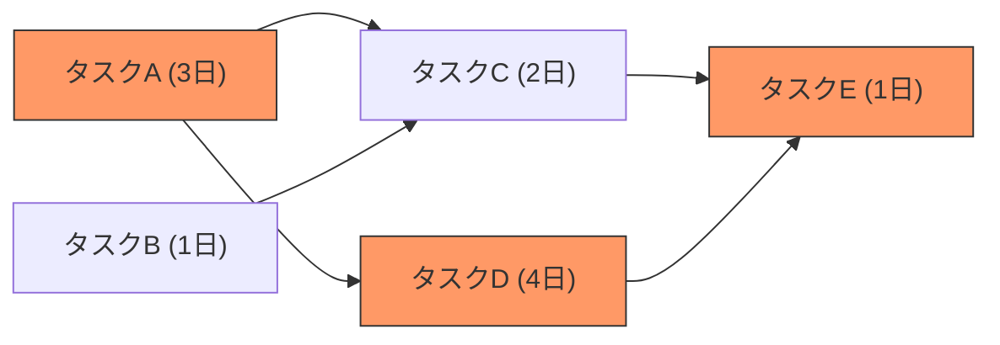

上の例では、クリティカルパスは $A \to D \to E$（合計8日）であり、これがプロジェクト全体の最短完了日数を決定する。

## 6. 強連結成分（SCC）の定義

### 6.1 DAG の先にあるもの

ここまで、トポロジカルソートが DAG に対して有効であることを見てきた。しかし、現実の有向グラフはサイクルを含むことが多い。Web のリンク構造、関数の相互再帰呼び出し、社会的ネットワークにおけるフォロー関係――これらはいずれもサイクルを持つ有向グラフである。

サイクルを含む有向グラフに対して、その構造を理解するための強力なツールが**強連結成分分解**（Strongly Connected Components decomposition, SCC decomposition）である。

### 6.2 強連結の定義

有向グラフ $G = (V, E)$ において、頂点の部分集合 $C \subseteq V$ が**強連結**（strongly connected）であるとは、$C$ 内の任意の2頂点 $u, v$ について、$u$ から $v$ へのパスと $v$ から $u$ へのパスの両方が $G$ 内に存在することである。

**強連結成分**（SCC）とは、極大な強連結部分集合のことである。すなわち、$C$ は強連結であり、かつ $C$ を真に含むような強連結な部分集合が存在しない。

### 6.3 SCC の例

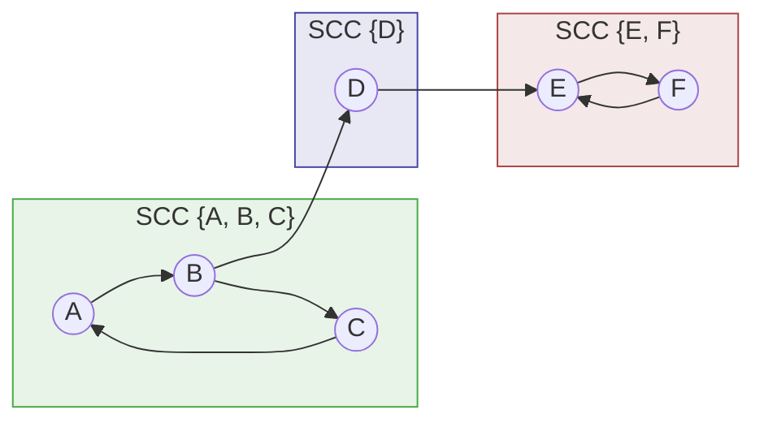

この例では、3つの SCC が存在する。

- $\{A, B, C\}$: $A \to B \to C \to A$ のサイクルにより相互到達可能
- $\{D\}$: 他の頂点との双方向パスがないため、単独で1つの SCC
- $\{E, F\}$: $E \to F \to E$ のサイクルにより相互到達可能

### 6.4 SCC の基本性質

SCC には以下の重要な性質がある。

1. **分割性**: グラフのすべての頂点はちょうど1つの SCC に属する。SCC の集合は $V$ の分割（partition）を形成する。
2. **縮約グラフは DAG**: 各 SCC を1つの頂点に縮約（contract）して得られるグラフ（**SCC-DAG** または**縮約グラフ**、condensation graph）は必ず DAG になる。もし SCC 間にサイクルがあれば、それらの SCC は1つに統合されるべきだからである。

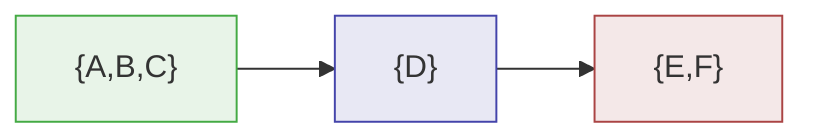

この「サイクルを含むグラフを SCC で縮約して DAG にする」という操作は、非常に強力な問題解決パターンである。サイクルを含む複雑なグラフの問題を、DAG 上の（しばしばはるかに簡単な）問題に帰着できるからである。

## 7. Tarjan のアルゴリズム

### 7.1 概要

1972年に Robert Tarjan が発表した SCC 分解アルゴリズムは、DFS を1回だけ行うことですべての SCC を発見する。計算量は $O(V + E)$ であり、理論的にも実用的にも最適なアルゴリズムの一つである。

### 7.2 核心のアイデア

Tarjan のアルゴリズムの核心は、DFS 木における**後退辺**（back edge）を検出し、各頂点が「DFS 木上でどこまで遡れるか」を追跡することにある。

各頂点 $v$ に対して2つの値を管理する。

- **disc[v]**（discovery time）: DFS で $v$ を最初に訪問した時刻
- **low[v]**: $v$ の部分木から後退辺を通じて到達可能な頂点の中で、最小の discovery time

$\text{low}[v] = \text{disc}[v]$ が成り立つ頂点 $v$ は、ある SCC の「根」（root）である。DFS スタック上で $v$ より上にある頂点すべてが、$v$ と同じ SCC に属する。

### 7.3 アルゴリズムの詳細

```python
def tarjan_scc(graph: dict[str, list[str]]) -> list[list[str]]:
    """
    Tarjan's algorithm for finding all SCCs.
    Returns a list of SCCs, each SCC being a list of vertices.
    """
    index_counter = [0]
    stack = []
    on_stack = {}
    disc = {}
    low = {}
    result = []

    def strongconnect(v: str) -> None:
        disc[v] = index_counter[0]
        low[v] = index_counter[0]
        index_counter[0] += 1
        stack.append(v)
        on_stack[v] = True

        for w in graph.get(v, []):
            if w not in disc:
                # w has not been visited; recurse
                strongconnect(w)
                low[v] = min(low[v], low[w])
            elif on_stack.get(w, False):
                # w is on the stack, so it's in the current SCC
                low[v] = min(low[v], disc[w])

        # If v is the root of an SCC, pop the SCC from the stack
        if low[v] == disc[v]:
            scc = []
            while True:
                w = stack.pop()
                on_stack[w] = False
                scc.append(w)
                if w == v:
                    break
            result.append(scc)

    for v in graph:
        if v not in disc:
            strongconnect(v)

    return result
```

### 7.4 実行トレース

以下のグラフを例に、Tarjan のアルゴリズムの動作を追跡する。

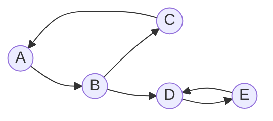

| ステップ | 訪問頂点 | disc | low | スタック | 動作 |
|---------|---------|------|-----|---------|------|
| 1 | A | A:0 | A:0 | [A] | DFS 開始 |
| 2 | B | B:1 | B:1 | [A,B] | A→B を探索 |
| 3 | C | C:2 | C:2 | [A,B,C] | B→C を探索 |
| 4 | - | C:2 | C:0 | [A,B,C] | C→A: A はスタック上、low[C]=min(2,0)=0 |
| 5 | - | C:2 | C:0 | [A,B,C] | C の探索完了、low[C]=0 ≠ disc[C]=2（根ではない） |
| 6 | - | B:1 | B:0 | [A,B,C] | low[B]=min(1,low[C])=min(1,0)=0 |
| 7 | D | D:3 | D:3 | [A,B,C,D] | B→D を探索 |
| 8 | E | E:4 | E:4 | [A,B,C,D,E] | D→E を探索 |
| 9 | - | E:4 | E:3 | [A,B,C,D,E] | E→D: D はスタック上、low[E]=min(4,3)=3 |
| 10 | - | D:3 | D:3 | [A,B,C,D,E] | low[D]=min(3,low[E])=min(3,3)=3 |
| 11 | - | D:3 | D:3 | [A,B,C] | low[D]=disc[D]=3: D は SCC の根。{E,D} を出力 |
| 12 | - | B:1 | B:0 | [A,B,C] | B の探索完了 |
| 13 | - | A:0 | A:0 | [] | low[A]=disc[A]=0: A は SCC の根。{C,B,A} を出力 |

結果: SCC は $\{D, E\}$ と $\{A, B, C\}$ の2つ。

### 7.5 なぜ正しく動作するのか

Tarjan のアルゴリズムの正当性は、以下の不変条件に基づいている。

1. **DFS スタック上の頂点は、現在探索中の SCC の候補である。** まだ SCC として確定していない頂点がスタック上に残る。
2. **low[v] は、$v$ の部分木から到達可能な、スタック上にある頂点の最小 discovery time を表す。** これにより、$v$ がどの SCC に属するかが判定できる。
3. **low[v] = disc[v] のとき、$v$ は SCC の根である。** $v$ からその祖先へ戻れないことを意味し、$v$ より上のスタック要素が1つの SCC を構成する。

## 8. Kosaraju のアルゴリズム

### 8.1 概要

Kosaraju のアルゴリズム（Kosaraju-Sharir のアルゴリズムとも呼ばれる）は、S. Rao Kosaraju が1978年に発見し、Micha Sharir が1981年に独立に発表したアルゴリズムである。DFS を**2回**行うことで SCC を求める。概念的な明快さが特徴であり、教育目的では Tarjan のアルゴリズムよりもしばしば好まれる。

### 8.2 核心のアイデア

Kosaraju のアルゴリズムの背後にある重要な観察は次の通りである。

> **グラフ $G$ の辺をすべて逆向きにした転置グラフ $G^T$ において、SCC はまったく変わらない。**

$u$ から $v$ へのパスと $v$ から $u$ へのパスが $G$ に存在するならば、$G^T$ では $v$ から $u$ へのパスと $u$ から $v$ へのパスが存在する。したがって、$G$ で強連結な頂点集合は $G^T$ でも強連結である。

この性質と、DFS の帰りがけ順の特性を組み合わせる。

### 8.3 アルゴリズムの手順

1. **第1回 DFS（元のグラフ $G$ 上）**: 帰りがけ順（post-order）を記録する。
2. **転置グラフ $G^T$ を構築**: すべての辺の向きを逆にする。
3. **第2回 DFS（$G^T$ 上）**: 第1回の帰りがけ順の**逆順**で頂点を選んで DFS を行う。各 DFS で到達できる頂点集合が1つの SCC になる。

### 8.4 実装

```python
def kosaraju_scc(graph: dict[str, list[str]]) -> list[list[str]]:
    """
    Kosaraju's algorithm for finding all SCCs.
    Returns a list of SCCs, each SCC being a list of vertices.
    """
    # Step 1: Perform DFS on original graph, record finish order
    visited = set()
    finish_order = []

    def dfs1(u: str) -> None:
        visited.add(u)
        for v in graph.get(u, []):
            if v not in visited:
                dfs1(v)
        finish_order.append(u)

    for v in graph:
        if v not in visited:
            dfs1(v)

    # Step 2: Build transpose graph
    transpose = {v: [] for v in graph}
    for u in graph:
        for v in graph[u]:
            transpose[v].append(u)

    # Step 3: DFS on transpose graph in reverse finish order
    visited.clear()
    sccs = []

    def dfs2(u: str, scc: list[str]) -> None:
        visited.add(u)
        scc.append(u)
        for v in transpose.get(u, []):
            if v not in visited:
                dfs2(v, scc)

    for v in reversed(finish_order):
        if v not in visited:
            scc = []
            dfs2(v, scc)
            sccs.append(scc)

    return sccs
```

### 8.5 なぜこれで正しく SCC が求まるのか

直観的な説明を以下に示す。

第1回 DFS の帰りがけ順で最後に完了する頂点は、SCC-DAG においてソース（入次数0の SCC に属する頂点）に対応する。なぜなら、ソース SCC から到達可能な他の SCC の頂点は先に帰りがけ完了するからである。

第2回 DFS を $G^T$ 上で帰りがけ順の逆順（つまりソース SCC から）実行すると、$G^T$ 上ではソース SCC からは同じ SCC 内の頂点にしか到達できない（$G$ 上でソース SCC に向かう辺は $G^T$ では出ていく辺になるが、SCC-DAG のソースには入る辺がないため、$G^T$ のソースに対応する SCC から外には出られない）。

したがって、第2回 DFS で到達する頂点の集合がちょうど1つの SCC を形成する。

### 8.6 実行例

先ほどと同じグラフを使う。


**第1回 DFS（$G$ 上）**: A から開始。

- A → B → C → A（訪問済み）→ C 完了 → D → E → D（訪問済み）→ E 完了 → D 完了 → B 完了 → A 完了
- 帰りがけ順: [C, E, D, B, A]

**転置グラフ $G^T$**:

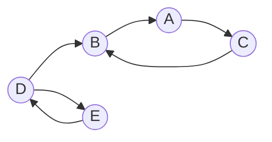

**第2回 DFS（$G^T$ 上、逆順 [A, B, D, E, C] で）**:

1. A から開始: A → C → B → (A 訪問済み, D 訪問済みでない？ いや、B から A へしか辺がない。B → A は訪問済み) → SCC: {A, C, B}

   正確には、$G^T$ で A から到達可能な頂点を探す。A → C（$G^T$ での辺）→ C → B（$G^T$ での辺）→ B → A（訪問済み）。SCC = {A, C, B}。

2. 次に未訪問の D: D → E（$G^T$ での辺）→ E → D（訪問済み）。SCC = {D, E}。

結果: $\{A, B, C\}$ と $\{D, E\}$。Tarjan のアルゴリズムと同じ結果が得られた。

### 8.7 Tarjan と Kosaraju の比較

| 観点 | Tarjan | Kosaraju |
|------|--------|----------|
| DFS の回数 | 1回 | 2回 |
| 時間計算量 | $O(V + E)$ | $O(V + E)$ |
| 空間計算量 | $O(V)$ | $O(V + E)$（転置グラフの保持） |
| 概念的な複雑さ | low-link の理解が必要 | 比較的直観的 |
| 実装の複雑さ | やや複雑 | 単純 |
| オンラインアルゴリズムへの拡張 | 困難 | 困難 |

漸近的な計算量は同じだが、実用的には Tarjan のアルゴリズムのほうが定数倍で高速である（DFS が1回で済み、転置グラフの構築が不要）。一方、Kosaraju のアルゴリズムは「なぜ正しいのか」の理解が容易であり、教育的な価値が高い。

## 9. SCC の応用

### 9.1 2-SAT 問題

SCC 分解の最も有名な応用の一つが **2-SAT**（2-充足可能性問題）の解法である。

#### 2-SAT とは

2-SAT は、ブール変数 $x_1, x_2, \ldots, x_n$ に対して、各節（clause）が最大2つのリテラルの論理和からなる連言標準形（CNF）の充足可能性を判定する問題である。

$$(x_1 \lor \lnot x_2) \land (\lnot x_1 \lor x_3) \land (x_2 \lor x_3)$$

一般の SAT 問題（3-SAT 以上）は NP 完全だが、2-SAT は**多項式時間**で解ける。その鍵が SCC 分解である。

#### 含意グラフ

2-SAT の各節 $(a \lor b)$ は、2つの含意（implication）と等価である。

$$(\lnot a \Rightarrow b) \land (\lnot b \Rightarrow a)$$

「$a$ が偽ならば $b$ は真でなければならない」「$b$ が偽ならば $a$ は真でなければならない」という意味である。

この含意関係を有向グラフで表現したものが**含意グラフ**（implication graph）である。各変数 $x_i$ とその否定 $\lnot x_i$ に頂点を割り当て、含意に対応する辺を張る。

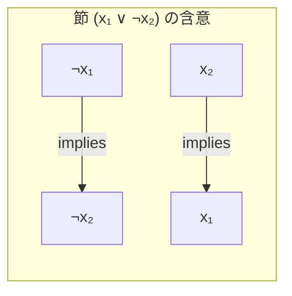

#### SCC による判定

含意グラフに対して SCC 分解を行い、ある変数 $x_i$ とその否定 $\lnot x_i$ が**同じ SCC** に属するかどうかを調べる。

- **同じ SCC に属する場合**: $x_i \Rightarrow \lnot x_i$ かつ $\lnot x_i \Rightarrow x_i$ が成立する（SCC 内では全頂点が相互到達可能）。これは $x_i$ に真も偽も割り当てられないことを意味し、2-SAT は**充足不能**（UNSAT）である。
- **すべての変数について $x_i$ と $\lnot x_i$ が異なる SCC に属する場合**: 2-SAT は**充足可能**（SAT）であり、SCC の縮約 DAG のトポロジカル順序を利用して具体的な真偽の割り当てを構成できる。

具体的には、SCC-DAG のトポロジカル順序において、$\lnot x_i$ の属する SCC が $x_i$ の属する SCC よりも前に来る場合、$x_i = \text{true}$ と割り当てる。

```python
def solve_2sat(n: int, clauses: list[tuple[int, int]]) -> list[bool] | None:
    """
    Solve 2-SAT problem using SCC decomposition.
    Variables are numbered 1 to n.
    Each clause is a pair (a, b) where positive means the variable,
    negative means its negation.
    Returns a satisfying assignment or None if UNSAT.
    """
    # Build implication graph
    # Variable x_i -> node 2*i, negation ¬x_i -> node 2*i+1
    def var_node(literal: int) -> int:
        if literal > 0:
            return 2 * literal
        else:
            return 2 * (-literal) + 1

    def neg_node(node: int) -> int:
        return node ^ 1

    num_nodes = 2 * (n + 1)
    graph = {i: [] for i in range(num_nodes)}

    for a, b in clauses:
        na, nb = var_node(a), var_node(b)
        # (a ∨ b) => (¬a → b) ∧ (¬b → a)
        graph[neg_node(na)].append(nb)
        graph[neg_node(nb)].append(na)

    # Run Tarjan's SCC
    sccs = tarjan_scc(graph)

    # Build SCC-id mapping
    scc_id = {}
    for idx, scc in enumerate(sccs):
        for v in scc:
            scc_id[v] = idx

    # Check satisfiability
    assignment = [False] * (n + 1)
    for i in range(1, n + 1):
        pos, neg = var_node(i), var_node(-i)
        if scc_id[pos] == scc_id[neg]:
            return None  # UNSAT
        # Tarjan outputs in reverse topological order
        assignment[i] = scc_id[pos] > scc_id[neg]

    return assignment[1:]
```

2-SAT は、ネットワーク設計、スケジューリング、回路設計など多くの実用的な場面で現れる。SCC 分解により $O(V + E)$ で解けるという事実は、理論的にも実用的にも極めて重要である。

### 9.2 コンパイラにおける最適化

#### 関数の呼び出しグラフと SCC

コンパイラの最適化パスでは、プログラムの関数間の呼び出し関係を有向グラフ（**コールグラフ**、call graph）として表現する。関数 $f$ が関数 $g$ を呼び出すとき、辺 $f \to g$ を張る。

このコールグラフの SCC は、**相互再帰**（mutual recursion）する関数のグループに対応する。

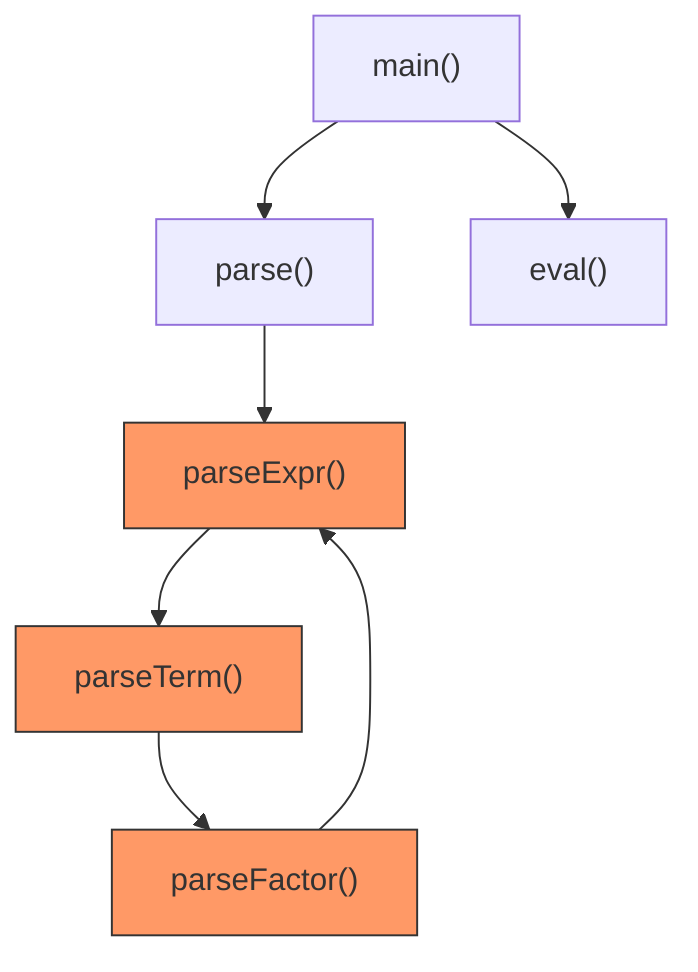

上の例では、`parseExpr` → `parseTerm` → `parseFactor` → `parseExpr` が SCC を形成している。これは再帰下降パーサにおける典型的な相互再帰パターンである。

#### SCC を利用した最適化

コンパイラは SCC の情報を以下のように活用する。

1. **インライン展開の判断**: SCC に属する関数群は相互再帰であるため、単純なインライン展開が困難である。コンパイラは SCC の情報を用いて、インライン展開可能な関数（SCC のサイズが1で自己再帰でないもの）を特定する。

2. **関数間解析の順序**: SCC-DAG のトポロジカル順序の逆順（リーフの SCC から根の SCC へ）で関数間解析を進めることで、呼び出し先の解析結果が呼び出し元の解析に利用できる。

3. **末尾呼び出し最適化**: SCC 内の相互再帰が末尾呼び出しの形式であれば、ループに変換（tail call optimization）することでスタック消費を削減できる。

#### データフロー解析での利用

制御フロー・グラフ（CFG）上のデータフロー解析でも SCC は活用される。CFG のループ構造は SCC に対応しており、SCC 内では反復計算（iterative computation）によって不動点を求める必要がある。SCC-DAG のトポロジカル順序に沿って解析を進めることで、反復の収束を効率化できる。

### 9.3 ソフトウェアアーキテクチャの分析

大規模ソフトウェアのモジュール間依存関係グラフにおいて、SCC はモジュール間の**循環依存**を検出するツールとなる。

理想的なソフトウェア設計では、モジュール間の依存関係は DAG を形成する（上位モジュールが下位モジュールに依存し、逆方向の依存はない）。SCC のサイズが2以上であるということは、モジュール間に循環依存が存在することを意味する。

多くの静的解析ツール（SonarQube、JDepend、deptry など）は、内部的に SCC 分解を利用して循環依存を検出し、リファクタリングの指針を提供している。

### 9.4 Web グラフの構造分析

Web ページのリンク構造を有向グラフとしてモデル化したとき、SCC 分解は Web グラフの巨視的構造を明らかにする。2000年に Broder らが発表した研究では、Web グラフが「蝶ネクタイ構造」（bow-tie structure）を持つことが示された。

```
       ┌──────────┐
       │          │
  IN ──┤ Giant SCC├── OUT
       │          │
       └──────────┘
         ↑      │
      Tendrils  Tendrils
```

- **Giant SCC**: Web の約28%を占める巨大な強連結成分。この中のページ間は相互にリンクを辿って到達可能。
- **IN**: Giant SCC に到達可能だが、Giant SCC からは到達できないページ群。
- **OUT**: Giant SCC から到達可能だが、Giant SCC へは辿れないページ群。

この構造の発見は、Web のクローリング戦略や PageRank の理解に重要な示唆を与えた。

### 9.5 モデル検査（Model Checking）

形式検証の分野では、システムの状態遷移グラフ上で SCC 分解が利用される。特に、**LTL（線形時相論理）**に基づくモデル検査において、受理条件を満たす SCC（公正な SCC）の存在がシステムの性質の充足・違反を判定する鍵となる。Buchi オートマトンの受理条件は「無限に何度も受理状態を訪問する」ことであり、これは受理状態を含む SCC への到達可能性に帰着される。

## 10. トポロジカルソートと SCC の関係

### 10.1 SCC-DAG とトポロジカルソート

ここまでの内容を統合すると、トポロジカルソートと SCC 分解は互いに密接に関連していることが分かる。

1. **DAG にはトポロジカルソートが適用できる。**
2. **任意の有向グラフは SCC 分解により DAG に変換できる。**
3. **したがって、SCC 分解 → 縮約 DAG → トポロジカルソートという手順で、任意の有向グラフに対して意味のある順序付けが可能になる。**

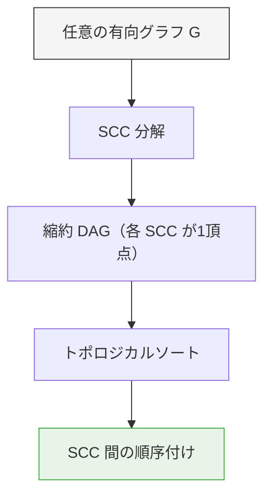

この「SCC 分解 → DAG 上の問題に帰着」というパターンは、アルゴリズム設計における非常に汎用的なテクニックである。

### 10.2 Tarjan のアルゴリズムが返す順序

Tarjan のアルゴリズムでは、SCC が見つかった順序が SCC-DAG の**逆トポロジカル順序**になっているという重要な性質がある。最初に見つかる SCC は SCC-DAG のシンク（出次数0）であり、最後に見つかる SCC は SCC-DAG のソース（入次数0）である。

この性質は、2-SAT の解法で真偽の割り当てを決定する際に直接利用される。

### 10.3 Kosaraju のアルゴリズムが返す順序

Kosaraju のアルゴリズムの第2回 DFS では、SCC が SCC-DAG の**トポロジカル順序**で発見される。第1回 DFS の帰りがけ順の逆順（ソース SCC から処理）で第2回 DFS を行うため、ソース SCC が最初に発見される。

## 11. 発展的なトピック

### 11.1 増分的な SCC 更新

静的なグラフに対する SCC 分解は $O(V + E)$ で解けるが、辺が動的に追加・削除される場合はどうだろうか。辺の追加のたびに SCC を一から計算し直すのは非効率的である。

この問題に対して、いくつかの増分的アルゴリズムが提案されている。辺の追加のみ（decremental ではなく incremental）のケースでは、2つの異なる SCC を統合する操作が必要になる。Union-Find データ構造を組み合わせたアルゴリズムにより、償却計算量を改善できる。

### 11.2 外部メモリ SCC

Web グラフのような巨大なグラフでは、グラフ全体がメインメモリに収まらないことがある。外部メモリ（ディスク）上のグラフに対して効率的に SCC を求めるアルゴリズムも研究されている。基本的なアイデアは、グラフを小さなブロックに分割し、各ブロック内の SCC を求めてから統合する手法である。

### 11.3 並列 SCC アルゴリズム

マルチコアプロセッサや分散システム上での並列 SCC 計算も活発に研究されている。DFS は本質的に逐次的な操作であるため、Tarjan や Kosaraju のアルゴリズムを直接並列化することは困難である。代わりに、到達可能性クエリに基づく分割統治アプローチが用いられる。Fleischer らが提案した Forward-Backward アルゴリズムは、ランダムに選んだ頂点の前方到達集合と後方到達集合の共通部分として SCC を見つけ、残りのグラフを再帰的に処理する。

### 11.4 DAG の最短パスとトポロジカルソート

DAG 上の最短パス問題（辺に重みがある場合）は、トポロジカルソートにより $O(V + E)$ で解ける。Dijkstra 法の $O((V + E) \log V)$ や Bellman-Ford 法の $O(VE)$ と比較して、DAG 上ではトポロジカルソートが最も効率的な手法である。

```python
def dag_shortest_path(graph: dict[str, list[tuple[str, int]]], source: str) -> dict[str, float]:
    """
    Shortest path in a DAG using topological sort.
    graph[u] contains (v, weight) pairs for edge u->v.
    """
    # Get topological order (assumes graph keys cover all vertices)
    adj_list = {v: [w for w, _ in neighbors] for v, neighbors in graph.items()}
    topo_order = topological_sort_dfs(adj_list)

    dist = {v: float('inf') for v in graph}
    dist[source] = 0

    for u in topo_order:
        if dist[u] == float('inf'):
            continue
        for v, weight in graph[u]:
            if dist[u] + weight < dist[v]:
                dist[v] = dist[u] + weight

    return dist
```

これが機能する理由は、トポロジカル順序で処理すれば、ある頂点 $v$ を処理する時点で $v$ に入る辺の始点はすべて処理済みであることが保証されるからである。

## 12. まとめ

本記事では、有向グラフにおける2つの基本的なアルゴリズム群――トポロジカルソートと強連結成分分解――を包括的に解説した。

**トポロジカルソート**は DAG の頂点を依存関係に矛盾しない順序で並べる操作であり、DFS ベースのアルゴリズム（帰りがけ順の逆）と Kahn の BFS ベースアルゴリズム（入次数0の頂点を逐次削除）の2つの標準的手法がある。ビルドシステム、タスクスケジューリング、パッケージ依存解決など、「順序を決める」問題の基盤技術である。

**強連結成分分解**は、サイクルを含む有向グラフの構造を理解するための道具であり、Tarjan のアルゴリズム（DFS 1回、low-link による判定）と Kosaraju のアルゴリズム（DFS 2回、転置グラフの利用）が代表的である。2-SAT、コンパイラ最適化、ソフトウェアの循環依存検出、Web グラフ分析など、応用範囲は広い。

両者は「SCC 分解で任意の有向グラフを DAG に縮約し、トポロジカルソートで順序付ける」という形で統合される。この2段階のアプローチは、有向グラフの問題を解く際の基本パターンとして、あらゆるコンピューターサイエンスの分野で活用されている。

::: tip 要点の整理
| アルゴリズム | 入力 | 出力 | 計算量 |
|-------------|------|------|--------|
| DFS トポロジカルソート | DAG | 頂点の順序 | $O(V + E)$ |
| Kahn のアルゴリズム | DAG | 頂点の順序 | $O(V + E)$ |
| Tarjan の SCC | 有向グラフ | SCC のリスト | $O(V + E)$ |
| Kosaraju の SCC | 有向グラフ | SCC のリスト | $O(V + E)$ |
:::

これらのアルゴリズムはいずれも線形時間 $O(V + E)$ で動作し、理論的にも最適（グラフの入力を読むだけで $O(V + E)$ かかるため）である。そのシンプルさと効率性が、半世紀以上にわたって実用され続けている理由である。
