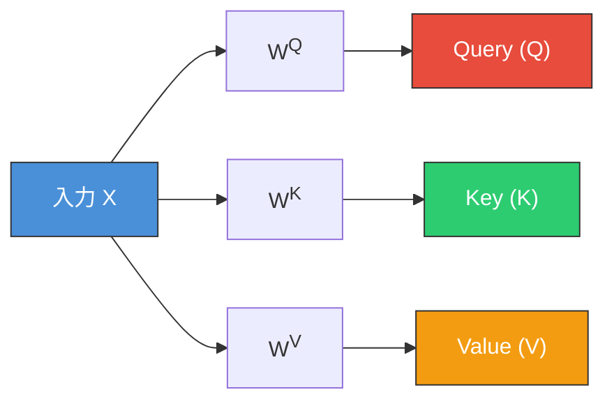
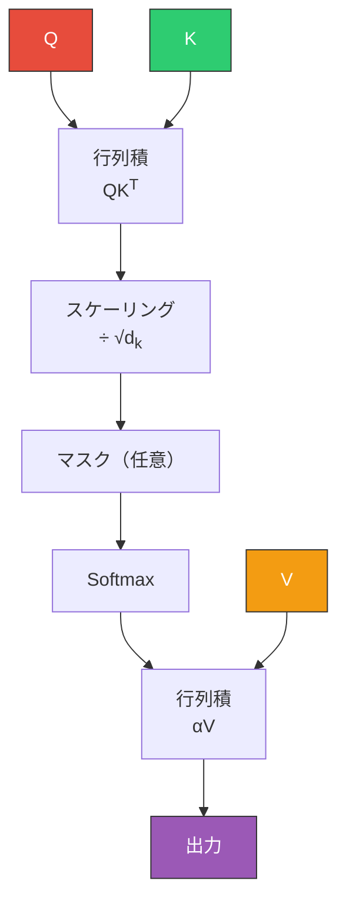
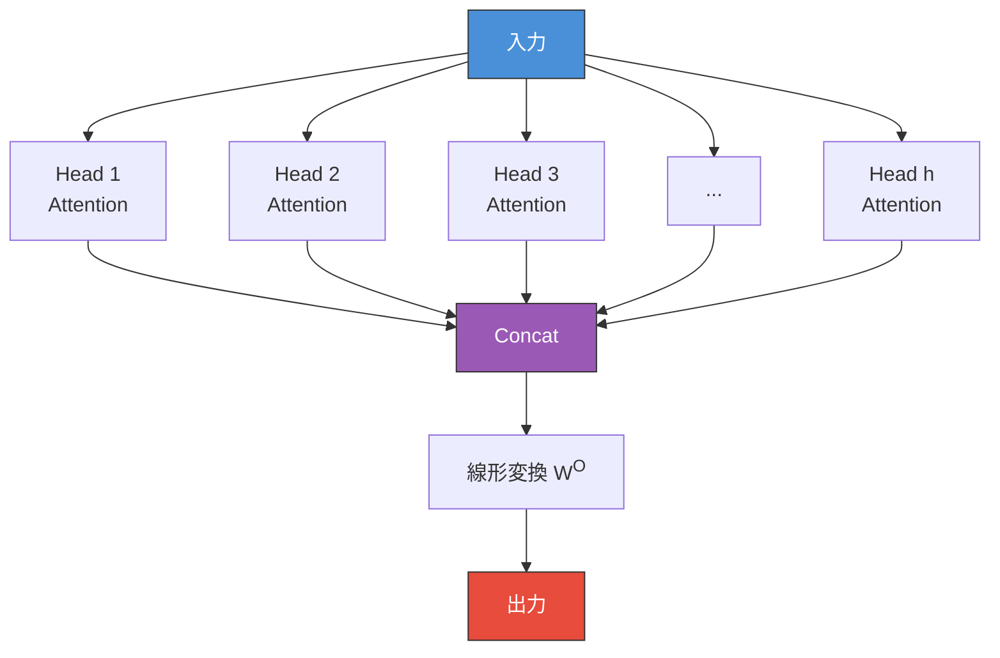
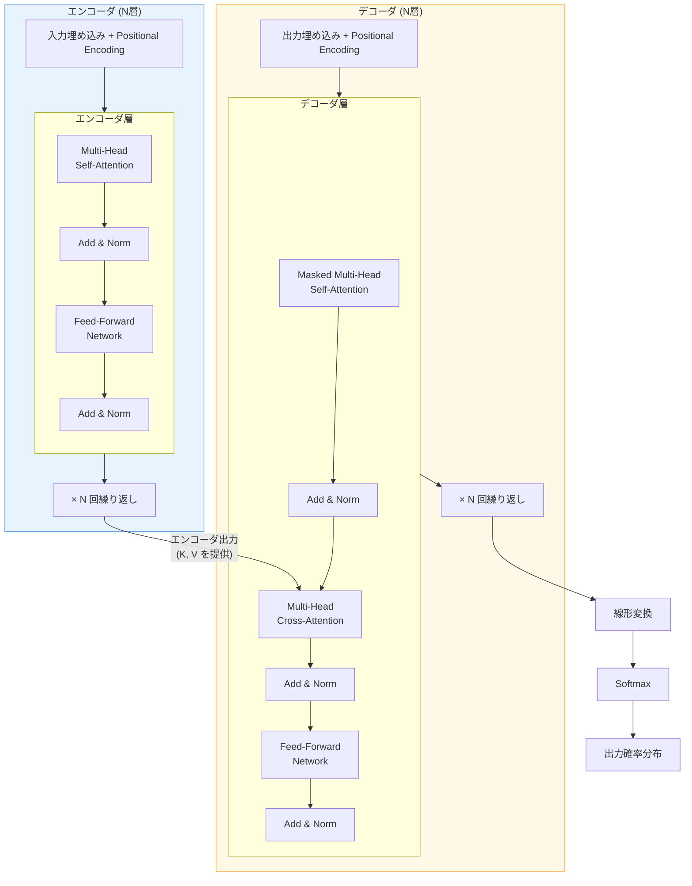
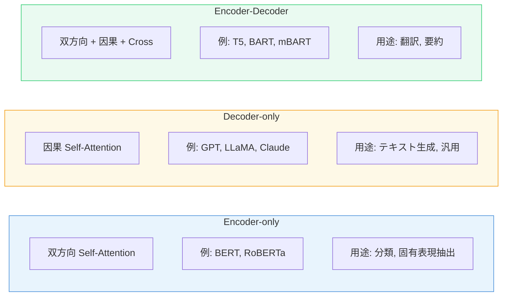

# Transformer と Self-Attention — 系列モデリングの革命

## 1. はじめに：なぜ Transformer が必要だったのか

自然言語処理（NLP）や系列データのモデリングにおいて、2017年以前の主流は**RNN（Recurrent Neural Network）**とその発展形である**LSTM（Long Short-Term Memory）**や**GRU（Gated Recurrent Unit）**であった。これらのモデルは、系列を時間ステップごとに逐次的に処理することで、可変長の入力を扱える柔軟性を持っていた。

しかし、RNNベースのアーキテクチャには本質的な限界がある。

### RNN/LSTM の限界

**1. 逐次処理によるボトルネック**

RNNは時間ステップ $t$ の隠れ状態 $h_t$ を計算するために、前の時間ステップの隠れ状態 $h_{t-1}$ を必要とする。

$$h_t = f(h_{t-1}, x_t)$$

この逐次依存性のため、系列内の各要素を**並列に処理することができない**。系列長 $n$ に対して計算は $O(n)$ の逐次ステップを要し、GPU の並列計算能力を十分に活かせない。学習データの大規模化が進む時代において、これは深刻なスケーラビリティの問題であった。

**2. 長距離依存性の捕捉が困難**

理論的には LSTM のゲート機構が長距離依存性を学習できるとされるが、実際には数百トークンを超えるような長い系列では、初期のトークンの情報が後方まで十分に伝搬しないことが多い。これは**勾配消失問題**に起因する。情報が多数の時間ステップを経由して伝搬するたびに、勾配が指数的に減衰（または爆発）するリスクがある。

**3. 固定次元のボトルネック**

Encoder-Decoder 型の Seq2Seq モデルでは、入力系列全体の情報を固定長のコンテキストベクトルに圧縮する必要があった。入力が長くなるほど、このベトルに情報を詰め込むことが困難になり、情報の損失が避けられない。

### Attention 機構の登場

これらの課題に対して、2014年から2015年にかけて**Attention 機構**が提案された。Bahdanau らの研究（2014年）では、デコーダが各出力ステップでエンコーダの全隠れ状態を参照し、関連する部分に「注意」を向けるメカニズムを導入した。これにより固定長ベクトルのボトルネックは緩和されたが、基盤となる RNN の逐次処理という制約は残ったままであった。

### 「Attention Is All You Need」

2017年、Google Brain と Google Research のチーム（Vaswani ら）は、論文「Attention Is All You Need」において、RNNを完全に排除し、**Attention 機構のみ**でEncoder-Decoderモデルを構成する**Transformer**を提案した。この論文のタイトルが示すとおり、Transformerの核心的な主張は「Attentionさえあれば十分」というものである。

Transformerは以下の特性を実現した。

- **完全な並列化**: 系列内の全位置を同時に処理可能
- **直接的な長距離依存性**: 任意の2つの位置間を定数ステップ $O(1)$ で接続
- **高いスケーラビリティ**: パラメータ数とデータ量に対して予測可能なスケーリング特性

この革新は、その後の NLP のみならず、コンピュータビジョン、音声処理、タンパク質構造予測、さらには汎用的な基盤モデル（Foundation Model）の登場へとつながり、深層学習の歴史における最も重要なブレークスルーのひとつとなった。

## 2. Self-Attention の仕組み

Transformer の中核をなすのが **Self-Attention**（自己注意）機構である。Self-Attentionは、系列内の各要素が他のすべての要素との関連度を計算し、その関連度に基づいて情報を集約するメカニズムである。

### 直感的な理解

自然言語の文を考えてみよう。

> 「その猫は、昨日公園で見かけた**あの**犬を追いかけた。」

この文を理解するためには、「あの」が「犬」を修飾していること、「その猫」が「追いかけた」の主語であること、そして「追いかけた」の目的語が「犬」であることを、文中の各語が互いの関係性を把握する必要がある。Self-Attentionは、まさにこのような**文脈依存的な関係性の計算**を、学習可能な方法で実現する。

### Query, Key, Value

Self-Attentionの核心は、入力系列の各要素を3つの異なるベクトルに変換するところにある。この3つは**Query（Q）**、**Key（K）**、**Value（V）**と呼ばれる。

入力系列 $X \in \mathbb{R}^{n \times d_{\text{model}}}$（$n$ はトークン数、$d_{\text{model}}$ はモデルの次元数）に対して、3つの重み行列 $W^Q, W^K, W^V \in \mathbb{R}^{d_{\text{model}} \times d_k}$ を用いて以下の変換を行う。

$$Q = XW^Q, \quad K = XW^K, \quad V = XW^V$$

これらの名称は、**情報検索**の概念に由来する。

- **Query（問い合わせ）**: 「この位置のトークンは、どのトークンに注目すべきか？」を表すベクトル
- **Key（鍵）**: 「このトークンは、どのような問い合わせに対して関連性があるか？」を表すベクトル
- **Value（値）**: 「このトークンが実際に伝達する情報は何か？」を表すベクトル



この Q, K, V への分離が、Self-Attention に柔軟性をもたらす根本的な設計である。もし Q = K = V = X（つまり変換なしで入力をそのまま使う）であれば、Attention は単なる類似度に基づく加重平均に過ぎない。Q, K, V をそれぞれ独立に学習することで、「何を問うか」「何に対して応答するか」「何を伝えるか」を独立に制御でき、文脈に応じた柔軟な情報の流れを実現する。

### Scaled Dot-Product Attention

Q, K, V が得られた後の Attention の計算は、以下の式で定義される。

$$\text{Attention}(Q, K, V) = \text{softmax}\left(\frac{QK^T}{\sqrt{d_k}}\right)V$$

この計算を段階的に分解して理解しよう。

**ステップ 1: 類似度の計算 $QK^T$**

Query と Key の内積を計算し、各 Query がどの Key と関連性が高いかを測る。結果は $n \times n$ の行列となり、$(i, j)$ 成分は位置 $i$ の Query と位置 $j$ の Key の類似度を表す。

**ステップ 2: スケーリング $\frac{QK^T}{\sqrt{d_k}}$**

内積の値を $\sqrt{d_k}$ で割る。これは極めて重要なステップである。$d_k$ が大きい場合、内積の値も大きくなりやすい。具体的には、Q と K の各成分が平均 0、分散 1 の独立な確率変数であると仮定すると、内積 $q \cdot k = \sum_{i=1}^{d_k} q_i k_i$ の分散は $d_k$ となる。内積の値が大きくなると、softmax の出力が特定の位置に極端に集中（ほぼ one-hot に近づく）し、勾配がほぼゼロとなる領域に入ってしまう。$\sqrt{d_k}$ で割ることで、分散を 1 に正規化し、softmax が適度に滑らかな分布を出力するようにする。

**ステップ 3: Softmax による正規化**

スケーリング後のスコアに softmax を適用し、各行の合計が 1 になるように正規化する。これにより、Attention の重みが確率分布として解釈できるようになる。

$$\alpha_{ij} = \frac{\exp(s_{ij})}{\sum_{k=1}^{n} \exp(s_{ik})}, \quad s_{ij} = \frac{q_i \cdot k_j}{\sqrt{d_k}}$$

**ステップ 4: 加重和 $\alpha V$**

得られた Attention 重みを Value ベクトルに適用し、加重和を計算する。位置 $i$ の出力は、全位置の Value ベクトルを Attention 重みで重み付けした和となる。

$$\text{output}_i = \sum_{j=1}^{n} \alpha_{ij} v_j$$

以下に、Scaled Dot-Product Attention の計算フローを示す。



### 疑似コードによる実装

Self-Attention の計算を Python の疑似コードで示す。

```python
import numpy as np

def scaled_dot_product_attention(Q, K, V, mask=None):
    """
    Compute Scaled Dot-Product Attention.

    Args:
        Q: Query matrix (n x d_k)
        K: Key matrix   (n x d_k)
        V: Value matrix  (n x d_v)
        mask: Optional mask matrix (n x n)
    Returns:
        output: Attention output (n x d_v)
        weights: Attention weights (n x n)
    """
    d_k = K.shape[-1]

    # Step 1 & 2: Compute scaled scores
    scores = Q @ K.T / np.sqrt(d_k)

    # Optional: Apply mask (e.g., for causal attention)
    if mask is not None:
        scores = scores + mask  # mask contains -inf for blocked positions

    # Step 3: Softmax normalization
    weights = softmax(scores, axis=-1)

    # Step 4: Weighted sum of values
    output = weights @ V

    return output, weights
```

### マスク付き Attention

Transformer のデコーダでは、生成時に未来のトークンを参照してはならないという因果律の制約がある。これを実現するために、**Causal Mask（因果マスク）**を適用する。

具体的には、Attention スコア行列の上三角部分（$i < j$ の位置）を $-\infty$ に設定する。softmax を通すと $\exp(-\infty) = 0$ となるため、これらの位置の Attention 重みは 0 になり、未来のトークンからの情報漏洩を防ぐ。

$$\text{mask}_{ij} = \begin{cases} 0 & \text{if } i \geq j \\ -\infty & \text{if } i < j \end{cases}$$

## 3. Multi-Head Attention

Self-Attention の表現力をさらに高めるために、Transformer では**Multi-Head Attention**（多頭注意）を採用している。

### 単一 Head の限界

単一の Attention Head では、ひとつの「注意のパターン」しか表現できない。しかし、自然言語の文を理解するには、構文的な関係（主語-動詞の一致）、意味的な関係（共参照、同義語）、位置的な関係（隣接する単語の修飾関係）など、**複数の異なる種類の関係性**を同時に捕捉する必要がある。

### Multi-Head の仕組み

Multi-Head Attention は、Q, K, V を $h$ 個の異なるヘッドに分割し、各ヘッドで独立に Attention を計算した後、結果を結合する。

$$\text{MultiHead}(Q, K, V) = \text{Concat}(\text{head}_1, \dots, \text{head}_h) W^O$$

$$\text{head}_i = \text{Attention}(QW_i^Q, KW_i^K, VW_i^V)$$

ここで、$W_i^Q \in \mathbb{R}^{d_{\text{model}} \times d_k}$, $W_i^K \in \mathbb{R}^{d_{\text{model}} \times d_k}$, $W_i^V \in \mathbb{R}^{d_{\text{model}} \times d_v}$, $W^O \in \mathbb{R}^{hd_v \times d_{\text{model}}}$ である。

通常、$d_k = d_v = d_{\text{model}} / h$ と設定する。元の論文では $d_{\text{model}} = 512$, $h = 8$ であるから、各ヘッドの次元は $d_k = d_v = 64$ となる。



### なぜ Multi-Head が有効か

Multi-Head Attention の設計には、重要な洞察が含まれている。

**1. 異なる部分空間での注意パターン**

各ヘッドは異なる重み行列 $W_i^Q, W_i^K, W_i^V$ を持つため、入力を異なる部分空間に射影し、それぞれ独自の関係性を学習できる。実際に学習後のモデルを可視化すると、あるヘッドは構文的な依存関係（例：動詞と目的語）を捕捉し、別のヘッドは共参照関係を捕捉している、といった分業が観察される。

**2. 計算量の維持**

$h$ 個のヘッドに分割するが、各ヘッドの次元を $d_{\text{model}} / h$ に縮小するため、Multi-Head Attention 全体の計算量は単一の $d_{\text{model}}$ 次元の Attention と同等である。つまり、**計算コストを増やすことなく**、表現力を大幅に向上させている。

**3. アンサンブル効果**

複数のヘッドの出力を結合し線形変換する構造は、一種のアンサンブル学習と見なすことができる。個々のヘッドの注意パターンが不完全であっても、それらの集約により頑健な表現が得られる。

## 4. Positional Encoding

Self-Attention は集合演算であり、入力の順序に関する情報を本質的に持たない。つまり、入力トークンの順序を入れ替えても、各トークンの出力は（Attention 重みの再配分を除けば）変わらない。これは**置換等変性（permutation equivariance）**と呼ばれる性質である。

しかし、自然言語において語順は重要な情報である。「犬が猫を追いかけた」と「猫が犬を追いかけた」では意味が異なる。そこで、入力に位置情報を付加する**Positional Encoding**が必要となる。

### 正弦波ベースの Positional Encoding

元の Transformer 論文では、以下の正弦波関数を用いた Positional Encoding が提案された。

$$PE_{(pos, 2i)} = \sin\left(\frac{pos}{10000^{2i/d_{\text{model}}}}\right)$$

$$PE_{(pos, 2i+1)} = \cos\left(\frac{pos}{10000^{2i/d_{\text{model}}}}\right)$$

ここで、$pos$ はトークンの位置、$i$ は次元のインデックスである。

この設計には深い意図がある。

**1. 周波数の多様性**

次元 $i$ が増えるにつれて、正弦波の周波数が指数的に減少する。低い次元では高周波（隣接位置を区別）、高い次元では低周波（遠い位置の相対関係を表現）となり、多スケールの位置情報を同時にエンコードできる。

**2. 相対位置の表現能力**

この Positional Encoding には、位置 $pos + k$ のエンコーディングが位置 $pos$ のエンコーディングの線形変換で表現できるという特性がある。すなわち、ある固定のオフセット $k$ に対して、以下が成り立つ。

$$PE_{pos+k} = T_k \cdot PE_{pos}$$

ここで $T_k$ は $k$ のみに依存する行列である。この特性により、モデルは相対的な位置関係を学習しやすくなる。

**3. 任意の長さへの汎化**

正弦波は学習パラメータを含まないため、訓練時に見たことがない長さの系列にも、原理的には適用できる（ただし実際の汎化性能には限界がある）。

Positional Encoding は入力埋め込みに**加算**される。

$$\text{input}_i = \text{Embedding}(x_i) + PE_i$$

加算である点が重要である。連結（concatenation）ではなく加算を用いるのは、モデルの次元数を増やさずに位置情報を注入するためである。

### 学習可能な Positional Encoding

BERT や GPT などの後続モデルでは、位置ごとに学習可能なベクトルを用意する**学習可能な Positional Encoding**（Learned Positional Embedding）が採用されることが多い。

$$PE_{pos} = E_{\text{pos}}[pos] \quad (E_{\text{pos}} \in \mathbb{R}^{L_{\text{max}} \times d_{\text{model}}})$$

ここで $L_{\text{max}}$ は最大系列長であり、各位置に対応するベクトルが通常のパラメータとして学習される。この方式は正弦波ベースの方法と同等かそれ以上の性能を示すことが多いが、訓練時の最大長を超える入力には直接対応できないという制約がある。

### Rotary Position Embedding (RoPE)

近年の大規模言語モデル（LLaMA, Mistral 等）では、**RoPE（Rotary Position Embedding）**が広く採用されている。RoPE は、位置情報を Query と Key に回転行列として適用する手法であり、Attention スコア計算時に**相対位置のみに依存する**バイアスが自然に導入される。

$$q_m^T k_n = (R_m q)^T (R_n k) = q^T R_{n-m} k$$

ここで $R_m$ は位置 $m$ に対応する回転行列である。RoPE の利点は、訓練時の最大長を超える外挿（extrapolation）への対応が比較的容易であること、そして実装が効率的であることにある。

## 5. Transformer アーキテクチャ全体

Transformer は**Encoder-Decoder**構造を採用している。エンコーダは入力系列を連続表現に変換し、デコーダはその連続表現を参照しながら出力系列を生成する。

### 全体構成



### エンコーダ

エンコーダは $N$ 個の同一構造の層を積み重ねた構成である（元の論文では $N = 6$）。各エンコーダ層は以下の2つのサブレイヤーからなる。

1. **Multi-Head Self-Attention**: 入力系列内の各トークンが、同じ系列内の全トークンとの関係を計算する
2. **Position-wise Feed-Forward Network**: 各位置のベクトルに対して独立に適用される全結合ネットワーク

各サブレイヤーには**残差接続（Residual Connection）**と**Layer Normalization** が適用される。

### デコーダ

デコーダも $N$ 個の同一構造の層からなるが、エンコーダと比較して追加の要素がある。各デコーダ層は以下の3つのサブレイヤーからなる。

1. **Masked Multi-Head Self-Attention**: デコーダ側の系列内での Self-Attention。因果マスクにより、位置 $i$ は位置 $j > i$ を参照できない
2. **Multi-Head Cross-Attention**: エンコーダの出力を Key と Value として受け取り、デコーダの隠れ状態を Query として使用する。これにより、デコーダの各位置がエンコーダの出力（入力系列の情報）を参照できる
3. **Position-wise Feed-Forward Network**: エンコーダと同じ構造

### 3種類の Attention

Transformer には3種類の Attention が存在する。これらを混同しないことが重要である。

| Attention の種類 | Q の出所 | K, V の出所 | マスク | 使用場所 |
|---|---|---|---|---|
| Encoder Self-Attention | エンコーダ入力 | エンコーダ入力 | なし | エンコーダ |
| Masked Self-Attention | デコーダ入力 | デコーダ入力 | 因果マスク | デコーダ |
| Cross-Attention | デコーダ | エンコーダ出力 | なし | デコーダ |

## 6. 各コンポーネントの詳細

### Residual Connection（残差接続）

Transformer の各サブレイヤーの出力には、残差接続が適用される。

$$\text{output} = x + \text{SubLayer}(x)$$

残差接続は He ら（2015年、ResNet）によって深層ネットワークの学習を安定化させるために提案された技法であり、Transformer においても不可欠な役割を果たす。

**なぜ残差接続が重要か。**

深層ネットワークでは、層を重ねるほど勾配が伝搬しにくくなる。残差接続は、勾配が変換層をバイパスして直接前の層に伝搬するパスを提供する。数学的には、損失関数 $\mathcal{L}$ に対して、

$$\frac{\partial \mathcal{L}}{\partial x} = \frac{\partial \mathcal{L}}{\partial \text{output}} \cdot \left(1 + \frac{\partial \text{SubLayer}(x)}{\partial x}\right)$$

となり、$\frac{\partial \text{SubLayer}(x)}{\partial x}$ がゼロに近づいても、恒等写像の項（$1$）により勾配が消失しない。これにより、数十層に及ぶ Transformer の安定した学習が可能となる。

### Layer Normalization

Transformer では、**Layer Normalization**（Ba ら、2016年）が使用される。Batch Normalization とは異なり、Layer Normalization は単一のサンプル内で、特徴次元に沿って正規化を行う。

$$\text{LayerNorm}(x) = \gamma \cdot \frac{x - \mu}{\sqrt{\sigma^2 + \epsilon}} + \beta$$

ここで、$\mu$ と $\sigma^2$ はそれぞれ $x$ の各要素の平均と分散（同一サンプル内の全次元にわたって計算）、$\gamma$ と $\beta$ は学習可能なスケールとシフトのパラメータ、$\epsilon$ はゼロ除算を防ぐための微小値である。

**なぜ Batch Normalization ではなく Layer Normalization を使うのか。**

- **系列長の可変性**: Batch Normalization はミニバッチ内の統計量を使用するが、系列データでは各サンプルの長さが異なりうるため、パディングの影響を受ける
- **推論時の安定性**: Layer Normalization はサンプルごとに独立に計算されるため、バッチサイズ1でも安定に動作する
- **並列処理との相性**: 分散学習において、バッチ統計量の同期が不要である

#### Pre-Norm vs Post-Norm

元の Transformer 論文では、サブレイヤーの**後に** Layer Normalization を適用する **Post-Norm** 構成を使用している。

$$\text{output} = \text{LayerNorm}(x + \text{SubLayer}(x))$$

しかし、後続の研究により、サブレイヤーの**前に** Layer Normalization を適用する **Pre-Norm** 構成の方が学習が安定しやすいことが示された。

$$\text{output} = x + \text{SubLayer}(\text{LayerNorm}(x))$$

Pre-Norm は、特に深いモデル（数十層以上）において、学習率のウォームアップなしでも安定した学習を可能にする。現在の多くの大規模モデル（GPT-2以降、LLaMA等）は Pre-Norm を採用している。

### Position-wise Feed-Forward Network

各 Attention サブレイヤーの後には、**Position-wise Feed-Forward Network（FFN）**が配置される。これは各位置に独立に適用される2層の全結合ネットワークである。

$$\text{FFN}(x) = W_2 \cdot \text{ReLU}(W_1 x + b_1) + b_2$$

ここで、$W_1 \in \mathbb{R}^{d_{\text{model}} \times d_{ff}}$, $W_2 \in \mathbb{R}^{d_{ff} \times d_{\text{model}}}$ であり、通常 $d_{ff} = 4 \times d_{\text{model}}$ と設定される。元の論文では $d_{\text{model}} = 512$, $d_{ff} = 2048$ である。

**FFN の役割は何か。**

Self-Attention は、トークン間の情報の混合（token mixing）を行うが、各位置のベクトルの非線形変換は行わない。FFN は、各位置で独立に非線形変換を適用し、Attention で集約された情報を**より抽象的な表現に変換する**役割を担う。

後続の研究では、FFN がモデルの「知識の記憶装置」として機能しているという見方もある。Attention が「どの情報を参照するか」を決定し、FFN が「参照した情報をどのように変換・活用するか」を決定する、という役割分担である。

#### 活性化関数の改良

元の論文では ReLU が使用されたが、後続のモデルではより高性能な活性化関数が採用されている。

- **GELU（Gaussian Error Linear Unit）**: BERT, GPT で使用。$\text{GELU}(x) = x \cdot \Phi(x)$（$\Phi$ は標準正規分布の累積分布関数）
- **SwiGLU**: LLaMA, PaLM で使用。GLU（Gated Linear Unit）と Swish を組み合わせた活性化関数で、FFN の内部構造を $\text{SwiGLU}(x) = (\text{Swish}(xW_1)) \odot (xW_3)$ に変更する。パラメータ数は若干増えるが、同じパラメータ数あたりの性能が向上する

## 7. 学習と推論

### 教師あり学習と Teacher Forcing

Transformer の学習は、通常の教師あり学習として行われる。機械翻訳の例では、ソース文をエンコーダに、ターゲット文（1位置シフト）をデコーダに入力し、デコーダの各位置で次のトークンの予測確率を出力する。

損失関数としては、各位置での**クロスエントロピー損失**の合計（または平均）を使用する。

$$\mathcal{L} = -\sum_{t=1}^{T} \log P(y_t | y_{<t}, X)$$

学習時のデコーダへの入力には、**Teacher Forcing** が使用される。これは、前のステップでモデルが予測したトークンではなく、正解のトークンをデコーダの入力として与える手法である。

Teacher Forcing を使う理由は2つある。

1. **学習の効率化**: モデルの初期段階では予測が不正確であり、誤った予測を次の入力にすると、エラーが蓄積して学習が不安定になる（exposure bias）
2. **並列化の実現**: 正解系列をすべて同時にデコーダに入力できるため、学習時にはデコーダも完全に並列化できる。自己回帰的に生成する必要がない

### 学習率スケジュール

元の Transformer 論文では、以下の学習率スケジュールが提案された。

$$\text{lr} = d_{\text{model}}^{-0.5} \cdot \min(\text{step}^{-0.5}, \text{step} \cdot \text{warmup\_steps}^{-1.5})$$

この式は、最初の `warmup_steps` ステップ（元の論文では4000ステップ）では学習率を線形に増加させ、その後は逆平方根で減衰させる。

ウォームアップが必要な理由は、学習の初期段階では、パラメータがランダムに初期化されているため、Attention 重みが不安定であり、大きな学習率を適用すると学習が発散するリスクがあるためである。

### 自己回帰デコーディング

推論時（テスト時）には、デコーダは**自己回帰的（auto-regressive）**にトークンを一つずつ生成する。

1. 開始トークン（例: `<BOS>`）をデコーダに入力
2. デコーダが次のトークンの確率分布を出力
3. 確率分布からトークンを選択（サンプリングまたは argmax）
4. 選択したトークンを入力に追加し、ステップ 2 に戻る
5. 終了トークン（例: `<EOS>`）が生成されるか、最大長に達したら終了

この自己回帰性のため、推論時には系列長に比例した逐次的な計算が必要となり、学習時の並列性とは対照的にボトルネックとなる。

### デコーディング戦略

生成時のトークン選択方法には複数の戦略がある。

**Greedy Decoding**

各ステップで最も確率の高いトークンを選択する。計算は高速だが、局所最適に陥りやすく、生成品質が低くなる場合がある。

**Beam Search**

$k$ 個の候補系列（ビーム）を同時に保持し、各ステップでビームを拡張・枝刈りしながら、最終的に最も確率の高い系列を選択する。機械翻訳のような正解が比較的明確なタスクで有効だが、ビーム幅 $k$ に比例して計算コストが増加する。

**温度付きサンプリング**

確率分布を温度パラメータ $\tau$ で調整してからサンプリングする。

$$P(y_t = w) = \frac{\exp(z_w / \tau)}{\sum_{w'} \exp(z_{w'} / \tau)}$$

$\tau < 1$ で分布がシャープ（高確率トークンがより選ばれやすい）、$\tau > 1$ で分布がフラット（多様性が増す）になる。

**Top-k サンプリング**

確率上位 $k$ 個のトークンのみを候補とし、その中からサンプリングする。

**Top-p（Nucleus）サンプリング**

累積確率が $p$ を超えるまでのトークンを候補とする。Top-k と異なり、確率分布の形状に応じて候補数が動的に変化するため、より柔軟なサンプリングが可能である。

## 8. 発展と応用

Transformer アーキテクチャは、提案後わずか数年で、NLP を超えて多くの分野に波及した。ここでは代表的な発展を概観する。

### BERT（2018年）— 双方向エンコーダ

Google が提案した **BERT（Bidirectional Encoder Representations from Transformers）** は、Transformer のエンコーダ部分のみを使用し、大規模なラベルなしテキストで**事前学習**を行うモデルである。

BERT の革新的な点は、**Masked Language Model（MLM）**という事前学習タスクにある。入力の一部のトークンを `[MASK]` に置き換え、それを予測するように学習する。これにより、各位置のトークンが左右両方のコンテキストを参照できる**双方向の表現**が得られる。

BERT は NLP の多くのベンチマークで従来手法を大幅に上回り、「事前学習 + ファインチューニング」というパラダイムを確立した。

### GPT シリーズ（2018年〜）— 自己回帰言語モデル

OpenAI の **GPT（Generative Pre-trained Transformer）** シリーズは、Transformer のデコーダ部分のみを使用し、**自己回帰的な言語モデリング**（次のトークン予測）で事前学習を行うモデルである。

- **GPT-1（2018年）**: 1.17億パラメータ。事前学習 + ファインチューニングの有効性を実証
- **GPT-2（2019年）**: 15億パラメータ。ファインチューニングなしでも多くのタスクをこなせる「ゼロショット」能力を示した
- **GPT-3（2020年）**: 1750億パラメータ。少数の例を提示するだけで多様なタスクに対応できる「Few-shot Learning」能力を実証。スケーリング則の重要性を明確にした
- **GPT-4（2023年）**: マルチモーダル入力（テキストと画像）に対応。性能の大幅な向上

GPT シリーズの成功は、「Scaling Laws」—— モデルサイズ、データ量、計算量を増やすほど性能が予測可能に向上する —— という経験則の発見につながった。

### Encoder-only vs Decoder-only vs Encoder-Decoder

Transformer から派生した3つのアーキテクチャパターンを整理する。



近年では、**Decoder-only** アーキテクチャが大規模言語モデルの主流となっている。これは、自己回帰的な生成という統一的なフレームワークで多様なタスクを処理でき、かつスケーリング特性が良好であるためである。

### Vision Transformer (ViT)（2020年）

Google Research が提案した **ViT（Vision Transformer）** は、Transformer を画像認識に適用したモデルである。画像を固定サイズのパッチに分割し、各パッチを「トークン」として扱うことで、NLP の Transformer をほぼそのまま画像に適用できることを示した。

$$\text{Image} \rightarrow \text{Patches} \rightarrow \text{Linear Projection} \rightarrow \text{Transformer Encoder} \rightarrow \text{Classification}$$

ViT は、十分な量のデータで事前学習を行えば、CNN（畳み込みニューラルネットワーク）を上回る性能を達成できることを示し、コンピュータビジョンにおいても Transformer が CNN に取って代わりうることを証明した。

### その他の応用領域

Transformer の適用範囲は急速に拡大している。

- **音声処理**: Whisper（OpenAI）は音声認識に Transformer を使用
- **タンパク質構造予測**: AlphaFold2（DeepMind）は Transformer ベースのアーキテクチャでタンパク質の3次元構造を予測
- **マルチモーダルモデル**: テキスト、画像、音声を統一的に処理するモデル（GPT-4V, Gemini 等）
- **強化学習**: Decision Transformer は系列モデリングとして強化学習を再定式化
- **コード生成**: Codex, GitHub Copilot は Transformer ベースのコード生成モデル

## 9. 計算量とスケーリング特性

### Self-Attention の計算量

Self-Attention の計算量を分析する。系列長を $n$、モデルの次元数を $d$ とする。

- **$QK^T$ の計算**: $O(n^2 d)$ —— $n \times d$ の行列と $d \times n$ の行列の積
- **Attention 重みと V の積**: $O(n^2 d)$
- **メモリ使用量**: $O(n^2)$ —— Attention 重み行列のサイズ

したがって、Self-Attention の計算量は系列長に対して**二次的**（$O(n^2)$）である。これは、RNN の $O(n)$ と比較してスケーラビリティの面で不利に見えるが、RNN は逐次的な $O(n)$ ステップを必要とするのに対し、Self-Attention は完全に並列化可能であるため、実際の壁時計時間ではしばしば Self-Attention の方が高速である。

ただし、$n$ が非常に大きくなる（数万トークン以上）場合、$O(n^2)$ の計算量とメモリ使用量は深刻なボトルネックとなる。

### Efficient Attention の研究

$O(n^2)$ の計算量を削減するための研究が活発に行われている。

| 手法 | 計算量 | アプローチ |
|---|---|---|
| Sparse Attention | $O(n\sqrt{n})$ | 固定パターンのスパースな Attention |
| Linear Attention | $O(n)$ | カーネル近似による行列積の順序変更 |
| Flash Attention | $O(n^2)$（理論値は同じ） | IO-aware な実装でメモリアクセスを最適化 |
| Sliding Window Attention | $O(nw)$ | 固定幅 $w$ のウィンドウ内のみ Attention |

特に **Flash Attention**（Dao ら、2022年）は、計算量自体は変えないが、GPU のメモリ階層（SRAM と HBM）を考慮した実装により、実際の実行速度とメモリ使用量を劇的に改善した。これは、計算量のオーダーだけでなく、ハードウェア特性を考慮した最適化の重要性を示す好例である。

### スケーリング則（Scaling Laws）

Kaplan ら（2020年）や Hoffmann ら（2022年、Chinchilla 論文）の研究により、Transformer ベースの言語モデルの性能は、以下の3つの要素のべき乗則に従って予測可能に向上することが示されている。

$$L(N, D, C) \approx \left(\frac{N_c}{N}\right)^{\alpha_N} + \left(\frac{D_c}{D}\right)^{\alpha_D} + L_\infty$$

ここで、$L$ は損失、$N$ はパラメータ数、$D$ はデータ量、$C$ は計算量である。

**Chinchilla の最適配分則**

Hoffmann らは、与えられた計算予算 $C$ に対して、パラメータ数とデータ量をどのように配分すべきかを分析した。結論は、パラメータ数とトレーニングトークン数を**ほぼ等しい比率で増やす**のが最適であるというものである。具体的には、パラメータ数を $N$ としたとき、トレーニングトークン数は約 $20N$ が最適とされる。

この発見は、それ以前の「パラメータ数を優先して大きくする」というアプローチ（GPT-3 など）に対する重要な修正であり、後続のモデル設計に大きな影響を与えた。

### KV Cache

自己回帰デコーディングにおいて、生成済みのトークンに対する Key と Value の計算は、新しいトークンを生成するたびに繰り返される。**KV Cache** はこの冗長な計算を回避するために、過去のトークンの Key と Value をメモリにキャッシュしておく手法である。

KV Cache により計算量は削減されるが、キャッシュ自体のメモリ使用量が問題となる。バッチサイズ $B$、層数 $L$、ヘッド数 $h$、ヘッド次元 $d_k$、系列長 $n$ に対して、KV Cache のメモリ使用量は以下となる。

$$\text{KV Cache} = 2 \times B \times L \times h \times d_k \times n \times \text{sizeof(dtype)}$$

長い系列や大きなバッチサイズでは、KV Cache のメモリ使用量がモデルパラメータのメモリ使用量を超えることがある。GQA（Grouped-Query Attention）や MQA（Multi-Query Attention）は、Key と Value のヘッド数を削減することで KV Cache のサイズを抑える手法である。

## 10. 限界と今後の展望

### 現在の限界

**1. 二次的計算量**

前述のとおり、Self-Attention の $O(n^2)$ の計算量は、非常に長い系列の処理において依然として大きな課題である。書籍全体やコードベース全体を一度にコンテキストに含めるような応用では、この制約が顕著になる。Efficient Attention の研究は進んでいるが、完全な Self-Attention と同等の品質を維持しつつ計算量を削減することは容易ではない。

**2. Positional Encoding の外挿**

訓練時のコンテキスト長を超える推論（外挿）は、多くの Positional Encoding 方式で性能が急激に劣化する。RoPE ベースの手法や ALiBi（Attention with Linear Biases）など、外挿性能を改善する手法が提案されているが、根本的な解決には至っていない。

**3. 推論コスト**

大規模 Transformer モデルの推論は、計算コスト、メモリ使用量、レイテンシのすべてにおいて高コストである。量子化（Quantization）、蒸留（Knowledge Distillation）、スペキュレーティブデコーディング（Speculative Decoding）などの最適化手法が活発に研究されている。

**4. ハルシネーション**

Transformer ベースの言語モデルは、事実に基づかない情報をもっともらしく生成する「ハルシネーション（幻覚）」を起こすことがある。これは、モデルが統計的パターンに基づいて出力を生成するためであり、真の「理解」や「推論」とは異なる。

**5. 解釈可能性**

Transformer の内部表現や意思決定過程の解釈は依然として困難である。Attention 重みの可視化は直感的な理解を提供するが、Attention 重みが入力の重要性を正確に反映しているとは限らないことが指摘されている。

### 今後の展望

**1. State Space Models（SSM）と Mamba**

線形な計算量で長い系列を処理できる **State Space Models**（S4, Mamba 等）が注目されている。特に Mamba は、入力依存的なパラメータ化によって、Transformer に匹敵する性能を$O(n)$ の計算量で達成する可能性を示している。Transformer との融合アーキテクチャ（Jamba 等）も研究されている。

**2. Mixture of Experts（MoE）**

全パラメータのうち一部のみを活性化する **Mixture of Experts** アーキテクチャにより、パラメータ数を増やしつつ推論時の計算量を抑えることが可能である。Switch Transformer や Mixtral などがこのアプローチを採用している。

**3. マルチモーダル統合**

テキスト、画像、音声、動画など、複数のモダリティを統一的に処理する Transformer ベースのモデルが発展している。「トークン化可能な任意のデータ」を処理できるという Transformer の汎用性が、この方向性を後押ししている。

**4. 推論時計算のスケーリング（Test-Time Compute）**

従来のスケーリング則が訓練時の計算量に焦点を当てていたのに対し、推論時に追加の計算を行うことで性能を向上させるアプローチが注目されている。Chain-of-Thought プロンプティングや、複数回の生成と検証を組み合わせる手法がその例である。

**5. より効率的な学習手法**

LoRA（Low-Rank Adaptation）や QLoRA（Quantized LoRA）などのパラメータ効率的なファインチューニング手法により、大規模モデルの適応コストを大幅に削減する研究が進んでいる。また、事前学習データの品質向上による学習効率の改善も重要な研究方向である。

## 11. まとめ

Transformer は、Self-Attention という単純かつ強力なメカニズムを核として、系列モデリングに革命をもたらした。その本質的な貢献は以下の3点に集約される。

1. **並列化可能な系列処理**: RNN の逐次処理というボトルネックを排除し、GPU の計算能力を最大限に活用する道を開いた
2. **直接的な長距離依存性**: 系列内の任意の2点を定数ステップで接続することで、長距離の依存関係の学習を容易にした
3. **スケーラブルなアーキテクチャ**: パラメータ数、データ量、計算量に対して予測可能なスケーリング特性を示し、大規模化による性能向上の道筋を明確にした

Transformer の登場以降、このアーキテクチャは NLP にとどまらず、コンピュータビジョン、音声処理、科学計算など、あらゆる領域に浸透した。「Attention Is All You Need」という論文タイトルの大胆な主張は、少なくとも現時点においては、驚くべき正確さをもって現実のものとなっている。

しかし、二次的計算量、外挿の困難さ、推論コストといった課題は残されており、これらを克服する次世代のアーキテクチャの模索も続いている。Transformer が永遠に支配的であるかどうかは未知数だが、その設計思想 —— 特に Attention による動的な情報の選択と集約という概念 —— は、今後のアーキテクチャ設計にも深い影響を与え続けるだろう。
