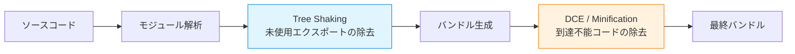
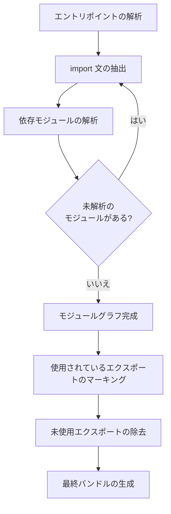
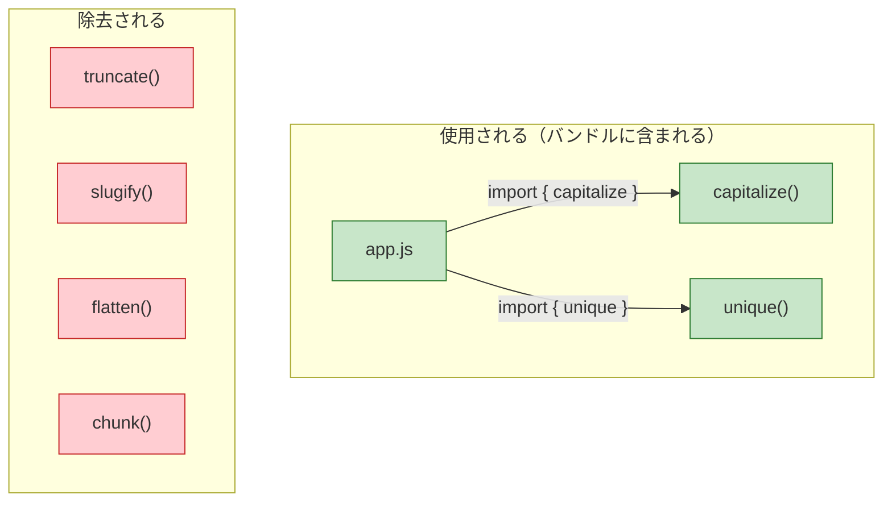
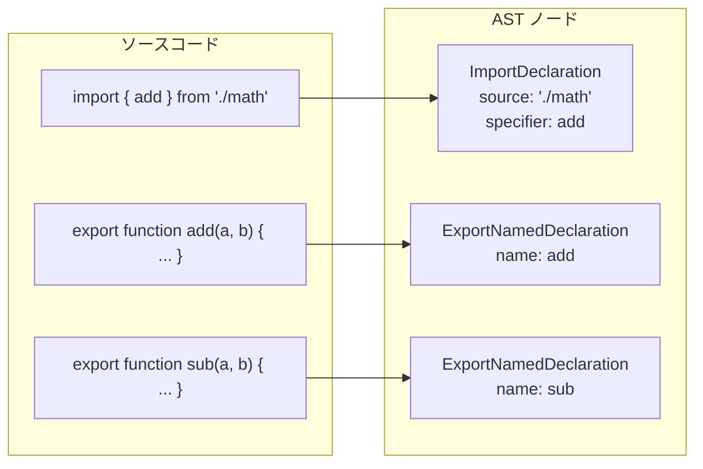
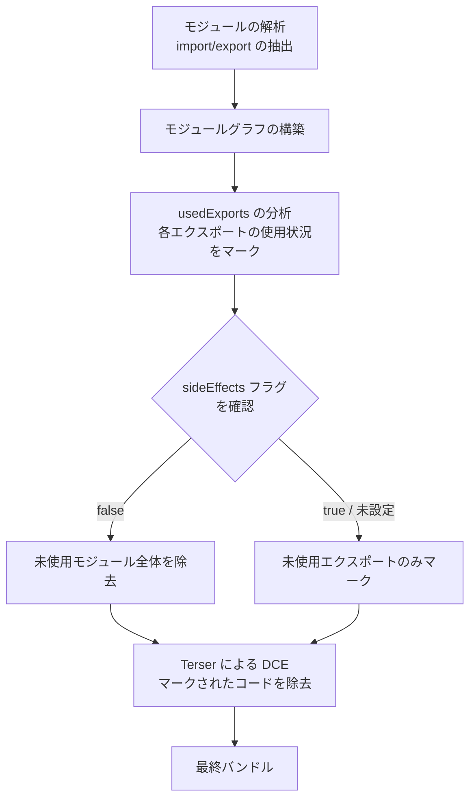
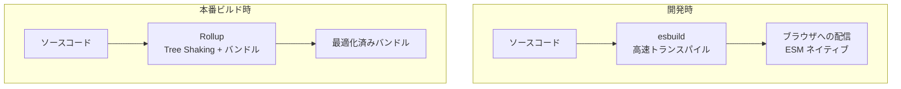
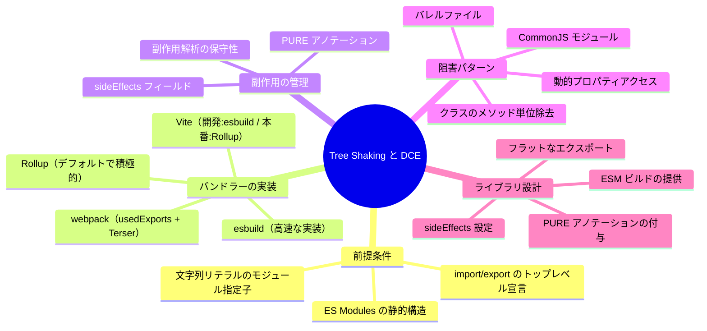

# Tree Shaking とデッドコード除去

## なぜ不要なコードを除去する必要があるのか

現代のフロントエンド開発では、npm パッケージを通じて膨大な量のサードパーティコードを利用する。典型的な Web アプリケーションの `node_modules` ディレクトリは数百 MB に達することも珍しくなく、実際にアプリケーションが使用するコードはその中のごく一部にすぎない。

たとえば、Lodash のユーティリティ関数を 1 つだけ使いたい場合でも、ライブラリ全体をバンドルに含めてしまえば、数十 KB から百 KB 以上の不要なコードがユーザーに配信されることになる。このような不要なコードは以下の観点で問題を引き起こす。

1. **ダウンロード時間の増大**: バンドルサイズが大きくなるほど、ネットワーク転送にかかる時間が増加する。特にモバイル回線では顕著な影響がある
2. **パース・コンパイル時間の増大**: ブラウザは JavaScript ファイルをダウンロードした後、パースしてバイトコードにコンパイルする必要がある。不要なコードであってもこのコストは発生する
3. **メモリ消費**: パースされたコードはメモリ上に保持され、メモリが制約されたデバイスではパフォーマンスに影響する
4. **キャッシュ効率の低下**: 不要なコードが含まれることで、本来変更のない部分までキャッシュが無効化される可能性がある

こうした問題に対処するために、ビルド時に不要なコードを自動的に検出・除去する技術が発展してきた。その代表的な手法が **Tree Shaking** と **デッドコード除去（Dead Code Elimination: DCE）** である。

## Tree Shaking とデッドコード除去の定義と違い

Tree Shaking とデッドコード除去は、いずれも「最終的なバンドルから不要なコードを取り除く」という目的を共有するが、そのアプローチは根本的に異なる。

### デッドコード除去（DCE）

デッドコード除去は、コンパイラ最適化の古典的な技法であり、プログラム中で実行されることのないコード（デッドコード）を検出して削除する。この技法は C/C++ コンパイラにおいて数十年の歴史を持ち、以下のようなパターンを検出する。

- **到達不能コード（Unreachable Code）**: `return` 文の後に続くコードや、常に偽となる条件分岐の本体など
- **未使用の変数・関数**: 定義されたが一度も参照されないローカル変数や関数
- **定数畳み込みの結果として不要になったコード**: コンパイル時に値が確定する条件式の除去

```javascript
function example() {
  const x = 10;
  const y = 20;
  return x; // y is never used — dead code

  // unreachable code below
  console.log("this will never execute");
}
```

DCE は「コードの中から不要な部分を削る」というアプローチであり、すべてのコードをまず含めた上で、使われていない部分を除去する。これは **除外ベース（exclusion-based）** の手法と言える。

### Tree Shaking

Tree Shaking は、ES Modules の静的構造を利用して、モジュールグラフの中から **実際に使用されているエクスポートだけを選択的に含める** 手法である。この用語は 2015 年に Rich Harris が Rollup バンドラーを発表した際に普及した。

「Tree Shaking」という名前は、モジュールの依存関係を木構造（tree）とみなし、木を揺さぶる（shake）ことで枯れ葉（不要なコード）を落とすというメタファーに由来する。

```javascript
// math.js
export function add(a, b) {
  return a + b;
}

export function subtract(a, b) {
  return a - b;
}

export function multiply(a, b) {
  return a * b;
}

// app.js — only imports add
import { add } from "./math.js";
console.log(add(1, 2));
```

この場合、Tree Shaking は `subtract` と `multiply` がどこからも参照されていないことを検出し、最終的なバンドルから除外する。

Tree Shaking は「必要なものだけを含める」という **包含ベース（inclusion-based）** の手法であり、DCE とはアプローチが逆である。

### 両者の関係

実際のバンドラーでは、Tree Shaking と DCE の両方が組み合わせて使用される。Tree Shaking がモジュール単位で不要なエクスポートを除外し、その後 DCE（多くの場合 Terser や esbuild などの minifier が担当）がコード内部の不要な部分をさらに削除する。



## Tree Shaking を支える ES Modules の静的構造

Tree Shaking が効果的に機能するための最も重要な前提条件は、**ES Modules（ESM）の静的構造** である。なぜ CommonJS ではなく ESM が必要なのかを理解するために、両者の構造的な違いを見ていく。

### CommonJS の動的な性質

CommonJS の `require()` は通常の関数呼び出しであり、実行時に評価される。このため、以下のようなパターンが可能である。

```javascript
// conditional require — determined at runtime
if (process.env.NODE_ENV === "production") {
  module.exports = require("./prod-utils");
} else {
  module.exports = require("./dev-utils");
}

// dynamic path construction
const moduleName = "lodash";
const _ = require(moduleName);

// require inside a function
function loadPlugin(name) {
  return require(`./plugins/${name}`);
}
```

これらのパターンでは、どのモジュールがどのエクスポートを使用するかを静的に（実行前に）判断することが不可能である。バンドラーは安全のために、到達可能なすべてのコードをバンドルに含めざるを得ない。

### ESM の静的構造

ESM の `import` / `export` 文は以下の性質を持つ。

1. **トップレベルでのみ使用可能**: `if` 文や関数の中には書けない
2. **モジュール指定子は文字列リテラル**: 変数や式は使えない
3. **インポートはバインディング（参照）**: 値のコピーではなく、エクスポート元への参照を保持する
4. **宣言的**: 実行順序に関係なく、パース時に依存関係が確定する

```javascript
// ESM: all imports are statically analyzable
import { add } from "./math.js"; // OK: static path, named import
// import { add } from getPath(); // Error: dynamic path not allowed
// if (condition) { import { add } from './math.js'; } // Error: not at top level
```

この静的構造のおかげで、バンドラーはコードを実行することなく、モジュール間の依存関係グラフを構築し、使用されているエクスポートを正確に追跡できる。

### 静的解析によるモジュールグラフの構築

バンドラーは以下の手順で Tree Shaking を実行する。



具体的な例で見てみよう。

```javascript
// utils/string.js
export function capitalize(str) {
  return str.charAt(0).toUpperCase() + str.slice(1);
}

export function truncate(str, maxLen) {
  return str.length > maxLen ? str.slice(0, maxLen) + "..." : str;
}

export function slugify(str) {
  return str
    .toLowerCase()
    .replace(/\s+/g, "-")
    .replace(/[^a-z0-9-]/g, "");
}
```

```javascript
// utils/array.js
export function unique(arr) {
  return [...new Set(arr)];
}

export function flatten(arr) {
  return arr.flat(Infinity);
}

export function chunk(arr, size) {
  const result = [];
  for (let i = 0; i < arr.length; i += size) {
    result.push(arr.slice(i, i + size));
  }
  return result;
}
```

```javascript
// app.js — entry point
import { capitalize } from "./utils/string.js";
import { unique } from "./utils/array.js";

const title = capitalize("hello world");
const tags = unique(["js", "ts", "js"]);
console.log(title, tags);
```

この場合のモジュールグラフと Tree Shaking の結果は以下のようになる。



最終的なバンドルには `capitalize` と `unique` だけが含まれ、`truncate`、`slugify`、`flatten`、`chunk` は除去される。

## Tree Shaking の仕組み — 内部的な動作

### ステップ 1: AST の構築と解析

バンドラーはまず各モジュールのソースコードをパースして **AST（抽象構文木）** を構築する。AST から `import` / `export` 文を抽出し、モジュール間の依存関係を把握する。



### ステップ 2: 使用状況の追跡（マーキング）

エントリポイントから始めて、使用されているエクスポートを再帰的にマーキングする。このプロセスは **マーク・アンド・スイープ** に似ている。

1. エントリポイントから直接インポートされているシンボルをマークする
2. マークされたシンボルの関数本体を解析し、そこからさらに参照されているシンボルをマークする
3. すべてのマーク済みシンボルの依存が解決されるまで繰り返す
4. マークされなかったエクスポートを除去する

### ステップ 3: 副作用の解析

Tree Shaking の最も困難な部分は **副作用（side effects）** の判定である。あるモジュールのインポートが副作用を持つ場合、そのモジュールのコードは使用されていなくても除去できない。

```javascript
// polyfill.js — has side effects (modifies global)
if (!Array.prototype.flat) {
  Array.prototype.flat = function (depth = 1) {
    // polyfill implementation
  };
}

// analytics.js — has side effects (sends network request)
fetch("/api/track", { method: "POST", body: JSON.stringify({ page: location.href }) });

// constants.js — no side effects (pure declarations)
export const PI = 3.14159;
export const E = 2.71828;
```

`polyfill.js` や `analytics.js` はインポートするだけで副作用が発生するため、Tree Shaking で除去してはならない。一方、`constants.js` は純粋な宣言のみであり、使用されていなければ安全に除去できる。

## 副作用と sideEffects フラグ

### 副作用の問題

バンドラーが副作用を正確に判定することは、一般的には決定不能問題（halting problem に帰着される）である。したがって、バンドラーは保守的に振る舞い、副作用がある **可能性がある** コードは除去しない。

以下のようなパターンは、副作用があるとみなされることが多い。

```javascript
// top-level function call — may have side effects
initializeApp();

// property access on imported object — may trigger getters
console.log(someModule.version);

// assignment to global
window.MY_LIB_VERSION = "1.0.0";

// IIFE
(function () {
  /* setup code */
})();
```

### package.json の sideEffects フィールド

副作用の判定を助けるために、webpack は `package.json` に `sideEffects` フィールドを導入した。現在ではこのフィールドは webpack だけでなく、Rollup や esbuild など主要なバンドラーで広くサポートされている。

```json
{
  "name": "my-library",
  "version": "1.0.0",
  "sideEffects": false
}
```

`"sideEffects": false` は、「このパッケージのすべてのモジュールは副作用を持たない」という宣言であり、バンドラーはより積極的に未使用コードを除去できるようになる。

特定のファイルだけが副作用を持つ場合は、配列で指定できる。

```json
{
  "name": "my-library",
  "version": "1.0.0",
  "sideEffects": ["./src/polyfills.js", "*.css"]
}
```

この場合、`polyfills.js` と CSS ファイルは副作用ありとして扱われ、それ以外のファイルは副作用なしとして Tree Shaking の対象となる。

::: warning sideEffects の誤った設定に注意
`sideEffects: false` を設定したにもかかわらず、実際には副作用を持つモジュールが存在する場合、Tree Shaking によって必要なコードが除去され、本番環境でバグが発生する。CSS ファイルのインポートや、グローバルオブジェクトの拡張を行うモジュールは、`sideEffects` 配列に必ず含めること。
:::

### Rollup と webpack における副作用解析の違い

各バンドラーは副作用の解析において異なるアプローチを取る。

| 観点 | Rollup | webpack |
|---|---|---|
| デフォルトの前提 | すべてのモジュールは副作用なし | すべてのモジュールは副作用あり |
| sideEffects フィールド | サポート | サポート（v4+） |
| トップレベルの関数呼び出し | 可能な限り除去を試みる | 副作用ありとみなして保持 |
| `/*#__PURE__*/` アノテーション | サポート | サポート |

Rollup はデフォルトでモジュールを副作用なしとみなすため、より積極的な Tree Shaking が行われる。一方、webpack はデフォルトで保守的であり、`sideEffects` フィールドが明示的に設定されている場合にのみ積極的な除去を行う。

## `/*#__PURE__*/` アノテーション

関数呼び出しが副作用を持たないことをバンドラーに明示的に伝える方法として、`/*#__PURE__*/` アノテーションがある。

```javascript
// without annotation: bundler assumes createApp() may have side effects
const app = createApp();

// with annotation: bundler knows this call is pure and can be removed if unused
const app = /*#__PURE__*/ createApp();
```

このアノテーションは、関数の戻り値が使用されていない場合に、その関数呼び出し自体を安全に除去できることをバンドラーに伝える。多くのライブラリ（React、Vue など）は、ビルド時にこのアノテーションを自動的に挿入している。

```javascript
// Babel output for React.createElement
var element = /*#__PURE__*/ React.createElement("div", null, "Hello");
```

::: tip
`/*#__PURE__*/` は、関数が「純粋関数である」という意味ではなく、「この呼び出しの結果が使われなければ、呼び出し自体を除去しても安全である」という意味である。微妙だが重要な違いがある。
:::

## 各バンドラーにおける Tree Shaking の実装

### webpack

webpack は v2 から ES Modules のサポートを開始し、Tree Shaking を導入した。webpack の Tree Shaking は以下の仕組みで動作する。

1. **使用エクスポートの分析**: モジュールグラフを構築し、各モジュールの使用されているエクスポートをマーキングする
2. **Harmony Export の書き換え**: 未使用のエクスポートを「未使用」としてマーキングし、Terser（minifier）がそのコードを除去する
3. **sideEffects の評価**: `package.json` の `sideEffects` フィールドに基づいて、モジュール全体を除去可能かを判断する

::: code-group
```javascript [webpack.config.js]
module.exports = {
  mode: "production", // enables tree shaking and minification
  optimization: {
    usedExports: true, // mark unused exports
    sideEffects: true, // respect sideEffects field in package.json
    minimize: true, // enable minification (Terser)
    concatenateModules: true, // enable module concatenation (scope hoisting)
  },
};
```

```javascript [development mode]
module.exports = {
  mode: "development",
  optimization: {
    usedExports: true, // still analyze, but don't remove
    // in dev mode, unused exports are marked with comments
    // but not actually removed — useful for debugging
  },
};
```
:::

webpack の `production` モードでは、`usedExports` と `sideEffects` がデフォルトで有効化される。development モードでも `usedExports` を有効にすると、未使用のエクスポートがコメントでマークされるため、デバッグに役立つ。

webpack の Tree Shaking プロセスを図示すると以下のようになる。



### Rollup

Rollup は Tree Shaking を最初から設計思想の中心に据えたバンドラーであり、2015 年の登場時から ESM ベースの Tree Shaking をサポートしている。

Rollup の特徴は以下の通りである。

- **デフォルトで ESM を前提とした設計**: CommonJS は公式プラグインを通じてサポートされるが、ESM がネイティブ
- **積極的な Tree Shaking**: デフォルトでモジュールを副作用なしとみなし、可能な限りコードを除去する
- **スコープホイスティング（Scope Hoisting）**: モジュールの境界を取り払い、すべてのモジュールを単一のスコープに展開する。これにより、関数呼び出しのオーバーヘッドが削減され、minifier がさらに効果的にコードを最適化できる

```javascript
// rollup.config.js
export default {
  input: "src/main.js",
  output: {
    file: "dist/bundle.js",
    format: "esm",
  },
  // tree shaking is enabled by default
  // treeshake: true is the default
  treeshake: {
    moduleSideEffects: false, // treat all modules as side-effect free
    propertyReadSideEffects: false, // property access has no side effects
    tryCatchDeoptimization: false, // don't preserve try-catch blocks
  },
};
```

### esbuild

esbuild は Go で実装された高速バンドラーであり、Tree Shaking もネイティブでサポートしている。

```javascript
// build.mjs
import * as esbuild from "esbuild";

await esbuild.build({
  entryPoints: ["src/main.js"],
  bundle: true,
  outfile: "dist/bundle.js",
  format: "esm",
  treeShaking: true, // enabled by default when bundling
  minify: true,
});
```

esbuild の Tree Shaking は Rollup ほど積極的ではないが、ビルド速度が桁違いに速いため、開発体験と最終出力のバランスが優れている。

### Vite（Rollup + esbuild）

Vite は開発時に esbuild を、本番ビルド時に Rollup を使用するハイブリッドなアプローチを採用している。



開発時は esbuild の高速なトランスパイルを活用し、本番ビルド時は Rollup の強力な Tree Shaking を利用する。この設計により、開発中の速度と本番ビルドの最適化を両立している。

## スコープホイスティング（Module Concatenation）

スコープホイスティングは Tree Shaking の効果を最大化するための重要な最適化技法である。

### 通常のバンドル

通常のバンドル処理では、各モジュールは関数でラップされ、独立したスコープを持つ。

```javascript
// bundled without scope hoisting
// each module is wrapped in a function
var modules = {
  "./math.js": function (module, exports) {
    exports.add = function (a, b) {
      return a + b;
    };
    exports.subtract = function (a, b) {
      return a - b;
    };
  },
  "./app.js": function (module, exports, require) {
    var math = require("./math.js");
    console.log(math.add(1, 2));
  },
};
```

この方式では、各モジュールが個別の関数スコープを持つため、minifier がモジュール間の最適化を行うことが困難である。

### スコープホイスティング適用後

スコープホイスティングを適用すると、モジュールの境界が取り払われ、単一のスコープにフラットに展開される。

```javascript
// bundled with scope hoisting
// modules are concatenated into a single scope
function add(a, b) {
  return a + b;
}
// subtract is completely removed by tree shaking

console.log(add(1, 2));
```

この方式の利点は以下の通りである。

- **関数ラッパーのオーバーヘッドがない**: モジュールのラップに使用される関数呼び出しとオブジェクト参照が不要になる
- **minifier による最適化が効きやすい**: 単一スコープ内の変数はより積極的にリネームや削除が可能
- **実行時のパフォーマンス向上**: 関数呼び出しのオーバーヘッドが削減される

webpack では `optimization.concatenateModules: true`（production モードでデフォルト有効）で、Rollup ではデフォルトでスコープホイスティングが適用される。

## Tree Shaking を阻害するパターン

Tree Shaking が正しく機能しないケースは多い。ここでは典型的な阻害パターンとその対策を解説する。

### パターン 1: CommonJS モジュール

最も一般的な問題は、ライブラリが CommonJS 形式で配布されているケースである。

```javascript
// CommonJS: not tree-shakeable
const _ = require("lodash");
console.log(_.get(obj, "a.b.c"));
// entire lodash is included in the bundle
```

**対策**: ESM 版のパッケージを使用するか、個別インポートを利用する。

```javascript
// Option 1: use ESM build
import { get } from "lodash-es";

// Option 2: import individual module
import get from "lodash/get";
```

### パターン 2: 名前空間インポート（import *）

名前空間インポートは、理論上は Tree Shaking 可能だが、バンドラーの実装によっては最適化が効かないことがある。

```javascript
// namespace import — tree shaking depends on bundler sophistication
import * as utils from "./utils.js";
console.log(utils.add(1, 2));
// some bundlers may include all exports of utils.js
```

**対策**: 名前付きインポートを使用する。

```javascript
// named import — always tree-shakeable
import { add } from "./utils.js";
console.log(add(1, 2));
```

::: tip
最新のバンドラー（Rollup、webpack 5、esbuild）は名前空間インポートでも Tree Shaking を適切に行えるようになっている。しかし、名前付きインポートを使うことが、意図を明確にし、Tree Shaking の確実性を高めるベストプラクティスである。
:::

### パターン 3: 再エクスポートのバレルファイル

多くのライブラリは「バレルファイル（barrel file）」と呼ばれる `index.js` からすべてのモジュールを再エクスポートする。

```javascript
// index.js (barrel file)
export { Button } from "./Button";
export { Modal } from "./Modal";
export { Tooltip } from "./Tooltip";
export { DatePicker } from "./DatePicker";
export { DataTable } from "./DataTable";
```

```javascript
// consumer
import { Button } from "my-ui-library";
// ideally, only Button should be included
// but depending on side effects, other modules may be included too
```

バレルファイル自体は Tree Shaking の仕組みとは矛盾しないが、再エクスポートされるモジュールが副作用を持つ場合や、バンドラーがモジュール間の参照を正しく追跡できない場合に問題が発生する。

**対策**: ライブラリ作者は `sideEffects: false` を設定し、消費者は直接パスからインポートすることを検討する。

```javascript
// direct path import — bypasses barrel file
import { Button } from "my-ui-library/components/Button";
```

### パターン 4: クラスの使用

クラスは Tree Shaking との相性が悪い場合がある。プロトタイプチェーンへの代入はバンドラーにとって副作用に見えることがあるためである。

```javascript
// class declaration — prototype assignment may be seen as side effect
export class Logger {
  constructor(prefix) {
    this.prefix = prefix;
  }

  log(message) {
    console.log(`[${this.prefix}] ${message}`);
  }

  warn(message) {
    console.warn(`[${this.prefix}] ${message}`);
  }
}
```

クラスのメソッド単位での Tree Shaking は一般的なバンドラーではサポートされていない。クラスは全体として含まれるか、除去されるかのどちらかである。

**対策**: Tree Shaking を重視する場合は、クラスの代わりに個別の関数としてエクスポートする設計を検討する。

```javascript
// function-based API — each function is independently tree-shakeable
export function createLogger(prefix) {
  return { prefix };
}

export function log(logger, message) {
  console.log(`[${logger.prefix}] ${message}`);
}

export function warn(logger, message) {
  console.warn(`[${logger.prefix}] ${message}`);
}
```

### パターン 5: 動的プロパティアクセス

オブジェクトに対する動的プロパティアクセスは静的解析を不可能にする。

```javascript
// dynamic property access — prevents tree shaking
const handlers = {
  click: handleClick,
  hover: handleHover,
  focus: handleFocus,
};

function getHandler(eventType) {
  return handlers[eventType]; // which handler is used? unknown at compile time
}
```

この場合、`handlers` オブジェクトのすべてのプロパティ（`handleClick`, `handleHover`, `handleFocus`）がバンドルに含まれる。

## ライブラリ作者のための Tree Shaking 対応ガイド

ライブラリ作者は以下の点に注意することで、消費者側での Tree Shaking 効率を最大化できる。

### 1. ESM 形式でのビルド出力

`package.json` の `module` フィールドまたは `exports` フィールドで ESM ビルドを提供する。

```json
{
  "name": "my-library",
  "main": "./dist/cjs/index.js",
  "module": "./dist/esm/index.js",
  "exports": {
    ".": {
      "import": "./dist/esm/index.js",
      "require": "./dist/cjs/index.js"
    },
    "./components/*": {
      "import": "./dist/esm/components/*.js",
      "require": "./dist/cjs/components/*.js"
    }
  },
  "sideEffects": false
}
```

::: details exports フィールドの詳細
`exports` フィールド（Package Entry Points）は Node.js 12.7+ でサポートされ、パッケージのエントリポイントを条件付きで定義できる。`import` 条件は ESM でのインポート時に、`require` 条件は CommonJS でのインポート時に使用される。webpack 5 と Rollup はこのフィールドを解釈し、ESM ビルドを優先的に使用する。
:::

### 2. sideEffects の適切な設定

パッケージ全体が副作用を持たない場合は `false` を設定する。CSS インポートやポリフィルなど、副作用を持つファイルがある場合は配列で列挙する。

### 3. `/*#__PURE__*/` アノテーションの付与

ビルドツール（Babel、TypeScript コンパイラ等）の出力にクラス生成やファクトリ関数呼び出しが含まれる場合、`/*#__PURE__*/` を付与することで Tree Shaking を支援する。

```javascript
// before: bundler may not be able to remove this
var MyComponent = React.forwardRef(function (props, ref) {
  /* ... */
});

// after: bundler knows this is safe to remove if unused
var MyComponent = /*#__PURE__*/ React.forwardRef(function (props, ref) {
  /* ... */
});
```

### 4. フラットなエクスポート設計

可能な限り、名前付きエクスポートをフラットに提供する。ネストされたオブジェクトの中にメソッドを隠すと Tree Shaking が効かなくなる。

```javascript
// BAD: methods inside an object — not tree-shakeable individually
export const utils = {
  formatDate: (d) => {
    /* ... */
  },
  parseDate: (s) => {
    /* ... */
  },
  diffDates: (a, b) => {
    /* ... */
  },
};

// GOOD: individual named exports — each is tree-shakeable
export function formatDate(d) {
  /* ... */
}
export function parseDate(s) {
  /* ... */
}
export function diffDates(a, b) {
  /* ... */
}
```

## Tree Shaking の効果を検証する方法

### バンドルアナライザ

webpack の場合、`webpack-bundle-analyzer` を使用してバンドルの内容を可視化できる。

```bash
npm install --save-dev webpack-bundle-analyzer
```

```javascript
// webpack.config.js
const { BundleAnalyzerPlugin } = require("webpack-bundle-analyzer");

module.exports = {
  plugins: [new BundleAnalyzerPlugin()],
};
```

Vite / Rollup の場合は `rollup-plugin-visualizer` を使用する。

```javascript
// vite.config.js
import { visualizer } from "rollup-plugin-visualizer";

export default {
  plugins: [visualizer({ open: true })],
};
```

### import cost の確認

エディタの拡張機能（VS Code の「Import Cost」など）を使用すると、各インポート文がバンドルサイズにどの程度影響するかをリアルタイムで確認できる。

### bundlephobia / bundlejs

[bundlephobia.com](https://bundlephobia.com) や [bundlejs.com](https://bundlejs.com) を利用すると、npm パッケージの Tree Shaking 後のサイズをオンラインで確認できる。これは新しいライブラリの採用を検討する際に有用である。

## 実例: ライブラリの Tree Shaking 対応状況

### Lodash vs lodash-es

Lodash は Tree Shaking 対応の好例である。

```javascript
// lodash (CommonJS) — NOT tree-shakeable
import _ from "lodash";
_.get(obj, "path"); // entire lodash (~70KB min+gzip) included

// lodash-es (ESM) — tree-shakeable
import { get } from "lodash-es";
get(obj, "path"); // only get and its dependencies (~2KB min+gzip) included

// lodash individual imports — also works
import get from "lodash/get";
get(obj, "path"); // only get module (~2KB min+gzip) included
```

### date-fns

date-fns は最初から Tree Shaking を意識して設計されたライブラリの代表例である。すべての関数が個別の ESM としてエクスポートされており、使用した関数のみがバンドルに含まれる。

```javascript
// date-fns: each function is independently importable
import { format, addDays } from "date-fns";

const tomorrow = addDays(new Date(), 1);
console.log(format(tomorrow, "yyyy-MM-dd"));
// only format, addDays, and their internal dependencies are included
```

### Material UI (MUI)

MUI はバレルファイルの問題と向き合ってきたライブラリである。v4 以前では、トップレベルのバレルファイルからのインポートが大きなバンドルサイズを引き起こすことがあった。

```javascript
// MUI v4: barrel import could be slow to tree-shake
import { Button } from "@material-ui/core";

// MUI v5+: improved tree shaking support
import Button from "@mui/material/Button";
// or with proper bundler config
import { Button } from "@mui/material"; // now works with tree shaking
```

MUI v5 以降では `sideEffects` フラグの適切な設定と ESM ビルドの提供により、バレルファイル経由のインポートでも Tree Shaking が効くようになっている。

## Tree Shaking と TypeScript

TypeScript は ESM の構文をサポートしているが、コンパイル時の設定によっては Tree Shaking が阻害される場合がある。

### tsconfig.json の設定

```json
{
  "compilerOptions": {
    "module": "ESNext",
    "moduleResolution": "bundler",
    "target": "ESNext",
    "declaration": true,
    "declarationMap": true,
    "sourceMap": true,
    "outDir": "./dist",
    "isolatedModules": true
  }
}
```

::: warning module 設定に注意
`"module": "commonjs"` に設定すると、TypeScript コンパイラが ESM の `import` / `export` を CommonJS の `require` / `module.exports` に変換してしまい、Tree Shaking が効かなくなる。バンドラーと組み合わせる場合は `"module": "ESNext"` を使用すること。
:::

### const enum の問題

TypeScript の `const enum` はコンパイル時にインライン化されるが、`isolatedModules: true`（Babel や esbuild との互換性のために推奨される設定）の場合は使用できない。

```typescript
// const enum: inlined at compile time, but not compatible with isolatedModules
const enum Direction {
  Up = "UP",
  Down = "DOWN",
  Left = "LEFT",
  Right = "RIGHT",
}

// regular enum: tree-shakeable as a whole, but individual members are not
enum Direction {
  Up = "UP",
  Down = "DOWN",
  Left = "LEFT",
  Right = "RIGHT",
}

// union type + const: best for tree shaking
const Direction = {
  Up: "UP",
  Down: "DOWN",
  Left: "LEFT",
  Right: "RIGHT",
} as const;
type Direction = (typeof Direction)[keyof typeof Direction];
```

## Tree Shaking の限界と今後の発展

### 現在の限界

1. **動的インポートとの関係**: `import()` による動的インポートは、コード分割（Code Splitting）には有効だが、動的に決定されるモジュールパスでは Tree Shaking が効かない

```javascript
// static dynamic import — code splitting works, tree shaking works
const module = await import("./heavy-module.js");

// computed dynamic import — neither code splitting nor tree shaking works well
const name = getUserInput();
const module = await import(`./modules/${name}.js`);
```

2. **eval や Function コンストラクタ**: 文字列からコードを動的に生成する場合、静的解析は不可能

3. **プロキシやメタプログラミング**: `Proxy` や `Reflect` を使用したメタプログラミングは、プロパティアクセスパターンが実行時まで不明であるため、Tree Shaking を阻害する

4. **CSS-in-JS**: スタイルが JavaScript の実行時に生成される CSS-in-JS ライブラリでは、使用されているスタイルの静的な判定が困難

### 今後の発展

1. **バンドラーの高度化**: より賢い副作用解析やクロスモジュール最適化の発展が進んでいる。Rollup 4 や webpack の今後のバージョンでは、プロパティレベルの Tree Shaking（オブジェクトの特定のプロパティのみを残す）のサポートが改善されつつある

2. **Server Components との連携**: React Server Components のようなアーキテクチャでは、サーバーサイドとクライアントサイドのコードが明確に分離され、クライアントバンドルから不要なサーバーコードを除去する新たな形の Tree Shaking が実現されている

3. **Module Declarations Proposal**: TC39 で議論されているモジュール宣言に関する提案は、将来的にモジュールの静的解析をさらに強化する可能性がある

4. **WebAssembly との連携**: WebAssembly のモジュールシステムは設計上静的であり、JavaScript のモジュールとの相互運用においても Tree Shaking の恩恵を受けやすい

## まとめ

Tree Shaking とデッドコード除去は、現代のフロントエンド開発において不可欠な最適化技術である。以下に要点を整理する。



| 観点 | Tree Shaking | デッドコード除去 (DCE) |
|---|---|---|
| アプローチ | 包含ベース（使うものだけ含める） | 除外ベース（使わないものを削る） |
| 対象の粒度 | モジュールのエクスポート単位 | ステートメント・式の単位 |
| 前提条件 | ESM の静的構造 | 任意の言語・モジュール形式 |
| 主な担い手 | バンドラー（webpack, Rollup, esbuild） | ミニファイア（Terser, esbuild） |
| 歴史 | 2015年〜（Rollup の登場） | 数十年（コンパイラ最適化の古典技法） |

Tree Shaking を最大限に活用するためには、ライブラリ作者と消費者の双方が ESM を前提とした設計を行い、副作用の管理を適切に行うことが重要である。特に `sideEffects` フラグの設定、`/*#__PURE__*/` アノテーションの活用、そして名前付きインポートの使用は、実務上のもっとも効果的なプラクティスである。
