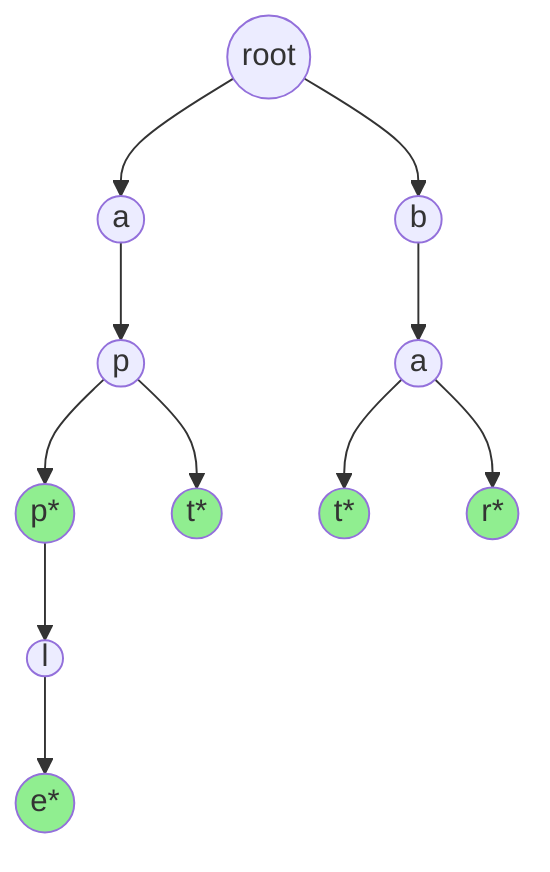
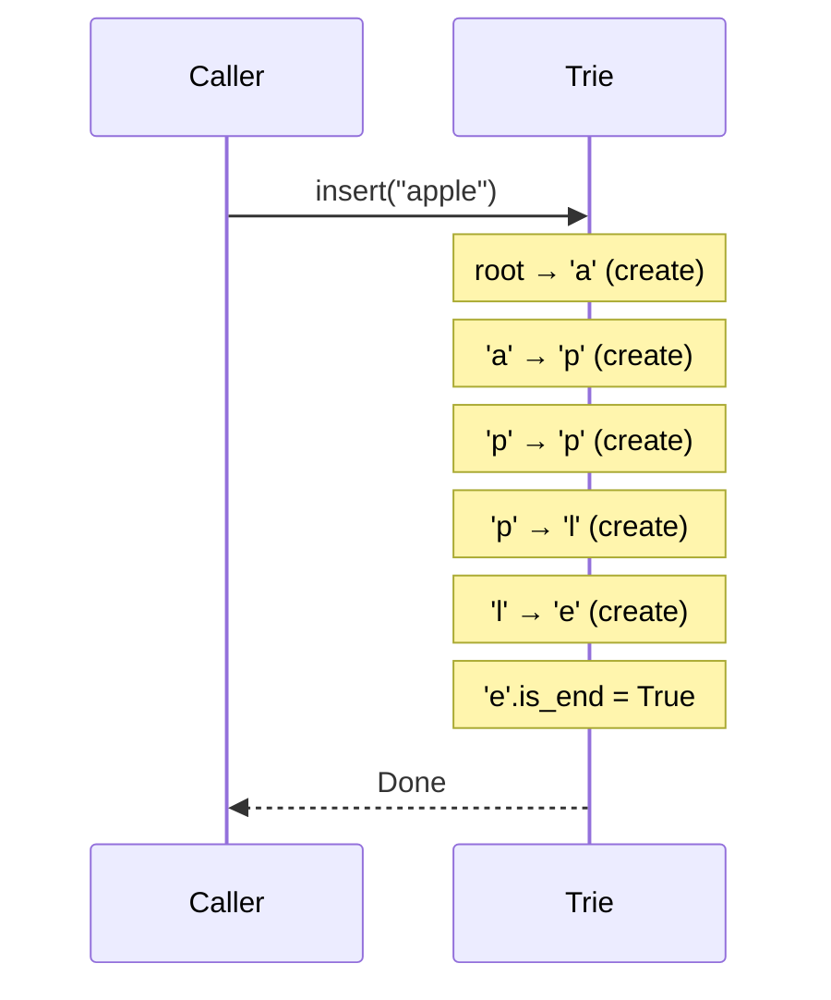
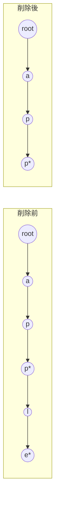
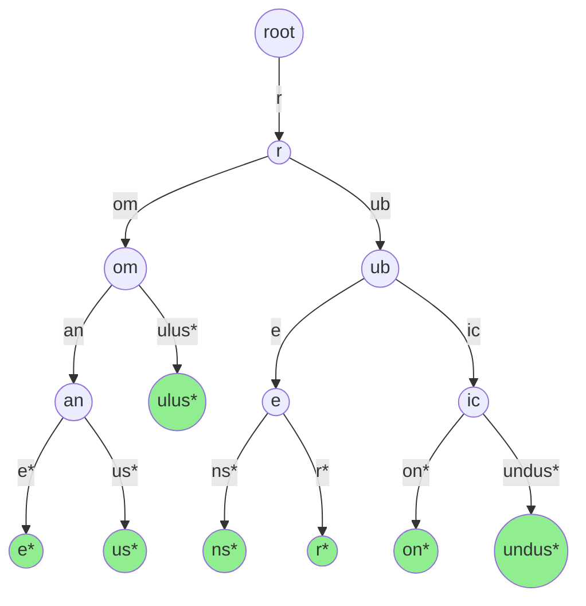
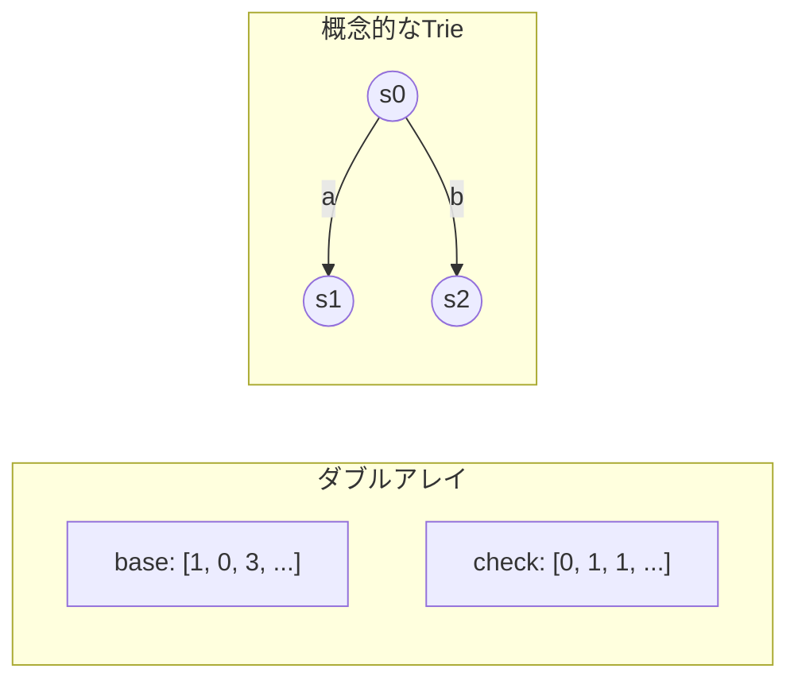
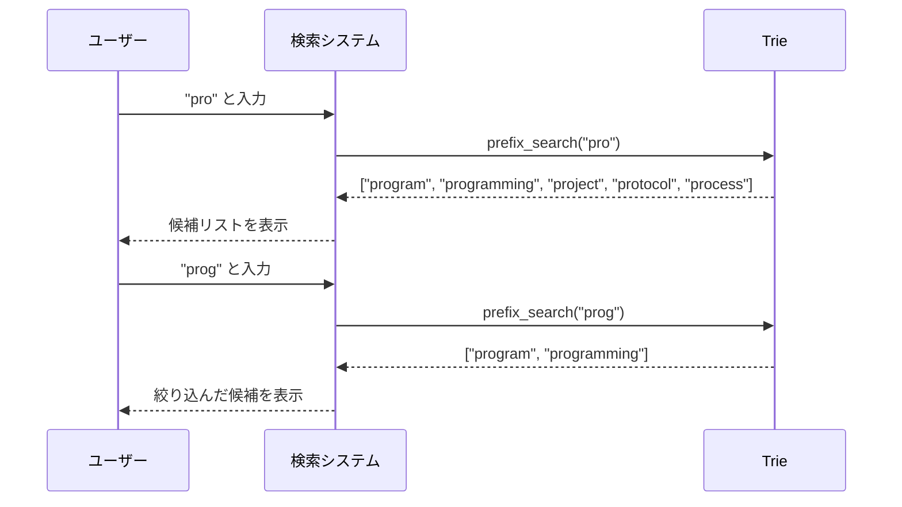
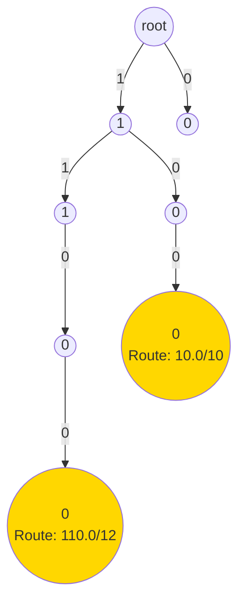
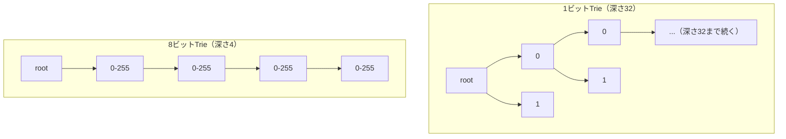
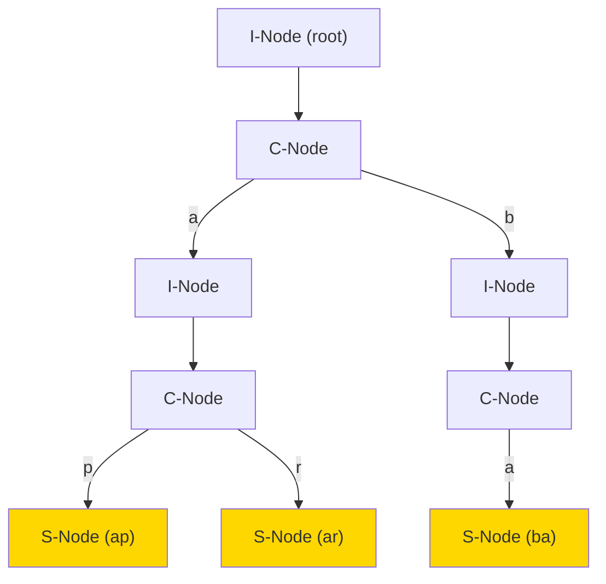

# Trie（トライ木）

## 1. Trie の概要

### 1.1 Trie とは何か

Trie（トライ木）は、文字列の集合を効率的に格納・検索するための木構造データ構造である。名前は "re**trie**val"（検索）に由来し、Edward Fredkin が 1960 年に命名した。発音は「トライ」が一般的だが、"tree" と区別するために「トリー」と発音する流派もある。

Trie の最大の特徴は、**共通の接頭辞（prefix）を共有するキーをまとめて格納できる**点にある。たとえば "apple"、"app"、"application" という 3 つの文字列は、先頭の "app" という接頭辞を共有している。Trie ではこの共通部分を 1 つのパスとして表現するため、メモリの節約と高速な接頭辞検索が可能になる。

### 1.2 なぜ Trie が必要なのか

文字列の集合に対する操作を考えると、いくつかの素朴なアプローチが思い浮かぶ。

- **ソート済み配列＋二分探索**: 検索は $O(\log n \cdot m)$（$n$ はキー数、$m$ はキー長）で可能だが、挿入・削除に $O(n)$ かかる。
- **ハッシュテーブル**: 平均 $O(m)$ で検索・挿入・削除が可能だが、接頭辞検索ができない。
- **平衡二分探索木（AVL 木、赤黒木など）**: 検索・挿入・削除は $O(m \cdot \log n)$ だが、接頭辞検索には追加の工夫が必要。

Trie はこれらの課題を解決する。具体的には以下の操作を効率的に実行できる。

| 操作 | 計算量 |
|------|--------|
| 挿入 | $O(m)$ |
| 検索 | $O(m)$ |
| 削除 | $O(m)$ |
| 接頭辞検索 | $O(p + k)$ |

ここで $m$ はキーの長さ、$p$ は接頭辞の長さ、$k$ はマッチするキーの数である。注目すべきは、**格納されているキーの総数 $n$ に依存しない**点だ。キーが 100 個でも 100 万個でも、個々の操作のコストはキーの長さだけで決まる。

### 1.3 Trie の構造

Trie は根（root）ノードから始まる木構造で、各辺が 1 文字に対応する。以下の例では、"app"、"apple"、"apt"、"bat"、"bar" の 5 つの単語を格納している。



`*` が付いたノードは「ここで 1 つの完全な単語が終わる」ことを示すフラグ（`is_end` や `is_terminal` などと呼ばれる）を持つ。たとえば "app" のノードは終端フラグが立っているが、"ap" のノードには立っていない。これにより "app" は登録済みの単語として認識されるが、"ap" は単なる中間ノードとして扱われる。

## 2. 基本操作

### 2.1 ノードの定義

まず Trie のノードを定義する。最もシンプルな実装では、各ノードが子ノードへのポインタ配列と終端フラグを持つ。

```python
class TrieNode:
    def __init__(self):
        # Map from character to child node
        self.children: dict[str, 'TrieNode'] = {}
        # True if this node marks the end of a complete word
        self.is_end: bool = False

class Trie:
    def __init__(self):
        self.root = TrieNode()
```

子ノードの管理方法にはいくつかの選択肢がある。

| 方法 | メモリ | 子の参照速度 | 適用場面 |
|------|--------|------------|---------|
| 固定長配列（例: `[None] * 26`） | $O(\Sigma)$（アルファベットサイズ） | $O(1)$ | アルファベットが小さい場合 |
| ハッシュマップ | 実際の子の数に比例 | 平均 $O(1)$ | アルファベットが大きい場合 |
| ソート済みリスト | 実際の子の数に比例 | $O(\log \Sigma)$ | メモリ効率重視 |

上記の例ではハッシュマップ（Python の `dict`）を用いている。英小文字のみを扱う場合は固定長配列のほうが定数倍で高速だが、Unicode 文字列などアルファベットが巨大な場合はハッシュマップが現実的な選択となる。

### 2.2 挿入（Insert）

文字列を Trie に挿入する操作は、根から順に文字をたどり、存在しないノードがあれば新たに作成するだけである。

```python
def insert(self, word: str) -> None:
    node = self.root
    for char in word:
        if char not in node.children:
            # Create a new node for this character
            node.children[char] = TrieNode()
        node = node.children[char]
    # Mark the end of the word
    node.is_end = True
```

挿入の流れを "apple" を例に図示する。



計算量は文字列の長さ $m$ に対して $O(m)$ である。

### 2.3 検索（Search）

指定した文字列が Trie に存在するかを判定する。根から文字を 1 つずつたどり、最後のノードの `is_end` フラグを確認する。

```python
def search(self, word: str) -> bool:
    node = self.root
    for char in word:
        if char not in node.children:
            return False
        node = node.children[char]
    return node.is_end
```

ここで重要なのは、最後に `node.is_end` を確認する点である。たとえば "app" と "apple" が登録されている Trie で "appl" を検索すると、すべての文字をたどることはできるが、`is_end` が `False` なので `False` を返す。

### 2.4 接頭辞の存在判定（Starts With）

指定した接頭辞で始まる単語が 1 つでも存在するかを判定する。`search` とほぼ同じだが、最後に `is_end` を確認しない。

```python
def starts_with(self, prefix: str) -> bool:
    node = self.root
    for char in prefix:
        if char not in node.children:
            return False
        node = node.children[char]
    # Any node reachable means some word has this prefix
    return True
```

### 2.5 削除（Delete）

削除はやや複雑である。単にフラグを消すだけでなく、不要になったノードを回収する必要がある。以下の条件を満たすノードは削除できる。

1. 子ノードを持たない
2. `is_end` フラグが `False`

再帰的に実装するのが自然である。

```python
def delete(self, word: str) -> bool:
    return self._delete(self.root, word, 0)

def _delete(self, node: TrieNode, word: str, depth: int) -> bool:
    if depth == len(word):
        if not node.is_end:
            # Word does not exist
            return False
        node.is_end = False
        # Can delete this node if it has no children
        return len(node.children) == 0

    char = word[depth]
    if char not in node.children:
        return False

    should_delete_child = self._delete(node.children[char], word, depth + 1)

    if should_delete_child:
        del node.children[char]
        # Current node can be deleted if it has no other children
        # and is not the end of another word
        return len(node.children) == 0 and not node.is_end

    return False
```

削除処理のポイントは、再帰の帰りがけに「このノードはもう不要か」を判定し、不要なら親が子への参照を削除するという点である。

たとえば "apple" と "app" が格納されている Trie から "apple" を削除する場合を考える。



"apple" の `e` ノードの `is_end` を `False` にし、子がないので削除する。同様に `l` ノードも子がなくなり、`is_end` でもないので削除する。`p`（2 つ目）は `is_end` が `True`（"app" の終端）なので、ここで削除は止まる。

## 3. 共通接頭辞検索

Trie の最も強力な機能の 1 つが、**共通接頭辞検索（prefix search）** である。与えられた接頭辞で始まるすべてのキーを列挙できる。

### 3.1 アルゴリズム

1. 接頭辞の文字列を使って Trie をたどり、対応するノードに到達する
2. そのノードを根とする部分木を深さ優先探索（DFS）し、`is_end` が `True` のノードに至るパスを収集する

```python
def search_by_prefix(self, prefix: str) -> list[str]:
    node = self.root
    for char in prefix:
        if char not in node.children:
            return []
        node = node.children[char]

    # Collect all words under this subtree
    results: list[str] = []
    self._collect(node, list(prefix), results)
    return results

def _collect(self, node: TrieNode, path: list[str], results: list[str]) -> None:
    if node.is_end:
        results.append(''.join(path))
    for char, child in node.children.items():
        path.append(char)
        self._collect(child, path, results)
        path.pop()
```

### 3.2 応用例

共通接頭辞検索は多くの実用的な場面で利用される。

- **辞書の前方一致検索**: ユーザーが入力した文字列で始まる辞書の見出し語を列挙する
- **コマンド補完**: シェルで TAB キーを押した際に、入力済みの接頭辞に合致するコマンドやファイル名を表示する
- **DNA 配列検索**: 生物情報学において、特定の塩基配列パターンで始まる配列を効率的に検索する

### 3.3 最長共通接頭辞（Longest Common Prefix）

Trie を使うと、文字列集合の最長共通接頭辞も効率的に求められる。根から出発し、子が 1 つしかなく、かつ `is_end` が `False` であるノードをたどり続ければよい。

```python
def longest_common_prefix(self) -> str:
    prefix = []
    node = self.root
    while len(node.children) == 1 and not node.is_end:
        char = next(iter(node.children))
        prefix.append(char)
        node = node.children[char]
    return ''.join(prefix)
```

## 4. 圧縮 Trie（Radix Tree / Patricia Trie）

### 4.1 標準 Trie の問題点

標準的な Trie では、各辺が 1 文字に対応する。そのため、共通の接頭辞を持たない長い文字列を格納すると、分岐のない一本道のノード列が大量に生じ、メモリが無駄に消費される。

たとえば "romane"、"romanus"、"romulus"、"rubens"、"ruber"、"rubicon"、"rubicundus" を格納する標準 Trie では、ノード数が非常に多くなる。

### 4.2 Radix Tree の考え方

**Radix Tree（基数木）** は、分岐のない一本道のノード列を 1 つのノードにまとめることで、この問題を解決する。各辺には 1 文字ではなく**文字列の断片（ラベル）**を持たせる。



### 4.3 Patricia Trie

**Patricia Trie（Practical Algorithm to Retrieve Information Coded in Alphanumeric）** は、Donald R. Morrison が 1968 年に提案したデータ構造で、Radix Tree の一種である。特に 2 分岐（各ノードの分岐が 0 または 2）に特化した形で定義されることが多い。

Patricia Trie と Radix Tree の用語は文献によって互換的に使われることがあるが、厳密には以下の違いがある。

| 特性 | Radix Tree | Patricia Trie |
|------|-----------|--------------|
| 分岐数 | 任意 | 通常は 2 分岐 |
| ラベル | 辺に文字列 | ビット位置で分岐 |
| 起源 | 一般的な概念 | Morrison (1968) の論文 |

### 4.4 圧縮 Trie の実装

Radix Tree のノードは、辺のラベル（文字列の断片）を保持する。

```python
class RadixNode:
    def __init__(self):
        # Map from first character to (label, child_node)
        self.children: dict[str, tuple[str, 'RadixNode']] = {}
        self.is_end: bool = False

class RadixTree:
    def __init__(self):
        self.root = RadixNode()

    def insert(self, word: str) -> None:
        node = self.root
        i = 0
        while i < len(word):
            first_char = word[i]
            if first_char not in node.children:
                # No matching edge; create a new one with the remaining string
                new_node = RadixNode()
                new_node.is_end = True
                node.children[first_char] = (word[i:], new_node)
                return

            label, child = node.children[first_char]
            # Find the common prefix length between the remaining word and the label
            j = 0
            while j < len(label) and i + j < len(word) and label[j] == word[i + j]:
                j += 1

            if j == len(label):
                # The entire label matches; continue to child
                i += j
                node = child
            else:
                # Split the edge at position j
                split_node = RadixNode()
                # Existing suffix goes to original child
                split_node.children[label[j]] = (label[j:], child)
                remaining = word[i + j:]
                if remaining:
                    # New suffix goes to a new node
                    new_node = RadixNode()
                    new_node.is_end = True
                    split_node.children[remaining[0]] = (remaining, new_node)
                else:
                    split_node.is_end = True
                # Update parent's edge to point to the split node
                node.children[first_char] = (label[:j], split_node)
                return

        # Reached the end of the word at an existing node
        node.is_end = True
```

### 4.5 標準 Trie との比較

| 特性 | 標準 Trie | Radix Tree |
|------|----------|-----------|
| ノード数 | 最大 $O(n \cdot m)$ | 最大 $O(n)$ |
| メモリ使用量 | 多い | 少ない |
| 実装の複雑さ | 単純 | やや複雑 |
| 検索速度 | $O(m)$ | $O(m)$ |
| 挿入時の辺分割 | 不要 | 必要 |

Radix Tree のノード数は最大でもキー数の 2 倍程度に抑えられる。これは、各内部ノード（非葉ノード）が必ず 2 つ以上の子を持つためである。

## 5. メモリ効率化

### 5.1 問題の所在

標準 Trie の最大の弱点はメモリ消費量である。英小文字のみを扱う場合でも、各ノードに 26 個のポインタ配列を持たせると、1 ノードあたり 26 × 8 = 208 バイト（64 ビットポインタの場合）となる。100 万語を格納すると数百 MB から数 GB に達することもある。

### 5.2 ダブルアレイ Trie

**ダブルアレイ（Double-Array）** は、青江順一が 1989 年に提案したTrie の高速でメモリ効率の良い実装方法である。2 つの配列 `base` と `check` を用いて Trie 全体を表現する。

基本的な考え方は以下の通りである。

- `base[s] + c = t` : 状態 `s` から文字 `c` による遷移先は状態 `t`
- `check[t] = s` : 状態 `t` の親は状態 `s`



ダブルアレイ Trie の利点は以下の通りである。

- **高速な遷移**: 配列のインデックスアクセスだけで子ノードに遷移できる（$O(1)$）
- **キャッシュ効率**: データが連続したメモリ領域に格納されるため、CPU キャッシュのヒット率が高い
- **省メモリ**: ポインタの代わりに整数値を使うため、ノードあたりのメモリが小さい

一方、欠点としては構築時の空き位置検索にコストがかかること、動的な挿入・削除が非効率であることが挙げられる。そのため、辞書データのような静的なデータセットに特に適している。

日本語の形態素解析器 MeCab や、テキスト検索ライブラリ Darts（Double-ARray Trie System）などで広く使われている。

### 5.3 ハッシュマップによる子ノード管理

前述の通り、子ノードの管理にハッシュマップを用いることで、実際に使用されている辺の分だけメモリを確保できる。固定長配列と比較した場合のトレードオフは以下の通りである。

- **固定長配列**: アクセスは $O(1)$ だが、未使用スロットが多いとメモリを浪費する
- **ハッシュマップ**: 実際の子の数に比例したメモリで済むが、ハッシュのオーバーヘッドがある

実務では、アルファベットサイズが 256 以下（ASCII）であれば固定長配列、Unicode のように巨大なアルファベットであればハッシュマップを選択するのが一般的である。

### 5.4 ビットマップによる最適化

固定長配列のメモリ浪費を軽減しつつ、ハッシュマップのオーバーヘッドを避ける手法として、**ビットマップ**を用いる方法がある。

各ノードに「どの子が存在するか」を示すビットマップを持たせ、実際の子ポインタは存在する子の分だけ連続配列に格納する。子へのアクセスには、ビットマップ上の popcount（立っているビットの数を数える演算）を使ってインデックスを計算する。

```python
class BitmapTrieNode:
    def __init__(self):
        # Bitmap indicating which children exist (e.g., 26 bits for a-z)
        self.bitmap: int = 0
        # Compact array of child nodes (only for existing children)
        self.children: list['BitmapTrieNode'] = []
        self.is_end: bool = False

    def get_child(self, char_index: int) -> 'BitmapTrieNode | None':
        mask = 1 << char_index
        if not (self.bitmap & mask):
            return None
        # Count bits below this position to find array index
        pos = bin(self.bitmap & (mask - 1)).count('1')
        return self.children[pos]

    def set_child(self, char_index: int, node: 'BitmapTrieNode') -> None:
        mask = 1 << char_index
        pos = bin(self.bitmap & (mask - 1)).count('1')
        if self.bitmap & mask:
            # Child already exists; replace
            self.children[pos] = node
        else:
            # Insert new child at the correct position
            self.bitmap |= mask
            self.children.insert(pos, node)
```

この方法は HAT-trie（Hash Array Mapped Trie の派生）などで使われている。

### 5.5 LOUDS（Level-Order Unary Degree Sequence）

大規模な静的 Trie を極限まで圧縮したい場合は、**簡潔データ構造（succinct data structure）** を利用する。LOUDS は木構造をビット列で表現する手法で、$n$ ノードの木を $2n + 1$ ビットで表現できる。

LOUDS では、木のノードを幅優先順（レベル順）に走査し、各ノードの子の数を unary coding（子の数だけ `1` を並べ、最後に `0` を付ける）で符号化する。

たとえば、3 つの子を持つノードは `1110` と表現される。

この表現を用いると、以下の操作がビット演算で $O(1)$（rank/select 演算のサポート付き）で実行できる。

- 親ノードの特定
- 第 $i$ 子ノードへの遷移
- 子の数の取得

実装例としては、Google の marisa-trie や、Rust の succinct ライブラリなどがある。

## 6. オートコンプリートへの応用

### 6.1 基本的なオートコンプリート

オートコンプリート（自動補完）は Trie の最も典型的な応用例である。ユーザーが文字を入力するたびに、その接頭辞に合致する候補を提示する。



### 6.2 スコア付きオートコンプリート

実用的なオートコンプリートでは、候補に**スコア（重み）**を付けて、人気順や関連度順で表示する必要がある。

```python
class WeightedTrieNode:
    def __init__(self):
        self.children: dict[str, 'WeightedTrieNode'] = {}
        self.is_end: bool = False
        # Weight representing frequency or relevance score
        self.weight: int = 0
        # Maximum weight in this subtree (for pruning)
        self.max_weight: int = 0

class WeightedTrie:
    def __init__(self):
        self.root = WeightedTrieNode()

    def insert(self, word: str, weight: int) -> None:
        node = self.root
        node.max_weight = max(node.max_weight, weight)
        for char in word:
            if char not in node.children:
                node.children[char] = WeightedTrieNode()
            node = node.children[char]
            # Update max_weight along the path
            node.max_weight = max(node.max_weight, weight)
        node.is_end = True
        node.weight = weight

    def top_k(self, prefix: str, k: int) -> list[tuple[str, int]]:
        node = self.root
        for char in prefix:
            if char not in node.children:
                return []
            node = node.children[char]

        # Use a priority queue (max-heap) for efficient top-k retrieval
        import heapq
        results: list[tuple[int, str]] = []
        self._collect_top_k(node, list(prefix), results, k)
        # Sort by weight descending
        results.sort(reverse=True)
        return [(word, weight) for weight, word in results[:k]]

    def _collect_top_k(
        self, node: WeightedTrieNode, path: list[str],
        results: list[tuple[int, str]], k: int
    ) -> None:
        if node.is_end:
            import heapq
            if len(results) < k:
                heapq.heappush(results, (node.weight, ''.join(path)))
            elif node.weight > results[0][0]:
                heapq.heapreplace(results, (node.weight, ''.join(path)))

        # Prune subtrees that cannot contribute better results
        for char, child in node.children.items():
            if len(results) < k or child.max_weight > results[0][0]:
                path.append(char)
                self._collect_top_k(child, path, results, k)
                path.pop()
```

`max_weight` を各ノードに伝搬させておくことで、上位 $k$ 件に入る可能性のない部分木を丸ごと枝刈りでき、検索効率が大幅に向上する。

### 6.3 ファジー検索（曖昧検索）

ユーザーがタイプミスをした場合にも候補を表示するために、**編集距離（Levenshtein distance）**を組み合わせたファジー検索を実装できる。

基本的なアイデアは、Trie を探索しながら許容する編集距離の範囲内で文字の挿入・削除・置換を試みることである。

```python
def fuzzy_search(self, word: str, max_distance: int) -> list[tuple[str, int]]:
    results: list[tuple[str, int]] = []
    # Initialize the first row of the dynamic programming matrix
    current_row = list(range(len(word) + 1))
    for char, child in self.root.children.items():
        self._fuzzy_search_recursive(
            child, char, word, [char], current_row,
            results, max_distance
        )
    return results

def _fuzzy_search_recursive(
    self, node: TrieNode, char: str, word: str,
    path: list[str], previous_row: list[int],
    results: list[tuple[str, int]], max_distance: int
) -> None:
    columns = len(word) + 1
    current_row = [previous_row[0] + 1]

    for col in range(1, columns):
        # Standard Levenshtein distance computation
        insert_cost = current_row[col - 1] + 1
        delete_cost = previous_row[col] + 1
        replace_cost = previous_row[col - 1]
        if word[col - 1] != char:
            replace_cost += 1
        current_row.append(min(insert_cost, delete_cost, replace_cost))

    if current_row[-1] <= max_distance and node.is_end:
        results.append((''.join(path), current_row[-1]))

    # Only continue if there's a possibility of finding matches
    if min(current_row) <= max_distance:
        for next_char, child in node.children.items():
            path.append(next_char)
            self._fuzzy_search_recursive(
                child, next_char, word, path,
                current_row, results, max_distance
            )
            path.pop()
```

この手法は、スペルチェッカーや「もしかして（Did you mean）」機能の実装に使われている。

## 7. IP ルーティングテーブル

### 7.1 最長一致検索（Longest Prefix Match）

IP ルーティングにおいて、パケットの宛先 IP アドレスに対して**最長一致する経路（Longest Prefix Match, LPM）**を見つけることは、ルーターの最も基本的かつ性能クリティカルな操作である。

たとえば、以下のルーティングテーブルがあるとする。

| プレフィックス | ネクストホップ |
|-------------|-------------|
| 192.168.0.0/16 | ゲートウェイ A |
| 192.168.1.0/24 | ゲートウェイ B |
| 192.168.1.128/25 | ゲートウェイ C |

宛先が 192.168.1.200 の場合、3 つのプレフィックスすべてにマッチするが、最も長い /25 のエントリ（ゲートウェイ C）が選択される。

### 7.2 ビット Trie による実装

IP ルーティングテーブルは、IP アドレスのビット列を Trie に格納することで効率的に実装できる。各辺は 0 または 1 のビットに対応し、プレフィックス長の位置に経路情報を記録する。



```python
class IPTrieNode:
    def __init__(self):
        # Binary trie: only two children (0 and 1)
        self.children: list['IPTrieNode | None'] = [None, None]
        # Route information stored at prefix boundaries
        self.route_info: str | None = None

class IPRoutingTable:
    def __init__(self):
        self.root = IPTrieNode()

    def insert(self, prefix: int, prefix_len: int, route: str) -> None:
        node = self.root
        for i in range(31, 31 - prefix_len, -1):
            bit = (prefix >> i) & 1
            if node.children[bit] is None:
                node.children[bit] = IPTrieNode()
            node = node.children[bit]
        node.route_info = route

    def longest_prefix_match(self, address: int) -> str | None:
        node = self.root
        best_match: str | None = None
        for i in range(31, -1, -1):
            bit = (address >> i) & 1
            if node.children[bit] is None:
                break
            node = node.children[bit]
            if node.route_info is not None:
                best_match = node.route_info
        return best_match
```

### 7.3 高速化手法

高速ルーターでは、ナノ秒単位でルーティング判定を行う必要がある。そのため、いくつかの高速化手法が提案されている。

**マルチビット Trie**: 1 ビットずつではなく、複数ビット（例: 4 ビットや 8 ビット）をまとめて 1 レベルとすることで、Trie の深さを減らす。IPv4 の 32 ビットアドレスに対して、8-8-8-8 の 4 レベル Trie を構築すると、最大 4 回のメモリアクセスでルーティング判定が完了する。



**Tree Bitmap**: 各ノードにビットマップを持たせ、内部プレフィックスと子ポインタを圧縮して格納する手法。メモリ効率と検索速度の両方を改善する。

**TCAM（Ternary Content-Addressable Memory）**: ハードウェアベースのアプローチで、すべてのプレフィックスに対して並列比較を行う。ASIC ベースの高速ルーターで広く使われているが、消費電力が大きくコストも高い。

### 7.4 IPv6 への対応

IPv6 では 128 ビットのアドレス空間を扱う必要があるため、1 ビット Trie の深さが最大 128 となり非効率である。マルチビット Trie や階層的な構造を組み合わせることが一般的である。

また、IPv6 ではアドレスがスパース（疎）になりやすいため、圧縮 Trie（Radix Tree）の効果が大きい。

## 8. 並行 Trie

### 8.1 並行アクセスの課題

マルチスレッド環境で Trie を使用する場合、データ競合を防ぐための同期機構が必要になる。素朴にグローバルロックを使うと、並行性が大幅に制限される。

### 8.2 ロックの粒度

Trie における並行制御の主な手法を以下にまとめる。

**粗粒度ロック（Coarse-grained Locking）**: Trie 全体に 1 つのロックを持たせる。実装は簡単だが、読み取りが多いワークロードでもシリアル化されてしまう。

**読み書きロック（Read-Write Lock）**: 読み取りは複数スレッドで同時に行えるが、書き込み時は排他制御する。読み取りが圧倒的に多いワークロード（例: ルーティングテーブルの参照）に有効。

**細粒度ロック（Fine-grained Locking）**: ノードごとにロックを持たせる。並行性は高いが、ロックのオーバーヘッドとデッドロック防止の複雑さが増す。

```python
import threading

class ConcurrentTrieNode:
    def __init__(self):
        self.children: dict[str, 'ConcurrentTrieNode'] = {}
        self.is_end: bool = False
        self.lock = threading.Lock()

class ConcurrentTrie:
    def __init__(self):
        self.root = ConcurrentTrieNode()

    def insert(self, word: str) -> None:
        node = self.root
        for char in word:
            node.lock.acquire()
            if char not in node.children:
                node.children[char] = ConcurrentTrieNode()
            next_node = node.children[char]
            node.lock.release()
            node = next_node
        with node.lock:
            node.is_end = True

    def search(self, word: str) -> bool:
        node = self.root
        for char in word:
            # Read does not need locking if using lock-free reads
            # (simplified here for clarity)
            if char not in node.children:
                return False
            node = node.children[char]
        return node.is_end
```

### 8.3 ロックフリー Trie

より高い並行性を実現するために、**CAS（Compare-And-Swap）**操作を用いたロックフリーの Trie も研究されている。

代表的な例として、**Ctrie（Concurrent Trie）** がある。Prokopec らが 2012 年に提案したこのデータ構造は、以下の特徴を持つ。

- **ロックフリー**: CAS 操作のみを使用し、ロックを一切使わない
- **スナップショット可能**: $O(1)$ で一貫性のあるスナップショットを取得できる
- **非ブロッキング**: あるスレッドが停止しても、他のスレッドの進行を妨げない

Ctrie の基本的な構造は、**I-Node（間接ノード）**と **C-Node（Trie ノード）**を交互に配置する点にある。I-Node は単一のポインタを持ち、CAS で原子的に更新できる。



挿入操作では、C-Node を新しいものに置き換える形で更新する。CAS が失敗した場合は、最新の状態を読み直してリトライする。この「コピーして更新」のアプローチにより、読み取り操作は常にロックフリーで実行できる。

Scala の標準ライブラリには `TrieMap` として Ctrie の実装が含まれている。

### 8.4 Read-Copy-Update（RCU）ベースの Trie

Linux カーネルで広く使われている **RCU** の考え方を Trie に適用することもできる。

- **読み取り側**: ロックもメモリバリアも不要。極めて高速。
- **書き込み側**: 更新対象のノードのコピーを作成し、変更を加えた後、原子的にポインタを付け替える。古いノードは、すべての読み取り側が参照を解放した後（grace period の終了後）に解放する。

この方式は、読み取りが書き込みに比べて圧倒的に多いワークロード（例: カーネルのルーティングテーブル参照）に特に適している。

## 9. ハッシュテーブルとの比較

### 9.1 計算量の比較

Trie とハッシュテーブルは、どちらも文字列キーに対する辞書操作を提供するが、その特性は大きく異なる。

| 操作 | Trie | ハッシュテーブル |
|------|------|--------------|
| 挿入 | $O(m)$ | 平均 $O(m)$、最悪 $O(n \cdot m)$ |
| 検索 | $O(m)$ | 平均 $O(m)$、最悪 $O(n \cdot m)$ |
| 削除 | $O(m)$ | 平均 $O(m)$、最悪 $O(n \cdot m)$ |
| 接頭辞検索 | $O(p + k)$ | $O(n \cdot m)$ |
| 順序付き走査 | $O(N)$（全キー） | $O(n \log n)$（ソート必要） |

ここで $m$ はキーの長さ、$n$ はキー数、$p$ は接頭辞の長さ、$k$ はマッチ数、$N$ は全キーの総文字数である。

注目すべき点がいくつかある。

1. **Trie の計算量はキー数 $n$ に依存しない**: ハッシュテーブルは衝突が増えると性能が劣化するが、Trie ではキーの長さだけで決まる。
2. **ハッシュ関数のコスト**: ハッシュテーブルの $O(m)$ にはハッシュ値の計算が含まれるが、Trie では文字の比較のみ。ハッシュ関数の計算が重い場合、Trie のほうが実質的に高速になる。
3. **接頭辞検索**: ハッシュテーブルでは全キーを走査するしかないが、Trie では接頭辞ノード以下の部分木を探索するだけで済む。

### 9.2 メモリ使用量の比較

メモリ使用量については、一概にどちらが有利とは言えない。

**ハッシュテーブルが有利な場合**:
- キーが長く、共通の接頭辞がほとんどない場合
- キー数が少ない場合（Trie のノードオーバーヘッドが相対的に大きくなる）

**Trie が有利な場合**:
- 共通の接頭辞が多い場合（接頭辞を共有するためメモリ節約）
- 圧縮 Trie を使用する場合

### 9.3 実用上の考慮点

::: tip Trie を選ぶべき場面
- 接頭辞検索が必要（オートコンプリート、IP ルーティングなど）
- キーの辞書順走査が必要
- 最悪ケースの性能保証が重要
- キーに共通の接頭辞が多い
:::

::: tip ハッシュテーブルを選ぶべき場面
- 完全一致検索のみが必要
- メモリ効率を最優先する
- 実装の簡潔さを重視する
- キーが文字列以外（整数、バイト列など）の場合
:::

### 9.4 ハイブリッドアプローチ

実際のシステムでは、Trie とハッシュテーブルを組み合わせたハイブリッドアプローチも多い。

**HAT-trie**: Trie の上位レベルにはポインタベースのノードを使い、下位レベル（葉に近い部分）をハッシュテーブルに置き換える。Trie の接頭辞検索能力を維持しつつ、メモリ効率とキャッシュ効率を改善する。Askitis と Sinha が 2007 年に提案し、文字列辞書のベンチマークで優れた結果を示した。

**Burst Trie**: コンテナ（ハッシュテーブルやソート済み配列）を Trie の葉に配置する。コンテナが閾値を超えたら Trie のノードに「バースト」（分割）する。Heinz らが 2002 年に提案した。

## 10. まとめ

Trie は、文字列の集合に対する操作を効率的に実現するデータ構造であり、特に接頭辞検索において他のデータ構造に対する明確な優位性を持つ。

本記事で取り上げた内容を整理すると以下のようになる。

| トピック | 要点 |
|---------|------|
| 基本操作 | 挿入・検索・削除すべて $O(m)$ |
| 接頭辞検索 | Trie の最大の強み。$O(p + k)$ で接頭辞マッチするすべてのキーを列挙可能 |
| 圧縮 Trie | 分岐のないノード列をまとめてノード数を $O(n)$ に削減 |
| メモリ効率化 | ダブルアレイ、ビットマップ、LOUDS などの手法がある |
| オートコンプリート | スコア付き検索やファジー検索への拡張が可能 |
| IP ルーティング | 最長一致検索にビット Trie を活用。マルチビット Trie で高速化 |
| 並行制御 | 細粒度ロック、Ctrie（ロックフリー）、RCU などの手法がある |
| ハッシュテーブルとの比較 | 接頭辞検索が不要なら概ねハッシュテーブルが有利。接頭辞検索が必要なら Trie |

Trie の基本的な考え方はシンプルだが、圧縮、メモリ最適化、並行制御と組み合わせることで、高性能な文字列検索基盤として幅広い場面で活用されている。テキスト処理やネットワーク機器の開発に携わる際には、Trie の特性と各種変種の特徴を理解しておくことが、適切なデータ構造選択の助けとなるだろう。
