# トランクベース開発 vs GitFlow

## 1. ブランチ戦略の歴史的背景

### 1.1 バージョン管理の黎明期とトランク開発

ソフトウェア開発においてブランチ戦略が議論されるようになったのは、バージョン管理システム（VCS）の普及と深く関係している。1970年代後半から1980年代にかけて登場した初期のVCS（RCS、CVS）では、ブランチの作成と管理が技術的に困難であり、コストが高かった。その結果、多くの開発チームは自然と「トランク（幹）に直接コミットする」スタイルを採用していた。

Subversion（SVN）の時代になると、リポジトリの構造として `trunk/`、`branches/`、`tags/` という3つのディレクトリを持つことが慣習となった。このうち `trunk/` が本流の開発ラインを表し、開発者は原則としてここに変更を加えた。ブランチは存在したが、主に安定したリリースラインの保守目的で使われ、日常的な機能開発はトランクで行われていた。この開発スタイルを**トランクベース開発（Trunk-Based Development; TBD）**と呼ぶ。

### 1.2 Martin Fowlerと継続的インテグレーションの提唱

2006年、Martin Fowlerは「Continuous Integration」に関する論文を発表した。Fowlerが主張した継続的インテグレーション（CI）の中核にあったのは、「開発者が自分のコードを**毎日**メインライン（トランク）に統合すべきである」という原則であった。

> "Every developer should be working on top of the most recent shared version of the code. If you're working in isolation for days, you get into a state where integration becomes a big scary event."
> — Martin Fowler

この考え方は、当時主流だった「機能が完成してから統合する」という開発スタイルへの明確な批判であった。Fowlerのチームは、ThoughtWorksでの実践を通じて、統合の頻度を上げることで統合の苦痛が劇的に減少することを実証した。これは「痛みを伴うことは、もっと頻繁にやれ」というXP（Extreme Programming）の哲学に基づく逆説的な原則である。

### 1.3 分散型VCSの登場とブランチの民主化

2005年にGitが、2005年に Mercurial が登場し、ブランチの作成・切り替えが非常に軽量になった。Gitではブランチは単なるポインタ（コミットへの参照）であり、新しいブランチの作成はほぼゼロコストである。このブランチの民主化により、「どんな機能開発にも専用ブランチを切る」スタイルが技術的に可能になった。

しかし技術的に可能になることと、それがベストプラクティスであることは別の話だ。Gitの軽量ブランチが普及したことで、長期間にわたって存在する「長寿命ブランチ（Long-lived branches）」が組織に広がり、新たな問題を生み出すことになった。

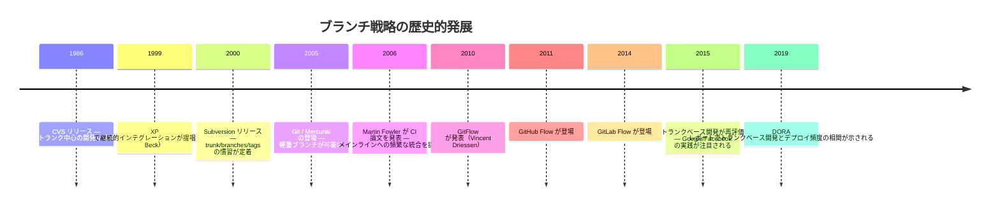

---

## 2. GitFlowの構造と設計思想

### 2.1 GitFlowとは何か

2010年、Vincent Driessen が自身のブログ記事「A successful Git branching model」を公開した。この記事は爆発的な反響を呼び、多くの組織がこのブランチモデルを採用した。これが**GitFlow**である。

GitFlowの主な特徴は、目的に応じた複数の長寿命ブランチと短命ブランチを体系的に定義することにある。

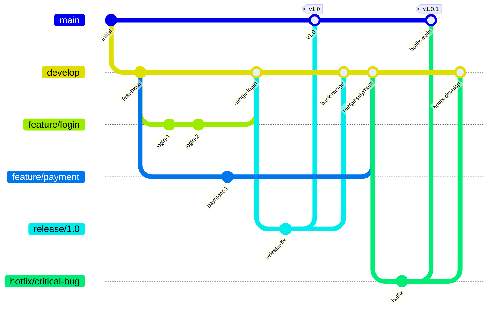

### 2.2 GitFlowのブランチ体系

GitFlowは以下の5種類のブランチを定義する。

**長寿命ブランチ（永続するブランチ）**

- **`main`（または `master`）**: 本番環境のコードを表すブランチ。常にデプロイ可能な状態を保つ。すべてのコミットにはバージョンタグが付与される
- **`develop`**: 次のリリースに向けた開発の統合点。フィーチャーブランチのマージ先となり、常にリリース前の最新状態を表す

**短命ブランチ（一時的なブランチ）**

- **`feature/*`**: 新機能の開発に使用する。`develop` から分岐し、完成後に `develop` にマージする。命名例: `feature/user-authentication`
- **`release/*`**: リリース準備に使用する。`develop` から分岐し、バグ修正や最終調整を行う。完成後は `main` と `develop` の両方にマージする。命名例: `release/1.2.0`
- **`hotfix/*`**: 本番環境の緊急バグ修正に使用する。`main` から分岐し、修正後は `main` と `develop` の両方にマージする。命名例: `hotfix/payment-crash`

### 2.3 GitFlowが解決しようとした問題

GitFlowが設計された2010年前後、多くの組織では以下のような状況が一般的であった。

- **計画的なリリースサイクル**: 週次・月次・四半期ごとのリリース
- **複数バージョンの同時保守**: v1.x系とv2.x系を並行して維持
- **QAフェーズの存在**: リリース前に専任のQAチームによるテスト期間
- **明確なリリース管理**: どの機能をいつのリリースに含めるかを明示的に制御

GitFlowはこうした計画的・段階的なリリースプロセスを明確にモデル化したブランチ戦略であり、その点では合理的な設計である。

### 2.4 GitFlowの問題点

しかし、GitFlowは現代の継続的デリバリーの実践と相性が悪い側面を多く抱えている。

**長寿命ブランチによるマージ地獄**

フィーチャーブランチが長期間（数日〜数週間）にわたって `develop` から乖離し続けると、マージ時に大量のコンフリクトが発生する。複数の開発者が同じコードに手を入れていた場合、コンフリクト解消だけで多大な時間を消費する。これがMartin Fowlerが「統合の地獄（Integration Hell）」と呼んだ問題の現代版である。

**CIの形骸化**

GitFlowでは、フィーチャーブランチ上でCI（ビルド・テスト）を実行できる。しかし、ブランチ上でテストが通っていても、`develop` にマージした後に別のブランチとのインタラクションでテストが落ちることがある。真の意味でのCIは「実際に統合したコードをテストすること」であるが、GitFlowでは各ブランチが長期間独立して動作するため、CIが形骸化しやすい。

**複雑なマージフロー**

`release` ブランチと `hotfix` ブランチは、マージ後に `main` と `develop` の**両方**に反映しなければならない。この二重マージを忘れると、本番のバグ修正が開発ラインに反映されないという深刻な問題が生じる。人間がこのルールを手順書通りに守り続けることは難しく、ミスが起きやすい。

**リリース頻度の制約**

GitFlowは本質的に「まとめてリリースする」モデルに最適化されている。1日に複数回リリースしたい、あるいは各コミットをそのままデプロイしたいという要件には不向きである。

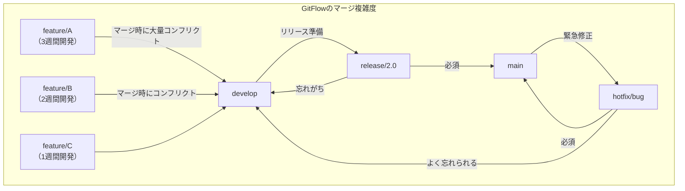

> [!WARNING]
> GitFlowの `release` ブランチや `hotfix` ブランチのマージは、`main` と `develop` の**両方**に行う必要がある。この手順を省略すると、本番の修正が開発ラインに反映されず、次のリリースで同じバグが再現する可能性がある。git-flow CLI ツールを使うことでこのリスクを減らせるが、ルールの複雑さ自体は変わらない。

---

## 3. トランクベース開発の原則

### 3.1 トランクベース開発とは何か

トランクベース開発（Trunk-Based Development; TBD）とは、すべての開発者が**単一の共有ブランチ（トランク、またはメインライン）**に頻繁にコミットする開発スタイルである。トランクとは通常 `main`（または `master`）ブランチを指す。

TBDの本質を一文で表すと、「コードの統合を遅らせない」ことにある。

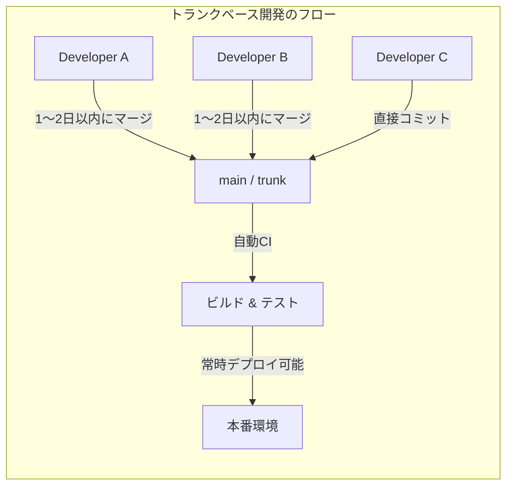

### 3.2 TBDのコアプラクティス

**短命ブランチ（Short-lived Feature Branches）**

TBDでは、ブランチを使う場合でも、そのライフタイムを**1〜2日**以内に保つことを原則とする。これにより、`main` からの乖離が最小限に抑えられ、マージコストが劇的に減少する。

Paul Hammantが運営する trunkbaseddevelopment.com では、以下のように定義されている。

> "A source-control branching model, where developers collaborate on code in a single branch called 'trunk', resist any pressure to create other long-lived development branches by employing documented techniques."

**小さいコミット（Small Commits）**

大きな機能を一度に実装してコミットするのではなく、機能を小さな作業単位に分解してコミットする。各コミットはビルドを壊さず、テストをパスさせることが前提となる。

**フィーチャーフラグ（Feature Flags）**

未完成の機能をトランクにコミットする場合、フィーチャーフラグを使ってその機能を本番環境で無効化する。これにより「コードの統合」と「機能のリリース」を分離できる（詳細は後述）。

**CI/CDの前提**

TBDはCIなしでは機能しない。すべてのコミットに対して自動ビルドと自動テストが実行され、その結果が数分以内にフィードバックされる環境が不可欠である。CIが遅い（30分以上かかる）環境では、TBDの実践が著しく困難になる。

### 3.3 TBDとGitFlowの比較

| 観点 | GitFlow | トランクベース開発 |
|---|---|---|
| ブランチの寿命 | 数週間〜数ヶ月 | 1〜2日以内 |
| 統合の頻度 | リリース前 | 毎日〜複数回/日 |
| コンフリクトの規模 | 大きい | 小さい |
| リリース頻度 | 低い（計画的） | 高い（継続的） |
| CI/CDとの相性 | 低い | 高い |
| 並行バージョン保守 | 向いている | 向いていない |
| チームの学習コスト | 高い（ルールが多い） | 低い（シンプル） |
| 未完成機能の管理 | ブランチで隠す | フラグで制御 |

---

## 4. フィーチャーフラグとの組み合わせ

### 4.1 フィーチャーフラグとは何か

フィーチャーフラグ（Feature Flags、Feature Togglesとも呼ぶ）とは、コードのデプロイとフィーチャーのリリースを分離するための仕組みである。設定ファイル、データベース、または専用のサービスによって、特定の機能をランタイムで有効/無効に切り替えられるようにする。

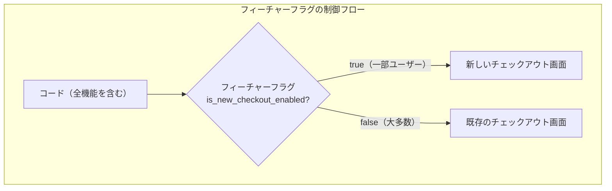

### 4.2 フィーチャーフラグの分類

Martin Fowlerは著書『Feature Toggles（Feature Flags）』の中でフラグを以下の4種類に分類している。

**リリーストグル（Release Toggles）**

TBDとの組み合わせで最もよく使われるタイプ。未完成の機能を本番デプロイ済みのコードベースに含めつつ、有効化はしない。機能の開発が完了し、十分なテストが終わったタイミングで有効化する。**短期間（数日〜数週間）**での使用を想定する。

**実験トグル（Experiment Toggles）**

A/Bテストや段階的ロールアウトに使用する。ユーザーをグループ分けし、一部のユーザーにのみ新機能を見せることで、ビジネス指標への影響を測定する。

**オプストグル（Ops Toggles）**

本番環境での緊急対応に使用する。本番での予期しないパフォーマンス問題や障害が発生した場合に、特定の機能をリアルタイムで無効化する「キルスイッチ」として機能する。

**許可トグル（Permission Toggles）**

ユーザーの権限や契約プランに応じて機能の可用性を制御する。このタイプは長期間にわたって使用されることが多い。

### 4.3 フィーチャーフラグの実装例

```typescript
// Feature flag configuration (loaded from remote config service)
interface FeatureFlags {
  isNewCheckoutEnabled: boolean;
  isRecommendationV2Enabled: boolean;
  searchAutocompleteRolloutPercentage: number;
}

// Simple flag evaluation
function isFeatureEnabled(flagName: keyof FeatureFlags, userId: string): boolean {
  const flags = getFeatureFlags(); // Fetch from config service

  if (flagName === 'searchAutocompleteRolloutPercentage') {
    // Gradual rollout: deterministic based on user ID
    const userHash = hashUserId(userId);
    return userHash % 100 < flags.searchAutocompleteRolloutPercentage;
  }

  return flags[flagName] as boolean;
}

// Usage in application code
function renderCheckoutPage(userId: string) {
  if (isFeatureEnabled('isNewCheckoutEnabled', userId)) {
    return <NewCheckoutPage />;  // New implementation (gated by flag)
  }
  return <LegacyCheckoutPage />;  // Existing implementation
}
```

### 4.4 フィーチャーフラグの負債管理

フィーチャーフラグは強力なツールだが、管理を怠ると「フラグ負債（Toggle Debt）」が蓄積する。不要になったフラグが削除されずにコードに残り続けると、コードの複雑度が増大し、テストすべきコードパスが爆発的に増える。

> [!TIP]
> フィーチャーフラグのライフサイクル管理のベストプラクティス：
> - フラグを作成する際に、削除予定日（Expiry Date）を設定する
> - フラグを管理するチケット/イシューを作成する
> - フラグが有効化されて安定したら、フラグを削除するリファクタリングを行う
> - LaunchDarkly、Unleash、AWS AppConfig などの専用サービスを活用する

---

## 5. GitHub Flow / GitLab Flow との比較

### 5.1 GitHub Flow

GitHub Flow は、2011年に GitHub のスコット・チャコン（Scott Chacon）が提唱したシンプルなワークフローである。GitFlowに比べてはるかにシンプルで、以下のルールのみで構成される。

1. `main` は常にデプロイ可能な状態を保つ
2. 作業はすべて `main` から切ったブランチで行う
3. ブランチには作業内容を表す名前をつける
4. 作業中もリモートにプッシュし、プルリクエストを使ってフィードバックを得る
5. マージ前にレビューを受ける
6. `main` にマージしたら即座にデプロイする

```mermaid
gitGraph
   commit id: "main base"
   branch feature/user-profile
   checkout feature/user-profile
   commit id: "add profile page"
   commit id: "add avatar upload"
   checkout main
   merge feature/user-profile id: "PR merged + deploy"
   branch fix/login-redirect
   checkout fix/login-redirect
   commit id: "fix redirect bug"
   checkout main
   merge fix/login-redirect id: "PR merged + deploy"
```

GitHub Flow はTBDに非常に近いが、厳密には別物である。TBDでは**ブランチを作らず直接 `main` にコミットする**スタイルも認めているのに対し、GitHub Flow はプルリクエスト（PR）によるコードレビューを前提とした**短命ブランチを必須**とする。

### 5.2 GitLab Flow

GitLab Flow は、GitHub Flow をより現実的な運用シナリオに対応させたワークフローである。特に以下の2つのシナリオに対応するための拡張を加えている。

**環境ブランチを使ったバリエーション（Continuous Delivery向け）**

`main` に加えて `pre-production`、`production` などの環境ブランチを持ち、マージの方向は常に `main` → `pre-production` → `production` と一方向に保つ。これにより、コードが各環境に昇格していくフローが明確になる。

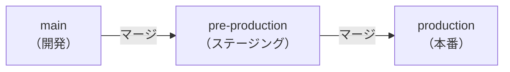

**リリースブランチを使ったバリエーション（Versioned Release向け）**

オープンソースプロジェクトやモバイルアプリなど、複数バージョンを保守する必要がある場合に使用する。`main` からリリースブランチを切り、そこに cherry-pick でバックポートする。

### 5.3 三者の比較

| 特徴 | GitFlow | GitHub Flow | GitLab Flow | TBD |
|---|---|---|---|---|
| ブランチ数 | 多い（5種類） | 少ない（2種類） | 中程度 | 最少（1〜2種類） |
| リリース管理 | 明示的 | 暗黙的（即時） | 柔軟 | 継続的 |
| 複数バージョン | サポート | サポートしない | サポート | サポートしない |
| PRレビュー | 必須ではない | 必須 | 必須 | オプション |
| デプロイ頻度 | 低 | 高 | 中〜高 | 最高 |
| 複雑度 | 高 | 低 | 中 | 最低 |

> [!NOTE]
> Vincent Driessen 自身、2020年に元の GitFlow 記事に反省の注釈を加えている。「このモデルはウェブアプリには適していない。継続的にデプロイするソフトウェアには、GitHub Flow のようなシンプルなワークフローを推奨する」と述べている。GitFlow が適しているのは、複数バージョンを同時保守するソフトウェア（ライブラリ、デスクトップアプリなど）に限定されると見るべきだろう。

---

## 6. モノレポでのトランクベース開発

### 6.1 モノレポとは

**モノレポ（Monorepo）**とは、複数のプロジェクトやサービスのコードを単一のリポジトリで管理する手法である。Google、Facebook（Meta）、Microsoft、Twitter など、大手テクノロジー企業の多くがモノレポを採用している。

Googleのモノレポは現在、数十億行のコードと数万人のエンジニアが同一リポジトリで作業しているとされる（Potvinら、2016年の論文「Why Google Stores Billions of Lines of Code in a Single Repository」より）。

### 6.2 モノレポとTBDの相性

モノレポとトランクベース開発は非常に相性が良い。その理由は以下の通りである。

**コードの可視性と再利用**

すべてのコードが単一リポジトリにあるため、別チームのコードを参照したり、変更の影響範囲を一目で確認したりが容易である。共通ライブラリの変更とそれを使用するすべてのコードの変更を単一のコミットとしてアトミックに行える。

**統一されたCI/CDパイプライン**

モノレポでは、トランク（`main`）へのコミットがすべてのサービスのCIを起動しうる。変更されたコンポーネントのみをビルド・テストする「インクリメンタルビルド」の仕組み（BazelやNxなど）と組み合わせることで、大規模リポジトリでも実用的な速度を保てる。

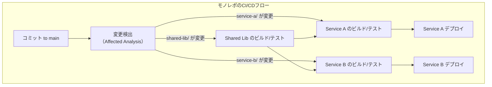

### 6.3 モノレポでのTBD実践上の課題

**CIの速度**

コードベースが大規模になると、全体のビルド時間が増大する。変更が加えられたパッケージとその依存関係のみを再ビルド・再テストする「インクリメンタルビルド」の仕組みが不可欠である。

代表的なツール：
- **Bazel**（Google製）: 精密な依存グラフ管理と分散キャッシュ
- **Nx**（JavaScript/TypeScript向け）: 変更影響分析とリモートキャッシュ
- **Turborepo**（Vercel製）: シンプルなモノレポ向けビルドシステム

**コードオーナーシップ**

モノレポでは、誰でもすべてのコードを変更できる。`CODEOWNERS` ファイル（GitHub/GitLabの機能）や `OWNERS` ファイル（Googleのモノレポ管理ツール Critique で使われる形式）を使って、特定のパスへの変更に対してレビュー権限を持つオーナーを明示的に定義することが重要である。

```yaml
# .github/CODEOWNERS の例
# service-a/ への変更は team-a のレビューが必要
/services/service-a/ @org/team-a

# shared-lib/ への変更は platform チームのレビューが必要
/packages/shared-lib/ @org/platform-team

# セキュリティ関連ファイルはセキュリティチームのレビューが必要
/packages/auth/ @org/security-team
```

---

## 7. リリーストレイン

### 7.1 リリーストレインとは

**リリーストレイン（Release Train）**とは、準備完了した変更を**定期的・時刻決め**でリリースするモデルである。電車（トレイン）が定刻に出発するように、リリースは機能の完成度に関わらず定められたスケジュールで実施する。機能が間に合わなければ「次の電車を待つ」、つまり次のリリースサイクルに乗ればよい。

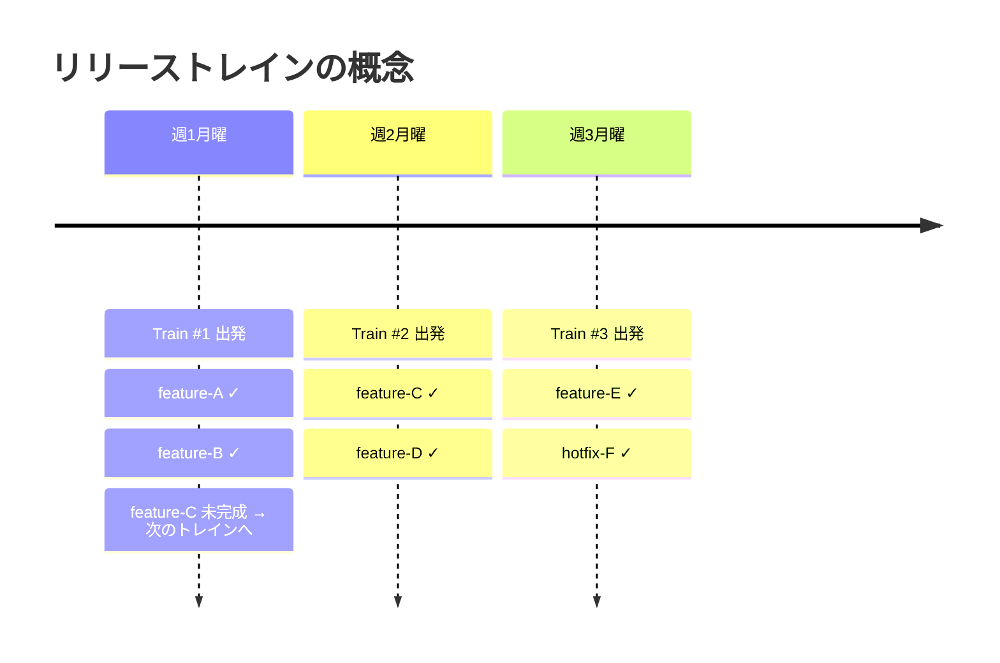

### 7.2 TBDとリリーストレインの組み合わせ

TBDとリリーストレインを組み合わせることで、以下の恩恵が得られる。

**特徴**
- 開発者はトランクに継続的にコミットする
- リリースブランチは定期的（週次、2週間など）にトランクから切られる
- リリースブランチでは最終的なバグ修正のみを行い、新機能の追加はしない
- 間に合わなかった機能はフィーチャーフラグで無効化されているか、そもそもリリースブランチに含まれていない

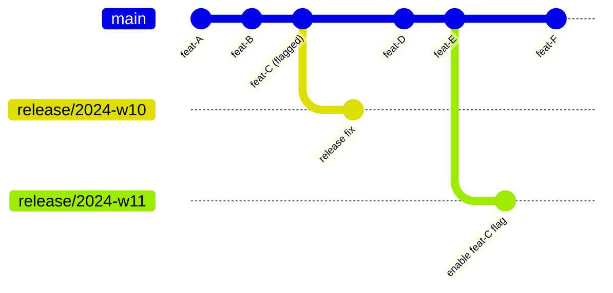

### 7.3 リリーストレインの実例

**Android プラットフォーム**: 6週間のリリーストレインを採用。
**Google Chrome**: 4週間のリリースサイクル（以前は6週間）。
**SAFe（Scaled Agile Framework）**: PI（Program Increment）という8〜12週間のリリーストレインを規定。

---

## 8. DORA指標との関係

### 8.1 DORA指標とは

**DORA（DevOps Research and Assessment）**は、2014年から継続的にソフトウェアデリバリーのパフォーマンスを研究している組織（現在はGoogle Cloud傘下）である。DORAの研究は年次レポート「State of DevOps」として発表されており、ソフトウェアデリバリーの成熟度を測る4つの指標を定義した。

1. **デプロイ頻度（Deployment Frequency）**: 本番環境へのコードデプロイの頻度
2. **変更のリードタイム（Lead Time for Changes）**: コミットから本番デプロイまでの時間
3. **変更失敗率（Change Failure Rate）**: デプロイ後に障害につながった変更の割合
4. **障害復旧時間（Time to Restore Service）**: 障害発生から復旧までの時間

### 8.2 パフォーマンスカテゴリ

DORAはこれらの指標に基づいてチームを4つのカテゴリに分類している。

| カテゴリ | デプロイ頻度 | リードタイム | 変更失敗率 | 復旧時間 |
|---|---|---|---|---|
| Elite | オンデマンド（複数回/日） | 1時間未満 | 5%未満 | 1時間未満 |
| High | 週1回〜月1回 | 1日〜1週間 | 10%未満 | 1日未満 |
| Medium | 月1回〜月6回 | 1週間〜1ヶ月 | 15%未満 | 1日〜1週間 |
| Low | 6ヶ月未満 | 1ヶ月〜6ヶ月 | 64%未満 | 1週間〜6ヶ月 |

### 8.3 TBDとDORA指標の相関

DORAの研究（特に2019年と2022年のレポート）では、**トランクベース開発の実践とEliteカテゴリへの到達に強い相関がある**ことが示されている。

具体的には、Eliteパフォーマーの特徴として以下が挙げられている：

- **短命ブランチの使用**: ブランチのライフタイムが1日以内
- **小さなバッチサイズ**: 1回のコミット/PRに含まれる変更量が小さい
- **高頻度の統合**: 少なくとも1日1回 `main` にマージ
- **包括的なテスト自動化**: 変更を自信を持ってデプロイできるテストスイート

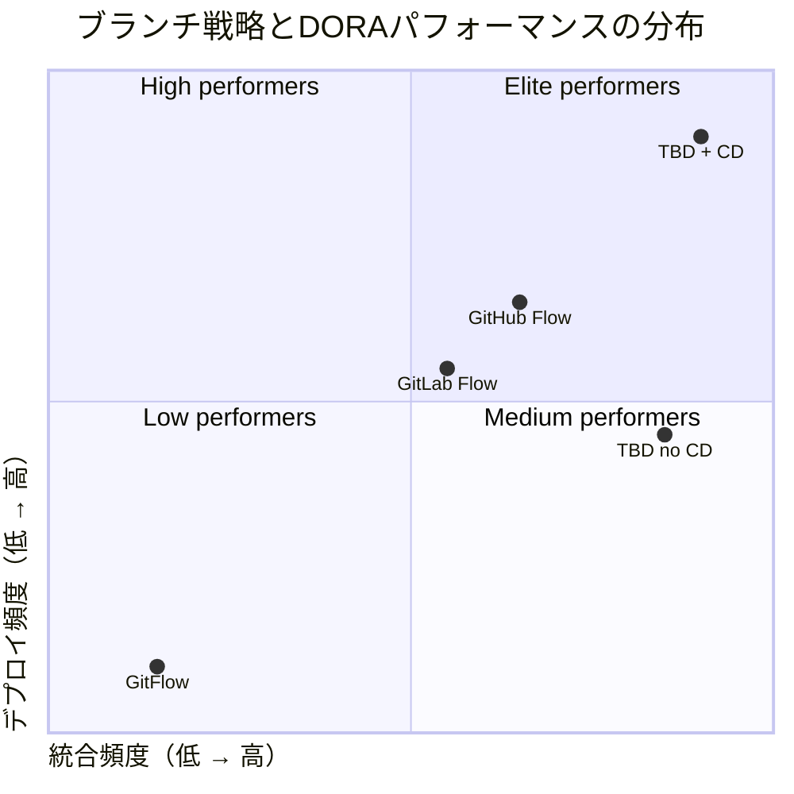

> [!NOTE]
> DORAの研究では因果関係ではなく相関関係が示されている点に注意が必要である。TBDを採用すれば自動的にEliteになれるわけではなく、テスト自動化、CD（継続的デリバリー）、心理的安全性など、多くの要素が組み合わさってはじめて高いパフォーマンスが達成される。

---

## 9. 組織規模別の推奨パターン

### 9.1 小規模チーム（1〜5名）

小規模なチームでは、コミュニケーションコストが低く、コードベースの全体像を把握しやすい。この規模では**GitHub Flow**またはシンプルな**TBD**が最適である。

**推奨構成:**
- ブランチは `main` のみ（または短命フィーチャーブランチ）
- PRレビューは任意（もしくは小さなチームでは省略も可）
- フィーチャーフラグは必要に応じて導入
- デプロイは `main` へのマージをトリガーに自動化

**避けるべき落とし穴**: 小規模チームでGitFlowを採用しても、複雑さだけが増してメリットがない。`develop` ブランチは多くの場合不要である。

### 9.2 中規模チーム（5〜50名）

複数のチームが並行して作業する規模では、コードレビューの質とマージの調整が重要になる。**GitHub Flow with PRレビュー**または**TBD + フィーチャーフラグ**が推奨される。

**推奨構成:**
- 全変更にプルリクエストを必須とする
- ブランチのライフタイムを2〜3日以内に制限するルールを設ける
- フィーチャーフラグを標準的なツールとして整備する
- `CODEOWNERS` ファイルでオーナーシップを明示する
- CI時間を10分以内に保つことを目標にする

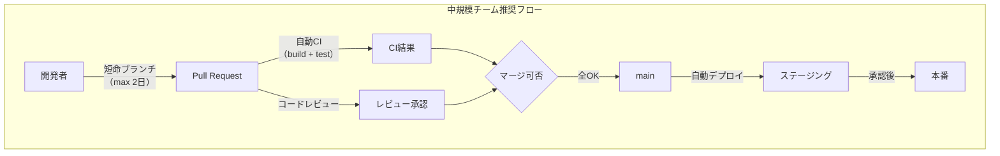

### 9.3 大規模チーム（50名〜）

大規模組織では、数十〜数百のチームが同一リポジトリ（または関連するリポジトリ群）で作業する。**TBD + モノレポ + 大規模フィーチャーフラグ管理**が現実的な選択となる。

**推奨構成:**
- モノレポ + インクリメンタルビルドツール（Bazel、Nx等）
- 専用のフィーチャーフラグ管理プラットフォーム（LaunchDarkly等）
- `CODEOWNERS` による厳格なオーナーシップ管理
- リリーストレイン（週次〜2週間ごと）との組み合わせ
- ブランチへの直接プッシュを制限するブランチプロテクションルール

**Google/Facebookの実践:**

Googleは全社員が単一のモノレポ（Piper）で開発しており、トランクに直接コミットするスタイルを採用している。PRに相当するレビューシステム（Critique）も内製している。フィーチャーフラグシステムは数千のフラグを管理する大規模なものである。

Facebookも同様にモノレポ+TBDを採用しており、毎日数千のコミットが `main` に統合される。フィーチャーフラグを使った段階的ロールアウトが標準的な手法となっている。

### 9.4 特殊ケース：複数バージョン保守が必要な場合

GitFlowやリリースブランチモデルが依然として有効なケースも存在する。

- **OSS（オープンソースソフトウェア）**: 複数のメジャーバージョンを並行してサポートする必要がある（例: Node.js LTS、PostgreSQL等）
- **エンタープライズソフトウェア**: 顧客が特定のバージョンをオンプレミス環境で使用し続けるケース
- **モバイルアプリ**: App StoreやGoogle Playのレビュープロセスがあり、即時デプロイができない

これらのケースでは、`main` + リリースブランチ（例: `release/v2.x`）という構成が合理的である。ただし、この場合でもフィーチャーブランチの長命化は避け、できる限り `main` への統合を頻繁に行うべきである。

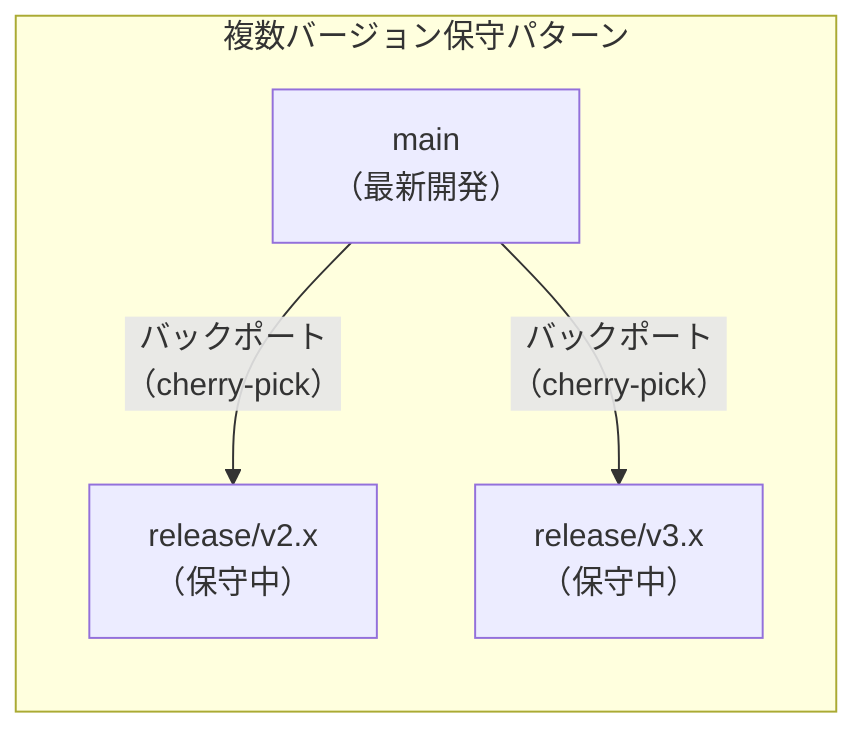

---

## 10. TBDへの移行戦略

### 10.1 段階的な移行アプローチ

GitFlowからTBDへの移行は一夜にして行えるものではない。以下のような段階的アプローチが現実的である。

**フェーズ1: CIの強化**

まずCI基盤を整備する。テストカバレッジを高め、CIの実行時間を短縮することが先決である。CIが信頼できない（不安定なテスト、遅いビルド）状態でTBDを始めても、苦痛が増すだけである。

**フェーズ2: ブランチのライフタイム制限**

フィーチャーブランチの存在は認めつつ、ライフタイムの上限（例: 3日）を設ける。これにより「マージ地獄」が段階的に解消される。

**フェーズ3: フィーチャーフラグの導入**

フィーチャーフラグの仕組みを整備し、未完成機能をフラグで制御することに慣れる。これにより「機能が完成していないとマージできない」という心理的障壁が取り除かれる。

**フェーズ4: 直接コミットへの移行**

チームに十分な信頼とスキルが蓄積されたら、PRなしで直接 `main` にコミットするスタイルに移行する。この段階では、強固なCI/CDとテスト自動化が前提となる。

### 10.2 よくある抵抗と対処法

**「未完成のコードをmainに入れたくない」**

フィーチャーフラグを使えば、未完成のコードを `main` に含めつつ本番で無効化できる。重要なのは、コードが `main` にあることと、ユーザーがその機能を使えることは別の話だという認識を共有することである。

**「コードレビューなしでコミットするのが怖い」**

TBDはコードレビューを禁止しない。PRベースのレビューを続けつつ、ブランチのライフタイムを短くすることで、両方の恩恵を得られる。

**「大きな機能を小さく分割するのが難しい」**

これは技術的なスキルの問題である。Strangler Fig パターン（既存の実装を段階的に新実装で置き換える）、抽象化レイヤーの導入、インターフェースの先行定義などのリファクタリングパターンを学ぶことで対応できる。

---

## 11. まとめ

ブランチ戦略の選択は、単なるGitの使い方の問題ではなく、チームのデリバリー能力と組織文化に深く関わる意思決定である。

**GitFlowが適している状況:**
- 定期リリースサイクル（月次・四半期）が定着しており、変更不可な場合
- 複数の本番バージョンを同時保守する必要がある場合
- エンタープライズ顧客向けにバージョン管理が必要な場合

**TBDが適している状況:**
- 継続的デリバリーを実現したい場合
- DORA Eliteパフォーマーを目指す場合
- 統合のオーバーヘッドをゼロに近づけたい場合
- チームの規模が大きく、統合コストがボトルネックになっている場合

最終的に、DORAの研究が繰り返し示しているように、**高いデプロイ頻度は品質とトレードオフではない**。むしろ高頻度デプロイチームの方が変更失敗率が低く、復旧時間も短い。トランクベース開発はその高頻度デプロイを可能にするための基盤となるプラクティスであり、現代のソフトウェア組織が目指すべき方向性を示している。

> [!TIP]
> トランクベース開発に関する包括的なリソース：
> - [trunkbaseddevelopment.com](https://trunkbaseddevelopment.com/) — Paul Hammant によるTBDの公式解説サイト
> - 書籍『Accelerate』（Nicole Forsgren, Jez Humble, Gene Kim）— DORA指標とTBDの関係を詳述
> - 書籍『Continuous Delivery』（Jez Humble, David Farley）— CI/CDとTBDの実践的ガイド
> - Google のブログ記事「Why Google Stores Billions of Lines of Code in a Single Repository」— モノレポ+TBDの実践例
