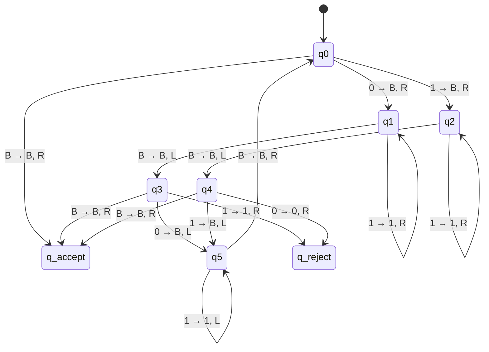
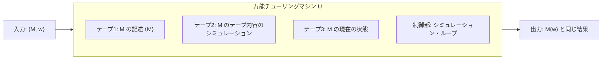
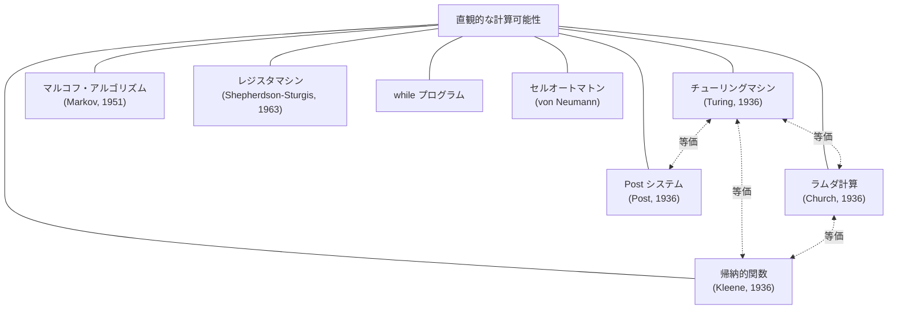
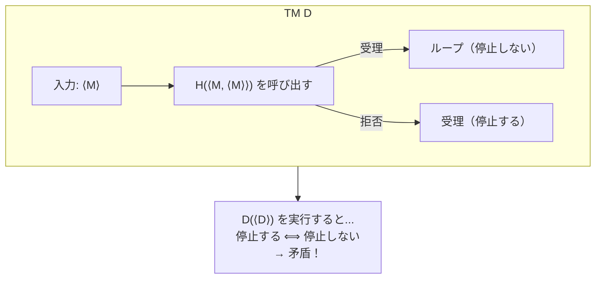
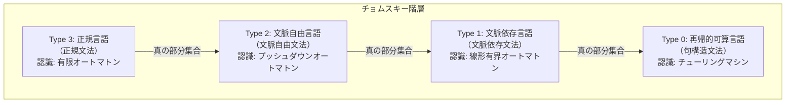
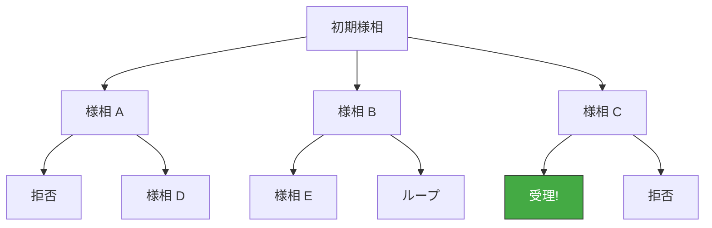

# チューリングマシンと計算可能性

## 1. 歴史的背景：計算の概念を求めて

### 1.1 ヒルベルトのプログラムと決定問題

20世紀初頭、数学界は基礎の危機に直面していた。集合論のパラドックスが発見され、数学の無矛盾性が疑問視される中、David Hilbert は壮大な構想を打ち出した。それが**ヒルベルトのプログラム**である。彼は数学の全体を有限の手続きによって形式化し、以下の3つの性質を証明しようと試みた。

1. **無矛盾性（Consistency）**：数学の公理系から矛盾が導かれないこと
2. **完全性（Completeness）**：真なる命題はすべて証明可能であること
3. **決定可能性（Decidability）**：任意の命題について、有限のステップで真偽を判定する手続きが存在すること

3番目の性質、すなわち**決定問題（Entscheidungsproblem）**は、1928年にヒルベルトと Wilhelm Ackermann によって明確に定式化された。具体的には「一階述語論理の任意の文が妥当（valid）であるかどうかを判定する一般的なアルゴリズムは存在するか？」という問いである。

しかし、この壮大な計画は次々と打ち砕かれることになる。1931年、Kurt Godel が**不完全性定理**を発表し、ヒルベルトのプログラムの2番目の柱である完全性が崩壊した。Godel は、十分に強力な形式体系（ペアノ算術を含む体系）においては、その体系内で証明も反証もできない命題が必然的に存在することを示した。さらに第二不完全性定理により、そのような体系は自身の無矛盾性を証明できないことも示された。

残されたのは決定問題であった。そして1936年、この問題に対する最終的な回答が、2人の数学者によってほぼ同時に、しかし独立に与えられた。

### 1.2 チャーチとチューリング——二つのアプローチ

**Alonzo Church** はプリンストン大学の数学者で、**ラムダ計算（lambda calculus）**という形式体系を用いて計算可能性を定義した。ラムダ計算は関数の抽象化と適用のみを基本操作とする体系であり、Church は1936年の論文 *"An Unsolvable Problem of Elementary Number Theory"* において、ラムダ計算の枠組みで決定問題が解決不可能であることを証明した。

一方、**Alan Turing** は当時ケンブリッジ大学の若き数学者であり、後に Church のもとでプリンストン大学の博士課程に進むことになる。Turing は1936年の論文 *"On Computable Numbers, with an Application to the Entscheidungsproblem"* において、まったく異なるアプローチを採った。彼は**仮想的な機械**——無限のテープとそれを読み書きするヘッドを持つ抽象的な装置——を考案し、この機械で実行できる手続きをもって「計算」を定義した。この抽象機械が**チューリングマシン（Turing machine）**である。

Church と Turing のアプローチは表面的にはまったく異なるものだった。Church のラムダ計算は純粋に数学的・関数的であり、Turing のマシンは機械的・操作的であった。しかし、驚くべきことに、両者が定義する「計算可能な関数」のクラスは完全に一致することが証明された。この等価性は、後に述べる**チャーチ＝チューリングのテーゼ**の根幹を成す事実である。

### 1.3 Turing の着想

Turing のアプローチが画期的だったのは、彼が「人間が紙と鉛筆を使って計算する行為」を徹底的に分析し、その本質を抽出したことにある。Turing は人間の計算プロセスを以下のように観察した。

- 計算者は一度に有限個のシンボルしか観察できない
- 計算者は有限個の「心の状態」しか持てない
- 計算者は現在のシンボルと心の状態に基づいて、次の動作を決定する
- 動作はシンボルの書き換え、注目位置の移動、心の状態の変更に限られる

この観察を形式化したものがチューリングマシンである。Turing の天才は、きわめて単純な機械がいかに強力であるかを示した点にある。無限のテープ、有限の状態、局所的な読み書き——これだけで、原理的にはあらゆる「計算可能な」問題を解くことができるのである。

::: tip チューリングマシンの本質
チューリングマシンは「計算とは何か」に対する、機械的・操作的な回答である。無限のメモリ（テープ）と有限の制御（状態遷移関数）だけからなるこの単純な装置が、現代のあらゆるコンピュータと同等の計算能力を持つ。この驚くべき事実が、計算機科学の理論的基盤を形成している。
:::

## 2. チューリングマシンの形式的定義

### 2.1 基本構成要素

チューリングマシン（以下 TM と略記する）は、直観的には以下の要素で構成される。

```
         ┌───┬───┬───┬───┬───┬───┬───┬───┬───┬───┬───┐
  テープ  │ B │ 1 │ 0 │ 1 │ 1 │ 0 │ B │ B │ B │ B │...│
         └───┴───┴───┴─▲─┴───┴───┴───┴───┴───┴───┴───┘
                       │
                   ┌───┴───┐
                   │ ヘッド │
                   └───┬───┘
                       │
                   ┌───┴───┐
                   │ 制御部 │
                   │ 状態:q │
                   └───────┘
```

- **テープ（Tape）**：両方向に無限に続くセルの列。各セルにはテープアルファベットの1文字が書かれている
- **ヘッド（Head）**：テープ上の1つのセルを指し、そのセルの内容を読み書きする
- **制御部（Finite Control）**：有限個の状態を持ち、現在の状態と読んだシンボルに基づいて動作を決定する

### 2.2 形式的定義

チューリングマシンは7つ組（7-tuple）として形式的に定義される。

$$
M = (Q, \Sigma, \Gamma, \delta, q_0, q_{\text{accept}}, q_{\text{reject}})
$$

各要素の意味は以下の通りである。

| 記号 | 名称 | 説明 |
|---|---|---|
| $Q$ | 状態の有限集合 | マシンが取りうるすべての状態の集合 |
| $\Sigma$ | 入力アルファベット | 入力文字列で使用されるシンボルの有限集合。空白記号を含まない |
| $\Gamma$ | テープアルファベット | テープ上に現れうるすべてのシンボルの有限集合。$\Sigma \subseteq \Gamma$ かつ空白記号 $B \in \Gamma$ |
| $\delta$ | 遷移関数 | $\delta: Q \times \Gamma \to Q \times \Gamma \times \{L, R\}$ |
| $q_0$ | 開始状態 | $q_0 \in Q$、計算開始時の状態 |
| $q_{\text{accept}}$ | 受理状態 | $q_{\text{accept}} \in Q$、この状態に到達すると入力を受理 |
| $q_{\text{reject}}$ | 拒否状態 | $q_{\text{reject}} \in Q$、$q_{\text{reject}} \neq q_{\text{accept}}$、この状態に到達すると入力を拒否 |

遷移関数 $\delta$ が計算の「プログラム」に相当する。$\delta(q, a) = (q', b, D)$ は、「状態 $q$ でシンボル $a$ を読んだとき、状態を $q'$ に変え、シンボル $b$ を書き込み、方向 $D$（$L$: 左、$R$: 右）にヘッドを移動する」という意味である。

### 2.3 計算の形式的記述：様相（Configuration）

TM の計算を厳密に記述するために、**様相（configuration）**の概念を導入する。様相とは、ある時点における TM の「スナップショット」であり、以下の3つの情報を含む。

1. 現在の状態
2. テープの内容
3. ヘッドの位置

様相は文字列 $u\,q\,v$ として表現される。ここで $u$ はヘッドの左側にあるテープ内容、$q$ は現在の状態、$v$ はヘッド位置以降のテープ内容（ヘッドが指すセルの文字が $v$ の先頭）である。

様相 $C_1$ から $C_2$ への遷移を $C_1 \vdash C_2$ と書く。TM $M$ の入力 $w$ に対する**計算（computation）**は、様相の列 $C_0, C_1, C_2, \ldots$ であり、以下の条件を満たす。

- $C_0 = q_0 w$（初期様相：開始状態で入力 $w$ がテープに書かれた状態）
- $C_i \vdash C_{i+1}$（各ステップは遷移関数に従う）
- 最終様相が受理状態または拒否状態を含む（停止する場合）

### 2.4 受理・拒否・ループ

TM $M$ の入力 $w$ に対する振る舞いは、以下の3通りのいずれかになる。

1. **受理（Accept）**：計算が有限ステップで $q_{\text{accept}}$ を含む様相に到達する
2. **拒否（Reject）**：計算が有限ステップで $q_{\text{reject}}$ を含む様相に到達する
3. **ループ（Loop）**：計算が永遠に停止しない

この3番目の可能性——計算が停止しないこと——が、TM を有限オートマトンやプッシュダウンオートマトンと本質的に区別する特徴であり、後に述べる停止問題（Halting Problem）の核心に関わる。

TM $M$ が**認識（recognize）**する言語は、$M$ が受理する入力の集合である。

$$
L(M) = \{ w \in \Sigma^* \mid M \text{ は } w \text{ を受理する} \}
$$

TM $M$ が入力に対して常に停止する（受理または拒否し、ループしない）とき、$M$ を**決定者（decider）**と呼ぶ。決定者によって認識される言語を**決定可能言語（decidable language）**と呼ぶ。

## 3. 計算の例と動作の追跡

### 3.1 例1：回文の判定

具体例として、入力が回文（前から読んでも後ろから読んでも同じ文字列）であるかを判定する TM を考える。入力アルファベットは $\Sigma = \{0, 1\}$ とする。

**アルゴリズムの概要：**

1. テープの先頭の文字を読んで記憶し、空白で上書きする
2. テープの末尾（空白の直前）まで移動する
3. 末尾の文字と記憶した文字を比較する
4. 一致すれば末尾を空白で上書きし、先頭に戻る。不一致なら拒否する
5. テープが空（すべて空白）になれば受理する

この TM を形式的に定義する。

$$
M_{\text{palindrome}} = (Q, \Sigma, \Gamma, \delta, q_0, q_{\text{accept}}, q_{\text{reject}})
$$

- $Q = \{q_0, q_1, q_2, q_3, q_4, q_5, q_{\text{accept}}, q_{\text{reject}}\}$
- $\Sigma = \{0, 1\}$
- $\Gamma = \{0, 1, B\}$（$B$ は空白記号）

状態の意味は以下の通りである。

| 状態 | 意味 |
|---|---|
| $q_0$ | 先頭の文字を読む |
| $q_1$ | 「0」を記憶して右端へ移動中 |
| $q_2$ | 「1」を記憶して右端へ移動中 |
| $q_3$ | 右端の文字と比較する |
| $q_4$ | 左端へ戻る |
| $q_5$ | （予備状態） |

遷移関数の主要部分を以下に示す。

| 現在の状態 | 読んだ記号 | 次の状態 | 書く記号 | ヘッド移動 |
|---|---|---|---|---|
| $q_0$ | $0$ | $q_1$ | $B$ | $R$ |
| $q_0$ | $1$ | $q_2$ | $B$ | $R$ |
| $q_0$ | $B$ | $q_{\text{accept}}$ | $B$ | $R$ |
| $q_1$ | $0, 1$ | $q_1$ | そのまま | $R$ |
| $q_1$ | $B$ | $q_3$ | $B$ | $L$ |
| $q_2$ | $0, 1$ | $q_2$ | そのまま | $R$ |
| $q_2$ | $B$ | $q_4$ | $B$ | $L$ |
| $q_3$ | $0$ | $q_5$ | $B$ | $L$ |
| $q_3$ | $1$ | $q_{\text{reject}}$ | $1$ | $R$ |
| $q_4$ | $1$ | $q_5$ | $B$ | $L$ |
| $q_4$ | $0$ | $q_{\text{reject}}$ | $0$ | $R$ |
| $q_5$ | $0, 1$ | $q_5$ | そのまま | $L$ |
| $q_5$ | $B$ | $q_0$ | $B$ | $R$ |

### 3.2 入力 "0110" に対する動作追跡

入力 $w = 0110$ に対する計算を様相の列として追跡する。下線はヘッドの位置を示す。

```
ステップ 0:  [q0] 0 1 1 0 B B ...     先頭の 0 を読む
ステップ 1:  B [q1] 1 1 0 B B ...     0 を記憶、右へ
ステップ 2:  B 1 [q1] 1 0 B B ...     右へ移動中
ステップ 3:  B 1 1 [q1] 0 B B ...     右へ移動中
ステップ 4:  B 1 1 0 [q1] B B ...     右端到達
ステップ 5:  B 1 1 [q3] 0 B B ...     左に戻って比較
ステップ 6:  B 1 [q5] 1 B B B ...     0 と 0 が一致、末尾消去
ステップ 7:  B [q5] 1 1 B B B ...     左端へ戻る
ステップ 8:  [q5] B 1 1 B B B ...     空白到達
ステップ 9:  B [q0] 1 1 B B B ...     次のラウンドへ
ステップ10:  B B [q2] 1 B B B ...     1 を記憶、右へ
ステップ11:  B B 1 [q2] B B B ...     右端到達
ステップ12:  B B [q4] 1 B B B ...     比較
ステップ13:  B [q5] B B B B B ...     1 と 1 が一致
ステップ14:  B B [q0] B B B B ...     テープが空
ステップ15:  受理!
```

入力 "0110" は回文であるため、TM は受理状態に到達する。

### 3.3 状態遷移図

上記の TM の動作を状態遷移図として視覚化する。



### 3.4 例2：二進数の加算

もう一つの例として、テープ上に `#` で区切られた二つの二進数が書かれている場合に、それらの和を計算する TM を概念的に説明する。入力形式は `$w_1$#$w_2$` であり、$w_1, w_2 \in \{0, 1\}^*$ はそれぞれ二進数を表す。

この TM は以下のステップで動作する。

1. $w_2$ の最下位ビットを読み取り、消去する
2. そのビットを $w_1$ の最下位ビットに加算する（繰り上がりを状態で記憶）
3. 繰り上がりがあれば上位ビットに伝搬する
4. $w_2$ が空になるまで繰り返す

この例は、TM が単なる言語認識だけでなく、**関数の計算**にも使用できることを示している。

## 4. 万能チューリングマシン

### 4.1 マシンの符号化

チューリングマシンの最も深遠な性質の一つは、**TM 自体をデータとして表現できる**ことである。任意の TM $M$ は、その状態集合、アルファベット、遷移関数を適切に符号化することで、有限長の文字列 $\langle M \rangle$ として表現できる。

具体的な符号化方法の一例を示す。状態 $q_i$ を $0^i$（$0$ を $i$ 個並べたもの）で表し、テープ記号 $a_j$ を $0^j$ で表し、方向 $L, R$ をそれぞれ $0, 00$ で表す。遷移規則 $\delta(q_i, a_j) = (q_k, a_l, D)$ を、これらの符号の連結 $0^i 1 0^j 1 0^k 1 0^l 1 D$ として符号化する。各遷移規則を $11$ で区切り、マシン全体の記述を $111$ で終端する。

この符号化は一例に過ぎないが、重要な点は、**任意の TM が有限の文字列として表現可能**であるという事実そのものである。

### 4.2 万能チューリングマシンの定義

**万能チューリングマシン（Universal Turing Machine, UTM）**とは、他の任意の TM の動作をシミュレートできる TM である。UTM $U$ は入力として「シミュレート対象の TM の記述 $\langle M \rangle$」と「その TM への入力 $w$」の対 $\langle M, w \rangle$ を受け取り、$M$ が $w$ に対して行う計算を忠実に再現する。

$$
U(\langle M, w \rangle) = M(w)
$$

すなわち、$M$ が $w$ を受理するなら $U$ も $\langle M, w \rangle$ を受理し、$M$ が $w$ を拒否するなら $U$ も拒否し、$M$ がループするなら $U$ もループする。

### 4.3 UTM の動作原理

UTM の動作を概念的に説明する。UTM は3本のテープ（後述する多テープ TM で実現可能であり、単一テープ TM とも等価）を使用すると考えるとわかりやすい。



UTM のシミュレーション・ループは以下のように動作する。

1. **初期化**：入力 $\langle M, w \rangle$ を解析し、テープ1に $\langle M \rangle$ を、テープ2に $w$ を配置し、テープ3に $M$ の開始状態 $q_0$ の符号を書く
2. **シミュレーション・ステップ**：以下を繰り返す
   - テープ2のヘッド位置にあるシンボル $a$ を読む
   - テープ3から現在の状態 $q$ を読む
   - テープ1上で遷移規則 $\delta(q, a)$ を探索する
   - 対応する遷移 $(q', b, D)$ が見つかったら、テープ2に $b$ を書き、ヘッドを方向 $D$ に移動し、テープ3の状態を $q'$ に更新する
   - $q'$ が受理状態または拒否状態であれば、対応する動作を行って停止する

### 4.4 UTM の意義

UTM は理論的にも実用的にも極めて重要である。

**理論的意義：**

- **計算の普遍性**：特定の問題に特化したマシンではなく、あらゆる計算を実行できる汎用マシンが存在することを示す
- **プログラム内蔵方式の原型**：「プログラム（TM の記述）」と「データ（入力）」を同じテープ上に配置するという構造は、後の von Neumann アーキテクチャの概念的な先駆けである
- **停止問題の証明の鍵**：UTM の存在は、後述する停止問題の決定不可能性の証明において本質的な役割を果たす

**実用的意義：**

現代のすべてのコンピュータは、本質的には UTM の物理的実装である。CPU はハードウェアで実装された UTM であり、ソフトウェア（プログラム）は TM の記述 $\langle M \rangle$ に、データは入力 $w$ に対応する。インタプリタやエミュレータも UTM の具体的な実現形態と見なすことができる。

::: warning プログラムとデータの同一視
UTM が可能にする「プログラムとデータの同一視」は、コンピュータの汎用性の源泉であると同時に、セキュリティ上の課題の根源でもある。バッファオーバーフロー攻撃のような脆弱性は、データとして注入されたビット列がプログラムとして実行されてしまうことに起因する。チューリングが1936年に示した原理が、21世紀のサイバーセキュリティに直結しているのである。
:::

## 5. チャーチ＝チューリングのテーゼ

### 5.1 テーゼの内容

**チャーチ＝チューリングのテーゼ（Church-Turing Thesis）**は、計算機科学の最も根本的な仮説であり、以下のように述べられる。

> **直観的に「計算可能」であるすべての関数は、チューリングマシンによって計算可能である。**

あるいは同値な表現として、

> **「効果的に計算可能（effectively computable）」な関数のクラスは、チューリング計算可能な関数のクラスと一致する。**

ここで重要なのは、このテーゼが**数学的定理ではない**ということである。「直観的に計算可能」という概念は厳密に形式化されていないため、このテーゼは証明も反証もできない。しかし、テーゼを支持する圧倒的な証拠が蓄積されており、計算機科学のコミュニティでは広く受け入れられている。

### 5.2 テーゼを支持する根拠

チャーチ＝チューリングのテーゼが広く受け入れられている理由は、複数の独立した「計算可能性の定式化」がすべて同じ関数のクラスを定義するという驚くべき事実に基づく。



これらの形式化はそれぞれまったく異なる発想に基づいているにもかかわらず、すべて同じ計算能力を持つ。この「合流（convergence）」は、チャーチ＝チューリングのテーゼの最も強力な根拠とされている。

### 5.3 テーゼの限界と拡張

チャーチ＝チューリングのテーゼは「何が計算可能か」を述べるものであり、「どれだけ効率的に計算できるか」については何も言っていない。この点を補うのが**拡張チャーチ＝チューリングのテーゼ（Extended Church-Turing Thesis）**である。

> **確率的チューリングマシンで多項式時間で計算可能な問題は、任意の物理的に実現可能な計算モデルでも多項式時間で計算可能である。**

この拡張テーゼについては、**量子コンピュータ**の登場により議論が活発化している。Peter Shor が1994年に発見した量子アルゴリズムは、整数の素因数分解を多項式時間で実行できる。古典的なコンピュータでは素因数分解の多項式時間アルゴリズムは知られていないため、量子コンピュータは拡張チャーチ＝チューリングのテーゼの反例となる可能性がある。

ただし、量子コンピュータであっても計算可能な関数のクラス自体は TM と変わらない。量子コンピュータが覆す可能性があるのは効率性に関する拡張テーゼであり、計算可能性に関する元のテーゼではない。

## 6. 計算可能性と決定不可能性

### 6.1 計算可能関数

**計算可能関数（computable function）**とは、TM によって計算できる関数のことである。形式的には、関数 $f: \Sigma^* \to \Sigma^*$ が計算可能であるとは、ある TM $M$ が存在して、任意の入力 $w$ に対して $M$ が $f(w)$ をテープ上に出力して停止することをいう。

計算可能関数の例：

- 加算、乗算、べき乗などの算術関数
- 素数判定
- ソーティング
- 文字列の探索・置換

### 6.2 停止問題（Halting Problem）

計算可能性理論における最も重要な結果の一つが、**停止問題の決定不可能性**である。

停止問題は以下のように定式化される。

$$
\text{HALT} = \{ \langle M, w \rangle \mid M \text{ は TM であり、} M \text{ は入力 } w \text{ に対して停止する} \}
$$

**定理**：$\text{HALT}$ は決定不可能である。すなわち、$\text{HALT}$ を決定する TM は存在しない。

**証明（対角線論法による）：**

背理法で証明する。$\text{HALT}$ を決定する TM $H$ が存在すると仮定する。すなわち、$H(\langle M, w \rangle)$ は $M$ が $w$ で停止するなら受理し、停止しないなら拒否する。

$H$ を用いて、新たな TM $D$ を以下のように構成する。

$$
D(\langle M \rangle) =
\begin{cases}
\text{ループ（停止しない）} & \text{if } H(\langle M, \langle M \rangle \rangle) = \text{受理} \\
\text{受理} & \text{if } H(\langle M, \langle M \rangle \rangle) = \text{拒否}
\end{cases}
$$

$D$ は TM $M$ の記述を入力として受け取り、$H$ を使って「$M$ が自分自身の記述 $\langle M \rangle$ を入力としたときに停止するか」を判定する。停止するなら $D$ はループし、停止しないなら $D$ は受理する。

ここで $D$ 自身の記述 $\langle D \rangle$ を $D$ に入力する。すなわち $D(\langle D \rangle)$ を考える。

- $D(\langle D \rangle)$ が停止すると仮定する → $H(\langle D, \langle D \rangle \rangle)$ は受理 → $D$ の定義によりループ → 矛盾
- $D(\langle D \rangle)$ が停止しないと仮定する → $H(\langle D, \langle D \rangle \rangle)$ は拒否 → $D$ の定義により受理（停止）→ 矛盾

いずれの場合も矛盾が生じる。したがって、$H$ の存在を仮定したことが誤りであり、$\text{HALT}$ を決定する TM は存在しない。$\square$



### 6.3 帰着（Reduction）と他の決定不可能問題

停止問題の決定不可能性を利用して、他の多くの問題も決定不可能であることが示される。鍵となる技法は**帰着（reduction）**である。

問題 $A$ から問題 $B$ への**帰着（写像帰着、many-one reduction）**とは、計算可能な関数 $f$ であって、任意の入力 $w$ に対して以下を満たすものをいう。

$$
w \in A \iff f(w) \in B
$$

$A$ が $B$ に帰着可能であることを $A \leq_m B$ と書く。直観的には、「$B$ が解ければ $A$ も解ける」という意味であり、対偶として「$A$ が決定不可能なら $B$ も決定不可能」ということになる。

停止問題からの帰着により、以下のような問題が決定不可能であることが示される。

| 問題 | 内容 |
|---|---|
| 空でない言語の認識 | TM $M$ が少なくとも1つの入力を受理するか？ |
| 等価性問題 | 2つの TM $M_1, M_2$ が同じ言語を認識するか？ |
| Rice の定理の適用例 | TM の認識する言語に関する任意の非自明な性質 |
| Post の対応問題 | 与えられた文字列のペア列にマッチング列が存在するか？ |

### 6.4 Rice の定理

**Rice の定理**は、TM の計算能力の限界を示す非常に強力で一般的な結果である。

**定理（Rice の定理）**：$P$ を再帰的可算言語（TM が認識する言語）に関する**非自明な性質**とする（すなわち、$P$ を満たす言語と満たさない言語の両方が存在する）。このとき、「TM $M$ の認識する言語 $L(M)$ が性質 $P$ を満たすか？」という問題は決定不可能である。

$$
L_P = \{ \langle M \rangle \mid L(M) \text{ は性質 } P \text{ を満たす} \}
$$

は決定不可能である。

Rice の定理の意味するところは深い。「TM が認識する言語について何か非自明なこと」を判定するアルゴリズムは原理的に存在しない。たとえば以下の問いはすべて決定不可能である。

- TM $M$ の認識する言語は空か？
- TM $M$ の認識する言語は有限か？
- TM $M$ の認識する言語は正規言語か？
- TM $M$ の認識する言語は $\Sigma^*$ と等しいか？

## 7. 計算可能関数と再帰関数

### 7.1 原始再帰関数

チューリングマシンとは独立に、「計算可能な関数」を特徴づけるもう一つの重要なアプローチが**再帰関数理論**である。このアプローチは Godel, Herbrand, Kleene らによって発展した。

**原始再帰関数（Primitive Recursive Functions）**は、以下の基本関数と演算子から構成される関数のクラスである。

**基本関数：**

1. **零関数（Zero function）**：$Z(n) = 0$（任意の自然数に対して0を返す）
2. **後者関数（Successor function）**：$S(n) = n + 1$
3. **射影関数（Projection function）**：$P_i^k(x_1, \ldots, x_k) = x_i$（$k$ 個の引数のうち $i$ 番目を返す）

**演算子：**

4. **合成（Composition）**：関数 $g, h_1, \ldots, h_m$ が原始再帰的なら、$f(x_1, \ldots, x_k) = g(h_1(x_1, \ldots, x_k), \ldots, h_m(x_1, \ldots, x_k))$ も原始再帰的
5. **原始再帰（Primitive Recursion）**：関数 $g, h$ が原始再帰的なら、以下で定義される $f$ も原始再帰的

$$
\begin{aligned}
f(0, x_1, \ldots, x_k) &= g(x_1, \ldots, x_k) \\
f(n+1, x_1, \ldots, x_k) &= h(f(n, x_1, \ldots, x_k), n, x_1, \ldots, x_k)
\end{aligned}
$$

原始再帰関数の例として、加算、乗算、べき乗、階乗、前者関数（predecessor）、限定的減算（monus）などがある。

例えば加算は以下のように定義できる。

$$
\begin{aligned}
\text{add}(0, y) &= P_1^1(y) = y \\
\text{add}(n+1, y) &= S(P_1^3(\text{add}(n, y), n, y)) = S(\text{add}(n, y))
\end{aligned}
$$

### 7.2 原始再帰関数の限界とAckermann 関数

原始再帰関数は非常に広いクラスの関数を含むが、「計算可能なすべての関数」を尽くすわけではない。**Ackermann 関数**（正確には Ackermann-Peter 関数）はその反例として知られている。

$$
\begin{aligned}
A(0, n) &= n + 1 \\
A(m+1, 0) &= A(m, 1) \\
A(m+1, n+1) &= A(m, A(m+1, n))
\end{aligned}
$$

Ackermann 関数は全域的（すべての入力に対して停止する）かつ計算可能だが、原始再帰的ではない。この関数は極めて急速に成長し、原始再帰関数のどの関数よりも速く成長する。

| $m$ | $A(m, n)$ の概算 |
|---|---|
| 0 | $n + 1$ |
| 1 | $n + 2$ |
| 2 | $2n + 3$ |
| 3 | $2^{n+3} - 3$ |
| 4 | $2 \uparrow\uparrow (n+3) - 3$（テトレーション） |

### 7.3 部分再帰関数（$\mu$再帰関数）

原始再帰関数に**最小化演算子（$\mu$-operator）**を追加することで得られるのが**部分再帰関数（Partial Recursive Functions）**、あるいは **$\mu$再帰関数**のクラスである。

**最小化演算子**：関数 $g$ が与えられたとき、

$$
f(x_1, \ldots, x_k) = \mu y [g(x_1, \ldots, x_k, y) = 0]
$$

は「$g(x_1, \ldots, x_k, y) = 0$ を満たす最小の $y$」を返す。ただし、そのような $y$ が存在しない場合、$f$ は未定義（停止しない）となる。

$\mu$再帰関数のクラスは、TM が計算できる関数のクラスと正確に一致する。これが Kleene の定理であり、チャーチ＝チューリングのテーゼを支持する重要な根拠の一つである。

$$
\text{原始再帰関数} \subsetneq \text{$\mu$再帰関数} = \text{TM 計算可能関数}
$$

### 7.4 チョムスキー階層との関係

計算可能性の議論は、形式言語理論における**チョムスキー階層（Chomsky Hierarchy）**とも深く結びついている。



各レベルの計算モデルは以下のように対応する。

| チョムスキー型 | 言語クラス | 計算モデル | メモリの制限 |
|---|---|---|---|
| Type 3 | 正規言語 | 有限オートマトン（FA） | なし（内部状態のみ） |
| Type 2 | 文脈自由言語 | プッシュダウンオートマトン（PDA） | スタック（LIFO） |
| Type 1 | 文脈依存言語 | 線形有界オートマトン（LBA） | 入力長に線形のテープ |
| Type 0 | 再帰的可算言語 | チューリングマシン（TM） | 無制限 |

TM はこの階層の頂点に位置し、最も広い言語クラスを認識できる。しかし、TM をもってしても認識できない言語が存在する。そのような言語は**非再帰的可算言語**と呼ばれ、対角線言語やその補集合などがその例である。

## 8. チューリングマシンの変種

### 8.1 多テープチューリングマシン

**多テープチューリングマシン（Multi-tape Turing Machine）**は、$k$ 本の独立なテープとそれぞれにヘッドを持つ。遷移関数は全ヘッドの読み取り内容に基づき、各テープへの書き込みと各ヘッドの移動を一度に決定する。

$$
\delta: Q \times \Gamma^k \to Q \times \Gamma^k \times \{L, R, S\}^k
$$

ここで $S$ は「ヘッドを動かさない」を表す。

```
テープ1:  ┌───┬───┬───┬───┬───┬───┐
          │ a │ b │ c │ B │ B │ B │
          └───┴───┴─▲─┴───┴───┴───┘
テープ2:  ┌───┬───┬───┬───┬───┬───┐
          │ x │ y │ z │ w │ B │ B │
          └───┴───┴───┴─▲─┴───┴───┘
テープ3:  ┌───┬───┬───┬───┬───┬───┐
          │ 0 │ 1 │ B │ B │ B │ B │
          └─▲─┴───┴───┴───┴───┴───┘
```

**定理**：$k$ テープ TM で時間 $T(n)$ で計算可能な問題は、単一テープ TM で時間 $O(T(n)^2)$ で計算可能である。

多テープ TM は計算能力を拡張しない。単一テープ TM で任意の多テープ TM をシミュレートできる。シミュレーションの基本的なアイデアは、$k$ 本のテープの内容を1本のテープ上にインターリーブして配置し、特殊なマーカーで各テープのヘッド位置を記録することである。

### 8.2 非決定性チューリングマシン

**非決定性チューリングマシン（Nondeterministic Turing Machine, NTM）**は、遷移関数が複数の選択肢を持つ TM である。遷移関数は関数ではなく関係（集合値関数）となる。

$$
\delta: Q \times \Gamma \to \mathcal{P}(Q \times \Gamma \times \{L, R\})
$$

NTM は各ステップで複数の可能な遷移の中から「非決定的に」1つを選んで実行する。NTM が入力 $w$ を受理するとは、**少なくとも1つの計算経路**が受理状態に到達することをいう。



上の図では、1つの計算経路が受理に到達しているため、NTM はこの入力を受理する。

**定理**：NTM で時間 $T(n)$ で計算可能な問題は、決定性 TM で時間 $2^{O(T(n))}$ で計算可能である。

NTM もまた計算能力を拡張しない。決定性 TM で NTM の全計算経路を幅優先探索することでシミュレートできる。ただし、効率性（計算時間）においては指数的なギャップが生じる可能性があり、これが計算量理論における最大の未解決問題—— **P $\neq$ NP 問題**——の核心に関わる。

### 8.3 確率的チューリングマシン

**確率的チューリングマシン（Probabilistic Turing Machine, PTM）**は、各ステップで2つの遷移のどちらを取るかをランダム（公平なコイン投げ）で決定する TM である。

PTM は以下の確率的計算量クラスの定義に使用される。

- **BPP（Bounded-Error Probabilistic Polynomial Time）**：PTM が多項式時間で計算し、任意の入力に対して正解を $2/3$ 以上の確率で出力する問題のクラス
- **RP（Randomized Polynomial Time）**：YES の場合に $1/2$ 以上の確率で正しく受理し、NO の場合に必ず拒否する
- **ZPP（Zero-Error Probabilistic Polynomial Time）**：常に正しい答えを返し、期待実行時間が多項式

### 8.4 オラクルチューリングマシン

**オラクルチューリングマシン（Oracle Turing Machine）**は、特定の問題 $A$ への「オラクル（神託）」にアクセスできる TM である。オラクルは1ステップで $A$ のメンバーシップ判定を行う仮想的な装置であり、$A$ の計算量は無視される。

オラクル TM は**相対的な計算可能性**を議論するために使用される。$M^A$ は TM $M$ がオラクル $A$ にアクセスして計算することを表す。この概念は**チューリング帰着（Turing reduction）**や**算術階層（Arithmetical Hierarchy）**の定義に不可欠である。

### 8.5 変種の計算能力の比較

以下の表は、各変種の計算能力と効率性を比較したものである。

| 変種 | 計算能力 | 決定性 TM との時間的関係 |
|---|---|---|
| 多テープ TM | TM と等価 | 二乗の遅延：$O(T(n)^2)$ |
| 非決定性 TM | TM と等価 | 指数的遅延：$2^{O(T(n))}$ |
| 確率的 TM | TM と等価 | 高確率で多項式時間の場合あり |
| オラクル TM | オラクルに依存 | オラクルの計算力による |
| 双方向無限テープ TM | TM と等価 | 定数倍の遅延 |
| 多次元テープ TM | TM と等価 | 多項式的遅延 |

重要な事実として、**すべての変種は計算能力（何が計算可能か）においては等価**である。違いが生じるのは計算の**効率性**（どれだけ速く計算できるか）においてのみである。この事実自体が、チャーチ＝チューリングのテーゼを支持する有力な根拠となっている。

## 9. 計算量理論への橋渡し

### 9.1 時間計算量と空間計算量

チューリングマシンは、計算可能性だけでなく**計算量理論（Computational Complexity Theory）**の基盤も提供する。

TM $M$ の入力 $w$（$|w| = n$）に対する**時間計算量（time complexity）**は、$M$ が $w$ に対して停止するまでのステップ数である。$M$ が常に停止する（決定者である）とき、$M$ の時間計算量関数は

$$
T_M(n) = \max \{ t \mid \text{ある入力 } w \text{（} |w| = n \text{）に対して } M \text{ は } t \text{ ステップで停止する} \}
$$

と定義される。

同様に、**空間計算量（space complexity）**は、計算中にテープ上で使用するセルの最大数として定義される。

### 9.2 主要な計算量クラス

TM に基づいて定義される主要な計算量クラスを以下に示す。

| クラス | 定義 |
|---|---|
| **P** | 決定性 TM で多項式時間 $O(n^k)$ で決定可能な言語のクラス |
| **NP** | 非決定性 TM で多項式時間で決定可能な言語のクラス |
| **PSPACE** | 決定性 TM で多項式空間 $O(n^k)$ で決定可能な言語のクラス |
| **EXPTIME** | 決定性 TM で指数時間 $O(2^{n^k})$ で決定可能な言語のクラス |
| **L** | 決定性 TM で対数空間 $O(\log n)$ で決定可能な言語のクラス |
| **NL** | 非決定性 TM で対数空間で決定可能な言語のクラス |

これらのクラス間には以下の包含関係が知られている。

$$
\text{L} \subseteq \text{NL} \subseteq \text{P} \subseteq \text{NP} \subseteq \text{PSPACE} \subseteq \text{EXPTIME}
$$

これらの包含のうち、$\text{L} \neq \text{PSPACE}$ と $\text{P} \neq \text{EXPTIME}$ は証明されているが、$\text{P} \neq \text{NP}$ は未解決である。

### 9.3 P対NP問題

$\text{P} = \text{NP}$ か $\text{P} \neq \text{NP}$ かという問題は、計算機科学における最大の未解決問題であり、クレイ数学研究所によるミレニアム懸賞問題の一つに数えられている（賞金100万ドル）。

この問題の本質は、「解の検証が容易な問題は、解を見つけることも容易か？」というものである。NP に属する問題は、解の候補が与えられたときにそれが正しいかどうかを多項式時間で検証できる。しかし、解を最初から見つけること（決定性 TM での解法）も多項式時間で可能かどうかは分かっていない。

NP 完全性の概念は、この問題の解明に向けた重要なツールである。Stephen Cook（1971年）と Leonid Levin が独立に示した **Cook-Levin の定理**は、充足可能性問題（SAT）が NP 完全であることを証明した。NP 完全問題のうちどれか1つでも多項式時間アルゴリズムが見つかれば $\text{P} = \text{NP}$ が証明されることになるが、半世紀以上にわたりそのようなアルゴリズムは発見されていない。

## 10. 現代的意義と影響

### 10.1 コンピュータ・アーキテクチャへの影響

Turing の1936年の論文は、現代のコンピュータの概念的基盤を築いた。John von Neumann が1945年に提案した**プログラム内蔵方式（stored-program concept）**は、UTM のアイデアを直接的に反映している。プログラムとデータを同じメモリに格納し、プログラム自体をデータとして操作できるという構造は、UTM における「マシンの記述をテープ上のデータとして扱う」という概念そのものである。

現代のコンピュータ・アーキテクチャと TM の対応を整理すると以下のようになる。

| チューリングマシン | 現代のコンピュータ |
|---|---|
| テープ | メインメモリ + ストレージ |
| ヘッド | メモリバス + I/O |
| 有限制御部 | CPU（レジスタ + 制御ユニット） |
| 遷移関数 | 命令セットアーキテクチャ（ISA） |
| TM の記述 $\langle M \rangle$ | プログラム（ソフトウェア） |
| 入力 $w$ | 入力データ |
| UTM | 汎用コンピュータ |

### 10.2 プログラミング言語理論への影響

チューリングマシンの概念は、プログラミング言語の設計と理論にも深い影響を与えている。

**チューリング完全性（Turing Completeness）**は、プログラミング言語やシステムの計算能力を評価する基本的な尺度である。ある計算モデルがチューリング完全であるとは、単一テープ TM と等価な計算能力を持つことをいう。一般的なプログラミング言語（C, Java, Python, Haskell, ...）はすべてチューリング完全である。

一方で、**意図的にチューリング完全性を避ける**設計も存在する。

- **正規表現**（基本形式）：正規言語のみを認識（有限オートマトン相当）
- **SQL**（標準 SQL:1999 以前）：再帰が制限されていたため、チューリング完全ではなかった
- **Coq, Agda**：全域関数のみを許可する依存型言語（停止性が保証される）
- **設定ファイル形式**（JSON, YAML）：計算能力を持たない（意図的に）

チューリング完全でないシステムでは、停止性の保証、静的解析の容易さ、セキュリティなどの利点が得られる。これは停止問題の決定不可能性と直接関係している。チューリング完全な言語では、プログラムが停止するかどうかを一般的に判定することが不可能だが、チューリング完全でない（より制限された）言語では、停止性を保証できる場合がある。

### 10.3 形式的検証と停止問題

停止問題の決定不可能性は、ソフトウェア検証の理論的限界を定めている。プログラムのすべての性質を自動的に検証する汎用ツールは原理的に存在し得ない。しかし、実用的なソフトウェア検証は不可能というわけではない。

現代の形式的検証のアプローチは、チューリングの限界を「巧みに回避」している。

1. **モデル検査（Model Checking）**：有限状態空間に問題を限定することで、網羅的な検証を可能にする
2. **抽象解釈（Abstract Interpretation）**：プログラムの振る舞いを抽象化し、健全な（安全側に倒れる）近似分析を行う
3. **対話的定理証明（Interactive Theorem Proving）**：人間の洞察（証明の方針）と機械の厳密さ（証明の検証）を組み合わせる
4. **制限された言語**：チューリング完全性を制限することで、より強い静的保証を得る

### 10.4 人工知能と計算の限界

Turing は1950年の論文 *"Computing Machinery and Intelligence"* において、「機械は思考できるか？」という問いを提起し、有名な**チューリングテスト（Turing Test）**を提案した。この問いは、チューリングマシンの計算能力の限界と、知能の本質に関する深い哲学的問題に関わっている。

チャーチ＝チューリングのテーゼが正しいとすれば、人間の知能が「計算」の範囲を超えないならば、原理的にはチューリングマシンで模倣可能であるということになる。しかし、この「もし」の部分——人間の知能が計算可能かどうか——は未解決の問題であり、数学と哲学の境界に位置する。

Roger Penrose は著書 *"The Emperor's New Mind"*（1989年）で、Godel の不完全性定理を根拠に、人間の数学的直観はアルゴリズムを超えるという議論を展開した。一方で、多くの計算機科学者や認知科学者はこの議論に反対しており、コンセンサスは得られていない。

### 10.5 超計算（Hypercomputation）と物理的チャーチ＝チューリングのテーゼ

チューリングマシンの計算能力を超える仮想的な計算モデルは**超計算（Hypercomputation）**と呼ばれ、理論的研究の対象となっている。

- **オラクルマシン**：停止問題のオラクルを持つ TM は、通常の TM より厳密に強力
- **無限時間チューリングマシン**：順序数のステップまで計算を延長したモデル
- **アナログ計算モデル**：実数値を扱える仮想的な計算モデル

しかし、これらのモデルが物理的に実現可能かどうかは別問題である。**物理的チャーチ＝チューリングのテーゼ**は、「物理法則に基づいて実現可能なすべての計算装置はチューリングマシンでシミュレート可能である」と主張する。この物理的テーゼが正しいかどうかは、最終的には物理学の問題であり、計算理論だけでは決着しない。

## 11. まとめ

チューリングマシンは、1936年に Alan Turing が提案した抽象的な計算モデルであり、以下の点でコンピューターサイエンスの根幹を成している。

**計算可能性の形式化**：チューリングマシンは「何が計算可能で、何が計算不可能か」という問いに対する厳密な枠組みを提供した。停止問題の決定不可能性は、計算の本質的な限界を示す画期的な結果であり、Rice の定理を通じてプログラムの自動解析に関する広範な限界が導かれる。

**計算の普遍性**：万能チューリングマシンの存在は、特定目的の機械ではなく、プログラムを変更するだけであらゆる計算を実行できる汎用機械が存在することを理論的に保証した。この概念は、von Neumann アーキテクチャを経て現代のすべてのコンピュータに結実している。

**チャーチ＝チューリングのテーゼ**：複数の独立した計算可能性の定式化が同一の関数クラスを定義するという驚くべき合流は、「計算可能性」という概念の客観性と普遍性を強く示唆している。

**計算量理論の基盤**：チューリングマシンは、P, NP, PSPACE などの計算量クラスの厳密な定義を可能にし、「何が効率的に計算可能か」という問いの数学的研究を可能にした。P 対 NP 問題は、TM の枠組みの中で定式化された、現代数学の最も重要な未解決問題の一つである。

Turing が90年前に構想した仮想的な機械は、その後のコンピュータの発展、プログラミング言語の設計、ソフトウェア検証の理論、人工知能の哲学に至るまで、計算に関するあらゆる議論の出発点であり続けている。テープとヘッドと有限の状態——この驚くべき単純さの中に、計算の本質が凝縮されているのである。

## 参考文献

- Turing, A. M. (1936). "On Computable Numbers, with an Application to the Entscheidungsproblem." *Proceedings of the London Mathematical Society*, 2(42), 230-265.
- Church, A. (1936). "An Unsolvable Problem of Elementary Number Theory." *American Journal of Mathematics*, 58(2), 345-363.
- Sipser, M. (2012). *Introduction to the Theory of Computation* (3rd Edition). Cengage Learning.
- Hopcroft, J. E., Motwani, R., & Ullman, J. D. (2006). *Introduction to Automata Theory, Languages, and Computation* (3rd Edition). Addison-Wesley.
- Arora, S. & Barak, B. (2009). *Computational Complexity: A Modern Approach*. Cambridge University Press.
