# 2相ロック（2PL）— Strict 2PL・SS2PL とデータベース同時実行制御の理論

## 1. はじめに：なぜ2相ロックを学ぶのか

データベースの同時実行制御（Concurrency Control）は、複数のトランザクションが同時にデータへアクセスする環境で**データの整合性**を保証するための機構である。現代のデータベースシステムでは MVCC（Multi-Version Concurrency Control）が主流となっているが、2相ロック（Two-Phase Locking, 2PL）は同時実行制御の理論的基盤であり、MVCC を含むあらゆる同時実行制御方式の正しさを議論する上で欠かせない概念である。

2PL が重要である理由は以下の3点に集約される。

1. **直列化可能性の理論的保証**: 2PL はトランザクションスケジュールが直列化可能（Serializable）であることを保証する唯一のロックベースプロトコルである
2. **実用システムの基盤**: MySQL/InnoDB の Serializable 分離レベル、SQL Server のロックベース分離、DB2 など、多くの商用データベースが 2PL の変種を実装している
3. **他の同時実行制御方式の理解の前提**: MVCC や楽観的同時実行制御（OCC）を正しく理解し、それらの利点と限界を評価するには、2PL との比較が不可欠である

本記事では、まず直列化可能性の概念を厳密に定義し、2PL の定理と証明を示す。次に Basic 2PL、Strict 2PL、SS2PL（Strong Strict 2PL）の各変種を解説し、ロックの粒度、インテンションロック、デッドロック検出について実装レベルの詳細に踏み込む。最後に 2PL と MVCC の比較を通じて、現代のデータベースにおける同時実行制御の全体像を提示する。

## 2. 直列化可能性（Serializability）の概念

### 2.1 スケジュールとは何か

同時実行制御の議論では、トランザクションの実行順序を**スケジュール（Schedule）**として形式化する。スケジュールとは、複数のトランザクションに含まれる操作（Read, Write, Commit, Abort）の実行順序を表す列である。

$n$ 個のトランザクション $T_1, T_2, \ldots, T_n$ が与えられたとき、スケジュール $S$ は各トランザクション内の操作順序を保存しつつ、全操作を一列に並べたものである。

```
スケジュール S の例:
  T1: R(A)      W(A)           Commit
  T2:      R(A)      W(A)           Commit
  S:  R1(A) R2(A) W1(A) W2(A) C1    C2
```

### 2.2 直列スケジュールと直列化可能スケジュール

**直列スケジュール（Serial Schedule）**とは、トランザクションが完全に逐次的に実行されるスケジュールである。つまり、あるトランザクションが終了してから次のトランザクションが開始する。直列スケジュールは定義上、常に正しい結果を生む。しかし、直列スケジュールでは並行性が一切なく、スループットが極めて低い。

**直列化可能スケジュール（Serializable Schedule）**とは、ある直列スケジュールと**等価な結果**を生むスケジュールである。つまり、トランザクションを並行に実行しても、何らかの直列実行順序で実行した場合と同じ結果になるスケジュールのことを指す。

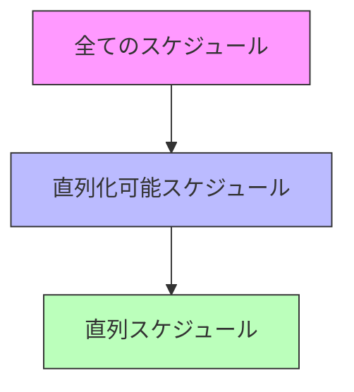

### 2.3 競合等価性と競合直列化可能性

直列化可能性の判定には、**競合等価性（Conflict Equivalence）**という概念を用いる。

まず、2つの操作が**競合（Conflict）**するとは、以下の3条件をすべて満たすことをいう。

1. 異なるトランザクションに属する
2. 同じデータ項目にアクセスする
3. 少なくとも一方が書き込み（Write）である

競合の種類は以下の3つである。

| 競合の種類 | 操作の組み合わせ | 例 |
|:--|:--|:--|
| Read-Write 競合 | $R_i(X)$ と $W_j(X)$ | T1 が読んだ値を T2 が変更 |
| Write-Read 競合 | $W_i(X)$ と $R_j(X)$ | T1 が書いた値を T2 が読む |
| Write-Write 競合 | $W_i(X)$ と $W_j(X)$ | T1 と T2 が同じデータを書く |

2つのスケジュール $S_1$ と $S_2$ が**競合等価（Conflict Equivalent）**であるとは、すべての競合する操作のペアについて、実行順序が同一であることをいう。

スケジュール $S$ が**競合直列化可能（Conflict Serializable）**であるとは、$S$ がある直列スケジュールと競合等価であることをいう。

### 2.4 優先順位グラフ（Precedence Graph）による判定

競合直列化可能性は、**優先順位グラフ（Precedence Graph）**を用いて判定できる。

優先順位グラフの構築手順:

1. 各トランザクション $T_i$ に対応する頂点を作成する
2. スケジュール内の競合する操作ペア $(o_i, o_j)$ について、$o_i$ が $o_j$ より先に実行されるなら、$T_i$ から $T_j$ への有向辺を追加する

**定理**: スケジュール $S$ が競合直列化可能であるための必要十分条件は、$S$ の優先順位グラフが**非巡回（DAG）**であることである。

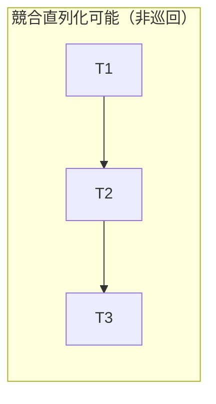

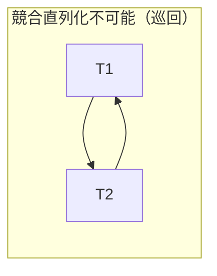

巡回が存在する場合、「T1 は T2 より前に実行されなければならない」かつ「T2 は T1 より前に実行されなければならない」という矛盾した要求が存在することを意味する。このようなスケジュールは、いかなる直列スケジュールとも等価にならない。

::: details 優先順位グラフの具体例

以下のスケジュールを考える。

```
S: R1(A), R2(A), W1(A), W2(A), R1(B), R2(B), W2(B), W1(B)
```

競合する操作ペアを列挙する:
- $R_1(A)$ と $W_2(A)$: T1 → T2
- $R_2(A)$ と $W_1(A)$: T2 → T1
- $W_1(A)$ と $W_2(A)$: T1 → T2
- $R_1(B)$ と $W_2(B)$: T1 → T2
- $R_2(B)$ と $W_1(B)$: T2 → T1
- $W_2(B)$ と $W_1(B)$: T2 → T1

T1 → T2 と T2 → T1 の辺が両方存在するため、グラフに巡回があり、このスケジュールは**競合直列化不可能**である。

:::

## 3. 2相ロック（2PL）の定理と証明

### 3.1 ロックの基本

2PL の議論に入る前に、データベースにおけるロックの基本を確認する。

**共有ロック（Shared Lock, S-Lock）**: データ項目の読み取りに必要なロック。複数のトランザクションが同時に同一データ項目に共有ロックを取得できる。

**排他ロック（Exclusive Lock, X-Lock）**: データ項目の書き込みに必要なロック。あるトランザクションが排他ロックを保持している間、他のトランザクションはそのデータ項目に対して共有ロックも排他ロックも取得できない。

ロックの互換性行列は以下の通りである。

| | S-Lock 保持中 | X-Lock 保持中 |
|:--|:--:|:--:|
| S-Lock 要求 | 許可 | 拒否（待機） |
| X-Lock 要求 | 拒否（待機） | 拒否（待機） |

この行列が示すように、**Read-Read 以外のすべての組み合わせで排他的なアクセスが強制される**。

### 3.2 2PL プロトコルの定義

**2相ロックプロトコル（Two-Phase Locking Protocol）**は、各トランザクションのロック操作を以下の2つのフェーズに制約する規則である。

1. **成長相（Growing Phase / Expanding Phase）**: トランザクションはロックを取得できるが、ロックを解放してはならない
2. **縮退相（Shrinking Phase / Contracting Phase）**: トランザクションはロックを解放できるが、新たなロックを取得してはならない

つまり、トランザクションが最初のロック解放を行った時点で成長相は終了し、以降は新たなロックを取得できない。


以下の図は、2PL に従うトランザクションのロック保持数の推移を示したものである。

```
ロック保持数
    ^
    |        *****
    |      **     **
    |    **         **
    |  **             **
    | *                 **
    |*                    *
    +-------------------------> 時間
    |  成長相  | 縮退相   |
              ↑
         ロックポイント
```

**ロックポイント（Lock Point）**とは、トランザクションが保持するロック数が最大になる時点、すなわち成長相と縮退相の境界である。

### 3.3 2PL の定理：競合直列化可能性の保証

**定理（2PL Theorem）**: 2PL プロトコルに従うすべてのトランザクションから構成されるスケジュールは、競合直列化可能である。

**証明（背理法）**:

2PL に従うトランザクション $T_1, T_2, \ldots, T_n$ から構成されるスケジュール $S$ が競合直列化不可能であると仮定する。

競合直列化不可能ならば、$S$ の優先順位グラフに巡回が存在する。この巡回を $T_{i_1} \rightarrow T_{i_2} \rightarrow \cdots \rightarrow T_{i_k} \rightarrow T_{i_1}$ とする。

辺 $T_{i_j} \rightarrow T_{i_{j+1}}$ が存在するということは、$T_{i_j}$ と $T_{i_{j+1}}$ の間に競合する操作ペアが存在し、$T_{i_j}$ の操作が先に実行されたことを意味する。

競合する操作ペアでは、少なくとも一方が書き込みであるため、ロックの互換性から、一方のロック保持中に他方はロックを取得できない。したがって、$T_{i_j}$ がデータ項目 $X_j$ のロックを解放した**後に**、$T_{i_{j+1}}$ が同じデータ項目 $X_j$ のロックを取得したことになる。

各トランザクションのロックポイント（成長相の終了時点）を $\text{LP}(T_i)$ と表記する。

$T_{i_j}$ がロック $X_j$ を解放するのは縮退相であるから、ロックポイント以降である。
$T_{i_{j+1}}$ がロック $X_j$ を取得するのは成長相であるから、ロックポイント以前である。

したがって:

$$\text{LP}(T_{i_j}) \leq \text{unlock}_{i_j}(X_j) < \text{lock}_{i_{j+1}}(X_j) \leq \text{LP}(T_{i_{j+1}})$$

これより:

$$\text{LP}(T_{i_1}) < \text{LP}(T_{i_2}) < \cdots < \text{LP}(T_{i_k}) < \text{LP}(T_{i_1})$$

$\text{LP}(T_{i_1}) < \text{LP}(T_{i_1})$ は矛盾である。

したがって、2PL に従うスケジュールは競合直列化可能である。$\blacksquare$

::: tip 証明のポイント
この証明の本質は、「2PL のロックポイントがトランザクション間に全順序を定義する」という点にある。巡回があると仮定すれば、ロックポイントの順序に矛盾が生じるため、巡回は存在し得ない。
:::

### 3.4 2PL の逆は成り立たない

注意すべき点として、**2PL は直列化可能性の十分条件であるが、必要条件ではない**。すなわち、2PL に従わないスケジュールであっても、競合直列化可能な場合がある。

```
T1: Lock(A), R(A), Unlock(A), Lock(B), R(B), Unlock(B)
```

上記のスケジュールでは T1 が A のロックを解放した後に B のロックを取得しており、2PL に違反している。しかし、他のトランザクションとの関係次第では、このスケジュールが競合直列化可能である可能性はある。

2PL が保証するのは「**すべての** 2PL 準拠トランザクションの**任意の**インターリーブが競合直列化可能である」という**十分条件**である。

## 4. Basic 2PL

### 4.1 Basic 2PL の動作

Basic 2PL は、前節で定義した2相ロックプロトコルをそのまま適用するものである。トランザクションは成長相でロックを取得し、縮退相でロックを解放する。

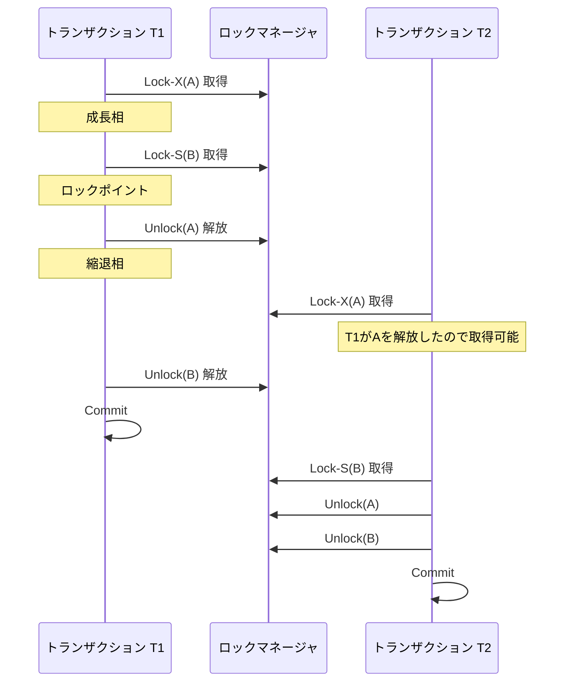

### 4.2 Basic 2PL の問題：カスケードアボート

Basic 2PL には深刻な問題がある。**カスケードアボート（Cascading Abort）**の可能性である。

カスケードアボートとは、あるトランザクションがアボートされたとき、そのトランザクションが書き込んだデータを読み取った他のトランザクションも連鎖的にアボートしなければならない現象である。

```
T1: Lock-X(A), W(A), Unlock(A), ..., Abort
T2:                   Lock-S(A), R(A), ...
```

この例では:
1. T1 が A に排他ロックを取得し、A に書き込む
2. T1 が縮退相に入り、A のロックを解放する（**まだコミットしていない**）
3. T2 が A の共有ロックを取得し、T1 が書き込んだ値を読み取る
4. T1 がアボートされる
5. T2 は T1 が書き込んだ（そしてアボートされた）値を読んでいるため、T2 もアボートしなければならない

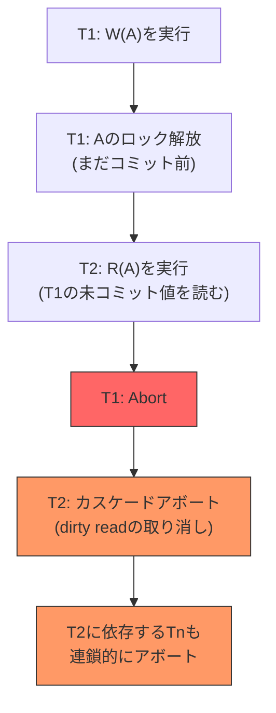

カスケードアボートは以下の問題を引き起こす。

- **回復コストの増大**: 1つのアボートが連鎖的に多数のトランザクションのアボートを引き起こす
- **作業の無駄**: アボートされたトランザクションがそれまでに行った処理がすべて無駄になる
- **回復の複雑性**: カスケードの深さが深いほど、回復処理が複雑になる

この問題を解決するのが、次節で説明する Strict 2PL である。

## 5. Strict 2PL（S2PL）

### 5.1 Strict 2PL の定義

**Strict 2PL（S2PL）**は、Basic 2PL に以下の制約を追加したプロトコルである。

> トランザクションが取得した**排他ロック（X-Lock）**は、トランザクションがコミットまたはアボートされるまで解放しない。

共有ロック（S-Lock）については、成長相が終了した後は解放してよい。つまり、Strict 2PL では排他ロックのみがトランザクション終了まで保持される。

```
ロック保持数
    ^
    |   ****共有ロック***
    |  *        *  *
    | *          *   *
    |*  排他ロック ****===== (コミット/アボートまで保持)
    +----------------------------> 時間
    |  成長相  | 縮退相(Sのみ) | Commit/Abort
```

### 5.2 カスケードアボートの防止

Strict 2PL では、排他ロックがコミットまで保持されるため、他のトランザクションは未コミットの書き込みデータを読み取ることができない。

```
T1: Lock-X(A), W(A), ..., Commit, Unlock-X(A)
T2:                  Lock-S(A) → ブロック（T1がX-Lockを保持中）
                     ...
                     T1がCommitした後に初めて Lock-S(A) を取得
                     R(A)  ← コミット済みの値を読む
```

排他ロックがコミットまで保持されるため、**他のトランザクションは書き込まれたデータに対してロックを取得できない**。したがって、未コミットデータの読み取り（Dirty Read）が発生せず、カスケードアボートが防止される。

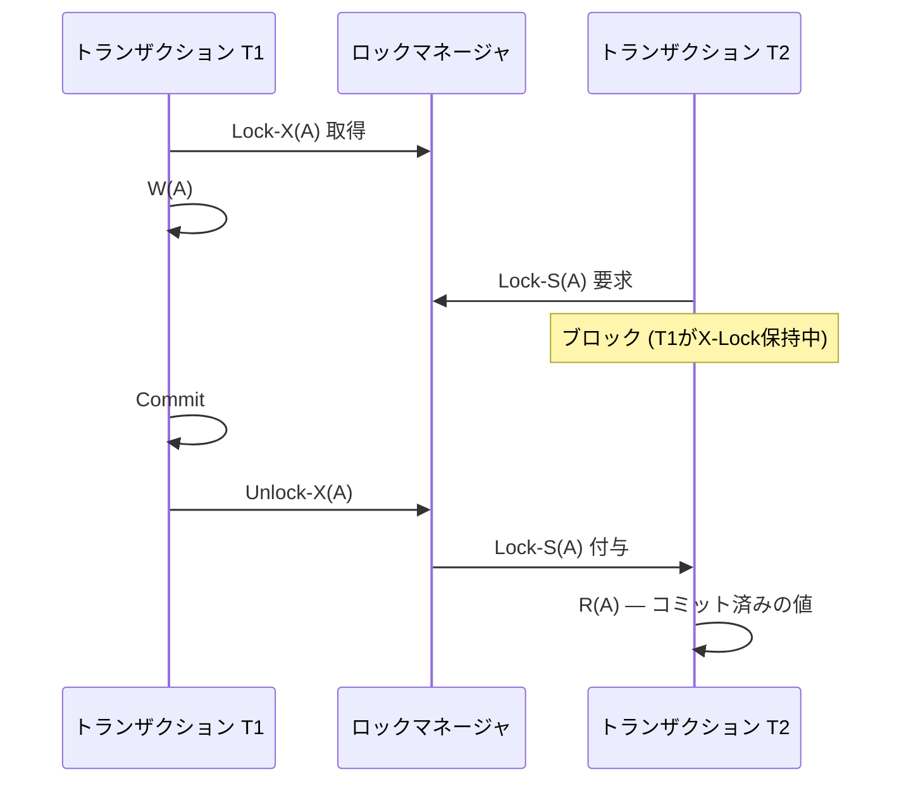

### 5.3 Strict 2PL の形式的性質

Strict 2PL は以下の性質を保証する。

1. **競合直列化可能性**: 2PL の制約を満たすため、Basic 2PL と同様に保証される
2. **回復可能性（Recoverability）**: コミット順序がデータ依存関係と整合する
3. **カスケードフリー（Cascadelessness）**: 未コミットデータの読み取りが発生しない
4. **厳密性（Strictness）**: 未コミットデータの読み取りも上書きも発生しない

::: warning 共有ロックの早期解放に注意
Strict 2PL は排他ロックのみコミットまで保持し、共有ロックは縮退相で解放可能である。これは理論的には正しいが、実装上は共有ロックの早期解放によって Repeatable Read が保証されない可能性がある。そのため、多くの実用システムでは次節の SS2PL を採用している。
:::

## 6. Strong Strict 2PL（SS2PL / Rigorous 2PL）

### 6.1 SS2PL の定義

**Strong Strict 2PL（SS2PL）**は、Strict 2PL をさらに強化したプロトコルである。**Rigorous 2PL** とも呼ばれる。

> トランザクションが取得した**すべてのロック（共有ロック・排他ロック双方）**は、トランザクションがコミットまたはアボートされるまで解放しない。

```
ロック保持数
    ^
    |   *********************
    |  *                     *
    | *                       *
    |*                         *
    +----------------------------> 時間
    |       成長相のみ         | Commit/Abort で一括解放
```

SS2PL では縮退相が事実上存在せず、トランザクション終了時に一括してすべてのロックが解放される。

### 6.2 SS2PL の利点

SS2PL は以下の追加的な利点を持つ。

**1. コミット順序直列化可能性（Commit-Order Serializability）**

SS2PL では、トランザクションの直列化順序がコミット順序と一致する。すなわち、2つのトランザクション $T_i$ と $T_j$ が競合し、$T_i$ が先にコミットした場合、直列化順序でも $T_i$ が $T_j$ より前に位置する。

これは分散データベースにおいて極めて重要な性質である。各ノードが独立に SS2PL を実行し、コミット順序がグローバルに一致すれば、グローバルな直列化可能性が保証される。

**2. 実装の単純性**

SS2PL ではロックの解放がトランザクション終了時の一括処理となるため、縮退相の管理が不要である。ロックマネージャの実装が大幅に簡略化される。

**3. Repeatable Read の保証**

共有ロックもコミットまで保持されるため、トランザクション中に同じデータを複数回読み取っても、常に同じ値が返される。

### 6.3 Basic 2PL, Strict 2PL, SS2PL の比較

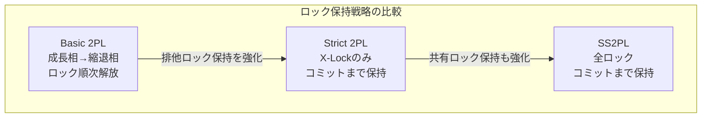

| 性質 | Basic 2PL | Strict 2PL | SS2PL |
|:--|:--:|:--:|:--:|
| 競合直列化可能性 | 保証 | 保証 | 保証 |
| カスケードフリー | 非保証 | 保証 | 保証 |
| 厳密性（Strictness） | 非保証 | 保証 | 保証 |
| Repeatable Read | 非保証 | 非保証 | 保証 |
| コミット順序直列化可能性 | 非保証 | 非保証 | 保証 |
| 並行性 | 高 | 中 | 低 |
| 実装の複雑性 | 高 | 中 | 低 |

::: tip 実用上の選択
理論上は Basic 2PL が最も高い並行性を提供するが、カスケードアボートの問題があるため実用システムではほとんど採用されない。多くの商用データベースは SS2PL を採用しており、実装の単純性と強い整合性保証を両立している。
:::

### 6.4 各変種のタイムライン図

以下に、3つの変種におけるロック保持のタイムラインを比較する。

```
【Basic 2PL】
T: ──[Lock-X(A)]──[Lock-S(B)]──[Unlock(A)]──[Unlock(B)]──[Commit]──
   |←────成長相────→|←───────縮退相──────→|

【Strict 2PL】
T: ──[Lock-X(A)]──[Lock-S(B)]──[Unlock(B)]──[Commit + Unlock-X(A)]──
   |←────成長相────→|←縮退相(S)→|  X-Lock は Commit まで保持

【SS2PL（Strong Strict 2PL）】
T: ──[Lock-X(A)]──[Lock-S(B)]──[Commit + Unlock(A) + Unlock(B)]──
   |←──────────成長相──────────→|  全ロックを Commit で一括解放
```

## 7. ロックの粒度（Lock Granularity）

### 7.1 粒度のトレードオフ

ロックの粒度（Granularity）とは、ロックが保護するデータの単位の大きさである。粒度は以下のような階層を形成する。

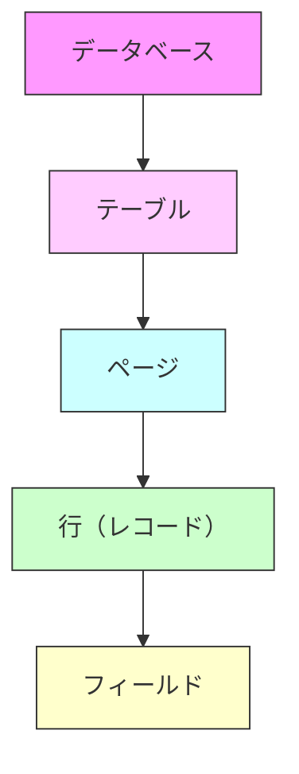

各粒度の特徴は以下の通りである。

| 粒度 | 並行性 | ロックオーバーヘッド | 適用場面 |
|:--|:--|:--|:--|
| データベース | 最低 | 最小 | バックアップ、スキーマ変更 |
| テーブル | 低 | 小 | テーブル全体のスキャン、バルク操作 |
| ページ | 中 | 中 | 範囲スキャン |
| 行 | 高 | 大 | OLTP（個別レコードのアクセス） |
| フィールド | 最高 | 最大 | ほとんど使われない |

**粒度が大きい（テーブル全体をロック）場合**:
- ロック管理のオーバーヘッドが小さい（1つのロックで済む）
- 並行性が低い（他のトランザクションがテーブル全体にアクセスできない）

**粒度が小さい（行単位でロック）場合**:
- 並行性が高い（異なる行への同時アクセスが可能）
- ロック管理のオーバーヘッドが大きい（多数のロックの管理が必要）

### 7.2 ロックエスカレーション

多くのデータベースシステムは**ロックエスカレーション（Lock Escalation）**という機構を実装している。これは、あるトランザクションが保持するロックの数が閾値を超えた場合に、細粒度のロック群をより粗い粒度のロックに自動的に昇格させる仕組みである。

```
例: SQL Server のロックエスカレーション
1. 行ロック 5,000個 → ページロック N個 に昇格
2. ページロック の数が閾値を超える → テーブルロック に昇格
```

ロックエスカレーションのトレードオフは明確である。

- **利点**: ロックメモリ使用量の削減、ロックマネージャの負荷軽減
- **欠点**: 粒度が粗くなることで並行性が低下し、他のトランザクションがブロックされる可能性が増大する

## 8. インテンションロック（Intention Lock）

### 8.1 階層的ロックの問題

粒度の異なるロックを混在させると、互換性の判定が複雑になる。例えば、あるトランザクションがテーブル全体に共有ロックを取得したい場合、テーブル内のすべての行に排他ロックが取得されていないことを確認する必要がある。行数が数百万に及ぶ場合、この確認は非常にコストが高い。

### 8.2 インテンションロックの定義

**インテンションロック（Intention Lock）**は、Jim Gray が 1976 年の論文「Granularity of Locks and Degrees of Consistency in a Shared Data Base」で提案した機構であり、階層的なロック管理を効率的に行うためのものである。

インテンションロックには以下の種類がある。

| ロックモード | 意味 |
|:--|:--|
| IS（Intention Shared） | 子孫ノードで共有ロックを取得する意図がある |
| IX（Intention Exclusive） | 子孫ノードで排他ロックを取得する意図がある |
| SIX（Shared + Intention Exclusive） | ノード自体に共有ロック + 子孫で排他ロックを取得する意図 |

### 8.3 インテンションロックの互換性行列

| | IS | IX | S | SIX | X |
|:--|:--:|:--:|:--:|:--:|:--:|
| **IS** | 許可 | 許可 | 許可 | 許可 | 拒否 |
| **IX** | 許可 | 許可 | 拒否 | 拒否 | 拒否 |
| **S** | 許可 | 拒否 | 許可 | 拒否 | 拒否 |
| **SIX** | 許可 | 拒否 | 拒否 | 拒否 | 拒否 |
| **X** | 拒否 | 拒否 | 拒否 | 拒否 | 拒否 |

### 8.4 インテンションロックのプロトコル

インテンションロックを用いたロック取得は、**ルート（データベース）から葉（行）に向かって**トップダウンで行われる。

**ロック取得規則**:
1. S ロックまたは IS ロックを取得するには、親ノードに IS 以上のロックを保持していなければならない
2. X ロック、IX ロック、または SIX ロックを取得するには、親ノードに IX 以上のロックを保持していなければならない

**ロック解放規則**:
- ロックはボトムアップ（葉からルートに向かって）で解放する

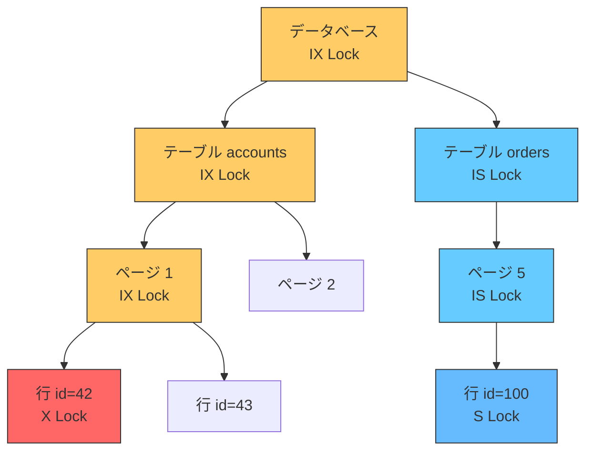

上図の例では:
- 行 id=42 に排他ロック（X）を取得するために、ページ 1 → テーブル accounts → データベースの順に IX ロックを取得している
- 行 id=100 に共有ロック（S）を取得するために、ページ 5 → テーブル orders → データベースの順に IS ロックを取得している

この仕組みにより、別のトランザクションがテーブル accounts 全体に共有ロック（S）を取得しようとした場合、データベースの IX ロックが存在するため即座に拒否できる。テーブル内のすべての行を調べる必要がない。

### 8.5 SIX ロックの使い所

SIX（Shared + Intention Exclusive）ロックは、テーブル全体を読み取りつつ、一部の行を更新する操作で使われる。

```sql
-- SIX lock example: read entire table but update specific rows
UPDATE accounts
SET balance = balance + 100
WHERE region = 'APAC';
```

このクエリは accounts テーブル全体をスキャン（S ロックに相当）しつつ、条件に合致する行を更新（X ロック）する。テーブルレベルでは SIX ロックが取得され、条件に合致する個別の行には X ロックが取得される。

## 9. デッドロック検出と解消

### 9.1 デッドロックとは

**デッドロック（Deadlock）**とは、2つ以上のトランザクションが互いのロック解放を待ち合い、永遠にどのトランザクションも先に進めなくなる状態である。

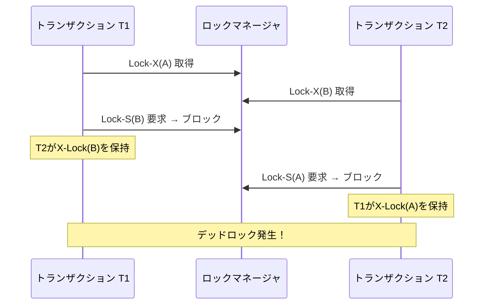

デッドロックは 2PL（のすべての変種）において避けられない問題である。2PL はロックの取得順序を規定しないため、異なるトランザクションが異なる順序でロックを取得すると、デッドロックが発生し得る。

### 9.2 デッドロックの防止（Prevention）

デッドロックを発生させない戦略として、以下の手法がある。

**1. ロック順序の規定**

すべてのデータ項目に全順序を定義し、トランザクションがその順序に従ってのみロックを取得するように制約する。例えば、データ項目をその主キーの昇順で常にロックする。

この手法は理論的には有効だが、実際のクエリパターンでは事前にアクセスするデータ項目をすべて予測することが困難なため、適用場面が限られる。

**2. Wait-Die スキーム**

タイムスタンプに基づくデッドロック防止スキームである。

- 古いトランザクション（タイムスタンプが小さい）が新しいトランザクションのロックを待つ → **待機（Wait）**
- 新しいトランザクション（タイムスタンプが大きい）が古いトランザクションのロックを待つ → **アボート（Die）**

```
T1 (timestamp=100) が T2 (timestamp=200) のロックを待つ → Wait（古い方が待つ）
T2 (timestamp=200) が T1 (timestamp=100) のロックを待つ → Die（新しい方がアボート）
```

**3. Wound-Wait スキーム**

Wait-Die の逆のアプローチである。

- 古いトランザクションが新しいトランザクションのロックを待つ → 新しいトランザクションを**アボートさせる（Wound）**
- 新しいトランザクションが古いトランザクションのロックを待つ → **待機（Wait）**

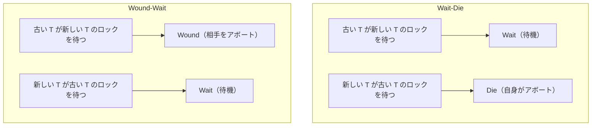

Wait-Die と Wound-Wait は共に「古いトランザクションを優先する」という原則に基づいている。違いは、Wait-Die では新しいトランザクションが自発的にアボートするのに対し、Wound-Wait では古いトランザクションが新しいトランザクションを強制的にアボートさせる点にある。

### 9.3 デッドロックの検出（Detection）

実用的なデータベースシステムでは、デッドロックの**防止**よりも**検出**が広く採用されている。デッドロックを事前に防止するためにはトランザクションの行動を過度に制約する必要があり、不要なアボートが増えるためである。

**Wait-For グラフ（Wait-For Graph）**

デッドロック検出の標準的な手法は、**Wait-For グラフ**を構築し、巡回を検出することである。

- 各トランザクション $T_i$ を頂点とする
- $T_i$ が $T_j$ のロック解放を待っている場合、$T_i$ から $T_j$ への有向辺を追加する
- グラフに**巡回が存在する**ならば、**デッドロックが存在する**

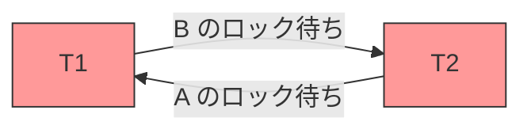

Wait-For グラフの巡回検出は、深さ優先探索（DFS）により $O(V + E)$ の時間計算量で実行できる。ここで $V$ はトランザクション数、$E$ は待機関係の数である。

**検出の頻度**

デッドロック検出は周期的に実行される。検出頻度のトレードオフは以下の通りである。

- **高頻度**: デッドロックの早期検出が可能だが、検出処理自体のオーバーヘッドが増大する
- **低頻度**: オーバーヘッドは小さいが、デッドロック状態が長時間継続し、リソースが浪費される

MySQL/InnoDB はデッドロック検出をデフォルトで有効にしており、ロック待ちが発生するたびに即座に Wait-For グラフを更新し、巡回を検出する。PostgreSQL も同様に、ロック待ちのタイムアウト（`deadlock_timeout`、デフォルト1秒）経過後にデッドロック検出を実行する。

### 9.4 デッドロックの解消：犠牲者選択

デッドロックが検出された場合、巡回に含まれるトランザクションのうち少なくとも1つを**アボート**して巡回を断ち切る必要がある。アボートされるトランザクションを**犠牲者（Victim）**と呼ぶ。

犠牲者選択の基準として、以下の要素が考慮される。

1. **トランザクションの進行度**: 実行した作業量が少ないトランザクションをアボートすれば、ロールバックのコストが小さい
2. **保持しているロックの数**: ロック数が少ないトランザクションをアボートすれば、解放されるリソースが少なくて済む
3. **トランザクションの年齢**: 古いトランザクションを優先し、新しいトランザクションをアボートする（飢餓状態の防止）
4. **巻き込まれるトランザクションの数**: アボートによるカスケードの影響が最小のトランザクションを選ぶ

**飢餓状態（Starvation）の防止**: 同じトランザクションが繰り返し犠牲者に選ばれないようにする必要がある。多くのシステムでは、アボート回数をカウントし、一定回数以上アボートされたトランザクションには優先権を与える。

## 10. 2PL の実装における考慮事項

### 10.1 ロックマネージャの設計

ロックマネージャは、データベースシステムにおいてロックの取得・解放・待機を管理する中央コンポーネントである。

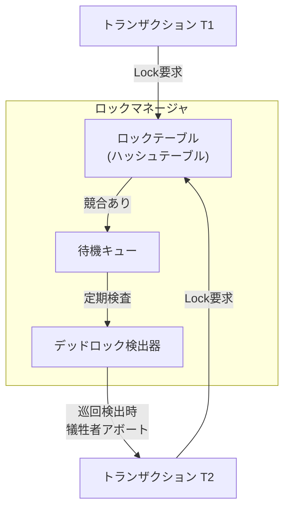

**ロックテーブル**: データ項目のIDからロック情報へのマッピングを保持するハッシュテーブルである。各エントリには以下の情報が含まれる。

- ロックモード（S or X）
- ロックを保持しているトランザクションのリスト
- ロックを待機しているトランザクションのキュー

```python
class LockEntry:
    def __init__(self, data_item_id):
        self.data_item_id = data_item_id
        self.lock_mode = None            # current lock mode: 'S', 'X', or None
        self.holders = set()             # set of transaction IDs holding the lock
        self.wait_queue = []             # queue of (txn_id, requested_mode) tuples

class LockManager:
    def __init__(self):
        self.lock_table = {}             # data_item_id -> LockEntry
        self.txn_locks = {}              # txn_id -> set of data_item_ids

    def acquire(self, txn_id, data_item_id, mode):
        """
        Attempt to acquire a lock.
        Returns True if granted immediately, False if must wait.
        """
        if data_item_id not in self.lock_table:
            # no existing lock — grant immediately
            entry = LockEntry(data_item_id)
            entry.lock_mode = mode
            entry.holders.add(txn_id)
            self.lock_table[data_item_id] = entry
            self._register(txn_id, data_item_id)
            return True

        entry = self.lock_table[data_item_id]

        if self._is_compatible(entry, txn_id, mode):
            # compatible — grant
            entry.holders.add(txn_id)
            if mode == 'X':
                entry.lock_mode = 'X'
            self._register(txn_id, data_item_id)
            return True
        else:
            # conflict — enqueue
            entry.wait_queue.append((txn_id, mode))
            return False

    def release(self, txn_id, data_item_id):
        """Release a lock and grant waiting requests if possible."""
        entry = self.lock_table.get(data_item_id)
        if entry is None:
            return
        entry.holders.discard(txn_id)
        if not entry.holders:
            entry.lock_mode = None
            self._grant_waiting(entry)

    def release_all(self, txn_id):
        """Release all locks held by a transaction (SS2PL style)."""
        for data_item_id in list(self.txn_locks.get(txn_id, [])):
            self.release(txn_id, data_item_id)
        self.txn_locks.pop(txn_id, None)

    def _is_compatible(self, entry, txn_id, mode):
        if entry.lock_mode is None:
            return True
        if entry.lock_mode == 'S' and mode == 'S':
            return True
        # allow lock upgrade: same txn holding S requesting X
        if txn_id in entry.holders and len(entry.holders) == 1:
            return True
        return False

    def _grant_waiting(self, entry):
        granted = []
        for txn_id, mode in entry.wait_queue:
            if self._is_compatible(entry, txn_id, mode):
                entry.holders.add(txn_id)
                entry.lock_mode = mode if mode == 'X' else entry.lock_mode or 'S'
                self._register(txn_id, entry.data_item_id)
                granted.append((txn_id, mode))
            else:
                break
        for item in granted:
            entry.wait_queue.remove(item)

    def _register(self, txn_id, data_item_id):
        if txn_id not in self.txn_locks:
            self.txn_locks[txn_id] = set()
        self.txn_locks[txn_id].add(data_item_id)
```

### 10.2 ロックのアップグレードとダウングレード

**ロックアップグレード（Lock Upgrade）**: トランザクションが既に保持している共有ロックを排他ロックに昇格させる操作である。

```sql
-- T1: first reads, then updates
SELECT * FROM accounts WHERE id = 1;  -- S-Lock acquired
-- ... some processing ...
UPDATE accounts SET balance = 500 WHERE id = 1;  -- upgrade S-Lock to X-Lock
```

ロックアップグレードは、他のトランザクションが同じデータ項目に共有ロックを保持していない場合にのみ成功する。2つのトランザクションが同時に同じデータ項目のロックアップグレードを要求すると、**コンバージョンデッドロック（Conversion Deadlock）**が発生する。

```
T1: S-Lock(A) を保持 → X-Lock(A) へのアップグレードを要求（T2 の S-Lock 解放待ち）
T2: S-Lock(A) を保持 → X-Lock(A) へのアップグレードを要求（T1 の S-Lock 解放待ち）
→ デッドロック
```

MySQL/InnoDB では `SELECT ... FOR UPDATE` を使用して最初から排他ロックを取得することで、コンバージョンデッドロックを回避する設計パターンが一般的である。

### 10.3 ファントム問題と Next-Key Lock

2PL は個々のデータ項目に対するロックを管理するが、**ファントム問題（Phantom Problem）**に対しては追加の対策が必要である。

ファントム問題とは、範囲クエリの実行中に、条件に合致する新しい行が他のトランザクションによって挿入され、同じクエリを再度実行すると異なる結果が返される現象である。

```sql
-- T1: query employees in department 'Engineering'
SELECT * FROM employees WHERE dept = 'Engineering';
-- returns: Alice, Bob

-- T2: insert a new employee (this is the phantom)
INSERT INTO employees (name, dept) VALUES ('Charlie', 'Engineering');
COMMIT;

-- T1: same query returns different results
SELECT * FROM employees WHERE dept = 'Engineering';
-- returns: Alice, Bob, Charlie  ← Charlie is a phantom row
```

MySQL/InnoDB は**Next-Key Lock** という仕組みでファントム問題に対処している。Next-Key Lock は、インデックスレコードに対するロック（Record Lock）と、そのレコードの直前のギャップに対するロック（Gap Lock）を組み合わせたものである。

```
インデックス値:  10    20    30    40
               ←Gap→←Gap→←Gap→←Gap→←Gap→
Next-Key Lock: (−∞,10] (10,20] (20,30] (30,40] (40,+∞)
```

Gap Lock は、ロックされた範囲への新しいレコードの挿入を防止する。これにより、2PL の枠組みの中でファントム問題を解決できる。

## 11. 2PL と MVCC の比較

### 11.1 根本的なアプローチの違い

2PL と MVCC は、同時実行制御に対する根本的に異なるアプローチを採用している。

| 観点 | 2PL | MVCC |
|:--|:--|:--|
| 基本原理 | ロックによるアクセス排他 | 複数バージョンの共存 |
| Read-Write 競合 | ブロック | ブロックしない |
| Write-Read 競合 | ブロック | ブロックしない |
| Write-Write 競合 | ブロック | ブロック（First-Writer-Wins） |
| スナップショット | なし（最新値を直接参照） | トランザクション開始時点のスナップショット |
| 理論的保証 | 競合直列化可能性 | 分離レベルに依存 |

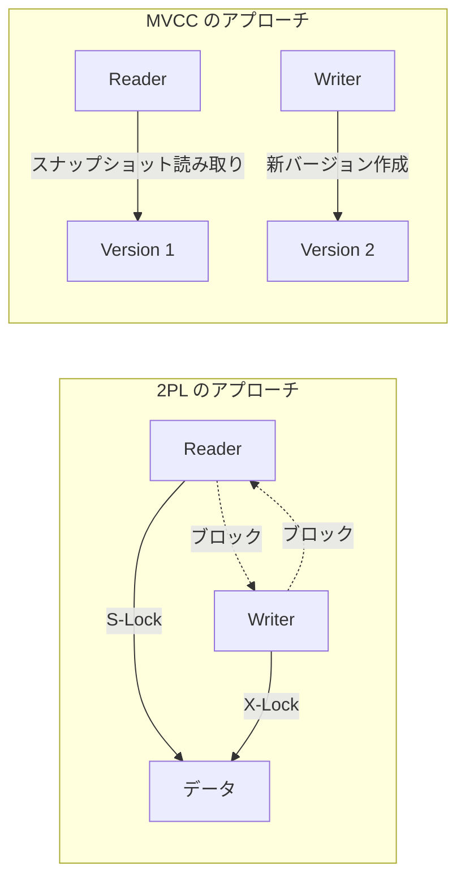

### 11.2 性能特性の違い

**読み取り中心のワークロード**: MVCC が圧倒的に有利である。読み取りトランザクションはロックを取得せずにスナップショットを参照するため、書き込みトランザクションと競合しない。2PL では読み取りにも共有ロックが必要であり、書き込みと競合する。

**書き込み中心のワークロード**: 両者の差は小さくなる。MVCC でも Write-Write 競合ではブロックまたはアボートが発生する。ただし、MVCC ではバージョン管理のオーバーヘッド（古いバージョンのガベージコレクション等）が追加される。

**長時間トランザクション**: MVCC が有利である。2PL では長時間トランザクションがロックを長期間保持するため、他のトランザクションの待ち時間が増大する。MVCC では長時間の読み取りトランザクションが他のトランザクションをブロックしない。ただし、古いスナップショットの維持コストが増大する。

### 11.3 直列化可能性の実現方式

2PL と MVCC では、最高分離レベル（Serializable）の実現方式が異なる。

**2PL での Serializable**: SS2PL により直接的に競合直列化可能性を保証する。すべての読み書きにロックを取得し、コミットまで保持する。

**MVCC での Serializable**: MVCC 単体では Serializable を保証できない場合がある（Write Skew anomaly の問題）。以下の追加機構が必要となる。

- **SSI（Serializable Snapshot Isolation）**: PostgreSQL が採用している方式。スナップショット分離に加えて、rw-antidependency（読み書きの反依存関係）を追跡し、直列化異常を検出してアボートする
- **2PL + MVCC のハイブリッド**: MySQL/InnoDB の Serializable 分離レベルでは、MVCC の上に `SELECT` 文を自動的に `SELECT ... LOCK IN SHARE MODE`（共有ロック取得）に変換することで、事実上の SS2PL を実現している

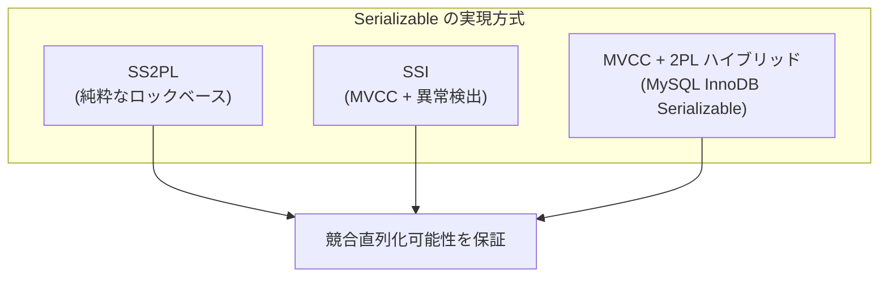

### 11.4 Write Skew 問題

MVCC のスナップショット分離（Snapshot Isolation）では、**Write Skew** と呼ばれる異常が発生し得る。これは 2PL（Serializable）では発生しない。

```sql
-- Write Skew example: on-call constraint
-- Constraint: at least one doctor must be on call

-- T1 reads: Alice=on-call, Bob=on-call
-- T2 reads: Alice=on-call, Bob=on-call  (same snapshot)

-- T1: "Bob is still on call, so I can go off-call"
UPDATE doctors SET on_call = false WHERE name = 'Alice';

-- T2: "Alice is still on call, so I can go off-call"
UPDATE doctors SET on_call = false WHERE name = 'Bob';

-- Both commit successfully under Snapshot Isolation
-- Result: Alice=off-call, Bob=off-call → constraint violated!
```

2PL では、T1 が Alice の行に排他ロックを取得し Bob の行に共有ロックを取得するため、T2 が Bob の行に排他ロックを取得しようとした時点で、T1 の共有ロック（または T1 が既に Bob を読んでいる場合の共有ロック）と競合し、ブロックまたはデッドロック検出・アボートが行われる。結果として、Write Skew は防止される。

### 11.5 現代のデータベースにおける位置づけ

現代の主要なデータベースシステムにおける 2PL と MVCC の採用状況を以下にまとめる。

| データベース | 同時実行制御方式 | 備考 |
|:--|:--|:--|
| PostgreSQL | MVCC + SSI | Serializable は SSI で実現 |
| MySQL/InnoDB | MVCC + 2PL ハイブリッド | Serializable では暗黙的にロック付き読み取り |
| Oracle | MVCC | Serializable は Snapshot Isolation（真の Serializable ではない） |
| SQL Server | 2PL（デフォルト）/ MVCC（RCSI） | Read Committed Snapshot Isolation を有効化可能 |
| CockroachDB | MVCC + SSI | 分散環境で SSI を実現 |
| Google Spanner | 2PL + MVCC + TrueTime | 外部一貫性をハードウェアクロックで保証 |

::: tip 実務上のポイント
多くの開発者は「MVCC が 2PL を置き換えた」と考えがちだが、実態は異なる。現代のデータベースは 2PL と MVCC を**相補的に組み合わせて**使用している。MVCC は Read-Write 競合のブロックを除去し、2PL（またはその変種）は Write-Write 競合と直列化可能性の保証に使用される。両者は対立するものではなく、異なるレイヤーで協調動作する技術である。
:::

## 12. まとめ

### 12.1 理論的意義

2相ロックは、データベースの同時実行制御理論における最も基本的かつ重要な結果の一つである。「ロックの取得と解放を2つのフェーズに分離する」という単純な規則が、競合直列化可能性という強い正しさの保証を提供するという事実は、理論の力を示す好例である。

2PL の定理の証明は、ロックポイントの順序に基づく背理法であり、直観的にも理解しやすい。この定理は、ロックベースの同時実行制御プロトコルが正しいかどうかを判定するための基準を提供している。

### 12.2 実装上の発展

Basic 2PL の理論的な美しさに対して、実用上はカスケードアボートという深刻な問題があった。Strict 2PL はこの問題を排他ロックの保持期間延長で解決し、SS2PL はさらにすべてのロックの保持を延長することで、コミット順序直列化可能性という分散環境で重要な性質を獲得した。

ロックの粒度とインテンションロックは、理論と実装の橋渡しをする概念である。Jim Gray が提案したインテンションロックは、階層的なデータ構造におけるロック管理のコストを劇的に削減し、現代のデータベースの行レベルロックを実用的なものにした。

### 12.3 MVCC との関係

2PL と MVCC は対立する概念ではなく、同時実行制御の問題空間における異なるトレードオフの選択である。2PL はロックによるアクセス排他を通じて直列化可能性を直接的に保証するが、Read-Write 競合によるブロッキングが性能のボトルネックとなる。MVCC は複数バージョンの管理により Read-Write 競合を排除するが、Write Skew のような異常に対しては追加の機構（SSI など）が必要となる。

現代のデータベースは両者を組み合わせたハイブリッドアプローチを採用しており、ワークロードの特性に応じて最適な同時実行制御を実現している。2PL を深く理解することは、これらのハイブリッドシステムの動作原理を正しく把握し、適切な分離レベルやロック戦略を選択するための基盤となる。

## 参考文献

- Eswaran, K.P., Gray, J.N., Lorie, R.A., Traiger, I.L. "The Notions of Consistency and Predicate Locks in a Database System." *Communications of the ACM*, 19(11), 1976.
- Gray, J.N., Lorie, R.A., Putzolu, G.R., Traiger, I.L. "Granularity of Locks and Degrees of Consistency in a Shared Data Base." *Modeling in Data Base Management Systems*, 1976.
- Bernstein, P.A., Hadzilacos, V., Goodman, N. *Concurrency Control and Recovery in Database Systems*. Addison-Wesley, 1987.
- Weikum, G., Vossen, G. *Transactional Information Systems: Theory, Algorithms, and the Practice of Concurrency Control and Recovery*. Morgan Kaufmann, 2001.
- Cahill, M.J., Röhm, U., Fekete, A.D. "Serializable Isolation for Snapshot Databases." *ACM SIGMOD*, 2008.
- Ports, D.R.K., Grittner, K. "Serializable Snapshot Isolation in PostgreSQL." *PVLDB*, 5(12), 2012.
