# 型推論と型検査のアルゴリズム

## 1. はじめに：型推論はなぜ必要か

静的型付け言語において、プログラマがすべての変数や関数に明示的な型注釈を書くことは、安全性と引き換えに大きな記述コストを要求する。次の Java コードと Haskell コードを比較してみよう。

```java
// Java — explicit type annotations everywhere
Map<String, List<Integer>> map = new HashMap<String, List<Integer>>();
Function<Integer, Function<Integer, Integer>> add =
    (Integer x) -> (Integer y) -> x + y;
```

```haskell
-- Haskell — types are inferred
map = HashMap.empty
add x y = x + y  -- inferred as: Num a => a -> a -> a
```

Haskell の方が圧倒的に簡潔でありながら、コンパイラはすべての式の型を正確に把握している。これを可能にしているのが**型推論（type inference）**である。

**型推論**とは、プログラマが明示的に型注釈を記述しなくても、コンパイラがプログラムの構造から各式・変数の型を自動的に決定する仕組みである。一方、**型検査（type checking）**とは、推論された（あるいは注釈された）型がプログラムの型規則に整合しているかを検証する処理である。

::: tip 型推論と型検査の関係
型推論と型検査は明確に異なる処理であるが、実際のコンパイラでは不可分に絡み合っている。型推論は「型を求める」処理、型検査は「型が正しいか確認する」処理であり、多くの場合、これらは同一のアルゴリズム内で同時に実行される。
:::

型推論の歴史は古い。その理論的基盤は1950年代から1960年代にかけて構築された。

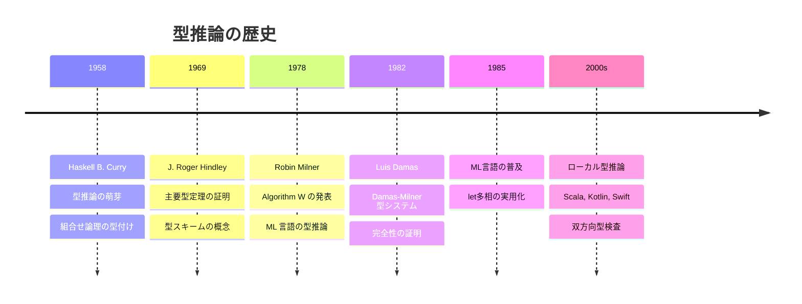

本記事では、型推論と型検査の理論的基盤から具体的なアルゴリズム、そして現代のプログラミング言語における実装上の設計判断までを体系的に解説する。

## 2. 型システムの形式的基盤

型推論アルゴリズムを理解するために、まず対象となる型システムを形式的に定義する必要がある。ここでは、型推論の古典的な対象である**単純型付きラムダ計算（Simply Typed Lambda Calculus, STLC）**から出発する。

### 2.1 構文の定義

型推論の対象となる最小限の言語を定義する。

$$
\begin{aligned}
\text{式} \quad e &::= x \mid \lambda x.\, e \mid e_1\; e_2 \mid \text{let } x = e_1 \text{ in } e_2 \mid c \\
\text{型} \quad \tau &::= \alpha \mid T \mid \tau_1 \to \tau_2 \\
\text{型スキーム} \quad \sigma &::= \tau \mid \forall \alpha.\, \sigma
\end{aligned}
$$

ここで、$x$ は変数、$\lambda x.\, e$ はラムダ抽象（関数）、$e_1\; e_2$ は関数適用、$c$ は定数（整数リテラルなど）である。型については、$\alpha$ は型変数、$T$ は基本型（`Int`、`Bool` など）、$\tau_1 \to \tau_2$ は関数型を表す。型スキーム $\sigma$ は多相型を表現するもので、$\forall \alpha.\, \sigma$ は型変数 $\alpha$ を全称量化した型である。

### 2.2 型環境と型判定

**型環境（type environment）** $\Gamma$ は、変数から型スキームへの有限写像である。

$$
\Gamma = \{x_1 : \sigma_1,\; x_2 : \sigma_2,\; \ldots,\; x_n : \sigma_n\}
$$

**型判定（type judgment）** は $\Gamma \vdash e : \tau$ の形で記述され、「型環境 $\Gamma$ のもとで、式 $e$ は型 $\tau$ を持つ」と読む。

### 2.3 型付け規則

単純型付きラムダ計算の型付け規則を以下に示す。

$$
\frac{(x : \sigma) \in \Gamma \quad \tau = \text{inst}(\sigma)}{\Gamma \vdash x : \tau} \quad \text{[Var]}
$$

$$
\frac{\Gamma,\, x : \tau_1 \vdash e : \tau_2}{\Gamma \vdash \lambda x.\, e : \tau_1 \to \tau_2} \quad \text{[Abs]}
$$

$$
\frac{\Gamma \vdash e_1 : \tau_1 \to \tau_2 \quad \Gamma \vdash e_2 : \tau_1}{\Gamma \vdash e_1\; e_2 : \tau_2} \quad \text{[App]}
$$

$$
\frac{\Gamma \vdash e_1 : \tau_1 \quad \Gamma,\, x : \text{gen}(\Gamma, \tau_1) \vdash e_2 : \tau_2}{\Gamma \vdash \text{let } x = e_1 \text{ in } e_2 : \tau_2} \quad \text{[Let]}
$$

ここで、$\text{inst}(\sigma)$ は型スキーム $\sigma$ を具体化（instantiation）する操作、$\text{gen}(\Gamma, \tau)$ は型 $\tau$ を汎化（generalization）して型スキームにする操作である。

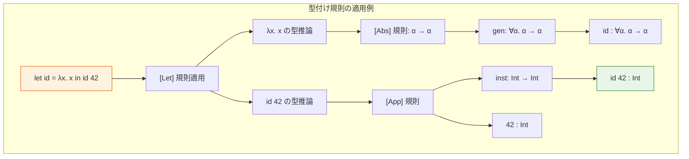

### 2.4 型の健全性

型システムの正しさは、**型の健全性（type soundness）** によって保証される。健全性は次の2つの定理から構成される。

- **進行定理（Progress）**：well-typed な閉じた式は、値であるか、さらに計算を進めることができる
- **型保存定理（Preservation / Subject Reduction）**：well-typed な式が1ステップ評価されたとき、結果もまた同じ型で well-typed である

$$
\text{Progress:} \quad \vdash e : \tau \implies e \text{ は値} \lor \exists e'.\, e \to e'
$$

$$
\text{Preservation:} \quad \vdash e : \tau \land e \to e' \implies \vdash e' : \tau
$$

この2つの性質が成り立つとき、「well-typed programs don't go wrong」（型が付くプログラムは不正な状態に陥らない）と言うことができる。

## 3. 単一化（Unification）

型推論アルゴリズムの中核を成す操作が**単一化（unification）**である。単一化とは、2つの型式を同一にする**代入（substitution）**を見つける問題である。

### 3.1 代入

**代入（substitution）** $S$ は、型変数から型への有限写像である。代入 $S$ を型 $\tau$ に適用することを $S(\tau)$ あるいは $S\tau$ と書く。

$$
S = [\alpha_1 \mapsto \tau_1,\; \alpha_2 \mapsto \tau_2,\; \ldots]
$$

代入の適用は再帰的に定義される。

$$
\begin{aligned}
S(\alpha) &= \begin{cases} \tau & \text{if } (\alpha \mapsto \tau) \in S \\ \alpha & \text{otherwise} \end{cases} \\
S(T) &= T \\
S(\tau_1 \to \tau_2) &= S(\tau_1) \to S(\tau_2)
\end{aligned}
$$

2つの代入 $S_1$ と $S_2$ の**合成** $S_1 \circ S_2$ は、まず $S_2$ を適用してから $S_1$ を適用する操作である。

$$
(S_1 \circ S_2)(\tau) = S_1(S_2(\tau))
$$

### 3.2 単一化問題

2つの型 $\tau_1$ と $\tau_2$ が与えられたとき、$S(\tau_1) = S(\tau_2)$ を満たす代入 $S$ を**単一化子（unifier）**と呼ぶ。この $S$ を求める問題が**単一化問題**である。

例を見てみよう。

| $\tau_1$ | $\tau_2$ | 単一化子 $S$ |
|----------|----------|-------------|
| $\alpha$ | `Int` | $[\alpha \mapsto \text{Int}]$ |
| $\alpha \to \text{Bool}$ | $\text{Int} \to \beta$ | $[\alpha \mapsto \text{Int},\; \beta \mapsto \text{Bool}]$ |
| $\alpha$ | $\alpha \to \text{Int}$ | なし（出現検査失敗） |
| $\text{Int}$ | $\text{Bool}$ | なし（型の不一致） |

### 3.3 最汎単一化子（Most General Unifier）

単一化子は一般に複数存在しうる。たとえば $\alpha$ と $\beta$ の単一化子として $[\alpha \mapsto \text{Int},\; \beta \mapsto \text{Int}]$ も $[\alpha \mapsto \beta]$ も有効である。しかし後者の方が「より一般的」である。

代入 $S$ が $S'$ **より一般的**であるとは、ある代入 $R$ が存在して $S' = R \circ S$ が成り立つことをいう。

**最汎単一化子（Most General Unifier, MGU）** とは、すべての単一化子より一般的な単一化子のことである。MGU は（存在すれば）変数のリネーミングを除いて一意であることが知られている。

::: warning 出現検査（Occurs Check）
$\alpha$ と $\alpha \to \text{Int}$ を単一化しようとすると、$\alpha$ を $\alpha \to \text{Int}$ に置き換える必要があるが、これは $\alpha = \alpha \to \text{Int} = (\alpha \to \text{Int}) \to \text{Int} = \ldots$ と無限の型を生むことになる。**出現検査（occurs check）**とは、型変数 $\alpha$ を含む型 $\tau$ で $\alpha$ を置換しようとする場合を検出し、単一化を失敗させる処理である。出現検査を省略すると無限型が発生し、型推論の正しさが保証されなくなる。
:::

### 3.4 Robinson の単一化アルゴリズム

1965年に J.A. Robinson が提案した単一化アルゴリズムを以下に示す。これは型推論のみならず、論理プログラミング（Prolog）などでも広く用いられる基本的なアルゴリズムである。

```python
def unify(t1, t2, subst=None):
    """
    Robinson's unification algorithm.
    Returns the most general unifier (MGU) or raises an error.
    """
    if subst is None:
        subst = {}

    t1 = apply_subst(subst, t1)
    t2 = apply_subst(subst, t2)

    if t1 == t2:
        # Already equal
        return subst

    if isinstance(t1, TypeVar):
        return unify_var(t1, t2, subst)

    if isinstance(t2, TypeVar):
        return unify_var(t2, t1, subst)

    if isinstance(t1, FunctionType) and isinstance(t2, FunctionType):
        # Unify argument types, then return types
        subst = unify(t1.arg, t2.arg, subst)
        subst = unify(t1.ret, t2.ret, subst)
        return subst

    raise TypeError(f"Cannot unify {t1} with {t2}")


def unify_var(var, typ, subst):
    """Unify a type variable with a type."""
    if occurs_in(var, typ):
        raise TypeError(f"Occurs check failed: {var} in {typ}")
    subst[var] = typ
    return subst


def occurs_in(var, typ):
    """Check if var occurs in typ (prevents infinite types)."""
    if typ == var:
        return True
    if isinstance(typ, FunctionType):
        return occurs_in(var, typ.arg) or occurs_in(var, typ.ret)
    return False
```

このアルゴリズムの計算量を分析する。素朴な実装では、代入の適用に出現する型のサイズに比例する時間がかかり、最悪の場合指数時間になりうる。しかし、Union-Find データ構造を用いた効率的な実装では、ほぼ線形時間 $O(n \cdot \alpha(n))$ で単一化を実行できる（$\alpha$ は逆アッカーマン関数）。

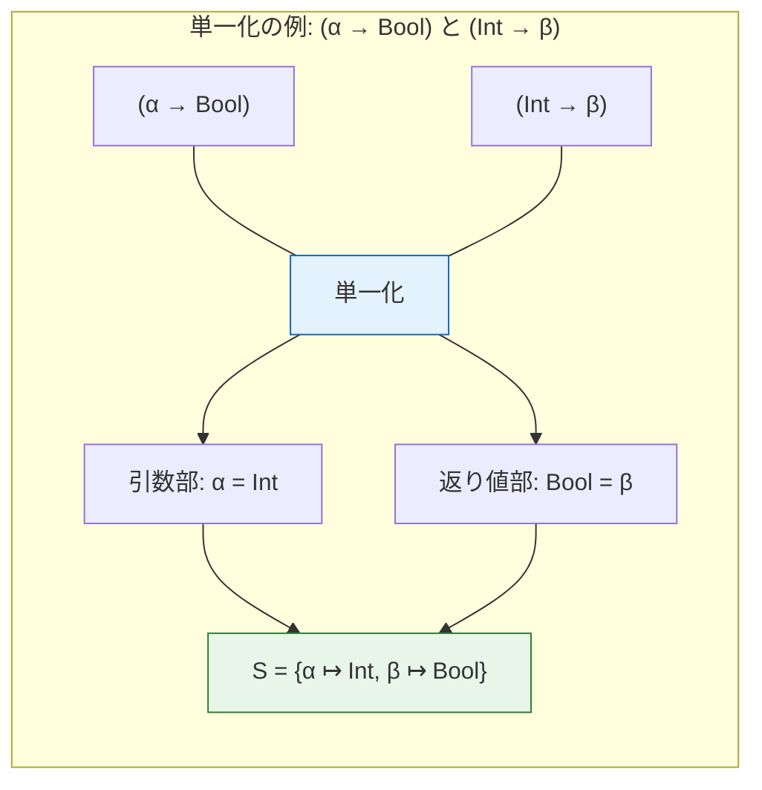

## 4. Algorithm W：Hindley-Milner 型推論

### 4.1 Hindley-Milner 型システム

**Hindley-Milner（HM）型システム**は、型推論が決定可能であり、かつ最も一般的な型（主要型, principal type）が常に存在する型システムとして、最も重要かつ影響力のある型システムである。ML、Haskell、OCaml、F# などの関数型言語の型推論の基盤となっている。

HM 型システムの特徴は**let 多相（let-polymorphism）**にある。これは、`let` 束縛された式に対して多相型（型スキーム）を付与することで、同じ関数を異なる型で再利用できるようにする仕組みである。

```ocaml
(* OCaml — let-polymorphism in action *)
let id x = x           (* id : 'a -> 'a *)
let a = id 42          (* id used at int -> int *)
let b = id true         (* id used at bool -> bool *)
let c = id "hello"      (* id used at string -> string *)
```

ここで `id` の型 $\forall \alpha.\, \alpha \to \alpha$ は `let` の時点で汎化され、使用されるたびに新しい型変数で具体化される。

::: details let 多相とラムダ多相の違い
HM 型システムでは `let` 束縛でのみ多相が許され、ラムダ抽象の引数では多相が許されない。これは意図的な制限であり、この制限があるからこそ型推論が決定可能になる。

```ocaml
(* OK: let-polymorphism *)
let f = fun x -> x in (f 1, f true)

(* NG in HM: lambda argument cannot be polymorphic *)
(* (fun f -> (f 1, f true)) (fun x -> x)  -- type error *)
```

ラムダ引数にも多相を許す体系（ランク2多相、System F）では型推論が一般に決定不能になることが知られている。
:::

### 4.2 Algorithm W の定義

**Algorithm W** は、1978年に Robin Milner が発表し、1982年に Luis Damas が健全性と完全性を証明した型推論アルゴリズムである。入力として型環境 $\Gamma$ と式 $e$ を受け取り、代入 $S$ と型 $\tau$ のペアを返す。

アルゴリズムの核心は、式の構造に対する再帰的な分析と、制約の単一化による解決である。

$$
\mathcal{W}(\Gamma, e) = (S, \tau)
$$

各構文要素に対するアルゴリズムを定義する。

**変数 $x$**：

$$
\mathcal{W}(\Gamma, x) = (\text{id}, \text{inst}(\Gamma(x)))
$$

環境から $x$ の型スキームを取得し、新しい型変数で具体化する。

**ラムダ抽象 $\lambda x.\, e$**：

$$
\frac{\beta \text{ は新しい型変数} \quad (S_1, \tau_1) = \mathcal{W}(\Gamma \cup \{x : \beta\}, e)}{\mathcal{W}(\Gamma, \lambda x.\, e) = (S_1, S_1(\beta) \to \tau_1)}
$$

引数 $x$ に新しい型変数 $\beta$ を割り当て、本体 $e$ を推論する。

**関数適用 $e_1\; e_2$**：

$$
\frac{(S_1, \tau_1) = \mathcal{W}(\Gamma, e_1) \quad (S_2, \tau_2) = \mathcal{W}(S_1(\Gamma), e_2) \quad \beta \text{ は新しい型変数} \quad S_3 = \text{unify}(S_2(\tau_1), \tau_2 \to \beta)}{\mathcal{W}(\Gamma, e_1\; e_2) = (S_3 \circ S_2 \circ S_1, S_3(\beta))}
$$

$e_1$ と $e_2$ を順に推論し、$e_1$ の型が $\tau_2 \to \beta$ の形であることを単一化で強制する。

**let 式 $\text{let } x = e_1 \text{ in } e_2$**：

$$
\frac{(S_1, \tau_1) = \mathcal{W}(\Gamma, e_1) \quad \sigma_1 = \text{gen}(S_1(\Gamma), \tau_1) \quad (S_2, \tau_2) = \mathcal{W}(S_1(\Gamma) \cup \{x : \sigma_1\}, e_2)}{\mathcal{W}(\Gamma, \text{let } x = e_1 \text{ in } e_2) = (S_2 \circ S_1, \tau_2)}
$$

$e_1$ の型を推論し、汎化して多相型スキームを作り、それを環境に追加して $e_2$ を推論する。

### 4.3 具体化と汎化

**具体化（instantiation）** $\text{inst}(\forall \alpha_1 \ldots \alpha_n.\, \tau)$ は、量化された型変数 $\alpha_i$ をそれぞれ新しい型変数 $\beta_i$ に置き換える操作である。

$$
\text{inst}(\forall \alpha_1 \ldots \alpha_n.\, \tau) = [\alpha_1 \mapsto \beta_1, \ldots, \alpha_n \mapsto \beta_n](\tau) \quad (\beta_i \text{ は新しい型変数})
$$

**汎化（generalization）** $\text{gen}(\Gamma, \tau)$ は、型 $\tau$ に出現する型変数のうち、環境 $\Gamma$ に自由に出現しないものを全称量化する操作である。

$$
\text{gen}(\Gamma, \tau) = \forall \alpha_1 \ldots \alpha_n.\, \tau \quad \text{where } \{\alpha_1, \ldots, \alpha_n\} = \text{ftv}(\tau) \setminus \text{ftv}(\Gamma)
$$

ここで $\text{ftv}$ は自由型変数（free type variables）の集合を返す関数である。

### 4.4 Algorithm W の実装

以下に、Algorithm W の擬似コード的な実装を示す。

::: code-group

```python [Algorithm W (Python)]
class TypeInference:
    def __init__(self):
        self.counter = 0

    def fresh_var(self):
        """Generate a fresh type variable."""
        self.counter += 1
        return TypeVar(f"t{self.counter}")

    def infer(self, env, expr):
        """
        Algorithm W: infer the type of expr under env.
        Returns (substitution, type).
        """
        match expr:
            case Var(name):
                if name not in env:
                    raise TypeError(f"Unbound variable: {name}")
                scheme = env[name]
                return {}, self.instantiate(scheme)

            case Lam(param, body):
                tv = self.fresh_var()
                new_env = {**env, param: Scheme([], tv)}
                subst, body_type = self.infer(new_env, body)
                return subst, FunctionType(apply_subst(subst, tv), body_type)

            case App(func, arg):
                s1, func_type = self.infer(env, func)
                s2, arg_type = self.infer(apply_subst_env(s1, env), arg)
                tv = self.fresh_var()
                s3 = unify(apply_subst(s2, func_type),
                           FunctionType(arg_type, tv))
                return compose(s3, compose(s2, s1)), apply_subst(s3, tv)

            case Let(name, value, body):
                s1, val_type = self.infer(env, value)
                env1 = apply_subst_env(s1, env)
                scheme = self.generalize(env1, val_type)
                s2, body_type = self.infer({**env1, name: scheme}, body)
                return compose(s2, s1), body_type

    def instantiate(self, scheme):
        """Replace quantified vars with fresh vars."""
        mapping = {v: self.fresh_var() for v in scheme.vars}
        return apply_subst(mapping, scheme.body)

    def generalize(self, env, typ):
        """Quantify free vars not in env."""
        env_ftv = free_type_vars_env(env)
        type_ftv = free_type_vars(typ)
        quantified = type_ftv - env_ftv
        return Scheme(list(quantified), typ)
```

```ocaml [Algorithm W (OCaml)]
let rec infer env expr =
  match expr with
  | Var x ->
    let scheme = Env.lookup x env in
    let ty = instantiate scheme in
    (empty_subst, ty)
  | Lam (x, body) ->
    let tv = fresh_var () in
    let env' = Env.extend x (Scheme ([], tv)) env in
    let (s1, body_ty) = infer env' body in
    (s1, TFun (apply_subst s1 tv, body_ty))
  | App (e1, e2) ->
    let (s1, ty1) = infer env e1 in
    let (s2, ty2) = infer (apply_subst_env s1 env) e2 in
    let tv = fresh_var () in
    let s3 = unify (apply_subst s2 ty1) (TFun (ty2, tv)) in
    (compose s3 (compose s2 s1), apply_subst s3 tv)
  | Let (x, e1, e2) ->
    let (s1, ty1) = infer env e1 in
    let env' = apply_subst_env s1 env in
    let scheme = generalize env' ty1 in
    let (s2, ty2) = infer (Env.extend x scheme env') e2 in
    (compose s2 s1, ty2)
```

:::

### 4.5 Algorithm W の実行例

具体的な式に対して Algorithm W がどのように動作するかを追ってみよう。

**例：`let id = λx. x in id 42`**

```
Step 1: infer(∅, let id = λx. x in id 42)
  → [Let] 規則

Step 2: infer(∅, λx. x)
  → [Lam] 規則
  → 新しい型変数 α を生成
  → infer({x: α}, x)
    → [Var] 規則: α を返す
  → λx. x : α → α
  → 代入 S1 = {}

Step 3: generalize(∅, α → α) = ∀α. α → α

Step 4: infer({id: ∀α. α → α}, id 42)
  → [App] 規則

Step 5: infer({id: ∀α. α → α}, id)
  → [Var] 規則
  → instantiate(∀α. α → α) = β → β  (βは新しい型変数)
  → 代入 S2 = {}

Step 6: infer({id: ∀α. α → α}, 42)
  → [Const] 規則: Int
  → 代入 S3 = {}

Step 7: unify(β → β, Int → γ)
  → β = Int, γ = β = Int
  → 代入 S4 = {β ↦ Int, γ ↦ Int}

Result: S4(γ) = Int
```

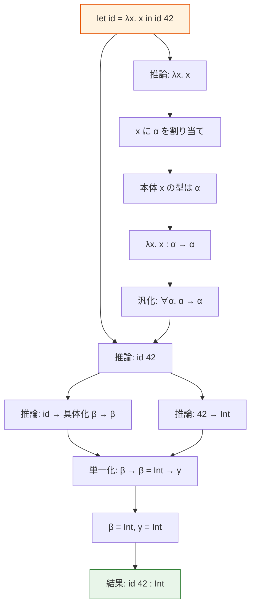

### 4.6 主要型定理

Algorithm W の最も重要な性質は**主要型定理（principal type theorem）**である。

> **定理（Damas-Milner, 1982）**：式 $e$ が型環境 $\Gamma$ のもとで型を持つならば、Algorithm W は停止し、最も一般的な型（主要型）を返す。すなわち、$e$ の任意の型付けは、Algorithm W が返す型の代入インスタンスである。

この定理が意味するのは、HM 型システムにおいては型注釈が完全に不要であるということである。コンパイラは常に最も一般的な型を推論でき、プログラマが書きうるいかなる型注釈もその特殊化に過ぎない。

## 5. Algorithm J と制約ベース型推論

### 5.1 Algorithm J

**Algorithm J** は Algorithm W の変種であり、代入をその場で（破壊的に）適用する方式である。Algorithm W が代入を合成して受け渡すのに対し、Algorithm J はグローバルな代入（通常は Union-Find で実装）を用いる。

```python
class AlgorithmJ:
    """
    Algorithm J: imperative variant of Algorithm W.
    Uses mutable union-find for substitution.
    """
    def __init__(self):
        self.uf = UnionFind()
        self.counter = 0

    def fresh_var(self):
        self.counter += 1
        tv = TypeVar(f"t{self.counter}")
        self.uf.make_set(tv)
        return tv

    def find(self, ty):
        """Resolve type through union-find."""
        if isinstance(ty, TypeVar):
            return self.uf.find(ty)
        if isinstance(ty, FunctionType):
            return FunctionType(self.find(ty.arg), self.find(ty.ret))
        return ty

    def unify(self, t1, t2):
        """Destructive unification using union-find."""
        t1 = self.find(t1)
        t2 = self.find(t2)

        if t1 == t2:
            return
        if isinstance(t1, TypeVar):
            if occurs_in(t1, t2):
                raise TypeError("Infinite type")
            self.uf.union(t1, t2)
            return
        if isinstance(t2, TypeVar):
            if occurs_in(t2, t1):
                raise TypeError("Infinite type")
            self.uf.union(t2, t1)
            return
        if isinstance(t1, FunctionType) and isinstance(t2, FunctionType):
            self.unify(t1.arg, t2.arg)
            self.unify(t1.ret, t2.ret)
            return
        raise TypeError(f"Type mismatch: {t1} vs {t2}")

    def infer(self, env, expr):
        """Infer type of expr — returns the type directly."""
        match expr:
            case Var(name):
                return self.instantiate(env[name])
            case Lam(param, body):
                tv = self.fresh_var()
                new_env = {**env, param: Scheme([], tv)}
                body_ty = self.infer(new_env, body)
                return FunctionType(self.find(tv), body_ty)
            case App(func, arg):
                func_ty = self.infer(env, func)
                arg_ty = self.infer(env, arg)
                ret_ty = self.fresh_var()
                self.unify(func_ty, FunctionType(arg_ty, ret_ty))
                return self.find(ret_ty)
            case Let(name, value, body):
                val_ty = self.infer(env, value)
                scheme = self.generalize(env, val_ty)
                return self.infer({**env, name: scheme}, body)
```

Algorithm J は実用的なコンパイラで広く採用されている。理由は以下の通りである。

1. **メモリ効率**：代入のコピーが不要
2. **実装の単純さ**：Union-Find による効率的な等価クラス管理
3. **パフォーマンス**：ほぼ線形時間での動作

### 5.2 制約ベース型推論

Algorithm W/J は「推論と制約解決を同時に行う」方式であるが、これを2つのフェーズに分離することもできる。

1. **制約生成（Constraint Generation）**：式を走査して型制約を収集する
2. **制約解決（Constraint Solving）**：収集した制約を単一化で解く

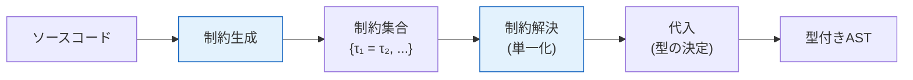

この分離には実用上の大きな利点がある。

- **エラー報告の改善**：制約にソースコード上の位置情報を付加でき、型エラーの報告が正確になる
- **制約の解決順序の柔軟性**：制約を自由な順序で解くことで、より良いエラーメッセージを生成できる
- **拡張の容易さ**：新しい型機能（型クラス、サブタイピングなど）を制約の種類として追加しやすい

```python
def generate_constraints(env, expr, expected_type=None):
    """
    Generate type constraints from expression.
    Returns (type, list of constraints).
    """
    match expr:
        case Var(name):
            ty = instantiate(env[name])
            constraints = []
            if expected_type:
                constraints.append(Constraint(ty, expected_type, expr.loc))
            return ty, constraints

        case Lam(param, body):
            param_ty = fresh_var()
            ret_ty = fresh_var()
            new_env = {**env, param: Scheme([], param_ty)}
            body_ty, cs = generate_constraints(new_env, body, ret_ty)
            func_ty = FunctionType(param_ty, ret_ty)
            if expected_type:
                cs.append(Constraint(func_ty, expected_type, expr.loc))
            return func_ty, cs

        case App(func, arg):
            ret_ty = fresh_var()
            func_ty, cs1 = generate_constraints(env, func)
            arg_ty, cs2 = generate_constraints(env, arg)
            cs = cs1 + cs2
            cs.append(Constraint(func_ty,
                                 FunctionType(arg_ty, ret_ty),
                                 expr.loc))
            if expected_type:
                cs.append(Constraint(ret_ty, expected_type, expr.loc))
            return ret_ty, cs
```

## 6. 型検査アルゴリズム

型推論が「型を求める」処理であるのに対し、型検査は「型注釈が正しいか検証する」処理である。ここでは型検査の主要なアルゴリズムを解説する。

### 6.1 構文主導型検査（Syntax-Directed Type Checking）

最も基本的な型検査は、ASTを走査しながら型規則を直接適用する方式である。

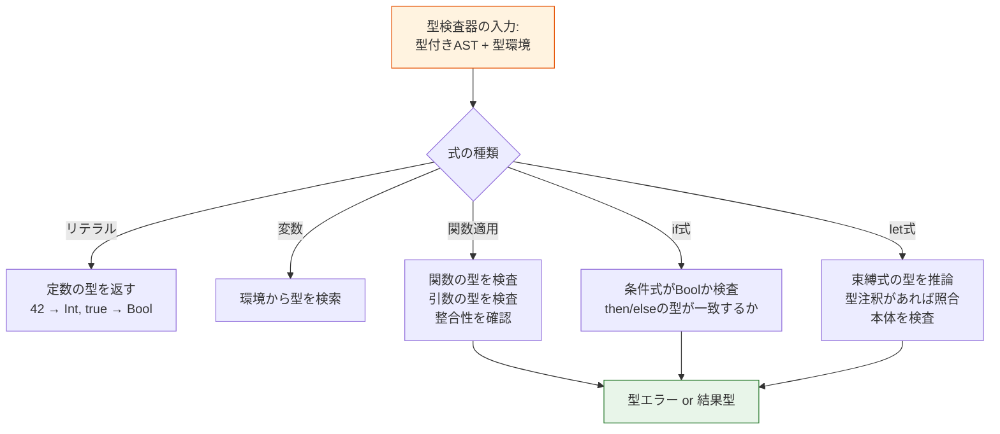

```python
def type_check(env, expr, expected_type):
    """
    Check that expr has the expected type.
    Raises TypeError on failure.
    """
    match expr:
        case IntLit(_):
            if expected_type != IntType:
                raise TypeError(
                    f"Expected {expected_type}, got Int"
                )

        case BoolLit(_):
            if expected_type != BoolType:
                raise TypeError(
                    f"Expected {expected_type}, got Bool"
                )

        case Var(name):
            actual = env.lookup(name)
            if not is_subtype(actual, expected_type):
                raise TypeError(
                    f"Variable {name} has type {actual}, "
                    f"expected {expected_type}"
                )

        case If(cond, then_branch, else_branch):
            type_check(env, cond, BoolType)
            type_check(env, then_branch, expected_type)
            type_check(env, else_branch, expected_type)

        case App(func, arg):
            arg_type = type_infer(env, arg)
            func_expected = FunctionType(arg_type, expected_type)
            type_check(env, func, func_expected)
```

### 6.2 双方向型検査（Bidirectional Type Checking）

**双方向型検査（bidirectional type checking）** は、型推論と型検査を巧みに組み合わせたアルゴリズムである。式に対して2つのモードを区別する。

- **合成モード（synthesis / infer）**：式から型を推論する（$\Gamma \vdash e \Rightarrow \tau$）
- **検査モード（checking / check）**：期待される型に対して式を検査する（$\Gamma \vdash e \Leftarrow \tau$）

$$
\frac{\Gamma \vdash e_1 \Rightarrow \tau_1 \to \tau_2 \quad \Gamma \vdash e_2 \Leftarrow \tau_1}{\Gamma \vdash e_1\; e_2 \Rightarrow \tau_2} \quad \text{[App-Synth]}
$$

$$
\frac{\Gamma,\, x : \tau_1 \vdash e \Leftarrow \tau_2}{\Gamma \vdash \lambda x.\, e \Leftarrow \tau_1 \to \tau_2} \quad \text{[Lam-Check]}
$$

$$
\frac{\Gamma \vdash e \Rightarrow \tau' \quad \tau' = \tau}{\Gamma \vdash e \Leftarrow \tau} \quad \text{[Sub]}
$$

双方向型検査の直感は以下の通りである。

- ラムダ式は型を「持っている」わけではなく、期待される型に従って検査される（checking mode）
- 関数適用は関数部分から型を合成し（synthesis mode）、引数を検査する（checking mode）
- 変数やリテラルは型を合成する（synthesis mode）

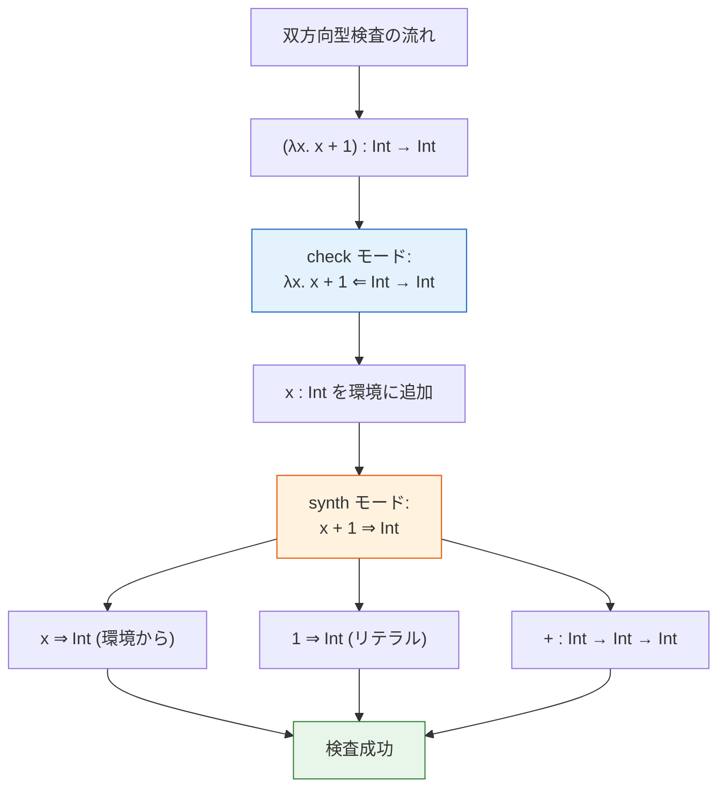

::: tip 双方向型検査の利点
双方向型検査は現代の言語設計で広く採用されている。主な利点は以下の通りである。

1. **型注釈の最小化**：型情報が「流れる」ため、多くの場面で注釈が不要
2. **決定可能性の維持**：System F のような強力な型システムでも、適切な位置に型注釈を要求することで決定可能性を維持
3. **良質なエラーメッセージ**：期待される型と実際の型のミスマッチを直接的に報告可能
4. **拡張性**：サブタイピング、多相型、依存型などとの統合が自然
:::

### 6.3 ローカル型推論（Local Type Inference）

**ローカル型推論**は、双方向型検査の考え方に基づき、型注釈をプログラムの「境界」（関数シグネチャなど）に限定し、関数本体の内部では型推論を行う方式である。Scala、Kotlin、Swift、Rust、TypeScript などの現代の言語が採用している。

```scala
// Scala — local type inference
// Function signature requires annotation
def map[A, B](xs: List[A], f: A => B): List[B] = xs match {
  case Nil => Nil
  case head :: tail => f(head) :: map(tail, f) // types inferred locally
}

// Type argument inferred from context
val result = map(List(1, 2, 3), (x: Int) => x.toString)
// inferred: map[Int, String](...)
```

ローカル型推論では、完全な HM 型推論と比較して以下のトレードオフがある。

| 性質 | HM 型推論 | ローカル型推論 |
|------|----------|-------------|
| 型注釈の必要性 | 完全に不要 | 関数シグネチャに必要 |
| 推論の範囲 | プログラム全体 | 局所的（関数本体内） |
| 多相型の扱い | let多相のみ | ランク1 + 限定的な高ランク |
| サブタイピング | なし | 自然に統合可能 |
| エラーメッセージの質 | しばしば難解 | 比較的理解しやすい |
| コンパイル時間 | 最悪で指数的 | 予測可能 |

## 7. サブタイピングと型推論

### 7.1 サブタイピングの基本

**サブタイピング（subtyping）**は、型の間に「部分型」の関係を導入する。$\tau_1 <: \tau_2$（$\tau_1$ は $\tau_2$ の部分型）であるとき、$\tau_1$ 型の値は $\tau_2$ 型が期待される文脈で安全に使用できる。

$$
\frac{\Gamma \vdash e : \tau_1 \quad \tau_1 <: \tau_2}{\Gamma \vdash e : \tau_2} \quad \text{[Subsumption]}
$$

関数型のサブタイピング規則は重要である。

$$
\frac{\tau_3 <: \tau_1 \quad \tau_2 <: \tau_4}{\tau_1 \to \tau_2 <: \tau_3 \to \tau_4} \quad \text{[Arrow]}
$$

引数の型は**反変（contravariant）**、返り値の型は**共変（covariant）**である。

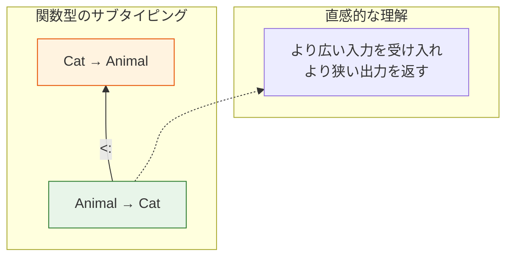

### 7.2 サブタイピングと型推論の相互作用

サブタイピングの存在は型推論を著しく複雑にする。HM 型推論では等式制約（$\tau_1 = \tau_2$）のみを扱えば十分であったが、サブタイピングの導入により不等式制約（$\tau_1 <: \tau_2$）を扱う必要が生じる。

主な課題は以下の通りである。

1. **主要型の非存在**：サブタイピングがある型システムでは、最も一般的な型が存在しない場合がある
2. **制約の複雑化**：サブタイピング制約の解決は単一化よりも困難
3. **推論の決定不能性**：一般的なサブタイピングと多相の組み合わせでは型推論が決定不能になりうる

::: warning 実用的な妥協
多くの言語では、サブタイピングと型推論の両立のために、推論の範囲を制限している。たとえば Scala では、メソッドの返り値型は推論されるが、再帰メソッドには型注釈が必要である。TypeScript では構造的サブタイピングを採用しつつ、完全な型推論は行わず、型の「拡幅（widening）」によって推論を簡略化している。
:::

## 8. 型クラスと型推論

### 8.1 型クラスの概要

**型クラス（type class）**は Haskell で導入されたアドホック多相（ad-hoc polymorphism）の機構であり、型推論と深く関わっている。

```haskell
-- Type class definition
class Eq a where
  (==) :: a -> a -> Bool

-- Instance for Int
instance Eq Int where
  x == y = eqInt x y

-- Polymorphic function with type class constraint
elem :: Eq a => a -> [a] -> Bool
elem _ []     = False
elem x (y:ys) = x == y || elem x ys
```

型クラス制約 `Eq a =>` は、型変数 `a` が `Eq` のインスタンスであることを要求する。型推論器はプログラムから型クラス制約を収集し、これを解決する。

### 8.2 型クラスの解決

型クラス制約の解決は、型推論のプロセスに統合される。

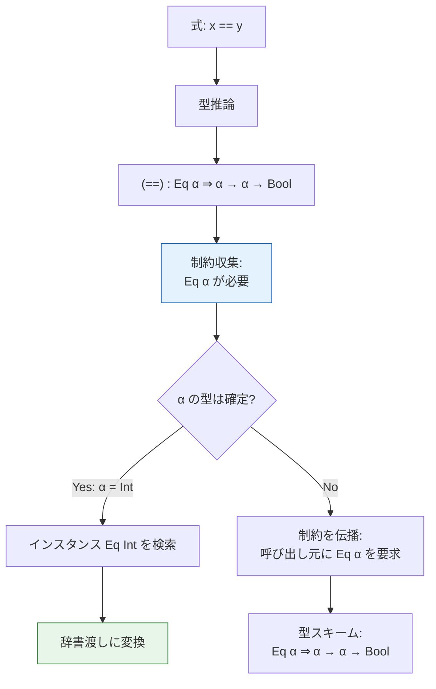

型推論器が型クラス制約を扱う手順は以下の通りである。

1. 多相関数の使用時に、型クラス制約を収集する
2. 単一化により型変数が具体的な型に決まった場合、対応するインスタンスを検索する
3. インスタンスが見つかれば制約を解消する
4. 具体化されない型変数に対する制約は、関数のシグネチャに伝播する

## 9. 高度な型推論の話題

### 9.1 ランク多相（Higher-Rank Polymorphism）

HM 型システムでは多相型はトップレベル（ランク1）にのみ出現する。**ランクN多相**では、型の中でより深い位置に $\forall$ が出現できる。

$$
\begin{aligned}
\text{ランク1:} \quad & \forall \alpha.\, \alpha \to \alpha \\
\text{ランク2:} \quad & (\forall \alpha.\, \alpha \to \alpha) \to \text{Int} \\
\text{ランク3:} \quad & ((\forall \alpha.\, \alpha \to \alpha) \to \text{Int}) \to \text{Bool}
\end{aligned}
$$

ランク2以上の多相型の型推論は決定不能であることが知られている（Wells, 1999）。そのため、実用的な言語では以下の戦略が取られる。

- **GHC Haskell（RankNTypes拡張）**：高ランクの位置に型注釈を要求する
- **OCaml**：限定的なランク2多相のサポート（レコードフィールド）
- **Scala 3**：多相関数型を限定的にサポート

```haskell
-- Rank-2 polymorphism requires type annotation
{-# LANGUAGE RankNTypes #-}

-- This requires explicit annotation — cannot be inferred
applyToBoth :: (forall a. a -> a) -> (Int, Bool)
applyToBoth f = (f 42, f True)
```

### 9.2 型推論とレコード型

レコード型（構造体型）に対する型推論も重要なトピックである。主に2つのアプローチがある。

**名前的型付け（Nominal Typing）**では、レコードの型はその名前で識別される。型推論は比較的単純で、フィールドアクセスからレコード型を特定できる。

**構造的型付け（Structural Typing）**では、レコードの型はそのフィールドの集合で決まる。行多相（row polymorphism）を用いた型推論が必要になる。

```typescript
// TypeScript — structural typing
function getName(obj: { name: string }) {
  return obj.name;
}

// Any object with a 'name: string' field works
getName({ name: "Alice", age: 30 }); // OK
getName({ name: "Bob", email: "bob@example.com" }); // OK
```

### 9.3 GADTs と型推論

**一般化代数的データ型（Generalized Algebraic Data Types, GADTs）** は、コンストラクタごとに異なる型パラメータを持てるデータ型である。

```haskell
-- GADT: type-safe expression evaluator
data Expr a where
  IntLit  :: Int -> Expr Int
  BoolLit :: Bool -> Expr Bool
  Add     :: Expr Int -> Expr Int -> Expr Int
  If      :: Expr Bool -> Expr a -> Expr a -> Expr a

-- Type-safe evaluation — no runtime type errors possible
eval :: Expr a -> a
eval (IntLit n)    = n
eval (BoolLit b)   = b
eval (Add e1 e2)   = eval e1 + eval e2
eval (If c t e)    = if eval c then eval t else eval e
```

GADTs はパターンマッチの各分岐で型情報を精密化（refinement）する。これは通常の HM 型推論では扱えず、以下の課題を生む。

- パターンマッチの分岐ごとに異なる型の等式制約が生じる
- 型の等式制約の伝播と解決が必要
- 関数の返り値型に型注釈が必要になる場合がある

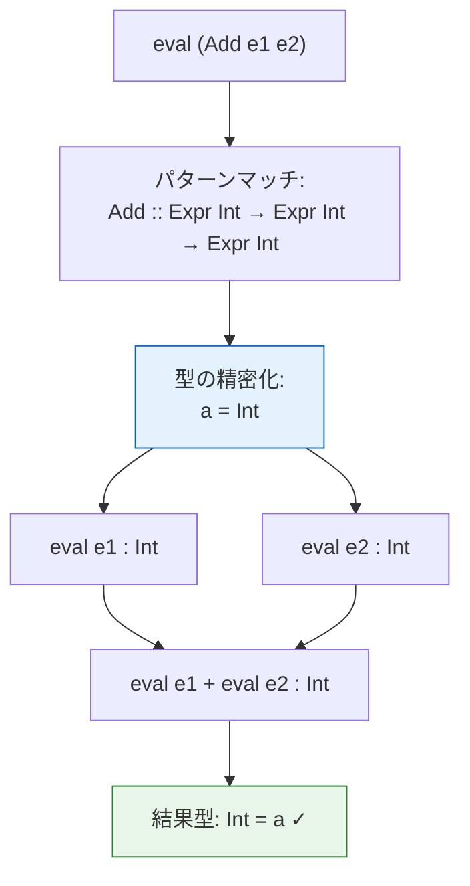

## 10. 実際のコンパイラにおける型推論

### 10.1 GHC（Haskell）

GHC の型推論器は、HM 型推論を大幅に拡張した **OutsideIn(X)** アルゴリズムに基づいている。このアルゴリズムは以下の機能を統合的に扱う。

- 型クラス制約の解決
- GADTs のパターンマッチにおける型精密化
- 型族（type families）の簡約
- 存在型（existential types）

```
GHC の型推論パイプライン:

ソースコード
  → 構文解析 → リネーム
  → 型推論 (OutsideIn(X))
    ├─ 制約生成
    ├─ 制約の単純化
    ├─ 含意制約の解決
    └─ 型のゾンキング (zonking)
  → Core（型付き中間言語）
  → 最適化 → コード生成
```

::: details ゾンキング（Zonking）とは
GHC の型推論では、型変数は最初「メタ型変数」として導入され、推論の過程で具体的な型に解決される。推論が完了した後、すべてのメタ型変数を最終的な型に置き換える処理を**ゾンキング（zonking）**と呼ぶ。これは Algorithm J における Union-Find の `find` 操作に相当する。
:::

### 10.2 Rust

Rust の型推論は HM ベースであるが、以下の独自の特徴を持つ。

- **ライフタイム推論**：参照のライフタイムを推論する（ライフタイム省略規則）
- **トレイト解決**：型クラスに相当するトレイト制約の解決
- **クロージャの型推論**：クロージャの引数型は使用箇所から逆方向に推論される

```rust
// Rust — type inference in action
fn main() {
    // Type of Vec inferred from push argument
    let mut v = Vec::new();  // Vec<?>
    v.push(42);              // Vec<i32> — inferred from 42

    // Closure argument types inferred from context
    let doubled: Vec<i32> = v.iter()
        .map(|x| x * 2)     // x: &i32 inferred from iter()
        .collect();          // collect::<Vec<i32>> inferred from annotation

    // Lifetime inference
    fn first<'a>(s: &'a str) -> &'a str {
        &s[..1]
    }
    // Equivalent with lifetime elision:
    fn first_elided(s: &str) -> &str {
        &s[..1]
    }
}
```

### 10.3 TypeScript

TypeScript の型推論は、JavaScript の動的な性質との互換性を保つため、独自の設計判断を行っている。

- **構造的サブタイピング**：名前ではなく構造で型の互換性を判定
- **制御フローベースの型の絞り込み（narrowing）**：条件分岐による型の精密化
- **コンテキスト型付け（contextual typing）**：コールバック関数の引数型を呼び出し元から推論
- **型の拡幅（widening）**：`let` で束縛された値の型を汎化する

```typescript
// TypeScript — control flow narrowing
function process(value: string | number) {
  if (typeof value === "string") {
    // value is narrowed to string
    console.log(value.toUpperCase());
  } else {
    // value is narrowed to number
    console.log(value.toFixed(2));
  }
}

// Contextual typing
const numbers = [1, 2, 3];
numbers.map((x) => x * 2);
// x is inferred as number from Array<number>.map signature

// Widening
const x = 42;        // type: 42 (literal type)
let y = 42;           // type: number (widened)
```

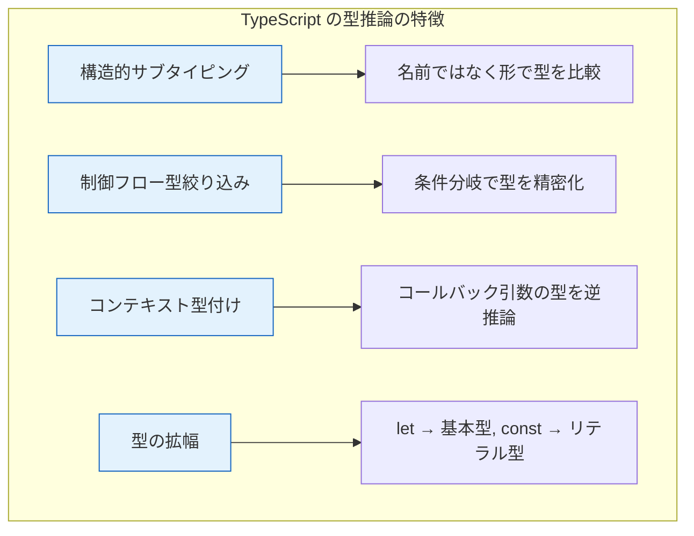

### 10.4 OCaml

OCaml は HM 型推論のもっとも忠実な実装の一つであり、プログラム全体を型注釈なしで書くことができる。

```ocaml
(* OCaml — full type inference, no annotations needed *)
let rec map f = function
  | [] -> []
  | x :: xs -> f x :: map f xs
(* inferred: ('a -> 'b) -> 'a list -> 'b list *)

let rec fold_left f acc = function
  | [] -> acc
  | x :: xs -> fold_left f (f acc x) xs
(* inferred: ('a -> 'b -> 'a) -> 'a -> 'b list -> 'a *)

(* Module system integrates with type inference *)
module type Stack = sig
  type 'a t
  val empty : 'a t
  val push : 'a -> 'a t -> 'a t
  val pop : 'a t -> ('a * 'a t) option
end
```

## 11. 型エラーの報告

型推論における最大の実用的課題の一つが、**型エラーメッセージの質**である。Algorithm W は最初に単一化が失敗した地点でエラーを報告するが、その地点が実際のバグの原因とは限らない。

### 11.1 エラー報告の課題

```ocaml
(* Where is the actual error? *)
let f x =
  let y = x + 1 in        (* x: int *)
  let z = String.length x in  (* x: string — conflict! *)
  y + z
```

この例では、`x + 1` で `x : int` が推論され、`String.length x` で `x : string` が要求される。Algorithm W は2番目の使用箇所でエラーを報告するが、プログラマの意図としてはどちらかが間違っている可能性がある。

### 11.2 改善手法

型エラーの報告を改善するための主要な手法を紹介する。

**型エラースライシング（Type Error Slicing）**は、型の矛盾に関与するプログラムの全箇所を特定し、一連の「スライス」として報告する手法である。

**最小非型付け可能部分式（Minimum Untypable Subexpression）**は、型エラーを引き起こす最小のプログラム片を特定する手法である。

**ヒューリスティック的手法**として、多くのコンパイラは以下のような工夫を行っている。

- エラーの原因候補を複数提示する
- 「意図した型」を推測して修正案を提示する
- 制約にソースコード位置を付加し、エラーの文脈を示す

```
-- GHC のエラーメッセージの例
error:
    • Couldn't match expected type 'Int' with actual type 'String'
    • In the first argument of '(+)', namely 'x'
      In the expression: x + 1
      In an equation for 'f': f x = x + 1
    • Relevant bindings include
        x :: String (bound at Main.hs:3:5)
        f :: String -> Int (bound at Main.hs:3:1)
```

```
-- Rust のエラーメッセージの例
error[E0308]: mismatched types
 --> src/main.rs:3:14
  |
2 | fn add(x: i32, y: i32) -> i32 {
  |                            --- expected `i32` because of return type
3 |     x + y + "hello"
  |              ^^^^^^^ expected `i32`, found `&str`
```

## 12. 型推論の計算量

### 12.1 理論的計算量

HM 型推論の計算量は理論的には **DEXPTIME 完全**であることが知られている。すなわち、入力サイズに対して指数的な時間がかかりうる。

この最悪ケースは、`let` の入れ子によって型のサイズが指数的に増大する場合に発生する。

```ocaml
(* Exponential blowup in type size *)
let f0 = fun x -> (x, x) in
let f1 = fun x -> f0 (f0 x) in
let f2 = fun x -> f1 (f1 x) in
let f3 = fun x -> f2 (f2 x) in
let f4 = fun x -> f3 (f3 x) in
f4 0
(* f0: a -> (a, a)                — size 3 *)
(* f1: a -> ((a,a),(a,a))         — size ~7 *)
(* f2: a -> (((..),(..)),((..),(..))) — size ~31 *)
(* fn: exponential in n *)
```

$f_n$ の型のサイズは $O(2^{2^n})$ であり、二重指数的に増大する。

### 12.2 実用的な性能

理論的には指数時間であるが、実際のプログラムでは以下の理由からほぼ線形時間で動作する。

1. **実用的なプログラムでの型のサイズ**：上記のような病的なケースは実際のコードではまず現れない
2. **共有表現**：型を DAG（有向非巡回グラフ）として表現することで、重複する部分型を共有する
3. **Union-Find の効率**：Algorithm J の Union-Find による実装は実質的に $O(n \cdot \alpha(n))$

| 言語 | 型推論の実用的な速度 | 備考 |
|------|-------------------|------|
| OCaml | 非常に高速 | ほぼ線形時間 |
| Haskell (GHC) | 拡張機能で低下しうる | 型族・型クラスの解決がボトルネック |
| Rust | コンパイル時間が長い | ライフタイム解析・トレイト解決が原因 |
| TypeScript | 大規模プロジェクトで低下 | 構造的型付け・条件型が原因 |

## 13. 型推論の限界と今後の方向性

### 13.1 決定不能性の壁

型推論の決定可能性は型システムの表現力とトレードオフの関係にある。

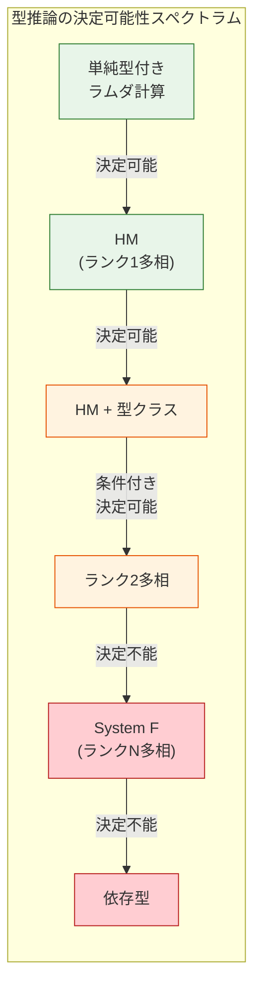

型システムが表現力を増すにつれ、完全な型推論は困難になる。現代の言語設計では、以下のような実用的な妥協が行われている。

- **型注釈の戦略的な要求**：関数シグネチャ、GADTs のパターンマッチ、高ランク多相の位置に注釈を要求
- **推論の範囲の制限**：グローバル推論ではなくローカル推論に留める
- **ヒューリスティクスの活用**：一意に決まらない場合にデフォルト型を適用

### 13.2 今後の方向性

型推論の研究は活発に続いており、以下の方向性が注目されている。

**完全性と推論可能性のバランス**：型システムの表現力を維持しつつ、より多くの場面で推論を可能にする研究。GHC の Quick Look impredicativity など。

**エラー回復と診断**：型エラー発生時に推論を中断せず、できるだけ多くのエラーを一度に報告する手法。

**機械学習との融合**：型の候補を推薦するために機械学習モデルを活用する研究。動的型付け言語に対する型推論（TypeScript の型推論改善など）への応用が期待されている。

**効果システムとの統合**：代数的効果（algebraic effects）の型推論は、型クラス推論の自然な拡張として研究が進んでいる。

**依存型の実用化**：Idris、Agda、Lean などの依存型言語では、型検査は決定可能であるが型推論は限定的である。実用的な依存型推論の改善が進められている。

## 14. まとめ

型推論と型検査は、プログラミング言語の安全性と利便性を両立させるための中核技術である。本記事で解説した内容を振り返る。

1. **理論的基盤**：型判定、型付け規則、型の健全性が型システムの正しさを保証する
2. **単一化**：2つの型を一致させる代入を求めるアルゴリズムであり、型推論の中核
3. **Algorithm W / J**：HM 型システムのための完全かつ健全な型推論アルゴリズム
4. **制約ベース型推論**：制約の生成と解決を分離し、エラー報告や拡張を容易にする
5. **双方向型検査**：合成モードと検査モードの使い分けにより、型注釈を最小化する
6. **実用上の課題**：サブタイピング、型クラス、高ランク多相、GADTs との統合

型推論の設計は、言語の表現力・安全性・利便性・コンパイル速度のバランスを決定づける。HM 型推論が「型注釈ゼロ」という理想を実現する一方で、現代の言語はより豊かな型機能を提供するために、戦略的な型注釈の要求とローカル推論を組み合わせるアプローチを取っている。

型推論は単なるコンパイラの一機能ではなく、プログラミング言語と論理学、圏論、証明論を結びつける深い理論的基盤を持つ分野であり、Curry-Howard 対応を通じて証明支援系やプログラム検証にも直結している。コンパイラ設計者のみならず、プログラミング言語の利用者にとっても、型推論の仕組みを理解することは、言語の設計意図を把握し、より効果的にその機能を活用するために重要である。
