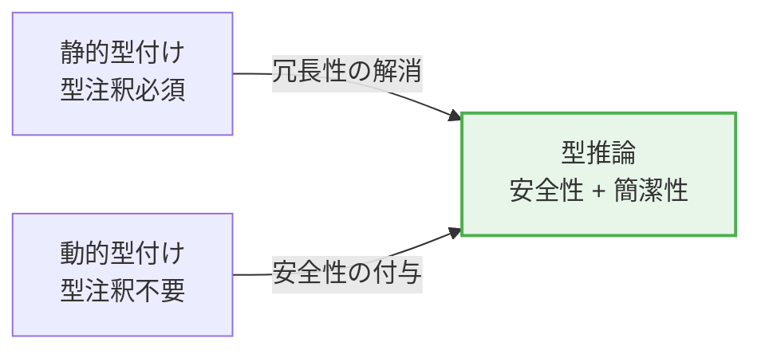
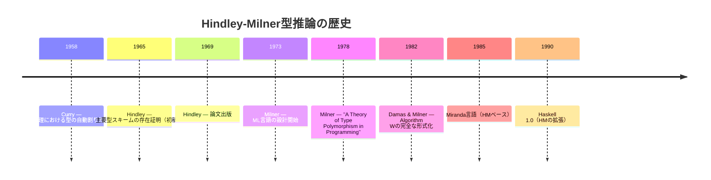
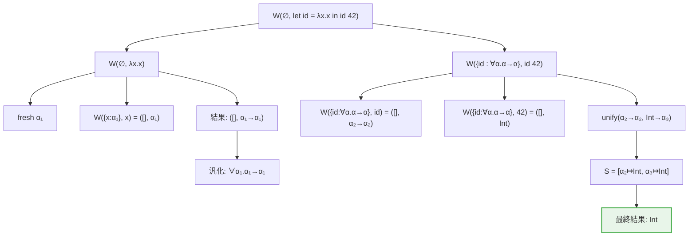
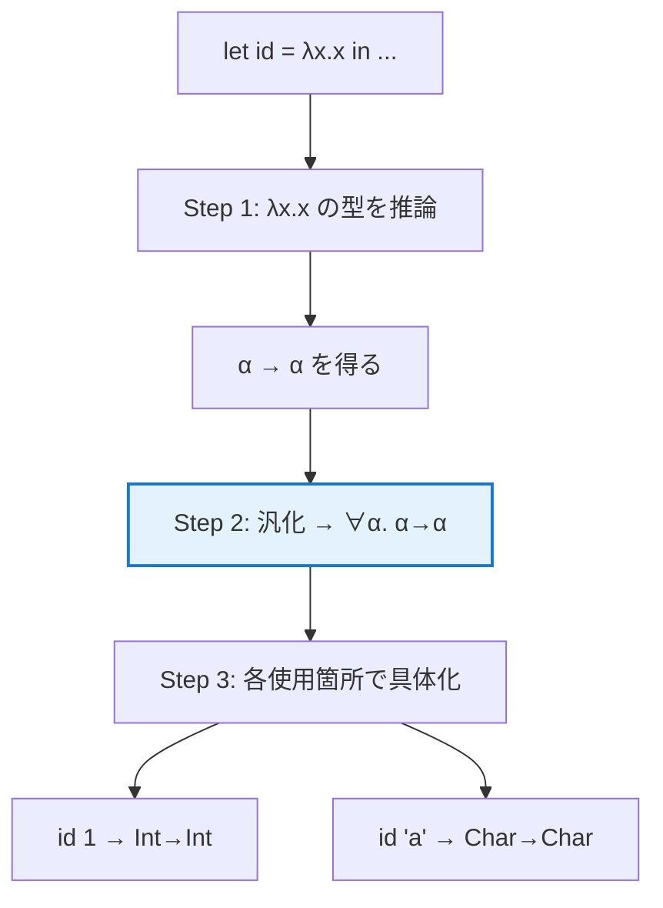
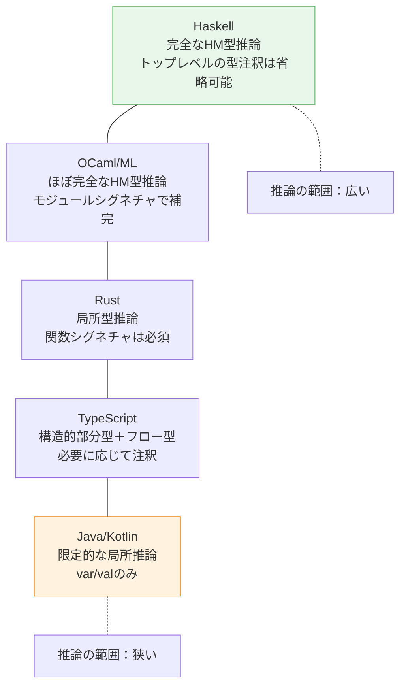
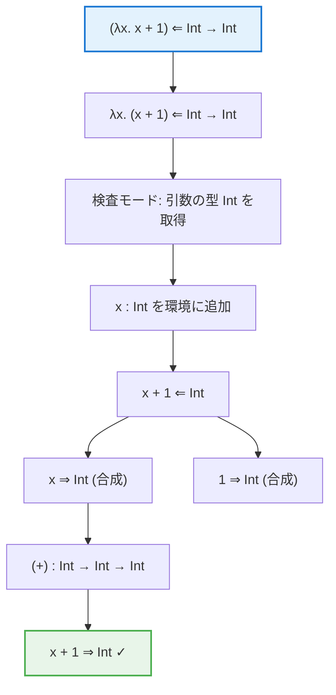

# 型推論 — Hindley-Milner型システムとその発展

## 1. 型推論とは何か

プログラミング言語における**型推論（type inference）**とは、プログラマが明示的に型注釈を記述しなくても、コンパイラが式や変数の型を自動的に決定する機構である。型推論は「静的型付けの安全性」と「動的型付けの簡潔さ」を両立させるための鍵となる技術であり、現代のプログラミング言語設計において不可欠な要素となっている。

たとえば、以下のHaskellコードを考えよう。

```haskell
-- No type annotations needed
double x = x + x
```

この関数 `double` にはどこにも型注釈が書かれていないが、Haskellコンパイラ（GHC）は `(+)` 演算子の型制約から `double :: Num a => a -> a` という型を自動的に導出する。プログラマは型を書く手間を省きつつ、静的型検査のすべての恩恵を享受できる。

::: tip 型推論の本質
型推論の本質は「方程式を解く」ことにある。プログラムの各部分が満たすべき型の制約を収集し、その連立方程式を解くことで、すべての式の型を決定する。この「型の方程式を解く」というアイデアこそが、Hindley-Milner型推論の核心である。
:::

### 1.1 型検査と型推論の違い

型に関するコンパイラの仕事には2つのレベルがある。

**型検査（type checking）**：プログラマが明示的に与えた型注釈が正しいかを検証する。たとえば、「この関数は `Int -> Int` です」と宣言されたものが、本当に整数を受け取って整数を返すかを確認する。

**型推論（type inference）**：型注釈がない（あるいは部分的にしかない）状態で、プログラムの構造から型を自動的に決定する。

$$
\text{型検査}: \quad \Gamma \vdash e : \tau \quad \text{（$\tau$ が既知、判定のみ）}
$$

$$
\text{型推論}: \quad \Gamma \vdash e : \mathord{?} \quad \text{（$\tau$ が未知、算出が必要）}
$$

ここで $\Gamma$ は型環境（変数と型の対応表）、$e$ は式、$\tau$ は型を表す。型検査は $\tau$ が与えられた状態での判定問題であるのに対し、型推論は $\tau$ 自体を求める探索問題である。

### 1.2 型推論が解決する問題

型推論が存在しない世界では、プログラマは2つの選択肢しか持たない。

1. **すべての式に型を明示する**（Java の初期バージョンのように）：安全だが冗長。特にジェネリクスが絡むと型注釈が爆発的に長くなる
2. **型を書かずに動的型付けにする**（Python や Ruby のように）：簡潔だが、型エラーの検出が実行時まで遅延する

型推論は、この二項対立を解消する第三の道を提供する。プログラマは型を書かなくてもよく、しかしコンパイラは完全な型情報を持ち、型安全性を保証する。



## 2. 歴史：Hindley, Milner, Damas

Hindley-Milner型推論（以下 HM）は、一人の研究者が一度に発明したものではない。数十年にわたる複数の研究者の貢献が積み重なって完成した体系である。

### 2.1 Haskell Curry と Combinatory Logic（1950年代）

型推論の源流は、**Haskell Curry** の組合せ論理（Combinatory Logic）にまで遡る。Curry は1950年代に、組合せ子（combinator）に対して型を自動的に割り当てるアイデアを探求していた。彼の研究は、型を明示的に書かずとも論理的に導出できるという直観の形式化の出発点であった。

### 2.2 Roger Hindley の発見（1969年）

**Roger Hindley** は1969年の論文 *"The Principal Type-Scheme of an Object in Combinatory Logic"* において、組合せ論理における**主要型スキーム（principal type scheme）**の存在を証明した。主要型スキームとは、ある項に割り当て可能なすべての型の中で「最も一般的な型」のことである。

Hindley の定理は次のように述べられる：

> 組合せ論理の項 $M$ が型を持つならば、$M$ には一意の主要型スキーム $\sigma$ が存在し、$M$ に割り当て可能な任意の型は $\sigma$ の代入インスタンスである。

この結果は極めて重要である。なぜなら、「最も一般的な型が一意に存在する」ということは、型推論アルゴリズムが決定的に（非決定性なしに）動作できることを意味するからである。

### 2.3 Robin Milner と ML（1978年）

**Robin Milner** は1978年の論文 *"A Theory of Type Polymorphism in Programming"* で、プログラミング言語 **ML**（Meta Language）のための型推論アルゴリズムを提案した。Milner はHindley の結果を独立に再発見し、さらにそれを実用的なプログラミング言語の文脈で定式化した。

Milner の重要な貢献は以下の通りである。

1. **let多相（let-polymorphism）**の導入：`let` 束縛で定義された値に多相型を与える仕組み
2. **Algorithm W** の提案：型推論を効率的に行うアルゴリズム
3. **型健全性（type soundness）**の証明：「well-typedなプログラムは行き詰まらない（stuck しない）」

### 2.4 Luis Damas の形式化（1982年）

**Luis Damas** は Milner の指導のもと、1982年の論文 *"Principal Type-Schemes for Functional Programs"*（Damas & Milner）で、Milner の型システムを完全に形式化した。この論文では以下が厳密に証明された。

- **健全性（Soundness）**：Algorithm W が返す型は正しい
- **完全性（Completeness）**：型を持つすべてのプログラムに対して Algorithm W は停止し、主要型を返す
- **主要型の存在**：推論される型は最も一般的なものである

この形式化を受けて、この型システムは **Damas-Milner 型システム**、あるいはより一般に **Hindley-Milner 型システム**と呼ばれるようになった。



## 3. 単一化（Unification）

型推論の根幹をなすアルゴリズムが**単一化（unification）**である。単一化とは、2つの型式（型の式）を等しくするような**代入（substitution）**を求める操作である。

### 3.1 型の構文

HM型システムで扱う型の構文を定義する。

$$
\tau ::= \alpha \mid T \mid \tau_1 \to \tau_2
$$

- $\alpha, \beta, \gamma, \ldots$：**型変数（type variable）**。未知の型を表す
- $T$：**型定数（type constant）**。`Int`、`Bool`、`String` など
- $\tau_1 \to \tau_2$：**関数型**。$\tau_1$ を受け取り $\tau_2$ を返す関数の型

さらに、型スキーム（type scheme）は量化された型を表す。

$$
\sigma ::= \tau \mid \forall \alpha.\, \sigma
$$

$\forall \alpha.\, \sigma$ は「$\alpha$ は任意の型に置換可能」という意味の多相型を表す。たとえば、恒等関数の型は $\forall \alpha.\, \alpha \to \alpha$ である。

### 3.2 代入（Substitution）

**代入（substitution）**とは、型変数を具体的な型に置き換える写像である。

$$
S : \text{TypeVar} \to \text{Type}
$$

代入 $S$ を型 $\tau$ に適用する操作を $S(\tau)$ と書く。たとえば、$S = [\alpha \mapsto \text{Int}]$ であれば、

$$
S(\alpha \to \beta) = \text{Int} \to \beta
$$

代入の**合成**は $(S_2 \circ S_1)(\tau) = S_2(S_1(\tau))$ で定義される。

### 3.3 単一化アルゴリズム

2つの型 $\tau_1$ と $\tau_2$ の**最汎単一化子（most general unifier, MGU）**とは、$S(\tau_1) = S(\tau_2)$ となる代入 $S$ のうち最も一般的なもの（他のすべての単一化子が $S$ のインスタンスとなるもの）である。

J. A. Robinson が1965年に提案した単一化アルゴリズムを型の文脈に適用すると、以下のようになる。

$$
\text{unify}(\tau_1, \tau_2) = \begin{cases}
[] & \text{if } \tau_1 = \tau_2 \\
[\alpha \mapsto \tau_2] & \text{if } \tau_1 = \alpha \text{ and } \alpha \notin \text{ftv}(\tau_2) \\
[\alpha \mapsto \tau_1] & \text{if } \tau_2 = \alpha \text{ and } \alpha \notin \text{ftv}(\tau_1) \\
\text{unify}(S(\tau_{1b}), S(\tau_{2b})) \circ S & \text{if } \tau_1 = \tau_{1a} \to \tau_{1b},\ \tau_2 = \tau_{2a} \to \tau_{2b} \\
& \quad \text{where } S = \text{unify}(\tau_{1a}, \tau_{2a}) \\
\text{error} & \text{otherwise}
\end{cases}
$$

ここで $\text{ftv}(\tau)$ は型 $\tau$ に含まれる自由型変数の集合であり、$\alpha \notin \text{ftv}(\tau_2)$ は**出現検査（occurs check）**と呼ばれる条件である。

### 3.4 出現検査（Occurs Check）

出現検査は単一化において不可欠な条件である。もし $\alpha$ を $\alpha$ 自身を含む型と単一化しようとすると、無限に入れ子になった型が生成されてしまう。

$$
\alpha \overset{?}{=} \alpha \to \text{Int}
$$

この方程式を満たす有限の型は存在しない。もし出現検査を省略すると、$\alpha = \alpha \to \text{Int} = (\alpha \to \text{Int}) \to \text{Int} = \ldots$ と無限に展開される。

::: warning 出現検査の省略
一部の実装（初期のPrologなど）では性能上の理由で出現検査を省略していたが、これは型安全性を破壊する。現代の型推論実装では出現検査は必須である。
:::

### 3.5 具体例：単一化の実行

以下の例で単一化の動作を追跡する。$\alpha \to \text{Int}$ と $\text{Bool} \to \beta$ を単一化する。

$$
\text{unify}(\alpha \to \text{Int},\ \text{Bool} \to \beta)
$$

1. 両方とも関数型なので、引数部分と戻り値部分をそれぞれ単一化する
2. 引数部分：$\text{unify}(\alpha, \text{Bool}) = [\alpha \mapsto \text{Bool}]$
3. 戻り値部分に代入を適用：$\text{unify}(\text{Int}, \beta) = [\beta \mapsto \text{Int}]$
4. 合成：$[\beta \mapsto \text{Int}] \circ [\alpha \mapsto \text{Bool}] = [\alpha \mapsto \text{Bool},\ \beta \mapsto \text{Int}]$

結果として、$\alpha = \text{Bool}$、$\beta = \text{Int}$ が得られ、両方の型は $\text{Bool} \to \text{Int}$ に統一される。

```haskell
-- Unification algorithm in Haskell (simplified)
data Type = TVar String | TCon String | TFun Type Type

type Subst = [(String, Type)]

unify :: Type -> Type -> Either String Subst
unify (TCon a) (TCon b)
  | a == b    = Right []                         -- same constants
  | otherwise = Left $ "Cannot unify " ++ a ++ " with " ++ b
unify (TVar a) t
  | occursIn a t = Left $ "Infinite type: " ++ a -- occurs check
  | otherwise    = Right [(a, t)]                 -- bind variable
unify t (TVar a) = unify (TVar a) t              -- swap
unify (TFun a1 b1) (TFun a2 b2) = do
  s1 <- unify a1 a2                              -- unify arguments
  s2 <- unify (apply s1 b1) (apply s1 b2)        -- unify results
  Right (compose s2 s1)                           -- compose substitutions
unify t1 t2 = Left $ "Cannot unify " ++ show t1 ++ " with " ++ show t2
```

## 4. Algorithm W

**Algorithm W** は、Damas と Milner が1982年に定式化した型推論アルゴリズムであり、HM型システムの標準的な推論手続きである。Algorithm W はプログラムの構文木を再帰的に走査しながら、単一化を用いて型制約を解く。

### 4.1 型付け規則

Algorithm W が基づく型付け規則を示す。これらの規則は推論規則の形式で、前提（横線の上）が成り立つとき結論（横線の下）が成り立つことを表す。

**変数規則（Var）**：

$$
\frac{x : \sigma \in \Gamma}{\Gamma \vdash x : \sigma}
$$

環境 $\Gamma$ に $x : \sigma$ があれば、$x$ の型は $\sigma$ である。

**適用規則（App）**：

$$
\frac{\Gamma \vdash e_1 : \tau_1 \to \tau_2 \quad \Gamma \vdash e_2 : \tau_1}{\Gamma \vdash e_1\ e_2 : \tau_2}
$$

$e_1$ が関数型 $\tau_1 \to \tau_2$ を持ち、$e_2$ が $\tau_1$ を持つなら、適用 $e_1\ e_2$ の型は $\tau_2$ である。

**抽象規則（Abs）**：

$$
\frac{\Gamma,\, x : \tau_1 \vdash e : \tau_2}{\Gamma \vdash \lambda x.\, e : \tau_1 \to \tau_2}
$$

$x$ に型 $\tau_1$ を仮定して $e$ の型が $\tau_2$ なら、$\lambda x.\, e$ の型は $\tau_1 \to \tau_2$ である。

**let規則（Let）**：

$$
\frac{\Gamma \vdash e_1 : \sigma \quad \Gamma,\, x : \sigma \vdash e_2 : \tau}{\Gamma \vdash \text{let } x = e_1 \text{ in } e_2 : \tau}
$$

$e_1$ の型が $\sigma$（多相型スキーム）であるとき、$e_2$ の中で $x$ は $\sigma$ として扱われる。

**汎化規則（Gen）**：

$$
\frac{\Gamma \vdash e : \tau \quad \alpha \notin \text{ftv}(\Gamma)}{\Gamma \vdash e : \forall \alpha.\, \tau}
$$

型変数 $\alpha$ が環境 $\Gamma$ に自由出現しないなら、$\tau$ 中の $\alpha$ を汎化して $\forall \alpha.\, \tau$ を得られる。

**具体化規則（Inst）**：

$$
\frac{\Gamma \vdash e : \forall \alpha.\, \sigma}{\Gamma \vdash e : [\alpha \mapsto \tau]\sigma}
$$

$\forall \alpha.\, \sigma$ の $\alpha$ を任意の型 $\tau$ で具体化できる。

### 4.2 Algorithm W の手続き

Algorithm W は関数 $W(\Gamma, e)$ として定義され、環境 $\Gamma$ と式 $e$ を受け取り、代入 $S$ と型 $\tau$ の組 $(S, \tau)$ を返す。

```
W(Γ, e) = case e of

  x  (variable):
    if x : σ ∈ Γ then
      τ = instantiate(σ)     -- replace ∀-bound vars with fresh vars
      return ([], τ)

  λx. e₁  (abstraction):
    α = fresh type variable
    (S₁, τ₁) = W(Γ ∪ {x : α}, e₁)
    return (S₁, S₁(α) → τ₁)

  e₁ e₂  (application):
    (S₁, τ₁) = W(Γ, e₁)
    (S₂, τ₂) = W(S₁(Γ), e₂)
    α = fresh type variable
    S₃ = unify(S₂(τ₁), τ₂ → α)
    return (S₃ ∘ S₂ ∘ S₁, S₃(α))

  let x = e₁ in e₂  (let binding):
    (S₁, τ₁) = W(Γ, e₁)
    σ = generalize(S₁(Γ), τ₁)     -- quantify free vars not in Γ
    (S₂, τ₂) = W(S₁(Γ) ∪ {x : σ}, e₂)
    return (S₂ ∘ S₁, τ₂)
```

### 4.3 Algorithm W の実行例

以下の式に Algorithm W を適用してみよう。

```
let id = λx. x in id 42
```



**ステップ 1**：`λx. x` を推論する。

- 新しい型変数 $\alpha_1$ を導入し、$x : \alpha_1$ を環境に追加
- 本体 `x` の型は $\alpha_1$
- $\lambda x.\, x$ の型は $\alpha_1 \to \alpha_1$

**ステップ 2**：`id` を汎化する。

- $\alpha_1$ は環境に自由出現しないので汎化可能
- `id` の型スキームは $\forall \alpha_1.\, \alpha_1 \to \alpha_1$

**ステップ 3**：`id 42` を推論する。

- `id` を具体化：新しい型変数 $\alpha_2$ で $\alpha_2 \to \alpha_2$ を得る
- `42` の型は `Int`
- 単一化：$\text{unify}(\alpha_2 \to \alpha_2,\ \text{Int} \to \alpha_3) = [\alpha_2 \mapsto \text{Int},\ \alpha_3 \mapsto \text{Int}]$
- 結果の型は `Int`

### 4.4 計算量

Algorithm W の時間計算量はほぼ線形であるが、理論上の最悪ケースでは指数的になることが知られている。1990年に Mairson は、HM型推論が DEXPTIME 完全であることを証明した。つまり、特殊なケースでは型の大きさが式の大きさに対して指数的に爆発しうる。

しかし、実際のプログラムにおいてこの最悪ケースが発生することは極めて稀であり、実用上は線形に近い時間で動作する。この「理論上は指数的だが実用上は高速」という性質が、HM型推論が広く採用されている理由の一つである。

## 5. Let多相（Let Polymorphism）

HM型システムの最も重要な設計判断の一つが **let多相（let-polymorphism）**、すなわち `let` 束縛の右辺で定義された値にのみ多相型を許すという制限である。

### 5.1 多相型の必要性

まず、なぜ多相型が必要なのかを確認する。以下のような恒等関数を考えよう。

```haskell
id x = x
```

この `id` は整数にも文字列にもブーリアンにも適用できるべきである。もし `id` が単相型（たとえば `Int -> Int`）しか持てないなら、型ごとに別々の恒等関数を定義する必要がある。これは不合理であり、`id` には「任意の型 $\alpha$ について $\alpha \to \alpha$」という多相型 $\forall \alpha.\, \alpha \to \alpha$ が与えられるべきである。

### 5.2 なぜ lambda 束縛では多相にしないのか

しかし、ラムダ抽象の引数に多相型を許すと、型推論が決定不能になってしまう。これは1985年に Wells が証明した重要な結果である。

> **Wells の定理（1994）**：System F（多相ラムダ計算、すべての位置で多相型が使用可能）における型推論は決定不能である。

具体的には、以下のような式の型推論が問題となる。

```
λf. (f 1, f "hello")
```

この式において `f` は `Int` にも `String` にも適用されている。もし `f` にランク1多相型 $\forall \alpha.\, \alpha \to \alpha$ を与えることが許されるなら、この式には型が付く。しかし、ランク1多相型をラムダ引数にも許すと、型推論が決定不能になる。

### 5.3 let多相の仕組み

HM型システムはこの問題を巧妙に回避する。多相型を許すのは `let` 束縛の右辺だけに制限するのである。

```haskell
-- Polymorphic: id is generalized at let binding
let id = \x -> x
in (id 1, id "hello")  -- OK: id is instantiated differently at each use

-- Monomorphic: f is NOT generalized at lambda binding
(\f -> (f 1, f "hello")) (\x -> x)  -- Type error in HM!
```

この制限の直観的な理由は以下の通りである。

- **`let` 束縛**：右辺が完全に推論された後で汎化を行う。右辺の型が確定してから $\forall$ を付けるので安全
- **$\lambda$ 束縛**：関数本体を推論している最中に引数の型が必要になる。推論途中で汎化するのは不安全



### 5.4 汎化の条件

`let` 束縛で汎化できる型変数にはもう一つ重要な制限がある。環境 $\Gamma$ に自由出現する型変数は汎化できない。

$$
\text{generalize}(\Gamma, \tau) = \forall \bar{\alpha}.\, \tau \quad \text{where } \bar{\alpha} = \text{ftv}(\tau) \setminus \text{ftv}(\Gamma)
$$

これは直観的に理解できる。環境に自由出現する型変数は、外側のスコープで既に何らかの具体的な型と結び付けられている可能性がある。そのような型変数を汎化してしまうと、矛盾が生じる。

```haskell
-- Example: α appears in the environment, so it CANNOT be generalized
\x ->
  let y = x       -- y : α (same as x)
  in (y + 1)      -- forces α = Int

-- Here y is NOT generalized to ∀α.α because α is free in Γ = {x : α}
```

## 6. 制約ベース型推論

Algorithm W はボトムアップ式に構文木を走査しながら即座に単一化を行う「オンライン」方式であるが、制約ベース型推論はより柔軟で拡張性の高いアプローチである。

### 6.1 基本的なアイデア

制約ベース型推論は2つのフェーズに分離される。

1. **制約生成（Constraint Generation）**：構文木を走査し、型が満たすべき等式制約を収集する
2. **制約解決（Constraint Solving）**：収集した制約を単一化によって一括で解く

この分離には大きな利点がある。制約生成は言語の構文に依存するが、制約解決は言語に依存しない汎用的なアルゴリズムで行える。


### 6.2 制約の定義

制約の文法を以下のように定義する。

$$
C ::= \tau_1 = \tau_2 \mid C_1 \land C_2 \mid \exists \alpha.\, C \mid \text{def}\ x : \sigma\ \text{in}\ C
$$

- $\tau_1 = \tau_2$：型の等式制約
- $C_1 \land C_2$：2つの制約の連言（両方を同時に満たす）
- $\exists \alpha.\, C$：型変数 $\alpha$ の存在量化（$\alpha$ は局所的な未知数）
- $\text{def}\ x : \sigma\ \text{in}\ C$：$x$ が型スキーム $\sigma$ を持つ環境での制約

### 6.3 制約生成の例

式 `\f -> \x -> f (f x)` から制約を生成する過程を示す。

```
式: λf. λx. f (f x)

各部分式に新しい型変数を割り当てる:
  f : α₁
  x : α₂
  f x : α₃
  f (f x) : α₄
  λx. f (f x) : α₅
  λf. λx. f (f x) : α₆

生成される制約:
  α₁ = α₂ → α₃        (f x の型: f を x に適用)
  α₁ = α₃ → α₄        (f (f x) の型: f を f x に適用)
  α₅ = α₂ → α₄        (λx. f (f x) の型)
  α₆ = α₁ → α₅        (λf. λx. f (f x) の型)
```

これらの制約を解くと以下の代入が得られる。

$$
\alpha_1 = \alpha_2 \to \alpha_3 \text{ かつ } \alpha_2 \to \alpha_3 = \alpha_3 \to \alpha_4
$$

よって $\alpha_2 = \alpha_3$ かつ $\alpha_3 = \alpha_4$ となり、$\alpha_1 = \alpha_2 \to \alpha_2$ が得られる。最終的な型は：

$$
(\alpha_2 \to \alpha_2) \to \alpha_2 \to \alpha_2
$$

これはまさに「関数を2回適用する」という意味の型である。

### 6.4 制約ベースアプローチの利点

1. **エラーメッセージの改善**：制約を一括で処理するため、矛盾する制約のペアを特定でき、より良いエラーメッセージを生成できる
2. **拡張性**：型クラス、行多相、サブタイピングなどの拡張を制約の種類として追加できる
3. **モジュール性**：制約の生成と解決を独立に開発・最適化できる
4. **並列化**：制約解決の一部を並列に実行できる可能性がある

## 7. 実際の言語における型推論

### 7.1 Haskell — HM型推論の直系の子孫

Haskell は HM型システムを最も忠実に継承した言語である。GHC（Glasgow Haskell Compiler）の型推論は HM を基盤としつつ、多数の拡張を備えている。

```haskell
-- HM-style inference: no annotations needed
map :: (a -> b) -> [a] -> [b]    -- inferred if omitted
map _ []     = []
map f (x:xs) = f x : map f xs

-- Type class constraints are also inferred
add x y = x + y
-- Inferred: add :: Num a => a -> a -> a

-- Let-polymorphism in action
example = let id = \x -> x
          in (id True, id 42)
-- id is polymorphic: used as Bool -> Bool and Int -> Int
```

GHC の型推論は以下の拡張をサポートする。

- **型クラス（type classes）**：制約付き多相型 `Num a => a -> a`
- **高カインド多相（higher-kinded polymorphism）**：`Functor f => f a -> f b` のような型変数 `f` は型構成子
- **GADTs（Generalized Algebraic Data Types）**：パターンマッチで型の等式が得られる
- **型族（type families）**：型レベルの関数
- **ランクN多相（RankNTypes）**：`(∀a. a -> a) -> Int` のような高ランク型

::: warning Haskellの型推論の限界
GADTs やランクN多相、型族を使用する場合、HM の完全な型推論は保証されない。これらの拡張では部分的に型注釈が必要になることがある。GHC の型推論は「できる限り推論するが、困ったら型注釈を要求する」という現実的な戦略をとっている。
:::

### 7.2 TypeScript — 構造的部分型と型推論の融合

TypeScript の型推論は HM とは大きく異なるアプローチを採用している。TypeScript は**構造的部分型付け（structural subtyping）**を持つため、単純な単一化だけでは型推論を行えない。

```typescript
// Local type inference: type flows from initializer
let x = 42;           // x: number
let y = "hello";      // y: string
let z = [1, 2, 3];    // z: number[]

// Contextual typing: type flows from context to expression
const handler: (e: MouseEvent) => void = (e) => {
  // e is inferred as MouseEvent from the context
  console.log(e.clientX);
};

// Generic function inference
function identity<T>(x: T): T { return x; }
const result = identity(42);  // T inferred as number

// Control flow narrowing
function process(x: string | number) {
  if (typeof x === "string") {
    // x is narrowed to string here
    console.log(x.toUpperCase());
  } else {
    // x is narrowed to number here
    console.log(x.toFixed(2));
  }
}
```

TypeScript の型推論の特徴は以下の通りである。

1. **フロー型（flow typing）**：制御フロー解析に基づいて型を絞り込む
2. **文脈型（contextual typing）**：式の期待される型から逆方向に型を伝播する（双方向型検査に近い）
3. **ワイドニング（widening）**：リテラル型を基本型に拡張する規則
4. **ベストコモンタイプ**：複数の候補型から最適な共通型を選択する

TypeScript は完全な型推論を目指していない。その代わり、「プログラマにとって自然に感じられる推論」を優先し、必要に応じて型注釈を要求する実用的な設計となっている。

### 7.3 Rust — 局所型推論とトレイト制約

Rust の型推論は**局所型推論（local type inference）**に基づいている。関数のシグネチャには型注釈が必須だが、関数本体内では型推論が働く。

```rust
// Function signature: type annotations required
fn map_vec<T, U>(v: &[T], f: impl Fn(&T) -> U) -> Vec<U> {
    v.iter().map(f).collect()
}

// Inside function body: type inference works
fn example() {
    let x = 42;                    // x: i32 (default integer type)
    let y = 3.14;                  // y: f64 (default float type)
    let v: Vec<_> = (0..10).collect();  // _ is inferred as i32

    // Trait-based inference
    let s: String = "hello".into();    // From<&str> for String

    // Turbofish syntax for explicit type parameters
    let parsed = "42".parse::<i32>().unwrap();
}
```

Rust の型推論の特徴は以下の通りである。

1. **関数境界での型注釈必須**：モジュール間の型推論を防ぎ、コンパイル速度とエラーメッセージの質を確保する
2. **ライフタイム推論（lifetime elision）**：多くの場合、ライフタイムパラメータは省略可能
3. **トレイト解決（trait resolution）**：トレイト制約を考慮した型推論
4. **整数・浮動小数点のデフォルト型**：型が決まらない整数リテラルは `i32`、浮動小数点は `f64` にデフォルト



### 7.4 言語間の比較

| 特徴 | Haskell | OCaml | Rust | TypeScript | Java |
|------|---------|-------|------|------------|------|
| 推論の基盤 | HM + 拡張 | HM | 局所型推論 | フロー型 + 文脈型 | 限定的な局所推論 |
| トップレベル注釈 | 省略可能 | 省略可能 | 必須 | 関数パラメータは必須 | 必須 |
| 多相型 | パラメトリック | パラメトリック | パラメトリック | 構造的部分型 | パラメトリック（消去型） |
| 型クラス/トレイト | 型クラス | なし（モジュールで代替） | トレイト | なし（構造的部分型） | インターフェース |
| 完全性 | ほぼ完全（拡張で一部不完全） | 完全 | 局所的に完全 | 不完全（設計上） | 推論なし（Java 10以降 `var` あり） |

## 8. 型推論の限界

### 8.1 理論的な限界

型推論には理論的に超えられない壁が存在する。

**System F における型推論の決定不能性**：Wells（1994）は、System F（Girard の多相ラムダ計算、Reynoldsが独立に発見）における型推論と型検査がともに決定不能であることを証明した。System F はHM型システムよりも表現力が高く、任意の位置で多相型を使える。この結果は、「表現力を上げすぎると型推論が失われる」というトレードオフを明確に示している。

$$
\text{HM}\ (\text{決定可能}) \subset \text{System F}\ (\text{決定不能})
$$

**サブタイピングと型推論の相性の悪さ**：サブタイピング（部分型関係）を持つ型システムでは、型推論が著しく困難になる。単一化の代わりに**制約充足**が必要になり、最も一般的な型が存在しない場合がある。

**高ランク多相の困難さ**：ランク2以上の多相型（関数の引数として多相型を要求する型）の推論は困難であり、ランク3以上では決定不能となる。


### 8.2 実用上の限界

理論的な限界に加えて、実用的な問題も存在する。

**エラーメッセージの難しさ**：型推論エラーが発生したとき、エラーの報告箇所と実際の原因箇所が乖離することがある。単一化は制約の矛盾を検出するが、「どちらの制約が間違っているか」を判断するのは本質的に困難である。

```haskell
-- Where is the error?
f x = if x then x + 1 else x
-- GHC reports: "Couldn't match expected type 'Bool' with actual type 'Int'"
-- The real question: did the programmer mean Bool or Int?
```

**型が複雑になりすぎる問題**：型推論の結果、非常に長く複雑な型が推論されることがある。特にジェネリクスやモナドトランスフォーマーを多用するHaskellコードでは、推論される型が人間の理解を超える長さになることがある。

**推論の予測困難性**：プログラマにとって、型推論がどのように動作するかを予測するのが難しい場合がある。特に、オーバーロード、型クラス、暗黙の型変換が絡むと、推論結果が直観に反することがある。

**コンパイル時間への影響**：型推論は（理論上）指数的な計算量を持つ。大規模なプロジェクトでは型推論がコンパイル時間のボトルネックになることがあり、これがRustなどが関数シグネチャに型注釈を必須とする理由の一つである。

### 8.3 単相性制限（Monomorphism Restriction）

Haskellには**単相性制限（monomorphism restriction）**という特殊なルールがある。これは、引数を持たないトップレベル束縛において、型クラス制約のある型を汎化しないという規則である。

```haskell
-- With monomorphism restriction:
x = 5  -- x :: Integer (not x :: Num a => a)

-- Without monomorphism restriction (NoMonomorphismRestriction):
x = 5  -- x :: Num a => a
```

この制限が存在する理由は性能にある。もし `x` が多相型 `Num a => a` を持つなら、`x` が参照されるたびに辞書引き（型クラスのメソッド解決）が発生し、計算が共有されない。単相性制限はこの問題を防ぐが、初心者にとって混乱の原因となることが多く、GHCi（対話環境）ではデフォルトで無効化されている。

## 9. 高度な型推論

HM型推論を超える発展的な型推論手法を概観する。

### 9.1 局所型推論（Local Type Inference）

**局所型推論（local type inference）**は Pierce と Turner が2000年に提案した手法であり、「完全な推論を目指さず、局所的な情報から推論可能な範囲だけを推論する」というアプローチである。

局所型推論の基本原則は以下の2つである。

1. **型引数の合成（Type argument synthesis）**：関数の実引数の型から型パラメータを推論する
2. **局所的な型伝播（Local type propagation）**：宣言された型注釈の情報を局所的に伝播する

この手法は、サブタイピングを持つ言語（Scala、Kotlin、Rust など）で広く採用されている。完全な型推論が不可能な言語でも、プログラマの負担を大幅に軽減できるためである。

```scala
// Scala: local type inference in action
val xs: List[Int] = List(1, 2, 3)
val ys = xs.map(x => x * 2)  // x: Int is inferred from xs
// No need to write xs.map((x: Int) => x * 2)

// But some cases require annotation
def foo[A](x: A): A = x
val result = foo(42)  // A = Int, inferred from argument
```

### 9.2 双方向型検査（Bidirectional Type Checking）

**双方向型検査（bidirectional type checking）**は、型情報を「上から下」と「下から上」の両方向に流す手法である。Dunfield と Krishnaswami（2013, 2021）によって体系化された。

双方向型検査では、型付け判定を2つのモードに分割する。

$$
\Gamma \vdash e \Rightarrow \tau \quad \text{（合成: synthesis）— 式 $e$ から型 $\tau$ を合成する}
$$

$$
\Gamma \vdash e \Leftarrow \tau \quad \text{（検査: checking）— 式 $e$ が型 $\tau$ を持つか検査する}
$$

**合成モード（synthesis）**は式から型を導出する（ボトムアップ）。**検査モード（checking）**は期待される型を式に照合する（トップダウン）。

```
合成規則:
  x : τ ∈ Γ
  ─────────────── Var⇒
  Γ ⊢ x ⇒ τ

  Γ ⊢ e₁ ⇒ τ₁ → τ₂    Γ ⊢ e₂ ⇐ τ₁
  ─────────────────────────────────── App⇒
  Γ ⊢ e₁ e₂ ⇒ τ₂

  Γ ⊢ e ⇒ τ    (e : τ) is a type annotation
  ─────────────── Anno⇒
  Γ ⊢ (e : τ) ⇒ τ

検査規則:
  Γ, x : τ₁ ⊢ e ⇐ τ₂
  ─────────────────────── Abs⇐
  Γ ⊢ λx. e ⇐ τ₁ → τ₂

  Γ ⊢ e ⇒ τ'    τ' = τ
  ─────────────────────── Sub⇐
  Γ ⊢ e ⇐ τ
```

双方向型検査の利点は以下の通りである。

1. **最小限の型注釈で高度な型機能をサポート**：ランクN多相、GADTs、存在型など
2. **実装の単純さ**：検査モードと合成モードの切り替えは直観的
3. **優れたエラーメッセージ**：期待型と実際の型の不一致を明確に報告可能
4. **サブタイピングとの相性**：検査モードでサブタイピングを自然に扱える



### 9.3 OutsideIn(X) — GHCの型推論戦略

GHC（Glasgow Haskell Compiler）の現代的な型推論エンジンは **OutsideIn(X)** と呼ばれるフレームワークに基づいている（Vytiniotis, Peyton Jones, Schrijvers, Sulzmann, 2011）。

OutsideIn(X) の「X」は制約の種類をパラメータ化することを意味する。型クラス制約、型の等式、型族の制約など、さまざまな種類の制約を統一的に扱えるフレームワークである。

基本的な戦略は以下の通りである。

1. **外から内へ（Outside-In）**：型注釈やシグネチャの情報を外側のスコープから内側へ伝播させる
2. **制約の収集**：各式から制約を生成する
3. **制約の簡約**：型クラスのインスタンス解決や型族の正規化を行う
4. **残余制約の報告**：解決できない制約をエラーとして報告する

このアプローチにより、GHC は型クラス、GADT、型族、ランクN多相といった高度な型機能を組み合わせた場合でも、合理的な型推論を行える。

### 9.4 完全性と実用性のトレードオフ

型推論の発展の歴史は、**完全性（推論アルゴリズムが必ず最も一般的な型を見つける）**と**表現力（型システムが表現できる性質の豊かさ）**のトレードオフの歴史でもある。

| 型システム | 完全な推論 | 表現力 | 代表的な言語 |
|-----------|----------|--------|------------|
| 単純型付きλ計算 | 可能 | 低い | — |
| HM型システム | 可能 | 中程度（ランク1多相） | Haskell, OCaml, ML |
| HM + 型クラス | ほぼ可能 | 高い | Haskell |
| 局所型推論 | 部分的 | 高い（サブタイピング含む） | Scala, Kotlin, Rust |
| 双方向型検査 | 部分的 | 非常に高い | Agda, Idris |
| System F | 不可能 | 非常に高い | — |
| 依存型 | 不可能（型検査自体が困難） | 最大 | Coq, Lean |

現代の言語設計では、完全な型推論を追求するのではなく、「プログラマにとって自然な場所で型注釈を要求し、それ以外を推論する」という実用的なアプローチが主流となっている。

## 10. まとめ

型推論は、プログラミング言語の理論と実践を橋渡しする技術である。Hindley-Milner型推論は「完全な型推論が可能な最も表現力の高い型システム」として、理論的にも実用的にも極めて重要な位置を占めている。

その核心技術である**単一化**は、型の方程式を解くという明快なアルゴリズムであり、**Algorithm W** はその単一化を用いて構文木からボトムアップに型を推論する手続きである。**let多相**は、完全な型推論を維持しつつ多相性を提供するための巧妙な設計判断であった。

しかし、現実のプログラミング言語はHMの枠を超えて進化している。サブタイピング、高ランク多相、依存型、型クラス、GADTs といった拡張は、いずれもHMの完全性を（部分的に）犠牲にする。その代償として得られるのは、より豊かな型の表現力である。

**局所型推論**と**双方向型検査**は、この「完全性 vs 表現力」のトレードオフに対する現代的な回答である。完全な推論を目指すのではなく、「プログラマが少しの型注釈を書くだけで、高度な型機能を利用できる」という実用的な均衡点を追求している。

型推論の研究は今なお活発に続いている。代数的効果（algebraic effects）の型推論、線形型の推論、量子計算の型システム、型レベルプログラミングの推論など、新しい課題が次々と現れている。Hindley と Milner が築いた基礎の上に、型推論の技術は今後も発展し続けるだろう。
