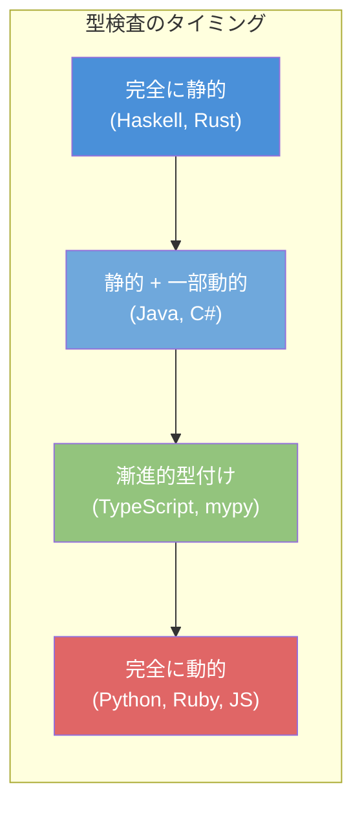
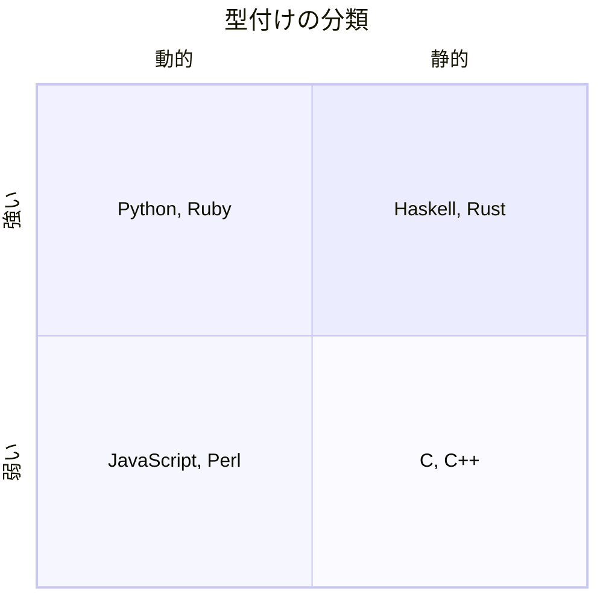
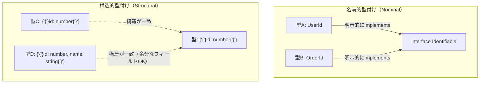
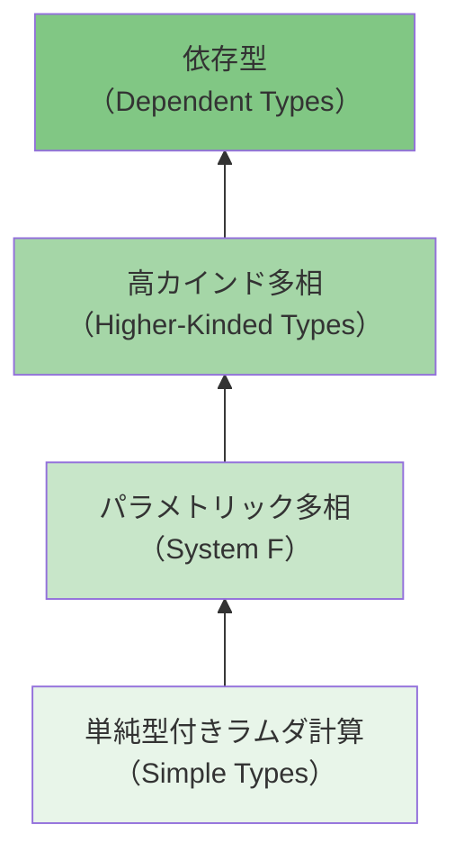
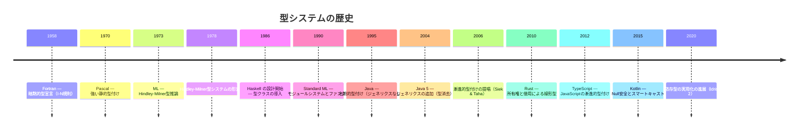

# 型システム入門 — 静的型付けと動的型付け

## 1. はじめに：なぜ型が存在するのか

プログラムは本質的にはビット列の操作に過ぎない。メモリ上の `0x41` という1バイトのデータは、文字 `'A'`（ASCII）として解釈することも、整数 `65` として解釈することも、浮動小数点数の一部として解釈することもできる。コンピュータのハードウェアはビット列にどのような「意味」が込められているのかを知らない。

**型（type）** とは、このビット列に意味を与える仕組みである。型は「この値に対してどのような操作が許されるのか」を規定し、意味のない操作（文字列と整数の乗算など）を防止する。型システムは、プログラムが実行時に「型エラー」を引き起こさないことを何らかの方法で保証しようとする機構であり、プログラミング言語の設計において最も基本的かつ重要な構成要素の一つである。

型システムの存在意義は大きく3つに集約される。

1. **安全性（Safety）**：不正な操作を事前に防ぐ。整数にメソッド呼び出しをしたり、文字列をポインタとして参照したりといった操作を検出・禁止する
2. **抽象化（Abstraction）**：複雑なデータ構造や操作をインターフェースとして隠蔽し、プログラムの構造化を支援する
3. **文書化（Documentation）**：型注釈はプログラマにとって実行可能な仕様書となり、コードの意図を明確に伝える

::: tip 型システムの古典的定義
Benjamin C. Pierce は著書 *Types and Programming Languages*（通称TAPL）で型システムを次のように定義している：「型システムとは、プログラムの各部分が計算する値の種類を分類することによって、特定のプログラムの振る舞いが起こらないことを証明する、構文的に扱いやすい手法である」。ここで重要なのは「特定の振る舞いが起こらない」という否定的な性質を保証するという点である。
:::

## 2. 型安全性とは何か

**型安全性（type safety）** とは、型システムが保証する性質のうち最も根本的なものである。直感的にいえば、「well-typedなプログラムは実行時に型エラーを起こさない」ということを意味する。ただし「型エラー」の定義は言語によって異なるため、形式的には後述する型健全性（type soundness）の概念で精密に定義される。

型安全性が保証されない典型的な例を見てみよう。C言語ではポインタキャストを通じて任意のメモリ領域を任意の型として解釈できる。

```c
// Treating an integer as a pointer — undefined behavior
int n = 42;
char *p = (char *)n;
printf("%c\n", *p);  // segmentation fault or garbage
```

この例では、整数値 `42` をポインタとして解釈しようとしている。Cの型システムはこのような操作を（警告は出すが）許容してしまう。結果としてメモリの不正アクセスが発生し、セグメンテーションフォルトやメモリ破壊といった未定義動作を引き起こす。

一方、型安全な言語ではこのような操作はコンパイル時または実行時に拒否される。

## 3. 静的型付けと動的型付け

型システムの最も基本的な分類軸は、**型検査がいつ行われるか**である。

### 3.1 静的型付け（Static Typing）

**静的型付け**とは、プログラムの実行前（コンパイル時）に型検査を行う方式である。すべての式や変数に対して、プログラムを実行することなく型が決定される。

```typescript
// TypeScript — static type checking
function add(a: number, b: number): number {
  return a + b;
}

add(1, "hello"); // Compile error: Argument of type 'string' is not assignable to parameter of type 'number'
```

静的型付け言語の代表例としては、Java、C、C++、Rust、Go、Haskell、TypeScript、Kotlin、Swiftなどがある。

**メリット**：
- バグの早期発見（コンパイル時にクラス全体の誤りを排除）
- IDEによる強力な補完・リファクタリング支援
- コンパイラによる最適化の余地が大きい（型情報に基づいた最適化）
- 大規模コードベースでの保守性

**デメリット**：
- 型注釈の記述コスト（型推論によって軽減される場合もある）
- 型システムの表現力の限界による制約
- コンパイル時間の増大

### 3.2 動的型付け（Dynamic Typing）

**動的型付け**とは、型検査をプログラムの実行時（ランタイム）に行う方式である。変数には型がなく、値に型が付随する。

```python
# Python — dynamic type checking
def add(a, b):
    return a + b

add(1, 2)       # => 3
add("foo", "bar")  # => "foobar"
add(1, "hello")    # TypeError at runtime
```

動的型付け言語の代表例としては、Python、Ruby、JavaScript、Lua、Perl、Elixir、Clojureなどがある。

**メリット**：
- コードの簡潔さと柔軟性
- プロトタイピングの速さ
- ダックタイピングによる多相性の自然な実現
- メタプログラミングの容易さ

**デメリット**：
- 型エラーが本番環境でのみ発覚するリスク
- IDEの支援（補完・リファクタリング）が限定的
- 実行時の型検査によるパフォーマンスオーバーヘッド
- 大規模コードベースでの保守が困難

### 3.3 分類の本質

ここで重要なのは、静的型付けと動的型付けは**二項対立ではない**ということである。多くの静的型付け言語にも実行時の型検査が存在し（Javaのダウンキャスト、Rustの `Any` トレイトなど）、動的型付け言語にも静的解析ツールが提供されている（Python の mypy、Ruby の Sorbet など）。



この連続的なスペクトラムの中で、各言語は独自のバランスを取っている。

## 4. 型健全性（Type Soundness）

型システムの正しさを形式的に論じるためには、**型健全性（type soundness）**の概念が不可欠である。型健全性は「well-typedなプログラムは行き詰まらない（stuck にならない）」という性質を意味し、以下の2つの定理の組み合わせとして証明される。

### 4.1 進行定理（Progress Theorem）

> well-typedな閉じた項（closed term）は、値であるか、さもなくば評価を1ステップ進めることができる。

直感的にいえば、正しく型が付いたプログラムは「何もできない状態」に陥ることがないということである。実行が停止するのは、最終的な値に到達した場合のみである。

形式的には、項 $t$ に対して $\vdash t : T$（$t$ が型 $T$ を持つ）が成り立つならば、$t$ は値であるか、ある項 $t'$ が存在して $t \rightarrow t'$ が成り立つ。

### 4.2 保存定理（Preservation Theorem / Subject Reduction）

> well-typedな項を1ステップ評価した結果も、同じ型を持つ。

つまり、型は計算のステップを通じて保存される。

形式的には、$\vdash t : T$ かつ $t \rightarrow t'$ ならば $\vdash t' : T$ が成り立つ。

### 4.3 型健全性の帰結

進行定理と保存定理を組み合わせることで、次の結論が得られる：

$$
\text{Progress} + \text{Preservation} = \text{Type Soundness}
$$

well-typedなプログラムの実行中、どのステップにおいても型が保存され、かつ常に次のステップに進めるか値に到達しているかのどちらかである。つまり、**型エラーによる行き詰まり（stuck state）が発生しない**ことが保証される。

::: warning 型健全性の限界
型健全性は「型エラーが起きない」ことを保証するが、「プログラムが正しい」ことを保証するわけではない。無限ループ、論理的な誤り、リソースリーク、レースコンディションなどは型健全性の射程外である。型システムは特定のクラスの誤りを排除するものであり、万能ではない。
:::

### 4.4 型健全性を持たない言語

すべての言語が型健全性を持つわけではない。以下はその代表例である：

- **C / C++**：ポインタの算術演算、`void*` からのキャスト、バッファオーバーフローなどを通じて型安全性が容易に破壊される。型システムに穴（hole）がある
- **Java**（部分的）：配列の共変性（covariance）により、型健全性が破れるケースがある

```java
// Java's array covariance — type hole
Object[] objs = new String[3];
objs[0] = 42; // Compiles! But throws ArrayStoreException at runtime
```

Javaの配列は共変（covariant）であるため、`String[]` を `Object[]` として扱える。しかし、`Object[]` に対して `Integer` を格納しようとすると、実行時に `ArrayStoreException` が発生する。これは型システムの穴であり、コンパイル時に検出できないエラーの一例である。

## 5. 強い型付けと弱い型付け

静的/動的とは独立したもう一つの分類軸として、**強い型付け（strong typing）** と **弱い型付け（weak typing）** がある。ただし、この概念は厳密な定義が存在せず、コミュニティによって意味が異なることがある。

### 5.1 一般的な解釈

一般に、**強い型付け**とは暗黙的な型変換（implicit coercion）をほとんど行わない言語を指し、**弱い型付け**とは暗黙的な型変換を積極的に行う言語を指す。

```javascript
// JavaScript — weak typing (implicit coercion)
"5" - 3    // => 2 (string "5" coerced to number)
"5" + 3    // => "53" (number 3 coerced to string)
true + 1   // => 2 (true coerced to 1)
[] + {}    // => "[object Object]"
```

JavaScriptでは、異なる型の値同士の演算において、言語が暗黙的に型変換を行う。この挙動は「便利」とも「危険」とも評価されうるが、予測困難な結果をもたらすことが少なくない。

一方、Pythonは動的型付けだが、比較的強い型付けを持つ。

```python
# Python — strong dynamic typing (no implicit coercion)
"5" + 3   # TypeError: can only concatenate str (not "int") to str
"5" * 3   # => "555" (repetition, not coercion — this is by design)
```

### 5.2 分類の整理

静的/動的と強い/弱いは独立した軸であるため、4象限に分類できる。



| | 強い型付け | 弱い型付け |
|---|---|---|
| **静的型付け** | Haskell, Rust, Java, Kotlin | C, C++ |
| **動的型付け** | Python, Ruby, Elixir | JavaScript, Perl, PHP（旧バージョン） |

::: details なぜ「強い/弱い」の定義は曖昧なのか
「強い型付け」「弱い型付け」は学術的に厳密に定義された用語ではない。たとえば、Javaは整数から浮動小数点数への暗黙的な拡大変換（widening conversion）を行う。これを「弱い」と見なすかどうかは観点次第である。同様に、Pythonが `"5" * 3` で文字列の繰り返しを行うことを暗黙的な型変換と見なすかどうかも議論がある。このため、学術的な文脈ではこれらの用語の使用は避けられ、代わりに「型安全性」や「型健全性」といったより精密な概念が用いられる。
:::

## 6. 構造的型付け（Structural Typing）vs 名前的型付け（Nominal Typing）

型の**互換性**をどのように判定するかにも、大きく2つのアプローチがある。

### 6.1 名前的型付け（Nominal Typing）

**名前的型付け**では、型の互換性は型の**名前**（または明示的な継承関係）によって決定される。2つの型が同じ構造を持っていても、名前が異なれば別の型として扱われる。

```java
// Java — nominal typing
class Dog {
    String name;
    void speak() { System.out.println("Woof"); }
}

class Cat {
    String name;
    void speak() { System.out.println("Meow"); }
}

// Dog and Cat have the same structure but are incompatible types
Dog d = new Cat(); // Compile error: incompatible types
```

名前的型付けの代表例は Java、C#、C++、Rust、Swift、Kotlin などである。

**メリット**：
- 意図の明示性：同じ構造でも異なる意味を持つ型を区別できる（例：`UserId` と `OrderId` がどちらも `int` のラッパーでも別の型）
- 型の階層関係が明確

**デメリット**：
- 型の互換性を持たせるために明示的な継承やインターフェース実装が必要
- 外部ライブラリの型に対して後からインターフェースを追加できない場合がある

### 6.2 構造的型付け（Structural Typing）

**構造的型付け**では、型の互換性は型の**構造**（持っているプロパティやメソッドのシグネチャ）によって決定される。名前は関係なく、必要な構造さえ備えていれば互換性がある。

```typescript
// TypeScript — structural typing
interface HasName {
  name: string;
}

interface Dog {
  name: string;
  breed: string;
}

function greet(entity: HasName): string {
  return `Hello, ${entity.name}!`;
}

const dog: Dog = { name: "Rex", breed: "Labrador" };
greet(dog); // OK — Dog has a 'name' property of type string
```

TypeScriptでは、`Dog` が `HasName` を明示的に実装（`implements`）していなくても、`name: string` というプロパティを持つため、`HasName` が期待される場所に渡すことができる。

構造的型付けの代表例は TypeScript、Go（インターフェースのみ）、OCaml（オブジェクト型）、Elm などである。



### 6.3 Goの独特な立ち位置

Goは興味深いハイブリッドアプローチを取っている。**具体型（concrete type）は名前的**であり、**インターフェースは構造的**である。

```go
// Go — structural interface satisfaction
type Reader interface {
    Read(p []byte) (n int, err error)
}

type MyFile struct{}

// MyFile satisfies Reader without explicit declaration
func (f *MyFile) Read(p []byte) (n int, err error) {
    // ...
    return 0, nil
}

// This works because MyFile has the required Read method
var r Reader = &MyFile{}
```

`MyFile` は `Reader` インターフェースを明示的に実装する宣言をしていないが、`Read` メソッドのシグネチャが一致するため、`Reader` として扱える。この設計は「事後的なインターフェースの適合」を可能にし、パッケージ間の結合度を下げる効果がある。

### 6.4 ダックタイピング（Duck Typing）

動的型付け言語における構造的型付けの対応概念が**ダックタイピング**である。「もしそれがアヒルのように歩き、アヒルのように鳴くなら、それはアヒルである」という格言に由来する。

```python
# Python — duck typing
class Duck:
    def quack(self):
        return "Quack!"

class Person:
    def quack(self):
        return "I'm quacking like a duck!"

def make_it_quack(thing):
    return thing.quack()  # Works with any object that has a quack() method

make_it_quack(Duck())    # => "Quack!"
make_it_quack(Person())  # => "I'm quacking like a duck!"
```

ダックタイピングは構造的型付けの動的版と見なすことができるが、構造的型付けがコンパイル時に型チェックを行うのに対して、ダックタイピングは実行時にメソッドの存在を確認する点が異なる。

## 7. 漸進的型付け（Gradual Typing）

### 7.1 動機と概念

**漸進的型付け（gradual typing）**は、静的型付けと動的型付けの橋渡しを行うアプローチであり、2006年にJeremy Siekとalaka Taha によって提唱された。その核心的なアイデアは、**同一のプログラム内で型付きのコードと型なしのコードを混在させる**ことを許容し、両者の境界で整合性を保証することである。

漸進的型付けの背景には実務的な要請がある。大規模な動的型付け言語のコードベースに対して、一度にすべてを静的型付けに移行することは現実的ではない。漸進的型付けは「少しずつ型を追加していく」というマイグレーション戦略を可能にする。

### 7.2 TypeScript：漸進的型付けの代表例

TypeScriptはJavaScriptに対する漸進的型付けの最も成功した実装の一つである。

```typescript
// Gradual typing in TypeScript
function processData(data: any): string {
  // 'any' opts out of type checking — dynamic territory
  return data.toString();
}

function processDataSafe(data: unknown): string {
  // 'unknown' requires type narrowing — static territory
  if (typeof data === "string") {
    return data.toUpperCase();
  }
  if (typeof data === "number") {
    return data.toFixed(2);
  }
  return String(data);
}
```

TypeScriptにおいて `any` 型は「型検査を放棄する」ことを意味する。`any` 型の値に対してはあらゆる操作が許容され、型エラーが発生しない。一方、`unknown` 型は「何が入っているかわからない」ことを表現しつつ、使用前に型の絞り込み（type narrowing）を強制する。

::: tip strictモードの重要性
TypeScriptの `tsconfig.json` で `"strict": true` を設定すると、`noImplicitAny` をはじめとする厳格な型検査が有効になる。漸進的型付けの利点を最大限に活かすためには、新規プロジェクトでは常にstrictモードを有効にすることが推奨される。
:::

### 7.3 Pythonのmypy

Pythonもまた漸進的型付けの重要な実装例である。Python 3.5以降、型ヒント（type hints）が言語仕様に組み込まれ、mypyをはじめとする外部ツールで静的型検査を行える。

```python
# Python with type hints (PEP 484)
def greeting(name: str) -> str:
    return "Hello " + name

# Without type hints — mypy treats as dynamically typed
def legacy_function(data):
    return data.process()

# Reveal type for debugging
x: list[int] = [1, 2, 3]
reveal_type(x)  # mypy output: list[int]
```

Pythonの型ヒントは実行時に一切影響を与えない。あくまで外部ツール（mypy、pyright、pytype）による静的解析のための情報であり、Pythonインタプリタ自体は型ヒントを無視する。これは TypeScript が型情報をコンパイル時に消去する（type erasure）のと同様の設計思想である。

### 7.4 漸進的型付けの形式的基盤

漸進的型付けでは、特殊な型 `?`（dynamic type、あるいは `any`）を導入し、任意の型と互換性を持たせる。これを**一貫性（consistency）**関係と呼ぶ。

$$
\frac{}{\texttt{?} \sim T} \quad \frac{}{T \sim \texttt{?}}
$$

すなわち、`?` 型はどんな型 $T$ とも一貫性を持つ。この関係は反射的であるが、推移的ではない。推移性を持たないことが重要であり、もし推移的であれば `Int ~ ? ~ String` から `Int ~ String` が導かれ、型検査が無意味になってしまう。

漸進的に型付けされたプログラムの型付きの部分と型なしの部分の境界には、暗黙的に**ランタイムキャスト**が挿入される。このキャストが失敗した場合、実行時に型エラーが発生する。これは「blame」と呼ばれる概念で形式的に追跡される。

## 8. 型システムの表現力と安全性のトレードオフ

### 8.1 型システムの階層

型システムの表現力にはさまざまなレベルがある。表現力が高いほど多くの性質をコンパイル時に検査できるが、型注釈の複雑さや型検査の計算コストも増大する。



| レベル | 代表的な言語 | 検査できる性質の例 |
|---|---|---|
| 単純型 | C, Go | 基本的な型の不一致 |
| パラメトリック多相 | Java, C#, Rust | 型安全な汎用コンテナ |
| 高カインド多相 | Haskell, Scala | 型コンストラクタの抽象化（Monad等） |
| 依存型 | Idris, Agda, Coq | 配列の長さ、数値の範囲の制約 |

### 8.2 具体例：リストの長さの型レベル保証

通常の型システムでは、リストの `head` 関数（先頭要素の取得）は空リストに対して呼ばれるとランタイムエラーになる。依存型を用いれば、リストが空でないことを型レベルで保証できる。

```haskell
-- Haskell with GADTs (approximating dependent types)
{-# LANGUAGE GADTs, DataKinds, KindSignatures #-}

data Nat = Zero | Succ Nat

data Vec :: Nat -> * -> * where
  VNil  :: Vec 'Zero a
  VCons :: a -> Vec n a -> Vec ('Succ n) a

-- head is total — only accepts non-empty vectors
vhead :: Vec ('Succ n) a -> a
vhead (VCons x _) = x

-- This is a compile error:
-- vhead VNil
```

この例では、`Vec` 型がその長さを型パラメータとして持っている。`vhead` 関数は `Vec ('Succ n) a`（長さが1以上のベクトル）のみを受け付けるため、空のベクトルに対して `vhead` を呼ぶことはコンパイル時に拒否される。

### 8.3 決定不能性とのバランス

型システムの表現力を上げすぎると、型検査が**決定不能（undecidable）**になりうる。実際、十分に強力な型システムは停止問題と同等の計算能力を持ち、型検査自体が停止しない可能性がある。

この事実は、型システムの設計における根本的なトレードオフを示している。

$$
\text{型システムの表現力} \uparrow \iff \text{型検査の複雑さ} \uparrow
$$

実用的な言語の型システムは、以下の3つの性質のバランスを取る必要がある：

1. **表現力**：プログラマが書きたいプログラムを書けるか
2. **安全性**：どれだけ多くのエラーをコンパイル時に検出できるか
3. **決定可能性と効率**：型検査が実用的な時間で完了するか

::: warning TypeScriptの型システムはチューリング完全
TypeScriptの型システムはチューリング完全であることが知られており、理論的には型検査が停止しない場合がある。実際に、TypeScriptの型レベルでフィボナッチ数列の計算やBrainfuckインタプリタを実装することができる。これは設計者が意図的に表現力を優先した結果であり、実用上は再帰の深さに制限を設けることで対処している。
:::

## 9. 各言語の型システム比較

### 9.1 型システムの特性比較

主要な言語の型システムの特性を比較する。

| 言語 | 静的/動的 | 強い/弱い | 名前的/構造的 | 型推論 | Null安全 | 代数的データ型 |
|---|---|---|---|---|---|---|
| Haskell | 静的 | 強い | 名前的（+型クラス） | 完全（HM） | 安全（Maybe） | あり |
| Rust | 静的 | 強い | 名前的（+トレイト） | ローカル | 安全（Option） | あり |
| TypeScript | 静的 | 強い | 構造的 | ローカル | 条件付き（strictNullChecks） | ユニオン型 |
| Java | 静的 | 強い | 名前的 | 限定的（var） | なし（NullPointerException） | 限定的（sealed） |
| Go | 静的 | 強い | 名前的（IF構造的） | 限定的（:=） | なし（nil panic） | なし |
| Python | 動的 | 強い | ダックタイピング | N/A | mypy で条件付き | なし（型ヒントで擬似的に） |
| JavaScript | 動的 | 弱い | ダックタイピング | N/A | なし | なし |
| C | 静的 | 弱い | 名前的 | なし | なし | なし |

### 9.2 Null安全性

Null（あるいは nil / None）の扱いは型システムの重要な側面である。Tony Hoare は1965年にnull参照を発明したことを「10億ドルの間違い（billion-dollar mistake）」と呼んだ。

現代の型システムでは、null安全性を以下の方法で確保している。

**Option/Maybe型（Rust, Haskell, Scala, Swift, Kotlin）**：

```rust
// Rust — Option type for null safety
fn find_user(id: u64) -> Option<User> {
    // Returns Some(user) or None
    users.get(&id).cloned()
}

// Must handle None explicitly
match find_user(42) {
    Some(user) => println!("Found: {}", user.name),
    None => println!("User not found"),
}
```

**厳格なnullチェック（TypeScript, Kotlin）**：

```typescript
// TypeScript with strictNullChecks
function getLength(s: string | null): number {
  // s.length; // Compile error: 's' is possibly 'null'
  if (s !== null) {
    return s.length; // OK — type narrowed to string
  }
  return 0;
}
```

### 9.3 パラメトリック多相（ジェネリクス）の比較

型安全な汎用データ構造を実現するために、多くの静的型付け言語は**パラメトリック多相（ジェネリクス）**をサポートしている。ただし、その実装方式は言語によって大きく異なる。

**型消去（Type Erasure）— Java**：

Javaのジェネリクスは型消去によって実装されている。コンパイル時に型パラメータの情報はすべて削除され、実行時にはジェネリクスの型情報は存在しない。

```java
// Java — type erasure
List<String> strings = new ArrayList<>();
List<Integer> ints = new ArrayList<>();
// At runtime, both are just ArrayList — type parameters erased
strings.getClass() == ints.getClass(); // true
```

**単相化（Monomorphization）— Rust, C++**：

Rustのジェネリクスは単相化によって実装される。コンパイル時に、使用される型パラメータごとに専用のコードが生成される。

```rust
// Rust — monomorphization
fn max<T: Ord>(a: T, b: T) -> T {
    if a >= b { a } else { b }
}

// Compiler generates:
// fn max_i32(a: i32, b: i32) -> i32 { ... }
// fn max_f64(a: f64, b: f64) -> f64 { ... }
// etc.
```

単相化はランタイムオーバーヘッドがゼロである（ゼロコスト抽象化）が、バイナリサイズが増大するというトレードオフがある。

## 10. 型システムの高度な機能

### 10.1 代数的データ型（Algebraic Data Types）

**代数的データ型（ADT）**は、直積型（product type）と直和型（sum type）の組み合わせによってデータを表現する仕組みであり、Haskell、Rust、OCaml、Swiftなどの言語で中核的な役割を果たしている。

```rust
// Rust — algebraic data types
// Sum type (enum)
enum Shape {
    Circle(f64),           // radius
    Rectangle(f64, f64),   // width, height
    Triangle(f64, f64, f64), // three sides
}

// Exhaustive pattern matching
fn area(shape: &Shape) -> f64 {
    match shape {
        Shape::Circle(r) => std::f64::consts::PI * r * r,
        Shape::Rectangle(w, h) => w * h,
        Shape::Triangle(a, b, c) => {
            // Heron's formula
            let s = (a + b + c) / 2.0;
            (s * (s - a) * (s - b) * (s - c)).sqrt()
        }
    }
}
```

代数的データ型の真の力は**網羅性検査（exhaustiveness check）**にある。新しいバリアントを追加した場合、対応するパターンマッチが欠けているすべての箇所でコンパイルエラーが発生するため、修正漏れを防止できる。

### 10.2 型クラスとトレイト

**型クラス（type class）**（Haskell）や**トレイト（trait）**（Rust）は、型に対する振る舞いの抽象化を提供する仕組みである。オブジェクト指向のインターフェースと似ているが、既存の型に対して事後的に実装を追加できる点が大きく異なる。

```rust
// Rust — trait-based polymorphism
trait Printable {
    fn to_display_string(&self) -> String;
}

// Implement for existing type (retroactive implementation)
impl Printable for i32 {
    fn to_display_string(&self) -> String {
        format!("Integer: {}", self)
    }
}

impl Printable for Vec<i32> {
    fn to_display_string(&self) -> String {
        format!("Vector with {} elements", self.len())
    }
}
```

### 10.3 フロー型（Flow-Sensitive Typing）

TypeScriptやKotlinなどの現代的な言語は、**フロー型（flow-sensitive typing）**をサポートしている。これは制御フローに基づいて型を動的に絞り込む機能である。

```typescript
// TypeScript — flow-sensitive type narrowing
function process(value: string | number | null) {
  // value: string | number | null

  if (value === null) {
    return; // early return
  }
  // value: string | number (null eliminated)

  if (typeof value === "string") {
    console.log(value.toUpperCase()); // value: string
  } else {
    console.log(value.toFixed(2)); // value: number
  }
}
```

この機能は、型ガード（type guard）と呼ばれる条件式によって型を絞り込み、各分岐内で適切な型として値を扱えるようにする。動的型付け言語における防御的プログラミング（型チェック + キャスト）のパターンを、静的型システムに組み込んだものと見なすことができる。

## 11. 型システムの歴史的発展

型システムの歴史は、数学基礎論とプログラミング言語の歴史と深く結びついている。

### 11.1 数学基礎論からの出発

型の概念の起源は、1903年のBertrand Russellによる**型の理論（theory of types）**に遡る。Russellは集合論におけるパラドックス（「自分自身を含まない集合の集合」）を解決するために型の階層を導入した。この数学的な概念が、後にプログラミング言語の型システムの理論的基盤となる。

### 11.2 プログラミング言語における型システムの発展



### 11.3 主要なマイルストーン

**1. Fortran（1958年）**：最初期の高水準言語であるFortranには暗黙的な型宣言規則があった。変数名がI〜Nで始まれば整数型、それ以外は浮動小数点型とされた。これは型システムの最も原始的な形態である。

**2. ML と Hindley-Milner型推論（1973年）**：Robin Milnerが開発したML言語は、**Hindley-Milner型推論アルゴリズム**を実装した最初の言語である。プログラマが型注釈を一切書かなくても、コンパイラがすべての式の型を推論できる。この画期的な成果は、「型注釈 = ボイラープレート」という認識を覆した。

**3. Haskellと型クラス（1990年）**：Haskellは型クラスという概念を導入し、アドホック多相（オーバーロード）を型安全かつ拡張可能な形で実現した。型クラスは後のRustのトレイト、Scalaのimplicit（given/using）など、多くの言語に影響を与えた。

**4. Rustの所有権システム（2010年〜）**：Rustは**線形型（linear type）**の実用化に成功した言語として画期的である。所有権と借用の規則により、メモリ安全性とデータ競合の不在をコンパイル時に保証する。ガベージコレクタなしで安全なメモリ管理を実現した。

**5. TypeScript（2012年〜）**：TypeScriptはJavaScriptという世界最大のプログラミングエコシステムに対する漸進的型付けの実装として大きな成功を収めた。構造的型付け、ユニオン型、条件型、テンプレートリテラル型など、実用主義に基づいた豊富な型機能を提供している。

## 12. 型システムの今後の方向性

### 12.1 エフェクトシステム（Effect Systems）

従来の型システムは値の型を追跡するが、**エフェクトシステム**は計算が持つ**副作用（effect）**を追跡する。I/O、例外、非決定性、並行性など、関数がどのような副作用を持ちうるかを型レベルで表現する。

Haskellでは `IO` モナドが副作用を型で表現する手段として古くから使われてきたが、近年では以下のような直接的なエフェクト追跡の研究が進んでいる。

- **Koka**：代数的エフェクトとハンドラを持つ言語
- **Eff**：代数的エフェクトの研究言語
- **Java**（検討中）：checked exception の一般化としてのエフェクト追跡

### 12.2 リファインメント型（Refinement Types）

**リファインメント型**は、基本型に述語を付加することで、値の範囲や性質をより精密に表現する型である。

$$
\{x : \text{Int} \mid x > 0\}
$$

上記は「0より大きい整数」を表す型である。リファインメント型を用いれば、配列の添字が範囲内にあることや、除算の除数がゼロでないことなどをコンパイル時に検証できる。

- **Liquid Haskell**：Haskellにリファインメント型を追加するツール
- **F*（F Star）**：リファインメント型と依存型を持つMicrosoft Research の言語

### 12.3 依存型の実用化

**依存型（dependent types）**は、型が値に依存できる最も強力な型システムである。これにより、プログラムの仕様をそのまま型として表現し、プログラムが仕様を満たすことをコンパイル時に証明できる。

Idris 2、Agda、Lean 4 などの言語で依存型の実用化が進んでおり、特に Lean 4 は数学の定理証明ツールとして大きな成功を収めている。

### 12.4 AIと型システムの融合

近年の大規模言語モデル（LLM）の発展に伴い、AIを活用した型推論や型注釈の自動生成が研究されている。既存の型なしコードベースに対する型注釈の自動付与（TypeScript化、mypy対応化など）や、より高度な型エラーメッセージの生成など、AIが型システムのユーザビリティを向上させる可能性がある。

## 13. まとめ

型システムはプログラミング言語の設計における最も重要な構成要素の一つであり、プログラムの正しさを保証するための強力な道具である。本記事で扱った概念を整理する。

- **静的型付け**はコンパイル時に型検査を行い、**動的型付け**は実行時に型検査を行う。両者は連続的なスペクトラムの両端であり、二項対立ではない
- **型健全性**は進行定理と保存定理の組み合わせとして形式的に定義される。well-typedなプログラムがstuck状態に陥らないことを保証する
- **強い/弱い型付け**は暗黙的な型変換の度合いに関する非形式的な概念であり、厳密な定義は存在しない
- **名前的型付け**は型の名前で、**構造的型付け**は型の構造で互換性を判定する
- **漸進的型付け**は静的と動的の橋渡しを行い、既存のコードベースへの段階的な型導入を可能にする
- 型システムの**表現力と複雑さ**にはトレードオフがあり、各言語はこのバランスにおいて独自の設計判断を行っている

型システムの選択は、開発チームの規模、プロジェクトの寿命、性能要件、開発速度の優先度など、多くの要因に依存する。重要なのは、各アプローチの長所と短所を理解した上で、プロジェクトの文脈に最適な選択を行うことである。型システムは「正解が一つ」の分野ではなく、トレードオフの中で最善を探る工学的判断の対象である。
