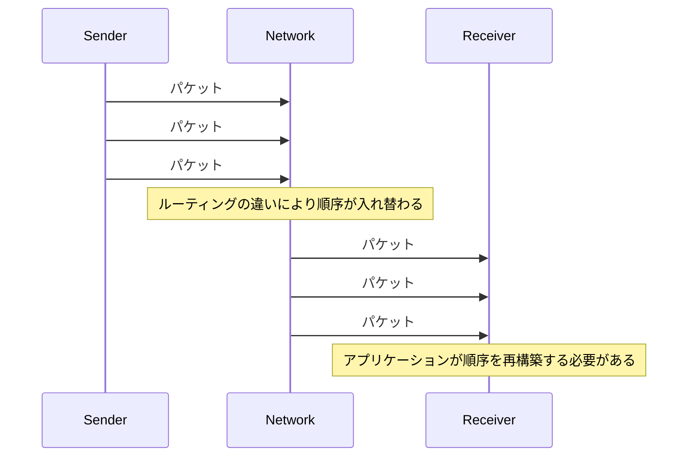
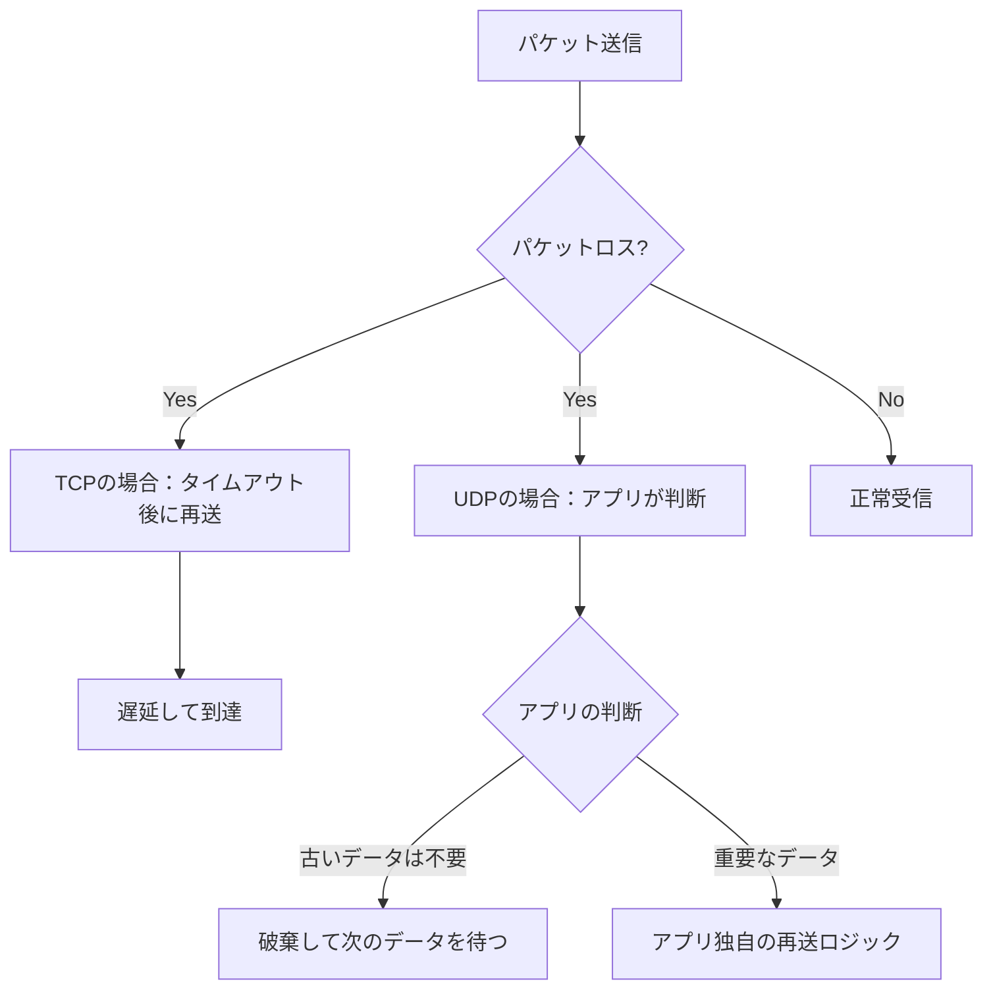
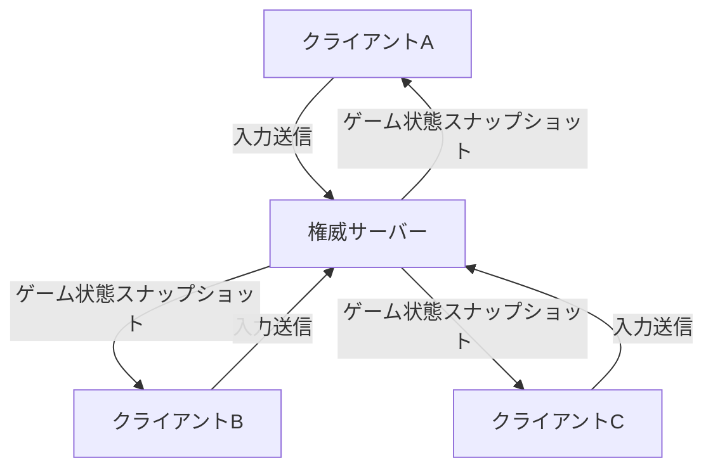
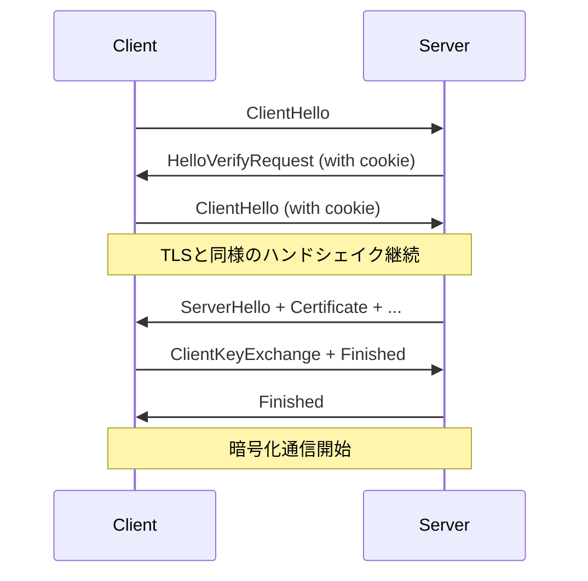
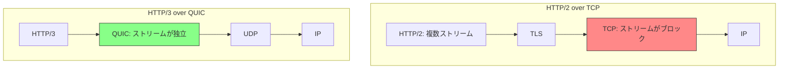
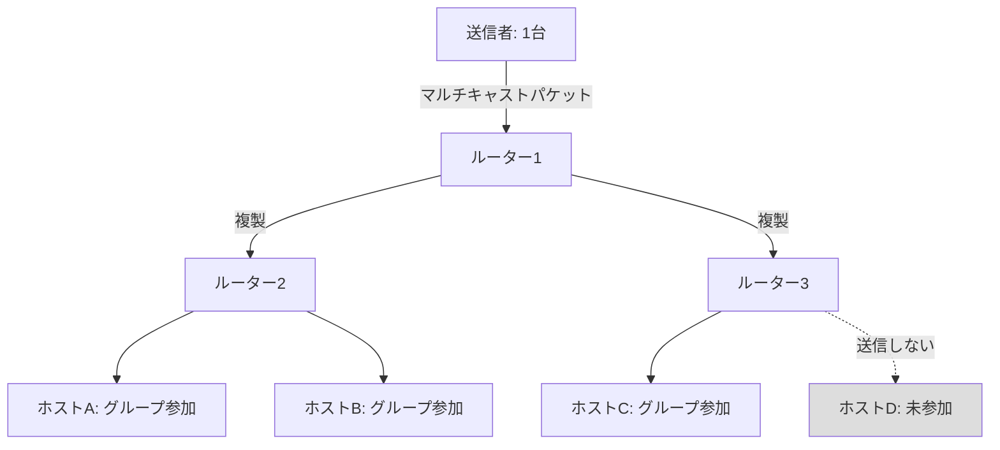
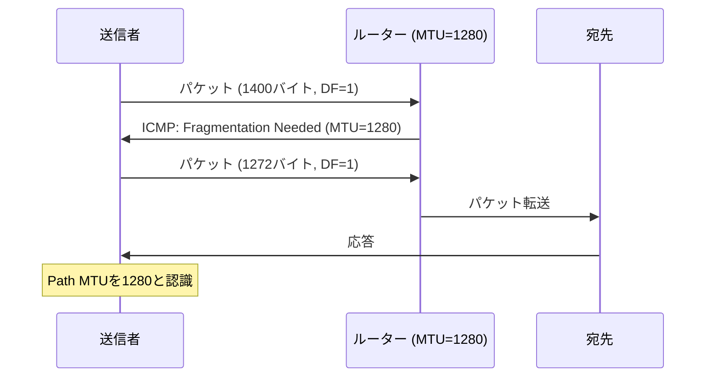
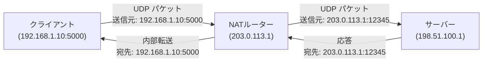
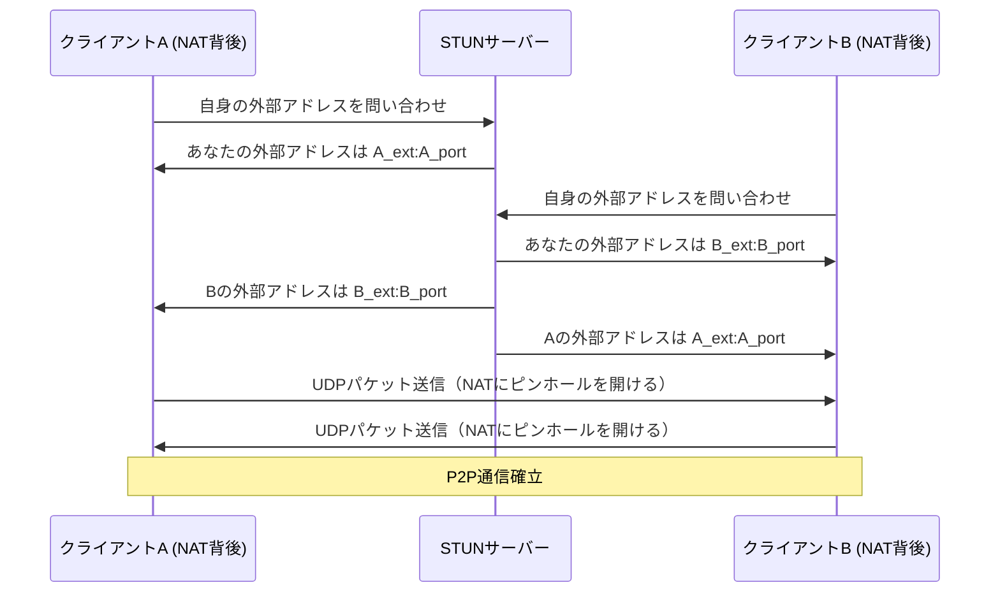

# UDP とリアルタイム通信

## 1. 歴史的背景：UDPの誕生とTCPとの使い分け

### 1.1 インターネット黎明期の課題

1970年代、ARPANETが拡張されつつある中で、ネットワーク研究者たちはトランスポート層のプロトコル設計という難題に向き合っていた。当初は「NCP（Network Control Protocol）」が用いられていたが、異なるネットワーク間での通信（インターネットワーキング）には対応できなかった。

1974年、Vint CerfとBob Kahnは「A Protocol for Packet Network Intercommunication」を発表し、TCPの原型を提案した。この論文が後のインターネットの礎となる。当初のTCPは信頼性のある順序保証付きのバイトストリームとフロー制御をすべて一つのプロトコルに統合していた。

しかし実用化が進む中で、すべての通信が信頼性保証を必要とするわけではないという事実が浮かび上がった。音声通話やリアルタイムデータ転送のような用途では、再送によるレイテンシの増大のほうが、パケットロスそのものよりも致命的だったのである。

### 1.2 UDPの誕生

**UDP（User Datagram Protocol）**は、1980年にDavid Reedによって設計され、RFC 768として標準化された。その設計思想は明快だった。**「トランスポート層が提供すべき最低限の機能は何か」**を突き詰めた結果、ポート番号による多重化とチェックサムによる最低限の整合性確認のみを担い、その他の責務はすべて上位のアプリケーション層に委ねるという哲学に行き着いた。

RFC 768はわずか3ページという驚くほど簡潔な仕様書であり、その単純さがUDPの本質を体現している。

```
 0      7 8     15 16    23 24    31
+--------+--------+--------+--------+
|     Source      |   Destination   |
|      Port       |      Port       |
+--------+--------+--------+--------+
|                 |                 |
|     Length      |    Checksum     |
+--------+--------+--------+--------+
|
|          data octets ...
+---------------- ...
```

> [!NOTE]
> RFC 768の原文（1980年）はたった3ページ。対してTCPのRFC 793は85ページ以上ある。この差がそのまま両プロトコルの設計哲学の違いを示している。

### 1.3 TCPとUDPの使い分け

TCPとUDPはそれぞれ異なる問題を解決するために設計されており、競合関係ではなく補完関係にある。

| 特性 | TCP | UDP |
|------|-----|-----|
| 接続確立 | 3-wayハンドシェイク必要 | 不要 |
| 信頼性 | 再送により保証 | 保証なし |
| 順序保証 | あり | なし |
| フロー制御 | あり（スライディングウィンドウ） | なし |
| 輻輳制御 | あり（AIMD等） | なし |
| ヘッダサイズ | 最小20バイト | 8バイト |
| レイテンシ | 相対的に高い | 低い |
| 主な用途 | Web、メール、ファイル転送 | VoIP、ゲーム、DNS、動画ストリーミング |

この使い分けの原則は「エンドツーエンド原則（End-to-End Principle）」と深く結びついている。ネットワークの複雑性はエンドポイントに集中させ、中間ノード（ルーターなど）はシンプルなパケット転送に徹するという思想である。UDPはこの哲学を忠実に体現している。

## 2. UDPの基本アーキテクチャ

### 2.1 データグラムの構造

UDPのパケット（データグラム）は8バイトの固定長ヘッダとペイロードから構成される。

```
 0                   1                   2                   3
 0 1 2 3 4 5 6 7 8 9 0 1 2 3 4 5 6 7 8 9 0 1 2 3 4 5 6 7 8 9 0 1
+-+-+-+-+-+-+-+-+-+-+-+-+-+-+-+-+-+-+-+-+-+-+-+-+-+-+-+-+-+-+-+-+
|          Source Port          |       Destination Port        |
+-+-+-+-+-+-+-+-+-+-+-+-+-+-+-+-+-+-+-+-+-+-+-+-+-+-+-+-+-+-+-+-+
|            Length             |           Checksum            |
+-+-+-+-+-+-+-+-+-+-+-+-+-+-+-+-+-+-+-+-+-+-+-+-+-+-+-+-+-+-+-+-+
|                          Data (payload)                       |
|                              ...                              |
+-+-+-+-+-+-+-+-+-+-+-+-+-+-+-+-+-+-+-+-+-+-+-+-+-+-+-+-+-+-+-+-+
```

各フィールドの役割：

**Source Port（送信元ポート、16ビット）**
送信元のポート番号。応答を受け取る必要がない場合はゼロに設定することも可能である。ポート番号は0〜65535の範囲を取り、0〜1023はウェルノウンポート、1024〜49151は登録済みポート、49152〜65535は動的・プライベートポートとして割り当てられている。

**Destination Port（宛先ポート、16ビット）**
宛先のポート番号。DNSは53番、DHCPはサーバー67番・クライアント68番、SNMPは161番などが代表的なウェルノウンポートである。

**Length（長さ、16ビット）**
UDPヘッダ（8バイト）とペイロードを合わせた総バイト数。最小値は8（ペイロードなし）、最大値は65535バイトとなる。ただし実際のペイロードはIPの制約により制限される。

**Checksum（チェックサム、16ビット）**
ヘッダとペイロード全体のエラー検出に使用される。IPv4では省略可能（ゼロを設定）だが、IPv6では必須となっている。計算には「擬似ヘッダ（pseudo header）」と呼ばれるIPレイヤーの情報（送信元IP、宛先IP、プロトコル番号、UDPデータグラム長）も含める。

### 2.2 チェックサムの計算メカニズム

UDPチェックサムはIPv4/IPv6の擬似ヘッダを含めた1の補数演算によって計算される。

IPv4における擬似ヘッダの構造：

```
 0                   1                   2                   3
 0 1 2 3 4 5 6 7 8 9 0 1 2 3 4 5 6 7 8 9 0 1 2 3 4 5 6 7 8 9 0 1
+-+-+-+-+-+-+-+-+-+-+-+-+-+-+-+-+-+-+-+-+-+-+-+-+-+-+-+-+-+-+-+-+
|                       Source Address                          |
+-+-+-+-+-+-+-+-+-+-+-+-+-+-+-+-+-+-+-+-+-+-+-+-+-+-+-+-+-+-+-+-+
|                    Destination Address                        |
+-+-+-+-+-+-+-+-+-+-+-+-+-+-+-+-+-+-+-+-+-+-+-+-+-+-+-+-+-+-+-+-+
|      Zero     |   Protocol    |          UDP Length           |
+-+-+-+-+-+-+-+-+-+-+-+-+-+-+-+-+-+-+-+-+-+-+-+-+-+-+-+-+-+-+-+-+
```

擬似ヘッダをチェックサム計算に含める目的は、**誤ったIPアドレスに配送されたパケットを検出する**ことにある。IPヘッダ自体のチェックサムはIP層が検証するが、パケットが正しいホストに届いたかどうかをUDP層でも二重確認できる。

```c
// UDP checksum calculation example (simplified)
uint16_t udp_checksum(struct pseudo_header *ph, struct udp_header *udp,
                       uint8_t *payload, size_t payload_len) {
    uint32_t sum = 0;
    uint16_t *ptr;
    size_t len;

    // Add pseudo header fields
    ptr = (uint16_t *)ph;
    len = sizeof(struct pseudo_header);
    while (len > 1) {
        sum += *ptr++;
        len -= 2;
    }

    // Add UDP header (with checksum field = 0)
    ptr = (uint16_t *)udp;
    len = sizeof(struct udp_header);
    while (len > 1) {
        sum += *ptr++;
        len -= 2;
    }

    // Add payload
    ptr = (uint16_t *)payload;
    len = payload_len;
    while (len > 1) {
        sum += *ptr++;
        len -= 2;
    }

    // Handle odd byte
    if (len == 1) {
        sum += *(uint8_t *)ptr;
    }

    // Fold 32-bit sum to 16 bits
    while (sum >> 16) {
        sum = (sum & 0xFFFF) + (sum >> 16);
    }

    // Return one's complement
    return (uint16_t)(~sum);
}
```

### 2.3 UDPソケットの基本動作

UDPはコネクションレスであるため、サーバーとクライアントの区別が本質的にはない。ただし慣習として、特定のポートで待ち受けるプロセスをサーバー、接続を開始するプロセスをクライアントと呼ぶ。

```c
// Server-side UDP socket (simplified example)
int sockfd = socket(AF_INET, SOCK_DGRAM, 0);

struct sockaddr_in server_addr = {
    .sin_family = AF_INET,
    .sin_port = htons(12345),
    .sin_addr.s_addr = INADDR_ANY
};

bind(sockfd, (struct sockaddr *)&server_addr, sizeof(server_addr));

// Receive loop
while (1) {
    char buffer[1024];
    struct sockaddr_in client_addr;
    socklen_t client_len = sizeof(client_addr);

    // recvfrom returns the sender's address, unlike TCP's recv
    ssize_t n = recvfrom(sockfd, buffer, sizeof(buffer), 0,
                         (struct sockaddr *)&client_addr, &client_len);

    // Each call may come from a different sender
    process_datagram(buffer, n, &client_addr);
}
```

TCPのソケットとの大きな違いは `recvfrom()` を使用する点だ。TCPではストリームが確立しているため `recv()` で十分だが、UDPでは各データグラムが独立しており、送信元アドレスを毎回取得する必要がある。

## 3. UDPの特性：設計上の選択とそのトレードオフ

### 3.1 コネクションレス

UDPには「接続（コネクション）」という概念が存在しない。各データグラムは完全に独立したパケットとして扱われる。この特性がもたらすメリットとデメリットを整理する。

**メリット：**

- **低レイテンシな送信開始**：TCPの3-wayハンドシェイク（最低1 RTT）が不要で即座に送信できる
- **サーバーの状態管理が不要**：コネクション状態を保持しないため、スケールアウトが容易
- **ブロードキャスト・マルチキャスト対応**：コネクションレスだからこそ、1:Nの送信が可能
- **短命な通信に最適**：DNSのように1回の問い合わせで完結する通信では、TCPのハンドシェイクオーバーヘッドは無駄でしかない

**デメリット：**

- **アプリケーション側での状態管理が必要**：「誰に何を送ったか」をアプリが追跡しなければならない
- **セッション概念の欠如**：フロー制御や輻輳制御を実装する場合はアプリが責任を持つ

### 3.2 順序保証なし

UDPは送信したデータグラムが受信側に届く順序を保証しない。パケットはネットワーク内で異なるルートを経由する可能性があり、後から送ったパケットが先に届く「パケットの追い越し」が発生することがある。



リアルタイム通信では、この「順序の乱れ」への対処として主に二つのアプローチが採られる：

1. **破棄する**：古いパケットは捨て、最新のパケットのみ使用する（音声通話のジッタバッファなど）
2. **シーケンス番号で再構築する**：RTPのようにシーケンス番号を付与し、上位層で並べ直す

### 3.3 低オーバーヘッドと高スループット

TCPのヘッダは最小20バイト（オプション含めると最大60バイト）であるのに対し、UDPのヘッダはわずか8バイトである。

小さなペイロードを多数送信するシナリオでは、このヘッダサイズの差が通信効率に直接影響する。たとえば100バイトのペイロードを送る場合：

- **TCP**：ヘッダ20バイト / 合計120バイト → オーバーヘッド率 約17%
- **UDP**：ヘッダ8バイト / 合計108バイト → オーバーヘッド率 約7%

さらに重要なのは**輻輳制御のない**という特性だ。TCPは輻輳を検出するとウィンドウサイズを削減してスループットを下げるが、UDPはこのような制御を行わない。これはゲームや音声通話において「一定のレートで送り続ける」ことを可能にするが、同時にネットワーク輻輳を悪化させるリスクも持つ。

> [!WARNING]
> UDPが輻輳制御を持たないことはネットワーク全体の公平性を損なう可能性がある。大量のUDPトラフィックを送出するアプリケーションは、TCP接続のスループットを一方的に奪うことがある。このため、QUIC（後述）はUDP上でありながら独自の輻輳制御を実装している。

### 3.4 信頼性の欠如とその哲学

UDPはパケットロスを**検出しない**し、**再送もしない**。これを「欠陥」と見るのではなく、**意図的な設計選択**として理解することが重要だ。

ネットワークの信頼性モデルを考えると：



音声通話を例に考えよう。100msごとに音声フレームを送る場合、200ms後に到達した「過去の音声フレーム」を再送してもらっても、もはやそのデータは役に立たない。むしろ「音声が少し途切れた」と処理するほうが自然だ。これがUDPが選ばれる本質的な理由である。

## 4. リアルタイム通信での活用

### 4.1 VoIP（Voice over IP）

VoIPはUDPの最も代表的な用途の一つだ。電話音声をIPパケットとして送受信する技術であり、Skype、Zoom、Discord、Google Meet などが採用している。

**音声コーデックとパケット化**

音声信号は通常、**20〜30msごと**にフレームに分割されパケット化される。一般的なコーデックの例：

| コーデック | ビットレート | フレーム長 | 用途 |
|-----------|------------|-----------|------|
| G.711 | 64 kbps | 20ms | 従来の電話品質 |
| G.722 | 48〜64 kbps | 20ms | HD音声 |
| Opus | 6〜510 kbps | 2.5〜60ms | WebRTC標準 |
| G.729 | 8 kbps | 10ms | 帯域節約 |

**ジッタバッファ**

ネットワーク遅延の変動（ジッタ）を吸収するため、受信側は**ジッタバッファ**を使用する。到着したパケットを一定時間（50〜200ms程度）バッファに蓄えてから再生することで、パケットの到着時刻のばらつきを平滑化する。


**品質指標**

VoIPの品質は主に以下の指標で評価される：

- **MOS（Mean Opinion Score）**：1〜5の主観的品質スコア（4.0以上が目標）
- **パケットロス率**：1%未満が理想、5%を超えると顕著な品質劣化
- **往復遅延（RTT）**：150ms以下が推奨（ITU-T G.114）
- **ジッタ**：30ms未満が理想的

### 4.2 オンラインゲーム

オンラインゲームにおけるネットワーク通信は、リアルタイム性の要求が非常に厳しい。

**ゲームの状態同期**

ゲームの「世界の状態」（プレイヤーの位置、アクションなど）を各クライアント間で同期させる。一般的には以下のモデルが使われる：



**ゲームにおけるUDP活用技法**

1. **デッドレコニング（Dead Reckoning）**：パケットロス時に、最後に受信した速度・方向から現在位置を予測して補完する
2. **クライアント予測（Client-Side Prediction）**：サーバーの応答を待たずに自身のアクション結果をローカルでシミュレートし、後でサーバーの状態で補正する
3. **スナップショット補間**：一定レート（例えば64ティック/秒）でゲーム状態スナップショットを送信し、クライアント側で補間する

**代表的なゲームのUDP使用例**

- **Valve（Counter-Strike、Dota 2）**：独自のバルブネットワーキングプロトコル（VNet）、64〜128ティック/秒
- **Epic Games（Fortnite）**：UE（Unreal Engine）の信頼性付き/非信頼性付きUDPチャンネルの組み合わせ
- **Activision（Call of Duty）**：独自のDTNL（Datagram Transport Network Layer）

### 4.3 動画ストリーミング

動画ストリーミングにおけるUDPの役割は、用途によって異なる。

**ライブストリーミング**

低遅延ライブストリーミング（スポーツ中継、eスポーツ配信など）では遅延の最小化が重要であり、UDPベースのプロトコルが活躍する。

- **WebRTC**：ブラウザ間のリアルタイム動画共有（Google Meet、Discord）
- **RIST（Reliable Internet Stream Transport）**：放送業界での低遅延配信
- **SRT（Secure Reliable Transport）**：ライブストリーミング向け（OBS等が対応）

**従来のVOD（ビデオオンデマンド）との違い**

NetflixやYouTubeのようなVODサービスは、遅延よりもバッファリングなしの安定した視聴を重視するため、**HTTP/TCP**（または後述のQUIC/HTTP3）を使用する。数十秒のバッファを確保することで多少のパケットロスをカバーできるため、UDPの必要性が低い。

## 5. UDP上のプロトコル

UDPの「軽量だが信頼性なし」という特性は、多くのプロトコルがUDPをベースに独自機能を追加する動機となった。

### 5.1 RTP（Real-time Transport Protocol）

**RTP**（RFC 3550）はリアルタイムメディア（音声・映像）の転送に特化したプロトコルだ。UDPの上に乗り、メディア転送に必要な最低限の機能を追加する。

**RTPヘッダの構造：**

```
 0                   1                   2                   3
 0 1 2 3 4 5 6 7 8 9 0 1 2 3 4 5 6 7 8 9 0 1 2 3 4 5 6 7 8 9 0 1
+-+-+-+-+-+-+-+-+-+-+-+-+-+-+-+-+-+-+-+-+-+-+-+-+-+-+-+-+-+-+-+-+
|V=2|P|X|  CC   |M|     PT      |       Sequence Number         |
+-+-+-+-+-+-+-+-+-+-+-+-+-+-+-+-+-+-+-+-+-+-+-+-+-+-+-+-+-+-+-+-+
|                           Timestamp                           |
+-+-+-+-+-+-+-+-+-+-+-+-+-+-+-+-+-+-+-+-+-+-+-+-+-+-+-+-+-+-+-+-+
|           Synchronization Source (SSRC) identifier           |
+=+=+=+=+=+=+=+=+=+=+=+=+=+=+=+=+=+=+=+=+=+=+=+=+=+=+=+=+=+=+=+=+
|            Contributing Source (CSRC) identifiers            |
|                             ....                              |
+-+-+-+-+-+-+-+-+-+-+-+-+-+-+-+-+-+-+-+-+-+-+-+-+-+-+-+-+-+-+-+-+
```

主要フィールドの解説：

- **Sequence Number（16ビット）**：パケットの順序追跡と欠落検出に使用。送信ごとに1インクリメント
- **Timestamp（32ビット）**：メディアのサンプリング時刻。音声の同期や動画のフレームタイミングに使用
- **SSRC（32ビット）**：同期ソース識別子。複数の参加者が同一のRTPセッションを使用する際に識別するためのランダムな値
- **PT（7ビット）**：ペイロードタイプ。使用するコーデック（0=PCMU/G.711、96以降=動的割り当て）を示す

**RTCP（RTP Control Protocol）**

RTPはデータ転送のみを扱い、制御情報は姉妹プロトコルの**RTCP**が担当する。RTPポートの隣接ポート（RTPが偶数番ならRTCPは奇数番）を使用し、以下の情報を定期的に送受信する：

- 送受信者報告（SR/RR）：パケットロス率、ジッタ、RTTなどの統計情報
- ソース記述（SDES）：参加者のCNAME（カノニカル名）などのメタデータ
- BYEパケット：セッション終了の通知

### 5.2 DTLS（Datagram Transport Layer Security）

TCPでTLSが機能するように、UDPでセキュリティを提供するのが**DTLS**（RFC 6347）だ。WebRTCの基盤として広く使われている。

**UDPにTLSを直接適用できない理由**

TLSはTCPの信頼性（順序保証、再送保証）を前提として設計されている。UDPに直接適用すると以下の問題が生じる：

1. **順序外のパケット**：TLSのレコード処理は順序通りの到着を前提とする
2. **パケットロス**：ハンドシェイクメッセージのロスで接続確立が失敗する
3. **断片化**：大きなハンドシェイクメッセージがIPフラグメントに分割される可能性

**DTLSの解決策**

DTLSはTLS 1.2/1.3をベースに以下の変更を加えている：

- **明示的なシーケンス番号**：各レコードに番号を付与し、古い/重複パケットを検出
- **再送タイマー**：ハンドシェイクメッセージが確認されない場合にタイムアウト再送
- **フラグメンテーション**：大きなハンドシェイクメッセージを複数のDTLSレコードに分割
- **クッキーを使用したDoS対策**：DTLSのHelloVerifyRequestメカニズム



### 5.3 QUIC（Quick UDP Internet Connections）

**QUIC**は、Googleが2012年頃に開発を開始し、2021年にRFC 9000として標準化された次世代トランスポートプロトコルだ。UDPの上に実装されており、TCP+TLS+HTTP/2の機能をより効率的に提供する。

**QUICの設計目標**

1. **接続確立の高速化**：TLS 1.3と統合した0-RTTまたは1-RTT接続確立
2. **HOLブロッキングの解消**：TCPのストリームレベルのHOL（Head-of-Line）ブロッキングを排除
3. **コネクションマイグレーション**：IPアドレスやポートが変わっても接続を維持（モバイルのWi-Fi/LTE切り替えなど）
4. **組み込みの暗号化**：TLSを不可分なコンポーネントとして統合

**QUICが解決するTCPの問題**

TCPはカーネルに実装されており、仕様変更のためにはOSのアップデートが必要だ。これが事実上の進化の停止を招いていた。QUICをUDPの上で実装することで、ユーザースペースで独自の改善を施せる。



**HOLブロッキングの問題**

TCPは単一バイトストリームとして機能するため、1つのパケットが失われると、後続のすべてのデータがカーネルバッファで待機する（TCP HOLブロッキング）。HTTP/2の複数ストリームを多重化しても、TCPレイヤーでは1本のストリームとして扱われるため、この問題は解決されない。

QUICでは各ストリームが独立して管理される。あるストリームでパケットロスが発生しても、他のストリームはブロックされない。

**輻輳制御の実装**

UDPはネットワーク輻輳制御を提供しないが、QUICはアプリケーション層で実装する。BBR（Bottleneck Bandwidth and Round-trip propagation time）などの最先端アルゴリズムをカーネル変更なしに採用できる。

**HTTP/3との関係**

HTTP/3はQUICの上に構築されたHTTPの最新バージョンだ。2022年にRFC 9114として標準化された。現在、主要なCDN（Cloudflare、Fastly、Akamai等）とWebブラウザが対応している。

| プロトコル | HTTP バージョン | トランスポート |
|-----------|--------------|-------------|
| HTTP/1.1 | 1.1 | TCP |
| HTTP/2 | 2 | TCP + TLS |
| HTTP/3 | 3 | QUIC (UDP + TLS 1.3統合) |

## 6. マルチキャストとブロードキャスト

コネクションレスというUDPの特性は、1対多の通信（マルチキャスト・ブロードキャスト）を自然にサポートする。TCPでは原理的にこのような通信は実現できない。

### 6.1 ブロードキャスト

**ブロードキャスト**は同一サブネット上のすべてのホストにパケットを送信する方式だ。

| ブロードキャストタイプ | アドレス | 範囲 |
|---------------------|---------|------|
| 限定ブロードキャスト | 255.255.255.255 | 同一サブネット内（ルーターを越えない） |
| 指向性ブロードキャスト | ネットワークアドレスのホスト部をすべて1に | 特定サブネット全体 |

代表的な用途：

- **DHCP Discovery**：新しいホストがDHCPサーバーを探す際にブロードキャストを使用
- **ARP（Address Resolution Protocol）**：IPアドレスからMACアドレスを解決する際のブロードキャスト
- **Wake-on-LAN**：マジックパケットをブロードキャストで送信してリモート起動

```c
// UDP broadcast example
int sockfd = socket(AF_INET, SOCK_DGRAM, 0);

// Enable broadcast on socket
int broadcast = 1;
setsockopt(sockfd, SOL_SOCKET, SO_BROADCAST, &broadcast, sizeof(broadcast));

struct sockaddr_in broadcast_addr = {
    .sin_family = AF_INET,
    .sin_port = htons(9),  // discard port (used for Wake-on-LAN)
    .sin_addr.s_addr = inet_addr("255.255.255.255")
};

sendto(sockfd, magic_packet, sizeof(magic_packet), 0,
       (struct sockaddr *)&broadcast_addr, sizeof(broadcast_addr));
```

### 6.2 マルチキャスト

**マルチキャスト**はブロードキャストよりも効率的な1対多通信だ。224.0.0.0〜239.255.255.255のIPv4アドレス範囲（クラスDアドレス）が割り当てられており、特定のマルチキャストグループに参加したホストのみがパケットを受信する。



**IGMP（Internet Group Management Protocol）**

ホストがマルチキャストグループへの参加・離脱をルーターに通知するためのプロトコルがIGMPだ。ルーターはIGMPの情報に基づいてマルチキャストツリーを構築し、不必要なリンクへのパケット転送を回避する。

**PIM（Protocol Independent Multicast）**

ルーター間でマルチキャストルーティング情報を交換するプロトコル。PIM-SMとPIM-DM（Sparse/Dense Mode）の2種類があり、インターネット規模のマルチキャストルーティングに使用される。

**マルチキャストの実用例**

- **IPTV**：テレビ放送の配信（ルーター間を効率的にレプリケート）
- **株式相場配信**：取引所から多数の受信者への低遅延一斉配信
- **ファイル配信**：ソフトウェアアップデートの一斉配布
- **mDNS（Multicast DNS）**：ローカルネットワークでの名前解決（224.0.0.251:5353）

```c
// Joining a multicast group
int sockfd = socket(AF_INET, SOCK_DGRAM, 0);

struct ip_mreq mreq = {
    .imr_multiaddr.s_addr = inet_addr("239.0.0.1"),  // multicast group address
    .imr_interface.s_addr = INADDR_ANY               // local interface
};

// Join the multicast group
setsockopt(sockfd, IPPROTO_IP, IP_ADD_MEMBERSHIP, &mreq, sizeof(mreq));

// Bind to the multicast port
struct sockaddr_in addr = {
    .sin_family = AF_INET,
    .sin_port = htons(12345),
    .sin_addr.s_addr = INADDR_ANY
};
bind(sockfd, (struct sockaddr *)&addr, sizeof(addr));
```

### 6.3 エニーキャスト（Anycast）

厳密にはUDPに固有の概念ではないが、UDPとの組み合わせで重要な機能を果たす。エニーキャストでは同一のIPアドレスを複数の場所（サーバー）に割り当て、送信者から最も近いサーバーにルーティングする。

CloudflareのDNSサービス（1.1.1.1）やGoogle DNS（8.8.8.8）はエニーキャストを使用したUDP/53サービスだ。世界中の拠点からDNSサービスを提供しつつ、ユーザーは常に「最も近い」サーバーに問い合わせることになる。

## 7. UDPの実践的な考慮事項

### 7.1 MTUとフラグメンテーション

**MTU（Maximum Transmission Unit）**はネットワークリンクで一度に転送できる最大パケットサイズだ。

| リンクタイプ | 典型的なMTU |
|------------|-----------|
| イーサネット（標準） | 1500バイト |
| イーサネット（Jumbo Frame） | 9000バイト |
| PPPoE（フレッツ光等） | 1454バイト |
| IPv6トンネル | 1480バイト |
| ループバック（lo） | 65536バイト |

IPv4のUDPパケット（ヘッダIPv4 20バイト + UDP 8バイト）が1500バイトのMTUに収まるペイロードサイズは**1472バイト**（1500 - 20 - 8）だ。

**IPフラグメンテーション**

送信するUDPパケットがMTUを超える場合、IP層がパケットを分割（フラグメント）する。しかし、これはいくつかの問題を引き起こす：

1. **パフォーマンス低下**：フラグメント化・再組み立てのオーバーヘッド
2. **フラグメントロスの影響**：1つのフラグメントが失われると、元のパケット全体を破棄しなければならない
3. **ファイアウォール・NATの問題**：フラグメントを適切に処理できない中間機器が存在する
4. **IPv6ではルーターがフラグメントを行わない**：エンドポイントが適切なサイズに調整する必要がある

**Path MTU Discovery（PMTUD）**

実際の経路MTU（Path MTU）を発見するための仕組み。IPv4では「Don't Fragment（DF）ビット」をセットしてパケットを送り、ICMPの「Fragmentation Needed」メッセージを受け取ることでPath MTUを把握する。



**実装上の推奨事項**

- ペイロードは**1200バイト以下**に収めるのが安全（様々なトンネリングやオーバーヘッドを考慮）
- QUICはデフォルトで1200バイト程度のペイロードサイズからスタートし、PMTUDを実施する
- ゲームサーバーでは「安全な最大UDPペイロード」として1024バイト前後を使用することが多い

### 7.2 NATトラバーサル

現代のインターネットではほとんどのエンドユーザーがNAT（Network Address Translation）の背後にいる。UDPでは接続の概念がないため、NATを越えた双方向通信の確立（NATトラバーサル）が課題となる。

**NATの動作原理**



NATルーターはUDPパケットを外部に送信した際、送信元IP:ポートのマッピングを**一時的に**記録する。この「ピンホール」が開いている間（通常数十秒〜数分）は外部からの応答を内部ホストに転送できる。

**UDPホールパンチング（UDP Hole Punching）**

ピアツーピア通信を確立するための主要な技術。以下の手順で動作する：

1. クライアントAとBがどちらも中継サーバー（STUNサーバー）に接続する
2. STUNサーバーが双方の外部アドレス（NAT後のIP:ポート）を把握する
3. STUNサーバーが双方に相手の外部アドレスを通知する
4. A・Bが同時にお互いの外部アドレスに向けてUDPパケットを送信する
5. 送信された「穴」を通して双方のパケットが到達し、P2P通信が確立する



**ICE（Interactive Connectivity Establishment）**

WebRTCが採用する標準的なNATトラバーサルフレームワーク（RFC 8445）。STUN（Simple Traversal of UDP through NAT）とTURN（Traversal Using Relays around NAT）を組み合わせて使用する：

- **STUNサーバー**：クライアントの外部アドレスを通知する（無料・低コスト）
- **TURNサーバー**：P2P接続が確立できない場合のリレーサーバー（帯域コストあり）

ICEは複数の接続候補（ホスト、サーバーリフレクティブ、リレー）を収集し、優先順位に従って疎通確認を行い、最適な経路を選択する。

### 7.3 セキュリティ上の考慮事項

UDPはソースIPを簡単に偽装（スプーフィング）できるため、いくつかのセキュリティリスクがある。

**UDPフラッド攻撃**

攻撃者が大量のUDPパケットをターゲットに送りつけるDoS攻撃。各パケットが独立しているため、送信元IPの偽装が容易だ。

**DNS増幅攻撃**

小さなDNSクエリ（約40バイト）に対して大きなレスポンス（最大4096バイト以上）が返ることを悪用した増幅型DDoS攻撃。送信元IPを被害者のIPに偽装することで、応答パケットが被害者に集中する。

```
攻撃者 → DNSサーバー: クエリ 40バイト（送信元を偽装）
DNSサーバー → 被害者: レスポンス 4096バイト
増幅率: 約100倍
```

**対策**

- **BCP 38（RFC 2827）**：送信元IPアドレスのフィルタリングをISPレベルで実施
- **レート制限**：単一送信元からの過剰なUDPパケットをドロップ
- **DTLS/QUICの採用**：暗号化によって応答を正規クライアントのみに制限
- **DNSSECとDNS over UDP/TLS**：DNSクエリの検証と暗号化

### 7.4 UDPバッファの管理

高スループットのUDPアプリケーションでは、受信バッファの管理が重要になる。

**受信バッファオーバーフロー**

送受信の速度差が大きい場合、OS内の受信バッファが溢れてパケットが無音にドロップされることがある。

```c
// Increasing UDP receive buffer size
int recv_buf_size = 4 * 1024 * 1024;  // 4 MB
setsockopt(sockfd, SOL_SOCKET, SO_RCVBUF, &recv_buf_size, sizeof(recv_buf_size));

// Check actual buffer size (OS may limit to /proc/sys/net/core/rmem_max)
int actual_size;
socklen_t optlen = sizeof(actual_size);
getsockopt(sockfd, SOL_SOCKET, SO_RCVBUF, &actual_size, &optlen);
```

Linuxでは `/proc/sys/net/core/rmem_max` と `/proc/sys/net/core/rmem_default` でシステム全体の上限を設定できる。高スループットのメディアサーバーではこれらの値をチューニングすることが推奨される。

**ノンブロッキングI/OとepollによるUDP処理**

ゲームサーバーやVoIPサーバーのような高並行UDPサーバーでは、`epoll`（Linux）や`kqueue`（BSD）を使ったイベント駆動型の設計が一般的だ：

```c
// Scalable UDP server using epoll (simplified)
int epfd = epoll_create1(0);
struct epoll_event ev = {
    .events = EPOLLIN | EPOLLET,  // edge-triggered read events
    .data.fd = sockfd
};
epoll_ctl(epfd, EPOLL_CTL_ADD, sockfd, &ev);

// Event loop
while (1) {
    struct epoll_event events[64];
    int nfds = epoll_wait(epfd, events, 64, -1);

    for (int i = 0; i < nfds; i++) {
        // Process multiple datagrams per event (EPOLLET is edge-triggered)
        drain_udp_socket(events[i].data.fd);
    }
}
```

### 7.5 パフォーマンスチューニング

**SO_REUSEPORTによる並列受信**

Linux 3.9以降では `SO_REUSEPORT` オプションを使用することで、複数のプロセス・スレッドが同じポートにバインドできる。カーネルが受信パケットを各ソケットに分散（ロードバランス）するため、マルチコアCPUでのスケールアウトが容易になる。

```c
// Multiple processes/threads binding to the same UDP port
int sockfd = socket(AF_INET, SOCK_DGRAM, 0);
int reuse = 1;
setsockopt(sockfd, SOL_SOCKET, SO_REUSEPORT, &reuse, sizeof(reuse));
// Now multiple sockets can bind to the same address:port
bind(sockfd, (struct sockaddr *)&addr, sizeof(addr));
```

**GSO/GRO（Generic Segmentation/Receive Offload）**

Linux カーネルは UDP の大量送受信を効率化するため、複数のUDPパケットをバッチ処理する機能を提供している。QUIC実装でも `sendmmsg()` / `recvmmsg()` システムコールを使って複数データグラムを一度に処理することがある。

## 8. 将来の展望

### 8.1 QUICの普及とUDPの再評価

QUICの標準化（RFC 9000、2021年）とHTTP/3（RFC 9114、2022年）の普及は、UDPの地位を根本的に変えつつある。かつては「信頼性のない下位プロトコル」と見なされていたUDPが、今や次世代Webトランスポートの基盤となっている。

2024年時点で、主要Webブラウザのすべて（Chrome、Firefox、Edge、Safari）がHTTP/3/QUICをサポートしており、Cloudflare、Googleなどの大規模CDNが広くQUICを展開している。

### 8.2 WebTransport

**WebTransport**（W3C + IETFで標準化中）は、ブラウザとサーバー間のQUICベースの双方向通信APIだ。WebSocketの後継として期待されており、複数の独立したストリームや信頼性のないデータグラムをブラウザのJavaScriptから直接操作できる。

```javascript
// WebTransport API (available in modern browsers)
const transport = new WebTransport('https://example.com:4433/');
await transport.ready;

// Reliable bidirectional stream
const stream = await transport.createBidirectionalStream();
const writer = stream.writable.getWriter();
await writer.write(new TextEncoder().encode('Hello, Server!'));

// Unreliable datagrams (UDP-like)
const datagramWriter = transport.datagrams.writable.getWriter();
await datagramWriter.write(gameStateUpdate);  // Fire and forget
```

### 8.3 MASQUE（Multiplexed Application Substrate over QUIC Encryption）

**MASQUE**（RFC 9297）は、QUICを使ってHTTP/3プロキシを通じてUDPトラフィックを中継するプロトコルだ。VPNやプロキシの次世代標準として位置づけられており、Appleの「iCloud Private Relay」にも採用されている。

### 8.4 eBPFによるUDP処理の高速化

**eBPF（Extended Berkeley Packet Filter）**は、カーネルのパケット処理パスにカスタムプログラムを注入する技術だ。XDP（eXpress Data Path）と組み合わせることで、UDP パケットをNIC（ネットワークカード）レベルでカーネルのネットワークスタックをほぼバイパスして高速処理できる。

Cloudflare は DoS 対策や高性能UDPプロキシの実装にeBPF/XDPを活用しており、毎秒数百万パケットの処理を単一サーバーで実現している。

### 8.5 QUIC v2とQUICの拡張

RFC 9369で定義された**QUIC v2**（2023年）では、マイグレーションやマルチパスなどの機能拡張が進められている。**Multipath QUIC（MPQUIC）**は複数のネットワーク経路を同時活用する提案であり、スマートフォンのWi-FiとLTEを同時利用して帯域集約・フェイルオーバーを実現する技術として注目されている。

### 8.6 UDPの根本的な役割の継続性

UDPの設計思想——「最低限の機能のみ提供し、残りは上位に任せる」——は、インターネット通信の多様な要求を満たす柔軟性の源泉だ。QUIC、WebRTC、WebTransportなどの最新技術がすべてUDPの上に構築されていることは、この哲学の正しさを証明している。

今後も「リアルタイム通信」「低遅延」「カスタム信頼性制御」が求められる領域では、UDPとその上に構築されるプロトコルが中心的な役割を担い続けるだろう。

---

## まとめ

UDPは1980年のRFC 768から変わらない「8バイトのヘッダ」を持ちながら、40年以上にわたってインターネットの重要な基盤として機能してきた。その単純さは欠点ではなく、設計の優秀さの証だ。

UDPが提供するコアバリュー：

1. **最小限のオーバーヘッド**：8バイトのヘッダとポート多重化のみ
2. **コネクションレスの自由度**：ブロードキャスト、マルチキャスト、1対多通信
3. **輻輳制御を持たない高速送信**：リアルタイムメディアや時刻同期に最適
4. **プロトコル革新の基盤**：QUICやWebRTCがUDPの上で新たな機能を実現

TCPが「インターネットの信頼性」を担保する一方、UDPは「インターネットの速度と柔軟性」を担保する。この二つは競合するのではなく、互いに補完しながらインターネットのトランスポート層を構成している。

リアルタイム通信の未来を担うQUICが UDP の上に構築されたという事実は、UDPの設計哲学——**シンプルに、最小限に、そして自由に**——が今もなお正しいことを雄弁に物語っている。
