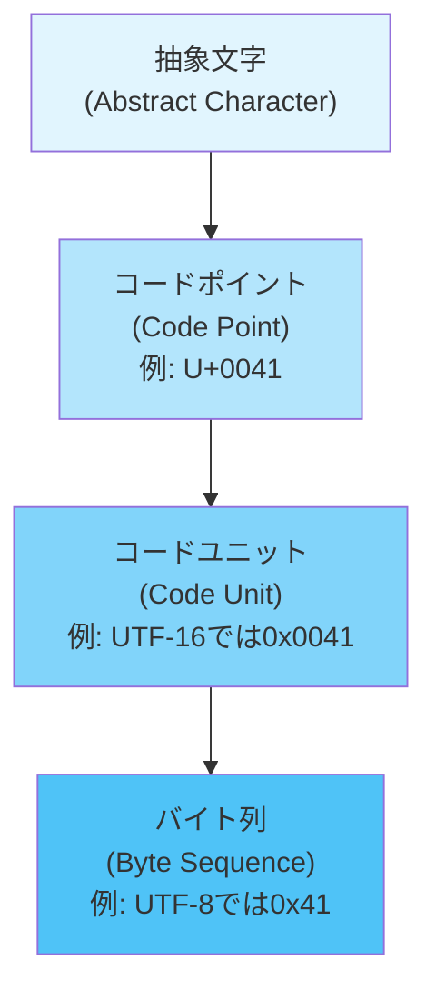
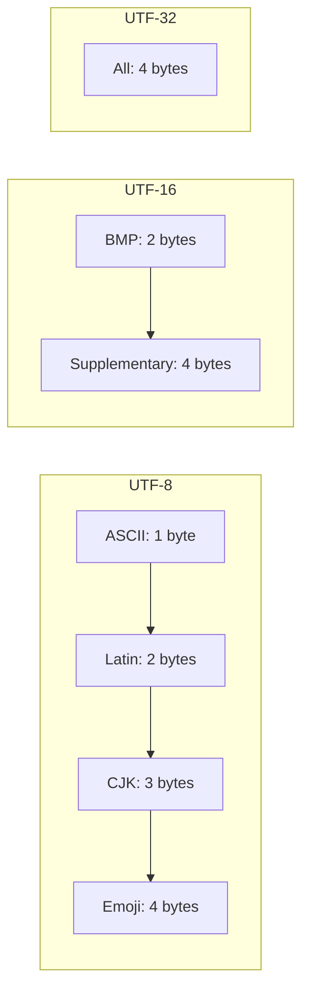
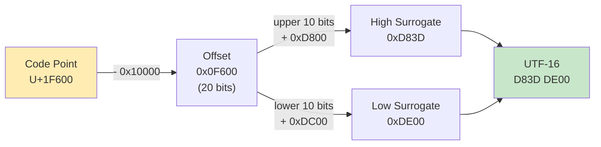
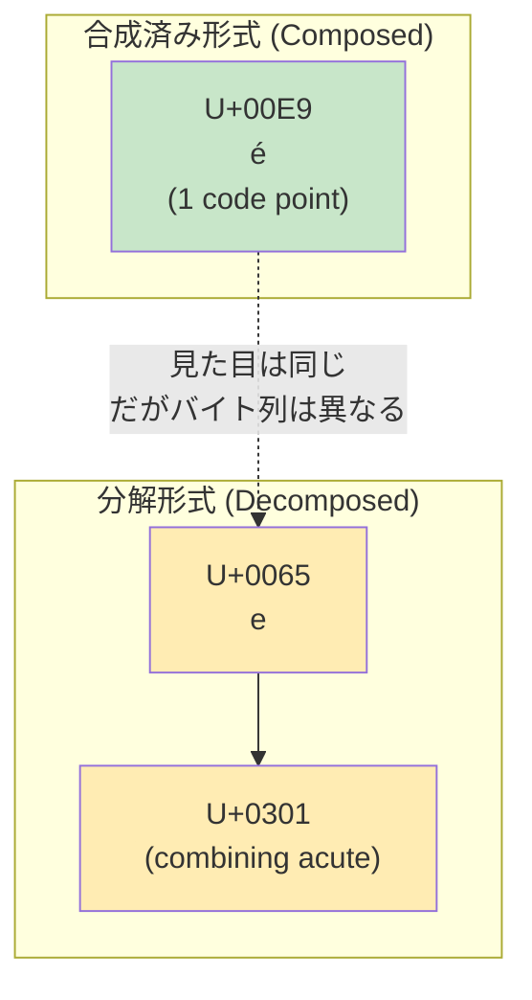
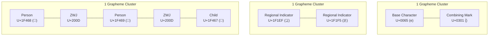
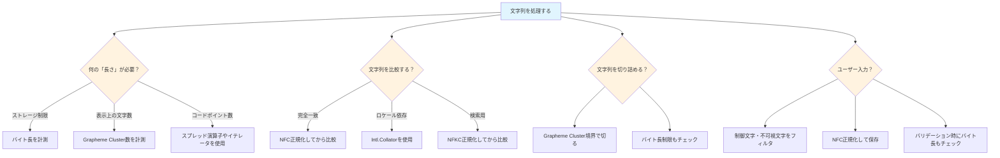
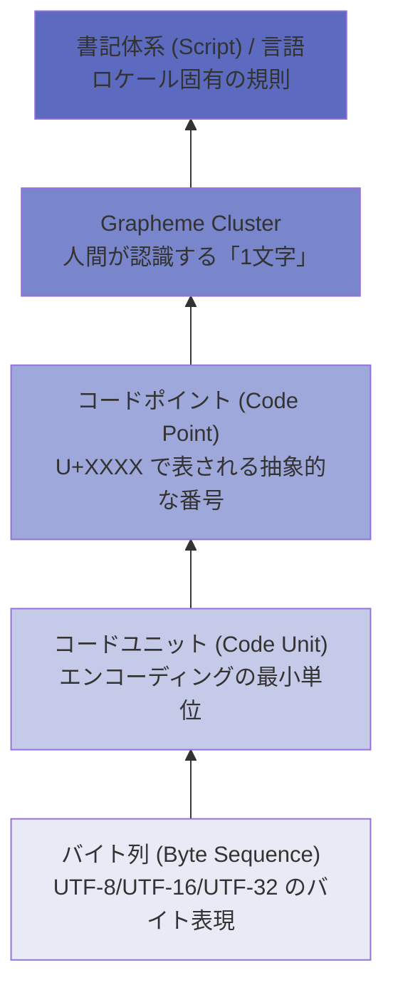

# Unicodeとテキスト処理の落とし穴

## 1. はじめに：文字とは何か

プログラミングにおいて「文字列の長さを取得する」という操作は一見単純に思える。しかし、次の JavaScript コードの結果を正確に予測できるだろうか。

```javascript
// What is the "length" of these strings?
console.log("cafe\u0301".length);   // 5 (not 4)
console.log("👨‍👩‍👧‍👦".length);          // 11 (not 1)
console.log("🇯🇵".length);           // 4 (not 1)
```

人間の目には「cafe&#x0301;」は5文字ではなく4文字に見える。家族の絵文字は1つの絵文字に見える。日本国旗も1つのシンボルに見える。しかし、JavaScript の `.length` プロパティが返す値は、人間の直感とは大きく異なる。

この不一致は JavaScript の欠陥ではない。**Unicode という文字体系の本質的な複雑さ**が原因である。Unicode は世界中のあらゆる文字を統一的に扱うために設計されたが、その結果として「文字」という概念そのものが多層的な構造を持つことになった。

本記事では、Unicode の基本概念から始めて、エンコーディング、サロゲートペア、正規化、Grapheme Cluster、そして `Intl.Segmenter` に至るまで、テキスト処理における落とし穴を体系的に解説する。Web アプリケーション開発において文字列を正しく扱うための知識を整理することが目的である。

## 2. Unicodeの歴史と基本概念

### 2.1 Unicode以前の世界

Unicode 以前の世界では、文字エンコーディングは地域ごとに乱立していた。

- **ASCII**（1963年）：7ビットで128文字を表現。英語圏のための規格であり、アルファベット、数字、制御文字のみをカバー
- **ISO 8859シリーズ**：ASCII を8ビットに拡張。ISO 8859-1（Latin-1）は西欧言語、ISO 8859-5はキリル文字など、地域ごとに異なる規格が存在
- **JIS X 0208 / Shift_JIS / EUC-JP**：日本語のための文字コード。日本国内では広く使われたが、他の言語との互換性に問題があった
- **GB2312 / GBK / Big5**：中国語（簡体字・繁体字）のための文字コード

この状態では、複数の言語を含む文書を正しく表示することが極めて困難だった。日本語の Web ページに韓国語のテキストを埋め込もうとすると、文字化けが頻発する。あるエンコーディングで書かれたバイト列を別のエンコーディングとして解釈すると、意味不明な文字列（いわゆる「文字化け」）が表示される。

### 2.2 Unicodeの誕生

1987年、Xerox の Joe Becker と Apple の Lee Collins、Mark Davis が「世界中の全ての文字を1つの文字コード体系で扱う」というビジョンのもと、Unicode プロジェクトを開始した。1991年に Unicode 1.0 がリリースされ、当初は16ビット（65,536文字）で全ての文字を収容できると考えられていた。

しかし、漢字（CJK統合漢字）の膨大なバリエーション、歴史的な文字、各地の少数言語、さらには絵文字の追加により、16ビットでは到底足りないことが明らかになった。現在の Unicode 16.0（2024年リリース）では **154,998文字** が定義されており、理論上の上限は **1,114,112** コードポイント（U+0000 〜 U+10FFFF）である。

### 2.3 基本用語

Unicode を理解するためには、以下の用語を正確に区別する必要がある。



- **抽象文字（Abstract Character）**：文字の概念的な実体。「ラテン大文字A」という概念そのもの
- **コードポイント（Code Point）**：抽象文字に割り当てられた一意の整数値。U+ に続く16進数で表記する。例えば U+0041 は「ラテン大文字A」、U+3042 は「ひらがなの あ」
- **コードユニット（Code Unit）**：エンコーディング方式における最小単位。UTF-8 では8ビット、UTF-16 では16ビット、UTF-32 では32ビット
- **書記素クラスタ（Grapheme Cluster）**：人間が「1文字」として認識する最小単位。後述するが、複数のコードポイントで構成されることがある

::: warning 「文字」という言葉の曖昧さ
日常会話で「文字」と言った場合、それがコードポイントを指すのか、書記素クラスタを指すのか、バイトを指すのかは文脈に依存する。テキスト処理の議論では、この曖昧さが多くの混乱とバグの原因となる。本記事では可能な限り正確な用語を使い分ける。
:::

### 2.4 Unicodeの面（Plane）構造

Unicode のコードポイント空間は17個の **面（Plane）** に分割されている。各面は65,536（= 2^16）個のコードポイントを含む。

| 面 | 範囲 | 名称 | 主な内容 |
|---|---|---|---|
| 0 | U+0000 〜 U+FFFF | BMP（基本多言語面） | ほとんどの現代文字、ラテン文字、ひらがな、カタカナ、CJK統合漢字の基本部分 |
| 1 | U+10000 〜 U+1FFFF | SMP（補助多言語面） | 絵文字、古代文字、楽譜記号、数学記号 |
| 2 | U+20000 〜 U+2FFFF | SIP（補助漢字面） | CJK統合漢字拡張B以降の漢字 |
| 3 | U+30000 〜 U+3FFFF | TIP（第三漢字面） | CJK統合漢字拡張G以降 |
| 4-13 | — | （未使用） | 将来の拡張用 |
| 14 | U+E0000 〜 U+EFFFF | SSP（補助特殊用途面） | タグ文字、バリエーションセレクタ補助 |
| 15-16 | U+F0000 〜 U+10FFFF | 私用面 | アプリケーション固有の用途 |

BMP（面0）に含まれる文字は日常的に使用する文字のほとんどをカバーするが、絵文字や一部の漢字は**補助面（Supplementary Plane）**に配置されている。この設計上の区別が、後述するサロゲートペアの問題に直結する。

## 3. エンコーディング：UTF-8、UTF-16、UTF-32

Unicode のコードポイントをバイト列として表現する方法がエンコーディングである。Unicode では主に3つのエンコーディング方式が定義されている。

### 3.1 UTF-32

最も単純なエンコーディングである。すべてのコードポイントを固定長の32ビット（4バイト）で表現する。

```
U+0041 (A)    → 00 00 00 41
U+3042 (あ)   → 00 00 30 42
U+1F600 (😀)  → 00 01 F6 00
```

**利点**：固定長であるため、N番目の文字へのランダムアクセスが O(1) で可能。

**欠点**：ASCII 文字でも4バイトを消費するため、メモリ効率が極めて悪い。英語テキストでは UTF-8 の4倍のサイズになる。

実用的には、テキストエディタやフォントレンダリングエンジンなど、内部処理でコードポイント単位の操作が頻繁に必要な場面で使われることがある。ファイルフォーマットやネットワークプロトコルではほとんど使われない。

### 3.2 UTF-16

コードポイントを16ビット（2バイト）または32ビット（4バイト）の可変長で表現する。BMP の文字は1つの16ビットコードユニットで表現でき、補助面の文字は **サロゲートペア**（2つの16ビットコードユニット）で表現する。

```
U+0041 (A)    → 00 41          (1 code unit)
U+3042 (あ)   → 30 42          (1 code unit)
U+1F600 (😀)  → D8 3D DE 00    (2 code units: surrogate pair)
```

UTF-16 は JavaScript、Java、C#、Windows API の内部文字列表現として広く採用されている。これは、Unicode が当初16ビットで完結する設計だった時代にこれらの言語・システムが設計されたためである。

### 3.3 UTF-8

現在最も広く使われているエンコーディングである。コードポイントを1〜4バイトの可変長で表現する。ASCII 互換性を持つことが最大の特徴である。

```
U+0041 (A)    → 41              (1 byte)
U+00E9 (é)    → C3 A9           (2 bytes)
U+3042 (あ)   → E3 81 82        (3 bytes)
U+1F600 (😀)  → F0 9F 98 80     (4 bytes)
```

UTF-8 のエンコーディング規則は以下の通りである。

| コードポイント範囲 | バイト数 | ビットパターン |
|---|---|---|
| U+0000 〜 U+007F | 1 | `0xxxxxxx` |
| U+0080 〜 U+07FF | 2 | `110xxxxx 10xxxxxx` |
| U+0800 〜 U+FFFF | 3 | `1110xxxx 10xxxxxx 10xxxxxx` |
| U+10000 〜 U+10FFFF | 4 | `11110xxx 10xxxxxx 10xxxxxx 10xxxxxx` |

::: tip UTF-8の自己同期性
UTF-8 には重要な設計上の特徴がある。先頭バイトと継続バイトのビットパターンが明確に区別されるため、バイト列の途中から読み始めても、次の文字の境界を正しく検出できる。これを**自己同期性（self-synchronization）**と呼ぶ。ネットワーク伝送やログ解析において非常に有用な性質である。
:::

### 3.4 エンコーディングの比較



| 特性 | UTF-8 | UTF-16 | UTF-32 |
|---|---|---|---|
| コードユニットサイズ | 8 bit | 16 bit | 32 bit |
| 可変長 | 1〜4 byte | 2 or 4 byte | 固定4 byte |
| ASCII 互換 | あり | なし | なし |
| BMP のサイズ効率 | 漢字は3 byte | 漢字は2 byte | 一律4 byte |
| ランダムアクセス | O(n) | O(n) | O(1) |
| Web での採用率 | 98%以上 | — | — |
| 主な利用場面 | ファイル、HTTP、DB | JavaScript, Java, Windows | 内部処理 |

Web の世界では UTF-8 が事実上の標準となっている。W3C は全ての Web コンテンツに UTF-8 を推奨しており、HTML5 のデフォルトエンコーディングも UTF-8 である。

## 4. サロゲートペアと補助面

### 4.1 サロゲートペアの仕組み

UTF-16 では、BMP 外のコードポイント（U+10000 以上）を表現するために**サロゲートペア（Surrogate Pair）**という仕組みを使う。これは Unicode の歴史的経緯から生じた設計である。

BMP には、U+D800 〜 U+DFFF の範囲が「サロゲート用」として予約されている。この範囲のコードポイントには文字が割り当てられておらず、ペアとして使用される。

- **上位サロゲート（High Surrogate）**：U+D800 〜 U+DBFF（1,024個）
- **下位サロゲート（Low Surrogate）**：U+DC00 〜 U+DFFF（1,024個）

1,024 x 1,024 = 1,048,576 個の組み合わせにより、U+10000 〜 U+10FFFF の補助面文字を表現できる。

エンコード手順は次の通りである。

1. コードポイントから 0x10000 を引く（結果は 0x00000 〜 0xFFFFF の20ビット値）
2. 上位10ビットに 0xD800 を加算して上位サロゲートを得る
3. 下位10ビットに 0xDC00 を加算して下位サロゲートを得る

```javascript
// Encoding U+1F600 (😀) as a surrogate pair
const cp = 0x1F600;
const offset = cp - 0x10000;           // 0x0F600
const high = (offset >> 10) + 0xD800;  // 0xD83D
const low = (offset & 0x3FF) + 0xDC00; // 0xDE00

console.log(`\\uD83D\\uDE00`);          // 😀
```



### 4.2 サロゲートペアが引き起こす問題

JavaScript は内部的に UTF-16 を使用している。そのため、`.length` プロパティや文字列インデックスはコードユニット数を返す。補助面の文字は2つのコードユニットで構成されるため、直感に反する結果が生じる。

```javascript
const emoji = "😀";

// Length counts UTF-16 code units, not characters
console.log(emoji.length);          // 2

// Indexing accesses individual code units
console.log(emoji[0]);              // "\uD83D" (high surrogate — lone surrogate, invalid)
console.log(emoji[1]);              // "\uDE00" (low surrogate — lone surrogate, invalid)

// charCodeAt returns code unit values
console.log(emoji.charCodeAt(0));   // 55357 (0xD83D)
console.log(emoji.charCodeAt(1));   // 56832 (0xDE00)
```

このような挙動は、文字列の切り取り、検索、カウントなど多くの操作に影響する。

```javascript
// Truncating a string can break surrogate pairs
const text = "Hello 😀 World";
const truncated = text.slice(0, 7); // "Hello \uD83D" — broken surrogate!

// Reversing breaks surrogate pairs
const reversed = text.split("").reverse().join("");
// Surrogate pair is reversed: \uDE00\uD83D — broken!
```

### 4.3 ES2015以降の対策

ECMAScript 2015（ES6）以降、サロゲートペアを正しく扱うための機能が追加された。

```javascript
const emoji = "😀";

// codePointAt returns the full code point
console.log(emoji.codePointAt(0));  // 128512 (0x1F600)

// String.fromCodePoint creates strings from code points
console.log(String.fromCodePoint(0x1F600)); // "😀"

// for...of iterates over code points, not code units
for (const ch of "Hello 😀") {
  console.log(ch); // H, e, l, l, o, " ", 😀
}

// Spread operator also works on code points
console.log([..."Hello 😀"].length); // 7 (not 8)

// Array.from for safe string-to-array conversion
const chars = Array.from("Hello 😀");
console.log(chars.length); // 7

// Safe reverse
const safeReverse = Array.from("Hello 😀").reverse().join("");
console.log(safeReverse); // "😀 olleH"
```

::: warning 注意: codePointAt のインデックス
`codePointAt(i)` の引数 `i` はコードユニットのインデックスであり、コードポイントのインデックスではない。`"😀".codePointAt(1)` は下位サロゲートの値を返す。コードポイント単位でイテレーションしたい場合は `for...of` を使うべきである。
:::

## 5. 正規化（Normalization）

### 5.1 なぜ正規化が必要なのか

Unicode では、同じ「見た目」の文字を異なるコードポイント列で表現できる場合がある。最も典型的な例が、アクセント付き文字である。

```javascript
// Two ways to represent "é"
const composed   = "\u00E9";       // U+00E9: LATIN SMALL LETTER E WITH ACUTE (1 code point)
const decomposed = "\u0065\u0301"; // U+0065 + U+0301: e + combining acute accent (2 code points)

console.log(composed);             // é
console.log(decomposed);           // é (looks identical)
console.log(composed === decomposed); // false!
console.log(composed.length);      // 1
console.log(decomposed.length);    // 2
```

目で見て同じ文字でありながら、内部表現が異なるためバイト列としては一致しない。この問題は、文字列比較、検索、ソート、ハッシュ計算など広範な操作に影響を及ぼす。



### 5.2 4つの正規化形式

Unicode は4つの正規化形式を定義している。

#### NFC（Normalization Form Canonical Composition）

正準分解を行った後、正準合成を行う。つまり、可能な限り合成済みの形式にする。

```
é → U+00E9 (composed)
```

Web の世界では NFC が最も一般的であり、W3C も NFC を推奨している。

#### NFD（Normalization Form Canonical Decomposition）

正準分解を行い、分解されたままにする。

```
é → U+0065 U+0301 (decomposed)
```

macOS のファイルシステム（HFS+/APFS）は NFD に近い形式を使用しており、これがクロスプラットフォームでのファイル名の不一致問題を引き起こすことがある。

#### NFKC（Normalization Form Compatibility Composition）

互換分解を行った後、正準合成を行う。互換分解では、視覚的に類似しているが意味的に異なる文字も統一される。

```
fi (U+FB01, fi ligature) → fi (U+0066 U+0069)
① (U+2460) → 1 (U+0031)
Ａ (U+FF21, fullwidth A) → A (U+0041)
```

#### NFKD（Normalization Form Compatibility Decomposition）

互換分解を行い、分解されたままにする。

| 正規化形式 | 分解の種類 | 合成の有無 | 用途 |
|---|---|---|---|
| NFC | 正準分解 | 合成する | Web 標準、一般テキスト |
| NFD | 正準分解 | 合成しない | macOS ファイルシステム |
| NFKC | 互換分解 | 合成する | 検索インデックス、識別子の正規化 |
| NFKD | 互換分解 | 合成しない | テキスト解析 |

::: danger 互換正規化の情報損失
NFKC/NFKD は情報を失う変換である。例えば、「①」を NFKC で正規化すると「1」になるが、逆変換はできない。ユーザーが入力した原文を保存する際には NFC を使い、NFKC は検索やマッチングなど特定の用途に限定すべきである。
:::

### 5.3 各言語での正規化

```javascript
// JavaScript
const str = "\u0065\u0301";
console.log(str.normalize("NFC"));  // "é" (1 code point)
console.log(str.normalize("NFD"));  // "é" (2 code points)
console.log(str.normalize("NFKC")); // "é" (1 code point)
console.log(str.normalize("NFKD")); // "é" (2 code points)

// Safe comparison
function unicodeEqual(a, b) {
  return a.normalize("NFC") === b.normalize("NFC");
}
```

```python
# Python
import unicodedata

s = "\u0065\u0301"
nfc = unicodedata.normalize("NFC", s)
print(len(s))    # 2
print(len(nfc))  # 1

# Category information
print(unicodedata.category("\u0301"))  # Mn (Mark, Nonspacing)
```

```go
// Go
package main

import (
	"fmt"
	"golang.org/x/text/unicode/norm"
)

func main() {
	s := "e\u0301"
	nfc := norm.NFC.String(s)
	fmt.Println(len([]rune(s)))   // 2
	fmt.Println(len([]rune(nfc))) // 1
}
```

### 5.4 正規化にまつわる実務上の注意

正規化が関わる実務的な問題をいくつか挙げる。

**ファイル名の問題**：macOS では NFD 形式でファイル名が保存される傾向がある。一方、Windows や Linux では NFC が一般的である。Git リポジトリにおいて、macOS で作成したファイルを Linux で操作すると、同じファイル名に見えるのに Git が「変更あり」と認識する問題がある。Git の `core.precomposeunicode` 設定でこの問題に対処できる。

**パスワードの正規化**：RFC 8265（PRECIS framework）では、パスワードの比較にあたって NFC 正規化を推奨している。ユーザーが異なるプラットフォームから同じパスワードを入力した場合、正規化形式の違いによってログインできなくなる可能性がある。

**ドメイン名の正規化**：国際化ドメイン名（IDN）の処理では、IDNA 2008 の規格に従って NFKC 正規化が使われる。

## 6. Grapheme Cluster（書記素クラスタ）

### 6.1 人間が認識する「1文字」

ここまで見てきたように、「1文字」の定義はコードポイントの数だけでは決まらない。人間が視覚的に「1文字」として認識する最小単位を **Grapheme Cluster（書記素クラスタ）** と呼ぶ。

Unicode Technical Report #29 (UAX #29) が Grapheme Cluster の境界を決定するアルゴリズムを定義している。その中でも実用上重要なのが **Extended Grapheme Cluster** であり、現在の Unicode 仕様においてデフォルトの書記素クラスタ定義として採用されている。



### 6.2 Grapheme Clusterの構成パターン

Grapheme Cluster が複数のコードポイントから構成される代表的なパターンを見ていく。

#### 結合文字（Combining Characters）

基底文字に結合文字（アクセント記号、ダイアクリティカルマークなど）が付加されるパターン。

```javascript
// e + combining acute accent = é (1 grapheme cluster, 2 code points)
const e_acute = "e\u0301";
console.log([...e_acute].length); // 2 code points
// But visually it's 1 character

// Multiple combining marks
// a + combining ring above + combining acute accent
const a_ring_acute = "a\u030A\u0301";
console.log([...a_ring_acute].length); // 3 code points, but 1 grapheme cluster
```

#### 地域指示記号（Regional Indicator Symbols）

国旗絵文字は2つの Regional Indicator 文字（U+1F1E6 〜 U+1F1FF）を組み合わせて表現される。

```javascript
// JP flag = Regional Indicator J + Regional Indicator P
const flag = "🇯🇵";
console.log([...flag].length);   // 2 code points
console.log(flag.length);        // 4 code units (UTF-16)
// But visually it's 1 flag emoji
```

#### ZWJ シーケンス（Zero Width Joiner Sequences）

複数の絵文字を ZWJ（U+200D、Zero Width Joiner）で結合して1つの絵文字を構成するパターン。家族絵文字、職業絵文字などで使われる。

```javascript
// Family emoji: Man + ZWJ + Woman + ZWJ + Girl + ZWJ + Boy
const family = "👨\u200D👩\u200D👧\u200D👦";
console.log(family);                  // 👨‍👩‍👧‍👦
console.log(family.length);           // 11 code units
console.log([...family].length);      // 7 code points
// But visually it's 1 emoji
```

#### ハングル音節

韓国語のハングル文字は、初声（Choseong）、中声（Jungseong）、終声（Jongseong）の組み合わせとして構成される場合がある。合成済み音節（例: 한 U+D55C）として1コードポイントで表現されることもあれば、各ジャモ（字母）の組み合わせとして分解されることもある。

#### 絵文字修飾シーケンス

絵文字に肌の色の修飾子（Fitzpatrick scale, U+1F3FB 〜 U+1F3FF）が付加されるパターン。

```javascript
// Waving hand + medium skin tone modifier
const wave = "👋🏽";
console.log([...wave].length);  // 2 code points
console.log(wave.length);       // 4 code units
// But visually 1 emoji
```

### 6.3 Grapheme Cluster境界の判定アルゴリズム

UAX #29 は、各コードポイントに **Grapheme_Cluster_Break** プロパティを割り当て、隣接するコードポイント間の境界をルールベースで判定する。主要なプロパティ値は以下の通りである。

- **CR / LF**：改行文字
- **Control**：制御文字
- **Extend**：結合文字、修飾子
- **ZWJ**：Zero Width Joiner
- **Regional_Indicator**：地域指示記号
- **Prepend**：前置修飾子
- **SpacingMark**：間隔結合記号
- **L / V / T / LV / LVT**：ハングルの各種ジャモ

ルールの一例を挙げる（番号は UAX #29 のルール番号に対応）。

- GB3: CR x LF（CR と LF の間で分割しない）
- GB9: x (Extend | ZWJ)（Extend や ZWJ の前で分割しない）
- GB11: ZWJ x \p{Extended_Pictographic}（ZWJ の後の絵文字の前で分割しない）
- GB12/GB13: Regional_Indicator のペアリング規則

これらのルールは Unicode のバージョンが上がるたびに更新される可能性があり、自前で実装するのは困難である。そのため、ICU（International Components for Unicode）ライブラリや、後述する `Intl.Segmenter` のような標準 API を活用すべきである。

## 7. Intl.Segmenter

### 7.1 背景と必要性

テキストをセグメント（分割単位）に正しく分割することは、多くのアプリケーションにとって重要である。

- **文字数カウント**：SNS の文字数制限、入力バリデーション
- **テキスト折り返し**：UI でのテキストレイアウト
- **カーソル移動**：テキストエディタでの1文字単位のカーソル移動
- **単語選択**：ダブルクリックでの単語選択
- **テキスト切り詰め**：文字列を途中で切り詰めて省略記号を付ける処理

従来、JavaScript でこれらの処理を正確に行うには、外部ライブラリ（grapheme-splitter や ICU のバインディング）に依存する必要があった。`Intl.Segmenter` は、この問題を解決するための標準 API として ECMAScript Internationalization API に追加された。

### 7.2 基本的な使い方

`Intl.Segmenter` は、テキストを **grapheme（書記素）**、**word（単語）**、**sentence（文）** の3つの粒度で分割できる。

```javascript
// Grapheme segmentation
const segmenter = new Intl.Segmenter("ja", { granularity: "grapheme" });

const text = "👨‍👩‍👧‍👦こんにちは🇯🇵";
const segments = [...segmenter.segment(text)];

console.log(segments.length); // 8: 👨‍👩‍👧‍👦, こ, ん, に, ち, は, 🇯🇵

for (const { segment, index } of segmenter.segment(text)) {
  console.log(`[${index}] "${segment}"`);
}
// [0]  "👨‍👩‍👧‍👦"
// [11] "こ"
// [12] "ん"
// [13] "に"
// [14] "ち"
// [15] "は"
// [16] "🇯🇵"
```

```javascript
// Word segmentation
const wordSegmenter = new Intl.Segmenter("ja", { granularity: "word" });
const words = [...wordSegmenter.segment("すもももももももものうち")];

for (const { segment, isWordLike } of words) {
  if (isWordLike) {
    console.log(segment);
  }
}
// Output depends on the engine's dictionary:
// "すもも", "も", "もも", "も", "もの", "うち"
// (Results may vary by browser/engine)
```

```javascript
// Sentence segmentation
const sentenceSegmenter = new Intl.Segmenter("ja", { granularity: "sentence" });
const sentences = [...sentenceSegmenter.segment("今日は天気が良い。明日はどうだろう？来週も晴れるといいな。")];

for (const { segment } of sentences) {
  console.log(segment);
}
// "今日は天気が良い。"
// "明日はどうだろう？"
// "来週も晴れるといいな。"
```

### 7.3 実用的なユーティリティ関数

`Intl.Segmenter` を使った実用的なユーティリティ関数をいくつか示す。

```javascript
// Count grapheme clusters (visual character count)
function graphemeCount(str) {
  const segmenter = new Intl.Segmenter(undefined, { granularity: "grapheme" });
  return [...segmenter.segment(str)].length;
}

console.log(graphemeCount("👨‍👩‍👧‍👦"));  // 1
console.log(graphemeCount("cafe\u0301")); // 4 (not 5)
console.log(graphemeCount("🇯🇵"));       // 1

// Safe string truncation by grapheme clusters
function truncateGraphemes(str, maxGraphemes, ellipsis = "…") {
  const segmenter = new Intl.Segmenter(undefined, { granularity: "grapheme" });
  const segments = [...segmenter.segment(str)];

  if (segments.length <= maxGraphemes) {
    return str;
  }

  return segments.slice(0, maxGraphemes).map(s => s.segment).join("") + ellipsis;
}

console.log(truncateGraphemes("こんにちは世界🌍", 5)); // "こんにちは…"

// Safe string reverse
function safeReverse(str) {
  const segmenter = new Intl.Segmenter(undefined, { granularity: "grapheme" });
  return [...segmenter.segment(str)]
    .map(s => s.segment)
    .reverse()
    .join("");
}

console.log(safeReverse("Hello 🇯🇵"));  // "🇯🇵 olleH"
```

### 7.4 ブラウザ対応状況と代替手段

`Intl.Segmenter` は 2024年時点で主要なブラウザ（Chrome 87+、Firefox 125+、Safari 15.4+）でサポートされている。Node.js では v16 以降で利用可能である。

サポートされていない環境では、以下の代替手段を検討できる。

- **graphemer**（npm パッケージ）：UAX #29 に準拠した Grapheme Cluster 分割ライブラリ
- **ICU4X**：Rust で書かれた ICU 実装。WebAssembly を通じてブラウザでも利用可能
- **正規表現による近似**：`/\P{M}\p{M}*/gu` のようなパターンで Grapheme Cluster を近似的にマッチできるが、ZWJ シーケンスや Regional Indicator には対応できない

::: tip Intl.Segmenter と日本語の形態素解析
`Intl.Segmenter` の `word` 粒度は、日本語のようにスペースで単語が区切られない言語に対しても辞書ベースの分割を行う。ただし、形態素解析エンジン（MeCab、Sudachi など）と比べると精度に差がある場合がある。厳密な形態素解析が必要な場合は専用のライブラリを検討すべきである。
:::

## 8. 文字列操作の注意点

### 8.1 文字列の長さ

「文字列の長さ」が何を意味するかは言語によって異なる。

```javascript
// JavaScript: .length returns UTF-16 code unit count
"😀".length                          // 2
[..."😀"].length                      // 1 (code point count)
new Intl.Segmenter().segment("👨‍👩‍👧‍👦")  // 1 grapheme cluster
```

```python
# Python 3: len() returns code point count
len("😀")                              # 1
len("👨‍👩‍👧‍👦")                            # 7

# For grapheme cluster count, use third-party library
# pip install grapheme
import grapheme
grapheme.length("👨‍👩‍👧‍👦")                # 1
```

```go
// Go: len() returns byte count, len([]rune()) returns code point count
s := "😀"
len(s)          // 4 (bytes)
len([]rune(s))  // 1 (code points / runes)

// For grapheme cluster count, use third-party library
// e.g., github.com/rivo/uniseg
```

```rust
// Rust: .len() returns byte count, .chars().count() returns code point (scalar value) count
let s = "😀";
s.len()             // 4 (bytes)
s.chars().count()   // 1 (Unicode scalar values)

// For grapheme cluster count, use unicode-segmentation crate
// use unicode_segmentation::UnicodeSegmentation;
// s.graphemes(true).count()
```

この違いをまとめると以下のようになる。

| 言語 | デフォルトの「長さ」 | 単位 |
|---|---|---|
| JavaScript | `.length` | UTF-16 コードユニット |
| Python 3 | `len()` | コードポイント |
| Go | `len()` | バイト |
| Rust | `.len()` | バイト |
| Java | `.length()` | UTF-16 コードユニット |
| C# | `.Length` | UTF-16 コードユニット |
| Swift | `.count` | Grapheme Cluster |

Swift が唯一、デフォルトで Grapheme Cluster 単位の長さを返す点は注目に値する。

### 8.2 文字列の比較

正規化の節で述べたように、バイト列比較だけでは正しい文字列比較にならない場合がある。加えて、ロケール依存の比較（照合、Collation）も考慮する必要がある。

```javascript
// Locale-sensitive comparison
const collator = new Intl.Collator("de", { sensitivity: "base" });
console.log(collator.compare("ä", "ae")); // 0 in German locale

// Case-insensitive comparison
const ciCollator = new Intl.Collator("en", { sensitivity: "base" });
console.log(ciCollator.compare("Straße", "STRASSE")); // 0
```

### 8.3 正規表現とUnicode

JavaScript の正規表現は Unicode を扱う際に注意が必要である。

```javascript
// Without 'u' flag, regex works on code units
/^.$/.test("😀");     // false (2 code units)

// With 'u' flag, regex works on code points
/^.$/u.test("😀");    // true (1 code point)

// Unicode property escapes (requires 'u' or 'v' flag)
/\p{Emoji}/u.test("😀");          // true
/\p{Script=Hiragana}/u.test("あ"); // true
/\p{Script=Han}/u.test("漢");     // true

// The 'v' flag (ES2024) provides set notation and properties of strings
/^\p{RGI_Emoji}$/v.test("🇯🇵");   // true (matches full emoji)
/^\p{RGI_Emoji}$/v.test("👨‍👩‍👧‍👦");  // true (matches ZWJ sequence)
```

::: tip v フラグ（unicodeSets）
ES2024 で導入された `v` フラグは `u` フラグの上位互換であり、Unicode プロパティの文字列バージョン（`\p{RGI_Emoji}` など）をサポートする。これにより、ZWJ シーケンスや国旗絵文字といった複数コードポイントから構成される絵文字を正規表現で正確にマッチできるようになった。
:::

### 8.4 大文字・小文字変換の落とし穴

大文字・小文字の変換は、ロケールに依存する場合がある。

```javascript
// Turkish dotless i problem
const tr = "istanbul";
console.log(tr.toLocaleUpperCase("tr")); // "İSTANBUL" (Turkish)
console.log(tr.toUpperCase());            // "ISTANBUL" (default)

// German sharp s
const de = "straße";
console.log(de.toUpperCase()); // "STRASSE" (1 char → 2 chars!)
```

ドイツ語の「ß」を大文字にすると「SS」になるため、文字数が変わる。トルコ語の「i」の大文字は「İ」（ドット付き）であり、英語の「I」とは異なる。このため、大文字・小文字を無視した比較は `toUpperCase()` / `toLowerCase()` の単純な適用ではなく、ロケールを考慮した照合（`Intl.Collator`）を使うべきである。

## 9. データベースでのUnicode

### 9.1 MySQL / MariaDB

MySQL における Unicode サポートの歴史は、多くの落とし穴の源泉となっている。

**`utf8` vs `utf8mb4`**：MySQL の `utf8` 文字セットは最大3バイトまでの UTF-8 しかサポートしない。つまり、BMP 外の文字（絵文字を含む）を格納できない。4バイト UTF-8 を正しく扱うには `utf8mb4` を使う必要がある。

```sql
-- BAD: utf8 cannot store emoji
CREATE TABLE messages (
  content VARCHAR(255) CHARACTER SET utf8
);
INSERT INTO messages (content) VALUES ('Hello 😀');
-- Error: Incorrect string value

-- GOOD: utf8mb4 supports full Unicode
CREATE TABLE messages (
  content VARCHAR(255) CHARACTER SET utf8mb4
);
INSERT INTO messages (content) VALUES ('Hello 😀');
-- Success
```

**照合順序（Collation）**：MySQL 8.0 以降のデフォルト照合順序は `utf8mb4_0900_ai_ci` であり、Unicode 9.0 に基づくアクセント非依存（`ai`）、大文字小文字非依存（`ci`）の比較を行う。

```sql
-- With utf8mb4_0900_ai_ci collation
SELECT 'café' = 'cafe';  -- 1 (true, accent insensitive)
SELECT 'A' = 'a';        -- 1 (true, case insensitive)

-- For exact binary comparison
SELECT 'café' = 'cafe' COLLATE utf8mb4_bin;  -- 0 (false)
```

::: warning MySQL の utf8 は本当の UTF-8 ではない
MySQL の `utf8` 文字セットが3バイトまでしかサポートしないのは、歴史的な実装上の制約であり、UTF-8 の仕様とは異なる。MySQL 8.0 以降では `utf8mb4` がデフォルトとなったが、古いスキーマやアプリケーションとの互換性のため、依然として `utf8` が使われている場面がある。新しいプロジェクトでは必ず `utf8mb4` を使うべきである。
:::

### 9.2 PostgreSQL

PostgreSQL は最初から UTF-8 を完全にサポートしている。`UTF8` エンコーディングは4バイトまでの UTF-8 を扱える。

```sql
-- PostgreSQL handles full Unicode natively
CREATE TABLE messages (
  content TEXT
);

-- Character length vs byte length
SELECT length('😀');         -- 1 (character count = code point count)
SELECT octet_length('😀');   -- 4 (byte count)

-- Normalization (PostgreSQL 13+)
SELECT normalize('e' || chr(769), NFC);  -- 'é'
SELECT normalize('e' || chr(769), NFD);  -- 'é' (decomposed)
```

### 9.3 SQLite

SQLite は文字列を UTF-8 として保存し、組み込みの `length()` 関数はコードポイント数を返す。ただし、照合順序やロケール依存の操作は標準では限定的であり、ICU 拡張を利用する必要がある場合がある。

### 9.4 インデックスと照合順序の影響

データベースのインデックスは照合順序に依存する。異なる照合順序を持つカラムを比較すると、インデックスが使われず全テーブルスキャンになることがある。

```sql
-- Potential performance issue: mismatched collations
SELECT * FROM users u
JOIN posts p ON u.name = p.author_name
-- If u.name and p.author_name have different collations,
-- the index on p.author_name may not be used
```

また、`VARCHAR(255)` のような長さ制限は、MySQL では文字数（コードポイント数）で計測されるが、インデックスのキー長制限はバイト数で計算される。`utf8mb4` では1文字が最大4バイトを使用するため、`VARCHAR(255)` のカラムにインデックスを張ると最大 1020 バイトのキーが必要となり、InnoDB のインデックスキー長制限（3072 バイト）に収まるものの、複合インデックスの場合は注意が必要である。

## 10. 実務での落とし穴と対策

### 10.1 入力バリデーション

ユーザー入力のバリデーションにおいて、文字列の「長さ」をどの単位で計測するかは重要な設計判断である。

```javascript
// Twitter/X counts grapheme clusters for character limit
function validateTweetLength(text, maxLength = 280) {
  const segmenter = new Intl.Segmenter(undefined, { granularity: "grapheme" });
  const count = [...segmenter.segment(text)].length;
  return count <= maxLength;
}

// Form validation: check byte length for database storage
function validateByteLength(text, maxBytes) {
  const encoder = new TextEncoder(); // UTF-8 encoder
  return encoder.encode(text).length <= maxBytes;
}

// Both checks may be necessary
function validateInput(text) {
  const graphemeCount = [...new Intl.Segmenter().segment(text)].length;
  const byteLength = new TextEncoder().encode(text).length;

  return {
    valid: graphemeCount <= 280 && byteLength <= 1120,
    graphemeCount,
    byteLength,
  };
}
```

### 10.2 検索機能の落とし穴

テキスト検索では、正規化の違いやロケール固有の規則が問題になることがある。

```javascript
// Naive search fails with different normalizations
const document = "caf\u00E9";        // NFC
const query    = "cafe\u0301";       // NFD

document.includes(query);            // false!

// Normalize before search
document.normalize("NFC").includes(query.normalize("NFC")); // true

// Even better: use locale-aware search
function localeIncludes(text, query, locale = "ja") {
  // Normalize both strings
  const normalizedText = text.normalize("NFC");
  const normalizedQuery = query.normalize("NFC");
  return normalizedText.includes(normalizedQuery);
}
```

### 10.3 ソートの問題

文字列のソート順序はロケールに依存する。コードポイント順（バイナリソート）は多くの場合、人間にとって自然な順序とは一致しない。

```javascript
// Binary sort: based on code point values
const fruits = ["りんご", "バナナ", "いちご", "アップル"];
fruits.sort(); // Code point order: ア > い > り > バ

// Locale-aware sort
fruits.sort(new Intl.Collator("ja").compare);
// Japanese locale order (may differ by implementation)
```

```javascript
// German locale: ä sorts near a
const german = ["Apfel", "Ärger", "Banane"];
german.sort(new Intl.Collator("de").compare);
// ["Apfel", "Ärger", "Banane"] — ä near a in German
```

### 10.4 セキュリティ上の問題

Unicode はセキュリティ上の攻撃ベクトルにもなり得る。

**ホモグラフ攻撃（Homograph Attack）**：見た目が似た文字を使ってフィッシングを行う攻撃。例えば、キリル文字の「а」（U+0430）はラテン文字の「a」（U+0061）と見た目が同一であるが、異なるコードポイントである。

```
apple.com   — Latin characters
аpple.com   — first 'а' is Cyrillic (U+0430)
```

ブラウザは IDN（国際化ドメイン名）のホモグラフ攻撃を防ぐために、混合スクリプトのドメイン名を Punycode で表示するなどの対策を講じている。

**Bidirectional text攻撃**：Unicode の双方向テキスト制御文字（U+202A〜U+202E、U+2066〜U+2069）を悪用して、ソースコードの見た目と実際の処理を異ならせる攻撃（CVE-2021-42574、通称 "Trojan Source"）。

```javascript
// This code looks like it checks for "admin" but actually doesn't
// (Bidi override characters can hide the real logic)
// Modern editors and linters should warn about invisible bidi characters
```

**対策**として、以下の施策を講じるべきである。

- ユーザー入力から制御文字・不可視文字をフィルタリングする
- IDN のホモグラフ検出を行う
- ソースコード内の不可視文字をリンターで検出する（ESLint の `no-misleading-character-class` ルールなど）
- NFKC 正規化を検索やユーザー名のユニーク制約に適用する

### 10.5 テキストの切り詰め（Truncation）

テキストを一定の長さで切り詰める処理は、一見単純だが多くの落とし穴がある。

```javascript
// BAD: can break surrogate pairs
function badTruncate(str, maxLength) {
  return str.length > maxLength ? str.slice(0, maxLength) + "…" : str;
}

// BETTER: code point aware, but can break grapheme clusters
function betterTruncate(str, maxCodePoints) {
  const chars = [...str];
  return chars.length > maxCodePoints
    ? chars.slice(0, maxCodePoints).join("") + "…"
    : str;
}

// BEST: grapheme cluster aware
function bestTruncate(str, maxGraphemes) {
  const segmenter = new Intl.Segmenter(undefined, { granularity: "grapheme" });
  const segments = [...segmenter.segment(str)];
  return segments.length > maxGraphemes
    ? segments.slice(0, maxGraphemes).map(s => s.segment).join("") + "…"
    : str;
}

// Also consider byte length for storage
function truncateForStorage(str, maxBytes) {
  const encoder = new TextEncoder();
  const decoder = new TextDecoder();
  const encoded = encoder.encode(str);

  if (encoded.length <= maxBytes) return str;

  // Find the last valid UTF-8 boundary within maxBytes
  let end = maxBytes;
  while (end > 0 && (encoded[end] & 0xC0) === 0x80) {
    end--; // skip continuation bytes
  }

  return decoder.decode(encoded.slice(0, end)) + "…";
}
```

### 10.6 言語ごとの文字列処理チェックリスト

実務で文字列を扱う際に確認すべきポイントをまとめる。



## 11. Unicodeの全体像：レイヤー構造

ここまで見てきた内容を整理すると、テキスト処理には以下のレイヤーが存在することがわかる。



各レイヤーで注意すべき点をまとめる。

| レイヤー | 関連する問題 | 対策 |
|---|---|---|
| バイト列 | エンコーディングの不一致、BOM の有無 | 明示的にエンコーディングを指定。Web では UTF-8 に統一 |
| コードユニット | サロゲートペアの分断 | `for...of` やスプレッド演算子を使う |
| コードポイント | 正規化形式の不一致 | NFC で統一して保存 |
| Grapheme Cluster | 文字数カウント、切り詰め | `Intl.Segmenter` を使用 |
| 書記体系 / 言語 | ソート順、大文字小文字変換 | `Intl.Collator` やロケール対応 API を使用 |

## 12. まとめ

Unicode とテキスト処理は、表面的にはシンプルに見えて、その内部には多くの複雑さが潜んでいる。本記事で取り上げた主要なポイントを振り返る。

1. **Unicode の基本**：コードポイント、コードユニット、バイト列、Grapheme Cluster という多層構造を理解することが出発点である
2. **エンコーディング**：UTF-8 が Web の標準であり、UTF-16 は JavaScript / Java / C# の内部表現として使われている。UTF-32 は固定長の利点があるがメモリ効率が悪い
3. **サロゲートペア**：UTF-16 で BMP 外の文字を表現するための仕組み。JavaScript の `.length` がコードユニット数を返すことに起因する多くの問題がある
4. **正規化**：同じ見た目の文字が異なるコードポイント列で表現される問題。NFC を標準として採用し、比較の前に正規化すべきである
5. **Grapheme Cluster**：人間が「1文字」として認識する単位。結合文字、ZWJ シーケンス、国旗絵文字など、複数のコードポイントから構成される場合がある
6. **Intl.Segmenter**：Grapheme Cluster 単位でのテキスト分割を標準 API として提供する。文字数カウント、切り詰め、反転などの操作に不可欠
7. **データベース**：MySQL の `utf8` と `utf8mb4` の違い、照合順序の選択、インデックスへの影響を考慮する必要がある
8. **セキュリティ**：ホモグラフ攻撃、双方向テキスト攻撃など、Unicode 固有のセキュリティリスクが存在する

テキスト処理における原則をひとことでまとめるならば、**「文字の長さは見た目で判断しない」** ということに尽きる。コードポイント数、UTF-16 コードユニット数、バイト数、Grapheme Cluster 数のどれを「長さ」として採用するかは、用途に応じて意識的に選択すべきである。

そして、可能な限り標準 API（`String.prototype.normalize()`、`Intl.Segmenter`、`Intl.Collator`）を活用し、自前で Unicode の複雑なルールを実装することは避けるべきである。Unicode の仕様はバージョンアップのたびに拡張されており、特に絵文字は毎年のように新しいシーケンスが追加されている。標準ライブラリやランタイムの更新に追従することが、最も現実的かつ堅牢な対策となる。
