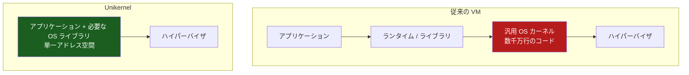
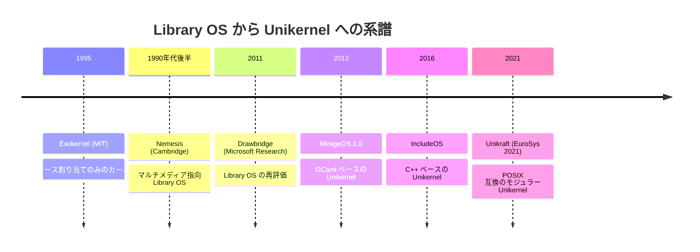
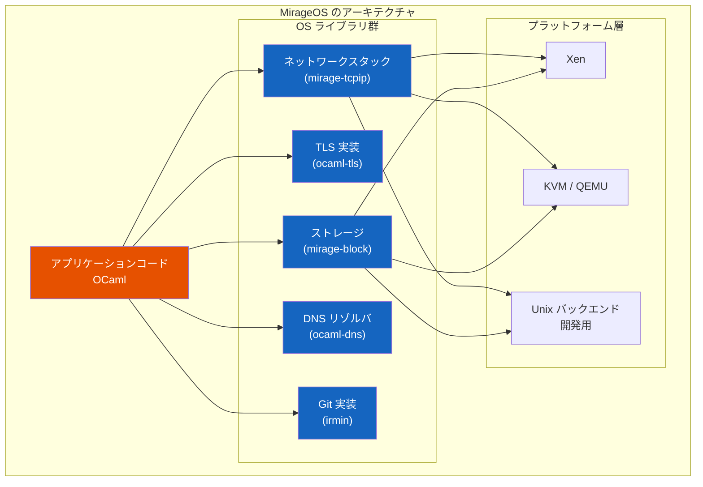
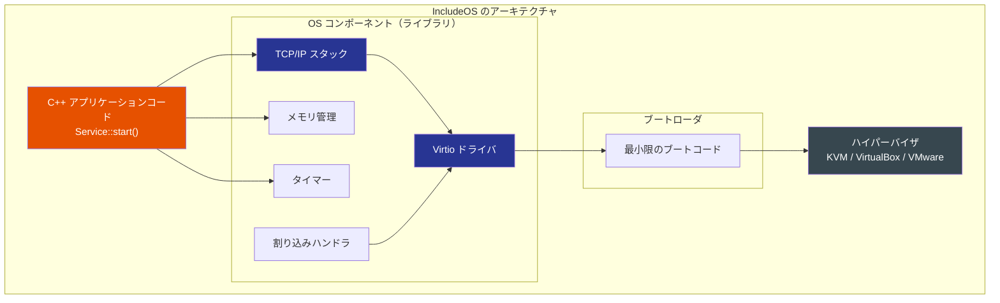
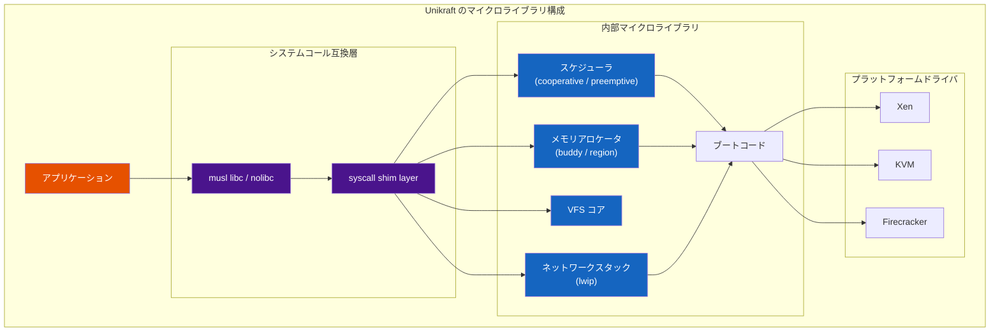
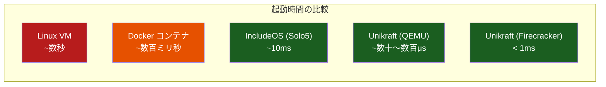
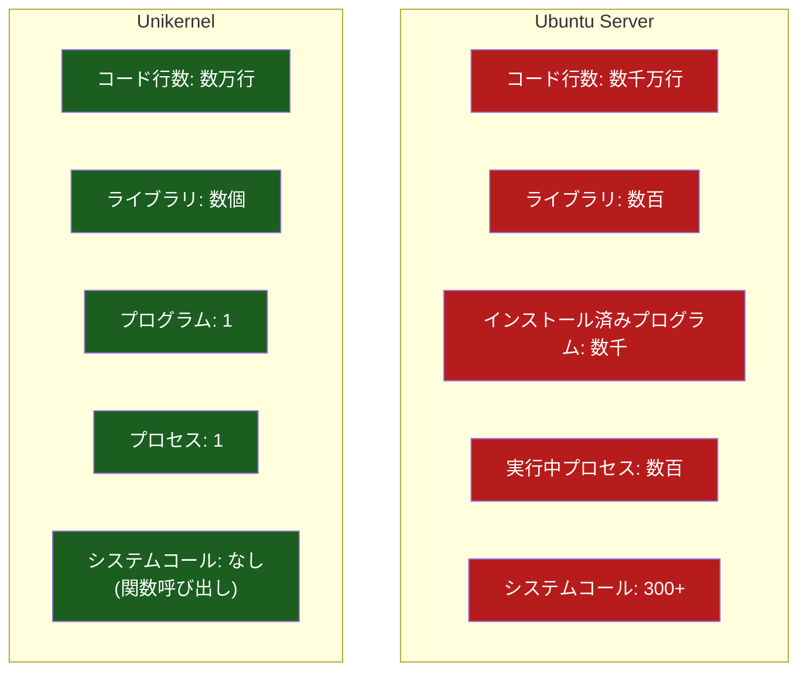
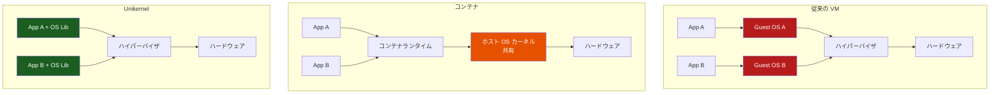
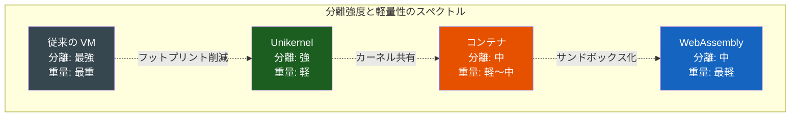

# Unikernel

## 1. Unikernel とは——OS を「丸ごと含む」アプリケーション

### 汎用 OS の過剰さ

現代のクラウドインフラストラクチャでは、仮想マシン（VM）やコンテナ上で単一のアプリケーションを実行するケースが圧倒的に多い。たとえば、ある VM 上で動作するのは Nginx だけ、別の VM では Redis だけ、というような構成は珍しくない。しかし、その VM の中では Linux カーネルが動作しており、数千万行に及ぶコードベースが存在する。USB ドライバ、Bluetooth スタック、ファイルシステムの多様な実装、数百のシステムコール——これらの大半は、その VM 上で動作するアプリケーションにとって不要である。

この過剰さは、複数のユーザーが複数のアプリケーションを一台のマシン上で同時に実行するという、汎用 OS の原始的な設計目的に由来する。タイムシェアリングシステムの時代から受け継がれたこの前提は、「1 VM に 1 アプリケーション」という現代のデプロイモデルとは根本的に噛み合わない。

### Unikernel の定義

Unikernel は、この不整合に対する根本的な回答である。Unikernel とは、アプリケーションコードと、そのアプリケーションが実際に必要とする OS 機能（ネットワークスタック、メモリ管理、デバイスドライバなど）だけをライブラリとして静的にリンクし、単一のアドレス空間で動作する専用の仮想マシンイメージのことである。



重要な特徴を整理すると以下のようになる。

- **単一アドレス空間**: カーネルモードとユーザーモードの区別がない。システムコールのオーバーヘッドが関数呼び出しに置き換わる
- **静的リンク**: コンパイル時にすべての依存関係が解決される。動的ロードは行わない
- **専用イメージ**: 汎用 OS ではなく、特定のアプリケーション専用のイメージとして構築される
- **ハイパーバイザ上で直接実行**: ゲスト OS を必要とせず、ハイパーバイザ上で直接ブートする
- **イミュータブル**: 一度ビルドされたイメージは変更されない。更新は新しいイメージの再ビルドとデプロイで行う

### 名前の由来

「Unikernel」の「Uni」は「単一（unified）」を意味する。従来の OS がカーネル空間とユーザー空間に分離していたのに対し、Unikernel ではすべてが単一の保護ドメイン内で動作するという設計思想を端的に表している。

## 2. Library OS の概念——Unikernel の思想的起源

### Library OS の歴史

Unikernel の根底にある Library OS（ライブラリ OS）の概念は、1990 年代の OS 研究にまで遡る。

**Exokernel（1995年、MIT）**

MIT の Dawson Engler らが提案した Exokernel は、カーネルの役割を物理リソース（ディスクブロック、メモリページ、プロセッサ時間）の割り当てだけに限定し、それらのリソースをどう使うかはアプリケーション側のライブラリに委ねるという設計だった。Exokernel のカーネル自体は最小限で、OS の抽象化はすべてアプリケーションにリンクされるライブラリ（Library OS）によって提供された。MIT は Aegis と XOK という 2 つの Exokernel を実装し、従来のモノリシックカーネルに比べて大幅な性能向上を示した。

**Nemesis（1990年代後半、ケンブリッジ大学ほか）**

Nemesis は、ケンブリッジ大学、グラスゴー大学、Citrix Systems らが開発した OS であり、共有リソースによるスケジューリング干渉を排除することに重点を置いていた。マルチメディアアプリケーションがリアルタイムのデッドラインを満たすことを目的とし、各アプリケーションが自身の OS 機能をライブラリとして持つ設計を採用していた。

**Drawbridge（2011年、Microsoft Research）**

Microsoft Research の Porter らによる Drawbridge は、Library OS の概念を再び脚光を浴びさせた。「Rethinking the Library OS from the Top Down」と題された論文で、Windows のサブセットを Library OS として動作させ、アプリケーションのアドレス空間内で OS の機能を提供するアプローチを示した。

### Library OS からUnikernel へ

これらの研究には共通した課題があった。まず、複数のアプリケーションを同時に実行する際のリソース分離が難しいこと。次に、デバイスドライバをすべて新しいモデルに合わせて書き直す必要があること。コモディティ PC のハードウェアが急速に進化する中、研究プロトタイプ用のドライバを維持し続けるのは実質的に不可能だった。

しかし、2000 年代後半にハイパーバイザが広く普及したことで、状況は一変した。ハイパーバイザが物理ハードウェアを抽象化し、仮想デバイス（Virtio など）の標準的なインタフェースを提供してくれるため、Library OS が対応すべきデバイスの種類は劇的に減少した。さらに、VM 間のリソース分離はハイパーバイザが担保してくれるため、Library OS にとっての最大の課題が解消された。



このように、ハイパーバイザの普及という技術的転換点を経て、Library OS の概念は「Unikernel」として現代に復活したのである。

## 3. MirageOS——型安全な Unikernel の先駆者

### MirageOS の設計思想

MirageOS は、Anil Madhavapeddy らを中心にケンブリッジ大学で開発された Unikernel フレームワークであり、2013 年に最初のリリースが行われた。MirageOS の最大の特徴は、OCaml という関数型プログラミング言語を全面的に採用し、型安全性を OS の構築原理にまで持ち込んだ点にある。

OCaml が選ばれた理由は明確である。

- **強力な静的型システム**: コンパイル時に多くのバグを検出できる
- **ポータブルなシングルスレッドランタイム**: ベアメタルや Xen VM のような制約の厳しい環境に適している
- **ネイティブコードへのコンパイル**: 実行時の型情報が不要で、高速なバイナリを生成する
- **関数型・命令型・オブジェクト指向のマルチパラダイム**: システムプログラミングに必要な柔軟性を持つ

### アーキテクチャ

MirageOS のアーキテクチャは、OCaml のモジュールシステムを基盤としている。OS の各機能（ネットワーク、ストレージ、暗号化など）は型付きモジュールシグネチャとして定義され、それぞれの実装が独立したライブラリとして提供される。



注目すべき設計上の特徴がいくつかある。

**開発と本番の抽象化**: MirageOS では、開発時には Unix バックエンド上でアプリケーションを通常のプロセスとして実行し、デバッグやテストを行う。本番デプロイ時には同じアプリケーションコードをコンパイルし直して、Xen や KVM 上で直接動作する Unikernel イメージを生成する。アプリケーションコードを変更する必要はない。

**プロトコルの完全再実装**: MirageOS は、既存の C ライブラリをラップするのではなく、TCP/IP スタック、TLS、DNS、Git プロトコルなどを OCaml で一から再実装している。これにより、OpenSSL の Heartbleed のような、C 言語のメモリ安全性に起因する脆弱性クラスを構造的に排除している。

**型付きシグネチャによる相互運用性**: OCaml のモジュールタイプによって、同じ API を満たす異なる実装を差し替え可能にしている。たとえば、ネットワークスタックの実装を切り替えても、アプリケーションコードはそのまま動作する。

### MirageOS の代表的な利用例

MirageOS で構築されたシステムの中で最も注目されるのは、ケンブリッジ大学の Computer Laboratory で運用された Xenプロジェクトの Web サイトである。これは MirageOS の Unikernel として直接 Xen 上で動作し、従来の Linux ベースの構成に比べて劇的にフットプリントが小さい。

また、Nitrokey 社の NetHSM は、MirageOS を用いて構築されたオープンソースのハードウェアセキュリティモジュール（HSM）であり、OCaml の型安全性が暗号鍵管理のようなセキュリティクリティカルな領域で大きな価値を発揮した実例である。

### MirageOS のコード例

MirageOS のアプリケーションがどのように記述されるかを簡潔に示す。以下は、HTTP サーバーの Unikernel を定義する `config.ml` の例である。

```ocaml
(* MirageOS application configuration *)
open Mirage

let main =
  main "Unikernel.Main"
    ~packages:[package "cohttp-mirage"]
    (stackv4v6 @-> job)

let () =
  register "my-http-server"
    [main $ default_stackv4v6 default_network]
```

このコードでは、ネットワークスタック（`stackv4v6`）を引数としてアプリケーションに渡すことで、環境に依存しない形でアプリケーションを構成している。開発時は Unix のソケットをバックエンドに、本番環境では Virtio のネットワークドライバをバックエンドに使うことが、コード変更なしで切り替えられる。

## 4. IncludeOS——C++ による最小限の Unikernel

### 設計原理

IncludeOS は、ノルウェーの Oslo and Akershus University College の Alfred Bratterud を中心に開発された、C++ 向けの Unikernel である。その名前が示すように、`#include <os>` とヘッダをインクルードするだけで、リンク時に最小限の OS がアプリケーションに「含まれる（include される）」という設計思想を持つ。

IncludeOS の設計上の核心は、アプリケーションコードと仮想ハードウェアの間に存在するレイヤーを極限まで薄くすることにある。

- **仮想メモリなし**: IncludeOS にはユーザー空間とカーネル空間の区別がなく、したがってシステムコールも存在しない
- **シングルプロセス**: 常に 1 つのアプリケーションだけが動作する
- **イベント駆動**: 非同期 I/O モデルを採用し、割り込みベースのイベントループで処理を行う
- **モジュラーな TCP/IP スタック**: 独自に実装された高性能なネットワークスタック

### コード例

IncludeOS の最小限の HTTP サーバーがどれほど簡潔に書けるかを示す。

```cpp
#include <os>      // include the operating system
#include <net/inet> // include networking

void Service::start()
{
  // Get the first network interface
  auto& inet = net::Super_stack::get(0);

  // Set up a simple HTTP server
  inet.tcp().listen(80, [](auto conn) {
    conn->on_read(1024, [conn](auto buf) {
      // Send HTTP response
      std::string response =
        "HTTP/1.1 200 OK\r\n"
        "Content-Type: text/plain\r\n\r\n"
        "Hello from IncludeOS!\n";
      conn->write(response);
      conn->close();
    });
  });
}
```

この数十行のコードから生成される 64 ビットの Unikernel イメージのサイズは、わずか約 2.5 MB である。

### アーキテクチャの特徴



IncludeOS のネットワークドライバは Virtio と vmxnet3 をサポートしており、DMA（Direct Memory Access）を活用した高効率な I/O を実現している。IBM Research との共同研究では、Solo5/uKVM と組み合わせることで起動時間を約 10 ミリ秒にまで短縮した実績がある。

### IncludeOS の現状

IncludeOS は C++11/14/17/20 をフルサポートしており、LLVM の libc++ を標準ライブラリとして使用する。対応プラットフォームは KVM、VirtualBox、VMware に加え、Google Compute Engine や OpenStack といったクラウドプラットフォームにも対応している。ただし、C++ に限定されるという言語の制約は、広範な採用の障壁となっている面がある。

## 5. Unikraft——POSIX 互換のモジュラー Unikernel

### Unikraft が解決する問題

Unikraft は、2021 年の EuroSys カンファレンスで発表された Unikernel フレームワークであり、NEC Laboratories Europe を中心としたチームによって開発された。Unikraft の設計は、それ以前の Unikernel プロジェクトが抱えていた 2 つの根本的な問題に取り組んでいる。

1. **POSIX 互換性の欠如**: MirageOS や IncludeOS のような既存の Unikernel は、それぞれ特定の言語（OCaml、C++）に強く結びついており、既存のアプリケーションをそのまま移植することが困難だった
2. **コードの再利用性の低さ**: 各 Unikernel プロジェクトは独自のスタックを一から構築する傾向があり、開発コストが非常に高い

### マイクロライブラリアーキテクチャ

Unikraft の核心は、OS の機能をきわめて細粒度の「マイクロライブラリ」に分解するアーキテクチャにある。



各マイクロライブラリは以下の特徴を持つ。

- **自己完結的**: 独自の Makefile と Kconfig 設定ファイルを持ち、他のライブラリから独立してビルドに追加・除外できる
- **相互交換可能**: 同じ API を実装するマイクロライブラリは差し替え可能。たとえば、cooperative スケジューラと preemptive スケジューラを切り替えられる
- **最小依存**: 依存関係が最小限に抑えられ、不要なコードが含まれない

### POSIX 互換性

Unikraft は、既存のアプリケーションをほぼ無修正で動作させることを目標としている。これを実現するのが、モジュラーなシステムコール shim 層と musl libc の統合である。

Unikraft は 160 以上のシステムコールを実装しており、以下のような代表的なアプリケーションの動作が確認されている。

| アプリケーション | 種類 |
|---|---|
| NGINX | Web サーバー |
| Redis | インメモリデータストア |
| SQLite | 組み込みデータベース |
| HAProxy | ロードバランサ |
| Memcached | 分散キャッシュ |
| Python | インタプリタ |
| Ruby | インタプリタ |
| Go | コンパイル済みバイナリ |

この POSIX 互換性により、Unikraft は「既存のアプリケーションを Unikernel として動作させる」というユースケースにおいて、最も実用的な選択肢となっている。

### ビルドシステム

Unikraft のビルドは `kraft` というコマンドラインツールを通じて行われる。設定は `Kraftfile`（以前は `kraft.yaml`）に記述する。

```yaml
# Kraftfile example
spec: v0.6
name: my-nginx-unikernel
unikraft:
  version: stable
targets:
  - platform: qemu
    architecture: x86_64
libraries:
  musl: stable
  lwip: stable
```

Unikraft のシステムコールは事実上の関数呼び出しであり、従来の Linux カーネルにおけるシステムコールのオーバーヘッド（コンテキストスイッチ、レジスタの保存・復元など）が存在しない。この最適化が、NGINX のような I/O 集約型アプリケーションで特に大きなスループット向上をもたらしている。

### MirageOS との統合

2025 年 11 月には、MirageOS の Unikernel を Unikraft 上で動作させるサポートが発表された。これは、MirageOS の型安全なアプリケーション開発モデルと、Unikraft の高性能なプラットフォーム層を組み合わせるもので、両プロジェクトの強みを活かした注目すべき展開である。

## 6. 起動時間とメモリフットプリント

### なぜ起動時間が重要なのか

Unikernel の実用上最も注目される特性の一つが、極めて高速な起動時間である。これは単なる「便利な特徴」ではなく、以下の新しいデプロイパターンを可能にする。

- **オンデマンド起動**: リクエストが到着してから Unikernel を起動し、レスポンスを返し、終了する。従来のサーバーレスコンピューティングにおけるコールドスタート問題を根本から解消する可能性がある
- **瞬時のスケールアウト**: 負荷の増大に対して、ミリ秒単位で新しいインスタンスを追加できる
- **障害からの即座の復旧**: インスタンスがクラッシュしても、新しいインスタンスを即座に起動できる

### ベンチマーク比較

各種 Unikernel フレームワークの起動時間とメモリフットプリントを、学術論文および公式ベンチマークに基づいて比較する。



| 環境 | 起動時間 | 最小メモリ | イメージサイズ（参考） |
|---|---|---|---|
| Linux VM（Ubuntu） | 数秒〜数十秒 | 数百 MB | 数 GB |
| Docker コンテナ | 数百ミリ秒 | 数十 MB | 数十〜数百 MB |
| IncludeOS (QEMU) | ~300 ms | 数 MB | ~2.5 MB |
| IncludeOS (Solo5) | ~10 ms | 数 MB | ~2.5 MB |
| Unikraft (QEMU) | 数十〜数百 μs | 2〜6 MB | 数百 KB〜数 MB |
| Unikraft (Firecracker) | < 1 ms | 2〜6 MB | 数百 KB〜数 MB |

> [!NOTE]
> 上記の数値は公式ドキュメントおよび学術論文（EuroSys 2021, ASPLOS 2022 Tutorial）に基づく参考値であり、ワークロードや設定により変動する。

### メモリ効率の仕組み

Unikernel がこれほど小さいメモリフットプリントを実現できる理由は複合的である。

1. **不要なコードの排除**: デッドコードエリミネーション（DCE）とリンク時最適化（LTO）により、使用されないカーネル機能がバイナリに含まれない
2. **ランタイムの簡素化**: プロセス管理、ユーザー管理、ファイルシステム階層などの汎用 OS に必須だがUnikernelには不要な機能が存在しない
3. **単一アドレス空間**: ページテーブルの複雑な階層が不要であり、メモリ管理のオーバーヘッドが小さい
4. **静的リンク**: 共有ライブラリのためのダイナミックリンカやローダが不要

### 2024〜2025 年の最新ベンチマーク

2025 年の研究（Unikernels vs. Containers: A Runtime-Level Performance Comparison）では、Nanos unikernel と Docker コンテナの詳細な比較が行われた。Go アプリケーションにおいて、Nanos の Unikernel イメージは 7.6 MB、Docker イメージは 7.0 MB とイメージサイズはほぼ同等であったが、起動時間では Unikernel がオーダーで優位であった。

一方で、メモリが極端に制約された環境（数 MB 以下）では、Linux カーネルのメモリ管理のほうが安定した性能を発揮するという結果も報告されている。Unikernel のメモリ管理は汎用 OS に比べて単純であるため、メモリ逼迫時のスワップやページ回収といった洗練されたメカニズムを持たないことがこの差の原因である。

2024 年 12 月のエッジコンピューティングに関する研究では、IoT アプリケーションにおいて Unikraft が約 45〜48 MB の RAM を使用し、Nanos が約 50 MB で続いたという結果が報告されており、軽量なエッジワークロードに適していることが確認されている。

## 7. セキュリティ特性

### 攻撃対象面の劇的な削減

Unikernel のセキュリティ上の最大のメリットは、攻撃対象面（attack surface）の劇的な削減である。具体的な数値で比較すると、その差は歴然としている。



### セキュリティ特性の詳細

**シェルの不在**

Unikernel にはシェル（bash、sh など）が存在しない。これは、リモートコード実行（RCE）の脆弱性が悪用された場合でも、攻撃者がシェルを起動してシステムを操作するという典型的な攻撃パスが構造的に不可能であることを意味する。

**他のプログラムの実行不可**

Unikernel はシングルプロセスシステムであり、設計上、当初意図されたもの以外のプログラムを実行できない。`fork()` や `exec()` のような他のプロセスを生成するシステムコールが存在しないため、マルウェアのダウンロードと実行、バックドアの設置、暗号通貨マイナーの起動といった攻撃が原理的に不可能である。

**ハイパーバイザレベルの分離**

各 Unikernel は独立した VM として動作するため、分離の保証はハイパーバイザによって提供される。これは、コンテナのようなカーネル共有型の分離よりもはるかに強固である。たとえ 1 つの Unikernel が完全に侵害されたとしても、他の Unikernel やホストシステムへの権限昇格は、ハイパーバイザの脆弱性がない限り不可能である。

**イミュータブルなインフラストラクチャ**

Unikernel のイメージは読み取り専用でデプロイされ、実行中に変更されることがない。これは、攻撃者がシステムファイルを改ざんしたり、永続的なバックドアを設置したりすることを防ぐ。

### MirageOS 固有のセキュリティ特性

MirageOS は OCaml の型安全性により、さらに強力なセキュリティ保証を提供する。

- **バッファオーバーフローの排除**: OCaml の配列境界チェックにより、C/C++ で頻発するバッファオーバーフロー脆弱性が構造的に排除される
- **メモリ安全性**: ガーベジコレクションとポインタ算術の不在により、use-after-free やダングリングポインタの問題が発生しない
- **TLS の再実装**: OpenSSL のような巨大で脆弱性の多い C ライブラリに依存せず、OCaml で TLS を一から実装している（ocaml-tls）。Heartbleed のような脆弱性クラスが構造的に存在しない

### セキュリティ上の注意点

ただし、Unikernel が万能のセキュリティソリューションではないことも認識すべきである。

- **単一アドレス空間のリスク**: カーネルモードとユーザーモードの分離がないため、バグによるメモリ破壊がシステム全体に影響する
- **ASLR の困難さ**: アドレス空間配置のランダム化（ASLR）が、単一アドレス空間では効果的に機能しにくい
- **デバッグの困難さ**: セキュリティインシデントが発生した際のフォレンジック分析が、従来の OS に比べて著しく困難である

## 8. コンテナ / VM との比較

### 三者の根本的な違い

Unikernel、コンテナ、従来の VM は、いずれも「アプリケーションの分離実行」という目的を共有するが、そのアプローチは根本的に異なる。



### 比較表

| 特性 | 従来の VM | コンテナ | Unikernel |
|---|---|---|---|
| **分離レベル** | ハイパーバイザ（強） | カーネル namespace（中） | ハイパーバイザ（強） |
| **起動時間** | 秒〜分 | ミリ秒〜秒 | マイクロ秒〜ミリ秒 |
| **メモリフットプリント** | 数百 MB〜 | 数十 MB〜 | 数 MB〜 |
| **イメージサイズ** | GB 単位 | MB〜GB | KB〜MB |
| **汎用性** | 高い | 高い | 低い（単一目的） |
| **エコシステム** | 成熟 | 非常に成熟 | 発展途上 |
| **デバッグ** | 従来通り | 従来通り | 困難 |
| **マルチプロセス** | 可能 | 可能 | 不可能 |
| **動的更新** | 可能 | 可能 | 不可能（再ビルド必要） |
| **攻撃対象面** | 大きい | 中程度 | 極めて小さい |
| **互換性** | 完全 | ほぼ完全 | 限定的 |

### 分離の質的な違い

コンテナとUnikernel の最も重要な違いは、分離の質である。

コンテナは Linux カーネルの namespace と cgroup を利用してプロセスを分離するが、すべてのコンテナが同じカーネルを共有している。したがって、カーネルの脆弱性は全コンテナに影響する。実際に、`dirty cow`（CVE-2016-5195）や `dirty pipe`（CVE-2022-0847）のようなカーネル脆弱性は、コンテナのエスケープに悪用された実績がある。

一方、Unikernel は各インスタンスが独立した VM として動作するため、ハイパーバイザの脆弱性がない限り、あるインスタンスの侵害が他に波及することはない。ただし、ハイパーバイザ自体の脆弱性（例：VENOM, CVE-2015-3456）は Unikernel にも影響するため、リスクがゼロになるわけではない。

### ユースケース別の適性

**コンテナが適しているケース**:
- 既存アプリケーションの移行（エコシステムの成熟度）
- 開発環境と本番環境の統一（Docker Compose、Kubernetes）
- マイクロサービスアーキテクチャ（豊富なオーケストレーションツール）

**Unikernel が適しているケース**:
- セキュリティが最優先のワークロード（暗号鍵管理、認証サービス）
- 極めて高速な起動が求められるサーバーレスコンピューティング
- IoT / エッジデバイスでのリソース制約環境
- ネットワーク機能仮想化（NFV）

**従来の VM が適しているケース**:
- 複数のプロセスやサービスが必要なモノリシックアプリケーション
- 完全な OS 環境が必要な場合
- レガシーソフトウェアの実行

## 9. Unikernel の課題と将来

### 現在の課題

Unikernel は理論的には魅力的だが、実用上の課題は依然として多い。

#### デバッグの困難さ

これは Unikernel の最も深刻な課題であり、2016 年に Joyent（現 Triton DataCenter）の Bryan Cantrill が「Unikernels are Unfit for Production」と題した有名な批判で指摘した問題の核心でもある。

従来の OS では、問題が発生した際に `ps`、`htop`、`strace`、`tcpdump`、`netstat`、`gdb` といったツールを使って状態を観察できる。Unikernel にはこれらのツールが存在しない。プロセスという概念がないため `ps` は動作しないし、シェルがないため対話的なデバッグセッションも不可能である。

::: warning デバッグに関する現状
NanoVMs のような企業は、GDB リモートデバッグや構造化ログの仕組みを提供することでこの課題に取り組んでいるが、従来の OS と同等のデバッグ体験には程遠いのが現状である。
:::

#### 開発エコシステムの未成熟

コンテナには Docker Hub に数百万のイメージがあり、Kubernetes には巨大なエコシステムが存在する。Unikernel には、これに匹敵するパッケージリポジトリ、オーケストレーションツール、CI/CD パイプラインとの統合がまだ不足している。

#### 既存アプリケーションの移植コスト

Unikraft の POSIX 互換層は大きな進歩だが、すべてのシステムコールが実装されているわけではない。マルチプロセスに依存するアプリケーション、`fork()` を多用するアプリケーション、動的リンクを前提とするアプリケーションは、そのままでは動作しない。

#### 動的な更新の不可能性

Unikernel は静的にリンクされたイミュータブルなイメージであるため、セキュリティパッチを当てるにはイメージ全体の再ビルドとデプロイが必要になる。緊急の脆弱性対応において、この再ビルド・再デプロイのサイクルがボトルネックになる可能性がある。

#### マルチプロセッシングの制約

ほとんどの Unikernel はシングルプロセスであり、ログ収集、モニタリングエージェント、設定の動的更新といった「補助タスク」を同一インスタンス内で実行できない。これらの機能は、サイドカーパターン（別の Unikernel インスタンスとして起動する）か、外部サービスとして提供する必要がある。

### 将来の展望

#### サーバーレスコンピューティングとの融合

Unikernel の超高速起動は、サーバーレスコンピューティングの「コールドスタート問題」に対する理想的な解決策となりうる。AWS Lambda のような FaaS（Function as a Service）プラットフォームでは、関数の初回呼び出し時に数百ミリ秒から数秒のコールドスタートが発生する。Unikernel ならば、リクエストごとに新しいインスタンスを起動・破棄するモデルが、マイクロ秒レベルのレイテンシで実現可能になる。

実際、AWS の Firecracker（Lambda と Fargate の基盤技術）は、Unikernel そのものではないが、軽量 VM という同じ方向性を追求している。Unikraft の Firecracker サポートは、この融合の具体的な例である。


#### エッジコンピューティングと IoT

リソースが極めて制約されたエッジデバイスにおいて、Unikernel の小さなフットプリントは大きなアドバンテージとなる。2024 年の研究では、ARM ベースのエッジデバイスにおける Unikernel の実現可能性が検証されており、IoT ゲートウェイや組み込みシステムでの活用が期待されている。

#### ConfidentialComputing との組み合わせ

Intel SGX や AMD SEV、ARM CCA などの Confidential Computing 技術と Unikernel を組み合わせることで、ハイパーバイザさえも信頼する必要のないセキュアな実行環境を構築できる可能性がある。Unikernel の最小限のコードベースは、TEE（Trusted Execution Environment）内で動作させるワークロードとして理想的である。

#### WebAssembly との関係

WebAssembly（Wasm）のサーバーサイド実行環境（WASI）は、Unikernel と同様に「軽量で高速起動の分離実行環境」を志向している。両者は競合関係にあるが、補完関係にもなりうる。Unikernel がハイパーバイザレベルの強い分離を提供するのに対し、Wasm はソフトウェアベースのサンドボックスによるさらに軽量な分離を提供する。



#### Unikernel のメインストリーム化への道筋

Unikernel がメインストリームに到達するためには、以下の条件が揃う必要があるだろう。

1. **デバッグ体験の改善**: リモートデバッグ、構造化ロギング、分散トレーシングとの統合が、従来のアプリケーション開発と同程度に使いやすくなること
2. **オーケストレーションの成熟**: Kubernetes のような既存のオーケストレーションプラットフォームとのシームレスな統合、もしくは Unikernel に特化したオーケストレーションツールの成熟
3. **CI/CD パイプラインへの統合**: Unikernel イメージのビルド・テスト・デプロイが、コンテナと同程度に容易になること
4. **クラウドプロバイダのネイティブサポート**: AWS、GCP、Azure などが Unikernel を第一級市民としてサポートすること

Unikraft のようなプロジェクトはこれらの課題に正面から取り組んでおり、POSIX 互換性の向上、Firecracker / QEMU / Xen などの複数プラットフォームサポート、`kraft` CLI によるビルド体験の改善など、着実な進歩を見せている。

### まとめ

Unikernel は、「アプリケーションに必要な OS 機能だけを含む専用イメージ」という、Library OS の系譜に連なるシンプルかつ強力な概念である。MirageOS は型安全性を武器に先駆者としての道を切り拓き、IncludeOS は C++ の世界に最小限の OS を持ち込み、Unikraft は POSIX 互換性とモジュラー設計で実用性を大幅に向上させた。

起動時間、メモリフットプリント、セキュリティにおいて Unikernel がもたらす利点は明確だが、デバッグの困難さ、エコシステムの未成熟、既存アプリケーションの移植コストという課題は依然として大きい。Unikernel は汎用 OS やコンテナを「置き換える」技術ではなく、セキュリティクリティカルなワークロード、サーバーレスコンピューティング、エッジ/IoT といった特定の領域で、既存技術を「補完する」位置づけにある。

サーバーレスコンピューティングの拡大、エッジコンピューティングの普及、Confidential Computing の発展という技術潮流は、Unikernel の特性と強く共鳴している。課題が解決されるにつれて、Unikernel は「研究プロトタイプ」から「プロダクション技術」へと着実に進化していくだろう。
