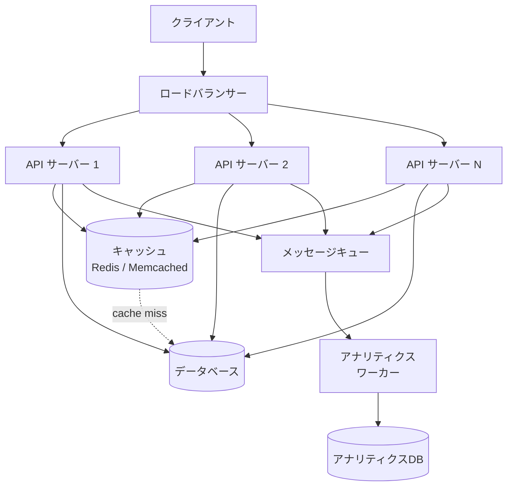
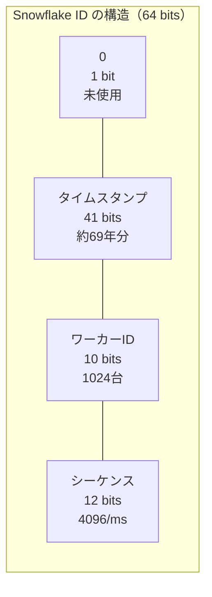
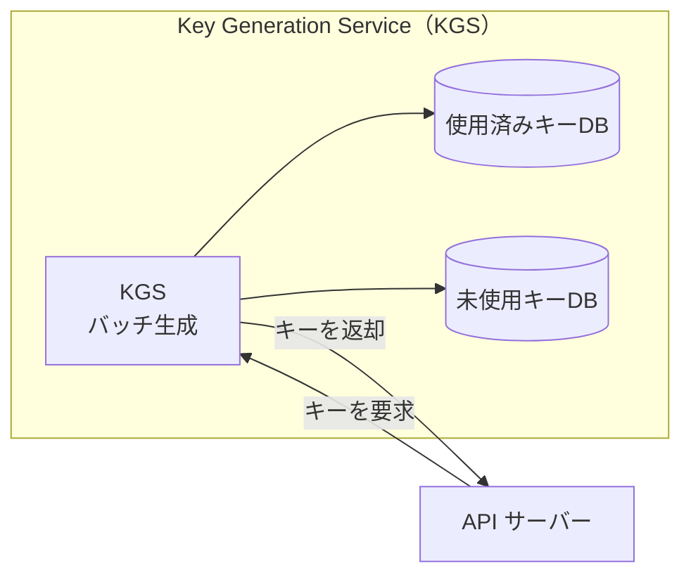
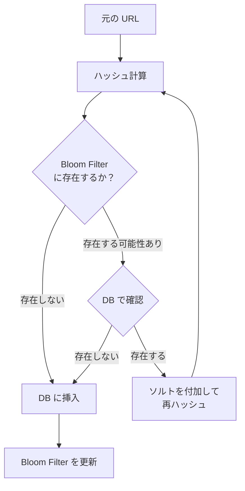
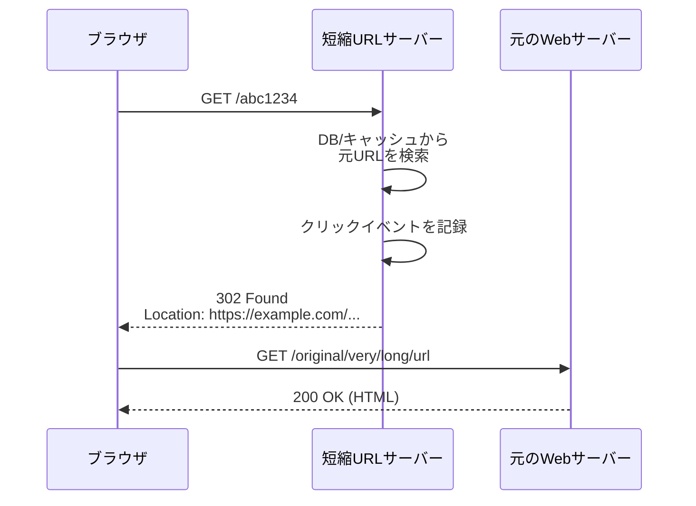
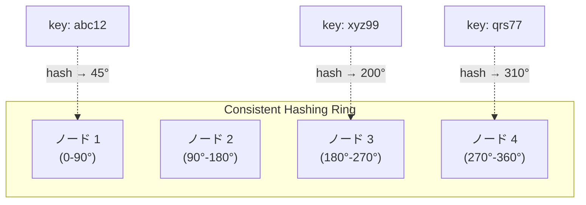
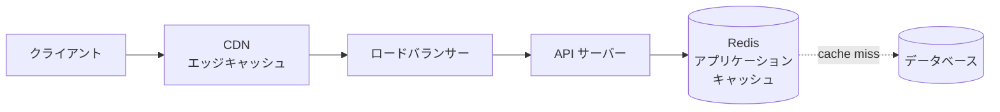
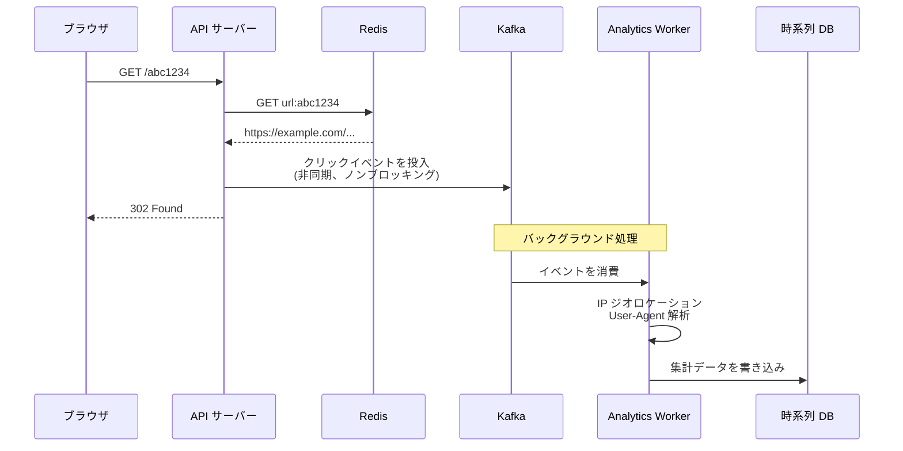
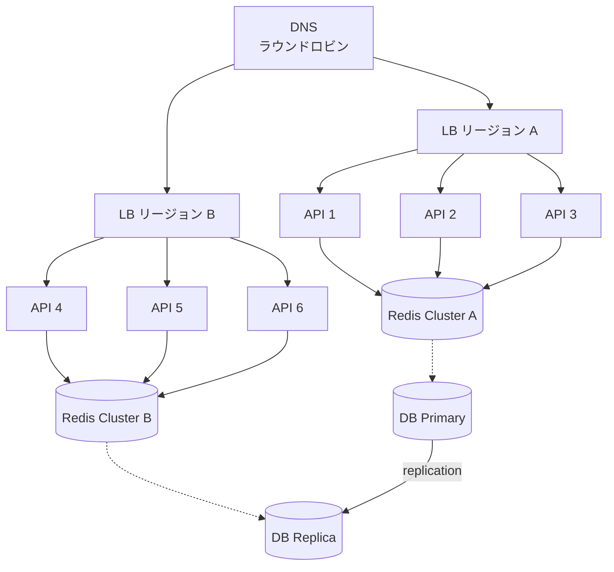
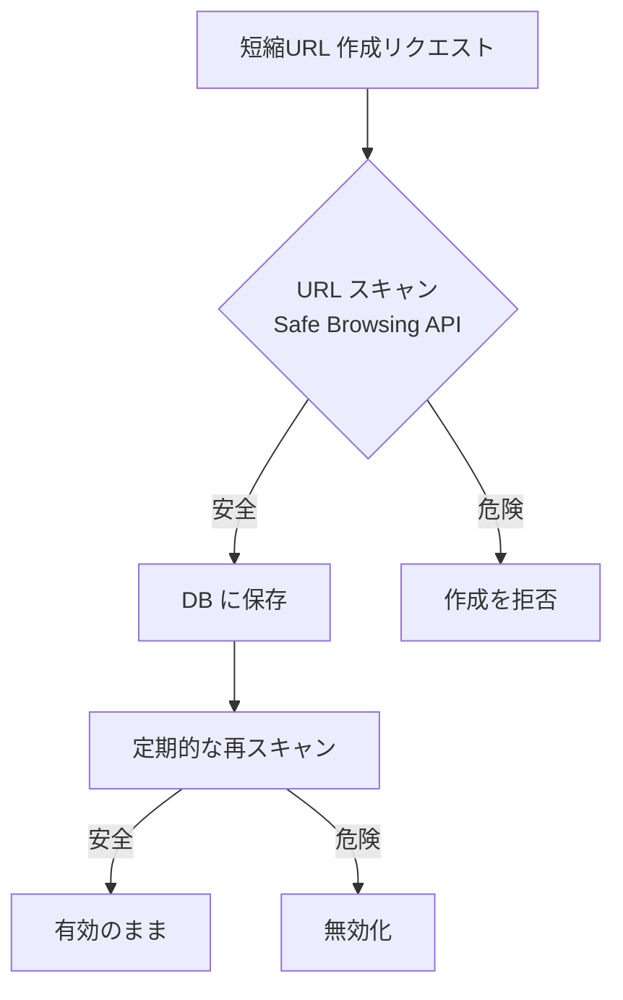

# URL短縮サービスの設計 — Base62・ハッシュ・分散IDとアナリティクス

## 1. URL短縮サービスとは何か

URL短縮サービスとは、長いURLを短い文字列に変換し、その短縮URLにアクセスすると元のURLへリダイレクトするサービスである。2000年代初頭に登場した TinyURL が先駆けであり、その後 bit.ly、goo.gl（2019年にサービス終了）、t.co（X/Twitter の内部短縮）など、多くのサービスが生まれた。

一見すると単純な「URL の対応表を持つだけ」のサービスに見えるが、実際にはシステム設計の主要な論点が凝縮されている。具体的には、**一意なキーの生成**、**高スループットなリダイレクト処理**、**大規模データの永続化**、**キャッシュ戦略**、**分散環境での整合性**、**アナリティクス基盤**、そして**セキュリティ**といった要素を一つのサービスの中で総合的に設計しなければならない。

このため、URL短縮サービスはシステム設計面接の定番トピックであると同時に、バックエンドエンジニアリングの実践的な教材としても価値が高い。本記事では、要件定義から始めて、キー生成アルゴリズム、データストア設計、キャッシュ、アナリティクス、スケーリング、セキュリティまでを体系的に解説する。

## 2. 要件定義と設計課題

### 2.1 機能要件

URL短縮サービスの基本的な機能要件は以下の通りである。

1. **短縮URL の作成**: ユーザーが長いURLを入力すると、短縮URLを返す
2. **リダイレクト**: 短縮URLにアクセスすると、元のURLへリダイレクトされる
3. **カスタムエイリアス（オプション）**: ユーザーが任意の短縮キーを指定できる
4. **有効期限（オプション）**: 短縮URLに有効期限を設定できる
5. **アナリティクス**: クリック数、アクセス元の地理情報、リファラーなどを追跡できる

### 2.2 非機能要件

非機能要件は設計の方向性を大きく左右する。

- **高可用性**: リダイレクトは常に動作しなければならない。短縮URLが機能しないと、リンクを含むすべてのコンテンツ（SNS投稿、メール、広告など）が壊れる
- **低レイテンシ**: リダイレクトは数十ミリ秒以内に完了すべきである。ユーザーはURLをクリックした後、即座にページが表示されることを期待する
- **スケーラビリティ**: bit.ly は月間数十億回のリダイレクトを処理している。大規模なサービスでは秒間数万〜数十万リクエストを処理する必要がある

### 2.3 概算（Back-of-the-envelope Estimation）

具体的な数値で規模を把握しておくことは設計の基礎となる。以下では中〜大規模サービスを想定する。

| 項目 | 推定値 |
|------|--------|
| 新規短縮URLの作成 | 1,000万件/月 |
| リダイレクト回数 | 10億回/月（読み書き比率 100:1） |
| 書き込み QPS | 約 4 req/s（10M / 30日 / 86400秒） |
| 読み取り QPS | 約 400 req/s（ピーク時はこの数倍） |
| 保存期間 | 5年 |
| 総レコード数 | 6億件（10M × 12ヶ月 × 5年） |
| 1レコードあたりのサイズ | 約 500バイト（URL + メタデータ） |
| 総ストレージ | 約 300 GB |

この規模感から、以下のことが分かる。

- ストレージは現代の基準では大きくない（単一ノードでも収まる規模）
- **読み取りが圧倒的に多い**（Read-heavy workload）ため、キャッシュの効果が大きい
- 書き込み QPS は低いが、リダイレクトのレイテンシが重要

### 2.4 全体アーキテクチャ

基本的なアーキテクチャの全体像を示す。



主要なコンポーネントは以下の通りである。

- **ロードバランサー**: リクエストを複数の API サーバーに分散する
- **API サーバー**: 短縮URL の作成とリダイレクト処理を担う、ステートレスなアプリケーションサーバー
- **キャッシュ**: 頻繁にアクセスされる短縮URL のマッピングをメモリ上に保持する
- **データベース**: 短縮URL と元のURL のマッピングを永続化する
- **メッセージキュー**: アナリティクスデータを非同期に処理するためのバッファ
- **アナリティクスワーカー**: クリックイベントを集計・保存する

## 3. 短縮キーの生成方法

URL短縮サービスの設計において最も重要な判断の一つが、**短縮キー（short key）** の生成方法である。短縮キーとは、`https://short.url/abc123` の `abc123` の部分を指す。

### 3.1 キー空間の設計

まず、キーの長さと使用する文字集合によって、生成可能なキーの総数（キー空間のサイズ）が決まる。

**Base62 エンコーディング**とは、`[a-zA-Z0-9]`（小文字26 + 大文字26 + 数字10 = 62文字）を使う方式である。キーの長さごとのキー空間は以下の通りである。

| キー長 | キー空間のサイズ |
|--------|------------------|
| 6文字 | 62^6 ≈ 568億 |
| 7文字 | 62^7 ≈ 3.5兆 |
| 8文字 | 62^8 ≈ 218兆 |

前述の概算で5年間の総レコード数を6億件と見積もったので、**7文字の Base62 キー**（約3.5兆通り）があれば十分すぎるほどのキー空間を確保できる。実用上は6文字でも十分だが、将来の成長を見越して7文字を採用するのが一般的である。

URL に含まれる文字として安全であること（RFC 3986 の unreserved characters に該当する文字のみ使う）も、Base62 を採用する理由の一つである。Base64 の `+` や `/` は URL 内で特別な意味を持つため避けるのが賢明である。

### 3.2 方式1: ハッシュ関数 + 切り詰め

最も直感的なアプローチは、元の URL をハッシュ関数に通して短縮キーを生成する方法である。

```
hash(original_url) → 固定長のハッシュ値 → 先頭N文字を短縮キーとして使用
```

**手順**:

1. 元の URL に対してハッシュ関数（MD5、SHA-256 など）を適用する
2. 得られたハッシュ値を Base62 にエンコードする
3. 先頭の7文字を短縮キーとして採用する

```python
import hashlib
import string

BASE62_CHARS = string.ascii_letters + string.digits  # a-zA-Z0-9

def hash_to_base62(url: str, length: int = 7) -> str:
    # Compute SHA-256 hash and take first 8 bytes as integer
    sha256 = hashlib.sha256(url.encode()).hexdigest()
    num = int(sha256[:15], 16)  # use first 15 hex chars (60 bits)

    # Convert to Base62
    result = []
    for _ in range(length):
        result.append(BASE62_CHARS[num % 62])
        num //= 62
    return ''.join(result)
```

**メリット**:
- 同じ URL に対して常に同じ短縮キーが生成される（冪等性）
- 元の URL から短縮キーを決定論的に計算できるため、重複チェックが容易

**デメリット**:
- **衝突（Collision）が避けられない**: ハッシュ値を切り詰めているため、異なる URL が同じ短縮キーにマッピングされる確率が無視できない。誕生日のパラドックスにより、キー空間が 62^7 ≈ 3.5兆であっても、数百万件のレコードで衝突が現実的に発生しうる
- 衝突時のリトライ処理が必要

**衝突解決の方法**: 衝突が検出された場合、元の URL にソルト（カウンタやタイムスタンプ）を付加して再ハッシュする。

```python
def generate_short_key(url: str) -> str:
    for attempt in range(MAX_RETRIES):
        candidate_url = url if attempt == 0 else f"{url}:{attempt}"
        key = hash_to_base62(candidate_url)
        if not key_exists_in_db(key):  # check for collision
            return key
    raise Exception("Failed to generate unique key")
```

この方式では、短縮キーの生成のたびにデータベースへの存在確認クエリが必要となる。これは書き込みパスにおけるレイテンシ増加の要因となるが、書き込み QPS が低いサービスでは許容範囲であることが多い。

### 3.3 方式2: 自動インクリメントID + Base62 変換

データベースの自動インクリメントID を Base62 にエンコードする方法である。

```
auto_increment_id → Base62 encode → 短縮キー
```

```python
BASE62_CHARS = "0123456789abcdefghijklmnopqrstuvwxyzABCDEFGHIJKLMNOPQRSTUVWXYZ"

def encode_base62(num: int) -> str:
    if num == 0:
        return BASE62_CHARS[0]
    result = []
    while num > 0:
        result.append(BASE62_CHARS[num % 62])
        num //= 62
    return ''.join(reversed(result))

def decode_base62(s: str) -> int:
    num = 0
    for char in s:
        num = num * 62 + BASE62_CHARS.index(char)
    return num

# Examples:
# encode_base62(1)         -> "1"
# encode_base62(100000000) -> "6LAze"
# encode_base62(62**7 - 1) -> "ZZZZZZZ"  (max 7-char key)
```

**メリット**:
- **衝突が原理的に発生しない**: 自動インクリメントID は一意であるため、生成されるキーも必ず一意になる
- 実装がシンプルで理解しやすい

**デメリット**:
- **予測可能性**: 連番であるため、次に生成されるキーが推測できる。これはセキュリティ上の懸念となりうる（後述）
- **単一障害点**: 自動インクリメントID の生成元が単一のデータベースに依存するため、スケーラビリティのボトルネックとなる
- **キーの長さが一定でない**: ID が小さいうちはキーも短く、大きくなると長くなる（ただし、開始オフセットを設定すれば回避可能）

### 3.4 方式3: 分散ID生成（Snowflake 方式）

分散環境でも衝突なく一意な ID を生成する手法として、Twitter が開発した **Snowflake** が広く知られている。Snowflake は64ビットの整数 ID を以下の構造で生成する。

```
| 1 bit (unused) | 41 bits (timestamp) | 10 bits (worker ID) | 12 bits (sequence) |
```



- **タイムスタンプ（41 bits）**: カスタムエポックからのミリ秒単位の経過時間。約69年分の範囲をカバーする
- **ワーカーID（10 bits）**: 最大1024台のワーカーを識別する。データセンターID（5 bits）とマシンID（5 bits）に分割することもある
- **シーケンス番号（12 bits）**: 同一ミリ秒内の連番。1ミリ秒あたり最大4096個の ID を生成可能

```python
import time

class SnowflakeGenerator:
    def __init__(self, worker_id: int, epoch: int = 1609459200000):
        # worker_id: 0-1023
        self.worker_id = worker_id
        self.epoch = epoch  # custom epoch (2021-01-01 in ms)
        self.sequence = 0
        self.last_timestamp = -1

    def _current_millis(self) -> int:
        return int(time.time() * 1000)

    def generate(self) -> int:
        timestamp = self._current_millis()

        if timestamp == self.last_timestamp:
            # Same millisecond: increment sequence
            self.sequence = (self.sequence + 1) & 0xFFF  # 12 bits
            if self.sequence == 0:
                # Sequence overflow: wait for next millisecond
                while timestamp <= self.last_timestamp:
                    timestamp = self._current_millis()
        else:
            self.sequence = 0

        self.last_timestamp = timestamp

        # Compose 64-bit ID
        snowflake_id = (
            ((timestamp - self.epoch) << 22)  # 41-bit timestamp
            | (self.worker_id << 12)           # 10-bit worker ID
            | self.sequence                     # 12-bit sequence
        )
        return snowflake_id
```

**メリット**:
- **衝突なし**: ワーカーID が一意であれば、同一ミリ秒・同一ワーカーでも4096個まで一意な ID を生成可能
- **分散環境対応**: 複数のサーバーが独立して ID を生成できるため、中央集権的なID生成サーバーが不要
- **時系列ソート可能**: タイムスタンプが上位ビットにあるため、ID の大小関係がおおよその時間順序を反映する

**デメリット**:
- **時計同期への依存**: NTP の設定不備などで時計がずれると、ID の単調増加性が崩れたり、最悪の場合衝突が発生する
- **ワーカーID の管理**: 各サーバーに一意なワーカーID を割り当てる仕組みが必要（ZooKeeper、環境変数、データベースなど）

生成された Snowflake ID を Base62 にエンコードすれば、短縮キーとして使用できる。64ビット整数は Base62 で最大11文字になるが、先頭ゼロを除けば実用上7〜10文字程度に収まる。

### 3.5 方式4: 事前生成キープール（Key Generation Service）

短縮キーをあらかじめ大量に生成しておき、リクエスト時にプールから取り出す方式である。



**手順**:

1. Key Generation Service（KGS）が、ランダムな7文字の Base62 キーを事前に大量生成する
2. 生成したキーは「未使用キーDB」に格納する
3. 短縮URL の作成リクエストが来ると、KGS は未使用キーを1つ取り出し、「使用済みキーDB」に移動する
4. 取り出したキーを API サーバーに返す

**メリット**:
- 短縮URL 作成時のレイテンシが極めて低い（キーの取り出しのみ）
- 衝突の心配が不要
- ハッシュ計算もID生成も不要

**デメリット**:
- KGS 自体が単一障害点になりうる（レプリケーションで対処）
- 事前生成のバッチ処理と未使用キーの管理が必要
- キーの在庫管理（枯渇検知、補充）のオペレーションが増える

### 3.6 方式の比較

| 方式 | 衝突リスク | 分散対応 | 予測可能性 | 実装の複雑さ |
|------|-----------|---------|-----------|-------------|
| ハッシュ + 切り詰め | あり | 容易 | 低い | 低 |
| 自動インクリメントID | なし | 困難 | 高い | 低 |
| Snowflake | なし | 容易 | 中程度 | 中 |
| 事前生成キープール | なし | 中程度 | 低い | 中〜高 |

実務では、サービスの規模と要件に応じて選択する。小〜中規模であれば自動インクリメントID + Base62 が最もシンプルであり、大規模サービスでは Snowflake 方式または事前生成キープールが適している。

## 4. 衝突回避戦略

短縮キーの衝突は、サービスの信頼性を直接脅かす問題である。衝突が発生すると、異なるユーザーの URL が同じ短縮キーに紐づき、一方のリンクが壊れる。

### 4.1 ハッシュ方式における衝突回避

ハッシュ方式を採用する場合、衝突は確率的に発生する。これを回避するための戦略を以下に示す。

**Bloom Filter による高速な存在確認**: データベースへの問い合わせの前に、Bloom Filter でキーの存在を確率的にチェックする。Bloom Filter は偽陽性（false positive）はあるが偽陰性（false negative）はないため、「存在しない」と判定されたキーは確実に使用可能である。



**衝突時のリトライ戦略**: 衝突が検出された場合のリトライ方法にはいくつかの選択肢がある。

1. **カウンタ付加**: `hash(url + ":1")`、`hash(url + ":2")` のようにカウンタを付加する
2. **ランダムソルト付加**: ランダムな文字列をソルトとして付加する
3. **別のハッシュ関数を使用**: MD5 で衝突した場合に SHA-256 を試すなど

### 4.2 分散環境における一意性の保証

複数の API サーバーが同時に短縮キーを生成する環境では、サーバー間の調整が必要となる。

**楽観的ロック（Optimistic Locking）**: データベースの一意制約（UNIQUE constraint）に頼る方法である。短縮キーをプライマリキーまたは一意インデックスとして設定し、INSERT 時に重複があればエラーとして検知する。エラーが発生した場合はリトライする。

```sql
-- Unique constraint ensures no duplicate keys
CREATE TABLE url_mappings (
    short_key VARCHAR(7) PRIMARY KEY,
    original_url TEXT NOT NULL,
    created_at TIMESTAMP NOT NULL DEFAULT CURRENT_TIMESTAMP,
    expires_at TIMESTAMP NULL,
    user_id BIGINT NULL
);

-- Optimistic insert: retry on duplicate key
INSERT INTO url_mappings (short_key, original_url)
VALUES ('abc1234', 'https://example.com/very/long/path')
ON CONFLICT (short_key) DO NOTHING;
-- If affected rows = 0, a collision occurred; retry with a new key
```

**レンジベースのパーティショニング**: 各サーバーに異なる ID レンジを割り当てることで、衝突を構造的に防ぐ。例えば、サーバー1は ID 1〜100万、サーバー2は ID 100万1〜200万を使用する。レンジが枯渇したら新しいレンジを割り当てる。この方式は ZooKeeper や etcd のような分散協調サービスと組み合わせて使われることが多い。

## 5. リダイレクト処理 — 301 vs 302

短縮URL にアクセスしたときのリダイレクト処理には、HTTP ステータスコード 301（Moved Permanently）と 302（Found / Moved Temporarily）の2つの選択肢がある。この選択はサービスの挙動に大きな影響を与える。

### 5.1 301 Moved Permanently

```
HTTP/1.1 301 Moved Permanently
Location: https://example.com/original/very/long/url
```

301 はブラウザに「このURLは恒久的に移動した」と伝える。ブラウザはこのレスポンスを**キャッシュ**し、次回以降は短縮URLサーバーにリクエストを送らず、直接元のURLにアクセスする。

**メリット**:
- 2回目以降のアクセスで短縮URLサーバーへの負荷がかからない
- ユーザーのリダイレクトレイテンシが低くなる

**デメリット**:
- ブラウザがキャッシュするため、**クリック数を正確に計測できない**
- 元のURLを後から変更しても、キャッシュが残っている限り古いURLにリダイレクトされる

### 5.2 302 Found

```
HTTP/1.1 302 Found
Location: https://example.com/original/very/long/url
```

302 はブラウザに「このURLは一時的に移動した」と伝える。ブラウザはレスポンスをキャッシュせず、毎回短縮URLサーバーにリクエストを送る。

**メリット**:
- **すべてのクリックを正確に追跡できる**（アナリティクスに不可欠）
- 元のURLを後から変更できる（柔軟性が高い）

**デメリット**:
- 毎回サーバーにリクエストが来るため、サーバー負荷が高い
- リダイレクトのレイテンシが毎回発生する

### 5.3 実務上の選択

ほとんどの商用URL短縮サービスは **302** を採用している。理由はアナリティクスがURL短縮サービスの主要な収益源であるためである。bit.ly のようなサービスは、クリック分析データをユーザーに提供することで価値を生み出しており、301 を使ってしまうとクリックの大部分を追跡できなくなる。



なお、**307 Temporary Redirect** と **308 Permanent Redirect** という比較的新しいステータスコードもある。301/302 ではリダイレクト時に HTTP メソッドが GET に変更される可能性があるのに対し、307/308 では元のメソッドが維持される。URL短縮サービスのリダイレクトは通常 GET リクエストであるため、この違いは大きな問題にならないが、API 短縮URL のようなユースケースでは考慮が必要となる。

## 6. データストア設計

### 6.1 データモデル

URL短縮サービスの中核となるデータは、短縮キーと元の URL のマッピングである。

```sql
-- Core URL mapping table
CREATE TABLE url_mappings (
    short_key   VARCHAR(7)   PRIMARY KEY,
    original_url TEXT         NOT NULL,
    user_id      BIGINT       NULL,
    created_at   TIMESTAMP    NOT NULL DEFAULT CURRENT_TIMESTAMP,
    expires_at   TIMESTAMP    NULL,
    click_count  BIGINT       NOT NULL DEFAULT 0
);

-- Index for looking up by original URL (for deduplication)
CREATE INDEX idx_original_url ON url_mappings (original_url);

-- Index for expiration cleanup
CREATE INDEX idx_expires_at ON url_mappings (expires_at)
    WHERE expires_at IS NOT NULL;
```

### 6.2 RDBMS vs NoSQL

データストアの選択は、サービスの規模と要件によって異なる。

#### RDBMS（PostgreSQL、MySQL など）

**適するケース**: 中規模までのサービス、ACID トランザクションが必要な場合、カスタムエイリアスの一意性保証が重要な場合。

**メリット**:
- UNIQUE 制約やトランザクションにより、データの整合性が自然に保証される
- SQL による柔軟なクエリが可能
- 運用ノウハウが豊富

**デメリット**:
- 水平スケーリングが NoSQL ほど容易ではない
- 数十億件規模になるとシャーディングが必要で、運用コストが増大する

#### NoSQL（DynamoDB、Cassandra など）

**適するケース**: 大規模サービス、読み取りレイテンシの最小化が最優先の場合。

**メリット**:
- キー・バリュー型のルックアップが非常に高速
- 水平スケーリングが容易（特に DynamoDB は自動スケーリングに対応）
- 書き込みスループットが高い

**デメリット**:
- 一意性制約のネイティブサポートがない（アプリケーション層で保証する必要がある）
- 複雑なクエリには不向き

#### DynamoDB を使う場合のテーブル設計例

```
Table: url_mappings
  Partition Key: short_key (String)
  Attributes:
    - original_url (String)
    - user_id (Number)
    - created_at (String, ISO 8601)
    - expires_at (Number, Unix timestamp, TTL attribute)
    - click_count (Number)
```

DynamoDB の TTL 機能を使えば、`expires_at` に指定した時刻を過ぎたアイテムが自動的に削除されるため、有効期限機能を低コストで実現できる。

### 6.3 シャーディング戦略

データが単一のデータベースインスタンスに収まらなくなった場合、シャーディング（水平分割）が必要となる。

**短縮キーによるハッシュベースシャーディング**: 短縮キーのハッシュ値をシャード数で割った余りをシャードIDとする方式。データが均等に分散されやすい。

```
shard_id = hash(short_key) % num_shards
```

**Consistent Hashing**: ノードの追加・削除時にデータの再配置を最小限に抑える方式。大規模な分散システムでは事実上の標準であり、Amazon DynamoDB や Apache Cassandra が内部的に採用している。



**レンジベースシャーディング**: 短縮キーの先頭文字によってシャードを決定する方式（例: a-j → シャード1、k-t → シャード2、u-z → シャード3）。ホットスポットが発生しやすいため、一般的には推奨されない。

## 7. キャッシュ戦略

URL短縮サービスは読み取りが圧倒的に多い（Read-heavy）ワークロードであり、キャッシュの導入効果が非常に大きい。

### 7.1 キャッシュの配置



キャッシュは複数のレイヤーに配置できる。

1. **CDN / エッジキャッシュ**: 地理的にユーザーに近い場所でリダイレクトレスポンスをキャッシュする。レイテンシの削減効果が最も大きいが、302 レスポンスはキャッシュされないことが多い。`Cache-Control` ヘッダーを適切に設定すれば、302 でもキャッシュさせることは可能（`Cache-Control: public, max-age=300` など）
2. **アプリケーションキャッシュ（Redis / Memcached）**: データベースの前段に配置し、頻繁にアクセスされるマッピングをメモリ上に保持する。最も一般的なキャッシュ層

### 7.2 キャッシュパターン

**Cache-Aside（Lazy Loading）**: 最も広く使われるパターンである。

```python
def get_original_url(short_key: str) -> str | None:
    # Step 1: Check cache
    cached = redis.get(f"url:{short_key}")
    if cached:
        return cached.decode()

    # Step 2: Cache miss - query database
    row = db.query("SELECT original_url FROM url_mappings WHERE short_key = %s", short_key)
    if row is None:
        return None

    # Step 3: Populate cache
    redis.setex(f"url:{short_key}", TTL_SECONDS, row.original_url)
    return row.original_url
```

**手順**:
1. まずキャッシュを確認する
2. キャッシュミスの場合、データベースを参照する
3. データベースから取得した結果をキャッシュに書き込む

### 7.3 キャッシュの容量見積もりとエビクション

アクセスパターンには通常 **80/20 の法則**（パレートの法則）が当てはまる。全 URL の 20% が全アクセスの 80% を占めるとすれば、頻繁にアクセスされる URL だけをキャッシュすれば高いヒット率を達成できる。

前述の概算で日間リダイレクト数は約3,300万回（10億回/月 ÷ 30日）であり、その 20% に対応する URL のマッピング（約120万件 × 500バイト ≈ 600MB）をキャッシュすればよい。Redis のメモリ使用量としては十分に現実的な規模である。

**エビクションポリシー**には **LRU（Least Recently Used）** が適している。最近アクセスされていない URL はキャッシュから追い出し、アクセスされた URL を優先的に保持する。Redis はネイティブに LRU エビクションをサポートしており、`maxmemory-policy allkeys-lru` の設定で有効化できる。

### 7.4 キャッシュの整合性

短縮URL のマッピングは、一度作成されると**ほぼ変更されない**（immutable に近い）データである。このため、キャッシュの整合性はそれほど深刻な問題にはならない。適切な TTL を設定しておけば、万が一 URL が変更されたとしても TTL 経過後に最新のデータがキャッシュされる。

ただし、URL の削除（不正URL の即時ブロックなど）に対応する必要がある場合は、キャッシュの即時無効化（Cache Invalidation）の仕組みが必要となる。Redis の `DEL` コマンドで対象キーを削除するか、Pub/Sub で全キャッシュノードに無効化を通知する方式が使われる。

## 8. アナリティクス

URL短縮サービスにおけるアナリティクスは、単なる付加機能ではなく、サービスの核心的な価値である。bit.ly のようなサービスでは、アナリティクスデータこそが主要な収益源であり、リンクの作成とリダイレクトは無料で提供し、詳細な分析データを有料プランで提供するビジネスモデルが一般的である。

### 8.1 収集すべきデータ

リダイレクトの度に以下の情報を記録する。

| フィールド | 内容 | 取得方法 |
|-----------|------|---------|
| short_key | 短縮キー | URL パス |
| timestamp | アクセス日時 | サーバー時刻 |
| ip_address | アクセス元 IP | リクエストヘッダー |
| user_agent | ブラウザ/OS 情報 | User-Agent ヘッダー |
| referer | リファラー（参照元） | Referer ヘッダー |
| country / city | 地理情報 | IP ジオロケーション |
| device_type | デバイス種別 | User-Agent 解析 |
| os | OS 情報 | User-Agent 解析 |
| browser | ブラウザ情報 | User-Agent 解析 |

### 8.2 リアルタイム性とリダイレクトレイテンシのトレードオフ

クリックイベントの記録をリダイレクト処理と**同期的**に行うと、リダイレクトのレイテンシが増大する。データベースへの書き込みが完了するまでレスポンスを返せないためである。

これを解決するのが**非同期処理**である。リダイレクト処理の中ではクリックイベントをメッセージキュー（Kafka、Amazon SQS など）に投入するだけに留め、実際の集計・保存はバックグラウンドのワーカーが行う。



この設計により、リダイレクト処理はキャッシュの参照とメッセージキューへの投入（いずれもミリ秒単位）だけで完了し、レイテンシへの影響を最小限に抑えられる。

### 8.3 アナリティクスデータの保存

アナリティクスデータは時系列データの性質を持つため、保存先の選択が重要である。

#### 生イベントの保存

生のクリックイベントをすべて保存する場合、月間10億件のイベントとなる。各イベントが約200バイトとすると、月間約200GBのデータが発生する。

- **Apache Kafka + Amazon S3**: Kafka でリアルタイムに受け取り、一定期間バッファリングした後、S3 に Parquet 形式で保存する。コスト効率が良く、後から Athena や Spark で分析可能
- **ClickHouse**: 列指向データベースで、大量の分析クエリを高速に処理できる。INSERT のスループットも高い

#### 集約データの保存

多くのアナリティクスユースケースでは、生イベントそのものではなく、集約された統計データ（時間帯別クリック数、国別クリック数など）が求められる。

```sql
-- Pre-aggregated click statistics
CREATE TABLE click_stats (
    short_key   VARCHAR(7)  NOT NULL,
    period       TIMESTAMP   NOT NULL,  -- hourly bucket
    click_count  BIGINT      NOT NULL DEFAULT 0,
    unique_visitors BIGINT   NOT NULL DEFAULT 0,
    PRIMARY KEY (short_key, period)
);

-- Country-level aggregation
CREATE TABLE click_stats_by_country (
    short_key   VARCHAR(7)  NOT NULL,
    period       TIMESTAMP   NOT NULL,
    country_code CHAR(2)     NOT NULL,
    click_count  BIGINT      NOT NULL DEFAULT 0,
    PRIMARY KEY (short_key, period, country_code)
);
```

事前集約（Pre-aggregation）を行うことで、ダッシュボードの表示時に生イベントをスキャンする必要がなくなり、レスポンスが高速化される。

### 8.4 IP ジオロケーション

IP アドレスから地理情報を取得するには、以下の方法がある。

- **MaxMind GeoIP2**: オフラインデータベース（.mmdb 形式）として提供されており、ローカルで高速に検索可能。無料版（GeoLite2）と有料版がある
- **クラウドサービスの機能**: AWS CloudFront の `CloudFront-Viewer-Country` ヘッダーなど、CDN レベルで地理情報を付加できる

パフォーマンスの観点から、外部 API 呼び出しではなくローカルデータベースを使用することが推奨される。MaxMind GeoIP2 のルックアップは数マイクロ秒で完了するため、リダイレクト処理のレイテンシにほとんど影響しない。

## 9. スケーリングと高可用性

### 9.1 API サーバーのスケーリング

API サーバーはステートレスであるため、ロードバランサーの背後にインスタンスを追加するだけで水平スケーリングが可能である。



### 9.2 データベースのスケーリング

**Read Replica**: 読み取りが圧倒的に多いワークロードでは、リードレプリカを追加することで読み取りスループットを線形に向上させられる。短縮URL のルックアップはリードレプリカに向け、作成リクエストはプライマリに向ける。

**シャーディング**: 前述の Consistent Hashing によるシャーディングを行えば、データ量とスループットの両面でスケールアウトが可能になる。

### 9.3 高可用性の設計

URL短縮サービスの可用性は特に重要である。サービスが停止すると、世界中のリンクが一斉に壊れるからである。

**マルチリージョンデプロイ**: 複数のリージョンにサービスを展開し、DNS ベースのルーティング（GeoDNS）でユーザーを最寄りのリージョンに誘導する。一つのリージョンが障害を起こしても、他のリージョンがトラフィックを引き受ける。

**データベースのレプリケーション**: マルチリージョン構成では、各リージョンにデータベースのレプリカを配置する。書き込みは単一のプライマリリージョンに集約し、非同期レプリケーションで他のリージョンに伝搬させる。短縮URL のマッピングは一度作成されると変更されないため、非同期レプリケーションのレイテンシ（数百ミリ秒〜数秒）はほとんど問題にならない。

**サーキットブレーカー**: データベースやキャッシュへの接続が不安定になった場合に、連鎖的な障害を防ぐためにサーキットブレーカーパターンを導入する。例えば、データベースが応答しない場合にすべてのリクエストがタイムアウトを待つのではなく、即座にエラーレスポンスを返す。

### 9.4 Rate Limiting

悪意のあるユーザーや不正なボットによる大量リクエストからサービスを保護するために、Rate Limiting は不可欠である。

- **短縮URL 作成**: IP アドレスまたはユーザーアカウントあたり、1時間に100件など
- **リダイレクト**: 特定の短縮URL に対する秒間リクエスト数を制限する（DDoS 対策）

Rate Limiting は Redis の `INCR` と `EXPIRE` を組み合わせたスライディングウィンドウ方式で効率的に実装できる。

```python
def is_rate_limited(client_id: str, limit: int, window_seconds: int) -> bool:
    key = f"rate:{client_id}:{int(time.time()) // window_seconds}"
    count = redis.incr(key)
    if count == 1:
        redis.expire(key, window_seconds)
    return count > limit
```

## 10. セキュリティ考慮事項

URL短縮サービスは、その性質上、セキュリティリスクを増幅する可能性がある。短縮URL は元の URL を隠すため、ユーザーは**クリック先がどこか分からない**状態でリンクをたどることになる。

### 10.1 不正URL対策

**フィッシングサイトへの誘導**: 攻撃者がフィッシングサイトの URL を短縮し、正規のサービスに見せかけてユーザーを誘導する手口は非常に一般的である。

**マルウェア配布**: マルウェアをホストするサイトの URL を短縮することで、セキュリティフィルターを回避する手口も多い。

これらのリスクに対する防御策は以下の通りである。

1. **URL スキャン**: 短縮URL の作成時に、元の URL を Google Safe Browsing API や VirusTotal API でスキャンする。既知の不正URL リストに含まれている場合は作成を拒否する

2. **リアルタイム検知**: 作成時のスキャンだけでは不十分である。攻撃者は、短縮URL の作成後にサーバーのコンテンツを悪意あるものに差し替える（"bait and switch" 攻撃）ことがある。定期的に元の URL を再スキャンし、不正が検出された場合は短縮URL を無効化する

3. **プレビューページ**: 短縮URL にアクセスした際に、即座にリダイレクトするのではなく、元の URL を表示するプレビューページを挟む。bit.ly では URL の末尾に `+` を付けるとプレビューページが表示される



### 10.2 列挙攻撃（Enumeration Attack）

自動インクリメントID + Base62 方式を採用した場合、攻撃者は連番のキーを順番に試すことで、他のユーザーの短縮URL を列挙できてしまう。例えば、`abc123` の次が `abc124` であると予測できる場合、非公開のリンクが第三者に発見されるリスクがある。

**対策**:
- Snowflake 方式や事前生成キープールを使い、キーの予測可能性を下げる
- 自動インクリメントID を使う場合でも、Base62 エンコード前にビットシャッフル（Fisher-Yates シャッフルの応用）やXOR 暗号化を適用して、連番の関係性を隠す

```python
# XOR-based obfuscation to hide sequential patterns
SECRET_XOR_KEY = 0x5A3C_F291_7E4B_D068  # keep secret

def obfuscate_id(sequential_id: int) -> int:
    return sequential_id ^ SECRET_XOR_KEY

def deobfuscate_id(obfuscated_id: int) -> int:
    return obfuscated_id ^ SECRET_XOR_KEY  # XOR is its own inverse
```

### 10.3 オープンリダイレクタ（Open Redirector）

URL短縮サービスは本質的に**オープンリダイレクタ**である。これは OWASP（Open Web Application Security Project）が指摘するセキュリティリスクの一つであり、信頼されたドメイン（短縮URLサービスのドメイン）から任意のサイトにリダイレクトできることを意味する。

攻撃者はこれを悪用して、メールフィルターや企業のプロキシサーバーのURLブラックリストを回避できる。完全な解決は難しいが、以下の緩和策がある。

- 不正URL データベース（Google Safe Browsing など）との統合
- 作成頻度が異常に高いアカウントの検知とブロック
- CAPTCHAの導入（自動化された大量作成を防ぐ）
- ユーザー報告機能の提供

### 10.4 プライバシー

アナリティクスのためにユーザーの IP アドレスや User-Agent を記録することは、プライバシーに関する法的義務（GDPR、CCPA など）に抵触する可能性がある。

- IP アドレスは個人データとして扱い、適切に匿名化（集約後に生データを削除）する
- プライバシーポリシーでデータ収集について明示する
- データの保持期間を設定し、期間経過後に削除する
- GDPR の「削除する権利（Right to Erasure）」に対応する仕組みを構築する

## 11. 実装例: API 設計

### 11.1 REST API

```
POST /api/v1/urls
  Request Body:
    {
      "original_url": "https://example.com/very/long/path",
      "custom_alias": "my-link",     // optional
      "expires_at": "2026-12-31"     // optional
    }
  Response (201 Created):
    {
      "short_key": "abc1234",
      "short_url": "https://short.url/abc1234",
      "original_url": "https://example.com/very/long/path",
      "created_at": "2026-03-02T12:00:00Z",
      "expires_at": "2026-12-31T23:59:59Z"
    }

GET /{short_key}
  Response (302 Found):
    Location: https://example.com/very/long/path

GET /api/v1/urls/{short_key}/stats
  Response (200 OK):
    {
      "short_key": "abc1234",
      "total_clicks": 15234,
      "unique_visitors": 8921,
      "clicks_by_country": {
        "JP": 5432,
        "US": 3210,
        "DE": 1890,
        ...
      },
      "clicks_by_date": [
        {"date": "2026-03-01", "clicks": 542},
        {"date": "2026-03-02", "clicks": 631},
        ...
      ]
    }
```

### 11.2 リダイレクト処理のコア実装

```python
from fastapi import FastAPI, HTTPException, Request
from fastapi.responses import RedirectResponse
import redis
import asyncio

app = FastAPI()
cache = redis.Redis(host='localhost', port=6379, db=0)

@app.get("/{short_key}")
async def redirect(short_key: str, request: Request):
    # Step 1: Look up original URL (cache-aside pattern)
    original_url = await get_original_url(short_key)
    if original_url is None:
        raise HTTPException(status_code=404, detail="Short URL not found")

    # Step 2: Record click event asynchronously (fire-and-forget)
    asyncio.create_task(record_click_event(
        short_key=short_key,
        ip=request.client.host,
        user_agent=request.headers.get("User-Agent", ""),
        referer=request.headers.get("Referer", ""),
    ))

    # Step 3: Return 302 redirect
    return RedirectResponse(url=original_url, status_code=302)


async def get_original_url(short_key: str) -> str | None:
    # Check cache first
    cached = cache.get(f"url:{short_key}")
    if cached:
        return cached.decode()

    # Cache miss: query database
    row = await db.fetch_one(
        "SELECT original_url FROM url_mappings WHERE short_key = :key",
        {"key": short_key}
    )
    if row is None:
        return None

    # Populate cache (TTL: 1 hour)
    cache.setex(f"url:{short_key}", 3600, row["original_url"])
    return row["original_url"]


async def record_click_event(short_key: str, ip: str, user_agent: str, referer: str):
    # Send click event to message queue (Kafka, SQS, etc.)
    event = {
        "short_key": short_key,
        "timestamp": datetime.utcnow().isoformat(),
        "ip": ip,
        "user_agent": user_agent,
        "referer": referer,
    }
    await message_queue.send("click_events", event)
```

## 12. 設計上のトレードオフまとめ

システム設計において、すべての要件を完璧に満たす万能な解は存在しない。URL短縮サービスの設計でも、いくつかの重要なトレードオフが存在する。

### 12.1 一貫性 vs 可用性

CAP 定理により、ネットワーク分断時に一貫性と可用性の両方を完全に保証することはできない。URL短縮サービスでは、**可用性を優先する**のが一般的である。理由は以下の通りである。

- 短縮URL のマッピングは一度作成されると変更されない（イミュータブル）
- 同じ短縮キーが異なるURLに紐づく状況さえ防げれば、一時的に「最新のマッピングがまだ見えない」程度の不整合は許容できる
- リダイレクトが機能しなくなることの方が、わずかな遅延よりもはるかに深刻

### 12.2 レイテンシ vs アナリティクス精度

302 リダイレクト + 非同期アナリティクスの組み合わせは、レイテンシとアナリティクスの両立を図る現実的な解である。ただし、非同期処理ではメッセージの損失やワーカーの遅延により、リアルタイムの正確さは犠牲になる。

ダッシュボードに表示されるクリック数が数分遅れる程度は多くのユースケースで許容されるが、正確なリアルタイムカウントが必要な場合（広告のインプレッション課金など）は、同期的な書き込みや at-least-once / exactly-once セマンティクスの保証が必要となり、設計の複雑さが大きく増す。

### 12.3 シンプルさ vs スケーラビリティ

- 小規模サービス: 単一の PostgreSQL + Redis + 自動インクリメントID で十分
- 中規模サービス: Read Replica + Snowflake ID + 非同期アナリティクス
- 大規模サービス: マルチリージョン + シャーディング + Kafka + 事前生成キープール

最初から大規模な設計にする必要はない。**必要になったときにスケールアウトできるアーキテクチャ**（ステートレスな API サーバー、キャッシュ層の分離、非同期処理パイプラインの導入）を意識して設計しておくことが重要である。

## 13. 発展的な話題

### 13.1 カスタムドメイン

企業向けの URL 短縮サービスでは、`brand.link/campaign` のようなカスタムドメインを使いたいというニーズがある。これを実現するには、以下の仕組みが必要となる。

- ユーザーが自身のドメインの CNAME レコードを短縮サービスのサーバーに向ける
- API サーバーが `Host` ヘッダーを見て、どのドメインに対するリクエストかを判別する
- ドメインごとに別の短縮キー空間を管理する（テーブルにドメイン列を追加する）
- TLS 証明書の自動発行（Let's Encrypt + ACME プロトコル）

### 13.2 QRコード連携

URL短縮サービスと QR コードの組み合わせは、オフラインからオンラインへの導線として広く使われている。短縮URL は QR コードのデータ量を削減し、QR コードのサイズを小さくできるという実用的なメリットがある。

### 13.3 リンクの有効期限と自動削除

一定期間アクセスのない短縮URL や、有効期限が設定された URL は、自動的に削除（または無効化）する仕組みが必要である。

- **TTL ベースの自動削除**: DynamoDB の TTL 機能や、バッチジョブによる定期的な削除
- **アクセス履歴に基づく削除**: 直近 N 日間アクセスのない URL を削除するポリシー

これにより、データベースの肥大化を抑制し、ストレージコストを最適化できる。

## 14. まとめ

URL短縮サービスは一見シンプルだが、その設計にはシステム設計の主要な論点が凝縮されている。本記事で扱った主要な設計判断を振り返る。

1. **短縮キーの生成**: Base62 エンコーディングを基盤に、ハッシュ方式・自動インクリメント方式・Snowflake 方式・事前生成プール方式の4つのアプローチがあり、それぞれにトレードオフが存在する
2. **衝突回避**: Bloom Filter、楽観的ロック、レンジベースのパーティショニングなどの戦略を組み合わせて対処する
3. **リダイレクト**: 302（一時的）を選択することでアナリティクスの正確性を確保するのが一般的
4. **データストア**: RDBMS は整合性と柔軟性に優れ、NoSQL はスケーラビリティとレイテンシに優れる
5. **キャッシュ**: Read-heavy なワークロードには Cache-Aside パターンと LRU エビクションが有効
6. **アナリティクス**: 非同期のイベント処理パイプラインにより、リダイレクトレイテンシとアナリティクス精度を両立する
7. **スケーリング**: ステートレスな API サーバー、Read Replica、シャーディング、マルチリージョンデプロイで段階的にスケールする
8. **セキュリティ**: 不正URL のスキャン、列挙攻撃の防止、オープンリダイレクタのリスク軽減が必要

URL短縮サービスの設計を通じて、**キー生成アルゴリズム**、**キャッシュ戦略**、**非同期イベント処理**、**分散システムの一貫性と可用性のトレードオフ**、**セキュリティ設計**といった、バックエンドエンジニアリングの基本的な概念を横断的に学ぶことができる。これが、URL短縮サービスがシステム設計の学習教材として長年愛され続けている理由である。
