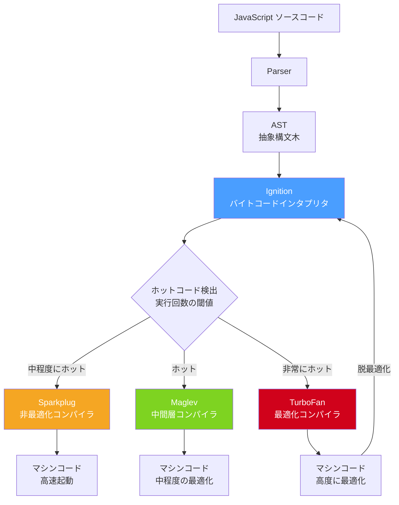
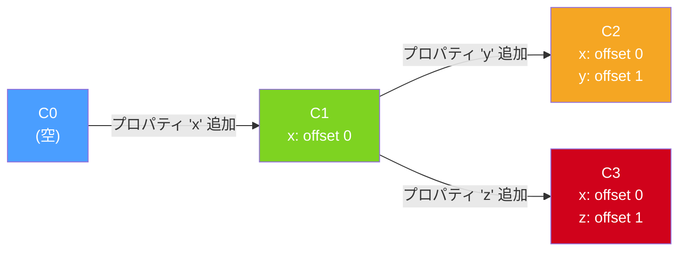
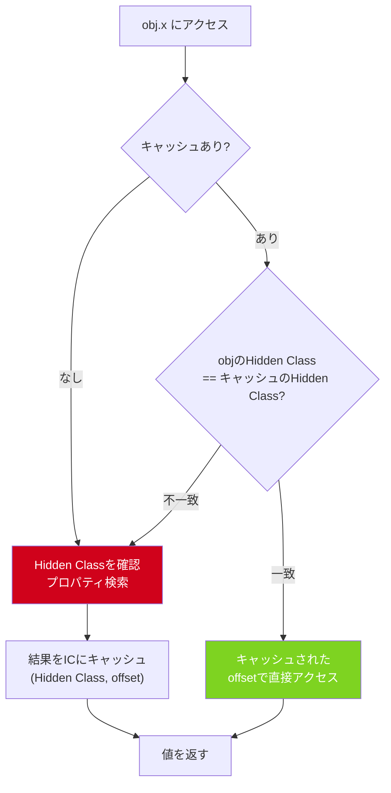
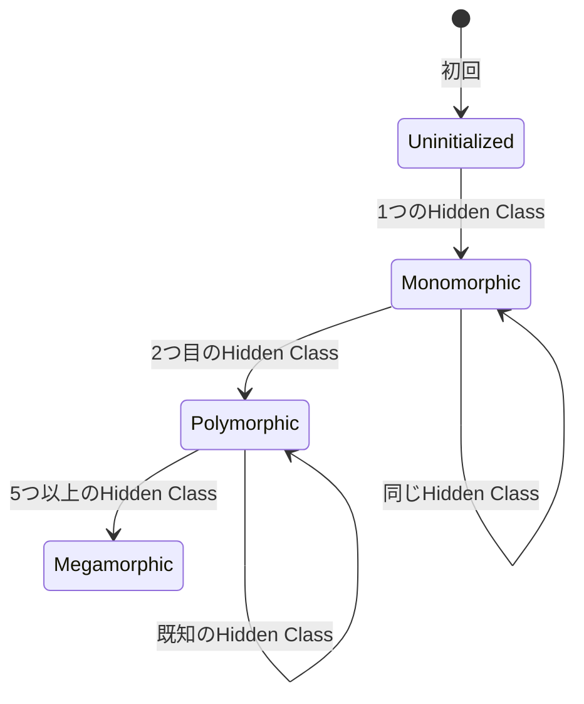
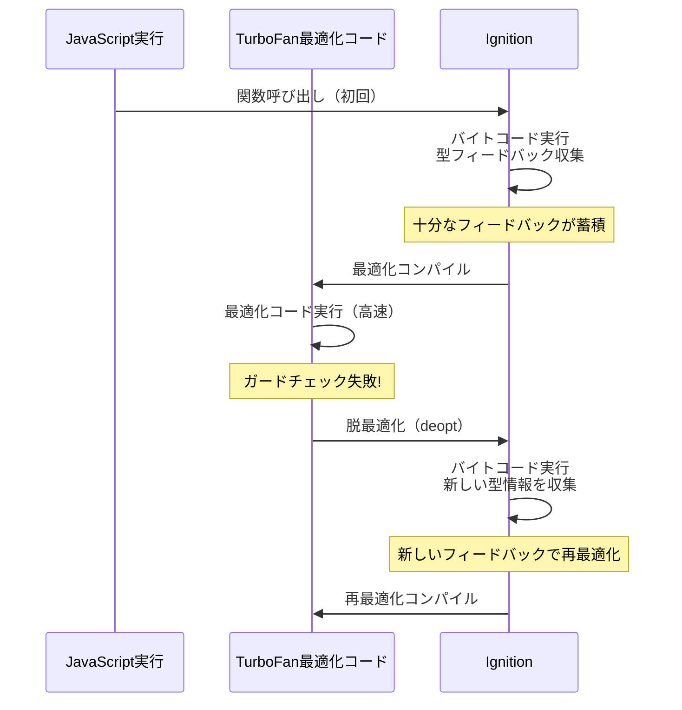
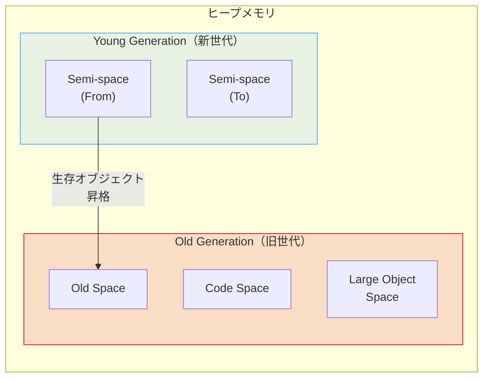
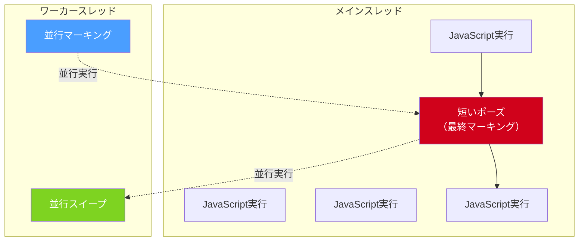
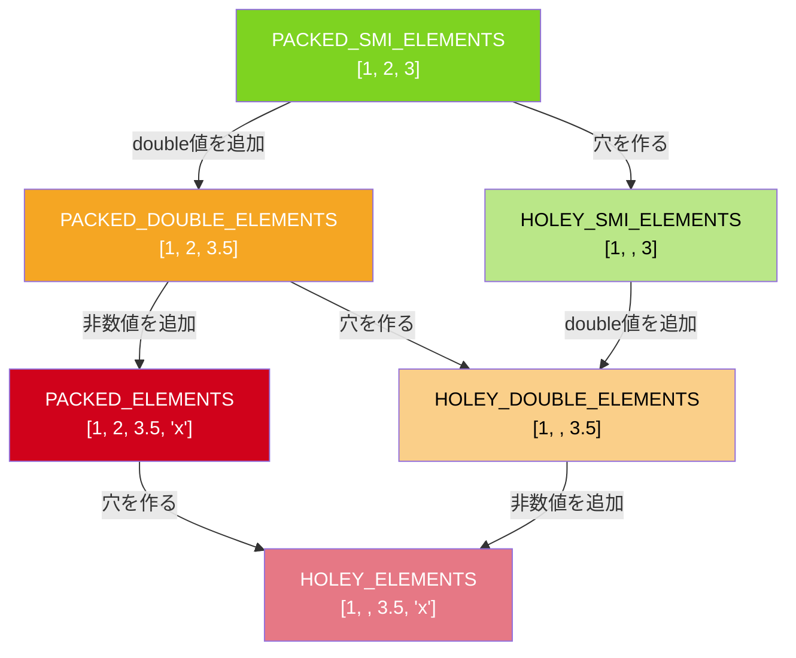

# V8エンジンの内部 — Hidden Class, Inline Cache, JITコンパイル

## 1. 背景：なぜJavaScriptエンジンの内部を理解するのか

### 1.1 JavaScriptと動的言語の宿命

JavaScriptは動的型付け言語である。変数の型は実行時まで確定せず、オブジェクトのプロパティは自由に追加・削除できる。この柔軟性はプログラマにとっての利点であると同時に、高速な実行を困難にする根本的な要因でもある。

CやC++のような静的型付け言語では、コンパイル時にオブジェクトのメモリレイアウトが確定する。構造体のフィールドへのアクセスは、ベースアドレスからの固定オフセットによるメモリ読み出しとして、1〜2命令で完了する。一方、JavaScriptでは `obj.x` という単純なプロパティアクセスですら、実行時にプロパティ名の辞書検索が必要になり得る。これをナイーブに実装すれば、ハッシュテーブルのルックアップが毎回発生し、パフォーマンスは桁違いに低下する。

```javascript
// Static language: field access = base address + fixed offset
// Dynamic language: property access = dictionary lookup (naive)
function getX(obj) {
  return obj.x; // What type is obj? Where is 'x' stored?
}

getX({ x: 1, y: 2 });       // shape A
getX({ x: "hello" });        // shape B
getX({ x: 1, y: 2, z: 3 }); // shape C
```

V8エンジンはこの動的言語の宿命に対して、Hidden ClassとInline Cacheという巧みな手法を用いることで、静的言語に匹敵するパフォーマンスを実現している。

### 1.2 V8の歴史と位置づけ

V8はGoogleが開発したオープンソースのJavaScriptエンジンであり、2008年にGoogle Chromeとともに登場した。V8の登場以前、JavaScriptエンジンの多くはインタプリタ方式であり、パフォーマンスは限定的だった。V8は最初期からJIT（Just-In-Time）コンパイルを採用し、JavaScriptの実行速度を劇的に向上させた。この革新がGmail、Google MapsなどのリッチWebアプリケーションの発展を支え、さらにはNode.jsやDenoといったサーバーサイドランタイムの基盤ともなった。

V8は現在、以下の環境で動作している。

- **Google Chrome / Chromium系ブラウザ**（Edge, Opera, Brave等）
- **Node.js** — サーバーサイドJavaScriptランタイム
- **Deno** — セキュアなJavaScript/TypeScriptランタイム
- **Electron** — デスクトップアプリケーションフレームワーク
- **Cloudflare Workers** — エッジコンピューティング

### 1.3 本記事の構成

本記事では、V8エンジンの内部アーキテクチャを以下の観点から深掘りする。

1. コンパイルパイプライン全体像（Ignition, Sparkplug, Maglev, TurboFan）
2. Hidden Class（Maps）によるオブジェクト表現の最適化
3. Inline Cache（IC）によるプロパティアクセスの高速化
4. JITコンパイルにおける投機的最適化と脱最適化
5. ガベージコレクション（Orinoco）
6. 実践的なパフォーマンスへの影響

## 2. V8のコンパイルパイプライン

### 2.1 全体アーキテクチャ

V8のコンパイルパイプラインは、JavaScript ソースコードを受け取り、最終的にマシンコードを生成する多段階のプロセスである。2024年時点のV8は、4つの主要なコンパイラ/インタプリタ層で構成されている。



このパイプラインの設計思想は「段階的最適化（tiered compilation）」である。すべてのコードを最適化コンパイルするのはコストが高いため、まず高速にバイトコードを生成し、実行頻度の高い「ホット」なコードのみを段階的に最適化していく。

### 2.2 Parser — ソースコードからASTへ

V8のパーサは、JavaScriptソースコードを解析してAST（抽象構文木）を生成する。V8には2種類のパーサがある。

- **Pre-parser（プレパーサ）**: 関数の外形のみを解析し、構文エラーの検出と変数のスコープ解決を行う。関数本体の完全な解析は遅延される。
- **Full parser**: 関数が実際に呼び出されるときに、完全なASTを生成する。

この遅延パース（lazy parsing）戦略により、使われない関数のパースコストを回避し、起動時間を短縮している。

### 2.3 Ignition — バイトコードインタプリタ

Ignitionは、ASTからV8独自のバイトコードを生成し、それをインタプリタとして実行するコンポーネントである。2016年にV8に導入された。

Ignitionの設計思想は以下のとおりである。

1. **低メモリフットプリント**: バイトコードはマシンコードよりもコンパクトであり、モバイルデバイスなどメモリが限られた環境で有利である。
2. **高速起動**: ASTからバイトコードへの変換は、最適化コンパイルよりもはるかに高速である。
3. **プロファイリング情報の収集**: Ignitionはバイトコード実行中に型情報やブランチの実行頻度といったフィードバック情報を収集し、後段の最適化コンパイラに提供する。

Ignitionのバイトコードはレジスタベースの設計であり、アキュムレータレジスタを中心とした命令セットを持つ。

```javascript
// Example JavaScript
function add(a, b) {
  return a + b;
}
```

上記のようなシンプルな関数に対して、Ignitionは概念的に以下のようなバイトコードを生成する。

```
Ldar a1       // Load argument 'b' into accumulator
Add a0, [0]   // Add argument 'a' to accumulator, feedback slot [0]
Return        // Return the accumulator value
```

ここで重要なのは `[0]` で示されるフィードバックスロットである。`Add` 命令は実行されるたびに、引数の型情報（整数同士の加算か、浮動小数点か、文字列連結か）をこのスロットに記録する。この情報が後段の最適化コンパイラにとっての重要な入力となる。

### 2.4 Sparkplug — 非最適化コンパイラ

Sparkplugは2021年に導入された、Ignitionのバイトコードから直接マシンコードを生成する非最適化コンパイラである。

Sparkplugの特徴は以下のとおりである。

- **ASTを経由しない**: Ignitionが生成したバイトコードを直接マシンコードに変換する。最適化は行わない。
- **超高速コンパイル**: 最適化を一切行わないため、コンパイル速度が極めて速い。
- **Ignitionとのフレーム互換性**: Sparkplugが生成するスタックフレームのレイアウトはIgnitionと同一であるため、IngnitionとSparkplugの間の遷移にコストがかからない。

Sparkplugの目的は、Ignitionのインタプリタオーバーヘッド（バイトコードのデコードとディスパッチ）を排除し、TurboFanのような最適化コンパイルのコストをかけずに、手軽にパフォーマンスを改善することにある。ベンチマークによっては、Sparkplugだけで5〜15%のパフォーマンス向上が報告されている。

### 2.5 Maglev — 中間層最適化コンパイラ

Maglevは2023年にChrome 117で有効化された中間層の最適化コンパイラである。

V8には従来、Ignition（遅い実行・高速コンパイル）とTurboFan（速い実行・低速コンパイル）の間に大きなギャップがあった。TurboFanはSea of Nodesと呼ばれる中間表現を使い、高度な最適化を行うが、コンパイル時間が長い。Sparkplugはこのギャップを起動時間の面では埋めたが、最適化を行わないため実行速度はIgnitionと大差ない。

Maglevはこの「中間」の層を埋めるために設計された。

- **SSA（Static Single Assignment）ベースの中間表現**: TurboFanのSea of Nodesよりも単純な、CFG（制御フローグラフ）ベースのSSA IRを使用する。
- **コンパイル速度**: TurboFanの10〜100倍速い。
- **最適化レベル**: 基本的な型特殊化、インライン化、定数畳み込みなどを行う。TurboFanほどの高度な最適化は行わないが、Sparkplugよりは格段に最適化されたコードを生成する。

### 2.6 TurboFan — 最適化コンパイラ

TurboFanはV8の最上位の最適化コンパイラであり、最も高度な最適化を行う。2015年に導入され、以前のCrankshaftコンパイラを置き換えた。

TurboFanの特徴は以下のとおりである。

1. **Sea of Nodes IR**: 制御フローとデータフローを統一的に扱うグラフベースの中間表現を使用する。これにより、命令スケジューリングやコード移動などの最適化が容易になる。
2. **投機的最適化**: Ignitionが収集した型フィードバック情報に基づいて、特定の型を前提とした最適化されたコードを生成する。前提が崩れた場合は脱最適化（deoptimization）を行い、Ignitionに戻る。
3. **高度な最適化パス**: インライン化、エスケープ解析、冗長排除、ループ不変式移動、定数畳み込み、デッドコード除去など、多数の最適化パスを持つ。


## 3. Hidden Class（Maps）— オブジェクト構造の内部表現

### 3.1 問題：動的オブジェクトのプロパティアクセス

JavaScriptのオブジェクトは本質的にキーと値の辞書（ディクショナリ）である。

```javascript
const point = { x: 1, y: 2 };
point.z = 3;       // add property dynamically
delete point.y;    // remove property dynamically
```

この柔軟性をナイーブに実装すれば、各オブジェクトは独自のハッシュテーブルを持ち、プロパティアクセスのたびにハッシュ計算と探索が必要になる。これでは、ホットループ内でのプロパティアクセスが深刻なボトルネックとなる。

### 3.2 Hidden Classの着想

V8はこの問題に対して、Self言語（1986年、Sun Microsystems）から着想を得たHidden Class（V8の内部ではMap、またはStructure/Shapeとも呼ばれる）というメカニズムを導入した。

Hidden Classの基本的なアイデアは以下のとおりである。

> 多くのJavaScriptプログラムでは、同じ「形状（shape）」を持つオブジェクトが大量に作成される。コンストラクタやファクトリ関数を通じて生成されたオブジェクトは、同じプロパティセットを持つ傾向がある。この規則性を利用して、オブジェクトの構造情報を共有する。

Hidden Classは以下の情報を保持する。

- **プロパティの名前と順序**
- **各プロパティのメモリ上のオフセット**
- **プロパティの属性**（writable, enumerable, configurable）
- **遷移（transition）テーブル** — プロパティが追加されたときに遷移する先のHidden Class

### 3.3 Hidden Classの遷移チェーン

オブジェクトにプロパティが追加されるたびに、Hidden Classが遷移する。この遷移は一方向の有向グラフを形成する。

```javascript
// Step 1: empty object
const obj = {};
// Hidden Class: C0 (no properties)

// Step 2: add property 'x'
obj.x = 1;
// Hidden Class: C0 --('x')--> C1
// C1: { x: offset 0 }

// Step 3: add property 'y'
obj.y = 2;
// Hidden Class: C1 --('y')--> C2
// C2: { x: offset 0, y: offset 1 }
```



重要なのは、同じ順序で同じプロパティを追加すれば、同じHidden Classを共有できることである。

```javascript
function Point(x, y) {
  this.x = x; // transition: C0 -> C1
  this.y = y; // transition: C1 -> C2
}

const p1 = new Point(1, 2);  // Hidden Class: C2
const p2 = new Point(3, 4);  // Hidden Class: C2 (same!)
```

`p1` と `p2` は同じHidden Class `C2` を共有する。これにより、以下の利点が生まれる。

1. **メモリ効率**: プロパティの構造情報がオブジェクト間で共有される。
2. **高速アクセス**: Hidden Classが同じなら、プロパティのオフセットも同じであるため、オフセットによる直接アクセスが可能になる。

### 3.4 オブジェクトのメモリレイアウト

V8のオブジェクトは、内部的に以下の構成を持つ。

```
┌──────────────────────────┐
│  Map（Hidden Classへのポインタ）│
├──────────────────────────┤
│  Properties（バッキングストア） │
├──────────────────────────┤
│  Elements（インデックス付き要素）│
├──────────────────────────┤
│  In-object property 0     │
│  In-object property 1     │
│  In-object property 2     │
│  ...                      │
└──────────────────────────┘
```

- **Map**: Hidden Classへのポインタ。全オブジェクトの最初のフィールドに格納される。
- **In-object properties**: オブジェクト本体に直接埋め込まれたプロパティ値。最も高速にアクセスできる。V8はコンストラクタで設定されるプロパティ数に基づいてスロットの数を予約する。
- **Properties（バッキングストア）**: in-objectスロットに収まらないプロパティは、別のヒープオブジェクトに格納される。
- **Elements**: 数値インデックスでアクセスされる要素（配列要素）は、プロパティとは別に管理される。

### 3.5 プロパティアクセスの種類

V8は、プロパティの格納方法を以下のように分類する。

| 格納方法 | 条件 | アクセス速度 |
|----------|------|-------------|
| In-object fast property | オブジェクト本体に埋め込み | 最速（固定オフセット） |
| Out-of-object fast property | バッキングストアに配列として格納 | 速い（インデックスアクセス） |
| Dictionary (slow) property | ハッシュテーブルで格納 | 遅い（ハッシュルックアップ） |

オブジェクトが「fast mode（高速モード）」から「dictionary mode（辞書モード）」に遷移する主な条件は以下のとおりである。

- `delete` 演算子でプロパティが削除された場合
- 多数のプロパティが動的に追加された場合
- Object.definePropertyで非標準的な属性が設定された場合

辞書モードへの遷移は不可逆であり、一度遷移するとfast modeには戻らない。これがパフォーマンスに大きな影響を与える。

### 3.6 Hidden Classが崩れるパターン

以下のコードパターンは、オブジェクト間でのHidden Classの共有を妨げ、パフォーマンスを低下させる。

```javascript
// Bad: different property order -> different Hidden Classes
function createBad(flag) {
  const obj = {};
  if (flag) {
    obj.x = 1;
    obj.y = 2;
  } else {
    obj.y = 2; // different order!
    obj.x = 1;
  }
  return obj;
}

const a = createBad(true);  // Hidden Class: C0 -> Cx -> Cxy
const b = createBad(false); // Hidden Class: C0 -> Cy -> Cyx
// a and b have DIFFERENT Hidden Classes!
```

```javascript
// Good: consistent property order -> same Hidden Class
function createGood(flag) {
  const obj = {};
  obj.x = flag ? 1 : 0;
  obj.y = flag ? 2 : 0;
  return obj;
}

const a = createGood(true);  // Hidden Class: C0 -> Cx -> Cxy
const b = createGood(false); // Hidden Class: C0 -> Cx -> Cxy (same!)
```

## 4. Inline Cache（IC）— プロパティアクセスの高速化

### 4.1 Inline Cacheの原理

Inline Cache（IC）は、プロパティアクセスの結果をキャッシュすることで、2回目以降のアクセスを高速化する手法である。1984年にSmalltalk-80のDeutschとSchiffmanによって発明された。

ICの基本的なアイデアは以下のとおりである。

> あるコード位置でのプロパティアクセスは、同じHidden Classのオブジェクトに対して繰り返し実行される傾向がある。前回のアクセス結果（Hidden Classとオフセットの組み合わせ）をキャッシュしておけば、次回のアクセスではHidden Classの比較だけで高速にアクセスできる。



### 4.2 ICの状態遷移：Monomorphic, Polymorphic, Megamorphic

ICはアクセスされるオブジェクトのHidden Classの多様性に応じて、以下の状態を持つ。



#### Monomorphic（単相）

1つのHidden Classのみが観測された状態。最も高速であり、プロパティアクセスは1回のポインタ比較とメモリ読み出しで完了する。

```javascript
function getX(obj) {
  return obj.x; // IC site
}

// All calls with the same Hidden Class -> Monomorphic
getX({ x: 1, y: 2 });
getX({ x: 3, y: 4 });
getX({ x: 5, y: 6 });
```

Monomorphic ICの疑似コードは以下のとおりである。

```
// Monomorphic IC (pseudo-code)
if (obj.hiddenClass === cachedHiddenClass) {
  return obj[cachedOffset]; // Fast path: single comparison + load
} else {
  // IC miss: fall back to generic lookup, update IC
}
```

#### Polymorphic（多相）

2〜4つの異なるHidden Classが観測された状態。V8は観測された各Hidden Classとオフセットのペアをリスト（フィードバックベクタ内のエントリ）として保持し、線形探索で一致を見つける。

```javascript
function getX(obj) {
  return obj.x; // IC site
}

getX({ x: 1, y: 2 });  // Hidden Class A
getX({ x: 1 });         // Hidden Class B (different!)
// Now the IC is polymorphic: [A -> offset0, B -> offset0]
```

```
// Polymorphic IC (pseudo-code)
for (entry in cachedEntries) {  // typically 2-4 entries
  if (obj.hiddenClass === entry.hiddenClass) {
    return obj[entry.offset];
  }
}
// IC miss: fall back to generic lookup
```

Polymorphic ICはMonomorphicよりは遅いが、それでも汎用的な辞書検索よりははるかに高速である。

#### Megamorphic（超多相）

5つ以上の異なるHidden Classが観測された状態。この時点でV8はICを特定のHidden Classに結び付けることを諦め、グローバルなスタブキャッシュ（megamorphic stub cache）にフォールバックする。これは実質的にハッシュテーブルルックアップであり、最も遅いパスである。

```javascript
function getX(obj) {
  return obj.x; // IC site
}

// Many different shapes -> Megamorphic
for (let i = 0; i < 100; i++) {
  const obj = {};
  obj.x = i;
  obj['prop' + i] = i; // each object has a unique shape
  getX(obj);
}
```

Megamorphic ICは、TurboFanによる最適化の大きな障壁となる。TurboFanはMonomorphicまたはPolymorphicなICサイトに対しては型特殊化されたコードを生成できるが、MegamorphicなICサイトに対しては汎用的なコードしか生成できない。

### 4.3 ICの種類

V8にはプロパティアクセス以外にも、さまざまな種類のICが存在する。

| ICの種類 | 対象の操作 |
|----------|-----------|
| LoadIC | プロパティの読み取り（`obj.x`） |
| StoreIC | プロパティの書き込み（`obj.x = val`） |
| KeyedLoadIC | 動的キーによる読み取り（`obj[key]`） |
| KeyedStoreIC | 動的キーによる書き込み（`obj[key] = val`） |
| CallIC | 関数呼び出し |
| CompareIC | 比較演算子（`==`, `<`, etc.） |
| BinaryOpIC | 二項演算子（`+`, `-`, `*`, etc.） |

各ICは独立した状態を持ち、それぞれが独自のフィードバック情報を蓄積する。

### 4.4 フィードバックベクタ

ICが収集した型情報は、フィードバックベクタ（FeedbackVector）と呼ばれるデータ構造に格納される。フィードバックベクタは関数ごとに1つ存在し、その関数内の各IC サイトに対応するスロットを持つ。

```
FeedbackVector for function getX:
┌─────────────────────────────────────┐
│ Slot 0: LoadIC for 'obj.x'          │
│   State: Monomorphic                │
│   Hidden Class: 0x7f3a...           │
│   Offset: 12                        │
├─────────────────────────────────────┤
│ Slot 1: BinaryOpIC for 'x + 1'     │
│   State: Monomorphic                │
│   Type: Smi (Small Integer)         │
├─────────────────────────────────────┤
│ ...                                 │
└─────────────────────────────────────┘
```

TurboFanはこのフィードバックベクタを入力として受け取り、投機的最適化を行う。例えば、Slot 0がMonomorphicで特定のHidden Classを記録していれば、TurboFanはそのHidden Classを前提としたコードを生成し、Hidden Classのチェック（ガード）を挿入する。

## 5. JITコンパイルの最適化と脱最適化

### 5.1 投機的最適化の仕組み

TurboFanの最適化は「投機的（speculative）」である。Ignitionが収集した型フィードバックに基づいて仮説を立て、その仮説が正しい前提で最適化されたコードを生成する。しかし、仮説が間違っていた場合に備えて、ガード（guard）と呼ばれるチェックコードを挿入する。

```javascript
function add(a, b) {
  return a + b;
}

// If Ignition observed that a and b are always Smi (small integers):
// TurboFan generates optimized code like:
//
//   check a is Smi (guard)        // deoptimize if not
//   check b is Smi (guard)        // deoptimize if not
//   result = a + b (integer add)  // fast path: single CPU instruction
//   check no overflow (guard)     // deoptimize if overflow
//   return result
```

主な投機的最適化には以下のものがある。

**型特殊化（Type Specialization）**: フィードバックに基づいて、特定の型に特化したコードを生成する。例えば、常に整数が渡される `+` 演算子に対しては、浮動小数点演算や文字列連結のチェックを省略し、整数加算のみを生成する。

**関数インライン化（Inlining）**: 呼び出し先の関数本体を呼び出し元にインライン展開する。これにより関数呼び出しのオーバーヘッドが削減されるだけでなく、インライン化後のコード全体に対してさらなる最適化（定数畳み込み、デッドコード除去等）が適用可能になる。

**エスケープ解析（Escape Analysis）**: ある関数内で生成されたオブジェクトがその関数の外に「逃げない」（外部から参照されない）場合、ヒープ割り当てを省略し、オブジェクトのフィールドをスタック上の変数やレジスタに分解（scalar replacement）できる。

```javascript
function distance(x1, y1, x2, y2) {
  const p1 = { x: x1, y: y1 }; // does not escape
  const p2 = { x: x2, y: y2 }; // does not escape
  const dx = p2.x - p1.x;
  const dy = p2.y - p1.y;
  return Math.sqrt(dx * dx + dy * dy);
}
// TurboFan can eliminate both object allocations
// and replace property accesses with direct register operations
```

**ロード排除（Load Elimination）**: 同じプロパティへの連続するアクセスにおいて、2回目以降のメモリロードを省略し、前回のロード結果を再利用する。

### 5.2 脱最適化（Deoptimization）

投機的最適化の前提が崩れた場合、V8は**脱最適化（deoptimization）**を行い、最適化されたマシンコードからIgnitionのバイトコード実行に戻る。

```javascript
function add(a, b) {
  return a + b;
}

// Phase 1: Ignition collects feedback (always Smi)
for (let i = 0; i < 10000; i++) {
  add(i, i);
}

// Phase 2: TurboFan optimizes for Smi addition

// Phase 3: DEOPT! string argument breaks the assumption
add("hello", " world"); // triggers deoptimization
```

脱最適化のプロセスは以下のとおりである。

1. ガードチェックが失敗する（例：引数がSmiでない）
2. 現在の最適化されたフレームの状態（レジスタ、スタック）を保存する
3. 最適化されたコードを無効化する
4. Ignitionのバイトコード実行に必要なフレーム状態を再構築する
5. Ignitionのバイトコード実行に戻る
6. 新しい型情報を含むフィードバックが蓄積されれば、再度最適化が試みられる



脱最適化の種類には以下のものがある。

- **Eager deoptimization**: ガードチェックが失敗した時点で即座に脱最適化を行う。
- **Lazy deoptimization**: 最適化コードの前提が無効になったことが判明しても、実際にそのコードが実行されるまで脱最適化を遅延する。例えば、Hidden Classの遷移が別の場所で発生し、最適化コードが参照するHidden Classが無効になった場合。
- **Soft deoptimization**: フィードバック情報の不足が原因で脱最適化が発生する場合。最適化コードを破棄するのではなく、不足している情報を収集するためにIgnitionに戻る。

### 5.3 脱最適化を引き起こすよくあるパターン

脱最適化はパフォーマンスを大きく低下させるため、避けるべきである。以下によくあるパターンを示す。

```javascript
// 1. Type instability: mixing types
function process(x) {
  return x + 1;
}
process(42);       // optimized for Smi
process(3.14);     // deopt: expected Smi, got HeapNumber
process("hello");  // deopt: expected number, got String

// 2. Hidden class mismatch
function getX(point) {
  return point.x;
}
getX({ x: 1, y: 2 }); // optimized for this shape
getX({ x: 1 });        // deopt: different Hidden Class

// 3. Out-of-bounds array access
function sum(arr) {
  let total = 0;
  for (let i = 0; i <= arr.length; i++) { // off-by-one: <= instead of <
    total += arr[i]; // undefined when i === arr.length -> deopt
  }
  return total;
}

// 4. Arguments object materialization
function foo() {
  // Using 'arguments' in certain ways prevents optimization
  return [].slice.call(arguments);
}
```

## 6. ガベージコレクション — Orinoco

### 6.1 V8のメモリ管理概要

V8はJavaScriptの実行に必要なメモリを自動的に管理する。プログラマが明示的にメモリを解放する必要はなく、ガベージコレクタ（GC）が不要になったオブジェクトを自動的に回収する。

V8のヒープメモリは、世代仮説（generational hypothesis）に基づいて分割されている。世代仮説とは、「多くのオブジェクトは短命であり、若いオブジェクトほど早くゴミになる」という経験則である。



- **Young Generation（新世代）**: 新しく生成されたオブジェクトが配置される。サイズは小さい（通常1〜8MB）。Minor GC（Scavenger）によって頻繁に回収される。
- **Old Generation（旧世代）**: Minor GCを複数回生き延びたオブジェクトが昇格（promote）される。Major GC（Mark-Compact）によって回収される。

### 6.2 Scavenger（Minor GC）

Scavengerは新世代のGCアルゴリズムであり、Cheneyのセミスペースコピーアルゴリズムに基づいている。

新世代は2つの等しいサイズのセミスペース（From空間とTo空間）で構成される。通常時はFrom空間のみにオブジェクトが割り当てられ、From空間が満杯になるとScavengerが起動する。

1. ルート（スタック、グローバル変数等）から到達可能なオブジェクトを走査する
2. 到達可能なオブジェクトをFrom空間からTo空間にコピーする
3. 2回のScavengeを生き延びたオブジェクトは旧世代に昇格する
4. From空間とTo空間の役割を入れ替える

Scavengerは非常に高速であるが、コピー方式であるためメモリの半分が常に未使用となる。新世代のサイズが小さく制限されているのはこのためである。

V8のScavengerは並列実行（parallel scavenge）をサポートしており、複数のワーカースレッドが協調してオブジェクトのコピーを行う。これにより、GCによるポーズ時間が短縮される。

### 6.3 Mark-Compact（Major GC）

旧世代のGCはMark-Compactアルゴリズムを使用する。これは以下の3フェーズで構成される。

**Marking（マーキング）**: ルートから到達可能なすべてのオブジェクトをマークする。V8はトライカラーマーキング（白・灰・黒）を使用する。

- **白**: まだ到達が確認されていないオブジェクト（GCの候補）
- **灰**: 到達が確認されたが、その参照先がまだ走査されていないオブジェクト
- **黒**: 到達が確認され、その参照先もすべて走査済みのオブジェクト

**Sweeping（スイープ）**: マークされなかった（白のままの）オブジェクトのメモリを解放する。

**Compaction（コンパクション）**: 断片化が深刻なページに対して、生存オブジェクトを他のページにコピーし、メモリの断片化を解消する。

### 6.4 Orinoco — 並行・増分GC

Orinocoは、V8のGCを改善するプロジェクトの総称であり、以下の技術を導入している。

**Incremental Marking（増分マーキング）**: マーキングフェーズをJavaScriptの実行と交互に少しずつ進める。一度に長時間のGCポーズが発生することを防ぐ。マーキングの進行中にJavaScriptがオブジェクトグラフを変更する可能性があるため、ライトバリア（write barrier）を使って変更を追跡する。

```
JavaScript実行 │▓▓▓▓│  │▓▓▓▓│  │▓▓▓▓│  │▓▓▓▓│
増分マーキング   │    │▓▓│    │▓▓│    │▓▓│    │▓▓│
               ──────────────────────────────────→ 時間
```

**Concurrent Marking（並行マーキング）**: マーキングをワーカースレッドで並行して実行する。メインスレッドはJavaScriptの実行を続行できるため、ポーズ時間がさらに短縮される。

**Concurrent Sweeping（並行スイープ）**: スイープフェーズもワーカースレッドで並行して実行する。

**Parallel Compaction（並列コンパクション）**: コンパクションを複数のワーカースレッドで並列に実行する。



これらの技術の組み合わせにより、V8のGCポーズ時間は大幅に削減された。Chrome 64以降、Major GCのメインスレッドポーズ時間は従来の数百ミリ秒から数ミリ秒程度にまで短縮されている。

### 6.5 ジェネレーショナル戦略の実際

V8のGCが実際にどのように動作するかをまとめると、以下のようになる。

| GCの種類 | 対象 | アルゴリズム | 頻度 | ポーズ時間 |
|----------|------|-------------|------|-----------|
| Minor GC (Scavenger) | 新世代 | セミスペースコピー（並列） | 高頻度 | 数ms以下 |
| Major GC (Mark-Compact) | ヒープ全体 | 増分・並行マーキング + コンパクション | 低頻度 | 数ms（並行処理により） |

## 7. V8の内部における数値表現

### 7.1 Smi（Small Integer）とHeapNumber

JavaScriptの仕様上、すべての数値は64ビット浮動小数点数（IEEE 754 double）として扱われる。しかし、実際のプログラムでは整数演算が頻繁に行われるため、V8は内部的に2つの数値表現を使い分けている。

**Smi（Small Integer）**: 31ビット（64ビットプラットフォームでは32ビット）の符号付き整数を、ポインタタギングによりオブジェクトヘッダなしで直接格納する。ヒープアロケーションが不要であるため、生成と利用が非常に高速である。

**HeapNumber**: Smiの範囲に収まらない数値、または浮動小数点数は、ヒープ上に64ビットdouble値を持つHeapNumberオブジェクトとして格納される。

```
Smi: ポインタサイズの整数値をタグビットで区別
┌──────────────────────────────┬─┐
│  integer value (31 bits)      │0│  <- tag bit 0 = Smi
└──────────────────────────────┴─┘

HeapNumber: ヒープ上のオブジェクト
┌──────────────────────────────┐
│  Map pointer (HeapNumber)     │
├──────────────────────────────┤
│  64-bit double value          │
└──────────────────────────────┘
```

この最適化は非常に重要である。整数演算のループにおいて、すべての中間値がヒープに割り当てられるHeapNumberだとすると、GCへの圧力が極めて高くなる。Smiを使うことで、整数値のヒープアロケーションをゼロにできる。

### 7.2 Elements Kinds — 配列の内部表現

V8は配列の要素の型に応じて、異なる内部表現を使い分ける。これをElements Kindsと呼ぶ。



重要なのは、Elements Kindsの遷移は**一方向**であり、より特殊化された（高速な）表現に戻ることはできないことである。

- **PACKED_SMI_ELEMENTS**: 最速。すべての要素がSmi。アンボクシングされた整数配列として格納される。
- **PACKED_DOUBLE_ELEMENTS**: すべての要素が数値。アンボクシングされたdouble配列として格納される。
- **PACKED_ELEMENTS**: 任意の型の要素を含む。各要素はタグ付きポインタとして格納される。
- **HOLEY_***: 配列に「穴」（未定義のインデックス）がある場合。穴のチェックが必要なため、PACKEDよりも遅い。

```javascript
// Best: PACKED_SMI_ELEMENTS
const arr1 = [1, 2, 3];

// Worse: PACKED_DOUBLE_ELEMENTS (irreversible transition)
const arr2 = [1, 2, 3];
arr2.push(1.5);

// Worst: HOLEY_ELEMENTS
const arr3 = new Array(100); // creates holes
arr3[0] = 1;
```

## 8. 実践的なパフォーマンスガイドライン

V8の内部を理解することで、以下の実践的なガイドラインを導き出すことができる。

### 8.1 Hidden Classの安定性を保つ

```javascript
// Good: initialize all properties in the constructor
class Point {
  constructor(x, y) {
    this.x = x;
    this.y = y;
  }
}

// Bad: conditional property initialization
class BadPoint {
  constructor(x, y) {
    this.x = x;
    if (y !== undefined) {
      this.y = y; // some objects may not have 'y'
    }
  }
}

// Bad: adding properties after construction
const p = new Point(1, 2);
p.z = 3; // creates a new Hidden Class transition
```

### 8.2 Monomorphicなコードを書く

```javascript
// Good: monomorphic - always the same shape
function processPoints(points) {
  let sum = 0;
  for (const p of points) {
    sum += p.x + p.y;
  }
  return sum;
}

const points = [];
for (let i = 0; i < 1000; i++) {
  points.push(new Point(i, i)); // all same Hidden Class
}
processPoints(points);

// Bad: megamorphic - many different shapes
function processHeterogeneous(items) {
  let sum = 0;
  for (const item of items) {
    sum += item.value; // IC becomes megamorphic
  }
  return sum;
}
```

### 8.3 型の安定性を維持する

```javascript
// Good: consistent types
function sum(arr) {
  let total = 0; // always Smi
  for (let i = 0; i < arr.length; i++) {
    total += arr[i]; // always number addition
  }
  return total;
}

// Bad: type confusion
function bad(x) {
  if (typeof x === 'string') {
    return x + ' world'; // string concatenation
  }
  return x + 1; // number addition
  // The '+' IC becomes polymorphic
}
```

### 8.4 配列の最適化

```javascript
// Good: pre-allocate and fill (PACKED_SMI_ELEMENTS)
const arr = [];
for (let i = 0; i < 100; i++) {
  arr.push(i);
}

// Bad: sparse array (HOLEY_ELEMENTS)
const sparse = new Array(100); // creates HOLEY array
sparse[0] = 1;
sparse[50] = 2;

// Bad: mixing types in arrays
const mixed = [1, 2, 3];
mixed.push('hello'); // transition to PACKED_ELEMENTS
```

### 8.5 delete演算子を避ける

```javascript
// Bad: delete makes object go to dictionary mode
const obj = { x: 1, y: 2, z: 3 };
delete obj.y; // transitions to slow (dictionary) mode

// Good: set to undefined instead
const obj2 = { x: 1, y: 2, z: 3 };
obj2.y = undefined; // Hidden Class stays the same
```

### 8.6 脱最適化の回避

```javascript
// Bad: try-catch in hot functions (historically problematic)
// Modern V8 handles this better, but complex try-catch
// may still prevent inlining

// Bad: using 'arguments' object in ways that prevent optimization
function bad() {
  const args = arguments; // materializes arguments object
  return args[0];
}

// Good: use rest parameters
function good(...args) {
  return args[0];
}
```

## 9. 開発者ツールによるV8の内部観察

### 9.1 --trace-opt と --trace-deopt

Node.jsを通じてV8のフラグを使い、最適化と脱最適化の情報を出力できる。

```bash
# Show optimization and deoptimization events
node --trace-opt --trace-deopt script.js

# Show Inline Cache state
node --trace-ic script.js

# Print generated bytecode
node --print-bytecode script.js

# Print optimized code
node --print-opt-code script.js
```

### 9.2 Chrome DevToolsのPerformanceパネル

Chrome DevToolsのPerformanceパネルでは、以下のGC関連の情報を確認できる。

- **Minor GC / Major GC イベント**: タイムライン上にGCイベントが表示される。頻繁なGCはメモリ圧力が高いことを示す。
- **Memory パネル**: ヒープのスナップショットを取得し、オブジェクトの分布を確認できる。
- **Allocation Timeline**: オブジェクトの割り当てパターンを時系列で可視化できる。

### 9.3 V8の内部コマンド

V8には `%` プレフィックスで始まるネイティブ関数があり、`--allow-natives-syntax` フラグで有効化できる。これはデバッグやベンチマーク用途に限られるが、V8の内部状態を直接観察するのに役立つ。

```javascript
// Run with: node --allow-natives-syntax script.js

function add(a, b) {
  return a + b;
}

// Prepare the function for optimization
%PrepareFunctionForOptimization(add);
add(1, 2);
add(3, 4);

// Force optimization
%OptimizeFunctionOnNextCall(add);
add(5, 6);

// Check optimization status
// 1 = optimized, 2 = not optimized, 3 = always optimized
// 4 = never optimized, 6 = maybe deoptimized
console.log(%GetOptimizationStatus(add));

// Check if two objects have the same Hidden Class (Map)
const a = { x: 1, y: 2 };
const b = { x: 3, y: 4 };
console.log(%HaveSameMap(a, b)); // true

const c = { y: 1, x: 2 }; // different property order
console.log(%HaveSameMap(a, c)); // false
```

## 10. V8と他のJavaScriptエンジンとの比較

V8は最も広く使われているJavaScriptエンジンであるが、他にも重要なエンジンが存在する。

### 10.1 SpiderMonkey（Firefox）

MozillaのSpiderMonkeyは、V8と同様にHidden Class相当の概念（SpiderMonkeyでは「Shape」と呼ぶ）とInline Cacheを実装しているが、コンパイルパイプラインの構成が異なる。SpiderMonkeyはWarpJIT（Ion JITの後継）を最適化コンパイラとして使用する。

### 10.2 JavaScriptCore（Safari）

AppleのJavaScriptCore（JSC、Nitroとも呼ばれる）は、V8と同様に多段階のコンパイルパイプラインを持つ。LLInt（インタプリタ）→ Baseline JIT → DFG JIT → FTL JITという4段階の構成である。JSCのHidden Class相当の概念は「Structure」と呼ばれる。

### 10.3 比較表

| 特性 | V8 (Chrome) | SpiderMonkey (Firefox) | JavaScriptCore (Safari) |
|------|-------------|----------------------|------------------------|
| Hidden Class名称 | Map | Shape | Structure |
| インタプリタ | Ignition | Baseline Interpreter | LLInt |
| 最適化コンパイラ | TurboFan | WarpJIT | FTL (B3) |
| 中間層 | Sparkplug, Maglev | Baseline JIT | Baseline JIT, DFG JIT |
| GC | 世代別 (Orinoco) | 世代別 + 増分 | 世代別 (Riptide) |
| IR | Sea of Nodes | MIR/LIR | B3 IR |

各エンジンはHidden ClassとInline Cacheの基本概念を共有しているが、実装の詳細は大きく異なる。

## 11. V8の最近の進化と今後の展望

### 11.1 Maglevの成熟

Maglevは2023年の導入以降、着実に最適化パスの追加と安定性の改善が進められている。TurboFanの処理をMaglevに移行することで、コンパイルパイプライン全体のスループットが向上している。

### 11.2 WebAssemblyとの統合

V8はWebAssembly（Wasm）のランタイムとしても機能する。JavaScriptとWasm間の相互呼び出しのオーバーヘッド削減は、V8チームの重要な取り組みの一つである。Liftoff（Wasmのベースラインコンパイラ）とTurboFan（Wasmの最適化コンパイラ）の連携も改善が続いている。

### 11.3 メモリ効率の改善

モバイルデバイスやエッジ環境でのV8の利用が増える中、メモリ効率の改善は継続的な課題である。V8チームはポインタ圧縮（pointer compression）を導入し、64ビットプラットフォームにおけるポインタのサイズを実質的に4バイトに削減した。これによりヒープメモリの使用量が最大40%削減された。

### 11.4 セキュリティとサンドボックス

V8はWebブラウザの重要なアタックサーフェスであり、セキュリティは最優先事項である。V8 Sandboxは、V8のヒープ内でのメモリ破壊がレンダラプロセス全体を侵害することを防ぐためのメカニズムであり、開発が進められている。

## 12. まとめ

V8エンジンの内部は、動的言語の柔軟性と高速実行という相反する要求を両立するための、精緻なエンジニアリングの集大成である。本記事で解説した主要な概念を振り返る。

1. **段階的コンパイルパイプライン**: Ignition（インタプリタ）→ Sparkplug（非最適化コンパイラ）→ Maglev（中間層最適化）→ TurboFan（高度な最適化）という多段階のパイプラインにより、起動速度と実行速度を両立している。

2. **Hidden Class（Maps）**: オブジェクトの構造情報を共有し、プロパティアクセスをハッシュテーブルルックアップから固定オフセットのメモリアクセスに変換する。同じ形状のオブジェクトが同じHidden Classを共有することがパフォーマンスの鍵となる。

3. **Inline Cache（IC）**: 特定のコード位置でのプロパティアクセスの結果をキャッシュし、2回目以降のアクセスを高速化する。Monomorphic（単相）の状態を維持することが、最高のパフォーマンスにつながる。

4. **投機的最適化と脱最適化**: TurboFanは型フィードバックに基づいて投機的に最適化されたコードを生成し、前提が崩れた場合は脱最適化してIgnitionに戻る。この動的な最適化サイクルがV8のパフォーマンスの核心である。

5. **Orinoco GC**: 世代別GC、増分マーキング、並行マーキング/スイープの組み合わせにより、GCポーズ時間を最小限に抑えている。

これらの内部メカニズムを理解することは、単にV8の仕組みを知るためだけではなく、JavaScriptという動的言語において高性能なコードを書くための実践的な指針を得るために不可欠である。Hidden Classの安定性を保ち、Monomorphicなアクセスパターンを維持し、型の一貫性を意識することで、V8の最適化パイプラインを最大限に活用できるプログラムを書くことが可能になる。
