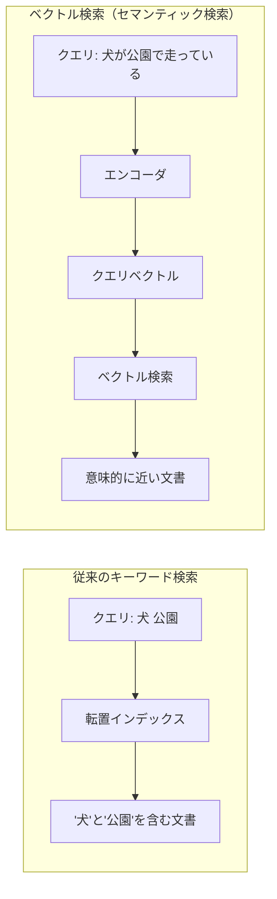
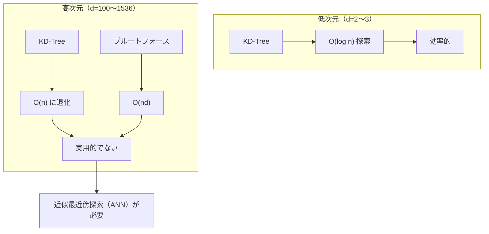
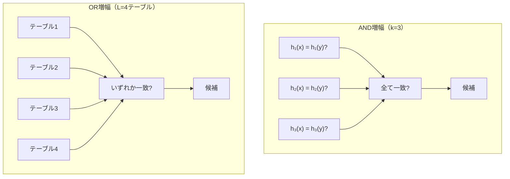
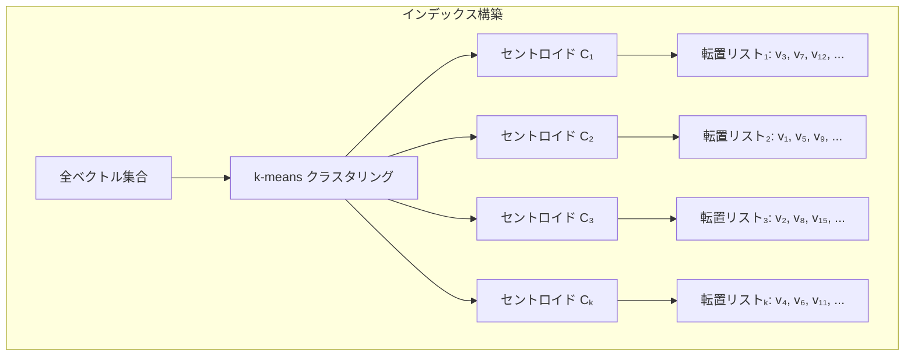
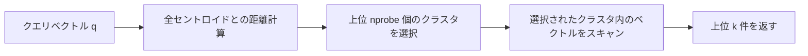
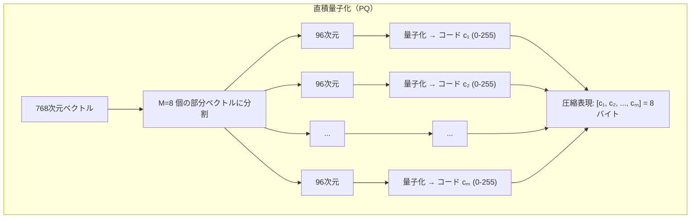
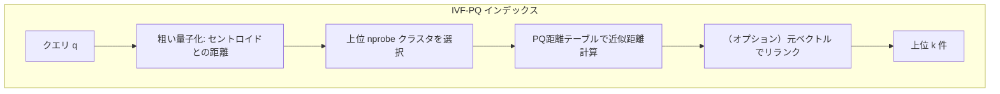
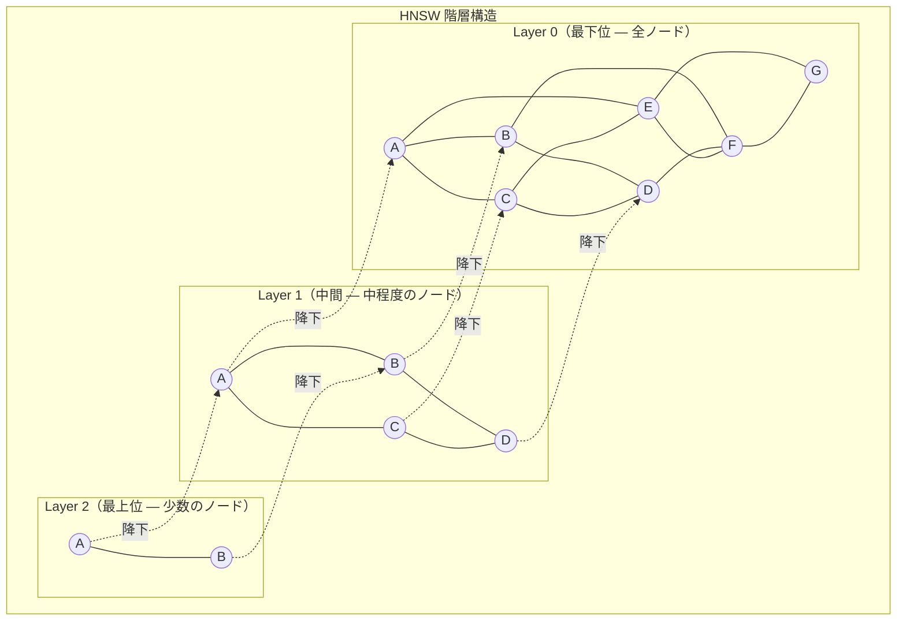
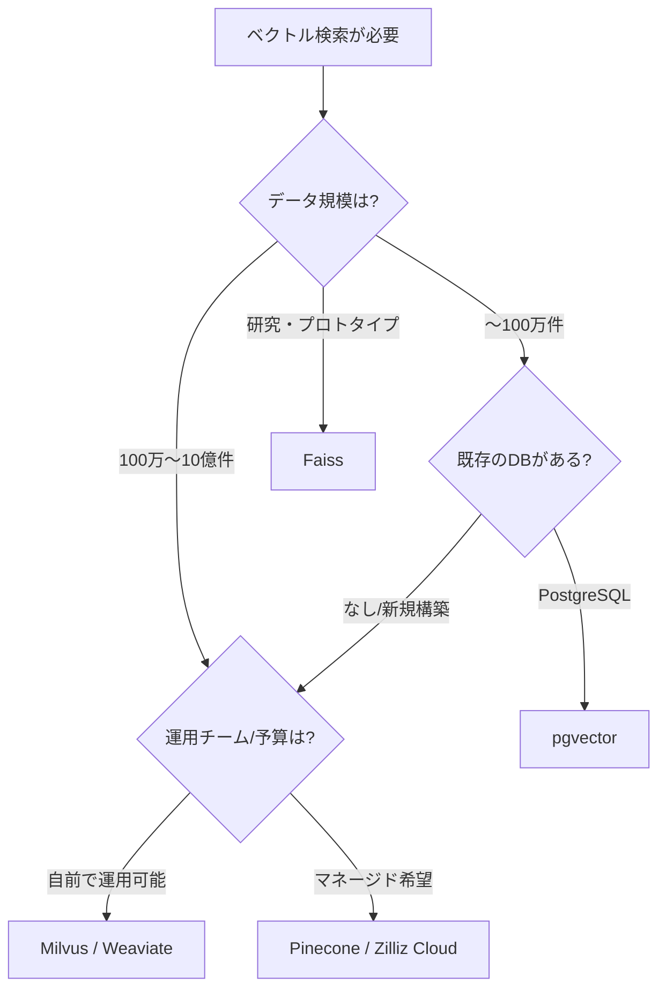
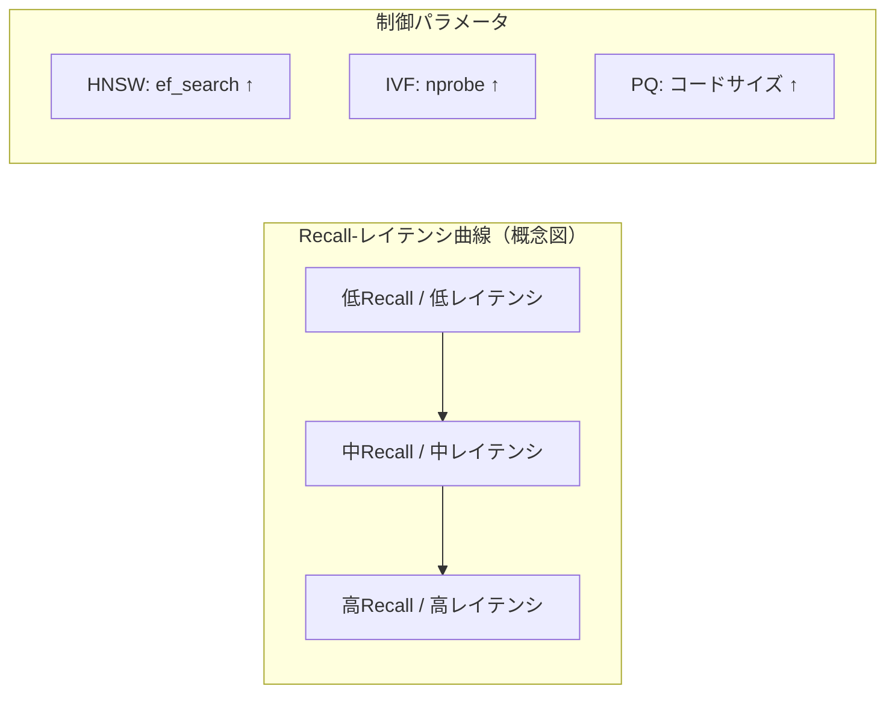

# ベクトル検索と近似最近傍探索（HNSW, IVF）

## 背景と動機 — 埋め込みベクトルと意味検索

従来のテキスト検索は、転置インデックスを基盤として、クエリに含まれるキーワードとドキュメント内の単語を字句的に照合する仕組みに依存していた。TF-IDFやBM25といった手法は、単語の出現頻度と文書頻度に基づくスコアリングによって高い精度を達成してきたが、本質的に「同じ単語が使われているかどうか」に依存するという限界がある。たとえば「犬」と「ワンちゃん」、「自動車」と「クルマ」のような同義語や言い換え表現は、従来のキーワードベース検索では自然にはマッチしない。

この問題を根本から解決したのが、**埋め込みベクトル（Embedding）**による表現学習である。Word2Vec（2013年）やGloVe（2014年）から始まり、BERT（2018年）、そしてGPTファミリーや各種Sentence Transformerモデルに至るまで、深層学習の発展により、テキストの「意味」を高次元ベクトル空間上の点として表現できるようになった。意味的に近いテキストは、ベクトル空間上で互いに近い位置に配置される。

```
"犬が公園で走っている"   → [0.23, -0.45, 0.78, ..., 0.12]  (768次元)
"ワンちゃんが庭を駆け回る" → [0.25, -0.43, 0.76, ..., 0.14]  (768次元)
"株価が急上昇した"       → [-0.67, 0.34, -0.12, ..., 0.89]  (768次元)
```

上記の例では、「犬」と「ワンちゃん」に関する2つの文は、ベクトル空間上で非常に近い位置に配置される。一方、意味的に無関係な「株価」に関する文は遠い位置に配置される。この性質を利用して、クエリ文を同様にベクトル化し、データベース内の全ベクトルの中から「最も近い」ものを見つけ出すことで、**意味レベルでの検索（セマンティック検索）**が実現される。



ベクトル検索が活用される代表的なユースケースは以下の通りである。

- **セマンティック検索**: 自然言語による質問に対して、意味的に関連するドキュメントを返す
- **推薦システム**: ユーザーやアイテムの埋め込み表現に基づき、類似アイテムを推薦する
- **画像検索**: CLIP等のモデルで画像をベクトル化し、テキストや画像で類似画像を検索する
- **RAG（Retrieval-Augmented Generation）**: LLM（大規模言語モデル）に外部知識を供給するため、関連文書を検索して文脈に含める
- **異常検知**: 正常データの埋め込み分布から外れたデータポイントを発見する
- **重複検出**: 類似するコンテンツや商品を検出する

このように、ベクトル検索はAI時代の情報検索の中核技術となっている。しかし、数百万から数十億ものベクトルの中から最近傍を高速に見つけるためには、単純な全探索（ブルートフォース）では計算コストが現実的でない。この課題を解決する技術が**近似最近傍探索（Approximate Nearest Neighbor, ANN）**であり、本記事の主題である。

## 距離関数 — 類似度の測り方

ベクトル検索の基盤は「2つのベクトルがどれだけ近いか」を定量的に測る距離関数（あるいは類似度関数）である。用途やデータの性質に応じて適切な関数を選択する必要がある。

### ユークリッド距離（L2距離）

最も直感的な距離尺度であり、2点間の直線距離を表す。

$$d_{\text{L2}}(\mathbf{x}, \mathbf{y}) = \sqrt{\sum_{i=1}^{d} (x_i - y_i)^2} = \|\mathbf{x} - \mathbf{y}\|_2$$

ここで $d$ はベクトルの次元数、$x_i$, $y_i$ はそれぞれベクトル $\mathbf{x}$, $\mathbf{y}$ の第 $i$ 成分である。実際の計算では、平方根を取らずに二乗距離 $\|\mathbf{x} - \mathbf{y}\|_2^2$ を用いることが多い（順序関係が保たれるため）。

**特徴**: ベクトルの大きさ（ノルム）の違いに敏感であり、正規化されていないベクトル同士の比較に適している。画像特徴量やオートエンコーダの潜在表現など、ベクトルの絶対的な位置が意味を持つ場面で使われる。

### コサイン類似度

2つのベクトルの「方向」の類似度を測る指標であり、ベクトルの大きさ（ノルム）を無視して角度のみに注目する。

$$\text{cos\_sim}(\mathbf{x}, \mathbf{y}) = \frac{\mathbf{x} \cdot \mathbf{y}}{\|\mathbf{x}\| \cdot \|\mathbf{y}\|} = \frac{\sum_{i=1}^{d} x_i y_i}{\sqrt{\sum_{i=1}^{d} x_i^2} \cdot \sqrt{\sum_{i=1}^{d} y_i^2}}$$

値域は $[-1, 1]$ で、1に近いほど類似度が高い。距離として用いるにはコサイン距離 $d_{\text{cos}} = 1 - \text{cos\_sim}(\mathbf{x}, \mathbf{y})$ に変換する。

**特徴**: テキストの埋め込みベクトルで最も広く使われる。文書の長さによってベクトルのノルムが変わる場合でも、意味の方向性さえ一致していれば高い類似度を示す。Sentence TransformerやOpenAI Embeddingsの出力はL2正規化されていることが多く、その場合はコサイン類似度と内積が一致する。

### 内積（ドット積）

$$\text{IP}(\mathbf{x}, \mathbf{y}) = \mathbf{x} \cdot \mathbf{y} = \sum_{i=1}^{d} x_i y_i$$

**特徴**: コサイン類似度とは異なり、ベクトルのノルムが大きいほど値も大きくなる。推薦システムにおいて、ユーザーベクトルとアイテムベクトルの内積を関連度スコアとして用いる**Maximum Inner Product Search（MIPS）**で活用される。ベクトルがL2正規化済みであれば、内積はコサイン類似度と等価になる。

### 距離関数の選択指針

| 距離関数 | 正規化不要 | 方向重視 | 代表的な用途 |
|:---------|:----------:|:--------:|:------------|
| ユークリッド距離 | 必要に応じて | いいえ | 画像検索、クラスタリング |
| コサイン類似度 | 不要 | はい | テキスト検索、セマンティック検索 |
| 内積 | 不要 | 部分的 | 推薦システム（MIPS） |

> [!TIP]
> ベクトルがL2正規化されている場合（$\|\mathbf{x}\| = 1$）、ユークリッド距離の二乗とコサイン距離は単調変換の関係にあり、検索結果の順序は同一になる。
>
> $$\|\mathbf{x} - \mathbf{y}\|_2^2 = 2(1 - \text{cos\_sim}(\mathbf{x}, \mathbf{y}))$$

## 厳密最近傍の限界 — 次元の呪い

$n$ 個のベクトルからクエリベクトルに最も近い $k$ 個を見つけるのが **$k$-最近傍探索（$k$-NN）** 問題である。最も素朴な方法は全ベクトルとの距離を計算するブルートフォース探索で、時間計算量は $O(nd)$ （$n$ = ベクトル数、$d$ = 次元数）となる。

低次元空間（2次元や3次元）であれば、KD-Treeのような空間分割木構造で $O(\log n)$ の探索が可能である。しかし、ベクトル検索が扱う埋め込み空間は通常 $d = 128 \sim 1536$ と非常に高次元であり、KD-Treeを含む多くの正確なデータ構造は、高次元では事実上ブルートフォースと同等かそれ以下の性能に退化する。

この現象は「**次元の呪い（Curse of Dimensionality）**」と呼ばれ、以下のような性質に起因する。

### 距離の集中現象

高次元空間では、ランダムな点同士の距離がほぼ均一になるという直感に反する現象が起きる。$d$ 次元空間において、$[0, 1]^d$ の一様分布に従う2点間のユークリッド距離の期待値と分散を考えると、次元 $d$ が大きくなるにつれて、最近傍と最遠傍の距離比が1に近づく。

$$\lim_{d \to \infty} \frac{d_{\max} - d_{\min}}{d_{\min}} \to 0$$

つまり、高次元では「近い」と「遠い」の区別がつきにくくなり、空間分割による枝刈りが効かなくなる。

### 体積の指数的膨張

$d$ 次元の単位超球の体積は、次元の増加とともに急速に0に近づく。

$$V_d = \frac{\pi^{d/2}}{\Gamma(d/2 + 1)}$$

$d = 2$ では $\pi \approx 3.14$、$d = 10$ では約 $2.55$、$d = 100$ では事実上 $0$ に近い値になる。これは高次元空間のほとんどの体積が「角」に集中していることを意味し、空間を格子状に分割してもほとんどのセルが空になる。



このような理由から、高次元ベクトルの大規模検索では、100%の精度（厳密解）を保証する代わりに「ほぼ正確な結果を非常に高速に」返す**近似最近傍探索（ANN: Approximate Nearest Neighbor）**が実用的な選択となる。ANN手法は、Recall（再現率）とレイテンシのトレードオフを制御可能であり、多くの実応用では Recall 95%〜99% が十分に許容される。

## LSH（局所性鋭敏ハッシュ）

**LSH（Locality-Sensitive Hashing）**は、ANNの初期の代表的手法であり、理論的な保証を持つ点が特徴的である。基本的な考え方は、「近いベクトル同士は高い確率で同じハッシュバケットに入り、遠いベクトル同士は低い確率でしか同じバケットに入らない」ようなハッシュ関数族を設計することである。

### 定義

ハッシュ関数族 $\mathcal{H}$ が $(r_1, r_2, p_1, p_2)$-sensitiveであるとは、任意の2点 $\mathbf{x}, \mathbf{y}$ について以下が成り立つことをいう。

- $d(\mathbf{x}, \mathbf{y}) \leq r_1$ ならば $\Pr[h(\mathbf{x}) = h(\mathbf{y})] \geq p_1$
- $d(\mathbf{x}, \mathbf{y}) \geq r_2$ ならば $\Pr[h(\mathbf{x}) = h(\mathbf{y})] \leq p_2$

ここで $r_1 < r_2$、$p_1 > p_2$ である。

### コサイン距離向けLSH（Random Hyperplane）

コサイン距離向けには、ランダムな超平面を用いた手法がよく知られている。ランダムベクトル $\mathbf{r}$ を用いてハッシュ関数を定義する。

$$h_{\mathbf{r}}(\mathbf{x}) = \begin{cases} 1 & \text{if } \mathbf{r} \cdot \mathbf{x} \geq 0 \\ 0 & \text{if } \mathbf{r} \cdot \mathbf{x} < 0 \end{cases}$$

このハッシュ関数に対して、2点が同じハッシュ値を持つ確率は以下のようになる。

$$\Pr[h_{\mathbf{r}}(\mathbf{x}) = h_{\mathbf{r}}(\mathbf{y})] = 1 - \frac{\theta(\mathbf{x}, \mathbf{y})}{\pi}$$

ここで $\theta(\mathbf{x}, \mathbf{y})$ は2つのベクトル間の角度である。角度が小さい（=類似度が高い）ほど衝突確率が高くなるため、局所性鋭敏の条件を満たす。

### AND/OR増幅

単一のハッシュ関数では判別力が低いため、複数のハッシュ関数を組み合わせて精度を高める。

- **AND増幅**: $k$ 個のハッシュ関数全てが一致する場合にのみ同じバケットとみなす。衝突確率は $p^k$ になり、遠い点の偽陽性を減らす
- **OR増幅**: $L$ 個のハッシュテーブルのうち少なくとも1つで衝突すればよい。衝突確率は $1 - (1-p^k)^L$ になり、近い点の偽陰性を減らす



### LSHの利点と限界

**利点**:
- $(1+\epsilon)$-近似の理論的保証がある（十分な数のハッシュテーブルを使えば、真の最近傍の $(1+\epsilon)$ 倍以内の点が高確率で見つかる）
- 実装がシンプルで並列化が容易
- インクリメンタルなデータ追加が可能

**限界**:
- 高いRecallを達成するには多数のハッシュテーブル（$L$）が必要で、メモリ使用量が大きくなる
- 実用的な性能（Recall-速度トレードオフ）ではIVFやHNSWに劣ることが多い
- 次元が非常に高い場合にハッシュ関数の計算コストが無視できない

LSHは理論的に美しい手法だが、実務ではIVFやHNSWの方が優れた性能を示すことが多く、現在は主にハイブリッドアプローチの一部や、特定のユースケース（ストリーミングデータの重複検出など）で活用されている。

## IVF（転置ファイルインデックス）とPQ（直積量子化）

### IVF（Inverted File Index）

**IVF（Inverted File Index）**は、ベクトル空間をあらかじめクラスタに分割し、検索時にはクエリに近いクラスタのみを調べることで探索範囲を絞り込む手法である。テキスト検索の転置インデックスと同様のアイデアに基づいており、「どのクラスタにどのベクトルが所属するか」の逆引きリストを保持する。

#### インデックス構築

1. ベクトル集合から $K$ 個のセントロイド（クラスタ中心）を $k$-means法で算出する
2. 各ベクトルを最寄りのセントロイドに割り当て、クラスタごとの転置リストを構築する



#### 検索

1. クエリベクトル $\mathbf{q}$ と全 $K$ 個のセントロイドの距離を計算する
2. 距離が最も小さい上位 $n_{\text{probe}}$ 個のクラスタを選択する
3. 選択されたクラスタの転置リストに含まれるベクトルのみと距離を計算する
4. 上位 $k$ 件を返す



パラメータ $n_{\text{probe}}$ がRecall-速度トレードオフの制御つまみとなる。$n_{\text{probe}} = 1$ では最速だがRecallが低く、$n_{\text{probe}} = K$ ではブルートフォースと等価になる。一般に $n_{\text{probe}}$ を $K$ の5%〜10%程度に設定すると、Recall 90%以上が達成できることが多い。

#### IVFの計算量

- インデックス構築: $O(nKd \cdot I)$ （$I$ はk-meansのイテレーション回数）
- 検索: $O(Kd + n_{\text{probe}} \cdot \bar{m} \cdot d)$ （$\bar{m}$ は1クラスタあたりの平均ベクトル数、$\bar{m} = n/K$）

$n_{\text{probe}} \ll K$ かつ $K \ll n$ であれば、ブルートフォースの $O(nd)$ に比べて大幅に高速化される。

### PQ（Product Quantization — 直積量子化）

**PQ（Product Quantization）**は、高次元ベクトルを圧縮して距離計算を高速化する手法であり、IVFと組み合わせて**IVF-PQ**として広く使われている。

#### 基本アイデア

$d$ 次元ベクトルを $M$ 個の部分ベクトル（サブベクトル）に分割し、各部分ベクトルを独立に量子化（$k^*$ 個の代表ベクトルの中から最寄りのもので近似）する。

$$\mathbf{x} = [\underbrace{x_1, \ldots, x_{d/M}}_{\text{部分1}}, \underbrace{x_{d/M+1}, \ldots, x_{2d/M}}_{\text{部分2}}, \ldots, \underbrace{x_{d-d/M+1}, \ldots, x_d}_{\text{部分}M}]$$

各部分ベクトルに対して $k^* = 256$ 個のセントロイドを持つコードブックを学習する。元の $d$ 次元ベクトルは $M$ バイトのコード（各部分ベクトルのセントロイドID）で表現される。



#### メモリ効率

元のベクトルが $d = 768$ 次元、32ビット浮動小数点数の場合、1ベクトルあたり $768 \times 4 = 3072$ バイトを使用する。PQで $M = 8$ に分割すると、$8$ バイトに圧縮され、**約384倍のメモリ削減**が実現される。

#### ADC（Asymmetric Distance Computation）

PQでは、距離計算を高速化するための巧妙なテクニックがある。クエリベクトル $\mathbf{q}$ は量子化せず（非対称）、各部分空間のコードブック中心との距離をあらかじめテーブルに計算しておく。

1. クエリの各部分ベクトル $\mathbf{q}_j$ と各セントロイド $\mathbf{c}_{j,i}$ の距離を事前計算: $d_j[i] = \|\mathbf{q}_j - \mathbf{c}_{j,i}\|^2$
2. データベースの各ベクトル（コード表現 $[c_1, c_2, \ldots, c_M]$）との近似距離をテーブル参照で計算:

$$\tilde{d}(\mathbf{q}, \mathbf{x})^2 = \sum_{j=1}^{M} d_j[c_j]$$

この方法により、1ベクトルあたりの距離計算が $M$ 回のテーブルルックアップと加算に簡略化される。

### IVF-PQの組み合わせ

IVFとPQを組み合わせた**IVF-PQ**は、大規模ベクトル検索の実務で最も広く使われているインデックス構造のひとつである。



IVFで探索範囲を限定し、PQでメモリ使用量と距離計算コストを削減する。さらに精度が必要な場合は、PQで得られた候補の上位を元のベクトル（フルベクトル）でリランキングするステップを追加する。

### OPQ（Optimized Product Quantization）

標準的なPQでは、ベクトルを均等に分割するだけだが、部分空間間の相関が高い場合に量子化誤差が大きくなる。**OPQ（Optimized Product Quantization）**は、回転行列 $R$ を学習して、部分空間間の相関を最小化する前処理を行う。

$$\mathbf{x}' = R\mathbf{x}$$

回転後のベクトル $\mathbf{x}'$ に対してPQを適用することで、量子化誤差が低減され、同じコードサイズでより高いRecallが得られる。

## HNSW（Hierarchical Navigable Small World）

**HNSW（Hierarchical Navigable Small World）**は、2016年にMalkov & Yashunin によって提案されたグラフベースのANNアルゴリズムであり、現在最も広く使われているANN手法の一つである。高いRecallと低いレイテンシを両立し、多くのベンチマークでトップクラスの性能を示す。

### Navigable Small World（NSW）グラフの基本

HNSWの基盤となるNSWグラフは、「任意の2ノード間が少数のホップで到達可能」というスモールワールド性を持つ近傍グラフである。各ノード（ベクトル）は一定数の近傍ノードへのエッジを持ち、貪欲探索によってクエリに近いノードへ逐次的に移動する。

```
探索の流れ:
  entry point → 近い隣接ノードへ移動 → さらに近い隣接ノードへ → ... → 局所最近傍に到達
```

NSWグラフの課題は、貪欲探索が局所最適解に陥りやすいことである。特にグラフの構造が不均一な場合、エントリーポイントからターゲットへの「ショートカット」がないと、多数のホップが必要になり検索が遅くなる。

### 階層構造の導入

HNSWは、NSWグラフを**複数の階層（レイヤー）**に拡張することで、この問題を解決する。上位レイヤーは少数のノードからなる粗いグラフ、下位レイヤーは多数のノードからなる密なグラフであり、検索は上位から開始して下位へ降りていく。



各ノードが属する最大レイヤーは、指数分布に従ってランダムに決定される。レイヤー $l$ にノードが割り当てられる確率は以下の通りである。

$$l = \lfloor -\ln(\text{uniform}(0, 1)) \cdot m_L \rfloor$$

ここで $m_L$ はスケーリングパラメータであり、$m_L = 1 / \ln(M)$ が推奨される（$M$ は各ノードの最大接続数）。これにより、上位レイヤーにいくほどノード数が指数的に減少し、Skip Listに類似した「高速道路」構造が形成される。

### 検索アルゴリズム

HNSW検索は以下の手順で行われる。

1. 最上位レイヤーのエントリーポイントから開始する
2. 現在のレイヤーで貪欲探索を行い、クエリに最も近いノードを見つける
3. そのノードを起点として1つ下のレイヤーに降下する
4. 最下位レイヤー（Layer 0）に到達するまで2-3を繰り返す
5. Layer 0では、ビームサーチ（幅 $ef$ の探索）を行い、上位 $k$ 件の最近傍を返す

```python
def hnsw_search(query, entry_point, layers, ef, k):
    # Start from the top layer
    current_best = entry_point

    # Greedy search on upper layers (beam width = 1)
    for layer in reversed(range(1, len(layers))):
        current_best = greedy_search(query, current_best, layer)

    # Beam search on layer 0 (beam width = ef)
    candidates = beam_search(query, current_best, layer=0, ef=ef)

    # Return top-k results
    return top_k(candidates, k)
```

パラメータ $ef$（exploration factor）がRecall-速度トレードオフの制御つまみであり、$ef$ を大きくするほどRecallが向上するがレイテンシも増大する。$ef \geq k$ である必要がある。

### 挿入アルゴリズム

新しいベクトルの挿入手順は以下の通りである。

1. 指数分布に従って、挿入するノードの最大レイヤー $l$ を決定する
2. 最上位レイヤーからレイヤー $l+1$ まで、各レイヤーで貪欲探索して最近傍ノードを見つける（エントリーポイントの決定）
3. レイヤー $l$ から Layer 0 まで、各レイヤーで以下を実行する:
   - ビームサーチで近傍候補を見つける
   - ヒューリスティックにより最大 $M$ 個（Layer 0では $M_0 = 2M$）の双方向エッジを確立する
4. 既存ノードの接続数が上限 $M$ を超えた場合、ヒューリスティックに基づき最も不要なエッジを除去する

### ヒューリスティックな近傍選択

HNSWの性能を大きく左右するのが近傍選択のヒューリスティックである。単純に距離が近い $M$ 個のノードを選ぶのではなく、**多様性**を重視した選択を行う。具体的には、候補ノードを距離順にソートし、既に選択されたノード経由で到達可能なノードは除外する。これにより、グラフのスモールワールド性が維持され、探索効率が向上する。

### HNSWの主要パラメータ

| パラメータ | 説明 | 典型的な値 |
|:-----------|:-----|:-----------|
| $M$ | 各ノードの最大接続数 | 16〜64 |
| $M_0$ | Layer 0 の最大接続数（通常 $2M$） | 32〜128 |
| $ef_{\text{construction}}$ | 構築時の探索幅 | 100〜400 |
| $ef_{\text{search}}$ | 検索時の探索幅 | 50〜500（チューニング対象） |

- $M$ を大きくすると、Recallが向上するがメモリ使用量と構築時間が増大する
- $ef_{\text{construction}}$ を大きくすると、より高品質なグラフが構築されるが構築時間が増える
- $ef_{\text{search}}$ を大きくすると、Recallが向上するが検索レイテンシが増大する

### HNSWの計算量とメモリ

- **検索時間**: $O(\log n)$ （上位レイヤーの探索） + $O(ef \cdot M)$ （Layer 0のビームサーチ）。実用的には $O(\log n)$ に近い
- **挿入時間**: $O(\log n)$ に近い
- **メモリ使用量**: 元ベクトルに加えて、グラフ構造に1ベクトルあたり約 $M \times (\text{レイヤー数}) \times (\text{ID + 接続先サイズ})$ のオーバーヘッドが必要。通常、元ベクトルのサイズの1.5〜2倍程度のメモリが必要

### HNSWの利点と限界

**利点**:
- Recall-速度トレードオフが非常に優れている（多くのベンチマークでトップクラス）
- パラメータの解釈が直感的でチューニングが容易
- オンラインでの逐次的なデータ追加が可能
- 距離関数を柔軟に選択できる

**限界**:
- メモリ使用量が大きい（グラフ構造 + 元ベクトルの保持が必要）
- インデックス構築が比較的遅い（各挿入でグラフ探索が必要）
- 削除が困難（「論理削除」でマークするか、定期的な再構築が必要）
- ベクトルの分布が大きく変化する場合、グラフの品質が劣化する可能性がある

## 主要ツール — Faiss, Milvus, Pinecone, pgvector

ベクトル検索を実現するツールは、ライブラリレベルからフルマネージドサービスまで多岐にわたる。ここでは代表的なものを紹介する。

### Faiss（Facebook AI Similarity Search）

Meta（旧Facebook）が開発したオープンソースのベクトル検索ライブラリであり、ANN分野のデファクトスタンダード的存在である。

**特徴**:
- C++で実装され、Pythonバインディングが提供される
- GPU対応（CUDA）により、大規模データでも高速なインデックス構築・検索が可能
- IVF, PQ, HNSW, Flat（ブルートフォース）など、豊富なインデックスタイプを提供
- インデックスの組み合わせ（例: `IVF4096,PQ64`）が柔軟に指定できる
- 研究からプロダクションまで幅広く利用されている

```python
import faiss
import numpy as np

# Parameters
d = 768          # dimension
n = 1_000_000    # number of vectors
nlist = 1024     # number of clusters for IVF
m = 64           # number of subquantizers for PQ

# Generate random data (in practice, use embeddings)
xb = np.random.random((n, d)).astype('float32')
xq = np.random.random((10, d)).astype('float32')

# Build IVF-PQ index
quantizer = faiss.IndexFlatL2(d)
index = faiss.IndexIVFPQ(quantizer, d, nlist, m, 8)

# Train the index
index.train(xb)

# Add vectors
index.add(xb)

# Search
index.nprobe = 64  # number of clusters to probe
distances, indices = index.search(xq, k=10)
```

**代表的なインデックス構成**:

| インデックス | 説明 | 用途 |
|:------------|:-----|:-----|
| `Flat` | ブルートフォース | 小規模データ、ベースライン |
| `IVF{K},Flat` | IVF + ブルートフォース | 中規模データ |
| `IVF{K},PQ{M}` | IVF + PQ | 大規模データ（メモリ効率重視） |
| `HNSW{M}` | HNSW | 高速検索（メモリに余裕がある場合） |
| `IVF{K},PQ{M}x4fs` | IVF + PQ + Fast Scan | 大規模データ（最新の高速手法） |

### Milvus

Zilliz社が開発するオープンソースのベクトルデータベースであり、分散アーキテクチャを持つプロダクション向けシステムである。

**特徴**:
- マイクロサービスアーキテクチャにより、コンピュート・ストレージの独立スケーリングが可能
- HNSW, IVF-PQ, DiskANN など複数のインデックスタイプをサポート
- スカラーフィールド（メタデータ）によるフィルタリング検索に対応
- S3/MinIO をストレージバックエンドに使用し、大容量データに対応
- マルチテナンシーやRBAC（ロールベースアクセス制御）をサポート

### Pinecone

フルマネージドのベクトルデータベースサービスであり、インフラ管理の負担なくベクトル検索を利用できる。

**特徴**:
- サーバーレスアーキテクチャにより、使った分だけ課金
- メタデータフィルタリング、ネームスペース、コレクション管理の機能を提供
- マルチリージョン対応とSLAの保証
- REST API / gRPC API によるシンプルなインターフェース
- インデックスのチューニングが自動化されている

### pgvector

PostgreSQLの拡張機能として実装されたベクトル検索プラグインであり、既存のRDBMSインフラを活用できる。

**特徴**:
- PostgreSQLのトランザクション管理やACID特性をベクトルデータにも適用可能
- SQLでベクトル検索ができる: `SELECT * FROM items ORDER BY embedding <-> '[0.1, 0.2, ...]' LIMIT 10`
- IVFFlat と HNSW インデックスをサポート
- スカラーデータとベクトルデータを同一テーブルで管理でき、JOIN等の関係データベース操作が自然に使える
- 既存のPostgreSQLエコシステム（バックアップ、レプリケーション、モニタリング等）がそのまま利用可能

**pgvectorの距離演算子**:

| 演算子 | 距離関数 |
|:-------|:---------|
| `<->` | ユークリッド距離（L2） |
| `<#>` | 内積の負値（最大内積検索用） |
| `<=>` | コサイン距離 |

### ツール選択の指針



## 実世界での評価 — Recall vs レイテンシのトレードオフ

ANN手法の評価は、**Recall**（再現率）と**レイテンシ**（クエリ応答時間）のトレードオフとして表現される。ここでいうRecallは、ANNが返した $k$ 件の結果のうち、ブルートフォースの真の $k$-NN に含まれるものの割合である。

$$\text{Recall@}k = \frac{|\text{ANN result} \cap \text{True } k\text{-NN}|}{k}$$

### ann-benchmarks

[ann-benchmarks](http://ann-benchmarks.com/) は、各種ANNアルゴリズムを統一的なベンチマーク条件で比較するプロジェクトであり、アルゴリズム選択の重要な参考資料となっている。

典型的な結果（SIFT-1M データセット、$d=128$、$n=10^6$、$k=10$）の傾向は以下の通りである。

- **HNSW**（hnswlib）: Recall@10 = 0.99 で QPS（Queries Per Second）が 5,000〜15,000 程度
- **IVF-PQ**（Faiss）: Recall@10 = 0.90 で QPS が 10,000〜50,000 程度、メモリ使用量はHNSWの1/5以下
- **LSH**: 同等のRecallではHNSWやIVFに劣る傾向

### トレードオフの構造



| 要因 | Recall向上 | コスト |
|:-----|:-----------|:-------|
| $ef_{\text{search}}$ 増加（HNSW） | 探索範囲が広がる | レイテンシ増大 |
| $n_{\text{probe}}$ 増加（IVF） | 調査クラスタ数増加 | レイテンシ増大 |
| PQコードサイズ増加 | 量子化誤差の低減 | メモリ使用量増加 |
| $M$ 増加（HNSW） | グラフの接続性向上 | メモリ使用量増加 |
| リランキング追加 | 候補の精査 | レイテンシ増大 |

### 実運用でのRecall目標

用途によって求められるRecallは異なる。

- **RAG（検索拡張生成）**: Recall@10 > 0.95 が望ましい。検索漏れは回答品質に直結するため
- **推薦システム**: Recall@50 > 0.80 程度で十分な場合が多い。多数の候補から後続のランキングモデルで絞り込むため
- **重複検出**: Recall@1 > 0.99 が求められる。見落としが直接的なビジネスリスクになるため

### メモリとスループットの考慮

大規模運用では、単一サーバーのメモリに全ベクトルを載せられない場合がある。

- **10億ベクトル x 768次元 x 4バイト = 約3TB** のメモリが必要（フルベクトル保持の場合）
- PQ圧縮（$M = 64$）を用いれば、**約64GB** に圧縮可能
- DiskANN のようなディスクベースの手法は、SSDにインデックスを配置して、メモリフットプリントを大幅に削減する

スループット（QPS）の要件も重要であり、バッチクエリの活用やGPUの利用、シャーディング（データを複数のノードに分散）によるスケールアウトが検討される。

> [!WARNING]
> ベンチマークの数値は、データの分布、次元数、ハードウェアに大きく依存する。公開ベンチマークの結果を自社データにそのまま適用するのではなく、実際のデータとワークロードでの検証が不可欠である。

## 今後の展望

### ハイブリッド検索の普及

キーワード検索（BM25等）とベクトル検索を組み合わせた**ハイブリッド検索**は、すでに多くのプロダクションシステムで採用されている。固有名詞や専門用語の正確なマッチングはキーワード検索が優れ、意味的な類似性の発見はベクトル検索が優れるという、それぞれの強みを活かした組み合わせが効果的である。Reciprocal Rank Fusion（RRF）やCross-Encoderによるリランキングが一般的な統合手法である。

### DiskANN とメモリ効率の追求

Microsoft Researchが開発した**DiskANN**は、グラフインデックスをSSD上に配置し、メモリには圧縮されたベクトル（PQ）とグラフのメタデータのみを保持する。これにより、10億規模のベクトルを数十GBのメモリで検索可能にした。SSDの高速ランダムリードを活用し、メモリベースのHNSWに迫る性能を実現している。

### GPU上のベクトル検索

NVIDIAの**RAFT/cuVS**ライブラリや**Faiss GPU**の進化により、GPU上でのベクトル検索が加速している。GPU のSIMD的な並列計算能力は、距離計算やグラフ探索の大規模並列化に適しており、特にバッチクエリの処理で圧倒的なスループットを実現する。

### 学習済みインデックス

深層学習を用いてインデックス構造自体を「学習」するアプローチも研究されている。データの分布を学習した神経網が、空間分割やルーティングをデータ適応的に行うことで、従来のk-meansベースの分割よりも効率的な探索が可能になる。

### フィルタリングとの統合

実運用では、「カテゴリがAで、作成日が2025年以降のドキュメントのうち、意味的に最も近いもの」のように、スカラー条件とベクトル近傍条件を組み合わせた**フィルタ付きベクトル検索**が求められる。現状では、ベクトル検索の後にフィルタリングする「ポストフィルタ」が一般的だが、フィルタ条件をインデックス構造に組み込む「プレフィルタ」や、インデックス探索とフィルタリングを同時に行うアプローチの研究が進んでいる。

### 量子化技術のさらなる進化

4ビット量子化や2ビット量子化といった、より積極的な圧縮手法の研究が進んでいる。RaBitQ（Random Bit Quantization）のような手法は、1ベクトルあたり1ビット/次元という極端な圧縮でも、意外なほど高いRecallを維持できることが示されている。LLMの推論効率化で発展した量子化技術が、ベクトル検索にも応用されている流れがある。

### マルチモーダル検索

テキスト、画像、音声、動画など、異なるモダリティのデータを共通のベクトル空間に埋め込み、モダリティをまたいだ検索を行う**マルチモーダル検索**への需要が増大している。CLIPやImageBindのようなマルチモーダルエンコーダの発展に伴い、「テキストで画像を検索する」「画像で動画を検索する」といったクロスモーダル検索がより一般的になると予想される。ベクトル検索基盤はこのようなマルチモーダルアプリケーションの根幹を支える技術として、今後ますます重要性を増していくであろう。

## まとめ

ベクトル検索は、深層学習による埋め込み表現の進化とともに、現代の情報検索システムの不可欠な構成要素となった。本記事で解説した内容を振り返ると、以下のようになる。

- **距離関数**（コサイン類似度、ユークリッド距離、内積）はベクトル検索の基礎であり、用途に応じた選択が重要
- **次元の呪い**により、高次元空間での厳密最近傍探索は非効率であり、ANNが実用的な選択肢となる
- **LSH**は理論的保証を持つが、実用性ではIVFやHNSWに劣る
- **IVF-PQ**はメモリ効率に優れ、大規模データに適しているが、クラスタ構造への依存がある
- **HNSW**はRecall-速度トレードオフにおいて最も優れた性能を示すが、メモリ使用量が大きい
- 実運用では、データ規模、Recall要件、レイテンシ要件、運用負荷に応じてツールと手法を選択する必要がある

ANN技術は急速に進化を続けており、DiskANNのようなメモリ効率に優れた手法、GPU活用、そしてハイブリッド検索との統合が今後の主要な方向性である。ベクトル検索の理解は、RAG、推薦システム、マルチモーダルAIといった現代のAIシステムを設計・運用するうえで不可欠な知識となっている。
