# VFS（仮想ファイルシステム）

## なぜ VFS は存在するのか

コンピュータの歴史において、ファイルシステムは常に多様性を持っていた。ローカルディスク上の ext4、ネットワーク越しの NFS、メモリ上の tmpfs、デバイスノードを提供する devfs --- それぞれが独自のデータ構造と操作セマンティクスを持っている。しかし、ユーザプログラムは `open()`、`read()`、`write()`、`close()` という統一的なインターフェースでこれらすべてにアクセスできる。この「多様な実装を統一的な API の背後に隠す」という抽象化を実現しているのが **VFS（Virtual File System）** である。

VFS が解決する本質的な問題は、**ファイルシステムの実装の多様性と、アプリケーションが求めるインターフェースの統一性との間のギャップ**である。VFS がなければ、アプリケーションは使用するファイルシステムごとに異なる API を呼び出す必要があり、ファイルシステムの追加や変更のたびにアプリケーション側の修正が必要になる。VFS はこの結合を断ち切り、カーネル内に「ファイルシステムのプラグインアーキテクチャ」を実現する。

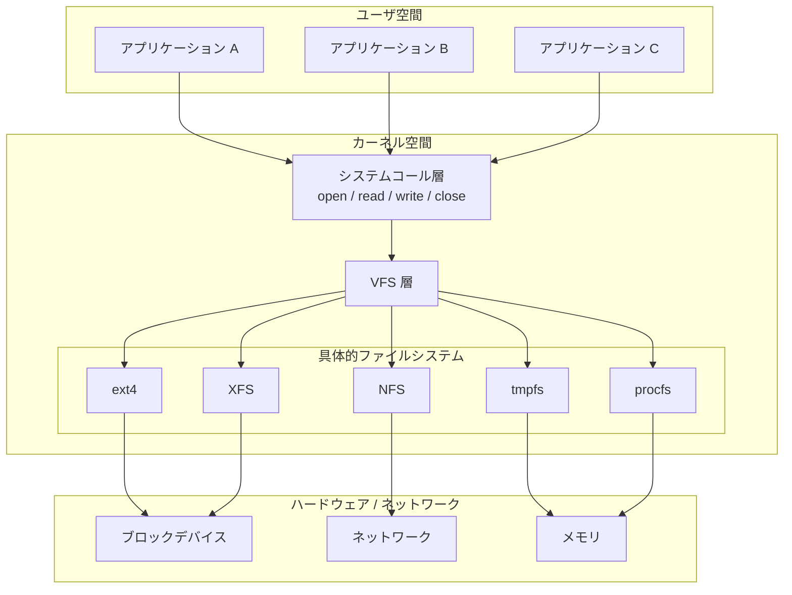

## 歴史的背景

VFS の概念は、1985年に Sun Microsystems が SunOS 2.0 で導入したものが起源とされている。当時の動機は明確で、ローカルの UFS（Unix File System）とネットワーク上の NFS を透過的に扱いたいという要求だった。Sun の実装は、ファイルシステム操作を関数ポインタのテーブル（後に vnode operations と呼ばれるもの）として抽象化するというアプローチを採用した。

この設計は、オブジェクト指向プログラミングにおけるインターフェースとポリモーフィズムの概念を、C 言語の構造体と関数ポインタで実現したものと見なすことができる。すなわち、共通のインターフェース（vnode ops）を定義し、各ファイルシステムがそのインターフェースの具体的な実装を提供するという構造である。

Linux は独自の VFS 実装を持っており、BSD 系の vnode ベースの VFS とは異なる設計判断をいくつか行っている。Linux VFS は、inode、dentry、superblock、file という4つの主要オブジェクトを中心に構築されており、これは Linux カーネルの開発において何度もリファクタリングを経て洗練されてきた設計である。

以下では、主に Linux の VFS 実装を中心に解説する。Linux VFS は現在もっとも広く使われている VFS 実装であり、他の OS の VFS 設計を理解するための良い基盤にもなるためである。

## VFS の4大オブジェクト

Linux VFS の中核をなすのは、**superblock**、**inode**、**dentry**、**file** という4つのオブジェクトである。それぞれがファイルシステムの異なる側面を抽象化しており、関連する操作テーブル（operations table）を持っている。

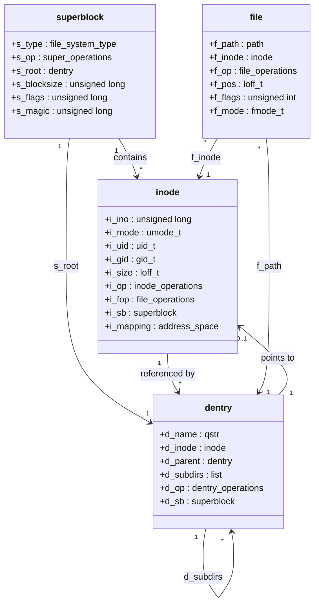

### superblock（スーパーブロック）

superblock は、マウントされたファイルシステム全体を表現するオブジェクトである。ディスク上のファイルシステムの場合、ディスクの特定位置に格納されたメタデータ（ブロックサイズ、最大ファイルサイズ、ファイルシステムの種別など）をメモリ上に読み込んだものに対応する。

superblock が保持する主な情報は以下の通りである。

| フィールド | 説明 |
|---|---|
| `s_type` | ファイルシステムの種別（ext4, xfs など） |
| `s_blocksize` | ブロックサイズ |
| `s_root` | ルートディレクトリの dentry |
| `s_op` | superblock 操作テーブル |
| `s_flags` | マウントフラグ（読み取り専用など） |
| `s_magic` | マジックナンバー（ファイルシステム識別用） |

`super_operations` は、inode のアロケーション/解放、ファイルシステムの同期（sync）、statfs（ファイルシステムの統計情報取得）などの操作を定義する。

```c
struct super_operations {
    struct inode *(*alloc_inode)(struct super_block *sb);
    void (*destroy_inode)(struct inode *);
    void (*dirty_inode)(struct inode *, int flags);
    int (*write_inode)(struct inode *, struct writeback_control *wbc);
    void (*evict_inode)(struct inode *);
    void (*put_super)(struct super_block *);
    int (*sync_fs)(struct super_block *sb, int wait);
    int (*statfs)(struct dentry *, struct kstatfs *);
    int (*remount_fs)(struct super_block *, int *, char *);
    // ... other operations
};
```

### inode（アイノード）

inode は、ファイルやディレクトリの**実体**を表現するオブジェクトである。ここでいう「実体」とは、ファイルの内容そのものではなく、ファイルに関するメタデータ --- パーミッション、所有者、サイズ、タイムスタンプ、データブロックへのポインタなど --- を指す。

重要な点として、**inode はファイル名を持たない**。ファイル名と inode の対応付けは dentry（ディレクトリエントリ）の役割である。この分離により、ハードリンク（同一の inode を複数の名前で参照する仕組み）が自然に実現される。

inode が提供する操作テーブルには2種類ある。

**`inode_operations`** --- inode 自体に対する操作（ディレクトリ内でのファイル検索、ファイル作成、リンク作成、パーミッション確認など）。

```c
struct inode_operations {
    struct dentry *(*lookup)(struct inode *, struct dentry *, unsigned int);
    int (*create)(struct mnt_idmap *, struct inode *, struct dentry *, umode_t, bool);
    int (*link)(struct dentry *, struct inode *, struct dentry *);
    int (*unlink)(struct inode *, struct dentry *);
    int (*symlink)(struct inode *, struct dentry *, const char *);
    int (*mkdir)(struct inode *, struct dentry *, umode_t);
    int (*rmdir)(struct inode *, struct dentry *);
    int (*rename)(struct mnt_idmap *, struct inode *, struct dentry *,
                  struct inode *, struct dentry *, unsigned int);
    int (*permission)(struct mnt_idmap *, struct inode *, int);
    // ... other operations
};
```

**`file_operations`** --- inode に関連付けられたファイルの内容に対する操作（読み書き、mmap、ioctl など）。これは inode に設定されるが、実際には file オブジェクトを通じて呼び出される。

### dentry（ディレクトリエントリ）

dentry は、パス名の各構成要素（ディレクトリ名やファイル名）と inode の対応付けを表現するオブジェクトである。例えば、パス `/home/user/document.txt` は、`/`、`home`、`user`、`document.txt` という4つの dentry で構成される。

dentry の最も重要な役割は、**パス名解決（path lookup）の効率化**である。ディスク上のディレクトリエントリを毎回読み込むのはコストが高い。そこで Linux は、一度解決された dentry をメモリ上にキャッシュする **dentry キャッシュ（dcache）** を維持している。

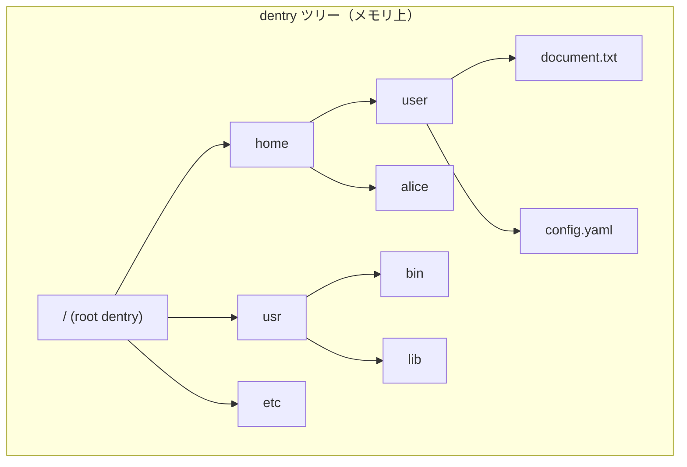

dentry には以下の3つの状態がある。

- **使用中（in use）**: 有効な inode に関連付けられ、参照カウントが1以上
- **未使用（unused）**: 有効な inode に関連付けられているが、参照カウントが0。キャッシュとしてメモリに残っている状態
- **ネガティブ（negative）**: inode に関連付けられていない。存在しないファイル名のルックアップ結果をキャッシュするために使用される

ネガティブ dentry は一見無駄に思えるかもしれないが、存在しないファイルへのアクセスが繰り返される場合（例：共有ライブラリの検索パスを順に試行する場合）に、不要なディスクアクセスを避けるために有効である。

```c
struct dentry_operations {
    int (*d_revalidate)(struct dentry *, unsigned int);
    int (*d_hash)(const struct dentry *, struct qstr *);
    int (*d_compare)(const struct dentry *,
                     unsigned int, const char *, const struct qstr *);
    int (*d_delete)(const struct dentry *);
    void (*d_release)(struct dentry *);
    void (*d_iput)(struct dentry *, struct inode *);
    char *(*d_dname)(struct dentry *, char *, int);
    // ... other operations
};
```

`d_revalidate` は特にネットワークファイルシステムで重要である。NFS のようなリモートファイルシステムでは、サーバ側でファイルが変更される可能性があるため、キャッシュされた dentry がまだ有効かどうかを確認する必要がある。

### file（ファイルオブジェクト）

file オブジェクトは、プロセスがファイルを開いたときに作成される、**開かれたファイルのインスタンス**を表現する。同じファイル（同じ inode）を複数のプロセスが開いた場合、それぞれのプロセスに対して別個の file オブジェクトが作成される。

file オブジェクトが保持する最も重要な状態は、**現在のファイルオフセット（f_pos）** である。これにより、同じファイルを開いている異なるプロセスが独立して読み書き位置を管理できる。

```c
struct file_operations {
    loff_t (*llseek)(struct file *, loff_t, int);
    ssize_t (*read)(struct file *, char __user *, size_t, loff_t *);
    ssize_t (*write)(struct file *, const char __user *, size_t, loff_t *);
    ssize_t (*read_iter)(struct kiocb *, struct iov_iter *);
    ssize_t (*write_iter)(struct kiocb *, struct iov_iter *);
    int (*open)(struct inode *, struct file *);
    int (*release)(struct inode *, struct file *);
    int (*fsync)(struct file *, loff_t, loff_t, int datasync);
    int (*mmap)(struct file *, struct vm_area_struct *);
    unsigned int (*poll)(struct file *, struct poll_table_struct *);
    long (*unlocked_ioctl)(struct file *, unsigned int, unsigned long);
    // ... other operations
};
```

## ファイルシステムの登録とマウント

### ファイルシステムの登録

Linux で新しいファイルシステムをカーネルに登録するには、`file_system_type` 構造体を定義し、`register_filesystem()` を呼び出す。

```c
struct file_system_type {
    const char *name;           // "ext4", "xfs", etc.
    int fs_flags;
    int (*init_fs_context)(struct fs_context *);
    struct dentry *(*mount)(struct file_system_type *, int,
                            const char *, void *);
    void (*kill_sb)(struct super_block *);
    struct module *owner;
    struct file_system_type *next;
    // ... other fields
};

// Registration example
static struct file_system_type myfs_type = {
    .name     = "myfs",
    .mount    = myfs_mount,
    .kill_sb  = kill_block_super,
    .owner    = THIS_MODULE,
    .fs_flags = FS_REQUIRES_DEV,
};

static int __init myfs_init(void)
{
    return register_filesystem(&myfs_type);
}
```

登録された `file_system_type` はカーネル内のリンクリストに追加される。`/proc/filesystems` を見ることで、現在登録されているファイルシステムの一覧を確認できる。

### マウントの仕組み

`mount` システムコールは、あるファイルシステムを既存のディレクトリツリーの特定の位置（マウントポイント）に接続する操作である。マウント処理の流れは以下のようになる。

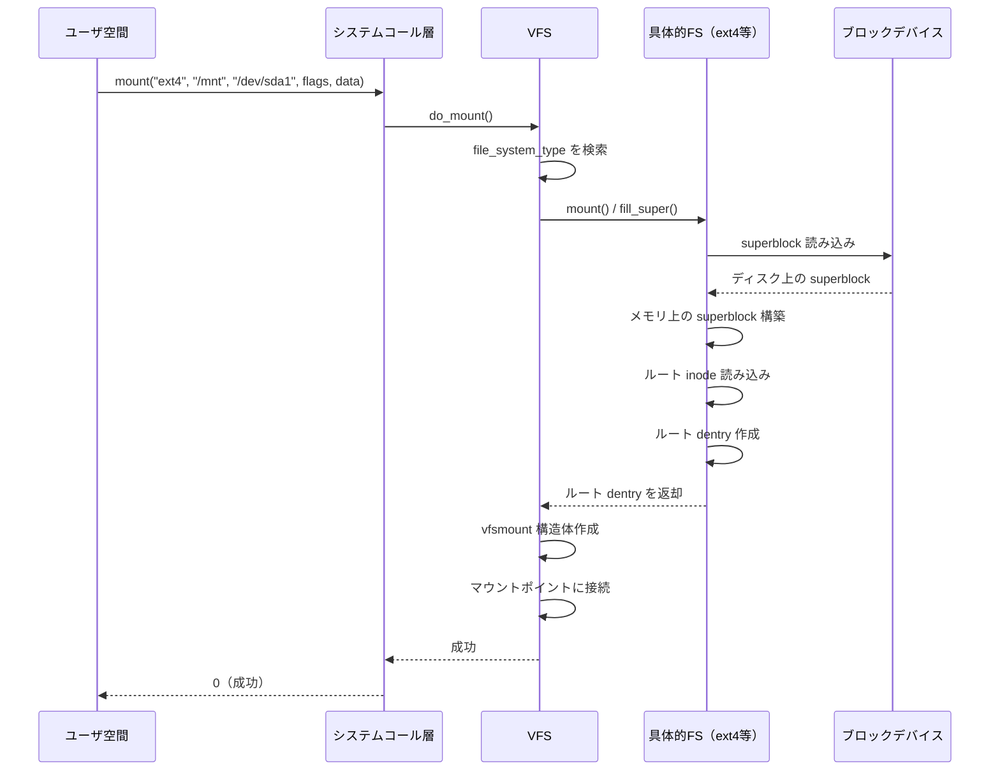

マウントが完了すると、マウントポイントのディレクトリにアクセスした際に、元のディレクトリの内容ではなくマウントされたファイルシステムのルートが見えるようになる。この切り替えは、パス名解決の過程で行われる。

::: tip マウントの名前空間
Linux ではマウント名前空間（mount namespace）により、プロセスごとに異なるマウントツリーを持つことができる。これはコンテナ技術の基盤の一つであり、各コンテナが独自のファイルシステムビューを持つことを可能にしている。
:::

## パス名解決（Path Lookup）

パス名解決は、`/home/user/document.txt` のような文字列パスを最終的な inode に変換する処理であり、VFS の中核的な機能である。この処理は `open()` や `stat()` など、ファイルパスを引数に取るほぼすべてのシステムコールの内部で実行される。

### 基本的な解決アルゴリズム

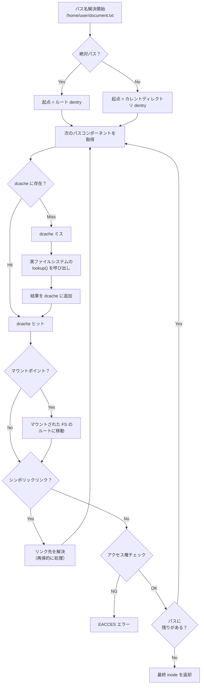

パス名解決は、パスをスラッシュで区切り、各コンポーネントについて以下の処理を行う。

1. **dcache の検索**: まず dentry キャッシュを調べる。ヒットすれば、ディスクアクセスなしに次のコンポーネントの処理に進める
2. **実ファイルシステムへの問い合わせ**: dcache にない場合、親ディレクトリの inode の `lookup()` メソッドを呼び出して、実ファイルシステムからディレクトリエントリを読み込む
3. **マウントポイントの越境**: 現在の dentry がマウントポイントである場合、マウントされたファイルシステムのルート dentry に切り替える
4. **シンボリックリンクの解決**: シンボリックリンクの場合、リンク先のパスで再帰的にパス名解決を行う（無限ループ防止のため、深さ制限がある）
5. **アクセス権の確認**: 各ディレクトリコンポーネントについて、実行（検索）権限があるかを確認する

### RCU パス名解決

Linux カーネル 2.6.38 以降では、**RCU（Read-Copy-Update）ベースのパス名解決**が導入されている。従来のパス名解決では、各 dentry をたどるたびにロック（`d_lock` や `rename_lock`）を取得する必要があり、マルチコア環境でのスケーラビリティのボトルネックとなっていた。

RCU パス名解決（"rcu-walk" モード）では、ロックを取得せずに dentry ツリーをたどることで、読み取り専用のパス名解決を高速化する。具体的には以下のように動作する。

1. まず rcu-walk モードでパス名解決を試みる
2. 各ステップで、dentry のシーケンスカウンタを使って、たどった dentry が無効化されていないか確認する
3. もし途中で dentry が変更された場合や、ロックが必要な操作（シンボリックリンクの解決など）に遭遇した場合は、通常のロックベースのモード（"ref-walk" モード）にフォールバックする

::: details rcu-walk のシーケンスカウンタ
rcu-walk では、各 dentry に `d_seq` というシーケンスカウンタが関連付けられている。パス名解決の各ステップで、このカウンタの値を記録し、次のステップに進む前に値が変わっていないことを確認する。値が変わっていた場合、その dentry は他のスレッドによって変更されたことを意味するため、rcu-walk を中止して ref-walk にフォールバックする。

このアプローチは楽観的ロック（optimistic locking）の一種であり、競合が少ない一般的なケースでは非常に効率的である。
:::

## ファイル I/O の流れ

ユーザプログラムがファイルの読み書きを行うとき、VFS を通じてどのように処理が進むかを詳しく見ていく。

### read() の処理フロー

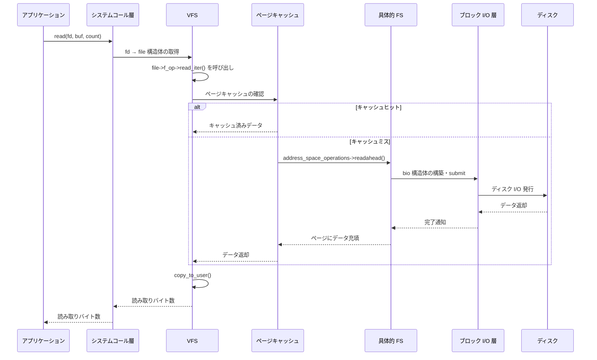

ここで重要なのは、VFS と具体的なファイルシステムの間に**ページキャッシュ**が介在していることである。ページキャッシュは、ディスクから読み込んだデータをメモリ上にキャッシュする仕組みであり、多くのファイル I/O がディスクアクセスなしに完了することを可能にしている。

各 inode には `address_space` 構造体が関連付けられており、これがそのファイルのページキャッシュを管理する。`address_space_operations` が、ページキャッシュとディスク上のデータの変換を担当する。

```c
struct address_space_operations {
    int (*writepage)(struct page *page, struct writeback_control *wbc);
    int (*read_folio)(struct file *, struct folio *);
    void (*readahead)(struct readahead_control *);
    int (*write_begin)(struct file *, struct address_space *,
                       loff_t, unsigned, struct page **, void **);
    int (*write_end)(struct file *, struct address_space *,
                     loff_t, unsigned, unsigned, struct page *, void *);
    int (*dirty_folio)(struct address_space *, struct folio *);
    // ... other operations
};
```

### write() の処理フロー

書き込みの場合は、一般的に以下の2段階で処理される。

1. **ページキャッシュへの書き込み**: データはまずページキャッシュ上のページに書き込まれ、そのページは「ダーティ」としてマークされる
2. **ライトバック**: カーネルのライトバックスレッド（`kworker/flush` など）が、ダーティページを適切なタイミングでディスクに書き戻す

この「遅延書き込み（write-back）」方式により、書き込みのレイテンシが大幅に削減される。一方で、ライトバック前にシステムがクラッシュした場合、データが失われるリスクがある。この問題に対処するために、ジャーナリングやファイルシステムの sync 操作が用意されている。

::: warning fsync と fdatasync
`fsync()` はファイルのデータとメタデータの両方をディスクに書き込む。`fdatasync()` はデータのみを書き込み、ファイルサイズが変更されていない限りメタデータの書き込みを省略する。データベースなどの信頼性が重要なアプリケーションでは、書き込みの永続性を保証するために明示的な `fsync()` 呼び出しが不可欠である。
:::

## dentry キャッシュ（dcache）の設計

dentry キャッシュは VFS のパフォーマンスにおいて極めて重要な役割を果たす。ファイルシステムへのアクセスの大部分はパス名解決を伴い、パス名解決のパフォーマンスは dcache のヒット率に大きく左右される。

### dcache のデータ構造

dcache は主に以下の3つのデータ構造で構成される。

1. **ハッシュテーブル（`dentry_hashtable`）**: 親 dentry とファイル名のハッシュをキーとして dentry を高速に検索するためのテーブル
2. **LRU リスト**: 未使用 dentry をメモリ回収時に効率的に解放するためのリスト
3. **dentry ツリー**: 親子関係を表現するツリー構造（`d_parent`、`d_subdirs`）

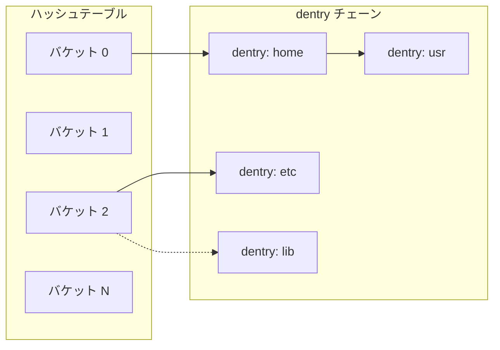

ハッシュ関数には、親 dentry のアドレスとファイル名の文字列を組み合わせたものが使用される。これにより、「親ディレクトリ X の中のファイル Y」という検索を $O(1)$ の計算量で行うことができる（ハッシュの衝突を無視した場合）。

### inode キャッシュとの関係

dentry キャッシュと密接に関連するのが inode キャッシュである。inode キャッシュは、ディスクから読み込んだ inode のメタデータをメモリ上にキャッシュする。dentry が inode を参照しているため、dentry がキャッシュに存在する限り、対応する inode もメモリ上に保持される。

メモリ回収時には、まず未使用の dentry が LRU 順に解放され、どの dentry からも参照されなくなった inode が続いて解放される。

## 疑似ファイルシステム（Pseudo Filesystem）

VFS の設計が優れている点の一つは、ディスク上のデータに限らず、カーネル内のさまざまな情報をファイルとして公開できることである。Linux の「すべてはファイル（everything is a file）」という哲学は、VFS の抽象化によって実現されている。

### procfs

procfs（`/proc`）は、プロセスの情報やカーネルの各種パラメータをファイルとして公開する疑似ファイルシステムである。

```
/proc/
├── 1/                    # PID 1 のプロセス情報
│   ├── cmdline           # コマンドライン引数
│   ├── status            # プロセスの状態
│   ├── maps              # メモリマッピング
│   ├── fd/               # ファイルディスクリプタ
│   └── ...
├── cpuinfo               # CPU 情報
├── meminfo               # メモリ使用状況
├── filesystems           # 登録済みファイルシステム
├── mounts                # マウント情報
└── sys/                  # カーネルパラメータ（sysctl）
    ├── kernel/
    ├── net/
    └── vm/
```

procfs のファイルは実際にはディスク上に存在しない。`read()` が呼ばれた瞬間に、カーネル内のデータ構造から動的にテキストが生成される。例えば `/proc/meminfo` を読むと、カーネルの `si_meminfo()` 関数が呼ばれ、現在のメモリ使用状況がテキスト形式で返される。

### sysfs

sysfs（`/sys`）は、カーネルのデバイスモデルを反映するファイルシステムである。procfs が歴史的経緯から構造が煩雑になったのに対し、sysfs はより体系的な設計がなされている。

```
/sys/
├── block/                # ブロックデバイス
│   ├── sda/
│   └── nvme0n1/
├── bus/                  # バス（pci, usb, etc.）
│   ├── pci/
│   └── usb/
├── class/                # デバイスクラス
│   ├── net/
│   └── block/
├── devices/              # デバイスツリー
└── fs/                   # ファイルシステム情報
```

sysfs の各ファイルは、原則として「1つのファイルに1つの値」という設計指針に従っている。これにより、シェルスクリプトから `echo` と `cat` だけでデバイスの設定変更や状態確認ができる。

### その他の疑似ファイルシステム

| ファイルシステム | マウントポイント | 用途 |
|---|---|---|
| tmpfs | `/tmp`, `/dev/shm` | メモリ上の一時ファイル |
| devtmpfs | `/dev` | デバイスノード |
| cgroup | `/sys/fs/cgroup` | リソース制御（cgroup） |
| debugfs | `/sys/kernel/debug` | デバッグ情報 |
| securityfs | `/sys/kernel/security` | セキュリティモジュール |
| bpffs | `/sys/fs/bpf` | BPF オブジェクトの永続化 |
| cgroupfs | `/sys/fs/cgroup` | cgroup v2 |

これらの疑似ファイルシステムは、VFS の柔軟性を活かして、ファイル I/O のインターフェースを通じてカーネルの機能にアクセスする手段を提供している。

## VFS と具体的ファイルシステムの接続

ここまで VFS の抽象化について述べてきたが、実際のファイルシステムがどのように VFS の操作テーブルを実装するかを、簡略化した例で示す。

### 最小限のファイルシステムの実装

以下は、メモリ上で動作する非常に簡単なファイルシステムの骨格である。実際の Linux カーネルモジュールとしてコンパイル可能なコードを簡略化したものである。

::: code-group

```c [myfs.c - Registration]
#include <linux/fs.h>
#include <linux/init.h>
#include <linux/module.h>
#include <linux/slab.h>

#define MYFS_MAGIC 0x4D594653  // "MYFS"

MODULE_LICENSE("GPL");

static struct dentry *myfs_mount(struct file_system_type *fs_type,
                                  int flags, const char *dev_name,
                                  void *data);

static struct file_system_type myfs_type = {
    .owner    = THIS_MODULE,
    .name     = "myfs",
    .mount    = myfs_mount,
    .kill_sb  = kill_litter_super,
};

static int __init myfs_init(void)
{
    return register_filesystem(&myfs_type);
}

static void __exit myfs_exit(void)
{
    unregister_filesystem(&myfs_type);
}

module_init(myfs_init);
module_exit(myfs_exit);
```

```c [myfs.c - Superblock]
// Fill the superblock with our filesystem info
static int myfs_fill_super(struct super_block *sb, void *data, int silent)
{
    struct inode *root_inode;

    sb->s_magic = MYFS_MAGIC;
    sb->s_blocksize = PAGE_SIZE;
    sb->s_blocksize_bits = PAGE_SHIFT;
    sb->s_op = &myfs_super_ops;

    // Create the root inode
    root_inode = new_inode(sb);
    if (!root_inode)
        return -ENOMEM;

    root_inode->i_ino = 1;
    root_inode->i_mode = S_IFDIR | 0755;
    root_inode->i_op = &myfs_dir_inode_ops;
    root_inode->i_fop = &simple_dir_operations;
    set_nlink(root_inode, 2);

    // Create root dentry
    sb->s_root = d_make_root(root_inode);
    if (!sb->s_root)
        return -ENOMEM;

    return 0;
}

static struct dentry *myfs_mount(struct file_system_type *fs_type,
                                  int flags, const char *dev_name,
                                  void *data)
{
    return mount_nodev(fs_type, flags, data, myfs_fill_super);
}
```

```c [myfs.c - Operations]
// Superblock operations
static const struct super_operations myfs_super_ops = {
    .statfs       = simple_statfs,
    .drop_inode   = generic_delete_inode,
};

// Create a new file
static int myfs_create(struct mnt_idmap *idmap,
                       struct inode *dir, struct dentry *dentry,
                       umode_t mode, bool excl)
{
    struct inode *inode = new_inode(dir->i_sb);
    if (!inode)
        return -ENOMEM;

    inode->i_ino = get_next_ino();
    inode->i_mode = mode;
    inode->i_op = &myfs_file_inode_ops;
    inode->i_fop = &myfs_file_ops;
    inode->i_mapping->a_ops = &myfs_aops;

    d_instantiate(dentry, inode);
    return 0;
}

// Directory inode operations
static const struct inode_operations myfs_dir_inode_ops = {
    .create  = myfs_create,
    .lookup  = simple_lookup,
    .mkdir   = myfs_mkdir,
    .rmdir   = simple_rmdir,
    .unlink  = simple_unlink,
};
```

:::

この例からわかるように、ファイルシステムの実装は VFS が定義する各種操作テーブルの関数ポインタを埋めていくことで行われる。Linux カーネルは `simple_lookup()`、`simple_dir_operations` などのヘルパー関数を多数提供しており、単純なケースではこれらを利用することで実装量を大幅に削減できる。

## FUSE --- ユーザ空間ファイルシステム

VFS の設計の柔軟性をさらに拡張するのが、FUSE（Filesystem in Userspace）である。FUSE は、ファイルシステムの実装をユーザ空間で行うためのフレームワークであり、VFS と FUSE カーネルモジュールが連携することで実現される。

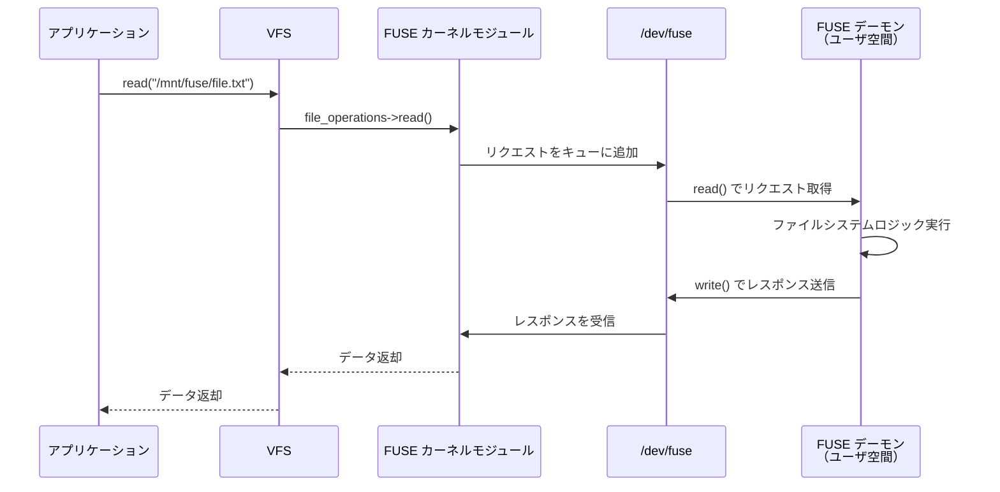

### FUSE のメリットとデメリット

FUSE には以下のようなトレードオフがある。

**メリット**:
- ユーザ空間で開発できるため、カーネルモジュールに比べて開発・デバッグが容易
- クラッシュしてもカーネルパニックにならない（プロセスが異常終了するだけ）
- 任意のプログラミング言語で実装可能（Go, Rust, Python など）
- root 権限なしでマウント可能（fusermount）

**デメリット**:
- ユーザ空間とカーネル空間の間のコンテキストスイッチによるオーバーヘッド
- データのコピーが追加で発生する（カーネル空間 <-> ユーザ空間）
- カーネル内ファイルシステムに比べてレイテンシが高い

FUSE は、パフォーマンスが最重要ではないが、開発の容易さやプロトタイピングの速度が求められるケースで広く活用されている。代表的な FUSE ベースのファイルシステムとして、以下のものがある。

| ファイルシステム | 用途 |
|---|---|
| sshfs | SSH 越しのリモートファイルシステム |
| s3fs | Amazon S3 バケットのマウント |
| rclone mount | クラウドストレージのマウント |
| NTFS-3G | NTFS の読み書きサポート |
| GlusterFS | 分散ファイルシステム（FUSE クライアント） |

## VFS の設計思想と学ぶべきこと

VFS の設計には、ソフトウェアエンジニアリング全般に通じる重要な設計原則が凝縮されている。

### Strategy パターンとしての VFS

VFS の操作テーブルは、GoF デザインパターンにおける **Strategy パターン**の古典的な実装である。VFS はファイル操作のアルゴリズム（戦略）をインターフェースとして定義し、各ファイルシステムがそのインターフェースの具体的な実装を提供する。これにより、VFS のコードを変更することなく、新しいファイルシステムを追加できる。

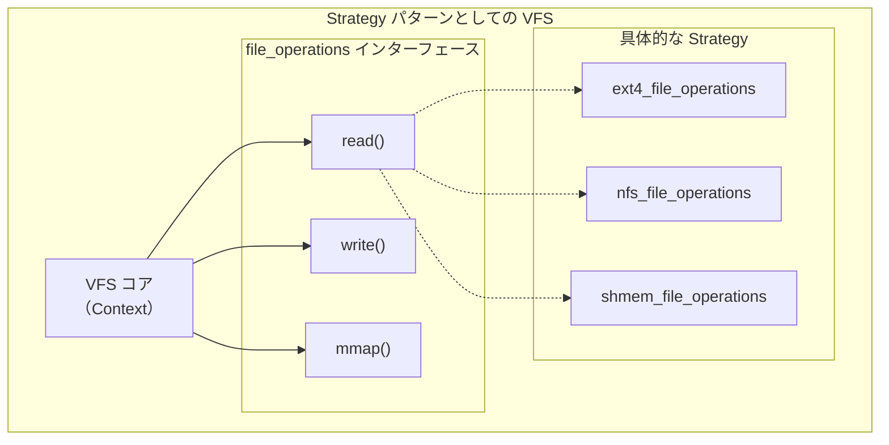

### 関心の分離

VFS の4大オブジェクト（superblock, inode, dentry, file）は、それぞれ異なる関心を分離している。

- **superblock**: ファイルシステム全体の管理
- **inode**: ファイルの永続的なメタデータ
- **dentry**: 名前空間とパス名解決
- **file**: プロセスごとのファイルアクセス状態

この分離により、例えば dentry キャッシュを inode キャッシュとは独立に最適化できる。また、同じ inode に対して複数の dentry（ハードリンク）や複数の file（複数プロセスからの同時オープン）を持つといった多対多の関係を自然にモデル化できる。

### 依存関係逆転の原則

VFS の設計は、**依存関係逆転の原則（Dependency Inversion Principle）** の好例でもある。上位モジュール（VFS）は下位モジュール（具体的なファイルシステム）に依存しない。両者は抽象（操作テーブルのインターフェース）に依存する。これにより、新しいファイルシステムの追加が既存のコードに影響を与えることなく行える。

## 性能特性と最適化

VFS およびファイルシステム全体の性能について、いくつかの重要な側面を述べる。

### キャッシュの階層

ファイル I/O のパフォーマンスは、各レベルのキャッシュのヒット率に大きく依存する。

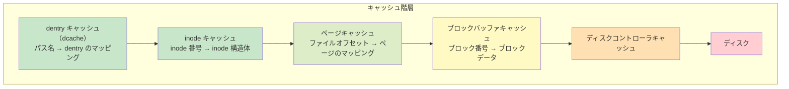

一般的なワークロードでは、dcache のヒット率は 95% 以上に達することが多い。つまり、パス名解決の大部分は、ディスクアクセスなしにメモリ上で完結する。

### readahead（先読み）

VFS は、シーケンシャルなファイル読み込みを検出した場合、**先読み（readahead）** を行う。現在読んでいる位置より先のデータをバックグラウンドでページキャッシュに読み込むことで、実際の `read()` が呼ばれた時点でデータがすでにキャッシュに存在している状態を目指す。

先読みウィンドウのサイズはアクセスパターンに応じて動的に調整される。シーケンシャルアクセスが続くと先読みウィンドウは拡大し、ランダムアクセスが検出されると先読みは無効化される。デフォルトの最大先読みサイズは通常 128 KB（32ページ）だが、`/sys/block/<device>/queue/read_ahead_kb` で調整可能である。

### I/O スケジューリングとの連携

VFS が発行した I/O リクエストは、ブロック I/O 層の I/O スケジューラによって最適化される。I/O スケジューラは、複数のリクエストをマージしたり、ディスクのシーク距離を最小化するようにリクエストの順序を並べ替えたりする。SSD の場合はシーク時間が存在しないため、より単純なスケジューラ（`none` や `mq-deadline`）が適している。

## 他の OS の VFS との比較

### BSD 系の vnode

BSD 系の VFS は **vnode（virtual node）** を中心に構築されている。vnode は Linux の inode + dentry に近い役割を果たすが、Linux のように名前空間（dentry）とメタデータ（inode）を明確に分離していない点が異なる。

FreeBSD の VFS では、vnode にネームキャッシュ（namecache）が関連付けられているが、これは Linux の dcache ほど積極的にキャッシュを行わない傾向がある。一方、FreeBSD の VFS は nullfs や unionfs などのスタッキング（積層）ファイルシステムのサポートが Linux よりも成熟している。

### Windows の IFS

Windows の I/O マネージャとファイルシステムドライバの関係は、Linux の VFS とファイルシステムの関係に概念的に似ている。Windows では IFS（Installable File System）Kit を使ってファイルシステムドライバを開発する。Windows のフィルタマネージャとフィルタドライバは、Linux の VFS には直接的な対応物がない独自の機能であり、ファイルシステムの操作をインターセプトして加工する仕組みを提供する。

### macOS の VFS

macOS の VFS は BSD 系の vnode ベースの VFS を土台にしつつ、Apple 独自の拡張を加えたものである。APFS の導入に際して VFS 層にも修正が加えられ、スナップショットやクローンといった機能を効率的にサポートするための拡張が行われている。

## 実運用における VFS の活用

### コンテナ環境での VFS

コンテナ技術（Docker, Kubernetes）では、VFS の仕組みが重要な役割を果たす。

- **マウント名前空間**: 各コンテナが独自のファイルシステムビューを持つことを可能にする
- **overlayfs**: コンテナイメージのレイヤ構造を実現する積層ファイルシステム。VFS の上に複数のファイルシステム層を重ね合わせることで、イメージの共有と差分管理を実現する
- **bind mount**: ホスト側のディレクトリをコンテナ内に公開する際に使用される

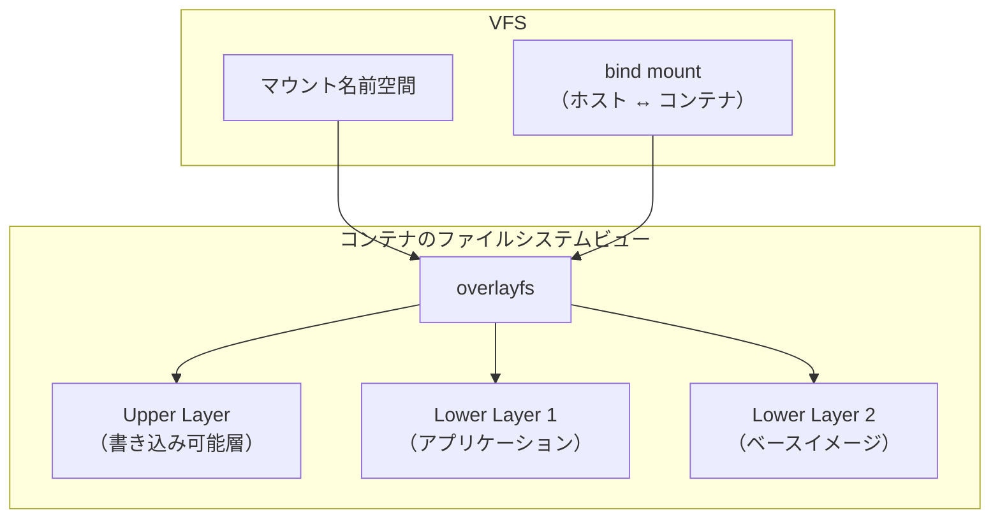

### 分散ファイルシステムと VFS

NFS、CIFS/SMB、GlusterFS、CephFS などの分散ファイルシステムは、VFS のインターフェースを通じて透過的にアクセスできる。これらのファイルシステムでは、`dentry_operations` の `d_revalidate` がキャッシュの整合性維持に重要な役割を果たす。

分散ファイルシステムにおいて特に注意が必要なのは、**キャッシュの一貫性**の問題である。複数のクライアントから同じファイルにアクセスする場合、一方のクライアントの変更が他方にどのタイミングで見えるかは、ファイルシステムの実装とマウントオプションに依存する。NFS の場合、`close-to-open` 一貫性モデルが一般的に使用される。これは、ファイルを閉じた時点での変更が、次にそのファイルを開いたクライアントに見えることを保証するものである。

### トラブルシューティング

VFS 関連の問題を調査する際に有用なツールと手法を紹介する。

```bash
# Register filesystem types
cat /proc/filesystems

# Current mounts
cat /proc/mounts

# dcache and inode cache statistics
cat /proc/slabinfo | grep -E "dentry|inode_cache"

# VFS cache pressure tuning
cat /proc/sys/vm/vfs_cache_pressure

# Per-filesystem statistics (ext4 example)
cat /sys/fs/ext4/sda1/lifetime_write_kbytes

# Trace VFS operations with ftrace
echo 1 > /sys/kernel/debug/tracing/events/ext4/enable
cat /sys/kernel/debug/tracing/trace_pipe
```

`vfs_cache_pressure` は、カーネルが dcache と inode キャッシュの回収にどの程度積極的かを制御するパラメータである。デフォルト値は 100 で、値を小さくするとキャッシュがより長く保持される。ファイル数の多いワークロードでは、この値を 50 程度に下げることで dcache ヒット率を改善できる場合がある。

## VFS の限界と今後の方向性

### 既存の課題

VFS は長い歴史の中で非常に成熟した設計となっているが、現代のワークロードに対していくつかの課題を抱えている。

1. **ロックの競合**: 大量のファイルを同一ディレクトリに作成する場合、ディレクトリの inode ロック（`i_mutex`）がボトルネックになることがある。これは、メールサーバの maildir 形式のように、1つのディレクトリに大量のファイルを格納するワークロードで顕著になる

2. **メタデータ操作のスケーラビリティ**: `stat()` のような軽量なメタデータ操作でも、VFS のロックプロトコルのコストが無視できないケースがある。数百万のファイルに対して `find` を実行するような操作では、このオーバーヘッドが積み重なる

3. **ネットワークファイルシステムとのミスマッチ**: VFS のセマンティクスは POSIX のファイル操作に基づいているが、クラウドストレージ（S3 など）は異なるセマンティクス（結果整合性、ディレクトリの概念がないフラットな名前空間など）を持つ。これらを VFS の枠組みに無理に収めることで、パフォーマンスの低下や意味的なずれが生じることがある

### io_uring とファイルシステム

Linux の io_uring は、システムコールのオーバーヘッドを削減する新しい非同期 I/O インターフェースである。io_uring はリングバッファを通じて I/O リクエストをバッチ処理し、システムコールの回数を大幅に削減できる。VFS の文脈では、パス名解決やメタデータ操作も io_uring を通じて非同期に行えるようにする取り組みが進んでいる。

### eBPF とファイルシステム

eBPF を活用してファイルシステムの動作をカスタマイズする取り組みも進んでいる。例えば、VFS の操作にフックを挿入してアクセスパターンをトレースしたり、ファイルシステムの挙動をカーネルモジュールを書かずにカスタマイズしたりすることが可能になりつつある。

## まとめ

VFS は、「多様な実装を統一的なインターフェースの背後に隠す」というソフトウェア設計の基本原則を、OS カーネルという最もクリティカルなソフトウェアの中で実現した優れた抽象化層である。

その設計の要点を振り返ると以下のようになる。

- **4つの主要オブジェクト**（superblock, inode, dentry, file）による関心の分離
- **操作テーブル**（関数ポインタの構造体）によるポリモーフィズムの実現
- **dentry キャッシュ**によるパス名解決の高速化
- **ページキャッシュ**との連携によるファイル I/O の効率化
- **疑似ファイルシステム**を通じた「すべてはファイル」哲学の実現
- **FUSE** によるユーザ空間ファイルシステムのサポート

VFS の設計思想は、ファイルシステムに限らず、プラグインアーキテクチャやドライバモデルなど、多様な実装を統一的に扱う必要があるあらゆるソフトウェア設計に応用できる普遍的な知見を含んでいる。
