# 動画ストリーミング配信の仕組み（HLS, DASH, MSE）

## 1. 動画配信の歴史：プログレッシブダウンロードからアダプティブストリーミングへ

### 1.1 プログレッシブダウンロード時代

2000年代初頭、動画をWebブラウザで再生するにはAdobe Flash PlayerやRealPlayerといったプラグインが不可欠だった。配信方式は**プログレッシブダウンロード**が主流であった。これはHTTPサーバ上にMP4ファイルを置き、ブラウザが先頭からダウンロードしながら並行して再生する方式である。

プログレッシブダウンロードには致命的な問題があった。

- **帯域幅への固定依存**: ファイルはひとつの品質しか持てない。高解像度の動画を低速回線で再生しようとすると、バッファリングが頻発する
- **シーク操作の非効率**: ファイル末尾に含まれるメタデータ（`moov` atom）をダウンロードしないとシーク位置が計算できない。`moov` atomがファイル末尾にある場合、全体をダウンロードするまで再生を開始できない
- **帯域の無駄遣い**: 視聴者が途中離脱しても、すでにダウンロードされたデータは使われない
- **スケーラビリティの欠如**: 配信サーバに全接続が集中し、大規模配信には向かない

YouTubeは2005年にサービスを開始した当初、Flash Video（FLV）形式のプログレッシブダウンロードを採用していた。ユーザーがコンテンツを「読み込み中」のまま数分待つ経験は日常的であり、これが当時のWebビデオ体験の限界を象徴していた。

### 1.2 RTSP/RTMPによるリアルタイムストリーミング

プログレッシブダウンロードの限界を超えようと、**RTSP（Real-Time Streaming Protocol）**や**RTMP（Real-Time Messaging Protocol）**を使ったストリーミングが登場した。

RTMPはAdobe（当時Macromedia）が開発したプロトコルで、Flash Playerとの親和性が高く、2000年代後半のライブ配信で広く使われた。RTMPはTCPベースの常時接続を維持し、低遅延（数秒程度）のストリーミングを実現した。しかし以下の問題を抱えていた。

- HTTPではないため、企業ファイアウォールに阻まれることがある
- Flash Playerへの依存（iOSは一切サポートしない）
- CDNとの統合が難しく、スケーラビリティに課題があった

2010年にAppleがiPad/iPhoneでFlashを拒絶したことは、RTMPと旧来のストリーミング方式の終焉を事実上決定付けた。

### 1.3 アダプティブビットレートストリーミング（ABR）の誕生

2009年、Appleは**HLS（HTTP Live Streaming）**をiPhoneOS 3.0で導入した。同年ごろ、MicrosoftはSmooth Streamingを、Adobeは後にHDSと呼ばれる技術をそれぞれリリースした。これらはすべて**アダプティブビットレートストリーミング（ABR: Adaptive Bitrate Streaming）**と呼ばれる新しいパラダイムを採用していた。

ABRの核心的なアイデアはシンプルである。

1. 動画を短い時間単位（2〜10秒程度）のセグメントに分割する
2. 各セグメントを複数のビットレート・解像度でエンコードし、CDNに配置する
3. クライアントはネットワーク状況をリアルタイムで監視し、最適なビットレートのセグメントを動的に選択する

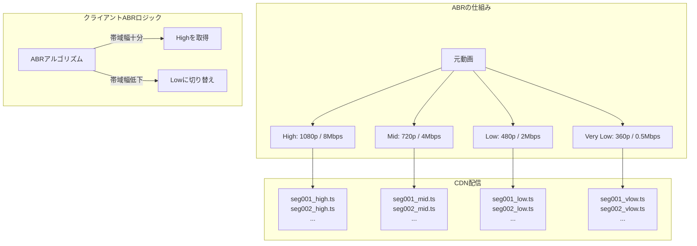

この方式により、帯域幅が変動しても再生が途切れることなく品質が自動的に調整される。また通常のHTTPを使うため、既存のHTTPインフラ（CDN、キャッシュサーバ、ファイアウォール）と完全に互換性があった。

### 1.4 標準化の収束：HLSとDASH

乱立する独自ABR技術を統一すべく、2012年にMPEGが**MPEG-DASH（Dynamic Adaptive Streaming over HTTP）**を国際標準（ISO/IEC 23009-1）として策定した。DASHはベンダー中立な国際標準として設計された。

一方Appleのは独自規格のHLSを進化させ続け、現在もAppleデバイスおよびSafariブラウザとの互換性が必要な配信ではHLSが不可欠である。

2020年代現在、多くのプラットフォームはHLSとDASHの両方をサポートしており、クライアントの対応状況に応じて動的に切り替えるアーキテクチャが主流である。

## 2. HLSの仕組み

### 2.1 HLSの概要

HLS（HTTP Live Streaming）はAppleが開発したHTTPベースのアダプティブストリーミングプロトコルである。RFC 8216として標準化されており、以下の要素で構成される。

- **マスタープレイリスト（Master Playlist）**: 利用可能なすべての映像品質の一覧を記述する `.m3u8` ファイル
- **メディアプレイリスト（Media Playlist）**: 特定の品質に対応するセグメントの一覧を記述する `.m3u8` ファイル
- **メディアセグメント**: 実際の映像・音声データを格納するファイル（`.ts`、または `.fmp4`）

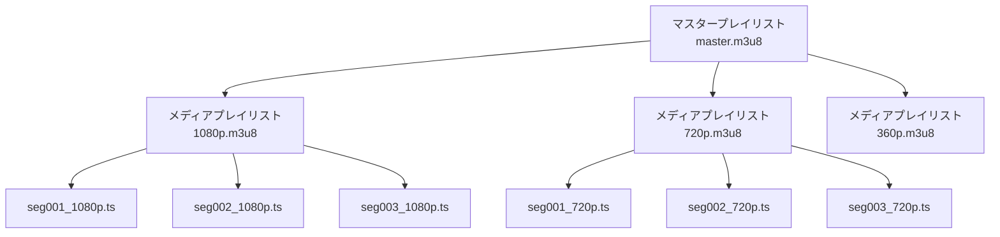

### 2.2 マスタープレイリスト

マスタープレイリストはHLSストリームの入口となるファイルである。利用可能な映像の品質（バリアント）を列挙し、各バリアントに対応するメディアプレイリストのURLを示す。

```
#EXTM3U
#EXT-X-VERSION:6

# Variant stream: 1080p
#EXT-X-STREAM-INF:BANDWIDTH=8000000,RESOLUTION=1920x1080,CODECS="avc1.640028,mp4a.40.2",FRAME-RATE=29.970
https://cdn.example.com/hls/1080p/playlist.m3u8

# Variant stream: 720p
#EXT-X-STREAM-INF:BANDWIDTH=4000000,RESOLUTION=1280x720,CODECS="avc1.4d401f,mp4a.40.2",FRAME-RATE=29.970
https://cdn.example.com/hls/720p/playlist.m3u8

# Variant stream: 480p
#EXT-X-STREAM-INF:BANDWIDTH=2000000,RESOLUTION=854x480,CODECS="avc1.4d401e,mp4a.40.2",FRAME-RATE=29.970
https://cdn.example.com/hls/480p/playlist.m3u8

# Variant stream: 360p (audio-only fallback)
#EXT-X-STREAM-INF:BANDWIDTH=500000,RESOLUTION=640x360,CODECS="avc1.42c01e,mp4a.40.2"
https://cdn.example.com/hls/360p/playlist.m3u8

# Alternate audio track
#EXT-X-MEDIA:TYPE=AUDIO,GROUP-ID="audio",NAME="English",DEFAULT=YES,AUTOSELECT=YES,LANGUAGE="en",URI="https://cdn.example.com/hls/audio_en/playlist.m3u8"
```

`#EXT-X-STREAM-INF` の各属性の意味は以下の通りである。

| 属性 | 意味 |
|------|------|
| `BANDWIDTH` | ピーク帯域幅（bps）。ABRアルゴリズムが品質選択に使用する |
| `AVERAGE-BANDWIDTH` | 平均帯域幅（bps）。バッファベースのABRに有用 |
| `RESOLUTION` | 映像解像度（横x縦） |
| `CODECS` | RFC 6381形式のコーデック識別子 |
| `FRAME-RATE` | フレームレート |

### 2.3 メディアプレイリスト

メディアプレイリストは特定の品質のセグメント一覧を記述する。VOD（録画済みコンテンツ）とLive（ライブ配信）で構造が異なる。

**VODのメディアプレイリスト例：**

```
#EXTM3U
#EXT-X-VERSION:6
#EXT-X-TARGETDURATION:6
#EXT-X-PLAYLIST-TYPE:VOD

#EXTINF:6.000000,
seg001.ts
#EXTINF:6.000000,
seg002.ts
#EXTINF:6.000000,
seg003.ts
#EXTINF:5.921700,
seg004.ts

#EXT-X-ENDLIST
```

**ライブのメディアプレイリスト例：**

```
#EXTM3U
#EXT-X-VERSION:6
#EXT-X-TARGETDURATION:6
#EXT-X-MEDIA-SEQUENCE:100

#EXTINF:6.000000,
seg100.ts
#EXTINF:6.000000,
seg101.ts
#EXTINF:6.000000,
seg102.ts
```

ライブ配信では `#EXT-X-ENDLIST` が存在せず、プレイヤーは定期的にプレイリストを再取得して新しいセグメントが追加されていないかをポーリングする。`#EXT-X-MEDIA-SEQUENCE` はプレイリスト内の最初のセグメントのシーケンス番号を示し、古いセグメントがプレイリストからどのタイミングで削除されたかを追跡する。

### 2.4 セグメントファイル

従来のHLSはMPEG-2 Transport Stream（`.ts`）をセグメント形式として使用していたが、HLS v7以降は**fragmented MP4（fMP4）**のサポートが追加された。fMP4はDASHとも共通のコンテナ形式であり、CMSとの統合が容易である。

```
# HLS with fMP4 segments (CMAF compatible)
#EXT-X-MAP:URI="init.mp4"   ← Initialization segment (codec parameters)

#EXTINF:6.000000,
seg001.m4s               ← Media segment (video + audio)
#EXTINF:6.000000,
seg002.m4s
```

`#EXT-X-MAP` はメディアの初期化情報（コーデック設定、タイムスケールなど）を含む初期化セグメントを指定する。これはfMP4の `moov` box に相当し、各セグメントは `moof` + `mdat` box の組み合わせで構成される。

### 2.5 HLSの暗号化（AES-128）

HLSはAES-128-CBC暗号化をネイティブにサポートしている。

```
#EXT-X-KEY:METHOD=AES-128,URI="https://keys.example.com/key.bin",IV=0x00000000000000000000000000000001

#EXTINF:6.000000,
seg001.ts
```

`URI` で鍵ファイルのURLを、`IV` で初期化ベクタを指定する。再生時にクライアントは鍵サーバから鍵を取得してセグメントを復号する。ただしこのAES-128は単純なコンテンツ保護に過ぎず、本格的なDRMには `#EXT-X-SESSION-KEY` などDRM連携が必要である（詳細は後述）。

## 3. DASHの仕組み

### 3.1 DASHの概要

MPEG-DASH（Dynamic Adaptive Streaming over HTTP）はISO/IEC 23009-1として標準化されたアダプティブストリーミングプロトコルである。HLSが `.m3u8` テキストファイルを使うのに対し、DASHはXMLベースの**MPD（Media Presentation Description）**を使う。

DASHはHLSと比較して以下の特徴を持つ。

- **ベンダー中立**: Appleではなくiso/mpeg標準機関が策定している
- **コーデック自由度**: 特定のコーデックを強制しない
- **セグメント形式の柔軟性**: MPEG-2 TS、fMP4（CMAF）、WebMなど複数をサポート
- **詳細な制御**: ライブ配信の挙動、タイムライン記述など、より細粒度な制御が可能

### 3.2 MPD（Media Presentation Description）

MPDはDASHストリーム全体を記述するXMLファイルである。

```xml
<?xml version="1.0" encoding="UTF-8"?>
<MPD xmlns="urn:mpeg:dash:schema:mpd:2011"
     profiles="urn:mpeg:dash:profile:isoff-on-demand:2011"
     type="static"
     mediaPresentationDuration="PT2H30M0S"
     minBufferTime="PT1.5S">

  <Period id="1" start="PT0S">

    <!-- Video Adaptation Set -->
    <AdaptationSet id="1" mimeType="video/mp4" contentType="video"
                   startWithSAP="1" segmentAlignment="true">

      <!-- 1080p -->
      <Representation id="v1080p" bandwidth="8000000"
                      width="1920" height="1080" frameRate="30"
                      codecs="avc1.640028">
        <SegmentTemplate timescale="90000"
                         initialization="1080p/init.mp4"
                         media="1080p/seg$Number$.m4s"
                         startNumber="1">
          <SegmentTimeline>
            <S d="540000" r="149"/>  <!-- 150 segments × 6s -->
          </SegmentTimeline>
        </SegmentTemplate>
      </Representation>

      <!-- 720p -->
      <Representation id="v720p" bandwidth="4000000"
                      width="1280" height="720" frameRate="30"
                      codecs="avc1.4d401f">
        <SegmentTemplate timescale="90000"
                         initialization="720p/init.mp4"
                         media="720p/seg$Number$.m4s"
                         startNumber="1">
          <SegmentTimeline>
            <S d="540000" r="149"/>
          </SegmentTimeline>
        </SegmentTemplate>
      </Representation>

    </AdaptationSet>

    <!-- Audio Adaptation Set -->
    <AdaptationSet id="2" mimeType="audio/mp4" contentType="audio"
                   lang="en">
      <Representation id="audio_en" bandwidth="192000"
                      audioSamplingRate="48000"
                      codecs="mp4a.40.2">
        <SegmentTemplate timescale="48000"
                         initialization="audio_en/init.mp4"
                         media="audio_en/seg$Number$.m4s"
                         startNumber="1">
          <SegmentTimeline>
            <S d="288000" r="149"/>
          </SegmentTimeline>
        </SegmentTemplate>
      </Representation>
    </AdaptationSet>

  </Period>
</MPD>
```

### 3.3 DASHの主要概念

MPDの階層構造は以下の通りである。

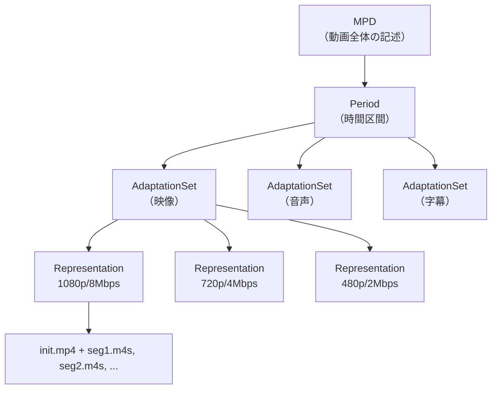

**Period**: コンテンツ内の時間区間を表す。広告挿入（SCTE-35）や番組変更時に複数のPeriodが使われる。

**AdaptationSet**: 同種のメディア（映像、音声、字幕）のグループ。映像AdaptationSet内の各Representationは同じコンテンツを異なる品質でエンコードしたものである。

**Representation**: 具体的な品質レベル（解像度＋ビットレートの組み合わせ）を表す。プレイヤーはABRアルゴリズムによって適切なRepresentationを選択する。

### 3.4 SegmentTemplateとSegmentList

DASHはセグメントの記述方法として複数の方式をサポートする。

**SegmentTemplate（テンプレート方式）**: URLのパターンを定義し、`$Number$`や`$Time$`などの変数で各セグメントのURLを生成する。プレイリストファイルにすべてのURLを列挙する必要がなく、MPDファイルが小さくなる利点がある。

**SegmentList（リスト方式）**: 各セグメントのURLを明示的に列挙する。複雑なセグメントタイムラインに対応しやすいが、MPDが大きくなる。

**BaseURL + SegmentBase（単一ファイル方式）**: ひとつの大きなファイル内のバイトレンジを使ってセグメントを指定する。`Range`ヘッダーを使ったHTTPリクエストでセグメントを取得する。

## 4. HLSとDASHの比較

### 4.1 技術的な比較

| 特性 | HLS | DASH |
|------|-----|------|
| 策定組織 | Apple（RFC 8216） | ISO/IEC（MPEG） |
| プレイリスト形式 | テキスト（.m3u8） | XML（.mpd） |
| セグメント形式 | MPEG-2 TS / fMP4 | fMP4 / WebM |
| デフォルトセグメント長 | 6秒 | 2〜10秒（柔軟） |
| コーデック | H.264必須（推奨）、H.265/AV1対応 | コーデック非依存 |
| DRM | FairPlay（Apple）、Widevine/PlayReady（CMAF HLS） | Widevine、PlayReady等 |
| iOSネイティブサポート | 完全サポート | 非サポート（MSE経由のみ） |
| Android | HLS.jsなどで対応 | ExoPlayerで完全対応 |
| ブラウザ | Safari: ネイティブ / 他: HLS.jsなど | MSE経由で対応（Chrome, Firefox等） |
| 低遅延 | LL-HLS（Apple仕様） | LL-DASH |
| 標準化 | RFC 8216 | ISO/IEC 23009-1 |

### 4.2 ブラウザサポートの実態

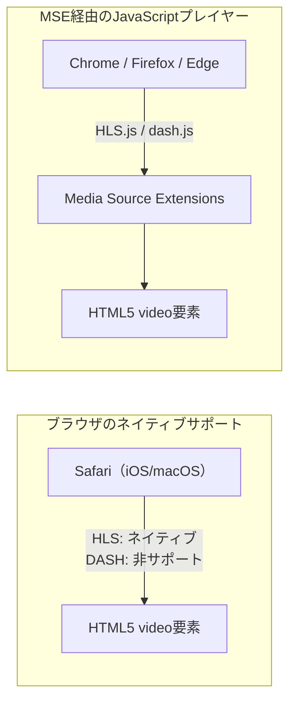

実際のプロダクション環境では、以下のような判断が一般的である。

- **Apple製品（Safari、iOS）向け**: HLS必須。`<video>` 要素に直接HLS URLを指定するか、hls.jsを使う
- **非Safari環境**: HLS.jsまたはdash.jsなどのJavaScriptプレイヤーをMSEと組み合わせて使う
- **ユニバーサル対応**: CMAF（Common Media Application Format）を使い、単一のセグメントでHLSとDASHの両方のプレイリストに対応する（後述）

### 4.3 DASHが優れている点

DASHはHLSに対していくつかの技術的優位性を持つ。

**マルチピリオドによる動的広告挿入**: MPDのPeriodをまたぐことで、コンテンツの中にシームレスに広告を挿入できる。これはSSAI（Server-Side Ad Insertion）の実装に適している。

**コンテンツ保護の標準化（MPEG-CENC）**: MPEG Common Encryption（CENC）を使い、Widevine・PlayReady・FairPlayなど複数のDRMシステムをひとつのセグメントで対応できる。

**より細粒度な制御**: SegmentTimelineを使ったフレーム精度のシーク、ライブエッジの詳細な制御など。

### 4.4 HLSが優れている点

**iOSとSafariの完全ネイティブサポート**: iPhoneでHLSをネイティブ再生できる。バックグラウンド再生、PiP（ピクチャインピクチャ）、AirPlayとのシームレスな統合など、Apple製品のメリットをフルに享受できる。

**シンプルな仕様**: テキストベースの `.m3u8` はXMLよりも可読性が高く、デバッグが容易である。

**FairPlayとの緊密な統合**: Apple独自のDRM（FairPlay）はHLSとのみ公式に連携する。

## 5. Media Source Extensions（MSE）

### 5.1 MSEとは何か

**Media Source Extensions（MSE）**はW3Cが策定したWebブラウザAPIであり、JavaScriptから `<video>` および `<audio>` 要素にメディアデータをプログラム的に供給するための仕組みである。

MSE以前は、ブラウザの `<video>` 要素にHLSやDASHを直接再生させることができなかった（Safariを除く）。MSEによってJavaScriptプレイヤー（HLS.js、dash.js、Shakaplayer等）がHLS/DASHのプレイリストを自前でパースし、セグメントを取得して `<video>` に渡す実装が可能になった。

### 5.2 MSEの基本的な仕組み

```mermaid
sequenceDiagram
    participant P as JavaScriptプレイヤー
    participant MSE as MediaSource API
    participant V as video要素
    participant CDN as CDN

    P->>MSE: new MediaSource()
    P->>V: video.src = URL.createObjectURL(mediaSource)
    MSE->>P: sourceopen イベント
    P->>MSE: addSourceBuffer('video/mp4; codecs="avc1.640028"')
    P->>CDN: fetch init.mp4（初期化セグメント）
    CDN->>P: init.mp4
    P->>MSE: sourceBuffer.appendBuffer(initData)
    P->>CDN: fetch seg001.m4s
    CDN->>P: seg001.m4s
    P->>MSE: sourceBuffer.appendBuffer(segmentData)
    V->>V: 再生開始
    Note over P,V: 以降、ABRに従い適切な品質のセグメントを継続的にfetch & append
```

### 5.3 MSEのコード例

```javascript
// Initialize MediaSource and attach to video element
function initPlayer(videoElement, manifestUrl) {
  const mediaSource = new MediaSource();

  // Create object URL and assign to video
  videoElement.src = URL.createObjectURL(mediaSource);

  mediaSource.addEventListener('sourceopen', async () => {
    // Add SourceBuffer for video (fMP4)
    const videoBuffer = mediaSource.addSourceBuffer(
      'video/mp4; codecs="avc1.640028"'
    );
    // Add SourceBuffer for audio
    const audioBuffer = mediaSource.addSourceBuffer(
      'audio/mp4; codecs="mp4a.40.2"'
    );

    // Fetch and append initialization segment
    const initResponse = await fetch('1080p/init.mp4');
    const initData = await initResponse.arrayBuffer();

    // Wait for previous appendBuffer to complete
    await appendBufferAsync(videoBuffer, initData);

    // Start buffering segments
    await appendSegment(videoBuffer, '1080p/seg001.m4s');
    await appendSegment(videoBuffer, '1080p/seg002.m4s');
  });
}

// Helper: wrap appendBuffer in a Promise
function appendBufferAsync(sourceBuffer, data) {
  return new Promise((resolve, reject) => {
    sourceBuffer.addEventListener('updateend', resolve, { once: true });
    sourceBuffer.addEventListener('error', reject, { once: true });
    sourceBuffer.appendBuffer(data);
  });
}

async function appendSegment(sourceBuffer, url) {
  const response = await fetch(url);
  const data = await response.arrayBuffer();
  await appendBufferAsync(sourceBuffer, data);
}
```

### 5.4 SourceBufferの管理

MSEを使ったプレイヤーは以下の点を適切に管理する必要がある。

**バッファ管理**: `sourceBuffer.buffered` プロパティで現在バッファリング済みの時間範囲を確認できる。無制限にバッファリングするとメモリが枯渇するため、視聴済みの古いセグメントは削除する必要がある。

```javascript
// Remove old buffered content to prevent memory overflow
function trimBuffer(sourceBuffer, currentTime) {
  const KEEP_BEHIND = 30; // keep 30 seconds behind current time
  if (sourceBuffer.buffered.length > 0) {
    const start = sourceBuffer.buffered.start(0);
    const removeEnd = Math.max(0, currentTime - KEEP_BEHIND);
    if (removeEnd > start) {
      sourceBuffer.remove(start, removeEnd);
    }
  }
}
```

**クォータ超過への対応**: `QuotaExceededError` が発生した場合、古いバッファを削除してリトライする。

**タイムスタンプオフセット**: 異なるセグメントのタイムスタンプが不連続にならないよう、`sourceBuffer.timestampOffset` で補正する。

### 5.5 EncryptedMediaExtensions（EME）との連携

MSEはDRMを処理するための**EME（Encrypted Media Extensions）**と組み合わせて使われる。EMEはブラウザとDRM CDM（Content Decryption Module）の間のブリッジとなるAPIである。

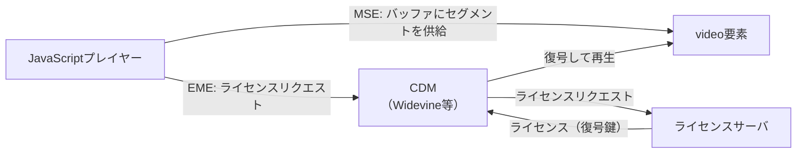

## 6. ABRアルゴリズム

### 6.1 ABRアルゴリズムの役割

ABR（Adaptive Bitrate）アルゴリズムは、現在のネットワーク状況に基づいて次のセグメントをどのビットレートで取得するかを決定する。目標は以下の二律背反するゴールのバランスを取ることである。

- **高品質**: できるだけ高いビットレートのセグメントを選ぶ
- **再生継続性**: バッファアンダーランによる再生停止（スタール）を防ぐ

### 6.2 スループットベースのABR

最もシンプルなアプローチで、直近のセグメント取得速度（スループット）を計測し、そのスループットに対して安全マージンを持ったビットレートを選択する。

```javascript
class ThroughputABR {
  constructor(levels) {
    this.levels = levels; // sorted by bandwidth ascending
    this.throughputHistory = [];
    this.SAFETY_FACTOR = 0.8; // use 80% of measured throughput
  }

  // Called after each segment download
  recordDownload(byteSize, durationMs) {
    const throughputBps = (byteSize * 8) / (durationMs / 1000);
    this.throughputHistory.push(throughputBps);
    // Keep only last 3 measurements
    if (this.throughputHistory.length > 3) {
      this.throughputHistory.shift();
    }
  }

  // Select next level index
  selectNextLevel() {
    const avgThroughput = this.throughputHistory.reduce((a, b) => a + b, 0)
      / this.throughputHistory.length;
    const effectiveThroughput = avgThroughput * this.SAFETY_FACTOR;

    // Select highest level whose bandwidth fits within effective throughput
    let selected = 0;
    for (let i = 0; i < this.levels.length; i++) {
      if (this.levels[i].bandwidth <= effectiveThroughput) {
        selected = i;
      } else {
        break;
      }
    }
    return selected;
  }
}
```

スループットベースの問題点は、無線LANや4G回線のような短期的な変動に敏感すぎることである。瞬間的な速度低下でビットレートを下げ、回復したらすぐに上げるという「品質フリッピング」が発生しやすい。

### 6.3 バッファベースのABR（BBA: Buffer-Based Algorithm）

バッファの充填量（バッファ占有量）に基づいてビットレートを選択する。Netflixが発表したBBAアルゴリズムがその代表例である。

```
バッファ占有量（秒）　→　ビットレート選択方針

0 ~ 5秒:    最低ビットレート（パニックゾーン。とにかく再生を継続させる）
5 ~ 10秒:   低ビットレート
10 ~ 20秒:  中ビットレート
20 ~ 30秒:  高ビットレート
30秒以上:   最高ビットレート（バッファが十分に確保されている）
```

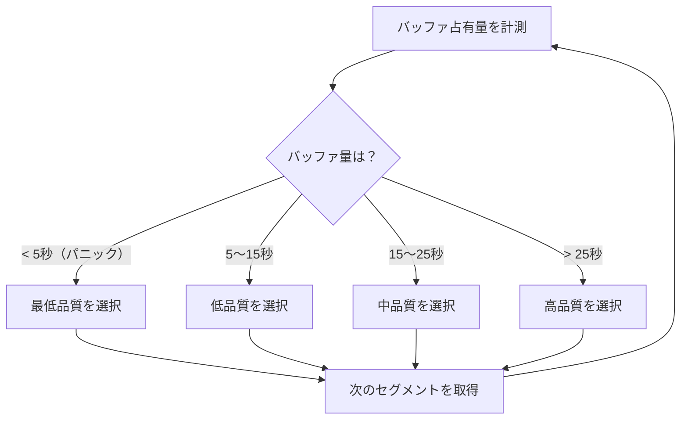

バッファベースのアルゴリズムはスループットの短期変動に左右されず、安定した品質を維持できる。ただし、バッファの初期充填（最初の数秒）には不向きであるため、起動時はスループットベースで動作し、バッファが蓄積されたらバッファベースに切り替えるハイブリッドが一般的である。

### 6.4 ハイブリッドABR：BOLA、Pensieve

**BOLA（Buffer Occupancy based Lyapunov Algorithm）**: リオネット大学が2016年に発表したアルゴリズム。バッファ占有量をもとに、Lyapunov最適化理論を用いてビットレートを選択する。ユーティリティ関数（品質の対数）とバッファペナルティのバランスを取る数理最適化として定式化されている。

$$\text{maximize} \frac{V \cdot u(R_n) - p(\text{buffer})}{\text{segment\_size}(R_n)}$$

ここで $V$ はQoE重み、$u(R_n)$ はビットレート $R_n$ のユーティリティ（通常は $\log R_n$）、$p(\text{buffer})$ はバッファペナルティである。

**Pensieve**: MIT CSAIL が2017年に発表した強化学習ベースのABRアルゴリズム。過去のスループット、バッファ占有量、ダウンロード時間などの観測値を入力とし、深層強化学習によって最適なビットレートを選択するポリシーを学習する。従来の手作りアルゴリズムを大きく上回るQoE（Quality of Experience）を達成したが、実環境への展開においては訓練環境と本番環境のギャップが課題とされている。

### 6.5 品質の急激な変化を防ぐヒューリスティック

実用的なABRプレイヤーは、単純なアルゴリズムに加えて以下のヒューリスティックを適用することが多い。

- **上昇速度制限**: ビットレートを一気に上げず、1〜2段階ずつ上昇させる
- **下降の即時性**: ビットレートを下げる場合は即座に判断する（再生停止を防ぐため）
- **安定化期間**: 品質変更後、一定時間（例：3セグメント）は変更しない

## 7. コーデック

### 7.1 映像コーデックの変遷

動画ストリーミングに使われる映像コーデックは、圧縮効率を高めながら進化してきた。

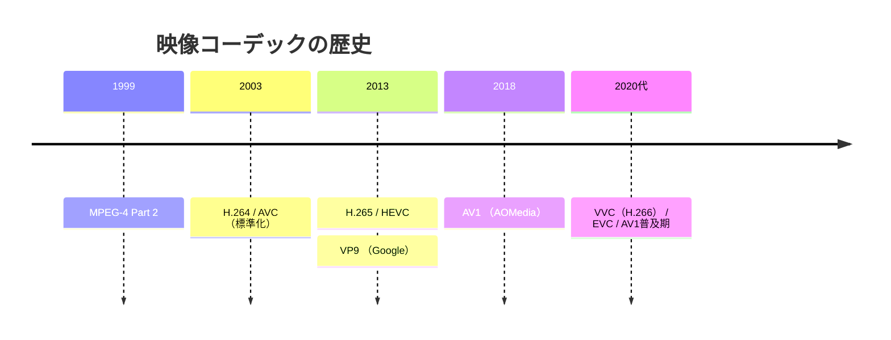

### 7.2 H.264（AVC）

**H.264**（Advanced Video Coding、MPEG-4 Part 10）は2003年に標準化されて以来、Web動画配信のデファクトスタンダードである。20年以上にわたり主流であり続ける理由は以下の通りである。

- **ハードウェアサポートの普遍性**: ほぼすべてのデバイス（スマートフォン、TV、PC）でハードウェアエンコード/デコードが可能
- **広大なブラウザ/プラットフォームサポート**: すべての主要ブラウザとOSで対応
- **エコシステムの成熟**: エンコーダ、デコーダ、ツールが非常に充実している

**プロファイルとレベル**: H.264はプロファイル（Baseline / Main / High）とレベル（4.1、5.1など）の組み合わせで対応する機能と解像度が決まる。Web動画では `avc1.640028`（High Profile、Level 4.0）が一般的に使われる。

**主な限界**: H.265と比較して約2倍のビットレートが必要。ライセンス料の問題（特許プール）がオープンソースエコシステムとの摩擦を生んできた。

### 7.3 H.265（HEVC）

**H.265**（High Efficiency Video Coding）はH.264の後継コーデックで、同等の画質をH.264の約半分のビットレートで実現する。4K/8K配信に不可欠であり、Apple（FaceTime、Apple TV+）、Netflixの4K配信などで広く使われている。

課題は**ライセンス料問題**である。H.265の特許プールは複数の団体（HEVC Advance、MPEG LA、Velos Media）に分散しており、その複雑さがオープンソース実装の普及を妨げてきた。ブラウザサポートも限定的であり、ChromeはH.265をサポートしていない（2024年時点）。

### 7.4 VP9

**VP9**はGoogleが開発したオープンで特許料フリーのコーデックである。H.265と同等の圧縮効率を持ち、YouTubeが広く採用している。

- **ロイヤリティフリー**: ライセンス料なしで使用可能
- **ブラウザサポート**: Chrome、Firefox、Edgeで広くサポート（SafariとiOSは非サポート）
- **ハードウェアデコード**: 最新のデバイスでは対応しているが、H.264/H.265ほど普遍的ではない

### 7.5 AV1

**AV1**はAlliance for Open Media（AOMedia、Google・Netflix・Mozilla・Apple・Microsoftなどが参加）が開発したオープンコーデックである。VP9やH.265を上回る圧縮効率（VP9比で約30〜40%向上）を持ちながらロイヤリティフリーである。

- **圧縮効率**: 同画質でH.264の約半分のビットレート
- **ロイヤリティフリー**: ライセンス料なし
- **エンコード速度**: 初期は非常に遅かったが、SVT-AV1など高速エンコーダの登場で実用的になった
- **ハードウェアサポート**: 2020年代から急速に普及（NVIDIA RTX 30シリーズ、Intel Arc、Apple M3以降など）
- **ブラウザサポート**: Chrome 70+、Firefox 67+、Edge 80+、Safari 16.4+で対応

YouTubeは2018年からAV1の本格配信を開始し、対応クライアントではデフォルトでAV1を使用する。Netflixも4K AV1配信を展開している。

### 7.6 コーデック別圧縮効率の比較

| コーデック | 相対的ビットレート | ロイヤリティ | ハードウェアデコード普及度 |
|-----------|:---:|:---:|:---:|
| H.264 | 100%（基準） | 有料 | ★★★★★ |
| H.265 / HEVC | ~50% | 有料（複雑） | ★★★★ |
| VP9 | ~50% | 無料 | ★★★ |
| AV1 | ~40〜50% | 無料 | ★★★（急速に普及中） |

### 7.7 音声コーデック

動画ストリーミングで使われる主要な音声コーデックは以下の通りである。

- **AAC（Advanced Audio Coding）**: HLSが標準採用するコーデック。iOSとの互換性が高い
- **Opus**: オープンでロイヤリティフリー。WebRTCとDASHで広く使われる
- **MP3**: 後方互換性のために使われることがある
- **E-AC-3（Dolby Digital Plus）**: Netflix等のプレミアム音質向け
- **AC-4**: Dolby Atomosのオブジェクトオーディオ対応

## 8. DRM（Digital Rights Management）

### 8.1 DRMが必要な理由

コンテンツプロバイダ（映画スタジオ、スポーツ連盟など）はコンテンツを不正コピーから守るために、プレイヤーが取得したコンテンツをディスクに保存したり再配布したりできないように制限することを要求する。単純なAES-128暗号化（HLSの標準機能）では鍵が平文でHTTP経由で配信されるため、十分なコンテンツ保護にならない。

DRMはプラットフォームのCDM（Content Decryption Module）という信頼された実行環境内で復号を行い、コンテンツの鍵を取り出すことができないようにする。

### 8.2 主要DRMシステム

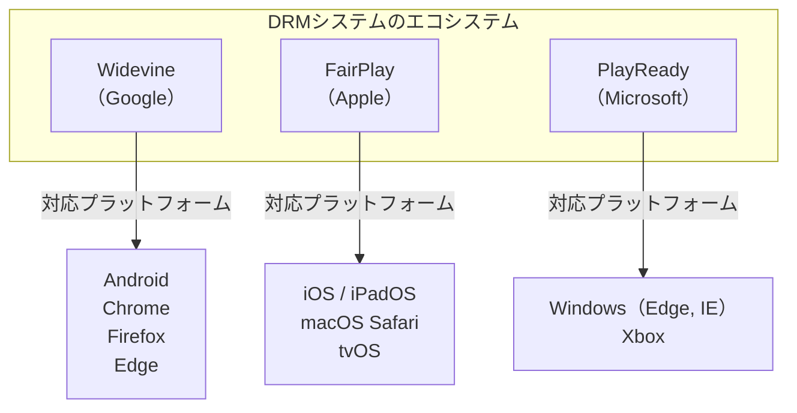

**Widevine**: Googleが開発・管理するDRMシステム。L1（ハードウェアベース、最高セキュリティ）からL3（ソフトウェアのみ）まで3つのセキュリティレベルがある。AndroidはL1が多いが、PCのChromeはL3（ソフトウェアのみ）である。Netflixが4K配信をPCで許可しないのは、PCのWidevineがL3でコンテンツを保護できないからである。

**FairPlay Streaming（FPS）**: AppleがiOS 7以降で提供するDRMシステム。HLSとのみ連携し、AppleデバイスとSafariのみで動作する。

**PlayReady**: MicrosoftのDRMシステム。Windows、Xbox、Smart TVなどMicrosoftエコシステムで使われる。

### 8.3 DRMの動作フロー

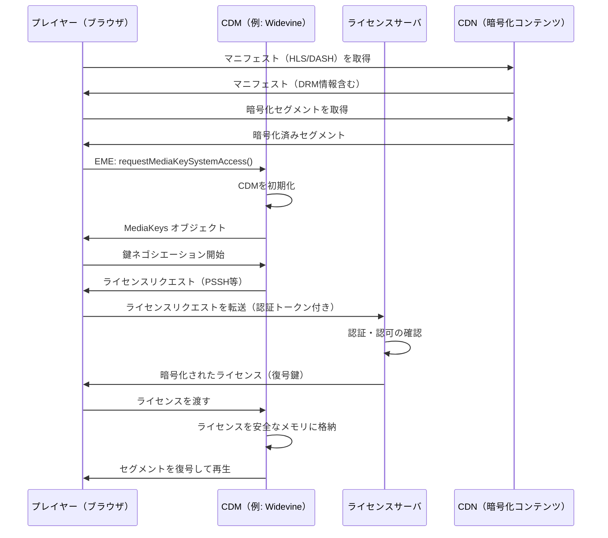

### 8.4 MPEG-CENC（Common Encryption）

DASHはMPEG-CENC（ISO 23001-7）をサポートし、ひとつの暗号化セグメントをWidevine・PlayReady・FairPlay（CBCS方式）など複数のDRMで復号できる。これにより、DRMごとに別々のセグメントをエンコード・保存する必要がなくなる。

```
暗号化方式:
- CENC (CTR mode): Widevine L1、PlayReady
- CBCS (CBC mode): FairPlay、Widevine L1（一部）
```

HLSもバージョン7以降でCBCS方式のCENCをサポートしており、CMSフォーマット（後述）と組み合わせることで、単一のセグメントをHLSとDASHの両方に使用できる。

## 9. 低遅延ストリーミング

### 9.1 従来のHLS/DASHの遅延

標準的なHLSは以下の要素により、15〜40秒程度の遅延が発生する。

- **セグメント長**: 6秒（デフォルト）
- **プレイリスト内のセグメント数**: プレイヤーが最低でも2〜3セグメント先読みする
- **バッファリング**: 安定した再生のためのバッファ
- **エンコード・パッケージング遅延**: セグメントを完成させるまでの時間

遅延を削減するための素朴なアプローチとしてセグメント長を短くする方法があるが、これではHTTPリクエスト数が増加してサーバ負荷が増え、各セグメントのキャッシュ効率が低下するというトレードオフが生じる。

### 9.2 LL-HLS（Low-Latency HLS）

Appleは2019年にHLS仕様の拡張として**LL-HLS**を提案し、その後RFC 8216の一部として標準化した。LL-HLSは2〜5秒程度の低遅延を実現する。

**主要な技術要素：**

1. **部分セグメント（Partial Segments）**: 通常のセグメント（6秒）をさらに細かい部分セグメント（0.2〜1秒程度）に分割し、部分セグメントが完成するたびにプレイリストに追加する

```
#EXT-X-PART:DURATION=0.200000,URI="seg100_part0.m4s"
#EXT-X-PART:DURATION=0.200000,URI="seg100_part1.m4s"
#EXT-X-PART:DURATION=0.200000,URI="seg100_part2.m4s"
#EXTINF:6.000000,
seg100.m4s
#EXT-X-PART:DURATION=0.200000,URI="seg101_part0.m4s"   ← 最新の部分
```

2. **プレイリストデルタアップデート（Playlist Delta Updates）**: プレイリスト全体ではなく変更差分のみを返すことで帯域を節約する

3. **ブロッキングプレイリストリロード（Blocking Reload）**: クライアントがサーバに「次の部分セグメントが追加されたら即座に返して」とリクエストする。HTTPロングポーリングの一種で、新しいセグメントが利用可能になった瞬間にレスポンスが返される

```http
GET /playlist.m3u8?_HLS_msn=101&_HLS_part=2 HTTP/1.1
```

4. **プレロードヒント（Preload Hints）**: 現在エンコード中のセグメントのURLを事前に通知し、クライアントが HTTP/2 サーバプッシュや PUSH_PROMISE を活用できるようにする

### 9.3 LL-DASH（Low-Latency DASH）

DASHの低遅延拡張は以下のアプローチで実現される。

- **Chunk Transfer Encoding（チャンク転送）**: HTTPのチャンクドエンコーディングを利用し、セグメントのエンコードが完了する前にチャンク単位でクライアントに送り始める
- **アベイラビリティタイムオフセット（availabilityTimeOffset）**: MPDに `availabilityTimeOffset` を指定することで、セグメントが完全に完成する前から一部のデータが利用可能であることをクライアントに通知する

```xml
<SegmentTemplate timescale="90000"
                 availabilityTimeOffset="5.5"
                 duration="540000"
                 .../>
```

### 9.4 CMAF（Common Media Application Format）

**CMAF**（ISO 23000-19）はAppleとMicrosoftが共同提案した、HLSとDASHの両方に対応する共通コンテナ形式である。fragmented MP4を基盤とし、単一のセグメントファイルとマニフェストをHLS用とDASH用の2種類を生成するだけで、両プロトコルに対応できる。

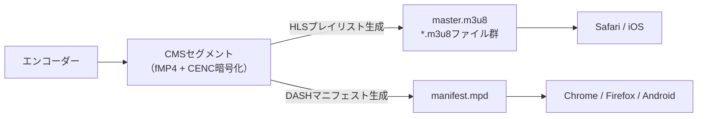

CMSは以下のメリットをもたらす。

- **ストレージコスト削減**: 単一のセグメントでHLS/DASHの両方に対応できるため、セグメントの保管コストがほぼ半減する
- **CDNキャッシュ効率向上**: 同一セグメントをHLS/DASHクライアントが共有できる
- **LL-HLS/LL-DASH対応**: CMSのチャンク単位送信はLL-HLSの部分セグメントとLL-DASHのチャンク転送の両方に対応する

## 10. CDN連携

### 10.1 動画配信とCDNの関係

動画ストリーミングの帯域需要は静的Webコンテンツとは桁違いである。HD動画（720p、4Mbps）を100万人が同時に視聴するには4Tbpsの配信能力が必要であり、単一のオリジンサーバでは到底対応できない。CDNは動画配信においてオプションではなく必須インフラである。

### 10.2 動画CDNのアーキテクチャ

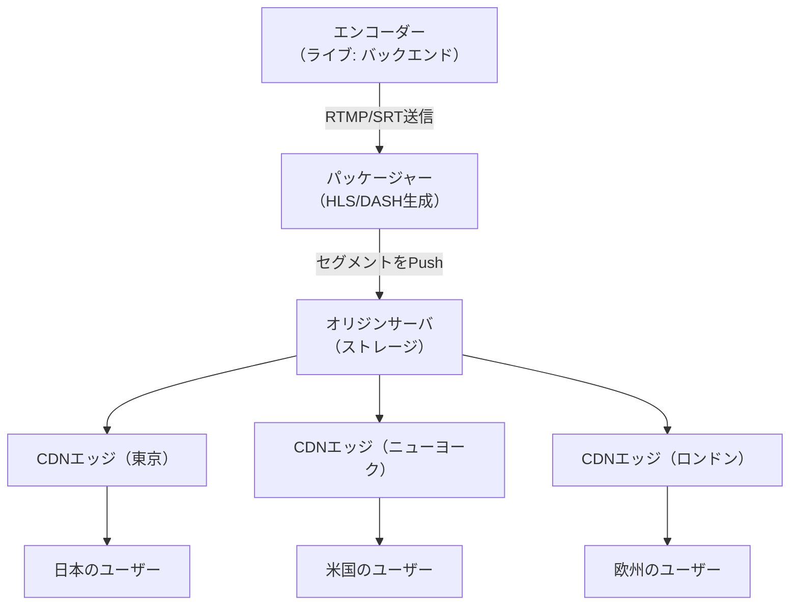

### 10.3 セグメントのキャッシュ戦略

動画セグメントのキャッシュは通常のWebコンテンツとは異なる特性を持つ。

**VOD（Video on Demand）セグメントのキャッシュ**:
- セグメントファイルは変更されないため、長いTTL（数日〜1年）を設定できる
- `Cache-Control: public, max-age=86400` のように設定する
- マニフェストファイル（`.m3u8`/`.mpd`）は変更の可能性があるため短いTTL（数分〜数時間）を設定する

**ライブストリームのセグメントのキャッシュ**:
- ライブのセグメントはリリース後即座にキャッシュされるが、古いセグメントはプレイリストから削除される
- 長すぎるキャッシュはDVR（追いかけ再生）に使われる以外は無駄になる
- `Cache-Control: public, max-age=60` 程度が一般的

**プレイリストのキャッシュ**:
- ライブのプレイリストは数秒ごとに更新されるため、非常に短いTTL（1〜2秒）またはno-cacheが必要
- CDNがライブのプレイリストをキャッシュしすぎると、クライアントが古いプレイリストを取得して再生が遅れる問題が起きる

```http
# Long-lived VOD segment
Cache-Control: public, max-age=31536000, immutable

# Live manifest (frequent updates)
Cache-Control: public, max-age=2, stale-while-revalidate=2

# VOD manifest (rarely changes after publish)
Cache-Control: public, max-age=300
```

### 10.4 マルチCDNとフェイルオーバー

大規模な動画配信プラットフォームでは、単一CDNへの依存リスクを避けるため、複数のCDNを同時使用する**マルチCDN**構成が採用される。

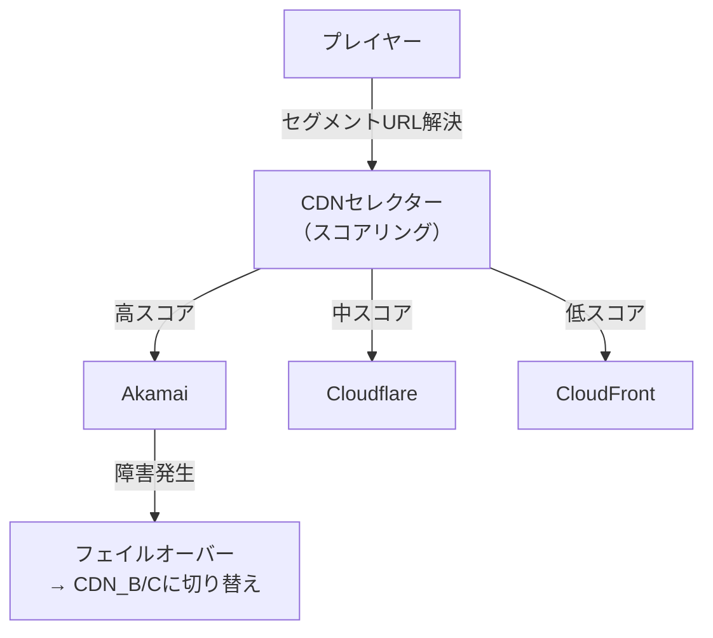

マルチCDNの切り替えはDNSベース（ユーザーを最適なCDNに誘導）またはプレイヤーベース（プレイヤーがスループットを計測して選択）で行われる。Netflix、YouTube、DisneyPlusなどはマルチCDN構成を採用している。

### 10.5 動画固有のCDN最適化

**プリフェッチ（Prefetch）**: ライブ配信では、次のセグメントが公開される前にCDNエッジが事前にオリジンからセグメントを取得してキャッシュしておく。これにより最初のユーザーのリクエスト時のオリジン転送遅延をなくせる。

**トークンベース認証**: 有料コンテンツの不正アクセスを防ぐため、URLに時限付きのHMACトークンを含める。CDNがトークンを検証し、不正リクエストをオリジンに到達させる前に遮断する。

```
# Signed URL with HMAC-SHA256
https://cdn.example.com/hls/720p/seg001.ts
  ?token=e3b0c44298fc1c149afb&expires=1709350000&sig=a3f5d...
```

**Byte-range リクエスト（DASH SegmentBase用）**: DASHのBaseURL方式では、セグメントが単一ファイル内のバイト範囲として表現される。CDNはHTTPの `Range` ヘッダーを正しく処理し、部分的なキャッシュ（Range キャッシュ）をサポートする必要がある。

## 11. 実装：プレイヤーの選択と統合

### 11.1 主要なオープンソースプレイヤー

| プレイヤー | 対応プロトコル | DRM | 特徴 |
|-----------|:---:|:---:|------|
| **HLS.js** | HLS | Widevine, PlayReady | HLS特化。MSEを直接操作する軽量実装 |
| **dash.js** | DASH | Widevine, PlayReady | MPEG公式のDASHリファレンス実装 |
| **Shaka Player** | HLS, DASH | Widevine, PlayReady, FairPlay | Google製。CMSとDRM対応が充実 |
| **Video.js** | HLS（プラグイン）, DASH（プラグイン） | プラグイン次第 | UIコンポーネントが豊富。エコシステムが大きい |
| **ExoPlayer（Android）** | HLS, DASH, SmoothStreaming | Widevine | AndroidのGoogleデファクト動画プレイヤー |

### 11.2 Shaka Playerを使った実装例

```javascript
// Initialize Shaka Player with HLS/DASH auto-detection and DRM
async function initShakaPlayer(videoElement, manifestUrl) {
  // Install polyfills for browser compatibility
  shaka.polyfill.installAll();

  // Check browser support
  if (!shaka.Player.isBrowserSupported()) {
    console.error('Browser not supported');
    return;
  }

  const player = new shaka.Player(videoElement);

  // Configure DRM systems
  player.configure({
    drm: {
      servers: {
        'com.widevine.alpha':
          'https://widevine-license.example.com/license',
        'com.microsoft.playready':
          'https://playready-license.example.com/license',
        'com.apple.fps.1_0':
          'https://fairplay-license.example.com/license'
      },
      // FairPlay-specific certificate
      advanced: {
        'com.apple.fps.1_0': {
          serverCertificateUri:
            'https://fairplay-license.example.com/certificate'
        }
      }
    },
    // ABR configuration
    abr: {
      enabled: true,
      defaultBandwidthEstimate: 1000000, // 1 Mbps initial estimate
      bandwidthUpgradeTarget: 0.85,       // upgrade when 85% utilized
      bandwidthDowngradeTarget: 0.95      // downgrade when 95% utilized
    },
    // Buffer configuration
    streaming: {
      bufferingGoal: 30,          // buffer 30 seconds ahead
      rebufferingGoal: 2,         // rebuffer when < 2 seconds remain
      bufferBehind: 30,           // keep 30 seconds behind
      stallEnabled: true,
      stallThreshold: 1,          // declare stall after 1 second without progress
      stallSkip: 0.1              // skip 100ms when stall detected
    }
  });

  // Error handling
  player.addEventListener('error', (event) => {
    console.error('Shaka Player error:', event.detail);
  });

  // ABR state monitoring
  player.addEventListener('adaptation', (event) => {
    const track = player.getVariantTracks().find(t => t.active);
    console.log(`ABR switch: ${track.height}p @ ${track.bandwidth / 1000}kbps`);
  });

  // Load content
  try {
    await player.load(manifestUrl);
    console.log('Content loaded successfully');
  } catch (e) {
    console.error('Error loading content:', e);
  }

  return player;
}
```

### 11.3 再生品質の監視

```javascript
// Monitor playback quality metrics
function monitorQuality(player, videoElement) {
  setInterval(() => {
    const stats = player.getStats();
    const activeTrack = player.getVariantTracks().find(t => t.active);

    console.log({
      // Current quality
      resolution: `${activeTrack?.width}x${activeTrack?.height}`,
      bitrate: `${Math.round((activeTrack?.bandwidth || 0) / 1000)} kbps`,

      // Stall statistics
      stallsDetected: stats.stallsDetected,
      gapsJumped: stats.gapsJumped,

      // Buffer health
      bufferSeconds: videoElement.buffered.length > 0
        ? videoElement.buffered.end(0) - videoElement.currentTime
        : 0,

      // Network
      estimatedBandwidth: `${Math.round(stats.estimatedBandwidth / 1000)} kbps`,
      downloadedSegments: stats.switchHistory?.length || 0
    });
  }, 5000);
}
```

## 12. まとめ：動画配信スタックの全体像

現代の動画ストリーミングシステムは、多数の技術要素が組み合わさって成立している。

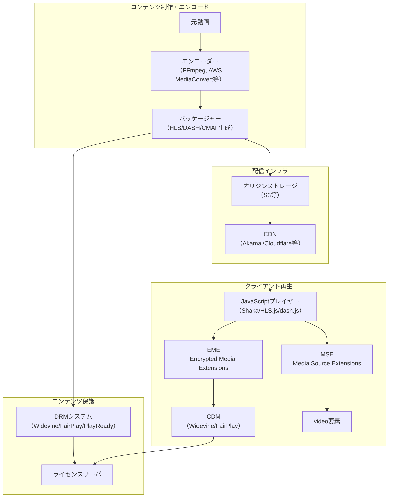

各層の役割を整理すると以下のようになる。

| 層 | 技術 | 役割 |
|---|---|---|
| エンコード | H.264/H.265/AV1 | 動画を適切なビットレートと解像度でエンコード |
| パッケージング | HLS/DASH/CMAF | セグメント分割とマニフェスト生成 |
| コンテンツ保護 | CENC/FairPlay/Widevine | 暗号化とライセンス管理 |
| 配信 | CDN | 大規模・低遅延・高可用な配信 |
| 適応 | ABR（BBA/BOLA/Pensieve） | ネットワーク状況に応じた品質選択 |
| ブラウザAPI | MSE/EME | ブラウザとプレイヤーの橋渡し |
| 低遅延 | LL-HLS/LL-DASH/CMAF | 遅延の最小化（2〜5秒） |

> [!NOTE]
> 動画ストリーミングは「動く」技術であり、コーデック（AV1の普及）、低遅延技術（LL-HLS/LL-DASH）、DRM（マルチDRM統合）、CDNのエッジ機能など各層が急速に進化している。プロダクション実装においては各技術の最新仕様と主要プレイヤー（Shaka Player、HLS.js等）のアップデートを継続的に追うことが重要である。

動画ストリーミングが「ただ動画を流す」という単純な問題に見えて、実際には帯域適応・コンテンツ保護・大規模配信・低遅延化という互いにトレードオフを持つ複数の目標を同時に達成しなければならない、非常に複雑なエンジニアリング問題であることが理解できるだろう。これらの技術的課題を解決してきた歴史が、現在のNetflixやYouTubeに代表される快適なストリーミング体験を支えている。
