# 仮想DOMと差分アルゴリズム — React FiberとReconciliation

## 1. 背景と動機

### 1.1 DOM操作のコスト

Webアプリケーションを構築する際に避けて通れないのが、DOM（Document Object Model）の操作である。DOMはブラウザがHTMLドキュメントをメモリ上で表現するためのツリー構造であり、JavaScriptからこのツリーを操作することでWebページの内容を動的に変更できる。

しかし、DOM操作には本質的なコストが伴う。ブラウザのレンダリングパイプラインを思い出すと、DOMの変更はスタイルの再計算（Style Recalculation）、レイアウトの再計算（Reflow/Layout）、ペイント（Paint）、コンポジット（Composite）といった一連の処理を引き起こす。特にReflowは、要素の位置やサイズを再計算する処理であり、計算量が大きい。


問題をさらに深刻にするのが、素朴なDOM操作のパターンである。たとえば、1,000件のリストアイテムのうち1件だけ変更したい場合でも、リスト全体を `innerHTML` で書き換えるようなアプローチでは、999件分の不必要なDOM破棄と再生成が発生する。

```javascript
// Naive approach: replace entire list even for a single item change
function updateList(items) {
  const ul = document.getElementById("list");
  ul.innerHTML = items.map((item) => `<li>${item.text}</li>`).join("");
}
```

これを効率化するために、変更された要素だけを特定してピンポイントで操作する必要がある。しかし、その差分検出と最小限のDOM操作を手動で行うのは、アプリケーションの複雑度が増すにつれて極めて困難になる。

### 1.2 命令的UIと宣言的UI

初期のWebフロントエンド開発では、jQueryに代表されるような**命令的（Imperative）**なUI構築が一般的だった。命令的アプローチでは、「どの要素を取得し、どう変更するか」を開発者が逐一記述する。

```javascript
// Imperative: manually manage DOM updates
$("#username").text(newName);
$("#user-list li").eq(index).addClass("active");
if (isLoggedIn) {
  $("#login-button").hide();
  $("#logout-button").show();
}
```

このアプローチには以下の問題がある。

1. **状態とUIの同期が困難**: アプリケーション状態が複雑になると、どの状態変更がどのDOM操作に対応するのかを追跡するのが難しくなる
2. **バグの温床**: 状態遷移の組み合わせが増えると、UIが不整合な状態に陥るケースを見落としやすい
3. **コードの可読性低下**: DOM操作ロジックがビジネスロジックと絡み合い、保守が困難になる

これに対して**宣言的（Declarative）**なUIでは、「現在の状態に対して、UIがどのような形であるべきか」を記述する。状態からUIへの変換は関数として表現される。

```javascript
// Declarative: describe what the UI should look like
function UserProfile({ name, isLoggedIn }) {
  return (
    <div>
      <span>{name}</span>
      {isLoggedIn ? <LogoutButton /> : <LoginButton />}
    </div>
  );
}
```

宣言的UIにおいては、状態が変化するたびにUI全体の「あるべき姿」を再計算し、現在のDOMとの差分を検出して最小限の更新を適用する。この「差分検出と最小限の更新」を自動化する仕組みが**仮想DOM（Virtual DOM）**である。

### 1.3 仮想DOMという発想の登場

仮想DOMの概念は、2013年にFacebookが発表したReactによって広く知られるようになった。Reactの開発を牽引したJordan WalkeとPete Huntらは、「UIを状態の純粋関数として記述し、実際のDOM操作はフレームワークに委ねる」というアーキテクチャを提案した。

この発想の根底にあるのは、次のような洞察である。

> 「DOM操作そのもののコストは高い。しかし、JavaScriptオブジェクトの比較は高速に行える。ならば、DOMの軽量な表現をJavaScriptオブジェクトとして持ち、オブジェクト同士を比較して差分を検出し、本当に必要なDOM操作だけを行えばよい。」

このアイデアは、サーバーサイドレンダリングにおける「テンプレートの差分更新」の考え方と、関数型プログラミングにおける「不変データ構造の構造的共有（Structural Sharing）」に着想を得たものでもある。

## 2. 仮想DOMの基本概念

### 2.1 仮想DOMとは何か

仮想DOM（Virtual DOM）とは、実際のDOMツリーに対応する軽量なJavaScriptオブジェクトツリーである。各仮想DOMノードは、要素のタイプ（`div`、`span` など）、属性（`className`、`onClick` など）、子ノードの情報を保持する。

```javascript
// Virtual DOM node (simplified representation)
const vnode = {
  type: "div",
  props: {
    className: "container",
    children: [
      {
        type: "h1",
        props: {
          children: ["Hello, World!"],
        },
      },
      {
        type: "p",
        props: {
          className: "description",
          children: ["This is a virtual DOM example."],
        },
      },
    ],
  },
};
```

この仮想DOMノードは、以下のHTMLに対応する。

```html
<div class="container">
  <h1>Hello, World!</h1>
  <p class="description">This is a virtual DOM example.</p>
</div>
```

仮想DOMの核心的なメリットは、実際のDOMオブジェクトに比べて極めて軽量であることだ。実際のDOM要素（`HTMLDivElement` など）は、数百ものプロパティやメソッドを持つ重厚なオブジェクトである。一方、仮想DOMノードは必要最小限のプロパティだけを持つプレーンなJavaScriptオブジェクトに過ぎない。

### 2.2 仮想DOMの更新サイクル

仮想DOMを用いた更新サイクルは、以下の3つのフェーズで構成される。

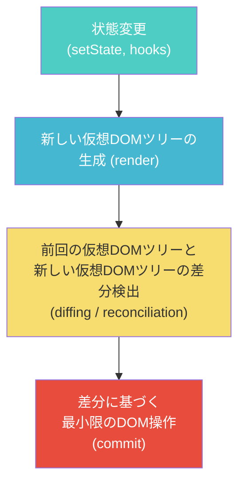

1. **Render（レンダリング）**: 状態が変化すると、コンポーネントの `render` 関数（あるいは関数コンポーネントそのもの）が呼び出され、新しい仮想DOMツリーが生成される
2. **Reconciliation（調停/差分検出）**: 新旧の仮想DOMツリーを比較し、変更箇所を特定する
3. **Commit（コミット）**: 特定された変更を実際のDOMに適用する

このサイクルにおいて、最もアルゴリズム的に興味深いのがReconciliation（差分検出）のフェーズである。

### 2.3 React要素とJSX

Reactでは、仮想DOMノードは `React.createElement` 関数によって生成される。JSX（JavaScript XML）は、この関数呼び出しのシンタックスシュガーである。

```jsx
// JSX syntax
const element = (
  <div className="greeting">
    <h1>Hello</h1>
    <p>Welcome to React</p>
  </div>
);

// Compiled to React.createElement calls
const element = React.createElement(
  "div",
  { className: "greeting" },
  React.createElement("h1", null, "Hello"),
  React.createElement("p", null, "Welcome to React")
);
```

`React.createElement` は以下のようなオブジェクト（React要素）を返す。

```javascript
// Resulting React element object
{
  $$typeof: Symbol.for('react.element'),
  type: 'div',
  props: {
    className: 'greeting',
    children: [
      { $$typeof: Symbol.for('react.element'), type: 'h1', props: { children: 'Hello' } },
      { $$typeof: Symbol.for('react.element'), type: 'p', props: { children: 'Welcome to React' } },
    ]
  },
  key: null,
  ref: null,
}
```

`$$typeof` プロパティは、セキュリティ上の理由でSymbolが使われている。JSONにはSymbolを含めることができないため、XSS攻撃によって悪意のあるReact要素がJSONレスポンスに注入されることを防ぐ仕組みである。

## 3. 差分アルゴリズム（Diffing）の設計

### 3.1 ツリーの差分問題の計算量

2つのツリー構造の最小編集距離を求める一般的なアルゴリズム（Zhang-Shashaアルゴリズムなど）は、$O(n^3)$ の計算量を持つ。ここで $n$ はツリーのノード数である。Webアプリケーションでは数千から数万のノードが存在することが珍しくないため、$O(n^3)$ は現実的な時間では処理できない。

たとえば、10,000ノードのツリーに対して $O(n^3)$ のアルゴリズムを適用すると、$10^{12}$ 回のオペレーションが必要になる。60fpsを維持するための16.67msという時間制約の中で、これは明らかに不可能である。

### 3.2 Reactのヒューリスティクス

Reactは、2つのヒューリスティクス（経験則に基づく仮定）を導入することで、差分検出の計算量を $O(n)$ に抑えている。

**ヒューリスティクス1：異なるタイプの要素は異なるツリーを生成する**

あるノードの要素タイプが変わった場合（たとえば `<div>` から `<span>` へ、あるいは `<Article>` から `<Comment>` へ）、Reactは古いツリーを完全に破棄して新しいツリーをゼロから構築する。

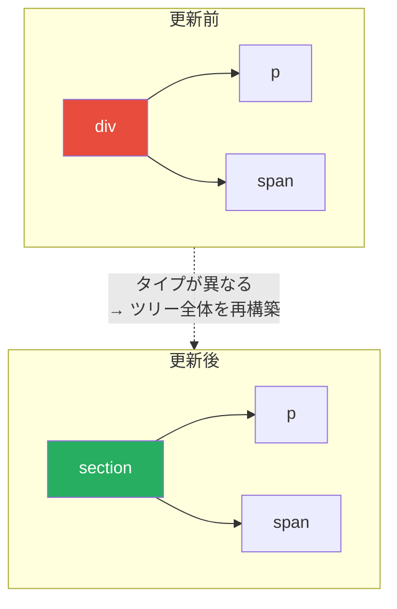

この仮定は、実際のWebアプリケーションにおいて妥当である。要素タイプが変わるということは、その配下のDOM構造やコンポーネントの振る舞いも大きく変わることがほとんどだからだ。

**ヒューリスティクス2：開発者がkey属性でヒントを与えられる**

同じ親の下にある子要素のリストにおいて、`key` 属性によって要素の同一性を示すことができる。これにより、リストの並べ替えや挿入・削除を効率的に処理できる。

```jsx
// key attribute provides identity hints
<ul>
  {items.map((item) => (
    <li key={item.id}>{item.text}</li>
  ))}
</ul>
```

### 3.3 差分検出の具体的な手順

Reactの差分アルゴリズムは、2つのツリーのルートから再帰的に比較を行う。比較の結果は、ノードのタイプに応じて以下のように分岐する。

**ケース1：異なるタイプの要素**

ルート要素のタイプが異なる場合、古いツリーは完全にアンマウントされ、新しいツリーがマウントされる。古いツリーに含まれるコンポーネントの `componentWillUnmount`（または `useEffect` のクリーンアップ関数）が呼ばれ、DOMノードが破棄される。

```jsx
// Before
<div>
  <Counter />
</div>

// After
<span>
  <Counter />
</span>
// Counter is unmounted and remounted — state is lost
```

**ケース2：同じタイプのDOM要素**

同じタイプのDOM要素同士を比較する場合、Reactは両者の属性（attributes）を比較し、変更された属性のみを更新する。

```jsx
// Before
<div className="before" title="stuff" />

// After
<div className="after" title="stuff" />
// Only className is updated — title remains unchanged
```

`style` 属性の場合は、さらに個々のCSSプロパティレベルで差分を取る。

```jsx
// Before
<div style={{ color: "red", fontWeight: "bold" }} />

// After
<div style={{ color: "green", fontWeight: "bold" }} />
// Only color is updated — fontWeight remains unchanged
```

属性の更新が完了した後、子要素に対して再帰的に同じ差分処理を行う。

**ケース3：同じタイプのコンポーネント要素**

コンポーネント要素のタイプが同じ場合、コンポーネントインスタンスは維持される（状態が保持される）。新しいpropsでコンポーネントが再レンダリングされ、返されたReact要素に対して再帰的に差分検出が行われる。

### 3.4 keyの役割とリスト差分

リスト（同じ親の下にある複数の子要素）の差分検出は、仮想DOMにおいて最も工夫が必要な部分の一つである。

**keyがない場合の問題**

`key` が指定されていない場合、Reactは子要素をインデックスで比較する。これは多くの場合に非効率を生む。

```jsx
// Before
<ul>
  <li>Apple</li>
  <li>Banana</li>
</ul>

// After (Cherry inserted at beginning)
<ul>
  <li>Cherry</li>
  <li>Apple</li>
  <li>Banana</li>
</ul>
```

この場合、`key` がなければReactは以下のように比較する。

| インデックス | 旧 | 新 | 操作 |
|:---:|:---:|:---:|:---:|
| 0 | Apple | Cherry | テキスト変更 |
| 1 | Banana | Apple | テキスト変更 |
| 2 | (なし) | Banana | 新規追加 |

結果として、すべての `<li>` のテキストが書き換えられてしまう。本来は先頭に1つ挿入するだけで済むはずの操作が、3つのDOM操作に膨れ上がる。

**keyがある場合の最適化**

`key` を指定すると、Reactは要素の同一性を正確に追跡できる。

```jsx
// Before
<ul>
  <li key="apple">Apple</li>
  <li key="banana">Banana</li>
</ul>

// After
<ul>
  <li key="cherry">Cherry</li>
  <li key="apple">Apple</li>
  <li key="banana">Banana</li>
</ul>
```

Reactは `key` によって「apple」と「banana」の要素が移動しただけであることを認識し、「cherry」の要素を新たに作成して先頭に挿入するだけで済む。

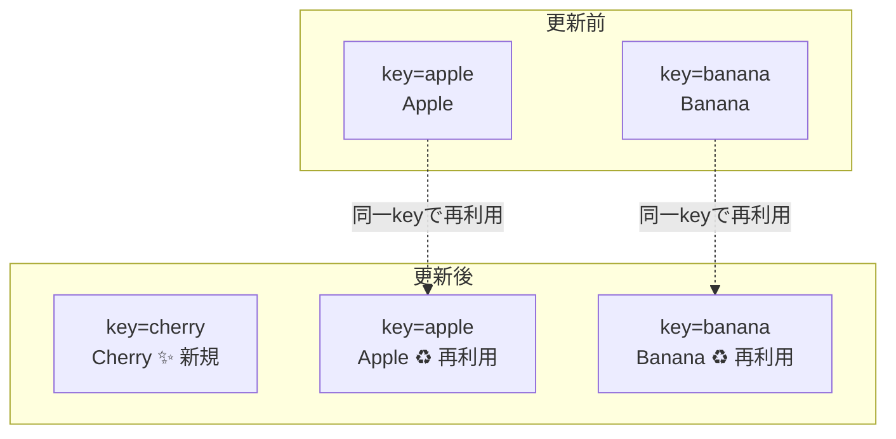

**keyにインデックスを使う際の注意**

`key={index}` のようにインデックスを `key` に使うのは、多くの場合アンチパターンである。リストの並べ替えや先頭への挿入が行われると、インデックスベースの `key` は要素の同一性を正しく追跡できず、不必要なアンマウント・リマウントが発生したり、制御されていないコンポーネントの状態が不正になったりする。

```jsx
// Anti-pattern: index as key
{items.map((item, index) => (
  <TodoItem key={index} todo={item} />  // Problematic for reordering
))}

// Better: stable unique identifier as key
{items.map((item) => (
  <TodoItem key={item.id} todo={item} />  // Correct identity tracking
))}
```

例外として、リストが静的（並べ替え・挿入・削除が発生しない）で、リスト内の要素がローカル状態を持たない場合は、インデックスを `key` に使っても問題ない。

## 4. React Fiber アーキテクチャ

### 4.1 Stack Reconcilerの限界

React 16以前のReconciler（差分検出エンジン）は**Stack Reconciler**と呼ばれていた。Stack Reconcilerは、仮想DOMツリーを再帰的に走査して差分を検出する。再帰処理の特性として、一度始まると途中で中断することが難しい。

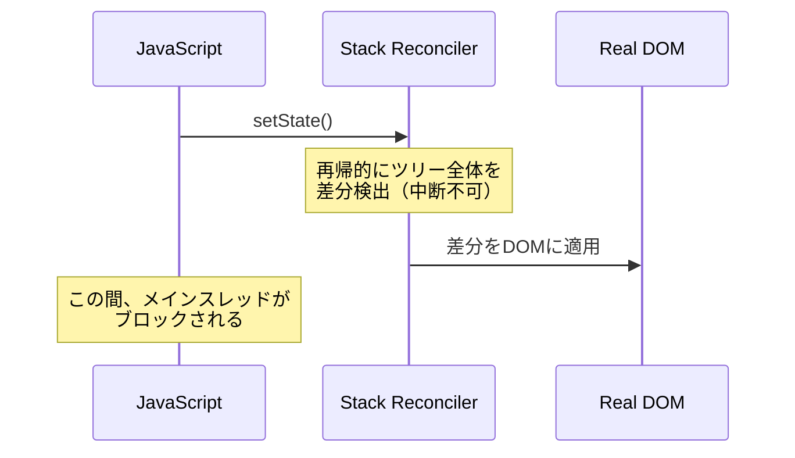

これが問題になるのは、大きなコンポーネントツリーを処理する場合である。数千のコンポーネントからなるツリーの差分検出は、数十ミリ秒以上かかることがある。この間、メインスレッドがブロックされるため、以下のような問題が生じる。

- **ユーザー入力の遅延**: テキスト入力やクリックに対する応答が遅れる
- **アニメーションのカクつき**: 60fpsを維持できず、滑らかさが失われる
- **ブラウザの応答不能**: 極端な場合、ブラウザが「応答していません」と表示する

根本的な課題は、すべての更新が同じ優先度で扱われていることだ。ユーザー入力に対する即時応答と、バックグラウンドでのデータ取得結果の表示は、重要度が大きく異なるにもかかわらず、同じように処理される。

### 4.2 Fiberとは何か

React 16で導入された**Fiber**は、Reconcilerを根本から再設計したアーキテクチャである。Fiberの核心は、再帰的な処理を**反復的（Iterative）**な処理に変換し、**作業単位（Unit of Work）**ごとに中断・再開可能にしたことにある。

Fiberノードとは、仮想DOMノードに対応するデータ構造であり、コンポーネントの状態、副作用、レンダリングに必要な情報を保持する。各Fiberノードは、以下のリンクを通じて相互に接続されている。

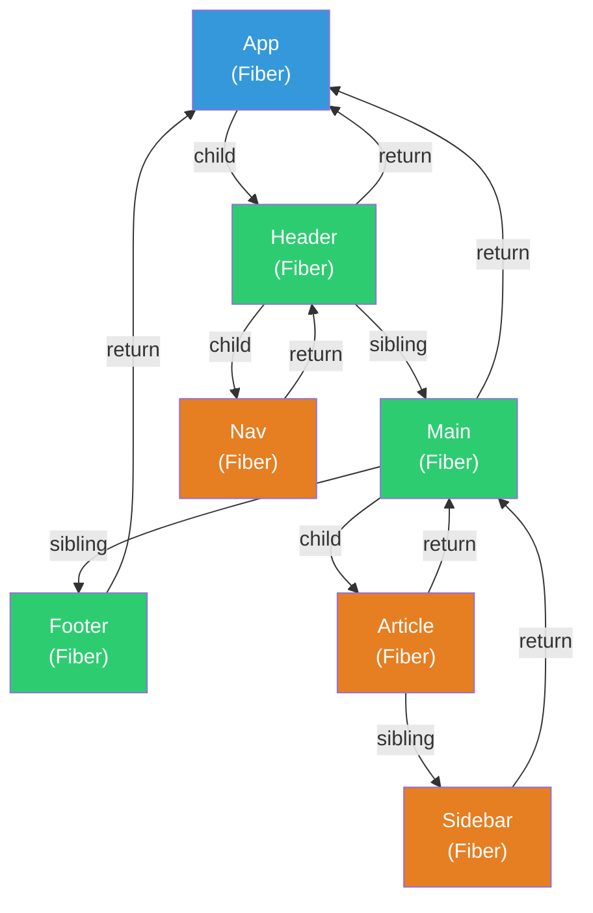

Fiberノードの主要なフィールドは以下の通りである。

| フィールド | 説明 |
|:---|:---|
| `type` | コンポーネントのタイプ（`'div'`、`MyComponent` など） |
| `key` | 差分検出に使う識別子 |
| `child` | 最初の子Fiberへの参照 |
| `sibling` | 次の兄弟Fiberへの参照 |
| `return` | 親Fiberへの参照 |
| `stateNode` | 対応するDOMノードまたはコンポーネントインスタンス |
| `pendingProps` | 新しいprops |
| `memoizedProps` | 前回のレンダリングで使ったprops |
| `memoizedState` | 前回のレンダリングで使った状態 |
| `flags` | 副作用のフラグ（Placement, Update, Deletion など） |
| `lanes` | このFiberの優先度 |
| `alternate` | ダブルバッファリング用の対となるFiber |

`child`、`sibling`、`return` という3つのポインタによって、ツリーを連結リストとして表現している。これにより、再帰を使わずにツリーを走査でき、任意の時点で作業を中断して後で再開できる。

### 4.3 作業ループ（Work Loop）

Fiberの作業ループは、以下のような疑似コードで表現できる。

```javascript
// Simplified Fiber work loop
function workLoop(deadline) {
  let shouldYield = false;

  while (nextUnitOfWork && !shouldYield) {
    // Process one unit of work
    nextUnitOfWork = performUnitOfWork(nextUnitOfWork);
    // Check if the browser needs the main thread
    shouldYield = deadline.timeRemaining() < 1;
  }

  if (!nextUnitOfWork && wipRoot) {
    // All work done — commit to DOM
    commitRoot();
  }

  // Schedule next chunk of work
  requestIdleCallback(workLoop);
}

requestIdleCallback(workLoop);
```

各反復で1つのFiberノードを処理し、ブラウザがメインスレッドを必要としていないかを確認する。メインスレッドが必要な場合（ユーザー入力の処理やアニメーションフレームの描画など）、作業を一時中断して制御をブラウザに返す。

> [!NOTE]
> 実際のReactは `requestIdleCallback` ではなく、独自のスケジューラ（`scheduler` パッケージ）を使用している。`requestIdleCallback` はブラウザのサポートが不十分であり、フレームレートの制御が細かくできないためである。Reactのスケジューラは `MessageChannel` を利用して、より精密なタイミング制御を実現している。

### 4.4 時間分割（Time Slicing）

Fiberアーキテクチャの最大の恩恵は**時間分割（Time Slicing）**である。大きな更新処理を小さな単位に分割し、フレームごとに少しずつ進めることで、メインスレッドの長時間ブロックを防ぐ。

```mermaid
gantt
    title Stack Reconciler vs Fiber Reconciler
    dateFormat X
    axisFormat %s

    section Stack Reconciler
    長い差分検出処理    :crit, 0, 50
    ユーザー入力応答 :after, 50, 55
    フレーム描画 :55, 60

    section Fiber Reconciler
    差分検出(chunk 1) :0, 5
    フレーム描画 :5, 8
    差分検出(chunk 2) :8, 13
    ユーザー入力応答 :crit, 13, 16
    差分検出(chunk 3) :16, 21
    フレーム描画 :21, 24
```

上の図では、Stack Reconcilerが50ms間メインスレッドを占有する一方、Fiber Reconcilerは5msごとに処理を区切り、その間にフレーム描画やユーザー入力の処理を挟んでいる。体感的な応答性が大幅に改善されることがわかる。

### 4.5 優先度付きスケジューリング

Fiberでは、すべての更新に優先度（Priority）が割り当てられる。React 18以降では**Lanes**というビットマスクベースの優先度モデルが採用されている。

| 優先度 | 例 | 説明 |
|:---|:---|:---|
| Sync | `flushSync` の呼び出し | 即座に同期的に処理 |
| InputContinuous | テキスト入力, スクロール | ユーザー操作への即時応答 |
| Default | `setState` のデフォルト | 通常のUI更新 |
| Transition | `startTransition` による更新 | 中断可能な低優先度更新 |
| Idle | オフスクリーン描画 | アイドル時に処理 |

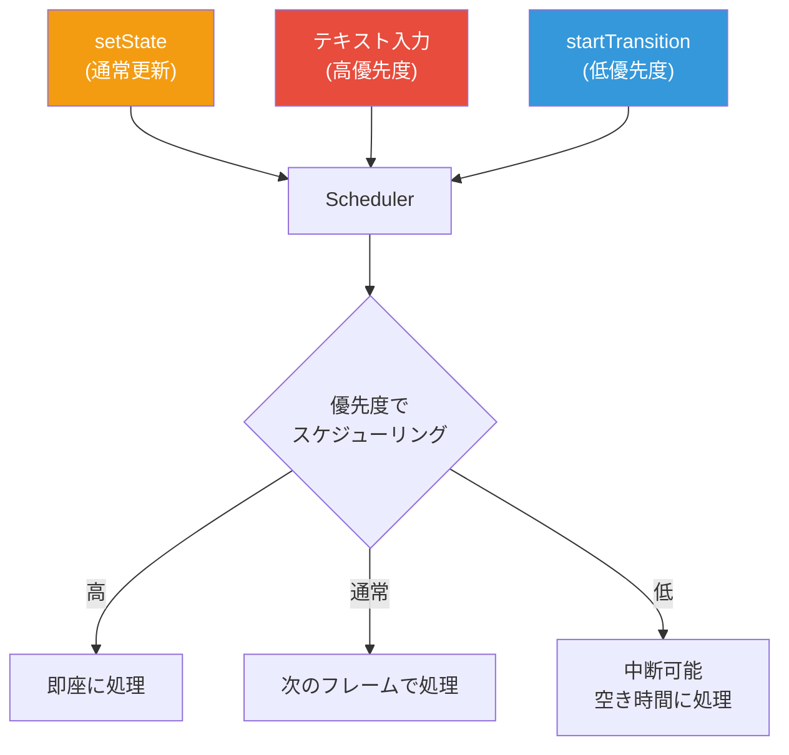

React 18で導入された `startTransition` APIは、この優先度システムの恩恵をアプリケーション開発者が直接活用できるようにしたものである。

```jsx
import { useState, startTransition } from "react";

function SearchPage() {
  const [query, setQuery] = useState("");
  const [results, setResults] = useState([]);

  function handleChange(e) {
    // High priority: update the input field immediately
    setQuery(e.target.value);

    // Low priority: update search results (can be interrupted)
    startTransition(() => {
      setResults(computeSearchResults(e.target.value));
    });
  }

  return (
    <div>
      <input value={query} onChange={handleChange} />
      <SearchResults results={results} />
    </div>
  );
}
```

この例では、テキスト入力の値の更新は高優先度で即座に処理され、検索結果の更新は `startTransition` によって低優先度としてスケジュールされる。検索結果の計算中にユーザーが新たなキー入力を行った場合、進行中の低優先度の処理は中断され、入力への応答が優先される。

### 4.6 ダブルバッファリング

Fiberは**ダブルバッファリング**の手法を採用している。これはグラフィックスプログラミングで画面のちらつきを防ぐために使われるテクニックと同じ考え方である。

Reactは常に2つのFiberツリーを保持する。

1. **current ツリー**: 現在画面に表示されている状態を表すFiberツリー
2. **workInProgress ツリー**: 次のレンダリング結果を構築中のFiberツリー

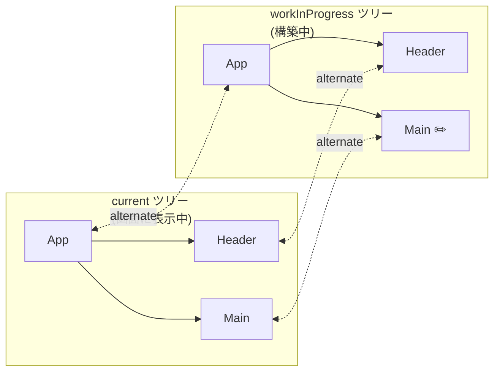

各Fiberノードは `alternate` プロパティを通じて、対応するもう一方のツリーのノードを参照している。workInProgressツリーの構築が完了してコミットフェーズが終わると、currentとworkInProgressが入れ替わる。これにより、画面に不完全な状態が表示されることを防ぐ。

## 5. Reconciliationの詳細

### 5.1 Reconciliationの全体フロー

Reconciliation（調停）は、仮想DOMの差分検出と更新計画の作成を行うプロセス全体を指す。React Fiberにおいては、Reconciliationは**Renderフェーズ**と**Commitフェーズ**の2つに明確に分離されている。

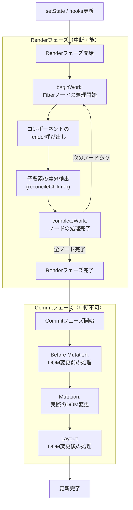

Renderフェーズは中断可能であり、優先度の高いタスクに割り込まれる可能性がある。一方、Commitフェーズは同期的に実行され、中断されない。これは、DOMの変更途中で中断すると、UIが不整合な状態になってしまうためである。

### 5.2 beginWorkとcompleteWork

Fiberツリーの走査は、**beginWork**と**completeWork**という2つの関数を交互に呼び出すことで進められる。

**beginWork** は、あるFiberノードの処理を開始する関数である。コンポーネントの `render` を呼び出し、返された子要素と既存の子Fiberを比較して新しい子Fiberを生成する。

**completeWork** は、あるFiberノードの処理を完了する関数である。DOM要素の場合は対応するDOMノードの作成や更新準備を行い、副作用リスト（Effect List）にノードを追加する。

走査の順序は以下のようになる。

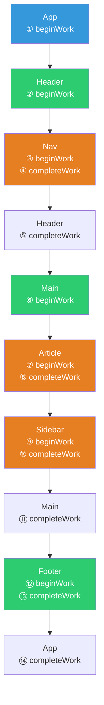

この走査パターンは、ツリーの深さ優先走査に対応する。`child` → `sibling` → `return` のポインタをたどることで、スタックを使わずに走査を実現している。

### 5.3 reconcileChildren：子要素の差分検出

`reconcileChildren` は、ReactのReconciliationにおける中核的な関数である。既存の子Fiberリストと新しいReact要素のリストを比較して、新しいFiberリストを生成する。

この処理は大きく3つのステップで行われる。

**ステップ1：先頭からの線形比較**

新旧のリストを先頭から順に比較していく。同じ `key`（`key` がない場合はインデックス）を持つ要素同士を比較し、再利用できる場合は既存のFiberを更新する。`key` が一致しなくなった時点で、このステップを終了する。

**ステップ2：旧リストのMap構築**

ステップ1で処理しきれなかった旧リストの残りの要素を、`key` をキーとするMapに格納する。

**ステップ3：Mapを使った照合**

新リストの残りの要素について、Mapから一致する旧要素を検索する。見つかれば再利用（移動）し、見つからなければ新規作成する。Mapに残った旧要素は削除対象としてマークする。

```javascript
// Simplified reconcileChildrenArray (conceptual)
function reconcileChildrenArray(returnFiber, currentFirstChild, newChildren) {
  let oldFiber = currentFirstChild;
  let newIdx = 0;
  let lastPlacedIndex = 0;

  // Step 1: linear scan from the beginning
  for (; oldFiber !== null && newIdx < newChildren.length; newIdx++) {
    if (oldFiber.index > newIdx) {
      // Old fiber is ahead — break to use map-based matching
      break;
    }
    const newChild = newChildren[newIdx];
    if (isSameKey(oldFiber, newChild)) {
      // Reuse the fiber
      const updated = useFiber(oldFiber, newChild.props);
      lastPlacedIndex = placeChild(updated, lastPlacedIndex, newIdx);
      oldFiber = oldFiber.sibling;
    } else {
      break;
    }
  }

  // Step 2: build a map from remaining old fibers
  const existingChildren = mapRemainingChildren(oldFiber);

  // Step 3: match new children against the map
  for (; newIdx < newChildren.length; newIdx++) {
    const newChild = newChildren[newIdx];
    const matched = existingChildren.get(newChild.key ?? newIdx);
    if (matched) {
      const updated = useFiber(matched, newChild.props);
      lastPlacedIndex = placeChild(updated, lastPlacedIndex, newIdx);
      existingChildren.delete(newChild.key ?? newIdx);
    } else {
      const created = createFiberFromElement(newChild);
      placeChild(created, lastPlacedIndex, newIdx);
    }
  }

  // Delete remaining old fibers
  existingChildren.forEach((fiber) => deleteChild(returnFiber, fiber));
}
```

### 5.4 副作用のフラグとEffect List

Renderフェーズにおいて、各Fiberノードには適切な副作用フラグ（Effect Tag / Flags）が付与される。主なフラグは以下の通りである。

| フラグ | 意味 |
|:---|:---|
| `Placement` | 新規にDOMに挿入する |
| `Update` | 既存のDOMノードを更新する |
| `Deletion` | DOMからノードを削除する |
| `ChildDeletion` | 子ノードを削除する |
| `Ref` | refの付け替えが必要 |
| `Passive` | `useEffect` の実行が必要 |

React 18以降では、Effect Listの代わりに、Commitフェーズでツリー全体を走査して `flags` フィールドを確認する方式に変更されている。これはSubtree Flagsと呼ばれ、サブツリーに副作用を持つノードが存在するかどうかをビットフラグで伝播させることで、不要なサブツリーのスキップを可能にしている。

## 6. コミットフェーズ

### 6.1 コミットフェーズの3つのサブフェーズ

Renderフェーズで構築されたworkInProgressツリーとその副作用情報をもとに、実際のDOMを更新するのがCommitフェーズである。Commitフェーズは同期的に実行され、以下の3つのサブフェーズに分かれている。


**Before Mutationフェーズ**

DOMへの変更が行われる前の処理を行う。`getSnapshotBeforeUpdate` ライフサイクルメソッドがこのフェーズで呼ばれる。これにより、スクロール位置のようなDOM変更前の状態を取得できる。

**Mutationフェーズ**

実際のDOM変更が行われるフェーズである。`Placement` フラグが付いたFiberに対しては `appendChild` や `insertBefore` が、`Update` フラグに対しては属性の変更やテキスト内容の更新が、`Deletion` フラグに対しては `removeChild` が実行される。

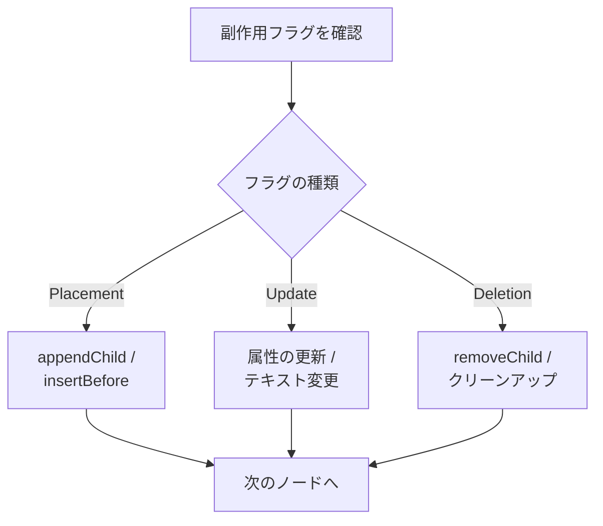

**Layoutフェーズ**

DOMの変更が完了した後の処理を行う。このフェーズでは以下が実行される。

- `componentDidMount` / `componentDidUpdate` の呼び出し
- `useLayoutEffect` のコールバック実行
- `ref` のアタッチ

このフェーズの処理はDOMの変更後に同期的に実行されるため、更新されたDOMの測定（たとえば要素の高さの取得）が可能である。

### 6.2 useEffectの非同期実行

`useEffect` のコールバックは、Commitフェーズの3つのサブフェーズとは別に、非同期的にスケジュールされる。これは `useEffect` がブラウザの描画をブロックしないようにするためである。

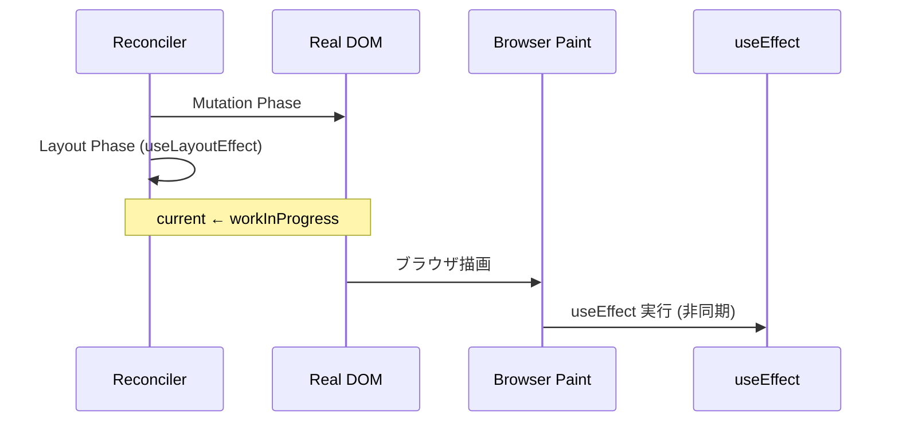

`useLayoutEffect` と `useEffect` の違いは、実行タイミングにある。`useLayoutEffect` はDOMの変更直後、ブラウザの描画前に同期的に実行される。一方、`useEffect` はブラウザの描画後に非同期的に実行される。DOM測定や同期的なDOM操作が必要な場合は `useLayoutEffect` を使い、それ以外のケースでは `useEffect` を使うのが推奨される。

### 6.3 バッチ処理

React 18では**Automatic Batching（自動バッチ処理）**が導入された。これにより、イベントハンドラだけでなく、`setTimeout`、`Promise`、ネイティブイベントハンドラ内での `setState` も自動的にバッチ処理される。

```jsx
// React 18: all setState calls are batched
function handleClick() {
  setCount((c) => c + 1);  // Does not trigger re-render
  setFlag((f) => !f);       // Does not trigger re-render
  setName("React");         // Does not trigger re-render
  // Re-render happens once at the end
}

// Even in async contexts
setTimeout(() => {
  setCount((c) => c + 1);  // Batched
  setFlag((f) => !f);       // Batched
  // Single re-render
}, 1000);
```

バッチ処理により、不必要な中間レンダリングが排除され、パフォーマンスが向上する。

## 7. 仮想DOMのオーバーヘッドと批判

### 7.1 仮想DOMは本当に速いのか

仮想DOMの有用性について、しばしば誤解がある。「仮想DOMは速い」という言説は不正確である。仮想DOMは、素朴にDOM全体を書き換えるアプローチよりは速いが、手動で最適化されたDOM操作よりは遅い。

Svelteの開発者であるRich Harrisは、2018年の記事「Virtual DOM is pure overhead」で、仮想DOMのオーバーヘッドを明確に指摘している。

仮想DOMのオーバーヘッドは以下の3つに分類される。

1. **仮想DOMツリーの生成コスト**: 状態が変わるたびに、変更に関係ないコンポーネントも含めて仮想DOMツリーを再生成する
2. **差分検出コスト**: 新旧の仮想DOMツリーを比較する処理自体にコストがかかる
3. **メモリオーバーヘッド**: 仮想DOMツリーをメモリ上に保持する必要がある

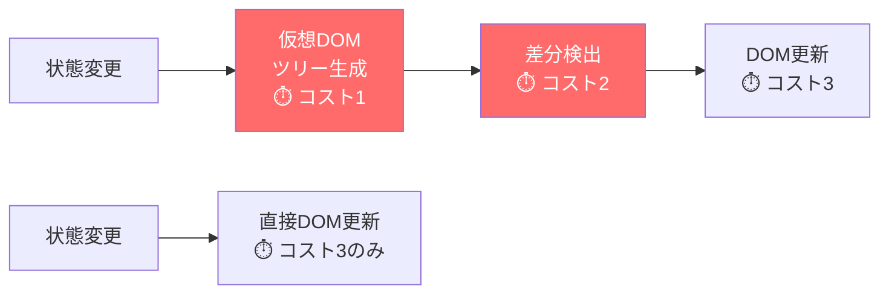

上の図が示すように、仮想DOMアプローチでは「コスト1 + コスト2 + コスト3」がかかるのに対し、直接DOM操作ではコスト3だけで済む。仮想DOMは「最適な手段」ではなく、「十分に高速で、開発者体験（DX）を大幅に向上させる手段」なのである。

### 7.2 仮想DOMの真の価値

仮想DOMの真の価値は、パフォーマンスそのものではなく、以下の点にある。

1. **宣言的プログラミングモデルの実現**: 状態からUIへの写像を関数として記述できる。命令的なDOM操作の複雑さから解放される
2. **プラットフォーム非依存の抽象化**: 仮想DOMはプレーンなJavaScriptオブジェクトであるため、ブラウザDOMだけでなく、React Native（モバイル）、React Three Fiber（3D）、Ink（ターミナル）など、様々なレンダリングターゲットに対応できる
3. **十分に高速なデフォルト**: ほとんどのアプリケーションにおいて、仮想DOMのオーバーヘッドはユーザーが体感できるレベルに達しない。手動最適化なしでも実用的なパフォーマンスが得られる

つまり、仮想DOMは「最速」を目指したものではなく、「宣言的なプログラミングモデルを現実的なパフォーマンスで実現する」ための実用的なトレードオフなのである。

## 8. 仮想DOMを使わないアプローチ

### 8.1 Svelte：コンパイル時アプローチ

Svelte（2016年登場、Rich Harris開発）は、仮想DOMを使わないフレームワークの先駆者である。Svelteのアプローチは、ランタイムの差分検出をコンパイル時のコード生成に置き換えるというものだ。

Svelteコンパイラは、コンポーネントのテンプレートを静的に解析し、どの状態変数がどのDOM要素に影響するかをコンパイル時に把握する。その情報をもとに、状態変更時に最小限のDOM操作を直接実行するコードを生成する。

```svelte
<script>
  let count = 0;
  // The compiler tracks which DOM node depends on 'count'
  function increment() {
    count += 1;
  }
</script>

<button on:click={increment}>
  Clicked {count} times
</button>
```

コンパイル後のコード（概念的に簡略化）は以下のようなイメージになる。

```javascript
// Compiled output (simplified)
function create_fragment(ctx) {
  let button;
  let t0;
  let t1;

  return {
    c() {
      // create: build DOM elements
      button = element("button");
      t0 = text("Clicked ");
      t1 = text(ctx[0]);  // ctx[0] = count
      // ...
    },
    m(target, anchor) {
      // mount: insert into DOM
      insert(target, button, anchor);
      append(button, t0);
      append(button, t1);
    },
    p(ctx, dirty) {
      // patch: update only what changed
      if (dirty & 1) {  // bit flag for 'count'
        set_data(t1, ctx[0]);
      }
    },
    d(detaching) {
      // destroy: cleanup
      if (detaching) detach(button);
    }
  };
}
```

注目すべきは、`p`（patch）関数がビットフラグでどの変数が変更されたかを確認し、該当するDOMノードだけを直接更新している点である。仮想DOMツリーの生成も差分検出もなく、コンパイル時に決定された最小限の操作だけが実行される。

### 8.2 SolidJS：Fine-Grained Reactivity

SolidJS（2018年登場、Ryan Carniato開発）は、**Fine-Grained Reactivity（きめ細かいリアクティビティ）**に基づくフレームワークである。ReactのようなJSX構文を使いながら、仮想DOMを一切使わない。

SolidJSの核心は**Signal**である。Signalはリアクティブなプリミティブであり、値の読み取りを追跡し、値が変更されたときに依存する計算やDOMノードを直接更新する。

```jsx
import { createSignal } from "solid-js";

function Counter() {
  const [count, setCount] = createSignal(0);

  // This JSX is compiled to direct DOM operations
  // The function component runs only ONCE
  return (
    <button onClick={() => setCount(count() + 1)}>
      Count: {count()}
    </button>
  );
}
```

Reactとの決定的な違いは、SolidJSではコンポーネント関数が**一度だけ**実行されるという点である。状態が変化しても、コンポーネント全体が再レンダリングされることはない。Signalの変更は、そのSignalに依存するDOM要素だけに伝播する。

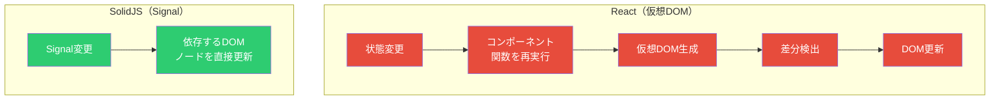

### 8.3 Vue Vapor Mode

Vue.jsは伝統的に仮想DOMを使用してきたが、Vue 3.5以降では**Vapor Mode**という新しいコンパイルモードの開発が進められている。Vapor Modeは、Svelteと同様にコンパイル時にDOMの更新コードを生成し、仮想DOMのオーバーヘッドを排除するアプローチである。

Vapor Modeが興味深いのは、従来の仮想DOMベースのコンポーネントとVapor Modeのコンポーネントを同じアプリケーション内で共存させることが可能な点である。これにより、既存のVueアプリケーションを段階的にVapor Modeに移行できる。

### 8.4 各アプローチの比較

| 特性 | React (仮想DOM) | Svelte (コンパイル時) | SolidJS (Signal) |
|:---|:---|:---|:---|
| DOM更新戦略 | 差分検出 | コンパイル時生成 | Fine-Grained Reactivity |
| ランタイムサイズ | 大きい（~40KB） | 小さい（~2KB） | 中程度（~7KB） |
| 初回レンダリング | 仮想DOM生成 | 直接DOM構築 | 直接DOM構築 |
| 更新時の処理 | ツリー全体の差分検出 | 変更対象の直接更新 | Signal依存の直接更新 |
| エコシステム | 最大 | 成長中 | 成長中 |
| レンダリングターゲット | 多数（Native等） | ブラウザ中心 | ブラウザ中心 |
| 学習コスト | 中 | 低 | 中（Reactに似ている） |

## 9. パフォーマンス最適化

### 9.1 不必要な再レンダリングの問題

Reactの仮想DOMモデルでは、親コンポーネントが再レンダリングされると、変更がなくても子コンポーネントも再レンダリングされる。これはReactの設計上の意図的な振る舞いであるが、大規模なアプリケーションではパフォーマンスの問題につながることがある。

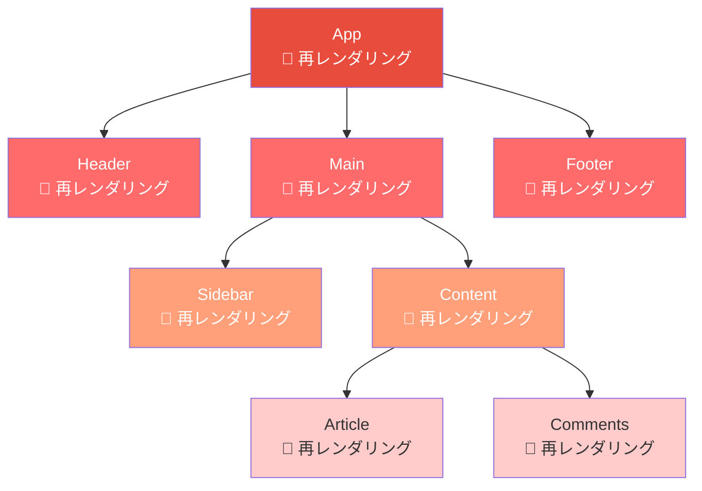

上の図では、Appの状態変更により、実際には変更の影響を受けないHeaderやFooterまで再レンダリングされてしまっている。

### 9.2 React.memo

`React.memo` は、関数コンポーネントの再レンダリングをpropsの浅い比較によってスキップする高階コンポーネント（HOC）である。

```jsx
const ExpensiveComponent = React.memo(function ExpensiveComponent({
  data,
  onAction,
}) {
  // This component re-renders only when data or onAction changes
  return (
    <div>
      {data.map((item) => (
        <ExpensiveItem key={item.id} item={item} />
      ))}
    </div>
  );
});
```

`React.memo` は浅い比較（shallow comparison）を行うため、オブジェクトや配列のpropsが毎回新しい参照で渡されると、memoの効果がなくなる。

```jsx
function Parent() {
  const [count, setCount] = useState(0);

  // Problem: new object reference on every render
  const style = { color: "red" };
  // Problem: new function reference on every render
  const handleClick = () => console.log("clicked");

  return <MemoizedChild style={style} onClick={handleClick} />;
}
```

### 9.3 useMemoとuseCallback

`useMemo` と `useCallback` は、値や関数の参照を安定させるためのhooksである。

```jsx
function Parent() {
  const [count, setCount] = useState(0);
  const [text, setText] = useState("");

  // Memoize expensive computation
  const expensiveResult = useMemo(() => {
    return computeExpensiveValue(count);
  }, [count]);  // Only recompute when count changes

  // Memoize callback function
  const handleClick = useCallback(() => {
    console.log("Count:", count);
  }, [count]);  // Only recreate when count changes

  return (
    <div>
      <input value={text} onChange={(e) => setText(e.target.value)} />
      {/* MemoizedChild does not re-render when text changes */}
      <MemoizedChild result={expensiveResult} onClick={handleClick} />
    </div>
  );
}
```

ただし、`useMemo` と `useCallback` にもオーバーヘッドがある。依存配列の比較処理、メモ化された値のメモリ保持など、軽微だがゼロではないコストが発生する。「すべての値をmemoする」のではなく、実際にパフォーマンスの問題が観測された場合に使用するのが推奨される。

### 9.4 shouldComponentUpdate / PureComponent

クラスコンポーネントでは、`shouldComponentUpdate` メソッドを実装することで、再レンダリングを制御できる。

```jsx
class TodoItem extends React.Component {
  shouldComponentUpdate(nextProps, nextState) {
    // Only re-render if the todo text or completed status changed
    return (
      this.props.text !== nextProps.text ||
      this.props.completed !== nextProps.completed
    );
  }

  render() {
    return (
      <li className={this.props.completed ? "done" : ""}>
        {this.props.text}
      </li>
    );
  }
}
```

`React.PureComponent` は、すべてのpropsとstateの浅い比較を `shouldComponentUpdate` として自動的に実装したクラスである。

### 9.5 状態の配置戦略

最も効果的なパフォーマンス最適化は、しばしば `memo` や `useMemo` を使うことではなく、**状態を適切な位置に配置すること**である。

```jsx
// Before: state lifted too high — causes unnecessary re-renders
function App() {
  const [inputValue, setInputValue] = useState("");

  return (
    <div>
      <input value={inputValue} onChange={(e) => setInputValue(e.target.value)} />
      <ExpensiveTree />  {/* Re-renders on every keystroke */}
    </div>
  );
}

// After: state pushed down to where it's needed
function App() {
  return (
    <div>
      <SearchInput />  {/* State is isolated here */}
      <ExpensiveTree />  {/* No longer re-renders on keystrokes */}
    </div>
  );
}

function SearchInput() {
  const [inputValue, setInputValue] = useState("");
  return <input value={inputValue} onChange={(e) => setInputValue(e.target.value)} />;
}
```

状態を使用するコンポーネントに近い位置に配置することで、再レンダリングの影響範囲を限定できる。これは `memo` よりもシンプルで、副作用もなく、最も基本的な最適化手法である。

もう一つの手法として、**コンポジション（composition）**を活用して、変更されない部分を `children` として渡す方法がある。

```jsx
function Layout({ children }) {
  const [theme, setTheme] = useState("light");

  return (
    <div className={theme}>
      <ThemeToggle onToggle={() => setTheme(t => t === "light" ? "dark" : "light")} />
      {children}  {/* children are not re-created on theme change */}
    </div>
  );
}

function App() {
  return (
    <Layout>
      <ExpensiveTree />  {/* Not affected by theme state changes */}
    </Layout>
  );
}
```

## 10. 今後の展望

### 10.1 React Compiler（React Forget）

React Compilerは、Reactチームが開発中のコンパイラで、`useMemo`、`useCallback`、`React.memo` を手動で記述する必要をなくすことを目指している。

React Compilerの核心的なアイデアは、コンポーネントのコードを静的に解析し、どの値がどの依存関係に基づいて変化するかを自動的に推論して、適切なメモ化コードを生成することである。

```jsx
// Before: manual memoization
function TodoList({ todos, filter }) {
  const filteredTodos = useMemo(
    () => todos.filter(t => t.status === filter),
    [todos, filter]
  );
  const handleClick = useCallback((id) => {
    markComplete(id);
  }, []);

  return (
    <ul>
      {filteredTodos.map(todo => (
        <TodoItem key={todo.id} todo={todo} onClick={handleClick} />
      ))}
    </ul>
  );
}

// After: React Compiler handles memoization automatically
function TodoList({ todos, filter }) {
  const filteredTodos = todos.filter(t => t.status === filter);
  const handleClick = (id) => {
    markComplete(id);
  };

  return (
    <ul>
      {filteredTodos.map(todo => (
        <TodoItem key={todo.id} todo={todo} onClick={handleClick} />
      ))}
    </ul>
  );
}
// The compiler automatically inserts memoization where beneficial
```

React Compilerは、Metaの社内でInstagramのWeb版に適用され、実用性が検証されている。2024年秋にオープンソースとして公開され、React 19とともにエコシステムへの展開が進んでいる。

### 10.2 Server Components

React Server Components（RSC）は、コンポーネントをサーバーサイドで実行し、その結果をシリアライズしてクライアントに送信するアーキテクチャである。

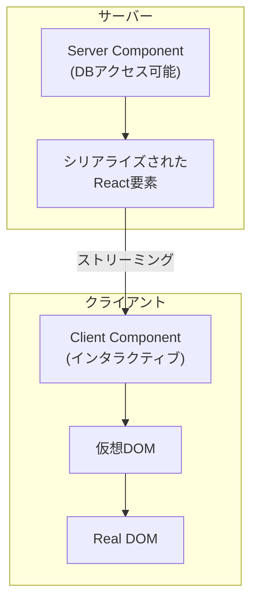

Server Componentsは仮想DOMのモデルを拡張し、サーバーとクライアントの境界をコンポーネントレベルで定義できるようにする。サーバーでレンダリングされたコンポーネントのJavaScriptはクライアントに送信されないため、バンドルサイズの削減につながる。

### 10.3 Concurrent Features の成熟

React 18で導入されたConcurrent Features（`useTransition`、`useDeferredValue`、Suspense for Data Fetching）は、Fiberアーキテクチャの能力を最大限に活用するAPIである。

```jsx
import { useDeferredValue, useMemo } from "react";

function SearchResults({ query }) {
  // Deferred value: may lag behind the actual query
  const deferredQuery = useDeferredValue(query);

  const results = useMemo(
    () => filterLargeDataset(deferredQuery),
    [deferredQuery]
  );

  return (
    <div style={{ opacity: query !== deferredQuery ? 0.5 : 1 }}>
      {results.map(item => <ResultItem key={item.id} item={item} />)}
    </div>
  );
}
```

`useDeferredValue` は、高頻度で変化する値に対して低優先度の「遅延版」を提供する。入力フィールドの値のような高優先度の更新はすぐに反映されるが、その値に基づく重い計算は遅延版を通じて後から処理される。

### 10.4 フロントエンドUIフレームワークの収束と分岐

仮想DOMとそれに代わるアプローチの競争は、フロントエンドUIフレームワーク全体のアーキテクチャに深い影響を与えている。

現在、大きく3つの方向性が並行して進化している。

1. **仮想DOMの最適化**: React Compilerのようなコンパイラ支援によるメモ化の自動化。仮想DOMのモデルを維持しつつ、オーバーヘッドを最小化する方向
2. **コンパイル時最適化**: Svelte、Vue Vapor Modeのように、仮想DOMを排除してコンパイル時にDOM操作を決定する方向
3. **Fine-Grained Reactivity**: SolidJS、Angular Signalsのように、リアクティブなプリミティブに基づいて最小限のDOM更新を行う方向

興味深いことに、これらのアプローチは相互に影響を与えながら収束しつつある。Reactはコンパイラを導入して不必要な再レンダリングを排除しようとしており、Svelteはバージョン5でSignalに似た「Rune」を導入し、VueはSignalベースのリアクティビティシステムを持ちながらVapor Modeでコンパイル時最適化も取り入れている。

最終的に、どのアプローチが「勝つ」かという問いよりも重要なのは、それぞれのアプローチが提示する洞察――宣言的なプログラミングモデルの価値、コンパイル時情報の活用、変更伝播の精度向上――がフレームワーク設計全体を前進させているという事実である。

## まとめ

仮想DOMは、「DOM操作のコストが高い」という現実と「宣言的にUIを記述したい」という理想の間で生まれた、実用的なトレードオフである。Reactは仮想DOMと差分アルゴリズムを組み合わせ、$O(n)$ のヒューリスティックな差分検出と `key` による要素追跡により、宣言的なプログラミングモデルを現実的なパフォーマンスで提供した。

Fiber アーキテクチャは、この仕組みをさらに発展させ、中断可能なレンダリング、優先度付きスケジューリング、時間分割を実現した。これにより、大規模なアプリケーションにおいてもユーザー体験を損なわないUI更新が可能になった。

一方で、仮想DOMは「純粋なオーバーヘッド」であるという批判も正当なものである。Svelte、SolidJS、Vue Vapor Modeなどのフレームワークは、コンパイル時最適化やFine-Grained Reactivityによって、仮想DOMなしでも宣言的なUIを実現できることを示している。

今後は、React Compilerによる自動メモ化やServer Componentsなどの進化により、仮想DOMのオーバーヘッドはさらに縮小していくだろう。同時に、Signalベースのアプローチとの技術的な収束も進んでいく。フロントエンドフレームワークの設計空間は、これらの相互作用によって今なお活発に探索されている。
