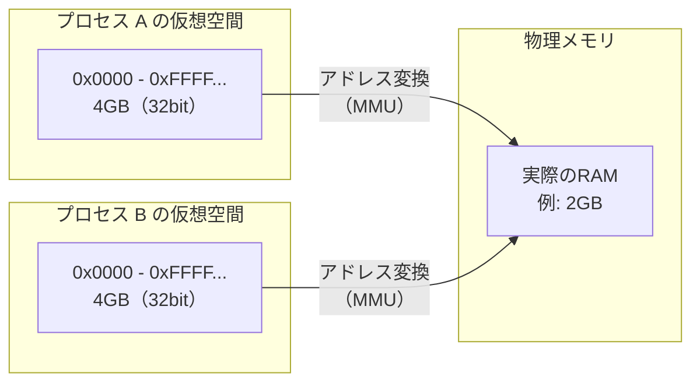
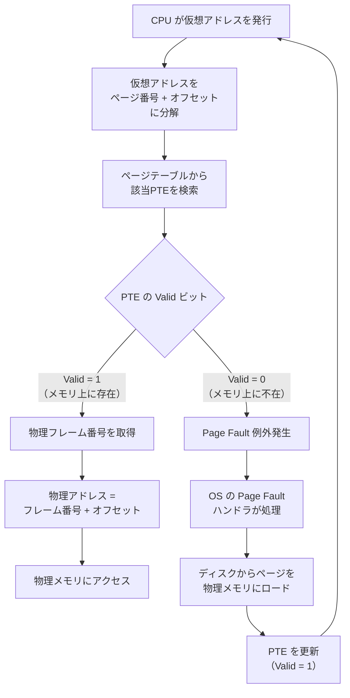
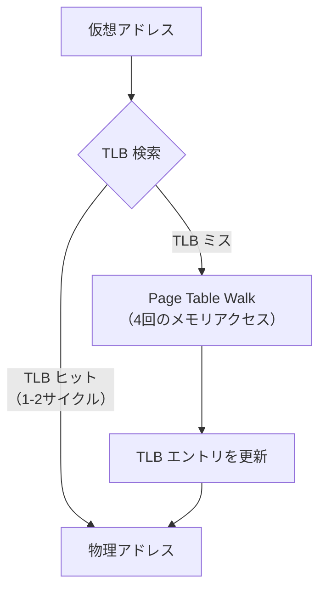
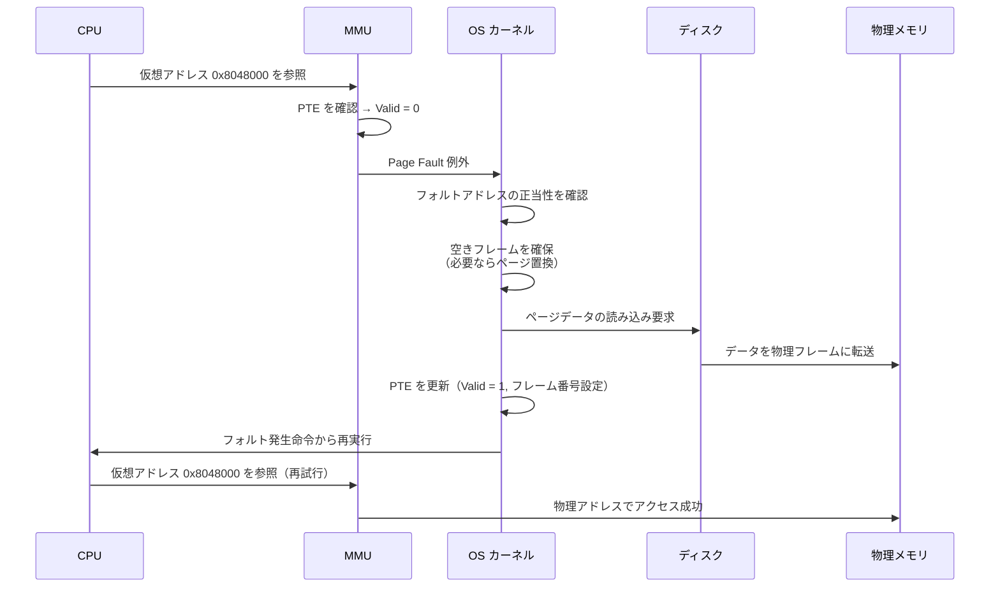

# 仮想メモリとページング

## 1. 背景と動機 — 物理メモリの直接管理はなぜ破綻するのか

### 1.1 初期コンピュータのメモリ管理

コンピュータの黎明期、プログラムは物理メモリ上の固定アドレスに直接ロードされて実行されていた。1950年代のバッチ処理システムでは、一度に1つのプログラムしかメモリに載らないため、この方式でも特に問題はなかった。プログラムはアドレス0番地（あるいは特定の開始アドレス）からロードされ、物理メモリを独占的に使用できた。

しかし、1960年代に**タイムシェアリングシステム**が登場すると、状況は一変する。複数のユーザーが同時にコンピュータを利用するためには、複数のプログラムを同時にメモリ上に保持し、CPUの実行時間を分割して切り替える必要がある。ここで、物理メモリを直接管理するアプローチには3つの根本的な問題が生じた。

### 1.2 物理アドレスの直接使用がもたらす3つの問題

**問題1：アドレスの衝突**

複数のプログラムが同時にメモリに存在する場合、各プログラムが使用するアドレスが衝突する。例えば、プログラムAとプログラムBがともにアドレス `0x1000` を使用するようにコンパイルされていた場合、両方を同時にメモリに載せることはできない。

```
物理メモリ:
+------------------+ 0x0000
|   OS カーネル    |
+------------------+ 0x1000
| プログラム A     |  <-- 0x1000 から開始
+------------------+ 0x5000
| プログラム B     |  <-- 0x5000 にリロケーション?
+------------------+
|   空き領域       |
+------------------+
```

リロケーション（プログラムのアドレスを再配置すること）で一時的には回避できるが、プログラム内の全てのアドレス参照を書き換える必要があり、実行時のオーバーヘッドも大きかった。

**問題2：メモリ保護の欠如**

物理アドレスを直接使用する場合、あるプログラムが他のプログラムやOSカーネルのメモリ領域を読み書きすることを防ぐ仕組みがない。バグのあるプログラムや悪意あるプログラムが、OSのデータ構造を破壊してシステム全体をクラッシュさせる危険性が常にある。

**問題3：メモリの断片化**

プログラムの起動と終了を繰り返すと、物理メモリ上に細かな空き領域が散在する**外部断片化（external fragmentation）** が発生する。合計では十分な空きメモリがあっても、連続した領域が確保できないためにプログラムをロードできないという状況が生まれる。

```
物理メモリ（断片化状態）:
+------------------+
|   OS カーネル    |
+------------------+
|   プログラム A   |  使用中
+------------------+
|   空き (8KB)     |
+------------------+
|   プログラム C   |  使用中
+------------------+
|   空き (4KB)     |
+------------------+
|   プログラム D   |  使用中
+------------------+
|   空き (16KB)    |
+------------------+
合計空き: 28KB だが、連続では最大 16KB しかない
```

### 1.3 解決策としての仮想メモリ

これらの問題を根本的に解決するために考案されたのが**仮想メモリ（Virtual Memory）** である。仮想メモリの基本的な発想は以下のとおりである。

> **各プロセスに独立した仮想アドレス空間を与え、ハードウェアとOSの協調によって仮想アドレスを物理アドレスに動的に変換する。**

この発想は1961年にイギリスのManchester大学で開発された**Atlas**コンピュータにおいて初めて実用化された。設計者のTom Kilburnらは、プログラマが物理メモリのサイズや配置を意識することなくプログラムを記述できる環境を目指した。Atlasは1レベルストア（one-level store）と呼ばれる概念を導入し、主記憶とドラムメモリ（2次記憶）を統合的に管理した。これが現代の仮想メモリシステムの原型である。

## 2. 仮想アドレス空間の概念

### 2.1 仮想アドレスと物理アドレスの分離

仮想メモリの核心は、プロセスが見る**仮想アドレス（Virtual Address）** と、実際のハードウェアRAM上の**物理アドレス（Physical Address）** を分離することにある。

各プロセスは、自分だけの**仮想アドレス空間（Virtual Address Space）** を持つ。32ビットシステムでは$2^{32} = 4$GBの仮想アドレス空間、64ビットシステムでは理論上$2^{64}$バイトの仮想アドレス空間が利用可能である（実装上は48ビットや57ビットに制限される場合が多い）。



重要な点として、プロセスの仮想アドレス空間は物理メモリの容量を超えることができる。2GBの物理RAMしかないシステムでも、各プロセスは4GBの仮想アドレス空間を持つ。これが可能なのは、プロセスが実際に使用しているメモリのうち、現在アクティブに参照されている部分だけが物理メモリ上に存在すればよいからである。残りはディスク上のスワップ領域に退避できる。

### 2.2 仮想アドレス空間がもたらす利点

仮想アドレス空間の導入により、先述の3つの問題がすべて解決される。

| 問題 | 仮想メモリによる解決 |
|---|---|
| アドレスの衝突 | 各プロセスが独立した仮想アドレス空間を持つため、同じ仮想アドレスが異なる物理アドレスにマッピングされる |
| メモリ保護の欠如 | アドレス変換機構がアクセス権限を検査し、不正なアクセスを検出してプロセスを停止（セグメンテーションフォルト）できる |
| 外部断片化 | 仮想アドレス空間上では連続だが、物理メモリ上では不連続な領域にマッピングできる |

さらに、仮想メモリは以下のような付加的な利点も提供する。

- **ディスクへの拡張**：物理メモリに収まらないデータを透過的にディスクに退避できる
- **メモリマップドファイル**：ファイルを仮想アドレス空間にマッピングし、メモリアクセスと同様にファイルを読み書きできる
- **共有メモリ**：異なるプロセスの仮想アドレスを同じ物理フレームにマッピングすることで、効率的なプロセス間通信が可能になる
- **Copy-on-Write**：`fork()` 時にページテーブルだけを複製し、実際のメモリコピーを書き込み時まで遅延できる

## 3. ページングの基本原理

### 3.1 ページとフレーム

仮想メモリの実装手法としてもっとも広く採用されているのが**ページング（Paging）** である。ページングでは、仮想アドレス空間と物理メモリの両方を、固定サイズの単位に分割して管理する。

- **ページ（Page）**：仮想アドレス空間を固定サイズに分割した単位。一般的なページサイズは**4KB**（4,096バイト）である
- **フレーム（Frame）** / ページフレーム：物理メモリを同じサイズに分割した単位

ページングの基本的な考え方は、各ページを任意のフレームにマッピングできるということである。仮想アドレス空間上で連続しているページが、物理メモリ上では全く異なる位置のフレームにマッピングされていても構わない。

```
仮想アドレス空間（プロセス A）         物理メモリ
+------------------+                 +------------------+
| ページ 0        |----+           | フレーム 0       | OS
+------------------+    |           +------------------+
| ページ 1        |----+--+       | フレーム 1       | ←── ページ 3
+------------------+    |  |       +------------------+
| ページ 2        |-+  |  |       | フレーム 2       | ←── ページ 0
+------------------+ |  |  |       +------------------+
| ページ 3        |-+--+--+--+   | フレーム 3       | ←── ページ 2
+------------------+ |     |  |   +------------------+
                     |     |  +-->| フレーム 4       | ←── ページ 1
                     |     |       +------------------+
                     |     +------>| フレーム 5       |（他プロセス）
                     |             +------------------+
                     +------------>| フレーム 6       | ←── ページ 2
                                   +------------------+
```

::: tip ページサイズの選択
4KBというページサイズは、1970年代のVAXアーキテクチャ以来の事実上の標準である。このサイズは、内部断片化（ページ内の未使用領域）と管理オーバーヘッド（ページテーブルのサイズ）のバランスが良いとされてきた。ただし、メモリ容量の増大とTLBのカバレッジの問題から、より大きなページサイズ（Huge Pages）の利用が近年注目されている（後述）。
:::

### 3.2 ページテーブル

ページから物理フレームへのマッピング情報は、**ページテーブル（Page Table）** と呼ばれるデータ構造で管理される。ページテーブルはプロセスごとに存在し、各エントリ（**PTE: Page Table Entry**）は以下の情報を保持する。

```
Page Table Entry（PTE）の一般的な構成:
+-------+---+---+---+---+---+---+---+------------------------+
|  未使用 | G | D | A | U | W | P | V |   物理フレーム番号      |
+-------+---+---+---+---+---+---+---+------------------------+
  ビットフィールドの意味:
  V (Valid/Present)  : このページが物理メモリ上に存在するか
  W (Writable)       : 書き込み可能か
  P (Privileged)     : カーネルモードでのみアクセス可能か
  U (User)           : ユーザーモードからアクセス可能か
  A (Accessed)       : 最近アクセスされたか（ページ置換に使用）
  D (Dirty)          : ページが書き換えられたか
  G (Global)         : コンテキストスイッチ時にTLBから削除しないか
```

OSはプロセスの生成時にページテーブルを作成し、プロセスの仮想アドレス空間の各ページがどの物理フレームにマッピングされているかを記録する。コンテキストスイッチの際には、CPUのページテーブルベースレジスタ（x86ではCR3レジスタ）を切り替えることで、実行中のプロセスに対応するページテーブルが参照される。

## 4. アドレス変換の仕組み

### 4.1 仮想アドレスの分解

仮想アドレスから物理アドレスへの変換は、CPUの**MMU（Memory Management Unit）** がハードウェアレベルで行う。まず、仮想アドレスは2つの部分に分解される。

```
仮想アドレス（32ビット、4KBページの場合）:
+-----------------------------+------------------+
|   ページ番号（20ビット）      | オフセット（12ビット）|
+-----------------------------+------------------+
         上位20ビット              下位12ビット

ページサイズ = 4KB = 2^12 バイト → オフセットは12ビット
ページ数 = 2^20 = 約100万ページ
```

- **ページ番号（Page Number）**：ページテーブルのインデックスとして使用される。このインデックスからPTEを参照し、対応する物理フレーム番号を得る
- **オフセット（Offset）**：ページ内の位置を示す。ページサイズが4KB（$2^{12}$バイト）の場合、12ビットで表現される。オフセットは変換時にそのまま保持される

### 4.2 変換プロセス

アドレス変換の全体的な流れを示す。



具体的な変換例を示す。32ビットシステムで4KBページの場合を考える。

```
仮想アドレス: 0x00003A7F

1. ページ番号とオフセットに分解:
   0x00003A7F = 0000 0000 0000 0000 0011 1010 0111 1111
   ページ番号: 0x00003 (= 上位20ビット = 3)
   オフセット: 0xA7F   (= 下位12ビット)

2. ページテーブル参照:
   Page Table[3] → 物理フレーム番号 = 0x0072A

3. 物理アドレスの構成:
   物理アドレス = (0x0072A << 12) | 0xA7F
               = 0x0072A000 | 0x00000A7F
               = 0x0072AA7F
```

### 4.3 アクセス権の検査

アドレス変換と同時に、MMUはPTEに記録されたアクセス権を検査する。以下のような不正なアクセスが検出された場合、CPUは例外（フォルト）を発生させ、OSのハンドラに制御を移す。

- ユーザーモードのプロセスがカーネル専用ページにアクセスしようとした場合
- 読み取り専用ページに書き込みを行おうとした場合
- 実行不可（NX/XD）に設定されたページのコードを実行しようとした場合

これらの検査はハードウェアレベルで行われるため、ソフトウェアによるオーバーヘッドなしにメモリ保護が実現される。

## 5. ページテーブルの構造

### 5.1 単一レベルページテーブルの問題

最も素朴なページテーブルの実装は、仮想アドレスのページ番号をインデックスとする配列である。しかし、この単純な方式には深刻な問題がある。

32ビットシステムで4KBページの場合、ページ番号は20ビットであるから、ページテーブルのエントリ数は$2^{20} = 1,048,576$となる。各PTEが4バイトであれば、ページテーブル全体で**4MB**を消費する。これはプロセスごとに必要であるから、100個のプロセスが実行されていれば、ページテーブルだけで400MBの物理メモリを消費してしまう。

64ビットシステムではさらに深刻である。48ビットの仮想アドレスで4KBページの場合、ページ番号は36ビットとなり、$2^{36}$エントリ（各8バイト）で**512GB**のページテーブルが必要となる。これは明らかに現実的ではない。

### 5.2 マルチレベルページテーブル

この問題を解決するのが**マルチレベル（階層型）ページテーブル**である。核心的な洞察は、ほとんどのプロセスは仮想アドレス空間のごく一部しか使用しないという事実にある。マルチレベルページテーブルでは、使用されていない領域に対するページテーブルの割り当てを省略できる。

**2レベルページテーブル（32ビットシステムの例）：**

仮想アドレスのページ番号部分をさらに分割し、複数の段階でテーブルを参照する。

```
仮想アドレス（32ビット、2レベルページテーブル）:
+------------------+------------------+------------------+
| 第1レベル（10ビット）| 第2レベル（10ビット）| オフセット（12ビット）|
+------------------+------------------+------------------+
    ページディレクトリ    ページテーブル          ページ内位置
    のインデックス        のインデックス
```


2レベルの場合、ページディレクトリは常にメモリに存在する必要があるが（4KB = 1024エントリ x 4バイト）、第2レベルのページテーブルは実際に使用されている仮想アドレス範囲に対してのみ割り当てればよい。典型的なプロセスでは、仮想アドレス空間の0.1%未満しか使用しないため、メモリの大幅な節約になる。

### 5.3 x86-64の4段ページテーブル

64ビットの x86-64 アーキテクチャでは、48ビットの仮想アドレスを**4段階**のページテーブルで変換する。各レベルは9ビットのインデックス（512エントリ）を使用し、最下位12ビットがページ内オフセットとなる。

```
x86-64 仮想アドレス（48ビット使用、4段ページテーブル）:
+--------+---------+---------+---------+------------------+
| PML4   | PDPT    | PD      | PT      | オフセット         |
| 9ビット  | 9ビット   | 9ビット   | 9ビット   | 12ビット          |
+--------+---------+---------+---------+------------------+
 ビット    ビット     ビット     ビット     ビット
 47-39    38-30     29-21     20-12     11-0

PML4: Page Map Level 4
PDPT: Page Directory Pointer Table
PD:   Page Directory
PT:   Page Table
```


各テーブルは512エントリ x 8バイト = 4KBであり、ちょうど1ページに収まる設計になっている。

なお、Intel の 5-Level Paging（Ice Lake 以降で利用可能）では、PML5と呼ばれる第5レベルが追加され、仮想アドレス空間が57ビット（128PB）に拡張される。これは、仮想マシンのネストや大規模なインメモリデータベースなど、巨大なアドレス空間を必要とするユースケースに対応するための拡張である。

### 5.4 Inverted Page Table

マルチレベルページテーブルとは全く異なるアプローチとして、**Inverted Page Table（逆引きページテーブル）** がある。

通常のページテーブルは仮想ページ番号をインデックスとしているが、Inverted Page Tableは**物理フレーム番号**をインデックスとする。つまり、テーブルのエントリ数は仮想アドレス空間のサイズではなく、物理メモリのフレーム数によって決まる。

```
通常のページテーブル:
  エントリ数 = 仮想アドレス空間のページ数（膨大）

Inverted Page Table:
  エントリ数 = 物理メモリのフレーム数（比較的少ない）
  各エントリ: (プロセスID, 仮想ページ番号) → 物理フレーム番号
```

Inverted Page Tableの利点は、メモリ消費が物理メモリサイズに比例する点である。8GBの物理メモリと4KBページの場合、エントリ数は$2^{21}$（約200万）で済む。一方、欠点として、仮想アドレスからの検索には全エントリの走査が必要になるため、ハッシュテーブルを併用して検索を高速化する必要がある。

Inverted Page Tableは、IBMのPOWERアーキテクチャやIA-64（Itanium）で採用された。現在の主流であるx86-64ではマルチレベルページテーブルが使われており、Inverted Page Tableは限定的なアーキテクチャでのみ利用されている。

## 6. TLB（Translation Lookaside Buffer）の役割

### 6.1 アドレス変換のコスト

4段階のページテーブルを辿るアドレス変換は、1回のメモリアクセスに対して**4回の追加メモリアクセス**を必要とする（各レベルのテーブルを参照するため）。主記憶へのアクセスレイテンシが約100nsだとすると、4回の追加アクセスで400nsのオーバーヘッドが発生する。これは実用上、許容できない遅延である。

この問題を解決するのが**TLB（Translation Lookaside Buffer）** である。

### 6.2 TLBの構造と動作

TLBは、最近使用されたアドレス変換の結果をキャッシュする、CPU内の高速な連想メモリ（Content-Addressable Memory, CAM）である。TLBにヒットすれば、ページテーブルの走査を完全にスキップできる。



典型的なTLBの仕様は以下のとおりである。

| 特性 | L1 dTLB | L1 iTLB | L2 TLB |
|---|---|---|---|
| エントリ数 | 64-128 | 64-128 | 1,024-2,048 |
| アクセス時間 | 1-2サイクル | 1-2サイクル | 6-8サイクル |
| 連想度 | 全連想 or 高連想 | 全連想 or 高連想 | 4-12ウェイ |
| 対象 | データアクセス | 命令フェッチ | データ+命令 |

::: warning TLBのエントリ数は極めて少ない
L1 TLBのエントリ数が64-128というのは、4KBページの場合、わずか256KB-512KBの仮想アドレス空間しかカバーできないことを意味する。大規模なデータセットに対するランダムアクセスでは、TLBミスが頻発し、性能が大幅に低下する可能性がある。この問題を緩和するための手法が Huge Pages（後述）である。
:::

### 6.3 TLBミスの処理

TLBミスが発生した場合の処理は、アーキテクチャによって異なる。

**ハードウェアTLBミスハンドリング（x86, ARM）：**
x86やARMアーキテクチャでは、TLBミスが発生するとCPUのハードウェアが自動的にページテーブルを走査（Page Table Walk）し、見つかったエントリをTLBにロードする。この処理はソフトウェアの介入なしに行われるため、OSからは透過的である。

**ソフトウェアTLBミスハンドリング（MIPS, SPARC）：**
MIPSやSPARCでは、TLBミスが発生するとCPUは例外を発生させ、OSのTLBミスハンドラが呼び出される。ハンドラはページテーブルを参照して適切なエントリを見つけ、特権命令でTLBに書き込む。この方式は、ページテーブルの構造をOSが自由に設計できる柔軟性がある反面、ミス処理のオーバーヘッドが大きい。

### 6.4 TLBとコンテキストスイッチ

プロセスが切り替わると、前のプロセスのアドレス変換情報はもはや正しくないため、TLBの内容は無効化する必要がある。これを**TLBフラッシュ（TLB flush）** と呼ぶ。しかし、TLBフラッシュはコストの高い操作であり、スイッチ直後はTLBが空の状態から始まる（コールドスタート）ため、一時的にアドレス変換のレイテンシが増大する。

この問題を軽減するために、多くのアーキテクチャはTLBエントリに**ASID（Address Space Identifier）** を付与する機能を持つ。ASIDは各プロセス（アドレス空間）に固有の短いIDで、TLBエントリに紐づけられる。ASID付きのTLBでは、コンテキストスイッチ時に全エントリをフラッシュする必要がない。異なるASIDのエントリは自動的に区別されるためである。

```
TLB エントリ（ASID付き）:
+------+-------------------+--------------------+-------+
| ASID | 仮想ページ番号     | 物理フレーム番号      | フラグ  |
+------+-------------------+--------------------+-------+
|  3   | 0x00401          | 0x0072A            | RWX   |
|  3   | 0x00402          | 0x0083B            | RW-   |
|  7   | 0x00401          | 0x0091C            | RWX   |  ← 別プロセス
+------+-------------------+--------------------+-------+
```

x86-64では、PCID（Process-Context Identifier）として12ビットのASIDが利用可能であり、最大4,096個のアドレス空間を区別できる。Linuxカーネルは4.15以降でPCIDを活用しており、Meltdown対策であるKPTI（Kernel Page Table Isolation）のオーバーヘッドを軽減するために重要な役割を果たしている。

## 7. ページフォルト処理（Demand Paging）

### 7.1 ページフォルトとは

**ページフォルト（Page Fault）** は、プロセスがアクセスしようとした仮想ページが物理メモリ上に存在しない場合に発生するCPU例外である。ページフォルトが発生すると、CPUは実行中の命令を中断し、OSのページフォルトハンドラに制御を移す。

ページフォルトには以下の種類がある。

| 種類 | 原因 | OSの対応 |
|---|---|---|
| マイナーフォルト | ページは物理メモリ上にあるがPTEが未設定（初回アクセス等） | PTEを設定するだけ（I/Oなし） |
| メジャーフォルト | ページがディスク上にスワップアウトされている | ディスクからページを読み込む |
| 無効なアクセス | マッピングされていない領域へのアクセス | プロセスにSIGSEGVを送信 |

### 7.2 Demand Paging

現代のOSは**デマンドページング（Demand Paging）** と呼ばれる戦略を採用している。これは、プログラムの起動時に全てのページを物理メモリにロードするのではなく、**実際にアクセスされた時点で初めてページを物理メモリにロードする**という遅延ロード戦略である。



デマンドページングの利点は以下のとおりである。

- **起動時間の短縮**：プログラムの起動時に全ページをロードする必要がないため、起動が高速になる
- **メモリの効率的利用**：実際にアクセスされるページだけが物理メモリを消費する。大きなバイナリでも、実行時に使われない関数のページはロードされない
- **物理メモリを超えるプログラムの実行**：プログラム全体が物理メモリに収まらなくても、必要な部分だけをロードすることで実行できる

### 7.3 ページフォルトハンドラの動作

Linuxカーネルにおけるページフォルトハンドラの動作を簡略化して示す。

```c
// Simplified page fault handler flow
void handle_page_fault(unsigned long address, unsigned int error_code) {
    struct vm_area_struct *vma;

    // 1. Find the VMA (Virtual Memory Area) containing the fault address
    vma = find_vma(current->mm, address);

    if (!vma || address < vma->vm_start) {
        // No valid mapping — send SIGSEGV
        send_signal(SIGSEGV, current);
        return;
    }

    // 2. Check access permissions
    if (!check_permissions(vma, error_code)) {
        // Permission violation — send SIGSEGV
        send_signal(SIGSEGV, current);
        return;
    }

    // 3. Handle the fault based on the type
    if (is_anonymous_page(vma)) {
        // Anonymous page (heap, stack): allocate a zero-filled frame
        handle_anonymous_fault(vma, address);
    } else if (is_file_backed(vma)) {
        // File-backed page: read from the file
        handle_file_fault(vma, address);
    } else if (is_swap_entry(pte)) {
        // Swapped-out page: read from swap
        handle_swap_fault(vma, address);
    }
}
```

### 7.4 ページ置換

物理メモリが不足した場合、OSは既存のページを**スワップアウト（ディスクに退避）** して空きフレームを確保する必要がある。どのページをスワップアウトするかを決定するのが**ページ置換アルゴリズム**である。

代表的なアルゴリズムを示す。

- **LRU（Least Recently Used）**：最も長い間アクセスされていないページを置換する。理想的だが、厳密な実装はコストが高い
- **Clock（Second Chance）**：LRUの近似。ページを円形リストに配置し、Accessedビットを用いて置換候補を選択する
- **LRU-K**：直近K回のアクセス時刻を記録し、K回前のアクセスが最も古いページを置換する

Linuxカーネルは、**Active List**と**Inactive List**の2つのLRUリストを使った近似LRUアルゴリズムを実装している。ページは最初にInactive Listに追加され、再度アクセスされるとActive Listに昇格する。メモリが逼迫すると、Active Listの末尾からInactive Listにデモートされ、Inactive Listの末尾からページが回収される。

## 8. Copy-on-Write

### 8.1 fork()の問題

Unixの`fork()`システムコールは、現在のプロセスの完全なコピーを作成する。素朴な実装では、親プロセスの全メモリを子プロセス用にコピーする必要があるが、これは非常にコストの高い操作である。特に、`fork()`の直後に`exec()`で別のプログラムを実行する場合（`fork-exec`パターン）、コピーしたメモリは即座に破棄されるため、完全に無駄なコピーとなる。

### 8.2 Copy-on-Writeの仕組み

**Copy-on-Write（CoW）** は、この問題を解決するための最適化手法である。`fork()` 時にメモリの内容をコピーするのではなく、親と子のページテーブルを同じ物理フレームを指すように設定し、両方のPTEを**読み取り専用**としてマークする。

```
fork() 直後の状態:
                                    物理メモリ
親プロセスのページテーブル              +------------------+
+---+---+---+---+                  | フレーム X       |
| R | R | R | R | ──────────────> | データ A         | <── 共有
+---+---+---+---+                  +------------------+
                                   | フレーム Y       |
子プロセスのページテーブル              | データ B         | <── 共有
+---+---+---+---+                  +------------------+
| R | R | R | R | ──────────────>
+---+---+---+---+
  R = Read-Only（書き込み禁止）
```

いずれかのプロセスがページに書き込みを行おうとすると、**書き込み保護違反**のページフォルトが発生する。OSのフォルトハンドラは、このフォルトがCoWによるものであることを認識し、以下の処理を行う。

1. 新しい物理フレームを確保する
2. 元のフレームの内容を新しいフレームにコピーする
3. 書き込みを行ったプロセスのPTEを、新しいフレームを指すように更新し、書き込み可能にする
4. 元のフレームの参照カウントをデクリメントする。参照カウントが1になった場合、残りのプロセスのPTEも書き込み可能に戻す

```
書き込み発生後の状態（子プロセスがページ 0 に書き込み）:

親プロセスのページテーブル              物理メモリ
+---+---+---+---+                  +------------------+
| W | R | R | R | ──────────────> | フレーム X       |
+---+---+---+---+                  | データ A（元のまま）|
                                   +------------------+
子プロセスのページテーブル              | フレーム Y       |
+---+---+---+---+                  | データ B         |
| W | R | R | R | ──────+        +------------------+
+---+---+---+---+        |        | フレーム Z（新規）  |
                         +------> | データ A'（変更後）  |
                                   +------------------+
  W = Writable（書き込み可能）
```

### 8.3 Copy-on-Writeの応用

CoWは`fork()`だけでなく、多くの場面で活用されている。

- **`mmap(MAP_PRIVATE)`**：ファイルのプライベートマッピング。読み取り時はファイルのページキャッシュを直接参照し、書き込み時にプロセス固有のコピーが作成される
- **KSM（Kernel Same-page Merging）**：Linuxカーネルの機能で、同一内容の物理ページを検出して統合する。仮想マシンのメモリ効率化に特に有効
- **`fork()`なしの大規模メモリ複製**：Redisのバックグラウンド保存（BGSAVE）では、`fork()` + CoWを利用してデータのスナップショットを取得する。書き込みが少ない場合、コピーのコストはほぼゼロに近い

## 9. メモリ保護

### 9.1 ページレベルの保護ビット

ページテーブルエントリには、ページごとのアクセス権限を制御するビットが含まれている。x86-64のPTEにおける主要な保護関連ビットを示す。

| ビット | 名称 | 機能 |
|---|---|---|
| ビット0 | Present (P) | ページが物理メモリに存在するか |
| ビット1 | Read/Write (R/W) | 0=読み取り専用、1=読み書き可能 |
| ビット2 | User/Supervisor (U/S) | 0=カーネルモードのみ、1=ユーザーモードでもアクセス可能 |
| ビット63 | No Execute (NX) | 1=このページのコードは実行不可 |

### 9.2 NXビット（No-Execute）とW^X

**NXビット（No-Execute bit）** は、データページ上のコードの実行を禁止する保護機能である。AMDでは**NX（No eXecute）**、Intelでは**XD（eXecute Disable）** と呼ばれる。

NXビットの導入以前は、攻撃者がバッファオーバーフローを利用してスタック上にシェルコードを書き込み、そのコードを実行するという攻撃（スタックベースのバッファオーバーフロー攻撃）が一般的であった。NXビットにより、スタックやヒープをデータ領域として「実行不可」に設定できるため、この種の攻撃を大幅に困難にする。

現代のOSは**W^X（Write XOR Execute）** ポリシーを採用している。これは、あるページが書き込み可能（W）であれば実行不可（^X）であり、実行可能であれば書き込み不可であるという原則である。

```
メモリ領域ごとの典型的な保護設定:
+------------------+-------+-------+---------+
| 領域             | Read  | Write | Execute |
+------------------+-------+-------+---------+
| コード（.text）    | Yes   | No    | Yes     |
| 読み取り専用データ  | Yes   | No    | No      |
| ヒープ            | Yes   | Yes   | No      |
| スタック           | Yes   | Yes   | No      |
| カーネル空間       | --ユーザーモードからアクセス不可-- |
+------------------+-------+-------+---------+
```

### 9.3 ASLR（Address Space Layout Randomization）

**ASLR（Address Space Layout Randomization）** は、プロセスのメモリレイアウトをランダム化するセキュリティ機能である。仮想メモリの仕組みがあるからこそ実現可能な保護手法である。

ASLRでは、以下の領域の配置をプロセスの起動ごとにランダムに変更する。

- 実行可能コードの配置（PIE: Position Independent Executable が必要）
- 共有ライブラリの配置
- スタックの開始アドレス
- ヒープの開始アドレス
- `mmap()`の配置

```
ASLR なしの固定レイアウト:        ASLR ありのランダムレイアウト:
+------------------+ 0xFFFF...   +------------------+ 0xFFFF...
| カーネル空間      |             | カーネル空間      |
+------------------+ 0xC000...   +------------------+ 0xC000...
| スタック ↓        | 常に同じ     | スタック ↓        | ランダム
+------------------+ 0xBFFF...   +------------------+ 0xBF7E...
|                  |             |                  |
| 共有ライブラリ    | 常に同じ     | 共有ライブラリ    | ランダム
|                  |             |                  |
+------------------+             +------------------+
| ヒープ ↑          | 常に同じ     | ヒープ ↑          | ランダム
+------------------+ 0x0804...   +------------------+ 0x09A3...
| コード (.text)   | 常に同じ     | コード (.text)   | ランダム（PIE）
+------------------+ 0x0000      +------------------+ 0x0000
```

ASLRにより、攻撃者は標的とするコードやデータのアドレスを事前に予測できなくなるため、Return-Oriented Programming（ROP）などの攻撃手法が大幅に困難になる。ただし、ASLRは情報漏洩（メモリアドレスの漏洩）と組み合わせると回避される可能性がある。そのため、ASLRは単独ではなく、NXビット、Stack Canary、CFI（Control Flow Integrity）などの他の保護機構と組み合わせて使用される。

### 9.4 KPTI（Kernel Page Table Isolation）

2018年に発見されたMeltdown脆弱性への対策として、Linux（およびその他のOS）は**KPTI（Kernel Page Table Isolation）** を導入した。

従来、カーネル空間と ユーザー空間は同一のページテーブルに共存していた。カーネルページのPTEはUser/Supervisorビットによってユーザーモードからのアクセスは禁止されていたが、Meltdownの投機的実行攻撃によってこの保護が回避された。

KPTIは、ユーザーモードとカーネルモードで**完全に別のページテーブル**を使用する。ユーザーモード用のページテーブルにはカーネルのマッピングが（最小限を除いて）含まれないため、投機的実行によるカーネルメモリの漏洩が防止される。

KPTIの代償として、カーネルモードとユーザーモードの切り替え時にCR3レジスタの切り替え（ページテーブルの切り替え）が必要となり、TLBフラッシュのコストが増大する。このオーバーヘッドの軽減にPCID（前述のASID）が活用されている。

## 10. 大容量ページ（Huge Pages / Large Pages）

### 10.1 TLBカバレッジの問題

前述のとおり、TLBのエントリ数は限られている（L1 dTLBで64-128エントリ程度）。4KBページの場合、128エントリでカバーできる仮想アドレス空間は512KBに過ぎない。データベースのバッファプール、科学技術計算の大規模配列、仮想マシンのメモリなど、ギガバイト単位のメモリ領域をアクセスするワークロードでは、TLBミスが頻発して性能が大幅に低下する。

$$
\text{TLBカバレッジ} = \text{TLBエントリ数} \times \text{ページサイズ}
$$

| ページサイズ | TLBエントリ数 | TLBカバレッジ |
|---|---|---|
| 4KB | 128 | 512KB |
| 2MB | 128 | 256MB |
| 1GB | 128 | 128GB |

### 10.2 Huge Pagesの仕組み

**Huge Pages**（Linuxの用語。Windowsでは**Large Pages**）は、標準の4KBよりも大きなページサイズを使用する機能である。x86-64では以下のページサイズがサポートされている。

- **4KB**：標準ページ（4段階のページテーブル走査が必要）
- **2MB**：ページディレクトリエントリにPSビット（Page Size bit）を設定し、最下位のPage Tableを省略する（3段階の走査）
- **1GB**：PDPTエントリにPSビットを設定し、PDとPTの両方を省略する（2段階の走査）

```
2MB Huge Page のアドレス変換（x86-64）:
+--------+---------+---------+------------------------+
| PML4   | PDPT    | PD      | オフセット（21ビット）     |
| 9ビット  | 9ビット   | 9ビット   |                        |
+--------+---------+---------+------------------------+
  ビット    ビット     ビット       ビット
  47-39    38-30     29-21       20-0

  PD エントリの PS ビット = 1 → PT を省略
  オフセット: 21ビット = 2MB

1GB Huge Page のアドレス変換（x86-64）:
+--------+---------+----------------------------------+
| PML4   | PDPT    | オフセット（30ビット）                 |
| 9ビット  | 9ビット   |                                  |
+--------+---------+----------------------------------+
  ビット    ビット       ビット
  47-39    38-30       29-0

  PDPT エントリの PS ビット = 1 → PD, PT を省略
  オフセット: 30ビット = 1GB
```

### 10.3 Linuxにおける Huge Pages の利用方法

Linuxでは、Huge Pagesを利用する方法が2つある。

**1. 静的Huge Pages（hugetlbfs）**

システム起動時（またはランタイム）に、一定数のHuge Pagesを予約する。予約されたページは通常のメモリ管理の対象外となり、スワップアウトもされない。

```bash
# Reserve 1024 pages of 2MB each (= 2GB)
echo 1024 > /proc/sys/vm/nr_hugepages

# Use via hugetlbfs mount
mount -t hugetlbfs none /mnt/hugepages

# Or use via mmap with MAP_HUGETLB
```

```c
// Using huge pages via mmap
#include <sys/mman.h>

void *ptr = mmap(NULL, 2 * 1024 * 1024,  // 2MB
                 PROT_READ | PROT_WRITE,
                 MAP_PRIVATE | MAP_ANONYMOUS | MAP_HUGETLB,
                 -1, 0);
```

**2. Transparent Huge Pages（THP）**

カーネルが自動的にHuge Pagesの利用を判断する仕組み。アプリケーションの変更が不要で、カーネルがバックグラウンドで通常のページをHuge Pageに統合する（`khugepaged` デーモンがこの統合処理を行う）。

```bash
# Check THP status
cat /sys/kernel/mm/transparent_hugepage/enabled
# [always] madvise never

# Set to madvise mode (application-controlled)
echo madvise > /sys/kernel/mm/transparent_hugepage/enabled
```

::: warning THPの注意点
Transparent Huge Pagesは、利便性が高い一方で、以下のような問題が知られている。

- **レイテンシスパイク**：`khugepaged`がページの統合・分割を行う際に、一時的にプロセスが停止することがある
- **メモリの無駄**：2MBページの一部しか使用しない場合、内部断片化が大きくなる
- **データベースとの相性問題**：MySQL、PostgreSQL、Redisなどの多くのデータベースでは、THPを無効化することが推奨されている

これらの理由から、レイテンシに敏感なアプリケーションでは `madvise` モード（アプリケーションが明示的に要求した場合のみTHPを使用）を選択するか、完全に無効化することが一般的である。
:::

## 11. 実例：x86-64の4段ページテーブルの詳細

### 11.1 PTE（Page Table Entry）のビットフィールド

x86-64アーキテクチャにおけるPTEの各ビットの意味を詳しく見る。

```
x86-64 Page Table Entry（64ビット）:
 63  62    52 51                       12 11  9 8 7 6 5 4 3 2 1 0
+---+-------+---------------------------+-----+-+-+-+-+-+-+-+-+-+
|NX | Avail | 物理フレームアドレス（40ビット）| AVL |G|0|D|A|C|W|U|W|P|
+---+-------+---------------------------+-----+-+-+-+-+-+-+-+-+-+
                                                       |S| |/|
                                                       | | |R|
ビット  名称         説明
-----  ----         ----
0      Present      ページが物理メモリ上に存在するか
1      R/W          読み取り専用(0) or 読み書き(1)
2      U/S          カーネルのみ(0) or ユーザーアクセス可(1)
3      PWT          Page Write-Through（キャッシュポリシー）
4      PCD          Page Cache Disable
5      Accessed     ページがアクセスされた
6      Dirty        ページが書き換えられた
7      PAT/PS       Page Attribute Table / Page Size
8      Global       コンテキストスイッチ時にTLBから除去しない
11-9   Available    OSが自由に使用できるビット
51-12  Address      物理フレームの40ビットアドレス（4KBアラインメント）
62-52  Available    OSが自由に使用できるビット
63     NX           No Execute（実行不可）
```

40ビットの物理アドレスにより、$2^{40+12} = 2^{52}$バイト = 4PB（ペタバイト）までの物理メモリをアドレッシングできる。ただし、現在の実装ではこの上限に達するシステムはほぼ存在しない。

### 11.2 CR3レジスタとページテーブルの切り替え

x86-64のCR3レジスタは、現在のプロセスのPML4テーブルの物理アドレスを保持する。コンテキストスイッチ時にOSがCR3レジスタを書き換えることで、アドレス変換のコンテキストが切り替わる。

```
CR3 レジスタ（x86-64、PCIDが有効な場合）:
 63                              12 11        0
+----------------------------------+-----------+
| PML4テーブルの物理アドレス（上位ビット）| PCID      |
+----------------------------------+-----------+
```

### 11.3 完全なアドレス変換の例

具体的なアドレス変換の例を最初から最後まで追跡する。

```
仮想アドレス: 0x00007FFF_E93A5A70 を物理アドレスに変換する

ステップ 1: 仮想アドレスをフィールドに分解
  ビット 47-39 (PML4 index):  0x0FF = 255
  ビット 38-30 (PDPT index):  0x1FF = 511
  ビット 29-21 (PD index):    0x149 = 329
  ビット 20-12 (PT index):    0x1A5 = 421
  ビット 11-0  (Offset):      0xA70

ステップ 2: PML4 テーブル参照
  CR3 → PML4 ベースアドレス = 0x0000_0001_0000_0000
  PML4[255] → PDPT ベースアドレス = 0x0000_0001_2340_0000

ステップ 3: PDPT 参照
  PDPT[511] → PD ベースアドレス = 0x0000_0001_5670_0000

ステップ 4: PD 参照
  PD[329] → PT ベースアドレス = 0x0000_0001_89A0_0000

ステップ 5: PT 参照
  PT[421] → 物理フレームアドレス = 0x0000_0000_ABCD_0000

ステップ 6: 物理アドレスの構成
  物理アドレス = 0x0000_0000_ABCD_0000 | 0xA70
              = 0x0000_0000_ABCD_0A70
```

## 12. 実際のOSでの仮想メモリ管理 — Linuxのプロセスメモリレイアウト

### 12.1 プロセスの仮想アドレス空間レイアウト

Linux x86-64では、48ビットの仮想アドレス空間（256TB）が上半分と下半分に分割される。

```
Linux x86-64 仮想アドレス空間レイアウト:

0xFFFF_FFFF_FFFF_FFFF ┬─────────────────────────────────┐
                      │                                 │
                      │     カーネル空間                  │
                      │     （128TB）                     │
                      │                                 │
0xFFFF_8000_0000_0000 ├─────────────────────────────────┤
                      │     非正規アドレス                 │
                      │     （使用不可）                   │
0x0000_7FFF_FFFF_FFFF ├─────────────────────────────────┤
                      │     スタック ↓                    │
                      │     （下方向に成長）               │
                      ├ ─ ─ ─ ─ ─ ─ ─ ─ ─ ─ ─ ─ ─ ─ ─ ┤
                      │     mmap 領域 ↓                  │
                      │     （共有ライブラリ等）            │
                      ├ ─ ─ ─ ─ ─ ─ ─ ─ ─ ─ ─ ─ ─ ─ ─ ┤
                      │                                 │
                      │     未使用領域                    │
                      │                                 │
                      ├ ─ ─ ─ ─ ─ ─ ─ ─ ─ ─ ─ ─ ─ ─ ─ ┤
                      │     ヒープ ↑                      │
                      │     （上方向に成長）               │
                      ├─────────────────────────────────┤
                      │     BSS（未初期化データ）          │
                      ├─────────────────────────────────┤
                      │     Data（初期化済みデータ）       │
                      ├─────────────────────────────────┤
                      │     Text（実行コード）             │
0x0000_0000_0040_0000 ├─────────────────────────────────┤
                      │     （予約済み / NULL対策）        │
0x0000_0000_0000_0000 └─────────────────────────────────┘
```

下位アドレスの先頭部分（特にアドレス0付近）は意図的にマッピングされない。これは、NULLポインタ参照（アドレス0へのアクセス）をセグメンテーションフォルトとして検出するためである。

### 12.2 VMA（Virtual Memory Area）

Linuxカーネルは、プロセスの仮想アドレス空間を**VMA（Virtual Memory Area）** という単位で管理している。VMAは、同一のアクセス権限とバッキングストア（ファイルやスワップ）を持つ連続した仮想アドレス範囲を表す。

`/proc/[pid]/maps` を確認することで、プロセスのVMA構成を確認できる。

```bash
$ cat /proc/self/maps
# Address range          Perms  Offset   Device  Inode   Pathname
00400000-0040b000        r-xp   00000000 08:01   1234    /usr/bin/cat
0060a000-0060b000        r--p   0000a000 08:01   1234    /usr/bin/cat
0060b000-0060c000        rw-p   0000b000 08:01   1234    /usr/bin/cat
01a5a000-01a7b000        rw-p   00000000 00:00   0       [heap]
7f8a12000000-7f8a12200000 r-xp  00000000 08:01   5678    /lib/x86_64-linux-gnu/libc.so.6
...
7ffd45600000-7ffd45621000 rw-p  00000000 00:00   0       [stack]
7ffd457fe000-7ffd45800000 r-xp  00000000 00:00   0       [vdso]
```

各列の意味は以下のとおりである。

| フィールド | 説明 |
|---|---|
| Address range | VMAの仮想アドレス範囲 |
| Perms | アクセス権限（r=read, w=write, x=execute, p=private, s=shared） |
| Offset | ファイルマッピングの場合のオフセット |
| Device | ファイルのデバイス番号 |
| Inode | ファイルのinode番号 |
| Pathname | マッピングの対象（ファイルパス、[heap]、[stack]等） |

### 12.3 mm_struct と VMAの管理

カーネル内部では、各プロセスのメモリ管理情報は `mm_struct` 構造体で管理される。VMAは `vm_area_struct` 構造体として表現され、赤黒木とリンクリストの両方で管理されている（赤黒木は高速な検索のため、リンクリストは順序付き走査のため）。

```
task_struct
  └── mm_struct
        ├── pgd (PML4テーブルへのポインタ = CR3にロードされる値)
        ├── mmap (VMAのリンクリスト)
        ├── mm_rb (VMAの赤黒木)
        ├── total_vm (仮想ページ数)
        ├── locked_vm (ロックされたページ数)
        └── ...

vm_area_struct
  ├── vm_start (VMAの開始アドレス)
  ├── vm_end (VMAの終了アドレス)
  ├── vm_flags (アクセス権限フラグ)
  ├── vm_file (ファイルマッピングの場合のファイル)
  ├── vm_pgoff (ファイルオフセット)
  └── vm_ops (ページフォルト処理等のコールバック)
```

## 13. 性能への影響と最適化

### 13.1 TLBミスの影響

仮想メモリの性能上最も重要なボトルネックは**TLBミス**である。TLBミスが発生すると、ページテーブルの走査（Page Table Walk）が必要となり、複数回のメモリアクセスが発生する。

TLBミスの影響を定量的に考える。TLBヒット時のメモリアクセスレイテンシが$T_{hit}$、TLBミス時のペナルティが$T_{miss}$、TLBヒット率が$h$であるとき、実効メモリアクセスレイテンシは以下で表される。

$$
T_{effective} = h \cdot T_{hit} + (1 - h) \cdot T_{miss}
$$

例えば、$T_{hit} = 1$サイクル、$T_{miss} = 100$サイクル（4段のPage Table Walk）の場合、

| TLBヒット率 | 実効レイテンシ |
|---|---|
| 99.9% | 1.1サイクル |
| 99% | 2.0サイクル |
| 95% | 6.0サイクル |
| 90% | 10.9サイクル |

TLBヒット率が99%を下回ると性能が急激に悪化することが分かる。

### 13.2 性能最適化の手法

仮想メモリに関連する性能最適化手法をまとめる。

**1. Huge Pages の活用**

前述のとおり、2MBや1GBのHuge Pagesを使用することで、TLBカバレッジを大幅に拡大できる。データベースのバッファプール、仮想マシンのメモリ、大規模な科学技術計算において特に有効である。

**2. ページのプリフェッチ**

OSが将来アクセスされるページを予測して事前にロードする。`madvise(MADV_WILLNEED)` をアプリケーションから呼び出すことで、ページのプリフェッチをカーネルに指示できる。

```c
// Advise the kernel about future access patterns
#include <sys/mman.h>

// Prefetch: "I will access this region soon"
madvise(ptr, length, MADV_WILLNEED);

// Sequential access pattern
madvise(ptr, length, MADV_SEQUENTIAL);

// Random access pattern
madvise(ptr, length, MADV_RANDOM);
```

**3. NUMAアウェアなメモリ配置**

NUMAシステムでは、スレッドが使用するメモリをそのスレッドが実行されるNUMAノードのローカルメモリに配置することで、メモリアクセスのレイテンシを最小化できる。`numactl` コマンドや `mbind()` システムコールを使用する。

**4. mlock() によるページのロック**

レイテンシに敏感なアプリケーション（リアルタイムシステム、高頻度取引など）では、`mlock()` で重要なページを物理メモリにロック（ピン留め）し、ページフォルトの発生を防ぐ。

```c
#include <sys/mman.h>

// Lock all current and future pages into physical memory
mlockall(MCL_CURRENT | MCL_FUTURE);
```

**5. メモリアクセスパターンの最適化**

アプリケーションレベルでは、データ構造やアルゴリズムの設計によってTLBミスを減らすことができる。連続したメモリアクセス（ストリーミングアクセス）はTLBに優しく、ランダムアクセスはTLBミスを引き起こしやすい。構造体の配列（Array of Structures）より配列の構造体（Structure of Arrays）の方がキャッシュおよびTLBに優しい場合がある。

### 13.3 仮想メモリのオーバーヘッド

仮想メモリは強力な抽象化を提供するが、以下のようなオーバーヘッドも伴う。

| オーバーヘッド | 原因 | 軽減策 |
|---|---|---|
| TLBミスペナルティ | ページテーブル走査 | Huge Pages, TLBプリフェッチ |
| ページテーブルのメモリ消費 | マルチレベルテーブルの管理構造 | Huge Pages（テーブルレベルの削減） |
| ページフォルトのレイテンシ | ディスクI/O（メジャーフォルト） | プリフェッチ, mlock() |
| CoWフォルトのオーバーヘッド | ページコピー | 事前のメモリ確保 |
| KPTIのオーバーヘッド | CR3切り替え, TLBフラッシュ | PCID |
| コンテキストスイッチのコスト | TLBフラッシュ | PCID/ASID |

これらのオーバーヘッドは、仮想メモリが提供するメモリ保護・アドレス空間の抽象化・メモリ共有といった利点と比較すれば、ほとんどの場合において十分に受け入れ可能なコストである。

## まとめ

仮想メモリとページングは、現代のオペレーティングシステムにおけるメモリ管理の根幹をなす仕組みである。その本質は、各プロセスに独立したアドレス空間を提供し、ハードウェア（MMU/TLB）とソフトウェア（OSカーネル）の緊密な連携によって、透過的なアドレス変換・メモリ保護・ディスクへの拡張を実現することにある。

1961年のAtlasコンピュータに始まるこの技術は、60年以上を経た現在でもコンピュータシステムの最も基本的かつ重要な抽象化の1つであり続けている。物理メモリのサイズや配置の詳細からプログラマを解放し、安全で効率的なマルチプロセス環境を提供するという当初の目標は、今日のシステムにおいても全く色褪せていない。

一方で、仮想メモリは無料の抽象化ではない。TLBミス、ページフォルト、KPTIのオーバーヘッドなど、性能への影響を理解し、Huge Pagesやメモリアフィニティの設定など適切な最適化を施すことが、高性能なシステムの構築には不可欠である。仮想メモリの仕組みを深く理解することは、OS、データベース、仮想化、セキュリティなど、コンピュータサイエンスの幅広い分野を理解するための土台となる。
