# VLAN とネットワークセグメンテーション

## 1. 歴史的背景：ブロードキャストドメインの課題

### 1.1 初期のイーサネットとブロードキャストの問題

1980年代のイーサネットは、**共有バス型**のネットワーク構造を採用していた。すべてのホストが同一の物理媒体に接続されており、任意のホストが送信したフレームは全ホストに届く仕組みであった。CSMA/CD（Carrier Sense Multiple Access / Collision Detection）プロトコルによって衝突を検出・再送するものの、ネットワークが拡大するにつれ衝突の頻度が増し、実効帯域幅が急速に低下した。

1990年代になるとハブ（リピータハブ）が普及した。ハブはすべてのポートに受信信号を物理的に再送するため、依然としてすべてのホストが**同一のコリジョンドメイン**に属していた。

```
[1990年代のハブベースネットワーク]

  PC-A ─┐
  PC-B ─┼─ HUB ─── PC-C
  PC-D ─┘

  全ホストが同一コリジョンドメイン・ブロードキャストドメイン
```

### 1.2 スイッチの登場とブリッジング

レイヤー2スイッチ（ブリッジ）の登場により、コリジョンドメインはポートごとに分離された。しかし**ブロードキャストドメイン**はスイッチ全体で共有されたままであった。

ARP（Address Resolution Protocol）のブロードキャスト、DHCP のディスカバリーパケット、スパニングツリープロトコル（STP）のBPDU など、多くのプロトコルがブロードキャストに依存している。スイッチが大規模になるにつれ、以下の問題が顕在化した：

- **ブロードキャストストーム**：ループトポロジで発生するフレームの無限増殖
- **過剰なブロードキャストトラフィック**：ホスト数の増加に伴うブロードキャスト頻度の上昇
- **セキュリティの欠如**：同一スイッチに接続されたホストはレイヤー2フレームを傍受可能
- **管理の困難さ**：部門ごとのトラフィック分離が物理的配線の変更を要した

### 1.3 VLANの登場

これらの問題を解決するために登場したのが **VLAN（Virtual Local Area Network）** である。VLANは1990年代中頃から実装が始まり、1998年に **IEEE 802.1Q** として標準化された。

VLANの核心的なアイデアは「**物理的なネットワーク構成に依存せず、論理的にネットワークを分割する**」ことである。1台のスイッチ上に複数の独立したブロードキャストドメインを作成し、異なるVLANに属するホスト間の通信はルーターを経由させる。

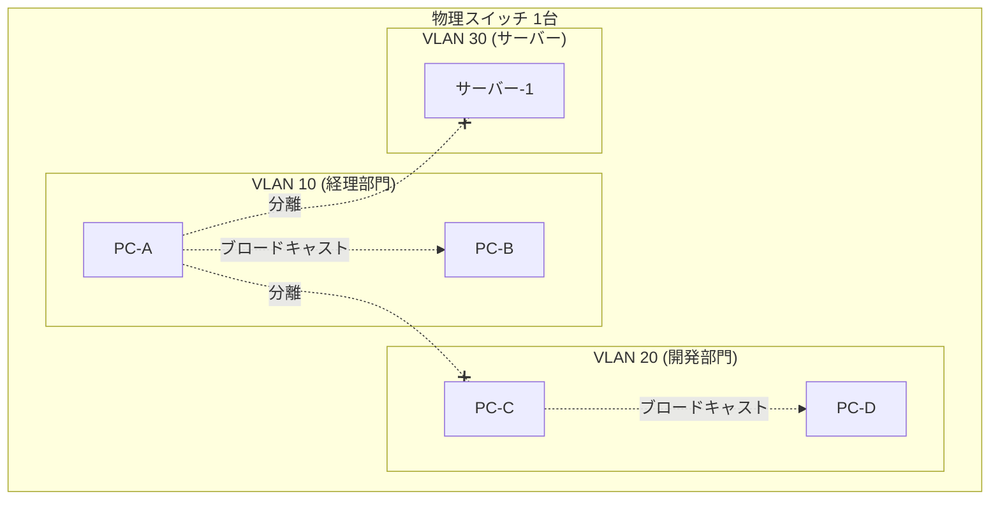

VLANの導入により、物理的な配線を変更することなく、ソフトウェア設定だけでネットワークの論理構造を変更できるようになった。

---

## 2. VLANの基本概念

### 2.1 VLAN識別子（VLAN ID）

各VLANは **VLAN ID（VID）** と呼ばれる数値で識別される。IEEE 802.1Qの仕様では、VLAN IDは **1〜4094** の範囲（12ビットフィールドで0と4095は予約済み）である。

| VLAN ID | 用途 |
|---------|------|
| 1 | デフォルトVLAN（多くのスイッチでポートのデフォルト所属） |
| 2〜1001 | ユーザー定義VLAN（通常利用域） |
| 1002〜1005 | 旧式プロトコル用予約（FDDI、Token Ring など） |
| 1006〜4094 | 拡張VLAN（一部スイッチのみ対応） |
| 4095 | 予約済み（使用不可） |

### 2.2 IEEE 802.1Q タグフォーマット

IEEE 802.1Q は、標準イーサネットフレームに **4バイトのVLANタグ**を挿入する仕様である。

```
[IEEE 802.1Q タグ付きイーサネットフレーム]

┌────────────┬────────────┬────────┬──────────────────┬───────────┬──────────┐
│ 宛先MAC    │ 送信元MAC  │ 802.1Q │ EtherType/Length │ ペイロード │   FCS   │
│  6バイト   │  6バイト   │ 4バイト│     2バイト      │  可変長   │  4バイト │
└────────────┴────────────┴────────┴──────────────────┴───────────┴──────────┘

802.1Q タグの内訳 (4バイト):
┌─────────────┬─────┬──────────────┐
│  TPID       │ PCP │  VLAN ID     │
│ 0x8100      │ 3bit│   12bit      │
│  2バイト    │     │              │
└─────────────┴─────┴──────────────┘

TPID: Tag Protocol Identifier (0x8100 で 802.1Q タグを示す)
PCP : Priority Code Point (CoS: Class of Service、QoS制御用、0〜7)
DEI : Drop Eligible Indicator (輻輳時の廃棄優先度)
VID : VLAN Identifier (12bit、0〜4095、実効範囲 1〜4094)
```

タグが挿入されることで、フレームの最大長は従来の1518バイトから1522バイトに増加する。これを考慮していない機器では **ベビージャイアント問題** が発生する場合がある。

### 2.3 ブロードキャストドメインの分離

VLANは独立したブロードキャストドメインとして機能する。同一VLAN内のホストに対してのみブロードキャストフレームが転送され、異なるVLANのホストへは転送されない。

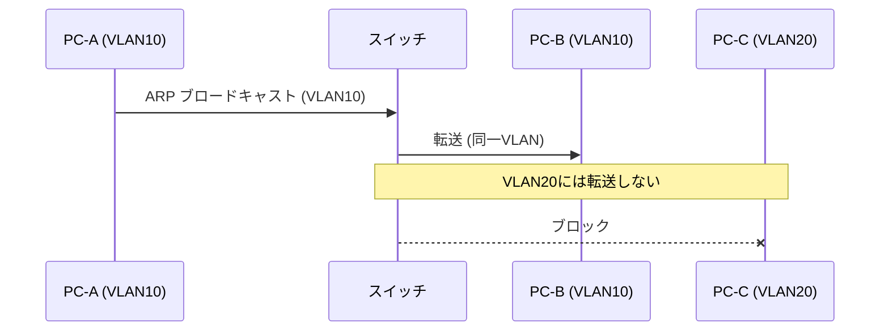

---

## 3. VLANの実装

### 3.1 ポートベースVLAN（アクセスポート）

最も基本的なVLAN実装は**ポートベースVLAN**である。スイッチの各物理ポートを特定のVLANに割り当てる。このポートを**アクセスポート（Access Port）**と呼ぶ。

アクセスポートに接続するエンドホスト（PC、サーバーなど）は通常802.1Qタグについて意識する必要がない。スイッチがポートからフレームを受信する際にVLAN IDを付与し、送信する際にタグを除去する。

```
[ポートベースVLAN設定例（Cisco IOS スタイル）]

Switch(config)# vlan 10
Switch(config-vlan)# name ACCOUNTING
Switch(config-vlan)# exit

Switch(config)# vlan 20
Switch(config-vlan)# name ENGINEERING
Switch(config-vlan)# exit

Switch(config)# interface GigabitEthernet0/1
Switch(config-if)# switchport mode access       ! Set port to access mode
Switch(config-if)# switchport access vlan 10    ! Assign to VLAN 10
Switch(config-if)# exit

Switch(config)# interface GigabitEthernet0/2
Switch(config-if)# switchport mode access
Switch(config-if)# switchport access vlan 20
```

### 3.2 トランクリンク（IEEE 802.1Q トランク）

複数のスイッチ間や、スイッチとルーター間で複数のVLANのトラフィックを伝送するためのリンクを**トランクリンク（Trunk Link）**と呼ぶ。トランクリンクでは802.1Qタグが付与されたフレームがそのまま転送される。

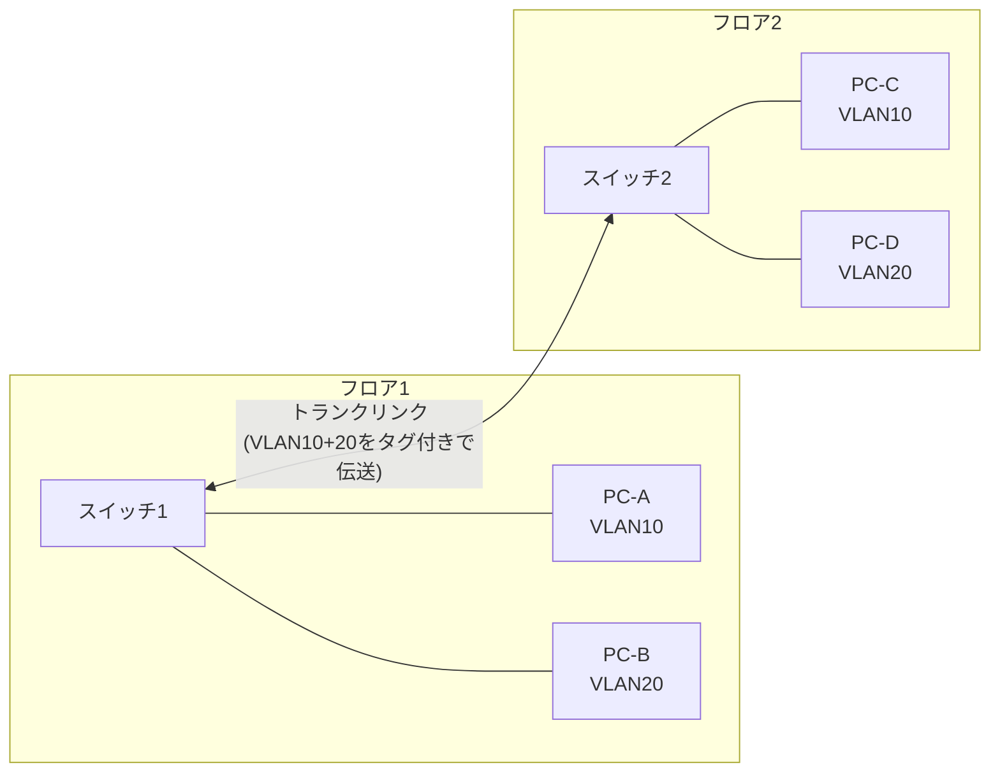

トランクポートの設定では、どのVLANを通過させるかを**許可VLANリスト（allowed VLAN list）**として定義する：

```
[トランクポート設定例]

Switch(config)# interface GigabitEthernet0/24
Switch(config-if)# switchport mode trunk              ! Set port to trunk mode
Switch(config-if)# switchport trunk encapsulation dot1q  ! Use IEEE 802.1Q
Switch(config-if)# switchport trunk allowed vlan 10,20,30  ! Allow specific VLANs
Switch(config-if)# switchport trunk native vlan 1     ! Native VLAN (untagged)
```

### 3.3 ネイティブVLAN

トランクリンクには**ネイティブVLAN（Native VLAN）**という概念が存在する。ネイティブVLANのフレームは802.1Qタグが付与されずにトランクリンクを通過する。デフォルトではVLAN 1がネイティブVLANとなっている。

> [!WARNING]
> ネイティブVLANの不一致はセキュリティリスクを生む。**VLAN Hopping攻撃**では、攻撃者がネイティブVLANを利用して別のVLANへのアクセスを試みる。ベストプラクティスとして、ネイティブVLANは使用しないVLAN（例：VLAN 999）に設定し、すべてのトラフィックをタグ付きにすることが推奨される。

### 3.4 DTP（Dynamic Trunking Protocol）

CiscoのDTP（Dynamic Trunking Protocol）は、スイッチポートのモード（アクセス/トランク）を自動ネゴシエーションするプロトコルである。便利な反面、セキュリティ上の懸念から、本番環境では**DTPを無効化**してポートモードを静的に設定することが推奨される：

```
Switch(config-if)# switchport nonegotiate  ! Disable DTP
```

### 3.5 VTP（VLAN Trunking Protocol）

VTP（VLAN Trunking Protocol）はCiscoが開発した独自プロトコルで、ドメイン内のスイッチ間でVLAN設定（作成・削除・名前変更）を自動的に伝播させる。

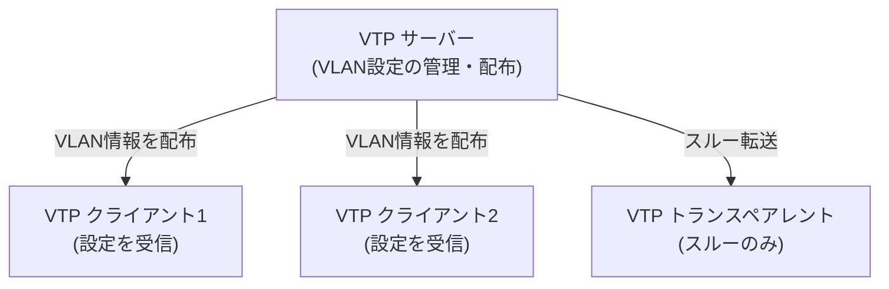

VTPはVLAN管理を一元化できる反面、誤設定による**VLANデータベースの全消去**などの事故が発生するリスクがある。大規模環境や混在ベンダー環境では、VTPを利用せず手動でVLANを設定することも多い。

---

## 4. VLAN間ルーティング

異なるVLANに属するホスト間の通信には、レイヤー3（ネットワーク層）でのルーティングが必要である。VLANはブロードキャストドメインを分離するが、通信自体を禁止するわけではなく、ルーターやレイヤー3スイッチを経由させることで制御する。

### 4.1 Router on a Stick（サブインターフェース方式）

最もシンプルなVLAN間ルーティングの実装が **Router on a Stick（ルーターオンアスティック）** と呼ばれる構成である。1本の物理リンクをトランクリンクとしてルーターに接続し、ルーター上でVLANごとのサブインターフェース（仮想インターフェース）を設定する。

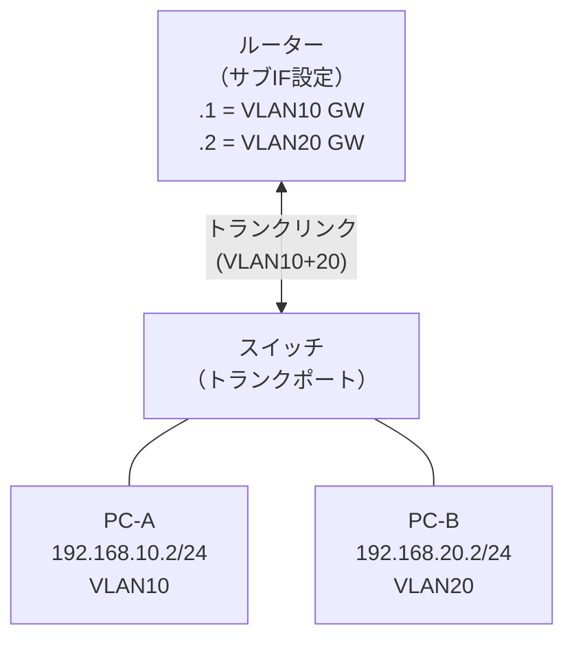

```
[ルーターのサブインターフェース設定例]

Router(config)# interface GigabitEthernet0/0.10
Router(config-subif)# encapsulation dot1q 10             ! Tag VLAN 10
Router(config-subif)# ip address 192.168.10.1 255.255.255.0  ! Default gateway for VLAN10
Router(config-subif)# exit

Router(config)# interface GigabitEthernet0/0.20
Router(config-subif)# encapsulation dot1q 20             ! Tag VLAN 20
Router(config-subif)# ip address 192.168.20.1 255.255.255.0  ! Default gateway for VLAN20
```

**Router on a Stick の特徴：**
- 少ないポート数でVLAN間ルーティングを実現（コスト効率が良い）
- ルーターの処理能力とリンク帯域幅がボトルネックになりやすい
- 小規模環境や実験的な構成に適している

### 4.2 レイヤー3スイッチ（SVIによるVLAN間ルーティング）

大規模環境では **レイヤー3スイッチ（マルチレイヤースイッチ）** が利用される。レイヤー3スイッチはハードウェアチップ（ASICなど）でルーティングを処理するため、ソフトウェアルーティングよりはるかに高いスループットを実現できる。

**SVI（Switched Virtual Interface）**：VLANに対応する仮想インターフェースをスイッチ上に作成し、IPアドレスを付与することでデフォルトゲートウェイとして機能させる。

```
[レイヤー3スイッチでのSVI設定例]

L3Switch(config)# ip routing              ! Enable IP routing

L3Switch(config)# vlan 10
L3Switch(config-vlan)# name VLAN10
L3Switch(config)# interface vlan 10
L3Switch(config-if)# ip address 192.168.10.1 255.255.255.0
L3Switch(config-if)# no shutdown

L3Switch(config)# vlan 20
L3Switch(config-vlan)# name VLAN20
L3Switch(config)# interface vlan 20
L3Switch(config-if)# ip address 192.168.20.1 255.255.255.0
L3Switch(config-if)# no shutdown
```

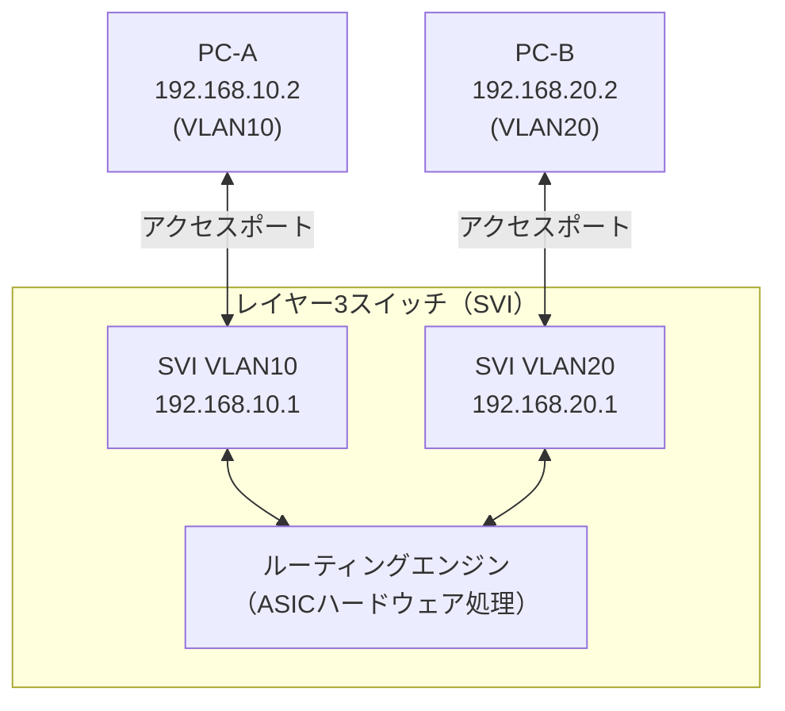

レイヤー3スイッチは **IP ルーティングとスイッチング機能を1台で提供**するため、物理的なルーターが不要となる。ただし、WAN接続や高度なルーティングポリシー（BGP、PBR など）が必要な場合は外部ルーターとの組み合わせが一般的である。

### 4.3 ACLによるVLAN間通信の制御

VLAN間ルーティングが有効になると、異なるVLAN間での通信が可能になる。セキュリティポリシーに基づいて通信を制限するには **ACL（Access Control List）** をSVIやルーターのインターフェースに適用する：

```
[VLAN間通信制御のACL例]

! Allow VLAN10 (ACCOUNTING) to access server VLAN30, block inter-dept access
Router(config)# ip access-list extended VLAN10_POLICY
Router(config-ext-nacl)# permit ip 192.168.10.0 0.0.0.255 192.168.30.0 0.0.0.255
Router(config-ext-nacl)# deny   ip 192.168.10.0 0.0.0.255 192.168.20.0 0.0.0.255
Router(config-ext-nacl)# permit ip any any

Router(config)# interface vlan 10
Router(config-if)# ip access-group VLAN10_POLICY in
```

---

## 5. ネットワークセグメンテーション戦略

### 5.1 セグメンテーションの目的と価値

ネットワークセグメンテーションは単にVLANを分割することではなく、以下の目的を達成するための**セキュリティ戦略**である：

- **侵害の封じ込め（Blast Radius の縮小）**：攻撃者が1つのセグメントを侵害しても、他のセグメントへの横断移動（ラテラルムーブメント）を制限する
- **規制コンプライアンス**：PCI DSS、HIPAA、GDPR などの規制でセグメンテーションが要求される
- **トラフィック最適化**：ブロードキャストトラフィックを限定し、ネットワーク効率を向上させる
- **管理の簡素化**：部門・機能・セキュリティ要件に基づいた論理的な構造化

### 5.2 セグメンテーション設計の考え方

典型的なエンタープライズネットワークでは以下のような機能別VLAN設計が行われる：

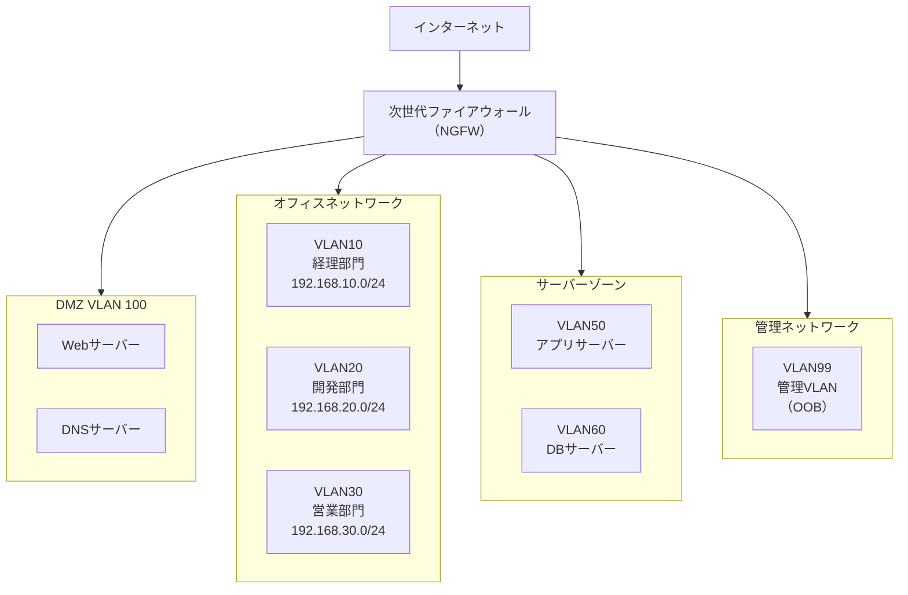

### 5.3 マイクロセグメンテーション

従来のVLANベースのセグメンテーションは**マクロセグメンテーション**（サブネット/VLAN単位での分離）と呼ばれる。これに対して、**マイクロセグメンテーション**はワークロード（仮想マシン、コンテナ、プロセス）レベルで細粒度のポリシーを適用する概念である。

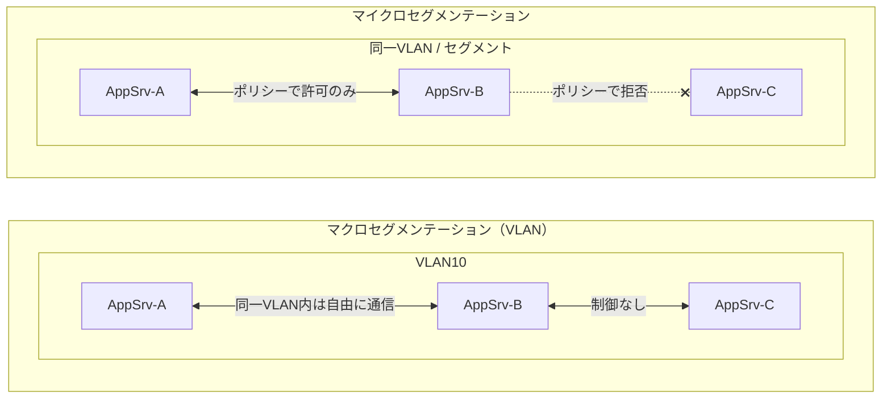

マイクロセグメンテーションは以下の技術で実装される：

| 技術 | 概要 |
|------|------|
| VMware NSX | ハイパーバイザーレベルのファイアウォール、東西トラフィック制御 |
| Cisco ACI | アプリケーション中心のポリシー、EPG（Endpoint Group）による論理分離 |
| AWS Security Groups | クラウドにおける仮想NICレベルのファイアウォール |
| Kubernetes Network Policy | Podレベルのネットワーク通信制御 |
| eBPF ベース（Cilium など）| Linuxカーネルでの高効率パケットフィルタリング |

### 5.4 ゼロトラストとの関係

**ゼロトラスト（Zero Trust）**は「ネットワーク境界の内側を信頼しない」という原則に基づくセキュリティモデルである。従来のネットワークセキュリティは「境界防御（Perimeter Defense）」に依存していたが、クラウドの普及、リモートワークの拡大、内部脅威の増加により、この前提が崩れた。

VLANとゼロトラストの関係：

```
[従来の境界防御モデル]
インターネット → ファイアウォール → 内部ネットワーク（信頼）

[ゼロトラストモデル]
すべての通信を検証・認証・認可
・ネットワークの位置（内部/外部）は信頼の根拠にならない
・ユーザー・デバイス・アプリケーション・データを継続的に検証
・最小権限の原則（Least Privilege）
・常時ログ・監視
```

VLANは依然としてネットワークセグメンテーションの基盤技術として有効であるが、ゼロトラスト環境では：

- VLAN による粗粒度の分離 + マイクロセグメンテーションによる細粒度の制御を組み合わせる
- VLAN に加えて **ID ベースのアクセス制御**（802.1X認証）を実装する
- ネットワーク内部の通信も暗号化・認証の対象とする（mTLS など）

### 5.5 802.1X によるポート認証

**IEEE 802.1X** は、ネットワークへの接続をデバイスの認証に基づいて制御するポートベースの認証フレームワークである。認証が成功したデバイスを適切なVLANに動的に割り当てる「**ダイナミックVLAN割り当て**」と組み合わせることで、物理ポートへの接続位置に依らないセキュリティポリシーを実現できる。

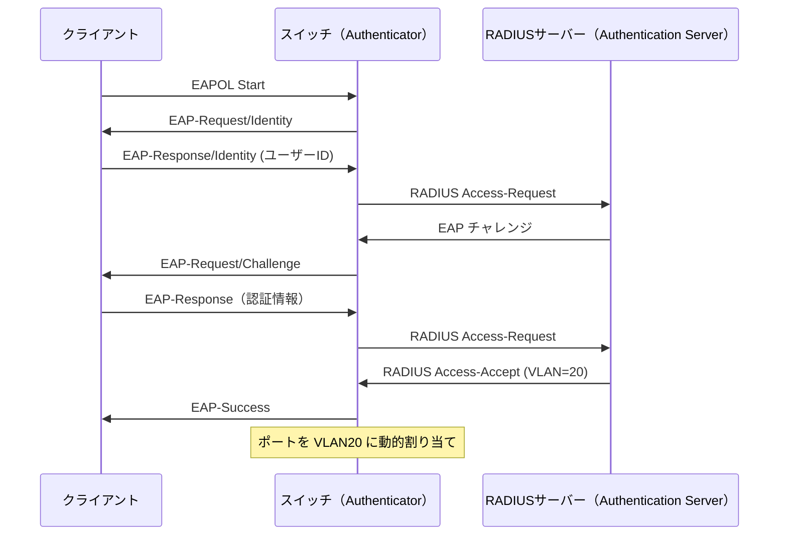

---

## 6. VLANの運用

### 6.1 設計ベストプラクティス

#### VLAN番号の設計

| 範囲 | 用途 |
|------|------|
| VLAN 1 | デフォルトVLAN（管理トラフィックに使用しない） |
| VLAN 10〜99 | 部門別ユーザーVLAN |
| VLAN 100〜199 | サーバーVLAN |
| VLAN 200〜299 | DMZ・非武装地帯 |
| VLAN 300〜399 | IP電話・音声VLAN |
| VLAN 900〜999 | 管理・監視・OOB |
| VLAN 999 | ブラックホールVLAN（未使用ポートの割り当て先） |

> [!TIP]
> **管理VLANはVLAN 1を使わない**。VLAN 1はデフォルトVLANであり、すべてのポートが初期状態で所属する。管理トラフィックに専用VLANを割り当て、VLAN 1は実質的に使用しないよう設計する。

#### トランクリンクの設計

- 必要なVLANのみ許可（`allowed vlan` で明示的に制限）
- ネイティブVLANを未使用VLANに変更してVLAN Hoppingを防止
- 物理的に使用していないトランクポートをシャットダウン

#### スパニングツリープロトコル（STP）との連携

VLANはSTPと密接に関連する。Cisco の **PVST+（Per VLAN Spanning Tree Plus）** では、VLANごとに独立したSTPインスタンスが動作する。VLANとSTPルートブリッジを適切に設計することで、負荷分散とループ防止を両立できる。

MST（Multiple Spanning Tree、IEEE 802.1s）では複数のVLANを1つのSTPインスタンスにマッピングすることで、PVST+よりも効率的な運用が可能となる。

### 6.2 トラブルシューティング

#### よくある問題と診断手順

**問題1：異なるスイッチ間で同一VLANのホストが通信できない**

```
診断手順：
1. トランクリンクの状態確認
   Switch# show interfaces trunk
   → トランクが確立されているか（Mode: trunk）
   → 対象VLANが "VLANs allowed and active in management domain" に含まれるか

2. VLANがアクティブか確認
   Switch# show vlan brief
   → 対象VLANが "active" 状態か

3. スパニングツリーの状態確認
   Switch# show spanning-tree vlan <VLAN-ID>
   → ポートが "FWD"（Forwarding）状態か
```

**問題2：VLAN間ルーティングが機能しない**

```
診断手順：
1. レイヤー3スイッチでIPルーティングが有効か
   L3Switch# show ip route
   → 各VLANのネットワークが Connected として表示されるか

2. SVIの状態確認
   L3Switch# show interface vlan 10
   → "Line protocol is up" か（対応する物理ポートがアクティブである必要がある）

3. ホストのデフォルトゲートウェイ確認
   → ホストのGWがSVIのIPアドレスに設定されているか
```

**問題3：VLANタグの不一致（ネイティブVLAN不一致）**

```
症状：CDP/STPログに "native VLAN mismatch" 警告
診断：
Switch# show interfaces trunk
→ "Native vlan" の列が両端で一致しているか確認

修正：
Switch(config-if)# switchport trunk native vlan 999  ! Set to consistent value
```

#### 重要な診断コマンド集

| コマンド | 目的 |
|---------|------|
| `show vlan brief` | VLAN一覧とポート割り当ての確認 |
| `show interfaces trunk` | トランクリンクの状態・許可VLAN確認 |
| `show spanning-tree vlan <ID>` | VLANごとのSTP状態確認 |
| `show mac address-table vlan <ID>` | VLANのMACアドレステーブル確認 |
| `show interfaces vlan <ID>` | SVIの状態・IPアドレス確認 |
| `show ip route` | ルーティングテーブルの確認 |
| `show dot1q-tunnel` | QinQトンネルの状態確認 |

---

## 7. プライベートVLAN と QinQ

### 7.1 プライベートVLAN（PVLAN）

**プライベートVLAN（Private VLAN、IEEE 802.10a / RFC 5517）**は、1つのVLANを「プライマリVLAN」と「セカンダリVLAN」に細分化し、同一VLANセグメント内でホスト間の通信を制御する技術である。主にデータセンターやホスティング環境で使用される。

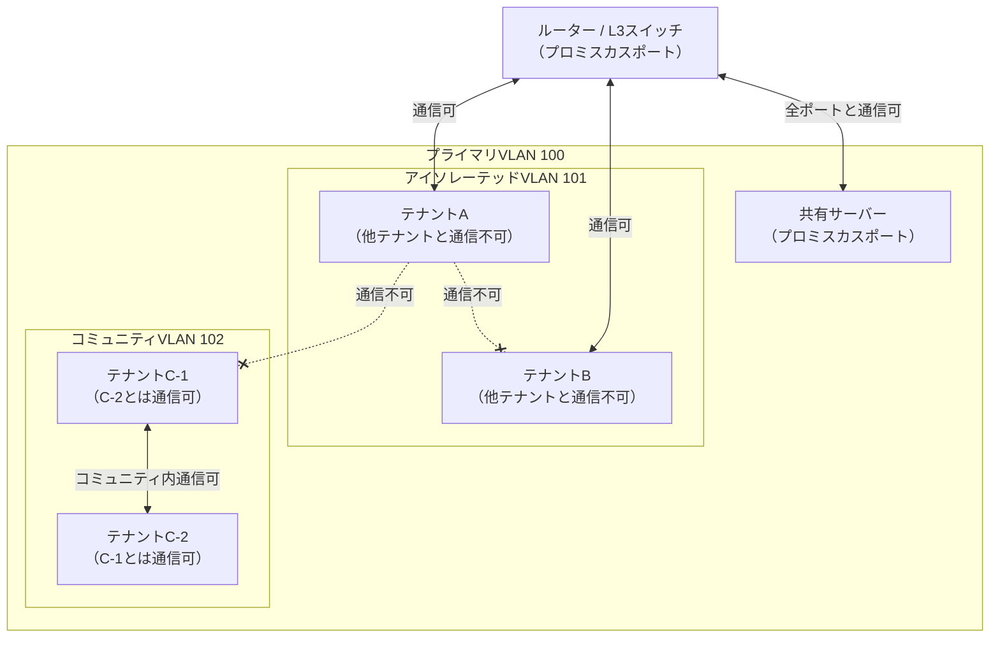

**PVLANのポート種別：**

| ポート種別 | 説明 |
|-----------|------|
| プロミスカスポート | プライマリVLAN内の全ポートと通信可能（ルーター/ゲートウェイ接続用） |
| アイソレーテッドポート | プロミスカスポートとのみ通信可。同一VLAN内の他アイソレーテッドポートとは通信不可 |
| コミュニティポート | 同一コミュニティVLAN内ポートおよびプロミスカスポートと通信可 |

PVLANにより、例えばクラウドホスティング環境において、顧客ごとのVMを論理的に分離しながら共有ゲートウェイへのアクセスは許可するという構成が実現できる。

### 7.2 QinQ（スタックドVLAN / IEEE 802.1ad）

**QinQ（802.1ad、Stacked VLAN）**は、VLANタグを二重にスタックする技術である。サービスプロバイダーが顧客のVLAN体系をそのまま維持しながら、プロバイダーのバックボーンネットワーク上で複数顧客のトラフィックを転送する際に使用される。

```
[QinQ フレーム構造]

┌────────┬────────┬──────────────────┬──────────────────┬────────────┬─────┐
│ 宛先MAC│送信元  │ 外部タグ（S-TAG）│ 内部タグ（C-TAG）│ペイロード  │ FCS │
│        │ MAC    │ TPID=0x88a8      │ TPID=0x8100      │            │     │
│        │        │ プロバイダーVLAN │ 顧客VLAN         │            │     │
└────────┴────────┴──────────────────┴──────────────────┴────────────┴─────┘

S-TAG: Service Tag（サービスプロバイダーが管理するVLAN）
C-TAG: Customer Tag（顧客が管理するVLAN、透過的に転送）
```

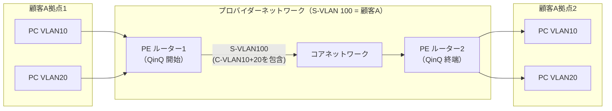

**QinQ のユースケース：**

- **イーサネット WAN サービス**（Metro Ethernet）：顧客のVLAN空間（1〜4094）をプロバイダーネットワーク上でそのまま提供
- **データセンター間接続**：複数DC間で同一VLAN番号のL2延伸を実現
- **キャリアグレードNAT環境でのVLAN分離**

QinQにより、プロバイダーは単一のVLAN ID空間（4094）で最大4094顧客をサポートでき、各顧客はそれぞれ最大4094のVLAN IDを自由に使用できる（理論上 4094 × 4094 ≒ 1,600万の論理チャネル）。

---

## 8. 将来の展望：VXLANとファブリックネットワーク

### 8.1 従来のVLANの限界

クラウドコンピューティングと大規模データセンターの時代において、従来のVLANは以下の限界に直面している：

| 課題 | 詳細 |
|------|------|
| **スケール制限** | VLAN ID は最大4094。大規模マルチテナントクラウドでは不足 |
| **STPの制約** | スパニングツリーがトポロジーの柔軟性を制限、ECMP（等コスト多経路）が困難 |
| **L2 Over L3 の困難さ** | IPルーティングネットワーク上でL2セグメントを延伸することが複雑 |
| **VMのライブマイグレーション** | 異なるラック・PoD間のVMライブマイグレーションでL2連続性が必要 |

### 8.2 VXLAN（Virtual eXtensible LAN）

**VXLAN（RFC 7348）**は、UDP/IPを使ってL2フレームをカプセル化し、L3ネットワーク上でL2セグメントを仮想的に構築するオーバーレイネットワーク技術である。

```
[VXLANカプセル化]

┌──────────────────────────────────────────────────────────────────────┐
│ 外部 UDP/IP ヘッダー                        VXLAN ヘッダー          │
│ 宛先IP: VTEP-B IP                           VNI: 10000             │
│ 宛先UDP: 4789 (IANA)                        (24bit = 1600万以上)    │
├──────────────────────────────────────────────────────────────────────┤
│ 内部 L2 フレーム（元のイーサネットフレーム）                         │
│ 宛先MAC, 送信元MAC, VLAN, ペイロード ...                             │
└──────────────────────────────────────────────────────────────────────┘
```

**VNI（VXLAN Network Identifier）**は24ビットのフィールドで、約1,600万の論理セグメントを表現できる（従来VLANの4094に対して大幅に拡張）。

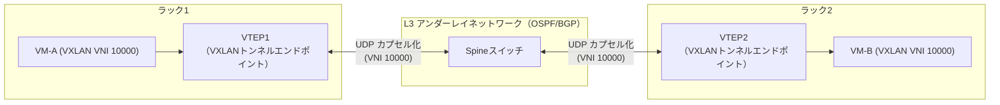

VXLANは、SDN（Software Defined Networking）コントローラーと組み合わせることで、大規模なマルチテナントネットワークを柔軟に管理できる。VMware NSX、OpenStack Neutron、AWS VPC など、主要なクラウドプラットフォームで広く採用されている。

### 8.3 EVPN（Ethernet VPN）

**EVPN（RFC 7432）**は、MP-BGP（マルチプロトコルBGP）を使ってVXLANのコントロールプレーンを構成する技術である。従来のVXLANはフラッディングとラーニングによるMACアドレス学習を行っていたが、EVPNを使うことでBGPによる分散型MACルーティングが可能となる。

**EVPN with VXLANのメリット：**
- ARP プロキシにより不要なブロードキャストを削減
- BGPによる障害検知と収束の高速化
- ループフリーな Active-Active マルチホーミング
- L2/L3の統合された経路制御

### 8.4 ファブリックネットワーク（Spine-Leaf アーキテクチャ）

現代のデータセンターネットワークでは**Spine-Leaf（スパイン・リーフ）アーキテクチャ**が標準的になっている。STPに依存するL2中心の3層モデル（コア・ディストリビューション・アクセス）に代わり、L3アンダーレイの上にVXLAN/EVPNオーバーレイを構成する。

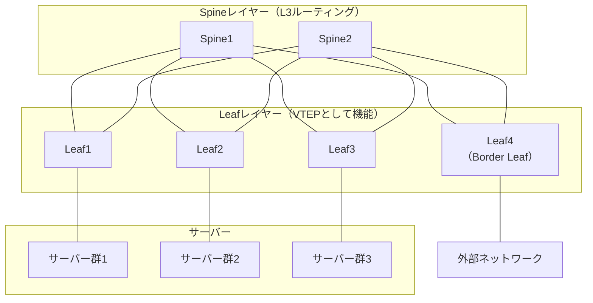

このアーキテクチャの特徴：
- **等距離（Equal Cost）**：すべてのLeaf-Spine間が同一ホップ数（2ホップ）
- **ECMP（等コスト多経路）**：複数のSpineを経由した負荷分散
- **スケールアウト可能**：SpineとLeafをそれぞれ独立して増設可能
- **STP 不要**：L3アンダーレイベースのためスパニングツリーに依存しない

### 8.5 SDN（Software Defined Networking）との統合

VLANやVXLANによるネットワークセグメンテーションは、**SDNコントローラー**による中央集権的な管理と組み合わせることで、さらなる柔軟性と自動化を実現できる。

代表的なSDNプラットフォームとVLAN/VXLANの統合：

| プラットフォーム | アプローチ |
|----------------|-----------|
| **VMware NSX-T** | 分散ファイアウォール + VXLAN/GENEVE オーバーレイ |
| **Cisco ACI** | APIC コントローラー + VXLAN アンダーレイ + EVPN |
| **OpenStack Neutron** | ML2プラグイン + VXLAN / VLAN ネットワーク |
| **Kubernetes CNI** | Calico, Cilium, Flannel などがVXLAN/BGPを活用 |

---

## まとめ

VLANはネットワークエンジニアリングにおける基礎技術であり、その概念と実装を深く理解することは、現代のネットワーク設計に不可欠である。

**VLANが解決した問題：**
- ブロードキャストドメインの分割による効率化
- 物理的配線変更なしのネットワーク再編成
- セキュリティポリシーの適用単位としての論理分離

**VLANの実装技術：**
- IEEE 802.1Q タギングによるフレーム識別
- アクセスポートとトランクポートによるVLAN転送
- VLAN間ルーティング（Router on a Stick / L3スイッチSVI）

**発展技術：**
- プライベートVLANによるサブセグメンテーション
- QinQによるVLAN空間の階層化
- VXLANによるL2 over L3の大規模スケールアウト
- EVPN/BGPによる分散型MACルーティング
- Spine-Leafアーキテクチャとの統合

現代のクラウドネイティブ環境では、物理的なVLANの制約を超えたVXLANやSDNが主流となりつつあるが、VLANはオンプレミスインフラ、WAN接続、ハイブリッドクラウド環境において依然として不可欠な技術であり続ける。また、ゼロトラストセキュリティモデルにおいても、VLANによるネットワークセグメンテーションは重要な防御の層として機能する。

VLANの本質は「**物理的なネットワークを論理的な境界で制御する**」というシンプルな思想にある。この思想はVXLANやマイクロセグメンテーションに引き継がれ、規模と柔軟性を増しながらも、その根底にあるコンセプトは変わっていない。

---

## 参考規格・資料

- **IEEE 802.1Q** - Bridges and Bridged Networks（VLANタギング標準）
- **IEEE 802.1ad** - Provider Bridges（QinQ標準）
- **IEEE 802.1X** - Port-Based Network Access Control
- **RFC 7348** - Virtual eXtensible Local Area Network (VXLAN)
- **RFC 7432** - BGP MPLS-Based Ethernet VPN（EVPN標準）
- **RFC 5517** - Cisco Systems' Private VLANs
- **IEEE 802.1s** - Multiple Spanning Trees（MSTP標準）
