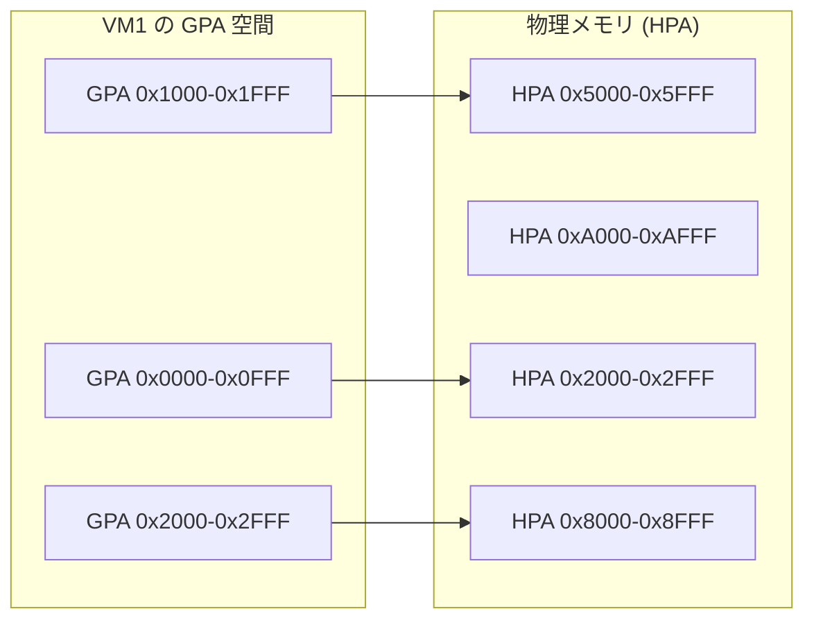
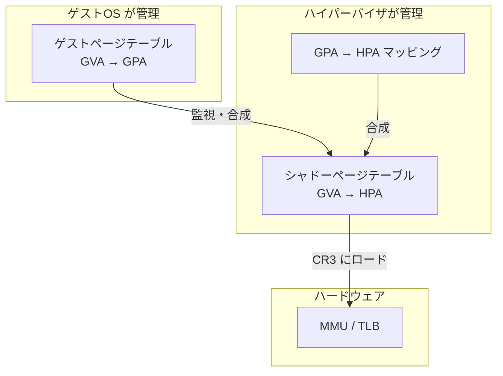
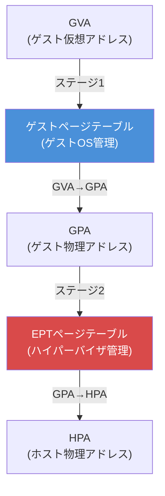
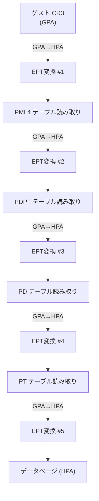
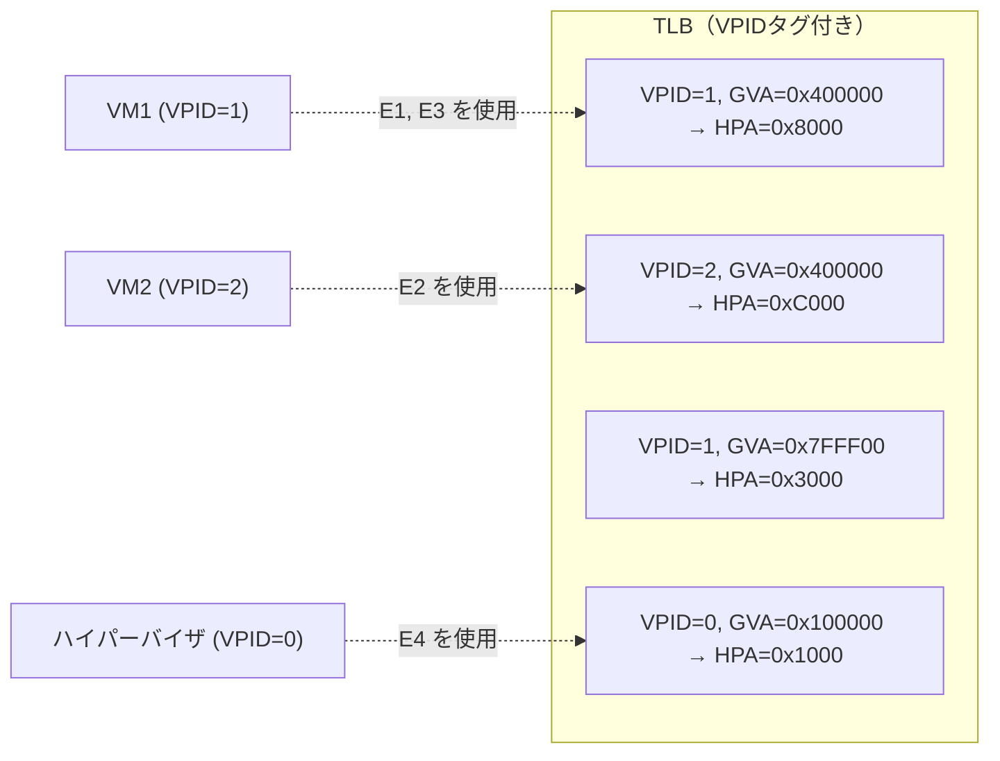
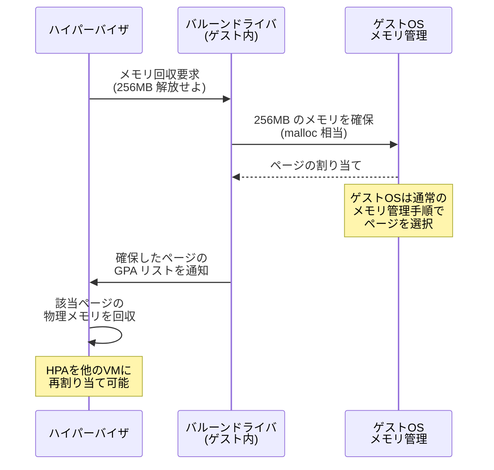
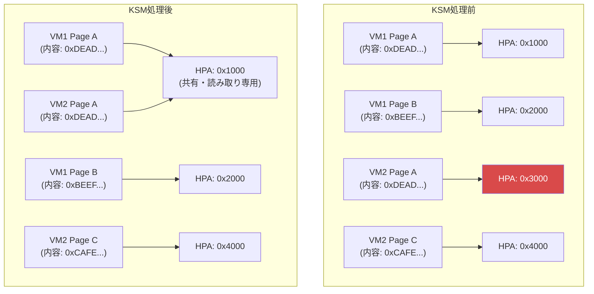
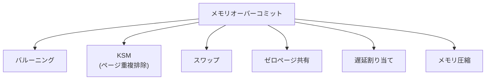
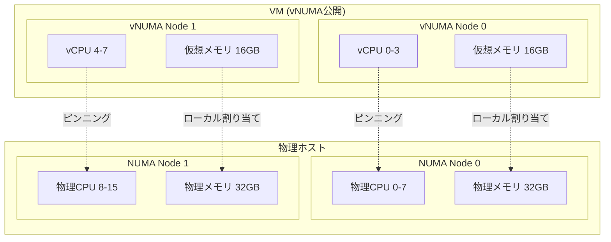
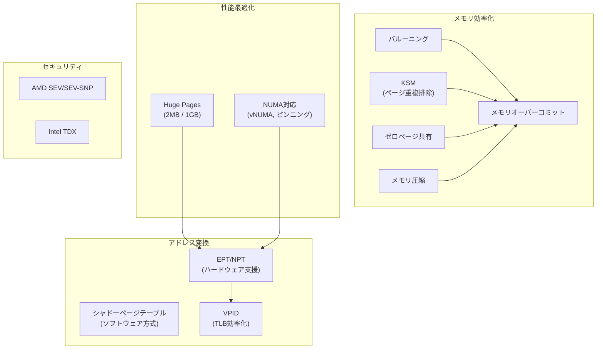

# 仮想マシンのメモリ管理

## 1. はじめに — 仮想化におけるメモリ管理の複雑性

物理マシン上のオペレーティングシステムは、仮想アドレスから物理アドレスへの変換というメモリ管理の基本機構を備えている。しかし仮想マシン（VM）を導入すると、この構造にもう一段階の抽象化レイヤーが加わる。ゲストOSは自分が物理メモリを直接管理していると信じているが、実際にはハイパーバイザ（VMM: Virtual Machine Monitor）が介在し、ゲストの「物理アドレス」を真の物理アドレスにマッピングしている。

この二重構造は以下のような根本的な課題をもたらす。

1. **アドレス変換の二段階化** — ゲスト仮想アドレス（GVA）からゲスト物理アドレス（GPA）、さらにホスト物理アドレス（HPA）への変換が必要
2. **メモリの効率的な配分** — 複数のVMに対して有限な物理メモリをどう割り当てるか
3. **メモリの共有と重複排除** — 同一内容のページを複数VMが保持する無駄をどう解消するか
4. **NUMAトポロジへの対応** — 物理メモリの局所性をVM内部にどう反映するか

本記事では、これらの課題に対するハードウェア・ソフトウェア両面からのアプローチを体系的に解説する。

```
+-----------------------------------------------------------+
|                    ゲストOS                                 |
|  アプリケーション → GVA → ゲストページテーブル → GPA         |
+-----------------------------------------------------------+
                            |
                            v
+-----------------------------------------------------------+
|                 ハイパーバイザ (VMM)                         |
|                GPA → HPA への変換                           |
|       (シャドーページテーブル or EPT/NPT)                    |
+-----------------------------------------------------------+
                            |
                            v
+-----------------------------------------------------------+
|                   物理メモリ (HPA)                          |
+-----------------------------------------------------------+
```

## 2. 仮想マシンのメモリアドレス変換 — 三層のアドレス空間

### 2.1 アドレス空間の階層構造

通常のOS環境では、仮想アドレス（VA）から物理アドレス（PA）への一段階の変換だけで済む。MMU（Memory Management Unit）がページテーブルを参照し、TLBを活用してこの変換を高速に行う。

仮想化環境では、アドレス空間が以下の三層構造になる。

| アドレス空間 | 略称 | 管理主体 | 説明 |
|:---|:---|:---|:---|
| ゲスト仮想アドレス | GVA (Guest Virtual Address) | ゲストOS | ゲスト内のプロセスが使用する仮想アドレス |
| ゲスト物理アドレス | GPA (Guest Physical Address) | ゲストOS / ハイパーバイザ | ゲストOSが「物理メモリ」と認識するアドレス |
| ホスト物理アドレス | HPA (Host Physical Address) | ハイパーバイザ / ハードウェア | 実際の物理RAM上のアドレス |

ゲストOS内部のプロセスがメモリアクセスを行う場合、GVA → GPA → HPA という二段階の変換が必要になる。この二段階変換をいかに効率的に実現するかが、仮想化メモリ管理の中核的な技術課題である。

### 2.2 GPA空間の構造

ハイパーバイザは各VMに対してGPA空間を割り当てる。このGPA空間は、ゲストOSから見ると連続した物理メモリのように見えるが、実際のHPA上では不連続に配置されている場合がほとんどである。



このマッピングは、ハイパーバイザが内部的に管理するデータ構造（EPTやシャドーページテーブル）によって維持される。

## 3. シャドーページテーブル — ソフトウェアによるアドレス変換

### 3.1 基本概念

EPT（Extended Page Tables）のようなハードウェア支援が存在しなかった時代、ハイパーバイザはソフトウェアの工夫だけで二段階のアドレス変換を実現する必要があった。その手法が**シャドーページテーブル（Shadow Page Table）** である。

シャドーページテーブルの基本的なアイデアは、ゲストOSが管理するページテーブル（GVA → GPA のマッピング）を監視し、それとGPA → HPA のマッピングを合成した**ダイレクトマッピング（GVA → HPA）** のページテーブルを別途作成・維持するというものである。ハードウェアMMUに実際にロードされるのはこのシャドーページテーブルであり、ゲストOS自身が作成したページテーブルは直接MMUには使われない。



### 3.2 動作メカニズム

シャドーページテーブルの動作を段階的に説明する。

**ステップ1：初期化**

ゲストOSが新しいプロセスを作成し、ページテーブルを構築する。ハイパーバイザはこれを検知し、対応するシャドーページテーブルを空の状態で作成する。ゲストOSが `CR3` レジスタ（ページテーブルのベースアドレスを保持するレジスタ）に書き込もうとすると、ハイパーバイザはこの操作をトラップし、代わりにシャドーページテーブルのアドレスを `CR3` にセットする。

**ステップ2：ページフォルトの処理**

ゲスト内のプロセスがメモリアクセスを行うと、最初はシャドーページテーブルにエントリが存在しないため、ページフォルトが発生する。このページフォルトはハイパーバイザにトラップされ、以下の手順で処理される。

1. ゲストのページテーブルを参照し、GVA → GPA のマッピングを取得する
2. GPA → HPA のマッピング（ハイパーバイザが保持する情報）を参照する
3. GVA → HPA のエントリをシャドーページテーブルに書き込む
4. ゲストに制御を戻す

**ステップ3：ゲストページテーブルの変更追跡**

ゲストOSがページテーブルを変更した場合（ページのマッピング追加、削除、権限変更など）、シャドーページテーブルも同期的に更新する必要がある。ハイパーバイザはゲストのページテーブルが格納されているメモリページを書き込み禁止に設定し、変更が行われた際にページフォルトを発生させてトラップする。これを**ライトプロテクション（Write Protection）** と呼ぶ。

### 3.3 シャドーページテーブルの問題点

シャドーページテーブルには以下の深刻な問題がある。

**1. VM Exit の頻発**

ゲストOSがページテーブルを変更するたびにハイパーバイザへのトラップ（VM Exit）が発生する。Linux カーネルのようなモダンOSでは、コンテキストスイッチのたびに `CR3` の書き換えが行われ、さらにページフォルトハンドリングやメモリマッピング操作でページテーブルが頻繁に更新される。VM Exit のコストは数百〜数千サイクルに及ぶため、これが重大なパフォーマンスボトルネックとなる。

**2. メモリオーバーヘッド**

ゲストOS内のプロセスごとにシャドーページテーブルを維持する必要があるため、メモリ消費が大きい。ゲスト内で多数のプロセスが動作している場合、シャドーページテーブルのためだけで数十MBのメモリを消費することもある。

**3. 実装の複雑性**

ゲストOSのページテーブル操作をすべて監視し、シャドーページテーブルとの一貫性を維持するコードは非常に複雑である。特にゲストOSがTLBフラッシュ、大規模ページ（Huge Pages）、ネストされたページテーブル変更などの操作を行う場合、あらゆるケースを正確に処理しなければならない。

### 3.4 最適化手法

シャドーページテーブルの性能問題を軽減するために、いくつかの最適化が考案された。

- **シャドーページテーブルのキャッシュ**: コンテキストスイッチ時にシャドーページテーブルを破棄せず、プロセスのアドレス空間ごとにキャッシュする。これにより `CR3` の書き換え時のコストを大幅に削減できる
- **バッチ処理**: 複数のページテーブル変更をまとめて処理することで、VM Exit の回数を減らす
- **遅延更新（Lazy Synchronization）**: ゲストページテーブルの変更を即座にシャドーページテーブルに反映せず、実際にアクセスが発生したときに更新する

しかし、これらの最適化をもってしても、根本的なオーバーヘッドを解消することはできなかった。この問題を根本から解決するのが、次節で説明するハードウェア支援によるアドレス変換（EPT/NPT）である。

## 4. EPT/NPT — ハードウェア支援による二段階アドレス変換

### 4.1 ハードウェア支援の登場

2008年前後、Intel と AMD はそれぞれ仮想化向けのハードウェア拡張を導入した。

| ベンダ | 名称 | 導入時期 | 対応CPU |
|:---|:---|:---|:---|
| Intel | EPT (Extended Page Tables) | 2008年 | Nehalem 以降 |
| AMD | NPT (Nested Page Tables) / RVI (Rapid Virtualization Indexing) | 2008年 | Barcelona 以降 |

両者は実装の詳細は異なるが、基本的な考え方は同一である。以下ではIntelのEPTを中心に解説するが、AMDのNPTもアーキテクチャ的にはほぼ同等である。

### 4.2 EPTの基本原理

EPTの核心は、**ハードウェアMMU自体が二段階のアドレス変換を直接サポートする**という点にある。シャドーページテーブルのようにソフトウェアで二つのマッピングを合成する代わりに、CPUが以下の二つのページテーブルを同時に参照する。

1. **ゲストページテーブル**: GVA → GPA の変換（ゲストOSが管理）
2. **EPTページテーブル**: GPA → HPA の変換（ハイパーバイザが管理）



ゲストOSはページテーブルを自由に操作できる。`CR3` の書き換えもページテーブルエントリの変更もVM Exitを引き起こさない（EPT自体の設定変更でない限り）。ハイパーバイザはEPTページテーブルのみを管理すればよく、ゲストOSのページテーブル操作に一切介入する必要がない。

### 4.3 EPTのページウォーク詳細

EPTが有効な状態で GVA を HPA に解決する過程は、通常のページウォークよりもかなり複雑である。4段階のx86-64ページテーブル構造を前提とすると、以下のようなステップになる。

**ゲストページウォークの各段階でEPT変換が必要**

ゲストページテーブルのウォークでは、PML4 → PDPT → PD → PT と4段階のテーブルを辿る。しかし、これらのテーブル自体がGPA空間に配置されているため、各テーブルのアドレスをHPAに変換する必要がある。さらに、最終的に得られるGPA（データページのアドレス）もHPAに変換しなければならない。



各EPT変換自体も4段階のページウォーク（EPT PML4 → EPT PDPT → EPT PD → EPT PT）を必要とする。したがって、TLBミスが完全に発生した最悪のケースでは以下のメモリアクセスが必要になる。

- ゲストページテーブルの4段階 × 各段階でのEPT変換（4回のメモリアクセス） + 最終データページのEPT変換
- 合計: $4 \times 4 + 4 + 4 = 24$ 回のメモリアクセス

::: tip EPTページウォークのメモリアクセス回数
正確に計算すると、ゲスト CR3 の EPT 変換（4回）+ PML4 読み取り（1回）+ PML4 エントリの GPA を EPT 変換（4回）+ PDPT 読み取り（1回）+ ... という形で、最大 **24回** のメモリアクセスが必要になる。シャドーページテーブル方式では通常のページウォーク同様4回で済むため、TLBミス時のペナルティは大幅に増加する。
:::

### 4.4 EPTのページテーブル構造

EPTのページテーブルエントリは、通常のx86-64ページテーブルエントリと似た構造を持つが、仮想化に特化したフィールドが追加されている。

```
EPT PTE (64ビット):
+---+---+---+---+---+---+---+---+---+---+---+-------+---+---+---+
|63 |62 |...| N |...|12 |11 |...|8  | 7 | 6 | 5 | 4 | 3 | 2 | 1 | 0 |
+---+---+---+---+---+---+---+---+---+---+---+-------+---+---+---+
| Suppress| Physical Address      |IGN| D | A |Rsvd |MT | X | W | R |
| #VE     | (bits N-1:12)         |   |   |   |     |   |   |   |   |
+---+---+---+---+---+---+---+---+---+---+---+-------+---+---+---+

R: Read access (読み取り許可)
W: Write access (書き込み許可)
X: Execute access (実行許可)
MT: Memory Type (メモリタイプ, EPT PAT に対応)
A: Accessed (アクセス済みフラグ)
D: Dirty (書き込み済みフラグ)
```

EPTエントリは読み取り・書き込み・実行の各権限を独立して制御できる。これにより、ハイパーバイザはきめ細かなメモリアクセス制御を実現できる。例えば、実行のみ許可する（読み取り・書き込み禁止）設定が可能であり、これはセキュリティ機能（ゲスト内のコード領域の保護）に活用される。

### 4.5 EPT Violation と EPT Misconfiguration

EPTページウォーク中に問題が発生した場合、以下の二種類の例外が生じる。

**EPT Violation**

アクセス権限違反が検出された場合に発生する。例えば、読み取り専用に設定されたEPTエントリに対して書き込みが試みられた場合などである。EPT Violation はVM Exitを引き起こし、ハイパーバイザが処理する。

ハイパーバイザはEPT Violationを以下のような用途に活用する。

- **遅延メモリ割り当て**: 最初はEPTエントリを無効にしておき、実際にアクセスされたときに物理ページを割り当てる
- **Copy-on-Write**: 書き込みが行われたタイミングでページのコピーを作成する
- **メモリのスワップアウト検知**: スワップアウトされたページへのアクセスを検知し、ページをスワップインする

**EPT Misconfiguration**

EPTエントリの設定値が不正な場合に発生する。例えば、書き込みまたは実行は許可されているが読み取りが禁止されているエントリ（Intel の仕様上不正）など。これは通常、ハイパーバイザのバグを示す。

### 4.6 VPID — TLBの効率化

EPTだけでは、VM Entry/Exit のたびにTLB全体をフラッシュする必要がある。異なるVMのTLBエントリが混在すると、誤ったアドレス変換が行われてしまうためである。

**VPID（Virtual Processor Identifier）** は、この問題を解決するための機構である。VPIDは各仮想プロセッサに固有の識別子を割り当て、TLBエントリにこの識別子をタグ付けする。これにより、VM切り替え時にTLBをフラッシュせずに済む。ハードウェアはTLBルックアップ時にVPIDも照合するため、異なるVMのTLBエントリが誤って使用されることはない。



VPIDとEPTの組み合わせにより、VM切り替え時のTLBフラッシュが不要になり、仮想化環境でのメモリアクセス性能が大幅に改善される。

## 5. 二段階アドレス変換のオーバーヘッドと最適化

### 5.1 TLBミスペナルティの分析

前述のとおり、EPTを使用した場合のTLBミスペナルティは最大24回のメモリアクセスに及ぶ。これは非仮想化環境の4回と比較して6倍のコストである。

実際のワークロードにおけるオーバーヘッドは、TLBミス率に大きく依存する。TLBミス率が低いワークロード（データの局所性が高い場合）ではEPTのオーバーヘッドは限定的だが、TLBミス率が高いワークロード（大量のメモリをランダムにアクセスする場合）では深刻な性能低下を引き起こす。

| ワークロード特性 | TLBミス率 | EPTオーバーヘッド |
|:---|:---|:---|
| 局所性の高い計算処理 | 低い | 1〜3% |
| データベースのランダムアクセス | 中程度 | 5〜15% |
| 大規模インメモリ処理 | 高い | 15〜30%以上 |

### 5.2 EPTオーバーヘッドの軽減策

**1. 大規模ページ（Huge Pages）の活用**

EPTでも2MBや1GBの大規模ページをサポートしている。大規模ページを使用すると、ページテーブルの階層が減少するため、ページウォーク時のメモリアクセス回数が削減される。例えば、ゲストとEPTの両方で2MBページを使用すると、最悪時のメモリアクセスは $3 \times 3 + 3 + 3 = 15$ 回に削減される（4段階が3段階になるため）。

**2. EPT A/Dビットの活用**

EPTエントリのAccessed/Dirty ビットにより、ハイパーバイザはどのページがアクセスされたか、書き込みが行われたかを効率的に追跡できる。これがない場合、ハイパーバイザはEPTエントリの権限を操作してEPT Violationで追跡する必要があり、追加のVM Exitが発生する。

**3. ページウォークキャッシュ**

モダンなCPUは、ページウォークの中間結果をキャッシュする**ページウォークキャッシュ（Page Walk Cache / Paging Structure Cache）** を備えている。EPT環境でもこのキャッシュが活用されるため、実際のメモリアクセス回数は最悪ケースよりもかなり少なくなることが多い。

### 5.3 シャドーページテーブルとEPTの比較

| 観点 | シャドーページテーブル | EPT/NPT |
|:---|:---|:---|
| TLBミスのコスト | 低い（通常のページウォーク） | 高い（最大24回のメモリアクセス） |
| VM Exit 頻度 | 高い（ゲストのPT操作ごと） | 低い（EPT Violation時のみ） |
| メモリ消費 | 大きい（プロセスごとにシャドーPT） | 小さい（VMごとにEPTのみ） |
| 実装の複雑性 | 非常に高い | 低い |
| 総合性能（一般的なワークロード） | EPTに劣る場合が多い | 優れている |

現代の仮想化環境ではほぼ全面的にEPT/NPTが使用されている。シャドーページテーブルが有利になるのは、極めてTLBミス率が高く、かつゲストOSのページテーブル操作が少ないという特殊なケースに限られる。

## 6. バルーニング — ゲストOSとの協調によるメモリ回収

### 6.1 メモリ回収の課題

ハイパーバイザは複数のVMにメモリを割り当てるが、各VMが実際に使用しているメモリ量は時間とともに変動する。あるVMがメモリを大量に消費し始めた場合、他のVMからメモリを回収して再配分したい。しかし、ここに根本的な問題がある。

ハイパーバイザはゲストOSの内部状態を知らない。どのページがゲストOS内で実際に使用されていて、どのページが空いているのかを外部から判断することは極めて困難である。ゲストOSが「使用中」としているページを強制的に回収すると、ゲストOSがクラッシュする可能性がある。

### 6.2 バルーニングの基本メカニズム

**バルーニング（Memory Ballooning）** は、この問題を解決するためにゲストOS内部にエージェント（バルーンドライバ）を導入する手法である。VMware が最初に実用化し、現在ではKVM（`virtio-balloon`）、Hyper-V、Xen など主要なハイパーバイザすべてがサポートしている。



**膨張（Inflate）** の流れ:

1. ハイパーバイザがメモリ不足を検知し、バルーンドライバに目標サイズを通知する
2. バルーンドライバはゲストOS内部で通常のメモリ割り当て機能を使用してページを確保する（「バルーンを膨らませる」）
3. ゲストOSの通常のメモリ管理ロジック（LRUベースのページ回収など）に従ってページが選ばれるため、重要度の低いページから回収される
4. バルーンドライバは確保したページのGPAリストをハイパーバイザに通知する
5. ハイパーバイザは対応するHPAの物理ページを回収し、他のVMに割り当てる

**収縮（Deflate）** の流れ:

1. ハイパーバイザがメモリに余裕ができたと判断する
2. バルーンドライバに目標サイズの縮小を通知する
3. バルーンドライバは確保していたページを解放する（「バルーンをしぼませる」）
4. ゲストOS内部でページが再利用可能になる

### 6.3 バルーニングの利点と限界

**利点:**

- ゲストOSのメモリ管理機能を活用するため、重要度の高いページ（頻繁にアクセスされるページやカーネルのデータ構造）ではなく、重要度の低いページ（キャッシュページやほとんどアクセスされないページ）が優先的に回収される
- ゲストOSは回収されたメモリの代わりにスワップを使用できるため、緩やかなメモリ不足に対応できる
- 双方向に調整可能であり、メモリの動的な再配分が柔軟に行える

**限界:**

- バルーンドライバのインストールが必要であり、ゲストOSの協力が前提
- 回収の速度はゲストOS内部のメモリ管理に依存し、即座に大量のメモリを回収できるとは限らない
- ゲストOS自体がメモリを大量に消費している場合、バルーンを膨らませるとゲストOSのスワップが激しくなり、性能が大幅に低下する（スワップストーム）
- バルーンドライバが応答しなくなった場合（ゲストOSがハングした場合など）、メモリを回収する手段がなくなる

### 6.4 Free Page Hinting — バルーニングの拡張

バルーニングの応用として、**Free Page Hinting（Free Page Reporting）** という手法がある。ゲストOSが未使用ページの情報をハイパーバイザに積極的に通知する仕組みである。Linux カーネル5.6以降では `virtio-balloon` ドライバに Free Page Reporting 機能が統合されている。

バルーニングとの違いは、ゲストOSがページを「確保」するのではなく、空きページの存在を「通知」するだけという点である。ゲストOSのメモリ管理に負荷をかけることなく、ハイパーバイザが不要なページを効率的に把握できる。

## 7. KSM — Kernel Same-page Merging

### 7.1 メモリ重複の問題

同一のハイパーバイザ上で複数のVMが同じOSイメージ（例えばすべてUbuntu 22.04）を実行している場合、カーネルコード、共有ライブラリ、ゼロページなど、内容が同一のメモリページが多数存在する。これは物理メモリの大きな無駄である。

### 7.2 KSMの動作原理

**KSM（Kernel Same-page Merging）** は、Linuxカーネルに実装されたメモリ重複排除機能である。元々はKVM仮想化環境向けに開発されたが、同一ホスト上の通常プロセス間でも利用できる。



KSMの動作は以下のステップで行われる。

**1. スキャン**

KSMデーモン（`ksmd`）は、`madvise(MADV_MERGEABLE)` でマークされたメモリ領域を定期的にスキャンする。KVMでは、ゲストメモリとして割り当てた領域がデフォルトでこのマークを持つ。

**2. ハッシュ比較**

各ページの内容をハッシュ化し、同一内容のページを検出する。KSMは内部的に**安定ツリー（Stable Tree）** と**不安定ツリー（Unstable Tree）** という2つの赤黒木を使用する。

- **安定ツリー**: すでにマージ済みの共有ページを管理する。長期間変更されないページがここに入る
- **不安定ツリー**: まだマージされていないが、マージ候補のページを管理する。スキャンのたびに再構築される

**3. マージ**

同一内容のページが見つかった場合、一方のページのみを残し、もう一方のページテーブルエントリを共有ページを指すように変更する。共有ページは**読み取り専用**に設定され、**Copy-on-Write（CoW）** のセマンティクスが適用される。

**4. Copy-on-Write による分離**

いずれかのVMが共有ページに書き込みを行うと、ページフォルトが発生し、書き込み側にはページのコピーが割り当てられる。これにより、VMの分離性は完全に維持される。

### 7.3 KSMの設定パラメータ

KSMの動作は `/sys/kernel/mm/ksm/` 以下のパラメータで制御する。

```bash
# Enable KSM
echo 1 > /sys/kernel/mm/ksm/run

# Number of pages to scan per sleep cycle
echo 200 > /sys/kernel/mm/ksm/pages_to_scan

# Milliseconds to sleep between scan cycles
echo 20 > /sys/kernel/mm/ksm/sleep_millisecs
```

`pages_to_scan` と `sleep_millisecs` のバランスが重要である。スキャン頻度を上げるとマージの検出が速くなるが、CPU負荷が増大する。

### 7.4 KSMの利点とリスク

**利点:**

- 同一OS・同一アプリケーションのVMが多数存在する環境（VDI: Virtual Desktop Infrastructure など）で大幅なメモリ節約が可能
- 実測例では、100台の同一WindowsデスクトップVMで50%以上のメモリ削減が報告されている
- ゲストOSの変更不要（ハイパーバイザ側の機能のみ）

**リスク:**

- **セキュリティリスク（サイドチャネル攻撃）**: KSMを悪用したサイドチャネル攻撃が知られている。攻撃者は特定のメモリ内容をもつページを作成し、CoWの発生タイミング（書き込み時のレイテンシ差）を計測することで、他のVMが特定のデータを保持しているかを推測できる。この攻撃を防ぐため、セキュリティが重視される環境ではKSMを無効にすることが推奨される場合がある
- **CPU負荷**: ページスキャンとハッシュ計算はCPUリソースを消費する。大量のメモリを持つホストではスキャン完了までに長時間を要する
- **CoWのレイテンシスパイク**: マージされたページへの書き込み時にCoWが発生し、一時的なレイテンシ増加を引き起こす可能性がある

## 8. メモリオーバーコミット

### 8.1 オーバーコミットとは

**メモリオーバーコミット**とは、ホストの物理メモリ総量を超える量のメモリを複数のVMに合計で割り当てることである。例えば、64GBの物理メモリを持つホストで、各16GBのメモリを割り当てた5台のVM（合計80GB）を稼働させるような構成がオーバーコミットにあたる。

これが成立する根拠は、すべてのVMが同時に割り当てられたメモリの全量を使い切ることは稀だという統計的な観察に基づいている。銀行の預金と同じ原理（部分準備制度）であり、すべての預金者が同時に全額を引き出すことは通常起こらないという前提に立っている。

### 8.2 オーバーコミットを支える技術

メモリオーバーコミットは、単一の技術ではなく、複数の技術の組み合わせによって実現される。



**遅延割り当て（Lazy Allocation / Demand Paging）**

ゲストVMに16GBのメモリを割り当てると宣言しても、最初から16GB分の物理メモリを確保するわけではない。EPTエントリを最初は無効にしておき、ゲストが実際にアクセスしたときに初めて物理ページを割り当てる。これにより、実際に使用されるメモリのみが物理メモリを消費する。

**ゼロページ共有**

ゲストOSが起動直後にメモリをゼロクリアする（多くのOSがセキュリティ上の理由でこれを行う）と、大量のゼロページが生成される。KSMまたは専用の最適化により、これらはすべて同一のゼロ物理ページを指すようにマッピングされる。

**メモリ圧縮**

スワップに書き出す代わりに、メモリ内容を圧縮して保持する手法。Linuxの `zswap` やVMwareの `vmmemctl` がこの機能を提供する。圧縮・展開のCPUコストはディスクI/Oよりも遙かに小さいため、スワップよりも高速にメモリを回収できる。

### 8.3 オーバーコミット時のメモリ回収優先順位

VMwareのESXiでは、メモリ不足の深刻度に応じて段階的に回収手法を使い分ける。

| 段階 | メモリ状態 | 回収手法 | 性能影響 |
|:---|:---|:---|:---|
| 1 | 余裕あり | Transparent Page Sharing (KSM相当) | ほぼなし |
| 2 | やや不足 | バルーニング | 低〜中 |
| 3 | 不足 | メモリ圧縮 | 中 |
| 4 | 深刻な不足 | ホストスワップ | 深刻 |

ホストスワップ（ハイパーバイザがゲストのメモリページをディスクにスワップアウトする）は最終手段であり、性能に壊滅的な影響を与える。バルーニングを通じてゲストOSにスワップさせる方が、ゲストOS自身の判断で重要度の低いページをスワップアウトするため、結果としてはるかに効率的である。

::: warning オーバーコミットのリスク
すべてのVMが同時にメモリを大量消費する状況（いわゆるランモデルの破綻）が発生すると、ホストスワップが大量に発生し、全VMの性能が壊滅的に低下する。最悪の場合、OOM Killer がVMプロセスを強制終了させる。本番環境では、オーバーコミット比率を慎重に管理し、適切な監視とアラートを設定する必要がある。
:::

### 8.4 オーバーコミット比率の設計指針

オーバーコミット比率の適正値はワークロードに大きく依存する。

- **VDI環境（仮想デスクトップ）**: KSMの効果が高く、1.5〜2.0倍程度のオーバーコミットが実用的
- **Webサーバー群**: メモリ使用パターンが比較的予測可能であり、1.2〜1.5倍が一般的
- **データベースサーバー**: メモリの局所性が重要であり、オーバーコミットは推奨されない（1.0倍以下）
- **リアルタイム処理**: レイテンシの予測可能性が求められるため、オーバーコミットは禁忌

## 9. NUMA対応 — 物理メモリの局所性を仮想化環境に反映する

### 9.1 NUMAアーキテクチャの概要

現代のマルチソケットサーバーは**NUMA（Non-Uniform Memory Access）** アーキテクチャを採用している。各CPUソケットには「ローカルメモリ」が接続されており、ローカルメモリへのアクセスは高速だが、他のソケットに接続されたリモートメモリへのアクセスは相対的に遅い（インターコネクト経由のためレイテンシが増加する）。

```
+-------------------+          +-------------------+
| CPU Socket 0      |          | CPU Socket 1      |
|  +-----------+    |   QPI/   |    +-----------+  |
|  | コア0-7   |    |<-------->|    | コア8-15  |  |
|  +-----------+    |   UPI    |    +-----------+  |
|        |          |          |          |        |
|  +-----------+    |          |    +-----------+  |
|  | メモリ    |    |          |    | メモリ    |  |
|  | 32GB      |    |          |    | 32GB      |  |
|  | (Node 0)  |    |          |    | (Node 1)  |  |
|  +-----------+    |          |    +-----------+  |
+-------------------+          +-------------------+

ローカルアクセス: ~80ns
リモートアクセス: ~130ns (1.5〜2倍)
```

### 9.2 仮想化環境でのNUMA問題

ハイパーバイザが VM にメモリを割り当てる際、NUMA トポロジを無視すると深刻な性能問題が発生する。

**問題1: メモリの散在**

VMのメモリが複数のNUMAノードにまたがって割り当てられると、CPUがリモートメモリに頻繁にアクセスすることになり、メモリレイテンシが増大する。

**問題2: vCPU とメモリの不一致**

VMの vCPU がNUMAノード0のコアにスケジュールされているのに、メモリがNUMAノード1にあるという状況が発生すると、すべてのメモリアクセスがリモートアクセスになる。

### 9.3 vNUMA — ゲストへのNUMAトポロジ公開

**vNUMA（Virtual NUMA）** は、ホストのNUMAトポロジをゲストOSに公開する機能である。ゲストOSがNUMA対応のメモリ割り当て（`numactl` による制御やカーネル内のNUMAポリシー）を行えるようにする。



### 9.4 NUMA対応の実装方法

**1. CPUピンニング**

vCPU を特定の物理CPUコアに固定する。これにより、vCPU のスケジューリングが予測可能になり、メモリの局所性が維持される。

```bash
# libvirt (KVM) でのCPUピンニング設定例
# XML configuration snippet
```

```xml
<vcpu placement='static'>8</vcpu>
<cputune>
  <vcpupin vcpu='0' cpuset='0'/>
  <vcpupin vcpu='1' cpuset='1'/>
  <vcpupin vcpu='2' cpuset='2'/>
  <vcpupin vcpu='3' cpuset='3'/>
  <vcpupin vcpu='4' cpuset='8'/>
  <vcpupin vcpu='5' cpuset='9'/>
  <vcpupin vcpu='6' cpuset='10'/>
  <vcpupin vcpu='7' cpuset='11'/>
</cputune>
<numatune>
  <memory mode='strict' nodeset='0-1'/>
  <memnode cellid='0' mode='strict' nodeset='0'/>
  <memnode cellid='1' mode='strict' nodeset='1'/>
</numatune>
```

**2. メモリの NUMA ノード固定**

VMのメモリを特定のNUMAノードから割り当てるよう制約する。上記の `<numatune>` 設定がこれに該当する。`strict` モードでは指定されたノードからのみ割り当てが行われ、メモリが不足してもリモートノードからの割り当ては行われない（OOMとなる）。`preferred` モードでは、指定ノードを優先するが、不足時にはリモートノードからも割り当てを許容する。

**3. Automatic NUMA Balancing**

Linuxカーネルは **Automatic NUMA Balancing** 機能を持ち、プロセス（VMプロセスを含む）が頻繁にアクセスするメモリページを、そのプロセスが実行されているNUMAノードに自動的に移行する。ページテーブルエントリを定期的に無効化し、ページフォルト時にアクセスパターンを記録、その情報に基づいてページを移行する。

### 9.5 NUMA対応の注意点

- **過度なCPUピンニングはスケジューリングの柔軟性を失わせる**: ホストのCPU利用率が偏っている場合、ピンニングにより一部のコアが過負荷になる可能性がある
- **バルーニングとNUMAの相互作用**: バルーニングでメモリを回収する際、NUMAのバランスが崩れる可能性がある
- **ライブマイグレーションとNUMA**: VMを別のホストにライブマイグレーションする場合、移行先のNUMAトポロジが異なる可能性がある。vNUMA設定が移行先と不整合になるリスクを考慮する必要がある

## 10. 大規模ページ（Huge Pages）

### 10.1 通常ページの問題

x86-64アーキテクチャのデフォルトページサイズは4KBである。しかし、大量のメモリを使用するVMでは、膨大な数のページテーブルエントリが必要になる。

例えば、16GBのメモリを持つVMでは:
- $16 \text{GB} \div 4 \text{KB} = 4{,}194{,}304$ ページ
- ゲストページテーブル + EPT ページテーブルで、各ページに対してエントリが必要

TLBのエントリ数は限られている（典型的には数百〜数千エントリ）ため、4KBページでは大規模メモリのVM環境でTLBミスが頻発し、EPTの二段階ページウォークによるペナルティが常態化する。

### 10.2 Huge Pagesの種類

x86-64では以下のページサイズをサポートしている。

| サイズ | 名称 | ページテーブルレベル | 用途 |
|:---|:---|:---|:---|
| 4KB | 通常ページ | 4段階 | デフォルト |
| 2MB | Large Page / Huge Page | 3段階 (PD直接) | 一般的なHuge Pages |
| 1GB | Gigantic Page | 2段階 (PDPT直接) | 大規模メモリVM向け |

2MBページを使用すると、16GBのVMで必要なページ数は:
- $16 \text{GB} \div 2 \text{MB} = 8{,}192$ ページ

4KBページ時の約512分の1である。TLBのカバレッジが大幅に拡大し、TLBミス率が劇的に低下する。

### 10.3 Huge Pagesの設定方式

Linuxにおける Huge Pages の利用方法は主に2つある。

**1. 静的 Huge Pages（hugetlbfs）**

起動時またはランタイムに、指定された数のHuge Pagesを予約する方式。予約されたページは通常のメモリ割り当てには使用されず、`hugetlbfs` ファイルシステムまたは `mmap` の `MAP_HUGETLB` フラグを通じてのみ利用できる。

```bash
# 1024 pages of 2MB each = 2GB reserved for huge pages
echo 1024 > /proc/sys/vm/nr_hugepages

# Verify allocation
cat /proc/meminfo | grep HugePages
# HugePages_Total:    1024
# HugePages_Free:     1024
# HugePages_Rsvd:        0
# HugePages_Surp:        0
# Hugepagesize:       2048 kB
```

KVMでHuge Pagesを使用するには、libvirtの設定でメモリバッキングにHuge Pagesを指定する。

```xml
<memoryBacking>
  <hugepages>
    <page size="2048" unit="KiB"/>
  </hugepages>
</memoryBacking>
```

**2. Transparent Huge Pages（THP）**

カーネルが自動的に4KBページを2MBページに昇格させる仕組み。アプリケーション（VMプロセスを含む）の明示的な対応が不要であり、利便性が高い。

```bash
# Check THP status
cat /sys/kernel/mm/transparent_hugepage/enabled
# [always] madvise never

# Enable THP
echo always > /sys/kernel/mm/transparent_hugepage/enabled
```

THPは利便性が高い一方、以下の問題がある。

- **昇格コスト**: 連続する512個の4KBページを集めて2MBページに統合する（compaction）処理にCPU時間を消費する
- **レイテンシスパイク**: Compaction処理が発生するタイミングで予期しないレイテンシ増加が生じる
- **メモリの断片化**: 長時間稼働すると物理メモリが断片化し、2MB連続領域の確保が困難になる

### 10.4 EPTと Huge Pages の組み合わせ

EPTでもHuge Pagesを使用できる。ゲストOSのページテーブルとEPTの両方でHuge Pagesを使用すると、最も効率的なアドレス変換が実現される。

| ゲストページサイズ | EPTページサイズ | ページウォーク深さ | 最悪メモリアクセス |
|:---|:---|:---|:---|
| 4KB | 4KB | 4 + 4 | 24回 |
| 2MB | 4KB | 3 + 4 | 19回 |
| 4KB | 2MB | 4 + 3 | 19回 |
| 2MB | 2MB | 3 + 3 | 15回 |
| 1GB | 1GB | 2 + 2 | 8回 |

1GBページをゲスト・EPTの両方で使用すると、最悪ケースでも8回のメモリアクセスで済み、通常の非仮想化環境の4回に近づく。

::: tip 実運用での推奨
データベースサーバーやインメモリ処理など、メモリ性能が重要なVMワークロードでは、静的Huge Pages（2MBまたは1GB）の使用が強く推奨される。THPはレイテンシスパイクの問題があるため、レイテンシに敏感なワークロードでは無効にし、静的Huge Pagesのみを使用するケースが多い。
:::

### 10.5 Huge Pages使用時の制約

- **メモリの柔軟性低下**: 静的Huge Pagesとして予約されたメモリは通常のプロセスには使用できない。過剰に予約するとメモリの無駄が生じる
- **バルーニングとの非互換性**: Huge Pagesでバッキングされたメモリはバルーニングによる回収ができない場合がある（実装に依存する）
- **KSMとの非互換性**: 標準的なKSMは4KBページ単位で動作するため、Huge Pagesとの組み合わせは制限される。2MBページ全体が同一内容でなければマージ対象にならないため、実質的にKSMの効果が大幅に低下する
- **ライブマイグレーション**: Huge Pagesを使用するVMのライブマイグレーションは、転送単位が大きくなるため、ダウンタイムが増加する可能性がある

## 11. 高度なトピック — メモリ暗号化と Confidential Computing

### 11.1 メモリ暗号化の背景

クラウド環境では、テナント間の分離がハイパーバイザの正しい動作に依存している。しかし、ハイパーバイザにバグがある場合、またはホストの管理者が悪意を持つ場合、ゲストのメモリ内容を読み取られるリスクがある。この問題に対処するため、ハードウェアベースのメモリ暗号化技術が開発された。

**AMD SEV (Secure Encrypted Virtualization)**

AMD SEVは各VMのメモリをAES暗号化する。各VMには固有の暗号鍵が割り当てられ、メモリコントローラが自動的に暗号化・復号を行う。ハイパーバイザや他のVMは暗号化されたメモリの内容を読み取ることができない。

SEVは段階的に進化している。

- **SEV**: メモリの暗号化のみ
- **SEV-ES (Encrypted State)**: CPUレジスタの状態も暗号化
- **SEV-SNP (Secure Nested Paging)**: メモリの整合性保護（改ざん検出）を追加

**Intel TDX (Trust Domain Extensions)**

IntelのConfidential Computing技術。TDX Module と呼ばれるファームウェアコンポーネントがVMのメモリを暗号化・保護し、ハイパーバイザを信頼境界の外に置く。

### 11.2 メモリ暗号化がメモリ管理に与える影響

メモリ暗号化技術は、これまで説明してきたメモリ管理技術に重大な影響を与える。

- **KSMの無効化**: 暗号化されたメモリページの内容比較は不可能であるため、KSMは機能しない
- **バルーニングの制約**: SEV-SNP環境では、ゲストの同意なしにハイパーバイザがメモリページを操作することが制限される。バルーニングは引き続き利用可能だが、ゲスト内バルーンドライバの信頼性がより重要になる
- **ライブマイグレーション**: メモリの暗号鍵の安全な移行が必要になり、ライブマイグレーションの手順が複雑化する
- **パフォーマンスオーバーヘッド**: 暗号化・復号のレイテンシが追加されるが、最新ハードウェアではAES-NIなどのハードウェア支援により、オーバーヘッドは5%以内に抑えられることが多い

## 12. まとめ — 仮想化メモリ管理技術の全体像

本記事で解説した技術を体系的に整理する。



仮想化のメモリ管理は、性能・効率・セキュリティのトレードオフの連続である。

- **EPT/NPT** はシャドーページテーブルの複雑性とVM Exit のオーバーヘッドを解消したが、TLBミス時のページウォークコストを増大させた。この問題は **Huge Pages** と **VPID** で軽減される
- **バルーニング** はゲストOSの知識を活用した賢いメモリ回収を可能にするが、ゲストの協力が前提であり応答速度に限界がある
- **KSM** は大幅なメモリ節約を実現するが、サイドチャネル攻撃のリスクとCPU負荷のトレードオフがある
- **NUMA対応** はメモリアクセスの局所性を維持し性能を向上させるが、スケジューリングの柔軟性を犠牲にする
- **メモリ暗号化（SEV, TDX）** はセキュリティを大幅に強化するが、KSMなどのメモリ効率化技術との共存が困難である

実運用では、ワークロードの特性に応じてこれらの技術を適切に組み合わせることが求められる。データベースサーバーではHuge Pages + NUMA ピンニング + オーバーコミット無効が定石であり、VDI環境ではKSM + バルーニング + 適度なオーバーコミットが効果的である。万能な設定は存在せず、各技術のトレードオフを深く理解した上での設計判断が不可欠である。
