# WAF（Web Application Firewall）の仕組みと運用

## 1. WAF の役割と位置づけ

### WAF とは何か

WAF（Web Application Firewall）は、Web アプリケーションに対する攻撃を検知・遮断するためのセキュリティソリューションである。HTTP/HTTPS のリクエストとレスポンスを検査し、SQL インジェクション、クロスサイトスクリプティング（XSS）、ディレクトリトラバーサルなどの攻撃パターンを識別して、悪意のあるトラフィックを遮断する。

WAF はアプリケーション層（OSI 参照モデルのレイヤー 7）で動作する点が最大の特徴である。ネットワーク層やトランスポート層のパケットフィルタリングでは検出できない、HTTP プロトコル上の攻撃を検知できる。

### なぜ WAF が必要なのか

Web アプリケーションは、インターネットに直接公開される性質上、常に攻撃にさらされている。アプリケーションコード自体のセキュリティを高める（セキュアコーディング）ことは当然重要だが、それだけでは不十分な理由がいくつかある。

- **ゼロデイ脆弱性への対応**: 未知の脆弱性が発見された場合、アプリケーションのパッチ適用には時間がかかる。WAF は汎用的なルールで暫定的に防御を提供できる（仮想パッチング）。
- **レガシーアプリケーションの保護**: コード修正が困難な古いアプリケーションに対して、外部から防御層を追加できる。
- **多層防御の原則**: セキュリティは単一の対策に依存すべきではない。WAF はアプリケーション前段の防御層として、多層防御（Defense in Depth）を実現する。
- **コンプライアンス要件**: PCI DSS など、WAF の導入を要件として定める規格がある。

### WAF の配置パターン

WAF の一般的なデプロイメントパターンは以下の通りである。

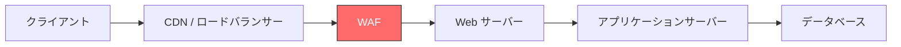

WAF はリバースプロキシとして動作するケースが一般的で、Web サーバーの手前に配置される。クラウド環境では CDN やロードバランサーに統合される形で提供されることが多い。

WAF の配置形態は大きく 3 つに分類される。

| 配置形態 | 特徴 | 代表例 |
|---------|------|-------|
| ネットワーク型 | 専用ハードウェアアプライアンスとしてネットワーク上に配置 | F5 BIG-IP ASM, Imperva SecureSphere |
| ホスト型 | Web サーバーにモジュールとして組み込む | ModSecurity, Coraza |
| クラウド型 | SaaS として提供。DNS 変更のみで導入可能 | AWS WAF, Cloudflare WAF, Azure WAF |

## 2. ネットワークファイアウォールとの違い

WAF と従来のネットワークファイアウォールは、守るべき対象と動作する層が根本的に異なる。

```mermaid
graph TB
    subgraph "ネットワークファイアウォール"
        direction TB
        NF1["レイヤー 3-4 で動作"]
        NF2["IP アドレス・ポート番号でフィルタリング"]
        NF3["TCP/UDP のステートフル検査"]
        NF4["ネットワーク境界の防御"]
    end

    subgraph "WAF"
        direction TB
        WAF1["レイヤー 7 で動作"]
        WAF2["HTTP リクエスト/レスポンスの内容を検査"]
        WAF3["SQL インジェクション・XSS 等の攻撃検知"]
        WAF4["Web アプリケーションの防御"]
    end

    subgraph "IPS/IDS"
        direction TB
        IPS1["レイヤー 3-7 で動作"]
        IPS2["既知の攻撃シグネチャとの照合"]
        IPS3["プロトコル異常の検知"]
        IPS4["ネットワーク全体の脅威検知"]
    end
```

### 比較表

| 観点 | ネットワークファイアウォール | IPS/IDS | WAF |
|------|--------------------------|---------|-----|
| 動作レイヤー | L3-L4 | L3-L7 | L7 |
| 検査対象 | IP, ポート, プロトコル | パケットペイロード全般 | HTTP リクエスト/レスポンス |
| 対処する脅威 | 不正なネットワークアクセス | 既知の攻撃パターン全般 | Web アプリケーション攻撃 |
| SSL/TLS 終端 | 通常なし | 一部対応 | 対応（復号して検査） |
| HTTP 理解 | なし | 限定的 | 深い理解 |
| 設置場所 | ネットワーク境界 | ネットワーク内部 | Web サーバー前段 |

重要な点は、これらは互いに代替するものではなく、**補完関係**にあるということである。ネットワークファイアウォールで不要なポートへのアクセスを遮断し、IPS でネットワーク全体の既知の攻撃を検知し、WAF で Web アプリケーション固有の攻撃を防御する。多層防御の各層がそれぞれ異なる役割を果たす。

### ネットワークファイアウォールでは防げない攻撃

ネットワークファイアウォールは「ポート 443 への HTTPS 通信を許可する」というルールを持っていても、その HTTPS 通信の中身（HTTP リクエスト）に SQL インジェクションのペイロードが含まれているかどうかは判断できない。以下のような攻撃は、WAF でなければ検知できない。

```http
GET /search?q='; DROP TABLE users;-- HTTP/1.1
Host: example.com
```

この HTTP リクエストは、ネットワークファイアウォールから見ればポート 443 への正当な HTTPS 通信にすぎない。しかし WAF はクエリパラメータ `q` の値を検査し、SQL インジェクションのパターン（`'`、`DROP TABLE`、`--`）を検出して遮断できる。

## 3. 検知方式

WAF の検知方式は大きく 3 つに分類される。それぞれに長所と短所があり、現代の WAF は複数の方式を組み合わせて使用している。

### 3.1 シグネチャベース検知（Signature-Based Detection）

最も伝統的な検知方式である。既知の攻撃パターン（シグネチャ）を正規表現やパターンマッチングで定義し、リクエストがそのパターンに一致するかどうかを検査する。

```
# Example: Simple SQL injection signature (regex)
SecRule ARGS "@rx (?i)(\bunion\b.*\bselect\b|\bselect\b.*\bfrom\b.*\bwhere\b)" \
    "id:1001,phase:2,deny,msg:'SQL Injection Detected'"
```

**利点:**

- 既知の攻撃に対して高精度な検知が可能
- 検知理由が明確で、トラブルシュートが容易
- 処理が高速

**欠点:**

- 未知の攻撃パターンには対応できない
- シグネチャの回避手法（エンコーディング、難読化）に弱い
- シグネチャの定期的な更新が必要

### 3.2 異常検知（Anomaly Detection）

正常なトラフィックの「ベースライン」を学習し、そこから逸脱するリクエストを異常として検知する方式である。機械学習ベースのアプローチが近年注目されている。

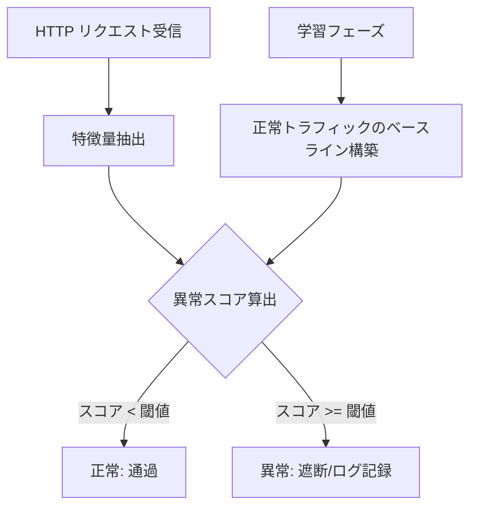

Cloudflare は機械学習ベースの WAF 検知を提供しており、各リクエストに対して SQL インジェクションや XSS 攻撃が含まれる可能性をスコアリング（1〜99）する仕組みを導入している。スコアが低いほど悪意のある可能性が高い。

**利点:**

- 未知の攻撃（ゼロデイ）を検知できる可能性がある
- シグネチャの更新に依存しない
- 新しい攻撃手法にも適応できる

**欠点:**

- 学習期間が必要
- 誤検知率が高くなりがち
- 検知理由の説明が困難（ブラックボックス問題）
- アプリケーションの変更時に再学習が必要

### 3.3 ルールベース検知（スコアリング方式）

OWASP CRS（後述）が採用する方式で、複数のルールによる検査結果をスコアとして蓄積し、合計スコアが閾値を超えた場合に遮断する。シグネチャベースとアノマリーベースの中間的なアプローチといえる。

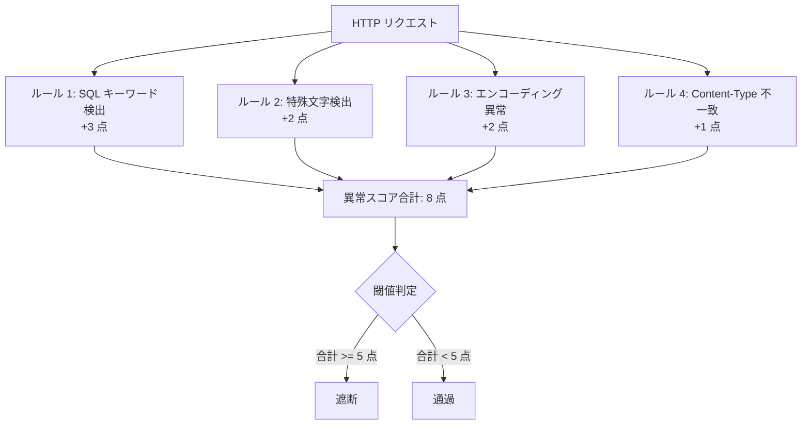

**利点:**

- 単一ルールでは誤検知になるケースでも、スコアの蓄積で精度を向上
- 閾値の調整で検知感度をコントロール可能
- 個々のルールの貢献度が可視化できる

**欠点:**

- 閾値の設定にチューニングが必要
- スコアの配分の妥当性を検証する必要がある

### 3.4 検知方式の組み合わせ

現代の商用 WAF やクラウド WAF は、これらの方式を単独で使用するのではなく、複数を組み合わせたハイブリッドアプローチを採用している。

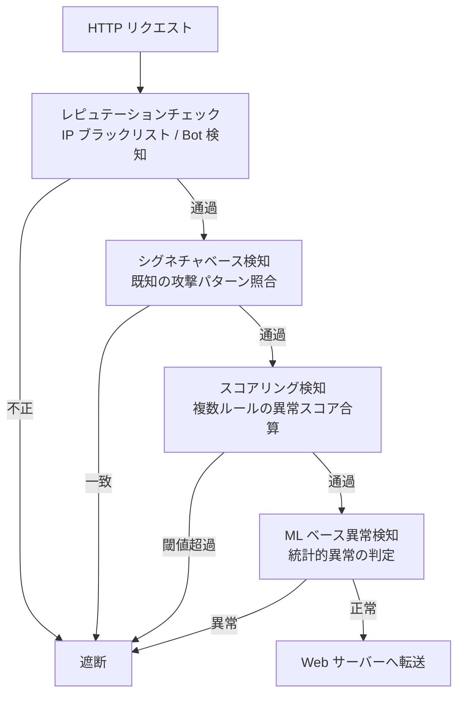

## 4. OWASP Core Rule Set（CRS）

### CRS の概要

OWASP Core Rule Set（CRS）は、WAF 用のオープンソースのルールセットであり、ModSecurity や Coraza などの WAF エンジンで使用される。Web アプリケーションに対する一般的な攻撃カテゴリを広くカバーしており、WAF ルールのデファクトスタンダードとなっている。

CRS は以下のような攻撃カテゴリに対するルールを提供する。

| カテゴリ | 対象となる攻撃 | ルールグループ ID |
|---------|--------------|-----------------|
| SQL インジェクション | UNION ベース、ブラインド SQL インジェクション等 | 942xxx |
| XSS | 反射型・格納型 XSS、DOM ベース XSS | 941xxx |
| ローカルファイルインクルージョン (LFI) | パストラバーサル、ファイル読み取り | 930xxx |
| リモートファイルインクルージョン (RFI) | 外部ファイルの読み込み | 931xxx |
| リモートコード実行 (RCE) | OS コマンドインジェクション | 932xxx |
| PHP インジェクション | PHP 固有の攻撃 | 933xxx |
| Java 攻撃 | Java デシリアライゼーション等 | 944xxx |
| セッション固定 | セッション ID の操作 | 943xxx |
| スキャナー検知 | 自動スキャンツールの検出 | 913xxx |
| プロトコル違反 | HTTP プロトコルの不正使用 | 920xxx |

### パラノイアレベル

CRS の最も重要な概念の一つが**パラノイアレベル（Paranoia Level: PL）**である。ルールの攻撃性（検知感度）を 4 段階に分類し、運用環境に応じた感度調整を可能にする。

| レベル | 説明 | 誤検知リスク | 推奨用途 |
|-------|------|------------|---------|
| PL1 | 基本的な攻撃パターンのみ検知。誤検知はほぼ発生しない | 低 | 初期導入時、チューニング前 |
| PL2 | より多くの攻撃を検知。一部の正当なリクエストが誤検知される可能性あり | 中 | チューニング後の一般的なサイト |
| PL3 | 高感度の検知。業務アプリケーションでは誤検知への対処が必要 | 高 | セキュリティ要件の高いシステム |
| PL4 | 最大感度。多数の誤検知が発生する前提で運用 | 極高 | 極めて高いセキュリティが求められる環境 |

運用のベストプラクティスとしては、PL1 から導入を開始し、ログを分析しながら徐々にレベルを引き上げていくアプローチが推奨される。各レベルで発生する誤検知に対して除外ルールを設定し、安定運用を確認してから次のレベルに進む。

### CRS の動作フロー

CRS はアノマリースコアリングモデルを基本としている。各ルールがマッチすると異常スコアが加算され、トランザクションの終了時に合計スコアが閾値と比較される。

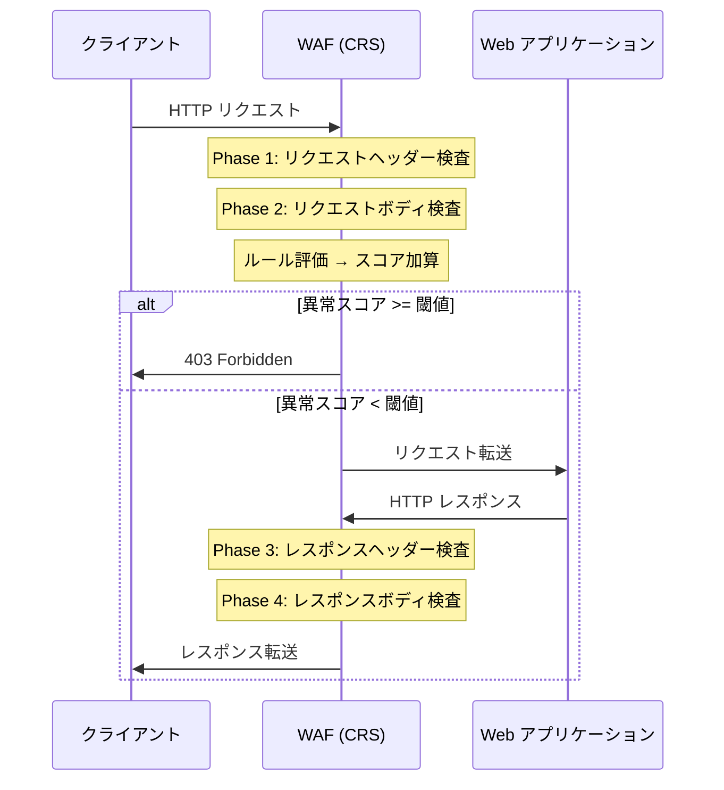

### CRS のバージョンと最近の動向

CRS は継続的にメンテナンスされている。2025 年時点では CRS 4.x 系が最新であり、以下のような改善が含まれている。

- プラグインアーキテクチャの導入による拡張性の向上
- パフォーマンスの最適化（正規表現の改善）
- 新しい攻撃ベクトル（プロンプトインジェクション等）への対応
- OWASP Top 10 の最新版との整合性確保

クラウド WAF サービスも CRS をベースとした独自のマネージドルールセットを提供している。たとえば、Azure WAF の Default Rule Set（DRS）2.2 は CRS 3.3.4 をベースとしており、Cloudflare WAF は CRS の最新版に基づくマネージドルールセットを提供している。

## 5. 誤検知（False Positive）への対処

WAF の運用で最も頭を悩ませる問題が**誤検知（False Positive）**である。正当なリクエストを攻撃と判定してしまうと、ユーザー体験を損ない、ビジネスに直接的な悪影響を与える。

### 誤検知が発生する典型的なケース

| ケース | 具体例 | 原因 |
|-------|-------|------|
| 正当なユーザー入力 | ブログ記事に SQL 構文を含むプログラミング解説を投稿 | SQL インジェクションルールに一致 |
| API パラメータ | JSON ボディに `<script>` という文字列をデータとして含む | XSS ルールに一致 |
| ファイルアップロード | バイナリファイルのアップロード | コンテンツ検査ルールに一致 |
| 長いクエリパラメータ | 検索クエリに大量のキーワードを含む | リクエストサイズ制限ルールに一致 |
| 国際化対応 | URL エンコードされたマルチバイト文字 | エンコーディング異常ルールに一致 |

### 対処のアプローチ

誤検知への対処は、段階的なアプローチで行う。

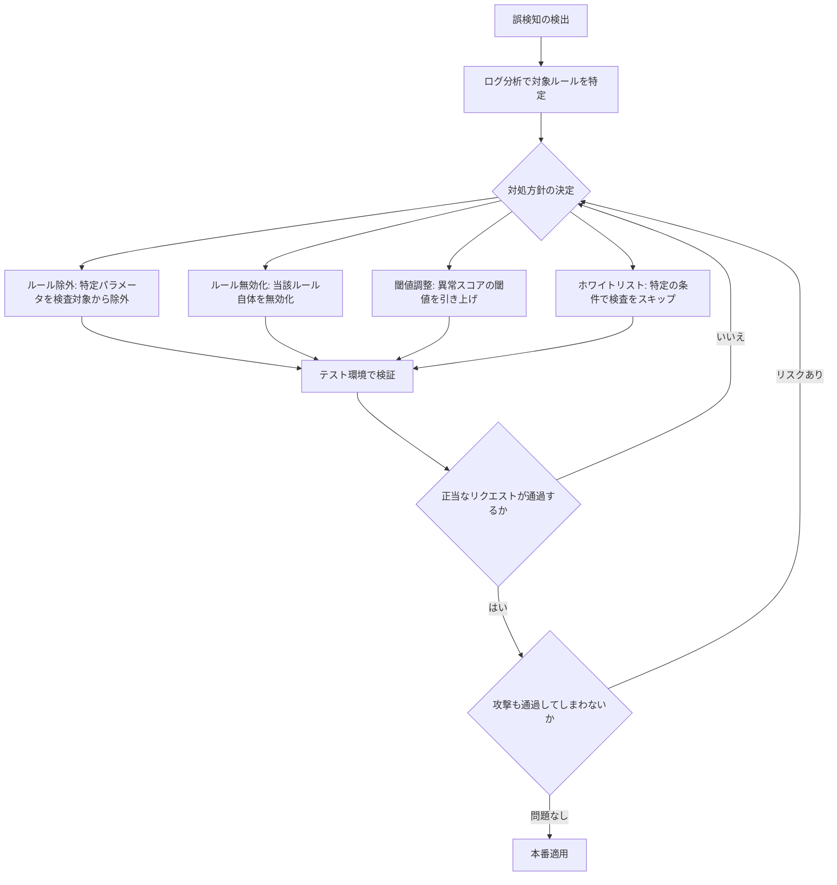

#### 1. 検知モード（Detection Mode）での導入

WAF の導入初期は、遮断モード（Prevention Mode）ではなく**検知モード（Detection Mode）**で運用する。検知モードでは、ルールに一致したリクエストをログに記録するだけで、実際にはブロックしない。

```
# ModSecurity detection mode configuration
SecRuleEngine DetectionOnly
```

この期間（通常 2〜4 週間）にログを収集・分析し、誤検知のパターンを把握してから除外ルールを作成する。

#### 2. ルール除外（Rule Exclusion）

最も一般的な対処法である。特定のパラメータやパスに対して、特定のルールの適用を除外する。

```
# Exclude SQL injection rule (942100) for the 'article_body' parameter
SecRuleUpdateTargetById 942100 "!ARGS:article_body"

# Exclude XSS rules for a specific URL path
SecRule REQUEST_URI "@beginsWith /api/content" \
    "id:1,phase:1,nolog,pass,ctl:ruleRemoveById=941100-941999"
```

ルール除外の粒度は細かくすることが重要である。「特定のパスの特定のパラメータに対して特定のルールを除外する」のように、影響範囲を最小限に留める。

#### 3. ホワイトリスト

信頼できるソースからのリクエストや、特定の条件を満たすリクエストに対して、WAF の検査全体をスキップする。

```
# Whitelist requests from internal monitoring system
SecRule REMOTE_ADDR "@ipMatch 10.0.0.0/8" \
    "id:2,phase:1,nolog,allow"
```

ホワイトリストの使用は慎重に行うべきである。過度なホワイトリストは WAF の防御力を弱める。

#### 4. 継続的なチューニングサイクル

誤検知対処は一度きりの作業ではなく、継続的なプロセスである。

1. **ログ監視**: WAF ログを定期的に確認し、新たな誤検知を発見する
2. **アプリケーション変更への追従**: 新機能のリリース時に WAF ルールの見直しを行う
3. **ルールセット更新時の検証**: CRS のバージョンアップ時に、既存の除外ルールが引き続き有効か検証する
4. **インフラストラクチャ as コード（IaC）**: WAF の設定を Terraform や CloudFormation でコード管理し、変更履歴を追跡可能にする

## 6. クラウド WAF

クラウド WAF は、インフラストラクチャの管理負荷を軽減し、短期間で WAF を導入できるソリューションとして広く普及している。代表的なクラウド WAF の特徴を比較する。

### 6.1 AWS WAF

AWS WAF は、Amazon CloudFront、Application Load Balancer（ALB）、Amazon API Gateway、AWS AppSync と統合して動作するクラウドネイティブの WAF サービスである。

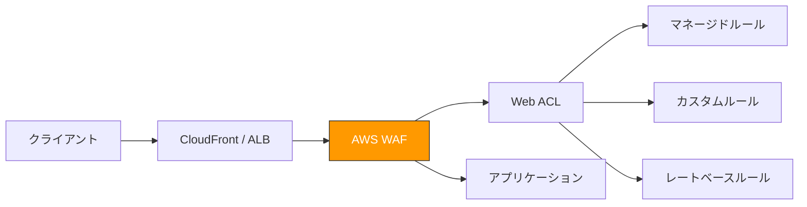

**主な特徴:**

- **Web ACL（Web Access Control List）**: ルールを束ねる単位。CloudFront や ALB に関連付けて使用する
- **マネージドルールグループ**: AWS が提供する事前定義済みルール群。OWASP Top 10 対応、既知の脆弱性対応などがある
- **AWS Marketplace ルール**: サードパーティベンダーが提供するルールセットを購入して利用可能
- **レートベースルール**: 一定時間内のリクエスト数に基づく制限（DDoS 緩和）
- **Bot Control**: 良性ボット（検索エンジンクローラー等）と悪性ボットを識別

**AWS WAF のルール評価順序:**

AWS WAF はルールの優先度（Priority）に基づいてルールを順番に評価し、最初にマッチしたルールのアクションが適用される。

```
# AWS WAF rule example (JSON format)
{
  "Name": "SQLInjectionRule",
  "Priority": 1,
  "Statement": {
    "SqliMatchStatement": {
      "FieldToMatch": {
        "AllQueryArguments": {}
      },
      "TextTransformations": [
        {
          "Priority": 0,
          "Type": "URL_DECODE"
        },
        {
          "Priority": 1,
          "Type": "HTML_ENTITY_DECODE"
        }
      ]
    }
  },
  "Action": {
    "Block": {}
  },
  "VisibilityConfig": {
    "SampledRequestsEnabled": true,
    "CloudWatchMetricsEnabled": true,
    "MetricName": "SQLInjectionRule"
  }
}
```

### 6.2 Cloudflare WAF

Cloudflare WAF は、Cloudflare のグローバルエッジネットワーク上で動作する WAF サービスである。CDN、DNS、DDoS 防御と一体で提供される点が特徴的である。

**主な特徴:**

- **マネージドルールセット**: Cloudflare 独自のルールセットと OWASP CRS ベースのルールセットの 2 種類を提供
- **攻撃スコア（WAF Attack Score）**: 機械学習を用いて各リクエストに 1〜99 のスコアを付与（低いほど悪意が高い）
- **Bot スコア**: トラフィックがボットである可能性をスコアリング
- **漏洩クレデンシャル検知**: 過去に流出したユーザー名・パスワードの使用を検知
- **悪意あるアップロード検知**: マルウェアシグネチャの検出
- **Firewall for AI**: AI / LLM 向けのプロンプトインジェクション対策

Cloudflare の WAF は、ルールベースの検知と機械学習ベースの検知を組み合わせたハイブリッドアプローチを採用している。ルールベースのシグネチャ検知でカバーできない新しい攻撃パターンを、機械学習モデルが補完する設計である。

### 6.3 Azure WAF

Azure WAF は、Azure Application Gateway、Azure Front Door、Azure CDN と統合して動作する。

**主な特徴:**

- **DRS（Default Rule Set）**: OWASP CRS 3.3.4 をベースとした独自のルールセット
- **カスタムルール**: 地理フィルタリング、IP 制限、レート制限など
- **ポリシーベースの管理**: WAF ポリシーを複数のリソースに関連付け可能
- **診断ログ**: Azure Monitor / Log Analytics との統合

### 6.4 クラウド WAF の比較

| 観点 | AWS WAF | Cloudflare WAF | Azure WAF |
|------|---------|----------------|-----------|
| デプロイ先 | CloudFront, ALB, API Gateway | Cloudflare エッジネットワーク | Application Gateway, Front Door |
| マネージドルール | AWS 提供 + Marketplace | Cloudflare 独自 + OWASP CRS | DRS (CRS ベース) |
| ML ベース検知 | Bot Control で一部対応 | 攻撃スコア（全プラン） | 限定的 |
| 料金モデル | Web ACL + ルール + リクエスト数 | プランに含まれる | Application Gateway の SKU + ルール |
| カスタマイズ性 | 高い | 中程度 | 高い |
| CDN 統合 | CloudFront と統合 | CDN 一体型 | Azure CDN / Front Door と統合 |
| 導入の容易さ | AWS エコシステム内なら容易 | DNS 変更のみで導入可能 | Azure エコシステム内なら容易 |

## 7. カスタムルール設計

マネージドルールだけではカバーしきれないアプリケーション固有の要件に対して、カスタムルールを設計する必要がある。

### カスタムルール設計の原則

1. **最小特権の原則**: 必要最小限の範囲でルールを適用する
2. **テスト駆動**: 本番適用前にテスト環境で十分に検証する
3. **段階的な適用**: まず検知モードで影響を確認し、問題がなければ遮断モードに変更する
4. **ドキュメント化**: 各ルールの目的、対象、作成理由を明記する
5. **定期的な見直し**: 不要になったルールを削除し、ルールセットを最小限に保つ

### カスタムルールの典型的なユースケース

#### ジオブロッキング（地理的制限）

特定の国や地域からのアクセスを制限する。

```json
{
  "Name": "GeoBlockRule",
  "Priority": 0,
  "Statement": {
    "GeoMatchStatement": {
      "CountryCodes": ["XX", "YY"]
    }
  },
  "Action": {
    "Block": {}
  }
}
```

#### レートリミット

特定のエンドポイントに対するリクエスト頻度を制限する。ブルートフォース攻撃や API の濫用を防止する。

```json
{
  "Name": "LoginRateLimitRule",
  "Priority": 1,
  "Statement": {
    "RateBasedStatement": {
      "Limit": 100,
      "AggregateKeyType": "IP",
      "ScopeDownStatement": {
        "ByteMatchStatement": {
          "SearchString": "/api/login",
          "FieldToMatch": {
            "UriPath": {}
          },
          "TextTransformations": [
            {
              "Priority": 0,
              "Type": "LOWERCASE"
            }
          ],
          "PositionalConstraint": "STARTS_WITH"
        }
      }
    }
  },
  "Action": {
    "Block": {}
  }
}
```

#### アプリケーション固有のバリデーション

特定のパラメータの値を制限する。たとえば、アクション名に使用できる文字列を限定する。

```
# ModSecurity: Allow only specific values for the 'action' parameter
SecRule ARGS:action "!@within view edit delete create" \
    "id:10001,phase:2,deny,status:403,msg:'Invalid action parameter'"
```

#### ヘッダー検査ルール

不正な User-Agent や欠落すべきでないヘッダーを検査する。

```
# Block requests without a valid User-Agent header
SecRule &REQUEST_HEADERS:User-Agent "@eq 0" \
    "id:10002,phase:1,deny,status:403,msg:'Missing User-Agent header'"

# Block requests with known malicious User-Agent strings
SecRule REQUEST_HEADERS:User-Agent "@pmFromFile malicious-ua.txt" \
    "id:10003,phase:1,deny,status:403,msg:'Malicious User-Agent detected'"
```

### ルール設計時の注意点

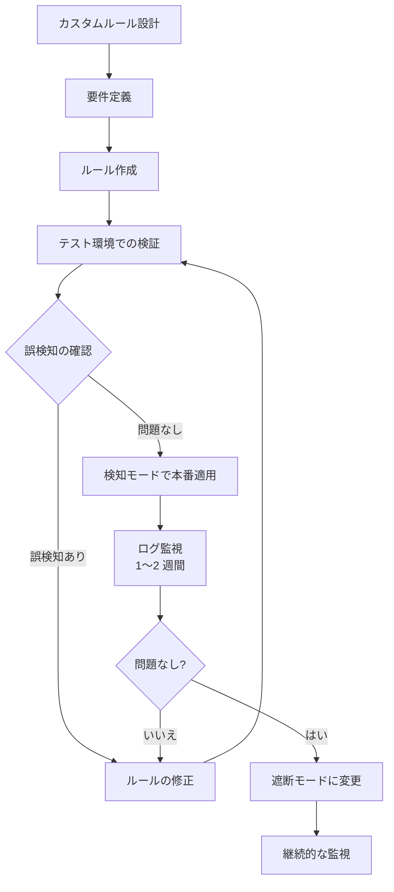

- **正規表現のパフォーマンス**: 複雑な正規表現は WAF のレイテンシに影響を与える。ReDoS（正規表現サービス拒否攻撃）にも注意が必要
- **ルールの順序**: 頻繁にマッチするルールを先に配置することで、後続ルールの評価を省略しパフォーマンスを向上
- **否定ルールの危険性**: 「特定パターンに一致しないものを遮断」というルールは、予期せぬ誤検知を引き起こしやすい
- **テキスト変換の適用**: URL デコード、HTML エンティティデコード、大文字小文字の正規化など、検査前のテキスト変換を適切に適用する

## 8. ログ分析とインシデント対応

WAF は攻撃の遮断だけでなく、セキュリティ上の可視性を提供する重要なデータソースでもある。WAF ログの適切な分析とインシデント対応プロセスの構築が、WAF 運用の成熟度を左右する。

### WAF ログに含まれる情報

一般的な WAF ログには以下の情報が含まれる。

| フィールド | 説明 | 分析での活用 |
|-----------|------|------------|
| タイムスタンプ | リクエストの日時 | 攻撃の時系列分析 |
| ソース IP | リクエスト元の IP アドレス | 攻撃元の特定、地理分析 |
| リクエスト URI | アクセス先のパス | 攻撃対象のエンドポイント特定 |
| HTTP メソッド | GET, POST 等 | 攻撃手法の分析 |
| リクエストヘッダー | User-Agent, Referer 等 | ツールの特定、ボット判定 |
| マッチしたルール | ルール ID、メッセージ | 攻撃カテゴリの分類 |
| アクション | 遮断 / 検知 / 許可 | 対応状況の把握 |
| レスポンスコード | HTTP ステータスコード | 攻撃の成否判定 |

### SIEM 連携

WAF ログを SIEM（Security Information and Event Management）に送信することで、他のセキュリティイベントと相関分析を行い、より包括的な脅威の可視化が可能になる。

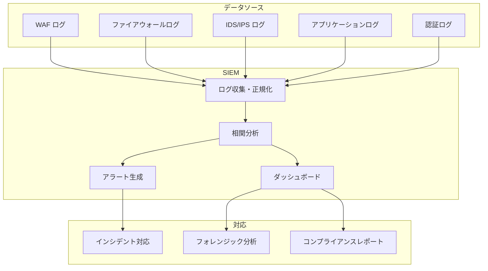

WAF ログが SIEM に取り込まれると、セキュリティチームは以下の観点で分析を行う。

- **ソース IP のジオロケーションとレピュテーション**: 既知の悪意あるソースからのアクセスか
- **リクエスト URI**: 重要なエンドポイント（管理画面、API）へのアクセス試行か
- **攻撃シグネチャ**: 脆弱性パターンとの照合
- **リクエストボリュームの異常**: 突然のトラフィック増加（DDoS の兆候）
- **セッションメタデータ**: 横方向移動（Lateral Movement）の兆候

### ログ分析の実践

#### 攻撃の傾向把握

WAF ログを集約し、以下のような分析を定期的に行う。

- **攻撃カテゴリ別の件数推移**: SQL インジェクション、XSS、RCE 等の比率変化
- **ソース IP の分布**: 特定の IP レンジからの集中攻撃の検出
- **攻撃対象エンドポイントのランキング**: どのパスが最も狙われているか
- **時間帯別の攻撃件数**: 攻撃のピーク時間帯の特定

#### インシデント対応フロー

WAF のアラートをトリガーとしたインシデント対応フローを構築する。

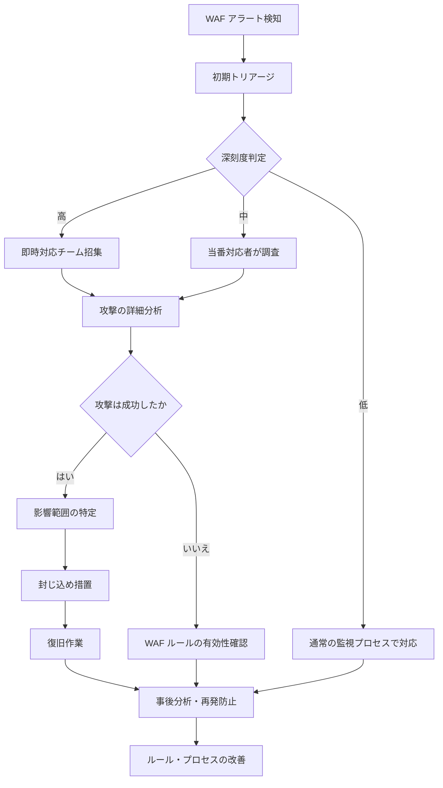

WAF で攻撃がブロックされた場合でも、それをもって安全と判断してはならない。WAF をバイパスする手法が存在する可能性を常に考慮し、アプリケーションログやデータベースログも合わせて確認すべきである。

### ダッシュボードの設計

効果的な WAF ダッシュボードには以下の要素を含める。

- **リアルタイム指標**: 現在のリクエスト数、ブロック率、上位攻撃カテゴリ
- **トレンドグラフ**: 日次・週次の攻撃件数推移
- **地理分布マップ**: 攻撃元の地理的分布
- **ルール別ヒット数**: どのルールが最も多くトリガーされているか
- **誤検知率の推移**: チューニングの効果を定量的に測定

## 9. 導入時の注意点とベストプラクティス

### 導入前の準備

#### アプリケーションの理解

WAF を導入する前に、保護対象のアプリケーションを十分に理解する必要がある。

- **URL 構造**: どのようなパスパターンがあるか
- **パラメータ**: 各エンドポイントが受け付けるパラメータの種類と形式
- **ファイルアップロード**: アップロード機能の有無と対象ファイル形式
- **API 仕様**: REST/GraphQL 等の API があるか、認証方式は何か
- **外部連携**: Webhook やコールバック URL はあるか

これらの情報がなければ、適切なルール設定も誤検知対処もできない。

#### パフォーマンスへの影響評価

WAF はすべてのリクエストを検査するため、レイテンシへの影響は避けられない。導入前にパフォーマンステストを行い、影響を定量的に把握しておくべきである。

- **レイテンシの増加**: 一般的に 1〜5ms 程度の増加が見込まれる
- **スループットへの影響**: 特にリクエストボディの検査はコストが大きい
- **リソース消費**: ホスト型 WAF の場合、CPU・メモリの追加消費

### ベストプラクティス

#### 1. 段階的な導入

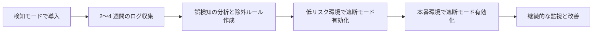

いきなり遮断モードで導入すると、誤検知によって正当なユーザーのアクセスが遮断され、業務影響が発生するリスクがある。まず検知モードで導入し、ログを分析してから遮断モードに移行する。

#### 2. WAF は「銀の弾丸」ではない

WAF はアプリケーションセキュリティの一層にすぎない。WAF を導入したからといって、以下の取り組みを怠ってはならない。

- **セキュアコーディング**: 入力バリデーション、パラメータ化クエリ、出力エスケープ
- **脆弱性管理**: 定期的な脆弱性スキャン、ペネトレーションテスト
- **パッチ管理**: OS、ミドルウェア、ライブラリの適時更新
- **認証・認可**: 適切なアクセス制御の実装

WAF に過度に依存すると、WAF をバイパスされた瞬間にすべての防御が崩壊する。WAF はあくまで多層防御の一層であるという認識が重要である。

#### 3. SSL/TLS 終端の設計

WAF が HTTPS トラフィックを検査するためには、SSL/TLS を終端してリクエストの中身を見る必要がある。これは以下の設計上の考慮事項を伴う。

- **証明書管理**: WAF に SSL 証明書を配置する必要がある
- **バックエンドとの通信**: WAF からバックエンドへの通信も暗号化すべきか（End-to-End Encryption）
- **パフォーマンス**: SSL 終端処理の負荷

クラウド WAF の場合、SSL/TLS 終端はクラウドプロバイダー側で自動的に処理されるため、この設計上の負担は軽減される。

#### 4. 可用性の確保

WAF 自体が単一障害点（SPOF）にならないよう、冗長構成を設計する。

- **クラウド WAF**: プロバイダーの SLA に依存するが、一般的に高い可用性が提供される
- **オンプレミス WAF**: Active-Passive または Active-Active の冗長構成を組む
- **フェイルオープン vs フェイルクローズ**: WAF が障害時にトラフィックを通過させる（フェイルオープン）か、遮断する（フェイルクローズ）か。可用性を重視する場合はフェイルオープン、セキュリティを重視する場合はフェイルクローズを選択する

#### 5. WAF バイパスへの対策

WAF を迂回する攻撃手法は多数存在する。以下の対策を組み合わせて防御力を高める。

- **複数のテキスト変換を適用**: URL デコード、HTML エンティティデコード、Unicode 正規化を重ねて適用
- **リクエスト全体を検査**: ヘッダー、URI、ボディ、Cookie をすべて検査対象にする
- **パラメータの長さ制限**: 異常に長いパラメータ値を制限する
- **レスポンスの検査**: リクエストだけでなくレスポンスも検査し、情報漏洩を防止する
- **定期的なペネトレーションテスト**: WAF を含めたシステム全体に対してテストを実施し、バイパスの可能性を検証する

最近の研究（WAFFLED, 2025）では、パーシングの不一致（WAF と Web サーバーの HTTP リクエスト解析方法の差異）を利用した WAF バイパス手法が報告されており、WAF のバイパス対策は継続的な課題である。

#### 6. 運用体制の整備

WAF の導入は技術的な設定だけで完結しない。運用体制の整備が不可欠である。

- **監視担当者のアサイン**: WAF のアラートを常時監視する体制
- **エスカレーションフロー**: 攻撃検知時の報告・対応フロー
- **定期レビュー**: ルールセットの有効性を定期的にレビューする会議体
- **変更管理**: WAF ルールの変更を変更管理プロセスに組み込む
- **インシデント対応訓練**: WAF アラートを起点としたインシデント対応の訓練

## まとめ

WAF は Web アプリケーションのセキュリティにおいて重要な防御層であるが、万能ではない。その本質を理解し、適切に運用することが求められる。

1. **WAF はレイヤー 7 の防御**: ネットワークファイアウォールや IPS とは補完関係にあり、代替ではない
2. **検知方式は複合的**: シグネチャベース、異常検知、スコアリングを組み合わせるのが現代の標準
3. **OWASP CRS がデファクトスタンダード**: パラノイアレベルを活用した段階的な導入が推奨される
4. **誤検知対処は継続的プロセス**: 検知モードでの導入、ルール除外の適用、定期的なチューニングが不可欠
5. **クラウド WAF は導入障壁を下げる**: AWS WAF、Cloudflare WAF、Azure WAF はそれぞれ異なる強みを持つ
6. **ログ分析と SIEM 連携**: WAF は検知・遮断だけでなく、セキュリティの可視性を提供するデータソースでもある
7. **WAF は多層防御の一層**: セキュアコーディング、脆弱性管理、パッチ管理と組み合わせて初めて効果を発揮する

WAF の導入を検討する際は、自組織のアプリケーションの特性、運用体制、セキュリティ要件を総合的に考慮し、最適なソリューションを選定することが重要である。
