# Write-Ahead Logging（WAL）— データベースの永続性と復旧を支える仕組み

## 1. 背景と動機 — なぜWALが必要なのか

### 1.1 データベースが直面する根本的なジレンマ

データベースシステムの最も基本的な責務は、ユーザーが「コミット成功」の応答を受け取ったデータを、いかなる障害の後でも失わないことである。これがACID特性のうちの **Durability（永続性）** にあたる。

しかし、この永続性を素朴に実現しようとすると、深刻な性能問題に直面する。データベースのデータはページ（通常4KBや8KB）単位でディスク上に格納されているが、トランザクションが更新するデータは多くの場合ページ全体のほんの一部分にすぎない。たとえば、ある行の1つのカラムを更新するだけの操作であっても、そのページ全体（8KB）をディスクに書き戻す必要がある。

さらに問題なのは、1つのトランザクションが複数のページにまたがるデータを更新する場合である。銀行の振込処理で口座Aの残高を減らし口座Bの残高を増やすとき、これら2つの口座のレコードが異なるページに存在すれば、2つのページをディスクに書き戻す必要がある。もしこの2つの書き込みの間でシステムがクラッシュしたら、一方だけが永続化された不整合な状態が残ることになる。

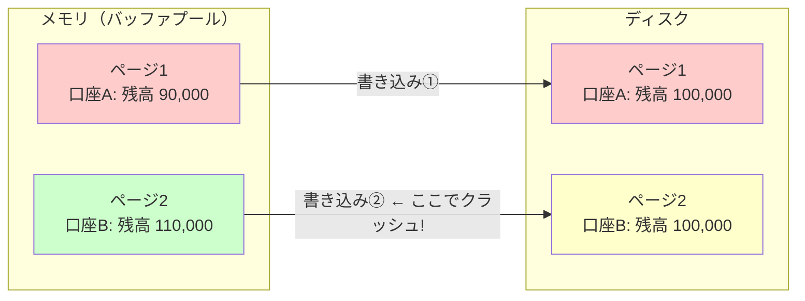

この図では、ページ1の書き込みは完了したがページ2の書き込み前にクラッシュが発生した状況を示している。ディスク上では口座Aの残高は90,000円に減っているのに口座Bの残高は100,000円のままであり、10,000円が「消失」した状態になっている。

### 1.2 ランダムI/OとシーケンシャルI/O

上述の問題を解決するために「コミット時に関連するすべてのページをディスクに書き出す」という素朴なアプローチ（**Force方式**）を取ると、今度は性能が壊滅的に低下する。なぜなら、データページへの書き込みは本質的に **ランダムI/O** だからである。

ディスク（特にHDD）においては、ランダムI/OとシーケンシャルI/Oの性能差は桁違いに大きい。

| I/Oパターン | HDD | SSD |
|---|---|---|
| シーケンシャル読み書き | 100〜200 MB/s | 500〜7,000 MB/s |
| ランダム読み書き（4KB） | 0.5〜2 MB/s | 50〜500 MB/s |
| レイテンシ | 5〜10 ms（シーク） | 0.01〜0.1 ms |

HDDの場合、シーケンシャルI/Oはランダムl/Oに対して100倍以上高速であり、SSDの場合でも10倍程度の差がある。データページはディスク上のさまざまな場所に分散しているため、複数のページを書き出す操作はランダムI/Oになる。

### 1.3 WALという解法

**Write-Ahead Logging（WAL）** は、このジレンマを巧妙に解決する。基本的なアイデアは極めてシンプルである。

> **データページを直接変更する前に、その変更内容をログファイルに先に書き出す。**

ログファイルへの書き込みは**追記（append-only）**であり、常にファイルの末尾に書き足していくだけなので、**シーケンシャルI/O**になる。つまり、高速なシーケンシャルI/Oだけでコミットの永続性を保証し、実際のデータページへの書き込み（ランダムI/O）は後から非同期に行えばよい。

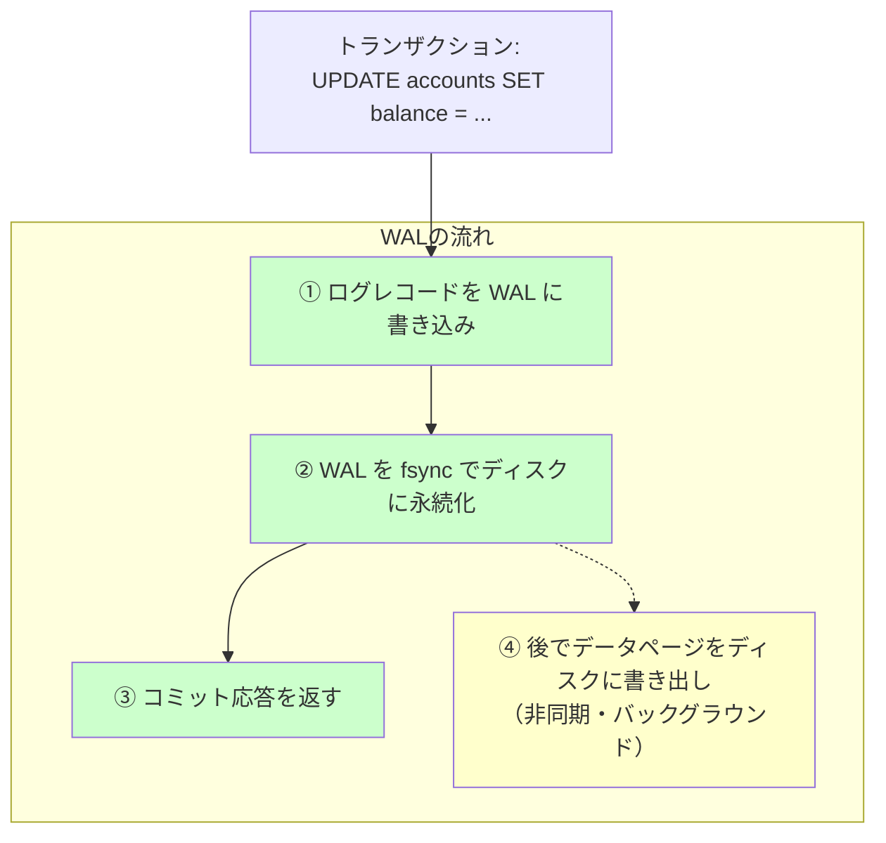

この仕組みにより、クラッシュが発生した場合でもWALログを読み返すことで、コミット済みの変更をデータページに再適用（Redo）したり、未コミットの変更を取り消し（Undo）たりすることで、データベースを一貫性のある状態に復元できる。

### 1.4 歴史的経緯

WALの概念はデータベースシステムの歴史とともに発展してきた。

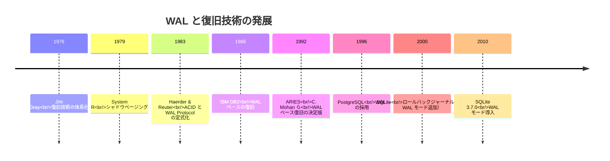

1983年にHaerderとReuterが「Principles of Transaction-Oriented Database Recovery」で **WAL Protocol** を明確に定式化したことは、データベース復旧技術における重要なマイルストーンである。その後1992年にC. Mohanらが発表した **ARIES（Algorithm for Recovery and Isolation Exploiting Semantics）** は、WALをベースとした復旧アルゴリズムの決定版として広く認知され、現代のほぼすべての主要なリレーショナルデータベースに影響を与えている。

## 2. WALの基本原理

### 2.1 Write-Ahead Logging Protocol

WALの基本原則は、次の2つのルールに集約される。

**ルール1: Undo Rule（WALの狭義の定義）**

> データページの変更がディスクに書き出される前に、対応するログレコードがディスクに永続化されていなければならない。

このルールにより、クラッシュ後にデータページ上に中途半端な変更が残っていた場合でも、ログを参照してその変更を取り消す（Undo）ことができる。

**ルール2: Redo Rule（Commit Rule）**

> トランザクションのコミットが完了したとみなされる前に、そのトランザクションのすべてのログレコードがディスクに永続化されていなければならない。

このルールにより、コミット済みのトランザクションの変更が、たとえデータページに反映される前にクラッシュが起きても、ログから再適用（Redo）できることが保証される。

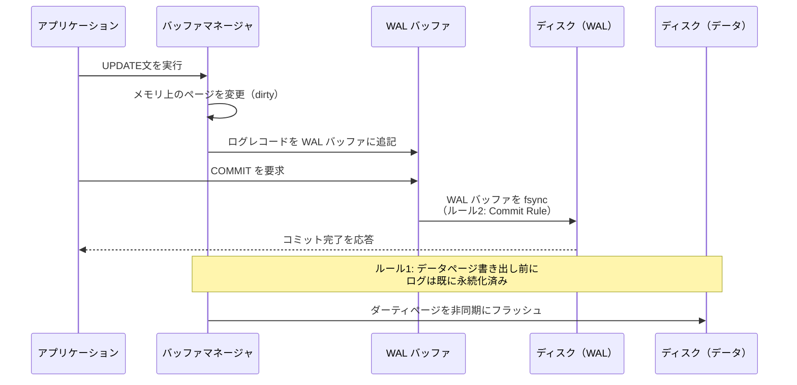

### 2.2 Steal/No-Force方式

WALの動作を理解する上で重要なのが、バッファ管理における2つの直交する方針の組み合わせである。

**Steal方式 vs No-Steal方式**
- **Steal**: 未コミットのトランザクションが変更したページを、コミット前にディスクに書き出すことを許す
- **No-Steal**: コミットが完了するまで、変更されたページをディスクに書き出さない

**Force方式 vs No-Force方式**
- **Force**: コミット時に、そのトランザクションが変更したすべてのページをディスクに強制的に書き出す
- **No-Force**: コミット時にデータページの書き出しを強制しない（WALログの永続化だけ行う）

| | Force | No-Force |
|---|---|---|
| **No-Steal** | Undo不要・Redo不要<br/>（最も単純だが非現実的） | Undo不要・Redo必要 |
| **Steal** | Undo必要・Redo不要 | Undo必要・Redo必要<br/>（最も柔軟・ARIESが採用） |

現代のデータベースシステムの大半は **Steal/No-Force** 方式を採用している。この組み合わせが最も柔軟であり、最高の性能を引き出せるためである。

- **Steal** を許すことで、メモリが逼迫した場合に未コミットのページでも退避でき、バッファプールの管理が柔軟になる
- **No-Force** にすることで、コミット時のランダムI/Oを回避し、高いスループットを実現する

ただし、この柔軟性の代償として、復旧時にUndoとRedoの両方が必要になる。これがWALとARIESが解決する核心的な課題である。

### 2.3 No-Force/Stealが生むUndoとRedoの必要性

具体的なシナリオで考えてみよう。

**Redoが必要なケース（No-Forceの結果）：**

```
時刻T1: トランザクションTxAがページPを更新（メモリ上）
時刻T2: TxAがコミット → WALログをfsync
時刻T3: クラッシュ発生（ページPはまだディスクに書き出されていない）
```

この場合、TxAはコミット済みだがページPの更新はディスクに反映されていない。復旧時にWALログからTxAの変更をRedoする必要がある。

**Undoが必要なケース（Stealの結果）：**

```
時刻T1: トランザクションTxBがページQを更新（メモリ上）
時刻T2: メモリ逼迫 → ページQがディスクに書き出される（TxBは未コミット）
時刻T3: クラッシュ発生（TxBは未コミット）
```

この場合、TxBは未コミットだがページQの変更がディスクに反映されている。復旧時にWALログからTxBの変更をUndoする必要がある。

## 3. ログレコードの構造

### 3.1 LSN（Log Sequence Number）

WALの中核をなす概念が **LSN（Log Sequence Number）** である。LSNはログレコードを一意に識別するための単調増加する番号で、通常はWALファイル内のバイトオフセットとして実装される。

LSNは以下の3つの場所で管理される。

1. **ログレコード内のLSN**: 各ログレコードの識別子
2. **ページ内のpageLSN**: そのページに最後に適用された変更のLSN。復旧時に、あるログレコードがそのページに既に適用済みかどうかを判定するために使う
3. **flushedLSN**: WALバッファからディスクに永続化済みの最新LSN

WAL Protocolのルール1は、LSNを使って次のように表現できる。

> ページをディスクに書き出す前に、`pageLSN ≤ flushedLSN` でなければならない。

つまり、ページに適用された最新の変更に対応するログレコードが、すでにディスクに永続化されていることを確認してからでないと、そのページをフラッシュしてはいけない。

### 3.2 ログレコードの種類と構造

典型的なWALログレコードは以下のフィールドを持つ。

```
+--------+--------+----------+---------+--------+-----------+-----------+
|  LSN   | TxnID  |  prevLSN | Type    | PageID | Before    | After     |
|        |        |          |         |        | Image     | Image     |
+--------+--------+----------+---------+--------+-----------+-----------+
```

| フィールド | 説明 |
|---|---|
| **LSN** | このログレコードのLog Sequence Number |
| **TxnID** | このログレコードを生成したトランザクションの識別子 |
| **prevLSN** | 同じトランザクションの前のログレコードのLSN（Undo時にチェインを辿るため） |
| **Type** | レコードの種類（UPDATE, COMMIT, ABORT, CLR, CHECKPOINT, END など） |
| **PageID** | 変更されたページの識別子 |
| **Before Image** | 変更前の値（Undoに使用） |
| **After Image** | 変更後の値（Redoに使用） |

**prevLSN** は同一トランザクション内のログレコードを逆順に辿るためのリンクリストのポインタとして機能する。トランザクションをUndoする必要が生じたとき、このチェインを辿ることで、そのトランザクションが行ったすべての変更を新しいものから順に取り消すことができる。

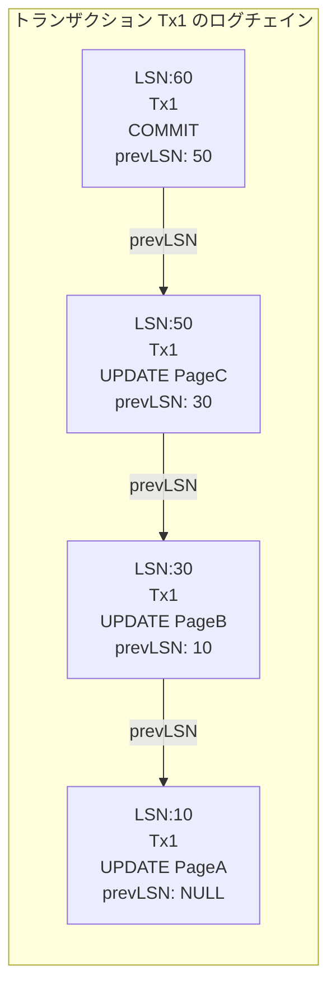

### 3.3 CLR（Compensation Log Record）

**CLR（Compensation Log Record）** は、Undo処理中に生成される特殊なログレコードである。あるログレコードの変更を取り消す操作それ自体もログに記録しなければならない。これは、Undo処理中にクラッシュが発生した場合に、復旧を再開したときに同じ操作を二重に取り消してしまうことを防ぐためである。

CLRには **undoNextLSN** というフィールドがあり、次にUndoすべきログレコードのLSNを指す。CLR自身がUndoされることはなく（CLRはredo-onlyである）、復旧の再開時にはundoNextLSNを参照して正しい位置からUndoを続行できる。

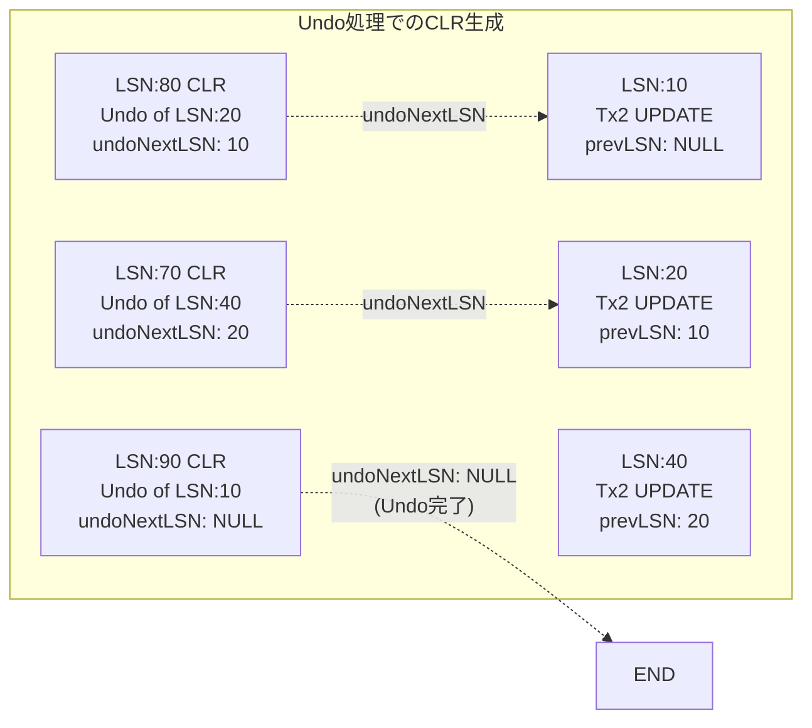

## 4. チェックポイント

### 4.1 チェックポイントの必要性

WALログは追記されていく一方なので、制限なく成長を続ける。また、クラッシュ後の復旧時にWALログ全体を最初から再生するのは非現実的である。この2つの問題を解決するのが**チェックポイント（Checkpoint）** である。

チェックポイントは「この時点までの状態はディスク上に正しく反映されている」という境界線をWALログに記録する仕組みである。復旧時には、最新のチェックポイントから処理を開始すればよく、それ以前のログは不要になるため削除できる。

### 4.2 チェックポイントの種類

**一貫性チェックポイント（Consistent Checkpoint / Quiescent Checkpoint）：**

最も単純なアプローチは、以下の手順で実行される。

1. 新しいトランザクションの受付を停止する
2. 実行中のトランザクションがすべて完了するのを待つ
3. すべてのダーティページをディスクにフラッシュする
4. チェックポイントレコードをWALに書き込み、fsyncする

この方式は実装が単純だが、チェックポイント中にシステムが完全に停止するため、実用的ではない。

**ファジーチェックポイント（Fuzzy Checkpoint）：**

ARIESが採用するのがファジーチェックポイントである。こちらはシステムを停止させずに実行できる。

1. **`begin_checkpoint`** レコードをWALに書き込む
2. その時点でのアクティブなトランザクション一覧（**ATT: Active Transaction Table**）とダーティページ一覧（**DPT: Dirty Page Table**）をキャプチャする
3. **`end_checkpoint`** レコードにATTとDPTの内容を記録してWALに書き込む
4. ログが永続化されたら、`begin_checkpoint` のLSNを `master record` に書き込む

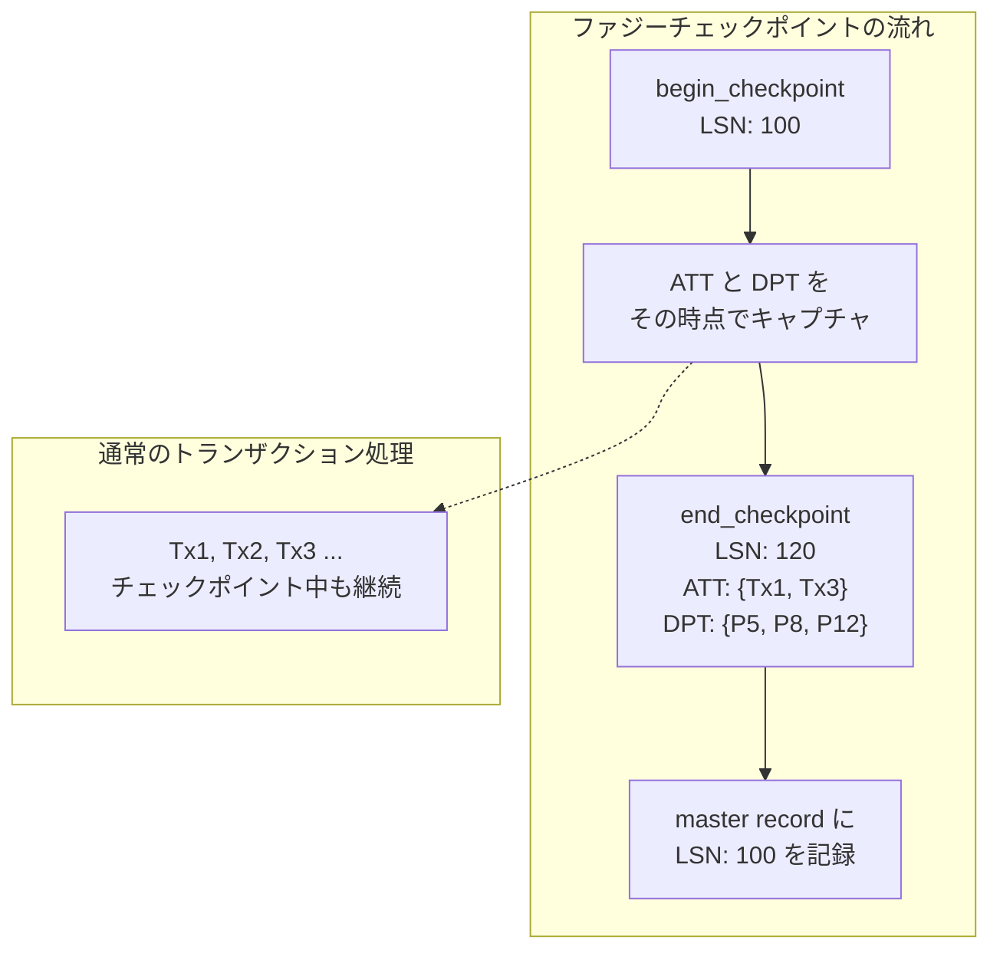

ファジーチェックポイントでは、チェックポイント中もトランザクションの処理が継続しているため、チェックポイント完了時点でダーティページがすべてフラッシュされているとは限らない。そのため復旧時にはDPT内の情報をもとにRedoの開始点を決定する必要がある。

### 4.3 ATT（Active Transaction Table）とDPT（Dirty Page Table）

**ATT（Active Transaction Table）** には、チェックポイント時点でアクティブだった各トランザクションについて以下の情報が記録される。

| フィールド | 説明 |
|---|---|
| TxnID | トランザクションの識別子 |
| Status | RUNNING, COMMITTING, ABORTING |
| lastLSN | そのトランザクションの最後のログレコードのLSN |

**DPT（Dirty Page Table）** には、チェックポイント時点でバッファプール内にあったダーティページの情報が記録される。

| フィールド | 説明 |
|---|---|
| PageID | ダーティページの識別子 |
| recLSN | そのページが最初にダーティになった時のLSN（recovery LSN） |

DPTの **recLSN** は、そのページに対する最初の未フラッシュの変更のLSNを示す。復旧時のRedoフェーズでは、DPT内のすべてのrecLSNの中で最も小さい値からRedoを開始する。

## 5. ARIES復旧アルゴリズム

### 5.1 ARIESの概要

**ARIES（Algorithm for Recovery and Isolation Exploiting Semantics）** は、1992年にIBMのC. Mohan、Don Haderle、Bruce Lindsay、Hamid Pirahesh、Peter Schwarzらが発表した、WALに基づく復旧アルゴリズムの決定版である。ARIESは以下の3つの原則に基づいている。

1. **Write-Ahead Logging**: 変更の前にログを書く
2. **Repeating History During Redo**: 復旧時にクラッシュ前の状態を忠実に再現する
3. **Logging Changes During Undo**: Undo操作自体もログに記録する（CLR）

ARIESの復旧処理は3つのフェーズから構成される。

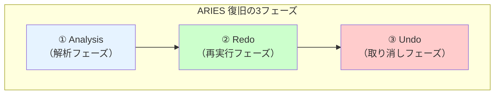

### 5.2 Analysisフェーズ（解析フェーズ）

Analysisフェーズの目的は、クラッシュ時点でのデータベースの状態を把握することである。具体的には、以下の情報を再構築する。

1. クラッシュ時にアクティブだったトランザクションの一覧（ATTの再構築）
2. クラッシュ時にダーティだったページの一覧（DPTの再構築）
3. Redoフェーズの開始地点の特定

処理の手順は以下のとおりである。

1. ディスク上の `master record` から最新のチェックポイントの `begin_checkpoint` LSNを取得する
2. 対応する `end_checkpoint` レコードからATTとDPTを読み込む
3. `end_checkpoint` 以降のログレコードを順方向にスキャンしながら、ATTとDPTを更新する
   - UPDATEレコードを見つけたら、該当ページがDPTになければrecLSN = 現在のLSNで追加
   - COMMITレコードを見つけたら、そのトランザクションをATTから削除
   - ABORTレコードを見つけたら、そのトランザクションのステータスを更新
   - ENDレコードを見つけたら、そのトランザクションをATTから削除

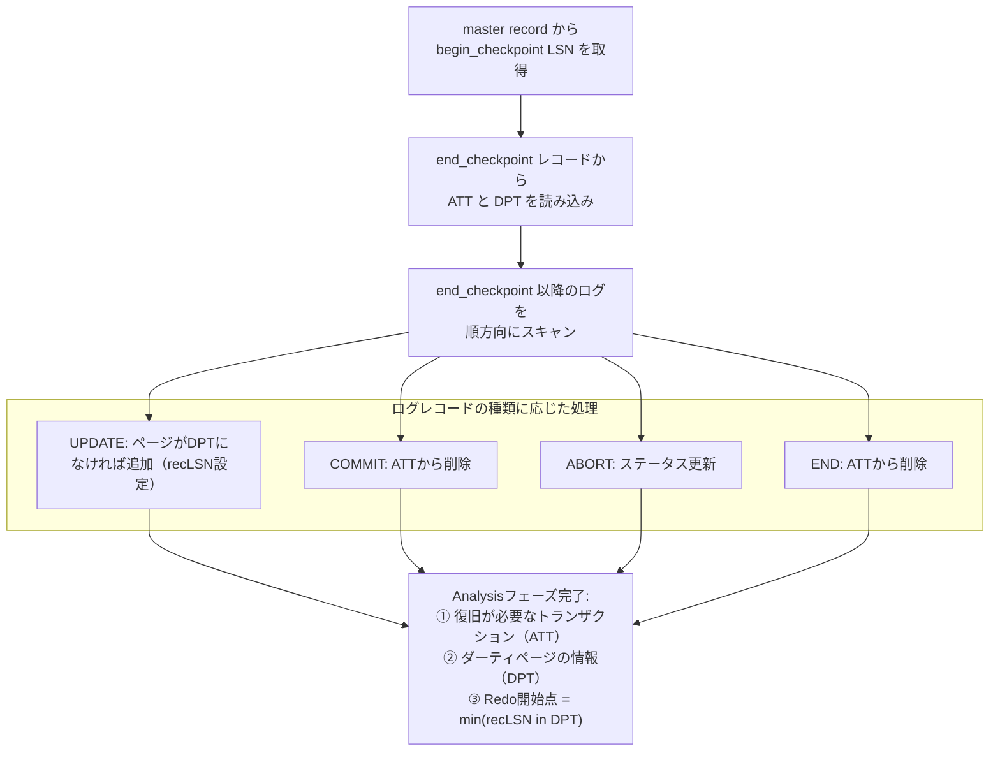

### 5.3 Redoフェーズ（再実行フェーズ）

Redoフェーズの目的は、クラッシュ前のデータベースの正確な状態を復元することである。ARIESのRedoは **Repeating History（歴史の再現）** と呼ばれ、コミット済みか否かにかかわらず、すべての操作を再実行する。これは一見非効率に思えるが、未コミットの変更もRedoすることで、以下の利点がある。

- ページの状態がクラッシュ直前と完全に一致する
- Undoフェーズで正確な取り消し処理ができる

**処理の手順：**

1. DPTの中で最小のrecLSNからログを順方向にスキャンする
2. 各UPDATEレコード（およびCLR）について、以下の条件を**すべて**満たす場合にのみRedoする
   - 対象ページがDPTに存在する
   - ログレコードのLSN ≥ DPT内のそのページのrecLSN
   - ディスクから読み込んだページのpageLSN < ログレコードのLSN

3番目の条件は重要な最適化である。ページのpageLSNがログレコードのLSN以上であれば、その変更は既にディスク上のページに反映されているため、再適用の必要はない。

```
Redo判定のフローチャート:

ログレコード LSN: 50, PageID: P3 に対して

DPTにP3が存在するか？ → No → Redoスキップ
                        → Yes → recLSN ≤ 50 か？ → No → Redoスキップ
                                                  → Yes → pageLSN(P3) < 50 か？ → No → Redoスキップ
                                                                                  → Yes → Redo実行
```

### 5.4 Undoフェーズ（取り消しフェーズ）

Undoフェーズの目的は、クラッシュ時点でコミットしていなかったすべてのトランザクションの変更を取り消すことである。Analysisフェーズで構築したATTに残っているトランザクションが対象となる。

**処理の手順：**

1. ATT内のすべてのアクティブなトランザクションの `lastLSN` を集める
2. これらのLSNの中で最大のものから逆方向に処理を進める
3. 各ログレコードについて、以下のように処理する
   - **UPDATEレコード**: Before Imageを使って変更を取り消し、CLRを生成して書き込む
   - **CLR**: undoNextLSNに従って次のUndoすべきレコードに進む（CLR自体はUndoしない）
4. すべてのアクティブトランザクションのUndoが完了したら、各トランザクションのENDレコードを書き込む

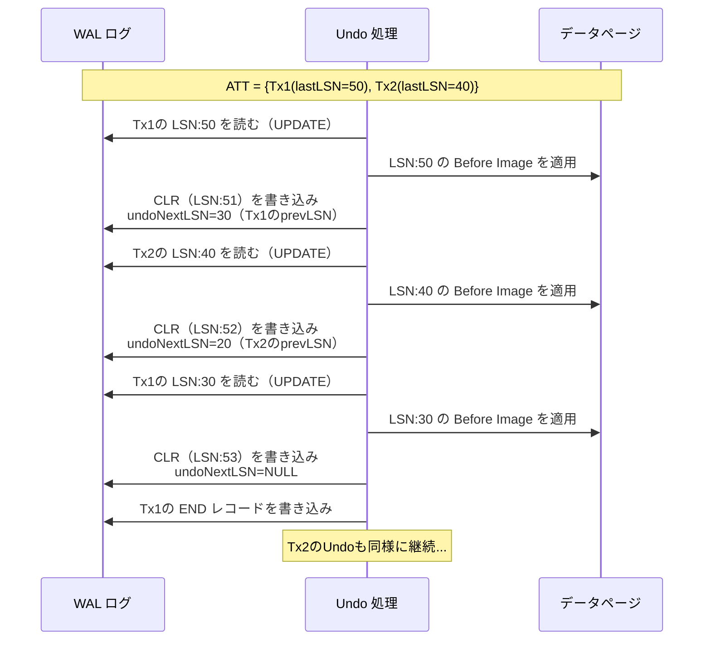

### 5.5 復旧の完全な例

具体的な例でARIESの3フェーズを追ってみよう。

```
WAL ログ:
LSN  | TxnID | Type       | PageID | prevLSN | Before → After
-----+-------+------------+--------+---------+----------------
 10  | Tx1   | UPDATE     | P1     | NULL    | A=100 → A=90
 20  | Tx2   | UPDATE     | P2     | NULL    | B=200 → B=250
 30  | Tx1   | UPDATE     | P3     | 10      | C=300 → C=350
 40  | Tx2   | UPDATE     | P1     | 20      | A=90  → A=85
 50  | Tx1   | COMMIT     | -      | 30      | -
 60  | Tx3   | UPDATE     | P4     | NULL    | D=400 → D=450
 70  | Tx3   | UPDATE     | P2     | 60      | B=250 → B=230

--- チェックポイント (begin_checkpoint LSN=75) ---
ATT: {Tx2(lastLSN=40, RUNNING), Tx3(lastLSN=70, RUNNING)}
DPT: {P1(recLSN=10), P2(recLSN=20), P3(recLSN=30), P4(recLSN=60)}
--- end_checkpoint LSN=80 ---

 85  | Tx2   | UPDATE     | P5     | 40      | E=500 → E=520
 90  | Tx3   | COMMIT     | -      | 70      | -

=== クラッシュ ===
```

**Analysisフェーズ:**
- チェックポイントからATTとDPTを読み込む
- LSN:85（Tx2 UPDATE P5）→ P5をDPT追加（recLSN=85）
- LSN:90（Tx3 COMMIT）→ Tx3をATTから削除
- 結果: ATT = {Tx2(lastLSN=85)}、DPT = {P1(10), P2(20), P3(30), P4(60), P5(85)}

**Redoフェーズ:**
- 開始点 = min(recLSN) = 10
- LSN 10 から順方向にスキャンし、DPT/pageLSNの条件を満たすレコードをすべてRedo

**Undoフェーズ:**
- ATTの Tx2 を Undo（lastLSN=85 から prevLSN チェインを辿る）
- LSN:85 をUndo → CLR生成
- LSN:40 をUndo → CLR生成
- LSN:20 をUndo → CLR生成
- Tx2 の END レコードを書き込み

## 6. WALの実装 — 主要データベースでの実践

### 6.1 PostgreSQL

PostgreSQLのWAL実装は、ARIESの思想に基づきつつ、実用的な設計上の工夫が加えられている。

**WALファイルの管理:**

PostgreSQLでは、WALは16MB（デフォルト）のセグメントファイルに分割される。ファイル名は24桁の16進数で、タイムラインID・ログファイル番号・セグメント番号から構成される。

```
pg_wal/
├── 000000010000000000000001
├── 000000010000000000000002
├── 000000010000000000000003
└── ...
```

**LSNの表現:**

PostgreSQLでは、LSNは64ビットの整数で表現され、WALファイル内の物理的なバイトオフセットに対応する。`pg_current_wal_lsn()` 関数で現在のLSN位置を確認できる。

```sql
-- check the current WAL LSN position
SELECT pg_current_wal_lsn();
-- result: 0/1A3B5C80

-- check the WAL insert position
SELECT pg_current_wal_insert_lsn();

-- calculate WAL generation rate
SELECT pg_wal_lsn_diff(
    pg_current_wal_lsn(),
    '0/1A3B5C80'
) AS bytes_generated;
```

**full_page_writes:**

PostgreSQLには `full_page_writes` という設定があり、チェックポイント後にページが最初に変更された際、ページ全体（通常8KB）のイメージをWALに書き込む。これは **torn page** 問題への対策である。

OSがページの書き込みを行っている途中でクラッシュが発生すると、ページの一部だけが書き込まれた状態（torn page）になりうる。full_page_writesにより、チェックポイント直後の完全なページイメージがWALに記録されているため、torn pageが発生してもWALからページ全体を復元できる。

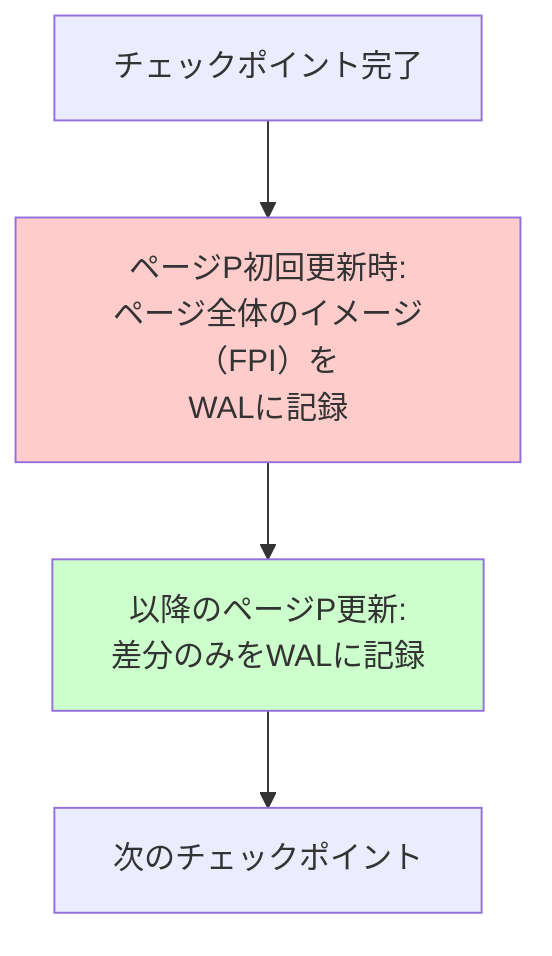

### 6.2 SQLite

SQLiteのWAL実装は、サーバー型データベースとは異なるアプローチを取っている。SQLiteはもともと**ロールバックジャーナル**方式を使用しており、WALモードはバージョン3.7.0（2010年）で追加されたオプションである。

**ロールバックジャーナル方式（デフォルト）：**

WALとは逆のアプローチで、変更前のページイメージをジャーナルファイルに保存してからデータベースファイルを直接変更する。ロールバックが必要な場合はジャーナルファイルから元のページを復元する。

**WALモード：**

WALモードでは、変更はデータベースファイルではなくWALファイル（`database-wal`）に追記される。読み取りクエリはデータベースファイルとWALの両方を参照する。WALがある程度の大きさに達すると、**チェックポイント**操作によってWALの変更がデータベースファイルに書き戻される。

```sql
-- enable WAL mode
PRAGMA journal_mode=WAL;

-- check current journal mode
PRAGMA journal_mode;
```

SQLiteのWALモードの特徴は、**読み取りと書き込みが同時に実行できる**ことである。ロールバックジャーナル方式では書き込み中に読み取りがブロックされるが、WALモードでは読み取り側はWAL適用前のデータベースファイルを参照できるため、ブロックが発生しない。

ただし、**書き込みは依然として排他的**であり、同時に複数の書き込みトランザクションは実行できない。これはSQLiteが組込み型の単一プロセス向けデータベースであるという設計思想に基づくものである。

### 6.3 InnoDB（MySQL）

InnoDBは独自のWAL実装を持ち、**redoログ**と**undoログ**を分離して管理する点が特徴的である。

**Redo Log:**

InnoDBのredo logは循環バッファ（circular buffer）として設計されている。固定サイズのファイル（通常2つ以上）でグループを構成し、末尾に達すると先頭に戻って書き込みを続ける。

```
ib_logfile0  ib_logfile1
+----------+ +----------+
|##########| |####......|
|##########| |..........|
+----------+ +----------+
 ^^^^^^^^^^^^  ^^^^
 書き込み済み   現在の
               書き込み位置
```

この設計は、WALファイルの管理を単純にする一方で、チェックポイントが追いつかないほどの書き込み負荷がかかると、redo logが一巡してまだ必要なログが上書きされる危険がある。そのため、InnoDBはredo logの空き容量が減ると、チェックポイント処理を積極的に実行してダーティページをフラッシュし、古いログ領域を解放する。

**Undo Log:**

InnoDBのundo logはテーブルスペース内のundo segmentに格納される。undo logはMVCC（Multi-Version Concurrency Control）の実現にも使われ、コミット済みのトランザクションのundo logは、そのバージョンを参照する可能性のあるトランザクションがすべて終了するまで保持される（purge処理）。

**Double Write Buffer:**

InnoDBは、PostgreSQLのfull_page_writesに相当する機能として**Double Write Buffer**を持つ。ダーティページをデータファイルに書き込む前に、まずdouble write bufferと呼ばれる領域にページのコピーを書き出す。これにより、ページ書き込み中のクラッシュによるtorn pageからの回復が可能になる。

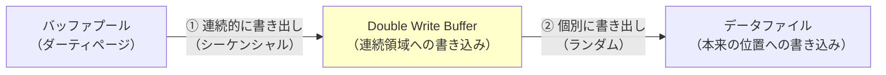

## 7. Group Commit

### 7.1 fsyncのコストとGroup Commitの動機

WALのCommit Ruleにより、各トランザクションのコミット時にfsyncを実行してWALをディスクに永続化する必要がある。しかし、fsyncはコストの高い操作である。

fsyncは、OSのファイルシステムバッファに滞留しているデータを物理ディスクにフラッシュする。HDDの場合、1回のfsyncには5〜10ミリ秒程度（ディスクの回転待ち＋書き込み時間）かかるため、fsyncを1トランザクションごとに1回実行すると、秒間100〜200トランザクション程度が上限になってしまう。

### 7.2 Group Commitの仕組み

**Group Commit** は、複数のトランザクションのコミットを束ねて1回のfsyncで永続化する最適化である。

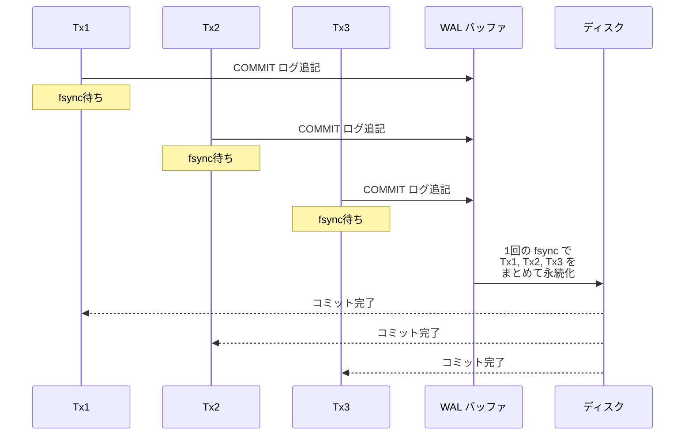

この仕組みにより、1回のfsyncで複数のトランザクションのコミットを永続化できる。同時実行トランザクション数が多いほどGroup Commitの効果は大きくなり、スループットが劇的に向上する。

### 7.3 Group Commitの実装戦略

Group Commitの実装には主に2つのアプローチがある。

**タイマーベース：**
一定時間（例えば数ミリ秒）ごとにfsyncを実行する。この間に蓄積されたすべてのコミットが1回のfsyncで永続化される。遅延時間とスループットのトレードオフがある。

**リーダーベース：**
最初にコミット要求を出したトランザクションが「リーダー」となり、fsyncを実行する。リーダーがfsyncの準備をしている間に到着した他のコミット要求も一緒に永続化される。

PostgreSQLは `commit_delay` パラメータでGroup Commitの遅延時間を制御する。MySQLのInnoDBは `innodb_flush_log_at_trx_commit` の設定により、コミットごとのfsync（値=1）、1秒ごとのfsync（値=2）、OSに任せる（値=0）の3段階を選択できる。

```sql
-- PostgreSQL: group commit delay (microseconds)
SET commit_delay = 10;       -- 10 microsecond delay
SET commit_siblings = 5;     -- only delay when >= 5 active transactions

-- MySQL/InnoDB: flush behavior on commit
-- 1 = fsync on every commit (default, safest)
-- 2 = write to OS buffer on commit, fsync once per second
-- 0 = write and fsync once per second (fastest, least safe)
SET GLOBAL innodb_flush_log_at_trx_commit = 1;
```

## 8. WALの性能特性とチューニング

### 8.1 WALが性能に与える影響

WALはデータベースの性能に複数の面で影響を与える。

**Write Amplification（書き込み増幅）：**

WALを使用すると、1つのデータ変更に対して最低でも2回のディスク書き込みが発生する。

1. WALログへの書き込み（シーケンシャル）
2. データページへの書き込み（ランダム、バックグラウンドで実行）

さらに、PostgreSQLのfull_page_writesやInnoDBのDouble Write Bufferを使用すると、追加の書き込みが発生する。この書き込み増幅はSSDの寿命に影響を与えるため、SSD環境ではチューニングが重要になる。

**WALバッファサイズ：**

WALバッファはメモリ上に確保される領域で、ログレコードは一旦ここに書き込まれてからディスクにフラッシュされる。バッファが小さすぎると頻繁にフラッシュが発生して性能が低下し、大きすぎるとメモリを無駄に消費する。

```sql
-- PostgreSQL: WAL buffer size (default: -1, auto-tuned to 1/32 of shared_buffers)
SET wal_buffers = '16MB';

-- MySQL/InnoDB: log buffer size
SET GLOBAL innodb_log_buffer_size = 16777216;  -- 16MB
```

### 8.2 チェックポイント頻度のチューニング

チェックポイントの頻度は、復旧時間と通常運用時の性能のトレードオフである。

- **チェックポイントが頻繁すぎる**: ダーティページの大量フラッシュがI/O負荷を発生させ、通常の処理に影響する
- **チェックポイントが少なすぎる**: WALファイルが大量に蓄積し、復旧時間が長くなる

```sql
-- PostgreSQL: checkpoint configuration
SET checkpoint_timeout = '10min';        -- time-based interval
SET max_wal_size = '2GB';               -- WAL size-based trigger
SET checkpoint_completion_target = 0.9;  -- spread I/O over 90% of interval

-- MySQL/InnoDB: checkpoint-related settings
SET GLOBAL innodb_log_file_size = 1073741824;       -- 1GB per log file
SET GLOBAL innodb_log_files_in_group = 2;            -- number of log files
```

### 8.3 WALの圧縮

WALログは大量のデータを生成するため、圧縮が効果的な場合がある。

PostgreSQLでは `wal_compression` パラメータを有効にすると、full page image（FPI）のデータを圧縮してWALに書き込む。FPIはWALサイズの大部分を占めることが多いため、この圧縮により WALの生成量を大幅に削減できる。

```sql
-- PostgreSQL: enable WAL compression
SET wal_compression = on;
```

ただし、圧縮にはCPUコストが伴うため、CPUがボトルネックになっている環境では逆効果になりうる。I/Oバウンドな環境では一般的に有効な最適化である。

### 8.4 WALのレプリケーションへの活用

WALは復旧だけでなく、**レプリケーション**のメカニズムとしても広く活用されている。WALには、データベースに対するすべての変更が記録されているため、このログをレプリカに転送してそこで再生すれば、プライマリと同じ状態を維持できる。

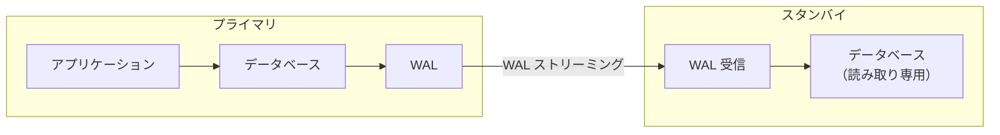

PostgreSQLの**ストリーミングレプリケーション**はまさにこの仕組みであり、WALレコードをリアルタイムでスタンバイサーバーに転送する。同期レプリケーション設定では、少なくとも1つのスタンバイがWALの受信を確認するまでコミットを完了しないため、データの損失を防ぐことができる。

MySQLでも、InnoDBのredo logとは別にバイナリログ（binlog）を使用してレプリケーションを行うが、InnoDBの内部的なredo logとbinlogの整合性を保つために **XA（二相コミット）** プロトコルが使われている。

## 9. WALを超えて — 代替手法

### 9.1 Shadow Paging

**Shadow Paging** は、WALとは異なるアプローチで永続性と原子性を実現する手法である。System R（IBMの初期のリレーショナルデータベース）で採用されていた。

Shadow Pagingの基本的なアイデアは以下のとおりである。

1. データベースのページテーブル（ページ番号と物理的なディスク位置のマッピング）のコピーを2つ持つ
   - **current page table**: 現在のトランザクションの変更を反映する
   - **shadow page table**: コミット済みの安定した状態を保持する
2. トランザクションがページを変更する際、新しい物理ページに書き込み、current page tableを更新する
3. コミット時に、current page tableをshadow page tableとして原子的に切り替える
4. アボート時に、current page tableを破棄してshadow page tableに戻す

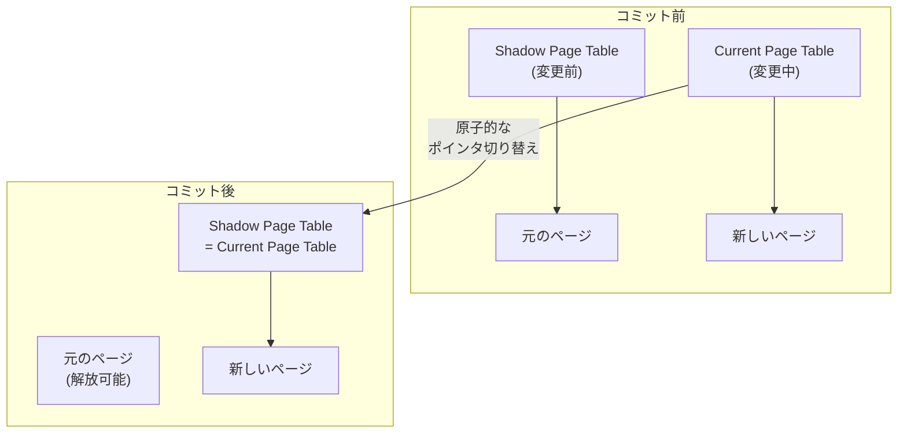

**Shadow Pagingの問題点：**

- ページが断片化し、関連するデータが物理的に散在する（ランダムI/Oの増加）
- 大量のページを変更するトランザクションでは、多数のページのコピーが必要
- ガベージコレクション（古いページの回収）が複雑
- 大きなページテーブルの原子的な切り替えが困難

これらの問題から、現代の高性能データベースシステムではShadow Pagingよりも WALが広く採用されている。

### 9.2 Copy-on-Write（CoW）B-Tree

**Copy-on-Write B-Tree** は、Shadow Pagingの考え方をB-Treeに適用したアプローチである。ページを更新する際、そのページのコピーを新しい場所に作成し、変更を加え、親ノードのポインタを新しいページに向ける。この変更は親ノードにも波及するため、最終的にはルートノードまでの経路上のすべてのノードがコピーされることになる（path copying）。

この方式を採用した代表的なシステムとして、**LMDB（Lightning Memory-Mapped Database）** と **Btrfs** がある。

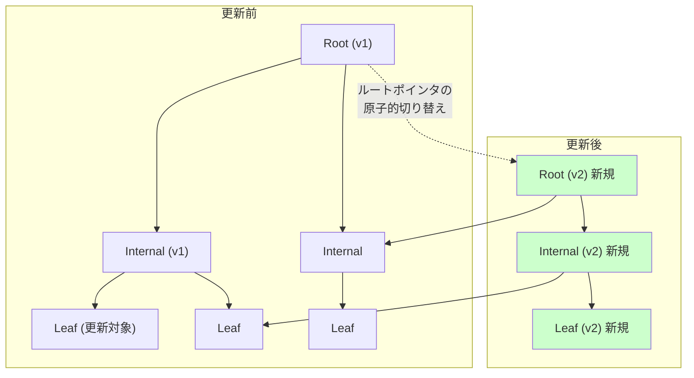

**CoW B-Treeの長所：**
- WALが不要なため、Write Amplificationが減少する可能性がある
- 古いバージョンのツリーが残るため、スナップショット読み取りが自然に実現できる
- 実装が比較的シンプル

**CoW B-Treeの短所：**
- 小さな変更でもルートまでのパス全体をコピーする必要がある（Write Amplification）
- データの物理的な局所性が失われる（断片化）
- ガベージコレクションが必要

### 9.3 WALの優位性

WALが現代のデータベースシステムで支配的な地位を占めている理由をまとめると、以下のようになる。

| 特性 | WAL | Shadow Paging | CoW B-Tree |
|---|---|---|---|
| コミットの性能 | シーケンシャルI/Oのみ | ポインタ切り替え（高速） | パスコピー＋ポインタ切り替え |
| データの局所性 | in-placeで維持 | 断片化しやすい | 断片化しやすい |
| 復旧の複雑さ | 高い（ARIES） | 低い | 低い |
| Write Amplification | ログ＋データの二重書き込み | ページコピー | パスコピー |
| 同時実行制御との統合 | 柔軟（MVCC等と組み合わせ可能） | 制限的 | スナップショット隔離に適する |
| レプリケーション | WALストリーミングが自然 | 追加の仕組みが必要 | 追加の仕組みが必要 |

WALは復旧アルゴリズムの複雑さというコストを払う代わりに、通常運用時の高い性能、柔軟な同時実行制御、効率的なレプリケーションなど、多くの利点を提供する。特に、データの物理的な局所性を維持できることは、大規模なデータセットを扱う場面では非常に重要である。

## 10. まとめ

Write-Ahead Logging（WAL）は、データベースシステムにおける永続性と復旧の根幹を支える仕組みである。「データを変更する前にログを先に書く」というシンプルな原則は、シーケンシャルI/Oの高速性を活かしてコミットの永続性を保証し、クラッシュからの確実な回復を可能にする。

WALの核心的なアイデアを要約すると以下のようになる。

1. **ランダムI/OをシーケンシャルI/Oに変換する**: データページへの直接的な変更（ランダムI/O）の前に、ログへの追記（シーケンシャルI/O）で永続性を確保する
2. **Steal/No-Force方式による柔軟なバッファ管理**: メモリ管理の制約を最小化しつつ、UndoとRedoの仕組みで正しさを保証する
3. **ARIESによる体系的な復旧**: Analysis→Redo→Undoの3フェーズで、あらゆるクラッシュシナリオに対応する
4. **Group Commitによるスループットの最大化**: fsyncのコストを複数のトランザクションで分担する

WALはその登場から40年以上を経た今日でも、PostgreSQL、MySQL（InnoDB）、SQLiteをはじめとする主要なデータベースシステムの基盤として現役で活躍している。Shadow PagingやCopy-on-Write方式といった代替手法も存在するが、WALの提供する性能特性、柔軟性、そしてレプリケーションとの自然な統合は、依然として多くのユースケースにおいて最良の選択肢であり続けている。

データベースの内部構造を理解する上で、WALとARIESの仕組みを把握することは避けて通れない。これらの知識は、データベースのチューニング、障害対応、さらには新しいストレージシステムの設計においても、確固たる基盤となるだろう。
