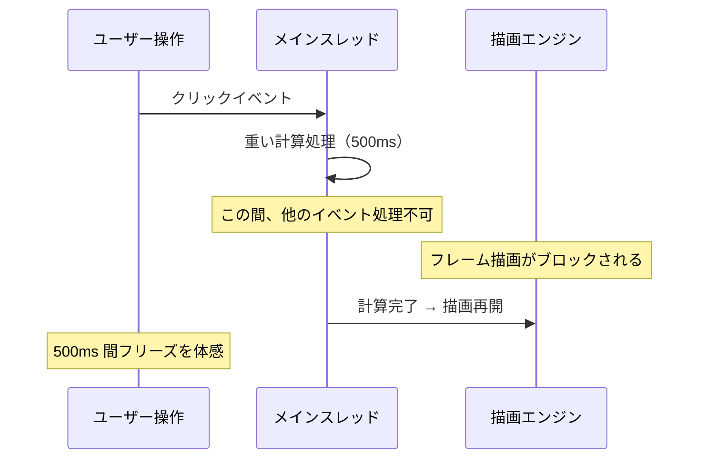
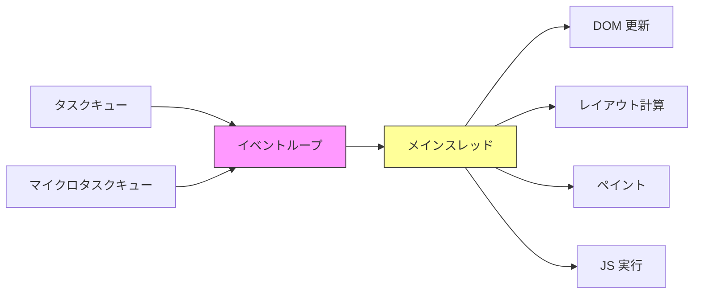
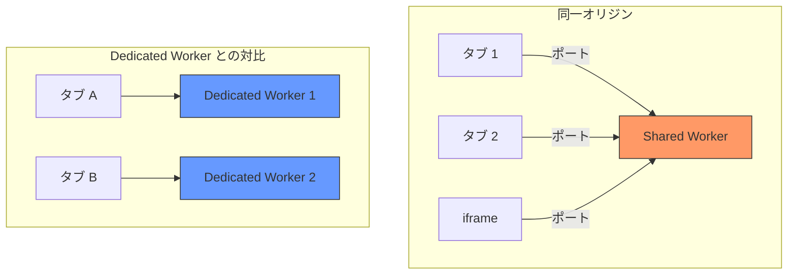
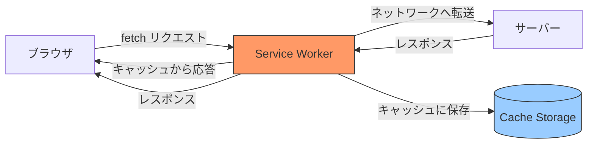
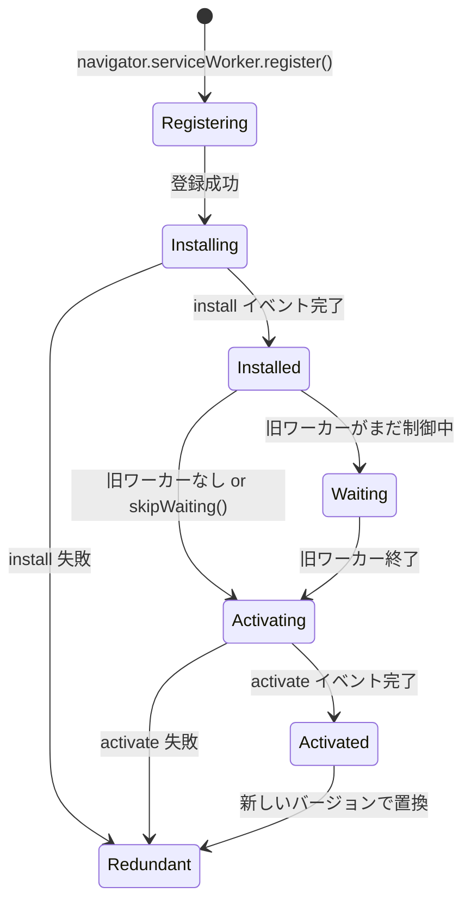
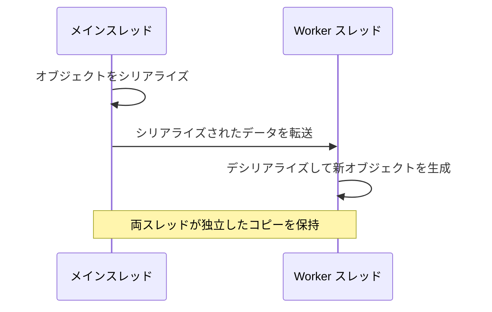
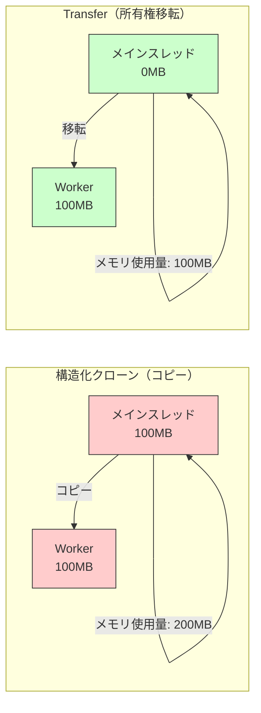
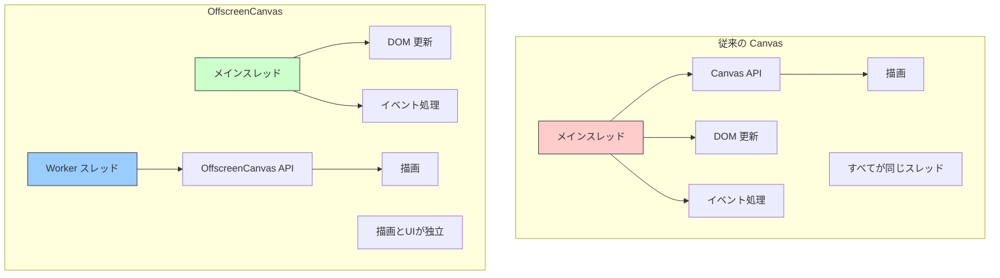
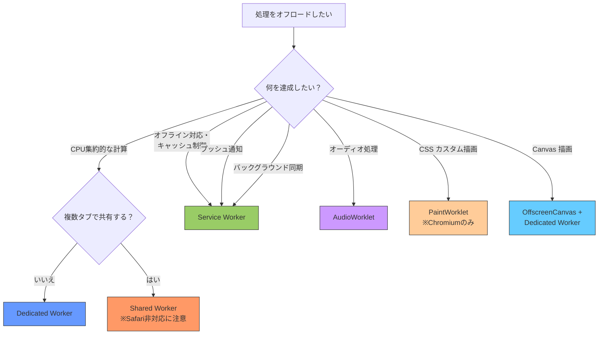

# Web Workers と並列処理 — ブラウザにおけるマルチスレッドの全貌

## 1. メインスレッドのボトルネック

### 1.1 ブラウザのシングルスレッドモデル

ブラウザにおける JavaScript の実行は、原則として**シングルスレッド**で行われる。DOM の操作、イベントハンドラの実行、レイアウト計算、ペイント処理――これらすべてが1つのスレッド（メインスレッド）上で逐次的に処理される。この設計は、DOM という共有状態へのアクセスを同期的に行えるという利点がある一方、深刻なパフォーマンス問題を引き起こす。

ユーザーがボタンをクリックしたとき、その応答として複雑な計算を実行すると、計算が完了するまでブラウザはフリーズする。スクロールが止まり、アニメーションがカクつき、入力に対する反応が途絶える。ブラウザは 16.7ms（60fps の場合）ごとにフレームを描画する必要があるが、長時間実行される JavaScript がメインスレッドを占有すると、フレームの描画が間に合わなくなる。



### 1.2 イベントループの仕組みと限界

JavaScript のシングルスレッドモデルは、**イベントループ**によって非同期処理を実現している。コールバック関数やPromise の then ハンドラはタスクキューやマイクロタスクキューに積まれ、メインスレッドが空いたときに順次実行される。

しかし、イベントループはあくまで「1つのスレッドで複数のタスクを切り替える」仕組みにすぎず、CPU バウンドな処理を高速化する手段ではない。1000万件のデータソートやリアルタイム画像処理など、真に計算量が多い処理にはイベントループだけでは対処できない。



### 1.3 Long Task の影響

Chrome の Performance API は、50ms を超えるタスクを「Long Task」と定義している。Long Task が発生すると、以下のようなユーザー体験の劣化が生じる。

| Long Task の持続時間 | ユーザーへの影響 |
|---|---|
| 50ms～100ms | 入力遅延を感じ始める |
| 100ms～300ms | 明確にもたつきを感じる |
| 300ms～1000ms | アプリが応答していないと感じる |
| 1000ms 以上 | ブラウザがクラッシュしたと誤認する |

Google の Core Web Vitals において、**Interaction to Next Paint（INP）** は Long Task の影響を直接測定する指標であり、200ms 以下が「良好」と判定される。メインスレッドを占有する処理をオフロードする手段として、Web Workers が必要になる背景がここにある。

## 2. Dedicated Worker

### 2.1 基本概念

**Dedicated Worker**（専用ワーカー）は、Web Workers の最も基本的な形態である。生成元のスクリプトと1対1の関係を持ち、メインスレッドとは独立したスレッドで JavaScript を実行する。HTML5 の仕様として 2009 年頃に標準化が進み、現在ではすべての主要ブラウザで利用可能である。

Dedicated Worker の核心的な特徴は以下の通りである。

- **独立したグローバルスコープ**: `DedicatedWorkerGlobalScope` を持ち、`window` オブジェクトや DOM にはアクセスできない
- **メッセージパッシング**: メインスレッドとの通信は `postMessage` / `onmessage` を通じて行う
- **同一オリジン制約**: ワーカースクリプトは生成元と同一オリジンのものしか読み込めない
- **独自のイベントループ**: メインスレッドとは別のイベントループを持つ

### 2.2 基本的な使い方

ワーカーの生成と通信は非常にシンプルである。

```js
// main.js
const worker = new Worker('worker.js');

// Send data to worker
worker.postMessage({ type: 'sort', data: largeArray });

// Receive result from worker
worker.onmessage = (event) => {
  console.log('Sorted:', event.data);
};

// Handle errors
worker.onerror = (error) => {
  console.error('Worker error:', error.message);
};
```

```js
// worker.js
self.onmessage = (event) => {
  const { type, data } = event.data;

  if (type === 'sort') {
    // Heavy computation runs off the main thread
    const sorted = data.sort((a, b) => a - b);
    self.postMessage(sorted);
  }
};
```

### 2.3 モジュールワーカー

ES Modules をワーカー内で使用する場合、コンストラクタの `type` オプションに `'module'` を指定する。

```js
// main.js
const worker = new Worker('worker.js', { type: 'module' });
```

```js
// worker.js (ES Module)
import { heavyComputation } from './compute.js';

self.onmessage = (event) => {
  const result = heavyComputation(event.data);
  self.postMessage(result);
};
```

モジュールワーカーは `import` / `export` 構文を利用でき、コードの構造化が容易になる。ただし、従来の `importScripts()` はモジュールワーカーでは使用できない点に注意が必要である。

### 2.4 インラインワーカー

外部ファイルを用意せずにワーカーを作成する手法として、`Blob` と `URL.createObjectURL` を組み合わせたインラインワーカーがある。

```js
// Create an inline worker from a string
const workerCode = `
  self.onmessage = (event) => {
    const result = event.data.map(x => x * x);
    self.postMessage(result);
  };
`;

const blob = new Blob([workerCode], { type: 'application/javascript' });
const workerUrl = URL.createObjectURL(blob);
const worker = new Worker(workerUrl);

worker.postMessage([1, 2, 3, 4, 5]);
worker.onmessage = (event) => {
  console.log(event.data); // [1, 4, 9, 16, 25]
  URL.revokeObjectURL(workerUrl); // Clean up
};
```

バンドラーとの統合が難しい場面や、動的にワーカーコードを生成する場合に有用だが、デバッグが困難になるデメリットもある。

### 2.5 ワーカー内で利用可能な API

Dedicated Worker のグローバルスコープ（`DedicatedWorkerGlobalScope`）では、以下の API が利用可能である。

| 利用可能 | 利用不可 |
|---|---|
| `fetch` / `XMLHttpRequest` | `document` / DOM API |
| `setTimeout` / `setInterval` | `window` オブジェクト |
| `IndexedDB` | `localStorage` / `sessionStorage` |
| `WebSocket` | `alert` / `confirm` / `prompt` |
| `crypto` | UI 関連 API 全般 |
| `TextEncoder` / `TextDecoder` | `parent` |
| `structuredClone` | — |
| `Cache API` | — |

### 2.6 ワーカーの終了

ワーカーは明示的に終了させる必要がある。終了方法は2つある。

```js
// From the main thread
worker.terminate();

// From inside the worker
self.close();
```

`terminate()` は即座にワーカーを強制終了する。進行中の処理は中断され、未処理のメッセージは破棄される。一方、`self.close()` はワーカー自身が終了を宣言するが、現在のイベントループの反復が完了するまで待機してから終了する。

## 3. Shared Worker

### 3.1 複数コンテキスト間の共有

**Shared Worker**（共有ワーカー）は、同一オリジンの複数のブラウジングコンテキスト（タブ、ウィンドウ、iframe）から共有される単一のワーカーである。Dedicated Worker が1対1の関係であるのに対し、Shared Worker は1対多の関係を構築する。



### 3.2 ポートベースの通信

Shared Worker は `MessagePort` を通じてクライアントと通信する。各クライアントには個別のポートが割り当てられ、ワーカー内でポートごとにメッセージを送受信する。

```js
// main.js (each tab runs this)
const worker = new SharedWorker('shared-worker.js');

worker.port.start();

worker.port.postMessage({ action: 'increment' });

worker.port.onmessage = (event) => {
  console.log('Current count:', event.data.count);
};
```

```js
// shared-worker.js
let count = 0;
const ports = [];

self.onconnect = (event) => {
  const port = event.ports[0];
  ports.push(port);

  port.onmessage = (e) => {
    if (e.data.action === 'increment') {
      count++;
      // Broadcast updated count to all connected ports
      ports.forEach((p) => {
        p.postMessage({ count });
      });
    }
  };

  port.start();
};
```

### 3.3 ユースケースと制約

Shared Worker は以下のようなシナリオで効果を発揮する。

- **タブ間の状態同期**: 複数タブでログイン状態やカートの内容を共有する
- **WebSocket 接続の共有**: 複数タブが同一の WebSocket コネクションを利用する
- **共有キャッシュ**: API レスポンスを複数タブで共有してリクエスト数を削減する

しかし、Shared Worker にはいくつかの重要な制約がある。

- **ブラウザサポートの制限**: 2026 年現在、Safari が Shared Worker を正式にサポートしていない（Safari 16 以降は部分的なサポートが存在するが完全ではない）
- **デバッグの困難さ**: Chrome DevTools では `chrome://inspect/#workers` でインスペクションできるが、通常のタブ開発ツールからは直接見えない
- **ライフサイクル管理**: すべてのポートが閉じられるまでワーカーは生存し続けるため、メモリリークのリスクがある

これらの制約から、実務では Shared Worker の代わりに **BroadcastChannel API** や **Service Worker** を用いたタブ間通信が選択されることも多い。

## 4. Service Worker

### 4.1 ネットワークプロキシとしての位置づけ

**Service Worker** は、ブラウザとネットワークの間に位置するプログラマブルなプロキシとして設計されたワーカーである。Dedicated Worker や Shared Worker が計算処理のオフロードを主目的とするのに対し、Service Worker はネットワークリクエストの制御、オフライン対応、プッシュ通知など、Web アプリケーションのライフサイクル全体に関わる機能を提供する。



### 4.2 ライフサイクル

Service Worker は独特のライフサイクルを持つ。ページのリロードとは独立して動作し、登録・インストール・アクティベーションの3段階を経て有効化される。



### 4.3 登録とインストール

```js
// main.js - Register service worker
if ('serviceWorker' in navigator) {
  navigator.serviceWorker.register('/sw.js', {
    scope: '/'
  }).then((registration) => {
    console.log('SW registered with scope:', registration.scope);
  }).catch((error) => {
    console.error('SW registration failed:', error);
  });
}
```

```js
// sw.js - Service Worker
const CACHE_NAME = 'app-cache-v1';
const PRECACHE_URLS = [
  '/',
  '/index.html',
  '/styles.css',
  '/app.js'
];

// Install event: pre-cache critical resources
self.addEventListener('install', (event) => {
  event.waitUntil(
    caches.open(CACHE_NAME).then((cache) => {
      return cache.addAll(PRECACHE_URLS);
    })
  );
});

// Activate event: clean up old caches
self.addEventListener('activate', (event) => {
  event.waitUntil(
    caches.keys().then((cacheNames) => {
      return Promise.all(
        cacheNames
          .filter((name) => name !== CACHE_NAME)
          .map((name) => caches.delete(name))
      );
    })
  );
});

// Fetch event: serve from cache, fallback to network
self.addEventListener('fetch', (event) => {
  event.respondWith(
    caches.match(event.request).then((cachedResponse) => {
      if (cachedResponse) {
        return cachedResponse;
      }
      return fetch(event.request).then((response) => {
        // Cache the new response for future use
        const responseToCache = response.clone();
        caches.open(CACHE_NAME).then((cache) => {
          cache.put(event.request, responseToCache);
        });
        return response;
      });
    })
  );
});
```

### 4.4 キャッシュ戦略

Service Worker のキャッシュ戦略は、アプリケーションの要件に応じて複数のパターンから選択する。

| 戦略 | 動作 | 適用場面 |
|---|---|---|
| Cache First | キャッシュ優先、なければネットワーク | 静的アセット（CSS, JS, 画像） |
| Network First | ネットワーク優先、失敗したらキャッシュ | API レスポンス、頻繁に更新されるデータ |
| Stale While Revalidate | キャッシュを即返し、裏でネットワーク更新 | ニュースフィード、ユーザープロフィール |
| Network Only | 常にネットワークから取得 | 認証リクエスト、決済処理 |
| Cache Only | 常にキャッシュから取得 | プリキャッシュ済みの固定リソース |

### 4.5 Dedicated Worker / Shared Worker との本質的な違い

Service Worker は他のワーカーと以下の点で根本的に異なる。

- **ライフサイクルの独立性**: ページが閉じられてもブラウザがワーカーを維持できる（プッシュ通知やバックグラウンド同期に必要）
- **fetch イベントのインターセプト**: すべてのネットワークリクエストを横取りし、任意のレスポンスを返せる
- **HTTPS 必須**: セキュリティ上の理由から localhost 以外では HTTPS が必須
- **DOM アクセス不可**: 他のワーカーと同様に DOM にはアクセスできないが、`clients` API を通じてページを制御できる
- **更新メカニズム**: ブラウザはバイト単位でスクリプトの変更を検出し、自動的に更新プロセスを開始する

### 4.6 プッシュ通知とバックグラウンド同期

Service Worker は Push API と連携してプッシュ通知を実現する。

```js
// sw.js
self.addEventListener('push', (event) => {
  const data = event.data.json();

  event.waitUntil(
    self.registration.showNotification(data.title, {
      body: data.body,
      icon: '/icon-192.png',
      badge: '/badge-72.png',
      data: { url: data.url }
    })
  );
});

self.addEventListener('notificationclick', (event) => {
  event.notification.close();

  event.waitUntil(
    clients.openWindow(event.notification.data.url)
  );
});
```

**Background Sync API** を使えば、オフライン時に失敗したリクエストをネットワーク復帰時に自動的にリトライすることも可能である。

```js
// main.js - Register sync
navigator.serviceWorker.ready.then((registration) => {
  return registration.sync.register('send-message');
});

// sw.js - Handle sync
self.addEventListener('sync', (event) => {
  if (event.tag === 'send-message') {
    event.waitUntil(sendPendingMessages());
  }
});
```

## 5. Worklet

### 5.1 Worklet の設計思想

**Worklet** は、ブラウザのレンダリングパイプラインやオーディオ処理パイプラインの内部に軽量なスクリプトを注入するための仕組みである。Worker とは異なり、Worklet はブラウザエンジンの特定のステージに密結合しており、そのステージが要求するタイミングで同期的に実行される。

Worklet の設計上の特徴は以下の通りである。

- **軽量性**: Worker よりもオーバーヘッドが小さく、レンダリングパイプラインのクリティカルパスで使用される
- **制限されたグローバルスコープ**: 利用可能な API が極めて限定的
- **クラスベースの登録**: `registerProcessor` や `registerPaint` のようなクラス登録関数を通じてコードを挿入する
- **複数インスタンスの可能性**: ブラウザは複数のスレッドで Worklet のインスタンスを実行する可能性がある

### 5.2 AudioWorklet

**AudioWorklet** は、Web Audio API のオーディオ処理をメインスレッドから分離するために設計された Worklet である。従来の `ScriptProcessorNode` はメインスレッドで動作しており、メインスレッドのブロッキングがオーディオのグリッチ（音飛び）を引き起こす問題があった。AudioWorklet はオーディオレンダリングスレッド上で動作し、この問題を解決する。

```js
// main.js - Load and use AudioWorklet
const audioContext = new AudioContext();

await audioContext.audioWorklet.addModule('noise-processor.js');

const noiseNode = new AudioWorkletNode(audioContext, 'noise-processor');
noiseNode.connect(audioContext.destination);
```

```js
// noise-processor.js - AudioWorkletProcessor
class NoiseProcessor extends AudioWorkletProcessor {
  process(inputs, outputs, parameters) {
    const output = outputs[0];

    for (let channel = 0; channel < output.length; channel++) {
      const outputChannel = output[channel];
      for (let i = 0; i < outputChannel.length; i++) {
        // Generate white noise
        outputChannel[i] = Math.random() * 2 - 1;
      }
    }

    // Return true to keep the processor alive
    return true;
  }
}

registerProcessor('noise-processor', NoiseProcessor);
```

AudioWorklet の `process` メソッドは 128 サンプルごとに呼び出される。サンプルレートが 44100Hz の場合、約 2.9ms ごとに呼び出される計算になる。この厳格なリアルタイム制約のもとでは、メインスレッド上での処理は事実上不可能であり、AudioWorklet の存在意義がある。

### 5.3 CSS PaintWorklet（Houdini）

**PaintWorklet** は CSS Houdini プロジェクトの一部として策定された Worklet で、CSS の `background-image` やボーダー描画などをプログラマブルに制御する。Canvas 2D に似た描画 API を提供するが、DOM には依存せず、レンダリングパイプラインの Paint ステージで直接実行される。

```js
// main.js - Register paint worklet
CSS.paintWorklet.addModule('checkerboard-painter.js');
```

```js
// checkerboard-painter.js
class CheckerboardPainter {
  static get inputProperties() {
    return ['--checker-size', '--checker-color'];
  }

  paint(ctx, size, properties) {
    const checkerSize = parseInt(properties.get('--checker-size').toString()) || 16;
    const color = properties.get('--checker-color').toString().trim() || '#000';

    for (let y = 0; y < size.height; y += checkerSize) {
      for (let x = 0; x < size.width; x += checkerSize) {
        if ((x / checkerSize + y / checkerSize) % 2 === 0) {
          ctx.fillStyle = color;
          ctx.fillRect(x, y, checkerSize, checkerSize);
        }
      }
    }
  }
}

registerPaint('checkerboard', CheckerboardPainter);
```

```css
.element {
  --checker-size: 20;
  --checker-color: #3498db;
  background-image: paint(checkerboard);
  width: 200px;
  height: 200px;
}
```

::: warning
PaintWorklet は 2026 年現在、Chromium ベースのブラウザ（Chrome, Edge）でサポートされているが、Firefox と Safari では未実装である。プロダクション利用にはプログレッシブエンハンスメントの戦略が必要になる。
:::

### 5.4 その他の Worklet

| Worklet | 目的 | ステータス（2026年現在） |
|---|---|---|
| AudioWorklet | オーディオ処理 | 主要ブラウザで安定サポート |
| PaintWorklet | CSS カスタム描画 | Chromium のみ |
| AnimationWorklet | カスタムアニメーション | 実験的（Chrome のみ） |
| LayoutWorklet | カスタムレイアウトアルゴリズム | 実験的（Chrome のみ） |

AnimationWorklet は、メインスレッドのジャンクに影響されないスムーズなアニメーションを実現する目的で設計されている。LayoutWorklet は CSS のカスタムレイアウトエンジンを定義できるが、仕様の策定はまだ進行中である。

## 6. メッセージパッシングと Transferable Objects

### 6.1 構造化クローンアルゴリズム

メインスレッドとワーカー間のデータ通信は、デフォルトで**構造化クローンアルゴリズム（Structured Clone Algorithm）** を用いたディープコピーによって行われる。`postMessage` でオブジェクトを送信すると、送信側のデータはシリアライズされ、受信側で新しいオブジェクトとしてデシリアライズされる。



構造化クローンアルゴリズムがサポートする型は以下の通りである。

- プリミティブ値（`number`, `string`, `boolean`, `null`, `undefined`）
- `Date`, `RegExp`, `Blob`, `File`, `FileList`
- `ArrayBuffer`, 型付き配列（`Uint8Array` など）
- `Map`, `Set`
- プレーンオブジェクト、配列（ネスト可）
- `Error` オブジェクト

一方、以下の型はクローンできず、`postMessage` で送信するとエラーになる。

- **関数**（`Function` オブジェクト）
- **DOM ノード**
- **Symbol**
- **WeakMap** / **WeakSet**

### 6.2 コピーコストの問題

構造化クローンはスレッド安全性を保証する堅実な手法だが、大きなデータを扱う場合にはコピーコストが深刻なボトルネックになる。100MB の `ArrayBuffer` を `postMessage` で送信すると、100MB 分のメモリアロケーションとデータコピーが発生し、場合によってはワーカーを使う意味がないほどのオーバーヘッドとなる。

```js
// Sending a large ArrayBuffer (creates a full copy)
const buffer = new ArrayBuffer(100 * 1024 * 1024); // 100 MB
const view = new Uint8Array(buffer);

// Fill with data
for (let i = 0; i < view.length; i++) {
  view[i] = i % 256;
}

console.time('postMessage copy');
worker.postMessage(buffer); // Full 100 MB copy
console.timeEnd('postMessage copy');
// Typically 50-200ms depending on hardware
```

### 6.3 Transferable Objects による所有権移転

**Transferable Objects** は、コピーではなく**所有権の移転（transfer）** によってスレッド間のデータ受け渡しを実現する仕組みである。転送されたオブジェクトは送信側では使用不可になり、受信側のみがアクセスできるようになる。コピーが発生しないため、データサイズに関係なくほぼ一定時間で転送が完了する。

```js
// Transfer an ArrayBuffer (near-zero cost)
const buffer = new ArrayBuffer(100 * 1024 * 1024); // 100 MB

console.time('postMessage transfer');
worker.postMessage(buffer, [buffer]); // Transfer ownership
console.timeEnd('postMessage transfer');
// Typically < 1ms regardless of size

// buffer.byteLength is now 0 - the buffer has been neutered
console.log(buffer.byteLength); // 0
```

Transferable Objects に対応している型は以下の通りである。

- `ArrayBuffer`
- `MessagePort`
- `ReadableStream` / `WritableStream` / `TransformStream`
- `ImageBitmap`
- `OffscreenCanvas`
- `VideoFrame`（一部ブラウザ）



### 6.4 structuredClone と postMessage の使い分け

`structuredClone` 関数（ES2022 で標準化）は、同一スレッド内でのディープコピーに使用する。`postMessage` とは異なり、スレッド間転送は行わないが、同じ構造化クローンアルゴリズムを使用する。

```js
// Deep clone within the same thread
const original = { nested: { value: 42 }, buffer: new ArrayBuffer(1024) };
const clone = structuredClone(original);

// Transfer within structuredClone
const transferred = structuredClone(original, {
  transfer: [original.buffer]
});
// original.buffer.byteLength === 0
```

## 7. SharedArrayBuffer と Atomics

### 7.1 真の共有メモリ

**SharedArrayBuffer** は、複数のスレッド（メインスレッドと Worker）が同一のメモリ領域を直接参照できる仕組みである。Transferable Objects が「所有権の移転」であるのに対し、SharedArrayBuffer は「同時アクセス」を可能にする。これにより、コピーも移転も不要な真のゼロコスト共有が実現する。

```js
// main.js - Create shared memory
const sharedBuffer = new SharedArrayBuffer(1024);
const sharedArray = new Int32Array(sharedBuffer);

// Send shared buffer to worker (no copy, no transfer)
worker.postMessage({ buffer: sharedBuffer });

// Both threads can now read/write the same memory
sharedArray[0] = 42;
```

```js
// worker.js - Access the same memory
self.onmessage = (event) => {
  const sharedArray = new Int32Array(event.data.buffer);
  console.log(sharedArray[0]); // 42 (same memory)
  sharedArray[1] = 100; // Visible to main thread
};
```

### 7.2 Spectre 脆弱性と Cross-Origin Isolation

SharedArrayBuffer は 2018 年の **Spectre** 脆弱性の発覚により、一時的にすべてのブラウザで無効化された。Spectre 攻撃は、SharedArrayBuffer を高精度タイマーとして悪用し、他のプロセスのメモリを推測的に読み取ることが可能であった。

現在、SharedArrayBuffer を使用するには**クロスオリジン分離（Cross-Origin Isolation）** が必要である。サーバーが以下のHTTPヘッダを返す必要がある。

```
Cross-Origin-Opener-Policy: same-origin
Cross-Origin-Embedder-Policy: require-corp
```

```js
// Check if cross-origin isolated
if (crossOriginIsolated) {
  // SharedArrayBuffer is available
  const sab = new SharedArrayBuffer(1024);
} else {
  console.warn('SharedArrayBuffer is not available');
}
```

### 7.3 Atomics API

共有メモリに対する並行アクセスは**データ競合（data race）** を引き起こす。複数のスレッドが同時に同じメモリ位置を読み書きすると、結果が不定になる。この問題を解決するのが **Atomics** API である。

Atomics はハードウェアレベルのアトミック操作を JavaScript から利用可能にする。以下の操作が提供される。

```js
// Atomic operations on shared memory
const sharedBuffer = new SharedArrayBuffer(4);
const sharedArray = new Int32Array(sharedBuffer);

// Atomic read and write
Atomics.store(sharedArray, 0, 42);     // Atomic write
const value = Atomics.load(sharedArray, 0); // Atomic read

// Atomic arithmetic
Atomics.add(sharedArray, 0, 10);       // Atomic add (returns old value)
Atomics.sub(sharedArray, 0, 5);        // Atomic subtract

// Atomic compare-and-swap
Atomics.compareExchange(sharedArray, 0, 47, 100);
// If sharedArray[0] === 47, set to 100

// Atomic bitwise operations
Atomics.and(sharedArray, 0, 0xFF);
Atomics.or(sharedArray, 0, 0x0F);
Atomics.xor(sharedArray, 0, 0xFF);
```

### 7.4 Atomics.wait と Atomics.notify

スレッド間の同期には `Atomics.wait` と `Atomics.notify` を使用する。これは OS レベルの futex（fast userspace mutex）に相当する低レベルプリミティブである。

```js
// worker.js - Wait for a signal
const sharedArray = new Int32Array(sharedBuffer);

// Block until sharedArray[0] is no longer 0
// (Only works in Worker threads, not on main thread)
const result = Atomics.wait(sharedArray, 0, 0);
// result: "ok" | "not-equal" | "timed-out"

console.log('Woke up! Value:', Atomics.load(sharedArray, 0));
```

```js
// main.js - Send a signal
const sharedArray = new Int32Array(sharedBuffer);

Atomics.store(sharedArray, 0, 1);
Atomics.notify(sharedArray, 0, 1); // Wake up 1 waiting thread
```

::: warning
`Atomics.wait` はメインスレッドでは使用できない（メインスレッドをブロックすることは禁止されているため）。メインスレッドで非同期に待機する場合は `Atomics.waitAsync` を使用する。
:::

```js
// main.js - Non-blocking wait (main thread safe)
const result = Atomics.waitAsync(sharedArray, 0, 0);

if (result.async) {
  result.value.then((status) => {
    console.log('Async wait resolved:', status);
  });
} else {
  console.log('Resolved immediately:', result.value);
}
```

### 7.5 ミューテックスの実装例

Atomics を使って簡易的なミューテックス（排他ロック）を実装できる。

```js
// Simple mutex implementation using Atomics
class Mutex {
  // index 0 of the shared Int32Array is used as lock state
  // 0 = unlocked, 1 = locked
  constructor(sharedArray, index = 0) {
    this.sharedArray = sharedArray;
    this.index = index;
  }

  lock() {
    while (true) {
      // Try to acquire lock: CAS(0 -> 1)
      if (Atomics.compareExchange(this.sharedArray, this.index, 0, 1) === 0) {
        return; // Lock acquired
      }
      // Wait until the lock is released
      Atomics.wait(this.sharedArray, this.index, 1);
    }
  }

  unlock() {
    Atomics.store(this.sharedArray, this.index, 0);
    Atomics.notify(this.sharedArray, this.index, 1);
  }
}
```

この実装はスピンロックと `Atomics.wait` を組み合わせたもので、ロック競合時に CPU リソースを浪費せずに待機できる。ただし、JavaScript レベルでのミューテックス実装はデッドロックの危険があるため、慎重な設計が必要である。

## 8. OffscreenCanvas

### 8.1 Canvas 描画のスレッド分離

**OffscreenCanvas** は、Canvas の描画処理をメインスレッドから完全に分離する API である。通常の `<canvas>` 要素は DOM に結びついており、描画操作はメインスレッドで行わなければならない。OffscreenCanvas はこの制約を取り払い、Worker スレッドで Canvas 描画を実行可能にする。



### 8.2 transferControlToOffscreen

DOM 上の `<canvas>` 要素から `OffscreenCanvas` を取得するには、`transferControlToOffscreen()` メソッドを使用する。

```html
<canvas id="myCanvas" width="800" height="600"></canvas>
```

```js
// main.js - Transfer canvas control to worker
const canvas = document.getElementById('myCanvas');
const offscreen = canvas.transferControlToOffscreen();

const worker = new Worker('render-worker.js');
worker.postMessage({ canvas: offscreen }, [offscreen]);
```

```js
// render-worker.js - Render in worker thread
self.onmessage = (event) => {
  const canvas = event.data.canvas;
  const ctx = canvas.getContext('2d');

  let frame = 0;

  function render() {
    ctx.clearRect(0, 0, canvas.width, canvas.height);

    // Complex rendering logic
    for (let i = 0; i < 1000; i++) {
      const x = Math.sin(frame * 0.01 + i * 0.1) * 300 + 400;
      const y = Math.cos(frame * 0.01 + i * 0.1) * 200 + 300;
      const hue = (frame + i) % 360;

      ctx.fillStyle = `hsl(${hue}, 70%, 50%)`;
      ctx.beginPath();
      ctx.arc(x, y, 3, 0, Math.PI * 2);
      ctx.fill();
    }

    frame++;
    requestAnimationFrame(render);
  }

  render();
};
```

::: tip
Worker 内でも `requestAnimationFrame` が利用可能であり（OffscreenCanvas に対して）、ディスプレイのリフレッシュレートに同期した描画ループを構築できる。
:::

### 8.3 WebGL とOffscreenCanvas

OffscreenCanvas は 2D コンテキストだけでなく WebGL / WebGL2 コンテキストも取得できる。3D レンダリングの計算をワーカースレッドで行うことで、メインスレッドの応答性を維持しながら高品質な 3D グラフィックスを実現できる。

```js
// render-worker.js - WebGL in worker
self.onmessage = (event) => {
  const canvas = event.data.canvas;
  const gl = canvas.getContext('webgl2');

  if (!gl) {
    console.error('WebGL2 not available in worker');
    return;
  }

  // Set up shaders, buffers, etc.
  const vertexShader = gl.createShader(gl.VERTEX_SHADER);
  // ... WebGL setup code

  function renderLoop() {
    gl.clear(gl.COLOR_BUFFER_BIT | gl.DEPTH_BUFFER_BIT);
    // ... draw calls
    requestAnimationFrame(renderLoop);
  }

  renderLoop();
};
```

### 8.4 OffscreenCanvas の独立使用

DOM 上の `<canvas>` 要素に紐付けず、OffscreenCanvas を直接生成することも可能である。この場合、描画結果を `ImageBitmap` として取得し、メインスレッドに転送する。

```js
// worker.js - Standalone OffscreenCanvas
const offscreen = new OffscreenCanvas(800, 600);
const ctx = offscreen.getContext('2d');

// Draw something
ctx.fillStyle = 'blue';
ctx.fillRect(0, 0, 800, 600);
ctx.fillStyle = 'white';
ctx.font = '48px sans-serif';
ctx.fillText('Rendered in Worker', 100, 300);

// Convert to ImageBitmap and transfer
const bitmap = offscreen.transferToImageBitmap();
self.postMessage({ bitmap }, [bitmap]);
```

この手法は、サムネイル生成やオフスクリーンでの画像合成処理に適している。

## 9. 実務での活用パターン

### 9.1 ワーカープールパターン

重い計算タスクを複数のワーカーに分散させるパターン。タスクキューとワーカープールを組み合わせることで、CPUコア数に応じた並列度を実現する。

```js
class WorkerPool {
  constructor(workerScript, poolSize = navigator.hardwareConcurrency || 4) {
    this.workers = [];
    this.taskQueue = [];
    this.availableWorkers = [];

    for (let i = 0; i < poolSize; i++) {
      const worker = new Worker(workerScript);
      worker.onmessage = (event) => {
        const { resolve } = worker._currentTask;
        resolve(event.data);
        worker._currentTask = null;
        this.availableWorkers.push(worker);
        this._processQueue();
      };
      worker.onerror = (error) => {
        const { reject } = worker._currentTask;
        reject(error);
        worker._currentTask = null;
        this.availableWorkers.push(worker);
        this._processQueue();
      };
      this.workers.push(worker);
      this.availableWorkers.push(worker);
    }
  }

  exec(data) {
    return new Promise((resolve, reject) => {
      this.taskQueue.push({ data, resolve, reject });
      this._processQueue();
    });
  }

  _processQueue() {
    while (this.taskQueue.length > 0 && this.availableWorkers.length > 0) {
      const task = this.taskQueue.shift();
      const worker = this.availableWorkers.shift();
      worker._currentTask = task;
      worker.postMessage(task.data);
    }
  }

  terminate() {
    this.workers.forEach((w) => w.terminate());
  }
}
```

```js
// Usage
const pool = new WorkerPool('compute-worker.js', 4);

const results = await Promise.all([
  pool.exec({ task: 'sort', data: array1 }),
  pool.exec({ task: 'sort', data: array2 }),
  pool.exec({ task: 'sort', data: array3 }),
  pool.exec({ task: 'sort', data: array4 }),
]);

pool.terminate();
```

### 9.2 リアルタイムデータ処理

大量のデータをストリーミングで処理する場合、Worker を使ってメインスレッドの応答性を維持する。

```js
// main.js - Real-time CSV parsing
const worker = new Worker('csv-parser-worker.js');

async function processLargeCSV(file) {
  const reader = file.stream().getReader();

  return new Promise((resolve) => {
    const results = [];

    worker.onmessage = (event) => {
      if (event.data.type === 'row') {
        results.push(event.data.row);
        // Update progress bar without blocking
        updateProgressUI(event.data.progress);
      } else if (event.data.type === 'done') {
        resolve(results);
      }
    };

    async function pump() {
      const { done, value } = await reader.read();
      if (done) {
        worker.postMessage({ type: 'end' });
        return;
      }
      // Transfer the chunk to avoid copying
      worker.postMessage(
        { type: 'chunk', data: value.buffer },
        [value.buffer]
      );
      pump();
    }

    pump();
  });
}
```

### 9.3 画像処理パイプライン

画像のリサイズ、フィルタ適用、フォーマット変換などをワーカーで行い、UIの応答性を損なわずに処理する。

```js
// image-worker.js - Image processing pipeline
self.onmessage = async (event) => {
  const { imageData, filters } = event.data;

  let processed = imageData;

  for (const filter of filters) {
    switch (filter.type) {
      case 'grayscale':
        processed = applyGrayscale(processed);
        break;
      case 'blur':
        processed = applyGaussianBlur(processed, filter.radius);
        break;
      case 'sharpen':
        processed = applySharpen(processed);
        break;
    }
  }

  // Transfer the processed image data back
  self.postMessage(
    { imageData: processed },
    [processed.data.buffer]
  );
};

function applyGrayscale(imageData) {
  const data = imageData.data;
  for (let i = 0; i < data.length; i += 4) {
    const avg = (data[i] + data[i + 1] + data[i + 2]) / 3;
    data[i] = avg;     // R
    data[i + 1] = avg; // G
    data[i + 2] = avg; // B
    // Alpha channel unchanged
  }
  return imageData;
}
```

### 9.4 Comlink による通信の簡素化

Google Chrome チームが開発した **Comlink** は、`postMessage` を RPC スタイルの呼び出しに抽象化するライブラリである。Proxy を活用して、ワーカーの関数をあたかもメインスレッドのローカル関数のように呼び出せる。

```js
// worker.js - Expose API via Comlink
import * as Comlink from 'comlink';

const api = {
  async heavySort(data) {
    return data.sort((a, b) => a - b);
  },

  fibonacci(n) {
    if (n <= 1) return n;
    return this.fibonacci(n - 1) + this.fibonacci(n - 2);
  }
};

Comlink.expose(api);
```

```js
// main.js - Call worker functions directly
import * as Comlink from 'comlink';

const worker = new Worker('worker.js', { type: 'module' });
const api = Comlink.wrap(worker);

// Looks like a local function call
const sorted = await api.heavySort([3, 1, 4, 1, 5, 9]);
const fib = await api.fibonacci(40);

console.log(sorted); // [1, 1, 3, 4, 5, 9]
console.log(fib);    // 102334155
```

Comlink は内部で `postMessage` と `MessageChannel` を使用しており、Transferable Objects もサポートする。ボイラープレートが大幅に削減され、ワーカーとの通信コードの可読性が向上する。

### 9.5 バンドラーとの統合

モダンなビルドツールは Web Workers を標準的にサポートしている。

::: code-group
```js [Vite]
// Vite - URL import with ?worker suffix
import MyWorker from './worker.js?worker';

const worker = new MyWorker();
worker.postMessage('hello');
```

```js [webpack 5]
// webpack 5 - new Worker with import.meta.url
const worker = new Worker(
  new URL('./worker.js', import.meta.url)
);
worker.postMessage('hello');
```

```js [esbuild]
// esbuild - manual worker bundling
// Build worker separately and reference the output path
const worker = new Worker('/worker-bundle.js');
worker.postMessage('hello');
```
:::

Vite は `?worker` サフィックスによるインポートを提供しており、ワーカーファイルの自動バンドルとホットリロードをサポートする。webpack 5 は `new URL()` パターンを検出してワーカーファイルを自動的に別チャンクとしてバンドルする。

### 9.6 ワーカーの適用判断基準

すべての処理をワーカーに移すべきではない。ワーカーの生成にはスレッド作成のコスト（数ms〜数十ms）が伴い、`postMessage` によるデータのシリアライズ/デシリアライズにもオーバーヘッドがある。以下の基準に基づいて適用を判断する。

| シナリオ | Worker を使うべきか | 理由 |
|---|---|---|
| 大量データのソート・検索 | はい | CPU バウンドで Long Task になりやすい |
| 画像・動画処理 | はい | ピクセル操作は計算量が大きい |
| 暗号化・ハッシュ計算 | はい | 計算集約的 |
| JSON のパース（小規模） | いいえ | オーバーヘッドがパース時間を超える |
| DOM 操作 | いいえ | Worker から DOM にアクセスできない |
| 単純な API 呼び出し | いいえ | fetch は非同期であり、メインスレッドをブロックしない |
| WebAssembly の実行 | はい | Wasm の計算をワーカーに分離できる |
| リアルタイムオーディオ処理 | はい（AudioWorklet） | メインスレッドのジャンクが音飛びを引き起こす |

### 9.7 Worker と WebAssembly の連携

Web Workers と WebAssembly（Wasm）を組み合わせることで、ブラウザ上でネイティブに近いパフォーマンスの並列計算を実現できる。Wasm モジュールをワーカー内でインスタンス化し、計算集約的な処理を高速に実行するパターンは、画像処理、動画エンコード、機械学習推論などで広く利用されている。

```js
// wasm-worker.js - Run WebAssembly in a worker
self.onmessage = async (event) => {
  const { wasmUrl, input } = event.data;

  // Fetch and instantiate the Wasm module
  const response = await fetch(wasmUrl);
  const { instance } = await WebAssembly.instantiateStreaming(response);

  // Call the Wasm function
  const inputPtr = allocateMemory(instance, input);
  const resultPtr = instance.exports.process(inputPtr, input.length);

  // Read the result and transfer back
  const result = readMemory(instance, resultPtr, input.length);
  self.postMessage(result, [result.buffer]);
};
```

SharedArrayBuffer と組み合わせれば、複数のワーカーが同一の Wasm メモリ空間を共有し、pthreads に似たスレッドモデルを実現することも可能である。Emscripten や wasm-bindgen はこの仕組みを活用してマルチスレッド対応の Wasm バイナリを生成する。

## 10. ワーカーの全体像と選択指針

### 10.1 各ワーカーの比較

これまで解説した各ワーカーの特徴を横断的に比較する。

| 特性 | Dedicated Worker | Shared Worker | Service Worker | Worklet |
|---|---|---|---|---|
| 関係性 | 1対1 | 1対多 | オリジン全体 | パイプライン内 |
| DOM アクセス | 不可 | 不可 | 不可 | 不可 |
| ライフサイクル | 生成元に依存 | 全ポートが閉じるまで | ブラウザ管理 | エンジン管理 |
| 主な用途 | 計算オフロード | タブ間共有 | ネットワーク制御 | レンダリング/オーディオ |
| HTTPS 必須 | いいえ | いいえ | はい | はい |
| `postMessage` | はい | はい（ポート経由） | はい（clients 経由） | 限定的 |
| `importScripts` | はい | はい | はい | いいえ |
| ES Modules | はい | はい | はい | はい |

### 10.2 選択のフローチャート



### 10.3 パフォーマンス計測のポイント

ワーカーの効果を正しく評価するには、以下の指標を計測する。

- **INP（Interaction to Next Paint）**: ユーザーインタラクションから次のフレーム描画までの時間。ワーカー導入により改善されるべき主要指標
- **Long Task の発生回数**: Performance Observer API を使って Long Task を監視する
- **メッセージパッシングのオーバーヘッド**: `performance.now()` でシリアライズ/デシリアライズの時間を計測する
- **メモリ使用量**: ワーカーごとに独立したメモリ空間が確保されるため、過度なワーカー生成はメモリ逼迫を招く

```js
// Measure Long Tasks
const observer = new PerformanceObserver((list) => {
  for (const entry of list.getEntries()) {
    console.log(`Long Task detected: ${entry.duration}ms`);
  }
});
observer.observe({ type: 'longtask', buffered: true });
```

```js
// Measure postMessage round-trip time
const start = performance.now();
worker.postMessage({ type: 'ping' });

worker.onmessage = (event) => {
  if (event.data.type === 'pong') {
    const roundTrip = performance.now() - start;
    console.log(`Round-trip time: ${roundTrip.toFixed(2)}ms`);
  }
};
```

### 10.4 制約と注意点のまとめ

Web Workers を導入する際に留意すべき制約を整理する。

**セキュリティ上の制約**
- Service Worker は HTTPS 環境（localhost を除く）でのみ動作する
- SharedArrayBuffer はクロスオリジン分離が必要
- ワーカースクリプトは同一オリジンからのみ読み込み可能（CORS 設定で緩和は可能）

**リソースの制約**
- 各ワーカーは独立したスレッドとメモリ空間を持つため、大量のワーカー生成は避けるべきである
- ブラウザはワーカー数に上限を設けている場合がある（実装依存）
- モバイルデバイスではCPUコア数やメモリが限られるため、ワーカープールのサイズを `navigator.hardwareConcurrency` で動的に調整する

**デバッグの制約**
- Chrome DevTools は Dedicated Worker のデバッグを十分にサポートしているが、Shared Worker は `chrome://inspect/#workers` からアクセスする必要がある
- Service Worker は DevTools の「Application」タブから管理する
- `console.log` はワーカー内でも動作し、DevTools のコンソールに出力される

### 10.5 将来の展望

Web Workers の周辺技術は今も進化を続けている。

**Scheduler API** は、メインスレッドのタスク優先度を制御する仕組みとして策定が進んでいる。`scheduler.postTask()` を使えば、タスクの優先度（`user-blocking`, `user-visible`, `background`）を明示的に指定でき、ワーカーとの組み合わせでより細かな制御が可能になる。

**WebGPU** は、GPU の計算能力をウェブアプリケーションから直接利用する API である。WebGPU の Compute Shader はワーカースレッドからも利用可能であり、GPU 並列処理と CPU 並列処理を組み合わせた高度な計算パイプラインが構築できるようになる。

Web Workers はブラウザにおけるマルチスレッドプログラミングの基盤であり、その役割は今後もフロントエンドのパフォーマンス最適化において拡大し続けるだろう。メインスレッドの応答性を維持しながら、計算集約的な処理をオフロードするという基本思想は変わらないが、SharedArrayBuffer、OffscreenCanvas、Worklet、WebGPU といった周辺技術との統合によって、ブラウザ上で実現可能な並列処理の幅は着実に広がっている。
