# WebAssembly — ブラウザを超えるポータブルバイナリフォーマット

## 1. 背景と動機

### 1.1 Webにおける高性能コード実行の課題

Webブラウザは本来、ハイパーテキスト文書を閲覧するための道具として誕生した。しかしWebの発展に伴い、ブラウザ上でゲーム、画像編集、3Dレンダリング、機械学習推論といった計算集約的なアプリケーションを実行する需要が急速に高まった。JavaScriptはそうしたアプリケーションの実行言語として進化してきたが、動的型付け言語であるJavaScript単体では、ネイティブコードに匹敵する実行速度を安定して達成することが困難であった。

この課題に対して、いくつかの先行技術が試みられた。

### 1.2 先行技術：NaClとasm.js

**Google Native Client（NaCl）**

Googleは2008年にNative Client（NaCl）を発表した。NaClは、ネイティブのx86/ARM/MIPSバイナリをサンドボックス内で安全に実行する技術である。ネイティブに近い性能を実現できる一方、以下の根本的な問題を抱えていた。

- **アーキテクチャ依存**: ターゲットCPUアーキテクチャごとにバイナリを用意する必要があった
- **ブラウザベンダーの合意不在**: Chrome以外のブラウザが採用しなかった
- **セキュリティモデルの複雑さ**: ネイティブバイナリのサンドボックス化は検証が困難であった

後継のPortable NaCl（PNaCl）はLLVM IRベースの中間表現を採用し、ポータビリティの問題を緩和しようとしたが、ブラウザベンダー間の合意には至らなかった。

**asm.js**

Mozillaは2013年にasm.jsを発表した。asm.jsはJavaScriptの厳密なサブセットであり、型アノテーション的なイディオム（`x | 0`で整数型を示すなど）をJavaScriptの構文内で表現する手法を採った。

```javascript
// asm.js style: type annotations via JavaScript idioms
function add(x, y) {
  x = x | 0; // x is an integer
  y = y | 0; // y is an integer
  return (x + y) | 0; // return an integer
}
```

asm.jsの本質的な貢献は、**既存のJavaScriptエンジンとの完全な後方互換性を維持しながら、AOT（Ahead-of-Time）コンパイル可能な言語サブセットを定義できることを実証した点**にある。asm.jsに対応したブラウザはAOTコンパイルにより高速に実行でき、非対応ブラウザでも通常のJavaScriptとして動作した。

しかし、asm.jsにもいくつかの限界があった。

- **テキスト形式のオーバーヘッド**: JavaScriptとしてパース可能であるため、バイナリに比べてファイルサイズが大きく、パース時間が長い
- **表現力の制約**: JavaScriptの構文に縛られるため、64ビット整数演算やSIMD命令など、一部の低レベル操作を効率的に表現できない
- **最適化の限界**: JavaScript構文の制約内でしか型情報を伝達できない

### 1.3 WebAssemblyの誕生

2015年、Mozilla、Google、Microsoft、Appleの主要ブラウザベンダーが協力し、**WebAssembly（Wasm）** の標準化を開始した。WebAssemblyは、asm.jsの設計思想——安全性、ポータビリティ、後方互換性——を引き継ぎつつ、バイナリフォーマットによる効率性と、JavaScriptに依存しない独自の命令セットによる表現力を兼ね備えた新しい標準として設計された。

2017年3月、Chrome、Firefox、Safari、Edgeの4大ブラウザすべてがWebAssembly MVP（Minimum Viable Product）のサポートを同時に発表した。これは、Web標準の歴史においても異例の速さでの合意形成であった。

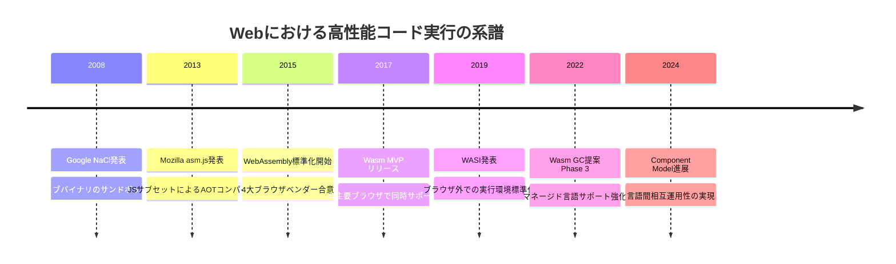

### 1.4 WebAssemblyの設計目標

WebAssemblyの設計は、以下の4つの核心的な目標に基づいている。

1. **高速（Fast）**: ネイティブに近い実行速度を、ハードウェアの機能を活用して達成する
2. **安全（Safe）**: メモリ安全なサンドボックス環境で実行し、ホスト環境から隔離する
3. **ポータブル（Portable）**: ハードウェアやOS、ブラウザに依存しない実行形式とする
4. **コンパクト（Compact）**: ネットワーク転送に適した、小さなバイナリサイズを実現する

これらの目標は互いに補強し合うものとして意図されている。バイナリフォーマットは高速なデコードとコンパクトなサイズの両立に寄与し、型システムと構造化制御フローは安全性と高速コンパイルの両方を支えている。

## 2. アーキテクチャ

### 2.1 スタックマシン

WebAssemblyの命令セットアーキテクチャ（ISA）は、**スタックマシン**として設計されている。レジスタマシン（x86やARM）と異なり、すべての演算はスタック上の値を操作する。

```wat
;; WAT (WebAssembly Text Format) example: compute (a + b) * c
(func $compute (param $a i32) (param $b i32) (param $c i32) (result i32)
  local.get $a    ;; stack: [a]
  local.get $b    ;; stack: [a, b]
  i32.add         ;; stack: [a+b]
  local.get $c    ;; stack: [a+b, c]
  i32.mul         ;; stack: [(a+b)*c]
)
```

なぜレジスタマシンではなくスタックマシンが選ばれたのか。これには明確な技術的理由がある。

**コンパクトなバイナリ表現**: スタックマシンでは、オペランドの指定（レジスタ番号など）が不要であるため、命令エンコーディングが小さくなる。WebAssemblyの設計目標であるコンパクトなバイナリサイズと直接的に合致する。

**高速なバリデーション**: スタックの型はプログラムのどの地点でも静的に決定できる。この性質により、ワンパスでの型検証が可能となり、デコードとバリデーションを同時に行える。

**効率的なコンパイル**: スタックマシンのコードは、レジスタ割り当てを行うことで容易にレジスタマシン向けのネイティブコードに変換できる。ベースラインJITコンパイラでは、スタック操作を直接マシンスタックにマッピングするだけで十分な性能が得られる。

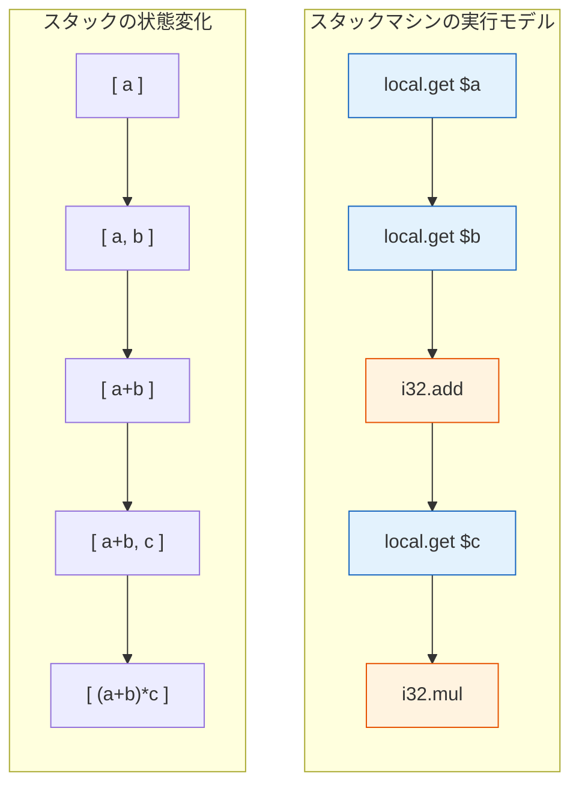

ただし、WebAssemblyのスタックマシンは純粋なスタックマシンではない。**ローカル変数**（パラメータと関数内ローカル変数）へのランダムアクセスを許しており、これは実質的にレジスタファイルに近い役割を果たす。この設計により、コンパイラバックエンドでの変数割り当てが容易になっている。

### 2.2 型システム

WebAssembly MVPの型システムは、意図的に最小限に設計されている。

**値型（Value Types）**

| 型 | サイズ | 説明 |
|---|---|---|
| `i32` | 32ビット | 32ビット整数（符号なし/符号付きは命令で区別） |
| `i64` | 64ビット | 64ビット整数 |
| `f32` | 32ビット | IEEE 754 単精度浮動小数点 |
| `f64` | 64ビット | IEEE 754 倍精度浮動小数点 |

後続の提案により、以下の型が追加されている。

- `v128`: SIMD演算用の128ビットベクトル型
- `funcref`: 関数参照型
- `externref`: ホスト環境のオブジェクトへの不透明な参照型
- `ref`: GC提案による構造体・配列への参照型

**関数型**

WebAssemblyの関数は、パラメータ型と戻り値型の組として型付けされる。MVPでは戻り値は最大1つであったが、**Multi-value**拡張により複数の戻り値が許可されている。

```wat
;; function type: (i32, i32) -> i32
(func $add (param i32) (param i32) (result i32)
  local.get 0
  local.get 1
  i32.add
)

;; multi-value: (i32, i32) -> (i32, i32)
(func $swap (param i32) (param i32) (result i32 i32)
  local.get 1
  local.get 0
)
```

**型システムの健全性**: WebAssemblyの型システムは、すべての正しく型付けされたプログラムが実行時に型エラーを起こさないことを保証する（型の健全性 / type soundness）。この性質は形式的に証明されており、WebAssemblyの安全性の基盤となっている。

### 2.3 構造化制御フロー

WebAssemblyの最も特徴的な設計判断の一つが、**構造化制御フロー**の採用である。従来の低レベルバイトコード（JVM bytecodeなど）やネイティブ命令セットでは、任意のアドレスへのジャンプ（`goto`）が許されるが、WebAssemblyでは明示的な制御構造——`block`、`loop`、`if`——のみが許される。

```wat
;; structured control flow example: simple loop
(func $sum_to_n (param $n i32) (result i32)
  (local $i i32)
  (local $sum i32)
  (block $break
    (loop $continue
      ;; if i >= n, break
      local.get $i
      local.get $n
      i32.ge_s
      br_if $break

      ;; sum += i
      local.get $sum
      local.get $i
      i32.add
      local.set $sum

      ;; i++
      local.get $i
      i32.const 1
      i32.add
      local.set $i

      ;; continue loop
      br $continue
    )
  )
  local.get $sum
)
```

`br`命令は、名前付きブロックの終端（`block`の場合）または先頭（`loop`の場合）にジャンプする。任意のアドレスへのジャンプは不可能であり、制御フローグラフは常に**還元可能（reducible）**である。

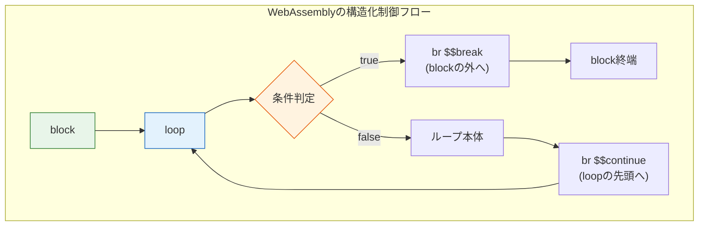

この設計には以下の重要な利点がある。

1. **高速なバリデーション**: 制御フローの整合性をワンパスで検証できる。任意のジャンプを許す場合、フロー解析にはFixpoint計算が必要になり得る
2. **安全性の保証**: 不正なジャンプ先（コードセクション外やデータ領域）への制御移行が構造的に不可能である
3. **効率的なコンパイル**: コンパイラが制御フローグラフを容易に再構築でき、最適化パスの適用が容易になる

### 2.4 線形メモリ

WebAssemblyモジュールは、**線形メモリ（linear memory）** と呼ばれる、連続したバイト配列をメモリ空間として使用する。このメモリは、C/C++のヒープ・スタック・グローバル変数のすべてを格納するために使われる。

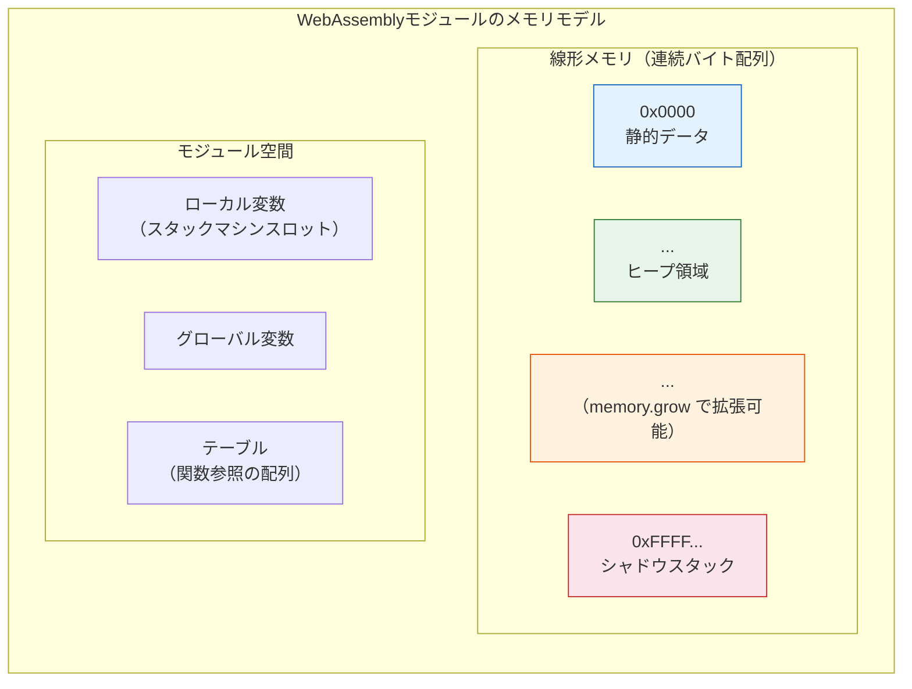

線形メモリの主要な特性は以下の通りである。

- **ページ単位の管理**: メモリは64KiB（65,536バイト）のページ単位で割り当てられる。初期サイズと最大サイズをモジュール定義時に指定する
- **拡張可能**: `memory.grow`命令でページ単位の拡張が可能（縮小は不可）
- **境界チェック**: すべてのメモリアクセスは境界チェックが行われ、範囲外アクセスはトラップ（実行時エラー）を発生させる
- **バイトアドレッシング**: `i32.load`、`i32.store`などの命令でバイト単位のアドレスを指定してアクセスする

境界チェックの実装は、多くの場合、仮想メモリのガードページを利用することで**実質的にゼロコスト**で実現される。具体的には、線形メモリの直後にマップされていないガードページ領域を配置し、範囲外アクセスをハードウェアのページフォルト（シグナル）として捕捉する。

```wat
;; memory access example
(module
  ;; declare 1 page (64KiB) of memory, max 10 pages
  (memory 1 10)

  (func $store_and_load (param $addr i32) (param $value i32) (result i32)
    ;; store value at addr
    local.get $addr
    local.get $value
    i32.store

    ;; load value from addr
    local.get $addr
    i32.load
  )
)
```

### 2.5 テーブルと間接呼び出し

線形メモリとは別に、WebAssemblyは**テーブル（table）**と呼ばれるデータ構造を持つ。テーブルは参照型（関数参照など）の配列であり、主に**間接関数呼び出し（indirect call）**——C言語の関数ポインタやC++の仮想関数テーブルに相当する機能——を実装するために使用される。

テーブルが線形メモリとは別に管理される理由は**安全性**にある。関数参照を線形メモリ内に格納してしまうと、バッファオーバーフローなどのバグにより関数ポインタが任意のアドレスに書き換えられ、制御フローハイジャック攻撃が可能になる。テーブルに分離することで、この攻撃ベクトルを構造的に排除している。

```wat
;; indirect call example: function pointer table
(module
  ;; table of 2 function references
  (table 2 funcref)

  (func $add (param i32 i32) (result i32)
    local.get 0
    local.get 1
    i32.add
  )

  (func $mul (param i32 i32) (result i32)
    local.get 0
    local.get 1
    i32.mul
  )

  ;; populate the table
  (elem (i32.const 0) $add $mul)

  ;; indirect call: call table[idx](a, b)
  (func $call_op (param $idx i32) (param $a i32) (param $b i32) (result i32)
    local.get $a
    local.get $b
    local.get $idx
    call_indirect (type $binop)
  )

  (type $binop (func (param i32 i32) (result i32)))
)
```

## 3. バイナリフォーマットとテキスト表現（WAT）

### 3.1 バイナリフォーマット（.wasm）

WebAssemblyのバイナリフォーマットは、効率的なデコードとコンパクトなサイズを両立するよう設計されている。ファイルは以下のマジックナンバーとバージョン番号で始まる。

```
00 61 73 6D  ;; magic number: "\0asm"
01 00 00 00  ;; version: 1
```

バイナリは**セクション（section）**の列として構成される。各セクションはセクションID（1バイト）、セクションサイズ（LEB128エンコード）、セクション本体から成る。

```mermaid
graph TD
    subgraph "Wasmバイナリの構造"
        H["ヘッダ<br>magic + version<br>(8 bytes)"]
        H --> S1["Section 1: Type<br>関数シグネチャの定義"]
        S1 --> S2["Section 2: Import<br>外部からのインポート"]
        S2 --> S3["Section 3: Function<br>関数宣言（型への参照）"]
        S3 --> S4["Section 4: Table<br>間接呼び出し用テーブル"]
        S4 --> S5["Section 5: Memory<br>線形メモリの宣言"]
        S5 --> S6["Section 6: Global<br>グローバル変数"]
        S6 --> S7["Section 7: Export<br>外部への公開"]
        S7 --> S8["Section 8: Start<br>初期化関数の指定"]
        S8 --> S9["Section 9: Element<br>テーブルの初期値"]
        S9 --> S10["Section 10: Code<br>関数本体（バイトコード）"]
        S10 --> S11["Section 11: Data<br>メモリの初期値"]
    end

    style H fill:#e3f2fd,stroke:#1565c0
    style S10 fill:#fff3e0,stroke:#e65100
```

**LEB128エンコーディング**: 整数値は可変長のLEB128（Little Endian Base 128）形式でエンコードされる。小さな値は1バイトで、大きな値のみ複数バイトを使用する。これにより、典型的なプログラムで頻出する小さなインデックスや定数がコンパクトに表現される。

セクション構造の重要な特徴は、**ストリーミングコンパイル**を可能にする設計である。Typeセクションが最初に来ることで、コンパイラはCodeセクションを処理する前にすべての関数シグネチャを把握でき、関数本体のコンパイルをネットワークからのダウンロードと並行して開始できる。

### 3.2 テキスト表現（WAT: WebAssembly Text Format）

WATは、WebAssemblyのバイナリフォーマットに対応するテキスト表現であり、S式（S-expression）をベースとした構文を持つ。WATは主にデバッグ、教育、仕様記述の目的で使用される。

```wat
;; complete WAT example: factorial function
(module
  ;; export the factorial function
  (func $factorial (export "factorial") (param $n i32) (result i32)
    ;; base case: n <= 1
    local.get $n
    i32.const 1
    i32.le_s
    if (result i32)
      i32.const 1
    else
      ;; recursive case: n * factorial(n - 1)
      local.get $n
      local.get $n
      i32.const 1
      i32.sub
      call $factorial
      i32.mul
    end
  )
)
```

WATには2つの構文スタイルがある。

**フラットスタイル（liner / flat syntax）**: 命令を順番に並べるスタイル。バイナリフォーマットに直接対応する。

```wat
local.get $n
i32.const 1
i32.add
```

**折りたたみスタイル（folded / S-expression syntax）**: 命令をネストして式として記述するスタイル。人間にとって読みやすい。

```wat
(i32.add (local.get $n) (i32.const 1))
```

両者は意味的に同一であり、同じバイナリにコンパイルされる。

### 3.3 バイナリとテキストの変換

`wat2wasm`（テキストからバイナリ）と`wasm2wat`（バイナリからテキスト）の変換ツールがWebAssembly Binary Toolkit（WABT）として提供されている。また、`wasm-objdump`によりバイナリの構造を詳細に調査できる。

バイナリフォーマットのサイズ効率は顕著であり、同等の機能をasm.jsで記述した場合と比較して、典型的には**20-30%のサイズ削減**が報告されている。さらに、バイナリのデコード速度はJavaScriptのパース速度と比較して**10-20倍高速**である。

## 4. 実行モデル — コンパイル戦略

### 4.1 実行方式の概観

WebAssemblyの実行方式は、ランタイム環境によって大きく異なる。主要な3つのアプローチは、AOTコンパイル、JITコンパイル、インタープリタである。

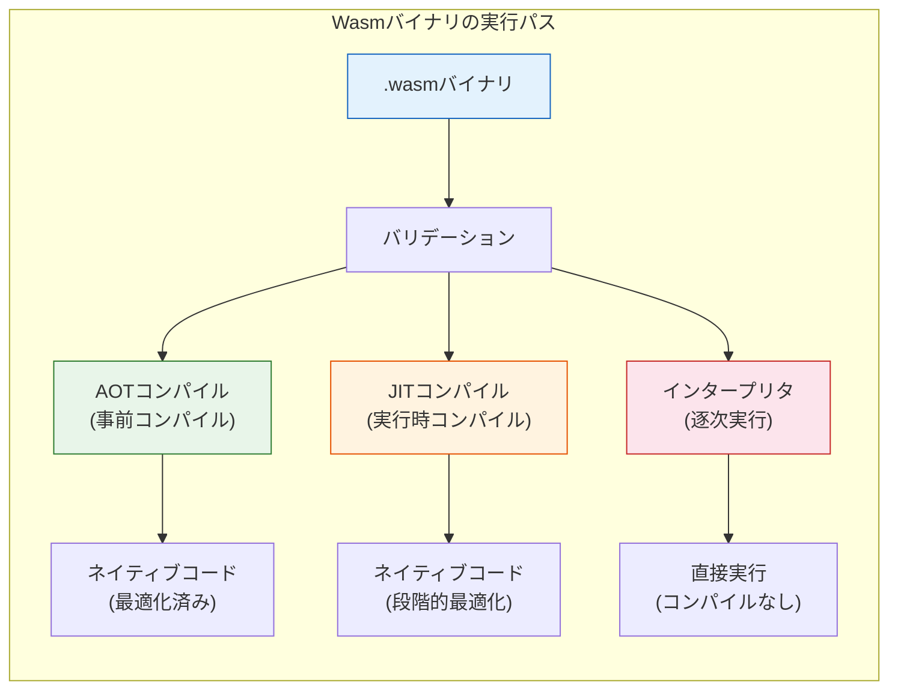

### 4.2 ブラウザにおけるJITコンパイル

ブラウザのWebAssemblyランタイムは、一般に**多段JITコンパイル**を採用している。V8（Chrome）を例に、その戦略を見てみる。

**Liftoff（ベースラインコンパイラ）**

Liftoffは、Wasmバイトコードをワンパスで高速にネイティブコードに変換するベースラインコンパイラである。最適化は最小限であるが、コンパイル速度が極めて高速であるため、アプリケーションの起動時間を最小化できる。

Liftoffの特徴は以下の通りである。

- **ワンパスコンパイル**: 各命令を一度だけ走査し、即座にネイティブコードを出力する
- **レジスタ割り当ての簡略化**: スタックマシンの操作を直接レジスタにマッピングする線形スキャンの変種を使用
- **ストリーミング対応**: ネットワークからのダウンロードと並行してコンパイルが進行する

**TurboFan（最適化コンパイラ）**

TurboFanは、「ホット」な関数（頻繁に実行される関数）に対して適用される最適化コンパイラである。以下のような高度な最適化を実行する。

- **インライン展開**: 小さな関数の呼び出しを展開してオーバーヘッドを除去
- **共通部分式除去（CSE）**: 同一の計算の重複を排除
- **定数畳み込み**: コンパイル時に計算可能な式を事前に評価
- **境界チェックの除去**: 安全であることが証明できる場合にメモリアクセスの境界チェックを除去
- **SIMD命令の活用**: ベクトル型操作をハードウェアSIMD命令にマッピング

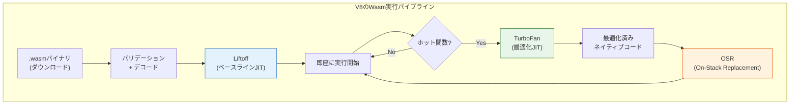

**On-Stack Replacement（OSR）**: TurboFanによる最適化コンパイルが完了すると、実行中の関数を最適化済みのコードにホットスワップする。これにより、長時間実行されるループ内の関数でも、再起動なしに高速な実行コードに切り替わる。

**SpiderMonkeyの戦略（Firefox）**

Firefoxでも同様の多段アプローチを採用している。ベースラインコンパイラとIon（最適化コンパイラ）の2段構成であるが、特に注目すべきは**Cranelift**の採用である。Craneliftは、Bytecode Allianceによって開発されたコード生成フレームワークであり、コンパイル速度と生成コード品質のバランスに優れている。

### 4.3 AOTコンパイル

ブラウザ外の環境——サーバーサイド、エッジコンピューティング、組み込みシステム——では、事前にWebAssemblyバイナリをネイティブコードにコンパイルするAOTコンパイルが有効である。

代表的なAOTコンパイルランタイムとして以下がある。

- **Wasmtime**: Bytecode Allianceが開発する参照実装ランタイム。Craneliftをコード生成バックエンドとして使用
- **Wasmer**: 複数のコンパイラバックエンド（Cranelift、LLVM、Singlepass）を選択可能
- **WAMR（WebAssembly Micro Runtime）**: 組み込み・IoT向けの軽量ランタイム。インタープリタとAOTの両モードをサポート

AOTコンパイルの利点は、実行時のコンパイルオーバーヘッドが完全に排除されることと、LLVMバックエンドを使用する場合にはLLVMの高度な最適化パスが適用できることである。一方、ターゲットアーキテクチャごとにコンパイル済みバイナリを用意する必要があるため、ポータビリティはWasmバイナリの配布に比べて制限される。

### 4.4 インタープリタ

コンパイルを行わず、WebAssemblyバイトコードを逐次解釈実行するインタープリタも重要な役割を果たしている。

- **起動時間の最小化**: コンパイルを伴わないため、起動が極めて高速
- **メモリフットプリントの削減**: コンパイル済みネイティブコードの保存が不要
- **デバッグの容易さ**: バイトコードレベルでの単一ステップ実行が容易

Wasm3やWAMRのインタープリタモードがこのアプローチの代表例である。組み込みシステムのような、メモリが限られた環境で特に有用である。

## 5. JavaScript連携

### 5.1 WebAssembly JavaScript API

ブラウザにおいて、WebAssemblyモジュールはJavaScript APIを通じてロード・インスタンス化・実行される。このAPIは、WebAssemblyの安全な利用を保証するよう設計されている。

```javascript
// Basic Wasm module loading and instantiation
async function loadWasm() {
  // Fetch and compile in streaming fashion
  const response = await fetch('module.wasm');
  const module = await WebAssembly.compileStreaming(response);

  // Create import object for the module
  const importObject = {
    env: {
      // Import a JS function into Wasm
      log: (value) => console.log('Wasm says:', value),
      // Import memory
      memory: new WebAssembly.Memory({ initial: 1, maximum: 10 }),
    },
  };

  // Instantiate the module
  const instance = await WebAssembly.instantiate(module, importObject);

  // Call an exported Wasm function
  const result = instance.exports.factorial(10);
  console.log('factorial(10) =', result); // 3628800
}
```

**ストリーミングコンパイル**: `WebAssembly.compileStreaming()`は、ネットワークレスポンスを受信しながら同時にコンパイルを開始する。これにより、大きなWasmモジュールのロード時間が大幅に短縮される。ダウンロードとコンパイルがパイプライン化されるため、ダウンロード完了時にはコンパイルもほぼ完了している。

### 5.2 インポートとエクスポート

WebAssemblyとJavaScriptの間のインターフェースは、**インポート**と**エクスポート**によって明確に定義される。

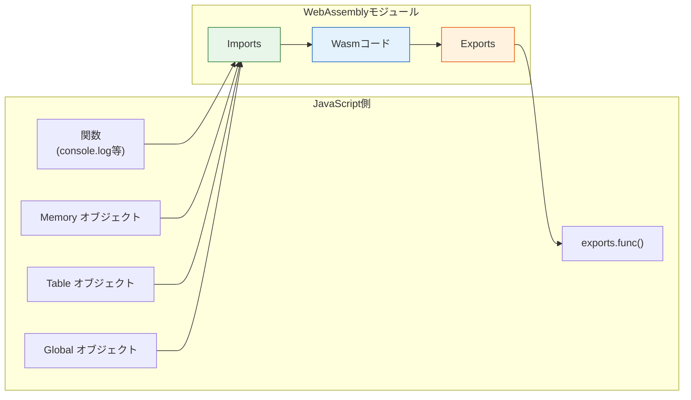

**エクスポート可能なもの**: 関数、メモリ、テーブル、グローバル変数

**インポート可能なもの**: 関数、メモリ、テーブル、グローバル変数

重要な制約として、WebAssemblyの線形メモリとJavaScriptのオブジェクトは直接的に相互アクセスできない。WebAssemblyモジュールがJavaScriptのオブジェクトを操作するには、JavaScript側で「グルーコード」を介する必要がある。

### 5.3 メモリ共有とデータ受け渡し

WebAssemblyの線形メモリは`ArrayBuffer`（`SharedArrayBuffer`も可能）としてJavaScript側に公開される。これにより、JavaScript側からWasmメモリの内容を直接読み書きできる。

```javascript
// Sharing memory between JS and Wasm
const memory = new WebAssembly.Memory({ initial: 1 });

// Create a typed array view into Wasm memory
const buffer = new Uint8Array(memory.buffer);

// Write a string into Wasm memory
function writeString(str, offset) {
  const encoder = new TextEncoder();
  const encoded = encoder.encode(str);
  buffer.set(encoded, offset);
  return encoded.length;
}

// Read a string from Wasm memory
function readString(offset, length) {
  const decoder = new TextDecoder();
  return decoder.decode(buffer.slice(offset, offset + length));
}
```

文字列やオブジェクトなどの複合データの受け渡しには、メモリレイアウトの取り決め（ABI）が必要となる。Emscriptenのような高レベルツールチェーンは、この変換を自動化するグルーコードを生成する。

### 5.4 Emscriptenとツールチェーン

Emscriptenは、C/C++コードをWebAssemblyにコンパイルするための最も成熟したツールチェーンである。LLVMをベースとし、以下の機能を提供する。

- **POSIX APIのエミュレーション**: `stdio.h`、`stdlib.h`などの標準ライブラリ関数をJavaScript/Web API上に実装
- **OpenGL ES → WebGLの変換**: OpenGL ESの呼び出しをWebGLに自動変換
- **ファイルシステムのエミュレーション**: 仮想ファイルシステムをメモリ上またはIndexedDB上に構築
- **pthreadsのサポート**: Web Workersと`SharedArrayBuffer`を利用したスレッドエミュレーション

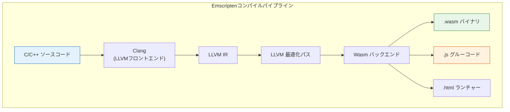

近年では、Rust（wasm-bindgen / wasm-pack）、Go、AssemblyScript（TypeScriptのサブセット）、Zig、Kotlinなど、多くの言語がWebAssemblyをコンパイルターゲットとしてサポートしている。特にRustのWebAssemblyサポートは成熟しており、`wasm-bindgen`によるJavaScriptとの高レベルな相互運用が可能である。

## 6. WASI — WebAssembly System Interface

### 6.1 ブラウザ外のWebAssembly

WebAssemblyはブラウザのために設計されたが、その**ポータビリティ**と**サンドボックスセキュリティ**はブラウザ外でも強力な利点となる。しかし、ブラウザ外でWasmを実行するためには、ファイルI/O、ネットワーク、環境変数、時刻取得といった**システムインターフェース**が必要である。

2019年、Bytecode Allianceは**WASI（WebAssembly System Interface）**を発表した。WASIは、ブラウザに依存しないポータブルなシステムインターフェースの標準である。

Docker共同創設者のSolomon Hykesは次のように述べた。

> "If WASM+WASI existed in 2008, we wouldn't have needed to create Docker. That's how important it is. WebAssembly on the server is the future of computing."

### 6.2 ケーパビリティベースセキュリティ

WASIの最も重要な設計原則は、**ケーパビリティベースセキュリティ（capability-based security）**である。POSIXのようなアンビエント権限モデル（プロセスがユーザーの全権限を継承する）とは根本的に異なり、WASIモジュールは明示的に付与された権限のみを行使できる。

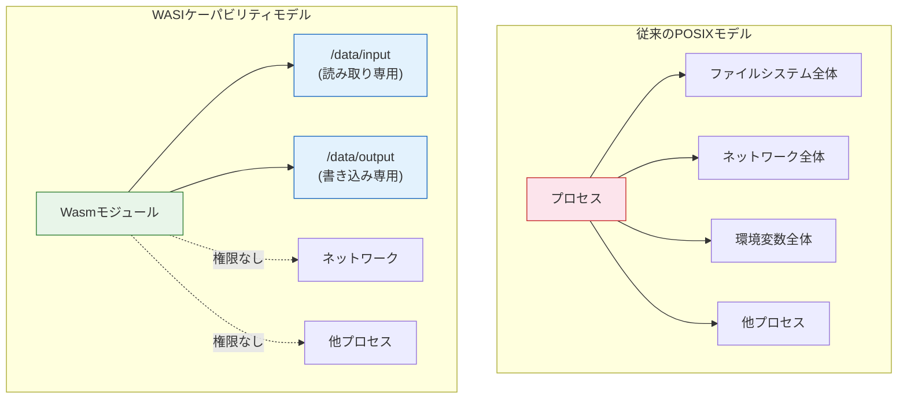

具体的には、WASIのファイル操作APIは**ファイルディスクリプタ**を前提とする。モジュールはファイルパスではなく、ホスト環境から事前に渡された（pre-opened）ファイルディスクリプタを通じてのみファイルにアクセスできる。これは、`path_open`が既に開かれたディレクトリのファイルディスクリプタを基準としたパスしか受け付けないことによって実現される。

```rust
// Rust example: WASI file I/O
use std::fs;
use std::io::Write;

fn main() {
    // This only works if the host has pre-opened the directory
    // Runtime invocation: wasmtime --dir /data run module.wasm
    let contents = fs::read_to_string("/data/input.txt")
        .expect("failed to read file");

    let mut output = fs::File::create("/data/output.txt")
        .expect("failed to create file");

    output.write_all(contents.to_uppercase().as_bytes())
        .expect("failed to write file");
}
```

```bash
# Run with explicit directory capability grant
wasmtime --dir /data run module.wasm
```

### 6.3 WASIのAPI設計

WASI Preview 1（`wasi_snapshot_preview1`）は、以下のモジュールを定義している。

| モジュール | 機能 |
|---|---|
| `args` | コマンドライン引数の取得 |
| `environ` | 環境変数の取得 |
| `clock` | 時刻とタイマー |
| `fd` | ファイルディスクリプタ操作 |
| `path` | パスベースのファイル操作 |
| `proc` | プロセスの終了 |
| `random` | 暗号学的乱数生成 |
| `sock` | ソケット操作（Preview 2で拡充） |

WASI Preview 2では、**Wit（WebAssembly Interface Types）** を導入し、インターフェース定義言語によるモジュラーなAPI定義を実現している。これにより、WASIのAPIは個別の「ワールド」として組み合わせ可能になる。

### 6.4 WASIランタイム

主要なWASIランタイムとその特徴を以下にまとめる。

| ランタイム | 開発元 | コンパイル方式 | 特徴 |
|---|---|---|---|
| Wasmtime | Bytecode Alliance | JIT/AOT (Cranelift) | WASI参照実装、高い準拠性 |
| Wasmer | Wasmer Inc. | JIT/AOT (Cranelift/LLVM/Singlepass) | 複数バックエンド、パッケージレジストリ |
| WasmEdge | CNCF | JIT/AOT (LLVM) | クラウドネイティブ、AI推論に特化 |
| WAMR | Intel/Bytecode Alliance | AOT/インタープリタ | 組み込み向け、極小フットプリント |
| wazero | Go community | インタープリタ/JIT | Pure Go実装、CGO不要 |

## 7. 実世界での利用

### 7.1 Figma — デザインツールのパフォーマンス革命

Figmaは、ブラウザベースのデザインツールとしてWebAssemblyの最も成功した採用事例の一つである。FigmaのレンダリングエンジンはC++で記述されており、当初はasm.jsにコンパイルされていたが、WebAssemblyへの移行により**3倍以上の性能向上**を達成した。

Figmaにおける技術的なポイントは以下の通りである。

- **レンダリングエンジン**: 2DベクターグラフィクスのレンダリングをWebAssemblyで実行し、WebGLで画面に出力
- **パフォーマンスの一貫性**: JITの不確実性を排除し、予測可能な性能を実現
- **コードの再利用**: デスクトップアプリとWebアプリでC++のコアエンジンを共有

### 7.2 Google Earth — 大規模3Dレンダリング

Google Earthは、数テラバイトの衛星画像と3Dモデルをリアルタイムにレンダリングする必要がある。2019年にChrome限定のNaCl版から、WebAssemblyベースの全ブラウザ対応版への移行を完了した。

WebAssembly版では、C++で記述された3Dレンダリングパイプラインをそのまま使用しつつ、WebGL 2.0と組み合わせることで、ネイティブアプリに近いレンダリング品質を実現している。

### 7.3 Blazor WebAssembly — .NETランタイムのブラウザ実行

MicrosoftのBlazor WebAssemblyは、.NETランタイム自体をWebAssemblyにコンパイルし、C#コードをブラウザ上で実行するフレームワークである。

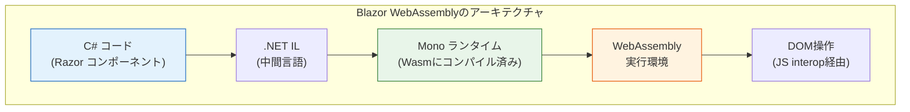

Blazor WebAssemblyは初期ロードサイズの大きさ（.NETランタイムのダウンロード）が課題であったが、AOTコンパイルの改善、トリミング（未使用コードの除去）、遅延ロードの導入により、実用的な水準に達している。

### 7.4 その他の注目事例

**Squoosh（Google）**: 画像圧縮ツール。MozJPEG、WebP、AVIFなどのエンコーダをWebAssemblyで実行し、サーバーを介さずにブラウザ内で画像を最適化する。

**AutoCAD Web**: Autodesk社のCADソフトウェアをWebブラウザに移植。数十年にわたるC++コードベースをEmscriptenでWebAssemblyにコンパイルした。

**FFmpeg.wasm**: FFmpegの動画/音声処理機能をブラウザ上で実行。動画のトランスコード、フォーマット変換、トリミングなどがサーバーサイドの処理不要で実現される。

**Envoy Proxy（拡張機能）**: Envoyプロキシの拡張機能（フィルタ）をWebAssemblyで記述。Luaに代わる安全かつ高性能な拡張メカニズムとして、Istioなどのサービスメッシュで採用されている。

**Cloudflare Workers**: エッジコンピューティング環境でWebAssemblyモジュールを実行。V8のWasmランタイムを利用し、サブミリ秒のコールドスタートを実現している。

### 7.5 WebAssemblyが適している領域と限界

**適している領域:**

- 既存のC/C++/RustコードベースのWeb移植
- 計算集約的なタスク（画像処理、暗号処理、物理シミュレーション、音声処理）
- 一貫した予測可能な性能が求められるアプリケーション
- プラグインシステムやサードパーティコードの安全な実行

**限界:**

- DOM操作: WebAssemblyからDOMへの直接アクセスはできず、JavaScript経由となるためオーバーヘッドがある
- GC言語のサポート: GC提案の導入前は、言語ランタイム自体をWasmに含める必要があり、バイナリサイズが肥大化した
- 起動時間: 大規模モジュールのコンパイルには時間がかかる（ストリーミングコンパイルで緩和）
- デバッグ: ソースレベルデバッグのサポートは向上しているが、ネイティブ開発環境に比べると制限がある

## 8. 今後の展望

### 8.1 GC（Garbage Collection）提案

WebAssembly GC提案（WasmGC）は、WebAssemblyの将来にとって最も重要な拡張の一つである。2024年にChrome、Firefoxでサポートが開始され、Safariでも実装が進んでいる。

WasmGCは、WebAssemblyに**構造体型（struct）**と**配列型（array）**を導入し、ホスト環境のGCによってこれらのオブジェクトのメモリ管理を行う。これにより、Java、Kotlin、Dart、OCamlなどのGC言語が、言語ランタイムのGCをWasm線形メモリ上に再実装する必要がなくなる。

```wat
;; WasmGC: struct and array types
(module
  ;; define a struct type for a 2D point
  (type $point (struct
    (field $x f64)
    (field $y f64)
  ))

  ;; define an array type
  (type $point_array (array (ref $point)))

  ;; create and use a point
  (func $distance (param $p1 (ref $point)) (param $p2 (ref $point)) (result f64)
    ;; dx = p2.x - p1.x
    (f64.sub
      (struct.get $point $x (local.get $p2))
      (struct.get $point $x (local.get $p1))
    )
    ;; ... (simplified)
  )
)
```

WasmGCの導入により、Kotlin/WasmやDart（Flutter Web）のバイナリサイズが劇的に削減されている。例えば、Kotlin/WasmはWasmGCなしでは数MBのランタイムが必要であったが、WasmGCを使用すると数百KBに収まる。

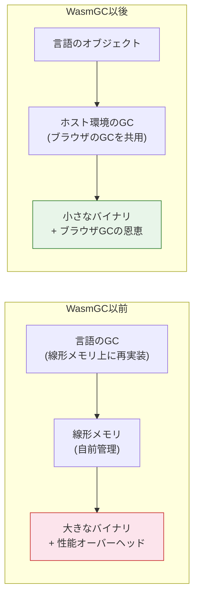

### 8.2 スレッド

WebAssemblyのスレッドサポートは段階的に進んでいる。

**Threads提案（Phase 4）**: `SharedArrayBuffer`に基づく共有線形メモリと、`memory.atomic.*`命令による不可分操作（compare-and-swap、load/store with memory ordering）を提供する。ブラウザではWeb Workers上でWasmインスタンスを実行し、共有メモリを介して通信する。

```wat
;; atomic operations on shared memory
(module
  (memory 1 10 shared)

  ;; atomic increment
  (func $atomic_inc (param $addr i32) (result i32)
    local.get $addr
    i32.const 1
    i32.atomic.rmw.add  ;; atomically: mem[addr] += 1, return old value
  )

  ;; compare-and-swap
  (func $cas (param $addr i32) (param $expected i32) (param $new i32) (result i32)
    local.get $addr
    local.get $expected
    local.get $new
    i32.atomic.rmw.cmpxchg  ;; atomically: if mem[addr] == expected, set to new
  )
)
```

**Stack Switching提案**: 軽量なスレッド（コルーチン、ファイバー）をWebAssemblyレベルでサポートする提案。async/awaitのような非同期パターンや、グリーンスレッドの実装に必要なスタック切り替えを効率的に行うための仕組みである。

### 8.3 コンポーネントモデル

**コンポーネントモデル**は、WebAssemblyのモジュール間相互運用性を根本的に改善する提案であり、WASIの次世代アーキテクチャの基盤でもある。

現在のWebAssemblyモジュールは、数値型とメモリのみで通信する低レベルなインターフェースを持つ。コンポーネントモデルは、**WIT（WebAssembly Interface Types）** を使って、文字列、リスト、レコード、バリアントなどの高レベルな型でインターフェースを定義できるようにする。

```wit
// WIT interface definition
package example:image-processor;

interface process {
    record image {
        width: u32,
        height: u32,
        pixels: list<u8>,
    }

    enum filter {
        grayscale,
        blur,
        sharpen,
    }

    apply-filter: func(img: image, f: filter) -> image;
}

world image-app {
    import wasi:filesystem/types;
    export process;
}
```

コンポーネントモデルの本質的な価値は、**言語に依存しない型システム**による相互運用性にある。RustでコンパイルされたWasmコンポーネントとPythonでコンパイルされたWasmコンポーネントが、WITインターフェースを通じて型安全に通信できる。

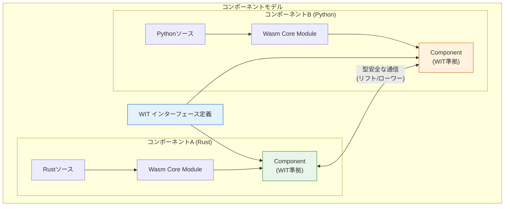

**Canonical ABI**: コンポーネント間の値の受け渡しは、**Canonical ABI**と呼ばれる標準化されたメモリレイアウトを介して行われる。高レベルの型（文字列など）は、コンポーネント境界で「ローワー（lower）」（線形メモリの表現に変換）され、受信側で「リフト（lift）」（高レベル型に復元）される。

### 8.4 その他の進行中の提案

| 提案 | Phase | 概要 |
|---|---|---|
| Exception Handling | 4 | try/catch/throwによる例外処理 |
| Tail Call | 4 | 末尾呼び出し最適化（関数型言語に重要） |
| Extended Const Expressions | 4 | 定数式の範囲拡大 |
| Memory64 | 3 | 64ビットアドレッシング（4GiB超のメモリ） |
| Branch Hinting | 3 | 分岐予測ヒント |
| Relaxed SIMD | 3 | プラットフォーム固有のSIMD最適化許可 |
| Stack Switching | 2 | 軽量スレッド/コルーチンサポート |
| Shared-Everything Threads | 1 | フルスレッドサポート |

### 8.5 WebAssemblyの将来像

WebAssemblyは、単なる「ブラウザ内の高速実行環境」から、**ユニバーサルなコンピューティングプラットフォーム**へと進化しつつある。

**サーバーサイド**: Fastly Compute、Cloudflare Workers、Fermyonなどのエッジコンピューティングプラットフォームでは、WebAssemblyモジュールがコンテナの代替として使われ始めている。コールドスタートの高速さ（マイクロ秒単位）、小さなメモリフットプリント、強力なサンドボックスがコンテナに対する優位性となる。

**プラグインシステム**: 主要なソフトウェア製品がWebAssemblyベースのプラグイン機構を採用し始めている。Envoy Proxy、Zed Editor、Redpanda、Datadog Agentなどがその例である。安全性と性能の両立、そして言語非依存のプラグインAPIが評価されている。

**組み込み・IoT**: WAMRやwasm3のような軽量ランタイムにより、メモリが数百KBしかないマイクロコントローラ上でもWebAssemblyの実行が可能になっている。

WebAssemblyの設計理念——安全性、ポータビリティ、性能のバランス——は、コンピューティングのあらゆるレイヤーで求められる普遍的な価値であり、その適用範囲は今後も拡大し続けるだろう。

## まとめ

WebAssemblyは、NaClやasm.jsの経験を踏まえ、主要ブラウザベンダーの合意のもとに設計された、ポータブルなバイナリ命令フォーマットである。スタックマシン、構造化制御フロー、線形メモリ、静的型システムといった設計判断は、高速なバリデーション・コンパイルと安全な実行の両立という目標から一貫して導かれている。

ブラウザにおけるJavaScriptとの連携、WASIによるブラウザ外への展開、GC提案やコンポーネントモデルによる表現力の拡張——これらの進化を通じて、WebAssemblyは「Webのためのアセンブリ言語」から「どこでも動くポータブルなバイナリ標準」へとその位置づけを変えつつある。

技術的なトレードオフを理解することは重要である。WebAssemblyはJavaScriptを置き換えるものではなく、両者は相補的な関係にある。DOM操作やUIロジックにはJavaScriptが適しており、計算集約的なコアロジックにはWebAssemblyが適している。適材適所の使い分けこそが、Webアプリケーションの性能を最大化する鍵である。
