# Webhook の設計と信頼性

## 1. Webhook とは何か — なぜ必要か

### 1.1 ポーリングの限界

システム間連携において、「相手側で何かが起きたことを知りたい」という要求は普遍的である。最も素朴な方法は**ポーリング（Polling）**、すなわち定期的に相手の API を呼び出して変更がないか確認するアプローチだ。

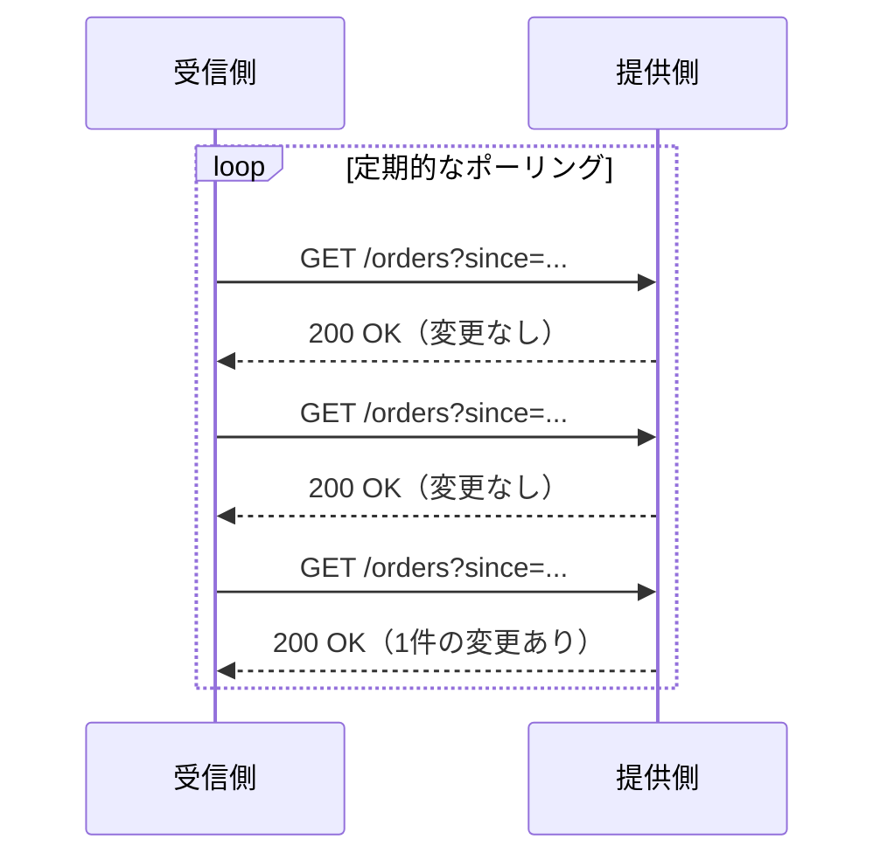

ポーリングは実装が簡単で信頼性も制御しやすいが、根本的な問題がある。

- **無駄なリクエスト**：変更がない時間帯でもリクエストが発生し、提供側のサーバーリソースを浪費する
- **遅延とコストのトレードオフ**：ポーリング間隔を短くすれば遅延は減るがコストが増え、間隔を長くすればコストは減るが遅延が増える
- **スケーラビリティ**：N 個のコンシューマが M 個のリソースを監視すると、リクエスト数は $N \times M / \text{interval}$ に比例し、爆発的に増加する

### 1.2 Webhook：サーバーからのプッシュ

**Webhook** は、イベントが発生した時点で、提供側（プロデューサ）が受信側（コンシューマ）にHTTPリクエストを送信するパターンである。「逆方向のAPI」「HTTPコールバック」とも呼ばれる。

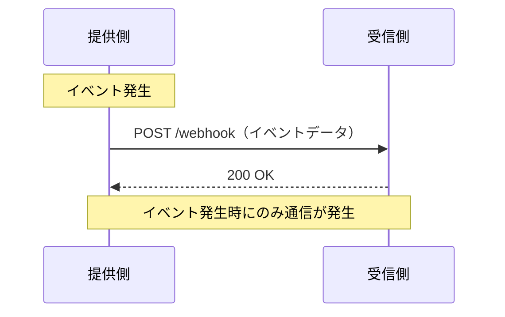

この仕組みにより、ポーリングの3つの問題がすべて解消される。

- 変更がないときは通信が発生しない
- イベント発生からほぼリアルタイムに通知が届く
- 提供側がイベント発生時にのみリクエストを送るため、リクエスト数はイベント数に比例する

### 1.3 Webhook の歴史と普及

Webhook という用語は、2007年にJeff Lindsayによって命名された。彼は「Web上のユーザー定義コールバック」という概念を提唱し、UNIXのパイプのように、Webサービスを自由に繋げる仕組みを構想した。

現在、Webhook はほぼすべての主要 SaaS で採用されている。

| サービス | 代表的なイベント | 用途 |
|---------|----------------|------|
| Stripe | `payment_intent.succeeded` | 決済完了時の処理 |
| GitHub | `push`, `pull_request` | CI/CD トリガー |
| Slack | `message.channels` | ボット連携 |
| Shopify | `orders/create` | 受注処理連携 |
| Twilio | `message.status` | SMS送信結果通知 |

::: tip Webhook と他の非同期通信の違い
Webhook はメッセージキュー（Kafka、RabbitMQ）やサーバー送信イベント（SSE）、WebSocket とは異なる位置づけにある。Webhook は**サービス間の疎結合な連携**に特化しており、受信側が常時接続を維持する必要がない点が特徴的である。反面、HTTPベースであるがゆえに、配信保証やセキュリティに固有の課題を持つ。
:::

### 1.4 Webhook が適するケースと適さないケース

Webhook は万能ではない。用途に応じた使い分けが重要である。

| 観点 | Webhook が適する | Webhook が適さない |
|------|-----------------|-------------------|
| 通信パターン | イベントの頻度が低〜中程度 | 超高頻度のストリーミングデータ |
| 受信側の性質 | 外部サービス、サードパーティ | 同一組織内の密結合なサービス |
| リアルタイム性 | 秒単位の遅延が許容される | ミリ秒単位のレイテンシが必要 |
| 信頼性要件 | At-Least-Once で十分 | Exactly-Once が必須 |

組織内部のサービス間連携であれば、メッセージキューのほうが配信保証やバックプレッシャー制御の面で優れていることが多い。Webhook は**組織の境界を超えた連携**において真価を発揮する。

## 2. Webhook 配信の設計

### 2.1 イベント設計

Webhook を構築する際にまず決めるべきは、どのようなイベントを定義するかである。

#### イベントタイプの命名規則

イベントタイプの命名には一貫した規則が必要である。主要なサービスでは、以下のようなパターンが見られる。

| サービス | 命名規則 | 例 |
|---------|---------|-----|
| Stripe | `resource.action` | `invoice.paid`, `customer.created` |
| GitHub | ヘッダーベース | `X-GitHub-Event: push` |
| Shopify | `resource/action` | `orders/create`, `products/update` |

最も広く採用されているのは `resource.action` 形式であり、以下の理由から推奨される。

- リソースとアクションが明確に分離される
- ワイルドカードによるフィルタリングが容易（`invoice.*` で請求書関連のすべてのイベントを購読）
- 階層的な拡張が可能（`invoice.payment.succeeded`）

#### 薄い通知 vs 厚い通知

Webhook のペイロードにどこまでの情報を含めるかは、重要な設計判断である。

**薄い通知（Thin Payload）** はイベントの発生事実と最小限の識別子のみを含み、受信側が詳細を API で取得する方式である。

```json
{
  "event_type": "order.completed",
  "order_id": "ord_12345",
  "occurred_at": "2026-03-02T10:30:00Z"
}
```

**厚い通知（Fat Payload）** はイベントに関連するリソースの全データを含む。

```json
{
  "event_type": "order.completed",
  "occurred_at": "2026-03-02T10:30:00Z",
  "data": {
    "order": {
      "id": "ord_12345",
      "status": "completed",
      "total_amount": 4980,
      "currency": "JPY",
      "items": [
        { "product_id": "prod_001", "quantity": 2, "unit_price": 2490 }
      ],
      "customer": {
        "id": "cust_789",
        "email": "user@example.com"
      }
    }
  }
}
```

| 観点 | 薄い通知 | 厚い通知 |
|------|---------|---------|
| ペイロードサイズ | 小さい | 大きい |
| API呼び出し | 詳細取得のための追加呼び出しが必要 | 不要（多くの場合） |
| セキュリティ | 機密データが Webhook に含まれない | ペイロードに機密データを含む可能性 |
| 一貫性 | API 取得時の最新状態を取得 | イベント発生時点のスナップショット |
| 受信側の実装 | やや複雑（API クライアントが必要） | シンプル |

::: warning 実務上のベストプラクティス
Stripe や GitHub は**厚い通知**を採用しているが、「Webhook で受け取ったデータを鵜呑みにせず、重要な操作の前には API で最新状態を確認する」ことを推奨している。これは、Webhook の配信順序が保証されない場合があるためである。
:::

### 2.2 ペイロード設計

良いペイロード設計は、受信側の実装を容易にし、長期的な互換性を確保する。

#### 標準的なエンベロープ構造

```json
{
  "id": "evt_abc123def456",
  "type": "order.completed",
  "api_version": "2026-03-01",
  "created_at": "2026-03-02T10:30:00Z",
  "data": {
    "object": {
      "id": "ord_12345",
      "status": "completed"
    }
  }
}
```

各フィールドの役割を整理する。

| フィールド | 役割 | 重要性 |
|-----------|------|--------|
| `id` | イベントの一意識別子。冪等性処理に必須 | 必須 |
| `type` | イベントタイプ。ルーティングに使用 | 必須 |
| `api_version` | ペイロードのスキーマバージョン | 推奨 |
| `created_at` | イベント発生時刻（ISO 8601形式） | 必須 |
| `data` | イベント固有のデータ | 必須 |

#### バージョニング

Webhook のペイロード構造は時間とともに変化する。フィールドの追加は後方互換性を維持するが、フィールドの削除や型の変更は Breaking Change となる。

Stripe のアプローチは参考になる。Stripe は API バージョンの概念を Webhook にも適用し、Webhook エンドポイントが登録された時点の API バージョンでペイロードを生成する。これにより、受信側はバージョンアップのタイミングを自ら制御できる。

### 2.3 登録と購読

Webhook の登録方法には、主に2つのアプローチがある。

**管理画面（UI）による登録**は、もっとも一般的な方式である。ユーザーがダッシュボードで受信 URL、購読するイベントタイプ、シークレットキーなどを設定する。

**API による登録**は、プログラマティックな管理を可能にする。

```bash
# Webhook endpoint registration example
curl -X POST https://api.example.com/v1/webhooks \
  -H "Authorization: Bearer sk_live_..." \
  -d url="https://myapp.example.com/webhooks" \
  -d events[]="order.completed" \
  -d events[]="order.cancelled"
```

どちらの場合でも、登録時に受信 URL の検証（Verification）を行うことが望ましい。一般的な方法は、登録時にチャレンジリクエストを送信し、受信側が特定のレスポンスを返すことで URL の所有権を確認するものである。

## 3. 配信保証

### 3.1 メッセージ配信のセマンティクス

分散システムにおけるメッセージ配信には、3つのセマンティクスが存在する。

| セマンティクス | 説明 | 実現難度 |
|--------------|------|---------|
| At-Most-Once | 最大1回配信。送りっぱなしで再送しない | 容易 |
| At-Least-Once | 最低1回配信。成功するまで再送する | 中程度 |
| Exactly-Once | 正確に1回配信。重複も欠落もない | 極めて困難 |

Webhook は HTTP ベースであり、ネットワーク障害やサーバー障害によって配信が失敗する可能性がある。提供側がリクエストを送信し、レスポンスを受け取れなかった場合、受信側が実際に処理したかどうかを知る手段がない。これは分散システムにおける「二将軍問題」の一種である。

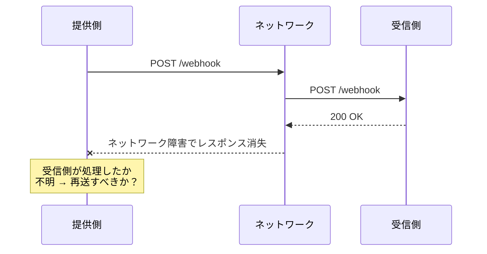

::: danger Exactly-Once は HTTP ベースでは実現できない
HTTPリクエストの送信と受信側での処理を一つのアトミックなトランザクションにすることは原理的にできない。提供側と受信側は異なるシステムであり、共有のトランザクションコーディネータが存在しないためである。Exactly-Once が必要な場合は、メッセージキューなどの別の仕組みを検討すべきである。
:::

したがって、ほぼすべての Webhook 実装は **At-Least-Once** セマンティクスを採用する。これは「同じイベントが複数回配信される可能性があるが、少なくとも1回は届く」ことを保証する。

### 3.2 At-Least-Once の実現

At-Least-Once 配信を実現するための基本的なアーキテクチャは以下のようになる。

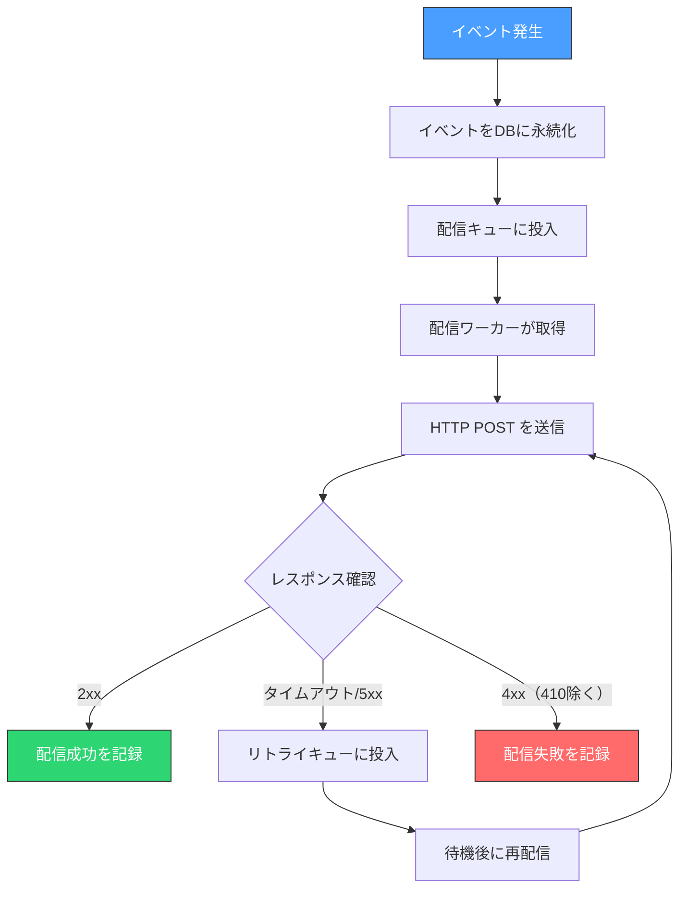

重要なのは、**イベントの発生とデータベースへの永続化をアトミックに行う**ことである。これには2つの主要なパターンがある。

#### Transactional Outbox パターン

ビジネストランザクションと同じデータベーストランザクション内で、イベントをアウトボックステーブルに書き込む。別のプロセス（ポーラーまたは CDC）がアウトボックステーブルを監視し、Webhook 配信キューに投入する。

```sql
-- Within a single transaction
BEGIN;

-- Business logic
UPDATE orders SET status = 'completed' WHERE id = 'ord_12345';

-- Record the event in the outbox
INSERT INTO webhook_outbox (id, event_type, payload, created_at)
VALUES ('evt_abc123', 'order.completed', '{"order_id":"ord_12345",...}', NOW());

COMMIT;
```

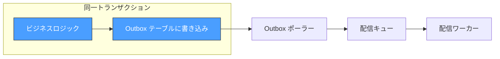

::: tip Transactional Outbox の利点
このパターンにより、「ビジネスロジックは成功したがイベントは記録されなかった」あるいは「イベントは記録されたがビジネスロジックはロールバックされた」という不整合を防げる。CDC（Change Data Capture）ツールとして Debezium が広く利用されている。
:::

### 3.3 冪等性キー

At-Least-Once では同一イベントが複数回配信される。受信側は重複を安全に処理できなければならない。これが**冪等性（Idempotency）**の概念である。

冪等性を実現する最も確実な方法は、**イベント ID による重複排除**である。

```python
def handle_webhook(request):
    event = parse_webhook(request)
    event_id = event["id"]

    # Check if this event has already been processed
    if is_event_processed(event_id):
        return Response(status=200)  # Already processed, return success

    try:
        # Process the event
        process_event(event)

        # Mark as processed (ideally within the same transaction)
        mark_event_processed(event_id)

        return Response(status=200)
    except Exception as e:
        return Response(status=500)
```

受信側のデータベースには、処理済みイベントを記録するテーブルを用意する。

```sql
CREATE TABLE processed_webhook_events (
    event_id VARCHAR(255) PRIMARY KEY,
    processed_at TIMESTAMP NOT NULL DEFAULT NOW(),
    event_type VARCHAR(255) NOT NULL
);

-- Add an index for cleanup of old records
CREATE INDEX idx_processed_at ON processed_webhook_events (processed_at);
```

::: warning 冪等性ウィンドウの設定
処理済みイベントのレコードを永久に保持するとストレージが際限なく増加する。実務上は、一定期間（例えば7日〜30日）を冪等性ウィンドウとして定め、それ以前のレコードは削除する。このウィンドウは、提供側のリトライ期間よりも十分に長く設定すべきである。
:::

#### 自然冪等性の活用

一部の操作は本質的に冪等である。例えば、「ユーザーのステータスを `active` に更新する」という操作は何回実行しても結果が同じである。一方、「残高に1000円を加算する」は冪等ではなく、重複実行すると残高が増え続ける。

| 操作 | 冪等性 | 対策 |
|------|--------|------|
| ステータス更新（SET） | 自然に冪等 | 特別な対策は不要 |
| レコード作成（INSERT） | 一意キーで冪等化可能 | イベント ID をユニークキーに使用 |
| 数値の加算（INCREMENT） | 非冪等 | イベント ID による重複排除が必須 |
| 外部 API 呼び出し | 外部 API に依存 | 冪等性キーの伝播が必要 |

## 4. リトライ戦略

### 4.1 なぜリトライが必要か

Webhook 配信は多くの理由で失敗する。

- 受信側のサーバーが一時的にダウンしている
- ネットワーク障害が発生している
- 受信側のデプロイ中でリクエストを受け付けられない
- 受信側が一時的に過負荷状態にある
- DNS解決が一時的に失敗する

これらの多くは**一過性の障害**であり、時間を置いて再送すれば成功する可能性が高い。リトライメカニズムがなければ、一時的な障害でイベントが永久に失われることになる。

### 4.2 指数バックオフ

最も広く採用されているリトライ戦略は**指数バックオフ（Exponential Backoff）**である。リトライごとに待機時間を指数関数的に増加させる。

$$
\text{wait\_time} = \min(\text{base} \times 2^{n}, \text{max\_wait})
$$

ここで $n$ はリトライ回数、$\text{base}$ は基本待機時間、$\text{max\_wait}$ は最大待機時間である。

**Jitter（ジッタ）** の追加も重要である。多数の Webhook が同時に失敗した場合（例えば受信側のサーバーダウン時）、固定の指数バックオフではリトライが同じタイミングに集中し、回復を妨げる**サンダリングハード問題（Thundering Herd）**が発生する。

$$
\text{wait\_time} = \text{random}(0, \min(\text{base} \times 2^{n}, \text{max\_wait}))
$$

```python
import random
import time

def retry_with_exponential_backoff(deliver_fn, max_retries=8, base_delay=60):
    """
    Retry webhook delivery with exponential backoff and full jitter.
    """
    for attempt in range(max_retries + 1):
        success = deliver_fn()
        if success:
            return True

        if attempt == max_retries:
            return False  # All retries exhausted

        # Exponential backoff with full jitter
        max_delay = min(base_delay * (2 ** attempt), 86400)  # Cap at 24 hours
        delay = random.uniform(0, max_delay)

        log.info(f"Retry {attempt + 1}/{max_retries} in {delay:.0f}s")
        time.sleep(delay)

    return False
```

典型的なリトライスケジュール例を示す。

| リトライ回数 | 最短待機時間 | 最大待機時間 | 累積最大時間 |
|-------------|------------|------------|------------|
| 1回目 | 0秒 | 1分 | 1分 |
| 2回目 | 0秒 | 2分 | 3分 |
| 3回目 | 0秒 | 4分 | 7分 |
| 4回目 | 0秒 | 8分 | 15分 |
| 5回目 | 0秒 | 16分 | 31分 |
| 6回目 | 0秒 | 32分 | 63分 |
| 7回目 | 0秒 | 1時間4分 | 約2時間 |
| 8回目 | 0秒 | 2時間8分 | 約4時間 |

::: tip 各サービスのリトライポリシー
Stripe は最大3日間にわたり数時間間隔でリトライを行う。GitHub は配信失敗後に最大25回のリトライを試みる。リトライの回数と期間はサービスの性質に依存するが、合計で数時間〜数日程度が一般的である。
:::

### 4.3 レスポンスコードによるリトライ判断

すべての配信失敗が再送すべきとは限らない。HTTP レスポンスコードに基づいて適切に判断する必要がある。

| レスポンス | 意味 | リトライ |
|-----------|------|---------|
| 2xx | 成功 | 不要 |
| 3xx | リダイレクト | リダイレクト先に配信（制限付き） |
| 400 | 不正なリクエスト | 不要（リトライしても解決しない） |
| 401/403 | 認証/認可エラー | 不要 |
| 404 | エンドポイントが見つからない | 不要 |
| 410 | リソースが恒久的に削除された | 不要（エンドポイント登録を無効化） |
| 429 | レート制限 | 要（`Retry-After` ヘッダーに従う） |
| 5xx | サーバーエラー | 要 |
| タイムアウト | 接続/読み取りタイムアウト | 要 |

::: warning 410 Gone への対応
受信側が `410 Gone` を返した場合、そのエンドポイントは恒久的に無効であることを意味する。提供側はそのエンドポイントへの配信を自動的に停止し、管理者に通知すべきである。Stripe はこの仕組みを採用しており、連続して失敗するエンドポイントを自動で無効化する。
:::

### 4.4 Dead Letter Queue（DLQ）

すべてのリトライが尽きた後、そのイベントをどう扱うかは重要な設計判断である。**Dead Letter Queue（DLQ）**は、配信不能なイベントを格納するキューであり、後から手動または自動で再処理するための仕組みである。

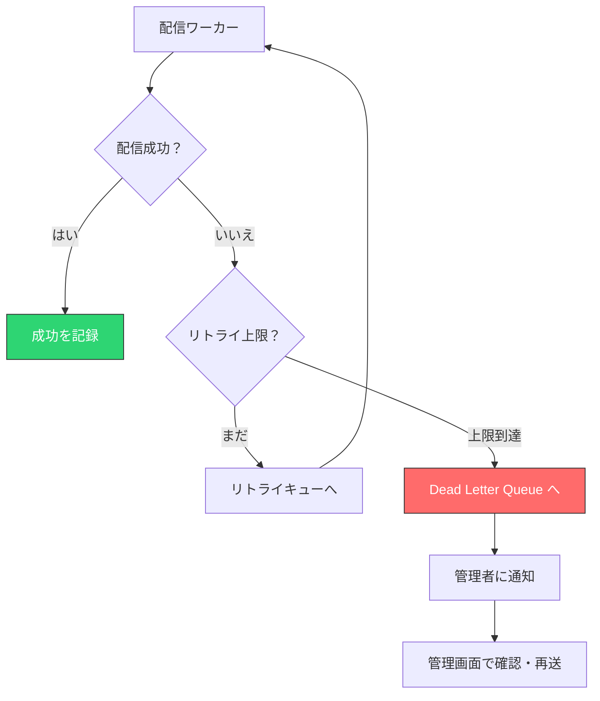

DLQ に格納されたイベントについては、以下の情報を保持すべきである。

- 元のイベントデータ（ペイロード全体）
- 最終失敗時刻とエラー内容
- リトライ回数と各リトライの結果
- 宛先のエンドポイント情報
- 関連するイベントID

### 4.5 サーキットブレーカー

特定のエンドポイントが連続して失敗し続ける場合、リトライを繰り返すことは無駄であるだけでなく、配信システム全体のスループットを低下させる。**サーキットブレーカーパターン**を適用し、一定回数以上連続で失敗したエンドポイントへの配信を一時的に停止する。

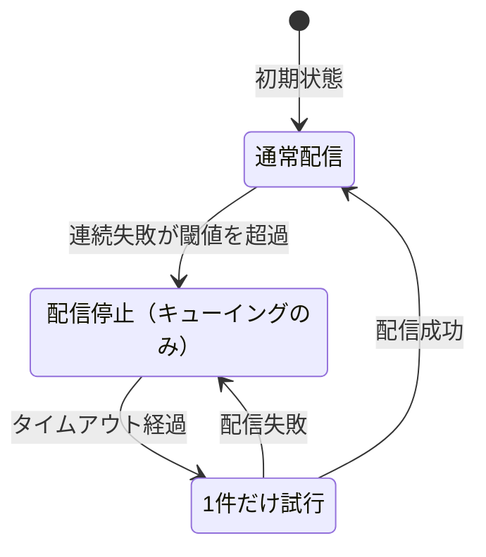

- **Closed（閉）**：通常通り配信を行う
- **Open（開）**：配信を停止し、イベントはキューに蓄積する。タイムアウト後に Half-Open に遷移
- **Half-Open（半開）**：1件だけ配信を試み、成功すれば Closed、失敗すれば Open に戻る

## 5. セキュリティ

Webhook はインターネット上の任意の URL に HTTP リクエストを送信する仕組みであるため、セキュリティ上の考慮事項が多い。

### 5.1 HMAC 署名検証

受信側が最も心配すべきは、「このリクエストは本当に正当な提供側から送られたものか」という**真正性の検証**である。第三者が受信 URL を知っていれば、偽のイベントを送りつけることが可能だからだ。

**HMAC（Hash-based Message Authentication Code）署名**は、この問題を解決する最も標準的な方法である。

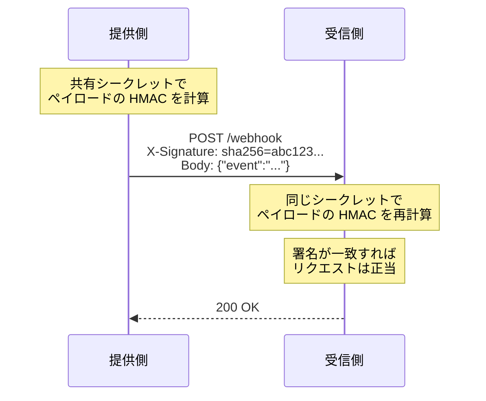

#### 提供側の署名生成

```python
import hmac
import hashlib

def sign_payload(secret: str, payload: bytes) -> str:
    """
    Generate HMAC-SHA256 signature for webhook payload.
    """
    signature = hmac.new(
        key=secret.encode("utf-8"),
        msg=payload,
        digestmod=hashlib.sha256
    ).hexdigest()
    return f"sha256={signature}"

# Usage
secret = "whsec_MIGfMA0GCSqGSIb3DQEBAQUAA..."
payload = b'{"event_type":"order.completed","data":{...}}'
signature = sign_payload(secret, payload)
# Set as header: X-Webhook-Signature: sha256=a1b2c3...
```

#### 受信側の署名検証

```python
import hmac
import hashlib

def verify_signature(secret: str, payload: bytes, received_signature: str) -> bool:
    """
    Verify HMAC-SHA256 signature of webhook payload.
    Uses constant-time comparison to prevent timing attacks.
    """
    expected = hmac.new(
        key=secret.encode("utf-8"),
        msg=payload,
        digestmod=hashlib.sha256
    ).hexdigest()

    expected_signature = f"sha256={expected}"

    # Constant-time comparison to prevent timing attacks
    return hmac.compare_digest(expected_signature, received_signature)
```

::: danger タイミング攻撃への対策
署名の比較には必ず**定数時間比較（Constant-Time Comparison）**を使用すること。通常の文字列比較（`==`）は、一致しない最初の文字で即座に `False` を返すため、レスポンス時間の差異から正しい署名を1文字ずつ推測する攻撃が可能になる。Python では `hmac.compare_digest()` を使用する。
:::

#### タイムスタンプの検証

署名検証に加えて、**リプレイ攻撃**への対策も必要である。攻撃者が過去の正当なリクエストを記録し、そのまま再送する攻撃だ。

タイムスタンプをペイロードまたはヘッダーに含め、署名の対象とすることで、古いリクエストの再利用を防止できる。

```python
import time

def verify_webhook(secret: str, payload: bytes, signature: str, timestamp: str) -> bool:
    """
    Verify webhook signature and timestamp to prevent replay attacks.
    """
    # Reject requests older than 5 minutes
    current_time = int(time.time())
    request_time = int(timestamp)
    if abs(current_time - request_time) > 300:
        return False

    # Verify signature (include timestamp in signed content)
    signed_content = f"{timestamp}.".encode("utf-8") + payload
    return verify_signature(secret, signed_content, signature)
```

### 5.2 シークレットの管理

HMAC 署名に使うシークレットの管理は慎重に行わなければならない。

- **十分なエントロピー**：最低256ビットのランダム値を使用する。UUID ではエントロピーが不十分な場合がある
- **エンドポイントごとに固有**：同じシークレットを複数のエンドポイントで使い回さない
- **ローテーション**：定期的なシークレットのローテーションを可能にする

シークレットのローテーションを中断なく行うためには、新旧2つのシークレットを同時に有効にする**ローリングシークレット**の仕組みが必要である。

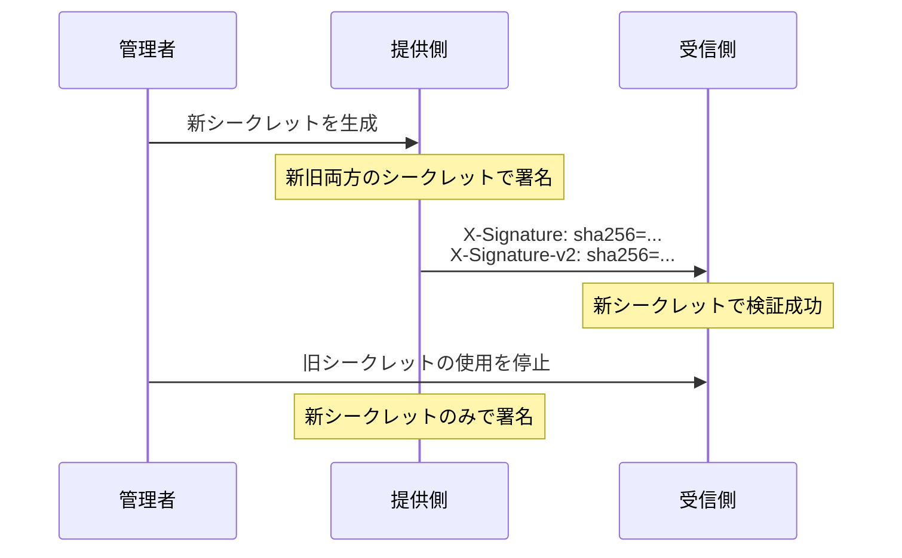

### 5.3 IP アドレス制限

署名検証に加えて、提供側の送信元 IP アドレスをホワイトリストで制限することは有効な**多層防御**である。

主要サービスは送信元 IP アドレスの範囲を公開している。

- GitHub：メタデータ API（`https://api.github.com/meta`）で `hooks` の IP 範囲を提供
- Stripe：ドキュメントで IP 範囲を公開

ただし、IP制限には注意点がある。

- 提供側の IP アドレスが変更される可能性がある
- CDN やプロキシを経由する場合、送信元 IP が変わる
- IPv6 への移行で IP 範囲が変わる可能性がある

したがって、IP制限は署名検証を**補完する**追加のセキュリティ層として扱い、IP制限のみに依存してはならない。

### 5.4 TLS の必須化

Webhook のエンドポイントは**必ず HTTPS**（TLS）を使用すべきである。HTTP でリクエストを送信すると、ペイロード（署名やシークレットを含む可能性がある）がネットワーク上を平文で流れ、傍受される危険がある。

提供側は以下の対策を取るべきである。

- Webhook URL の登録時に `https://` のみを許可する
- TLS 証明書の検証を厳密に行う（自己署名証明書を許可しない）
- TLS 1.2 以上を要求する

### 5.5 SSRF 対策

提供側が受信側の指定する任意の URL にリクエストを送信するという Webhook の性質は、**SSRF（Server-Side Request Forgery）**攻撃のリスクを生む。攻撃者が内部ネットワークの URL（例：`http://169.254.169.254/` のようなクラウドメタデータエンドポイント）を Webhook の受信先として登録する可能性がある。

対策としては以下が有効である。

- プライベート IP アドレス範囲（10.0.0.0/8, 172.16.0.0/12, 192.168.0.0/16）への配信を禁止
- リンクローカルアドレス（169.254.0.0/16）への配信を禁止
- localhost への配信を禁止
- DNS解決結果がプライベート IP に解決される URL を拒否（DNS rebinding 対策）

```python
import ipaddress
import socket

def is_safe_url(url: str) -> bool:
    """
    Check if the webhook URL is safe (not targeting internal networks).
    """
    hostname = extract_hostname(url)

    # Resolve DNS and check IP
    try:
        addr_info = socket.getaddrinfo(hostname, None)
    except socket.gaierror:
        return False

    for family, _, _, _, sockaddr in addr_info:
        ip = ipaddress.ip_address(sockaddr[0])
        if ip.is_private or ip.is_loopback or ip.is_link_local:
            return False

    return True
```

## 6. 受信側の設計

### 6.1 すぐに 200 を返す

Webhook 受信の最も重要な原則は、**受信したらすぐに 2xx レスポンスを返す**ことである。ビジネスロジックの処理はバックグラウンドで非同期に行うべきだ。

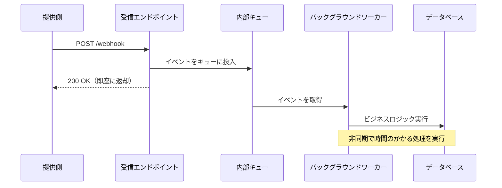

なぜ即座にレスポンスを返すべきかには複数の理由がある。

- **タイムアウト回避**：提供側は通常5〜30秒のタイムアウトを設定している。重い処理をリクエスト内で行うとタイムアウトし、不必要なリトライが発生する
- **信頼性の向上**：受信とビジネスロジックを分離することで、ビジネスロジックの失敗が配信失敗として扱われることを防ぐ
- **負荷分散**：バックグラウンドワーカーによる処理は、自前のペースで負荷を制御できる

```python
from flask import Flask, request, jsonify
from celery import Celery

app = Flask(__name__)
celery = Celery("tasks", broker="redis://localhost:6379")

@app.route("/webhook", methods=["POST"])
def webhook_endpoint():
    # Verify signature first
    signature = request.headers.get("X-Webhook-Signature")
    if not verify_signature(WEBHOOK_SECRET, request.data, signature):
        return jsonify({"error": "Invalid signature"}), 401

    # Parse event
    event = request.get_json()

    # Enqueue for async processing (return immediately)
    process_webhook_event.delay(event)

    return jsonify({"status": "accepted"}), 200

@celery.task(bind=True, max_retries=3)
def process_webhook_event(self, event):
    """
    Process webhook event asynchronously.
    """
    event_id = event["id"]

    # Idempotency check
    if is_event_processed(event_id):
        return

    try:
        # Business logic here
        handle_event(event)
        mark_event_processed(event_id)
    except Exception as exc:
        # Retry with exponential backoff
        raise self.retry(exc=exc, countdown=60 * (2 ** self.request.retries))
```

### 6.2 タイムアウトの設計

提供側は Webhook 配信時にタイムアウトを設定する。このタイムアウトは一般的に**5〜30秒**の範囲である。

| サービス | タイムアウト |
|---------|------------|
| Stripe | 20秒 |
| GitHub | 10秒 |
| Shopify | 5秒 |
| Slack | 3秒 |

受信側はこのタイムアウト内にレスポンスを返す必要がある。前述の通り、重い処理は非同期化すべきだが、それでも署名検証やキューイングに時間がかかる場合がある。

### 6.3 順序保証への対処

Webhook の配信順序は**保証されない**のが一般的である。ネットワークの遅延やリトライのタイミングにより、イベントの発生順と配信順が異なる場合がある。

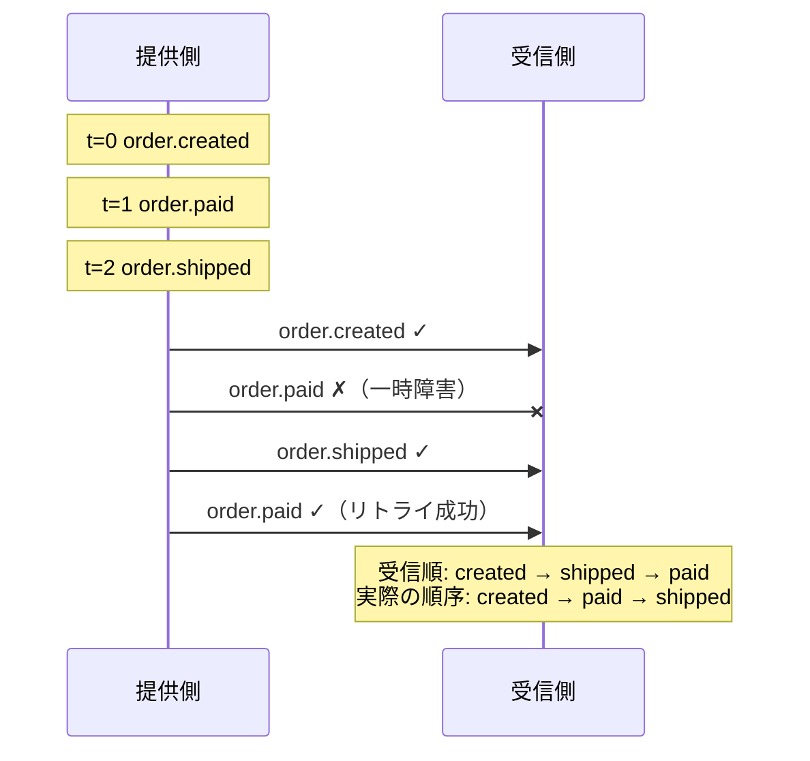

受信側の対策としては以下がある。

- **タイムスタンプベースの処理**：各イベントに含まれるタイムスタンプを参照し、古いイベントによる最新状態の上書きを防ぐ
- **楽観的ロック**：リソースにバージョン番号を持たせ、古いバージョンからの更新を拒否する
- **API での最新状態確認**：Webhook はトリガーとして使い、処理前に API で最新状態を取得する

```python
def handle_order_event(event):
    """
    Handle order events with timestamp-based ordering.
    """
    order_id = event["data"]["order"]["id"]
    event_time = parse_datetime(event["created_at"])

    # Fetch current state from DB
    current_order = db.get_order(order_id)

    if current_order and current_order.last_updated_at >= event_time:
        # This event is older than our current state; skip
        log.info(f"Skipping stale event for order {order_id}")
        return

    # Process the event
    update_order_from_event(order_id, event)
```

### 6.4 受信エンドポイントの可用性

受信エンドポイントの可用性を高く保つことは、Webhook の信頼性に直結する。以下の対策を講じるべきである。

- **ロードバランサーの背後に配置**：単一障害点を排除する
- **ヘルスチェック**：エンドポイントの正常性を常に監視する
- **キューベースのアーキテクチャ**：受信と処理を分離し、処理側の障害が受信に影響しないようにする
- **自動スケーリング**：Webhook の流入量に応じてワーカーを自動的にスケールする

## 7. 運用とモニタリング

### 7.1 配信ログ

Webhook の運用において、配信ログは最も重要なオブザーバビリティツールである。すべての配信試行について、以下の情報を記録すべきである。

```sql
CREATE TABLE webhook_delivery_logs (
    id BIGSERIAL PRIMARY KEY,
    event_id VARCHAR(255) NOT NULL,
    endpoint_id VARCHAR(255) NOT NULL,
    attempt_number INT NOT NULL,

    -- Request details
    request_url TEXT NOT NULL,
    request_headers JSONB,
    request_body TEXT,
    request_timestamp TIMESTAMP NOT NULL,

    -- Response details
    response_status_code INT,
    response_headers JSONB,
    response_body TEXT,
    response_timestamp TIMESTAMP,

    -- Outcome
    duration_ms INT,
    status VARCHAR(50) NOT NULL,  -- 'success', 'failed', 'timeout'
    error_message TEXT,

    created_at TIMESTAMP NOT NULL DEFAULT NOW()
);

-- Indexes for common queries
CREATE INDEX idx_delivery_event ON webhook_delivery_logs (event_id);
CREATE INDEX idx_delivery_endpoint ON webhook_delivery_logs (endpoint_id, created_at);
CREATE INDEX idx_delivery_status ON webhook_delivery_logs (status, created_at);
```

::: tip ログの保持期間
配信ログは容量が大きくなりがちである。30日〜90日の保持期間を設定し、古いログはアーカイブまたは削除する運用が一般的である。重要なのは、デバッグや問合せ対応に十分な期間のログが参照可能であることだ。
:::

### 7.2 メトリクスとアラート

以下のメトリクスを常時監視すべきである。

| メトリクス | 意味 | アラート条件例 |
|-----------|------|--------------|
| 配信成功率 | 成功した配信の割合 | 95%を下回った場合 |
| 配信レイテンシ | イベント発生から配信完了までの時間 | P99が30秒を超えた場合 |
| リトライ率 | リトライが必要になった配信の割合 | 20%を超えた場合 |
| DLQ滞留数 | DLQ内のイベント数 | 0より大きい場合 |
| エンドポイント別失敗率 | 特定エンドポイントの失敗率 | 50%を超えた場合 |
| キュー滞留数 | 未配信のイベント数 | 閾値を超えた場合 |

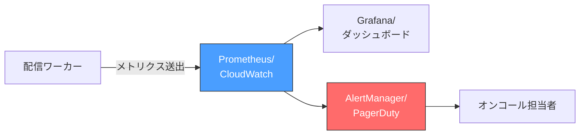

### 7.3 管理画面と再送 UI

Webhook の運用を現実的に行うためには、管理画面（ダッシュボード）が不可欠である。

#### 提供側の管理画面

- イベント一覧：配信されたすべてのイベントの一覧と配信状態
- 配信ログ詳細：リクエスト/レスポンスのヘッダー・ボディを確認できる画面
- 手動再送：失敗したイベントを個別または一括で再送する機能
- エンドポイント管理：登録・更新・削除・一時停止
- テスト送信：ダミーイベントを送信してエンドポイントの動作を確認する機能

#### 受信側のツール

- **Webhook テスターサービス**：開発中に Webhook を受信してペイロードを確認するためのツール。webhook.site や ngrok がよく使われる
- **ローカルトンネル**：開発環境で Webhook を受信するために ngrok や Cloudflare Tunnel を使ってローカルサーバーを公開する

### 7.4 障害対応フロー

Webhook 配信で障害が発生した場合の対応フローを定義しておくことが重要である。

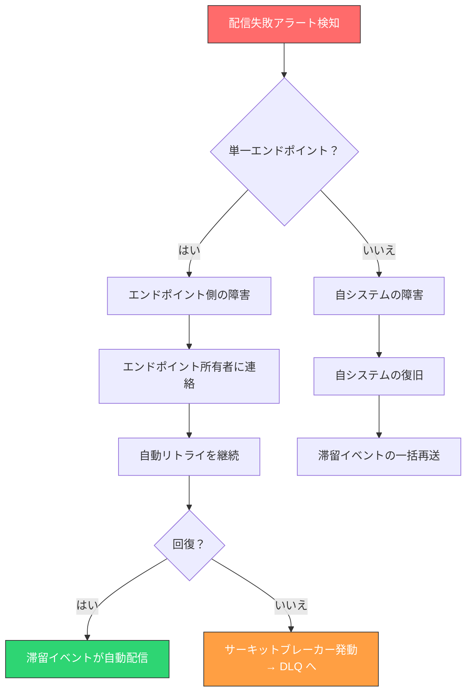

## 8. 実装例 — Webhook 配信システムの全体像

ここまでの設計原則を統合した、Webhook 配信システムの全体アーキテクチャを示す。

### 8.1 全体アーキテクチャ

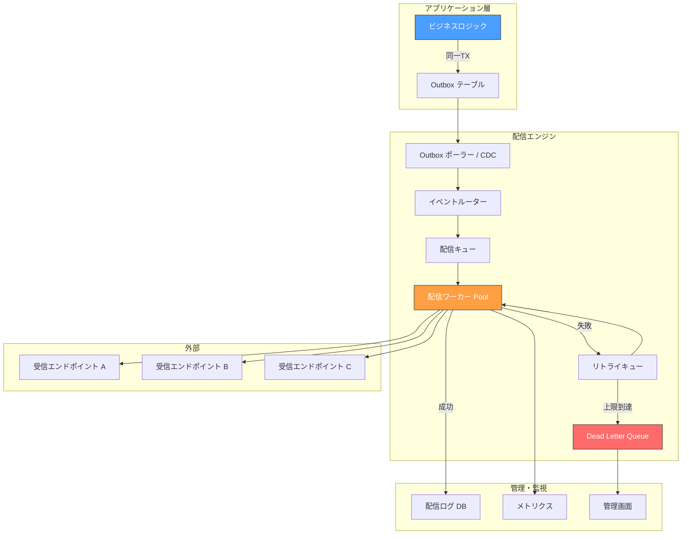

### 8.2 データモデル

```sql
-- Webhook endpoints registered by consumers
CREATE TABLE webhook_endpoints (
    id VARCHAR(255) PRIMARY KEY,
    url TEXT NOT NULL,
    secret VARCHAR(512) NOT NULL,
    events TEXT[] NOT NULL,            -- Subscribed event types
    status VARCHAR(50) NOT NULL DEFAULT 'active',  -- active, paused, disabled
    metadata JSONB,
    created_at TIMESTAMP NOT NULL DEFAULT NOW(),
    updated_at TIMESTAMP NOT NULL DEFAULT NOW()
);

-- Events pending delivery (outbox)
CREATE TABLE webhook_outbox (
    id VARCHAR(255) PRIMARY KEY,
    event_type VARCHAR(255) NOT NULL,
    payload JSONB NOT NULL,
    status VARCHAR(50) NOT NULL DEFAULT 'pending',  -- pending, processing, delivered, failed
    created_at TIMESTAMP NOT NULL DEFAULT NOW(),
    processed_at TIMESTAMP
);

-- Delivery attempts log
CREATE TABLE webhook_deliveries (
    id BIGSERIAL PRIMARY KEY,
    event_id VARCHAR(255) NOT NULL REFERENCES webhook_outbox(id),
    endpoint_id VARCHAR(255) NOT NULL REFERENCES webhook_endpoints(id),
    attempt_number INT NOT NULL DEFAULT 1,
    status VARCHAR(50) NOT NULL,       -- success, failed, timeout
    status_code INT,
    response_body TEXT,
    error_message TEXT,
    duration_ms INT,
    next_retry_at TIMESTAMP,
    created_at TIMESTAMP NOT NULL DEFAULT NOW()
);

CREATE INDEX idx_outbox_status ON webhook_outbox (status, created_at);
CREATE INDEX idx_deliveries_retry ON webhook_deliveries (next_retry_at)
    WHERE status = 'failed' AND next_retry_at IS NOT NULL;
```

### 8.3 配信ワーカーの実装

以下は配信ワーカーのコア部分を擬似コードで示したものである。

```python
import hmac
import hashlib
import json
import time
import httpx

class WebhookDeliveryWorker:
    """
    Core webhook delivery worker with retry logic,
    signature generation, and circuit breaker support.
    """

    def __init__(self, config):
        self.max_retries = config.get("max_retries", 8)
        self.base_delay = config.get("base_delay", 60)
        self.timeout = config.get("timeout", 15)
        self.circuit_breakers = {}

    def deliver(self, event, endpoint):
        """
        Attempt to deliver a webhook event to an endpoint.
        """
        # Check circuit breaker
        if self._is_circuit_open(endpoint["id"]):
            self._enqueue_for_later(event, endpoint)
            return

        # Build request
        payload = json.dumps(event["payload"]).encode("utf-8")
        timestamp = str(int(time.time()))
        signature = self._sign(endpoint["secret"], timestamp, payload)

        headers = {
            "Content-Type": "application/json",
            "X-Webhook-Id": event["id"],
            "X-Webhook-Timestamp": timestamp,
            "X-Webhook-Signature": signature,
            "User-Agent": "MyApp-Webhook/1.0",
        }

        # Send request
        start_time = time.monotonic()
        try:
            response = httpx.post(
                endpoint["url"],
                content=payload,
                headers=headers,
                timeout=self.timeout,
                follow_redirects=False,
            )
            duration_ms = int((time.monotonic() - start_time) * 1000)

            if 200 <= response.status_code < 300:
                self._record_success(event, endpoint, response, duration_ms)
                self._circuit_breaker_success(endpoint["id"])
            elif response.status_code == 410:
                self._disable_endpoint(endpoint["id"])
            elif response.status_code >= 500 or response.status_code == 429:
                self._handle_retryable_failure(
                    event, endpoint, response.status_code, duration_ms
                )
            else:
                # 4xx (except 410, 429): do not retry
                self._record_permanent_failure(
                    event, endpoint, response.status_code, duration_ms
                )

        except httpx.TimeoutException:
            duration_ms = int((time.monotonic() - start_time) * 1000)
            self._handle_retryable_failure(
                event, endpoint, None, duration_ms, error="Timeout"
            )
        except httpx.RequestError as exc:
            duration_ms = int((time.monotonic() - start_time) * 1000)
            self._handle_retryable_failure(
                event, endpoint, None, duration_ms, error=str(exc)
            )

    def _sign(self, secret: str, timestamp: str, payload: bytes) -> str:
        """
        Generate HMAC-SHA256 signature including timestamp.
        """
        signed_content = f"{timestamp}.".encode("utf-8") + payload
        sig = hmac.new(
            key=secret.encode("utf-8"),
            msg=signed_content,
            digestmod=hashlib.sha256,
        ).hexdigest()
        return f"sha256={sig}"

    def _handle_retryable_failure(
        self, event, endpoint, status_code, duration_ms, error=None
    ):
        """
        Handle a retryable failure with exponential backoff.
        """
        attempt = event.get("attempt_number", 1)

        if attempt >= self.max_retries:
            # Move to Dead Letter Queue
            self._move_to_dlq(event, endpoint, error or f"HTTP {status_code}")
            self._circuit_breaker_failure(endpoint["id"])
            return

        # Calculate next retry time with exponential backoff + jitter
        import random
        max_delay = min(self.base_delay * (2 ** (attempt - 1)), 86400)
        delay = random.uniform(0, max_delay)
        next_retry_at = time.time() + delay

        self._schedule_retry(event, endpoint, attempt + 1, next_retry_at)
        self._circuit_breaker_failure(endpoint["id"])

    def _is_circuit_open(self, endpoint_id: str) -> bool:
        """
        Check if the circuit breaker is open for an endpoint.
        """
        cb = self.circuit_breakers.get(endpoint_id)
        if cb is None:
            return False
        if cb["state"] == "open" and time.time() > cb["open_until"]:
            cb["state"] = "half-open"
            return False
        return cb["state"] == "open"

    # ... other helper methods omitted for brevity
```

### 8.4 受信側の実装例（Express.js）

```javascript
const express = require("express");
const crypto = require("crypto");
const { Queue } = require("bullmq");

const app = express();
const webhookQueue = new Queue("webhook-events");

// Use raw body for signature verification
app.post(
  "/webhook",
  express.raw({ type: "application/json" }),
  async (req, res) => {
    const signature = req.headers["x-webhook-signature"];
    const timestamp = req.headers["x-webhook-timestamp"];

    // Verify timestamp (reject if older than 5 minutes)
    const now = Math.floor(Date.now() / 1000);
    if (Math.abs(now - parseInt(timestamp)) > 300) {
      return res.status(401).json({ error: "Request too old" });
    }

    // Verify signature
    const signedContent = `${timestamp}.${req.body.toString()}`;
    const expectedSig =
      "sha256=" +
      crypto
        .createHmac("sha256", process.env.WEBHOOK_SECRET)
        .update(signedContent)
        .digest("hex");

    if (!crypto.timingSafeEqual(
      Buffer.from(expectedSig),
      Buffer.from(signature)
    )) {
      return res.status(401).json({ error: "Invalid signature" });
    }

    // Parse and enqueue
    const event = JSON.parse(req.body.toString());

    await webhookQueue.add(event.type, event, {
      jobId: event.id, // Prevent duplicate processing
    });

    // Return 200 immediately
    res.status(200).json({ received: true });
  }
);

app.listen(3000);
```

## 9. 標準化の動き — Standard Webhooks

Webhook は広く普及しているにもかかわらず、提供側ごとに署名方式やヘッダー名、ペイロード構造が異なる。この断片化を解消するための標準化の動きとして、**Standard Webhooks** が注目されている。

Standard Webhooks は、Svix 社が主導する Webhook の標準化仕様であり、以下を定義している。

- **署名方式**：HMAC-SHA256 ベースの署名を `webhook-signature` ヘッダーに設定
- **タイムスタンプ**：`webhook-timestamp` ヘッダーによるリプレイ攻撃対策
- **イベントID**：`webhook-id` ヘッダーによる冪等性サポート

```
POST /webhook HTTP/1.1
Content-Type: application/json
webhook-id: msg_abc123
webhook-timestamp: 1709366400
webhook-signature: v1,K5oZfzN95Z2P2RxsBhPJDMRYnSsOqON8sFCmvLcAbWM=
```

この標準に準拠することで、受信側は提供側ごとに異なる検証ロジックを実装する必要がなくなり、汎用的な Webhook 受信ライブラリを利用できるようになる。

## 10. まとめ — Webhook 設計のチェックリスト

Webhook は一見シンプルに見えるが、信頼性の高いシステムを構築するには多くの設計判断が必要である。本記事で解説した内容をチェックリストとして整理する。

### 提供側（送信側）のチェックリスト

| カテゴリ | チェック項目 |
|---------|------------|
| イベント設計 | 一貫した命名規則を採用しているか |
| ペイロード | エンベロープ構造にイベントID、タイプ、タイムスタンプを含んでいるか |
| 永続化 | Transactional Outbox などでイベントの欠落を防いでいるか |
| 配信保証 | At-Least-Once セマンティクスを実現しているか |
| リトライ | 指数バックオフ + ジッタでリトライしているか |
| DLQ | リトライ上限到達後の受け皿があるか |
| サーキットブレーカー | 連続失敗時にエンドポイントを保護しているか |
| 署名 | HMAC-SHA256 でペイロードに署名しているか |
| タイムスタンプ | リプレイ攻撃対策としてタイムスタンプを署名に含めているか |
| シークレット管理 | ローテーション可能な仕組みがあるか |
| SSRF対策 | 内部ネットワークへの配信を防止しているか |
| TLS | HTTPS のみを許可しているか |
| ログ | すべての配信試行を記録しているか |
| 管理画面 | 手動再送や配信状況確認の UI があるか |

### 受信側のチェックリスト

| カテゴリ | チェック項目 |
|---------|------------|
| 署名検証 | 定数時間比較で署名を検証しているか |
| タイムスタンプ | 古いリクエストを拒否しているか |
| レスポンス | 即座に 2xx を返し、処理は非同期化しているか |
| 冪等性 | イベント ID による重複排除を実装しているか |
| 順序 | イベントの到着順序に依存しない設計か |
| 可用性 | エンドポイントが高可用性で運用されているか |
| シークレット | シークレットを安全に管理しているか |

Webhook は、現代のWeb開発において欠かすことのできないインテグレーションパターンである。ポーリングの非効率さを解消し、リアルタイムに近いイベント連携を実現する一方で、配信保証やセキュリティにおいて固有の設計課題を持つ。本記事で解説した原則を踏まえることで、信頼性が高くセキュアな Webhook システムを構築するための基盤となるだろう。
