# WebRTC — ブラウザ間のリアルタイム通信

## 1. WebRTCの概要と歴史

### 1.1 なぜWebRTCが必要だったのか

Webの通信モデルは長らく「クライアントがサーバーにリクエストを送り、サーバーがレスポンスを返す」という一方向モデルに支配されてきた。HTTP、WebSocket、Server-Sent Eventsなど、すべてのプロトコルはサーバーを介した通信を前提としている。しかし、ビデオ通話や音声通話のようなリアルタイム通信では、サーバーを介することで生じるレイテンシがユーザー体験を著しく損なう。人間の会話において、150msを超える遅延は不自然さを感じさせ、400msを超えると会話そのものが困難になる。

従来、ブラウザでリアルタイム通信を行うには、Flash PlayerやJavaアプレットといったプラグインが必要だった。SkypeもAdobe Flash Media Serverも、独自のプロトコルとバイナリプラグインに依存していた。これは以下の深刻な問題を引き起こしていた。

- **セキュリティリスク**: プラグインはブラウザのサンドボックスを超えた権限を持ち、脆弱性の温床となった
- **プラットフォーム依存**: モバイルブラウザ（特にiOS Safari）はFlashをサポートしなかった
- **ユーザー体験の断絶**: プラグインのインストールを求めるダイアログは、多くのユーザーにとって障壁だった
- **標準化の欠如**: 各ベンダーが独自プロトコルを使用し、相互運用性がなかった

WebRTCは「プラグインなしで、ブラウザ同士が直接リアルタイム通信できる」という目標を掲げて誕生した。

### 1.2 WebRTCの誕生と標準化

WebRTCの歴史は、2010年にGoogleがGlobal IP Solutions（GIPS）を6,820万ドルで買収したことに始まる。GIPSは音声・映像のリアルタイム処理に優れたコーデック技術を持っていた。Googleはこの技術をオープンソースとして公開し、WebRTCプロジェクトの基盤とした。

2011年にGoogleがChromeでWebRTCのプロトタイプを発表し、IETFとW3Cによる標準化が開始された。標準化は二つの組織にまたがっている。

- **W3C（World Wide Web Consortium）**: JavaScript APIの定義（`RTCPeerConnection`、`MediaStream`など）
- **IETF（Internet Engineering Task Force）**: 通信プロトコルの定義（ICE、DTLS-SRTP、SCTPなど）

2021年1月、W3CはWebRTC 1.0をW3C勧告として正式に公開した。これは約10年にわたる標準化作業の集大成である。現在では、Chrome、Firefox、Safari、Edgeなど主要ブラウザすべてがWebRTCをネイティブにサポートしている。

### 1.3 WebRTCが解決する問題

WebRTCは以下の3つの能力をブラウザに提供する。

1. **メディアキャプチャ**: カメラ・マイクへのアクセス（`getUserMedia`）
2. **Peer-to-Peer通信**: サーバーを介さないブラウザ間の直接通信（`RTCPeerConnection`）
3. **任意データの送受信**: メディア以外のバイナリ・テキストデータの送受信（`RTCDataChannel`）

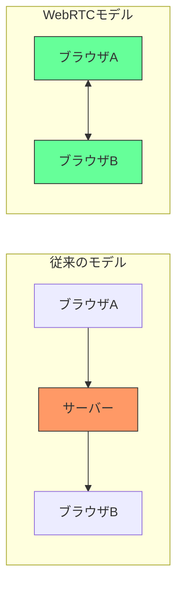

この図が示すように、WebRTCではブラウザ間の通信経路からサーバーを排除できる。ただし後述するように、接続の確立（シグナリング）にはサーバーが必要であり、NAT越えが困難な場合にはリレーサーバー（TURN）を使用する。「完全にサーバー不要」というわけではないが、メディアデータ自体はピア間で直接送受信される。

## 2. アーキテクチャ：P2P、SFU、MCU

WebRTCは本質的にP2P技術だが、実際のプロダクションシステムでは3つのアーキテクチャが使い分けられている。

### 2.1 フルメッシュ P2P

最もシンプルな構成で、各参加者が他のすべての参加者と直接接続する。

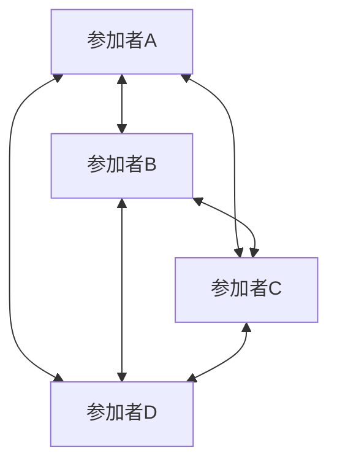

**利点**:
- サーバーインフラが不要（シグナリングサーバーを除く）
- 最小限のレイテンシ
- 暗号化がエンドツーエンドで保証される

**欠点**:
- 参加者数に対して接続数が $n(n-1)/2$ で増加する
- 各参加者がすべてのピアへメディアをエンコード・送信するため、CPU・帯域幅の消費が激しい
- 現実的には4〜6人程度が限界

### 2.2 SFU（Selective Forwarding Unit）

SFUはメディアストリームをデコードせずに他の参加者へ転送する中継サーバーである。現代のWebRTC会議システム（Zoom、Google Meet、Discord）の大半がこの方式を採用している。

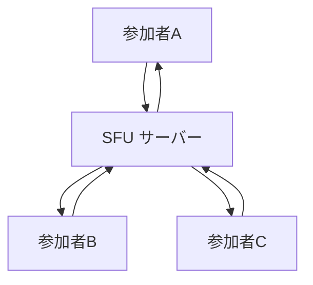

**利点**:
- 各参加者は1本のアップストリームだけを送信すればよい
- SFUは転送のみ行うため、CPU負荷が低い
- Simulcast（後述）と組み合わせることで、受信側の帯域幅に応じた品質調整が可能
- 数十〜数百人規模の会議に対応可能

**欠点**:
- サーバーインフラのコストが発生する
- エンドツーエンド暗号化が複雑になる（SFUがメディアを中継するため）
- 各参加者は全員分のダウンストリームをデコードする必要がある

### 2.3 MCU（Multipoint Control Unit）

MCUはすべての参加者のメディアストリームをデコードし、1つの合成ストリームにミキシングして各参加者に配信する。

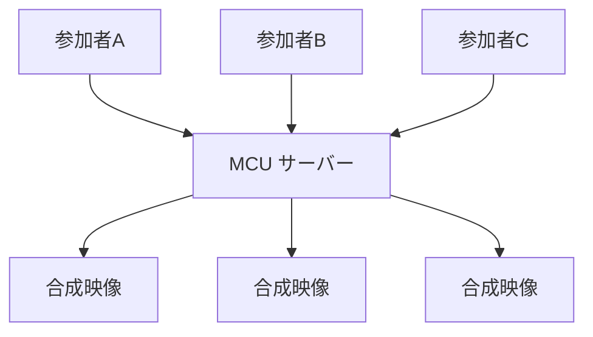

**利点**:
- 各参加者は1本のストリームのみデコードすればよく、クライアントの負荷が最小限
- 低スペックデバイスでも多人数会議に参加可能

**欠点**:
- サーバー側のCPU負荷が極めて高い（全ストリームのデコード・エンコード・合成）
- レイアウトの柔軟性がサーバー側に依存する
- スケーリングコストが非常に高い

### 2.4 アーキテクチャの選択基準

| 特性 | フルメッシュ P2P | SFU | MCU |
|------|:---:|:---:|:---:|
| 参加者数 | 2〜6人 | 数十〜数百人 | 数十人程度 |
| サーバーCPU負荷 | なし | 低い | 非常に高い |
| クライアントCPU負荷 | 高い | 中程度 | 低い |
| アップロード帯域幅 | 高い | 低い | 低い |
| ダウンロード帯域幅 | 高い | 中〜高 | 低い |
| レイテンシ | 最小 | 低い | 中程度 |
| 実装複雑度 | 低い | 中程度 | 高い |

現実のプロダクションでは、1対1通話にはP2P、少人数〜大規模会議にはSFUが採用されるのが一般的である。MCUはレガシーシステムとの互換性が必要な場合に限られる。

## 3. シグナリング：接続確立のメカニズム

### 3.1 シグナリングとは何か

WebRTCにおけるシグナリングとは、ピア間のP2P接続を確立するために必要なメタデータを交換するプロセスである。WebRTCの仕様はシグナリングの方法を意図的に規定していない。これは設計上の判断であり、開発者が既存のインフラ（WebSocket、HTTP、XMPP、SIPなど）を自由に選択できるようにするためである。

シグナリングで交換する情報は主に以下の3つである。

1. **セッション記述（SDP）**: 使用するコーデック、解像度、帯域幅などのメディア能力
2. **ネットワーク候補（ICE Candidate）**: 接続に使用可能なIPアドレスとポート
3. **制御メッセージ**: セッションの開始・終了・変更の通知

```mermaid
sequenceDiagram
    participant A as ピアA
    participant S as シグナリングサーバー
    participant B as ピアB

    A->>S: 通話リクエスト
    S->>B: 通話リクエスト転送
    B->>S: 通話承諾

    A->>A: createOffer()
    A->>A: setLocalDescription(offer)
    A->>S: SDP Offer送信
    S->>B: SDP Offer転送
    B->>B: setRemoteDescription(offer)
    B->>B: createAnswer()
    B->>B: setLocalDescription(answer)
    B->>S: SDP Answer送信
    S->>A: SDP Answer転送
    A->>A: setRemoteDescription(answer)

    Note over A,B: ICE Candidate交換（並行して実施）
    A->>S: ICE Candidate
    S->>B: ICE Candidate転送
    B->>S: ICE Candidate
    S->>A: ICE Candidate転送

    Note over A,B: P2P接続確立
    A<-->B: メディアストリーム
```

### 3.2 SDP（Session Description Protocol）

SDP（RFC 8866）はマルチメディアセッションの記述フォーマットである。WebRTCではこれを使ってピア間のメディア能力のネゴシエーションを行う。

SDPの構造はテキストベースで、以下のような形式をとる。

```
v=0
o=- 4611731400430051336 2 IN IP4 127.0.0.1
s=-
t=0 0
a=group:BUNDLE 0 1
a=extmap-allow-mixed
a=msid-semantic: WMS stream0
m=audio 9 UDP/TLS/RTP/SAVPF 111 103 104
c=IN IP4 0.0.0.0
a=rtcp:9 IN IP4 0.0.0.0
a=ice-ufrag:abc1
a=ice-pwd:def2ghi3jkl4
a=fingerprint:sha-256 AA:BB:CC:...
a=setup:actpass
a=mid:0
a=sendrecv
a=rtpmap:111 opus/48000/2
a=fmtp:111 minptime=10;useinbandfec=1
m=video 9 UDP/TLS/RTP/SAVPF 96 97
c=IN IP4 0.0.0.0
a=rtcp:9 IN IP4 0.0.0.0
a=mid:1
a=sendrecv
a=rtpmap:96 VP8/90000
a=rtpmap:97 H264/90000
a=fmtp:97 profile-level-id=42e01f
```

SDPの主要なフィールドの意味は以下の通りである。

- `v=`: SDPバージョン（常に0）
- `o=`: セッションの発信元情報
- `m=`: メディアライン（audio/video）。使用するプロトコルとペイロードタイプを列挙する
- `a=rtpmap:`: ペイロードタイプとコーデックの対応
- `a=ice-ufrag:` / `a=ice-pwd:`: ICE認証情報
- `a=fingerprint:`: DTLS証明書のフィンガープリント
- `a=sendrecv` / `a=sendonly` / `a=recvonly`: メディアの方向

WebRTCの接続確立は「Offer/Answer」モデルに従う。

1. **Offer**: 発信側が自分のメディア能力をSDPとして生成する
2. **Answer**: 受信側がOfferを受け取り、互いにサポートするコーデックや設定を選択してSDPを返す

### 3.3 ICE（Interactive Connectivity Establishment）

ICE（RFC 8445）はNAT越えのためのフレームワークである。インターネット上のほとんどのデバイスはNATの背後にあり、プライベートIPアドレスを使用している。P2P通信を確立するには、NAT越えを行ってピアが到達可能なアドレスを見つける必要がある。

ICEは以下のステップで動作する。

**1. Candidate Gathering（候補収集）**

ICEエージェントは3種類の候補を収集する。

- **Host Candidate**: デバイスに直接割り当てられたIPアドレス（プライベートIP含む）
- **Server Reflexive Candidate（srflx）**: STUNサーバーに問い合わせて発見した、NATの外側から見えるIPアドレス
- **Relay Candidate**: TURNサーバーから割り当てられたリレーアドレス

**2. Connectivity Check（接続性チェック）**

収集したすべての候補ペア（ローカル候補 × リモート候補）に対してSTUN Bindingリクエストを送信し、接続可能なパスを探索する。

**3. Candidate Pair Nomination（候補ペア選出）**

接続性チェックに成功した候補ペアの中から、最適なものを選択してメディアの送受信に使用する。

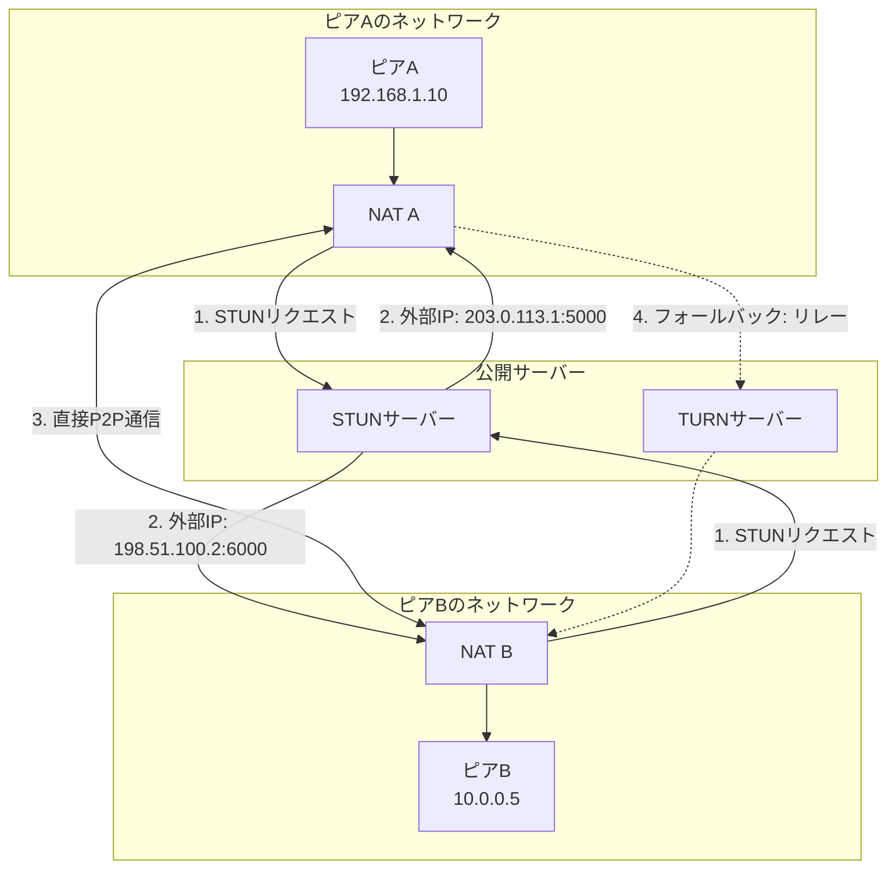

### 3.4 STUN（Session Traversal Utilities for NAT）

STUN（RFC 8489）は、NAT越えのために自分の外部IPアドレスとポートを発見するためのプロトコルである。

動作は非常にシンプルである。クライアントがSTUNサーバーにUDPパケットを送信すると、STUNサーバーはそのパケットの送信元IPアドレスとポート（= NATが割り当てた外部アドレス）をレスポンスに含めて返す。

STUNだけでNAT越えが成功する確率は、NATの種類に依存する。

- **Full Cone NAT**: 外部のどのホストからでも内部ホストに到達可能 → STUNだけで接続可能
- **Address Restricted Cone NAT**: 内部ホストが先に通信したアドレスからのみ到達可能 → STUNで接続可能な場合が多い
- **Port Restricted Cone NAT**: アドレスとポートの両方が一致する場合のみ到達可能 → STUNで接続可能な場合がある
- **Symmetric NAT**: 宛先ごとに異なるマッピングが作成される → STUNだけでは接続不可能

### 3.5 TURN（Traversal Using Relays around NAT）

TURN（RFC 8656）は、STUNで直接接続が確立できない場合のフォールバックとして使用されるリレーサーバーである。Symmetric NAT同士の通信や、ファイアウォールがUDPをブロックしている環境では、TURNが唯一の選択肢となる。

TURNの動作原理は以下の通りである。

1. クライアントがTURNサーバーにAllocateリクエストを送信する
2. TURNサーバーがリレーアドレス（公開IPアドレスとポート）を割り当てる
3. 相手ピアはこのリレーアドレスに向けてデータを送信する
4. TURNサーバーがデータをクライアントに転送する

TURNの重要な特性として、**すべてのメディアデータがTURNサーバーを経由する**ため、帯域幅コストが非常に高い。Google/Twilioの統計によると、WebRTC接続の約86%がSTUNで直接接続でき、TURNが必要になるのは約14%程度とされる。しかし、エンタープライズ環境（厳しいファイアウォール設定）ではTURNの利用率は大幅に上昇する。

TURNサーバーはUDP上で動作するのが基本だが、UDP自体がブロックされている環境に対応するため、TCP上のTURNやTLS上のTURN（443番ポート）もサポートされている。

## 4. メディアストリーム：getUserMedia と MediaStreamTrack

### 4.1 メディアキャプチャAPI

`getUserMedia`は、ブラウザからカメラやマイクにアクセスするためのAPIである。WebRTCの前提となるメディアキャプチャ機能を提供する。

```javascript
// Basic media capture
async function captureMedia() {
  try {
    const stream = await navigator.mediaDevices.getUserMedia({
      video: {
        width: { ideal: 1280 },
        height: { ideal: 720 },
        frameRate: { ideal: 30, max: 60 },
        facingMode: "user" // front camera on mobile
      },
      audio: {
        echoCancellation: true,
        noiseSuppression: true,
        autoGainControl: true,
        sampleRate: 48000
      }
    });
    return stream;
  } catch (error) {
    // Handle permission denial or hardware errors
    if (error.name === "NotAllowedError") {
      console.error("User denied media access");
    } else if (error.name === "NotFoundError") {
      console.error("No media devices found");
    }
    throw error;
  }
}
```

`getUserMedia`は、ユーザーの明示的な許可なしにはカメラ・マイクにアクセスできない。ブラウザはパーミッションダイアログを表示し、ユーザーが許可した場合のみ`MediaStream`オブジェクトが返される。また、HTTPS環境（またはlocalhost）でのみ利用可能であり、セキュリティが確保されている。

### 4.2 MediaStreamとMediaStreamTrack

`MediaStream`は複数の`MediaStreamTrack`を束ねるコンテナである。一般的なビデオ通話では、1つの音声トラックと1つの映像トラックを含む。

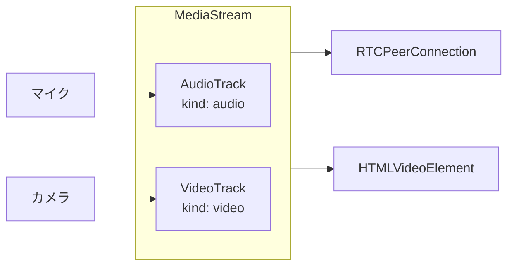

各`MediaStreamTrack`は独立して制御可能である。

```javascript
// Manipulate individual tracks
function toggleMute(stream) {
  const audioTrack = stream.getAudioTracks()[0];
  audioTrack.enabled = !audioTrack.enabled; // mute/unmute without stopping
}

function switchCamera(stream) {
  const videoTrack = stream.getVideoTracks()[0];
  videoTrack.stop(); // release current camera

  // Request new camera
  return navigator.mediaDevices.getUserMedia({
    video: { facingMode: "environment" } // rear camera
  });
}
```

### 4.3 画面共有：getDisplayMedia

`getDisplayMedia`は画面共有のためのAPIである。`getUserMedia`と同様に`MediaStream`を返すが、ソースはカメラではなく画面（またはウィンドウ・タブ）である。

```javascript
// Screen sharing capture
async function startScreenShare() {
  const stream = await navigator.mediaDevices.getDisplayMedia({
    video: {
      cursor: "always",       // show cursor in capture
      displaySurface: "monitor" // prefer full screen
    },
    audio: true // capture system audio (browser support varies)
  });

  // Detect when user stops sharing via browser UI
  stream.getVideoTracks()[0].addEventListener("ended", () => {
    console.log("User stopped screen sharing");
  });

  return stream;
}
```

### 4.4 メディア処理パイプライン

WebRTCのメディア処理は、キャプチャからレンダリングまで複数のステージを経る。

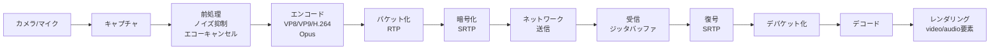

この一連のパイプラインは、ブラウザの内部で自動的に処理される。開発者が直接操作するのは主にキャプチャとレンダリングの部分であり、エンコード・パケット化・暗号化はWebRTCスタックが透過的に処理する。

## 5. RTCPeerConnectionの仕組み

### 5.1 RTCPeerConnectionの役割

`RTCPeerConnection`はWebRTCの中核をなすAPIであり、以下の機能を統合的に提供する。

- ICEによるNAT越えと接続確立
- DTLSによる鍵交換とSRTPによるメディア暗号化
- RTPによるメディアの送受信
- 帯域幅推定と輻輳制御
- コーデックのネゴシエーション

### 5.2 接続確立のライフサイクル

`RTCPeerConnection`の状態遷移は複数の状態マシンで管理される。

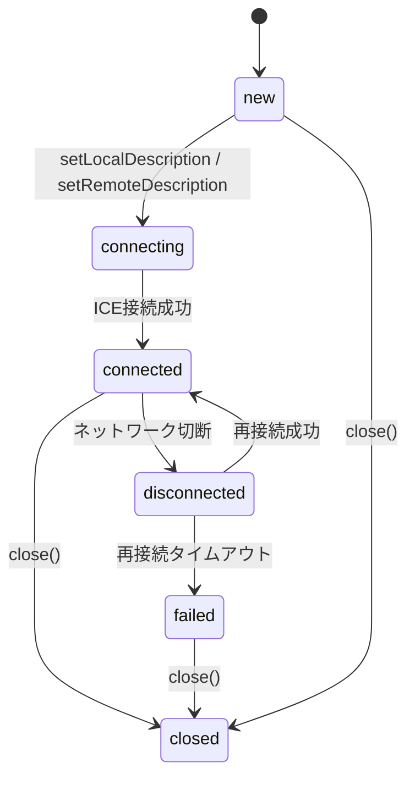

### 5.3 完全な接続フロー

以下は、Offer/Answerモデルに基づく完全な接続確立コードである。

```javascript
// Offerer (caller) side
async function createPeerConnection() {
  const config = {
    iceServers: [
      { urls: "stun:stun.l.google.com:19302" },
      {
        urls: "turn:turn.example.com:3478",
        username: "user",
        credential: "pass"
      }
    ],
    // Prefer unified plan (modern standard)
    sdpSemantics: "unified-plan"
  };

  const pc = new RTCPeerConnection(config);

  // Handle ICE candidates
  pc.onicecandidate = (event) => {
    if (event.candidate) {
      // Send candidate to remote peer via signaling server
      signalingServer.send({
        type: "ice-candidate",
        candidate: event.candidate
      });
    }
  };

  // Handle incoming tracks from remote peer
  pc.ontrack = (event) => {
    const remoteVideo = document.getElementById("remoteVideo");
    remoteVideo.srcObject = event.streams[0];
  };

  // Monitor connection state
  pc.onconnectionstatechange = () => {
    console.log("Connection state:", pc.connectionState);
    if (pc.connectionState === "failed") {
      // Attempt ICE restart
      pc.restartIce();
    }
  };

  return pc;
}

// Caller: create and send offer
async function call(pc, localStream) {
  // Add local tracks to connection
  localStream.getTracks().forEach((track) => {
    pc.addTrack(track, localStream);
  });

  // Create offer
  const offer = await pc.createOffer();
  await pc.setLocalDescription(offer);

  // Send offer to remote peer
  signalingServer.send({
    type: "offer",
    sdp: pc.localDescription
  });
}

// Callee: receive offer and send answer
async function handleOffer(pc, offer, localStream) {
  await pc.setRemoteDescription(new RTCSessionDescription(offer));

  localStream.getTracks().forEach((track) => {
    pc.addTrack(track, localStream);
  });

  const answer = await pc.createAnswer();
  await pc.setLocalDescription(answer);

  signalingServer.send({
    type: "answer",
    sdp: pc.localDescription
  });
}

// Handle received ICE candidate
async function handleIceCandidate(pc, candidate) {
  await pc.addIceCandidate(new RTCIceCandidate(candidate));
}
```

### 5.4 Unified PlanとTransceiver

WebRTC 1.0以降、SDPの扱い方として「Unified Plan」が標準となった。これは各メディアトラックが独立した`m=`ラインを持つモデルであり、古い「Plan B」（Chromeが長年使用していた独自方式）を置き換えた。

`RTCRtpTransceiver`は送受信の双方向制御を統一的に扱うオブジェクトである。

```javascript
// Using transceivers for fine-grained control
const transceiver = pc.addTransceiver("video", {
  direction: "sendrecv",
  sendEncodings: [
    { rid: "high", maxBitrate: 2500000 },  // 2.5 Mbps
    { rid: "mid", maxBitrate: 500000, scaleResolutionDownBy: 2 },
    { rid: "low", maxBitrate: 150000, scaleResolutionDownBy: 4 }
  ]
});

// Change direction dynamically
transceiver.direction = "sendonly"; // stop receiving
transceiver.direction = "recvonly"; // stop sending
transceiver.direction = "inactive"; // pause both
```

上の例では、Simulcast（同時配信）を設定している。3つの異なる解像度・ビットレートでエンコードし、SFUが受信者のネットワーク状況に応じて適切なストリームを選択して転送する仕組みである。

### 5.5 コーデック

WebRTCで使用される主要なコーデックは以下の通りである。

**音声コーデック**:
- **Opus**: WebRTCの必須コーデック。6kbps〜510kbpsの広範なビットレートに対応し、音声とミュージックの両方に最適化されている
- **G.711**: 旧来の電話網との互換性のために使用される

**映像コーデック**:
- **VP8**: Googleがオープンソース化したコーデック。広くサポートされている
- **VP9**: VP8の後継。圧縮効率が約30%向上
- **H.264**: ハードウェアエンコード/デコードのサポートが最も広い
- **AV1**: 次世代コーデック。VP9/H.265と同等以上の圧縮効率。WebRTCでのサポートが進行中

## 6. RTCDataChannel

### 6.1 DataChannelの概要

`RTCDataChannel`はWebRTCのもう一つの重要な柱であり、メディア以外の任意のデータをピア間で送受信するためのAPIである。WebSocketに似たインターフェースを持つが、P2Pで動作する点が根本的に異なる。

`RTCDataChannel`はSCTP（Stream Control Transmission Protocol）の上に構築されている。SCTPはTCPとUDPの特性を併せ持つトランスポートプロトコルであり、WebRTCではDTLS上で動作する（DTLS-SCTP）。

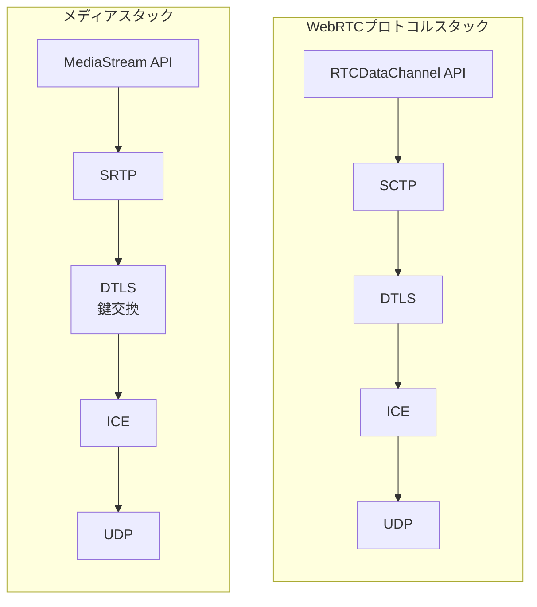

### 6.2 DataChannelの作成と使用

```javascript
// Create a data channel (offerer side)
const dataChannel = pc.createDataChannel("chat", {
  ordered: true,       // guarantee message order (default: true)
  maxRetransmits: 3,   // max retransmission attempts
  // maxPacketLifeTime: 1000, // alternative: max ms to retransmit
  protocol: "json"     // sub-protocol label
});

dataChannel.onopen = () => {
  console.log("Data channel is open");
  dataChannel.send(JSON.stringify({ type: "hello", msg: "Hi!" }));
};

dataChannel.onmessage = (event) => {
  const data = JSON.parse(event.data);
  console.log("Received:", data);
};

dataChannel.onclose = () => {
  console.log("Data channel closed");
};

// Answerer side: listen for incoming data channels
pc.ondatachannel = (event) => {
  const receivedChannel = event.channel;
  receivedChannel.onmessage = (e) => {
    console.log("Received:", e.data);
  };
};
```

### 6.3 信頼性モードの選択

`RTCDataChannel`はSCTPの特性を活かして、信頼性のレベルを細かく制御できる。

| モード | ordered | maxRetransmits / maxPacketLifeTime | 用途 |
|--------|---------|--------------------------------------|------|
| 完全信頼・順序保証 | true | 指定なし | チャットメッセージ、ファイル転送 |
| 完全信頼・順序なし | false | 指定なし | 大量データの並列転送 |
| 部分信頼・回数制限 | true/false | maxRetransmits: N | ゲームの状態同期 |
| 部分信頼・時間制限 | true/false | maxPacketLifeTime: ms | リアルタイムセンサーデータ |

この柔軟性はTCPやWebSocketでは得られない。例えばオンラインゲームでは、プレイヤーの位置情報は最新のものだけが重要であり、古いデータの再送は不要である。この場合、`ordered: false, maxRetransmits: 0` を指定することで、UDPに近い低レイテンシ通信が実現できる。

### 6.4 DataChannelの活用事例

- **ファイル共有**: サーバーを介さずにブラウザ間で直接ファイルを転送。大容量ファイルの場合はチャンク分割して送信する
- **テキストチャット**: P2Pのリアルタイムメッセージング
- **ゲーミング**: プレイヤー間の状態同期、入力の送受信
- **リモートデスクトップ**: マウス・キーボード入力の転送
- **IoT**: センサーデータのリアルタイム転送

## 7. セキュリティ：DTLS-SRTP

### 7.1 WebRTCのセキュリティモデル

WebRTCはセキュリティを設計の根幹に据えている。すべてのメディア通信は暗号化が必須であり、暗号化をオフにするオプションは存在しない。これはHTTPSのような「オプション」ではなく、プロトコルレベルで強制される。

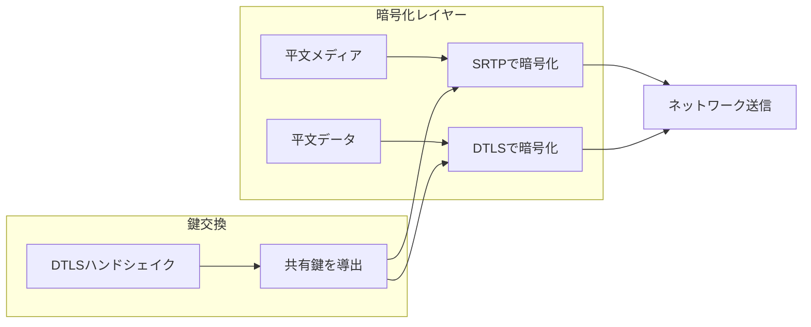

### 7.2 DTLS（Datagram Transport Layer Security）

DTLS（RFC 9147）はTLSをUDPに適応させたプロトコルである。TLSがTCPの上で動作するのに対し、DTLSはUDPの上で動作する。パケットロスやパケットの順序入れ替わりに対応するため、TLSにはないメッセージのシーケンス番号やリトランスミッションタイマーが追加されている。

WebRTCにおけるDTLSの役割は以下の通りである。

1. **鍵交換**: ピア間でSRTPの暗号鍵を安全に交換する
2. **認証**: SDPで交換した証明書フィンガープリントを検証し、中間者攻撃を防ぐ
3. **DataChannelの暗号化**: `RTCDataChannel`のデータはDTLS上のSCTPで送受信される

### 7.3 SRTP（Secure Real-time Transport Protocol）

SRTP（RFC 3711）はRTPを暗号化・認証するプロトコルである。WebRTCではDTLS-SRTP（RFC 5764）が使用され、DTLSハンドシェイクで確立した鍵を使ってRTPパケットを暗号化する。

SRTPの主要な特性は以下の通りである。

- **機密性**: AES-128-CM（Counter Mode）によるペイロードの暗号化
- **完全性**: HMAC-SHA1によるメッセージ認証
- **リプレイ保護**: シーケンス番号のスライディングウィンドウによるリプレイ攻撃の防止
- **低オーバーヘッド**: RTPヘッダは暗号化せず、ペイロードのみを暗号化するため、ルーティングに影響しない

### 7.4 E2EE（エンドツーエンド暗号化）の課題

P2Pの場合、DTLSハンドシェイクによってピア間のE2EEが自然に実現される。しかしSFU経由の通信では、SFUがSRTPパケットのヘッダを読む必要があるため、従来のDTLS-SRTPではSFUが暗号鍵にアクセスでき、真のE2EEにはならない。

この問題を解決するために、「Insertable Streams」（現在は「Encoded Transform」として標準化が進行中）というAPIが提案されている。これにより、エンコード後・パケット化前にアプリケーション層で追加の暗号化を行うことが可能になる。

```javascript
// Encoded Transform API for E2EE
const sender = pc.addTrack(track, stream);
const senderTransform = new TransformStream({
  transform(chunk, controller) {
    // chunk.data contains the encoded frame
    const encryptedData = encryptFrame(chunk.data, encryptionKey);
    chunk.data = encryptedData;
    controller.enqueue(chunk);
  }
});

const senderStreams = sender.createEncodedStreams();
senderStreams.readable
  .pipeThrough(senderTransform)
  .pipeTo(senderStreams.writable);
```

### 7.5 パーミッションとプライバシー

WebRTCのセキュリティはプロトコルレベルの暗号化だけでなく、ブラウザレベルのプライバシー保護も含む。

- **メディアアクセスの許可制**: カメラ・マイクへのアクセスにはユーザーの明示的な許可が必要
- **Secure Context必須**: HTTPS環境でのみ`getUserMedia`が利用可能
- **IPアドレスの隠蔽**: `iceTransportPolicy: "relay"` を指定することでローカルIPアドレスの漏洩を防止可能
- **mDNS候補**: プライバシー保護のため、ローカルIPアドレスの代わりにmDNS名を使用するブラウザ実装が増えている

## 8. 実装パターンとライブラリ

### 8.1 シグナリングサーバーの実装例

シグナリングサーバーは、WebSocketを使ってSDPとICE Candidateを中継するだけのシンプルなサーバーで構成できる。

```javascript
// Signaling server using WebSocket (Node.js)
const WebSocket = require("ws");
const wss = new WebSocket.Server({ port: 8080 });

const rooms = new Map();

wss.on("connection", (ws) => {
  ws.on("message", (message) => {
    const data = JSON.parse(message);

    switch (data.type) {
      case "join": {
        const room = rooms.get(data.room) || new Set();
        room.add(ws);
        rooms.set(data.room, room);
        ws.room = data.room;
        ws.userId = data.userId;

        // Notify other participants
        room.forEach((peer) => {
          if (peer !== ws && peer.readyState === WebSocket.OPEN) {
            peer.send(JSON.stringify({
              type: "peer-joined",
              userId: data.userId
            }));
          }
        });
        break;
      }

      case "offer":
      case "answer":
      case "ice-candidate": {
        // Forward to target peer
        const room = rooms.get(ws.room);
        if (room) {
          room.forEach((peer) => {
            if (peer !== ws &&
                peer.userId === data.target &&
                peer.readyState === WebSocket.OPEN) {
              peer.send(JSON.stringify({
                ...data,
                from: ws.userId
              }));
            }
          });
        }
        break;
      }
    }
  });

  ws.on("close", () => {
    const room = rooms.get(ws.room);
    if (room) {
      room.delete(ws);
      // Notify others about departure
      room.forEach((peer) => {
        if (peer.readyState === WebSocket.OPEN) {
          peer.send(JSON.stringify({
            type: "peer-left",
            userId: ws.userId
          }));
        }
      });
    }
  });
});
```

### 8.2 主要なWebRTCライブラリとフレームワーク

WebRTCのAPI自体は低レベルであり、プロダクション品質のアプリケーションを構築するには多くのエッジケースに対処する必要がある。以下は主要なライブラリ・フレームワークである。

**クライアントサイド**:

| ライブラリ | 特徴 |
|-----------|------|
| **simple-peer** | 最小限のラッパー。P2P接続の確立を簡素化 |
| **PeerJS** | シグナリングサーバー込みのフルソリューション。プロトタイピングに最適 |
| **mediasoup-client** | mediasoupサーバーと連携するSFUクライアント |
| **livekit-client** | LiveKitサーバーと連携。TypeScriptファースト |

**サーバーサイド（SFU/MCU）**:

| ライブラリ | 言語 | 特徴 |
|-----------|------|------|
| **mediasoup** | Node.js/C++ | 高性能SFU。ワーカープロセスがC++で実装 |
| **Janus** | C | 汎用WebRTCゲートウェイ。プラグインアーキテクチャ |
| **Pion** | Go | Go言語のWebRTC実装。サーバーサイドWebRTCに最適 |
| **LiveKit** | Go | オープンソースのSFUプラットフォーム。Kubernetes対応 |

### 8.3 simple-peerを使った最小実装例

```javascript
// Using simple-peer for minimal P2P connection
import SimplePeer from "simple-peer";

// Initiator side
const peer1 = new SimplePeer({
  initiator: true,
  stream: localStream,
  trickle: true,
  config: {
    iceServers: [
      { urls: "stun:stun.l.google.com:19302" }
    ]
  }
});

peer1.on("signal", (data) => {
  // Send signaling data to remote peer via your signaling mechanism
  sendToRemotePeer(data);
});

peer1.on("stream", (remoteStream) => {
  document.getElementById("remoteVideo").srcObject = remoteStream;
});

peer1.on("data", (data) => {
  console.log("Received data:", data.toString());
});

// Receiver side
const peer2 = new SimplePeer({
  initiator: false,
  stream: localStream
});

// When signaling data is received from remote
function onSignalingData(data) {
  peer2.signal(data);
}
```

## 9. パフォーマンス最適化

### 9.1 帯域幅の推定と適応

WebRTCには組み込みの帯域幅推定（BWE: Bandwidth Estimation）メカニズムが備わっている。Google Congestion Control（GCC）アルゴリズムがデフォルトで使用され、ネットワークの輻輳状況に応じてビットレートを動的に調整する。

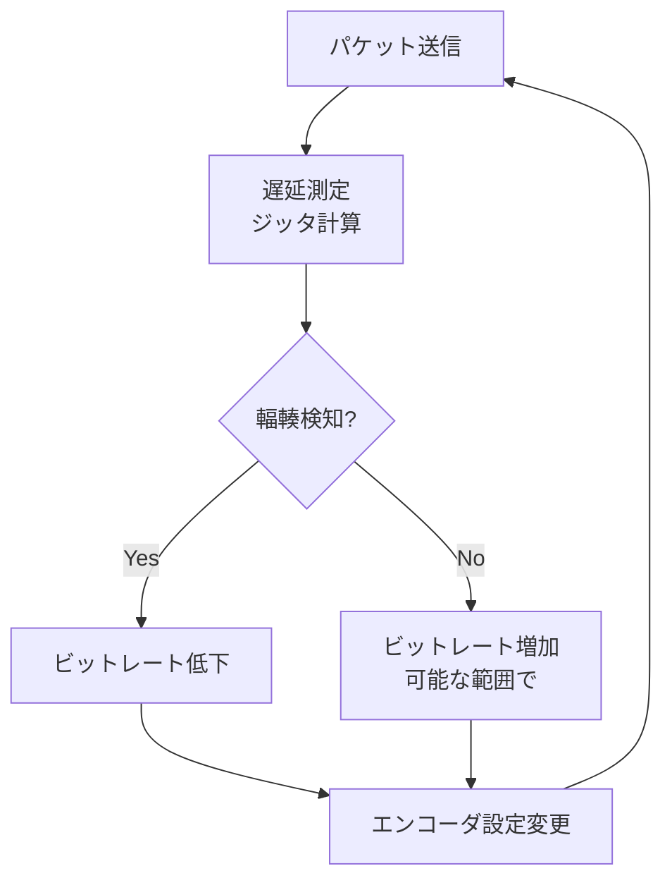

開発者はBWEの結果を`getStats()` APIを通じて監視できる。

```javascript
// Monitor connection quality
async function monitorStats(pc) {
  const stats = await pc.getStats();

  stats.forEach((report) => {
    if (report.type === "outbound-rtp" && report.kind === "video") {
      console.log("Bytes sent:", report.bytesSent);
      console.log("Packets sent:", report.packetsSent);
      console.log("Frames encoded:", report.framesEncoded);
      console.log("Quality limitation:", report.qualityLimitationReason);
      // "none" | "cpu" | "bandwidth" | "other"
    }

    if (report.type === "inbound-rtp" && report.kind === "video") {
      console.log("Bytes received:", report.bytesReceived);
      console.log("Packets lost:", report.packetsLost);
      console.log("Jitter:", report.jitter);
      console.log("Frames decoded:", report.framesDecoded);
    }

    if (report.type === "candidate-pair" && report.state === "succeeded") {
      console.log("Round-trip time:", report.currentRoundTripTime);
      console.log("Available outgoing bitrate:",
                  report.availableOutgoingBitrate);
    }
  });
}
```

### 9.2 Simulcastと SVC

**Simulcast**は、送信側が同じソースから複数の解像度・ビットレートのストリームを同時にエンコードして送信する手法である。SFUはこれらの中から受信者のネットワーク状況に最適なものを選択して転送する。

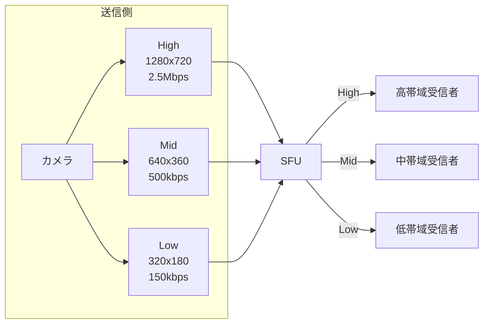

**SVC（Scalable Video Coding）**は、1つのエンコードストリーム内に複数のレイヤーを含む手法である。VP9 SVCやAV1 SVCがWebRTCでの利用が進んでいる。ベースレイヤーだけでも再生可能であり、追加レイヤーによって解像度やフレームレートが向上する。SimulcastよりもCPU効率が良いが、コーデックのサポートが限定的である。

### 9.3 ジッタバッファの最適化

ネットワークの遅延変動（ジッタ）はリアルタイム通信の大敵である。パケットが均等な間隔で到着することはまずなく、到着間隔にばらつきが生じる。ジッタバッファはこのばらつきを吸収し、滑らかな再生を実現するための機構である。

ジッタバッファのサイズにはトレードオフがある。

- **バッファが小さすぎる場合**: パケットの到着が遅れると音声・映像が途切れる（バッファアンダーラン）
- **バッファが大きすぎる場合**: レイテンシが増大し、会話の自然さが損なわれる

WebRTCの実装は適応的ジッタバッファを使用しており、ネットワーク状況に応じて自動的にバッファサイズを調整する。開発者が直接制御することは通常ないが、`getStats()`で`jitterBufferDelay`を監視することで状況を把握できる。

### 9.4 ICEの最適化

ICEの接続確立にかかる時間を短縮するために、以下のテクニックが使用される。

**ICE Trickle**: すべてのICE候補を収集してからOfferを送るのではなく、候補が見つかるたびに逐次送信する。これにより接続確立時間が大幅に短縮される。

**ICE Restart**: ネットワーク変更（Wi-Fiからモバイル回線への切り替えなど）時に、既存のセッションを維持したまま新しいICE候補を収集し直す。

```javascript
// ICE restart when network changes
pc.oniceconnectionstatechange = () => {
  if (pc.iceConnectionState === "disconnected" ||
      pc.iceConnectionState === "failed") {
    // Trigger ICE restart
    const offer = await pc.createOffer({ iceRestart: true });
    await pc.setLocalDescription(offer);
    signalingServer.send({
      type: "offer",
      sdp: pc.localDescription
    });
  }
};
```

**Aggressive Nomination**: ICEのデフォルトでは最適な候補ペアを選出するまで待つが、Aggressive Nominationでは最初に成功した候補ペアを即座に採用することで、接続確立を高速化する。

### 9.5 メディア最適化のベストプラクティス

1. **解像度とフレームレートの適応**: ネットワーク状況に応じて動的に変更する
2. **ハードウェアエンコーディングの活用**: H.264はほとんどのデバイスでハードウェアエンコード/デコードが利用可能
3. **前処理の活用**: ノイズ抑制・エコーキャンセルを有効にする（デフォルトで有効）
4. **Bandwidth制限の設定**: `RTCRtpSender.setParameters()`で最大ビットレートを制限する

```javascript
// Adjust encoding parameters dynamically
async function adjustQuality(sender, maxBitrate) {
  const params = sender.getParameters();
  if (!params.encodings || params.encodings.length === 0) return;

  params.encodings[0].maxBitrate = maxBitrate;
  await sender.setParameters(params);
}

// Limit video to 1 Mbps
const videoSender = pc.getSenders().find(s => s.track?.kind === "video");
if (videoSender) {
  adjustQuality(videoSender, 1000000);
}
```

## 10. WebRTCのプロトコルスタック全体像

WebRTCが使用するプロトコルの全体像を整理する。

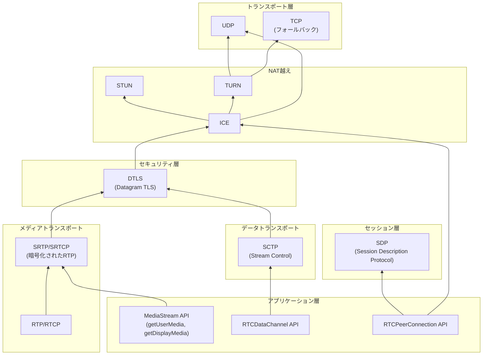

各レイヤーの責務を整理すると以下のようになる。

| レイヤー | プロトコル | 責務 |
|---------|-----------|------|
| アプリケーション | MediaStream, DataChannel | メディアキャプチャ、データ送受信のAPI |
| セッション | SDP | メディア能力のネゴシエーション |
| メディアトランスポート | RTP/RTCP, SRTP | メディアデータの送受信、品質制御 |
| データトランスポート | SCTP | 信頼性・順序の制御可能なデータ転送 |
| セキュリティ | DTLS | 鍵交換、暗号化、認証 |
| NAT越え | ICE, STUN, TURN | ネットワークパス探索、NAT越え |
| トランスポート | UDP (TCP) | パケット配送 |

## 11. 現実世界でのWebRTC

### 11.1 採用事例

WebRTCはすでに幅広い分野で採用されている。

- **ビデオ会議**: Google Meet、Microsoft Teams、Zoom（部分的）、Discord
- **ライブ配信**: Twitch（超低遅延モード）、YouTube Live
- **医療**: 遠隔診療システム
- **教育**: オンライン授業プラットフォーム
- **IoT**: カメラのリアルタイムストリーミング
- **ゲーム**: クラウドゲーミング（Google Stadia [サービス終了]、NVIDIA GeForce NOW）
- **ファイル共有**: WebTorrent（BitTorrentのWebRTC実装）

### 11.2 制限と課題

WebRTCには以下の制限・課題が存在する。

**ブラウザ間の差異**: 主要ブラウザすべてがWebRTCをサポートしているが、実装の詳細に差異がある。特にコーデックの対応状況、`getStats()`の出力形式、`getUserMedia`の制約パラメータの扱いなどに違いがある。

**NAT越えの信頼性**: 厳しいファイアウォール環境（企業ネットワークなど）ではTURNサーバーが不可欠であり、帯域幅コストが発生する。

**スケーラビリティ**: P2Pの性質上、大規模配信にはSFU/MCUのインフラが必要となり、「サーバーレス」の理想からは離れる。

**モバイルでの制限**: バッテリー消費、バックグラウンド実行の制限、ネットワーク切り替え時の接続断がモバイル特有の課題である。

### 11.3 WebTransportとの関係

WebTransport（W3C/IETF策定中）は、HTTP/3（QUIC）上で双方向のデータ通信を行うためのAPIである。WebRTCの`RTCDataChannel`と機能が重複する部分があるが、WebTransportはクライアント-サーバー通信に特化しており、P2P通信はサポートしない。

WebRTCとWebTransportの使い分けは以下のようになると予想される。

- **P2Pメディア通信**: 引き続きWebRTC
- **クライアント-サーバー間の低レイテンシデータ通信**: WebTransport
- **ゲーミングのサーバー-クライアント間通信**: WebTransport

両者は競合ではなく補完関係にあり、ユースケースに応じて使い分けられることになる。

## 12. まとめ

WebRTCは「ブラウザにリアルタイム通信能力を持たせる」という野心的な目標を実現した技術である。その設計は以下の原則に基づいている。

1. **プラグイン不要**: ブラウザのネイティブAPIとして提供され、追加のソフトウェアインストールが不要
2. **セキュリティファースト**: 暗号化が必須であり、オプションではない。DTLS-SRTPによる通信の暗号化、パーミッションモデルによるプライバシー保護が組み込まれている
3. **NAT越えの自動化**: ICE/STUN/TURNの組み合わせにより、複雑なネットワーク環境でも接続を確立できる
4. **適応性**: 帯域幅推定、Simulcast、適応ジッタバッファにより、ネットワーク状況の変動に自動的に対応する

同時に、WebRTCのアーキテクチャは以下のトレードオフを内包している。

- **P2Pの限界**: 大規模会議にはSFU/MCUサーバーが必要であり、完全なサーバーレスは少人数通話に限られる
- **複雑なプロトコルスタック**: ICE、DTLS、SRTP、SCTP、RTPなど多数のプロトコルが絡み合い、デバッグが困難な場合がある
- **シグナリングの非標準化**: 意図的な設計判断だが、相互運用性の確保が開発者の責任となる

WebRTCは10年以上の実績を積み、ビデオ会議からIoT、クラウドゲーミングまで幅広い分野で不可欠な技術となった。W3C勧告として安定した仕様が確立され、ブラウザ実装も成熟した今、WebRTCはWebプラットフォームの基盤技術の一つとして確固たる地位を築いている。
