# WebSocket — 全二重通信がWebを変えるまで

## 1. 歴史的背景：HTTPのポーリング問題と双方向通信への渇望

### 1.1 HTTPが抱える本質的な制約

Webはもともと、クライアントからサーバーへの一方向のリクエスト・レスポンスモデルを基盤として設計された。ブラウザがURLを入力し、サーバーがHTMLを返す——この単純なやり取りはWebの根幹を成す。しかし、Webアプリケーションが高度化するにつれ、「サーバーからクライアントへデータをリアルタイムに送信したい」という要件が頻繁に生じるようになった。

HTTPはステートレスであり、各リクエストは独立して処理される。サーバーは自発的にクライアントへデータを送信できない。チャットアプリケーションで新着メッセージを受け取るには、ストックトレーダーが最新の株価を表示するには、オンラインゲームで他プレイヤーの動きを反映するには——いずれもサーバーが「いつでも」クライアントに通知を送れる仕組みが必要だ。

### 1.2 Polling：最も単純な解法とその代償

HTTPの制約を回避する最初の手段は、ポーリング（Polling）だった。クライアントが定期的にサーバーへリクエストを送り、「新しいデータはあるか」を問い合わせる方式だ。

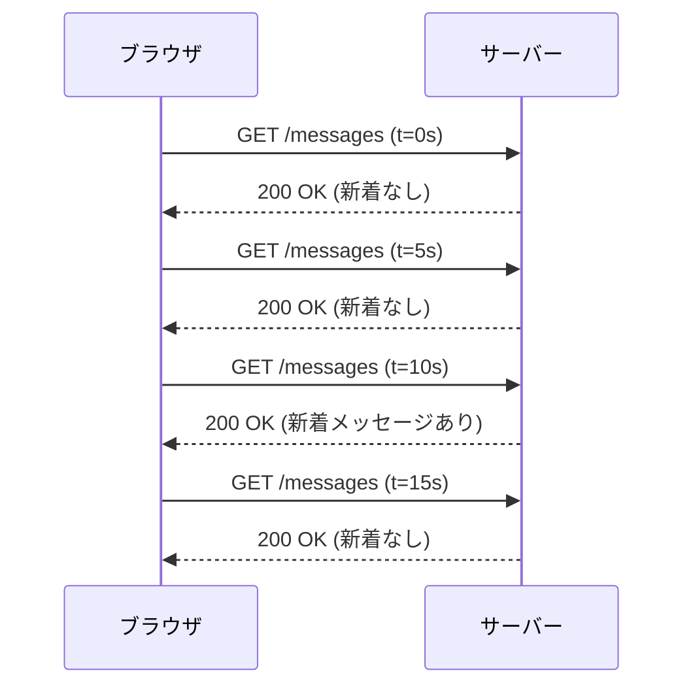

この方式はシンプルで実装が容易だが、以下の重大な問題を抱えている。

- **レイテンシ**: ポーリング間隔がそのままリアルタイム性の遅延になる。5秒間隔なら最大5秒の遅延が生じる
- **無駄なリクエスト**: 新着データがない場合でも全リクエストが発生し、サーバー・ネットワークのリソースを消費する
- **スケーラビリティの欠如**: 1000人のユーザーが5秒間隔でポーリングすると、毎秒200リクエストがサーバーに届く。大規模になるにつれ指数的に悪化する

### 1.3 Long Polling：接続を保留するアプローチ

ポーリングの改良版として、Long Polling（ロングポーリング）が考案された。クライアントがリクエストを送ると、サーバーはデータが利用可能になるまで接続を維持し続け、データが届いたときのみレスポンスを返す。

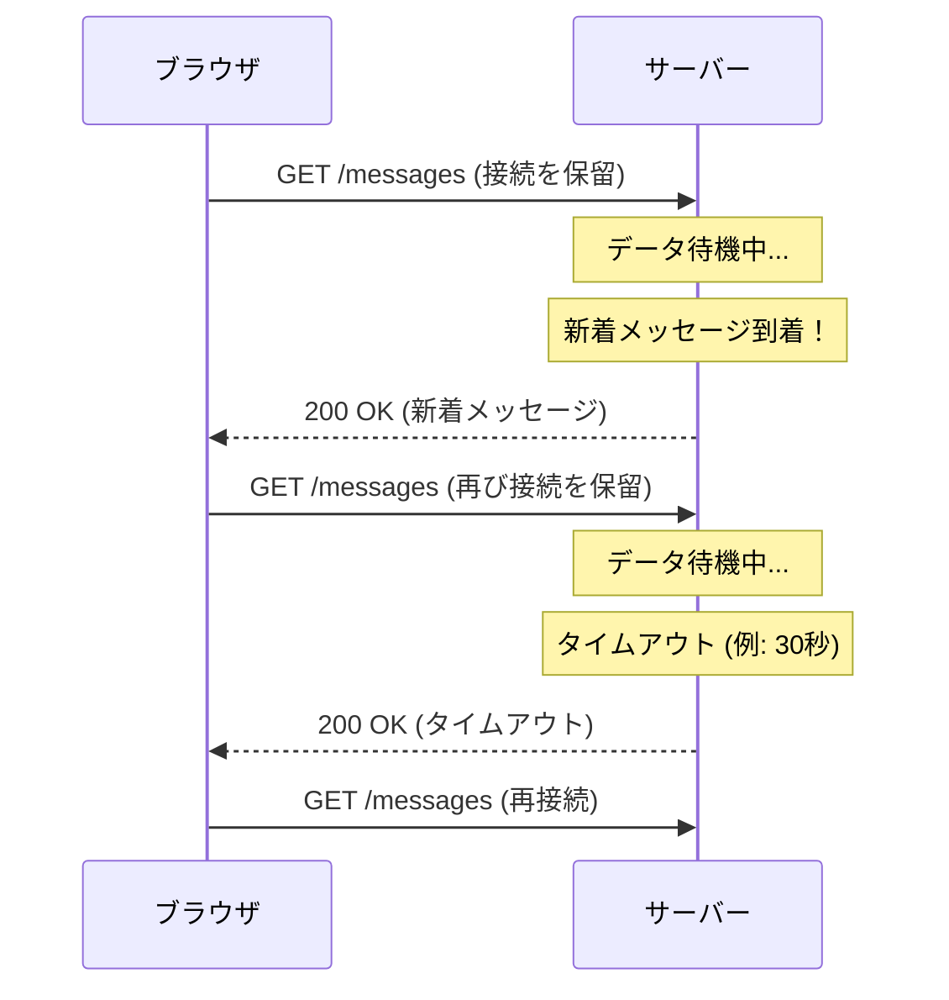

Long Pollingはポーリングに比べてレイテンシを劇的に改善したが、本質的な問題は残っていた。

- **接続のオーバーヘッド**: データのたびにHTTP接続の確立・終了が発生する（HTTP/1.1のKeep-Aliveで緩和されるが完全ではない）
- **サーバーリソース**: タイムアウトまで接続を維持するため、スレッドやファイルディスクリプタが占有される
- **複雑な状態管理**: 複数のロングポーリング要求が同時に存在する場合の順序保証が困難

### 1.4 Comet：XMLHttpRequestの限界を突いた技法

2006年頃、Alex Russellは「Comet」という言葉で、Long Pollingを含む各種のサーバープッシュ手法を総称した。Cometは技術標準ではなくデザインパターンの総称であり、`iframe` を使ったストリーミングや、HTMLファイルを少しずつ返し続ける「Multipart Response」なども含んでいた。

GMail、Google Docs、MeeboなどのサービスがCometを活用し、当時としては驚異的なリアルタイム体験を提供した。しかし、これらはすべてHTTPの制約の中でハックを駆使した苦肉の策だった。

### 1.5 Server-Sent Events：一方向ストリームの標準化

Server-Sent Events（SSE）は、この問題に対するW3Cの公式な解答の一つだ。HTTPの通常のレスポンスストリームを維持し続け、サーバーがいつでもデータを送信できる一方向チャネルを提供する。

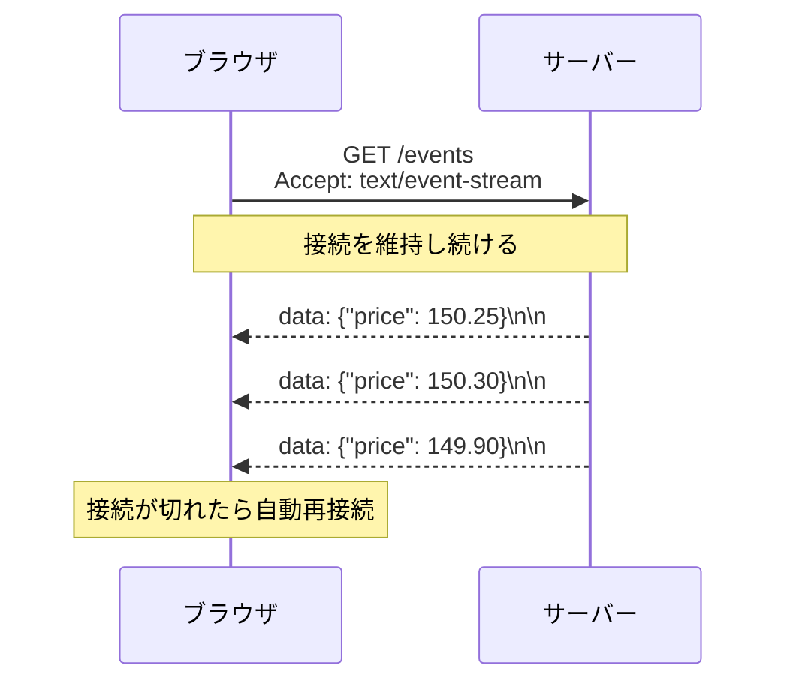

SSEはHTTPの上に構築されているため、既存のインフラと高い親和性を持ち、自動再接続機能も標準で備えている。しかし、**クライアントからサーバーへのデータ送信は別のHTTPリクエストが必要**という根本的な制約は変わらない。

### 1.6 WebSocketが解決しようとした問題

2008年、Ian HicksonはWebSocketの初期仕様を提案した。それは「単一の永続的なTCP接続上で、クライアントとサーバーの双方向通信を実現する」という、シンプルかつ強力なアイデアだった。

既存のHTTPインフラ（プロキシ、ファイアウォール、ロードバランサ）と互換性を保ちながら、HTTP接続をWebSocketにアップグレードする仕組みを設計することで、従来の問題を一挙に解決しようとした。

WebSocketはRFC 6455として2011年に標準化され、現在ではすべての主要ブラウザで対応している。

---

## 2. WebSocketプロトコルの仕組み

### 2.1 HTTPアップグレードメカニズム

WebSocket接続は、通常のHTTPリクエストから始まる。これがWebSocketの重要な設計判断の一つだ。既存のHTTPポート（80、443）を使い、既存のインフラをそのまま活用できる。

クライアントは特別なHTTPリクエストを送信し、接続をWebSocketにアップグレードするよう要求する。

**クライアントからのアップグレードリクエスト:**

```http
GET /chat HTTP/1.1
Host: server.example.com
Upgrade: websocket
Connection: Upgrade
Sec-WebSocket-Key: dGhlIHNhbXBsZSBub25jZQ==
Sec-WebSocket-Version: 13
Sec-WebSocket-Protocol: chat, superchat
Sec-WebSocket-Extensions: permessage-deflate; client_max_window_bits
Origin: http://example.com
```

**サーバーからのレスポンス（101 Switching Protocols）:**

```http
HTTP/1.1 101 Switching Protocols
Upgrade: websocket
Connection: Upgrade
Sec-WebSocket-Accept: s3pPLMBiTxaQ9kYGzzhZRbK+xOo=
Sec-WebSocket-Protocol: chat
```

この101レスポンスを受け取った時点で、HTTPの役割は終わる。以降、同じTCP接続上でWebSocketプロトコルが動作する。

### 2.2 ハンドシェイクの詳細

WebSocketハンドシェイクで最も重要なのが `Sec-WebSocket-Key` と `Sec-WebSocket-Accept` のやり取りだ。これは認証ではなく、**プロキシキャッシュの誤用を防ぐためのメカニズム**である。

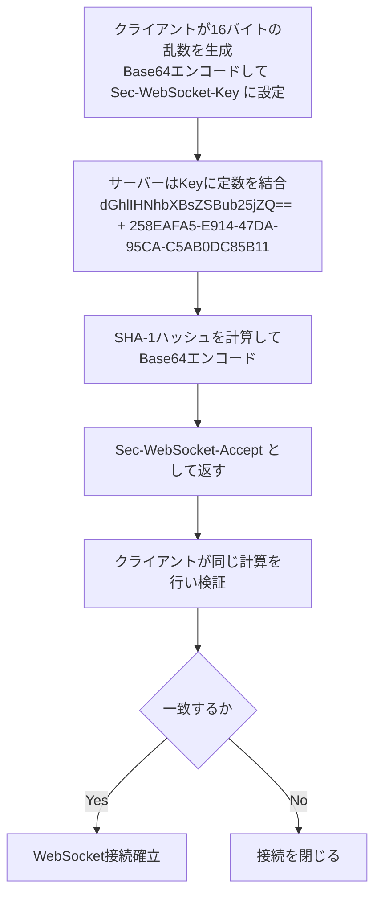

この定数（`258EAFA5-E914-47DA-95CA-C5AB0DC85B11`）はRFC 6455で規定されたマジックナンバーだ。サーバーがWebSocketを理解していれば必ずこの計算を行うので、クライアントはレスポンスの正当性を検証できる。

**完全なハンドシェイクフロー:**

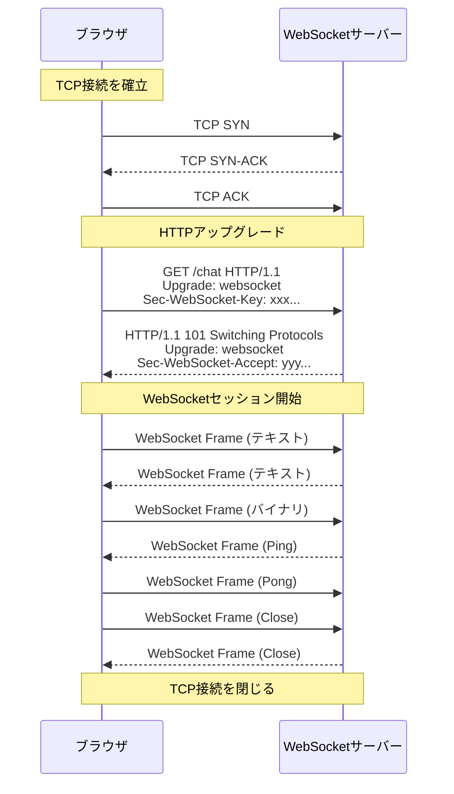

### 2.3 WebSocket URLスキーム

WebSocketは専用のURLスキームを使用する。

| スキーム | ポート | 説明 |
|---------|--------|------|
| `ws://` | 80 | 暗号化なしのWebSocket（HTTPに相当） |
| `wss://` | 443 | TLS暗号化ありのWebSocket（HTTPSに相当） |

`wss://` ではTLSハンドシェイクがHTTPアップグレードの前に発生する。本番環境では必ず `wss://` を使用すべきだ。

---

## 3. フレーム構造

### 3.1 WebSocketフレームのフォーマット

WebSocketプロトコルの核心はフレーム（Frame）形式にある。HTTP/1.1のメッセージと異なり、WebSocketフレームは非常にコンパクトな設計だ。

```
 0                   1                   2                   3
 0 1 2 3 4 5 6 7 8 9 0 1 2 3 4 5 6 7 8 9 0 1 2 3 4 5 6 7 8 9 0 1
+-+-+-+-+-------+-+-------------+-------------------------------+
|F|R|R|R| opcode|M| Payload len |    Extended payload length    |
|I|S|S|S|  (4)  |A|     (7)     |             (16/64)           |
|N|V|V|V|       |S|             |   (if payload len==126/127)   |
| |1|2|3|       |K|             |                               |
+-+-+-+-+-------+-+-------------+ - - - - - - - - - - - - - - - +
|     Extended payload length continued, if payload len == 127  |
+ - - - - - - - - - - - - - - -+-------------------------------+
|                               |Masking-key, if MASK set to 1  |
+-------------------------------+-------------------------------+
| Masking-key (continued)       |          Payload Data         |
+-------------------------------- - - - - - - - - - - - - - - - +
:                     Payload Data continued ...                :
+ - - - - - - - - - - - - - - - - - - - - - - - - - - - - - - +
|                     Payload Data continued ...                |
+---------------------------------------------------------------+
```

各フィールドの意味を分解して理解しよう。

### 3.2 各フィールドの詳細

**FIN ビット（1ビット）**

メッセージの最終フレームであることを示す。WebSocketはメッセージを複数のフレームに分割して送信できるため（フラグメンテーション）、このビットでメッセージの終端を判断する。

**RSV1, RSV2, RSV3（各1ビット）**

拡張用に予約されたビット。標準では全て0でなければならないが、拡張機能（例: `permessage-deflate` 圧縮）がこれらを利用する。

**Opcode（4ビット）**

フレームの種類を示す最重要フィールドだ。

| Opcode | 値 | 説明 |
|--------|-----|------|
| Continuation | 0x0 | フラグメント化されたメッセージの続き |
| Text | 0x1 | UTF-8テキストデータ |
| Binary | 0x2 | バイナリデータ |
| (Reserved) | 0x3-0x7 | 将来の使用のために予約 |
| Close | 0x8 | 接続クローズ要求 |
| Ping | 0x9 | 疎通確認 |
| Pong | 0xA | Pingへの応答 |
| (Reserved) | 0xB-0xF | 将来の使用のために予約 |

**MASK ビット（1ビット）とマスキング**

WebSocketのマスキングは、クライアントからサーバーへ送信するすべてのフレームに必須だ。マスキングキー（4バイトの乱数）を生成し、ペイロードの各バイトとXORする。

マスキングの目的は認証や暗号化ではなく、**プロキシキャッシュポイズニング攻撃を防ぐ**ためだ。悪意あるWebページがWebSocketに見えるHTTPレスポンスを生成できた場合、プロキシがそれをキャッシュしてしまうリスクがある。マスキングによりペイロードを毎回異なるビットパターンにすることで、このリスクを軽減する。

```
// Masking algorithm (XOR with 4-byte key)
for (i = 0; i < payload_length; i++) {
    masked_payload[i] = payload[i] XOR masking_key[i % 4];
}
```

**Payload Length（7ビット + 拡張）**

WebSocketは可変長のペイロード長エンコーディングを採用している。

- `0-125`: そのままペイロード長
- `126`: 次の2バイト（16ビット）を符号なし整数として読む（最大65535バイト）
- `127`: 次の8バイト（64ビット）を符号なし整数として読む（最大 2^63 バイト）

この設計により、小さいフレームのオーバーヘッドを最小限に抑えつつ、非常に大きなメッセージも送信できる。

### 3.3 データフレームと制御フレーム

WebSocketのフレームは大きく2種類に分類される。

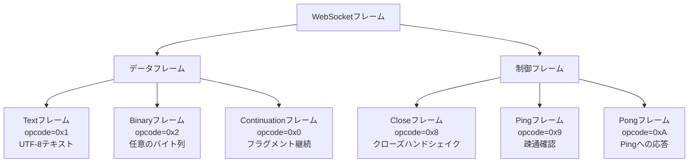

制御フレームの特性として、125バイト以下のペイロードに制限され、フラグメント化できないという制約がある。また、制御フレームはデータフレームのフラグメント列の途中に割り込んで送信できる（インターリーブ）。これにより、大きなデータ転送中でも接続の疎通確認（Ping/Pong）が遅延なく処理できる。

### 3.4 接続クローズのハンドシェイク

WebSocket接続を正常に閉じるには、クローズハンドシェイクが必要だ。

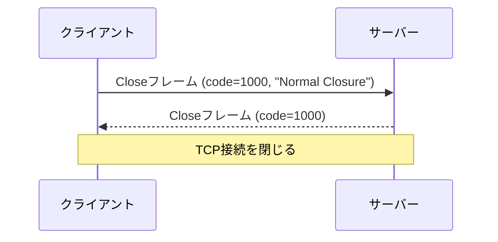

Closeフレームにはオプションでステータスコードと理由文字列を含めることができる。

| コード | 意味 |
|--------|------|
| 1000 | 正常クローズ |
| 1001 | サーバーが停止、またはブラウザがページを離れた |
| 1002 | プロトコルエラー |
| 1003 | 受信できないデータ型（例: テキストのみ対応のサーバーにバイナリが届いた） |
| 1006 | 異常クローズ（Closeフレームなしに切断） |
| 1007 | テキストフレームがUTF-8として不正 |
| 1008 | ポリシー違反 |
| 1009 | メッセージが大きすぎる |
| 1011 | サーバー内部エラー |

---

## 4. WebSocketの実装パターン

### 4.1 ブラウザのWebSocket API

ブラウザが提供するWebSocket APIは、シンプルで使いやすい設計だ。

```javascript
// Establish WebSocket connection
const ws = new WebSocket('wss://example.com/chat');

// Connection opened handler
ws.addEventListener('open', (event) => {
    console.log('Connected to server');
    ws.send(JSON.stringify({ type: 'join', room: 'general' }));
});

// Message received handler
ws.addEventListener('message', (event) => {
    const data = JSON.parse(event.data);
    console.log('Received:', data);
});

// Error handler
ws.addEventListener('error', (event) => {
    console.error('WebSocket error:', event);
});

// Connection closed handler
ws.addEventListener('close', (event) => {
    console.log(`Closed: code=${event.code}, reason=${event.reason}`);
});

// Send text message
ws.send('Hello, World!');

// Send binary data
const buffer = new ArrayBuffer(4);
const view = new DataView(buffer);
view.setUint32(0, 42);
ws.send(buffer);

// Close connection
ws.close(1000, 'Normal closure');
```

`readyState` プロパティで接続状態を確認できる。

| 値 | 定数 | 意味 |
|----|------|------|
| 0 | `WebSocket.CONNECTING` | 接続中 |
| 1 | `WebSocket.OPEN` | 接続済み |
| 2 | `WebSocket.CLOSING` | クローズ中 |
| 3 | `WebSocket.CLOSED` | 閉じている |

### 4.2 リアルタイムチャットの実装

チャットアプリケーションはWebSocketの最も典型的なユースケースだ。

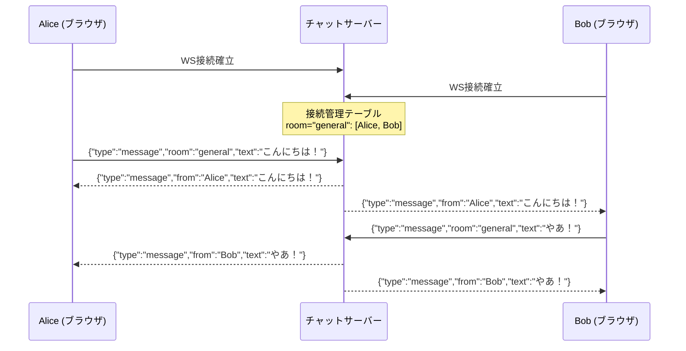

サーバー側の実装例（Node.js + ws ライブラリ）:

```javascript
const WebSocket = require('ws');
const wss = new WebSocket.Server({ port: 8080 });

// Store connected clients by room
const rooms = new Map();

wss.on('connection', (ws) => {
    let currentRoom = null;

    ws.on('message', (rawData) => {
        const message = JSON.parse(rawData);

        if (message.type === 'join') {
            // Join a room
            currentRoom = message.room;
            if (!rooms.has(currentRoom)) {
                rooms.set(currentRoom, new Set());
            }
            rooms.get(currentRoom).add(ws);
        }

        if (message.type === 'message' && currentRoom) {
            // Broadcast to all clients in the room
            const broadcast = JSON.stringify({
                type: 'message',
                from: message.from,
                text: message.text,
                timestamp: Date.now(),
            });

            rooms.get(currentRoom).forEach((client) => {
                if (client.readyState === WebSocket.OPEN) {
                    client.send(broadcast);
                }
            });
        }
    });

    ws.on('close', () => {
        // Remove from room on disconnect
        if (currentRoom && rooms.has(currentRoom)) {
            rooms.get(currentRoom).delete(ws);
        }
    });
});
```

### 4.3 リアルタイム通知システム

ダッシュボードへの通知配信など、サーバーからクライアントへの一方向的なプッシュも重要なユースケースだ。

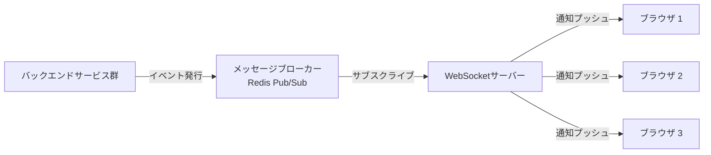

この設計では、WebSocketサーバーがRedis等のPub/Subにサブスクライブしてイベントを受け取り、該当するWebSocket接続にプッシュする。バックエンドの各サービスはWebSocketの存在を意識することなく、メッセージブローカーにイベントを発行するだけでよい。

### 4.4 協調編集（Collaborative Editing）

Google DocsのようなリアルタイムコラボレーションはWebSocketの高度なユースケースだ。複数ユーザーが同時に同一ドキュメントを編集する際、以下の課題が生じる。

- **競合の解決**: 2人が同時に同じ場所を編集したらどうするか
- **操作の変換**: Operational Transformation（OT）やConflict-free Replicated Data Type（CRDT）
- **カーソル位置の共有**: 他のユーザーがどこにいるかをリアルタイム表示

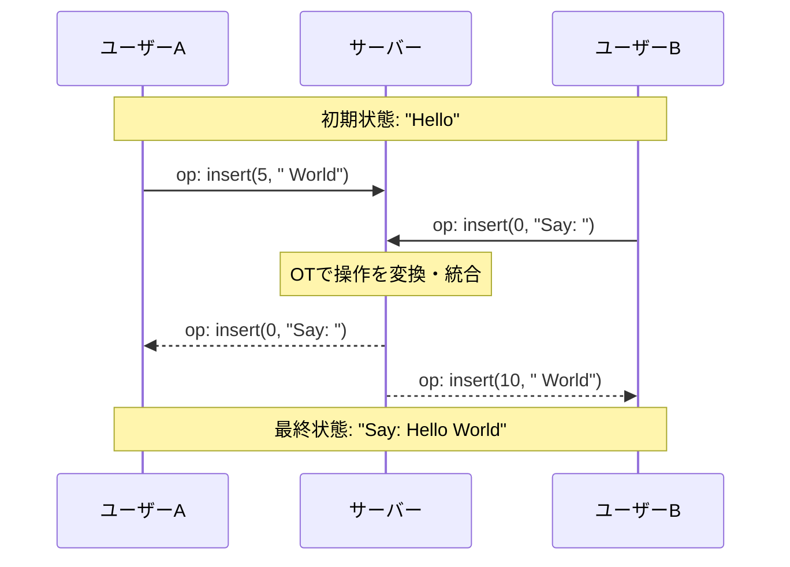

---

## 5. スケーリングの課題

### 5.1 ステートフル接続の問題

HTTPのステートレス性は、スケーリングを容易にする。リクエストをどのサーバーにルーティングしても構わないからだ。しかしWebSocketは**ステートフル**であり、接続が確立された後はその接続が維持されている特定のサーバーにのみ通信が届く。

これが「スティッキーセッション問題」を引き起こす。ロードバランサが適切に設定されていないと、一度確立したWebSocket接続と同じサーバーにリクエストがルーティングされず、接続が切れてしまう。

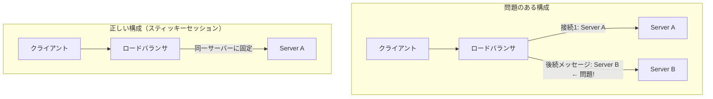

### 5.2 ロードバランシング戦略

WebSocketのロードバランシングには以下のアプローチがある。

**スティッキーセッション（セッションアフィニティ）**

クライアントのIPアドレスやCookieを元に、同一クライアントからのリクエストを常に同一サーバーにルーティングする。NginxやHAProxyで設定できる。

```nginx
upstream websocket_servers {
    # Use IP hash for sticky sessions
    ip_hash;
    server ws1.example.com:8080;
    server ws2.example.com:8080;
    server ws3.example.com:8080;
}

server {
    location /ws {
        proxy_pass http://websocket_servers;
        # Required headers for WebSocket proxying
        proxy_http_version 1.1;
        proxy_set_header Upgrade $http_upgrade;
        proxy_set_header Connection "upgrade";
        proxy_set_header Host $host;
        # Disable timeout for long-lived connections
        proxy_read_timeout 3600s;
        proxy_send_timeout 3600s;
    }
}
```

**スケールアウトとメッセージブローカー**

スティッキーセッションだけでは、特定のサーバーで障害が発生した際の問題や、水平スケールアウト時の複雑性が残る。より堅牢な設計では、サーバー間の通信にメッセージブローカーを活用する。

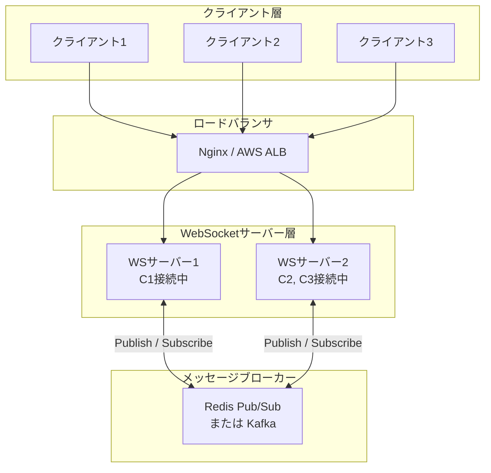

この設計の動作フローを説明しよう。

1. クライアント1（WS1に接続）がメッセージを送信する
2. WS1はメッセージをRedisのチャンネルにPublishする
3. WS1とWS2の両方がそのチャンネルをSubscribeしているため、両方がメッセージを受け取る
4. WS2は自分に接続しているクライアント2とクライアント3にメッセージを転送する

**Socket.IOのアダプター**という概念もこの設計に基づいている。Socket.IOは `socket.io-redis` アダプターを使うことで、複数サーバー間でブロードキャストを透過的に実現できる。

### 5.3 接続数の限界とC10K問題

WebSocketサーバーは長期間にわたり接続を維持するため、大量の同時接続を捌く能力が求められる。伝統的なスレッドベースのサーバー（Apache MPMのようなモデル）では、1接続=1スレッドという設計のため、メモリ消費がボトルネックになる。

現代のWebSocketサーバーはイベントループベースの非同期I/Oを採用する。Node.js、nginx、Go の goroutine、Python の asyncio などがその代表だ。これらはシングルスレッドまたは限られたスレッド数で数万〜数十万の同時接続を処理できる。

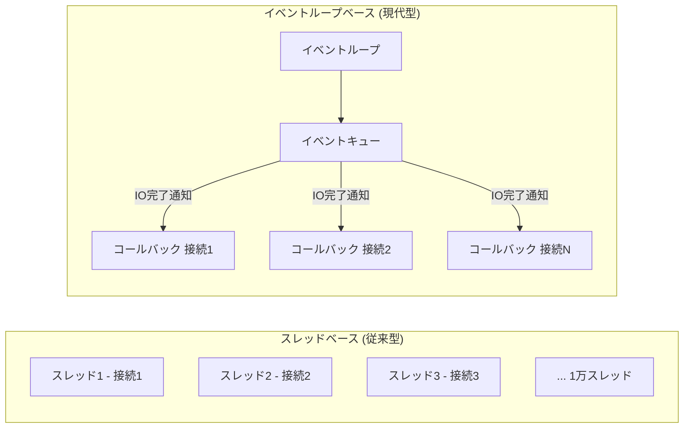

OS側でも、ファイルディスクリプタの上限 (`ulimit -n`) を適切に設定しておく必要がある。デフォルトでは1024程度に制限されていることが多い。

### 5.4 ハートビートと再接続戦略

長時間維持されるWebSocket接続は、中間のネットワーク機器（NAT、ファイアウォール、プロキシ）によってアイドルタイムアウトで強制切断されることがある。これを防ぐため、アプリケーション層でのハートビート実装が重要だ。

```javascript
class ResilientWebSocket {
    constructor(url) {
        this.url = url;
        this.ws = null;
        this.reconnectDelay = 1000; // Start with 1 second
        this.maxReconnectDelay = 30000; // Max 30 seconds
        this.pingInterval = null;
    }

    connect() {
        this.ws = new WebSocket(this.url);

        this.ws.addEventListener('open', () => {
            console.log('Connected');
            this.reconnectDelay = 1000; // Reset on successful connection
            this.startPing();
        });

        this.ws.addEventListener('close', () => {
            this.stopPing();
            this.scheduleReconnect();
        });

        this.ws.addEventListener('message', (event) => {
            if (event.data === 'pong') return; // Ignore pong responses
            this.handleMessage(JSON.parse(event.data));
        });
    }

    startPing() {
        // Send ping every 30 seconds to keep connection alive
        this.pingInterval = setInterval(() => {
            if (this.ws.readyState === WebSocket.OPEN) {
                this.ws.send('ping');
            }
        }, 30000);
    }

    stopPing() {
        if (this.pingInterval) {
            clearInterval(this.pingInterval);
            this.pingInterval = null;
        }
    }

    scheduleReconnect() {
        // Exponential backoff with jitter
        const jitter = Math.random() * 1000;
        setTimeout(() => this.connect(), this.reconnectDelay + jitter);
        this.reconnectDelay = Math.min(
            this.reconnectDelay * 2,
            this.maxReconnectDelay
        );
    }
}
```

指数バックオフ（Exponential Backoff）とジッター（Jitter）の組み合わせは、大規模障害後の「サンダリングハード問題」を防ぐ。全クライアントが同時に再接続しようとすると、サーバーが再び過負荷になるためだ。

---

## 6. セキュリティ考慮事項

### 6.1 WSS（WebSocket over TLS）の必須性

本番環境では `wss://` を使用することが不可欠だ。`ws://` は通信内容が平文で流れるため、以下のリスクがある。

- **盗聴**: 中間者がメッセージ内容を読み取れる
- **改ざん**: パケットを書き換えてデータを操作できる
- **セッションハイジャック**: 認証トークンが傍受される

`wss://` ではTLSで通信を暗号化するため、これらのリスクを排除できる。証明書の設定はHTTPSと共通であり、Let's Encryptで無料取得できる。

### 6.2 Origin検証

WebSocketハンドシェイクには `Origin` ヘッダーが含まれ、ブラウザはこれを偽装できない。サーバーはこのヘッダーを検証することで、意図しないオリジンからの接続を拒否できる。

```javascript
const WebSocket = require('ws');

const wss = new WebSocket.Server({
    port: 8080,
    verifyClient: (info, callback) => {
        const origin = info.origin;
        const allowedOrigins = [
            'https://example.com',
            'https://app.example.com',
        ];

        if (allowedOrigins.includes(origin)) {
            callback(true); // Allow connection
        } else {
            // Reject connection with 403 Forbidden
            callback(false, 403, 'Forbidden');
        }
    },
});
```

::: warning
ただし、Origin検証だけでは不十分だ。非ブラウザクライアント（curlやカスタムスクリプト）はOriginヘッダーを任意の値に設定できる。Origin検証はCSRF対策として有効だが、完全な認証の代替にはならない。
:::

### 6.3 認証と認可

WebSocket接続自体はCookieを自動的に送信するが、認証の実装には注意が必要だ。

**ハンドシェイク時のトークン検証（推奨）**

```javascript
// Client: Send token in query parameter or subprotocol during handshake
const token = localStorage.getItem('authToken');
const ws = new WebSocket(`wss://example.com/ws?token=${token}`);

// Server: Validate token during handshake
const wss = new WebSocket.Server({
    port: 8080,
    verifyClient: async (info, callback) => {
        const url = new URL(info.req.url, 'wss://example.com');
        const token = url.searchParams.get('token');

        try {
            const user = await verifyJWT(token);
            info.req.user = user; // Attach user to request for later use
            callback(true);
        } catch (err) {
            callback(false, 401, 'Unauthorized');
        }
    },
});
```

::: tip
クエリパラメータにトークンを含める方法はURLがアクセスログに残るリスクがある。より安全な方法として、接続確立直後にアプリケーション層で認証メッセージを送信する「接続後認証」パターンもある。
:::

```javascript
// Server: Authenticate after connection
wss.on('connection', (ws) => {
    let isAuthenticated = false;

    // Give client 5 seconds to authenticate
    const authTimeout = setTimeout(() => {
        if (!isAuthenticated) {
            ws.close(1008, 'Authentication timeout');
        }
    }, 5000);

    ws.on('message', async (data) => {
        const message = JSON.parse(data);

        if (!isAuthenticated) {
            if (message.type === 'auth') {
                try {
                    const user = await verifyJWT(message.token);
                    isAuthenticated = true;
                    clearTimeout(authTimeout);
                    ws.user = user;
                    ws.send(JSON.stringify({ type: 'auth_success' }));
                } catch {
                    ws.close(1008, 'Unauthorized');
                }
            }
            return; // Ignore other messages until authenticated
        }

        // Handle authenticated messages
        handleMessage(ws, message);
    });
});
```

### 6.4 入力検証とレート制限

WebSocketはHTTPと同様に、悪意あるデータが送り込まれるリスクがある。

- **メッセージサイズ制限**: 巨大なメッセージによるメモリ枯渇を防ぐ
- **レート制限**: 短時間に大量のメッセージを送信するDDoS攻撃を防ぐ
- **入力サニタイズ**: クロスサイトスクリプティング（XSS）などの攻撃を防ぐ

```javascript
const MESSAGE_MAX_SIZE = 64 * 1024; // 64KB limit
const RATE_LIMIT_WINDOW = 1000; // 1 second
const RATE_LIMIT_MAX = 10; // Max 10 messages per second

wss.on('connection', (ws) => {
    let messageCount = 0;

    setInterval(() => { messageCount = 0; }, RATE_LIMIT_WINDOW);

    ws.on('message', (data) => {
        // Check message size
        if (data.length > MESSAGE_MAX_SIZE) {
            ws.close(1009, 'Message too large');
            return;
        }

        // Check rate limit
        if (++messageCount > RATE_LIMIT_MAX) {
            ws.close(1008, 'Rate limit exceeded');
            return;
        }

        // Process message...
    });
});
```

### 6.5 CSRF攻撃とWebSocket

WebSocketはCSRFの影響を受けやすいように見えるが、ブラウザはWebSocketのハンドシェイク時に `Origin` ヘッダーを必ず付与し、これを偽装できない。サーバーがOriginを適切に検証すれば、CSRF攻撃を防げる。

ただし、`ws://`（暗号化なし）のWebSocketでは、ネットワーク上の攻撃者がより多くの攻撃手法を持つ。これもWSS必須の理由の一つだ。

---

## 7. 代替技術との比較

### 7.1 各技術の特性マトリクス

| 技術 | 通信方向 | レイテンシ | インフラ親和性 | 実装の複雑性 | 適したユースケース |
|------|---------|-----------|--------------|------------|-----------------|
| HTTP Polling | クライアント→サーバー | 高い | 高い | 低い | 更新頻度が低いデータ |
| Long Polling | 双方向 | 中程度 | 高い | 中程度 | 更新頻度が中程度 |
| Server-Sent Events | サーバー→クライアント | 低い | 高い | 低い | サーバープッシュのみ |
| WebSocket | 双方向 | 低い | 中程度 | 中程度 | リアルタイム双方向通信 |
| gRPC Streaming | 双方向 | 非常に低い | 低い | 高い | マイクロサービス間通信 |

### 7.2 Server-Sent Events（SSE）との詳細比較

SSEはWebSocketのシンプルな代替として、サーバープッシュのシナリオで有効だ。

**SSEの優位点:**
- HTTPの上に構築されているため、既存のHTTPインフラ（プロキシ、CDN、ロードバランサ）がそのまま使える
- 自動再接続機能が仕様に含まれている（`retry:` ディレクティブ）
- HTTP/2のマルチプレキシングと相性が良く、多数のSSE接続を効率的に処理できる
- イベントIDによる再送（`id:` ディレクティブ）をサポートする

**WebSocketの優位点:**
- 双方向通信が単一接続で実現できる
- バイナリデータをネイティブにサポートする
- レイテンシがより低い（SSEはテキストのみ、HTTPオーバーヘッドがある）

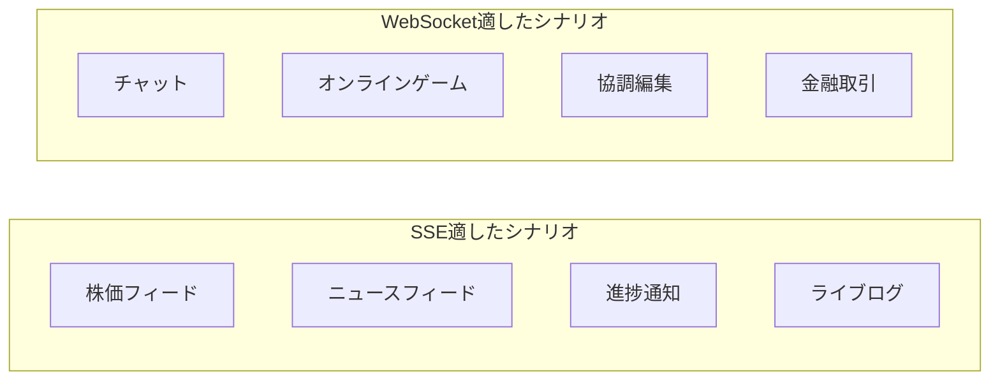

### 7.3 gRPC Streamingとの比較

gRPCはHTTP/2上に構築されたRPCフレームワークで、双方向ストリーミングをサポートする。

**gRPC Streamingが適したケース:**
- マイクロサービス間の通信（ブラウザからの利用は `grpc-web` が必要）
- Protocol Buffersによる強い型付けが必要な場合
- 非常に高スループットのストリーミング（gRPCはHTTP/2のフレーム効率が高い）

**WebSocketが適したケース:**
- ブラウザクライアントとの直接通信
- シンプルなプロトコルが望ましい場合
- テキストベースのメッセージ（JSON）が主体

### 7.4 HTTP/2 Server Push との関係

HTTP/2 Server Pushは、クライアントがリクエストする前にサーバーがリソースをプッシュできる機能だ。しかしこれはWebページのアセット配信最適化を目的としており、リアルタイムデータ配信にはWebSocketやSSEが適している。実際、HTTP/2 Server Pushはブラウザベンダーによって削除の方向で進んでおり、実用的な選択肢ではなくなっている。

### 7.5 WebTransportの登場

HTTP/3（QUIC）の上に構築された **WebTransport** は、WebSocketの後継候補として注目されている。

- **UDP/QUICベース**: TCPのHOL（Head-of-Line）ブロッキング問題を解決
- **双方向ストリーミング**: 複数の独立したストリームを単一接続で管理
- **データグラム**: 信頼性より低レイテンシを優先できるモード

現時点（2026年）ではまだ普及途上だが、特にゲームやビデオ会議などのユースケースで有望だ。

---

## 8. 将来の展望

### 8.1 HTTP/3とQUIC上のWebSocket

RFC 9220「Bootstrapping WebSockets with HTTP/3」として標準化されており、HTTP/3接続上でWebSocketセッションを確立できる。HTTP/3が使用するQUICプロトコルにより、以下のメリットが期待される。

- **接続確立の高速化**: 0-RTT接続再開によるレイテンシ削減
- **HOLブロッキングの解消**: QUICの独立したストリームにより、パケットロスの影響が限定される
- **モバイル環境での安定性**: IPアドレスが変わっても（モバイルネットワーク切り替え時）接続を維持できるコネクションマイグレーション

### 8.2 WebTransportへの移行

WebSocketは依然として多用途で使いやすいプロトコルだが、特定のユースケースではWebTransportが優位性を持つ。

- **低レイテンシゲーム**: 信頼性よりレイテンシを優先するデータグラムモード
- **動画ストリーミング**: 複数の独立したストリームによる効率的な多重化
- **大規模ファイル転送**: QUICの輻輳制御の改善

業界の方向性としては、新規の高性能ユースケースではWebTransportが採用される一方、WebSocketは互換性と使いやすさから長らく標準として使われ続けると予測される。

### 8.3 エッジコンピューティングとの統合

Cloudflare Durable Objects、AWS Lambda@Edge、Fastly Compute@Edgeなど、エッジでのコンピューティングが進化している。WebSocketをエッジで終端させることで、以下のメリットがある。

- **レイテンシ削減**: ユーザーに地理的に近いエッジサーバーで接続を処理
- **DDoS軽減**: エッジレベルでの不正接続の遮断
- **グローバルスケーリング**: 地理分散した接続管理

Cloudflare Durable Objectsは、WebSocket接続に関連するステートをエッジに保持できる特有のアーキテクチャで注目されている。単一のDurable Objectがルームやセッションを管理し、そこへの接続は世界中のどのエッジからでもルーティングされる。

### 8.4 AIとリアルタイム通信

大規模言語モデル（LLM）のストリーミング応答はWebSocketやSSEと相性が良い。ChatGPTのようなサービスでは、トークンが生成されるたびにリアルタイムでクライアントに送信されており、SSEが多用されている。より高度なインタラクティブシナリオ（音声・ビデオの統合）ではWebSocketが選ばれる。

今後のAIエージェントシステムでは、エージェント間のリアルタイム通信インフラとしてWebSocketが重要な役割を担う可能性がある。

---

## まとめ

WebSocketは、HTTPのポーリングによる限界を根本から解決するために設計されたプロトコルだ。HTTPアップグレードによりファイアウォールやプロキシと高い互換性を保ちながら、全二重の双方向通信を単一のTCP接続上で実現する。

フレーム構造の設計——可変長のペイロード長、マスキング、フラグメンテーション——はシンプルでありながら、様々なユースケースに対応する柔軟性を持つ。チャット、リアルタイム通知、協調編集、オンラインゲームなど、今日のWebの多くのリアルタイム機能を下支えしている。

スケーリングの観点では、ステートフルな接続という特性がHTTPとは異なる設計上の考慮を求める。スティッキーセッション、Redis Pub/Subによるサーバー間通信、イベントループベースのサーバーアーキテクチャが実用的な解答だ。

将来的にはWebTransportやHTTP/3上のWebSocketがより高いパフォーマンスを提供するが、WebSocketは使いやすさと広範なエコシステムサポートにより、リアルタイムWebの基盤として長く使われ続けるだろう。

---

## 参考文献

- [RFC 6455 — The WebSocket Protocol](https://www.rfc-editor.org/rfc/rfc6455)
- [RFC 8441 — Bootstrapping WebSockets with HTTP/2](https://www.rfc-editor.org/rfc/rfc8441)
- [RFC 9220 — Bootstrapping WebSockets with HTTP/3](https://www.rfc-editor.org/rfc/rfc9220)
- [W3C WebSocket API](https://websockets.spec.whatwg.org/)
- [MDN Web Docs — WebSocket](https://developer.mozilla.org/en-US/docs/Web/API/WebSocket)
- [WebTransport Explainer](https://github.com/w3c/webtransport/blob/main/explainer.md)
