# WireGuard VPN の仕組みと設計

## 1. VPN の歴史と種類

### VPN とは何か

VPN（Virtual Private Network）とは、パブリックなネットワーク上にプライベートな通信経路を仮想的に構築する技術である。インターネットのように信頼できないネットワークを経由しながらも、あたかも専用線で接続されているかのような安全な通信を実現する。

VPN の基本的な仕組みは、送信側でパケットを暗号化してカプセル化（トンネリング）し、受信側でそれを復号・展開するというものである。これにより、盗聴・改ざん・なりすましといった脅威からデータを保護する。

### VPN の歴史的な発展

VPN 技術は 1990 年代後半から発展してきた。企業の拠点間接続やリモートアクセスの需要が、その進化の原動力となっている。

```
1996年  PPTP (Point-to-Point Tunneling Protocol)
         - Microsoft が開発、Windows に標準搭載
         - セキュリティ上の脆弱性が多数発見される

1998年  IPsec (Internet Protocol Security)
         - IETF 標準化、RFC 2401 など
         - 強力なセキュリティだが複雑な仕様

1999年  L2TP (Layer 2 Tunneling Protocol)
         - L2F と PPTP を統合
         - 通常 IPsec と組み合わせて使用

2001年  OpenVPN 初期リリース
         - SSL/TLS ベースのユーザー空間実装
         - 柔軟な設定、クロスプラットフォーム対応

2012年  WireGuard 開発開始
         - Jason A. Donenfeld が設計・実装
         - シンプルさと高性能を追求

2020年  WireGuard が Linux カーネル 5.6 に統合
         - Linus Torvalds が "a work of art" と評価
```

### 主要な VPN プロトコルの分類

VPN プロトコルは、動作するレイヤーや設計思想によって大きく分類できる。

**レイヤー 2 VPN（データリンク層）**

L2TP や PPTP はレイヤー 2 で動作し、イーサネットフレームをトンネリングする。ブロードキャストの転送が可能であり、拠点間で同一サブネットを共有できるという利点があるが、オーバーヘッドが大きくなりがちである。

**レイヤー 3 VPN（ネットワーク層）**

IPsec や WireGuard はレイヤー 3 で動作し、IP パケットをトンネリングする。効率的なルーティングが可能で、スケーラビリティにも優れる。

**レイヤー 4 以上（トランスポート層〜アプリケーション層）**

OpenVPN は SSL/TLS（レイヤー 4〜5）をベースとしており、TCP または UDP 上で動作する。ファイアウォール越えが容易という利点がある一方、ユーザー空間で動作するためオーバーヘッドが大きい。

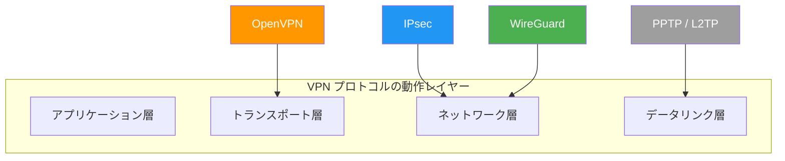

## 2. WireGuard の設計哲学

### 徹底的なシンプルさ

WireGuard の設計は、既存の VPN ソリューションが抱える複雑さへの強い問題意識から生まれた。Jason A. Donenfeld は、IPsec の仕様が膨大で理解・実装・監査が困難であること、OpenVPN がユーザー空間で動作するためパフォーマンスに限界があることを課題として挙げた。

WireGuard の Linux カーネル実装は約 4,000 行のコードで構成されている。これは IPsec の実装（数万行）や OpenVPN（約 10 万行）と比較して桁違いに少ない。コードが少ないということは、セキュリティ監査が容易であり、バグの混入リスクも低いということを意味する。

### 暗号スイートの固定

WireGuard は暗号アルゴリズムの「ネゴシエーション」を一切行わない。使用する暗号プリミティブは以下に固定されている。

| 用途 | アルゴリズム |
|---|---|
| 鍵交換 | Curve25519 (ECDH) |
| 対称暗号 | ChaCha20-Poly1305 (AEAD) |
| ハッシュ | BLAKE2s |
| 鍵導出 | HKDF |
| ハッシュテーブルキー | SipHash24 |
| MAC (Cookie) | XAEAD (XChaCha20-Poly1305) |

この設計判断には明確な理由がある。暗号スイートのネゴシエーションは、ダウングレード攻撃の温床となる。攻撃者が弱い暗号を使うよう誘導できてしまうのである。WireGuard ではそのような攻撃が構造的に不可能である。

もし将来的にいずれかのアルゴリズムに脆弱性が発見された場合は、プロトコルのバージョンを上げて対応する。これは SSH がバージョン 1 から 2 へ移行したのと同じアプローチである。

### インターフェースの設計

WireGuard は Linux のネットワークインターフェース（`wg0` など）として振る舞う。これは `eth0` や `wlan0` と同じレベルの抽象化であり、既存のネットワークツール（`ip`, `ifconfig`, `iptables`, `route` など）がそのまま使える。

```bash
# WireGuard interface creation and configuration
ip link add dev wg0 type wireguard
ip address add dev wg0 10.0.0.1/24
wg setconf wg0 /etc/wireguard/wg0.conf
ip link set up dev wg0
```

この設計により、WireGuard は「VPN ソフトウェア」というよりも「暗号化されたネットワークインターフェース」として機能する。ファイアウォールルール、ルーティングテーブル、ネットワーク名前空間といった既存の Linux ネットワーキングの仕組みとシームレスに統合できる。

## 3. Noise Protocol Framework

### Noise Protocol Framework とは

Noise Protocol Framework は、Trevor Perrin によって設計された暗号プロトコルのフレームワークである。TLS のような汎用プロトコルとは異なり、特定のユースケースに最適化されたハンドシェイクパターンを定義できる。

Noise は以下の暗号プリミティブを組み合わせてプロトコルを構成する。

- **DH（Diffie-Hellman）関数**: 鍵交換に使用
- **Cipher 関数**: 対称暗号に使用
- **Hash 関数**: ハッシュ計算に使用

### ハンドシェイクパターン

Noise では、ハンドシェイクのパターンを記号で表現する。WireGuard が使用するパターンは **Noise_IKpsk2** である。

- **I（Immediate）**: イニシエータが最初のメッセージで自身の静的公開鍵を送信する
- **K（Known）**: レスポンダの静的公開鍵がイニシエータにあらかじめ知られている
- **psk2**: 事前共有鍵（Pre-Shared Key）を 2 番目のメッセージで混合する

正式な表記は **Noise_IKpsk2_25519_ChaChaPoly_BLAKE2s** であり、これは使用する DH 関数（Curve25519）、暗号（ChaCha20-Poly1305）、ハッシュ（BLAKE2s）を明示している。

### Noise_IK パターンの詳細

Noise_IK パターンでは、イニシエータがレスポンダの公開鍵を事前に知っている前提で、1-RTT（1 往復）のハンドシェイクを実現する。

```
IK:
  <- s          (responder's static key is known to initiator)
  ...
  -> e, es, s, ss    (initiator sends ephemeral key, computes DH shared secrets)
  <- e, ee, se       (responder sends ephemeral key, computes DH shared secrets)
```

このパターンでは、合計 4 回の Diffie-Hellman 計算が行われる。

1. **es**: イニシエータの一時鍵 × レスポンダの静的鍵
2. **ss**: イニシエータの静的鍵 × レスポンダの静的鍵
3. **ee**: イニシエータの一時鍵 × レスポンダの一時鍵
4. **se**: イニシエータの静的鍵 × レスポンダの一時鍵

これにより、以下のセキュリティ特性が保証される。

- **相互認証**: 両者が互いの身元を確認できる
- **前方秘匿性（Forward Secrecy）**: 長期鍵が漏洩しても過去のセッションは保護される
- **鍵漏洩後の安全性（Post-Compromise Security）**: 鍵漏洩後に新しいセッションを確立すれば安全性が回復する

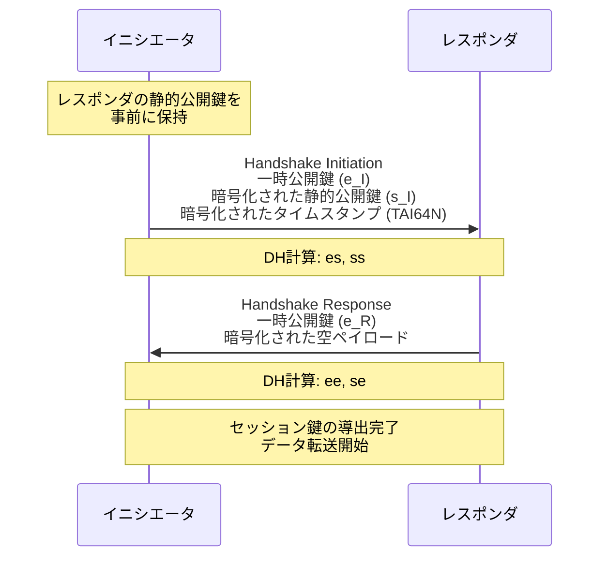

## 4. Cryptokey Routing

### 概念

Cryptokey Routing は WireGuard の中核的な設計概念であり、公開鍵と許可された IP アドレスの紐付けによってルーティングとアクセス制御を同時に実現する仕組みである。

従来の VPN では、暗号化とルーティングは別々の機構として実装されることが多かった。WireGuard では、この 2 つを単一の「Cryptokey Routing Table」として統合している。

### 動作原理

WireGuard インターフェースには、複数のピア（接続先）を設定できる。各ピアには以下の情報が紐付けられる。

- **公開鍵**: そのピアの Curve25519 公開鍵
- **AllowedIPs**: そのピアとの間でやり取りを許可する IP アドレス範囲

この AllowedIPs は、パケットの送信時と受信時で異なる役割を果たす。

**送信時（ルーティングテーブルとして機能）**

パケットを送信する際、WireGuard は宛先 IP アドレスを各ピアの AllowedIPs と照合する。最も具体的にマッチするピアの公開鍵を使ってパケットを暗号化し、そのピアの既知のエンドポイント（IP アドレスとポート）に送信する。

**受信時（アクセス制御リストとして機能）**

パケットを受信した際、WireGuard はパケットを復号し、内部の送信元 IP アドレスを確認する。その IP アドレスが、復号に使用した鍵に対応するピアの AllowedIPs に含まれていなければ、パケットは破棄される。

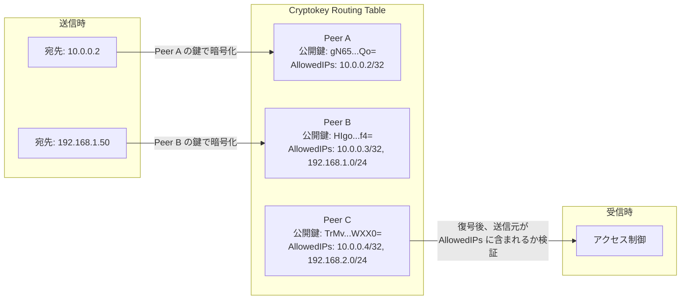

### 設定例

以下に典型的な Cryptokey Routing の設定例を示す。

```ini
[Interface]
# Server's private key
PrivateKey = yAnz5TF+lXXJte14tji3zlMNq+hd2rYUIgJBgB3fBmk=
ListenPort = 51820
Address = 10.0.0.1/24

[Peer]
# Peer A: a single client
PublicKey = gN65BkIKy1eCE9pP1wdc8ROUtkHLF2PfAqYdyYBz6EA=
AllowedIPs = 10.0.0.2/32

[Peer]
# Peer B: a client that also routes a subnet
PublicKey = HIgo9xNzJMWLKASShiTqIybxR0V1tB1C1YS5aDg4GWc=
AllowedIPs = 10.0.0.3/32, 192.168.1.0/24

[Peer]
# Peer C: another client routing a different subnet
PublicKey = TrMvSoP4jYQlY6RIzBgbssQqY3vxI2piVFBs0N2+Lg0=
AllowedIPs = 10.0.0.4/32, 192.168.2.0/24
```

この設定では、`192.168.1.0/24` 宛のパケットは自動的に Peer B の公開鍵で暗号化されて送信される。Peer B から受信したパケットの送信元が `192.168.1.0/24` の範囲外であれば、そのパケットは破棄される。

### AllowedIPs の最長一致

AllowedIPs のルックアップは、通常のルーティングテーブルと同様に最長プレフィックス一致（Longest Prefix Match）で行われる。例えば、Peer A の AllowedIPs が `10.0.0.0/16` で、Peer B が `10.0.1.0/24` の場合、`10.0.1.5` 宛のパケットは Peer B にルーティングされる。

## 5. ハンドシェイクプロトコル

### メッセージフォーマット

WireGuard のハンドシェイクは 3 種類のメッセージで構成される。すべてのメッセージは UDP で送受信される。

#### メッセージ 1: Handshake Initiation

イニシエータからレスポンダに送信される最初のメッセージである。

```
msg = handshake_initiation {
    u8    type             // = 1
    u8    reserved[3]
    u32   sender_index     // initiator's session index
    u8    unencrypted_ephemeral[32]   // initiator's ephemeral public key
    u8    encrypted_static[48]        // initiator's static public key (encrypted)
    u8    encrypted_timestamp[28]     // TAI64N timestamp (encrypted)
    u8    mac1[16]         // MAC for DoS protection
    u8    mac2[16]         // cookie-based MAC (optional)
}
```

このメッセージの処理フローは以下の通りである。

1. イニシエータは一時的な Curve25519 鍵ペアを生成する
2. 一時公開鍵を平文で送信する
3. DH 計算（es: 一時鍵 × レスポンダの静的鍵）を行い、チェイニングキーを更新する
4. 自身の静的公開鍵を暗号化して送信する
5. DH 計算（ss: 静的鍵 × レスポンダの静的鍵）を行い、チェイニングキーを更新する
6. TAI64N タイムスタンプを暗号化して送信する

#### メッセージ 2: Handshake Response

レスポンダからイニシエータに返信されるメッセージである。

```
msg = handshake_response {
    u8    type             // = 2
    u8    reserved[3]
    u32   sender_index     // responder's session index
    u32   receiver_index   // initiator's sender_index
    u8    unencrypted_ephemeral[32]   // responder's ephemeral public key
    u8    encrypted_nothing[16]       // empty encrypted payload
    u8    mac1[16]
    u8    mac2[16]
}
```

レスポンダの処理フローは以下の通りである。

1. 一時的な Curve25519 鍵ペアを生成する
2. 一時公開鍵を平文で送信する
3. DH 計算（ee: レスポンダの一時鍵 × イニシエータの一時鍵）を行う
4. DH 計算（se: レスポンダの一時鍵 × イニシエータの静的鍵）を行う
5. 事前共有鍵（PSK）があればチェイニングキーに混合する
6. セッション鍵を導出する

#### メッセージ 3: Cookie Reply

DoS 対策として使用されるメッセージである（詳細は後述）。

```
msg = cookie_reply {
    u8    type             // = 3
    u8    reserved[3]
    u32   receiver_index
    u8    nonce[24]
    u8    encrypted_cookie[32]
}
```

### タイムスタンプによるリプレイ攻撃防止

WireGuard では TAI64N タイムスタンプを使用してリプレイ攻撃を防止する。レスポンダは各ピアについて最新のタイムスタンプを記録しており、それよりも古いタイムスタンプを持つハンドシェイクメッセージは無視される。

TAI64N は、うるう秒の影響を受けない単調増加のタイムスタンプ形式である。これにより、NTP の調整やうるう秒によるタイムスタンプの巻き戻りが起こらない。

### セッション鍵のローテーション

ハンドシェイクが完了すると、送信用と受信用の 2 つの対称鍵が導出される。これらの鍵は以下の条件で更新される。

- **2 分ごと**: アクティブなセッションでは 2 分ごとに新しいハンドシェイクが開始される
- **2^64 - 1 パケット送信後**: カウンタのオーバーフロー防止（実質的に到達不可能だが安全策として）
- **180 秒間応答なし**: セッションが期限切れとなる

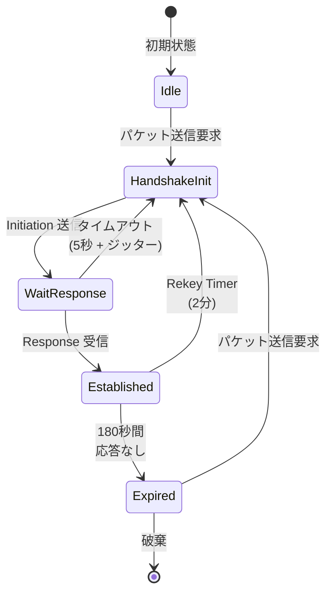

### Cookie メカニズムによる DoS 対策

WireGuard のハンドシェイク処理には Curve25519 の計算が含まれるため、CPU リソースを消費する。攻撃者が大量のハンドシェイクメッセージを送りつけることで、サービス拒否攻撃が成立する可能性がある。

WireGuard は、DTLS や IKEv2 の Cookie メカニズムを改良した独自の仕組みでこれに対処する。

1. 通常時: `mac1` フィールドのみが検証される。`mac1` はレスポンダの公開鍵を鍵として計算される MAC であり、レスポンダの公開鍵を知っている者のみが有効なメッセージを生成できる
2. 高負荷時: レスポンダは Cookie Reply メッセージを返す。この Cookie は送信元 IP アドレスとランダムな秘密値から計算される
3. Cookie を受け取ったイニシエータは、`mac2` フィールドに Cookie ベースの MAC を含めて再送する
4. レスポンダは `mac2` を検証することで、送信元 IP アドレスの正当性を確認する

この仕組みの巧みな点は、Cookie Reply メッセージ自体が XChaCha20-Poly1305 で暗号化・認証されていることである。これにより、Cookie の盗聴や偽造を防ぐ。

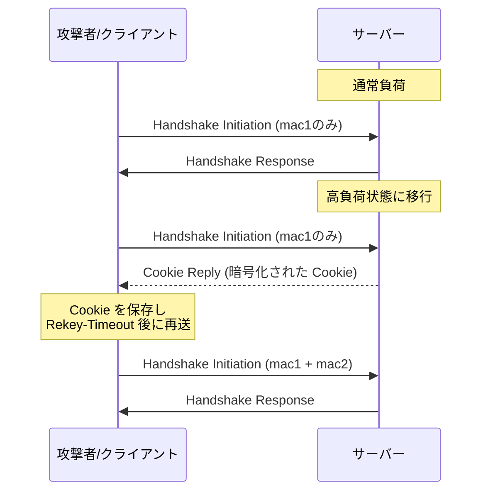

> [!NOTE]
> Cookie を受け取ったクライアントは即座に再送するのではなく、Rekey-Timeout タイマーの期限切れを待ってから再送する。これにより、高負荷状態をさらに悪化させることを防ぐ。

## 6. IPsec / OpenVPN との比較

### アーキテクチャの比較

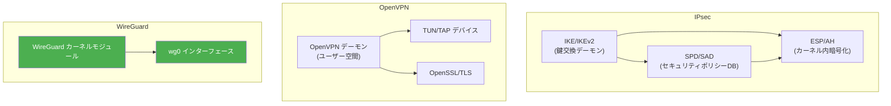

### 詳細比較表

| 項目 | IPsec (IKEv2) | OpenVPN | WireGuard |
|---|---|---|---|
| **コード量** | 数万行（Linux カーネル内） | 約 10 万行 | 約 4,000 行 |
| **動作空間** | カーネル空間 + ユーザー空間デーモン（IKE） | ユーザー空間 | カーネル空間 |
| **暗号スイート** | ネゴシエーション（多数対応） | ネゴシエーション（OpenSSL 依存） | 固定（Curve25519, ChaCha20-Poly1305, BLAKE2s） |
| **プロトコル** | ESP (IP プロトコル 50) + IKE (UDP 500/4500) | TCP または UDP | UDP のみ |
| **ハンドシェイク** | IKE_SA_INIT + IKE_AUTH（2-RTT） | TLS ハンドシェイク（2〜3 RTT） | 1-RTT |
| **状態管理** | 複雑（SA, SPD, SAD） | 複雑（セッション状態） | 最小限（Cryptokey Routing Table） |
| **NAT 越え** | NAT-T（UDP カプセル化）が必要 | 対応（UDP モード推奨） | ネイティブ対応（UDP） |
| **ローミング** | 限定的 | 限定的 | 完全対応（IP 変更時の自動追従） |
| **認証方式** | 証明書、PSK、EAP など多数 | 証明書、ユーザー名/パスワードなど | 公開鍵のみ |
| **設定の複雑さ** | 非常に高い | 高い | 低い |

### パフォーマンス比較

研究論文やベンチマークによると、各プロトコルのパフォーマンス特性は以下の通りである。

**スループット**

WireGuard は ChaCha20-Poly1305 を使用するため、AES-NI ハードウェアアクセラレーションを持つ環境では、AES-GCM を使用する IPsec に対してスループットが劣る場合がある。しかし、AES-NI を持たない環境（ARM プロセッサ、古いサーバー、組み込みデバイスなど）では、WireGuard の方が高いスループットを示す。

WireGuard は並列ワーカーを用いて暗号化・復号処理を行うのに対し、IPsec の Linux 実装（xfrm）は並列処理を活用しないため、同じ ChaCha20-Poly1305 を使用した場合は WireGuard の方が高速である。

**レイテンシ**

WireGuard は 1-RTT ハンドシェイクにより、接続確立時間が最も短い。IPsec（IKEv2）は 2-RTT、OpenVPN（TLS）は 2〜3 RTT を要する。

**CPU 使用率**

OpenVPN はユーザー空間で動作するため、カーネル空間とのコンテキストスイッチが発生し、CPU 使用率が高くなる。WireGuard と IPsec はカーネル空間で動作するため、この点で有利である。

```
スループット比較（1 Gbps 環境での概算）:
┌────────────────────────────────────────────────────┐
│ IPsec (AES-GCM, AES-NI あり)  ████████████████ 940 Mbps │
│ WireGuard (ChaCha20-Poly1305) ██████████████   880 Mbps │
│ IPsec (ChaCha20-Poly1305)     ██████████       620 Mbps │
│ OpenVPN (AES-256-GCM)         ██████           400 Mbps │
└────────────────────────────────────────────────────┘
※ 環境・設定により大きく変動する。あくまで目安。
```

### 設計上のトレードオフ

WireGuard のシンプルさには、いくつかのトレードオフが伴う。

**WireGuard が得意とする領域**

- シンプルなポイントツーポイントまたはスター型の VPN 構成
- モバイルデバイスのローミングが頻繁な環境
- 設定の容易さと監査可能性が重視される環境
- コードベースの小ささによるセキュリティ上の利点

**IPsec が適している領域**

- 企業のサイトツーサイト VPN（豊富な実績と標準化）
- ハードウェア VPN アプライアンスとの相互運用
- 規制要件で特定の暗号アルゴリズムの使用が求められる場合
- レガシーシステムとの互換性

**OpenVPN が適している領域**

- TCP 443 ポートを使用したファイアウォール・プロキシ越え
- ユーザー認証（LDAP、RADIUS 連携など）が必要な場合
- 詳細なアクセス制御ポリシーが必要な場合

## 7. カーネル実装とパフォーマンス

### Linux カーネルモジュールとしての実装

WireGuard は 2020 年 3 月にリリースされた Linux カーネル 5.6 で公式に統合された。それ以前は out-of-tree のカーネルモジュールとして配布されていた。

カーネルモジュールとして実装されることの利点は多い。

1. **コンテキストスイッチの回避**: パケット処理がすべてカーネル空間で完結するため、ユーザー空間との切り替えオーバーヘッドが発生しない
2. **ネットワークスタックとの直接統合**: `netfilter`、`tc`（トラフィックコントロール）、ネットワーク名前空間などと直接連携できる
3. **NAPI との統合**: Linux のネットワーク I/O 最適化機構を活用できる
4. **マルチコアの活用**: 暗号化・復号処理を複数の CPU コアに分散する並列ワーカーを使用する

### パケット処理フロー

WireGuard におけるパケットの処理フローを以下に示す。

```mermaid
graph TD
    subgraph "送信パス"
        APP["アプリケーション"] --> SK["ソケット層"]
        SK --> RT["ルーティング決定"]
        RT --> WG_TX["wg0: 送信処理"]
        WG_TX --> CRT["Cryptokey Routing<br/>テーブル検索"]
        CRT --> ENC["暗号化<br/>(ChaCha20-Poly1305)"]
        ENC --> UDP_TX["UDP カプセル化"]
        UDP_TX --> NIC_TX["物理 NIC 送信"]
    end

    subgraph "受信パス"
        NIC_RX["物理 NIC 受信"] --> UDP_RX["UDP パケット受信"]
        UDP_RX --> DEC["復号<br/>(ChaCha20-Poly1305)"]
        DEC --> ACL["AllowedIPs 検証"]
        ACL --> WG_RX["wg0: 受信処理"]
        WG_RX --> APP_RX["アプリケーション"]
    end
```

### ユーザー空間実装

Linux カーネルモジュール以外にも、いくつかのユーザー空間実装が存在する。

- **wireguard-go**: Go 言語による実装。macOS、Windows、FreeBSD などで使用される
- **BoringTun**: Cloudflare による Rust 実装。ユーザー空間で動作し、特定の環境で利用される
- **wintun**: Windows 向けの TUN ドライバー。wireguard-go と組み合わせて使用される

ユーザー空間実装はカーネル実装に比べてパフォーマンスは劣るが、カーネルモジュールのインストールが困難な環境（コンテナ内、権限の制約があるクラウド環境など）で有用である。

### パフォーマンスチューニング

Linux カーネルの WireGuard モジュールには、いくつかのチューニングポイントがある。

```bash
# Increase the UDP receive buffer size
sysctl -w net.core.rmem_max=26214400
sysctl -w net.core.rmem_default=26214400

# Increase the UDP send buffer size
sysctl -w net.core.wmem_max=26214400
sysctl -w net.core.wmem_default=26214400

# Increase the netdev backlog for high-throughput scenarios
sysctl -w net.core.netdev_budget=600
sysctl -w net.core.netdev_budget_usecs=20000

# Set the MTU appropriately (Ethernet 1500 - WireGuard overhead 60)
ip link set mtu 1420 dev wg0
```

WireGuard のオーバーヘッドは、IPv4 の場合 60 バイト（IPv4 ヘッダー 20 バイト + UDP ヘッダー 8 バイト + WireGuard ヘッダー 32 バイト）、IPv6 の場合 80 バイト（IPv6 ヘッダー 40 バイト + UDP ヘッダー 8 バイト + WireGuard ヘッダー 32 バイト）である。そのため、MTU は通常 1420（IPv4）または 1400（IPv6）に設定する。

## 8. ネットワーク構成パターン

### パターン 1: ポイントツーポイント

最もシンプルな構成であり、2 つのホスト間を直接接続する。

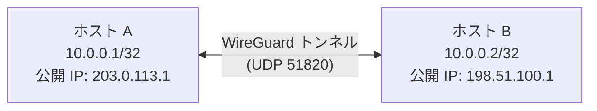

### パターン 2: スター型（ハブ & スポーク）

中央サーバーに複数のクライアントが接続するパターンである。リモートアクセス VPN として最も一般的な構成であり、企業のリモートワーカーが社内ネットワークにアクセスする場合などに使用される。

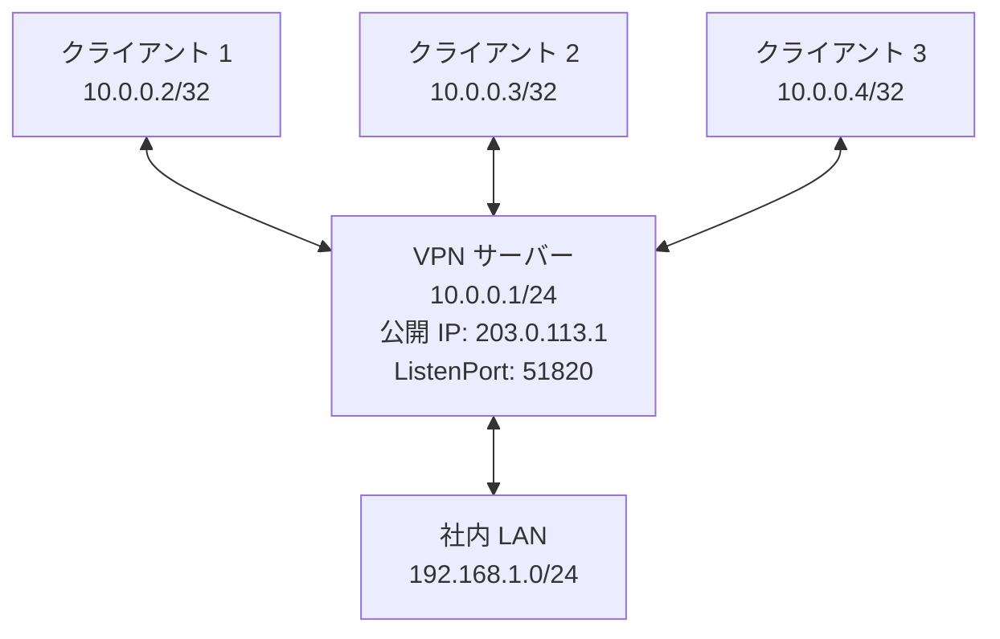

サーバー側の設定例:

```ini
[Interface]
PrivateKey = <server_private_key>
Address = 10.0.0.1/24
ListenPort = 51820
# Enable IP forwarding and NAT
PostUp = iptables -A FORWARD -i wg0 -j ACCEPT; iptables -t nat -A POSTROUTING -o eth0 -j MASQUERADE
PostDown = iptables -D FORWARD -i wg0 -j ACCEPT; iptables -t nat -D POSTROUTING -o eth0 -j MASQUERADE

[Peer]
# Client 1
PublicKey = <client1_public_key>
AllowedIPs = 10.0.0.2/32

[Peer]
# Client 2
PublicKey = <client2_public_key>
AllowedIPs = 10.0.0.3/32

[Peer]
# Client 3
PublicKey = <client3_public_key>
AllowedIPs = 10.0.0.4/32
```

クライアント側の設定例:

```ini
[Interface]
PrivateKey = <client1_private_key>
Address = 10.0.0.2/32
# Optional: set DNS server
DNS = 192.168.1.1

[Peer]
PublicKey = <server_public_key>
Endpoint = 203.0.113.1:51820
# Route all traffic through VPN (full tunnel)
AllowedIPs = 0.0.0.0/0, ::/0
# Keep NAT mappings alive
PersistentKeepalive = 25
```

### パターン 3: サイトツーサイト

2 つの拠点のネットワークを接続するパターンである。各拠点のゲートウェイが WireGuard トンネルで接続され、背後のサブネット同士が通信できる。

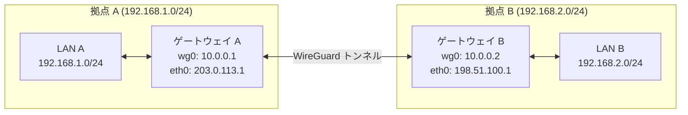

### パターン 4: メッシュ型

すべてのノードが互いに直接接続するパターンである。分散型のアーキテクチャに適しているが、ノード数 N に対して N×(N-1)/2 のトンネルが必要となるため、スケーラビリティに注意が必要である。

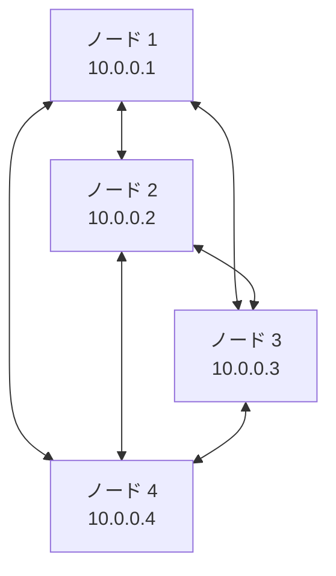

メッシュ型の管理を支援するツールとして、以下のようなものがある。

- **Tailscale**: WireGuard をベースとしたメッシュ VPN サービス。NAT 越えや鍵管理を自動化する
- **Netmaker**: 自己ホスト型の WireGuard メッシュネットワーク管理ツール
- **Headscale**: Tailscale のコントロールサーバーの OSS 実装

### ローミングの仕組み

WireGuard の重要な特徴の一つが、IP ローミングへの対応である。ピアの外部 IP アドレスが変わっても、認証済みの暗号化パケットを正しく復号できれば、WireGuard は自動的にそのピアのエンドポイント情報を更新する。

具体的には以下のように動作する。

1. ピア A がピア B にパケットを送信する（送信先は最後に認証済みパケットを受信した IP アドレス）
2. ピア B のネットワーク接続が Wi-Fi からモバイルネットワークに切り替わる（外部 IP が変わる）
3. ピア B は新しい IP アドレスからピア A にパケットを送信する
4. ピア A はパケットを正常に復号できれば、ピア B のエンドポイントを新しい IP アドレスに更新する
5. 以降、ピア A からピア B へのパケットは新しい IP アドレスに送信される

この仕組みにより、モバイルデバイスが Wi-Fi とセルラーネットワークを頻繁に切り替える環境でも、VPN 接続が途切れることなく維持される。

## 9. 運用上の考慮事項

### 鍵管理

WireGuard 自体には鍵配布の仕組みが含まれていない。鍵の生成と配布は運用者の責任である。

```bash
# Generate a private key
wg genkey > private.key

# Derive the public key from the private key
wg pubkey < private.key > public.key

# Generate a preshared key (optional, for post-quantum resistance)
wg genpsk > preshared.key
```

大規模な環境では、以下のような鍵管理の戦略が考えられる。

- **構成管理ツール（Ansible, Puppet 等）による自動配布**: テンプレートを使って各ホストの設定ファイルを生成する
- **Tailscale / Headscale のような管理サービスの利用**: 鍵の生成・配布・ローテーションを自動化する
- **HashiCorp Vault 等のシークレット管理ツール**: 秘密鍵を安全に保管・配布する

### ログとモニタリング

WireGuard は設計上、ログ出力を最小限に抑えている。これはプライバシー保護の観点からは望ましいが、トラブルシューティングの際には不便である。

```bash
# Check the current status of WireGuard interfaces
wg show

# Output example:
# interface: wg0
#   public key: ...
#   private key: (hidden)
#   listening port: 51820
#
# peer: ...
#   endpoint: 198.51.100.1:51820
#   allowed ips: 10.0.0.2/32
#   latest handshake: 32 seconds ago
#   transfer: 1.23 GiB received, 456.78 MiB sent

# Enable dynamic debug logging (requires CONFIG_DYNAMIC_DEBUG)
echo module wireguard +p > /sys/kernel/debug/dynamic_debug/control
```

モニタリングには、以下のメトリクスが有用である。

- **latest handshake**: 最後にハンドシェイクが成功した時刻。2 分以上前であれば再接続が発生していない
- **transfer**: 送受信バイト数。トラフィック量の把握に使用
- **endpoint**: ピアの現在のエンドポイント。ローミング状況の確認に使用

Prometheus と Grafana を使ったモニタリングを行う場合は、`prometheus-wireguard-exporter` のようなツールが利用できる。

### NAT とファイアウォールの考慮

WireGuard は UDP のみを使用するため、NAT 越えは比較的容易である。ただし、以下の点に注意が必要である。

**PersistentKeepalive**

NAT の背後にあるピアは、一定時間通信がないと NAT テーブルのエントリが期限切れとなり、外部からの到達性を失う。`PersistentKeepalive = 25` を設定すると、25 秒ごとにキープアライブパケットが送信され、NAT マッピングが維持される。

> [!WARNING]
> PersistentKeepalive は NAT 越えが必要なピアにのみ設定すべきである。不必要に設定すると、無駄なトラフィックが発生し、WireGuard の「沈黙は金」（silent when idle）という設計原則に反する。

**ファイアウォール設定**

WireGuard サーバーでは、リスニングポート（通常 51820/UDP）を開放する必要がある。

```bash
# Allow WireGuard traffic
iptables -A INPUT -p udp --dport 51820 -j ACCEPT

# Allow forwarding for VPN clients
iptables -A FORWARD -i wg0 -j ACCEPT
iptables -A FORWARD -o wg0 -j ACCEPT

# NAT for VPN clients accessing the internet
iptables -t nat -A POSTROUTING -s 10.0.0.0/24 -o eth0 -j MASQUERADE
```

### DNS の考慮

VPN を使用する際、DNS 漏洩（DNS Leak）に注意が必要である。DNS クエリが VPN トンネルの外側を通ると、通信先の情報が漏洩する。

WireGuard の設定で `DNS` パラメータを指定すると、`wg-quick` がシステムの DNS 設定を自動的に変更する。ただし、この動作は `resolvconf` や `systemd-resolved` に依存するため、環境によっては手動で設定が必要な場合がある。

### セキュリティ上の注意点

**事前共有鍵（PSK）の利用**

WireGuard は事前共有鍵をオプションでサポートしている。これを使用すると、Curve25519 の鍵交換に加えて対称鍵が混合されるため、量子コンピュータによる将来的な攻撃に対する追加の防御層となる。現在の Curve25519 は量子コンピュータに対して脆弱になる可能性があるが、事前共有鍵を組み合わせることで、ポスト量子セキュリティの層が追加される。

```ini
[Peer]
PublicKey = <peer_public_key>
PresharedKey = <preshared_key>
AllowedIPs = 10.0.0.2/32
```

**鍵の保護**

秘密鍵は適切なファイルパーミッションで保護する必要がある。

```bash
# Set appropriate permissions for the configuration file
chmod 600 /etc/wireguard/wg0.conf
chown root:root /etc/wireguard/wg0.conf
```

**ステルス性の限界**

WireGuard は未認証のパケットに対して一切応答しないため、ポートスキャンに対してステルスである。しかし、WireGuard のパケットフォーマットには特徴的なパターン（最初の 4 バイトが固定値）があるため、DPI（Deep Packet Inspection）による検出は可能である。検閲が行われる環境では、obfuscation（難読化）レイヤーの追加を検討する必要がある。

### WireGuard の既知の制限事項

**動的な IP アドレス割り当て**

WireGuard には DHCP のような動的 IP アドレス割り当ての仕組みがない。各ピアの IP アドレスは事前に静的に設定する必要がある。大規模な環境では、Tailscale や Netmaker のような管理ツールがこの問題を解決する。

**ピアの存在が隠せない**

WireGuard の設定ファイルには各ピアの公開鍵が記載されるため、ピアの数は設定から推測できる。ただし、これは実用上の問題になることは少ない。

**TCP フォールバックの欠如**

WireGuard は UDP のみで動作する。UDP が遮断される環境（一部の企業ネットワークや公共 Wi-Fi）では接続できない。このような環境では、UDP パケットを TCP や WebSocket でラップするツール（`udp2raw`、`wstunnel` など）を併用する必要がある。

## まとめ

WireGuard は、VPN プロトコルの設計において「シンプルさ」と「正しさ」を追求した成果物である。約 4,000 行というコンパクトなカーネル実装、暗号スイートの固定による攻撃面の縮小、Noise Protocol Framework に基づく 1-RTT ハンドシェイク、そして Cryptokey Routing による直感的なルーティングモデルは、従来の VPN プロトコルが抱えていた複雑さを大幅に解消した。

一方で、暗号アルゴリズムの選択肢がないこと、動的なピア管理機能がないこと、TCP フォールバックがないことなど、シンプルさゆえの制約も存在する。これらの制約を補うために、Tailscale をはじめとするエコシステムが発展しており、WireGuard を基盤とした多様なソリューションが生まれている。

WireGuard の設計が示した教訓は、セキュリティプロトコルにおいて複雑さは敵であるということである。コードが少なければ監査しやすく、バグも少ない。暗号のネゴシエーションを排除すればダウングレード攻撃は不可能になる。この哲学は、今後のネットワークプロトコル設計にも影響を与え続けるだろう。
