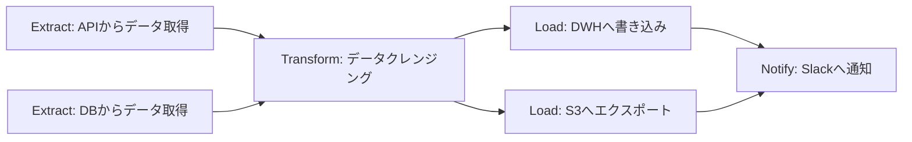
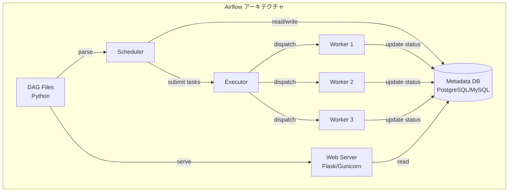
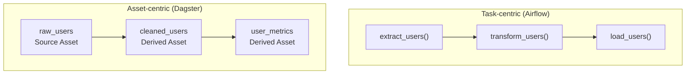
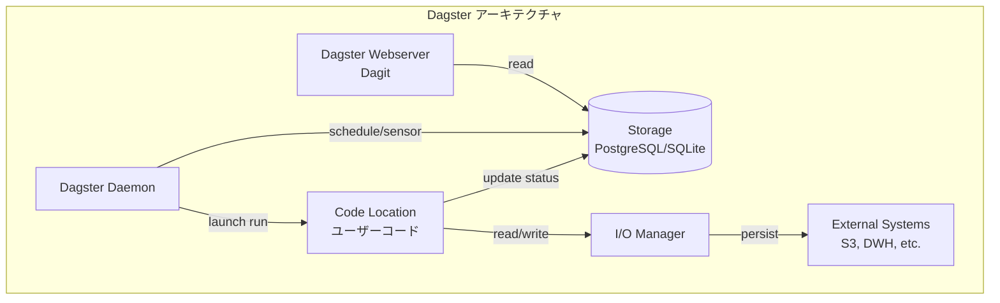
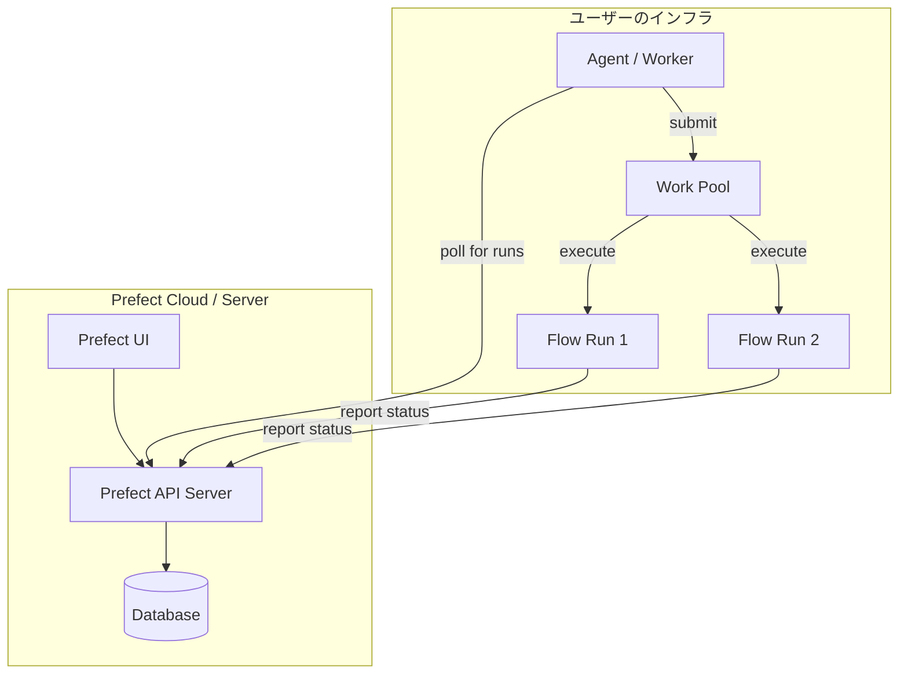
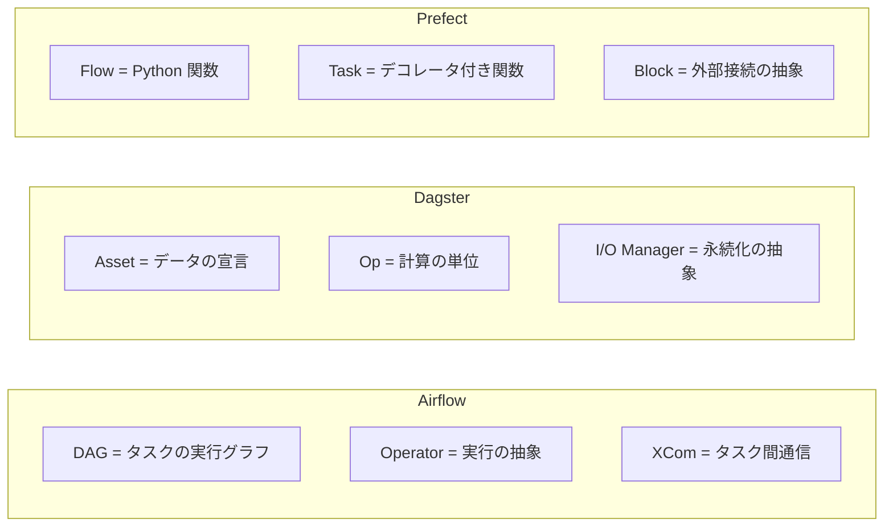
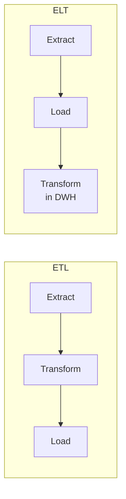
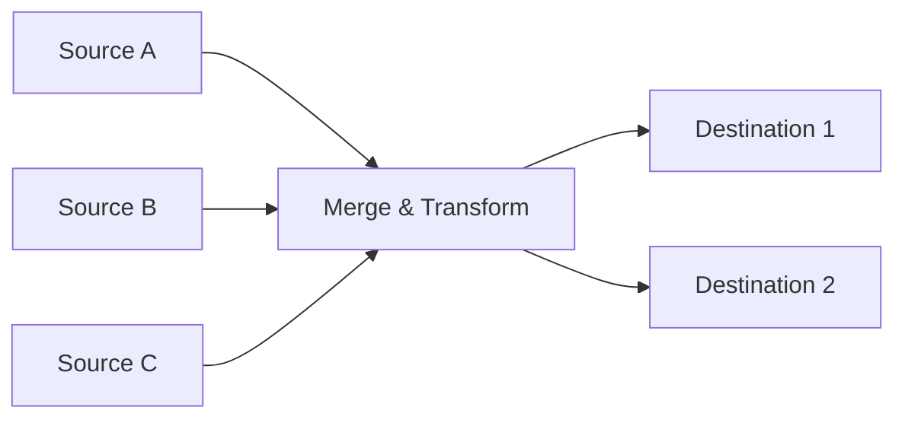
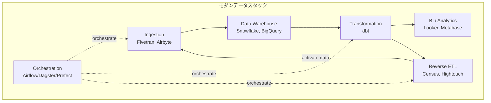

# データパイプラインとDAG（Airflow, Dagster, Prefect）

## なぜワークフローオーケストレーションが必要なのか

現代のデータ基盤では、データの収集・変換・集計・配信といった一連の処理を定期的に、かつ信頼性高く実行する必要がある。たとえば「毎朝5時にデータウェアハウスへ前日のログを取り込み、変換テーブルを更新し、BI ダッシュボードを再計算する」というパイプラインを考えよう。この処理には以下のような課題が伴う。

1. **依存関係の管理** — ステップ A が完了してからステップ B を実行し、B と C が完了してからステップ D を実行する、というように処理間に依存関係がある
2. **失敗時のリトライと通知** — ネットワーク障害や一時的なリソース不足で処理が失敗した場合、自動でリトライし、一定回数失敗すればアラートを送りたい
3. **冪等性と再実行** — 過去の特定の日付だけをやり直す（バックフィル）場合に、安全に再実行できなければならない
4. **スケジューリング** — cron で管理するには限界がある複雑なスケジュールや、イベント駆動の実行が求められる
5. **可観測性** — 各ステップの実行時間、成功・失敗、ログを一元的に可視化したい

cron + シェルスクリプトで管理していた時代もあったが、パイプラインが数十・数百に増えると、依存関係の把握、障害の切り分け、再実行の安全性が破綻する。ワークフローオーケストレーションツールは、これらの課題を構造的に解決するために生まれた。

## DAG（有向非巡回グラフ）とは

ワークフローオーケストレーションの中核的な概念が **DAG（Directed Acyclic Graph）** である。

### 定義

DAG は、頂点（ノード）と有向辺（エッジ）からなるグラフであり、巡回（サイクル）を含まない。データパイプラインにおいては、各ノードが「タスク」に、有向辺が「依存関係」に対応する。



上図では、2つの Extract タスク（A, B）が完了してから Transform タスク（C）が実行され、C の完了後に2つの Load タスク（D, E）が並列に実行される。すべてが完了すると Notify タスク（F）が実行される。

### DAG がワークフローに適している理由

| 性質 | パイプラインへの意味 |
|------|---------------------|
| **有向** | 処理の実行順序が一方向に定義される |
| **非巡回** | 無限ループが構造的に排除される |
| **依存関係の明示** | どのタスクがどのタスクに依存しているかがグラフとして可視化される |
| **並列実行の最大化** | 依存関係のないタスクは安全に並列実行できる |
| **トポロジカルソート** | 実行順序を一意に（または部分順序として）決定できる |

DAG は計算理論やコンパイラの命令スケジューリングでも使われる汎用的な概念だが、データパイプラインの世界で特に重要な抽象化となっている。

### トポロジカルソートと実行順序

DAG の実行順序はトポロジカルソートによって決定される。上の例では、有効な実行順序の一つは `A → B → C → D → E → F` である。A と B には相互の依存関係がないため、`B → A → C → D → E → F` も有効な順序であり、さらに A と B を並列実行し、D と E を並列実行することも可能である。

オーケストレーターは、このトポロジカルソートを自動的に計算し、並列実行可能なタスクを検出してスケジューリングを最適化する。

## ワークフローオーケストレーションの主要概念

個別のツールに入る前に、ワークフローオーケストレーションに共通する概念を整理する。

### タスクとオペレータ

**タスク** はパイプラインにおける最小の実行単位であり、1つの具体的な操作（SQL クエリの実行、API の呼び出し、ファイルの転送など）を表す。ツールによって呼び方は異なり、Airflow では「オペレータ」をインスタンス化して「タスク」を定義し、Dagster では「Op」や「Asset」、Prefect では「Task」と呼ぶ。

### DAG Run / Pipeline Run

DAG の1回の実行を指す。通常、実行ごとに一意の ID とパラメータ（実行日時など）が付与される。これにより、過去の特定の実行を追跡したり、再実行（バックフィル）したりできる。

### スケジューリングとトリガー

パイプラインの実行方法には複数のパターンがある。

- **時刻ベース** — cron 式で定期実行する（毎日、毎時間など）
- **イベント駆動** — S3 にファイルがアップロードされたら実行する、Kafka にメッセージが到着したら実行するなど
- **手動トリガー** — Web UI や API から手動で実行する
- **依存トリガー** — 別のパイプラインが成功したら実行する（クロス DAG 依存）

### リトライと障害処理

タスクが失敗した場合の挙動を制御する仕組み。

- **リトライ回数と間隔** — 一時的なエラーへの対処
- **Exponential Backoff** — リトライ間隔を指数的に増加させる
- **タイムアウト** — 長時間ハングしたタスクを強制終了する
- **アラート通知** — Slack、Email、PagerDuty などへの通知

### 冪等性とバックフィル

冪等性（Idempotency）は、同じ入力に対して何度実行しても同じ結果になる性質である。パイプラインの再実行やバックフィル（過去データの再処理）を安全に行うために不可欠な設計原則である。

具体的には以下のようなプラクティスが重要になる。

- `INSERT` ではなく `MERGE`（`UPSERT`）を使う
- パーティションを上書きする（`INSERT OVERWRITE`）
- 処理対象をパラメータ（日付など）で明確に限定する

## Apache Airflow

### 歴史と背景

Apache Airflow は、2014年に Airbnb のエンジニア Maxime Beauchemin によって開発された。Airbnb 社内でデータパイプラインが急速に複雑化する中、cron + スクリプトの管理が限界に達したことが開発の動機であった。2016年に Apache Incubator プロジェクトとなり、2019年にトップレベルプロジェクトに昇格した。

Airflow は「ワークフローをコードとして定義する」（Configuration as Code）という思想を持ち、Python でパイプラインを記述する。2024年にリリースされた Airflow 2.x 系では、TaskFlow API の導入、スケーラビリティの改善、セキュリティの強化が行われた。

### アーキテクチャ

Airflow のアーキテクチャは以下のコンポーネントで構成される。



- **Scheduler** — DAG ファイルを定期的にパースし、実行すべきタスクを Executor に送信する。Airflow のスケジューラは DAG ファイルを Python インタプリタで実行してメタデータを収集するため、DAG ファイルにインポート時の重い処理が含まれるとスケジューラの性能が劣化する
- **Executor** — タスクの実行方式を決定する。主要な Executor として以下がある:
  - `LocalExecutor` — ローカルマシン上でプロセスとして実行
  - `CeleryExecutor` — Celery のワーカーキューに分散（Redis/RabbitMQ が必要）
  - `KubernetesExecutor` — 各タスクを Kubernetes Pod として実行
- **Web Server** — Flask ベースの Web UI を提供し、DAG の状態の確認やタスクの手動トリガーを行う
- **Metadata Database** — DAG の定義、実行履歴、タスクの状態、変数、接続情報などを保存する

### DAG の定義方法

Airflow では DAG を Python コードで定義する。伝統的な方式と、Airflow 2.x で導入された TaskFlow API の2つの方式がある。

::: code-group

```python [Traditional Style]
from airflow import DAG
from airflow.operators.python import PythonOperator
from airflow.providers.postgres.operators.postgres import PostgresOperator
from datetime import datetime, timedelta

default_args = {
    "owner": "data-team",
    "retries": 3,
    "retry_delay": timedelta(minutes=5),
}

with DAG(
    dag_id="etl_daily_sales",
    default_args=default_args,
    schedule_interval="@daily",
    start_date=datetime(2026, 1, 1),
    catchup=False,
    tags=["etl", "sales"],
) as dag:

    def extract_data(**context):
        # Fetch data from source API
        execution_date = context["ds"]
        # ... extraction logic ...
        return {"record_count": 1500}

    extract = PythonOperator(
        task_id="extract_data",
        python_callable=extract_data,
    )

    transform = PostgresOperator(
        task_id="transform_data",
        postgres_conn_id="dwh_connection",
        sql="sql/transform_sales.sql",
    )

    def load_to_warehouse(**context):
        # Load transformed data into final tables
        pass

    load = PythonOperator(
        task_id="load_data",
        python_callable=load_to_warehouse,
    )

    # Define dependencies
    extract >> transform >> load
```

```python [TaskFlow API (Airflow 2.x)]
from airflow.decorators import dag, task
from datetime import datetime, timedelta

@dag(
    dag_id="etl_daily_sales_taskflow",
    schedule="@daily",
    start_date=datetime(2026, 1, 1),
    catchup=False,
    default_args={"retries": 3, "retry_delay": timedelta(minutes=5)},
    tags=["etl", "sales"],
)
def etl_daily_sales():

    @task
    def extract_data(ds=None):
        # Fetch data from source API
        # ds is automatically injected by Airflow
        return {"records": [...], "count": 1500}

    @task
    def transform_data(raw_data: dict):
        # Clean and transform the raw data
        records = raw_data["records"]
        # ... transformation logic ...
        return {"transformed": [...], "count": len(records)}

    @task
    def load_data(transformed_data: dict):
        # Load into data warehouse
        pass

    # Dependencies are inferred from function arguments
    raw = extract_data()
    transformed = transform_data(raw)
    load_data(transformed)

etl_daily_sales()
```

:::

TaskFlow API では、Python の関数呼び出しの形で依存関係が自動推論される。これにより、XCom（タスク間データ受け渡し機構）の明示的な操作が不要になり、コードの可読性が大幅に向上した。

### 主要な概念

#### Operator（オペレータ）

Airflow は、さまざまなシステムとの連携を「オペレータ」として抽象化している。主要なオペレータを以下に示す。

| オペレータ | 用途 |
|-----------|------|
| `PythonOperator` | Python 関数を実行 |
| `BashOperator` | シェルコマンドを実行 |
| `PostgresOperator` | PostgreSQL に SQL を実行 |
| `S3ToRedshiftOperator` | S3 から Redshift へデータをロード |
| `BigQueryOperator` | BigQuery にクエリを実行 |
| `DockerOperator` | Docker コンテナとしてタスクを実行 |
| `KubernetesPodOperator` | Kubernetes Pod としてタスクを実行 |

Provider パッケージシステムにより、AWS、GCP、Azure、Snowflake、dbt など数百のサービスとの連携が用意されている。

#### XCom（Cross-Communication）

XCom はタスク間でデータを受け渡すための仕組みである。あるタスクの戻り値を別のタスクから参照できる。ただし、XCom はメタデータデータベースにシリアライズして格納されるため、大量のデータの受け渡しには向いていない。大規模なデータは、S3 や GCS などの外部ストレージにファイルとして保存し、パスだけを XCom で渡すのが一般的なプラクティスである。

#### Connection と Variable

外部システムへの接続情報（データベースのホスト、ポート、認証情報など）は **Connection** として管理される。また、パイプライン全体で共有する設定値は **Variable** として定義できる。いずれも Web UI またはCLI から管理可能で、暗号化して保存することもできる。

#### Sensor

Sensor は、外部の条件が満たされるまで待機する特殊なオペレータである。たとえば、S3 に特定のファイルが到着するまで待つ `S3KeySensor` や、別の DAG が完了するまで待つ `ExternalTaskSensor` がある。Sensor は定期的にポーリングして条件を確認するが、Worker スロットを長時間占有するという課題がある。Airflow 2.x では Deferrable Operator（非同期待機）が導入され、この問題が緩和された。

### Airflow の設計思想と課題

Airflow は **「ワークフローのオーケストレーション」** に特化している。つまり、Airflow 自身がデータの移動や変換を行うのではなく、外部システム（Spark、dbt、BigQuery など）に処理を委譲し、その実行順序と状態管理を担う。

この設計は大きな柔軟性を提供する一方で、いくつかの課題も抱えている。

::: warning Airflow の既知の課題

1. **DAG パースのオーバーヘッド** — スケジューラが DAG ファイルを定期的に Python として実行するため、大量の DAG を抱える環境ではパース時間が問題になる
2. **テストの困難さ** — DAG のロジックがグローバルスコープで定義されるため、ユニットテストが書きにくい
3. **データリネージの弱さ** — タスク間のデータの流れをシステムが把握しておらず、リネージの追跡が困難
4. **ローカル開発体験** — 実行環境の再現に Docker Compose や仮想環境が必要で、ローカルでの開発・デバッグが重い
5. **動的 DAG の制約** — DAG の構造はパース時に静的に決定される必要があり、実行時に動的にタスクを生成するのが困難（Dynamic Task Mapping で部分的に解決）

:::

## Dagster

### 歴史と設計哲学

Dagster は、2018年に Nick Schrock（GraphQL の共同作者）によって開発が開始された。Airflow の課題を踏まえ、ソフトウェアエンジニアリングの原則をデータパイプラインに適用するという明確な設計哲学を持っている。

Dagster の最も重要な設計上の特徴は **「Asset-centric（アセット中心）」** のアプローチである。従来のオーケストレーターがタスクの実行順序（動詞 = 何をするか）に焦点を当てていたのに対し、Dagster はタスクが生成するデータアセット（名詞 = 何が生成されるか）を第一級の概念として扱う。



### アーキテクチャ



- **Dagit（Webserver）** — リアクティブな Web UI で、アセットのリネージグラフ、実行履歴、ログを閲覧できる
- **Daemon** — スケジュール、Sensor、バックフィルなどのバックグラウンド処理を管理する
- **Code Location** — ユーザーコードを独立したプロセスとして実行する。これにより、ユーザーコードの依存関係がDagsterの制御プレーンから分離される
- **I/O Manager** — アセットの永続化を抽象化するレイヤー。ローカルファイル、S3、BigQuery など、ストレージの選択をコードから分離できる

### コード例：Asset の定義

```python
import pandas as pd
from dagster import asset, AssetExecutionContext, MaterializeResult

@asset(
    description="Raw user data from the application database",
    group_name="ingestion",
)
def raw_users(context: AssetExecutionContext) -> pd.DataFrame:
    # Read from source database
    df = pd.read_sql("SELECT * FROM users WHERE updated_at > :date", conn)
    context.log.info(f"Extracted {len(df)} users")
    return df

@asset(
    description="Cleaned and validated user records",
    group_name="transformation",
)
def cleaned_users(raw_users: pd.DataFrame) -> pd.DataFrame:
    # Data cleaning and validation
    df = raw_users.dropna(subset=["email"])
    df["email"] = df["email"].str.lower().str.strip()
    df = df[df["email"].str.contains("@")]
    return df

@asset(
    description="Aggregated user metrics for analytics",
    group_name="analytics",
)
def user_metrics(cleaned_users: pd.DataFrame) -> pd.DataFrame:
    # Compute metrics
    metrics = cleaned_users.groupby("country").agg(
        total_users=("user_id", "count"),
        avg_age=("age", "mean"),
    ).reset_index()
    return metrics
```

このコードの重要なポイントは、関数の引数名がアセットの依存関係を定義していることである。`cleaned_users` は `raw_users` を引数に取るため、Dagster は自動的に `raw_users → cleaned_users` という依存関係を構築する。

### Software-Defined Assets の利点

Dagster の Asset-centric アプローチには以下の利点がある。

**リネージの自動追跡** — アセット間の依存関係がコードから自動的に抽出されるため、データリネージグラフがリアルタイムに可視化される。「このテーブルはどのソースデータから派生しているか」「この上流テーブルを変更すると、下流のどのアセットに影響するか」が一目で分かる。

**マテリアライゼーションの概念** — 各アセットは「マテリアライズ」されることでデータが生成・更新される。Dagster は各アセットの最終マテリアライゼーション時刻を追跡し、上流のアセットが更新されたら下流のアセットも再計算が必要であることを検知して通知する（Freshness Policy）。

**テスタビリティ** — アセットは通常の Python 関数であるため、ユニットテストが容易に記述できる。

```python
def test_cleaned_users():
    # Arrange
    raw_data = pd.DataFrame({
        "user_id": [1, 2, 3],
        "email": ["Alice@Example.com", None, "bob@test.com"],
        "country": ["JP", "US", "JP"],
        "age": [30, 25, 40],
    })

    # Act
    result = cleaned_users(raw_data)

    # Assert
    assert len(result) == 2  # NULL email is dropped
    assert result.iloc[0]["email"] == "alice@example.com"  # lowercased
```

### Resource と I/O Manager

Dagster は **Resource** パターンにより、外部システムへの依存を注入可能にしている。

```python
from dagster import asset, ConfigurableResource
import boto3

class S3Resource(ConfigurableResource):
    bucket_name: str
    region: str = "ap-northeast-1"

    def get_client(self):
        return boto3.client("s3", region_name=self.region)

@asset
def uploaded_report(s3: S3Resource) -> MaterializeResult:
    client = s3.get_client()
    client.upload_file("report.csv", s3.bucket_name, "reports/daily.csv")
    return MaterializeResult(metadata={"bucket": s3.bucket_name})
```

本番環境と開発環境で異なる Resource を注入することで、コードを変更せずに接続先を切り替えられる。この設計は、依存性注入（Dependency Injection）パターンの適用であり、ソフトウェアエンジニアリングの SOLID 原則（特に依存性逆転の原則）に沿っている。

### Partition と Backfill

Dagster は **Partition** を第一級の概念として扱っている。日次パーティション、月次パーティション、カスタムパーティションを定義でき、特定のパーティションだけを再実行（バックフィル）する操作が Web UI からワンクリックで行える。

```python
from dagster import asset, DailyPartitionsDefinition

daily_partitions = DailyPartitionsDefinition(start_date="2026-01-01")

@asset(partitions_def=daily_partitions)
def daily_events(context: AssetExecutionContext) -> pd.DataFrame:
    partition_date = context.partition_key  # e.g., "2026-02-28"
    df = pd.read_sql(
        "SELECT * FROM events WHERE event_date = :date",
        conn,
        params={"date": partition_date},
    )
    return df
```

## Prefect

### 歴史と設計哲学

Prefect は、2018年に Jeremiah Lowin によって設立された Prefect Technologies 社が開発した。Airflow の課題、特に「ネガティブエンジニアリング」（正常系よりも異常系のコードが多くなる問題）を解決することを掲げて開発された。

Prefect の設計哲学は **「ポジティブエンジニアリング」** である。開発者がビジネスロジックに集中でき、オーケストレーションの仕組みは透過的に提供されるべきだという考え方である。Prefect 2.x（Orion）で大幅にアーキテクチャが刷新され、よりシンプルかつ柔軟な設計となった。

### アーキテクチャ

Prefect は **Hybrid モデル** を採用している。オーケストレーション（スケジューリング、状態管理、UI）はクラウドサービス（Prefect Cloud）または自己ホスト型サーバー（Prefect Server）で提供され、実際のコード実行はユーザーのインフラ上で行われる。



- **Prefect API Server** — フローの状態管理、スケジューリング、メタデータの保管を行う
- **Agent / Worker** — ユーザーのインフラ上で動作し、API サーバーからジョブを取得して実行する
- **Work Pool** — 実行環境（ローカルプロセス、Docker、Kubernetes、ECS など）を抽象化する

### コード例

```python
from prefect import flow, task, get_run_logger
from prefect.tasks import task_input_hash
from datetime import timedelta

@task(
    retries=3,
    retry_delay_seconds=60,
    cache_key_fn=task_input_hash,
    cache_expiration=timedelta(hours=1),
)
def extract_data(source: str, date: str) -> dict:
    logger = get_run_logger()
    logger.info(f"Extracting data from {source} for {date}")
    # ... extraction logic ...
    return {"records": [...], "count": 1500}

@task(retries=2)
def transform_data(raw_data: dict) -> dict:
    # ... transformation logic ...
    return {"transformed": [...]}

@task
def load_data(transformed: dict, target: str):
    logger = get_run_logger()
    logger.info(f"Loading {len(transformed['transformed'])} records to {target}")
    # ... load logic ...

@flow(name="ETL Daily Sales", log_prints=True)
def etl_pipeline(date: str = "2026-03-01"):
    # Extract from multiple sources in parallel
    api_data = extract_data.submit("sales_api", date)
    db_data = extract_data.submit("sales_db", date)

    # Transform (waits for extract to complete)
    transformed_api = transform_data.submit(api_data.result())
    transformed_db = transform_data.submit(db_data.result())

    # Load
    load_data.submit(transformed_api.result(), "warehouse")
    load_data.submit(transformed_db.result(), "data_lake")

if __name__ == "__main__":
    etl_pipeline(date="2026-03-01")
```

Prefect の際立った特徴は、通常の Python コードにデコレータを追加するだけでオーケストレーション機能が付与される点である。`@flow` と `@task` を外せば、通常の Python スクリプトとして動作する。

### Prefect の特徴的な機能

#### 動的ワークフロー

Prefect は静的な DAG 定義を必要としない。Python のフロー制御（if 文、for ループ）をそのまま使って、実行時に動的にタスクグラフを構築できる。

```python
@flow
def dynamic_pipeline(file_paths: list[str]):
    results = []
    for path in file_paths:
        # Number of tasks is determined at runtime
        result = process_file.submit(path)
        results.append(result)

    # Wait for all and aggregate
    aggregate.submit([r.result() for r in results])
```

#### タスクキャッシング

Prefect はタスクの結果をキャッシュする機能を内蔵している。入力が同じであれば再計算をスキップし、キャッシュされた結果を返す。これにより、パイプラインの再実行時に不要な計算を回避できる。

#### Blocks

Prefect の **Block** は、外部システムの接続情報や設定をカプセル化するための仕組みである。S3 バケット、Slack Webhook、データベース接続などを Block として定義し、Web UI から管理できる。

```python
from prefect_aws import S3Bucket

# Configured via UI or code
s3_block = S3Bucket.load("my-data-bucket")
s3_block.upload_from_path("local_file.csv", "remote/path/file.csv")
```

## 3ツールの比較

### 設計思想の違い



| 観点 | Airflow | Dagster | Prefect |
|------|---------|---------|---------|
| **中心概念** | DAG（タスクグラフ） | Asset（データ成果物） | Flow（Python 関数） |
| **DAG 定義** | 静的（パース時に確定） | 静的 + 動的 | 完全に動的 |
| **テスタビリティ** | 困難（グローバルスコープ） | 容易（関数ベース） | 容易（関数ベース） |
| **データリネージ** | 弱い（外部ツール依存） | ネイティブ対応 | 部分的対応 |
| **ローカル開発** | 重い（Docker 推奨） | 軽量（dagster dev） | 軽量（Python スクリプト） |
| **学習コスト** | 中〜高 | 中 | 低 |
| **エコシステム** | 非常に大きい | 成長中 | 成長中 |
| **実行基盤** | 自己ホスト or マネージド | 自己ホスト or Cloud | Hybrid（Cloud + Agent） |

### スケーリングモデル

各ツールのスケーリングアプローチは異なる。

**Airflow** は、Executor の選択によってスケーリング特性が決まる。CeleryExecutor は Celery ワーカーの数を増やすことでスケールし、KubernetesExecutor は各タスクを個別の Pod として実行するためタスクレベルのリソース分離が可能である。ただし、スケジューラ自体がボトルネックになりやすく、大量の DAG を抱える環境ではスケジューラの複数プロセス化が必要になる。

**Dagster** は、Code Location の分離により、チームごとに独立したコードベースとランタイムを持つことができる。Run Coordinator によって同時実行数を制御し、Kubernetes 上でのスケーリングもサポートしている。

**Prefect** は、Work Pool の概念でスケーリングを行う。異なる種類のワークロード（軽量タスク、GPU タスク、長時間タスクなど）に対して異なる Work Pool を定義し、それぞれに適した実行基盤（ローカル、Docker、Kubernetes、ECS など）を割り当てる。

### どのツールを選ぶべきか

ツールの選定は、チームの状況と要件に応じて判断すべきである。以下にガイドラインを示す。

::: tip Airflow が適するケース
- 大規模な組織で、多数のチームが共通基盤として利用する
- 豊富な Operator エコシステムを活用したい
- AWS MWAA、Google Cloud Composer などのマネージドサービスを利用できる
- 既存の Airflow 資産がある
:::

::: tip Dagster が適するケース
- データリネージとデータ品質を重視する
- dbt との統合を中心としたモダンデータスタックを構築する
- ソフトウェアエンジニアリングのプラクティス（テスト、型安全性、モジュール化）をデータパイプラインに適用したい
- アセット（テーブル、ファイル、ML モデル）を中心にパイプラインを設計する
:::

::: tip Prefect が適するケース
- 既存の Python スクリプトにオーケストレーションを追加したい
- 動的なワークフロー（実行時にタスク数が決まる）が多い
- 軽量に始めて、段階的にスケールしたい
- フルマネージドのオーケストレーション基盤（Prefect Cloud）を利用したい
:::

## 実践的な設計パターン

### ETL / ELT パターン

データパイプラインの最も基本的なパターンが ETL（Extract, Transform, Load）と ELT（Extract, Load, Transform）である。



ETL はデータウェアハウスにロードする前にアプリケーション側で変換を行うのに対し、ELT はまずデータウェアハウスにロードしてから、DWH の計算能力を活用して変換を行う。クラウドデータウェアハウス（BigQuery、Snowflake、Redshift）の普及により、ELT パターンが主流となりつつある。dbt はこの ELT パターンの Transform 部分を担うツールである。

### ファンアウト・ファンインパターン

複数のデータソースからデータを収集（ファンアウト）し、それらを統合（ファンイン）するパターン。



Airflow では `@task` のリスト出力と Dynamic Task Mapping で実装でき、Dagster ではアセットの入力として複数のアセットを受け取ることで自然に表現でき、Prefect では `.submit()` による並列実行と `result()` による結果収集で実現できる。

### センサーパターン

外部イベントの発生を検知してパイプラインを起動するパターン。

```python
# Airflow: S3 Sensor
from airflow.providers.amazon.aws.sensors.s3 import S3KeySensor

wait_for_file = S3KeySensor(
    task_id="wait_for_upload",
    bucket_name="data-lake",
    bucket_key="incoming/sales_{{ ds }}.csv",
    poke_interval=300,  # 5 minutes
    timeout=3600,       # 1 hour
)
```

```python
# Dagster: Sensor
from dagster import sensor, RunRequest

@sensor(target=daily_sales_pipeline)
def s3_file_sensor(context):
    new_files = check_s3_for_new_files()
    for file_path in new_files:
        yield RunRequest(
            run_key=file_path,
            run_config={"file_path": file_path},
        )
```

### クロス DAG 依存パターン

複数のパイプラインを連携させるパターン。たとえば、「ユーザーマスタの更新パイプラインが完了したら、レコメンドモデルの再学習パイプラインを起動する」といったケースである。

Airflow では `ExternalTaskSensor` や `TriggerDagRunOperator` を使い、Dagster ではアセットの依存関係として自然に表現でき、Prefect では `run_deployment` でフロー間の連携を定義する。

### エラーハンドリングのベストプラクティス

堅牢なデータパイプラインのために、以下のプラクティスが推奨される。

1. **冪等な処理設計** — 各タスクは何度実行しても同じ結果になるように設計する
2. **適切な粒度のタスク分割** — 1タスクの実行時間は数分〜数十分に収める。粒度が細かすぎるとオーバーヘッドが増え、粗すぎると障害時の再実行コストが高くなる
3. **段階的なリトライ** — 一時的な障害には Exponential Backoff でリトライし、恒久的な障害はアラートで通知する
4. **デッドレタキュー** — 繰り返し失敗するデータは別の場所に退避させ、パイプライン全体を止めない
5. **サーキットブレーカー** — 外部システムの障害時に連鎖的な負荷をかけることを防ぐ

## 運用上の考慮事項

### モニタリングとアラート

パイプラインの健全性を監視するために、以下のメトリクスを追跡すべきである。

- **SLA 遵守率** — パイプラインが期限内に完了しているか
- **タスクの成功率** — 各タスクの成功・失敗の割合
- **実行時間の推移** — 実行時間が徐々に伸びていないか（データ量の増加やクエリの劣化を示す）
- **キューの滞留** — 実行待ちのタスクが増えていないか

Airflow は組み込みのメトリクス（StatsD / Prometheus エクスポーター）を提供し、Dagster は Dagit の UI でアセットの健全性を可視化し、Prefect は Prefect Cloud のダッシュボードで監視機能を提供する。

### セキュリティ

データパイプラインはデータベースの認証情報やAPI キーなど、機密情報を扱うことが多い。以下のプラクティスが重要である。

- 認証情報はコードにハードコーディングせず、シークレットマネージャ（AWS Secrets Manager、HashiCorp Vault など）と統合する
- 最小権限の原則に従い、パイプラインが必要とする最小限の権限のみを付与する
- 監査ログを記録し、誰がいつどのパイプラインを実行・変更したかを追跡可能にする

### バージョン管理とCI/CD

パイプラインのコードは Git で管理し、以下のような CI/CD パイプラインを構築すべきである。

1. **Lint と型チェック** — コードの品質を担保する
2. **ユニットテスト** — 各タスクのロジックをテストする
3. **インテグレーションテスト** — DAG の構造（循環依存がないかなど）をテストする
4. **ステージング環境でのデプロイと検証** — 本番データのサブセットで動作確認する
5. **本番へのデプロイ** — Blue-Green デプロイやローリングアップデートで安全にリリースする

```python
# Airflow DAG structure test
def test_dag_no_import_errors():
    from airflow.models import DagBag
    dag_bag = DagBag(include_examples=False)
    assert len(dag_bag.import_errors) == 0

def test_dag_has_no_cycles():
    from airflow.models import DagBag
    dag_bag = DagBag(include_examples=False)
    for dag_id, dag in dag_bag.dags.items():
        # Airflow validates DAG acyclicity during parsing
        assert dag is not None
```

## ワークフローオーケストレーションの発展と今後

### モダンデータスタックとの統合

近年のデータエンジニアリングでは、「モダンデータスタック」と呼ばれるツール群の統合が進んでいる。



オーケストレーターは、このスタック全体の接着剤として機能する。特に Dagster は dbt との統合が深く、dbt モデルを Dagster のアセットとして直接取り込むことができる。

### 宣言的パイプラインの台頭

命令的な「何をするか」の定義から、宣言的な「何が欲しいか」の定義への移行が進んでいる。Dagster の Software-Defined Assets は、この宣言的アプローチの代表例である。dbt も同様に、SQL でデータモデルを宣言的に定義するアプローチを取っている。

この流れの先にあるのは、「このテーブルの内容はこの定義に従う」と宣言するだけで、オーケストレーターが自動的に最適な実行計画を立て、差分のみを効率的に再計算する世界である。

### イベント駆動とリアルタイム化

従来のバッチパイプラインに加え、イベント駆動のパイプラインの重要性が増している。Kafka や Pub/Sub から到着するイベントをリアルタイムに処理し、バッチ処理とシームレスに統合する「Lambda アーキテクチャ」や「Kappa アーキテクチャ」が採用されている。

ワークフローオーケストレーターもこの流れに対応しつつある。Sensor や Webhook トリガーによるイベント駆動の実行、ストリーム処理フレームワーク（Flink、Spark Streaming）との連携が強化されている。

### データ品質とオブザーバビリティ

パイプラインの信頼性を高めるために、データ品質チェックの組み込みが重要なトレンドとなっている。Great Expectations、Soda、dbt tests などのデータ品質ツールをパイプラインの一部として統合し、異常なデータが下流に伝播する前に検知・遮断する。

Dagster はデータ品質チェックを Freshness Policy や Asset Check として組み込み機能で提供している。Prefect と Airflow もタスクとしてデータ品質チェックを実行できるが、専用の仕組みは持っていない。

## まとめ

ワークフローオーケストレーションは、データパイプラインの信頼性・可観測性・保守性を担保するための基盤技術である。DAG という概念は、タスク間の依存関係を明確にし、並列実行の最大化とサイクルの排除を構造的に保証する。

Airflow は成熟したエコシステムと大規模な採用実績を持つデファクトスタンダードであるが、設計上の制約も抱えている。Dagster は Asset-centric のアプローチでデータリネージとテスタビリティを改善し、ソフトウェアエンジニアリングのプラクティスをデータエンジニアリングに持ち込んだ。Prefect は Python ファーストの設計で最も低い導入障壁を提供し、動的ワークフローに強みを持つ。

どのツールを選ぶにせよ、重要なのは以下の原則である。

- **冪等性** — パイプラインは何度実行しても安全であるべき
- **可観測性** — 各ステップの状態が可視化され、障害の切り分けが容易であるべき
- **テスタビリティ** — パイプラインのロジックはテスト可能であるべき
- **漸進的な複雑化** — 単純なパイプラインから始め、必要に応じて機能を追加していくべき

ワークフローオーケストレーションは、データエンジニアリングだけでなく、ML パイプライン、CI/CD、インフラプロビジョニングなど、依存関係のある処理を信頼性高く実行するあらゆる場面で活用されている。DAG という普遍的な抽象化と、それを運用レベルで実現するオーケストレーターの理解は、現代のソフトウェアエンジニアにとって不可欠な知識と言えるだろう。
