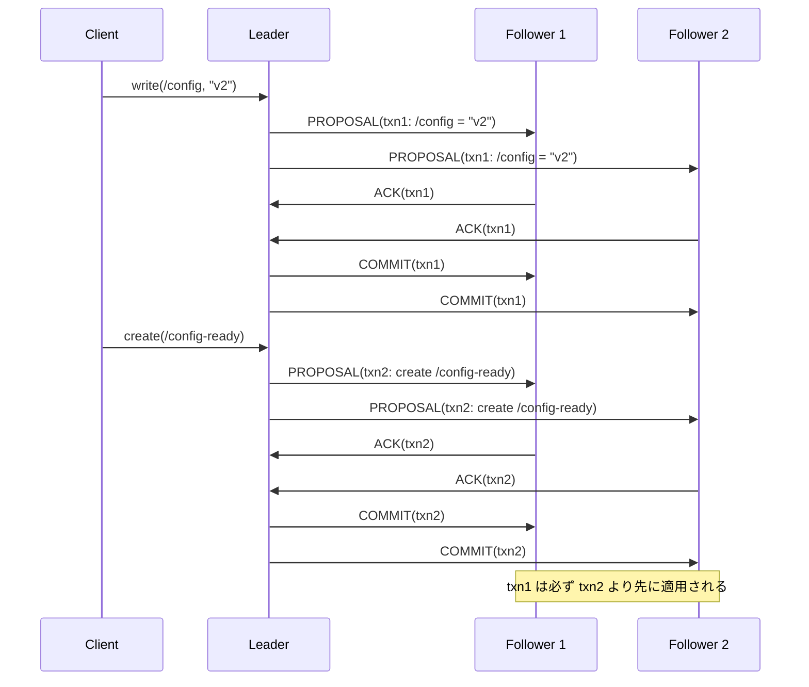
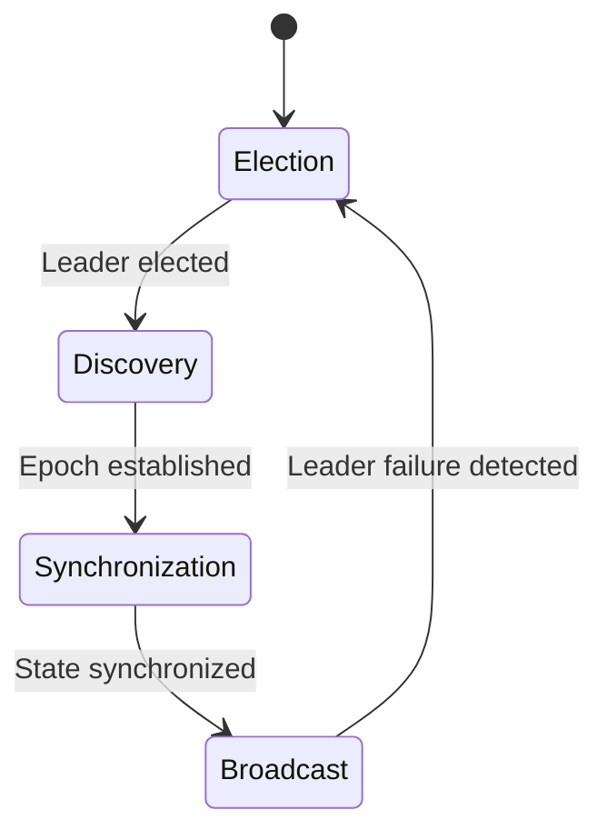
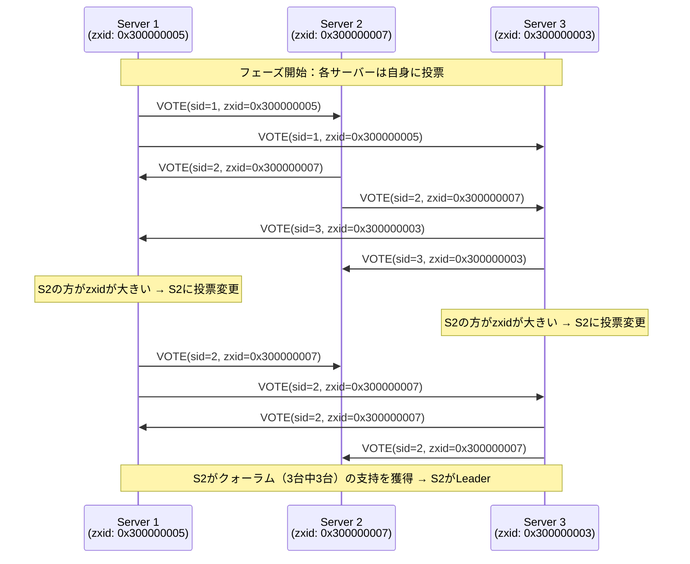
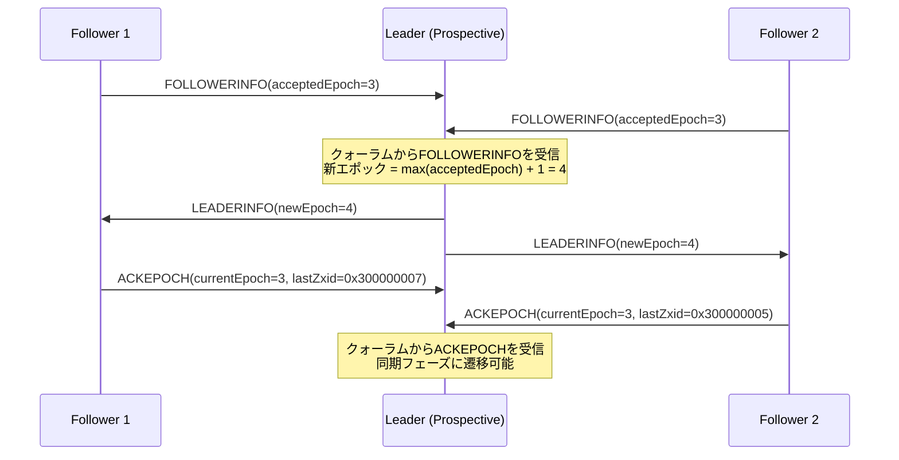
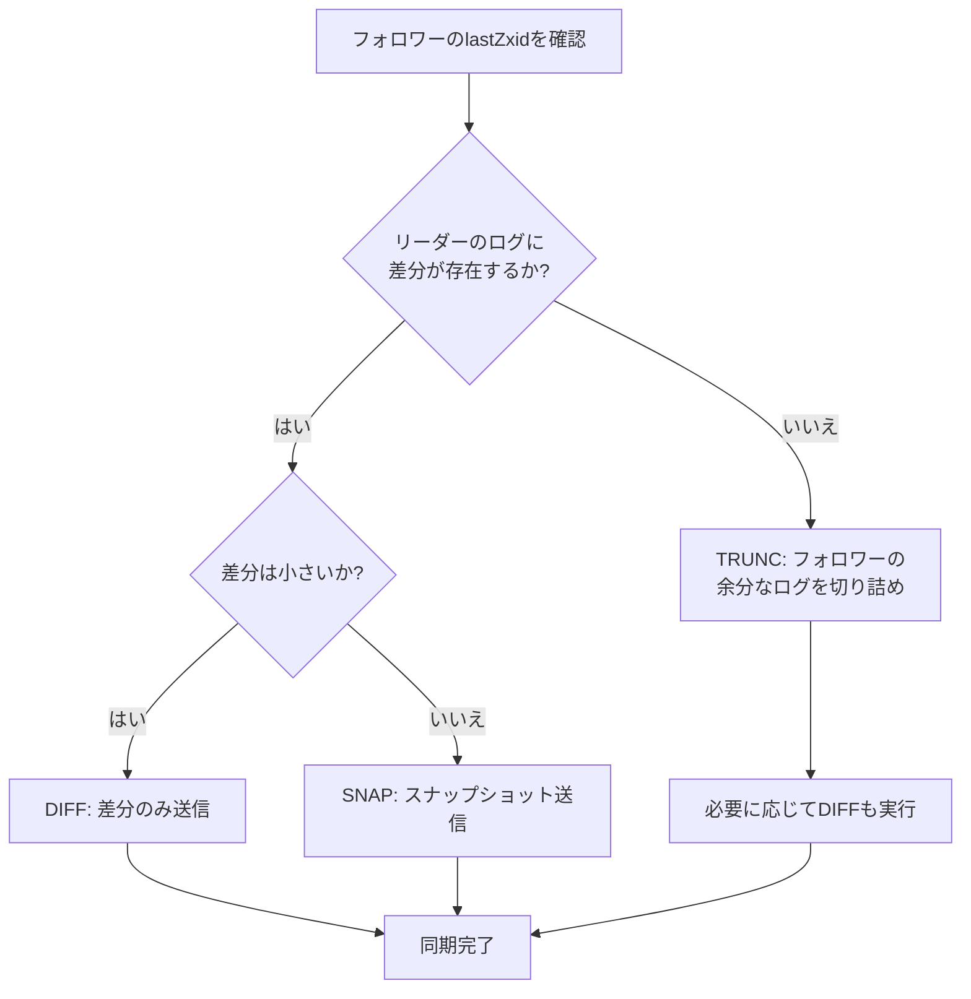
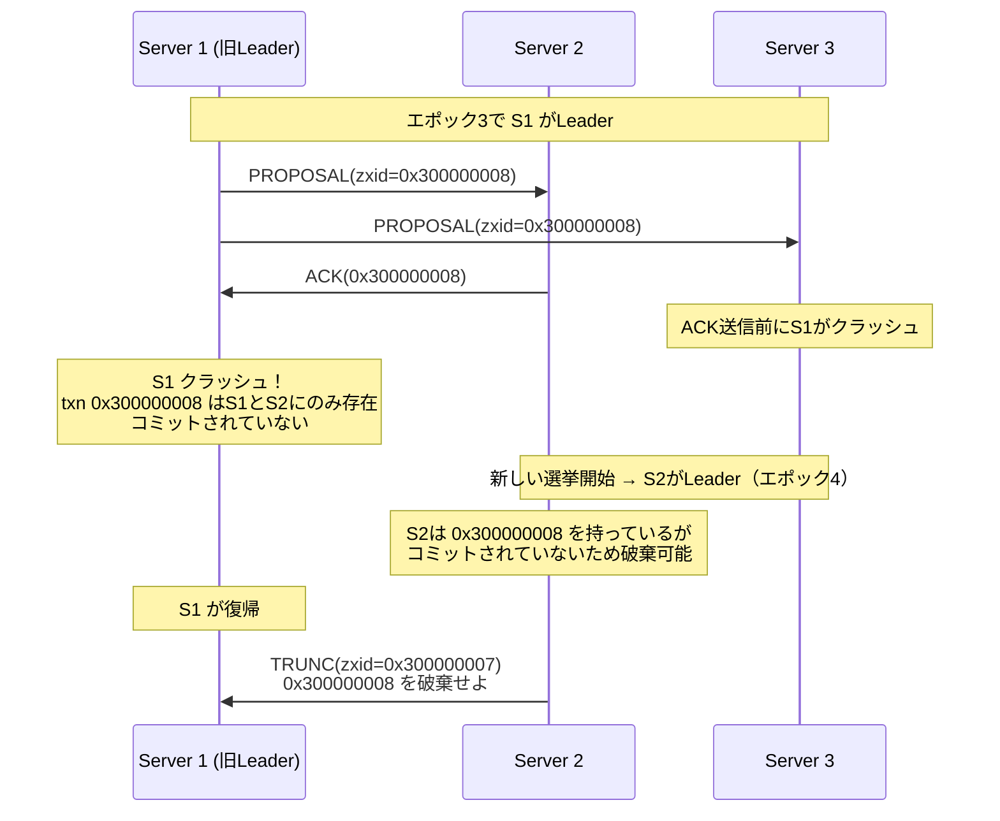
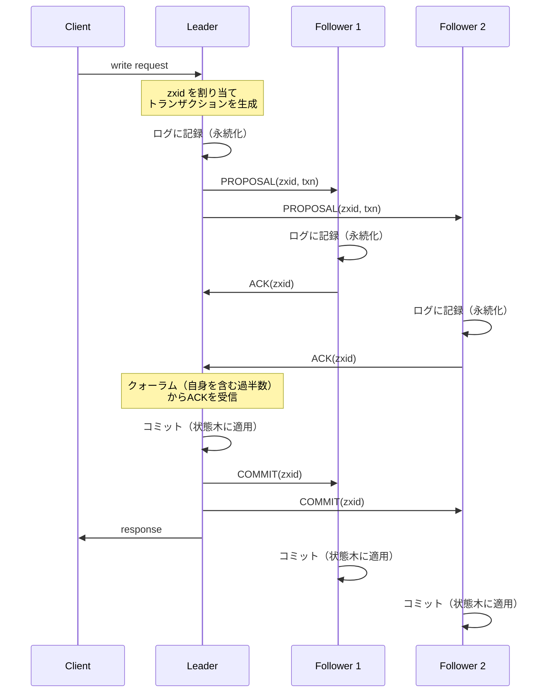
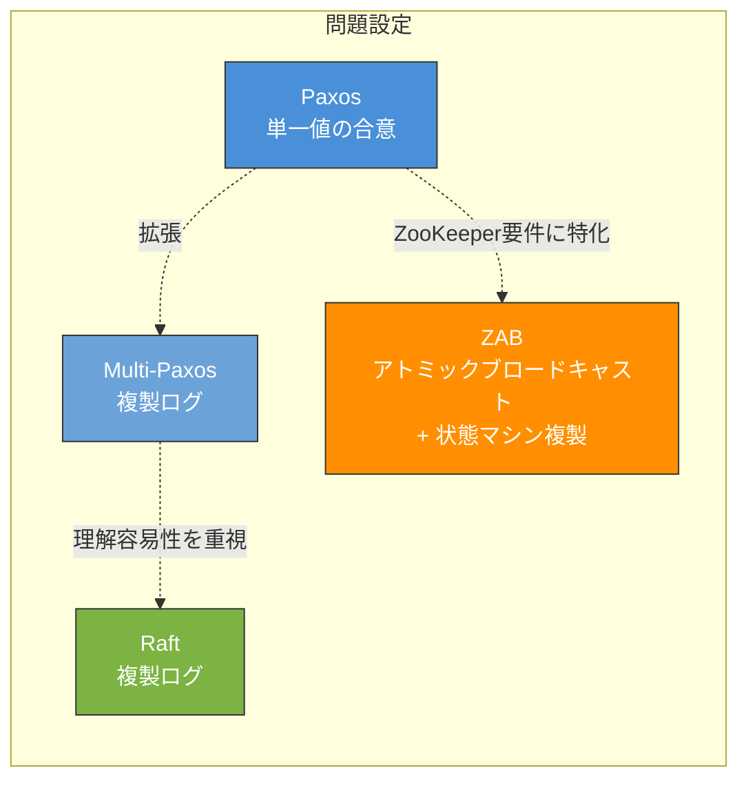
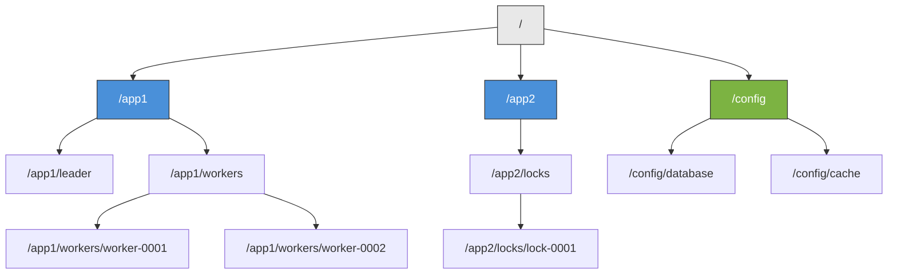
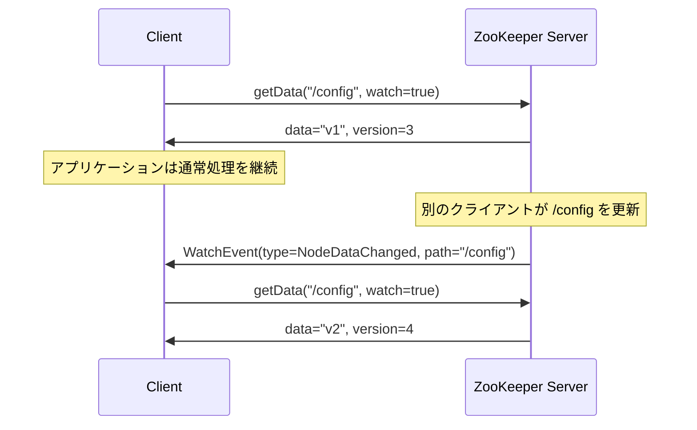

# ZAB（ZooKeeper Atomic Broadcast） — 分散コーディネーションの心臓部

## 1. ZooKeeperの役割と存在意義

### 1.1 分散システムにおけるコーディネーション問題

分散システムを構築する際、個々のサービスのビジネスロジックとは別に、システム全体を正しく協調動作させるための「コーディネーション」が必要となる。具体的には、以下のような問題が繰り返し登場する。

- **構成管理（Configuration Management）**: クラスタ内の全ノードが同じ設定情報を参照する
- **リーダー選出（Leader Election）**: 複数のノードの中からひとつのマスターを決定する
- **分散ロック（Distributed Locking）**: 複数のプロセスが共有リソースへの排他的アクセスを調整する
- **サービスディスカバリ（Service Discovery）**: サービスの所在やヘルスステータスを動的に管理する
- **バリア同期（Barrier Synchronization）**: 複数のプロセスの進行を同期ポイントで揃える

これらの問題は一見すると単純だが、ネットワーク分断、ノード障害、メッセージの遅延や喪失といった分散システム固有の障害モードを考慮すると、正しい実装は極めて困難である。各アプリケーションがこれらのコーディネーション機構を個別に実装することは、バグの温床であり、開発効率を著しく低下させる。

### 1.2 ZooKeeperの設計思想

Apache ZooKeeperは、Yahoo!のリサーチチームによって2006年頃から開発され、2010年にApache Software Foundationのトップレベルプロジェクトとなった分散コーディネーションサービスである。ZooKeeperの核心的な設計思想は、**コーディネーションのプリミティブを提供する**ことにある。

ZooKeeperは特定のコーディネーションパターン（例えばリーダー選出や分散ロック）を直接的なAPIとして提供するのではなく、より低レベルな操作（znodeの作成、削除、読み取り、監視）を提供し、これらを組み合わせることでさまざまなコーディネーションパターンを実現する。この設計は、UNIXの「小さなツールを組み合わせる」哲学に通じるものがある。

ZooKeeperが広く採用された背景には、以下の特性がある。

| 特性 | 内容 |
|------|------|
| **線形化可能な書き込み** | すべての書き込み操作はグローバルに全順序付けされる |
| **FIFO クライアント順序** | 各クライアントからのリクエストは送信順に処理される |
| **高い読み取りスループット** | 読み取りは任意のサーバーからローカルに処理できる |
| **耐障害性** | 過半数のサーバーが稼働していれば動作を継続する |
| **ウォッチ機構** | データの変更をクライアントに非同期的に通知する |

ZooKeeperが提供するこれらの保証を実現するために、その内部で動作しているのが**ZAB（ZooKeeper Atomic Broadcast）** プロトコルである。

## 2. ZABプロトコルの概要

### 2.1 ZABとは何か

ZAB（ZooKeeper Atomic Broadcast）は、ZooKeeperの複製プロトコルとして設計されたアトミックブロードキャストプロトコルである。Flavio JunqueiraとBenjamin Reedらによって設計され、ZooKeeperの内部一貫性を保証する心臓部として機能している。

ZABが解決する根本的な問題は、以下のように要約できる。

> 複数のサーバーからなるアンサンブル（ZooKeeperクラスタ）において、クライアントからの状態変更リクエストを**すべてのサーバーに同じ順序で適用する**ことを、サーバー障害が発生しうる環境下で保証する。

ZABは汎用的なコンセンサスアルゴリズムではなく、ZooKeeperの要件に特化して設計されたプロトコルである。この点がPaxosやRaftとの大きな違いであり、ZABの設計上の意思決定を理解する上で重要な前提となる。

### 2.2 Atomic Broadcastとコンセンサスの関係

ZABが提供する**アトミックブロードキャスト（Atomic Broadcast）** は、トータルオーダーブロードキャスト（Total Order Broadcast）とも呼ばれ、以下の性質を満たすメッセージ配信機構である。

1. **Validity（妥当性）**: 正常なプロセスがブロードキャストしたメッセージは、最終的にすべての正常なプロセスに配信される
2. **Agreement（一致性）**: あるメッセージが正常なプロセスに配信されたならば、すべての正常なプロセスに配信される
3. **Integrity（完全性）**: 各メッセージは高々一度だけ配信され、それは実際にブロードキャストされたものである
4. **Total Order（全順序）**: 2つのメッセージがともに配信される場合、すべてのプロセスにおいて同じ順序で配信される

分散システムの理論において、アトミックブロードキャストとコンセンサスは**等価な問題**であることが知られている（Chandra & Toueg, 1996）。すなわち、一方を解決するアルゴリズムがあれば、他方も解決できる。しかし、両者の問題設定は異なる。コンセンサスは「ひとつの値について合意する」ことを目的とするのに対し、アトミックブロードキャストは「一連のメッセージを全順序で配信する」ことを目的とする。ZABは後者の問題設定に直接的に取り組んでいる。

### 2.3 ZABの保証するプロパティ

ZABプロトコルは、ZooKeeperが必要とする以下のプロパティを保証する。

- **Agreement**: あるトランザクションがいずれかのサーバーに配信されたならば、最終的にすべてのサーバーに配信される
- **Total Order**: トランザクションの配信順序はすべてのサーバーで同一である
- **Causality（因果性）**: トランザクション $a$ がトランザクション $b$ に因果的に先行する場合、$a$ は $b$ よりも先に配信される

特に因果性の保証は、ZooKeeperのクライアントセマンティクスにとって不可欠である。あるクライアントが znode `/config` を更新し、その後 `/config-ready` を作成した場合、全サーバーにおいて `/config` の更新が `/config-ready` の作成よりも先に適用されなければならない。



## 3. ZABの構造：3つのフェーズ

ZABプロトコルは大きく**3つのフェーズ**から構成される。Discovery、Synchronization、Broadcastである。これらのフェーズに先立って、リーダー選出（Leader Election）が行われる。



各フェーズの役割を概観すると以下のようになる。

| フェーズ | 目的 | 主なアクション |
|----------|------|---------------|
| **Election** | 新しいリーダー候補を選出する | 投票の交換、最新のトランザクション履歴を持つノードの特定 |
| **Discovery** | 新しいエポックを確立し、前エポックのコミット済みトランザクションを収集する | FOLLOWERINFO / LEADERINFO の交換 |
| **Synchronization** | フォロワーの状態をリーダーに同期する | 差分または全体のスナップショット転送 |
| **Broadcast** | クライアントリクエストを処理し、全サーバーに複製する | PROPOSAL / ACK / COMMIT |

以降のセクションで、各フェーズの詳細を解説する。

## 4. リーダー選出（Leader Election）

### 4.1 選出の基本原理

ZABのリーダー選出は、クラスタ内で**最も最新のトランザクション履歴を持つノード**をリーダーとして選出することを目標とする。この設計は、リーダー選出後の同期フェーズでのデータ転送量を最小化し、コミット済みトランザクションの喪失を防ぐためである。

ZooKeeperの実装では、リーダー選出アルゴリズムとして**Fast Leader Election（FLE）** が用いられている。FLEは以下の情報を基に投票を行う。

1. **エポック番号（Epoch）**: リーダーの世代を表す番号。大きい方が優先される
2. **zxid（ZooKeeper Transaction ID）**: 最後にコミットされたトランザクションのID。エポックが同じ場合、大きい方が優先される
3. **サーバーID（sid）**: 上記がすべて同じ場合のタイブレーカー。大きい方が優先される

### 4.2 zxidの構造

zxidはZABプロトコルの核心的な概念であり、64ビットの整数で構成される。

```
zxid (64 bits)
├── 上位32ビット: epoch（エポック番号）
└── 下位32ビット: counter（トランザクションカウンタ）
```

エポック番号は新しいリーダーが確立されるたびにインクリメントされ、カウンタは各エポック内でトランザクションが発行されるたびにインクリメントされる。この設計により、zxidの大小比較だけで、トランザクションの因果的な順序関係を判定できる。

例えば、zxid `0x0000000300000005`（エポック3、カウンタ5）は、zxid `0x0000000200000099`（エポック2、カウンタ153）よりも後のトランザクションである。エポックが異なる場合、カウンタの値に関係なくエポックの大きい方が新しい。

### 4.3 Fast Leader Electionのアルゴリズム

Fast Leader Election の動作を以下に示す。



各サーバーは起動時または現在のリーダーとの接続が切れた時に選挙を開始する。初期状態では各サーバーは自分自身に投票し、他のサーバーから受信した投票と自身の投票を比較する。受信した投票の方が「より良い」（エポックが大きい、またはエポックが同じでzxidが大きい、またはすべて同じでsidが大きい）場合、自身の投票をそちらに変更し、更新された投票を全サーバーに再送信する。

あるサーバーの投票がクォーラム（過半数）の支持を得たとき、そのサーバーがリーダーとして選出される。

### 4.4 選出の安全性

Fast Leader Electionが「最も最新の履歴を持つノード」を選出する設計には、重要な安全性上の理由がある。ZABでは、コミット済みのトランザクションが失われないことを保証する必要がある。リーダーが最新の履歴を持つことで、前エポックでコミットされたすべてのトランザクションがリーダーのログに含まれていることが保証される（正確には、クォーラムベースのコミットにより、クォーラムのメンバーのうち少なくとも1台は最新の状態を持っており、その台がリーダーに選出される）。

## 5. Discoveryフェーズ

### 5.1 エポックの確立

Discoveryフェーズは、リーダー選出の直後に開始される。このフェーズの主要な目的は2つある。

1. **新しいエポック番号の確立**: 新しいリーダーが自身の統治期間を表す一意のエポック番号を取得する
2. **前エポックの状態の収集**: フォロワーから前エポックのトランザクション履歴を収集し、コミット済みトランザクションの完全な集合を復元する

### 5.2 プロトコルの詳細

Discoveryフェーズのメッセージ交換は以下のように進行する。



**ステップ1: FOLLOWERINFO**

フォロワーはリーダー候補に対して、自身が最後に受理したエポック番号（`acceptedEpoch`）を含むFOLLOWERINFOメッセージを送信する。

**ステップ2: LEADERINFO**

リーダー候補はクォーラムのフォロワーからFOLLOWERINFOを受信すると、報告されたエポック番号の最大値に1を加えた新しいエポック番号を生成し、LEADERINFOメッセージとしてフォロワーに送信する。

**ステップ3: ACKEPOCH**

フォロワーは新しいエポック番号を受理し、自身の`acceptedEpoch`を更新する。そして、自身の`currentEpoch`と`lastZxid`を含むACKEPOCHメッセージをリーダーに返送する。

### 5.3 エポックの意義

エポック番号の更新は、ZABにおける「フェンシング（Fencing）」の役割を果たす。新しいエポックが確立されると、古いエポックのリーダーは（仮にまだ動作していたとしても）新しいプロポーザルを発行することができなくなる。フォロワーは現在のエポックよりも古いエポックのプロポーザルを拒否するためである。

この仕組みは、ネットワーク分断によって古いリーダーと新しいリーダーが同時に存在する「スプリットブレイン」問題を防止する。古いリーダーがプロポーザルを送信しても、クォーラムのフォロワーは新しいエポックに移行しているため、古いリーダーはクォーラムの承認を得ることができない。

## 6. Synchronizationフェーズ

### 6.1 状態同期の目的

Synchronizationフェーズでは、リーダーがフォロワーの状態を自身の状態と一致させる。Discoveryフェーズで収集した情報に基づき、リーダーは各フォロワーに対してどのトランザクションを送信すべきかを判断する。

### 6.2 同期の方式

リーダーは各フォロワーの`lastZxid`に応じて、以下の同期方式のいずれかを選択する。



**DIFF（差分同期）**

フォロワーのログがリーダーのログの接頭辞になっている場合、リーダーは不足しているトランザクションのみを差分として送信する。これは最も一般的で効率的な同期方式である。

**TRUNC（切り詰め）**

フォロワーが前エポックのリーダーからプロポーザルを受信したが、そのプロポーザルがコミットされる前にリーダーが障害を起こした場合に発生する。新しいリーダーはフォロワーに対して、コミットされなかったトランザクションを破棄するよう指示する。

**SNAP（スナップショット同期）**

フォロワーの状態がリーダーのログ範囲外に遅れている場合（例えば長時間停止していたサーバーが復帰した場合）、リーダーはメモリ内の完全なスナップショットをフォロワーに送信する。

### 6.3 TRUNCが必要になる典型的なシナリオ

TRUNCが必要となるシナリオを具体例で示す。



この例では、旧リーダーS1がプロポーザルをブロードキャストした後、コミットが完了する前にクラッシュしている。新しいリーダーがこのプロポーザルを持っていない場合、S1が復帰した際にこのプロポーザルを破棄（TRUNC）する必要がある。ただし、クォーラムがこのプロポーザルをACKしてリーダーがCOMMITを発行していた場合は、新リーダーのDiscoveryフェーズでこのトランザクションが復元される。

## 7. Broadcastフェーズ

### 7.1 通常運用時のプロトコル

Broadcastフェーズは、ZABの通常運用時のフェーズであり、クライアントからの書き込みリクエストを処理する。このフェーズのプロトコルは、2フェーズコミット（2PC）に類似しているが、重要な違いがある。



### 7.2 2PCとの相違点

ZABのBroadcastフェーズは2PCに似ているが、以下の重要な違いがある。

| 項目 | 2PC | ZABのBroadcast |
|------|-----|----------------|
| **アボートの可能性** | 参加者がアボートを要求できる | フォロワーはプロポーザルを拒否しない（エポックが正しい限り） |
| **合意の閾値** | 全参加者の同意が必要 | クォーラム（過半数）の同意で十分 |
| **ブロッキング性** | コーディネータ障害時にブロッキング | リーダー障害時は新しいリーダーを選出して継続 |
| **順序保証** | トランザクションごとに独立 | FIFO順序を保証 |

特にクォーラムベースのコミットは、ZABの耐障害性の鍵である。全ノードの同意を必要とする2PCとは異なり、少数のサーバーが障害を起こしてもプロトコルが進行を停止しない。

### 7.3 FIFO順序の保証

ZABのBroadcastフェーズでは、リーダーからフォロワーへのメッセージはFIFO順序で配信される。これはTCPコネクションを使用することで実現される。リーダーはプロポーザルを送信した順序でフォロワーに送り、フォロワーもその順序でプロポーザルを受信・処理する。

さらに重要なのは、COMMITメッセージもプロポーザルの順序に従って送信されることである。リーダーは、先行するすべてのプロポーザルがコミットされるまで、後続のプロポーザルをコミットしない。この制約により、全サーバーにおいてトランザクションが同じ順序で適用されることが保証される。

### 7.4 読み取り操作の処理

ZABのBroadcastフェーズにおいて、読み取り操作は特殊な扱いを受ける。読み取りリクエストは、クライアントが接続しているサーバー（リーダーでもフォロワーでもよい）からローカルに処理される。これにより、読み取りのスループットはサーバー数に比例してスケールする。

ただし、この設計にはトレードオフがある。フォロワーから読み取りを行う場合、そのフォロワーがまだ最新のコミットを適用していない可能性があるため、**読み取りは線形化可能（Linearizable）ではない**。ZooKeeperは代わりに、**逐次一貫性（Sequential Consistency）** を読み取りに対して保証する。

最新の状態を読み取る必要がある場合、クライアントは`sync`操作を使用できる。`sync`はリーダーへのリクエストを経由して、呼び出し時点までのすべてのコミットがフォロワーに適用されたことを保証した上で読み取りを行う。

## 8. Paxos・Raftとの比較

### 8.1 問題設定の違い

ZAB、Paxos、Raftは、いずれも分散システムにおける合意問題を扱うが、それぞれ異なる問題設定と設計目標を持っている。



| 観点 | Paxos | Raft | ZAB |
|------|-------|------|-----|
| **問題設定** | 単一値の合意 | 複製ログ | アトミックブロードキャスト |
| **リーダーの必要性** | 基本プロトコルでは不要 | 必須（強いリーダー） | 必須（強いリーダー） |
| **ログの連続性** | ギャップを許容（Multi-Paxos） | ギャップなし | ギャップなし |
| **リーダー選出** | プロトコル外 | プロトコル内で規定 | プロトコル内で規定 |
| **エポック/Term** | Ballot Number | Term | Epoch |
| **設計目標** | 理論的正確性 | 理解容易性 | ZooKeeperの要件充足 |

### 8.2 リーダー選出の比較

Raftのリーダー選出では、任意のサーバーが選挙を開始でき、ランダム化されたタイムアウトによってスプリットボートを回避する。一方、ZABのFast Leader Electionでは、最新のトランザクション履歴を持つサーバーが優先的に選出される。

この違いはリカバリの効率に影響する。ZABでは最新の履歴を持つサーバーがリーダーとなるため、Synchronizationフェーズでのデータ転送量が最小化される。Raftでは、リーダーが必ずしも最新のログを持っているわけではないが、Log Matching Propertyにより安全性は保証される。

### 8.3 コミット済みエントリの扱い

Raftでは、前のTermでコミットされたエントリを新しいリーダーが間接的にコミットする「コミットルール」が存在する。具体的には、Raftのリーダーは前のTermのエントリを直接コミットせず、現在のTermのエントリがコミットされることで、それ以前のエントリもすべてコミットされたとみなす。

ZABでは、Discoveryフェーズで前エポックの状態を明示的に収集し、Synchronizationフェーズで全フォロワーの状態を明示的に同期する。このアプローチはより直接的であり、リカバリ時の動作が明確である。

### 8.4 メンバーシップ変更

Raftはジョイントコンセンサスまたは単一サーバー変更による動的なメンバーシップ変更を規定している。ZABの初期設計ではメンバーシップ変更は静的であり、設定ファイルの変更とクラスタの再起動が必要であった。ZooKeeper 3.5以降では動的な再構成（Dynamic Reconfiguration）がサポートされているが、実装はZABのプロトコルレベルではなくZooKeeperのアプリケーションレベルで行われている。

## 9. ZooKeeperのデータモデル

### 9.1 znodeツリー

ZooKeeperのデータモデルは、ファイルシステムに類似した**階層的な名前空間**で構成される。この名前空間内の各ノードは**znode（ZooKeeper Node）** と呼ばれ、データとACL（Access Control List）を保持する。



znodeはファイルシステムのノードとは異なり、いくつかの重要な特性を持つ。

- **データサイズの制限**: 各znodeは最大1MBのデータを保持できる。ZooKeeperはメタデータや設定情報の管理を目的としており、大量データの格納には適さない
- **ディレクトリとファイルの区別がない**: すべてのznodeがデータを保持でき、同時に子ノードも持てる
- **バージョン管理**: 各znodeはデータバージョン、子ノードバージョン、ACLバージョンを保持する

### 9.2 znodeの種類

ZooKeeperは4種類のznodeをサポートしている。

| 種類 | 永続性 | 連番 | 用途 |
|------|--------|------|------|
| **Persistent** | クライアント切断後も存続 | なし | 構成管理、永続的なメタデータ |
| **Ephemeral** | クライアントセッション終了時に削除 | なし | リーダー選出、ヘルスモニタリング |
| **Persistent Sequential** | クライアント切断後も存続 | あり | 順序付きタスクキュー |
| **Ephemeral Sequential** | クライアントセッション終了時に削除 | あり | 分散ロック、バリア |

**Ephemeral znode**は、ZooKeeperのコーディネーション機能において特に重要な役割を果たす。クライアントがクラッシュしたり、ネットワーク分断によりセッションがタイムアウトした場合、そのクライアントが作成したEphemeral znodeは自動的に削除される。これにより、リーダー選出や分散ロックにおける「デッドロック」を回避できる。

**Sequential znode**は、作成時にznode名の末尾に単調増加する番号が自動的に付与される。例えば、`/locks/lock-` というパスで Sequential znode を作成すると、`/locks/lock-0000000001`、`/locks/lock-0000000002` といった名前が割り当てられる。この特性は公平な分散ロックの実装に不可欠である。

### 9.3 コーディネーションパターンの実装例

**分散ロック**

ZooKeeperを用いた分散ロックの実装は、Ephemeral Sequential znodeを活用する。

```
1. クライアントは /locks/lock- にEphemeral Sequential znodeを作成
   → /locks/lock-0000000023 が作成される

2. /locks/ の子ノード一覧を取得

3. 自身のznodeが最小番号であれば、ロックを獲得

4. そうでなければ、自身の直前の番号のznodeにウォッチを設定し待機

5. ウォッチが発火したら、ステップ2に戻る
```

この「直前のノードのみを監視する」設計は**Herd Effect（群れ効果）の回避**のために重要である。すべてのクライアントがロックの解放を監視すると、ロック解放時にすべてのクライアントが一斉に起動し、大量のリクエストがZooKeeperに殺到する。直前のノードのみを監視することで、通知はO(1)のクライアントにのみ送られる。

**リーダー選出**

```
1. 各候補は /election/candidate- にEphemeral Sequential znodeを作成

2. 最小番号のznodeを作成したプロセスがリーダーとなる

3. 他の候補は自身の直前のznodeにウォッチを設定

4. リーダーがクラッシュするとEphemeral znodeが自動削除される

5. 次に小さい番号のznodeを持つプロセスがウォッチ通知を受け、
   新しいリーダーとなる
```

## 10. ウォッチ機構

### 10.1 ウォッチの基本概念

ZooKeeperの**ウォッチ（Watch）** は、znodeの状態変更をクライアントに非同期的に通知するイベント駆動のメカニズムである。クライアントは読み取り操作（`getData`、`getChildren`、`exists`）にウォッチを設定でき、対象のznodeに変更が発生した際にウォッチイベントが配信される。



### 10.2 ウォッチの特性

ウォッチには以下の重要な特性がある。

**ワンタイムトリガー（One-time Trigger）**

ウォッチは一度発火すると無効になる。継続的に変更を監視するには、ウォッチイベントを受信した後に再度ウォッチを設定する必要がある。この設計は意図的なものであり、以下の理由による。

- サーバー側でのウォッチ管理のオーバーヘッドを抑制する
- クライアントに対して「変更があった」ことを通知するだけで十分であり、「どのように変更されたか」はクライアントが読み取り操作で確認する

::: warning ウォッチの再設定における注意点
ウォッチの発火から再設定までの間に発生した変更は通知されない可能性がある。ただし、ZooKeeperはウォッチイベントの配信順序を保証しており、クライアントがウォッチイベントを受信する前に新しいデータを読み取ることはない。
:::

**順序保証**

ZooKeeperは以下の順序保証を提供する。

- クライアントは、対応するznodeの変更を確認する前にウォッチイベントを受信する
- ウォッチイベントの配信順序は、ZooKeeperサービスが認識する更新の順序と一致する

**軽量設計**

ウォッチイベント自体にはznodeの新しいデータは含まれない。イベントは「何が変わったか」（パスとイベントタイプ）のみを通知する。クライアントは必要に応じて改めて読み取り操作を行い、最新のデータを取得する。

### 10.3 ウォッチイベントの種類

| イベントタイプ | トリガー条件 | 設定可能な操作 |
|---------------|-------------|---------------|
| **NodeCreated** | znodeが作成された | `exists` |
| **NodeDeleted** | znodeが削除された | `exists`, `getData`, `getChildren` |
| **NodeDataChanged** | znodeのデータが変更された | `exists`, `getData` |
| **NodeChildrenChanged** | 子znodeが追加・削除された | `getChildren` |

### 10.4 永続ウォッチ（Persistent Watch）

ZooKeeper 3.6以降では、**永続ウォッチ（Persistent Watch）** と**永続再帰ウォッチ（Persistent Recursive Watch）** がサポートされている。永続ウォッチは発火後も自動的に再設定されるため、従来のワンタイムウォッチにおける「再設定の間の通知漏れ」問題を解決する。

## 11. ZABの正当性

### 11.1 安全性（Safety）

ZABの安全性は、以下の不変条件によって保証される。

**不変条件1: エポックの一意性**

各エポック番号は一意であり、同時に2つのリーダーが同じエポック番号で活動することはない。これはDiscoveryフェーズでクォーラムの承認を得て新しいエポックを確立する手順によって保証される。

**不変条件2: コミット済みトランザクションの永続性**

あるトランザクションがコミットされた場合、そのトランザクションは将来のすべてのリーダーの初期状態に含まれる。この保証は以下の推論による。

1. コミットされたトランザクションは、クォーラム $Q_1$ のサーバーのディスクに永続化されている
2. 新しいリーダーの選出には、クォーラム $Q_2$ の支持が必要である
3. 2つのクォーラムは必ず共通のメンバーを持つ（$Q_1 \cap Q_2 \neq \emptyset$）
4. したがって、新しいリーダー選出に参加するサーバーの中に、コミット済みトランザクションを保持するサーバーが少なくとも1台存在する
5. Fast Leader Electionは最新の履歴を持つサーバーを選出するため、コミット済みトランザクションは失われない

**不変条件3: 全順序の一貫性**

すべてのサーバーにおいて、トランザクションは同じ順序で適用される。これはzxidによる全順序と、FIFO順序でのメッセージ配信によって保証される。

### 11.2 活性（Liveness）

ZABの活性は、以下の条件が満たされる場合に保証される。

- クォーラム（過半数）のサーバーが正常に動作している
- ネットワークが最終的にメッセージを配送する（部分同期モデル）
- リーダー選出が有限時間内に完了する

FLPの不可能性定理により、完全な非同期環境では活性を保証することはできない。ZABは実際には部分同期モデルを前提としており、タイムアウトを用いてリーダー障害を検出し、選挙を開始する。

## 12. 実運用上の注意点

### 12.1 アンサンブルの構成

ZooKeeperクラスタ（アンサンブル）のサーバー数は、奇数にすることが推奨される。これは耐障害性の観点から合理的である。

| サーバー数 | 許容障害数 | 最小クォーラム |
|-----------|-----------|--------------|
| 3 | 1 | 2 |
| 4 | 1 | 3 |
| 5 | 2 | 3 |
| 6 | 2 | 4 |
| 7 | 3 | 4 |

3台構成と4台構成の許容障害数は同じ1台であるため、4台目のサーバーは可用性の向上に寄与しない。むしろ、クォーラムの閾値が上がるため、4台構成は3台構成よりも障害耐性が低い場合がある。一般的には3台または5台の構成が推奨される。

### 12.2 パフォーマンスの考慮事項

**書き込みレイテンシ**

ZABの書き込みパスはリーダーを経由し、クォーラムの承認を必要とするため、書き込みレイテンシはネットワークのラウンドトリップ時間に依存する。地理的に分散したアンサンブルでは、レイテンシが大幅に増加する可能性がある。

**読み取りスケーラビリティ**

読み取りはフォロワーからローカルに処理できるため、サーバー数を増やすことで読み取りスループットを向上させることができる。ただし、サーバー数の増加は書き込みレイテンシの増加を招く（より多くのサーバーの承認が必要になるため）。ZooKeeper 3.6以降では**Observer**ノード（投票に参加しないが読み取りは処理できるノード）が導入されており、書き込み性能を犠牲にすることなく読み取り性能をスケールさせることができる。

::: tip Observerの活用
Observerはクォーラムに参加しないため、追加してもコミットのレイテンシに影響しない。地理的に離れたデータセンターにObserverを配置することで、読み取りレイテンシの改善を図ることができる。
:::

**トランザクションログとスナップショット**

ZooKeeperはトランザクションログとスナップショットをディスクに書き込む。パフォーマンスを最適化するために、以下の運用指針が推奨される。

- トランザクションログは専用のディスク（SSD推奨）に配置する
- トランザクションログとスナップショットは異なるディスクに配置する
- JVMのヒープサイズを適切に設定し、ガベージコレクションの影響を最小化する

### 12.3 セッション管理

ZooKeeperのセッションは、クライアントとサーバー間の論理的な接続を表す。セッションにはタイムアウトが設定されており、タイムアウト時間内にハートビートが送信されなかった場合、セッションは期限切れとなり、そのセッションに関連するすべてのEphemeral znodeが削除される。

セッションタイムアウトの設定は慎重に行う必要がある。

- **短すぎるタイムアウト**: ネットワークの一時的な遅延やGCポーズによってセッションが不必要に期限切れとなり、Ephemeral znodeの削除とウォッチの発火が連鎖的に発生する
- **長すぎるタイムアウト**: 実際にクライアントがクラッシュした場合、Ephemeral znodeの削除まで長時間かかり、リーダー選出や分散ロックの引き継ぎが遅延する

一般的には、セッションタイムアウトを10秒から30秒程度に設定し、アプリケーションの要件に応じて調整することが推奨される。

### 12.4 よくある運用上の問題

**JVMのガベージコレクション**

ZooKeeperはJVM上で動作するため、GCポーズが長くなるとリーダーのハートビートが遅延し、フォロワーがリーダー障害と誤判断して不要な選挙が発生することがある。GCチューニング（G1GCの使用、ヒープサイズの適正化）は運用上の重要な課題である。

**ディスクI/Oのボトルネック**

トランザクションログのfsyncはZABのコミットパスに含まれるため、ディスクI/Oの遅延はそのまま書き込みレイテンシに影響する。他のプロセスとディスクを共有している場合、I/O競合によって予期せぬレイテンシの悪化が発生しうる。

**znodeの肥大化**

ZooKeeperの全データはメモリに保持される。znodeの数やデータサイズが過大になると、メモリ不足やGCの悪化を招く。ZooKeeperは「小さなメタデータの管理」を目的として設計されており、大量データの格納には向かない。

### 12.5 ZooKeeperの代替技術

ZooKeeperは2010年代前半に広く普及したが、近年ではいくつかの代替技術が登場している。

| 技術 | コンセンサスプロトコル | 特徴 |
|------|---------------------|------|
| **etcd** | Raft | Kubernetes のバックエンド。gRPC API。Go実装 |
| **Consul** | Raft | サービスディスカバリに特化。ヘルスチェック内蔵 |
| **Apache Kafka（KRaft）** | Raft | Kafka 3.x以降でZooKeeper依存を排除 |

特にKafkaのKRaftモードは、KafkaがZooKeeperへの依存を完全に排除する取り組みとして注目されている。ZooKeeperという外部依存を削減することで、Kafkaクラスタの運用複雑性が大幅に低減された。

## 13. ZABの歴史的意義と位置づけ

### 13.1 理論と実践の橋渡し

ZABは、Paxosの理論的な基盤の上に、ZooKeeperという実用的なシステムの要件を組み込んで設計されたプロトコルである。Paxosが「単一値の合意」という抽象的な問題を解決するのに対し、ZABは「状態マシン複製のためのアトミックブロードキャスト」という、より具体的で実用的な問題に直接的に取り組んでいる。

ZABの設計で特筆すべきは、リカバリのプロトコルが明示的に規定されている点である。Paxosでは、リーダー選出やリカバリの手順は「実装の詳細」として残されていたが、ZABはDiscoveryフェーズとSynchronizationフェーズにおいてリカバリの手順を完全に規定している。

### 13.2 ZABの学術的貢献

ZABに関する主要な学術論文として、以下がある。

- Junqueira, Flavio P., Benjamin C. Reed, and Marco Serafini. "Zab: High-performance broadcast for primary-backup systems." *DSN 2011*.
- Hunt, Patrick, et al. "ZooKeeper: Wait-free Coordination for Internet-scale Systems." *USENIX ATC 2010*.

これらの論文は、ZABが理論的に正しいことの証明に加え、ZooKeeperの実装における実用的な設計判断を詳細に記述している。

### 13.3 教訓

ZABとZooKeeperの設計から得られる主要な教訓は以下の通りである。

1. **汎用プリミティブの提供**: 特定のコーディネーションパターンをハードコードするのではなく、それらを構築できるプリミティブを提供する設計は、予測できない利用パターンへの適応性を高める
2. **読み取りと書き込みの分離**: 読み取りをフォロワーからローカルに処理する設計は、読み取り主体のワークロードにおいて大きなスケーラビリティを実現するが、一貫性モデルのトレードオフを伴う
3. **障害検出の不完全性**: タイムアウトベースの障害検出は、GCポーズやネットワーク遅延によって偽陽性を生じうる。この偽陽性がシステム全体の安定性に与える影響を設計時に考慮する必要がある
4. **メタデータと本体データの分離**: ZooKeeperは小さなメタデータの管理に特化した設計であり、大量データの格納には向かない。用途を限定することで、メモリ上の全データ保持やウォッチ機構の効率的な実装が可能になった

## まとめ

ZAB（ZooKeeper Atomic Broadcast）は、ZooKeeperの内部でトランザクションの全順序配信と耐障害性を実現するプロトコルである。リーダー選出、Discovery、Synchronization、Broadcastの各フェーズを通じて、障害が発生しうる環境下でも複数のサーバーが一貫した状態を維持することを保証する。

ZABはPaxosの理論的基盤の上に構築されているが、ZooKeeperの要件に特化した設計判断（アトミックブロードキャストへの直接的な取り組み、明示的なリカバリプロトコル、エポックベースのフェンシング）により、実用的な分散コーディネーションサービスの心臓部として機能してきた。

分散システムの進化に伴い、ZooKeeperの代替技術（etcd、Consul、KRaft）が台頭しつつあるが、ZABが示した「コーディネーションのためのアトミックブロードキャスト」という問題設定と、その解法のアプローチは、分散システム設計における重要な参照点であり続けている。
