# ゼロコピーI/O

## 1. 従来のI/Oモデルとコピー回数 — なぜデータは何度もコピーされるのか

### 1.1 問題の本質

サーバーアプリケーションの典型的な処理パターンの一つに、「ディスク上のファイルをネットワーク経由でクライアントに送信する」というものがある。Webサーバーが静的ファイルを配信する場合、データベースがクエリ結果をクライアントに返す場合、ファイルサーバーがダウンロード要求に応答する場合、いずれもこのパターンに該当する。

一見単純なこの処理が、従来のI/Oモデルでは驚くほど非効率に実行されていた。その原因は**データのコピー回数**にある。

### 1.2 従来の read + write パターン

最も素朴なファイル送信の実装は、`read()` でファイルの内容をユーザー空間バッファに読み込み、`write()` でそのバッファの内容をソケットに書き出すというものである。

```c
char buf[BUFSIZE];
int fd = open("file.dat", O_RDONLY);
int sock = socket(AF_INET, SOCK_STREAM, 0);
// ... connect or accept ...

ssize_t n;
while ((n = read(fd, buf, BUFSIZE)) > 0) {
    write(sock, buf, n);  // send data to the network
}
```

このコードは正しく動作するが、裏側では4回ものデータコピーと4回のコンテキストスイッチが発生している。

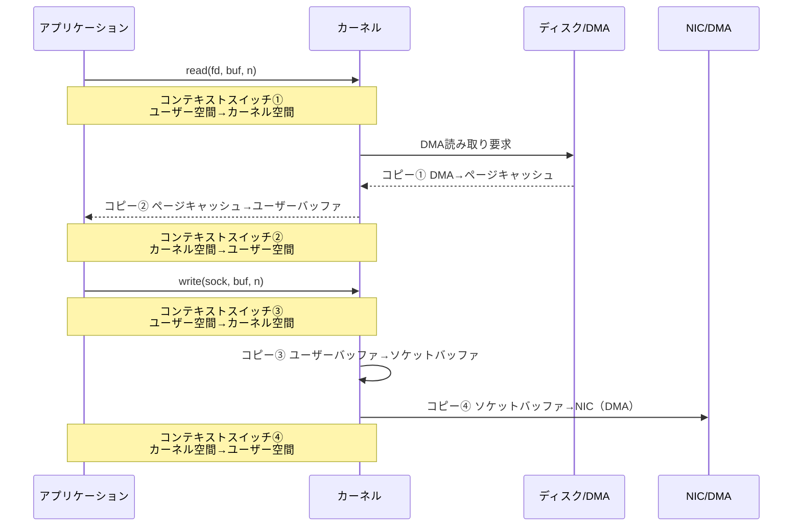

### 1.3 4回のコピーの詳細

各コピーの内容を詳しく見ていこう。

| コピー番号 | 発生元 | 発生先 | 実行主体 | 種別 |
|:---:|:---|:---|:---:|:---:|
| 1 | ディスク | ページキャッシュ | DMA コントローラ | DMA コピー |
| 2 | ページキャッシュ | ユーザーバッファ | CPU | CPU コピー |
| 3 | ユーザーバッファ | ソケットバッファ | CPU | CPU コピー |
| 4 | ソケットバッファ | NIC | DMA コントローラ | DMA コピー |

コピー1とコピー4はDMAコントローラが実行するため、CPU自体はデータ転送に直接関与しない。問題はコピー2とコピー3であり、これらはCPUがバイト列をメモリ上で複製する処理（`memcpy` 相当）として実行される。

大容量ファイルを転送する場合、この2回のCPUコピーがボトルネックとなる。例えば1GBのファイルを送信する場合、本来は不要なCPUコピーだけで合計2GBものメモリ帯域が消費される。さらに、データがCPUのL1/L2キャッシュを汚染し、他のアプリケーション処理のキャッシュヒット率を低下させるという副次的な悪影響もある。

### 1.4 ゼロコピーの定義

**ゼロコピーI/O（Zero-Copy I/O）** とは、CPU によるデータコピーを可能な限り排除し、DMAコントローラやメモリ管理ユニット（MMU）のハードウェア機能を活用してデータ転送を行う手法の総称である。

「ゼロコピー」という名前は理想を表しており、現実にはDMAコピーは依然として必要である。ゼロコピーが排除するのは**CPUが介在するメモリ間コピー**であり、特にユーザー空間とカーネル空間の間のコピーを省略することが最大の目標となる。

```
従来:  ディスク →(DMA)→ ページキャッシュ →(CPU)→ ユーザーバッファ →(CPU)→ ソケットバッファ →(DMA)→ NIC
                             CPU コピー × 2

ゼロコピー:  ディスク →(DMA)→ ページキャッシュ →(DMA)→ NIC
                             CPU コピー × 0
```

ゼロコピーを実現するためにLinuxカーネルは複数のシステムコールとカーネル内メカニズムを提供している。以下のセクションでは、それぞれの手法を詳しく見ていく。

## 2. sendfile — 最初のゼロコピーシステムコール

### 2.1 登場の背景

`sendfile()` は、Linux 2.2（1999年）で導入されたシステムコールである。当時、Apache HTTPサーバーの静的ファイル配信性能を改善する動機から開発が進められた。

`sendfile()` の基本的な発想はシンプルである。「ファイルの内容をソケットに書き出すだけなら、データをユーザー空間に持ち上げる必要はない」という観察に基づき、カーネル空間内でファイルディスクリプタ間のデータ転送を完結させる。

### 2.2 API と基本的な使い方

```c
#include <sys/sendfile.h>

// Transfer data between file descriptors within the kernel
ssize_t sendfile(int out_fd, int in_fd, off_t *offset, size_t count);
```

- `out_fd`: 出力先のファイルディスクリプタ（Linux 2.6.33以降は任意のfd、それ以前はソケットに限定）
- `in_fd`: 入力元のファイルディスクリプタ（`mmap` 可能なファイルに限定）
- `offset`: 入力ファイルの読み取り開始位置（NULLの場合は現在のオフセットを使用）
- `count`: 転送するバイト数

典型的な使用例は以下のとおりである。

```c
#include <sys/sendfile.h>
#include <sys/stat.h>

int fd = open("file.dat", O_RDONLY);
struct stat st;
fstat(fd, &st);

off_t offset = 0;
// Transfer file content directly to socket within kernel space
sendfile(sock, fd, &offset, st.st_size);
```

### 2.3 sendfile のデータフロー

`sendfile()` を使用すると、コピー回数が4回から3回（または2回）に削減される。

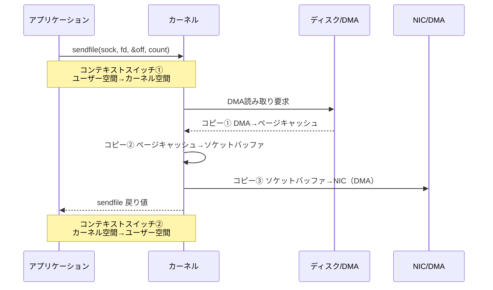

ユーザー空間へのコピーが完全に排除されるため、コンテキストスイッチも4回から2回に半減する。

### 2.4 scatter-gather DMA による更なる最適化

NICがscatter-gather DMAをサポートしている場合（現代のほぼ全てのNICが対応）、カーネルはソケットバッファにデータ本体をコピーせず、ページキャッシュ内のデータへの**参照（ディスクリプタ）** だけをソケットバッファに書き込む。NICのDMAエンジンがページキャッシュから直接データを読み取ってネットワークに送出するため、CPUコピーは実質ゼロとなる。

```
scatter-gather DMA対応の場合:
ディスク →(DMA)→ ページキャッシュ ──参照──→ ソケットバッファ（ディスクリプタのみ）
                                   ↓
                              NIC DMA が直接読み取り

CPU コピー: 0回
DMA コピー: 2回
コンテキストスイッチ: 2回
```

この最適化はLinux 2.4以降で利用可能であり、`/proc/sys/net/ipv4/tcp_sendfile` の設定は不要である（デフォルトで有効）。

### 2.5 sendfile の制約

`sendfile()` は強力な最適化手段だが、いくつかの制約がある。

1. **入力元の制限**: `in_fd` は `mmap` 可能な通常ファイルでなければならない。パイプやソケットは入力元として使用できない
2. **データ変換不可**: カーネル空間内で完結するため、アプリケーションがデータの内容を加工（暗号化、圧縮など）することはできない
3. **Linux固有**: POSIX標準ではなく、移植性に欠ける（ただしFreeBSD、macOSにも類似のAPIがある）
4. **Linux 2.6.33以前の制約**: 出力先がソケットに限定されていた

特に制約2は重要である。TLS暗号化が必要な通信では、データを一度ユーザー空間に読み込んで暗号化する必要があるため、`sendfile()` の恩恵を直接受けられない。ただし、Linux 4.13以降で導入された**kTLS（Kernel TLS）** を使用すると、TLS暗号化をカーネル空間で実行できるため、`sendfile()` との組み合わせが可能になっている。

## 3. splice / tee / vmsplice — パイプベースのゼロコピー

### 3.1 splice の設計思想

`sendfile()` は「ファイル→ソケット」という限定的なユースケースに特化していた。これをより汎用的に拡張したのが、Linux 2.6.17（2006年）で導入された `splice()` ファミリのシステムコールである。

`splice()` の設計者であるJens Axboeは、「データ転送のパイプライン化」という発想を提唱した。カーネル内部のパイプバッファを媒介として、任意のファイルディスクリプタ間でデータを移動させるという汎用的なフレームワークである。

### 3.2 splice の API

```c
#include <fcntl.h>

// Move data between two file descriptors via a pipe
ssize_t splice(int fd_in, off64_t *off_in,
               int fd_out, off64_t *off_out,
               size_t len, unsigned int flags);
```

`splice()` の重要な制約は、**入力元または出力先の少なくとも一方がパイプでなければならない**という点である。この設計上の理由は、パイプのカーネル内バッファが「ページ参照の配列」として実装されているためである。`splice()` はデータそのものをコピーするのではなく、ページへの参照をパイプバッファ内で移動させることで、ゼロコピーを実現する。

主要なフラグは以下のとおりである。

| フラグ | 意味 |
|:---|:---|
| `SPLICE_F_MOVE` | ページの移動を試みる（コピーではなく所有権の移転） |
| `SPLICE_F_NONBLOCK` | ノンブロッキングモードで動作 |
| `SPLICE_F_MORE` | 後続のデータがあることをカーネルに通知（TCP_CORKに類似） |

### 3.3 splice によるファイル→ソケット転送

`splice()` を使ってファイルの内容をソケットに送信するには、パイプを中継する2段階の呼び出しが必要となる。

```c
int pipefd[2];
pipe(pipefd);

int fd = open("file.dat", O_RDONLY);

// Stage 1: move data from file to pipe (zero-copy via page reference)
ssize_t n = splice(fd, NULL, pipefd[1], NULL, BUFSIZE,
                   SPLICE_F_MOVE | SPLICE_F_MORE);

// Stage 2: move data from pipe to socket (zero-copy via page reference)
splice(pipefd[0], NULL, sock, NULL, n,
       SPLICE_F_MOVE | SPLICE_F_MORE);
```


一見すると `sendfile()` より手順が多いが、`splice()` の真価はその汎用性にある。入力元はファイルに限らず、パイプ経由であればソケットからソケットへの転送も可能である。

### 3.4 tee — パイプの分岐

```c
#include <fcntl.h>

// Duplicate data between two pipes without consuming it
ssize_t tee(int fd_in, int fd_out, size_t len, unsigned int flags);
```

`tee()` は、2つのパイプ間でデータを**消費せずに**複製する。UNIXの `tee` コマンドと同様の概念で、データストリームを分岐させる用途に使用する。内部的にはページ参照のカウントをインクリメントするだけであり、データのコピーは発生しない。

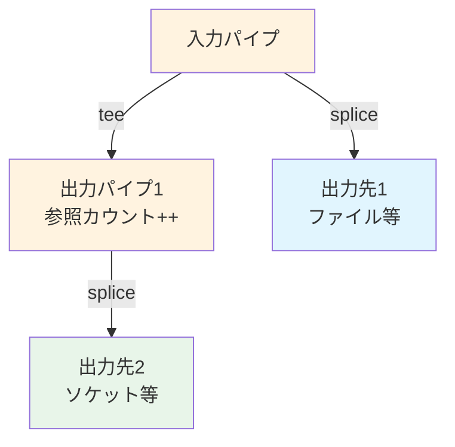

典型的なユースケースは、ネットワークプロキシにおいて受信データをログファイルに記録しつつ、同時に別のソケットに転送するといった場面である。

### 3.5 vmsplice — ユーザー空間メモリとパイプの接続

```c
#include <fcntl.h>

// Map user-space memory into a pipe buffer
ssize_t vmsplice(int fd, const struct iovec *iov,
                 unsigned long nr_segs, unsigned int flags);
```

`vmsplice()` は、ユーザー空間のメモリ領域をパイプバッファにマッピングする。これにより、アプリケーションが構築したデータ（例えばHTTPレスポンスヘッダ）をコピーなしでパイプに流し込み、その後 `splice()` でソケットに転送できる。

ただし、`vmsplice()` には重要な注意点がある。`SPLICE_F_GIFT` フラグを指定しない場合、カーネルはユーザー空間のページを「借りている」だけであり、アプリケーションが該当メモリを書き換えると、パイプ内のデータも変化してしまう。`SPLICE_F_GIFT` を指定すると、ページの所有権がカーネルに移転し、この問題を回避できるが、その代わりアプリケーションは当該ページを使用できなくなる。

### 3.6 splice ファミリの利点と制約

**利点:**

- `sendfile()` より汎用的で、ソケット間転送やパイプ連鎖が可能
- `tee()` との組み合わせにより、データストリームの分岐・複製が効率的
- パイプラインの各段で異なるファイルディスクリプタを使用可能

**制約:**

- パイプを中継する必要があるため、API設計がやや複雑
- パイプバッファのサイズ（デフォルト64KB、`/proc/sys/fs/pipe-max-size` で変更可能）に制約される
- `SPLICE_F_MOVE` は必ずしもページ移動を保証しない（カーネルの判断でコピーにフォールバックする場合がある）

## 4. mmap + write — 仮想メモリを利用した手法

### 4.1 基本的なアプローチ

`sendfile()` や `splice()` とは異なるアプローチとして、`mmap()` を使ってファイルの内容をプロセスの仮想アドレス空間にマッピングし、そのマッピングされた領域を `write()` でソケットに書き出す方法がある。

```c
int fd = open("file.dat", O_RDONLY);
struct stat st;
fstat(fd, &st);

// Map file into process virtual address space
void *addr = mmap(NULL, st.st_size, PROT_READ, MAP_PRIVATE, fd, 0);

// Write mapped region to socket
write(sock, addr, st.st_size);

munmap(addr, st.st_size);
```

### 4.2 mmap + write のデータフロー

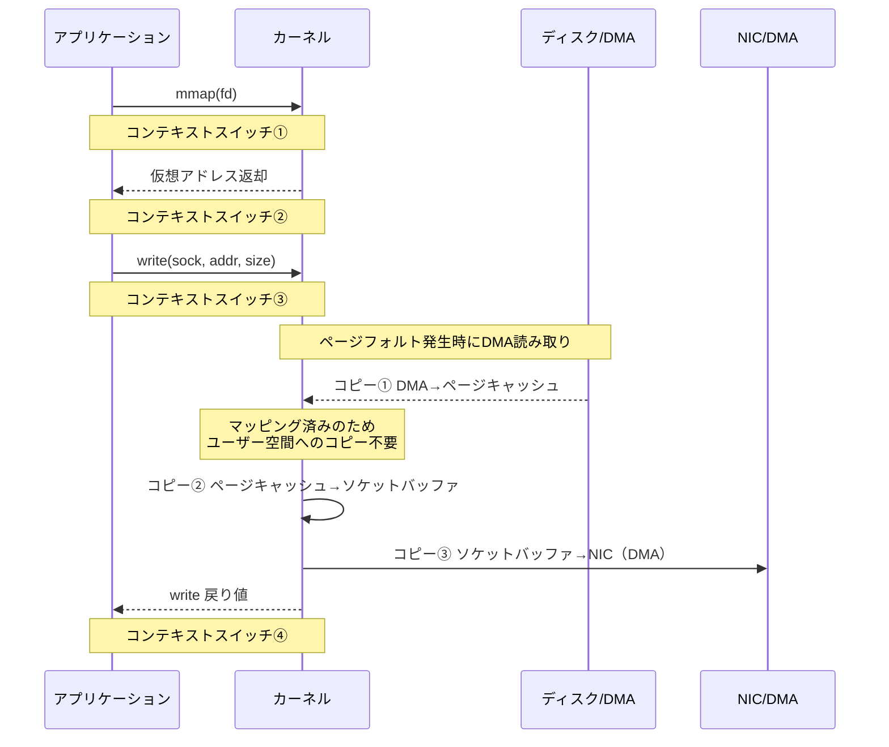

`mmap + write` ではコピー回数は3回（DMA 2回 + CPU 1回）となり、`read + write` の4回より1回少ない。ユーザー空間バッファへのコピーが不要になるためである。ただし、コンテキストスイッチは4回のままであり、`sendfile()` の2回と比較すると多い。

### 4.3 mmap の利点と落とし穴

**利点:**

- ファイルの内容にアプリケーションからアクセスできるため、データの加工・検査が可能
- ページキャッシュとアドレス空間を共有するため、メモリ使用量が効率的
- ランダムアクセスパターンのファイルI/Oに適している

**落とし穴:**

1. **TLBシュートダウン**: `mmap()` と `munmap()` の呼び出しはページテーブルエントリの操作を伴い、マルチプロセッサ環境ではTLBシュートダウン（他のCPUのTLBキャッシュを無効化するIPI割り込み）が発生する。これは大きなオーバーヘッドとなりうる

2. **ページフォルトの発生**: ファイルが初めてアクセスされる場合、ページフォルトが発生してディスクI/Oが走る。`madvise(MADV_SEQUENTIAL)` や `madvise(MADV_WILLNEED)` で先読みを指示できるが、完全には回避できない

3. **大ファイルのフラグメンテーション**: 非常に大きなファイルをマッピングすると、仮想アドレス空間の断片化が進行する。32ビットシステムでは特に深刻だが、64ビットシステムでも無制限ではない

4. **ファイルの切り詰め問題**: 別のプロセスがマッピング中のファイルを切り詰め（truncate）た場合、マッピング領域へのアクセスが `SIGBUS` シグナルを引き起こす。これはセキュリティ上の問題にもなりうる

```c
// Mitigate page fault overhead with madvise
madvise(addr, st.st_size, MADV_SEQUENTIAL);  // hint: sequential access pattern
madvise(addr, st.st_size, MADV_WILLNEED);    // hint: prefetch pages
```

### 4.4 mmap + write と sendfile の比較

| 観点 | mmap + write | sendfile |
|:---|:---|:---|
| CPUコピー回数 | 1回 | 0〜1回 |
| コンテキストスイッチ | 4回 | 2回 |
| データ加工の可否 | 可能 | 不可 |
| ページフォルト | あり | なし（カーネルが管理） |
| TLBオーバーヘッド | あり | なし |
| 適用場面 | データの読み取り＋部分加工 | 単純なファイル配信 |

純粋なファイル配信では `sendfile()` が優れており、`mmap + write` はデータを読み取りつつ一部加工が必要な場面で選択肢となる。

## 5. io_uring のゼロコピー — 次世代の非同期I/O

### 5.1 io_uring の概要

`io_uring` はLinux 5.1（2019年）で導入された非同期I/Oフレームワークであり、Jens Axboe（`splice()` の設計者でもある）によって開発された。従来の `aio` インターフェースの欠点を克服し、高性能な非同期I/Oを実現する。

`io_uring` の核心的な設計は、カーネルとユーザー空間の間に**2つのリングバッファ**（Submission Queue: SQ、Completion Queue: CQ）を共有メモリとして配置することにある。これにより、I/O要求の発行と完了通知のためのシステムコールを大幅に削減できる。

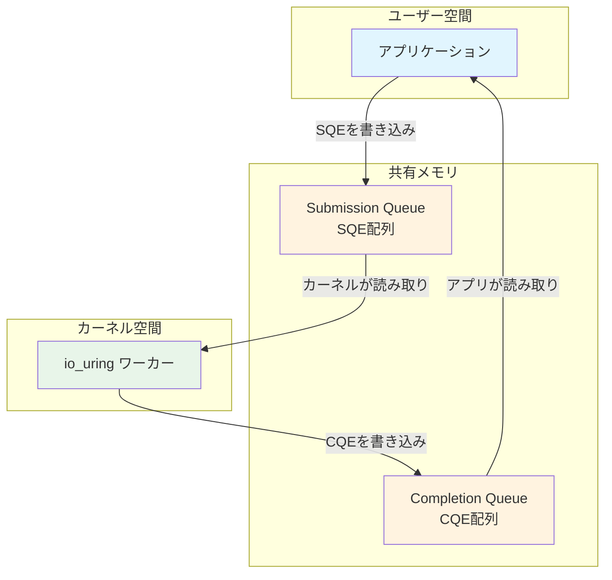

### 5.2 io_uring におけるゼロコピー送信

Linux 6.0（2022年）で、`io_uring` にゼロコピー送信（zero-copy transmit）のサポートが追加された。これは `IORING_OP_SEND_ZC` オペレーションとして提供される。

従来の `sendfile()` や `splice()` と異なり、`io_uring` のゼロコピー送信は**ユーザー空間のバッファから直接NICへデータを送信**できる。つまり、アプリケーションが構築したデータ（例えばHTTPレスポンス）をカーネルバッファにコピーすることなく、NICのDMAエンジンに直接転送させることが可能となる。

```c
#include <liburing.h>

struct io_uring ring;
io_uring_queue_init(32, &ring, 0);

// Prepare zero-copy send operation
struct io_uring_sqe *sqe = io_uring_get_sqe(&ring);
io_uring_prep_send_zc(sqe, sock, buf, len, 0, 0);
sqe->user_data = 1;

// Submit and wait for completion
io_uring_submit(&ring);

struct io_uring_cqe *cqe;
io_uring_wait_cqe(&ring, &cqe);

// Check for IORING_CQE_F_NOTIF flag: buffer is safe to reuse
if (cqe->flags & IORING_CQE_F_MORE) {
    // Wait for notification CQE indicating DMA completion
    io_uring_cqe_seen(&ring, cqe);
    io_uring_wait_cqe(&ring, &cqe);
}
io_uring_cqe_seen(&ring, cqe);
```

### 5.3 io_uring ゼロコピーのデータフロー

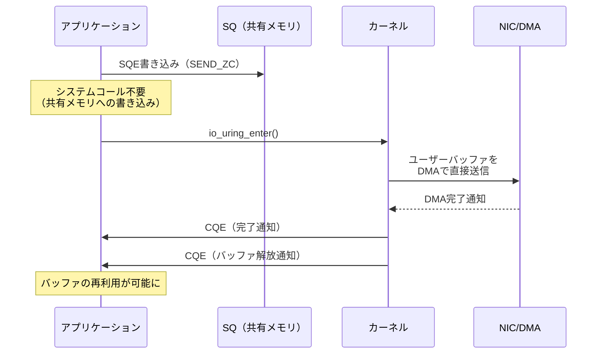

ここでの重要なポイントは**バッファのライフサイクル管理**である。ゼロコピー送信では、NICのDMAエンジンがユーザー空間のバッファを直接読み取る。DMAが完了するまでアプリケーションはバッファの内容を変更してはならない。`io_uring` はこの同期を2段階のCQE通知で管理する。

1. **最初のCQE**: 送信処理が受理されたことを通知（`IORING_CQE_F_MORE` フラグ付き）
2. **2番目のCQE（通知CQE）**: DMAが完了し、バッファの再利用が安全になったことを通知

### 5.4 io_uring の固定バッファ（Registered Buffers）

`io_uring` のゼロコピー性能をさらに引き出す機能として、**固定バッファ（Registered Buffers）** がある。

```c
// Register buffers with the kernel to avoid repeated page pinning
struct iovec iovs[2] = {
    { .iov_base = buf1, .iov_len = BUF_SIZE },
    { .iov_base = buf2, .iov_len = BUF_SIZE },
};
io_uring_register_buffers(&ring, iovs, 2);

// Use registered buffer index for zero-copy operations
struct io_uring_sqe *sqe = io_uring_get_sqe(&ring);
io_uring_prep_send_zc_fixed(sqe, sock, buf1, len, 0, 0, 0 /* buf_index */);
```

通常のゼロコピー送信では、カーネルは毎回ユーザーページを**ピン留め（pin）** してDMA転送が完了するまで物理メモリ上に固定する。固定バッファを使用すると、バッファの登録時に一度だけピン留めを行い、以降のI/O操作では繰り返しのピン留め/解除を省略できる。高頻度のI/O処理ではこの差が顕著に表れる。

### 5.5 io_uring によるゼロコピー受信

Linux 6.7（2024年）では、ゼロコピー受信（`IORING_OP_RECV_ZC`）のサポートも段階的に進められている。受信側のゼロコピーは送信側より技術的に複雑である。送信側ではアプリケーションがバッファの位置を決められるが、受信側ではNICがDMAでデータを書き込む先を事前に決定する必要があるためである。

現在の実装では、NICのハードウェア機能（header/data split やXDP）との連携により、ゼロコピー受信が実現されている。ただし、対応するNICドライバが限られているため、本番環境での採用にはハードウェアの確認が必要である。

## 6. DMAとページキャッシュ — ゼロコピーの基盤技術

### 6.1 DMA（Direct Memory Access）の役割

ゼロコピーI/Oの理解には、DMAの仕組みを正確に把握する必要がある。

DMAコントローラは、CPUの介在なしにデバイス（ディスクコントローラ、NICなど）と主記憶（RAM）の間でデータを転送するハードウェアコンポーネントである。CPUはDMAコントローラに転送の開始を指示するだけで、実際のデータ移動はDMAコントローラが独立して実行する。

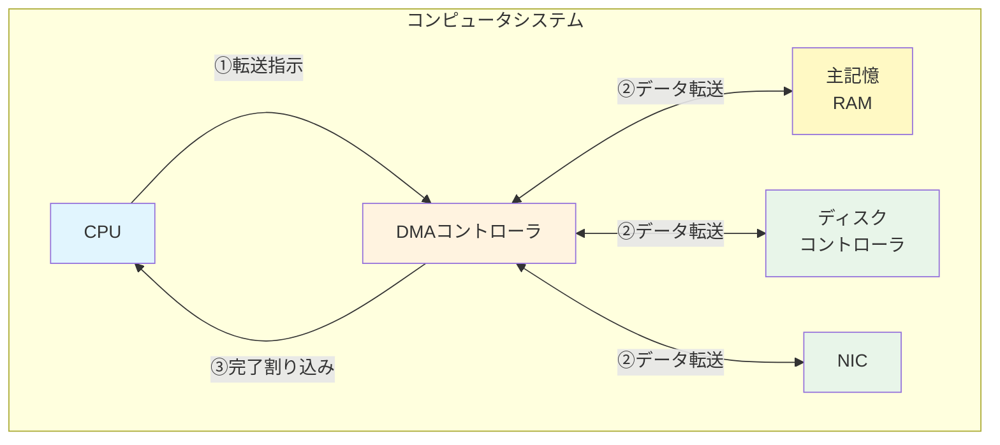

DMAの動作手順は以下のとおりである。

1. CPUがDMAコントローラにソースアドレス、デスティネーションアドレス、転送サイズを設定
2. DMAコントローラがバスを占有してデータを転送（CPUは他の処理を実行可能）
3. 転送完了後、DMAコントローラがCPUに割り込み（IRQ）を発生させて通知

### 6.2 scatter-gather DMA

現代のDMAコントローラは**scatter-gather（SG）** 機能をサポートしている。これは、物理メモリ上で不連続な複数の領域を、1回のDMA操作でまとめて転送する機能である。

```
scatter-gather DMAの転送リスト:
+-------------------+
| Entry 1           |
| Addr: 0x1000_0000 |
| Size: 4096        |
+-------------------+
| Entry 2           |
| Addr: 0x2000_0000 |
| Size: 4096        |
+-------------------+
| Entry 3           |
| Addr: 0x5000_0000 |
| Size: 8192        |
+-------------------+
```

ゼロコピーI/Oにおいて、scatter-gather DMAは決定的な役割を果たす。`sendfile()` がソケットバッファにデータ本体ではなくページ参照だけを書き込む最適化は、NICのscatter-gather DMA機能に依存している。NICのDMAエンジンは、ソケットバッファ内のディスクリプタが指す複数のページキャッシュ領域から直接データを収集（gather）して、ネットワークパケットとして送出する。

### 6.3 ページキャッシュの構造

Linuxのページキャッシュは、ディスクI/Oの性能を向上させるために、最近アクセスされたディスクブロックの内容をRAM上にキャッシュする仕組みである。ゼロコピーI/Oとの関係で重要なのは以下の点である。

**ページキャッシュはゼロコピーの中継点である。** ファイルの読み取り時、データはまずDMAによってページキャッシュに格納される。ゼロコピー手法では、このページキャッシュから直接NICへデータが転送されるため、ページキャッシュの存在がゼロコピーの前提条件となっている。

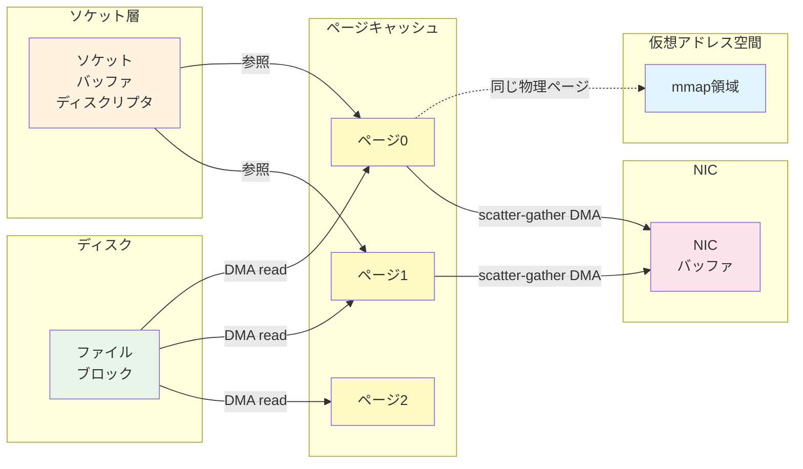

### 6.4 ページピン留めとIOMMU

ゼロコピー送信では、DMAが完了するまで対象のメモリページが物理メモリ上に存在し続けることを保証する必要がある。これが**ページピン留め（page pinning）** である。

カーネルは `get_user_pages()` 関数を使ってユーザー空間のページをピン留めする。ピン留めされたページはスワップアウトの対象から除外され、物理アドレスが変更されないことが保証される。

ただし、ページピン留めにはコストがある。

- ページの参照カウントの操作（アトミック操作が必要）
- ピン留め中はメモリ回収の対象外となるため、メモリ圧迫の原因になりうる
- 大量のページをピン留めすると、OOM Killerが発動するリスクがある

**IOMMU（Input/Output Memory Management Unit）** は、デバイスが使用するアドレス（I/O仮想アドレス）を物理アドレスに変換するハードウェアユニットである。IOMMUを使用することで、DMAのアドレス空間を制御し、デバイスが不正なメモリ領域にアクセスすることを防止できる。ゼロコピーI/Oのセキュリティと安定性の観点から、IOMMUは重要な役割を果たしている。

### 6.5 Direct I/O とゼロコピーの関係

通常のファイルI/Oはページキャッシュを経由するが、`O_DIRECT` フラグを使用すると、ページキャッシュをバイパスしてディスクとユーザー空間の間で直接DMA転送を行うことができる。

```c
// Bypass page cache — DMA directly to/from user buffer
int fd = open("file.dat", O_RDONLY | O_DIRECT);

// Buffer must be aligned to filesystem block size
void *buf;
posix_memalign(&buf, 4096, BUFSIZE);
read(fd, buf, BUFSIZE);
```

Direct I/Oは以下の場面で有用である。

- データベースエンジンが独自のバッファプール管理を行う場合（ページキャッシュとの二重キャッシュを避ける）
- 巨大なファイルの逐次読み取りで、ページキャッシュの汚染を防ぎたい場合

ただし、Direct I/Oと `sendfile()` の組み合わせは通常意味をなさない。`sendfile()` はページキャッシュを前提としており、`O_DIRECT` で開かれたファイルに対して `sendfile()` を呼び出すと、カーネルはページキャッシュを経由する通常パスにフォールバックする場合が多い。

## 7. 各手法の比較

### 7.1 性能特性の比較表

| 手法 | CPUコピー | DMAコピー | コンテキスト<br/>スイッチ | システムコール | データ加工 | カーネル要件 |
|:---|:---:|:---:|:---:|:---:|:---:|:---|
| read + write | 2 | 2 | 4 | 2 | 可能 | 任意 |
| mmap + write | 1 | 2 | 4 | 3+ | 可能 | 任意 |
| sendfile | 0〜1 | 2 | 2 | 1 | 不可 | Linux 2.2+ |
| splice（2段） | 0〜1 | 2 | 2〜4 | 2 | 不可 | Linux 2.6.17+ |
| io_uring SEND_ZC | 0 | 1〜2 | 0〜1 | 0〜1 | 条件付き | Linux 6.0+ |

::: tip io_uring のシステムコール回数
io_uring はSQポーリングモード（`IORING_SETUP_SQPOLL`）を使用すると、カーネルスレッドがSQを常時監視するため、`io_uring_enter()` の呼び出しすら不要になる。この場合、システムコール回数は0となる。
:::

### 7.2 レイテンシとスループットの傾向

各手法の性能傾向を定性的にまとめる。

**小さなファイル（〜数KB）:**

小さなファイルでは、データコピーのコスト自体が小さいため、システムコールのオーバーヘッドやセットアップコストの影響が相対的に大きくなる。`sendfile()` は1回のシステムコールで完結するため有利だが、`io_uring` の固定バッファを用いた場合はさらに低レイテンシとなる。ただし、小さなファイルでは `read + write` との差が数マイクロ秒程度にとどまることも多い。

**中規模ファイル（数KB〜数MB）:**

この範囲ではゼロコピーの効果が顕著に表れる。CPUコピーの削減が直接スループットの向上につながり、`sendfile()` で20〜50%の性能向上が得られるケースが報告されている。

**大きなファイル（数十MB〜）:**

大きなファイルでは、CPUコピーの削減による帯域幅の節約が支配的な要因となる。また、CPUキャッシュの汚染が回避されることで、同時に実行される他の処理にも好影響を与える。`sendfile()` や `io_uring` のゼロコピーが最も効果を発揮する領域である。

### 7.3 CPU使用率への影響

ゼロコピーI/Oの最大の恩恵は、スループットの向上よりも**CPU使用率の削減**にある場合が多い。従来の `read + write` ではCPUがデータコピーに時間を費やすが、ゼロコピーではDMAコントローラがデータ転送を担うため、CPUは他のアプリケーション処理に集中できる。

これは特に、マルチクライアントのサーバーアプリケーションにおいて重要な意味を持つ。CPUサイクルが解放されることで、より多くの同時接続を処理できるようになり、結果としてサーバーの全体的なスループットが向上する。

```
CPU使用率の比較イメージ（1GB転送、10Gbps NIC）:

read + write:
  CPU: ████████████████████░░░░░  80% (コピーに大半を消費)
  DMA: ████░░░░░░░░░░░░░░░░░░░░  16%

sendfile (SG-DMA):
  CPU: ████░░░░░░░░░░░░░░░░░░░░  15% (メタデータ処理のみ)
  DMA: ████████░░░░░░░░░░░░░░░░  32%

io_uring SEND_ZC:
  CPU: ██░░░░░░░░░░░░░░░░░░░░░░   8% (カーネル遷移も削減)
  DMA: ████████░░░░░░░░░░░░░░░░  32%
```

## 8. Webサーバーでの適用

### 8.1 Nginx における sendfile

Nginxは静的ファイル配信において `sendfile()` を積極的に活用するWebサーバーの代表例である。

```nginx
http {
    sendfile on;            # Enable sendfile for static file serving
    tcp_nopush on;          # Combine headers and data in single TCP segment
    tcp_nodelay on;         # Disable Nagle algorithm after tcp_nopush flush
}
```

`sendfile on` を指定すると、Nginxは静的ファイルの配信時に `read + write` の代わりに `sendfile()` を使用する。さらに `tcp_nopush on`（Linux では `TCP_CORK` ソケットオプションに対応）と組み合わせることで、HTTPレスポンスヘッダとファイルデータを単一のTCPセグメントにまとめて送信し、パケット数を削減できる。

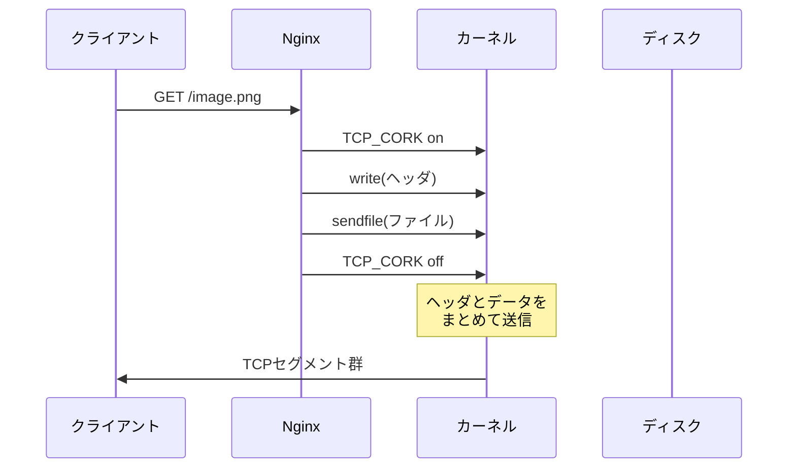

### 8.2 Apache HTTP Server の対応

Apache HTTP ServerもLinux上では `sendfile()` をサポートしている。`EnableSendfile on` ディレクティブで有効化できるが、ネットワークファイルシステム（NFS、SMBなど）上のファイルでは問題が生じる場合があるため、デフォルトでは無効になっている環境もある。

これは、ネットワークファイルシステムではカーネルのページキャッシュとリモートファイルの整合性が保証されない場合があるためである。`sendfile()` はページキャッシュの内容を信頼して送信するため、ページキャッシュが古い（stale）データを保持していると、クライアントに古いファイルが配信されてしまう。

### 8.3 HAProxy における splice

HAProxy（リバースプロキシ/ロードバランサ）は、`splice()` を使ったゼロコピーのTCPプロキシを実装している。L4（TCP）プロキシモードにおいて、クライアントからのデータをバックエンドサーバーに転送する際、`splice()` を使ってユーザー空間を経由せずにソケット間でデータを移動させる。

```
HAProxy の splice 利用パターン:

クライアント                         バックエンド
ソケット  ──splice──→ パイプ ──splice──→ ソケット
          (recv側)            (send側)
```

この手法により、L4プロキシのスループットが大幅に向上する。HAProxyの設定では `no-splice` オプションで無効化することも可能であるが、通常は有効のまま運用される。

ただし、L7（HTTP）プロキシモードでは、HAProxyがHTTPヘッダを解析・書き換える必要があるため、データをユーザー空間に読み込む必要があり、`splice()` の恩恵は限定的となる。

### 8.4 Kafka における sendfile

Apache Kafkaは、メッセージブローカーとして大量のデータを高スループットで配信するシステムである。Kafkaのブローカーは、コンシューマーへのメッセージ配信時に `sendfile()` を使用してゼロコピー転送を行う。

Kafkaの設計では、メッセージはディスク上にログファイルとして順序的に書き込まれる。コンシューマーがメッセージを要求すると、ブローカーはログファイルの該当部分を `sendfile()` でソケットに直接転送する。メッセージのシリアライゼーション形式がプロデューサー、ブローカー、コンシューマーで共通であるため、ブローカーはメッセージの内容をデシリアライズ/再シリアライズする必要がなく、ゼロコピーが適用可能となっている。

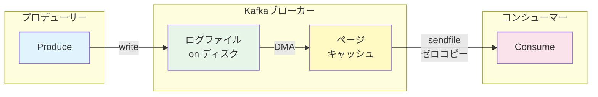

この設計はKafkaの高スループットの重要な要因の一つであり、LinkedInの実測では `sendfile()` の採用によりCPU使用率が約65%削減されたと報告されている。

### 8.5 kTLS と sendfile の組み合わせ

前述のとおり、TLS暗号化が必要な通信では従来 `sendfile()` を利用できなかった。しかし、Linux 4.13以降の**kTLS（Kernel TLS）** により状況が変わった。

kTLSは、TLSの対称暗号化処理（レコード層）をカーネル空間で実行する機能である。TLSハンドシェイクはユーザー空間のTLSライブラリ（OpenSSLなど）が担当するが、ハンドシェイク完了後のデータ暗号化/復号化はカーネルのkTLSモジュールが行う。

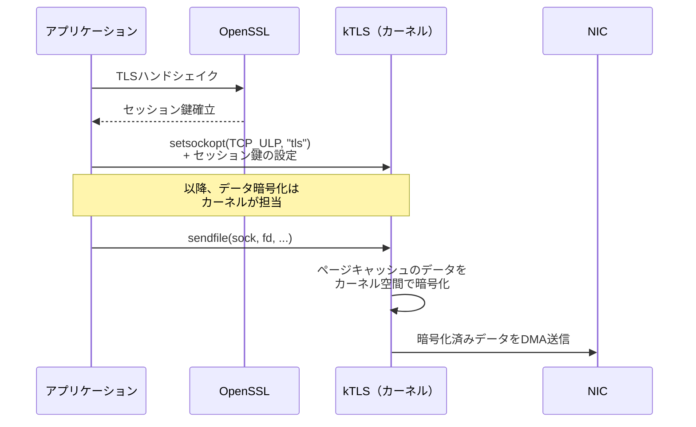

NginxはkTLSをサポートしており、TLS接続においても `sendfile()` を活用できる。OpenSSL 3.0以降とLinux 5.2以降の組み合わせで、kTLSのハードウェアオフロード（NICが暗号化を実行）も利用可能になっている。

## 9. 実務での選定指針

### 9.1 判断フローチャート

ゼロコピーI/O手法の選定は、アプリケーションの特性と要件に依存する。以下のフローチャートを参考にされたい。

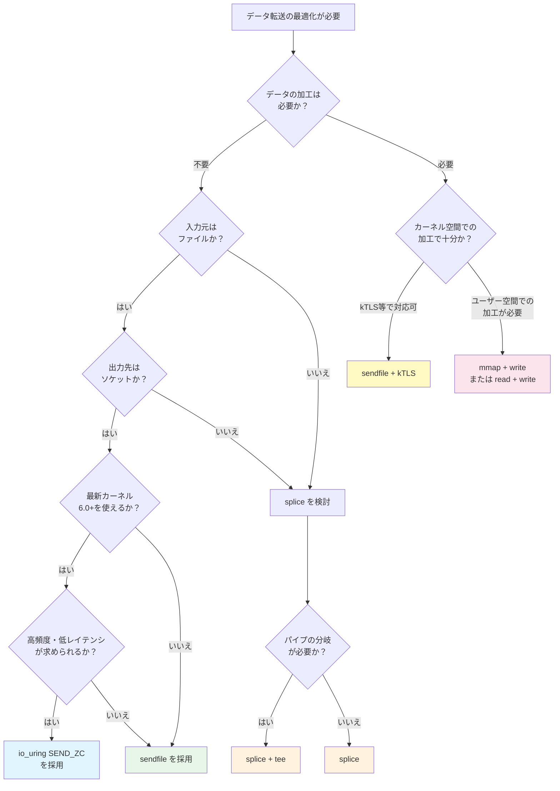

### 9.2 ユースケース別の推奨

**ユースケース1: 静的ファイル配信（Webサーバー）**

- **推奨**: `sendfile()`
- **理由**: 最もシンプルで成熟した手法。Nginx、Apacheなどの主要Webサーバーで広く採用されており、実績が豊富。カーネル2.2以降で利用可能であり、互換性の心配がない
- **TLS環境**: kTLS対応のカーネルとTLSライブラリを使用可能であれば、`sendfile() + kTLS` が最適

**ユースケース2: L4リバースプロキシ**

- **推奨**: `splice()`
- **理由**: ソケット→ソケットの転送に対応。HAProxyの実装実績があり、信頼性が高い

**ユースケース3: メッセージブローカー**

- **推奨**: `sendfile()`（Kafkaモデル）
- **理由**: ディスク上のログファイルからコンシューマーへの配信パターンに最適。メッセージ形式を統一することで、ブローカーでのデシリアライズを回避し、ゼロコピーの恩恵を最大化

**ユースケース4: 高性能ネットワークアプリケーション**

- **推奨**: `io_uring` のゼロコピー送信
- **理由**: システムコールのオーバーヘッドも含めて最小化できる。固定バッファの事前登録により、ページピン留めのコストも償却可能。ただし、Linux 6.0以降が必要であり、APIの複雑さも考慮が必要

**ユースケース5: データ処理パイプライン（ストリームの分岐・結合）**

- **推奨**: `splice() + tee()`
- **理由**: データストリームをコピーなしで分岐・結合できる。ログ記録と転送の同時実行など、データの多重配信パターンに適している

### 9.3 導入時の注意点

ゼロコピーI/Oを導入する際に留意すべき実務的な事項を整理する。

**1. 計測を先に行う**

ゼロコピーが常に最適解とは限らない。小さなデータの転送では、セットアップコストがデータコピーのコストを上回る場合がある。必ず実際のワークロードでベンチマークを取り、効果を確認してから導入すべきである。

```c
// Simple benchmark skeleton
struct timespec start, end;
clock_gettime(CLOCK_MONOTONIC, &start);

// Method under test: sendfile, splice, read+write, etc.
for (int i = 0; i < iterations; i++) {
    // ... transfer operation ...
}

clock_gettime(CLOCK_MONOTONIC, &end);
double elapsed = (end.tv_sec - start.tv_sec) +
                 (end.tv_nsec - start.tv_nsec) / 1e9;
printf("Throughput: %.2f MB/s\n", (total_bytes / 1e6) / elapsed);
```

**2. エラーハンドリング**

ゼロコピー系のシステムコールは、予期しない状況でフォールバックする場合がある。例えば、`sendfile()` はファイルシステムが `splice_read` オペレーションをサポートしていない場合に `EINVAL` を返すことがある。プロダクションコードでは、ゼロコピーが失敗した場合に従来の `read + write` にフォールバックする実装が望ましい。

```c
ssize_t n = sendfile(sock, fd, &offset, count);
if (n < 0 && (errno == EINVAL || errno == ENOSYS)) {
    // Fallback to traditional read+write
    fallback_read_write(sock, fd, offset, count);
}
```

**3. ネットワークファイルシステムとの互換性**

NFS、CIFS、FUSEなどのネットワークファイルシステム上のファイルに対して `sendfile()` や `splice()` を使用すると、キャッシュの不整合やエラーが発生する可能性がある。Apache HTTP Serverが `EnableSendfile` をデフォルトで無効にしている環境があるのはこのためである。

**4. セキュリティの考慮**

ゼロコピーでは、カーネル空間のページキャッシュを複数のプロセスやデバイスが共有する。IOMMUが適切に設定されていない場合、悪意のあるデバイスがDMAを通じて不正なメモリ領域にアクセスするリスクがある（DMA攻撃）。本番環境では、IOMMUの有効化（Intelの場合VT-d、AMDの場合AMD-Vi）を確認すべきである。

**5. コンテナ環境での考慮**

コンテナ化されたアプリケーションでは、`io_uring` のシステムコールがセキュリティ上の理由からseccompプロファイルでブロックされている場合がある。Docker/Kubernetesのデフォルトseccompプロファイルでは `io_uring_setup`、`io_uring_enter`、`io_uring_register` が許可されていないケースがあるため、`io_uring` を使用する場合はseccompプロファイルの調整が必要となる。

### 9.4 将来の展望

ゼロコピーI/Oの技術は今も進化を続けている。

**io_uring の進化**: `io_uring` は毎カーネルリリースで機能が拡充されており、ゼロコピー受信のサポート強化、マルチショットオペレーション（1つのSQEで複数の完了を処理）、NVMe パススルーなどが追加されている。近い将来、`sendfile()` や `splice()` の多くのユースケースが `io_uring` に集約される可能性がある。

**XDP（eXpress Data Path）との統合**: XDPはLinuxカーネルのネットワークスタック入口でeBPFプログラムを実行し、パケットを超高速に処理する技術である。`io_uring` とXDPの統合により、カーネルのネットワークスタック全体をバイパスするゼロコピーパスが実現しつつある。

**CXL（Compute Express Link）**: CXLは次世代のインターコネクト技術であり、CPU、GPU、メモリ拡張デバイス間で共有メモリ空間を実現する。CXLが普及すると、デバイス間のデータ転送においてDMAすら不要になり、共有メモリを通じた真のゼロコピーが実現する可能性がある。

**ハードウェアオフロードの拡大**: NICのTLSオフロード、圧縮オフロード、データ変換オフロードなどの機能が充実してきており、従来はCPU処理が必要でゼロコピーが適用できなかった場面でも、ハードウェア支援によるゼロコピーパスが構築可能になりつつある。

## まとめ

ゼロコピーI/Oは、CPUによるメモリ間コピーを排除し、DMAやMMUのハードウェア機能を活用することで、データ転送の効率を大幅に改善する技術群である。

その本質は「**データの所有権と参照を操作することで、データそのものの移動を回避する**」という発想にある。`sendfile()` はページキャッシュからNICへの直接転送を、`splice()` はパイプバッファ内のページ参照の移動を、`io_uring` のゼロコピー送信はユーザーバッファからの直接DMA送信を、それぞれ実現する。

実務においては、ワークロードの特性を計測した上で適切な手法を選択することが重要である。単純な静的ファイル配信には `sendfile()` が、ソケット間転送には `splice()` が、最新カーネルで最高性能を追求する場合は `io_uring` が適している。また、kTLSとの組み合わせにより、TLS暗号化環境でもゼロコピーの恩恵を受けられるようになっている。

ゼロコピーI/Oは、OSカーネル、ハードウェア（DMA、IOMMU、NIC）、アプリケーション設計が三位一体で連携する領域であり、単なるAPI呼び出しの変更にとどまらない、システム全体を俯瞰した設計判断が求められる技術である。
