# ゼロダウンタイムデプロイメント（Blue-Green, Rolling, Canary）

## 1. なぜゼロダウンタイムデプロイが必要か

### サービス停止のコスト

かつて、ソフトウェアの更新は「メンテナンス時間」を設けて行うのが当たり前だった。深夜や早朝の数時間、「ただいまメンテナンス中です」と表示し、その間にデプロイ作業を行う。利用者が少ない時間帯を狙って実施すれば、影響は最小限に抑えられる——そう考えられていた時代がある。

しかし、現代のソフトウェアサービスを取り巻く環境は根本的に変わった。

**グローバル化**: サービスが世界中で利用される場合、「利用者が少ない時間帯」は存在しない。日本の深夜はアメリカの昼間であり、ヨーロッパの早朝である。

**ビジネスインパクト**: Amazon が2013年に経験した約40分間の停止は、推定で約500万ドルの売上損失を引き起こしたと報じられた。1分あたり約12万ドル。規模の大小はあれど、サービス停止が直接的な収益損失につながる構造は多くのビジネスに共通している。

**ユーザー期待値の変化**: クラウドサービスが当たり前になった現在、ユーザーはサービスが常時利用可能であることを前提としている。計画的であれ、数分の停止でさえ競合サービスへの移行を促すきっかけとなり得る。

**デプロイ頻度の増加**: 継続的デリバリーの普及により、1日に数十回〜数百回のデプロイを行う組織も珍しくない。その都度サービスを停止していては、事実上サービスを提供できない。

### メンテナンスウィンドウの限界

「計画停止」のアプローチには、技術的な問題もある。

```
停止時間 = デプロイ作業 + データベースマイグレーション + 動作確認 + 問題対応（あれば）
```

この式の各項目にはバッファが必要であり、実際のメンテナンス時間は作業時間の数倍に膨らむことが多い。さらに、問題が発生した場合のロールバックにも追加の時間が必要となる。結果として、30分で終わるはずの作業に数時間のメンテナンスウィンドウを確保するという状況が生まれる。

::: warning メンテナンスウィンドウのもう一つの問題
メンテナンスウィンドウへの依存は、デプロイに対する心理的ハードルを上げる。「次のメンテナンス日にまとめてデプロイしよう」という判断が生まれ、変更の粒度が大きくなり、リスクが高まる。小さな変更を頻繁にデプロイするという、現代のソフトウェア開発のベストプラクティスと矛盾する。
:::

### ゼロダウンタイムデプロイの目標

ゼロダウンタイムデプロイメントとは、サービスを停止させることなく、新しいバージョンのアプリケーションを本番環境に展開する手法の総称である。目標は以下の通りである。

1. **可用性の維持**: デプロイ中もユーザーリクエストを処理し続ける
2. **安全なロールバック**: 問題が発生した場合に、迅速に前のバージョンに戻せる
3. **段階的な展開**: リスクを最小化するために、一部のユーザーやインスタンスから順次展開できる
4. **自動化**: 人手による操作を排除し、再現性と速度を確保する

これらの目標を実現するために、いくつかの代表的なデプロイ戦略が考案されてきた。以下、Blue-Green Deployment、Rolling Deployment、Canary Deploymentの3つを詳しく見ていく。

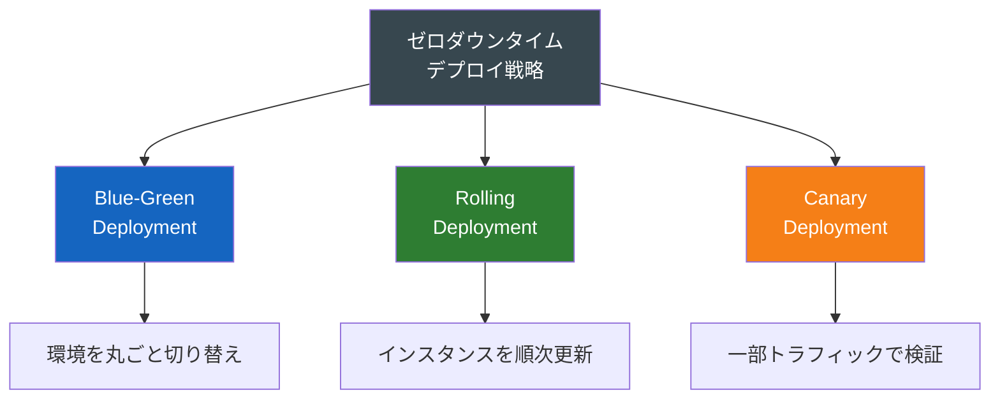

## 2. Blue-Green Deployment

### 基本的な仕組み

Blue-Green Deployment は、Martin Fowler と Jez Humble が著書「Continuous Delivery」（2010年）で広く紹介した手法である。その考え方は極めてシンプルで、本番環境を2つ用意し、トラフィックを瞬時に切り替えるというものである。

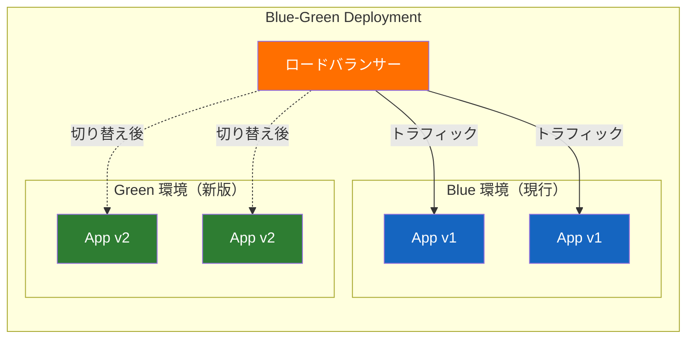

デプロイの流れは次のようになる。

1. **現行環境（Blue）がトラフィックを処理中**: ユーザーからのリクエストはすべてBlue環境に向かっている
2. **新版を Green 環境にデプロイ**: Blue環境には一切影響を与えず、Green環境に新しいバージョンのアプリケーションをデプロイし、起動する
3. **Green 環境のヘルスチェックとスモークテスト**: Green環境が正常に動作していることを確認する。この段階ではまだユーザートラフィックは流れていない
4. **ロードバランサーの切り替え**: ヘルスチェックが通ったら、ロードバランサーの向き先をBlueからGreenに切り替える。この操作は通常数秒で完了する
5. **Blue 環境を待機状態に**: 切り替え後もBlue環境はしばらく残しておく。問題が発生した場合、ロードバランサーをBlueに戻すだけでロールバックが完了する
6. **次のデプロイ**: 次回のデプロイでは、今度はBlue環境に新版をデプロイし、Greenから切り替える。Blue と Green の役割が交互に入れ替わる

### メリット

**瞬時の切り替え**: ロードバランサーの設定変更だけで切り替えが完了するため、ダウンタイムはほぼゼロである。DNS切り替え方式の場合はTTLの影響を受けるが、ロードバランサー方式であれば数秒以内に完了する。

**瞬時のロールバック**: 問題が発生した場合、ロードバランサーを元に戻すだけで旧バージョンに復帰できる。ロールバックにアプリケーションの再デプロイは不要である。

**テストの確実性**: 新版をデプロイした後、実際にトラフィックを流す前にヘルスチェックやスモークテストを実行できる。本番環境と同一の環境で事前検証ができるという点は大きな利点である。

**環境の一貫性**: Blue と Green は同一の構成で運用されるため、「テスト環境では動いたが本番では動かない」という問題が起こりにくい。

### デメリットと課題

**コスト**: 本番環境を2つ維持する必要がある。計算リソースが単純に2倍必要となるため、コストは大きい。クラウド環境では、使用していない環境のインスタンスを縮小・停止することで部分的に緩和できるが、切り替え時には同じ規模が必要である。

**データベースの整合性**: これが Blue-Green Deployment の最大の課題である。アプリケーション層は2つに分けられるが、データベースは通常1つを共有する。新旧のアプリケーションバージョンが異なるスキーマを期待する場合、単純な切り替えでは対応できない。この問題については後のセクションで詳しく扱う。

**セッション管理**: ステートフルなセッションを持つアプリケーションの場合、切り替え時にセッション情報が失われる可能性がある。セッションの外部化（Redis、データベースへの格納）によって対処する必要がある。

**長時間実行中のリクエスト**: 切り替え時に処理中のリクエストが中断される可能性がある。Connection Draining（既存の接続が完了するまで待機する仕組み）を導入して対処する。

### データベースマイグレーションの課題

Blue-Green Deployment における最も厄介な問題を具体例で見てみよう。

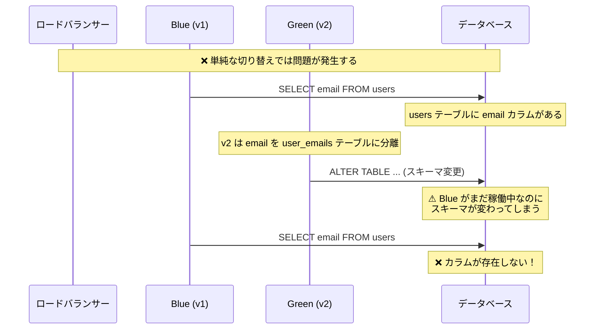

この問題に対する標準的な対処法が、expand-and-contract パターン（後述）である。

::: tip Blue-Green の変形: Blue-Green with Database
データベースも含めて2つ維持し、切り替え前にデータを同期するアプローチもある。ただし、データの完全な同期はコストと複雑性が大幅に増すため、アプリケーション層のみの Blue-Green が一般的である。
:::

## 3. Rolling Deployment

### 基本的な仕組み

Rolling Deployment は、アプリケーションのインスタンスを一つずつ（またはバッチで）順番に更新していく方式である。Blue-Green のように環境全体を2つ用意する必要がなく、既存のインフラをそのまま使えるため、リソース効率が良い。

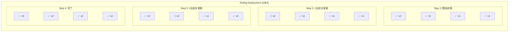

Rolling Deployment の各ステップは次のように進む。

1. ロードバランサーから1つ（または複数）のインスタンスを外す
2. そのインスタンスを新しいバージョンに更新する
3. ヘルスチェックを通過したら、ロードバランサーに戻す
4. 次のインスタンスに対して同じ操作を繰り返す
5. すべてのインスタンスが更新されたら完了

### Kubernetes における Rolling Update

Kubernetes は Rolling Update をネイティブにサポートしており、Deployment リソースのデフォルトの更新戦略として採用している。Kubernetes の Rolling Update を理解するうえで重要な2つのパラメータがある。

```yaml
apiVersion: apps/v1
kind: Deployment
metadata:
  name: my-app
spec:
  replicas: 4
  strategy:
    type: RollingUpdate
    rollingUpdate:
      # Maximum number of Pods that can be created beyond the desired count
      maxSurge: 1
      # Maximum number of Pods that can be unavailable during the update
      maxUnavailable: 1
  template:
    spec:
      containers:
      - name: my-app
        image: my-app:v2
        # Readiness probe determines when a Pod is ready to serve traffic
        readinessProbe:
          httpGet:
            path: /health
            port: 8080
          initialDelaySeconds: 5
          periodSeconds: 10
```

**maxSurge**: 更新中に、desired（目標の Pod 数）を超えて追加で作成できる Pod の最大数。上記の例では、4 + 1 = 5 個まで Pod が同時に存在できる。

**maxUnavailable**: 更新中に利用不可になることが許容される Pod の最大数。上記の例では、4 - 1 = 3 個以上の Pod が常に利用可能である必要がある。

この2つのパラメータの組み合わせにより、デプロイの速度と安全性のバランスを制御できる。

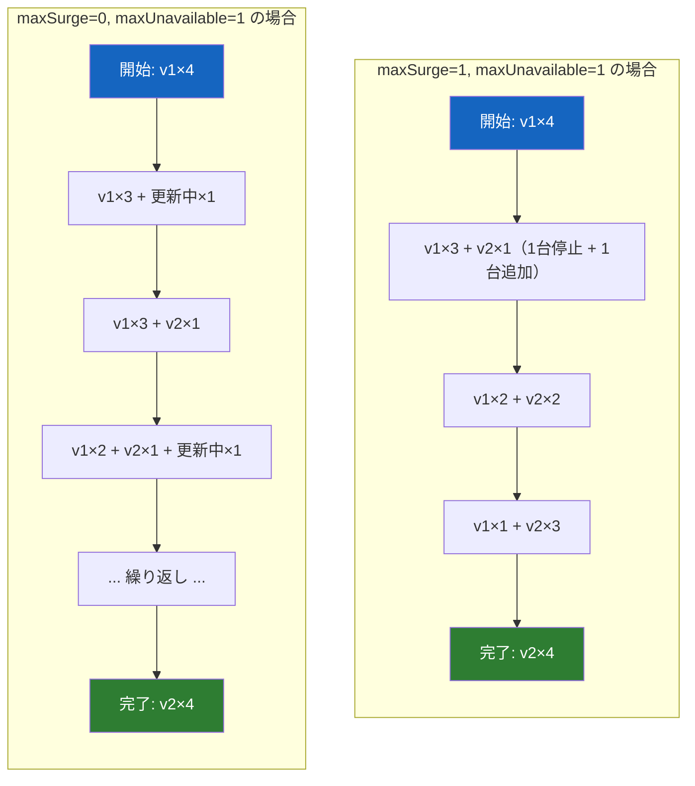

| 設定 | maxSurge | maxUnavailable | 特徴 |
|---|---|---|---|
| 高速デプロイ | 25% | 25% | デプロイが速いが、瞬間的にキャパシティが減少する |
| 安全重視 | 1 | 0 | キャパシティを下げずに更新するが、追加リソースが必要 |
| リソース節約 | 0 | 1 | 追加リソース不要だが、キャパシティが一時的に減少 |
| 最速 | 100% | 0 | 全台分を追加して切り替える（実質 Blue-Green に近い） |

### メリット

**リソース効率**: Blue-Green のように環境を2つ丸ごと用意する必要がない。maxSurge の分だけ追加リソースがあればよい。

**段階的な更新**: 1台ずつ更新していくため、途中で問題が発見された場合にデプロイを停止できる。全台に影響が及ぶ前に対処できる可能性がある。

**Kubernetes ネイティブ**: 特別なツールなしに、Kubernetes の標準機能だけで実現できる。

### デメリットと課題

**新旧バージョンの共存期間**: ローリング中は、古いバージョンと新しいバージョンのインスタンスが同時にトラフィックを処理する。APIの互換性が保たれていない場合、ユーザーがリクエストごとに異なるバージョンに到達し、一貫性のない動作を経験する可能性がある。

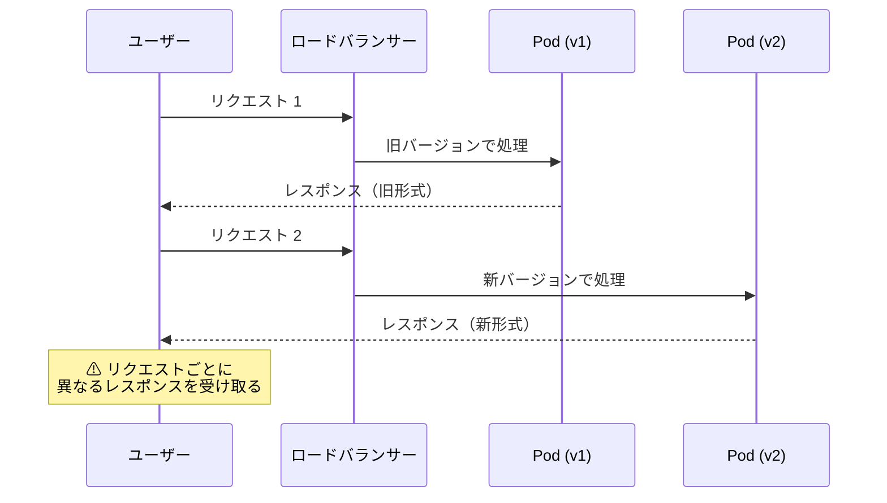

**ロールバックの遅さ**: Blue-Green のように瞬時にロールバックすることはできない。問題発覚後、旧バージョンへの Rolling Update を再度実行する必要がある。あるいは、Kubernetes であれば `kubectl rollout undo` で前のリビジョンに戻せるが、それでも全 Pod が旧バージョンに戻るまでには時間がかかる。

**デプロイの途中状態が長い**: インスタンス数が多いほど、全台の更新が完了するまでの時間が長くなる。100台のインスタンスを1台ずつ更新すれば、かなりの時間を要する。

::: details Kubernetes の Readiness Probe と Rolling Update の関係
Kubernetes の Rolling Update は、新しい Pod の Readiness Probe が成功して初めて次の Pod の更新に進む。Readiness Probe が適切に設定されていない場合、起動途中のアプリケーションにトラフィックが流れたり、ヘルスチェックが失敗して延々とデプロイが進まなかったりする。Rolling Update を安定して運用するには、Readiness Probe の適切な設計が不可欠である。

```yaml
# Well-designed readiness probe example
readinessProbe:
  httpGet:
    path: /ready
    port: 8080
  # Wait for the app to start before probing
  initialDelaySeconds: 10
  # Check every 5 seconds
  periodSeconds: 5
  # Require 2 consecutive successes to mark as ready
  successThreshold: 2
  # Mark unready after 3 consecutive failures
  failureThreshold: 3
```
:::

## 4. Canary Deployment

### 基本的な考え方

Canary Deployment は、炭鉱のカナリア（坑道の有毒ガスを検知するために使われた鳥）に由来する名前の通り、新しいバージョンを少数のインスタンスまたはユーザーに先行して公開し、問題がないかを確認してから段階的に展開範囲を広げていく手法である。

Rolling Deployment との違いは、**意図的にトラフィックの割合を制御する**点にある。Rolling Update では各インスタンスが均等にトラフィックを受けるため、4台中1台が更新されれば自動的に25%のトラフィックが新版に向かう。Canary Deployment では、「まず1%のトラフィックだけを新版に流す」「問題がなければ5%、10%、50%と段階的に増やす」というきめ細かな制御を行う。

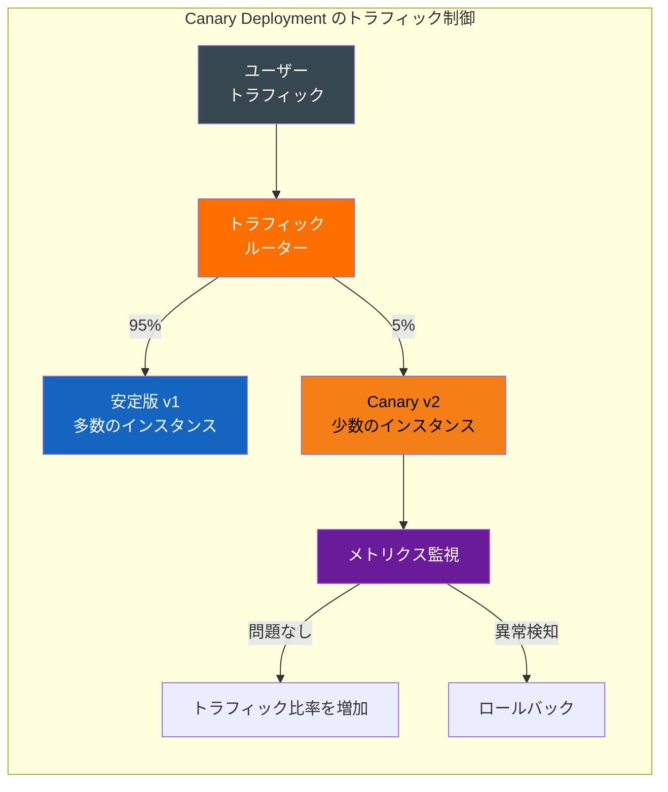

### 段階的なトラフィック移行

典型的な Canary Deployment のプロセスは以下のように進行する。

```
Phase 1:  1% → Canary    (数分〜数十分観察)
Phase 2:  5% → Canary    (数十分観察)
Phase 3: 10% → Canary    (数十分〜数時間観察)
Phase 4: 25% → Canary    (数時間観察)
Phase 5: 50% → Canary    (数時間観察)
Phase 6: 100% → 新版     (デプロイ完了)
```

各フェーズの待機時間は、アプリケーションの特性やビジネス要件によって異なる。リクエスト量が少ないサービスでは、統計的に有意なデータを収集するためにより長い観察時間が必要となる。

### メトリクス監視

Canary Deployment の真価は、段階的な展開と**メトリクス監視の組み合わせ**にある。監視すべき主要なメトリクスは以下の通りである。

**レイテンシ**: p50、p95、p99 のレスポンスタイム。Canary のレイテンシが安定版と比較して有意に悪化していないか。

**エラーレート**: HTTP 5xx の割合。Canary のエラーレートが安定版よりも高くないか。

**リソース使用量**: CPU、メモリ、ディスクI/O。新バージョンにメモリリークや非効率なリソース利用がないか。

**ビジネスメトリクス**: コンバージョン率、カート追加率など。技術的には問題なくても、ユーザー行動に悪影響を与えていないか。

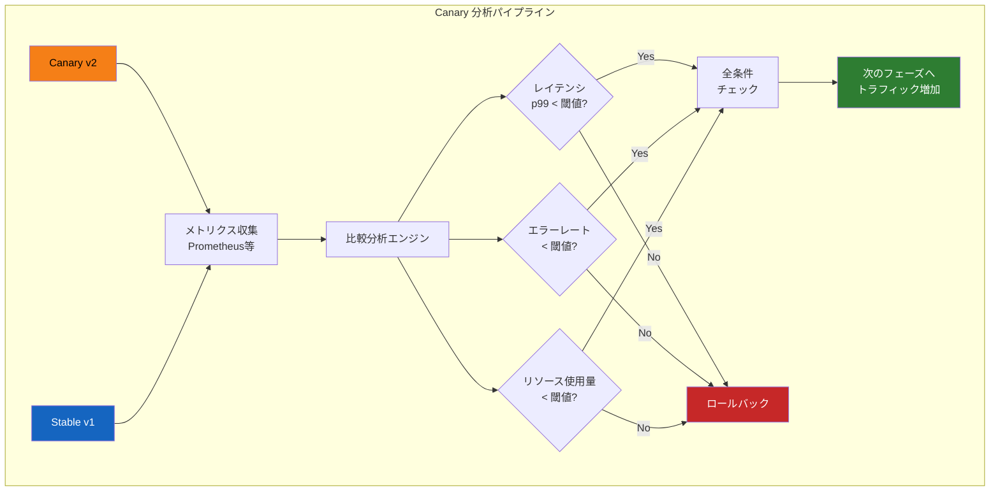

### 自動ロールバック

手動でメトリクスを監視して判断するのは現実的ではない。Canary Deployment を本格的に運用する場合、自動ロールバックの仕組みが不可欠である。

自動ロールバックの基本的なロジックは以下のようになる。

```python
# Simplified canary analysis logic
def analyze_canary(canary_metrics, baseline_metrics, thresholds):
    """
    Compare canary metrics against baseline and determine
    whether to promote, hold, or rollback.
    """
    results = {}

    # Compare error rates
    canary_error_rate = canary_metrics["5xx_count"] / canary_metrics["total_requests"]
    baseline_error_rate = baseline_metrics["5xx_count"] / baseline_metrics["total_requests"]

    if canary_error_rate > baseline_error_rate * thresholds["error_rate_factor"]:
        return "ROLLBACK", f"Error rate {canary_error_rate:.4f} exceeds threshold"

    # Compare latency (p99)
    if canary_metrics["p99_latency"] > baseline_metrics["p99_latency"] * thresholds["latency_factor"]:
        return "ROLLBACK", f"p99 latency {canary_metrics['p99_latency']}ms exceeds threshold"

    # Compare saturation (CPU, memory)
    if canary_metrics["cpu_usage"] > thresholds["max_cpu_percent"]:
        return "ROLLBACK", f"CPU usage {canary_metrics['cpu_usage']}% exceeds threshold"

    # All checks passed
    return "PROMOTE", "All metrics within acceptable range"
```

::: warning 自動ロールバックの注意点
自動ロールバックは万能ではない。メトリクスの収集に遅延がある場合（例えばバッチ処理の影響で数分遅れる場合）、その間に影響が広がる可能性がある。また、閾値の設定が緩すぎれば検出できず、厳しすぎれば不要なロールバックが頻発する。閾値のチューニングは継続的な改善作業である。
:::

### メリット

**リスクの極小化**: 最初のフェーズでは全トラフィックの1%程度しか新版に流さないため、問題が発生しても影響範囲は極めて限定的である。

**データ駆動の判断**: 「感覚」ではなく、実際のメトリクスデータに基づいてデプロイの進行/中止を判断できる。

**自動化との親和性**: メトリクス閾値に基づく自動判断により、人手を介さないデプロイが可能になる。

### デメリットと課題

**インフラの複雑性**: トラフィックの割合を細かく制御するためには、サービスメッシュ（Istio等）やスマートなロードバランサーが必要である。単純なラウンドロビンでは実現できない。

**統計的な課題**: トラフィック量が少ない場合、1%のCanaryに到達するリクエスト数が統計的に有意な結論を出すには不十分な場合がある。

**デプロイ完了までの時間**: 段階的に進めるため、全体のデプロイ完了までの時間は長くなる。各フェーズで観察時間を設けるため、数時間〜1日かかることもある。

**セッションアフィニティ**: ユーザーがリクエストのたびに異なるバージョンに到達すると不整合が生じる。Sticky Session やヘッダーベースのルーティングで対応する場合があるが、ルーティングロジックが複雑になる。

## 5. データベースマイグレーションとの連携

### なぜ難しいのか

ゼロダウンタイムデプロイの最大のチャレンジは、アプリケーション層ではなくデータ層にある。アプリケーションサーバーは複数のバージョンを並行して稼働させることができるが、データベースは通常1つであり、そのスキーマは全アプリケーションインスタンスで共有される。

新バージョンのアプリケーションが新しいテーブル構造を要求する場合、スキーマの変更と同時にアプリケーションを切り替えなければ不整合が生じる。しかし、ゼロダウンタイムデプロイでは新旧バージョンが同時に稼働するため、**両方のバージョンが同じデータベーススキーマで動作できる**必要がある。

### Expand-and-Contract パターン

この問題に対する標準的なアプローチが **Expand-and-Contract パターン**（Parallel Change パターンとも呼ばれる）である。スキーマ変更を「拡張」と「収縮」の2段階に分けることで、後方互換性を維持しながら段階的に変更を適用する。

具体例として、`users` テーブルの `name` カラムを `first_name` と `last_name` に分割するケースを考える。

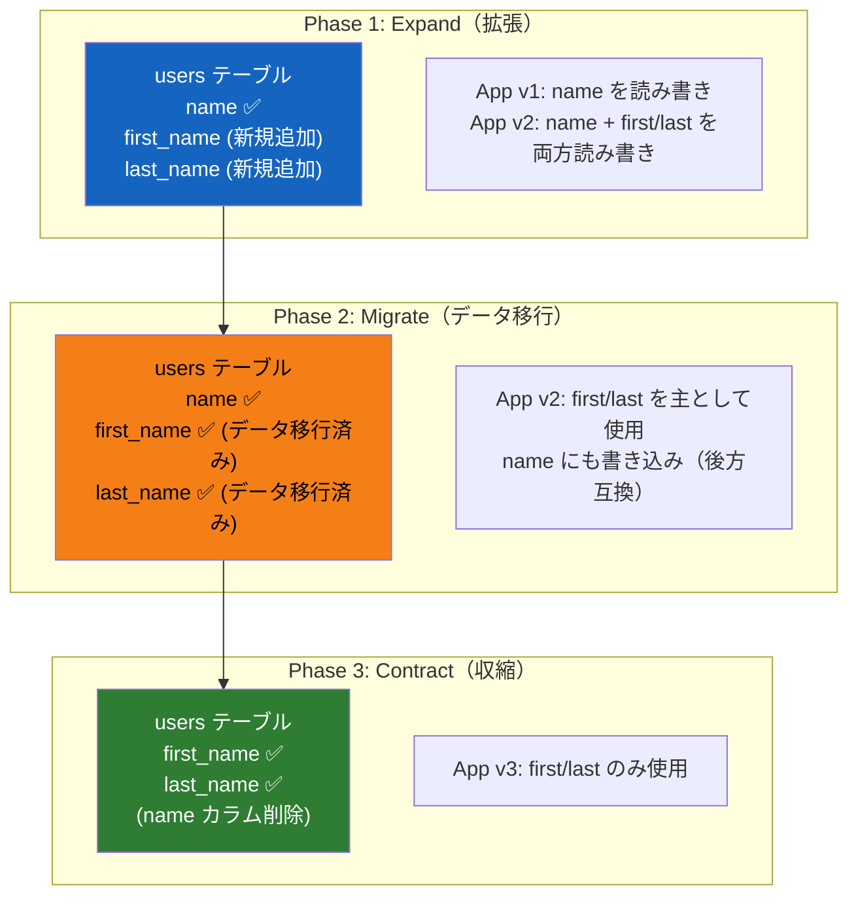

#### Phase 1: Expand（拡張）

```sql
-- Add new columns without removing old ones
ALTER TABLE users ADD COLUMN first_name VARCHAR(255);
ALTER TABLE users ADD COLUMN last_name VARCHAR(255);
```

この段階では旧カラム `name` はそのまま残す。旧バージョンのアプリケーション（v1）は `name` カラムだけを使い続けるため、影響を受けない。新バージョン（v2）は新旧両方のカラムに書き込みを行う。

#### Phase 2: Migrate（データ移行）

```sql
-- Backfill data from old column to new columns
UPDATE users
SET first_name = SPLIT_PART(name, ' ', 1),
    last_name = SPLIT_PART(name, ' ', 2)
WHERE first_name IS NULL;
```

既存データを新カラムに移行する。この段階でも旧カラムは削除しない。旧バージョンのアプリケーションがまだ稼働している可能性があるためである。

#### Phase 3: Contract（収縮）

すべてのアプリケーションインスタンスが新バージョンに更新され、旧カラムへの依存が完全になくなったことを確認してから、旧カラムを削除する。

```sql
-- Remove old column only after all app instances are on v2+
ALTER TABLE users DROP COLUMN name;
```

::: danger 重要な注意
Contract フェーズ（旧カラム/旧テーブルの削除）は、Expand フェーズとは**別のデプロイサイクル**で行うべきである。同じリリースで追加と削除を同時に行うと、ロールバック時に旧バージョンが動作しなくなる。余裕を持って数日〜数週間の間隔を空けることが推奨される。
:::

### 大規模テーブルへの ALTER TABLE 問題

本番環境で数億行のテーブルに対して `ALTER TABLE` を実行すると、テーブルロックが発生してサービスが停止する可能性がある。MySQL（InnoDB）では多くの `ALTER TABLE` がオンラインDDLとして実行可能だが、すべてではない。PostgreSQL では `ALTER TABLE ADD COLUMN` にデフォルト値を指定する場合、バージョン 11 以降ではテーブルの書き換えなしに実行できるようになったが、制約追加などは依然として注意が必要である。

このような場合、以下のツールやテクニックが使われる。

- **gh-ost（GitHub Online Schema Tool）**: MySQL でシャドウテーブルを作成し、binlog レプリケーションを利用して無停止でスキーマ変更を行う
- **pt-online-schema-change（Percona Toolkit）**: トリガーベースでオンラインスキーマ変更を行う
- **PostgreSQL のオンライン DDL**: `CREATE INDEX CONCURRENTLY` など、ロックを最小化するDDLコマンドを活用する

## 6. 実装例

### Kubernetes での Rolling Update

Kubernetes の Deployment リソースを使った最も基本的な Rolling Update の設定例を示す。

```yaml
apiVersion: apps/v1
kind: Deployment
metadata:
  name: web-app
  labels:
    app: web-app
spec:
  replicas: 4
  selector:
    matchLabels:
      app: web-app
  strategy:
    type: RollingUpdate
    rollingUpdate:
      maxSurge: 1
      maxUnavailable: 0
  # Minimum time a Pod must be ready before it is considered available
  minReadySeconds: 30
  # Number of old ReplicaSets to retain for rollback
  revisionHistoryLimit: 10
  template:
    metadata:
      labels:
        app: web-app
    spec:
      containers:
      - name: web-app
        image: my-registry/web-app:v2.1.0
        ports:
        - containerPort: 8080
        resources:
          requests:
            cpu: "250m"
            memory: "256Mi"
          limits:
            cpu: "500m"
            memory: "512Mi"
        # Readiness probe: determines when the Pod can receive traffic
        readinessProbe:
          httpGet:
            path: /health/ready
            port: 8080
          initialDelaySeconds: 10
          periodSeconds: 5
          successThreshold: 1
          failureThreshold: 3
        # Liveness probe: determines when the Pod needs to be restarted
        livenessProbe:
          httpGet:
            path: /health/live
            port: 8080
          initialDelaySeconds: 30
          periodSeconds: 10
          failureThreshold: 3
      # Allow time for in-flight requests to complete
      terminationGracePeriodSeconds: 60
```

デプロイの実行とロールバックは以下のコマンドで行う。

```bash
# Deploy new version
kubectl set image deployment/web-app web-app=my-registry/web-app:v2.2.0

# Monitor rollout status
kubectl rollout status deployment/web-app

# View rollout history
kubectl rollout history deployment/web-app

# Rollback to previous version
kubectl rollout undo deployment/web-app

# Rollback to a specific revision
kubectl rollout undo deployment/web-app --to-revision=3
```

### AWS での Blue-Green Deployment

AWS では複数のサービスを組み合わせて Blue-Green Deployment を実現できる。代表的なパターンは以下の通りである。

#### ECS + ALB によるBlue-Green

AWS CodeDeploy と ECS を組み合わせた Blue-Green Deployment では、ALB（Application Load Balancer）のターゲットグループを切り替えることで実現する。

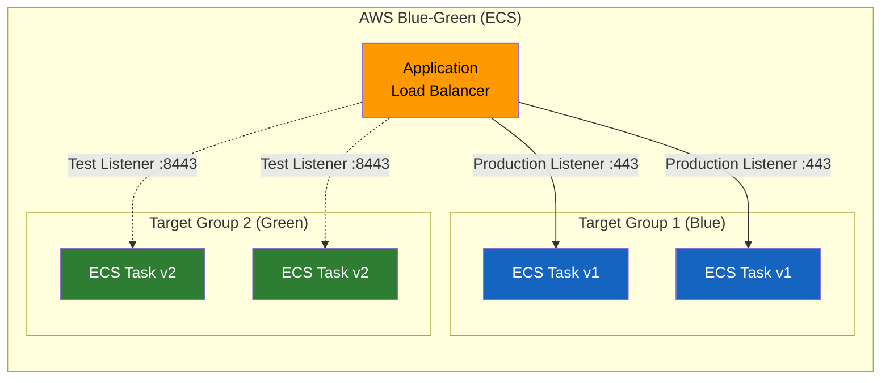

CodeDeploy の `appspec.yml` は次のように記述する。

```yaml
version: 0.0
Resources:
  - TargetService:
      Type: AWS::ECS::Service
      Properties:
        TaskDefinition: "arn:aws:ecs:ap-northeast-1:123456789:task-definition/web-app:2"
        LoadBalancerInfo:
          ContainerName: "web-app"
          ContainerPort: 8080
Hooks:
  - BeforeInstall: "LambdaFunctionToValidateBeforeInstall"
  - AfterInstall: "LambdaFunctionToValidateAfterInstall"
  - AfterAllowTestTraffic: "LambdaFunctionToRunIntegrationTests"
  - BeforeAllowTraffic: "LambdaFunctionToValidateBeforeTraffic"
  - AfterAllowTraffic: "LambdaFunctionToValidateAfterTraffic"
```

この構成では、デプロイ時に以下の流れが自動的に実行される。

1. Green 環境（Target Group 2）に新バージョンの ECS タスクがデプロイされる
2. テストリスナー（:8443）を通じて Green 環境にアクセスし、動作確認ができる
3. `AfterAllowTestTraffic` フックで統合テストが実行される
4. テスト通過後、本番リスナー（:443）が Green 環境に切り替わる
5. 指定された待機時間の間、問題がなければ Blue 環境のタスクが終了する

::: tip AWS での追加オプション
CodeDeploy では、切り替え方式として「一括切り替え（AllAtOnce）」「線形（Linear）」「カナリア（Canary）」を選択できる。例えば `CodeDeployDefault.ECSCanary10Percent5Minutes` は、最初に10%のトラフィックを新版に流し、5分間問題がなければ残り90%を切り替える。
:::

### Argo Rollouts による Canary Deployment

Argo Rollouts は、Kubernetes 上で高度なデプロイ戦略（Canary、Blue-Green）を実現するためのオープンソースのコントローラーである。Kubernetes 標準の Deployment では実現が難しいトラフィック比率の細かな制御や、メトリクス分析に基づく自動プロモーションを提供する。

```yaml
apiVersion: argoproj.io/v1alpha1
kind: Rollout
metadata:
  name: web-app
spec:
  replicas: 10
  selector:
    matchLabels:
      app: web-app
  template:
    metadata:
      labels:
        app: web-app
    spec:
      containers:
      - name: web-app
        image: my-registry/web-app:v2.1.0
        ports:
        - containerPort: 8080
  strategy:
    canary:
      # Traffic routing via Istio
      trafficRouting:
        istio:
          virtualService:
            name: web-app-vsvc
            routes:
            - primary
          destinationRule:
            name: web-app-destrule
            canarySubsetName: canary
            stableSubsetName: stable
      # Step-by-step rollout plan
      steps:
      # Phase 1: 5% traffic for 5 minutes
      - setWeight: 5
      - pause:
          duration: 5m
      # Automated analysis after Phase 1
      - analysis:
          templates:
          - templateName: success-rate
          args:
          - name: service-name
            value: web-app-canary
      # Phase 2: 20% traffic for 10 minutes
      - setWeight: 20
      - pause:
          duration: 10m
      # Phase 3: 50% traffic for 10 minutes
      - setWeight: 50
      - pause:
          duration: 10m
      # Phase 4: 80% traffic for 5 minutes
      - setWeight: 80
      - pause:
          duration: 5m
      # Final: promote to 100%
      # Automatic rollback on analysis failure
      rollbackWindow:
        revisions: 2
```

Argo Rollouts の AnalysisTemplate を使うことで、Prometheus のメトリクスに基づく自動判定を設定できる。

```yaml
apiVersion: argoproj.io/v1alpha1
kind: AnalysisTemplate
metadata:
  name: success-rate
spec:
  args:
  - name: service-name
  metrics:
  - name: success-rate
    # Minimum number of measurements before concluding
    count: 3
    # Interval between measurements
    interval: 60s
    # Threshold: success rate must be above 95%
    successCondition: result[0] >= 0.95
    failureLimit: 1
    provider:
      prometheus:
        address: http://prometheus.monitoring:9090
        query: |
          sum(rate(
            http_requests_total{
              service="{{args.service-name}}",
              status=~"2.."
            }[5m]
          )) /
          sum(rate(
            http_requests_total{
              service="{{args.service-name}}"}[5m]
          ))
  - name: latency-p99
    count: 3
    interval: 60s
    # p99 latency must be below 500ms
    successCondition: result[0] <= 500
    failureLimit: 1
    provider:
      prometheus:
        address: http://prometheus.monitoring:9090
        query: |
          histogram_quantile(0.99,
            sum(rate(
              http_request_duration_milliseconds_bucket{
                service="{{args.service-name}}"
              }[5m]
            )) by (le)
          )
```

この構成により、以下のような自動化されたデプロイフローが実現する。

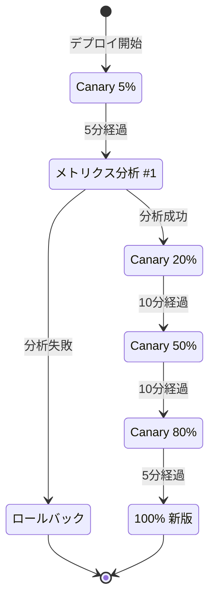

::: details Argo Rollouts と Flagger の比較
Canary Deployment を Kubernetes 上で実現するツールとしては、Argo Rollouts の他に Flagger（Flux プロジェクトの一部）がある。

**Argo Rollouts** は CRD として Rollout リソースを提供し、Deployment の代替として使用する。Kubernetes の標準的な Deployment リソースとは別物である。Argo CD との統合が優れている。

**Flagger** は既存の Deployment リソースを監視し、Canary 用の Deployment を自動的に作成・管理する。既存の Deployment をそのまま使えるため、移行コストが低い。Flagger は Prometheus、Datadog、CloudWatch など多くのメトリクスプロバイダーをサポートしている。

どちらを選ぶかは、既存のツールチェインとの統合や、チームの好みによる。
:::

## 7. 比較と選び方

### 3つの戦略の比較

| 観点 | Blue-Green | Rolling | Canary |
|---|---|---|---|
| **切り替え速度** | 瞬時 | 段階的（分〜時間） | 段階的（時間〜日） |
| **ロールバック速度** | 瞬時 | 遅い（再デプロイ必要） | 速い（トラフィック切り戻し） |
| **追加リソース** | 2倍 | 最小限（maxSurge 分） | 少量（Canary 分） |
| **新旧共存期間** | なし（瞬時切替） | 更新中のみ | 長い（意図的） |
| **リスク制御の粒度** | 全か無 | インスタンス単位 | トラフィック比率単位 |
| **インフラ要件** | LB + 2環境 | LB + 標準デプロイ | サービスメッシュ推奨 |
| **実装の複雑さ** | 低い | 低い | 高い |
| **統計的検証** | 不可 | 限定的 | 可能 |

### 選定の指針

#### Blue-Green が適するケース

- スキーマ変更を含まない、アプリケーション層のみの更新が中心
- 瞬時のロールバックが絶対的な要件
- インフラコストの増加が許容できる
- デプロイ頻度がそれほど高くない（日に数回程度）

#### Rolling が適するケース

- Kubernetes をすでに利用しており、追加ツールなしで実現したい
- リソース効率を重視する
- APIの後方互換性が保たれている
- シンプルな運用を好む

#### Canary が適するケース

- 大規模なユーザーベースがあり、デプロイリスクを最小化したい
- メトリクス監視基盤（Prometheus 等）が整っている
- サービスメッシュ（Istio 等）を導入している、または導入予定
- データ駆動でのデプロイ判断を自動化したい

### ハイブリッドアプローチ

実際の運用では、単一の戦略だけを使うのではなく、複数の戦略を組み合わせることが多い。

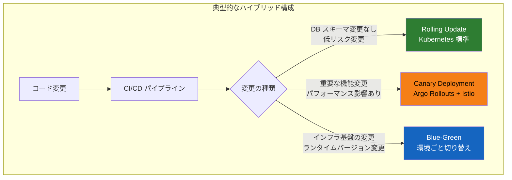

**低リスクの変更（バグ修正、小さな機能追加）** には Rolling Update を適用する。追加のインフラも設定も不要で、Kubernetes の標準機能だけで完結する。

**中〜高リスクの変更（新機能、パフォーマンスに影響する変更）** には Canary Deployment を適用する。メトリクスを観察しながら段階的にトラフィックを移行し、問題があれば自動的にロールバックする。

**インフラレベルの変更（OS バージョンアップ、ランタイム変更、大規模な構成変更）** には Blue-Green Deployment を適用する。環境全体を新しく構築し、動作確認後に切り替える。

### Graceful Shutdown と Connection Draining

どのデプロイ戦略を選択するにしても、旧バージョンのインスタンスを停止する際の **Graceful Shutdown** は不可欠である。処理中のリクエストを中断せずに完了させ、新しいリクエストの受付を停止してから安全にプロセスを終了する必要がある。

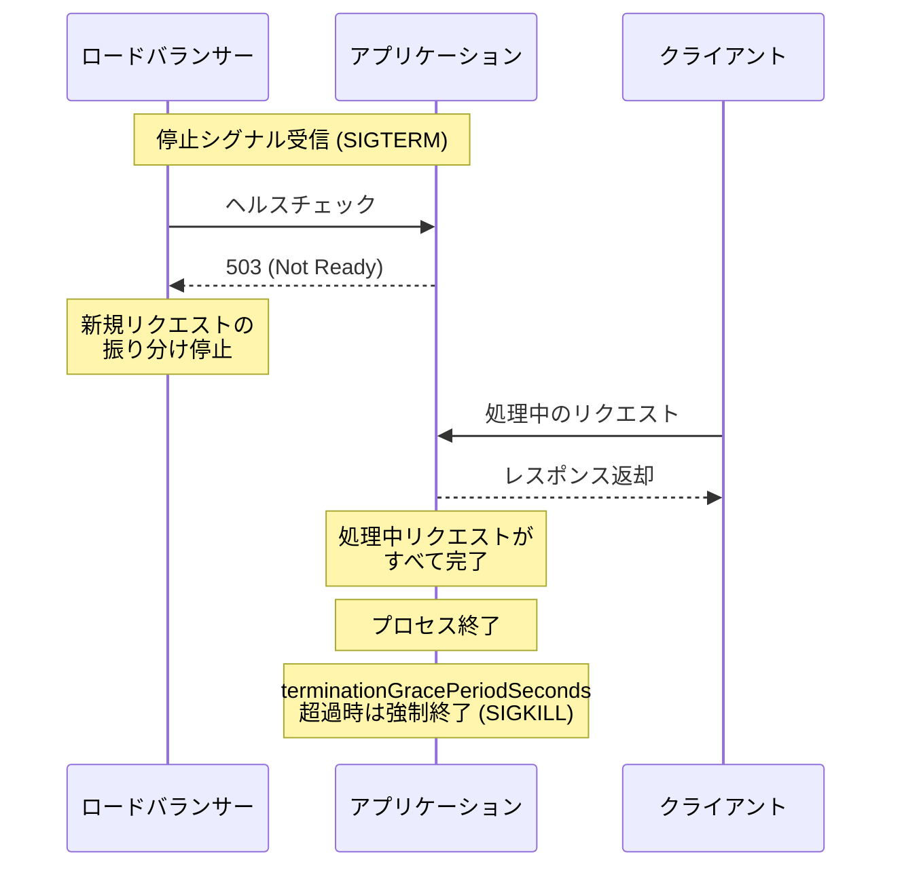

Kubernetes では、Pod の終了時に以下の手順が実行される。

1. `preStop` フックの実行（設定されている場合）
2. SIGTERM シグナルの送信
3. `terminationGracePeriodSeconds`（デフォルト30秒）の間、プロセスの自主的な終了を待機
4. 時間超過した場合、SIGKILL で強制終了

アプリケーション側では、SIGTERM を受け取った際に以下の処理を行う実装が必要である。

```go
package main

import (
	"context"
	"log"
	"net/http"
	"os"
	"os/signal"
	"syscall"
	"time"
)

func main() {
	srv := &http.Server{Addr: ":8080"}

	// Start server in a goroutine
	go func() {
		if err := srv.ListenAndServe(); err != http.ErrServerClosed {
			log.Fatalf("HTTP server error: %v", err)
		}
	}()

	// Wait for termination signal
	quit := make(chan os.Signal, 1)
	signal.Notify(quit, syscall.SIGTERM, syscall.SIGINT)
	<-quit

	log.Println("Shutting down server...")

	// Create a context with timeout for graceful shutdown
	ctx, cancel := context.WithTimeout(context.Background(), 30*time.Second)
	defer cancel()

	// Gracefully shut down: stop accepting new connections,
	// wait for in-flight requests to complete
	if err := srv.Shutdown(ctx); err != nil {
		log.Fatalf("Server forced to shutdown: %v", err)
	}

	log.Println("Server exited gracefully")
}
```

### 最終的な判断基準

デプロイ戦略の選択は、技術的な要因だけでなく、組織的な要因も考慮する必要がある。

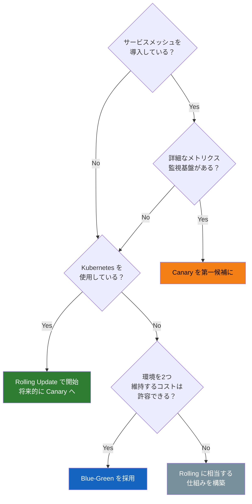

重要なのは、**最初から完璧なデプロイ戦略を選ぶ必要はない**ということである。多くの組織は、まず Kubernetes の標準的な Rolling Update から始め、監視基盤が整い次第 Canary Deployment に移行する。あるいは、クリティカルなサービスのみ Canary を適用し、他は Rolling Update のままにする。

ゼロダウンタイムデプロイの本質は、特定のツールや手法にあるのではなく、**サービスを停止させずに安全に変更を適用する**という目標に対して、自分たちの組織の状況に合ったアプローチを選択し、継続的に改善していくことにある。デプロイ戦略はビジネスの成長やインフラの進化とともに変わっていくものであり、固定的に捉えるべきではない。
