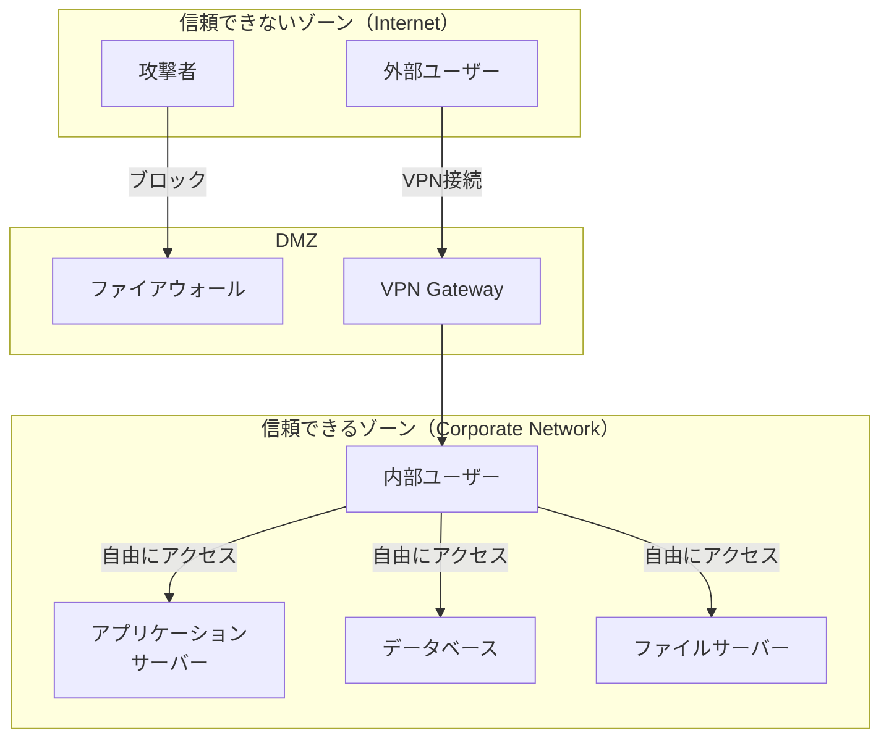
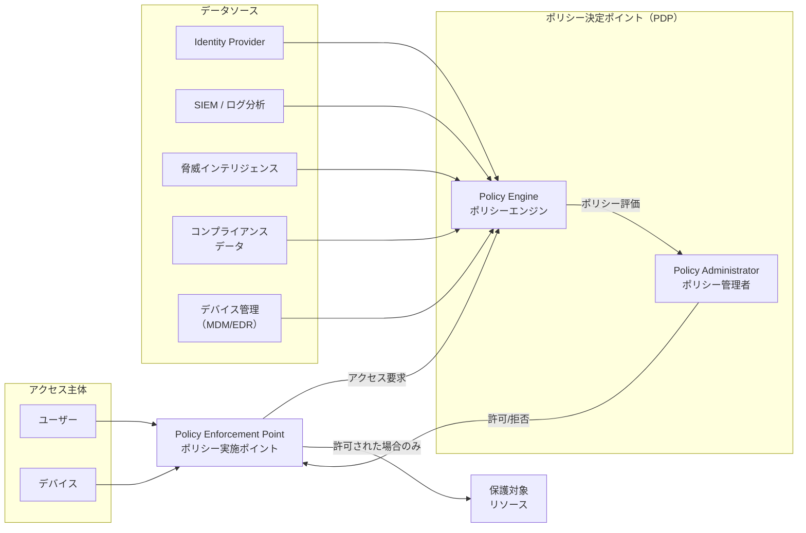
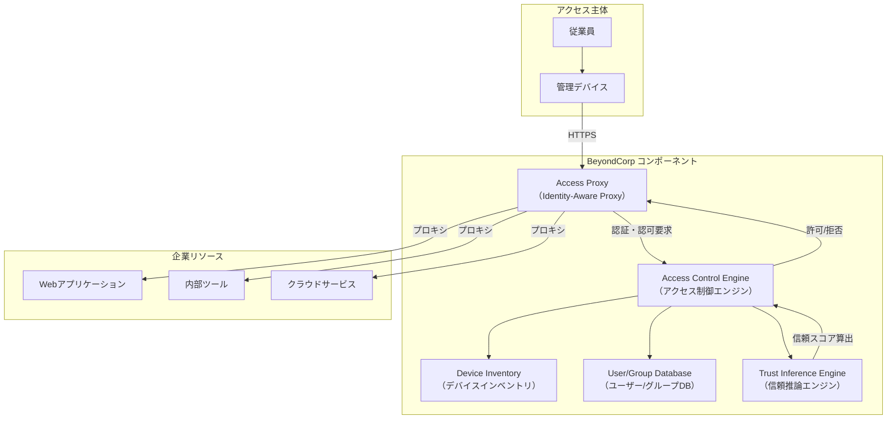
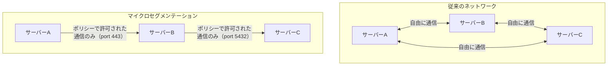
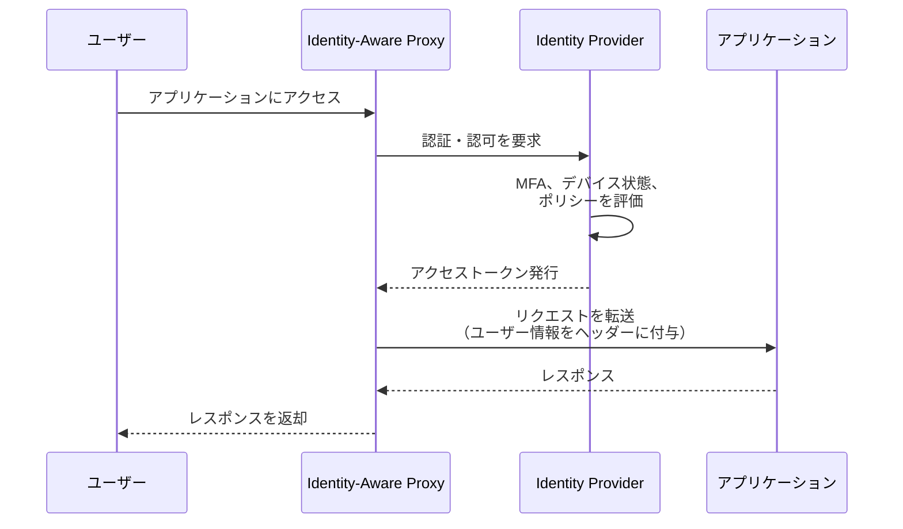
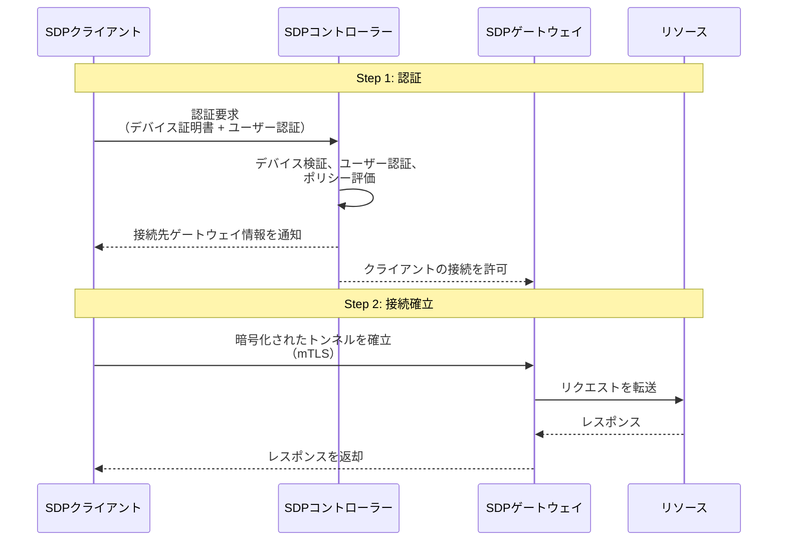
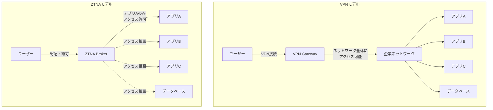
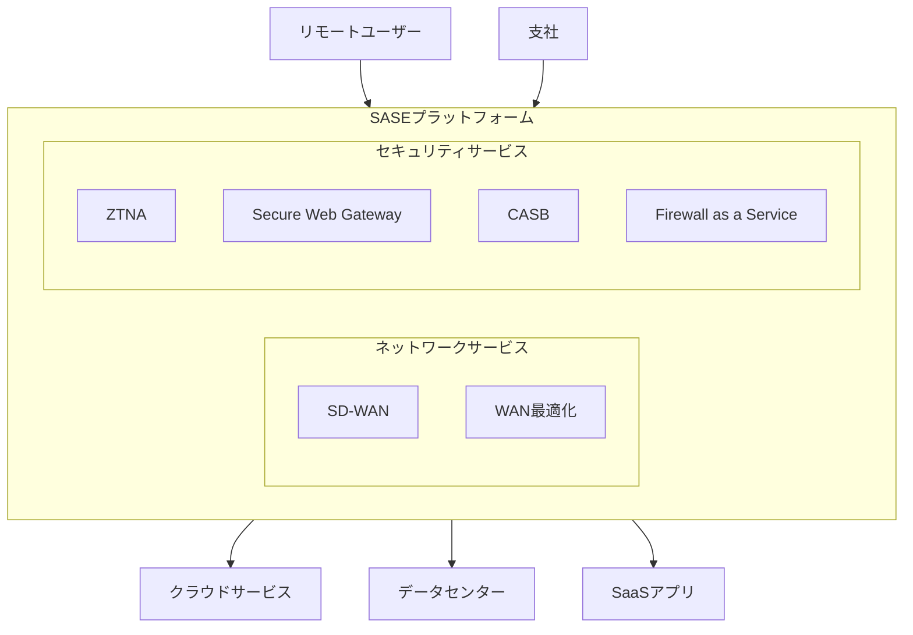

# ゼロトラストアーキテクチャ — 境界防御の終焉と「決して信頼せず、常に検証する」セキュリティモデル

## 1. はじめに：なぜ境界防御は破綻したのか

従来のネットワークセキュリティは「城と堀」モデルに基づいていた。ファイアウォールやVPNという「堀」で企業ネットワークの「城壁」を守り、内部ネットワークに入った通信は信頼できるものとして扱う。この**境界防御（Perimeter Security）**モデルは、数十年にわたり企業セキュリティの基盤であった。

しかし、現代のIT環境はこのモデルの前提を根本から覆している：

- **クラウドの普及**：データとアプリケーションが社内データセンターの外に移動した。SaaS、IaaS、PaaSの利用により、守るべき「境界」が曖昧になった
- **リモートワークの常態化**：従業員は自宅、カフェ、空港など、あらゆる場所からアクセスする。社内ネットワークに物理的に存在することはもはや信頼の根拠にならない
- **BYOD（Bring Your Own Device）**：個人所有のデバイスが業務で使用され、企業が完全に管理できないエンドポイントが増加した
- **高度化するサイバー攻撃**：攻撃者は一度境界を突破すれば、内部ネットワークを横方向に自由に移動（ラテラルムーブメント）できる。標的型攻撃やサプライチェーン攻撃により、「内部は安全」という前提は成り立たない
- **内部脅威**：悪意ある内部者や、認証情報を窃取された正規ユーザーによる脅威に対して、境界防御は無力である

これらの変化に対応するために生まれたのが**ゼロトラスト（Zero Trust）**というセキュリティモデルである。

## 2. 境界防御モデルの構造と限界

### 2.1 従来のネットワークアーキテクチャ

境界防御モデルでは、ネットワークを「信頼できるゾーン」と「信頼できないゾーン」に二分する。

このモデルの根本的な問題は、VPNやファイアウォールを突破した攻撃者が「信頼できるゾーン」内のすべてのリソースにアクセスできてしまうことである。2013年のTarget社の情報漏洩事件では、空調業者の認証情報が窃取され、そこから決済システムにまでラテラルムーブメントが行われた。

### 2.2 境界防御の具体的な弱点

**暗黙の信頼（Implicit Trust）**が最大の問題である。内部ネットワークにいるという事実だけでリソースへのアクセスが許可されるため、以下のリスクが生じる：

1. **ラテラルムーブメント**：攻撃者が一つのシステムを侵害すると、内部ネットワーク全体を探索できる。セグメンテーションが不十分な場合、機密データまでの到達は時間の問題である
2. **認証情報の悪用**：フィッシングやソーシャルエンジニアリングで取得したVPN認証情報があれば、攻撃者は正規ユーザーとして内部に入り込める
3. **可視性の欠如**：内部トラフィックの監視が不十分なため、侵害の検知が遅れる。攻撃者が内部に潜伏する平均期間（Dwell Time）は数ヶ月に及ぶことがある
4. **スケーラビリティの問題**：クラウドやリモートワークが拡大するにつれ、「境界」の定義と維持が困難になる

## 3. ゼロトラストとは何か

### 3.1 定義と起源

「ゼロトラスト」という用語は、2010年にForrester Researchのアナリストである**John Kindervag**が提唱した。その核心は一つのフレーズに集約される：

> **"Never Trust, Always Verify"（決して信頼せず、常に検証する）**

ゼロトラストは、ネットワークの場所（内部か外部か）に基づく暗黙の信頼を排除し、すべてのアクセス要求を明示的に検証するセキュリティモデルである。これは特定の製品や技術ではなく、**セキュリティの設計思想（アーキテクチャ原則）**である。

### 3.2 三つの核心原則

ゼロトラストアーキテクチャは以下の三つの原則に基づく：

**原則1：明示的な検証（Verify Explicitly）**

すべてのアクセス要求に対して、利用可能なすべてのデータポイントに基づいて認証・認可を行う。これには以下が含まれる：

- ユーザーのアイデンティティ（多要素認証）
- デバイスの健全性（パッチ状態、暗号化の有無、マルウェアの有無）
- アクセス元の場所とネットワーク
- アクセス対象のリソースの機密度
- 異常な行動パターンの検出

**原則2：最小権限アクセス（Least Privilege Access）**

ユーザーやシステムには、タスクの遂行に必要な最小限の権限のみを付与する。アクセス権は以下のように制限される：

- **JIT（Just-In-Time）アクセス**：必要な時にのみ権限を付与し、タスク完了後に自動的に失効させる
- **JEA（Just-Enough-Access）**：必要最小限のスコープに限定した権限を付与する
- **リスクベースの適応型ポリシー**：リスクレベルに応じてアクセス権を動的に調整する

**原則3：侵害の想定（Assume Breach）**

攻撃者がすでにネットワーク内部に存在する可能性を前提として設計する。この原則に基づき：

- ネットワークをマイクロセグメントに分割し、侵害の影響範囲（Blast Radius）を最小化する
- エンドツーエンドの暗号化を適用する
- 継続的な監視とリアルタイムの脅威検知を行う
- インシデントレスポンスの自動化を推進する

### 3.3 ゼロトラストの論理アーキテクチャ

この論理アーキテクチャでは、すべてのアクセス要求が**ポリシー実施ポイント（PEP）**を通過し、**ポリシーエンジン（PE）**が複数のデータソースを参照してリアルタイムにアクセス判断を下す。

## 4. NIST SP 800-207：ゼロトラストの標準フレームワーク

### 4.1 概要

2020年8月に米国国立標準技術研究所（NIST）が発行した**SP 800-207「Zero Trust Architecture」**は、ゼロトラストの最も権威ある標準文書である。この文書はゼロトラストの定義、論理コンポーネント、展開モデル、およびユースケースを包括的に定めている。

### 4.2 NISTが定義する七つのテネット

NIST SP 800-207は、ゼロトラストの基本的なテネット（信条）として以下の七つを定めている：

1. **すべてのデータソースとコンピューティングサービスはリソースとみなす**：ネットワーク上のすべてのデバイス、サービス、データストアは保護対象のリソースである
2. **ネットワークの場所に関係なく、すべての通信を保護する**：内部ネットワーク上の通信であっても暗号化と認証を行う
3. **個々のリソースへのアクセスはセッションごとに付与する**：あるリソースへのアクセスが許可されたからといって、別のリソースへのアクセスが自動的に許可されることはない
4. **リソースへのアクセスは動的ポリシーによって決定する**：アイデンティティ、デバイスの状態、行動パターン、環境属性などを含む動的なポリシーに基づく
5. **すべての所有・関連デバイスのセキュリティ状態を監視・測定する**：デバイスの信頼レベルは固定ではなく、継続的に評価される
6. **すべてのリソースの認証と認可はアクセス許可前に動的かつ厳格に実施する**：認証・認可は継続的なプロセスであり、一度の認証で永続的にアクセスが許可されることはない
7. **ネットワークインフラストラクチャと通信の現在の状態について可能な限り多くの情報を収集し、セキュリティ態勢の改善に活用する**：ログ、トラフィック分析、脅威インテリジェンスを継続的に収集・分析する

### 4.3 NISTの展開モデル

NIST SP 800-207は三つの展開モデルを定義している：

**モデル1：デバイスエージェント/ゲートウェイモデル**

各デバイスにエージェントをインストールし、ゲートウェイ（PEP）を経由してリソースにアクセスする。エージェントがデバイスの状態を報告し、ゲートウェイがポリシーに基づいてアクセスを制御する。

**モデル2：エンクレーブベースモデル**

リソースをセキュアなエンクレーブ（セグメント）に配置し、エンクレーブの入口にゲートウェイを設置する。既存のネットワークアーキテクチャを段階的にゼロトラスト化する際に適している。

**モデル3：リソースポータルモデル**

すべてのアクセスをリソースポータル（リバースプロキシ）経由で行う。デバイスにエージェントを必要としないため、BYOD環境やパートナーアクセスに適している。

## 5. Google BeyondCorp：ゼロトラストの先駆的実装

### 5.1 背景

**BeyondCorp**は、Googleが2011年頃から社内で開発・展開したゼロトラストセキュリティモデルであり、ゼロトラストの概念を大規模に実装した最も有名な事例である。

BeyondCorpの開発は、2009年末に発覚した**Operation Aurora**（中国を拠点とする高度なサイバー攻撃がGoogleの内部ネットワークに侵入した事件）への対応がきっかけとなった。この事件はGoogleに「内部ネットワークは安全である」という前提の危うさを痛感させた。

### 5.2 BeyondCorpの核心的な設計思想

BeyondCorpの根本的な発想は以下のとおりである：

> **社内ネットワークからのアクセスと、スターバックスのWi-Fiからのアクセスを、本質的に同じものとして扱う**

つまり、ネットワークの場所に基づく信頼を完全に排除し、すべてのアクセスをインターネット経由と同じレベルで検証する。

### 5.3 アーキテクチャの構成要素

**主要コンポーネント：**

1. **Device Inventory Service**：企業が管理するすべてのデバイスの情報（OS、パッチレベル、暗号化状態、証明書など）を追跡する。デバイスには固有の証明書が発行される
2. **User/Group Database**：従業員のアイデンティティ、所属グループ、役割を管理する。人事システムと連携し、退職や異動を即座に反映する
3. **Trust Inference Engine**：デバイスの状態とユーザーの属性から「信頼スコア」を算出する。パッチが最新でない場合や、異常な場所からのアクセスの場合はスコアが低下する
4. **Access Control Engine**：信頼スコアとアクセスポリシーに基づいて、個々のリソースへのアクセスを許可または拒否する
5. **Access Proxy（Identity-Aware Proxy）**：すべてのアクセスはこのプロキシを経由する。VPNは使用しない。HTTPSベースのプロキシがアクセス制御を実施する

### 5.4 BeyondCorpの成果と教訓

BeyondCorpの展開から得られた重要な教訓：

- **段階的な移行が不可欠**：Googleでさえ、完全なBeyondCorpへの移行には数年を要した。レガシーシステムの対応、ユーザーの教育、ポリシーの調整を段階的に行った
- **ユーザー体験の維持**：セキュリティ強化がユーザーの生産性を低下させないよう、アクセスの透過性とシングルサインオンを重視した
- **VPNの廃止**：BeyondCorpの導入により、GoogleはVPNの使用を大幅に削減した。COVID-19パンデミック時にリモートワークへの移行がスムーズに行えたのは、BeyondCorpの恩恵である

## 6. ゼロトラストの主要コンポーネント

### 6.1 アイデンティティの検証

ゼロトラストにおいて、**アイデンティティ**はアクセス制御の最も重要な基盤である。

**多要素認証（MFA）**は必須要件である。パスワードのみの認証は、フィッシングやクレデンシャルスタッフィング攻撃に対して脆弱であるため、以下の組み合わせが推奨される：

- 知識要素（パスワード）
- 所持要素（ハードウェアセキュリティキー、認証アプリ）
- 生体要素（指紋、顔認証）

特に**FIDO2/WebAuthn**ベースのパスワードレス認証やPasskeysは、フィッシング耐性のある認証手段として注目されている。

**IDaaS（Identity as a Service）**プロバイダー（Okta、Microsoft Entra ID、Google Workspaceなど）が、ゼロトラストのアイデンティティ基盤として広く利用されている。これらのサービスは、シングルサインオン（SSO）、MFA、条件付きアクセスポリシーを統合的に提供する。

### 6.2 デバイスの健全性

ゼロトラストでは、ユーザーの認証だけでなく、アクセスに使用される**デバイスの健全性**も検証の対象となる。

検証されるデバイスの属性：

| 属性 | 説明 | リスクの例 |
|---|---|---|
| OSパッチレベル | OSが最新のセキュリティパッチを適用しているか | 既知の脆弱性を悪用される |
| ディスク暗号化 | ストレージが暗号化されているか | デバイス紛失時のデータ漏洩 |
| ファイアウォール | ホストファイアウォールが有効か | 不正な通信の受信 |
| マルウェア対策 | EDR/アンチウイルスが稼働しているか | マルウェア感染のリスク |
| デバイス証明書 | 企業が発行した証明書が有効か | 非管理デバイスからのアクセス |
| ジェイルブレイク | デバイスが改造されていないか | セキュリティ機能の無効化 |

**MDM（Mobile Device Management）**や**EDR（Endpoint Detection and Response）**ソリューションがデバイスの状態を継続的に評価し、その情報をポリシーエンジンに提供する。

### 6.3 マイクロセグメンテーション

**マイクロセグメンテーション**は、ネットワークを細かいセグメントに分割し、セグメント間の通信をポリシーで制御する技術である。従来のVLAN（仮想LAN）やファイアウォールゾーンよりも、はるかに細粒度な制御を実現する。

マイクロセグメンテーションの実装アプローチ：

- **ネットワークベース**：SDN（Software-Defined Networking）コントローラーがネットワークレベルでトラフィックを制御する。VMware NSX、Cisco ACIなどが代表的
- **ホストベース**：各ホストにエージェントをインストールし、ホストレベルのファイアウォールルールを集中管理する。Illumio、Guardicoreなどが代表的
- **コンテナベース**：Kubernetesの Network PolicyやサービスメッシュExternal_link（Istio、Linkerd）により、Pod間の通信を制御する

マイクロセグメンテーションにより、攻撃者が一つのセグメントを侵害しても、他のセグメントへのラテラルムーブメントが阻止される。これは「侵害の想定」原則の具体的な実装である。

### 6.4 継続的な監視と分析

ゼロトラストでは、認証・認可は一度きりのイベントではなく、**継続的なプロセス**である。

- **UEBA（User and Entity Behavior Analytics）**：ユーザーやエンティティの行動パターンを機械学習で分析し、異常な行動を検出する。例えば、通常と異なる時間帯のアクセス、大量のデータダウンロード、未知の地理的位置からのアクセスなどが異常として検知される
- **SIEM（Security Information and Event Management）**：ネットワーク、エンドポイント、アプリケーション、アイデンティティプロバイダーからのログを集約・分析し、セキュリティインシデントを検出する
- **SOAR（Security Orchestration, Automation and Response）**：検出された脅威に対する対応を自動化する。例えば、異常なアクセスを検知した場合に自動的にセッションを無効化し、追加認証を要求する

## 7. ゼロトラストの実装パターン

### 7.1 Identity-Aware Proxy（IAP）

**Identity-Aware Proxy**は、Google BeyondCorpで採用されたアプローチであり、すべてのアプリケーションアクセスをリバースプロキシ経由で行う。

IAPの利点：

- アプリケーション側の変更が最小限で済む（プロキシがアクセス制御を担当）
- VPNが不要になる（すべてのアクセスはHTTPS経由）
- 集中的なアクセスログの取得が可能
- アプリケーションごとにきめ細かいアクセスポリシーを設定できる

代表的な実装：
- **Google Cloud IAP**：Google Cloudのリソースに対するIAP
- **Azure AD Application Proxy**：オンプレミスアプリケーションに対するIAP
- **Cloudflare Access**：マルチクラウド環境に対応するIAP
- **Pomerium**：オープンソースのIAP実装

### 7.2 マイクロセグメンテーションベースの実装

ネットワークレベルでゼロトラストを実装するアプローチである。すべてのワークロード間の通信をポリシーで制御する。

実装の手順：

1. **可視化（Visibility）**：まず、現在のネットワークトラフィックフローを完全に可視化する。どのワークロードがどのワークロードと通信しているかを把握する
2. **ポリシー定義（Policy Definition）**：可視化されたトラフィックフローに基づいて、許可すべき通信のポリシーを定義する。最初は「監視モード」で動作させ、想定外の通信がないかを確認する
3. **適用（Enforcement）**：ポリシーを「強制モード」に移行し、許可されていない通信をブロックする
4. **継続的な改善**：新しいアプリケーションや通信パターンの変化に応じてポリシーを更新する

### 7.3 Software-Defined Perimeter（SDP）

**SDP（Software-Defined Perimeter）**は、Cloud Security Alliance（CSA）が2014年に定義したアーキテクチャである。SDPは「ブラッククラウド」とも呼ばれ、**認証・認可前にはリソースの存在自体を隠蔽する**という特徴を持つ。

SDPの特徴的な点：

- **Single Packet Authorization（SPA）**：認証前の段階で、コントローラーは通常のポートスキャンに対して応答しない。正しい暗号学的トークンを含む単一パケットを送信することで初めてコントローラーが応答する。これにより、コントローラー自体がポートスキャンで発見されない
- **Need-to-Know原則**：認証されたユーザーには、アクセスが許可されたリソースの接続情報のみが通知される。他のリソースの存在は一切知らされない
- **相互TLS（mTLS）**：クライアントとゲートウェイ間の通信は相互認証されたTLSトンネルで保護される

## 8. Zero Trust Network Access（ZTNA）

### 8.1 ZTNAとは

**ZTNA（Zero Trust Network Access）**は、ゼロトラスト原則をネットワークアクセスに適用したサービスカテゴリーである。Gartnerが定義したこの用語は、従来のVPNに代わるリモートアクセスソリューションとして位置づけられている。

ZTNAは、ユーザーのアイデンティティとコンテキスト（デバイスの状態、場所、時間など）に基づいて、特定のアプリケーションへのアクセスのみを許可する。ネットワーク全体へのアクセスは付与しない。

### 8.2 ZTNAの二つのアプローチ

**エージェントベースZTNA**：
- クライアントデバイスにエージェント（ソフトウェア）をインストールする
- エージェントがデバイスの状態を検査し、コントローラーに報告する
- 企業が管理するデバイスに適している
- より詳細なデバイスの健全性チェックが可能

**サービスベースZTNA**：
- エージェントのインストールが不要（ブラウザベース）
- Webアプリケーションへのアクセスに適している
- BYOD環境やパートナーアクセスに適している
- デバイスの検査は限定的

### 8.3 VPNとZTNAの比較

VPNとZTNAは根本的に異なるアクセスモデルを採用している。

| 比較項目 | VPN | ZTNA |
|---|---|---|
| アクセス範囲 | ネットワーク全体 | 個別のアプリケーション |
| 認証 | 接続時の一回のみ | 継続的な検証 |
| デバイスの検査 | 限定的 | 詳細な健全性チェック |
| ラテラルムーブメント | 可能 | 防止 |
| ユーザー体験 | 速度低下あり | アプリ単位の最適化が可能 |
| スケーラビリティ | VPN機器の容量に依存 | クラウドベースで弾力的 |
| 可視性 | ネットワークレベル | アプリケーションレベル |
| 管理対象外デバイス | 対応困難 | サービスベースZTNAで対応可能 |

### 8.4 VPNからZTNAへの移行

VPNからZTNAへの移行は一夜にして行えるものではない。実践的な移行戦略として以下のアプローチが推奨される：

1. **並行運用**：VPNとZTNAを並行して運用し、新しいアプリケーションからZTNAに移行する
2. **ハイリスクアプリケーションから着手**：機密性の高いアプリケーション（財務システム、人事システムなど）からZTNAに移行することで、セキュリティ効果を早期に実現する
3. **段階的なVPN縮小**：ZTNAでカバーされるアプリケーションが増えるにつれて、VPNの利用を段階的に縮小する
4. **レガシーアプリケーションの対応**：VPNでしかアクセスできないレガシーアプリケーションには、アプリケーションコネクターを導入して対応する

## 9. 実装における課題と対策

### 9.1 レガシーシステムの対応

ゼロトラスト導入の最大の障壁の一つが、レガシーシステムへの対応である。

- **最新の認証プロトコルに対応していない**：SAMLやOIDC（OpenID Connect）に対応していないレガシーアプリケーションは、Identity-Aware Proxyを前段に配置して認証をオフロードする
- **APIを持たないシステム**：レガシーシステムの前にリバースプロキシやゲートウェイを配置し、アクセス制御を外部から適用する
- **メインフレームやOTシステム**：産業制御システム（OT）やメインフレームは特殊なプロトコルを使用するため、ネットワークレベルのマイクロセグメンテーションで分離する

### 9.2 組織的な課題

ゼロトラストは技術だけでなく、組織文化の変革も必要とする：

- **経営層のコミットメント**：ゼロトラストは全社的な取り組みであり、IT部門だけでは推進できない。経営層の理解と支援が不可欠である
- **部門間の連携**：ネットワーク、セキュリティ、アイデンティティ、アプリケーションの各チームが緊密に連携する必要がある
- **ユーザーの教育**：MFAの導入やアクセスポリシーの変更はユーザーの日常業務に影響する。丁寧な説明と段階的な移行が求められる
- **スキルギャップ**：ゼロトラストの設計・運用には、従来とは異なるスキルセットが必要である

### 9.3 段階的な導入戦略

ゼロトラストの全面的な導入は大規模なプロジェクトであるが、段階的に進めることで現実的に達成できる。

**フェーズ1：基盤整備**
- 強力なアイデンティティ基盤の構築（IDaaS、MFAの全社展開）
- デバイス管理の強化（MDM/EDR導入）
- ネットワークトラフィックの可視化

**フェーズ2：パイロット展開**
- 限定的なユーザーグループとアプリケーションでゼロトラストを適用
- ZTNA/IAPの試験導入
- ポリシーの調整とフィードバック収集

**フェーズ3：拡大展開**
- ゼロトラストの適用範囲をより多くのアプリケーションとユーザーに拡大
- マイクロセグメンテーションの導入
- VPNの段階的縮小

**フェーズ4：最適化**
- 自動化と機械学習による脅威検知の高度化
- 継続的なポリシーの見直しと改善
- セキュリティ態勢の定量的な評価

### 9.4 コストと投資対効果

ゼロトラストの導入には、技術的な投資だけでなく、運用体制の整備にもコストがかかる。しかし、以下の観点から投資対効果（ROI）が期待できる：

- **インシデント対応コストの削減**：侵害の影響範囲が限定されるため、インシデント対応にかかるコストと時間が大幅に削減される
- **VPNインフラの削減**：ZTNAへの移行により、VPN機器の調達・運用コストが削減される
- **コンプライアンス対応の効率化**：きめ細かいアクセス制御とログにより、監査対応が容易になる
- **リモートワークの生産性向上**：VPNの速度低下が解消され、ユーザーの生産性が向上する

## 10. 実世界の導入事例

### 10.1 米国連邦政府

2021年5月、バイデン大統領は**大統領令14028「国家のサイバーセキュリティの改善」**を発令し、連邦政府機関にゼロトラストアーキテクチャの採用を義務付けた。続いて2022年1月には、**OMB（行政管理予算局）**が連邦政府のゼロトラスト戦略を発表し、2024年度末までに具体的なゼロトラスト目標を達成するよう各機関に求めた。

この戦略では五つの柱が定義されている：

1. **アイデンティティ**：フィッシング耐性のあるMFAの全面採用
2. **デバイス**：連邦政府が管理するすべてのデバイスのインベントリ管理
3. **ネットワーク**：DNS暗号化、HTTPSの完全採用
4. **アプリケーション**：アプリケーションのセキュリティテストの強化
5. **データ**：データの分類と保護の徹底

### 10.2 Microsoft

Microsoftは自社の企業ネットワークにゼロトラストを導入し、その経験を公開している。Microsoftのアプローチの特徴：

- **Microsoft Entra ID（旧Azure AD）**を中心としたアイデンティティ基盤
- **条件付きアクセス（Conditional Access）**ポリシーにより、ユーザー、デバイス、場所、リスクレベルに基づく動的なアクセス制御
- **Microsoft Intune**によるデバイスのコンプライアンス管理
- **Microsoft Sentinel**によるSIEM/SOAR統合

### 10.3 金融業界

金融機関はゼロトラストの積極的な採用者である。その背景には、高度な規制要件、顧客データの機密性、およびサイバー攻撃の標的となりやすいという事情がある。

金融業界での典型的な実装パターン：
- マイクロセグメンテーションによる決済システムの分離
- 特権アクセス管理（PAM）による管理者アカウントの厳格な制御
- リアルタイムの取引監視とUEBAによる不正検知
- APIゲートウェイを活用したAPI通信のゼロトラスト化

## 11. SASE（Secure Access Service Edge）との関係

### 11.1 SASEとは

**SASE（Secure Access Service Edge）**は、Gartnerが2019年に提唱したアーキテクチャフレームワークであり、ネットワーキング機能（SD-WAN）とセキュリティ機能（ZTNA、SWG、CASB、FWaaS）をクラウドベースの単一プラットフォームに統合するものである。

### 11.2 ゼロトラストとSASEの関係

ゼロトラストとSASEは相補的な概念である：

- **ゼロトラスト**はセキュリティの**設計思想**であり、「何を達成すべきか」を定義する
- **SASE**はその思想を実現するための**アーキテクチャフレームワーク**であり、「どのように実現するか」を提供する

ZTNAはSASEの中核的なセキュリティコンポーネントの一つであり、SASEプラットフォームを通じてゼロトラストのネットワークアクセスが提供される。代表的なSASEベンダーとして、Zscaler、Cloudflare、Palo Alto Networks（Prisma Access）、Netskope等がある。

## 12. ゼロトラストの技術的な課題と限界

### 12.1 パフォーマンスへの影響

すべてのアクセスに対して認証・認可を行うことは、レイテンシの増加を招く可能性がある。特に以下の点に注意が必要である：

- **ポリシー評価のレイテンシ**：ポリシーエンジンが多数のデータソースを参照する場合、評価に時間がかかる。キャッシュやエッジでのポリシー評価により緩和する
- **暗号化のオーバーヘッド**：内部通信を含むすべての通信を暗号化することで、コンピューティングリソースの消費が増加する
- **ポリシーの複雑さ**：きめ細かいアクセスポリシーの管理は複雑であり、誤設定のリスクがある

### 12.2 可用性との両立

セキュリティの強化と可用性の維持はしばしばトレードオフの関係にある。ポリシーエンジンやIDプロバイダーが障害を起こした場合、すべてのアクセスが遮断される可能性がある。このため：

- ポリシー決定コンポーネントの冗長化が不可欠
- フェイルオープン（障害時にアクセスを許可）とフェイルクローズ（障害時にアクセスを拒否）のバランスを慎重に設計する
- 緊急時のブレイクグラス（Break Glass）手順を事前に準備する

### 12.3 完全なゼロトラストは幻想か

現実には、「完全なゼロトラスト」を達成することは極めて困難である。以下のような課題が残る：

- **暗黙の信頼は完全には排除できない**：ポリシーエンジン自体、IDプロバイダー自体は信頼せざるを得ない。「信頼の根（Root of Trust）」は常に存在する
- **内部通信の完全な可視化は困難**：すべてのトラフィックフローを把握し、適切なポリシーを設定することは、大規模な環境では非常に困難
- **レガシーシステムの制約**：すべてのシステムをゼロトラストに対応させることは現実的ではない場合がある

ゼロトラストは「目的地」ではなく「旅」であり、継続的にセキュリティ態勢を改善していくプロセスである。

## 13. まとめ

ゼロトラストアーキテクチャは、クラウド時代とリモートワーク時代のセキュリティ課題に対する根本的な回答である。その核心は、ネットワークの場所に基づく暗黙の信頼を排除し、すべてのアクセスを明示的に検証するという考え方にある。

ゼロトラストの要点を整理する：

- **「Never Trust, Always Verify」**：ネットワークの内部・外部を問わず、すべてのアクセス要求を検証する
- **三つの原則**：明示的な検証、最小権限アクセス、侵害の想定
- **技術的な柱**：アイデンティティ（MFA、IDaaS）、デバイスの健全性、マイクロセグメンテーション、継続的監視
- **実装パターン**：Identity-Aware Proxy、マイクロセグメンテーション、Software-Defined Perimeter
- **VPNからの進化**：ZTNAはネットワーク全体ではなく、個別のアプリケーションへのアクセスを制御する
- **段階的な導入**：一夜にして実現できるものではなく、フェーズを分けて段階的に進める
- **継続的な改善**：完全なゼロトラストは到達点ではなく、セキュリティ態勢を継続的に強化するプロセスである

Google BeyondCorpやNIST SP 800-207が示したように、ゼロトラストは大規模な実装が可能であり、実際に多くの企業や政府機関で採用が進んでいる。重要なのは、ゼロトラストを特定の製品の導入ではなく、組織全体のセキュリティ戦略として捉え、技術、プロセス、人の三側面から取り組むことである。
